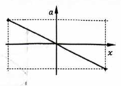
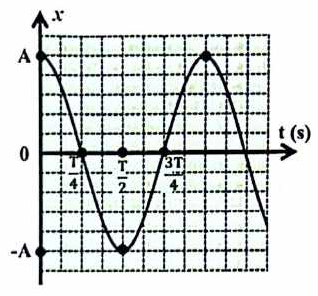
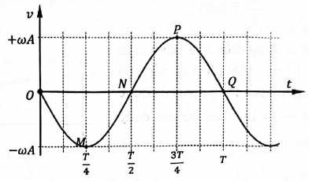
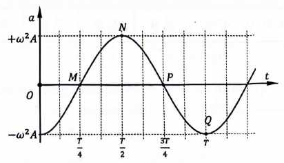
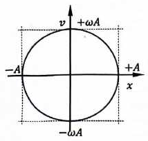

# Bài 2 — Li độ, vận tốc và gia tốc

## Mục tiêu

Sau bài này, bạn cần có thể:

1. Từ phương trình li độ suy ra phương trình vận tốc và gia tốc.
2. Xác định hướng của vectơ vận tốc và vectơ gia tốc tại mọi vị trí.
3. Nhận ra vị trí có tốc độ cực đại, cực tiểu; gia tốc cực đại, cực tiểu.
4. Sử dụng đúng các hệ thức liên hệ giữa $x$, $v$, $a$ mà không cần biết thời gian.
5. Đọc và liên hệ được đồ thị $x-t$, $v-t$, $a-t$.
6. Xử lí các bài cho hai trạng thái khác nhau của cùng một dao động.
7. Tránh nhầm **vận tốc** với **tốc độ**, và tránh nhầm dấu của gia tốc với độ lớn của gia tốc.

## Kiến thức tiên quyết

Bạn cần đọc được phương trình chuẩn

$$
x=A\cos(\omega t+\varphi),\qquad A>0,\ \omega>0.
$$

Trong đó $x$ là li độ, $A$ là biên độ, $\omega$ là tần số góc và $\varphi$ là pha ban đầu.

## 1. Từ li độ đến vận tốc

Vận tốc tức thời là đạo hàm của li độ theo thời gian:

$$
v=x'.
$$

Với $x=A\cos(\omega t+\varphi)$, ta có

$$
v=-\omega A\sin(\omega t+\varphi).
$$

Có thể viết dưới dạng cos:

$$
v=\omega A\cos\left(\omega t+\varphi+\frac{\pi}{2}\right).
$$

### Ý nghĩa về pha

So với li độ, vận tốc **sớm pha $\pi/2$**. Điều này không có nghĩa vận tốc luôn dương trước li độ; đây là quan hệ pha giữa hai hàm dao động cùng tần số góc.

### Giá trị cực đại của tốc độ

Từ $|\sin|\le 1$:

$$
|v|\le \omega A.
$$

Do đó:

- vận tốc cực đại: $v_{\max}=+\omega A$;
- vận tốc cực tiểu: $v_{\min}=-\omega A$;
- tốc độ cực đại: $|v|_{\max}=\omega A$;
- tốc độ nhỏ nhất: $|v|_{\min}=0$.

!!! note "Vận tốc và tốc độ"
    Vận tốc $v$ có dấu. Tốc độ là $|v|$ nên không âm. Khi đề hỏi "tốc độ cực đại", đáp án là $\omega A$, không phải $\pm\omega A$.

## 2. Hướng chuyển động qua dấu của vận tốc

Trên trục $Ox$:

- $v>0$: vật chuyển động theo chiều dương;
- $v<0$: vật chuyển động theo chiều âm;
- $v=0$: vật đang ở một trong hai vị trí biên.

Tại vị trí cân bằng $x=0$, tốc độ đạt cực đại. Tại hai biên $x=\pm A$, tốc độ bằng $0$.

### Trực giác

Vật phải dừng lại trong một khoảnh khắc ở biên để đổi chiều, nên $v=0$ tại biên. Khi đi qua vị trí cân bằng, vật đã được lực kéo về gia tốc trong nửa quãng trước đó nên có tốc độ lớn nhất.

## 3. Gia tốc trong dao động điều hòa

Gia tốc là đạo hàm của vận tốc:

$$
a=v'=x''.
$$

Từ phương trình vận tốc:

$$
a=-\omega^2A\cos(\omega t+\varphi).
$$

Do $x=A\cos(\omega t+\varphi)$ nên có hệ thức đặc biệt quan trọng:

$$
\boxed{a=-\omega^2x}.
$$

Đây là dấu hiệu động học cốt lõi của dao động điều hòa.

### Ý nghĩa của dấu âm

Gia tốc luôn hướng về vị trí cân bằng:

- nếu $x>0$ thì $a<0$;
- nếu $x<0$ thì $a>0$;
- nếu $x=0$ thì $a=0$.

Nói cách khác, khi $x\ne0$, vectơ gia tốc ngược hướng với vectơ li độ; tại vị trí cân bằng $x=0$ thì $a=0$.

<!-- ch1-source-figure: b2-acceleration-position -->
[{ .pdf-source-figure loading=lazy width="239" height="170" }](../assets/theory-figures/01-oscillations/b2-acceleration-position.png)

*Hình — Dấu âm trong quan hệ gia tốc–li độ nhìn thấy được qua độ dốc của đường thẳng.*

Nửa đồ thị bên phải có $x>0$ nhưng $a<0$; nửa bên trái có $x<0$ nhưng $a>0$. Vì $a=-\omega^2x$, hệ số góc là $-\omega^2$ và vectơ gia tốc luôn hướng về vị trí cân bằng. Giao điểm hai trục ứng với $x=a=0$; điều đó không có nghĩa vận tốc cũng bằng không.
<!-- /ch1-source-figure: b2-acceleration-position -->

## 4. Cực trị của gia tốc

Từ $a=-\omega^2x$ và $|x|\le A$:

$$
|a|\le \omega^2A.
$$

Vì vậy:

- $a_{\max}=+\omega^2A$ tại $x=-A$;
- $a_{\min}=-\omega^2A$ tại $x=+A$;
- $|a|_{\max}=\omega^2A$ tại hai biên;
- $|a|_{\min}=0$ tại vị trí cân bằng.

## 5. Quan hệ pha giữa x, v và a

Ba đại lượng cùng dao động với tần số góc $\omega$ nhưng lệch pha nhau:

- $v$ sớm pha $\pi/2$ so với $x$;
- $a$ sớm pha $\pi/2$ so với $v$;
- $a$ ngược pha với $x$.

Một cách ghi nhớ:

$$
x\ \xrightarrow{+\pi/2}\ v\ \xrightarrow{+\pi/2}\ a.
$$

!!! warning "Bẫy thường gặp"
    Không được suy ra rằng $v$ và $a$ luôn cùng dấu vì $a$ "sớm pha" so với $v$. Dấu tức thời còn phụ thuộc vị trí và chiều chuyển động.

<!-- ch1-source-figure: b2-displacement-time -->
Ba đồ thị dưới đây cùng minh họa quy ước $x(0)=A$, $v(0)=0$. Hãy đối chiếu bằng các mốc $T/4$, $T/2$, $3T/4$ được in trên trục, không dóng theo vị trí điểm ảnh: tỉ lệ in của các hình gốc khác nhau.

[{ .pdf-source-figure loading=lazy width="318" height="296" }](../assets/theory-figures/01-oscillations/b2-displacement-time.png)

*Hình — Li độ xác định vị trí của vật ở từng mốc thời gian.*

Tại $t=0$, vật ở biên dương; tại $T/4$, vật qua O; tại $T/2$, vật đến biên âm. Sau đó hình lặp lại từ biên dương ở $t=T$. Đối chiếu hai hình tiếp theo để biết vật đi theo chiều nào và gia tốc hướng đâu.
<!-- /ch1-source-figure: b2-displacement-time -->

<!-- ch1-source-figure: b2-velocity-time -->
[{ .pdf-source-figure loading=lazy width="392" height="230" }](../assets/theory-figures/01-oscillations/b2-velocity-time.png)

*Hình — Khi li độ qua không, tốc độ đạt cực đại; dấu của vận tốc vẫn phải xét riêng.*

Ở điểm M của đồ thị, $t=T/4$ và $v=-\omega A$: vật qua O theo chiều âm. Tại P, $t=3T/4$ và $v=+\omega A$: vật cũng qua O nhưng theo chiều dương. Các điểm N và Q có $v=0$, tương ứng với hai biên chứ không phải vị trí cân bằng.
<!-- /ch1-source-figure: b2-velocity-time -->

<!-- ch1-source-figure: b2-acceleration-time -->
[{ .pdf-source-figure loading=lazy width="412" height="236" }](../assets/theory-figures/01-oscillations/b2-acceleration-time.png)

*Hình — Gia tốc ngược pha với li độ, không ngược pha với vận tốc.*

Tại $t=0$ và $t=T$, li độ bằng $A$ nhưng gia tốc bằng $-\omega^2A$. Tại $T/2$, li độ bằng $-A$ và gia tốc đạt $+\omega^2A$. Hai lần qua O ở $T/4$ và $3T/4$ đều có $a=0$ trong khi tốc độ lớn nhất. Các mốc này cho thấy rõ $a=-\omega^2x$ và quan hệ sớm pha $\pi/2$ giữa $v$ với $x$.
<!-- /ch1-source-figure: b2-acceleration-time -->

## 6. Khi nào vật nhanh dần, chậm dần?

Xét dấu của $v$ và $a$:

- $va>0$: vận tốc và gia tốc cùng dấu → tốc độ tăng → vật **nhanh dần**;
- $va<0$: vận tốc và gia tốc trái dấu → tốc độ giảm → vật **chậm dần**.

Do gia tốc luôn hướng về vị trí cân bằng:

- vật đi **từ biên về vị trí cân bằng**: nhanh dần;
- vật đi **từ vị trí cân bằng ra biên**: chậm dần.

## 7. Hệ thức độc lập thời gian giữa x và v

Từ

$$
x=A\cos\Phi,\qquad v=-\omega A\sin\Phi,
$$

với $\Phi=\omega t+\varphi$, bình phương rồi cộng cho ta:

$$
\boxed{\frac{x^2}{A^2}+\frac{v^2}{\omega^2A^2}=1}.
$$

Các dạng tương đương:

$$
\begin{aligned}
&v^2=\omega^2(A^2-x^2)\\
&|v|=\omega\sqrt{A^2-x^2},
\end{aligned}
$$

$$
A^2=x^2+\frac{v^2}{\omega^2}.
$$

### Khi nào dùng?

Dùng khi đề cho trạng thái tại một thời điểm bằng $x$ và $v$ nhưng không cho $t$, hoặc khi cần loại bỏ pha.

### Điều gì còn thiếu?

Công thức $v^2=\omega^2(A^2-x^2)$ chỉ cho **độ lớn** của vận tốc. Muốn xác định dấu của $v$, cần thêm thông tin về chiều chuyển động.

<!-- ch1-source-figure: b2-velocity-position -->
[{ .pdf-source-figure loading=lazy width="214" height="205" }](../assets/theory-figures/01-oscillations/b2-velocity-position.png)

*Hình — Một li độ ở bên trong quỹ đạo thường ứng với hai dấu của vận tốc.*

Giữ một giá trị $x$ rồi xét hai giao điểm với đường khép kín: điểm phía trên trục hoành có $v>0$, điểm phía dưới có $v<0$. Chúng biểu diễn cùng vị trí nhưng hai chiều chuyển động khác nhau. Hình gốc chọn tỉ lệ hai trục làm đường trông gần tròn; về quan hệ đại lượng, đó vẫn là elip $x^2/A^2+v^2/(\omega^2A^2)=1$. Không so trực tiếp độ dài trên trục $x$ với độ dài trên trục $v$ vì hai trục biểu diễn các đại lượng khác đơn vị.
<!-- /ch1-source-figure: b2-velocity-position -->

## 8. Hệ thức giữa x và a

Do $a=-\omega^2x$:

$$
\omega^2=-\frac{a}{x}\qquad (x\ne0).
$$

Nếu biết hai trạng thái $(x_1,a_1)$ và $(x_2,a_2)$ của cùng một dao động, về lí thuyết phải có:

$$
\frac{a_1}{x_1}=\frac{a_2}{x_2}=-\omega^2.
$$

Đây cũng là cách kiểm tra nhanh dữ kiện có nhất quán hay không.

## 9. Hệ thức giữa v và a

Thay $x=-a/\omega^2$ vào hệ thức $x-v$:

$$
\boxed{\frac{v^2}{\omega^2A^2}+\frac{a^2}{\omega^4A^2}=1}.
$$

Hay:

$$
A^2=\frac{v^2}{\omega^2}+\frac{a^2}{\omega^4}.
$$

## 10. Xác định ω từ hai trạng thái

### Trường hợp biết (x₁, v₁) và (x₂, v₂)

Từ

$$
v_1^2=\omega^2(A^2-x_1^2),\qquad v_2^2=\omega^2(A^2-x_2^2),
$$

lấy hai phương trình trừ nhau:

$$
\boxed{\omega^2=\frac{v_1^2-v_2^2}{x_2^2-x_1^2}}.
$$

Điều kiện: $x_1^2\ne x_2^2$. Kết quả phải cho $\omega^2>0$; nếu không, hai trạng thái không phù hợp với cùng một dao động điều hòa theo dữ kiện đã cho.

### Trường hợp biết (v₁, a₁) và (v₂, a₂)

Từ hệ thức $v-a$:

$$
\boxed{\omega^2=\frac{a_1^2-a_2^2}{v_2^2-v_1^2}}.
$$

Điều kiện: $v_1^2\ne v_2^2$. Kết quả phải cho $\omega^2>0$; cần kiểm tra dấu và đơn vị trước khi lấy căn.

## 11. Đồ thị x–t, v–t và a–t

Ba đồ thị đều là các đường hình sin/cos có cùng chu kì $T$.

Nếu chọn $x=A\cos\omega t$ thì:

- $x$ bắt đầu tại $+A$;
- $v=-\omega A\sin\omega t$ bắt đầu tại $0$ và đi theo chiều âm;
- $a=-\omega^2A\cos\omega t$ bắt đầu tại $-\omega^2A$.

### Đọc đồ thị li độ

Từ đồ thị $x-t$, có thể xác định:

- $A$: tung độ cực đại theo trị tuyệt đối;
- $T$: khoảng thời gian giữa hai trạng thái lặp lại gần nhất;
- dấu $v$: dựa vào độ dốc của đồ thị $x-t$;
- dấu $a$: ngược dấu với $x$.

### Đọc đồ thị vận tốc

Từ đồ thị $v-t$:

- biên độ vận tốc là $\omega A$;
- lúc $v=0$, vật ở biên;
- lúc $|v|$ cực đại, vật qua vị trí cân bằng.

## 12. Đồ thị quan hệ v–x

Hệ thức

$$
\frac{x^2}{A^2}+\frac{v^2}{\omega^2A^2}=1
$$

là phương trình một elip trong mặt phẳng $(x,v)$.

Các giao điểm với trục:

- trục $x$: $x=\pm A$;
- trục $v$: $v=\pm\omega A$.

Đường elip này mô tả toàn bộ trạng thái động học có thể có của vật trong một dao động điều hòa.

## 13. Đồ thị quan hệ a–x

Từ $a=-\omega^2x$, đồ thị $a$ theo $x$ là đường thẳng đi qua gốc tọa độ có hệ số góc $-\omega^2$.

Đây là một dấu hiệu rất mạnh: nếu thí nghiệm cho đồ thị $a-x$ là đường thẳng qua gốc có hệ số góc âm, chuyển động phù hợp với mô hình dao động điều hòa.

## Ví dụ 1 — Tính trạng thái từ phương trình

Một vật dao động theo

$$
x=5\cos\left(4\pi t-\frac{\pi}{3}\right)\text{ cm}.
$$

Tại $t=\frac{1}{12}\,\mathrm s$, xác định $x$, $v$, $a$.

### Giải

Pha tại thời điểm xét là $\Phi=4\pi\cdot\frac{1}{12}-\frac{\pi}{3}=0$.

Do đó $x=5\,\mathrm{cm}$, $v=0$ và $a=-\omega^2x=-(4\pi)^2\cdot5\,\mathrm{cm/s^2}$.

Vật đang ở biên dương và chuẩn bị chuyển động theo chiều âm.

## Ví dụ 2 — Tìm tốc độ từ li độ

Vật dao động với $A=8\,\mathrm{cm}$, $\omega=5\,\mathrm{rad/s}$. Khi $x=4\,\mathrm{cm}$, tốc độ là

$$
|v|=\omega\sqrt{A^2-x^2}=5\sqrt{64-16}=20\sqrt3\text{ cm/s}.
$$

Nếu đề nói vật đang đi theo chiều âm thì $v=-20\sqrt3\,\mathrm{cm/s}$.

## Ví dụ 3 — Tìm tần số góc từ hai trạng thái

Tại hai thời điểm, vật có $(x_1,v_1)=(3\text{ cm},40\text{ cm/s})$ và $(x_2,v_2)=(4\text{ cm},30\text{ cm/s})$.

Ta có

$$
\omega^2=\frac{40^2-30^2}{4^2-3^2}=100,
$$

nên $\omega=10\,\mathrm{rad/s}$.

Biên độ được suy ra từ $A^2=x_1^2+v_1^2/\omega^2=25$, do đó $A=5\,\mathrm{cm}$.

## Phản ví dụ

Một chuyển động có $a=-4x+2$ không thỏa trực tiếp dạng $a=-\omega^2x$ với gốc tọa độ đang chọn. Không được kết luận ngay đây là dao động điều hòa quanh $x=0$. Nếu đổi gốc tọa độ về vị trí cân bằng mới, bài toán có thể trở thành dao động điều hòa.

## Phân dạng

> Đây là cách phân loại phục vụ mục đích sư phạm, không phải phân loại học thuật chính thức.

### Dạng 1 — Từ phương trình li độ suy ra v và a

**Dấu hiệu:** đề cho $x(t)$ và hỏi vận tốc, gia tốc, cực trị hoặc trạng thái tại thời điểm.

**Phương pháp:** đọc $A,\omega,\varphi$ → viết $v(t)$ → dùng $a=-\omega^2x$ nếu tiện.

### Dạng 2 — Quan hệ trạng thái x–v–a

**Dấu hiệu:** đề không cho thời gian hoặc cho trạng thái ở một vài thời điểm.

**Phương pháp:** ưu tiên $v^2=\omega^2(A^2-x^2)$ và $a=-\omega^2x$.

### Dạng 3 — Đọc đồ thị

**Dấu hiệu:** đề cho đồ thị $x-t$, $v-t$, $a-t$, $v-x$ hoặc $a-x$.

**Phương pháp:** xác định biên độ và chu kì trước; sau đó dùng quan hệ pha và dấu.

## Bẫy thường gặp

!!! danger "Sai lầm 1"
    Từ $v^2=\omega^2(A^2-x^2)$ suy ra ngay $v=+\omega\sqrt{A^2-x^2}$. Đúng phải là $v=\pm\omega\sqrt{A^2-x^2}$; dấu phụ thuộc chiều chuyển động.

!!! danger "Sai lầm 2"
    Cho rằng gia tốc lớn nhất ở vị trí cân bằng. Thực tế tại vị trí cân bằng $a=0$; độ lớn gia tốc lớn nhất ở hai biên.

!!! warning "Sai lầm 3"
    Nhầm $a_{\max}$ với $|a|_{\max}$. $a_{\max}=+\omega^2A$, còn giá trị nhỏ nhất của gia tốc là $-\omega^2A$.

## Bài tập nhanh

1. Vật dao động với $A=6\,\mathrm{cm}$, $\omega=4\,\mathrm{rad/s}$. Tính tốc độ cực đại và độ lớn gia tốc cực đại.
2. Với $x=3\,\mathrm{cm}$, $A=5\,\mathrm{cm}$, $\omega=10\,\mathrm{rad/s}$, tính tốc độ.
3. Một vật có $a=-100x$ khi dùng cùng đơn vị SI. Xác định $\omega$ và $T$.
4. Tại một thời điểm $x>0$ và $v>0$. Vật đang nhanh dần hay chậm dần?
5. Một đồ thị $a-x$ có hệ số góc $-64\,\mathrm s$⁻². Tìm tần số góc.

### Đáp án nhanh

1. $24\,\mathrm{cm/s}$; $96\,\mathrm{cm/s^2}$.
2. $40\,\mathrm{cm/s}$.
3. $\omega=10\,\mathrm{rad/s}$; $T=\pi/5\,\mathrm s$.
4. Chậm dần vì $a<0$ và $v>0$.
5. $8\,\mathrm{rad/s}$.

## Tóm tắt

Ba phương trình quan trọng:

$$
x=A\cos\Phi,\qquad v=-\omega A\sin\Phi,\qquad a=-\omega^2A\cos\Phi,
$$

với $\Phi=\omega t+\varphi$.

Hai hệ thức cần thuộc bản chất:

$$
\begin{aligned}
&a=-\omega^2x\\
&v^2=\omega^2(A^2-x^2).
\end{aligned}
$$

## 5 điều cần nhớ

1. Vận tốc sớm pha $\pi/2$ so với li độ.
2. Gia tốc ngược pha với li độ và luôn hướng về vị trí cân bằng.
3. Tốc độ lớn nhất tại vị trí cân bằng; bằng $0$ tại biên.
4. Độ lớn gia tốc lớn nhất tại biên; bằng $0$ tại vị trí cân bằng.
5. Hệ thức $x-v-a$ giúp giải nhiều bài mà không cần tìm thời gian.

<!-- LESSON_PRACTICE_LINKS -->
## Luyện tập sau bài

- [Bài tập theo bài](practice/02-displacement-velocity-acceleration/exercises.md)
- [Đáp án và lời giải](practice/02-displacement-velocity-acceleration/solutions.md)

---

[← Bài 1](01-harmonic-oscillation-foundations.md) | [↑ Chương](index.md) | [Bài 3 →](03-phase-circle-time-distance.md)
