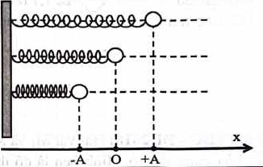
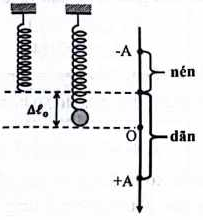
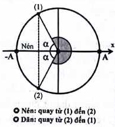
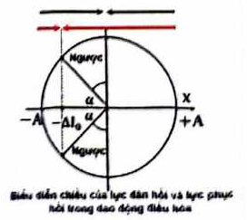
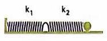
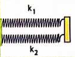

# Bài 4 — Con lắc lò xo

## Mục tiêu

Bạn cần làm được các việc sau:

- nhận biết khi nào hệ vật–lò xo có thể xem là dao động điều hòa;
- dùng đúng $\omega$, $T$, $f$ của con lắc lò xo;
- phân biệt chiều dài tự nhiên, chiều dài cân bằng, độ biến dạng và li độ;
- tính lực đàn hồi trong con lắc ngang và con lắc treo thẳng đứng;
- xử lí thay đổi khối lượng, độ cứng, ghép và cắt lò xo;
- giải các bài thời gian lò xo dãn/nén;
- vận dụng bảo toàn năng lượng và các tình huống biến đổi đột ngột của hệ.

## 1. Cấu tạo và mô hình

Con lắc lò xo lí tưởng gồm vật nhỏ khối lượng $m$ gắn với lò xo nhẹ có độ cứng $k$. Khi bỏ qua ma sát và lực cản, nếu xét li độ từ vị trí cân bằng, phương trình động lực học có dạng

$$
ma=-kx.
$$

<!-- ch1-source-figure: b4-horizontal-spring-positions -->
[{ .pdf-source-figure loading=lazy width="326" height="207" }](../assets/theory-figures/01-oscillations/b4-horizontal-spring-positions.png)

*Hình — Ba hàng là ba trạng thái của cùng một con lắc, không phải ba hệ ghép với nhau.*

Hàng trên ứng với biên dương, hàng giữa với O, hàng dưới với biên âm. Trục ở dưới cho biết $x$ được đo từ O và chiều dương hướng sang phải. Với cấu hình ngang lí tưởng này, vị trí cân bằng trùng chiều dài tự nhiên; nhận xét đó không tự động áp dụng cho lò xo treo đứng.
<!-- /ch1-source-figure: b4-horizontal-spring-positions -->

Suy ra

$$
a=-\frac{k}{m}x.
$$

So sánh với $a=-\omega^2x$:

$$
\boxed{\omega=\sqrt{\frac{k}{m}}}.
$$

Do đó

$$
\boxed{T=2\pi\sqrt{\frac{m}{k}}},\qquad
\boxed{f=\frac{1}{2\pi}\sqrt{\frac{k}{m}}}.
$$

### Ý nghĩa

Chu kì chỉ phụ thuộc vào cấu tạo của hệ thông qua $m$ và $k$, không phụ thuộc biên độ nếu mô hình lò xo tuyến tính và các điều kiện lí tưởng còn đúng.

## 2. Ảnh hưởng của m và k

Từ $T\propto\sqrt{m/k}$:

- tăng khối lượng → chu kì tăng;
- tăng độ cứng → chu kì giảm;
- khối lượng tăng $n$ lần → chu kì tăng $\sqrt n$ lần;
- độ cứng tăng $n$ lần → chu kì giảm $\sqrt n$ lần.

### Phương pháp tỉ lệ

Nếu chỉ thay khối lượng:

$$
\frac{T_1}{T_2}=\sqrt{\frac{m_1}{m_2}}.
$$

Nếu chỉ thay độ cứng:

$$
\frac{T_1}{T_2}=\sqrt{\frac{k_2}{k_1}}.
$$

## 3. Con lắc lò xo treo thẳng đứng

Khi treo vật, lò xo dãn một đoạn $\Delta\ell_0$ ở vị trí cân bằng. Điều kiện cân bằng:

$$
k\Delta\ell_0=mg.
$$

Do đó

$$
\frac{k}{m}=\frac{g}{\Delta\ell_0}.
$$

Suy ra một dạng rất hữu ích:

$$
\begin{aligned}
&\boxed{\omega=\sqrt{\frac{g}{\Delta\ell_0}}}\\
&\boxed{T=2\pi\sqrt{\frac{\Delta\ell_0}{g}}}.
\end{aligned}
$$

!!! note "Điểm quan trọng"
    Trọng lực làm thay đổi vị trí cân bằng nhưng không xuất hiện trực tiếp trong công thức $\omega=\sqrt{k/m}$ khi li độ được đo từ vị trí cân bằng.

<!-- ch1-source-figure: b4-vertical-spring-reference -->
[{ .pdf-source-figure loading=lazy width="203" height="220" }](../assets/theory-figures/01-oscillations/b4-vertical-spring-reference.png)

*Hình — Vị trí lò xo không biến dạng nằm phía trên vị trí cân bằng một đoạn độ dãn cân bằng.*

Đường ngang qua đầu lò xo chưa treo vật là mốc chiều dài tự nhiên; đường ngang qua O là mốc li độ của dao động. Khoảng cách giữa hai mức là $\Delta\ell_0$ và được xác định bởi $k\Delta\ell_0=mg$. Chọn chiều dương hướng xuống như hình thì mức tự nhiên có li độ $-\Delta\ell_0$, còn độ dãn tại li độ $x$ là $\Delta\ell_0+x$. Phần chú thích nén/dãn trong hình minh họa trường hợp $A>\Delta\ell_0$, không phải mọi biên độ.
<!-- /ch1-source-figure: b4-vertical-spring-reference -->

## 4. Chiều dài của lò xo trong dao động

Gọi:

- $\ell_0$: chiều dài tự nhiên;
- $\ell_{cb}$: chiều dài tại vị trí cân bằng;
- $x$: li độ tính từ vị trí cân bằng, chọn chiều dương theo chiều lò xo dãn thêm.

Với con lắc treo thẳng đứng:

$$
\begin{aligned}
&\ell_{cb}=\ell_0+\Delta\ell_0\\
&\ell=\ell_{cb}+x.
\end{aligned}
$$

Do $-A\le x\le A$:

$$
\begin{aligned}
&\ell_{\max}=\ell_{cb}+A\\
&\ell_{\min}=\ell_{cb}-A.
\end{aligned}
$$

Vì vậy:

$$
\boxed{A=\frac{\ell_{\max}-\ell_{\min}}{2}}.
$$

## 5. Lực đàn hồi

Trong giới hạn đàn hồi tuyến tính của lò xo, độ lớn lực đàn hồi tuân theo định luật Hooke:

$$
F_{dh}=k|\Delta\ell|.
$$

Điểm dễ nhầm là $\Delta\ell$ là **độ biến dạng so với chiều dài tự nhiên**, không nhất thiết bằng li độ $x$.

### Con lắc ngang

Nếu vị trí cân bằng trùng trạng thái lò xo không biến dạng:

$$
\Delta\ell=x.
$$

Do đó:

$$
F_{dh}=k|x|.
$$

Lực đàn hồi cực đại là $kA$, nhỏ nhất bằng $0$ tại vị trí cân bằng.

### Con lắc treo thẳng đứng

Với chiều dương hướng xuống:

$$
\Delta\ell=\Delta\ell_0+x.
$$

Do đó:

$$
F_{dh}=k|\Delta\ell_0+x|.
$$

Lực đàn hồi không nhất thiết nhỏ nhất tại vị trí cân bằng.

## 6. Khi nào lò xo luôn dãn? Khi nào có lúc bị nén?

Con lắc treo thẳng đứng có độ biến dạng nhỏ nhất ở biên trên:

$$
\Delta\ell_{\min}=\Delta\ell_0-A.
$$

- Nếu $A<\Delta\ell_0$: lò xo luôn dãn.
- Nếu $A=\Delta\ell_0$: tại biên trên lò xo vừa trở về chiều dài tự nhiên.
- Nếu $A>\Delta\ell_0$: trong một phần chu kì lò xo bị nén.

Điều kiện lò xo dãn là $\Delta\ell_0+x>0$; điều kiện lò xo nén là $\Delta\ell_0+x<0$. Từ đây có thể dùng đường tròn lượng giác để tính thời gian dãn/nén.

<!-- ch1-source-figure: b4-compression-phase-interval -->
[{ .pdf-source-figure loading=lazy width="196" height="217" }](../assets/theory-figures/01-oscillations/b4-compression-phase-interval.png)

*Hình — Thời gian lò xo nén là thời gian hình chiếu nằm phía trên mức chiều dài tự nhiên.*

Với quy ước li độ hướng xuống, lò xo nén khi $x<-\Delta\ell_0$. Trên đường tròn, đó là cung từ (1) qua biên âm đến (2), đúng miền được ghi “Nén”; cung còn lại ứng với lò xo dãn. Hai điểm giới hạn là lúc lò xo vừa không biến dạng, không phải lúc vật qua O. Sau khi xác định cung, đổi góc quét sang radian rồi chia cho $\omega$ để tìm thời gian.
<!-- /ch1-source-figure: b4-compression-phase-interval -->

## 7. Lực kéo về và lực đàn hồi khác nhau thế nào?

Lực kéo về là hợp lực gây gia tốc dao động, có dạng

$$
F_{kv}=ma=-m\omega^2x=-kx.
$$

Nó luôn hướng về vị trí cân bằng và bằng $0$ tại vị trí cân bằng.

Với con lắc treo thẳng đứng, lực đàn hồi riêng của lò xo tại vị trí cân bằng có độ lớn $mg$, nên **lực đàn hồi không bằng lực kéo về**. Hợp lực của lực đàn hồi và trọng lực mới tạo thành lực kéo về.

<!-- ch1-source-figure: b4-elastic-restoring-directions -->
[{ .pdf-source-figure loading=lazy width="272" height="243" }](../assets/theory-figures/01-oscillations/b4-elastic-restoring-directions.png)

*Hình — Lực kéo về hướng về O, còn lực đàn hồi hướng về trạng thái lò xo không biến dạng.*

Mũi tên đen hội tụ về O, còn mũi tên đỏ hội tụ về mốc $x=-\Delta\ell_0$. Trong khoảng $-\Delta\ell_0<x<0$, vật ở trên O nhưng lò xo vẫn dãn: lực đàn hồi hướng lên, còn hợp lực kéo về hướng xuống. Trục $x$ được đặt nằm ngang trên giản đồ để biểu diễn các miền li độ; quy ước vật lí vẫn là chiều dương hướng xuống của lò xo treo đứng. Hai lực không cùng mốc triệt tiêu nên không thể đồng nhất $F_{dh}$ với $F_{kv}$.
<!-- /ch1-source-figure: b4-elastic-restoring-directions -->

## 8. Năng lượng của con lắc lò xo

Động năng:

$$
W_d=\frac12mv^2=\frac12m\omega^2(A^2-x^2).
$$

Nếu chọn mốc thế năng của **hệ dao động** tại vị trí cân bằng, phần thế năng biến thiên theo li độ có dạng

$$
W_t=\frac12kx^2.
$$

Với con lắc nằm ngang có vị trí cân bằng trùng trạng thái lò xo không biến dạng, đây chính là thế năng đàn hồi. Với con lắc treo thẳng đứng, $\tfrac12kx^2$ là thế năng của hệ sau khi gộp thế năng đàn hồi và thế năng trọng trường rồi bỏ hằng số; thế năng đàn hồi riêng của lò xo vẫn phụ thuộc độ biến dạng so với chiều dài tự nhiên.

Cơ năng:

$$
\boxed{W=\frac12kA^2=\frac12m\omega^2A^2}.
$$

Khi không có lực cản, cơ năng không đổi.

## 9. Quan hệ động năng — thế năng theo vị trí

Tỉ số

$$
\frac{W_d}{W_t}=\frac{A^2-x^2}{x^2}.
$$

Nếu $W_d=nW_t$ thì:

$$
A^2-x^2=nx^2,
$$

suy ra

$$
\boxed{|x|=\frac{A}{\sqrt{n+1}}}.
$$

Đây là dạng xuất hiện rất thường xuyên.

## 10. Ghép lò xo

### Ghép nối tiếp

<!-- ch1-source-figure: b4-series-springs -->
[{ .pdf-source-figure loading=lazy width="184" height="70" }](../assets/theory-figures/01-oscillations/b4-series-springs.png)

*Hình — Ghép nối tiếp: lực được truyền qua cả hai đoạn trên cùng một chuỗi.*

Một đầu của lò xo thứ nhất nối với giá, đầu còn lại nối với lò xo thứ hai rồi mới đến vật. Với lò xo lí tưởng, hai đoạn chịu cùng độ lớn lực, còn tổng độ biến dạng bằng tổng độ biến dạng của từng đoạn. Vì vậy phải cộng các nghịch đảo độ cứng, không cộng trực tiếp $k_1+k_2$.
<!-- /ch1-source-figure: b4-series-springs -->

Với hai lò xo:

$$
\boxed{\frac1{k_{nt}}=\frac1{k_1}+\frac1{k_2}}.
$$

Suy ra

$$
k_{nt}=\frac{k_1k_2}{k_1+k_2}.
$$

### Ghép song song

<!-- ch1-source-figure: b4-parallel-springs -->
[{ .pdf-source-figure loading=lazy width="128" height="97" }](../assets/theory-figures/01-oscillations/b4-parallel-springs.png)

*Hình — Ghép song song: hai lò xo cùng dịch chuyển ở đầu nối chung.*

Thanh bên phải buộc hai đầu lò xo có cùng độ dịch chuyển theo phương dao động. Lực do hai lò xo tạo ra được cộng lại, nên độ cứng tương đương bằng tổng hai độ cứng. Cấu trúc nối chung hai đầu này khác hẳn chuỗi nối tiếp ở hình trước.
<!-- /ch1-source-figure: b4-parallel-springs -->

$$
\boxed{k_{ss}=k_1+k_2}.
$$

Sau khi tìm $k_{eq}$, coi hệ như một con lắc lò xo duy nhất:

$$
T=2\pi\sqrt{\frac{m}{k_{eq}}}.
$$

## 11. Cắt một lò xo đồng chất

Với lò xo đồng chất, độ cứng tỉ lệ nghịch với chiều dài:

$$
k\ell=\text{hằng số}.
$$

Nếu lò xo ban đầu dài $\ell_0$, độ cứng $k_0$, cắt lấy đoạn dài $\ell$ thì

$$
\boxed{k=k_0\frac{\ell_0}{\ell}}.
$$

Đoạn càng ngắn thì càng cứng.

## 12. Thay đổi khối lượng bằng phương pháp chu kì

Vì

$$
T^2=4\pi^2\frac{m}{k},
$$

nếu cùng một lò xo lần lượt gắn các khối lượng khác nhau, $T^2$ tỉ lệ tuyến tính với $m$.

Ví dụ, nếu $m_3=a m_1+b m_2$ thì:

$$
T_3^2=aT_1^2+bT_2^2.
$$

Quan hệ này giúp giải nhanh các bài tìm khối lượng chưa biết.

## 13. Thay đổi cấu trúc hệ trong lúc dao động

Một số bài nâng cao mô tả hệ bị thay đổi đột ngột: giữ một điểm trên lò xo, vật va chạm mềm, vật rơi vào vật đang gắn lò xo, hoặc thay đổi phần lò xo hoạt động.

Nguyên tắc chung:

1. Trạng thái ngay trước biến cố xác định bởi $x$ và $v$.
2. Tại thời điểm biến cố, vị trí thường chưa kịp thay đổi.
3. Sau biến cố, cần xác định **vị trí cân bằng mới**, $\omega'$ và vận tốc ban đầu mới.
4. Nếu sau biến cố hệ mới vẫn dao động điều hòa, biên độ mới được tính bằng

$$
A'^2=x'^2+\frac{v'^2}{\omega'^2},
$$

trong đó $x'$ phải đo từ vị trí cân bằng mới.

!!! danger "Bẫy nâng cao"
    Không được lấy li độ cũ làm li độ mới nếu vị trí cân bằng thay đổi sau biến cố.

## Ví dụ 1 — Tìm k từ chu kì

Vật $m=0,20\,\mathrm{kg}$ dao động với $T=0,40\,\mathrm s$. Lấy $\pi^2\approx10$.

Từ $T=2\pi\sqrt{m/k}$:

$$
k=\frac{4\pi^2m}{T^2}=\frac{4\cdot10\cdot0,20}{0,16}=50\text{ N/m}.
$$

## Ví dụ 2 — Lò xo treo thẳng đứng

Tại vị trí cân bằng, lò xo dãn $2,5\,\mathrm{cm}$. Lấy $g=10\,\mathrm{m/s^2}$.

Ta có

$$
\omega=\sqrt{\frac{g}{\Delta\ell_0}}=\sqrt{\frac{10}{0,025}}=20\text{ rad/s}.
$$

Do đó $T=2\pi/20=\pi/10\,\mathrm s$.

## Ví dụ 3 — Khi động năng gấp ba thế năng

Nếu $W_d=3W_t$ thì

$$
|x|=\frac{A}{\sqrt{4}}=\frac{A}{2}.
$$

Trong một chu kì vật đi qua hai vị trí $x=\pm A/2$, mỗi vị trí hai lần.

## Ví dụ 4 — Cắt lò xo

Lò xo dài $60\,\mathrm{cm}$ có độ cứng $30\,\mathrm{N/m}$. Cắt lấy đoạn dài $20\,\mathrm{cm}$:

$$
k'=30\cdot\frac{60}{20}=90\text{ N/m}.
$$

Nếu giữ nguyên vật, chu kì mới bằng $1/\sqrt3$ lần chu kì cũ.

## Phân dạng

> Đây là cách phân loại phục vụ mục đích sư phạm, không phải phân loại học thuật chính thức.

### Dạng 1 — Chu kì, tần số, thay đổi m hoặc k

Đưa bài về $T^2\propto m/k$ trước khi thay số.

### Dạng 2 — Chiều dài và độ biến dạng

Tách rõ $\ell_0$, $\Delta\ell_0$, $x$ và $\ell$.

### Dạng 3 — Lực đàn hồi

Xác định độ biến dạng so với chiều dài tự nhiên, không dùng li độ một cách máy móc.

### Dạng 4 — Năng lượng

Ưu tiên $W=\frac12kA^2$ và $W_t=\frac12kx^2$ khi tọa độ đo từ vị trí cân bằng.

### Dạng 5 — Ghép/cắt lò xo

Tìm $k_{eq}$ trước, sau đó mới xử lí như một con lắc lò xo thông thường.

### Dạng 6 — Hệ thay đổi đột ngột

Xác định trạng thái tại thời điểm biến đổi → lập hệ mới → tìm biên độ, pha mới.

## Bẫy thường gặp

!!! danger "Sai lầm 1"
    Với con lắc treo thẳng đứng, dùng $F_{dh}=k|x|$. Đúng phải dùng độ biến dạng so với chiều dài tự nhiên: $F_{dh}=k|\Delta\ell_0+x|$.

!!! danger "Sai lầm 2"
    Cho rằng trọng lực làm thay đổi chu kì theo công thức riêng. Khi dùng $T=2\pi\sqrt{m/k}$, trọng lực không xuất hiện.

!!! warning "Sai lầm 3"
    Lò xo bị cắt ngắn nhưng vẫn giữ nguyên $k$. Với lò xo đồng chất, $k$ tăng khi chiều dài giảm.

## Bài tập nhanh

1. $m=100$ g, $k=40\,\mathrm{N/m}$. Tính $\omega$.
2. Một lò xo treo thẳng đứng dãn $4\,\mathrm{cm}$ tại vị trí cân bằng. Lấy $g=10\,\mathrm{m/s^2}$. Tính $\omega$.
3. Hai lò xo $k_1=60\,\mathrm{N/m}$, $k_2=30\,\mathrm{N/m}$ ghép nối tiếp. Tính $k_{eq}$.
4. Với $A=6\,\mathrm{cm}$, tại vị trí nào động năng bằng thế năng?
5. Lò xo dài $80\,\mathrm{cm}$ có $k=25\,\mathrm{N/m}$. Cắt lấy đoạn $20\,\mathrm{cm}$. Tìm độ cứng đoạn mới.

### Đáp án nhanh

1. $20\,\mathrm{rad/s}$.
2. $5\sqrt{10}\,\mathrm{rad/s}$.
3. $20\,\mathrm{N/m}$.
4. $|x|=3\sqrt2\,\mathrm{cm}$.
5. $100\,\mathrm{N/m}$.

## Tóm tắt

Ba công thức trung tâm:

$$
\omega=\sqrt{\frac{k}{m}},\qquad T=2\pi\sqrt{\frac{m}{k}},\qquad W=\frac12kA^2.
$$

Với con lắc treo thẳng đứng:

$$
k\Delta\ell_0=mg.
$$

Lực đàn hồi phải tính từ độ biến dạng thực của lò xo, còn lực kéo về tính từ li độ so với vị trí cân bằng.

## 5 điều cần nhớ

1. Chu kì phụ thuộc $m$ và $k$, không phụ thuộc biên độ trong mô hình lí tưởng.
2. Lực đàn hồi và lực kéo về không phải lúc nào cũng là một lực.
3. Với lò xo treo thẳng đứng, phân biệt $\Delta\ell_0$ và $x$.
4. Ghép/cắt lò xo phải quy về độ cứng tương đương.
5. Khi hệ thay đổi đột ngột, phải tìm lại vị trí cân bằng và tần số góc.

<!-- LESSON_PRACTICE_LINKS -->
## Luyện tập sau bài

- [Bài tập theo bài](practice/04-spring-oscillator/exercises.md)
- [Đáp án và lời giải](practice/04-spring-oscillator/solutions.md)

---

[← Bài 3](03-phase-circle-time-distance.md) | [↑ Chương](index.md) | [Bài 5 →](05-simple-pendulum.md)
