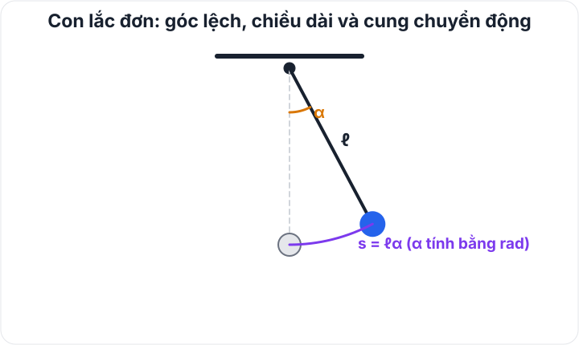
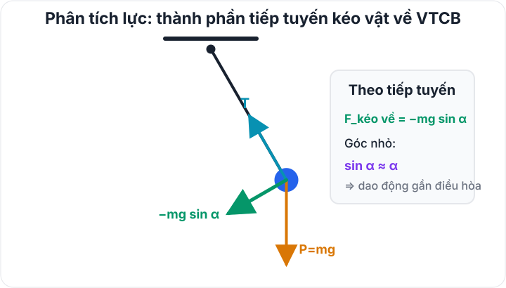

# Bài 5 — Con lắc đơn

## Mục tiêu

Sau bài này, bạn cần:

- biết điều kiện để con lắc đơn được xem là dao động điều hòa;
- dùng đúng $\omega$, $T$, $f$ theo chiều dài dây và gia tốc trọng trường;
- phân biệt li độ dài $s$ và li độ góc $\alpha$;
- xử lí năng lượng, vận tốc, gia tốc tiếp tuyến và lực căng dây;
- vận dụng phương pháp tỉ lệ khi thay đổi $\ell$ hoặc $g$;
- hiểu các bài đo $g$ bằng con lắc và các tình huống vướng đinh ở mức nâng cao.

## 1. Cấu tạo

Con lắc đơn gồm vật nhỏ khối lượng $m$ treo bằng sợi dây nhẹ, không dãn, chiều dài $\ell$.

Vị trí cân bằng là vị trí dây thẳng đứng, vật ở thấp nhất.

*Hình — Hình học của con lắc đơn: góc lệch $\alpha$ được đo từ phương thẳng đứng, còn vật chuyển động trên một cung tròn bán kính $\ell$.*

**Ý nghĩa của hình:** Khi dùng li độ dài, độ dài cung từ VTCB đến vị trí tức thời là $s=\ell\alpha$ nếu $\alpha$ tính bằng radian. Đây là đại lượng dọc theo quỹ đạo cong, không phải đoạn thẳng ngang.

## 2. Khi nào con lắc đơn dao động điều hòa?

Phương trình chính xác theo góc là phi tuyến. Với góc nhỏ, ta dùng gần đúng

$$
\sin\alpha\approx\alpha
$$

khi $\alpha$ tính bằng radian.

Trong phạm vi góc nhỏ, thường lấy cỡ dưới khoảng $10^\circ$ trong các bài phổ thông, con lắc được xem gần đúng là dao động điều hòa.

Khi đó:

$$
\begin{aligned}
&\boxed{\omega=\sqrt{\frac{g}{\ell}}}\\
&\boxed{T=2\pi\sqrt{\frac{\ell}{g}}},
\end{aligned}
$$

$$
\boxed{f=\frac{1}{2\pi}\sqrt{\frac{g}{\ell}}}.
$$

### Phụ thuộc của chu kì

Trong mô hình góc nhỏ:

- $T$ không phụ thuộc khối lượng vật;
- $T$ không phụ thuộc biên độ;
- $T\propto\sqrt\ell$;
- $T\propto1/\sqrt g$.

## 3. Li độ dài và li độ góc

Gọi:

- $s$: li độ dài trên cung tròn;
- $\alpha$: li độ góc, tính bằng radian.

Ta có:

$$
\boxed{s=\ell\alpha}.
$$

Nếu biên độ dài là $s_0$ và biên độ góc là $\alpha_0$:

$$
s_0=\ell\alpha_0.
$$

Phương trình dao động có thể viết:

$$
s=s_0\cos(\omega t+\varphi),
$$

hoặc

$$
\alpha=\alpha_0\cos(\omega t+\varphi).
$$

!!! warning "Đơn vị"
    Khi dùng $s=\ell\alpha$, góc $\alpha$ phải ở radian. Không thay trực tiếp số đo độ vào công thức.

## 4. Vận tốc trong gần đúng dao động điều hòa

Từ phương trình li độ dài:

$$
v=-\omega s_0\sin(\omega t+\varphi).
$$

Do đó:

$$
v^2=\omega^2(s_0^2-s^2).
$$

Tốc độ cực đại tại vị trí cân bằng:

$$
\boxed{v_{\max}=\omega s_0=\alpha_0\sqrt{g\ell}}.
$$

## 5. Công thức tốc độ theo năng lượng — dùng được rộng hơn

Nếu con lắc được thả từ biên góc $\alpha_0$ và tại một vị trí có góc $\alpha$, bỏ qua ma sát:

$$
\frac12mv^2+mg\ell(1-\cos\alpha)=mg\ell(1-\cos\alpha_0).
$$

Suy ra tốc độ:

$$
\boxed{|v|=\sqrt{2g\ell(\cos\alpha-\cos\alpha_0)}}.
$$

Công thức này cho độ lớn của vận tốc, không xác định chiều chuyển động; nó không cần gần đúng góc nhỏ trong bước bảo toàn cơ năng.

Tại vị trí cân bằng $\alpha=0$:

$$
\boxed{v_{\max}=\sqrt{2g\ell(1-\cos\alpha_0)}}.
$$

Với góc rất nhỏ, kết quả này tiến gần $\alpha_0\sqrt{g\ell}$.

## 6. Năng lượng

Chọn mốc thế năng tại vị trí cân bằng.

Thế năng chính xác:

$$
W_t=mg\ell(1-\cos\alpha).
$$

Cơ năng khi thả từ biên:

$$
W=mg\ell(1-\cos\alpha_0).
$$

Với góc nhỏ, dùng $1-\cos\alpha\approx\alpha^2/2$:

$$
\begin{aligned}
&W_t\approx\frac12mg\ell\alpha^2\\
&W\approx\frac12mg\ell\alpha_0^2=\frac12m\omega^2s_0^2.
\end{aligned}
$$

## 7. Gia tốc

Trong gần đúng dao động điều hòa, gia tốc tiếp tuyến:

$$
a_t=-\omega^2s=-g\alpha.
$$

Ngoài ra vật chuyển động trên cung tròn nên còn có gia tốc hướng tâm:

$$
a_n=\frac{v^2}{\ell}.
$$

Gia tốc toàn phần có độ lớn:

$$
a=\sqrt{a_t^2+a_n^2}.
$$

Tại vị trí cân bằng, $a_t=0$ nhưng $a_n$ lớn nhất; vì vậy không được nói "gia tốc của con lắc bằng 0 tại vị trí cân bằng" nếu đang hỏi gia tốc toàn phần của chuyển động cong.

## 8. Lực kéo về

Chọn chiều dương của li độ góc $\alpha$ và li độ dài $s$ cùng về một phía. Thành phần tiếp tuyến của trọng lực đóng vai trò lực kéo về nên có dấu ngược với li độ:

$$
F_{kv}=-mg\sin\alpha.
$$

Với góc nhỏ:

$$
F_{kv}\approx-mg\alpha=-\frac{mg}{\ell}s,
$$

và độ lớn là $|F_{kv}|\approx mg|\alpha|=\dfrac{mg}{\ell}|s|$.

*Hình — Thành phần tiếp tuyến của trọng lực kéo vật về VTCB; lực căng dây nằm dọc dây, tức theo phương bán kính.*

**Cách đọc hình:** Tách trọng lực theo phương tiếp tuyến và phương dọc dây. Thành phần $-mg\sin\alpha$ đổi dấu theo $\alpha$, nên chính nó tạo lực kéo về theo phương chuyển động.

## 9. Lực căng dây

Gọi $F_c$ là độ lớn lực căng dây. Khi dây còn căng, theo phương bán kính hướng vào điểm treo:

$$
F_c-mg\cos\alpha=m\frac{v^2}{\ell}.
$$

Do đó:

$$
\boxed{F_c=mg\cos\alpha+m\frac{v^2}{\ell}}.
$$

Nếu con lắc được thả từ biên $\pm\alpha_0$ với $v=0$, bỏ qua ma sát và dây vẫn căng trong suốt chuyển động, thay tốc độ từ bảo toàn cơ năng ta được:

$$
\boxed{F_c=mg(3\cos\alpha-2\cos\alpha_0)}.
$$

Tại vị trí cân bằng:

$$
F_{c,\max}=mg(3-2\cos\alpha_0).
$$

Tại biên:

$$
F_{c,\min}=mg\cos\alpha_0.
$$

Nếu công thức cho $F_c\le0$, giả thiết dây luôn căng không còn phù hợp; khi đó không được tiếp tục dùng mô hình con lắc đơn với dây căng như trên.

## 10. Thay đổi chiều dài

Nếu cùng một nơi nên $g$ không đổi:

$$
\frac{T_1}{T_2}=\sqrt{\frac{\ell_1}{\ell_2}}.
$$

Hay:

$$
\frac{T_1^2}{T_2^2}=\frac{\ell_1}{\ell_2}.
$$

Nếu $\ell_3=a\ell_1+b\ell_2$ thì có thể suy ra trực tiếp quan hệ tương ứng giữa các bình phương chu kì.

## 11. Thay đổi gia tốc trọng trường

Với cùng chiều dài:

$$
\frac{T_1}{T_2}=\sqrt{\frac{g_2}{g_1}}.
$$

Con lắc đặt ở nơi có $g$ nhỏ hơn sẽ dao động chậm hơn.

## 12. Đo gia tốc trọng trường bằng con lắc đơn

Trong chế độ góc nhỏ, từ

$$
T^2=\frac{4\pi^2}{g}\ell,
$$

đồ thị $T^2$ theo $\ell$ là đường thẳng qua gốc có hệ số góc

$$
a=\frac{4\pi^2}{g}.
$$

Do đó:

$$
\boxed{g=\frac{4\pi^2}{a}}.
$$

Đây là một cách xử lí dữ liệu thí nghiệm rất quan trọng.

## 13. Con lắc vướng đinh — mức nâng cao

Khi dây vướng vào một đinh, bán kính quỹ đạo của vật thay đổi. Sau thời điểm vướng:

- tâm quay thay đổi;
- chiều dài hiệu dụng thay đổi;
- chu kì của phần chuyển động quanh tâm mới thay đổi;
- cơ năng vẫn có thể bảo toàn nếu bỏ qua ma sát và va chạm không gây mất năng lượng đáng kể.

Bài loại này nên chia chuyển động thành từng cung có chiều dài con lắc hiệu dụng riêng, tính thời gian trên mỗi cung rồi cộng lại.

## Ví dụ 1 — Tìm chiều dài từ chu kì

Con lắc có $T=2\,\mathrm s$ tại nơi $g=\pi^2\,\mathrm{m/s^2}$.

Từ $T=2\pi\sqrt{\ell/g}$:

$$
2=2\pi\sqrt{\frac{\ell}{\pi^2}},
$$

suy ra $\ell=1\,\mathrm m$.

## Ví dụ 2 — Tốc độ tại góc bất kì

Con lắc dài $1\,\mathrm m$, thả từ $\alpha_0=60^\circ$. Tại $\alpha=30^\circ$, với $g=10\,\mathrm{m/s^2}$:

$$
|v|=\sqrt{20\left(\cos30^\circ-\cos60^\circ\right)}.
$$

Đây là bài năng lượng, không cần giả thiết góc nhỏ.

## Ví dụ 3 — Lực căng tại vị trí cân bằng

Nếu $\alpha_0=60^\circ$:

$$
F_{c,\max}=mg(3-2\cos60^\circ)=2mg.
$$

## Ví dụ 4 — So sánh chu kì

Tăng chiều dài con lắc lên $44\%$:

$$
\frac{T'}{T}=\sqrt{1,44}=1,2.
$$

Chu kì tăng $20\%$.

## Phân dạng

> Đây là cách phân loại phục vụ mục đích sư phạm, không phải phân loại học thuật chính thức.

### Dạng 1 — Chu kì và phương trình dao động

Dùng $\omega=\sqrt{g/\ell}$ rồi kết hợp điều kiện ban đầu.

### Dạng 2 — Thay đổi ℓ hoặc g

Ưu tiên bình phương tỉ số chu kì để tránh căn phức tạp.

### Dạng 3 — Năng lượng, vận tốc

Nếu góc không nhỏ, ưu tiên công thức bảo toàn cơ năng chính xác theo $\cos\alpha$.

### Dạng 4 — Lực căng dây

Viết phương trình hướng tâm trước, sau đó thay $v^2$ từ bảo toàn cơ năng.

### Dạng 5 — Thí nghiệm xác định g

Dùng quan hệ tuyến tính $T^2\propto\ell$ và đọc hệ số góc.

## Bẫy thường gặp

!!! danger "Sai lầm 1"
    Dùng $T=2\pi\sqrt{\ell/g}$ cho góc lớn mà vẫn yêu cầu độ chính xác cao. Công thức phổ thông này dựa trên gần đúng góc nhỏ.

!!! danger "Sai lầm 2"
    Thay góc tính bằng độ vào $s=\ell\alpha$.

!!! warning "Sai lầm 3"
    Cho rằng lực căng bằng $mg\cos\alpha$. Còn phải cộng thành phần tạo gia tốc hướng tâm $mv^2/\ell$.

## Bài tập nhanh

1. Con lắc dài $1\,\mathrm m$ tại nơi $g=10\,\mathrm{m/s^2}$. Tính $\omega$.
2. Nếu chiều dài tăng $21\%$, chu kì tăng bao nhiêu phần trăm?
3. Ở biên góc $\alpha_0$, tốc độ bằng bao nhiêu?
4. Tại vị trí cân bằng, thành phần gia tốc tiếp tuyến bằng bao nhiêu?
5. Đồ thị $T^2-\ell$ có hệ số góc $4,0\,\mathrm{s^2/m}$. Viết biểu thức xác định $g$.

### Đáp án nhanh

1. $\sqrt{10}\,\mathrm{rad/s}$.
2. $10\%$.
3. $0$.
4. $0$.
5. $g=4\pi^2/4=\pi^2\,\mathrm{m/s^2}$.

## Tóm tắt

Trong giới hạn góc nhỏ:

$$
\omega=\sqrt{\frac{g}{\ell}},\qquad T=2\pi\sqrt{\frac{\ell}{g}}.
$$

Công thức năng lượng chính xác hữu ích:

$$
v^2=2g\ell(\cos\alpha-\cos\alpha_0).
$$

Lực căng dây khi dây còn căng:

$$
F_c=mg\cos\alpha+m\frac{v^2}{\ell}.
$$

## 5 điều cần nhớ

1. Công thức chu kì chuẩn của con lắc đơn dựa trên góc nhỏ.
2. Chu kì không phụ thuộc khối lượng vật.
3. $s=\ell\alpha$ chỉ dùng trực tiếp khi $\alpha$ tính bằng radian.
4. Gia tốc toàn phần tại vị trí cân bằng không nhất thiết bằng $0$.
5. Với bài lực căng, kết hợp phương trình hướng tâm và bảo toàn cơ năng.

<!-- LESSON_PRACTICE_LINKS -->
## Luyện tập sau bài

- [Bài tập theo bài](practice/05-simple-pendulum/exercises.md)
- [Đáp án và lời giải](practice/05-simple-pendulum/solutions.md)

---

[← Bài 4](04-spring-oscillator.md) | [↑ Chương](index.md) | [Bài 6 →](06-oscillation-energy.md)
