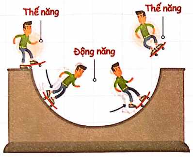
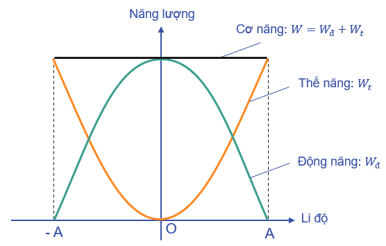
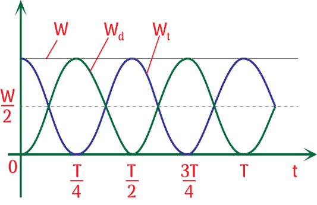

# Bài 6 — Năng lượng trong dao động

## Mục tiêu

Sau bài này, bạn cần:

- hiểu sự chuyển hóa tuần hoàn giữa động năng và thế năng;
- suy ra các biểu thức năng lượng từ $x$, $v$, $A$;
- biết tần số biến thiên của động năng và thế năng;
- giải bài toán $W_d=nW_t$, $W_t=nW_d$;
- xác định số lần và thời điểm năng lượng đạt một giá trị;
- phân biệt cơ năng của dao động điều hòa lí tưởng với trường hợp có lực cản.

## 1. Bức tranh năng lượng

Trong dao động điều hòa lí tưởng, năng lượng không mất đi mà liên tục chuyển đổi giữa:

- **động năng** — gắn với tốc độ;
- **thế năng** — gắn với độ lệch khỏi vị trí cân bằng;
- **cơ năng** — tổng động năng và thế năng.

Tại vị trí cân bằng, tốc độ lớn nhất nên động năng cực đại. Tại biên, vật dừng tức thời nên động năng bằng $0$ và thế năng đạt cực đại.

<!-- ch1-source-figure: b6-energy-transfer -->
[{ .pdf-source-figure loading=lazy width="398" height="323" }](../assets/theory-figures/01-oscillations/b6-energy-transfer.png)

*Hình — Đi xuống: thế năng chuyển thành động năng; đi lên: quá trình chuyển hóa đảo chiều.*

Quan sát độ cao của người trượt: khi hạ thấp, thế năng trọng trường giảm và tốc độ có thể tăng; khi đi lên, động năng chuyển ngược thành thế năng. Bỏ qua tiêu hao thì tổng hai dạng năng lượng được giữ nguyên. Hình dùng để hình dung sự chuyển hóa, không khẳng định mọi chuyển động trên máng trượt đều là dao động điều hòa. Với hệ điều hòa đang học, hai biên và O là các vị trí đặc biệt đã nêu ở trên.
<!-- /ch1-source-figure: b6-energy-transfer -->

## 2. Động năng

Với vật khối lượng $m$:

$$
W_d=\frac12mv^2.
$$

Trong dao động điều hòa:

$$
v^2=\omega^2(A^2-x^2),
$$

nên

$$
\boxed{W_d=\frac12m\omega^2(A^2-x^2)}.
$$

Nếu hệ là con lắc lò xo, $m\omega^2=k$:

$$
W_d=\frac12k(A^2-x^2).
$$

## 3. Thế năng trong mô hình dao động điều hòa

Trong mô hình dao động điều hòa tuyến tính, nếu chọn mốc thế năng của **hệ dao động** tại vị trí cân bằng thì

$$
\boxed{W_t=\frac12m\omega^2x^2}.
$$

Với con lắc lò xo, $m\omega^2=k$ nên

$$
W_t=\frac12kx^2.
$$

Với con lắc lò xo nằm ngang có vị trí cân bằng trùng chiều dài tự nhiên, đây là thế năng đàn hồi. Với con lắc treo thẳng đứng, biểu thức này là phần thế năng biến thiên của hệ quanh vị trí cân bằng sau khi gộp thế năng đàn hồi và thế năng trọng trường. Với con lắc đơn góc nhỏ, biểu thức gần đúng cũng có cấu trúc bậc hai theo li độ góc hoặc li độ dài.

## 4. Cơ năng

Cộng động năng và thế năng:

$$
W=W_d+W_t.
$$

Suy ra:

$$
\boxed{W=\frac12m\omega^2A^2}.
$$

Với con lắc lò xo:

$$
\boxed{W=\frac12kA^2}.
$$

Trong mô hình lí tưởng, $W$ là hằng số.

### Ý nghĩa

Cơ năng tỉ lệ với **bình phương biên độ**. Nếu biên độ tăng gấp đôi, cơ năng tăng gấp bốn, với điều kiện các tham số $m,\omega$ của hệ không đổi.

## 5. Tỉ phần năng lượng theo li độ

Chia cho cơ năng:

$$
\begin{aligned}
&\boxed{\frac{W_t}{W}=\frac{x^2}{A^2}}\\
&\boxed{\frac{W_d}{W}=1-\frac{x^2}{A^2}}.
\end{aligned}
$$

Hai biểu thức này giúp nhìn ngay phần trăm năng lượng đang ở dạng động năng hoặc thế năng.

<!-- ch1-source-figure: b6-energy-position -->
[{ .pdf-source-figure loading=lazy width="556" height="355" }](../assets/theory-figures/01-oscillations/b6-energy-position.png)

*Hình — Tại cùng một li độ, động năng và thế năng bổ sung cho nhau để bằng cơ năng.*

Ở O, đường thế năng chạm mức không còn đường động năng đạt mức cơ năng. Tại hai biên, hai vai trò đổi chỗ. Hai giao điểm của các parabol ứng với $W_t=W_d=W/2$, tức $x=\pm A/\sqrt2$; hình gốc không ghi thêm các giá trị này lên trục. Chỉ xét đường động năng trong miền chuyển động $[-A,A]$, không kéo dài nó sang phần cho năng lượng âm.
<!-- /ch1-source-figure: b6-energy-position -->

### Ví dụ trực giác

Tại $|x|=A/2$:

$$
\frac{W_t}{W}=\frac14,
$$

nên động năng chiếm $3/4$ cơ năng.

## 6. Bài toán động năng bằng n lần thế năng

Ta có

$$
W_d=nW_t.
$$

Vì $W=W_d+W_t$:

$$
W=(n+1)W_t.
$$

Do $W_t/W=x^2/A^2$:

$$
\boxed{|x|=\frac{A}{\sqrt{n+1}}}.
$$

Tốc độ tại đó:

$$
|v|=\omega A\sqrt{\frac{n}{n+1}}.
$$

## 7. Bài toán thế năng bằng n lần động năng

Tương tự:

$$
W_t=nW_d,
$$

nên

$$
\boxed{|x|=A\sqrt{\frac{n}{n+1}}}.
$$

và

$$
|v|=\frac{\omega A}{\sqrt{n+1}}.
$$

## 8. Động năng và thế năng biến thiên với tần số nào?

Đặt

$$
x=A\cos(\omega t+\varphi).
$$

Thế năng:

$$
W_t=\frac12m\omega^2A^2\cos^2(\omega t+\varphi).
$$

Dùng $\cos^2\theta=(1+\cos2\theta)/2$:

$$
W_t=\frac{W}{2}\left[1+\cos(2\omega t+2\varphi)\right].
$$

Tương tự:

$$
W_d=\frac{W}{2}\left[1-\cos(2\omega t+2\varphi)\right].
$$

Vì vậy động năng và thế năng biến thiên tuần hoàn với:

- tần số góc $2\omega$;
- chu kì $T/2$;
- tần số $2f$.

<!-- ch1-source-figure: b6-energy-time -->
[{ .pdf-source-figure loading=lazy width="533" height="345" }](../assets/theory-figures/01-oscillations/b6-energy-time.png)

*Hình — Một chu kì chuyển động chứa hai chu kì biến thiên của mỗi dạng năng lượng.*

Đường $W_t$ bắt đầu ở mức cơ năng, giảm về không tại $T/4$ rồi trở lại cực đại tại $T/2$. Đường $W_d$ biến thiên bù lại; khi một đường đạt cực đại thì đường kia bằng không. Vì trạng thái năng lượng đã lặp lại sau $T/2$, tần số năng lượng là $2f$, trong khi đường cơ năng $W$ vẫn nằm ngang.
<!-- /ch1-source-figure: b6-energy-time -->

!!! warning "Bẫy"
    Cơ năng không dao động với tần số $2f$. Cơ năng của hệ lí tưởng là hằng số; chỉ động năng và thế năng biến thiên.

## 9. Khoảng thời gian giữa các trạng thái năng lượng lặp lại

Vì năng lượng phụ thuộc $x^2$ hoặc $v^2$, các trạng thái đối xứng $x$ và $-x$ có cùng thế năng; $v$ và $-v$ có cùng động năng.

Do đó cùng một tỉ số $W_d/W_t$ thường xuất hiện nhiều lần trong một chu kì.

Ví dụ $W_d=W_t$ tương ứng

$$
|x|=\frac{A}{\sqrt2}.
$$

Vật đi qua hai vị trí này tổng cộng bốn lần trong một chu kì, nên các thời điểm liên tiếp có thể cách nhau $T/4$ nếu xét đầy đủ các trạng thái năng lượng.

## 10. Đồ thị năng lượng theo li độ

- $W_t(x)=\frac12kx^2$ là parabol mở lên.
- $W_d(x)=\frac12k(A^2-x^2)$ là parabol mở xuống trên miền $[-A,A]$.
- $W$ là đường thẳng ngang.

Hai đồ thị $W_t$ và $W_d$ cắt nhau tại $x=\pm A/\sqrt2$.

## 11. Đồ thị năng lượng theo thời gian

Cả $W_d$ và $W_t$ đều không âm và lặp lại sau $T/2$.

Khi $W_d$ cực đại thì $W_t=0$; khi $W_t$ cực đại thì $W_d=0$. Hai dạng năng lượng biến thiên ngược nhau nhưng tổng luôn bằng $W$.

## 12. Con lắc đơn — biểu thức năng lượng chính xác

Nếu lấy mốc thế năng ở vị trí thấp nhất:

$$
W_t=mg\ell(1-\cos\alpha).
$$

Nếu thả từ biên $\alpha_0$:

$$
W=mg\ell(1-\cos\alpha_0).
$$

Động năng tại góc $\alpha$:

$$
W_d=mg\ell(\cos\alpha-\cos\alpha_0).
$$

Từ đó suy ra vận tốc như ở bài con lắc đơn.

## 13. Khi cơ năng không bảo toàn

Nếu có ma sát hoặc lực cản môi trường, cơ năng cơ học giảm dần và chuyển thành các dạng năng lượng khác, chủ yếu là nhiệt.

Không được dùng $W=\frac12kA^2=\text{hằng số}$ xuyên suốt một quá trình tắt dần nếu biên độ đang giảm.

Trong một số bài, phần cơ năng giảm được xem bằng công của lực cản hoặc nhiệt lượng sinh ra.

## Ví dụ 1 — Tỉ số năng lượng

Khi $|x|=A/2$:

$$
W_t=\frac14W,
$$

nên

$$
W_d=\frac34W.
$$

Do đó $W_d=3W_t$.

## Ví dụ 2 — Tìm vị trí khi thế năng bằng 3 lần động năng

Ta có

$$
|x|=A\sqrt{\frac{3}{4}}=\frac{\sqrt3}{2}A.
$$

## Ví dụ 3 — Tính cơ năng

Con lắc lò xo có $k=50\,\mathrm{N/m}$, $A=4\,\mathrm{cm}$.

$$
W=\frac12\cdot50\cdot(0,04)^2=0,04\text{ J}.
$$

## Ví dụ 4 — Tần số biến thiên năng lượng

Vật dao động với $f=2\,\mathrm{Hz}$. Động năng và thế năng biến thiên với tần số $4\,\mathrm{Hz}$ và chu kì $0,25\,\mathrm s$.

## Phân dạng

> Đây là cách phân loại phục vụ mục đích sư phạm, không phải phân loại học thuật chính thức.

### Dạng 1 — Cơ năng từ A, k, m và ω

Chọn dạng công thức ít đổi đơn vị nhất.

### Dạng 2 — Tỉ số động năng/thế năng

Chuyển về $x^2/A^2$ trước, sau đó mới tìm vị trí hoặc vận tốc.

### Dạng 3 — Thời gian năng lượng đạt giá trị

Tìm miền $|x|$ tương ứng → chuyển sang bài toán pha và đường tròn lượng giác.

### Dạng 4 — Đồ thị năng lượng

Nhớ: theo li độ là parabol; theo thời gian là hàm có chu kì $T/2$.

## Bẫy thường gặp

!!! danger "Sai lầm 1"
    Thấy $W_d=W_t$ rồi kết luận $x=A/\sqrt2$ duy nhất. Phải có hai vị trí $x=\pm A/\sqrt2$.

!!! danger "Sai lầm 2"
    Cho rằng động năng biến thiên điều hòa quanh $0$. Động năng luôn không âm và có giá trị trung bình khác $0$.

!!! warning "Sai lầm 3"
    Dùng bảo toàn cơ năng cho cả quá trình có ma sát mà không tính công của lực cản.

## Bài tập nhanh

1. Con lắc lò xo có $k=80\,\mathrm{N/m}$, $A=5\,\mathrm{cm}$. Tính cơ năng.
2. Khi $W_d=8W_t$, tìm $|x|/A$.
3. Khi $W_t=W_d$, tìm $|v|/v_{\max}$.
4. Vật dao động với $T=0,8\,\mathrm s$. Chu kì biến thiên của động năng là bao nhiêu?
5. Biên độ giảm còn một nửa trong một dao động tắt dần. Nếu $k$ không đổi, cơ năng còn bao nhiêu phần ban đầu?

### Đáp án nhanh

1. $0,10\,\mathrm J$.
2. $1/3$.
3. $1/\sqrt2$.
4. $0,4\,\mathrm s$.
5. $1/4$.

## Tóm tắt

$$
\begin{aligned}
&W=\frac12m\omega^2A^2\\
&\frac{W_t}{W}=\frac{x^2}{A^2},\qquad \frac{W_d}{W}=1-\frac{x^2}{A^2}.
\end{aligned}
$$

Động năng và thế năng lặp lại sau $T/2$; cơ năng giữ nguyên nếu không có cơ chế tiêu hao.

## 5 điều cần nhớ

1. Cơ năng tỉ lệ với $A^2$.
2. Ở vị trí cân bằng: động năng cực đại, thế năng cực tiểu.
3. Ở biên: động năng bằng $0$, thế năng cực đại.
4. Động năng và thế năng biến thiên với tần số $2f$.
5. Có lực cản thì cơ năng cơ học giảm, không còn bảo toàn.

<!-- LESSON_PRACTICE_LINKS -->
## Luyện tập sau bài

- [Bài tập theo bài](practice/06-oscillation-energy/exercises.md)
- [Đáp án và lời giải](practice/06-oscillation-energy/solutions.md)

---

[← Bài 5](05-simple-pendulum.md) | [↑ Chương](index.md) | [Bài 7 →](07-combined-damped-forced-resonance.md)
