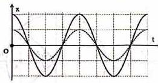
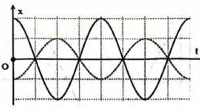
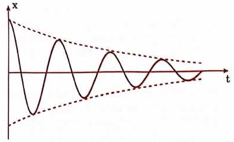
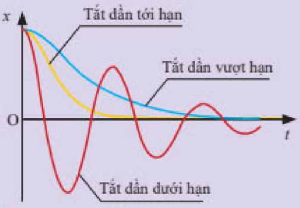
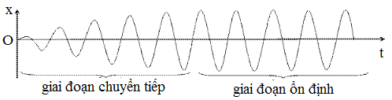
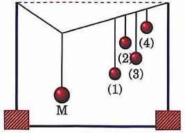
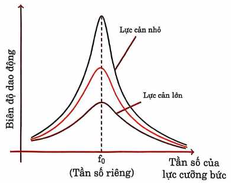

# Bài 7 — Tổng hợp dao động, tắt dần, cưỡng bức và cộng hưởng

## Mục tiêu

Bạn cần:

- tổng hợp được hai dao động điều hòa cùng phương, cùng tần số;
- hiểu vai trò của độ lệch pha đối với biên độ tổng hợp;
- phân biệt dao động tự do, duy trì, tắt dần và cưỡng bức;
- nêu được đặc điểm của dao động cưỡng bức ở trạng thái ổn định;
- hiểu bản chất và điều kiện cộng hưởng;
- phân tích được ảnh hưởng của lực cản đến đường cong cộng hưởng.

# Phần A — Tổng hợp hai dao động điều hòa

## 1. Bài toán tổng hợp

Xét hai dao động cùng phương, cùng tần số góc:

$$
\begin{aligned}
&x_1=A_1\cos(\omega t+\varphi_1)\\
&x_2=A_2\cos(\omega t+\varphi_2).
\end{aligned}
$$

Dao động tổng hợp

$$
x=x_1+x_2
$$

vẫn là dao động điều hòa cùng tần số góc $\omega$:

$$
x=A\cos(\omega t+\varphi).
$$

## 2. Biên độ tổng hợp

Đặt độ lệch pha

$$
\Delta\varphi=\varphi_2-\varphi_1.
$$

Biên độ tổng hợp:

$$
\boxed{A^2=A_1^2+A_2^2+2A_1A_2\cos\Delta\varphi}.
$$

Do $-1\le\cos\Delta\varphi\le1$:

$$
\boxed{|A_1-A_2|\le A\le A_1+A_2}.
$$

### Các trường hợp đặc biệt

- Cùng pha: $\Delta\varphi=2k\pi$ → $A=A_1+A_2$.
- Ngược pha: $\Delta\varphi=(2k+1)\pi$ → $A=|A_1-A_2|$.
- Vuông pha: $\Delta\varphi=(2k+1)\pi/2$ → $A=\sqrt{A_1^2+A_2^2}$.

<!-- ch1-source-figure: b7-in-phase -->
[{ .pdf-source-figure loading=lazy width="261" height="137" }](../assets/theory-figures/01-oscillations/b7-in-phase.png)

*Hình — Cùng pha: các li độ cùng tăng cường nhau ở mọi thời điểm.*

Hai đường trong hình cùng đạt đỉnh và cùng qua O theo một chiều, dù biên độ khác nhau. Tại thời điểm đạt đỉnh dương, hai li độ cộng thành $A_1+A_2$, nên biên độ tổng hợp đạt giá trị lớn nhất. Hình chỉ vẽ hai dao động thành phần; không có một đường thứ ba được ngầm coi là dao động tổng hợp.
<!-- /ch1-source-figure: b7-in-phase -->

<!-- ch1-source-figure: b7-antiphase -->
[{ .pdf-source-figure loading=lazy width="253" height="137" }](../assets/theory-figures/01-oscillations/b7-antiphase.png)

*Hình — Ngược pha: các li độ trái dấu nên triệt bớt nhau khi cộng.*

Đỉnh dương của đường này trùng thời điểm đáy âm của đường kia. Vì các li độ đối dấu, biên độ tổng hợp bằng $|A_1-A_2|$, không phải tổng hai biên độ. Hai đường trong hình có độ cao khác nhau nên chỉ triệt bớt; chỉ khi $A_1=A_2$ mới triệt tiêu hoàn toàn.
<!-- /ch1-source-figure: b7-antiphase -->

## 3. Pha của dao động tổng hợp

Ta có thể dùng phương pháp vectơ quay hoặc khai triển lượng giác:

$$
\begin{aligned}
&A\cos\varphi=A_1\cos\varphi_1+A_2\cos\varphi_2\\
&A\sin\varphi=A_1\sin\varphi_1+A_2\sin\varphi_2.
\end{aligned}
$$

Do đó:

$$
\tan\varphi=\frac{A_1\sin\varphi_1+A_2\sin\varphi_2}{A_1\cos\varphi_1+A_2\cos\varphi_2},
$$

nhưng khi dùng arctan phải xác định đúng góc phần tư từ dấu của tử và mẫu.

!!! warning "Bẫy pha"
    Không chỉ bấm $\arctan$ rồi lấy kết quả máy tính. Hai góc khác nhau $\pi$ có cùng tang nhưng cho trạng thái dao động khác dấu.

## 4. Ý nghĩa hình học của vectơ quay

Mỗi dao động được biểu diễn bằng một vectơ có độ dài $A_i$ và góc pha $\varphi_i$. Tổng hình học của hai vectơ là vectơ đại diện cho dao động tổng hợp.

Phương pháp này giúp nhìn trực tiếp:

- vì sao biên độ phụ thuộc độ lệch pha;
- vì sao cùng pha cho biên độ lớn nhất;
- vì sao ngược pha có thể triệt tiêu nhau.

# Phần B — Các loại dao động

## 5. Dao động tự do

Dao động tự do là dao động sau khi hệ được kích thích ban đầu rồi để hệ tự dao động, không còn chịu ngoại lực tuần hoàn áp đặt tần số.

Trong mô hình lí tưởng, tần số dao động bằng tần số riêng do các đặc trưng của hệ quyết định.

Ví dụ: con lắc lò xo không ma sát sau khi kéo lệch rồi thả.

## 6. Dao động tắt dần

Dao động tắt dần là dao động có biên độ giảm dần theo thời gian do lực cản hoặc ma sát làm cơ năng cơ học giảm.

<!-- ch1-source-figure: b7-damped-oscillation -->
[{ .pdf-source-figure loading=lazy width="398" height="241" }](../assets/theory-figures/01-oscillations/b7-damped-oscillation.png)

*Hình — Đường bao thu hẹp cho thấy biên độ giảm, không chỉ li độ đang giảm trong một nửa chu kì.*

Hãy so các đỉnh liên tiếp ở cùng một phía của O: chúng thấp dần theo thời gian. Hai đường nét đứt là đường bao biên độ, không phải hai quỹ đạo khác của vật. Lực cản làm cơ năng cơ học giảm nên biên độ suy giảm. Đây là chế độ vẫn còn dao động qua lại; không suy rộng hình này cho mọi mức cản.
<!-- /ch1-source-figure: b7-damped-oscillation -->

### Đặc điểm

- biên độ giảm dần;
- cơ năng giảm dần;
- phần năng lượng cơ học mất đi chuyển thành nội năng/nhiệt hoặc các dạng khác;
- trong chế độ hệ vẫn còn dao động qua lại, lực cản lớn hơn thường làm biên độ suy giảm nhanh hơn. Nếu lực cản đủ lớn, hệ có thể trở về vị trí cân bằng mà không còn dao động qua lại, nên không dùng nhận xét này như một quy luật tuyệt đối cho mọi mức cản.

<!-- ch1-source-figure: b7-damping-regimes -->
??? note "Đọc thêm: cản lớn có thể làm mất chuyển động qua lại"
    [{ .pdf-source-figure loading=lazy width="504" height="350" }](../assets/theory-figures/01-oscillations/b7-damping-regimes.png)

    *Hình — Trở về cân bằng không đồng nghĩa với việc còn dao động qua lại.*

    Đường đỏ dưới hạn còn nhiều lần đi qua O. Hai đường tới hạn và vượt hạn được vẽ trong hình tiến về O mà không luân phiên qua hai phía. So sánh này giải thích vì sao không thể nói “càng tăng lực cản thì vật càng dao động qua lại nhanh hơn rồi tắt”; cơ chế trở về cân bằng còn phụ thuộc chế độ giảm chấn.
<!-- /ch1-source-figure: b7-damping-regimes -->

### Có phải mọi dao động tắt dần đều xấu?

Không. Giảm xóc ô tô, bộ phận giảm rung và cơ cấu đóng cửa cần tắt dao động nhanh. Ngược lại, trong đồng hồ cơ hoặc hệ cần duy trì rung, tắt dần là điều cần bù lại.

## 7. Dao động duy trì

Dao động duy trì là dao động tắt dần được bù đúng phần năng lượng mất đi sau mỗi chu kì hoặc theo cơ chế thích hợp, sao cho biên độ được giữ gần như không đổi.

Đặc điểm quan trọng: nguồn bù năng lượng không áp đặt một tần số khác lên hệ; hệ vẫn dao động theo tần số riêng của nó.

## 8. Dao động cưỡng bức

Dao động cưỡng bức xảy ra khi hệ chịu một ngoại lực tuần hoàn, ví dụ

$$
F=F_0\cos(\omega_Ft+\phi_F).
$$

Sau giai đoạn quá độ, hệ đi vào trạng thái ổn định.

<!-- ch1-source-figure: b7-forced-transient -->
[{ .pdf-source-figure loading=lazy width="498" height="127" }](../assets/theory-figures/01-oscillations/b7-forced-transient.png)

*Hình — Chỉ sau giai đoạn chuyển tiếp mới đọc đặc điểm của dao động cưỡng bức ổn định.*

Ở phần bên trái, các đỉnh chưa có độ cao ổn định; phần bên phải đã lặp lại đều với biên độ gần như không đổi. Hình minh họa một quá trình tiến tới ổn định, không phải quy luật rằng mọi dao động cưỡng bức đều tăng biên độ đúng như đường này. Ở giai đoạn ổn định, nhịp dao động theo ngoại lực tuần hoàn, không mặc nhiên bằng tần số riêng của hệ.
<!-- /ch1-source-figure: b7-forced-transient -->

### Ở trạng thái ổn định

- tần số dao động của hệ bằng tần số của lực cưỡng bức;
- biên độ phụ thuộc $F_0$;
- biên độ phụ thuộc tần số lực cưỡng bức;
- biên độ phụ thuộc lực cản;
- biên độ phụ thuộc tần số riêng của hệ.

!!! danger "Sai lầm rất thường gặp"
    Tần số dao động cưỡng bức ổn định **không bằng tần số riêng** trong mọi trường hợp. Nó bằng tần số ngoại lực. Tần số riêng chỉ quyết định vị trí cộng hưởng.

## 9. Cộng hưởng

Cộng hưởng là hiện tượng biên độ dao động cưỡng bức tăng mạnh và đạt cực đại khi tần số của lực cưỡng bức ở gần tần số riêng của hệ.

Trong mô hình phổ thông khi lực cản nhỏ, thường lấy điều kiện cộng hưởng:

$$
\boxed{f_F=f_0},
$$

hay $\omega_F=\omega_0$. Với mô hình có giảm chấn xét chính xác, tần số làm biên độ li độ cực đại có thể lệch nhẹ so với tần số riêng; khi lực cản nhỏ, độ lệch này nhỏ.

<!-- ch1-source-figure: b7-resonance-pendulums -->
[{ .pdf-source-figure loading=lazy width="267" height="192" }](../assets/theory-figures/01-oscillations/b7-resonance-pendulums.png)

*Hình — Các con lắc nhận cùng một kích thích nhưng không nhất thiết đáp ứng mạnh như nhau.*

Kích thích con lắc M làm dây treo chung truyền tác động tuần hoàn đến các con lắc còn lại. Trong chế độ góc nhỏ và cản nhỏ, con lắc có chiều dài gần bằng M có tần số riêng gần nhịp kích thích nên đáp ứng mạnh hơn. Khi so sánh, đo chiều dài từng dây từ điểm treo của nó đến quả nặng, không so độ cao của các quả nặng so với mặt đất: dây treo chung trong hình không nằm ngang hoàn toàn.
<!-- /ch1-source-figure: b7-resonance-pendulums -->

## 10. Ảnh hưởng của lực cản đến cộng hưởng

Nếu lực cản nhỏ:

- đỉnh cộng hưởng cao;
- đường cong cộng hưởng hẹp;
- biên độ cực đại lớn.

Nếu lực cản lớn:

- đỉnh thấp hơn;
- đường cong rộng hơn;
- cộng hưởng kém rõ.

<!-- ch1-source-figure: b7-resonance-curves -->
[{ .pdf-source-figure loading=lazy width="389" height="309" }](../assets/theory-figures/01-oscillations/b7-resonance-curves.png)

*Hình — Cộng hưởng là đỉnh của đường biên độ theo tần số, không phải biên độ cứ tăng khi tần số tăng.*

Trục ngang là tần số lực cưỡng bức, không phải thời gian; trục đứng là biên độ ổn định. Đi từ hai phía về vùng $f_0$, biên độ tăng rồi giảm khi đi qua vùng cộng hưởng. Đường có lực cản nhỏ cao và nhọn hơn, còn lực cản lớn làm đỉnh thấp và kém rõ. Hình gốc dùng cách biểu diễn định tính phổ thông với đỉnh tại $f_0$; không dùng nó để đọc độ dịch chính xác của đỉnh khi xét mô hình giảm chấn chi tiết.
<!-- /ch1-source-figure: b7-resonance-curves -->

## 11. Ứng dụng và nguy cơ của cộng hưởng

### Ứng dụng

- chọn tần số trong các hệ dao động;
- nhạc cụ và hộp cộng hưởng;
- cảm biến rung;
- một số cơ cấu máy và hệ điều khiển.

### Nguy cơ

Nếu tần số kích thích gần tần số riêng của cầu, máy, tòa nhà hoặc bộ phận cơ khí, biên độ có thể tăng lớn gây rung mạnh và hư hỏng.

Kĩ thuật thiết kế có thể:

- thay đổi tần số riêng;
- tăng giảm chấn;
- tránh tần số kích thích nguy hiểm.

## 12. Phân biệt nhanh các loại dao động

**Tự do:** kích thích ban đầu rồi để tự dao động; tần số do hệ quyết định.

**Tắt dần:** biên độ giảm vì mất năng lượng.

**Duy trì:** được bù năng lượng để giữ biên độ; tần số vẫn gắn với hệ.

**Cưỡng bức:** có ngoại lực tuần hoàn liên tục; trạng thái ổn định có tần số bằng ngoại lực.

**Cộng hưởng:** trường hợp đặc biệt của dao động cưỡng bức khi điều kiện tần số thuận lợi làm biên độ cực đại.

## 13. Bài toán cơ năng giảm đều theo mỗi nửa chu kì — mô hình bài tập

Một số bài phổ thông giả thiết lực ma sát có độ lớn gần như không đổi. Khi đó công của lực ma sát trên một quãng đường có thể dùng để liên hệ độ giảm cơ năng và độ giảm biên độ.

Cách làm:

1. Tính cơ năng ban đầu $W_0$.
2. Tính công cản trên một nửa hoặc một chu kì.
3. Suy ra cơ năng còn lại.
4. Đổi cơ năng về biên độ mới qua $W=\frac12kA^2$.

Không dùng kết quả này cho mọi dạng lực cản; nó phụ thuộc mô hình lực cản đề bài cho.

## Ví dụ 1 — Tổng hợp cùng pha

$A_1=3\,\mathrm{cm}$, $A_2=5\,\mathrm{cm}$ và hai dao động cùng pha.

Biên độ tổng hợp:

$$
A=8\text{ cm}.
$$

## Ví dụ 2 — Tổng hợp vuông pha

$A_1=6\,\mathrm{cm}$, $A_2=8\,\mathrm{cm}$, $\Delta\varphi=\pi/2$.

$$
A=\sqrt{6^2+8^2}=10\text{ cm}.
$$

## Ví dụ 3 — Cộng hưởng

Một hệ có tần số riêng $4\,\mathrm{Hz}$. Ngoại lực có thể điều chỉnh tần số. Khi lực cản nhỏ, biên độ lớn nhất sẽ xuất hiện quanh $4\,\mathrm{Hz}$, không phải ở tần số tùy ý lớn hơn.

## Phân dạng

> Đây là cách phân loại phục vụ mục đích sư phạm, không phải phân loại học thuật chính thức.

### Dạng 1 — Tổng hợp hai dao động

Tìm $\Delta\varphi$ → tính $A$ → tìm pha bằng thành phần sin/cos nếu cần.

### Dạng 2 — Nhận biết loại dao động

Đọc cơ chế: mất năng lượng? bù năng lượng? có ngoại lực tuần hoàn? rồi mới gọi tên.

### Dạng 3 — Cộng hưởng

So sánh tần số ngoại lực với tần số riêng và xét mức lực cản.

### Dạng 4 — Dao động tắt dần có mô hình ma sát

Dùng biến thiên cơ năng bằng công của lực cản; không gán công thức chung nếu đề không nêu mô hình.

## Bẫy thường gặp

!!! danger "Sai lầm 1"
    Cộng biên độ đại số $A=A_1+A_2$ cho mọi độ lệch pha. Chỉ đúng khi hai dao động cùng pha.

!!! danger "Sai lầm 2"
    Coi dao động duy trì là dao động cưỡng bức. Hai khái niệm khác nhau về cơ chế và vai trò tần số.

!!! warning "Sai lầm 3"
    Nói cộng hưởng luôn có lợi hoặc luôn có hại. Tác dụng phụ thuộc mục đích và hệ vật lí.

## Bài tập nhanh

1. Hai dao động cùng phương, cùng tần số có $A_1=4\,\mathrm{cm}$, $A_2=7\,\mathrm{cm}$, cùng pha. Tìm $A$.
2. Với cùng hai biên độ trên nhưng ngược pha, tìm $A$.
3. $A_1=A_2=5\,\mathrm{cm}$, độ lệch pha $120^\circ$. Tính $A$.
4. Một hệ có $f_0=3\,\mathrm{Hz}$ chịu ngoại lực $f_F=5\,\mathrm{Hz}$. Ở trạng thái ổn định, hệ dao động với tần số bao nhiêu?
5. Khi tăng lực cản, đỉnh cộng hưởng thường cao lên hay thấp xuống?

### Đáp án nhanh

1. $11\,\mathrm{cm}$.
2. $3\,\mathrm{cm}$.
3. $5\,\mathrm{cm}$.
4. $5\,\mathrm{Hz}$.
5. Thấp xuống.

## Tóm tắt

Tổng hợp hai dao động cùng tần số:

$$
A^2=A_1^2+A_2^2+2A_1A_2\cos\Delta\varphi.
$$

Dao động cưỡng bức ổn định có tần số bằng tần số ngoại lực. Cộng hưởng xảy ra khi tần số kích thích phù hợp với tần số riêng, làm biên độ tăng mạnh, đặc biệt khi lực cản nhỏ.

## 5 điều cần nhớ

1. Độ lệch pha quyết định biên độ tổng hợp.
2. Dao động tắt dần mất cơ năng theo thời gian.
3. Dao động duy trì được bù năng lượng nhưng vẫn theo tần số riêng của hệ.
4. Dao động cưỡng bức ổn định theo tần số ngoại lực.
5. Cộng hưởng là trường hợp biên độ cưỡng bức đạt cực đại quanh tần số riêng.

<!-- LESSON_PRACTICE_LINKS -->
## Luyện tập sau bài

- [Bài tập theo bài](practice/07-combined-damped-forced-resonance/exercises.md)
- [Đáp án và lời giải](practice/07-combined-damped-forced-resonance/solutions.md)

---

[← Bài 6](06-oscillation-energy.md) | [↑ Chương](index.md) | [Bài tập chương →](exercises.md)
