# Bài tập — Bài 1 — Đại cương về dao động điều hòa

> Hệ bài tập được biên soạn theo các dạng xuất hiện trong bộ tài liệu Vật lí 11 của dự án. Câu hỏi được giữ ngắn, trực tiếp; độ khó tăng dần và không cố tình thêm dữ kiện gây nhiễu.

[← Trở lại bài học](../../01-harmonic-oscillation-foundations.md)

## Phần A — Trắc nghiệm 4 lựa chọn

### Câu 1 — Mức 1 — Nhận biết

Một vật dao động điều hòa theo phương trình $x=6\cos(4\pi t-\pi/3)$ cm. Biên độ và tần số của dao động là

A. $6$ cm và $2$ Hz.  
B. $4$ cm và $6$ Hz.  
C. $6$ cm và $4$ Hz.  
D. $3$ cm và $2$ Hz.

### Câu 2 — Mức 1 — Nhận biết

Một dao động có chu kì $T=0,25$ s. Tần số góc bằng

A. $2\pi$ rad/s.  
B. $4\pi$ rad/s.  
C. $8\pi$ rad/s.  
D. $16\pi$ rad/s.

### Câu 3 — Mức 1 — Nhận biết

Một vật dao động điều hòa có biên độ $A=5$ cm. Chiều dài quỹ đạo là

A. $2,5$ cm.  
B. $5$ cm.  
C. $10$ cm.  
D. $20$ cm.

### Câu 4 — Mức 1 — Nhận biết

Phát biểu nào đúng?

A. Mọi dao động tuần hoàn đều là dao động điều hòa.  
B. Dao động điều hòa là dao động có li độ biến thiên theo hàm sin hoặc cos của thời gian.  
C. Biên độ dao động điều hòa có thể âm.  
D. Tần số góc có đơn vị héc.

## Phần B — Đúng/Sai

### Câu 5 — Mức 2 — Thông hiểu

Xét dao động $x=8\cos(5t+\pi/6)$ cm. Đánh dấu Đúng/Sai:

a) Biên độ bằng $8$ cm.  
b) Chu kì bằng $2\pi/5$ s.  
c) Tần số bằng $5$ Hz.  
d) Pha ban đầu bằng $\pi/6$ rad.

### Câu 6 — Mức 2 — Thông hiểu

Một vật dao động điều hòa có phương trình $x=A\cos(\omega t+\varphi)$ với $A>0$, $\omega>0$. Xét các phát biểu:

a) $x$ luôn nằm trong đoạn $[-A,A]$.  
b) Sau mỗi khoảng thời gian $T$, trạng thái dao động lặp lại.  
c) Hệ số của $t$ trong pha chính là tần số $f$.  
d) Nếu đổi $A$ thành $-A$ mà giữ nguyên pha thì vẫn đang viết ở dạng chuẩn.

## Phần C — Trả lời ngắn

### Câu 7 — Mức 3 — Vận dụng

Một vật thực hiện $45$ dao động toàn phần trong $18$ s. Tính chu kì, tần số và tần số góc.

### Câu 8 — Mức 3 — Vận dụng

Vật dao động theo $x=10\cos(2\pi t+\pi/3)$ cm. Tính pha dao động và li độ tại $t=1/6$ s.

### Câu 9 — Mức 3 — Vận dụng

Một vật dao động điều hòa có $f=4$ Hz và quỹ đạo dài $16$ cm. Viết các giá trị $A$, $T$ và $\omega$.

## Phần D — Vận dụng và vận dụng cao

### Câu 10 — Mức 4 — Vận dụng cao

Một vật dao động điều hòa. Tại $t=0$ vật ở vị trí $x=A/2$ và đang chuyển động theo chiều âm. Biết chu kì $T=0,8$ s, biên độ $A=6$ cm. Viết phương trình dao động dạng cos.

---

[Đáp án và lời giải →](solutions.md)

## Ngân hàng bài tập PDF mở rộng

> Nội dung câu hỏi và dữ kiện trong phần này được giữ nguyên; hệ thống chỉ chuẩn hóa xuống dòng và mã kí tự để hiển thị trên web. Câu trùng được loại bỏ. Với câu có công thức/kí hiệu bị sai khi trích xuất chữ từ PDF, đề bài được giữ dưới dạng ảnh để không làm thay đổi dữ kiện.

### Nhận biết — Trả lời ngắn

#### Bài PDF 1

<!-- source-id: BT-Chuong-I-p31-q1-77 -->

Câu 1. Một chất điểm dao động điều hoà trên trục Ox. Đồ thị li độ - thời gian (x -1) của vật được
cho như hình bên dưới. Độ dịch chuyển của vật kể từ thời điểm t = 0  đến t = 0,125 s là bao nhiêu
xentimet?(Lấy 3 chữ số có nghĩa)

Đáp án
7
,
0
7

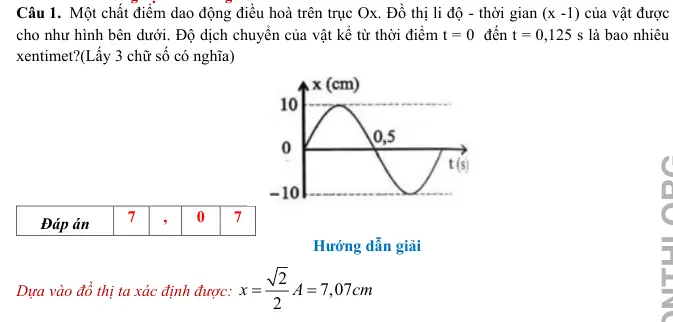{ loading=lazy }

#### Bài PDF 2

<!-- source-id: BT-Chuong-I-p31-q2-78 -->

Câu 2. Một vật dao động điều hoà dọc theo trục Ox. Đồ thị li độ - thời gian của vật được cho như
hình bên dưới. Lấy gia tổc rơi tự do là
2
2
g = π
10 m/s

. Chu kỳ dao động của vật bằng bao nhiêu
giây?

Đáp án
0
,
6

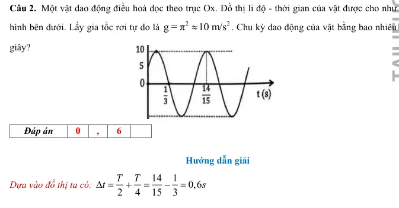{ loading=lazy }

#### Bài PDF 3

<!-- source-id: BT-Chuong-I-p31-q3-79 -->

Câu 3. Hình bên dưới là đồ thị của một vật dao động điều hòa với chu kì 1,2s. Gía trị của t0 trong đồ
thị là bao nhiêu giây?

Đáp án
0
,
7

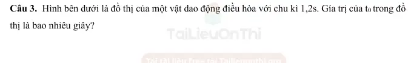{ loading=lazy }

#### Bài PDF 4

<!-- source-id: BT-Chuong-I-p32-q4-80 -->

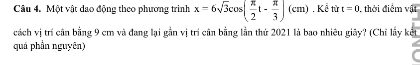{ loading=lazy }

#### Bài PDF 5

<!-- source-id: BT-Chuong-I-p45-q1-126 -->

Câu 1. Cho đồ thị li độ theo thời gian của một vật dao động điều hoà như hình vẽ. Tính chu kì
dao động của vật theo đơn vị giây?

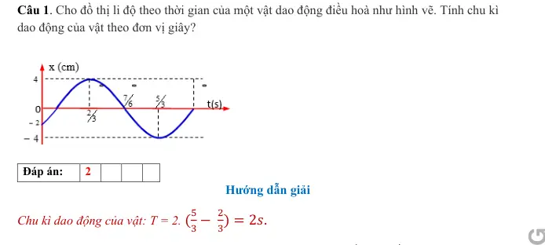{ loading=lazy }

#### Bài PDF 6

<!-- source-id: BT-Chuong-I-p45-q2-127 -->

Câu 2. Một vật dao động điều hòa với phương trình 𝑥= 2 𝑐𝑜𝑠(2𝜋𝑡−
𝜋
6) (𝑐𝑚). Xác định li độ
của vật theo đơn vị cm ở thời điểm t = 2 s. (Làm tròn đến số thập phân thứ 2 sau giấu phẩy)

#### Bài PDF 7

<!-- source-id: BT-Chuong-I-p45-q3-128 -->

Câu 3. Một chất điểm dao động điều hoà. Trong thời gian 1 phút, vật thực hiện được 30 dao động.
Chu kì dao động của chất điểm bằng bao nhiêu giây?

#### Bài PDF 8

<!-- source-id: BT-Chuong-I-p45-q4-129 -->

Câu 4. Một chất điểm dao động điều hoà theo phương trình 𝑥= 2 𝑐𝑜𝑠(2𝜋𝑡) ( x  tính bằng cm, t
tính bằng s). Tại thời điểm
1
t
3
=
s chất điểm có li độ bằng bao nhiêu cm.

#### Bài PDF 9

<!-- source-id: BT-Chuong-I-p46-q5-130 -->

Câu 5. Hình vẽ  là đồ thị phụ thuộc thời gian của li độ dao động điều hòa. Chu kì dao động là bao
nhiêu giây?

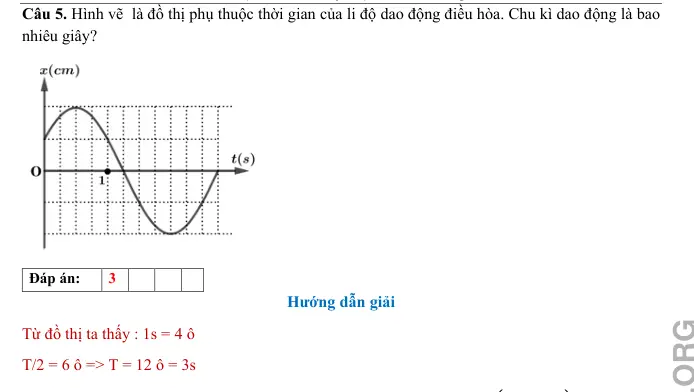{ loading=lazy }

#### Bài PDF 10

<!-- source-id: BT-Chuong-I-p46-q6-131 -->

Câu 6. Một chất điểm dao động điều hoà theo phương trình 𝑥= 3 𝑐𝑜𝑠(4𝜋𝑡+
𝜋
3) ( x  tính bằng
cm, t  tính bằng s). Trong một chu kì chất điểm đi được bao nhiêu cm?

#### Bài PDF 11

<!-- source-id: BT-Chuong-I-p52-q2-155 -->

Câu 2. Cho đồ thị li độ theo thời gian của một vật dao động điều hoà như hình vẽ. Tính tần số
dao động của vật theo đơn vị Hz (làm tròn đến hai chữ số thập phân sau giấu phẩy)?

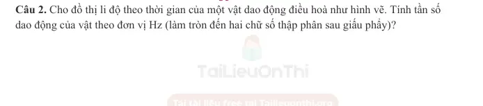{ loading=lazy }

#### Bài PDF 12

<!-- source-id: BT-Chuong-I-p53-q3-156 -->

Câu 3. Cho đồ thị li độ theo thời gian của một vật dao động điều hoà như hình vẽ. Xác định pha
dao động của vật tại thời điểm t = 4s theo đơn vị rad (làm tròn đến chữ số thập phân thứ hai sau
dấu phẩy)?

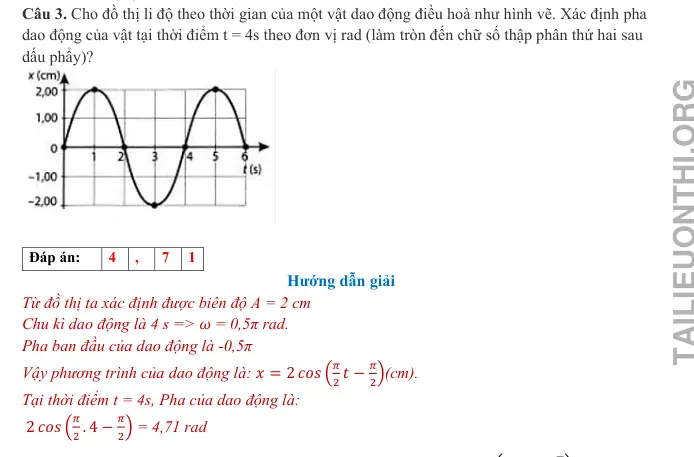{ loading=lazy }

#### Bài PDF 13

<!-- source-id: BT-Chuong-I-p53-q4-157 -->

Câu 4. Một chất điểm dao động điều hoà theo phương trình 𝑥= 6 𝑐𝑜𝑠(4𝜋𝑡+
𝜋
3) ( x  tính bằng
cm, t  tính bằng s). Tại thời điểm
1
t
3
=
s chất điểm có li độ bằng bao nhiêu cm.

#### Bài PDF 14

<!-- source-id: BT-Chuong-I-p55-q5-158 -->

Câu 5. Cho đồ thị li độ theo thời gian của hai chất điểm dao động điều hoà như hình vẽ. Xác định
thời điểm gần nhất (theo đơn vị giây) kể từ t = 0 mà li độ của  x1 = 0 cm, li độ của x2 = 5 cm?
(làm tròn đến chữ số thập phân thứ nhất sau dấu phẩy)

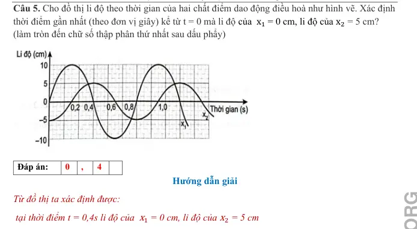{ loading=lazy }

#### Bài PDF 15

<!-- source-id: BT-Chuong-I-p55-q6-159 -->

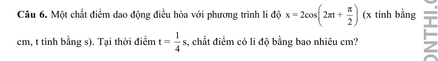{ loading=lazy }

### Nhận biết — Trắc nghiệm 4 lựa chọn

#### Bài PDF 16

<!-- source-id: BT-Chuong-I-p27-q16-70 -->

Câu 16. Một vật dao động điều hòa trên trục Ox. Hình bên là đồ thị biểu diễn sự phụ thuộc của li độ x vào
thời gian t. Phương trình dao động của li độ là

A. x = 5cos(2πt-π/2) cm.

B. x = 5cos(2πt+π/2) cm.

C. x = 5cos(πt+π/2) cm.

D. x=5cosπt cm.

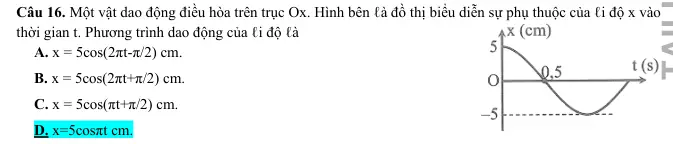{ loading=lazy }

#### Bài PDF 17

<!-- source-id: BT-Chuong-I-p27-q17-71 -->

Câu 17. Một vật giao động điều hòa có đồ thị li độ theo
thời gian như đồ thị hình bên. Tần số góc của vật là

A. π rad/s.
B. 2π rad/s.

C. π
2
rad/s.
D. 4π rad/s.

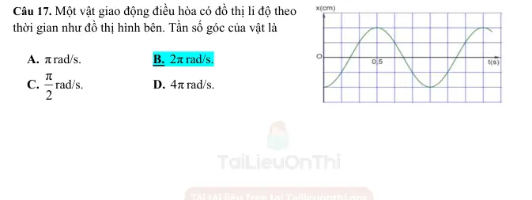{ loading=lazy }

#### Bài PDF 18

<!-- source-id: BT-Chuong-I-p37-q2-84 -->

Câu 2. Một chất điểm dao động điều hòa với phương trình x = Acos(ωt + φ), trong đó A, ω là các
hằng số dương. Pha của dao động ở thởi điểm t là
A. ωt + φ.
B. ω.
C. φ.
D. ωt.

#### Bài PDF 19

<!-- source-id: BT-Chuong-I-p37-q3-85 -->

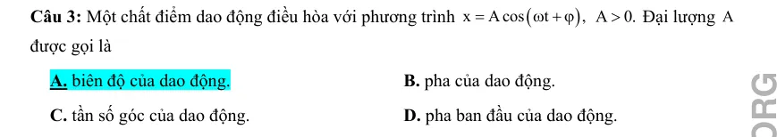{ loading=lazy }

#### Bài PDF 20

<!-- source-id: BT-Chuong-I-p37-q4-86 -->

Câu 4. Trong phương trình dao động điều hoà: x = Acos(ωt + ϕ), radian (rad) là đơn vị của đại
lượng
    A. biên độ A

B. tần số góc ω
    C. pha dao động (ωt + ϕ)
D. chu kỳ dao động T

#### Bài PDF 21

<!-- source-id: BT-Chuong-I-p37-q5-87 -->

Câu 5. Tần số góc có đơn vị là
A. Hz.
B. cm.
C. rad.
D. rad/s.

#### Bài PDF 22

<!-- source-id: BT-Chuong-I-p37-q6-88 -->

Câu 6. Vật dao động điều hòa với li độ, biên độ, tần số và pha ban đầu lần lượt là x, A, f, φ. Đại
lượng luôn dương trong bốn đại lượng trên là
A. f, x.
B. A, f.
C. A, φ.
D. A, x.

#### Bài PDF 23

<!-- source-id: BT-Chuong-I-p37-q7-89 -->

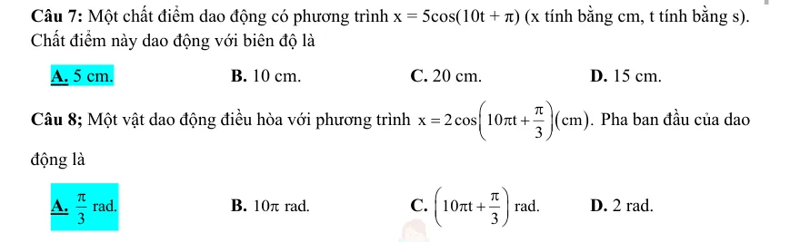{ loading=lazy }

#### Bài PDF 24

<!-- source-id: BT-Chuong-I-p38-q10-91 -->

Câu 10. Một chất điểm dao động điều hòa với phương trình x = Acos(ωt + φ), trong đó ω có giá
trị dương. Đại lượng ω gọi là
A. biên độ dao động.
B. chu kì của daođộng.
C. tần số góc của dao động.
D. pha ban đầu của daođộng.

#### Bài PDF 25

<!-- source-id: BT-Chuong-I-p38-q11-92 -->

Câu 11. Vật dao động điều hòa với phương trình: x = 8cos(πt + π/6)cm. Pha ban đầu của dao động
là
A.
/ 6rad
π

B.
/ 6rad
π
−

C. (
)
/ 6
t
rad
π
π
+

D.
/ 3rad
π

#### Bài PDF 26

<!-- source-id: BT-Chuong-I-p38-q12-93 -->

Câu 12. Một vật dao động điều hòa với phương trình x = 2cos(20t + π/2) cm. Pha của dao động
tại thời điểm t là:
A. π/2 (rad)
B. 20t + π/2 (rad)
C. 2 rad/s
D. 20 (rad)

#### Bài PDF 27

<!-- source-id: BT-Chuong-I-p38-q13-94 -->

Câu 13. Một vật nhỏ dao động điều hòa theo một quỹ đạo dài 8cm. Dao động này có biên độ là:

A. 16 cm.

B. 8 cm.

C. 48 cm.

D. 4 cm.

#### Bài PDF 28

<!-- source-id: BT-Chuong-I-p38-q14-95 -->

Câu 14. Một vật nhỏ dao động điều hòa theo phương trình  x = A cos10t  (t tính bằng s). Tại t=2s,
pha của dao động là:
A. 5 rad.
B. 10 rad.

C. 40 rad.

D. 20 rad.

#### Bài PDF 29

<!-- source-id: BT-Chuong-I-p38-q15-96 -->

Câu 15. Một chất điểm dao dộng theo phương trình  x = 6cosωt (cm). Dao động của chất điểm có
biên độ là
A.12 cm.

B. 3 cm.

C. 6 cm.

D. 2 cm.

#### Bài PDF 30

<!-- source-id: BT-Chuong-I-p38-q16-97 -->

Câu 16. Chu kì trong dao động điều hòa có đơn vị là
A. Hz.
B. kg.

C. m.

D. s.

#### Bài PDF 31

<!-- source-id: BT-Chuong-I-p38-q17-98 -->

Câu 17. Một chất điểm dao động điều hòa trên đoạn thẳng có chiều dài quỹ đạo L. Biên độ của
dao động là:
A. 2L.
B. L/2.

C. L.

D. L/4.

#### Bài PDF 32

<!-- source-id: BT-Chuong-I-p38-q18-99 -->

Câu 18. Công thức nào sau đây biểu diễn sự liên hệ giữa tần số góc ω, tần số f  và chu kì T  của
một dao động điều hòa?
A.
2
2 T
.
f
π
ω= π
=

B.
T
2 f
.
2
ω= π=
π
C.
1
T
.
f
2
ω
=
=
π
D.
2
2 f
.
T
π
ω= π=

#### Bài PDF 33

<!-- source-id: BT-Chuong-I-p41-q40-121 -->

Câu 40. Biết phương trình dao động của một trong hai vật là x = 8cos(5πt) cm. Phương trình dao
động của vật còn lại là
A. x = 6cos (5πt −π
2)  cm.
B. x = 6cos(5πt) cm
C. x = 6cos(4πt) cm.
D. x = 6cos (4πt −π
2)  cm.

#### Bài PDF 34

<!-- source-id: BT-Chuong-I-p47-q1-132 -->

Câu 1. Trong phương trình dao động điều hoà x = Acos(ωt + φ), radian trên giây là thứ nguyên
của đại lượng
A. A.
B. ω.
C. ωt + φ.
D. T.

#### Bài PDF 35

<!-- source-id: BT-Chuong-I-p47-q3-134 -->

Câu 3. Một vật dao động điều hòa theo phương trình x = 6cos(4πt) cm. Biên độ dao động của vật
là

A.  4 cm.
B. 6 cm.
C. –6 cm.
D. 12 m.

#### Bài PDF 36

<!-- source-id: BT-Chuong-I-p47-q5-136 -->

Câu 5. Biên độ của dao động là

A. -5 cm.

B. 5 cm.

C. 10 cm.

D. -10 cm.

#### Bài PDF 37

<!-- source-id: BT-Chuong-I-p47-q6-137 -->

Câu 6. Pha ban đầu của dao động là
A. 0,5π rad.
B. – 0,5π rad.
C. 0,25π rad.
D. π rad.

#### Bài PDF 38

<!-- source-id: BT-Chuong-I-p47-q7-138 -->

Câu 7. Tần số của dao động là

A. 0,2 Hz.
B. 0,1 Hz.
C. 5 Hz.
D. 10 Hz.

#### Bài PDF 39

<!-- source-id: BT-Chuong-I-p47-q8-139 -->

Câu 8. Một vật dao động điều hòa thực hiện 20 dao động toàn phần trong 20 s. Tần số dao động
của vật là
A. 0,5 Hz.
B. 0,05 Hz.
C. 2 Hz.
D. 1 Hz.

#### Bài PDF 40

<!-- source-id: BT-Chuong-I-p48-q9-140 -->

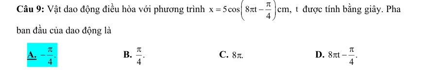{ loading=lazy }

#### Bài PDF 41

<!-- source-id: BT-Chuong-I-p48-q10-141 -->

Câu 10. Trong phương trình dao động điều hòa x = Acos(ωt + φ), đại lượng (ωt + φ) được gọi là
A. biên độ dao động.

B. tần số góc của dao động.
C. pha của dao động.

D. chu kì của dao động.

#### Bài PDF 42

<!-- source-id: BT-Chuong-I-p48-q11-142 -->

Câu 11. Một vật nhỏ dao động điều hòa theo phương trình x = Acos20t (t tính bằng s). Tại thời
điểm           t = 2 s, pha của dao động là
A. 10 rad.
B. 40 rad.
C. 5 rad.
D. 20 rad.

#### Bài PDF 43

<!-- source-id: BT-Chuong-I-p48-q13-144 -->

Câu 13. Một vật dao động điều hòa có phương trình x = 2cos(2πt – π/6) cm. Li độ của vật tại thời
điểm t = 0,25 (s) là

A. 1 cm.
B. 1,5 cm.
C. 0,5 cm.
D. –1 cm.

#### Bài PDF 44

<!-- source-id: BT-Chuong-I-p48-q14-145 -->

Câu 14. Một vật dao động điều hòa theo phương trình x = 3cos(πt + π/2) cm, pha dao động tại thời
điểm t = 1 (s) là

A. π (rad).
B. 2π (rad).
C. 1,5π (rad).
D. 0,5π (rad).

#### Bài PDF 45

<!-- source-id: BT-Chuong-I-p48-q15-146 -->

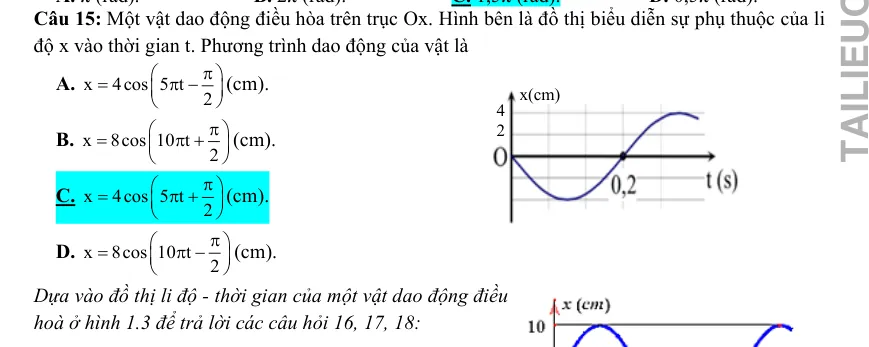{ loading=lazy }

#### Bài PDF 46

<!-- source-id: BT-Chuong-I-p48-q16-147 -->

Câu 16. Biên độ của dao động là

A. -5 cm.

B. 5 cm.

C. 10 cm.

D. -10 cm.

#### Bài PDF 47

<!-- source-id: BT-Chuong-I-p48-q17-148 -->

Câu 17. Pha ban đầu của dao động là
A. 0,5π rad.
B. – 0,5π rad.
C. 0,25π rad.
D. π rad.
x(cm)
4
2

#### Bài PDF 48

<!-- source-id: BT-Chuong-I-p49-q18-149 -->

Câu 18. Tần số của dao động là

A. 0,2 Hz.
B. 0,5 Hz.
C. 1 Hz.
D. 2 Hz.

### Nhận biết — Đúng/Sai

#### Bài PDF 49

<!-- source-id: BT-Chuong-I-p28-q1-73 -->

Câu 1. Một vật dao động điều hòa có đồ thị li độ  phụ thuộc thời gian như hình bên dưới.

Nhận định nào sau đây đúng, nhận định nào sai khi nói về dao động trên?

Phát biểu
Đúng
Sai
a
Biên độ dao động của vật là 5 cm

S
b
Tần số dao động của vật là 1 Hz.
Đ

c
Tần số góc của dao động là π rad/s

S
d
Độ dịch chuyển của vật ở thời điểm 1,2 s là 2 cm.
Đ

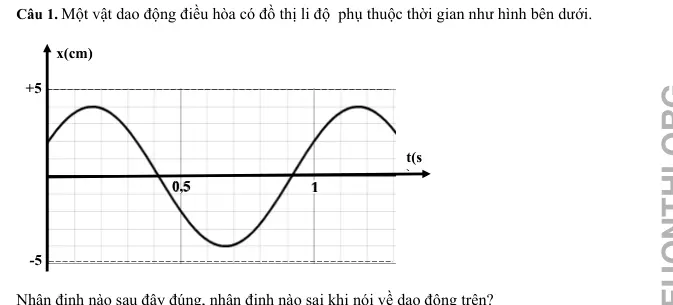{ loading=lazy }

#### Bài PDF 50

<!-- source-id: BT-Chuong-I-p42-q1-122 -->

Câu 1. Cho hai dao động điều hoà có đồ thị dao động như hình vẽ.

Phát biểu
Đúng Sai
a. Hai dao động có cùng chu kì
Đ

b. Tần số của hai dao động là 0,5 Hz

S
c. Hai dao động cùng pha
Đ

d. Biên độ của hai dao động là 2cm và 6cm
Đ

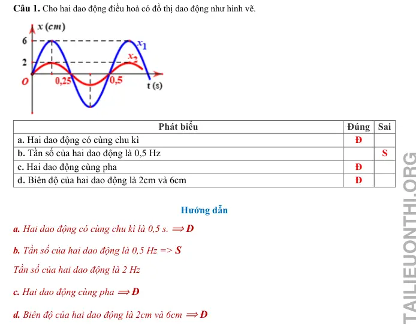{ loading=lazy }

#### Bài PDF 51

<!-- source-id: BT-Chuong-I-p42-q2-123 -->

Câu 2. Một vật dao động điều hòa có đồ thị li độ phụ thuộc thời gian như hình.

Phát biểu
Đúng Sai
a. Biên độ dao động của vật bằng 2 cm.
Đ

b. Chu kì dao động của vật bằng 0,6 s.

S
c. Pha ban đầu của dao động là - 0,5π rad.

S
d. Tại thời điểm t = 0,6 s vật ở vị trí cân bằng.
Đ

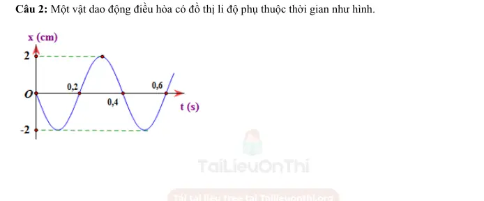{ loading=lazy }

#### Bài PDF 52

<!-- source-id: BT-Chuong-I-p43-q3-124 -->

Câu 3. Cho đồ thị li độ theo thời gian của một vật dao động điều hoà như hình vẽ:

Phát biểu
Đúng Sai
a. Biên độ dao động của vật bằng 0,2 cm
Đ

b. Chu kì dao động của vật bằng 0,4 s
Đ

c. Pha ban đầu của dao động là 0,5π rad

S
d. Tại thời điểm t = 0,5 s vật ở vị trí biên
Đ

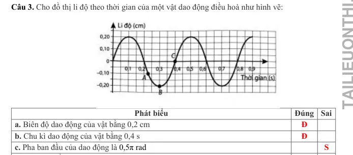{ loading=lazy }

#### Bài PDF 53

<!-- source-id: BT-Chuong-I-p44-q4-125 -->

Câu 4. Cho hai dao động điều hòa cùng tần số có đồ thị như
sau:

Phát biểu
Đúng Sai
a. Hai dao động có cùng chu kì
Đ

b. Chu kì của hai dao động là 4s
Đ

c. Hai dao động cùng pha

S
d. Biên độ của hai dao động là 3cm và 2cm
Đ

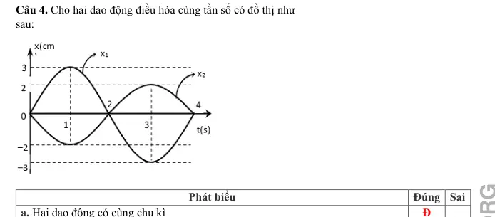{ loading=lazy }

#### Bài PDF 54

<!-- source-id: BT-Chuong-I-p49-q1-150 -->

Câu 1. Cho đồ thị li độ theo thời gian của một vật dao động điều hoà như hình vẽ:

Phát biểu
Đúng Sai
a. Biên độ dao động của vật bằng 10 cm
Đ
S
b. Chu kì dao động của vật bằng 1 s

S
c. Pha ban đầu của dao động là 0,5π rad

S
d. Tại thời điểm t = 1,5 s vật ở vị trí biên
Đ

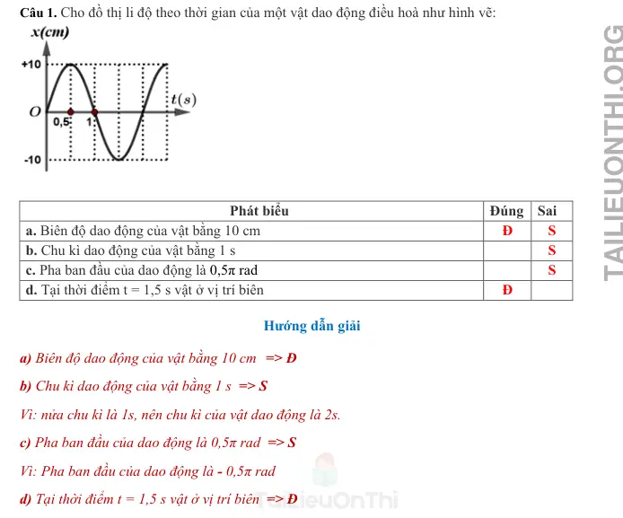{ loading=lazy }

#### Bài PDF 55

<!-- source-id: BT-Chuong-I-p49-q2-151 -->

Câu 2. Một vật dao động điều hòa theo phương trình
(
)(
)
x
5cos 10 t
cm .
=
π

Phát biểu
Đúng Sai
a. Pha ban đầu của dao động là 10π (rad)

S
b. Tần số của dao động là 5 Hz
Đ

c. Pha của dao động là tại thời điểm t = 0,075 s là
3π
4  rad
Đ

d. Tại thời điểm t = 0,075 s li độ của vật là −2,5√2(𝑐𝑚).
Đ

### Thông hiểu — Trắc nghiệm 4 lựa chọn

#### Bài PDF 56

<!-- source-id: BT-Chuong-I-p8-q3-3 -->

Câu 3. Trong phương trình dao động điều hòa x = Acos(ωt + φ) , đại lượng (ωt + φ) gọi là
     A. tần số góc của dao động.
     B. pha của dao động.
     C. biên độ của dao động.
     D. chu kì của dao động.

#### Bài PDF 57

<!-- source-id: BT-Chuong-I-p8-q6-6 -->

Câu 6. Một vật dao động điều hòa với phương trình x = Acos(ωt + φ), mét(m). Trong phương trình
đại lượng chỉ độ dịch chuyển từ vị trí cân bằng đến vị trí của vật tại thời điểm t là
 A. ω.
B. A.
C. x.
D. φ.

#### Bài PDF 58

<!-- source-id: BT-Chuong-I-p8-q8-8 -->

Câu 8. Đối với dao động tuần hoàn, số lần dao động được lặp lại trong một đơn vị thời gian gọi là

A. tần số dao động.
B. chu kỳ dao động.
C. pha ban đầu.
D. tần số góc.

#### Bài PDF 59

<!-- source-id: BT-Chuong-I-p8-q9-9 -->

Câu 9. Trường hợp nào sau đây chuyển động của vật không phải là dao động cơ?

A. Máy bay hạ cánh xuống sân bay.
B. Chiếc đu đung đưa.

C. Dây đàn vĩ cầm rung động.
D. Pittông chuyển động lên xuống trong xilanh.

#### Bài PDF 60

<!-- source-id: BT-Chuong-I-p9-q12-12 -->

Câu 12. Hình vẽ là đồ thị dao động điều hòa x(t) của một vật. Biểu thị bằng chữ "B" trong hình là
chỉ đại lượng đặc trưng nào của dao động điều hòa?

A. Tần số.
B. Chu kỳ.
C. Tần số góc.
D. Biên độ.

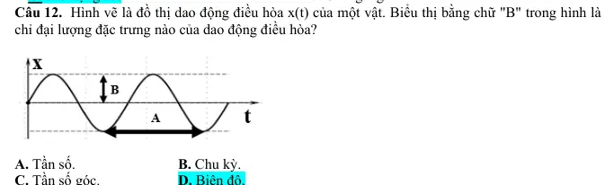{ loading=lazy }

#### Bài PDF 61

<!-- source-id: BT-Chuong-I-p9-q15-15 -->

Câu 15. Đồ thị li độ theo thời gian của một chất
điểm dao động điều hoà được mô tả như hình bên.
Pha ban đầu của dao động là
A.
2π  rad.
3
−

B.  2π  rad.
3

C. π  rad.
6

D.
π  rad.
6
−

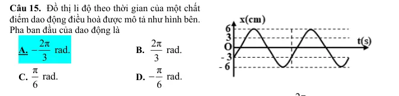{ loading=lazy }

#### Bài PDF 62

<!-- source-id: BT-Chuong-I-p9-q16-16 -->

Câu 16. Một chất điểm dao động điều hòa theo phương trình:
2π
x = 8cos(
t + π)
3
mm, biên độ dao
động của chất điểm là
     A. 8 cm.
B. 2π
3
 m.
C. 0,8 cm.
  D. 2π
3
 cm.

#### Bài PDF 63

<!-- source-id: BT-Chuong-I-p10-q18-18 -->

Câu 18. Cho một chất điểm dao động điều hòa quanh vị trí cân bằng O. Li độ biến thiên theo thời
gian như hình. Biên độ dao động là

A. 5 cm
B. - 5 cm
C. 4 cm
D. – 4 cm

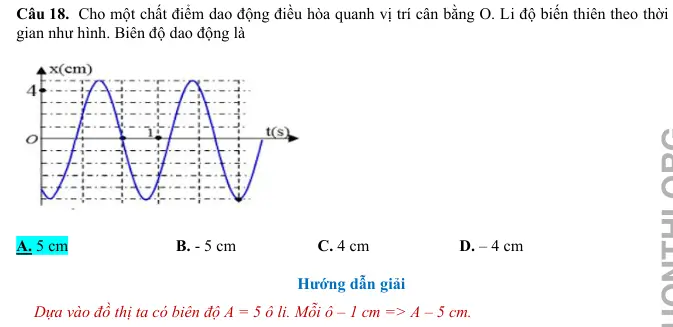{ loading=lazy }

#### Bài PDF 64

<!-- source-id: BT-Chuong-I-p10-q19-19 -->

Câu 19. Đồ thị như hình  biểu diễn sự phụ thuộc của li độ x vào
thời gian của một vật dao động điều hoà. Đoạn PR trên trục thời
gian t biểu thị
A. một phần hai chu kỳ.
B. hai lần tần số.
C. một phần hai tần số.
D. hai lần chu kỳ.

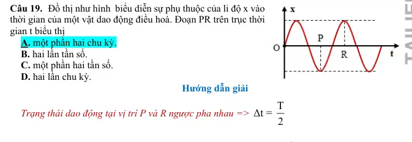{ loading=lazy }

#### Bài PDF 65

<!-- source-id: BT-Chuong-I-p10-q20-20 -->

Câu 20. Một vật dao động điều hòa trên trục Ox. Hình bên là đồ
thị biểu diễn sự phụ thuộc của li độ x vào thời gian t. Pha ban
đầu của dao động là
A. 0,5π rad.
B. – 0,5π rad.
C. 0,25π rad.
D. π rad.

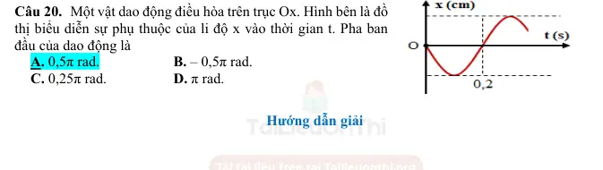{ loading=lazy }

#### Bài PDF 66

<!-- source-id: BT-Chuong-I-p11-q21-21 -->

Câu 21. Một dao động điều hòa theo phương trình
(
)
x = 10cos 4πt  cm , li độ của vật tại thời điểm
t = 5 s là
A. 4,56 cm.
B. 10 cm.
C. 4cm.

D. 10 m.

#### Bài PDF 67

<!-- source-id: BT-Chuong-I-p11-q22-22 -->

Câu 22. Một dao động điều hoà có phương trình x = 6cos(4πt) cm thì tần số góc của dao động là
     A. 4π Hz.
     B. 4π rad.
     C. 4π rad/s.
     D. 4π s.

#### Bài PDF 68

<!-- source-id: BT-Chuong-I-p11-q23-23 -->

Câu 23. Một vật nhỏ dao động điều hòa với biên độ 4 cm trên trục Ox. Tại thời điểm pha của dao
động là π  rad
4
 thì vật có li độ
A. – 2 cm và theo chiều dương trục Ox.

B. 2 2 cm  và theo chiều âm trục Ox.
C. – 2 cm và theo chiều âm trục Ox.
D. 2 2 cm  và theo chiều dương của trục Ox.

#### Bài PDF 69

<!-- source-id: BT-Chuong-I-p11-q24-24 -->

Câu 24. Một dao động điều hòa đơn giản thực hiện được 5 dao động điều hòa trong thời gian 4,8 s.
Chu kỳ (T) của dao động này là
A. 4,8 s.
B. 0,96 s.
C. 9,8 s.

D. 9,6 s.

#### Bài PDF 70

<!-- source-id: BT-Chuong-I-p11-q25-25 -->

Câu 25. Một vật dao động điều hòa trên trục Ox. Hình bên là
đồ thị biểu diễn sự phụ thuộc của li độ x vào thời gian t. Pha ban
đầu của dao động là
A. 0,5π rad.

B. – 0,5π rad.
C. 0,25π rad.

D. π rad.

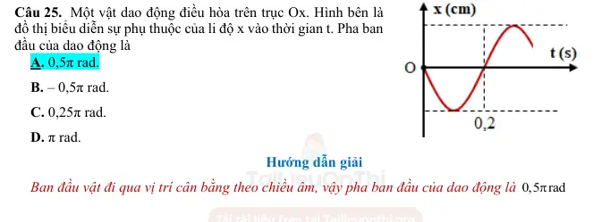{ loading=lazy }

#### Bài PDF 71

<!-- source-id: BT-Chuong-I-p12-q26-26 -->

Câu 26. Một chất điểm dao động điều hoà có tần số góc ω = 10π (rad/s). Tần số của dao động là
A. 5Hz.

B.10Hz.

C. 20Hz.

D. 5π Hz.

#### Bài PDF 72

<!-- source-id: BT-Chuong-I-p12-q27-27 -->

Câu 27. Một vật dao động điều hòa trên trục Ox. Hình bên là
đồ thị biểu diễn sự phụ thuộc của li độ x vào thời gian t. Tần số
góc của dao động bằng
A. 5π rad/s.

B. 5 rad/s.

C. 10 rad/s.

D. 10π rad/s.

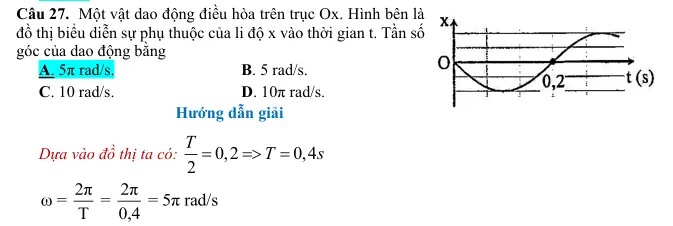{ loading=lazy }

#### Bài PDF 73

<!-- source-id: BT-Chuong-I-p12-q28-28 -->

Câu 28. Hình vẽ bên là đồ thị biểu diễn sự phụ thuộc của li độ
vào thời gian t của một vật dao động điều hòa. Thời điểm vật đi
qua vị trí cân bằng lần đầu tiên là
A. 0,4 s.

B. 0,2 s.

C. 0,1 s.

D. 0,8 s.

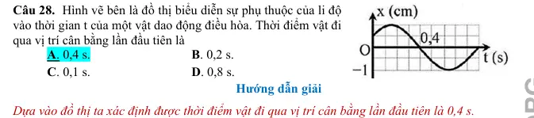{ loading=lazy }

#### Bài PDF 74

<!-- source-id: BT-Chuong-I-p12-q29-29 -->

Câu 29. Một vật dao động điều hòa trên trục Ox. Hình
bên là đồ thị biểu diễn sự phụ thuộc của li độ x vào thời
gian t. Tần số và biên độ của dao động là:
A. 2Hz; 10 cm.

B. 2 Hz; 20cm
C. 1 Hz; 10cm.

D. 1Hz; 20cm.

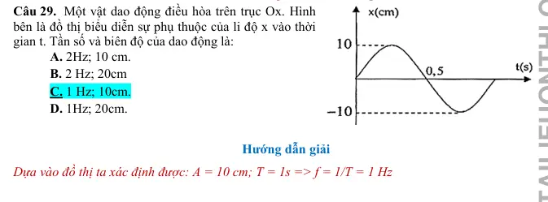{ loading=lazy }

#### Bài PDF 75

<!-- source-id: BT-Chuong-I-p12-q30-30 -->

Câu 30. Một dao động điều hòa có đồ thị như hình vẽ. Kết
luận nào sau đây sai?
A. A = 4 cm.

B. T = 0,5 s.

C. f  = 1 Hz.

D. ω = 2π rad/s.

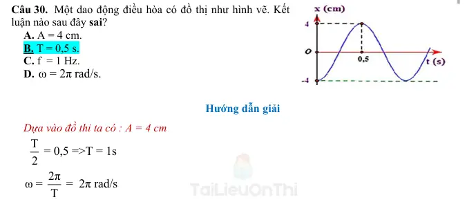{ loading=lazy }

#### Bài PDF 76

<!-- source-id: BT-Chuong-I-p13-q31-31 -->

Câu 31. Hình vẽ là đồ thị li độ - thời gian của hai dao động. Nhận định nào sau đây đúng khi nói về
hai dao động?

A. Hai dao động cùng biên độ và tần số.
B. Hai dao động khác biên độ và tần số.
C. Hai dao động khác biên độ và cùng tần số.
D. Hai dao động cùng biên độ và khác tần số.

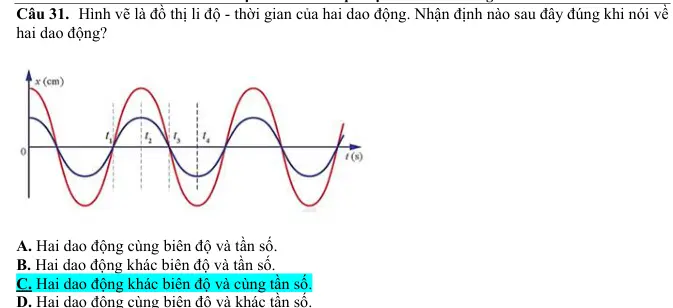{ loading=lazy }

#### Bài PDF 77

<!-- source-id: BT-Chuong-I-p38-q19-100 -->

Câu 19. Một chất điểm dao động điều hoà có phương trình li độ theo thời gian là:
𝑥= 2√3cos (10𝜋𝑡+ 𝜋
3) (cm)
Tần số của dao động là

A. 10 Hz.
B. 20 Hz.
C. 10𝜋Hz.
D. 5 Hz.

#### Bài PDF 78

<!-- source-id: BT-Chuong-I-p39-q21-102 -->

Câu 21. Một vật dao động điều hòa với biên độ A = 5 cm. Trong các giá trị sau, giá trị nào có thể
là li độ của vật ?
A. x = 6 cm.
B. x = 10 cm.
C. x = – 6 cm.
D. x = 1,2 cm.

#### Bài PDF 79

<!-- source-id: BT-Chuong-I-p39-q22-103 -->

Câu 22. Một vật dao động điều hòa, sau 3 giây vật thực hiện được 30 dao động. Hãy xác định tần
số góc của vật dao động?
A. 10 rad/s
B. 20π rad/s
C. 90 rad/s
D. 0.1 rad/s
Dựa vào đồ thị li độ - thời gian của một vật dao động điều hoà
ở hình 1.1 để trả lời các câu hỏi 23, 24:

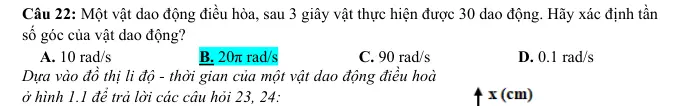{ loading=lazy }

#### Bài PDF 80

<!-- source-id: BT-Chuong-I-p39-q23-104 -->

Câu 23. Pha ban đầu của dao động là
A. 0,5π rad.
B. – 0,5π rad.
C. 0,25π rad.
D. π rad.

#### Bài PDF 81

<!-- source-id: BT-Chuong-I-p39-q24-105 -->

Câu 24. Chu kì của dao động là

A. 0,2 s.
B. 0,4 s.

C. 5 s.
D. 2,5 s.

#### Bài PDF 82

<!-- source-id: BT-Chuong-I-p39-q25-106 -->

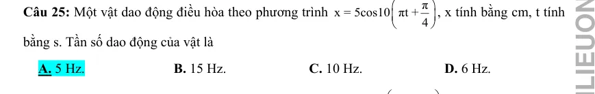{ loading=lazy }

#### Bài PDF 83

<!-- source-id: BT-Chuong-I-p39-q26-107 -->

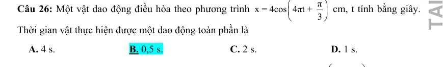{ loading=lazy }

#### Bài PDF 84

<!-- source-id: BT-Chuong-I-p39-q27-108 -->

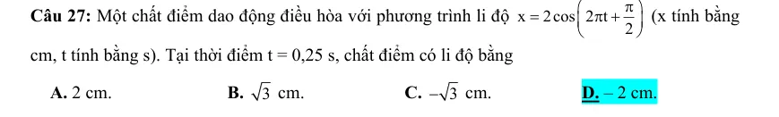{ loading=lazy }

#### Bài PDF 85

<!-- source-id: BT-Chuong-I-p40-q31-112 -->

Câu 31. Một vật dao động điều hoà có phương trình x = 4cos(20πt – π/6) cm. Tần số và pha ban
đầu của dao động lần lượt là
A. 10 Hz và -π/6 rad
C. 1/10 Hz và –π/6 rad
B. 1/10 Hz và π/6 rad
D. 10 Hz và π/6 rad

#### Bài PDF 86

<!-- source-id: BT-Chuong-I-p40-q32-113 -->

Câu 32. Một chất điểm dao động điều hoà theo phương trình
(
)
x
5cos 2 t
=
π cm, chu kỳ dao động
của chất điểm là
A. T = 1 s.
B. T = 2 s.
C. T = 0,5 s.
D. T = 1 Hz.

#### Bài PDF 87

<!-- source-id: BT-Chuong-I-p40-q33-114 -->

Câu 33. Một vật dao động tuần hoàn mỗi phút thực hiện được 360 dao động. Tần số dao động của
con lắc là
A. 7 Hz.
B. 5 Hz.
C. 8 Hz.
D. 6 Hz.

### Vận dụng — Trả lời ngắn

#### Bài PDF 88

<!-- source-id: BT-Chuong-I-p22-q2-48 -->

Câu 2. Một chất điểm dao động điều hòa với biên độ 5 cm và thời gian thực hiện được 1 dao động là
1/3s. Tính tốc độ trung bình trong một dao động (tính bằng m/s)? (Kết quả lấy theo đơn vị chuẩn của
hệ SI và lấy đến 1 chữ số sau dấu phẩy thập phân)

Đáp án
0
,
6

#### Bài PDF 89

<!-- source-id: BT-Chuong-I-p22-q4-50 -->

Câu 4. Một vật dao động điều hòa trên trục Ox. Hình dưới là đồ thị biểu diễn sự phụ thuộc của li độ
x vào thời gian t. Chu kỳ dao động của vật bao nhiêu giây?

Đáp án
0
,
3
6

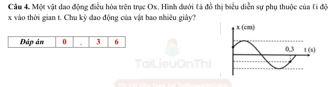{ loading=lazy }

#### Bài PDF 90

<!-- source-id: BT-Chuong-I-p23-q5-51 -->

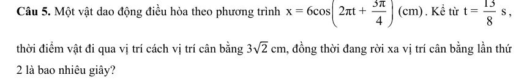{ loading=lazy }

#### Bài PDF 91

<!-- source-id: BT-Chuong-I-p23-q6-52 -->

Câu 6. Một vật dao động điều hòa theo phương trình x = 10cos(3πt −
π
3) (cm). Kể từ t = 0, thời điểm
vật qua vị trí x = 8 cm lần thứ 16 bằng bao nhiêu giây?

Đáp án
4
,
8
5

#### Bài PDF 92

<!-- source-id: BT-Chuong-I-p24-q7-53 -->

Câu 7. Cho đồ thị li độ - thời gian của một vật dao động điều hòa như hình . Độ dịch chuyển của vật
từ lúc t1 = 5s đến t2 = 9s là bao nhiêu xentimet ?

Đáp án
2
,
5

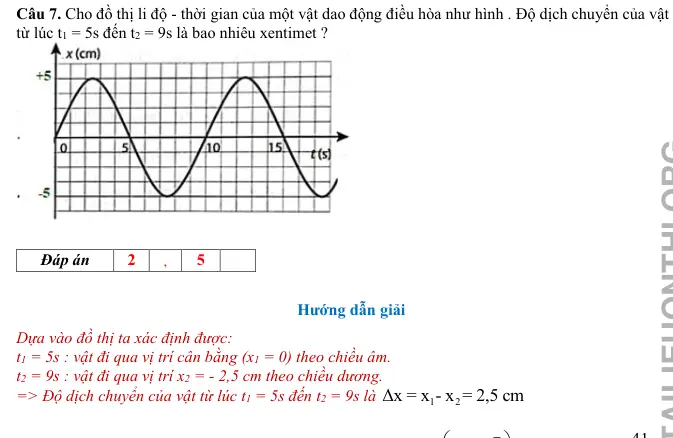{ loading=lazy }

#### Bài PDF 93

<!-- source-id: BT-Chuong-I-p24-q8-54 -->

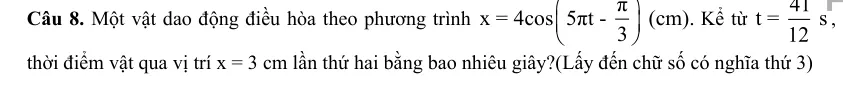{ loading=lazy }

### Vận dụng — Trắc nghiệm 4 lựa chọn

#### Bài PDF 94

<!-- source-id: BT-Chuong-I-p15-q36-36 -->

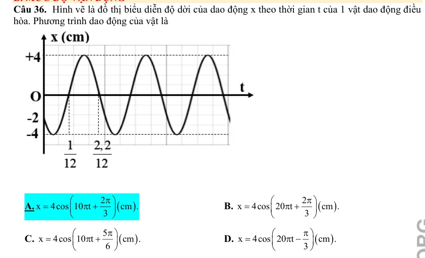{ loading=lazy }

#### Bài PDF 95

<!-- source-id: BT-Chuong-I-p15-q38-38 -->

Câu 38. Một vật dao động điều hòa trên trục Ox. Tại thời điểm t = 0, vật ở biên dương. Tại thời điểm
t = τ và t = 2τ, vật có li độ tương ứng là
2
3
 cm và -5 cm. Biên độ dao động của vật  bằng
A. 9 cm.

B.3 cm.

C. 6 cm.

D. 5 cm.

#### Bài PDF 96

<!-- source-id: BT-Chuong-I-p16-q39-39 -->

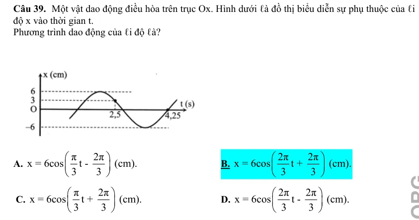{ loading=lazy }

#### Bài PDF 97

<!-- source-id: BT-Chuong-I-p16-q40-40 -->

Câu 40. Một vật dao động điều hòa trên trục Ox. Hình bên là đồ thị biểu diễn sự phụ thuộc của li
độ x vào thời gian t. Pha ban đầu của dao động là

A. π  rad.
6

B.
π  rad.
6
−

  C. π  rad.
3

D.
π  rad.
3
−

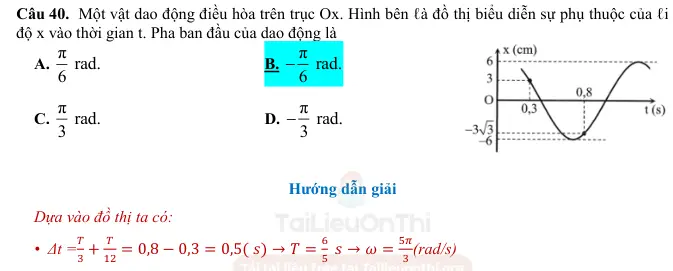{ loading=lazy }

#### Bài PDF 98

<!-- source-id: BT-Chuong-I-p26-q2-56 -->

Câu 2. Một vật dao động điều hòa theo phương trình
(
)
x = 10cos 2πt + π  (cm). Tần số góc dao
động của vật là

A. ω = 2π rad/s.
B. ω = π rad/s.
C. ω = 2πt rad/s.
D. ω = 2πt + π  rad/s.

#### Bài PDF 99

<!-- source-id: BT-Chuong-I-p26-q3-57 -->

Câu 3. Trong phương trình dao động điều hoà
(
)
o
x = Acos ωt + φ
, độ dịch chuyển cực đại của
vật tính từ vị trí cân bằng là
 A. biên độ A.

B. tần số góc ω.
 C. pha dao động (ωt +  φo).
D. chu kỳ dao động T.

#### Bài PDF 100

<!-- source-id: BT-Chuong-I-p26-q4-58 -->

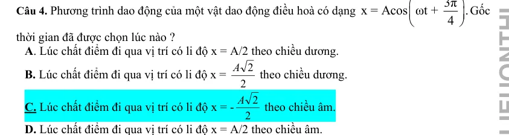{ loading=lazy }

#### Bài PDF 101

<!-- source-id: BT-Chuong-I-p26-q5-59 -->

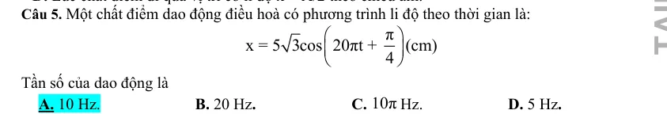{ loading=lazy }

#### Bài PDF 102

<!-- source-id: BT-Chuong-I-p26-q7-61 -->

Câu 7. Trường hợp nào sau đây chuyển động của vật không phải là dao động cơ?

A. Dây đàn vĩ cầm rung động.

B. Cành cây đung đưa trước gió.

C. Thuyền nhấp nhô trên mặt biển.

D. Thả một vật rơi từ trên cao xuống.

#### Bài PDF 103

<!-- source-id: BT-Chuong-I-p27-q11-65 -->

Câu 11. Nhận định nào sau đây là đúng?
A. Biên độ là đại lượng đại số.
B. Biên độ là đại lượng luôn dương.
C. Biên độ là đại lượng luôn âm.
D. Biên độ là đại lượng biến đổi theo thời gian.

#### Bài PDF 104

<!-- source-id: BT-Chuong-I-p27-q12-66 -->

Câu 12. Trong phương trình dao động điều hoà
(
)
o
x = Acos ωt + φ
. Chọn đáp án phát biểu sai.
A. Biên độ A phụ thuộc vào cách kích thích dao động.
B. Biên độ A không phụ thuộc vào gốc thời gian.
C. Pha ban đầu φ  không phụ thuộc vào gốc thời gian.
D. Tần số góc ω  phụ thuộc vào các đặc tính của hệ.

#### Bài PDF 105

<!-- source-id: BT-Chuong-I-p40-q34-115 -->

Câu 34. Một vật dao động điều hoà theo phương trình x = 2cos(4πt + π/3) cm. Chu kỳ và tần số
dao động của vật là

A. T = 2 (s) và f = 0,5 Hz.
B. T = 0,5 (s) và f = 2 Hz

C. T = 0,25 (s) và f = 4 Hz.
D. T = 4 (s) và f = 0,5 Hz.

#### Bài PDF 106

<!-- source-id: BT-Chuong-I-p41-q37-118 -->

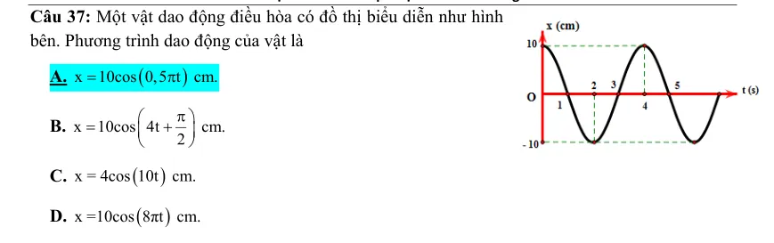{ loading=lazy }

#### Bài PDF 107

<!-- source-id: BT-Chuong-I-p41-q38-119 -->

Câu 38. Chu kì dao động của vật là
A. 0,5 s
B. 0,02 s

C. 0,4 s
D. 0,05 s

### Vận dụng — Đúng/Sai

#### Bài PDF 108

<!-- source-id: BT-Chuong-I-p18-q3-43 -->

Câu 3. Vật dao động điều hòa có đồ thị li độ  phụ thuộc thời gian như hình . Nhận định nào đúng,
nhận định nào sai?

Nội dung
Đúng Sai

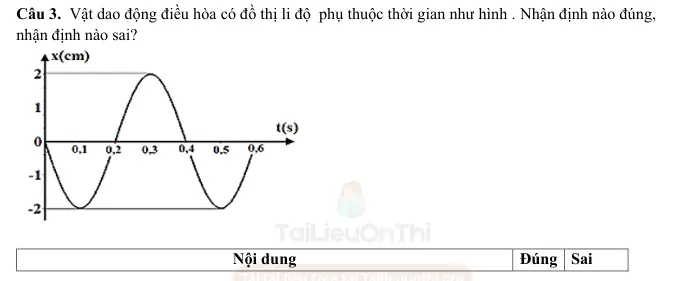{ loading=lazy }

#### Bài PDF 109

<!-- source-id: BT-Chuong-I-p20-q5-45 -->

Câu 5. Đồ thị li độ - thời gian (x -t) của một vật dao động điều hoà như hình. Phát biểu nào sau đây
đúng, phát biểu nào sai?

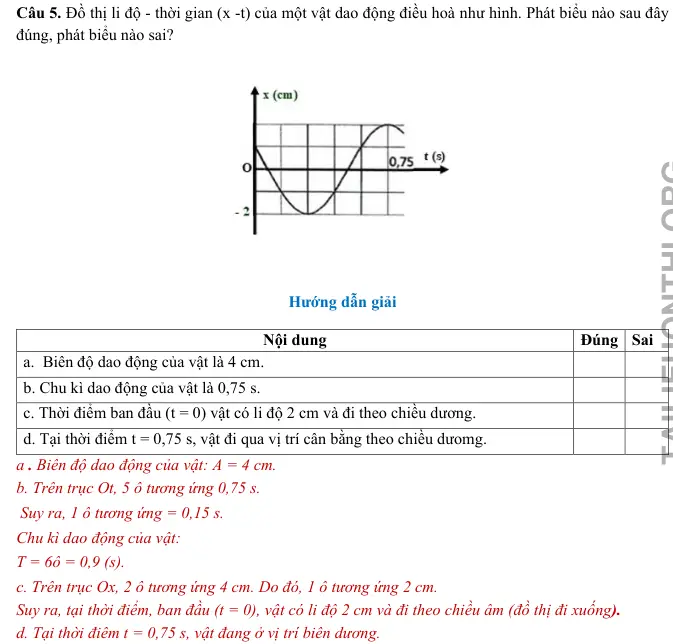{ loading=lazy }

#### Bài PDF 110

<!-- source-id: BT-Chuong-I-p20-q6-46 -->

Câu 6. Dao động của một vật là tổng hợp của hai dao động điều hoà cùng phương có li độ lần lượt
là x1 và x2. Hình vẽ là đồ thị biểu diễn sự phụ thuộc của x1 và x2 theo thời gian t.
Nhận định nào dưới đây đúng, nhận định nào sai?

Nội dung
Đúng Sai
a.  Biên độ dao động của vật là 4 cm.

b. Chu kì dao động của vật là 0,75 s.

c. Thời điểm ban đầu (t = 0) vật có li độ 2 cm và đi theo chiều dương.

d. Tại thời điểm t = 0,75 s, vật đi qua vị trí cân bằng theo chiều dưomg.

Nội dung
Đúng Sai
a. Tại thời điểm 0,4 s, hai dao động thành phần có cùng li độ.
Đ

b. Chu kì dao động của vật là 1,2 s.
Đ

c. Tại thời điểm t = 0 pha dao động của x2 là π  rad.
4

S
d. Dao động x1 nhanh pha hơn dao động x2 là 2π  rad.
3

S

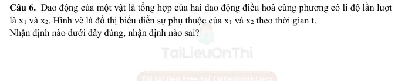{ loading=lazy }

