# Bài tập — Bài 1 — Đại cương về dao động điều hòa

[← Trở lại bài học](../../01-harmonic-oscillation-foundations.md)

## Phần A — Trắc nghiệm 4 lựa chọn

### Bài 1 — Mức 1 — Nhận biết

Một vật dao động điều hòa theo phương trình $x=6\cos(4\pi t-\pi/3)\,\mathrm{cm}$. Biên độ và tần số của dao động là

A. $6\,\mathrm{cm}$ và $2\,\mathrm{Hz}$.

B. $4\,\mathrm{cm}$ và $6\,\mathrm{Hz}$.

C. $6\,\mathrm{cm}$ và $4\,\mathrm{Hz}$.

D. $3\,\mathrm{cm}$ và $2\,\mathrm{Hz}$.

??? success "Đáp án và lời giải"
    Chọn **A**. So sánh với $x=A\cos(\omega t+\varphi)$: $A=6\,\mathrm{cm}$, $\omega=4\pi\,\mathrm{rad/s}$ nên $f=\omega/(2\pi)=2\,\mathrm{Hz}$.

### Bài 2 — Mức 1 — Nhận biết

Một dao động có chu kì $T=0,25\,\mathrm s$. Tần số góc bằng

A. $2\pi\,\mathrm{rad/s}$.

B. $4\pi\,\mathrm{rad/s}$.

C. $8\pi\,\mathrm{rad/s}$.

D. $16\pi\,\mathrm{rad/s}$.

??? success "Đáp án và lời giải"
    Chọn **C**. $\omega=2\pi/T=2\pi/0,25=8\pi\,\mathrm{rad/s}$.

### Bài 3 — Mức 1 — Nhận biết

Một vật dao động điều hòa có biên độ $A=5\,\mathrm{cm}$. Chiều dài quỹ đạo là

A. $2,5\,\mathrm{cm}$.

B. $5\,\mathrm{cm}$.

C. $10\,\mathrm{cm}$.

D. $20\,\mathrm{cm}$.

??? success "Đáp án và lời giải"
    Chọn **C**. Vật chuyển động giữa hai biên $-A$ và $+A$, vì vậy chiều dài quỹ đạo là $2A=10\,\mathrm{cm}$.

### Bài 4 — Mức 1 — Nhận biết

Phát biểu nào đúng?

A. Mọi dao động tuần hoàn đều là dao động điều hòa.

B. Dao động điều hòa là dao động có li độ biến thiên theo hàm sin hoặc cos của thời gian.

C. Biên độ dao động điều hòa có thể âm.

D. Tần số góc có đơn vị héc.

??? success "Đáp án và lời giải"
    Chọn **B**. Dao động điều hòa là trường hợp đặc biệt của dao động tuần hoàn; biên độ được quy ước dương và tần số góc có đơn vị rad/s.

## Phần B — Đúng/Sai

### Bài 5 — Mức 2 — Thông hiểu

Xét dao động $x=8\cos(5t+\pi/6)\,\mathrm{cm}$. Đánh dấu Đúng/Sai:

a) Biên độ bằng $8\,\mathrm{cm}$.

b) Chu kì bằng $2\pi/5\,\mathrm s$.

c) Tần số bằng $5\,\mathrm{Hz}$.

d) Pha ban đầu bằng $\pi/6$ rad.

??? success "Đáp án và lời giải"
    a) **Đúng**. $A=8\,\mathrm{cm}$.

    b) **Đúng**. $T=2\pi/\omega=2\pi/5\,\mathrm s$.

    c) **Sai**. $f=\omega/(2\pi)=5/(2\pi)\,\mathrm{Hz}$.

    d) **Đúng**. $\varphi=\pi/6$ rad.

### Bài 6 — Mức 2 — Thông hiểu

Một vật dao động điều hòa có phương trình $x=A\cos(\omega t+\varphi)$ với $A>0$, $\omega>0$. Xét các phát biểu:

a) $x$ luôn nằm trong đoạn $[-A,A]$.

b) Sau mỗi khoảng thời gian $T$, trạng thái dao động lặp lại.

c) Hệ số của $t$ trong pha chính là tần số $f$.

d) Nếu đổi $A$ thành $-A$ mà giữ nguyên pha thì vẫn đang viết ở dạng chuẩn.

??? success "Đáp án và lời giải"
    a) **Đúng.** Vì biên độ $A$ là độ lớn li độ cực đại nên $|x|\le A$, tức $x\in[-A,A]$.

    b) **Đúng.** Đó là định nghĩa của chu kì: sau $T$, vật trở lại cùng li độ và cùng chiều chuyển động.

    c) **Sai**. Hệ số của $t$ là $\omega$, không phải $f$.

    d) **Sai**. Dạng chuẩn lấy $A>0$; nếu gặp biên độ âm phải chuyển dấu vào pha.

## Phần C — Trả lời ngắn

### Bài 7 — Mức 3 — Vận dụng

Một vật thực hiện $45$ dao động toàn phần trong $18\,\mathrm s$. Tính chu kì, tần số và tần số góc.

??? success "Đáp án và lời giải"
    Ta có $f=N/\Delta t=45/18=2,5\,\mathrm{Hz}$. Do đó $T=1/f=0,4\,\mathrm s$ và $\omega=2\pi f=5\pi\,\mathrm{rad/s}$.

### Bài 8 — Mức 3 — Vận dụng

Vật dao động theo $x=10\cos(2\pi t+\pi/3)\,\mathrm{cm}$. Tính pha dao động và li độ tại $t=1/6\,\mathrm s$.

??? success "Đáp án và lời giải"
    Pha tại $t=1/6\,\mathrm s$:

    $\Phi=2\pi\cdot\frac16+\frac\pi3=\frac{2\pi}{3}$.

    Suy ra $x=10\cos(2\pi/3)=-5\,\mathrm{cm}$.

### Bài 9 — Mức 3 — Vận dụng

Một vật dao động điều hòa có $f=4\,\mathrm{Hz}$ và quỹ đạo dài $16\,\mathrm{cm}$. Viết các giá trị $A$, $T$ và $\omega$.

??? success "Đáp án và lời giải"
    Quỹ đạo dài $2A=16\,\mathrm{cm}$ nên $A=8\,\mathrm{cm}$. $T=1/f=0,25\,\mathrm s$ và $\omega=2\pi f=8\pi\,\mathrm{rad/s}$.

## Phần D — Vận dụng và vận dụng cao

### Bài 10 — Mức 4 — Vận dụng cao

Một vật dao động điều hòa. Tại $t=0$ vật ở vị trí $x=A/2$ và đang chuyển động theo chiều âm. Biết chu kì $T=0,8\,\mathrm s$, biên độ $A=6\,\mathrm{cm}$. Viết phương trình dao động dạng cos.

??? success "Đáp án và lời giải"
    **Chọn dạng chuẩn:** $x=A\cos(\omega t+\varphi)$.

    $\omega=2\pi/T=2,5\pi\,\mathrm{rad/s}$. Tại $t=0$:

    $\cos\varphi=x_0/A=1/2$.

    Vì vật chuyển động theo chiều âm nên $v_0=-A\omega\sin\varphi<0$, tức $\sin\varphi>0$. Do đó chọn $\varphi=\pi/3$.

    Vậy

    $x=6\cos\left(2,5\pi t+\frac{\pi}{3}\right)\text{ cm}.$

    Kiểm tra: tại $t=0$, $x=3\,\mathrm{cm}$ và $v<0$, đúng với đề.

## Ngân hàng bài tập mở rộng

### Nhận biết — Trả lời ngắn

#### Bài 11

<!-- source-id: BT-Chuong-I-p31-q1-77 -->

Một chất điểm dao động điều hòa trên trục $Ox$. Đồ thị li độ - thời gian $(x-t)$ của vật được cho như hình dưới. Độ dịch chuyển của vật từ $t=0$ đến $t=0{,}125\,\mathrm s$ là bao nhiêu xentimét? **Lấy 3 chữ số có nghĩa.**

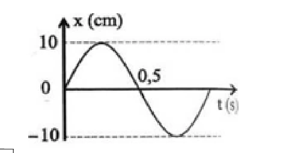{ loading=lazy }

??? success "Đáp án và lời giải"
    **Đáp án:** $7{,}07\,\mathrm{cm}$

    **Hướng dẫn giải:**

    Từ đồ thị, biên độ là $A=10\,\mathrm{cm}$. Vật qua vị trí cân bằng theo chiều dương tại $t=0$ và lần qua vị trí cân bằng tiếp theo ở $t=0{,}5\,\mathrm s$, nên $T/2=0{,}5\,\mathrm s$ hay $T=1\,\mathrm s$.

    Vì $t=0{,}125\,\mathrm s=T/8$, pha tăng một góc $\pi/4$. Do đó

    $x(0{,}125)=A\sin\dfrac{\pi}{4}=10\cdot\dfrac{\sqrt2}{2}=5\sqrt2\approx7{,}07\,\mathrm{cm}$.

    Với $x(0)=0$, độ dịch chuyển là $\Delta x=x(0{,}125)-x(0)=7{,}07\,\mathrm{cm}$.

#### Bài 12

<!-- source-id: BT-Chuong-I-p31-q2-78 -->

Một vật dao động điều hòa dọc theo trục $Ox$. Đồ thị li độ - thời gian của vật được cho như hình dưới. Lấy $g=\pi^2\approx10\,\mathrm{m/s^2}$. Chu kì dao động của vật bằng bao nhiêu giây?

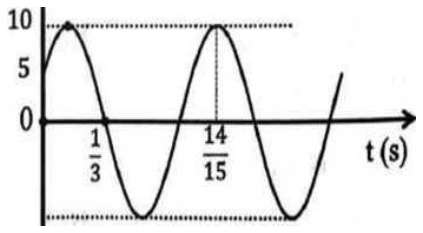{ loading=lazy }

??? success "Đáp án và lời giải"
    **Đáp án:** $0{,}8\,\mathrm s$

    **Hướng dẫn giải:**

    Trên đồ thị, tại $t_1=\dfrac13\,\mathrm s$ vật qua vị trí cân bằng theo chiều âm; tại $t_2=\dfrac{14}{15}\,\mathrm s$ vật ở biên dương. Từ trạng thái qua cân bằng theo chiều âm đến biên dương kế tiếp là $3T/4$, nên

    $\Delta t=\dfrac{14}{15}-\dfrac13=0{,}6\,\mathrm s=\dfrac{3T}{4}$.

    Suy ra $T=0{,}8\,\mathrm s$.

#### Bài 13

<!-- source-id: BT-Chuong-I-p31-q3-79 -->

Hình dưới là đồ thị của một vật dao động điều hòa có chu kì $T=1{,}2\,\mathrm s$. Giá trị của $t_0$ trên đồ thị là bao nhiêu giây?

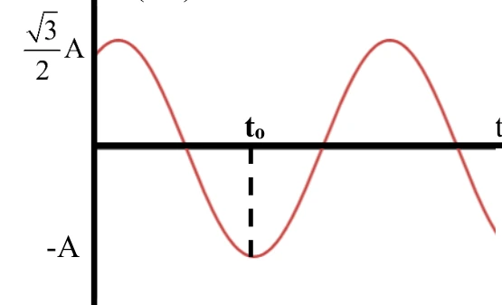{ loading=lazy }

??? success "Đáp án và lời giải"
    **Đáp án:** $0{,}7\,\mathrm s$.

    **Hướng dẫn giải:**

    Tại $t=0$, đồ thị có $x=\dfrac{\sqrt3}{2}A$ và đang đi lên. Vật cần $T/12$ để tới biên dương, rồi thêm $T/2$ để tới biên âm. Với $T=1{,}2\,\mathrm s$:

    $t_0=\frac{T}{12}+\frac{T}{2}=\frac{7T}{12}=0{,}7\ \text{s}.$
#### Bài 14

<!-- source-id: BT-Chuong-I-p32-q4-80 -->

Một vật dao động theo phương trình

$$
x=6\sqrt{3}\cos\left(\frac{\pi}{2}t-\frac{\pi}{3}\right)\ \text{cm}.
$$

Kể từ $t=0$, thời điểm vật cách vị trí cân bằng $9\,\mathrm{cm}$ và đang lại gần vị trí cân bằng lần thứ $2021$ là bao nhiêu giây? **Chỉ lấy phần nguyên của kết quả.**

??? success "Đáp án và lời giải"
    **Đáp án:** $4041\,\mathrm s$.

    **Hướng dẫn giải:**

    Biên độ $A=6\sqrt3\,\mathrm{cm}$, nên điều kiện $|x|=9\,\mathrm{cm}$ tương đương

    $$|x|=\frac{\sqrt3}{2}A.$$

    Trong mỗi chu kì có **hai** lần vật ở khoảng cách này và đang chuyển động về vị trí cân bằng. Ta có

    $$2021=1010\cdot2+1.$$

    Sau $1010$ chu kì đã có $2020$ lần thỏa điều kiện. Với $\omega=\pi/2\,\mathrm{rad/s}$ thì $T=4\,\mathrm s$. Từ trạng thái ban đầu đến lần thỏa điều kiện kế tiếp cần thêm $T/4=1\,\mathrm s$. Do đó

    $$t=1010T+\frac{T}{4}=1010\cdot4+1=4041\ \text{s}.$$
#### Bài 15

<!-- source-id: BT-Chuong-I-p45-q1-126 -->

Cho đồ thị li độ theo thời gian của một vật dao động điều hòa như hình dưới. Tính chu kì dao động của vật theo đơn vị giây.

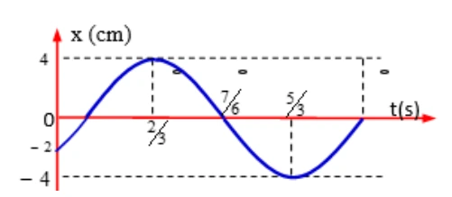{ loading=lazy }

??? success "Đáp án và lời giải"
    **Đáp án:** $2\,\mathrm s$.

    **Hướng dẫn giải:**

    Trên đồ thị, cực đại ở $t=\dfrac23\,\mathrm s$ và cực tiểu kế tiếp ở $t=\dfrac53\,\mathrm s$. Hai trạng thái này cách nhau nửa chu kì:

    $\frac{T}{2}=\frac53-\frac23=1\ \text{s}\Rightarrow T=2\ \text{s}.$
#### Bài 16

<!-- source-id: BT-Chuong-I-p45-q2-127 -->

Một vật dao động điều hòa với phương trình

$$
x=2\cos\left(2\pi t-\frac{\pi}{6}\right)\,\mathrm{cm}.
$$

Xác định li độ của vật tại $t=2\,\mathrm s$. Kết quả tính bằng xentimét và làm tròn đến hai chữ số thập phân.

??? success "Đáp án và lời giải"
    **Đáp án:** $1{,}73\,\mathrm{cm}$

    **Hướng dẫn giải:**

    Thay $t=2\,\mathrm s$ vào phương trình:

    $x=2\cos\left(4\pi-\dfrac{\pi}{6}\right)=2\cos\dfrac{11\pi}{6}=\sqrt3\approx1{,}73\,\mathrm{cm}$.

#### Bài 17

<!-- source-id: BT-Chuong-I-p45-q3-128 -->

Một chất điểm dao động điều hòa. Trong thời gian $1$ phút, vật thực hiện được $30$ dao động. Chu kì dao động của chất điểm bằng bao nhiêu giây?

??? success "Đáp án và lời giải"
    **Đáp án:** $2\,\mathrm s$.

    **Hướng dẫn giải:**

    Đổi $1$ phút $=60\,\mathrm s$. Với $N=30$ dao động:

    $T=\frac{\Delta t}{N}=\frac{60}{30}=2\ \text{s}.$
#### Bài 18

<!-- source-id: BT-Chuong-I-p45-q4-129 -->

Một chất điểm dao động điều hòa theo phương trình

$$
x=2\cos(2\pi t)\ \text{cm}.
$$

Tại thời điểm $t=\dfrac13\,\mathrm s$, chất điểm có li độ bằng bao nhiêu xentimét?

??? success "Đáp án và lời giải"
    **Đáp án:** $-1\,\mathrm{cm}$.

    **Hướng dẫn giải:**

    $x\left(\frac13\right)=2\cos\frac{2\pi}{3}=2\left(-\frac12\right)=-1\ \text{cm}.$
#### Bài 19

<!-- source-id: BT-Chuong-I-p46-q5-130 -->

Hình dưới là đồ thị li độ theo thời gian của một vật dao động điều hòa. Chu kì dao động bằng bao nhiêu giây?

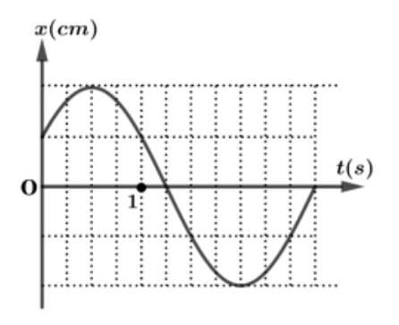{ loading=lazy }

??? success "Đáp án và lời giải"
    **Đáp án:** $3\,\mathrm s$.

    **Hướng dẫn giải:**

    Trên trục thời gian, $1\,\mathrm s$ ứng với $4$ ô. Từ đồ thị, nửa chu kì chiếm $6$ ô nên cả chu kì chiếm $12$ ô:

    $T=\frac{12}{4}=3\ \text{s}.$
#### Bài 20

<!-- source-id: BT-Chuong-I-p46-q6-131 -->

Một chất điểm dao động điều hòa theo phương trình

$$
x=3\cos\left(4\pi t+\frac{\pi}{3}\right)\ \text{cm}.
$$

Trong một chu kì, chất điểm đi được quãng đường bao nhiêu xentimét?

??? success "Đáp án và lời giải"
    **Đáp án:** $12\,\mathrm{cm}$.

    **Hướng dẫn giải:**

    Biên độ là $A=3\,\mathrm{cm}$. Trong một chu kì, quãng đường vật đi được bằng $4A$:

    $S=4A=12\ \text{cm}.$
#### Bài 21

<!-- source-id: BT-Chuong-I-p52-q2-155 -->

Cho đồ thị li độ theo thời gian của một vật dao động điều hòa như hình dưới. Tính tần số dao động theo đơn vị héc; làm tròn đến hai chữ số thập phân.

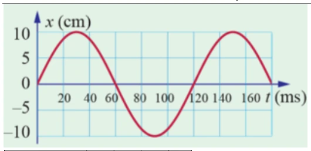{ loading=lazy }

??? success "Đáp án và lời giải"
    **Đáp án:** $8{,}33\,\mathrm{Hz}$.

    **Hướng dẫn giải:**

    Từ đồ thị, chu kì là $T=120\,\mathrm{ms}$ $=0{,}12\,\mathrm s$. Vì $f=1/T$,

    $$f=\frac{1}{0{,}12}\approx8{,}33\ \text{Hz}.$$
#### Bài 22

<!-- source-id: BT-Chuong-I-p53-q3-156 -->

Cho đồ thị li độ theo thời gian của một vật dao động điều hòa như hình dưới. Xác định **pha dao động** của vật tại thời điểm $t=4\,\mathrm s$ theo đơn vị radian; làm tròn đến hai chữ số thập phân.

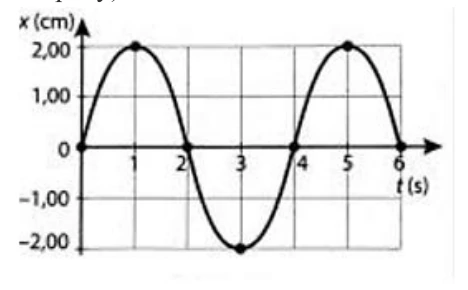{ loading=lazy }

??? success "Đáp án và lời giải"
    **Đáp án:** $4{,}71$ rad.

    **Hướng dẫn giải:**

    Từ đồ thị: $A=2\,\mathrm{cm}$, $T=4\,\mathrm s$ nên

    $$\omega=\frac{2\pi}{T}=\frac{\pi}{2}\ \text{rad/s}.$$

    Tại $t=0$, vật qua vị trí cân bằng theo chiều dương, do đó có thể chọn $\varphi=-\pi/2$. Pha tại $t=4\,\mathrm s$ là

    $$\Phi(4)=\omega\cdot4+\varphi=\frac{\pi}{2}\cdot4-\frac{\pi}{2}=\frac{3\pi}{2}\approx4{,}71\ \text{rad}.$$

    Lưu ý: pha là $\omega t+\varphi$, **không phải** giá trị của hàm $x=A\cos(\omega t+\varphi)$.
#### Bài 23

<!-- source-id: BT-Chuong-I-p53-q4-157 -->

Một chất điểm dao động điều hòa theo phương trình

$$
x=6\cos\left(4\pi t+\frac{\pi}{3}\right)\ \text{cm}.
$$

Tại thời điểm $t=\dfrac13\,\mathrm s$, chất điểm có li độ bằng bao nhiêu xentimét?

??? success "Đáp án và lời giải"
    **Đáp án:** $3\,\mathrm{cm}$.

    **Hướng dẫn giải:**

    Thay $t=1/3\,\mathrm s$ vào đúng phương trình đã cho:

    $$x=6\cos\left(4\pi\cdot\frac13+\frac{\pi}{3}\right)=6\cos\left(\frac{5\pi}{3}\right)=3\ \text{cm}.$$
#### Bài 24

<!-- source-id: BT-Chuong-I-p55-q5-158 -->

Cho đồ thị li độ theo thời gian của hai chất điểm dao động điều hòa như hình dưới. Xác định thời điểm gần nhất kể từ $t=0$ mà đồng thời $x_1=0\,\mathrm{cm}$ và $x_2=5\,\mathrm{cm}$. Kết quả tính bằng giây và làm tròn đến một chữ số thập phân.

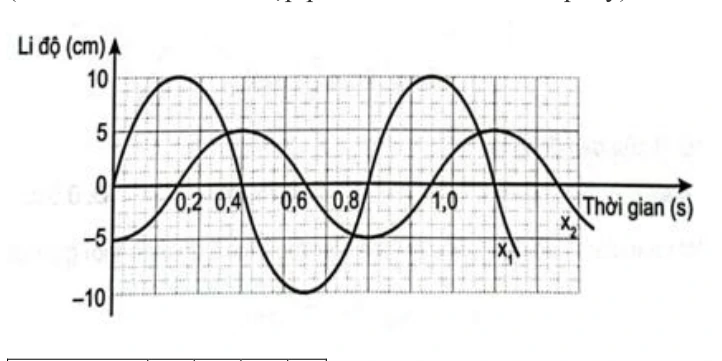{ loading=lazy }

??? success "Đáp án và lời giải"
    **Đáp án:** $0{,}4\,\mathrm s$.

    **Hướng dẫn giải:**

    Quan sát đồng thời hai đường trên đồ thị và xét từ $t=0$ theo chiều tăng của thời gian. Thời điểm đầu tiên tại đó $x_1=0\,\mathrm{cm}$ và $x_2=5\,\mathrm{cm}$ là

    $$t=0{,}4\ \text{s}.$$
#### Bài 25

<!-- source-id: BT-Chuong-I-p55-q6-159 -->

Một chất điểm dao động điều hòa với phương trình

$$
x=2\cos\left(2\pi t+\frac{\pi}{2}\right)\ \text{cm}.
$$

Tại thời điểm $t=\dfrac14\,\mathrm s$, chất điểm có li độ bằng bao nhiêu xentimét?

??? success "Đáp án và lời giải"
    **Đáp án:** $-2\,\mathrm{cm}$.

    **Hướng dẫn giải:**

    Thay $t=1/4\,\mathrm s$ vào phương trình:

    $$x=2\cos\left(2\pi\cdot\frac14+\frac{\pi}{2}\right)=2\cos\pi=-2\ \text{cm}.$$
### Nhận biết — Trắc nghiệm 4 lựa chọn

#### Bài 26

<!-- source-id: BT-Chuong-I-p27-q16-70 -->

Một vật dao động điều hòa trên trục $Ox$. Đồ thị li độ – thời gian của vật được cho như hình dưới. Phương trình dao động của vật là

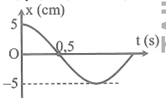{ loading=lazy }

A. $x=5\cos\left(2\pi t-\dfrac{\pi}{2}\right)\,\mathrm{cm}$.

B. $x=5\cos\left(2\pi t+\dfrac{\pi}{2}\right)\,\mathrm{cm}$.

C. $x=5\cos\left(\pi t+\dfrac{\pi}{2}\right)\,\mathrm{cm}$.

D. $x=5\cos(\pi t)\,\mathrm{cm}$.

??? success "Đáp án và lời giải"
    **Đáp án:** D.

    **Hướng dẫn giải:**

    Từ đồ thị, biên độ $A=5\,\mathrm{cm}$. Vật ở biên dương tại $t=0$ và biên âm tại $t=1\,\mathrm s$, nên $T/2=1\,\mathrm s$, tức $T=2\,\mathrm s$. Do đó

    $\omega=\frac{2\pi}{T}=\pi\ \text{rad/s}.$

    Tại $t=0$, $x=A$ nên có thể chọn $\varphi=0$. Vì vậy

    $x=5\cos(\pi t)\ \text{cm}.$
#### Bài 27

<!-- source-id: BT-Chuong-I-p27-q17-71 -->

Một vật dao động điều hòa có đồ thị li độ – thời gian như hình dưới. Tần số góc của vật là

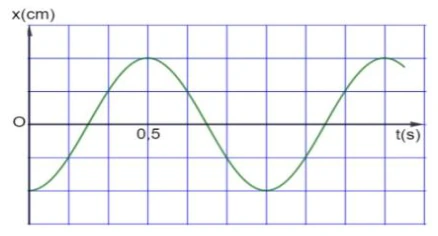{ loading=lazy }

A. $\pi\,\mathrm{rad/s}$.

B. $2\pi\,\mathrm{rad/s}$.

C. $\dfrac{\pi}{2}\,\mathrm{rad/s}$.

D. $4\pi\,\mathrm{rad/s}$.

??? success "Đáp án và lời giải"
    **Đáp án:** B.

    **Hướng dẫn giải:**

    Từ đồ thị, hai cực đại liên tiếp cách nhau $1\,\mathrm s$ nên $T=1\,\mathrm s$. Vì vậy

    $\omega=\frac{2\pi}{T}=2\pi\ \text{rad/s}.$
#### Bài 28

<!-- source-id: BT-Chuong-I-p37-q2-84 -->

Một chất điểm dao động điều hòa với phương trình $x=A\cos(\omega t+\varphi)$, trong đó $A$, $\omega$ là các hằng số dương. Pha của dao động ở thời điểm $t$ là

A. $\omega t+\varphi$.

B. $\omega$.

C. $\varphi$.

D. $\omega t$.

??? success "Đáp án và lời giải"
    **Đáp án:** A

    **Hướng dẫn giải:**

    Trong phương trình $x=A\cos(\omega t+\varphi)$, đối số của hàm cos là pha dao động tại thời điểm $t$. Vì vậy pha là $\omega t+\varphi$.

#### Bài 29

<!-- source-id: BT-Chuong-I-p37-q3-85 -->

Một chất điểm dao động điều hòa theo phương trình $x=A\cos(\omega t+\varphi)$, với $A>0$. Đại lượng $A$ được gọi là

A. biên độ của dao động.

B. pha của dao động.

C. tần số góc của dao động.

D. pha ban đầu của dao động.

??? success "Đáp án và lời giải"
    **Đáp án:** A.

    **Hướng dẫn giải:**

    Trong dạng chuẩn $x=A\cos(\omega t+\varphi)$ với $A>0$, $A$ là **biên độ dao động**.
#### Bài 30

<!-- source-id: BT-Chuong-I-p37-q4-86 -->

Trong phương trình dao động điều hòa $x=A\cos(\omega t+\varphi)$, radian (rad) là đơn vị của đại lượng nào?

A. Biên độ $A$.

B. Tần số góc $\omega$.

C. Pha dao động $(\omega t+\varphi)$.

D. Chu kì $T$.

??? success "Đáp án và lời giải"
    **Đáp án:** C.

    **Hướng dẫn giải:**

    Pha dao động $(\omega t+\varphi)$ là một góc nên được đo bằng radian. Tần số góc $\omega$ có đơn vị rad/s, còn $A$ có đơn vị độ dài và $T$ có đơn vị giây.
#### Bài 31

<!-- source-id: BT-Chuong-I-p37-q5-87 -->

Tần số góc có đơn vị là

A. Hz.

B. cm.

C. rad.

D. rad/s.

??? success "Đáp án và lời giải"
    **Đáp án:** D.

    **Hướng dẫn giải:**

    Trong phương trình chuẩn, hệ số của $t$ trong pha là tần số góc $\omega$; đơn vị là rad/s.
#### Bài 32

<!-- source-id: BT-Chuong-I-p37-q6-88 -->

Một vật dao động điều hòa có li độ, biên độ, tần số và pha ban đầu lần lượt là $x$, $A$, $f$, $\varphi$. Đại lượng luôn dương trong bốn đại lượng trên là

A. $f, x$.

B. $A, f$.

C. $A, \varphi$.

D. $A, x$.

??? success "Đáp án và lời giải"
    **Đáp án:** B.

    **Hướng dẫn giải:**

    Theo quy ước của phương trình dao động điều hòa, biên độ $A>0$ và tần số $f>0$. Li độ $x$ có thể dương, âm hoặc bằng $0$; pha ban đầu $\varphi$ cũng có thể mang dấu tùy cách chọn gốc thời gian.
#### Bài 33

<!-- source-id: BT-Chuong-I-p37-q7-89 -->

Một chất điểm dao động có phương trình

$$x=5\cos(10t+\pi)\ \text{cm}.$$

Chất điểm này dao động với biên độ là

A. $5\,\mathrm{cm}$.

B. $10\,\mathrm{cm}$.

C. $20\,\mathrm{cm}$.

D. $15\,\mathrm{cm}$.

??? success "Đáp án và lời giải"
    **Đáp án:** A.

    **Hướng dẫn giải:**

    Biên độ là hệ số dương đứng trước hàm cos, nên $A=5\,\mathrm{cm}$.
#### Bài 34

<!-- source-id: BT-Chuong-I-p38-q10-91 -->

Một chất điểm dao động điều hòa theo phương trình $x=A\cos(\omega t+\varphi)$, trong đó $\omega>0$. Đại lượng $\omega$ được gọi là

A. biên độ dao động.

B. chu kì dao động.

C. tần số góc của dao động.

D. pha ban đầu của dao động.

??? success "Đáp án và lời giải"
    **Đáp án:** C.

    **Hướng dẫn giải:**

    Trong dạng chuẩn $x=A\cos(\omega t+\varphi)$, $\omega$ là **tần số góc**, có đơn vị rad/s.
#### Bài 35

<!-- source-id: BT-Chuong-I-p38-q11-92 -->

Một vật dao động điều hòa với phương trình

$$
x=8\cos\left(\pi t+\frac{\pi}{6}\right)\ \text{cm}.
$$

Pha ban đầu của dao động là

A. $\dfrac{\pi}{6}$ rad.

B. $-\dfrac{\pi}{6}$ rad.

C. $\pi t+\dfrac{\pi}{6}$ rad.

D. $\dfrac{\pi}{3}$ rad.

??? success "Đáp án và lời giải"
    **Đáp án:** A.

    **Hướng dẫn giải:**

    So sánh với $x=A\cos(\omega t+\varphi)$, ta có pha ban đầu $\varphi=\dfrac{\pi}{6}$ rad.
#### Bài 36

<!-- source-id: BT-Chuong-I-p38-q12-93 -->

Một vật dao động điều hòa theo phương trình

$$
x=2\cos\left(20t+\frac{\pi}{2}\right)\ \text{cm}.
$$

Pha của dao động tại thời điểm $t$ là

A. $\dfrac{\pi}{2}$ rad.

B. $20t+\dfrac{\pi}{2}$ rad.

C. $2\,\mathrm{rad/s}$.

D. $20$ rad.

??? success "Đáp án và lời giải"
    **Đáp án:** B.

    **Hướng dẫn giải:**

    Với $x=A\cos(\omega t+\varphi)$, pha tại thời điểm $t$ là $\omega t+\varphi$. Ở đây

    $\Phi(t)=20t+\frac{\pi}{2}\ \text{rad}.$
#### Bài 37

<!-- source-id: BT-Chuong-I-p38-q13-94 -->

Một vật nhỏ dao động điều hòa trên một quỹ đạo dài $8\,\mathrm{cm}$. Biên độ dao động bằng

A. $16\,\mathrm{cm}$.

B. $8\,\mathrm{cm}$.

C. $48\,\mathrm{cm}$.

D. $4\,\mathrm{cm}$.

??? success "Đáp án và lời giải"
    **Đáp án:** D.

    **Hướng dẫn giải:**

    Quỹ đạo dao động là đoạn thẳng từ $-A$ đến $+A$, có độ dài $L=2A$. Do $L=8\,\mathrm{cm}$,

    $A=\frac{L}{2}=4\ \text{cm}.$
#### Bài 38

<!-- source-id: BT-Chuong-I-p38-q14-95 -->

Một vật nhỏ dao động điều hòa theo phương trình $x=A\cos(10t)$, với $t$ tính bằng giây. Tại $t=2\,\mathrm s$, pha của dao động là

A. $5$ rad.

B. $10$ rad.

C. $40$ rad.

D. $20$ rad.

??? success "Đáp án và lời giải"
    **Đáp án:** D.

    **Hướng dẫn giải:**

    Pha dao động là $\Phi=10t$. Tại $t=2\,\mathrm s$:

    $\Phi=10\cdot2=20\ \text{rad}.$
#### Bài 39

<!-- source-id: BT-Chuong-I-p38-q15-96 -->

Một chất điểm dao động theo phương trình $x=6\cos(\omega t)$ (cm). Biên độ dao động của chất điểm là

A. $12\,\mathrm{cm}$.

B. $3\,\mathrm{cm}$.

C. $6\,\mathrm{cm}$.

D. $2\,\mathrm{cm}$.

??? success "Đáp án và lời giải"
    **Đáp án:** C.

    **Hướng dẫn giải:**

    Trong phương trình $x=A\cos(\omega t+\varphi)$, biên độ là hệ số dương đứng trước hàm cos. Vì vậy $A=6\,\mathrm{cm}$.
#### Bài 40

<!-- source-id: BT-Chuong-I-p38-q16-97 -->

Chu kì trong dao động điều hòa có đơn vị là

A. Hz.

B. kg.

C. m.

D. s.

??? success "Đáp án và lời giải"
    **Đáp án:** D.

    **Hướng dẫn giải:**

    Chu kì là thời gian ngắn nhất để trạng thái dao động lặp lại; $T=2\pi/\omega=1/f$.
#### Bài 41

<!-- source-id: BT-Chuong-I-p38-q17-98 -->

Một chất điểm dao động điều hòa trên đoạn thẳng có chiều dài quỹ đạo $L$. Biên độ dao động là

A. $2L$.

B. $\dfrac{L}{2}$.

C. $L$.

D. $\dfrac{L}{4}$.

??? success "Đáp án và lời giải"
    **Đáp án:** B.

    **Hướng dẫn giải:**

    Vật chuyển động giữa hai biên $-A$ và $+A$, nên chiều dài quỹ đạo là $L=2A$. Suy ra

    $$A=\frac{L}{2}.$$
#### Bài 42

<!-- source-id: BT-Chuong-I-p38-q18-99 -->

Công thức nào sau đây biểu diễn đúng mối liên hệ giữa tần số góc $\omega$, tần số $f$ và chu kì $T$ của dao động điều hòa?

A. $\omega=\dfrac{2\pi}{f}=2\pi T$.

B. $\omega=\dfrac{T}{2\pi}=2\pi f$.

C. $\omega=\dfrac{1}{2\pi f}=T$.

D. $\omega=2\pi f=\dfrac{2\pi}{T}$.

??? success "Đáp án và lời giải"
    **Đáp án:** D.

    **Hướng dẫn giải:**

    Ba đại lượng liên hệ bởi

    $\omega=2\pi f=\frac{2\pi}{T}.$
#### Bài 43

<!-- source-id: BT-Chuong-I-p41-q40-121 -->

Dựa vào đồ thị hai dao động dưới đây. Biết phương trình dao động của một trong hai vật là

$$x_1=8\cos(5\pi t)\ \text{cm}.$$

Phương trình dao động của vật còn lại là

{ loading=lazy }

A. $x_2=6\cos\left(5\pi t-\dfrac{\pi}{2}\right)\,\mathrm{cm}$.

B. $x_2=6\cos(5\pi t)\,\mathrm{cm}$.

C. $x_2=6\cos(4\pi t)\,\mathrm{cm}$.

D. $x_2=6\cos\left(4\pi t-\dfrac{\pi}{2}\right)\,\mathrm{cm}$.

??? success "Đáp án và lời giải"
    **Đáp án:** A.

    **Hướng dẫn giải:**

    Từ đồ thị chung, dao động còn lại có biên độ $6\,\mathrm{cm}$ và cùng chu kì với $x_1$, nên cùng $\omega=5\pi\,\mathrm{rad/s}$. Hai dao động lệch nhau một phần tư chu kì, tức $\pi/2$; dao động thứ hai trễ pha so với $x_1$. Do đó

    $x_2=6\cos\left(5\pi t-\frac{\pi}{2}\right)\ \text{cm}.$
#### Bài 44

<!-- source-id: BT-Chuong-I-p47-q1-132 -->

Trong phương trình dao động điều hòa $x=A\cos(\omega t+\varphi)$, radian trên giây (rad/s) là đơn vị của đại lượng

A. $A$.

B. $\omega$.

C. $\omega t+\varphi$.

D. $T$.

??? success "Đáp án và lời giải"
    **Đáp án:** B.

    **Hướng dẫn giải:**

    $\omega$ là tần số góc nên có đơn vị rad/s. Pha $\omega t+\varphi$ có đơn vị radian, còn $T$ có đơn vị giây.
#### Bài 45

<!-- source-id: BT-Chuong-I-p47-q3-134 -->

Một vật dao động điều hòa theo phương trình $x=6\cos(4\pi t)\,\mathrm{cm}$. Biên độ dao động của vật là

A. $4\,\mathrm{cm}$.

B. $6\,\mathrm{cm}$.

C. $-6\,\mathrm{cm}$.

D. $12\,\mathrm m$.

??? success "Đáp án và lời giải"
    **Đáp án:** B

    **Hướng dẫn giải:**

    Với $x=A\cos(\omega t+\varphi)$, biên độ là hệ số dương $A$. Ở đây $A=6\,\mathrm{cm}$, nên chọn **B**.

#### Bài 46

<!-- source-id: BT-Chuong-I-p47-q5-136 -->

Dựa vào đồ thị li độ – thời gian dưới đây. Biên độ của dao động là

{ loading=lazy }

A. $-5\,\mathrm{cm}$.

B. $5\,\mathrm{cm}$.

C. $10\,\mathrm{cm}$.

D. $-10\,\mathrm{cm}$.

??? success "Đáp án và lời giải"
    **Đáp án:** B.

    **Hướng dẫn giải:**

    Từ đồ thị, li độ cực đại là $+5\,\mathrm{cm}$ và cực tiểu là $-5\,\mathrm{cm}$, nên biên độ $A=5\,\mathrm{cm}$.
#### Bài 47

<!-- source-id: BT-Chuong-I-p47-q6-137 -->

Dựa vào đồ thị li độ – thời gian dưới đây. Pha ban đầu của dao động là

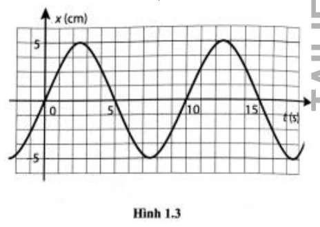{ loading=lazy }

A. $0{,}5\pi$ rad.

B. $-0{,}5\pi$ rad.

C. $0{,}25\pi$ rad.

D. $\pi$ rad.

??? success "Đáp án và lời giải"
    **Đáp án:** B.

    **Hướng dẫn giải:**

    Tại $t=0$, vật qua vị trí cân bằng theo chiều dương. Với dạng cos, $x_0=0$ và $v_0>0$ cho $\varphi=-\pi/2$ rad.
#### Bài 48

<!-- source-id: BT-Chuong-I-p47-q7-138 -->

Dựa vào đồ thị li độ – thời gian dưới đây. Tần số của dao động là

{ loading=lazy }

A. $0{,}2\,\mathrm{Hz}$.

B. $0{,}1\,\mathrm{Hz}$.

C. $5\,\mathrm{Hz}$.

D. $10\,\mathrm{Hz}$.

??? success "Đáp án và lời giải"
    **Đáp án:** B.

    **Hướng dẫn giải:**

    Hai trạng thái cùng pha liên tiếp trên đồ thị cách nhau $T=10\,\mathrm s$, nên

    $$f=\frac1T=0{,}1\ \text{Hz}.$$
#### Bài 49

<!-- source-id: BT-Chuong-I-p47-q8-139 -->

Một vật dao động điều hòa thực hiện $20$ dao động toàn phần trong $20\,\mathrm s$. Tần số dao động của vật là

A. $0{,}5\,\mathrm{Hz}$.

B. $0{,}05\,\mathrm{Hz}$.

C. $2\,\mathrm{Hz}$.

D. $1\,\mathrm{Hz}$.

??? success "Đáp án và lời giải"
    **Đáp án:** D.

    **Hướng dẫn giải:**

    Tần số là số dao động toàn phần trong một đơn vị thời gian:

    $f=\frac{N}{\Delta t}=\frac{20}{20}=1\ \text{Hz}.$
#### Bài 50

<!-- source-id: BT-Chuong-I-p48-q9-140 -->

Vật dao động điều hòa với phương trình

$$x=5\cos\left(8\pi t-\frac{\pi}{4}\right)\ \text{cm},$$

trong đó $t$ được tính bằng giây. Pha ban đầu của dao động là

A. $-\dfrac{\pi}{4}$.

B. $\dfrac{\pi}{4}$.

C. $8\pi$.

D. $8\pi t-\dfrac{\pi}{4}$.

??? success "Đáp án và lời giải"
    **Đáp án:** A.

    **Hướng dẫn giải:**

    So sánh với $x=A\cos(\omega t+\varphi)$ cho $\varphi=-\pi/4$.
#### Bài 51

<!-- source-id: BT-Chuong-I-p48-q10-141 -->

Trong phương trình dao động điều hòa $x=A\cos(\omega t+\varphi)$, đại lượng $(\omega t+\varphi)$ được gọi là

A. biên độ dao động.

B. tần số góc của dao động.

C. pha của dao động.

D. chu kì của dao động.

??? success "Đáp án và lời giải"
    **Đáp án:** C.

    **Hướng dẫn giải:**

    Trong dạng $x=A\cos(\omega t+\varphi)$, pha tại thời điểm $t$ là $\omega t+\varphi$.
#### Bài 52

<!-- source-id: BT-Chuong-I-p48-q11-142 -->

Một vật nhỏ dao động điều hòa theo phương trình $x=A\cos(20t)$, với $t$ tính bằng giây. Tại $t=2\,\mathrm s$, pha của dao động là

A. $10$ rad.

B. $40$ rad.

C. $5$ rad.

D. $20$ rad.

??? success "Đáp án và lời giải"
    **Đáp án:** B.

    **Hướng dẫn giải:**

    Pha dao động là $\Phi=20t$. Tại $t=2\,\mathrm s$:

    $\Phi=20\cdot2=40\ \text{rad}.$
#### Bài 53

<!-- source-id: BT-Chuong-I-p48-q13-144 -->

Một vật dao động điều hòa có phương trình $x=2\cos\left(2\pi t-\dfrac{\pi}{6}\right)\,\mathrm{cm}$. Li độ của vật tại thời điểm $t=0{,}25\,\mathrm s$ là

A. $1\,\mathrm{cm}$.

B. $1{,}5\,\mathrm{cm}$.

C. $0{,}5\,\mathrm{cm}$.

D. $-1\,\mathrm{cm}$.

??? success "Đáp án và lời giải"
    **Đáp án:** A

    **Hướng dẫn giải:**

    Tại $t=0{,}25\,\mathrm s$,

    $x=2\cos\left(2\pi\cdot0{,}25-\dfrac{\pi}{6}\right)=2\cos\dfrac{\pi}{3}=1\,\mathrm{cm}$.

    Vì vậy chọn **A**.

#### Bài 54

<!-- source-id: BT-Chuong-I-p48-q14-145 -->

Một vật dao động điều hòa theo phương trình $x=3\cos\left(\pi t+\dfrac{\pi}{2}\right)\,\mathrm{cm}$. Pha dao động tại thời điểm $t=1\,\mathrm s$ là

A. $\pi\,\mathrm{rad}$.

B. $2\pi\,\mathrm{rad}$.

C. $1{,}5\pi\,\mathrm{rad}$.

D. $0{,}5\pi\,\mathrm{rad}$.

??? success "Đáp án và lời giải"
    **Đáp án:** C

    **Hướng dẫn giải:**

    Pha tại $t=1\,\mathrm s$ là

    $\Phi=\pi\cdot1+\dfrac{\pi}{2}=\dfrac{3\pi}{2}=1{,}5\pi\,\mathrm{rad}$.

    Vì vậy chọn **C**.

#### Bài 55

<!-- source-id: BT-Chuong-I-p48-q15-146 -->

Một vật dao động điều hòa trên trục $Ox$. Đồ thị dưới đây biểu diễn sự phụ thuộc của li độ $x$ vào thời gian $t$. Phương trình dao động của vật là

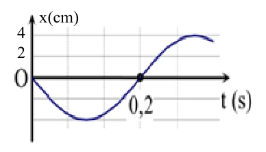{ loading=lazy }

A. $x=4\cos\left(5\pi t-\dfrac{\pi}{2}\right)\,\mathrm{cm}$.

B. $x=8\cos\left(10\pi t+\dfrac{\pi}{2}\right)\,\mathrm{cm}$.

C. $x=4\cos\left(5\pi t+\dfrac{\pi}{2}\right)\,\mathrm{cm}$.

D. $x=8\cos\left(10\pi t-\dfrac{\pi}{2}\right)\,\mathrm{cm}$.

??? success "Đáp án và lời giải"
    **Đáp án:** C.

    **Hướng dẫn giải:**

    Từ đồ thị: $A=4\,\mathrm{cm}$. Hai lần qua vị trí cân bằng cùng chiều cách nhau một chu kì; đọc trên trục thời gian được $T=0{,}4\,\mathrm s$, nên $\omega=2\pi/T=5\pi\,\mathrm{rad/s}$. Tại $t=0$, $x=0$ và đồ thị đang đi xuống nên $v_0<0$, suy ra $\varphi=\pi/2$. Vì vậy

    $$x=4\cos\left(5\pi t+\frac{\pi}{2}\right)\ \text{cm}.$$
#### Bài 56

<!-- source-id: BT-Chuong-I-p48-q16-147 -->

Dựa vào đồ thị li độ – thời gian dưới đây. Biên độ của dao động là

{ loading=lazy }

A. $-5\,\mathrm{cm}$.

B. $5\,\mathrm{cm}$.

C. $10\,\mathrm{cm}$.

D. $-10\,\mathrm{cm}$.

??? success "Đáp án và lời giải"
    **Đáp án:** C.

    **Hướng dẫn giải:**

    Từ đồ thị chung, li độ cực đại có độ lớn $10\,\mathrm{cm}$ nên $A=10\,\mathrm{cm}$.
#### Bài 57

<!-- source-id: BT-Chuong-I-p48-q17-148 -->

Dựa vào đồ thị li độ – thời gian dưới đây. Pha ban đầu của dao động là

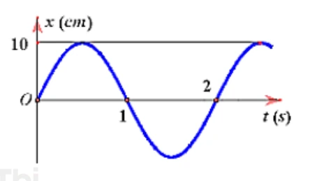{ loading=lazy }

A. $0{,}5\pi$ rad.

B. $-0{,}5\pi$ rad.

C. $0{,}25\pi$ rad.

D. $\pi$ rad.

??? success "Đáp án và lời giải"
    **Đáp án:** B.

    **Hướng dẫn giải:**

    Tại $t=0$, đồ thị đi qua vị trí cân bằng theo chiều dương, nên $\varphi=-\pi/2$ rad.
#### Bài 58

<!-- source-id: BT-Chuong-I-p49-q18-149 -->

Dựa vào đồ thị li độ – thời gian dưới đây. Tần số của dao động là

{ loading=lazy }

A. $0{,}2\,\mathrm{Hz}$.

B. $0{,}5\,\mathrm{Hz}$.

C. $1\,\mathrm{Hz}$.

D. $2\,\mathrm{Hz}$.

??? success "Đáp án và lời giải"
    **Đáp án:** B.

    **Hướng dẫn giải:**

    Từ đồ thị, một chu kì kéo dài $T=2\,\mathrm s$ nên

    $$f=\frac1T=0{,}5\ \text{Hz}.$$
### Nhận biết — Đúng/Sai

#### Bài 59

<!-- source-id: BT-Chuong-I-p28-q1-73 -->

Một vật dao động điều hòa có đồ thị li độ phụ thuộc thời gian như hình dưới. Xét các phát biểu:

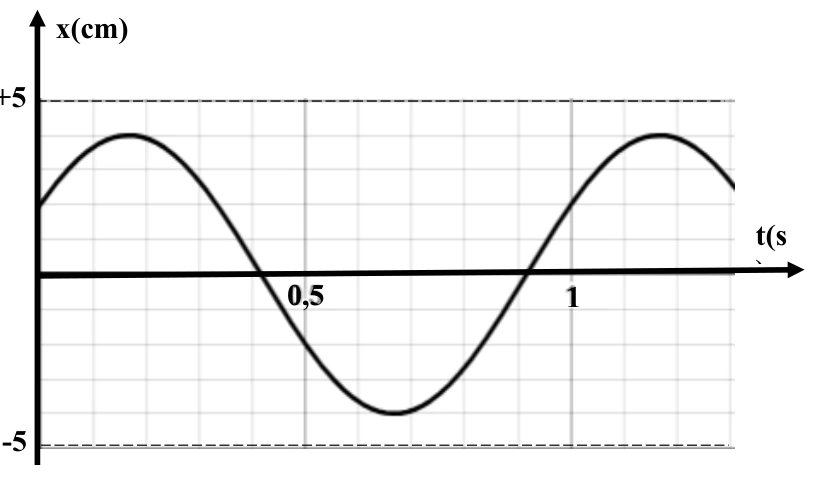{ loading=lazy }

a) Biên độ dao động của vật là $5\,\mathrm{cm}$.

b) Tần số dao động của vật là $1\,\mathrm{Hz}$.

c) Tần số góc của dao động là $\pi\,\mathrm{rad/s}$.

d) Độ dịch chuyển của vật từ $t=0$ đến $t=1{,}2\,\mathrm s$ là $2\,\mathrm{cm}$.

??? success "Đáp án và lời giải"
    **Đáp án:** a) Sai; b) Đúng; c) Sai; d) Đúng.

    **Hướng dẫn giải:**

    a) **Sai.** Từ trục tung đọc được biên độ $A=4\,\mathrm{cm}$, không phải $5\,\mathrm{cm}$.

    b) **Đúng.** Hai trạng thái cùng pha liên tiếp cách nhau $T=1\,\mathrm s$, nên $f=1/T=1\,\mathrm{Hz}$.

    c) **Sai.** $\omega=2\pi f=2\pi\,\mathrm{rad/s}$, không phải $\pi\,\mathrm{rad/s}$.

    d) **Đúng.** Từ đồ thị, $x(0)=2\,\mathrm{cm}$ và $x(1{,}2\,\mathrm s)=4\,\mathrm{cm}$. Do đó độ dịch chuyển trong khoảng này là

    $$\Delta x=x(1{,}2)-x(0)=4-2=2\ \text{cm}.$$

#### Bài 60

<!-- source-id: BT-Chuong-I-p42-q1-122 -->

Cho hai dao động điều hòa có đồ thị như hình dưới. Xét các phát biểu:

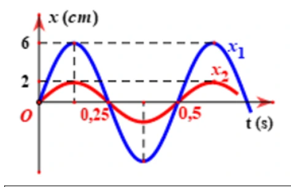{ loading=lazy }

a) Hai dao động có cùng chu kì.

b) Tần số của hai dao động là $0{,}5\,\mathrm{Hz}$.

c) Hai dao động cùng pha.

d) Biên độ của hai dao động là $2\,\mathrm{cm}$ và $6\,\mathrm{cm}$.

??? success "Đáp án và lời giải"
    **Đáp án:** a) Đúng; b) Sai; c) Đúng; d) Đúng.

    **Hướng dẫn giải:**

    a) **Đúng.** Hai đường lặp lại trạng thái sau cùng một khoảng thời gian, đọc được $T=0{,}5\,\mathrm s$ cho cả hai dao động.

    b) **Sai.** $f=1/T=2\,\mathrm{Hz}$, không phải $0{,}5\,\mathrm{Hz}$.

    c) **Đúng.** Các lần qua vị trí cân bằng theo cùng chiều và các cực trị tương ứng xuất hiện đồng thời, nên hai dao động cùng pha.

    d) **Đúng.** Biên độ đọc trên trục tung lần lượt là $2\,\mathrm{cm}$ và $6\,\mathrm{cm}$.

#### Bài 61

<!-- source-id: BT-Chuong-I-p42-q2-123 -->

Một vật dao động điều hòa có đồ thị li độ phụ thuộc thời gian như hình dưới. Xét các phát biểu:

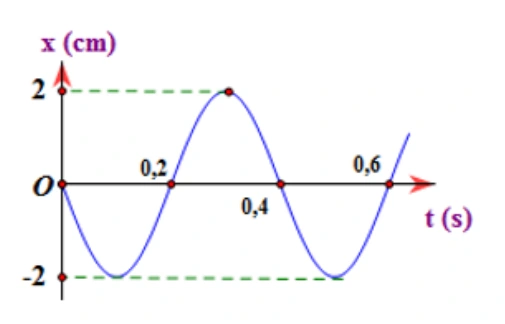{ loading=lazy }

a) Biên độ dao động của vật bằng $2\,\mathrm{cm}$.

b) Chu kì dao động của vật bằng $0{,}6\,\mathrm s$.

c) Pha ban đầu của dao động là $-0{,}5\pi$ rad.

d) Tại thời điểm $t=0{,}6\,\mathrm s$, vật ở vị trí cân bằng.

??? success "Đáp án và lời giải"
    **Đáp án:** a) Đúng; b) Sai; c) Sai; d) Đúng.

    **Hướng dẫn giải:**

    a) **Đúng.** Từ đồ thị, biên độ dao động là $A=2\,\mathrm{cm}$ nên phát biểu a đúng.

    b) **Sai.** Đồ thị lặp lại trạng thái sau $0{,}4\,\mathrm s$, vì vậy $T=0{,}4\,\mathrm s$; phát biểu $T=0{,}6\,\mathrm s$ là sai.

    c) **Sai.** Tại $t=0$, vật ở vị trí cân bằng và đi theo chiều âm. Với $x=A\cos(\omega t+\varphi)$, pha ban đầu là $\varphi=\dfrac{\pi}{2}$ rad; do đó phát biểu $-0{,}5\pi$ rad là sai.

    d) **Đúng.** Tại $t=0{,}6\,\mathrm s$, đường cong cắt trục $x=0$ nên vật ở vị trí cân bằng; phát biểu d đúng.
#### Bài 62

<!-- source-id: BT-Chuong-I-p43-q3-124 -->

Cho đồ thị li độ theo thời gian của một vật dao động điều hòa như hình dưới. Xét các phát biểu:

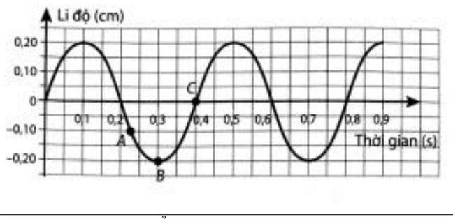{ loading=lazy }

a) Biên độ dao động của vật bằng $0{,}2\,\mathrm{cm}$.

b) Chu kì dao động của vật bằng $0{,}4\,\mathrm s$.

c) Pha ban đầu của dao động là $0{,}5\pi\,\mathrm{rad}$.

d) Tại thời điểm $t=0{,}5\,\mathrm s$, vật ở vị trí biên.

??? success "Đáp án và lời giải"
    **Đáp án:** a) Đúng; b) Đúng; c) Sai; d) Đúng.

    **Hướng dẫn giải:**

    a) **Đúng.** Độ lớn li độ cực đại trên đồ thị là $A=0{,}2\,\mathrm{cm}$.

    b) **Đúng.** Khoảng thời gian giữa hai trạng thái cùng pha liên tiếp là $T=0{,}4\,\mathrm s$.

    c) **Sai.** Ở $t=0$, vật qua vị trí cân bằng theo chiều dương. Với $x=A\cos(\omega t+\varphi)$, có thể chọn $\varphi=-\pi/2$, không phải $+\pi/2$.

    d) **Đúng.** Từ đồ thị, tại $t=0{,}5\,\mathrm s$ vật đạt một vị trí biên.

#### Bài 63

<!-- source-id: BT-Chuong-I-p44-q4-125 -->

Cho hai dao động điều hòa cùng tần số có đồ thị như hình dưới. Xét các phát biểu:

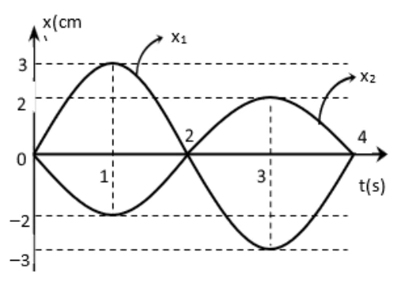{ loading=lazy }

a) Hai dao động có cùng chu kì.

b) Chu kì của hai dao động là $4\,\mathrm s$.

c) Hai dao động cùng pha.

d) Biên độ của hai dao động là $3\,\mathrm{cm}$ và $2\,\mathrm{cm}$.

??? success "Đáp án và lời giải"
    **Đáp án:** a) Đúng; b) Đúng; c) Sai; d) Đúng.

    **Hướng dẫn giải:**

    a) **Đúng.** Hai dao động có cùng tần số nên có cùng chu kì.

    b) **Đúng.** Đọc khoảng thời gian lặp lại trạng thái trên đồ thị được $T=4\,\mathrm s$.

    c) **Sai.** Tại cùng một thời điểm, một dao động ở biên dương còn dao động kia ở biên âm; hai dao động ngược pha, không cùng pha.

    d) **Đúng.** Biên độ đọc trên trục tung lần lượt là $3\,\mathrm{cm}$ và $2\,\mathrm{cm}$.

#### Bài 64

<!-- source-id: BT-Chuong-I-p49-q1-150 -->

Cho đồ thị li độ theo thời gian của một vật dao động điều hòa như hình dưới. Xét các phát biểu:

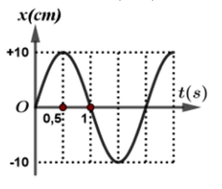{ loading=lazy }

a) Biên độ dao động của vật bằng $10\,\mathrm{cm}$.

b) Chu kì dao động của vật bằng $1\,\mathrm s$.

c) Pha ban đầu của dao động là $0{,}5\pi\,\mathrm{rad}$.

d) Tại thời điểm $t=1{,}5\,\mathrm s$, vật ở vị trí biên.

??? success "Đáp án và lời giải"
    **Đáp án:** a) Đúng; b) Sai; c) Sai; d) Đúng.

    **Hướng dẫn giải:**

    a) **Đúng.** Độ lớn li độ cực đại là $A=10\,\mathrm{cm}$.

    b) **Sai.** Từ đồ thị, trạng thái dao động lặp lại sau $T=2\,\mathrm s$, không phải $1\,\mathrm s$.

    c) **Sai.** Ở $t=0$, vật qua vị trí cân bằng theo chiều dương nên có thể chọn $\varphi=-\pi/2$; giá trị $+\pi/2$ cho chiều chuyển động ngược lại.

    d) **Đúng.** Tại $t=1{,}5\,\mathrm s$, đồ thị đạt một cực trị nên vật ở vị trí biên.

#### Bài 65

<!-- source-id: BT-Chuong-I-p49-q2-151 -->

Một vật dao động điều hòa theo phương trình $x=5\cos(10\pi t)\,\mathrm{cm}$. Xét các phát biểu:

a) Pha ban đầu của dao động là $10\pi\,\mathrm{rad}$.

b) Tần số của dao động là $5\,\mathrm{Hz}$.

c) Pha dao động tại thời điểm $t=0{,}075\,\mathrm s$ là $\dfrac{3\pi}{4}\,\mathrm{rad}$.

d) Tại thời điểm $t=0{,}075\,\mathrm s$, li độ của vật là $-2{,}5\sqrt2\,\mathrm{cm}$.

??? success "Đáp án và lời giải"
    **Đáp án:** a) Sai; b) Đúng; c) Đúng; d) Đúng.

    **Hướng dẫn giải:**

    a) **Sai.** So với $x=A\cos(\omega t+\varphi)$, pha ban đầu là $\varphi=0$, không phải $10\pi$.

    b) **Đúng.** $\omega=10\pi\,\mathrm{rad/s}$ nên $f=\omega/(2\pi)=5\,\mathrm{Hz}$.

    c) **Đúng.** Tại $t=0{,}075\,\mathrm s$, $\Phi=10\pi\cdot0{,}075=3\pi/4$.

    d) **Đúng.** $x=5\cos(3\pi/4)=-5\sqrt2/2=-2{,}5\sqrt2\,\mathrm{cm}$.

### Thông hiểu — Trắc nghiệm 4 lựa chọn

#### Bài 66

<!-- source-id: BT-Chuong-I-p8-q3-3 -->

Trong phương trình dao động điều hòa $x=A\cos(\omega t+\varphi)$, đại lượng $(\omega t+\varphi)$ gọi là

A. tần số góc của dao động.

B. pha của dao động.

C. biên độ của dao động.

D. chu kì của dao động.

??? success "Đáp án và lời giải"
    **Đáp án:** B.

    **Hướng dẫn giải:**

    Trong dạng $x=A\cos(\omega t+\varphi)$, pha tại thời điểm $t$ là $\omega t+\varphi$.
#### Bài 67

<!-- source-id: BT-Chuong-I-p8-q6-6 -->

Một vật dao động điều hòa theo phương trình $x=A\cos(\omega t+\varphi)$ (m). Đại lượng biểu thị độ dịch chuyển có hướng của vật khỏi vị trí cân bằng tại thời điểm $t$ là

A. $\omega$.

B. $A$.

C. $x$.

D. $\varphi$.

??? success "Đáp án và lời giải"
    **Đáp án:** C.

    **Hướng dẫn giải:**

    Trong phương trình dao động, $x$ là **li độ**: độ dịch chuyển có hướng của vật so với vị trí cân bằng tại thời điểm đang xét.
#### Bài 68

<!-- source-id: BT-Chuong-I-p8-q8-8 -->

Đối với dao động tuần hoàn, số lần dao động được lặp lại trong một đơn vị thời gian gọi là

A. tần số dao động.

B. chu kỳ dao động.

C. pha ban đầu.

D. tần số góc.

??? success "Đáp án và lời giải"
    **Đáp án:** A.

    **Hướng dẫn giải:**

    Theo định nghĩa, tần số $f$ là số dao động toàn phần vật thực hiện trong một đơn vị thời gian.
#### Bài 69

<!-- source-id: BT-Chuong-I-p8-q9-9 -->

Trường hợp nào sau đây chuyển động của vật không phải là dao động cơ?

A. Máy bay hạ cánh xuống sân bay.

B. Chiếc đu đung đưa.

C. Dây đàn vĩ cầm rung động.

D. Pittông chuyển động lên xuống trong xilanh.

??? success "Đáp án và lời giải"
    **Đáp án:** A.

    **Hướng dẫn giải:**

    Đối chiếu với định nghĩa dao động cơ: chuyển động lặp lại quanh một vị trí cân bằng.
#### Bài 70

<!-- source-id: BT-Chuong-I-p9-q12-12 -->

Hình vẽ là đồ thị dao động điều hòa x(t) của một vật. Biểu thị bằng chữ "B" trong hình là chỉ đại lượng đặc trưng nào của dao động điều hòa?

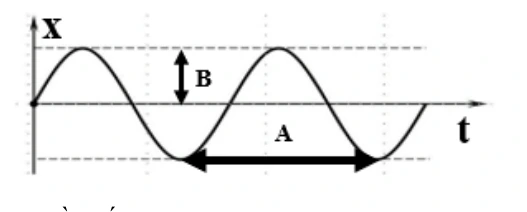{ loading=lazy }

A. Tần số.

B. Chu kỳ.

C. Tần số góc.

D. Biên độ.

??? success "Đáp án và lời giải"
    **Đáp án:** D.

    **Hướng dẫn giải:**

    Trên đồ thị, kí hiệu **B** biểu diễn khoảng cách cực đại từ vị trí cân bằng đến biên, tức **biên độ** của dao động.
#### Bài 71

<!-- source-id: BT-Chuong-I-p9-q15-15 -->

Đồ thị li độ theo thời gian của một chất điểm dao động điều hòa được cho như hình dưới. Pha ban đầu của dao động là

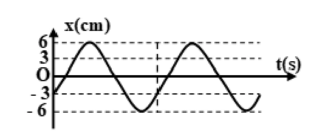{ loading=lazy }

A. $-\dfrac{2\pi}{3}$ rad.

B. $\dfrac{2\pi}{3}$ rad.

C. $\dfrac{\pi}{6}$ rad.

D. $-\dfrac{\pi}{6}$ rad.

??? success "Đáp án và lời giải"
    **Đáp án:** A.

    **Hướng dẫn giải:**

    Từ đồ thị, $A=6\,\mathrm{cm}$ và tại $t=0$ có $x_0=-3\,\mathrm{cm}$, đồng thời đường cong đang đi lên nên $v_0>0$.

    $\cos\varphi=\frac{x_0}{A}=-\frac12.$

    Vì $v_0=-A\omega\sin\varphi>0$ nên $\sin\varphi<0$. Do đó có thể chọn

    $\varphi=-\frac{2\pi}{3}\ \text{rad}.$
#### Bài 72

<!-- source-id: BT-Chuong-I-p9-q16-16 -->

Một chất điểm dao động điều hòa theo phương trình

$$
x=8\cos\left(\frac{2\pi}{3}t+\pi\right)\ \text{mm}.
$$

Biên độ dao động của chất điểm là

A. $8\,\mathrm{cm}$.

B. $\dfrac{2\pi}{3}\,\mathrm m$.

C. $0{,}8\,\mathrm{cm}$.

D. $\dfrac{2\pi}{3}\,\mathrm{cm}$.

??? success "Đáp án và lời giải"
    **Đáp án:** C.

    **Hướng dẫn giải:**

    Biên độ là $A=8\,\mathrm{mm}$. Đổi đơn vị:

    $$8\ \text{mm}=0{,}8\ \text{cm}.$$
#### Bài 73

<!-- source-id: BT-Chuong-I-p10-q18-18 -->

Cho một chất điểm dao động điều hòa quanh vị trí cân bằng $O$. Đồ thị li độ – thời gian được cho như hình dưới. Biên độ dao động là

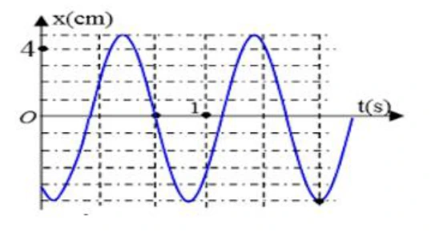{ loading=lazy }

A. $5\,\mathrm{cm}$.

B. $-5\,\mathrm{cm}$.

C. $4\,\mathrm{cm}$.

D. $-4\,\mathrm{cm}$.

??? success "Đáp án và lời giải"
    **Đáp án:** A.

    **Hướng dẫn giải:**

    Từ đồ thị, li độ cực đại là $+5\,\mathrm{cm}$ và li độ cực tiểu là $-5\,\mathrm{cm}$. Vì biên độ là độ lớn li độ cực đại nên $A=5\,\mathrm{cm}$.
#### Bài 74

<!-- source-id: BT-Chuong-I-p10-q19-19 -->

Đồ thị dưới biểu diễn sự phụ thuộc của li độ $x$ vào thời gian $t$ của một vật dao động điều hòa. Đoạn $PR$ trên trục thời gian biểu thị

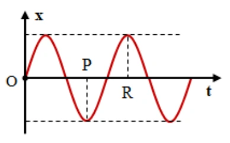{ loading=lazy }

A. một nửa chu kì.

B. hai lần tần số.

C. một nửa tần số.

D. hai lần chu kì.

??? success "Đáp án và lời giải"
    **Đáp án:** A.

    **Hướng dẫn giải:**

    Tại hai thời điểm ứng với $P$ và $R$, vật ở hai trạng thái ngược pha: một thời điểm ở biên âm và thời điểm kia ở biên dương. Hai trạng thái ngược pha cách nhau nửa chu kì, nên

    $$PR=\frac{T}{2}.$$
#### Bài 75

<!-- source-id: BT-Chuong-I-p10-q20-20 -->

Một vật dao động điều hòa trên trục $Ox$. Đồ thị li độ – thời gian được cho như hình dưới. Pha ban đầu của dao động là

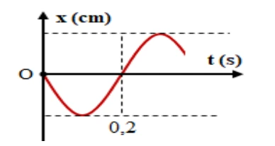{ loading=lazy }

A. $0{,}5\pi$ rad.

B. $-0{,}5\pi$ rad.

C. $0{,}25\pi$ rad.

D. $\pi$ rad.

??? success "Đáp án và lời giải"
    **Đáp án:** A.

    **Hướng dẫn giải:**

    Tại $t=0$, vật qua vị trí cân bằng nên $x_0=0$. Đồ thị đi xuống ngay sau $t=0$, do đó $v_0<0$.

    Với $x=A\cos(\omega t+\varphi)$:

    $\cos\varphi=0,\qquad v_0=-A\omega\sin\varphi<0.$

    Suy ra $\sin\varphi>0$, nên có thể chọn

    $\varphi=\frac{\pi}{2}=0{,}5\pi\ \text{rad}.$
#### Bài 76

<!-- source-id: BT-Chuong-I-p11-q21-21 -->

Một vật dao động điều hòa theo phương trình

$$
x=10\cos(4\pi t)\ \text{cm}.
$$

Li độ của vật tại $t=5\,\mathrm s$ là

A. $4{,}56\,\mathrm{cm}$.

B. $10\,\mathrm{cm}$.

C. $4\,\mathrm{cm}$.

D. $10\,\mathrm m$.

??? success "Đáp án và lời giải"
    **Đáp án:** B.

    **Hướng dẫn giải:**

    Thay $t=5\,\mathrm s$ vào phương trình:

    $x=10\cos(4\pi\cdot5)=10\cos(20\pi)=10\ \text{cm}.$
#### Bài 77

<!-- source-id: BT-Chuong-I-p11-q22-22 -->

Một vật dao động điều hòa theo phương trình

$$
x=6\cos(4\pi t)\ \text{cm}.
$$

Tần số góc của dao động là

A. $4\pi\,\mathrm{Hz}$.

B. $4\pi$ rad.

C. $4\pi\,\mathrm{rad/s}$.

D. $4\pi\,\mathrm s$.

??? success "Đáp án và lời giải"
    **Đáp án:** C.

    **Hướng dẫn giải:**

    So sánh với $x=A\cos(\omega t+\varphi)$, hệ số của $t$ trong pha là

    $$\omega=4\pi\ \text{rad/s}.$$
#### Bài 78

<!-- source-id: BT-Chuong-I-p11-q23-23 -->

Một vật nhỏ dao động điều hòa với biên độ $A=4\,\mathrm{cm}$. Tại một thời điểm, pha dao động bằng $\dfrac{\pi}{4}$ rad. Khi đó vật có li độ và chiều chuyển động là

A. $-2\,\mathrm{cm}$ và chuyển động theo chiều dương của trục $Ox$.

B. $2\sqrt2\,\mathrm{cm}$ và chuyển động theo chiều âm của trục $Ox$.

C. $-2\,\mathrm{cm}$ và chuyển động theo chiều âm của trục $Ox$.

D. $2\sqrt2\,\mathrm{cm}$ và chuyển động theo chiều dương của trục $Ox$.

??? success "Đáp án và lời giải"
    **Đáp án:** B.

    **Hướng dẫn giải:**

    Với pha $\Phi=\pi/4$:

    $x=A\cos\Phi=4\cos\frac{\pi}{4}=2\sqrt2\ \text{cm}.$

    Vận tốc có dấu

    $v=-A\omega\sin\Phi<0$

    vì $\sin(\pi/4)>0$. Do đó vật đang chuyển động theo chiều âm.
#### Bài 79

<!-- source-id: BT-Chuong-I-p11-q24-24 -->

Một dao động điều hòa thực hiện được $5$ dao động toàn phần trong $4{,}8\,\mathrm s$. Chu kì dao động là

A. $4{,}8\,\mathrm s$.

B. $0{,}96\,\mathrm s$.

C. $9{,}8\,\mathrm s$.

D. $9{,}6\,\mathrm s$.

??? success "Đáp án và lời giải"
    **Đáp án:** B

    **Hướng dẫn giải:**

    Năm dao động toàn phần kéo dài $\Delta t=4{,}8\,\mathrm s$, nên

    $T=\dfrac{\Delta t}{N}=\dfrac{4{,}8}{5}=0{,}96\,\mathrm s$.

    Vì vậy chọn **B**.

#### Bài 80

<!-- source-id: BT-Chuong-I-p12-q26-26 -->

Một chất điểm dao động điều hòa có tần số góc $\omega=10\pi\,\mathrm{rad/s}$. Tần số dao động là

A. $5\,\mathrm{Hz}$.

B. $10\,\mathrm{Hz}$.

C. $20\,\mathrm{Hz}$.

D. $5\pi\,\mathrm{Hz}$.

??? success "Đáp án và lời giải"
    **Đáp án:** A.

    **Hướng dẫn giải:**

    $f=\frac{\omega}{2\pi}=\frac{10\pi}{2\pi}=5\ \text{Hz}.$
#### Bài 81

<!-- source-id: BT-Chuong-I-p12-q27-27 -->

Một vật dao động điều hòa trên trục $Ox$. Đồ thị li độ – thời gian được cho như hình dưới. Tần số góc của dao động bằng

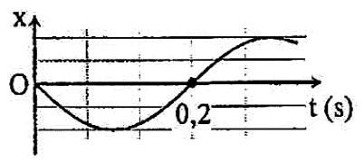{ loading=lazy }

A. $5\pi\,\mathrm{rad/s}$.

B. $5\,\mathrm{rad/s}$.

C. $10\,\mathrm{rad/s}$.

D. $10\pi\,\mathrm{rad/s}$.

??? success "Đáp án và lời giải"
    **Đáp án:** A.

    **Hướng dẫn giải:**

    Từ đồ thị, thời gian từ lúc qua vị trí cân bằng theo chiều âm đến lần kế tiếp qua vị trí cân bằng theo chiều dương là $0{,}2\,\mathrm s$, tức $T/2=0{,}2\,\mathrm s$. Do đó $T=0{,}4\,\mathrm s$ và

    $\omega=\frac{2\pi}{T}=5\pi\ \text{rad/s}.$
#### Bài 82

<!-- source-id: BT-Chuong-I-p12-q28-28 -->

Hình dưới là đồ thị li độ – thời gian $(x-t)$ của một vật dao động điều hòa. Thời điểm vật đi qua vị trí cân bằng lần đầu tiên là

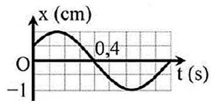{ loading=lazy }

A. $0{,}4\,\mathrm s$.

B. $0{,}2\,\mathrm s$.

C. $0{,}1\,\mathrm s$.

D. $0{,}8\,\mathrm s$.

??? success "Đáp án và lời giải"
    **Đáp án:** A.

    **Hướng dẫn giải:**

    Vị trí cân bằng ứng với $x=0$. Quan sát đồ thị từ $t=0$, lần đầu đường cong cắt trục thời gian tại $t=0{,}4\,\mathrm s$.

    Vì vậy thời điểm vật đi qua vị trí cân bằng lần đầu tiên là $0{,}4\,\mathrm s$.
#### Bài 83

<!-- source-id: BT-Chuong-I-p12-q29-29 -->

Một vật dao động điều hòa trên trục $Ox$. Hình dưới là đồ thị biểu diễn sự phụ thuộc của li độ $x$ vào thời gian $t$. Tần số và biên độ của dao động lần lượt là

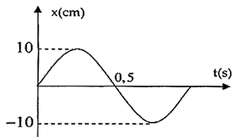{ loading=lazy }

A. $2\,\mathrm{Hz}$ và $10\,\mathrm{cm}$.

B. $2\,\mathrm{Hz}$ và $20\,\mathrm{cm}$.

C. $1\,\mathrm{Hz}$ và $10\,\mathrm{cm}$.

D. $1\,\mathrm{Hz}$ và $20\,\mathrm{cm}$.

??? success "Đáp án và lời giải"
    **Đáp án:** C.

    **Hướng dẫn giải:**

    Từ đồ thị, độ lớn li độ cực đại là $10\,\mathrm{cm}$ nên biên độ $A=10\,\mathrm{cm}$.

    Hai trạng thái cùng pha liên tiếp lặp lại sau $1\,\mathrm s$, do đó $T=1\,\mathrm s$ và

    $f=\frac{1}{T}=1\ \text{Hz}.$

    Vậy $f=1\,\mathrm{Hz}$ và $A=10\,\mathrm{cm}$.
#### Bài 84

<!-- source-id: BT-Chuong-I-p12-q30-30 -->

Một dao động điều hòa có đồ thị như hình dưới. Kết luận nào sau đây **sai**?

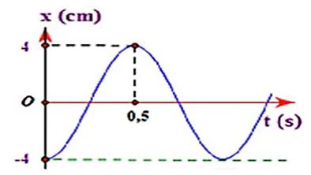{ loading=lazy }

A. $A=4\,\mathrm{cm}$.

B. $T=0{,}5\,\mathrm s$.

C. $f=1\,\mathrm{Hz}$.

D. $\omega=2\pi\,\mathrm{rad/s}$.

??? success "Đáp án và lời giải"
    **Đáp án:** B.

    **Hướng dẫn giải:**

    Từ đồ thị, biên độ $A=4\,\mathrm{cm}$. Vật đi từ biên âm tại $t=0$ đến biên dương tại $t=0{,}5\,\mathrm s$, đây là nửa chu kì:

    $\frac{T}{2}=0{,}5\ \text{s}\Rightarrow T=1\ \text{s}.$

    Suy ra $f=1\,\mathrm{Hz}$ và $\omega=2\pi\,\mathrm{rad/s}$. Vì vậy phát biểu B là sai.
#### Bài 85

<!-- source-id: BT-Chuong-I-p13-q31-31 -->

Hình dưới là đồ thị li độ – thời gian của hai dao động. Nhận định nào sau đây đúng?

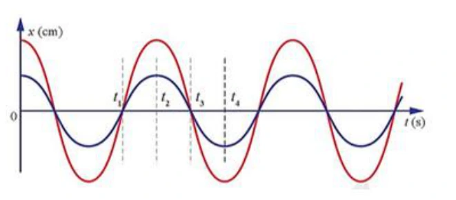{ loading=lazy }

A. Hai dao động cùng biên độ và cùng tần số.

B. Hai dao động khác biên độ và khác tần số.

C. Hai dao động khác biên độ và cùng tần số.

D. Hai dao động cùng biên độ và khác tần số.

??? success "Đáp án và lời giải"
    **Đáp án:** C.

    **Hướng dẫn giải:**

    Hai đường có các thời điểm lặp lại trạng thái cách nhau như nhau, nên chúng có cùng chu kì và cùng tần số. Tuy nhiên độ lệch cực đại của hai đường so với vị trí cân bằng khác nhau, nên biên độ khác nhau.
#### Bài 86

<!-- source-id: BT-Chuong-I-p38-q19-100 -->

Một chất điểm dao động điều hòa theo phương trình

$$
x=2\sqrt3\cos\left(10\pi t+\frac{\pi}{3}\right)\ \text{cm}.
$$

Tần số dao động là

A. $10\,\mathrm{Hz}$.

B. $20\,\mathrm{Hz}$.

C. $10\pi\,\mathrm{Hz}$.

D. $5\,\mathrm{Hz}$.

??? success "Đáp án và lời giải"
    **Đáp án:** D.

    **Hướng dẫn giải:**

    $\omega=10\pi\,\mathrm{rad/s}$, do đó

    $f=\frac{\omega}{2\pi}=5\ \text{Hz}.$
#### Bài 87

<!-- source-id: BT-Chuong-I-p39-q21-102 -->

Một vật dao động điều hòa với biên độ $A=5\,\mathrm{cm}$. Giá trị nào sau đây **có thể** là li độ của vật?

A. $x=6\,\mathrm{cm}$.

B. $x=10\,\mathrm{cm}$.

C. $x=-6\,\mathrm{cm}$.

D. $x=1{,}2\,\mathrm{cm}$.

??? success "Đáp án và lời giải"
    **Đáp án:** D.

    **Hướng dẫn giải:**

    Trong dao động điều hòa, li độ luôn thỏa $|x|\le A$. Với $A=5\,\mathrm{cm}$, chỉ $x=1{,}2\,\mathrm{cm}$ nằm trong khoảng $[-5;5]\,\mathrm{cm}$.
#### Bài 88

<!-- source-id: BT-Chuong-I-p39-q22-103 -->

Một vật dao động điều hòa thực hiện được $30$ dao động trong $3\,\mathrm s$. Tần số góc của dao động là

A. $10\,\mathrm{rad/s}$.

B. $20\pi\,\mathrm{rad/s}$.

C. $90\,\mathrm{rad/s}$.

D. $0{,}1\,\mathrm{rad/s}$.

??? success "Đáp án và lời giải"
    **Đáp án:** B.

    **Hướng dẫn giải:**

    $f=\frac{N}{\Delta t}=\frac{30}{3}=10\ \text{Hz}.$

    Do đó

    $\omega=2\pi f=20\pi\ \text{rad/s}.$
#### Bài 89

<!-- source-id: BT-Chuong-I-p39-q23-104 -->

Dựa vào đồ thị li độ – thời gian dưới đây, pha ban đầu của dao động là

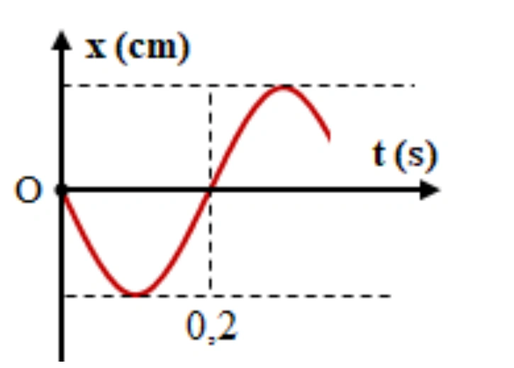{ loading=lazy }

A. $0{,}5\pi$ rad.

B. $-0{,}5\pi$ rad.

C. $0{,}25\pi$ rad.

D. $\pi$ rad.

??? success "Đáp án và lời giải"
    **Đáp án:** A.

    **Hướng dẫn giải:**

    Tại $t=0$, vật qua vị trí cân bằng và đồ thị đi xuống, nên $x_0=0$, $v_0<0$. Với dạng cos, điều này tương ứng

    $\varphi=\frac{\pi}{2}=0{,}5\pi\ \text{rad}.$
#### Bài 90

<!-- source-id: BT-Chuong-I-p39-q24-105 -->

Dựa vào đồ thị li độ – thời gian dưới đây, chu kì dao động là

{ loading=lazy }

A. $0{,}2\,\mathrm s$.

B. $0{,}4\,\mathrm s$.

C. $5\,\mathrm s$.

D. $2{,}5\,\mathrm s$.

??? success "Đáp án và lời giải"
    **Đáp án:** B.

    **Hướng dẫn giải:**

    Tại $t=0$, vật qua vị trí cân bằng theo chiều âm. Đến $t=0{,}2\,\mathrm s$, vật qua vị trí cân bằng theo chiều dương. Hai trạng thái này ngược pha và cách nhau $T/2$, nên

    $\frac{T}{2}=0{,}2\ \text{s}\Rightarrow T=0{,}4\ \text{s}.$
#### Bài 91

<!-- source-id: BT-Chuong-I-p39-q25-106 -->

Một vật dao động điều hòa theo phương trình

$$x=5\cos\left[10\left(\pi t+\frac{\pi}{4}\right)\right]\ \text{cm},$$

trong đó $t$ tính bằng giây. Tần số dao động của vật là

A. $5\,\mathrm{Hz}$.

B. $15\,\mathrm{Hz}$.

C. $10\,\mathrm{Hz}$.

D. $6\,\mathrm{Hz}$.

??? success "Đáp án và lời giải"
    **Đáp án:** A.

    **Hướng dẫn giải:**

    Khai triển pha: $10(\pi t+\pi/4)=10\pi t+5\pi/2$, nên $\omega=10\pi\,\mathrm{rad/s}$ và $f=\omega/(2\pi)=5\,\mathrm{Hz}$.
#### Bài 92

<!-- source-id: BT-Chuong-I-p39-q26-107 -->

Một vật dao động điều hòa theo phương trình

$$x=4\cos\left(4\pi t+\frac{\pi}{3}\right)\ \text{cm},$$

trong đó $t$ tính bằng giây. Thời gian để vật thực hiện một dao động toàn phần là

A. $4\,\mathrm s$.

B. $0{,}5\,\mathrm s$.

C. $2\,\mathrm s$.

D. $1\,\mathrm s$.

??? success "Đáp án và lời giải"
    **Đáp án:** B.

    **Hướng dẫn giải:**

    $\omega=4\pi\,\mathrm{rad/s}$ nên $T=2\pi/\omega=0{,}5\,\mathrm s$.
#### Bài 93

<!-- source-id: BT-Chuong-I-p39-q27-108 -->

Một chất điểm dao động điều hòa với phương trình

$$x=2\cos\left(2\pi t+\frac{\pi}{2}\right)\ \text{cm}.$$

Tại thời điểm $t=0{,}25\,\mathrm s$, chất điểm có li độ bằng

A. $2\,\mathrm{cm}$.

B. $\sqrt3\,\mathrm{cm}$.

C. $-\sqrt3\,\mathrm{cm}$.

D. $-2\,\mathrm{cm}$.

??? success "Đáp án và lời giải"
    **Đáp án:** D.

    **Hướng dẫn giải:**

    $$x(0{,}25)=2\cos\left(2\pi\cdot0{,}25+\frac{\pi}{2}\right)=2\cos\pi=-2\ \text{cm}.$$
#### Bài 94

<!-- source-id: BT-Chuong-I-p40-q31-112 -->

Một vật dao động điều hòa theo phương trình

$$
x=4\cos\left(20\pi t-\frac{\pi}{6}\right)\ \text{cm}.
$$

Tần số và pha ban đầu của dao động lần lượt là

A. $10\,\mathrm{Hz}$ và $-\dfrac{\pi}{6}$ rad.

B. $0{,}1\,\mathrm{Hz}$ và $\dfrac{\pi}{6}$ rad.

C. $0{,}1\,\mathrm{Hz}$ và $-\dfrac{\pi}{6}$ rad.

D. $10\,\mathrm{Hz}$ và $\dfrac{\pi}{6}$ rad.

??? success "Đáp án và lời giải"
    **Đáp án:** A.

    **Hướng dẫn giải:**

    Từ phương trình, $\omega=20\pi\,\mathrm{rad/s}$ và $\varphi=-\pi/6$. Vì vậy

    $f=\frac{\omega}{2\pi}=10\ \text{Hz}.$
#### Bài 95

<!-- source-id: BT-Chuong-I-p40-q32-113 -->

Một chất điểm dao động điều hòa theo phương trình

$$
x=5\cos(2\pi t)\ \text{cm}.
$$

Chu kì dao động của chất điểm là

A. $1\,\mathrm s$.

B. $2\,\mathrm s$.

C. $0{,}5\,\mathrm s$.

D. $1\,\mathrm{Hz}$.

??? success "Đáp án và lời giải"
    **Đáp án:** A.

    **Hướng dẫn giải:**

    $\omega=2\pi\,\mathrm{rad/s}$ nên

    $T=\frac{2\pi}{\omega}=1\ \text{s}.$
#### Bài 96

<!-- source-id: BT-Chuong-I-p40-q33-114 -->

Một vật dao động tuần hoàn, mỗi phút thực hiện được $360$ dao động. Tần số dao động của vật là

A. $7\,\mathrm{Hz}$.

B. $5\,\mathrm{Hz}$.

C. $8\,\mathrm{Hz}$.

D. $6\,\mathrm{Hz}$.

??? success "Đáp án và lời giải"
    **Đáp án:** D.

    **Hướng dẫn giải:**

    Một phút bằng $60\,\mathrm s$, do đó

    $f=\frac{N}{\Delta t}=\frac{360}{60}=6\ \text{Hz}.$
### Vận dụng — Trả lời ngắn

#### Bài 97

<!-- source-id: BT-Chuong-I-p22-q2-48 -->

Một chất điểm dao động điều hòa với biên độ $5\,\mathrm{cm}$ và thời gian thực hiện một dao động toàn phần là $\dfrac13\,\mathrm s$. Tính tốc độ trung bình trong một dao động, theo đơn vị m/s. **Làm tròn đến một chữ số thập phân.**

??? success "Đáp án và lời giải"
    **Đáp án:** $0{,}6\,\mathrm{m/s}$.

    **Hướng dẫn giải:**

    Trong một chu kì, vật đi quãng đường $4A=20\,\mathrm{cm}$ $=0{,}20\,\mathrm m$. Do đó

    $\bar v=\frac{4A}{T}=\frac{0{,}20}{1/3}=0{,}60\ \text{m/s}.$
#### Bài 98

<!-- source-id: BT-Chuong-I-p22-q4-50 -->

Một vật dao động điều hòa trên trục $Ox$. Đồ thị li độ – thời gian được cho như hình dưới. Chu kì dao động của vật bằng bao nhiêu giây?

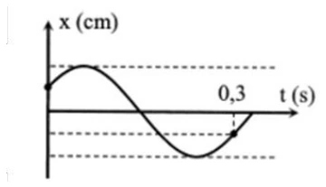{ loading=lazy }

??? success "Đáp án và lời giải"
    **Đáp án:** $0{,}36\,\mathrm s$.

    **Hướng dẫn giải:**

    Tại $t=0$, đồ thị cho $x=A/2$ và vật đang đi lên, tương ứng pha $\varphi=-\pi/3$.

    Từ trạng thái ban đầu đến trạng thái được đánh dấu tại $t=0{,}3\,\mathrm s$, vật lần lượt đi qua các khoảng pha tương ứng $T/6$, $T/2$ và $T/6$. Vì vậy

    $0{,}3=\frac{T}{6}+\frac{T}{2}+\frac{T}{6}=\frac{5T}{6}.$

    Suy ra

    $T=0{,}3\cdot\frac65=0{,}36\ \text{s}.$
#### Bài 99

<!-- source-id: BT-Chuong-I-p23-q5-51 -->

Một vật dao động điều hòa theo phương trình

$$x=6\cos\left(2\pi t+\frac{3\pi}{4}\right)\ \text{cm}.$$

Kể từ thời điểm $t=\dfrac{13}{8}\,\mathrm s$, xác định **thời điểm gần nhất tính từ gốc thời gian** mà vật đi qua vị trí cách vị trí cân bằng $3\sqrt2\,\mathrm{cm}$ **lần thứ hai**, đồng thời vật đang chuyển động ra xa vị trí cân bằng.

??? success "Đáp án và lời giải"
    **Đáp án:** $2{,}5\,\mathrm s$.

    **Hướng dẫn giải:**

    Chu kì $T=1\,\mathrm s$. Tại $t_0=13/8\,\mathrm s$:

    $$\Phi_0=2\pi\cdot\frac{13}{8}+\frac{3\pi}{4}=4\pi,$$

    nên vật đang ở biên dương $x=A$. Điều kiện cách vị trí cân bằng $3\sqrt2\,\mathrm{cm}$ tương ứng $|x|=A\sqrt2/2$. Kể từ biên dương, hai lần đầu thỏa điều kiện **và đang đi ra xa vị trí cân bằng** lần lượt xuất hiện sau các quãng pha thích hợp; lần thứ hai cách trạng thái ban đầu $7T/8$. Vì vậy

    $$t=t_0+\frac{7T}{8}=\frac{13}{8}+\frac78=\frac{20}{8}=2{,}5\ \text{s}.$$
#### Bài 100

<!-- source-id: BT-Chuong-I-p23-q6-52 -->

Một vật dao động điều hòa theo phương trình

$$
x=10\cos\left(3\pi t-\frac{\pi}{3}\right)\ \text{cm}.
$$

Kể từ $t=0$, thời điểm vật đi qua vị trí $x=8\,\mathrm{cm}$ **lần thứ 16** là bao nhiêu giây?

??? success "Đáp án và lời giải"
    **Đáp án:** $4{,}85\,\mathrm s$.

    **Hướng dẫn giải:**

    Ta có

    $\omega=3\pi\ \text{rad/s},\qquad T=\frac{2\pi}{\omega}=\frac23\ \text{s}.$

    Điều kiện $x=8\,\mathrm{cm}$ cho

    $\cos\Phi=\frac{8}{10}=0{,}8.$

    Đặt $\alpha=\arccos(0{,}8)$. Tại $t=0$, pha $\Phi_0=-\pi/3$. Trong mỗi chu kì vật đi qua $x=8\,\mathrm{cm}$ hai lần. Sau $7T$ đã có $14$ lần; trong chu kì tiếp theo, lần thứ 16 ứng với pha $\Phi=2\pi+\alpha$ tính từ đầu chu kì đó. Do đó

    $t=7T+\frac{T}{6}+\frac{\alpha}{2\pi}T =\frac{14}{3}+\frac19+\frac{\arccos(0{,}8)}{3\pi} \approx4{,}846\ \text{s}.$

    Làm tròn đến hai chữ số thập phân: $t\approx4{,}85\,\mathrm s$.
#### Bài 101

<!-- source-id: BT-Chuong-I-p24-q7-53 -->

Cho đồ thị li độ – thời gian của một vật dao động điều hòa như hình dưới. Độ dịch chuyển của vật từ lúc $t_1=5\,\mathrm s$ đến $t_2=9\,\mathrm s$ là bao nhiêu xentimét?

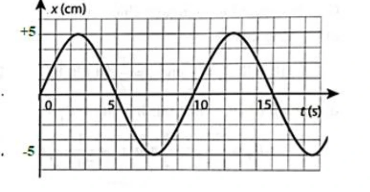{ loading=lazy }

??? success "Đáp án và lời giải"
    **Đáp án:** $-2{,}5\,\mathrm{cm}$.

    **Hướng dẫn giải:**

    Từ đồ thị:

    - tại $t_1=5\,\mathrm s$: $x_1=0\,\mathrm{cm}$;
    - tại $t_2=9\,\mathrm s$: $x_2=-2{,}5\,\mathrm{cm}$.

    Theo định nghĩa độ dịch chuyển trong khoảng thời gian này:

    $$\Delta x=x_2-x_1=-2{,}5-0=-2{,}5\ \text{cm}.$$

    Dấu âm cho biết vị trí cuối nằm về phía âm của trục tọa độ so với vị trí đầu.
#### Bài 102

<!-- source-id: BT-Chuong-I-p24-q8-54 -->

Một vật dao động điều hòa theo phương trình

$$x=4\cos\left(5\pi t-\frac{\pi}{3}\right)\ \text{cm}.$$

Kể từ thời điểm $t=\dfrac{41}{12}\,\mathrm s$, xác định **thời điểm gần nhất tính từ gốc thời gian** mà vật đi qua vị trí $x=3\,\mathrm{cm}$ **lần thứ hai**. Kết quả làm tròn đến hai chữ số thập phân.

??? success "Đáp án và lời giải"
    **Đáp án:** $3{,}71\,\mathrm s$.

    **Hướng dẫn giải:**

    Ta có $\omega=5\pi\,\mathrm{rad/s}$ nên $T=0{,}4\,\mathrm s$. Tại $t_0=41/12\,\mathrm s$:

    $$\Phi_0=5\pi\frac{41}{12}-\frac{\pi}{3}=\frac{67\pi}{4}\equiv\frac{3\pi}{4}\pmod{2\pi}.$$

    Điều kiện $x=3\,\mathrm{cm}$ cho

    $$\cos\Phi=\frac34.$$

    Đặt $\alpha=\arccos(3/4)$. Sau pha $3\pi/4$, hai lần tiếp theo vật đạt $x=3\,\mathrm{cm}$ ứng với $\Phi=2\pi-\alpha$ và $\Phi=2\pi+\alpha$. Vì đề hỏi **lần thứ hai**, ta dùng $2\pi+\alpha$:

    $$\Delta t=\frac{2\pi+\alpha-3\pi/4}{5\pi}=\frac14+\frac{\alpha}{5\pi}\approx0{,}296\ \text{s}.$$

    Suy ra

    $$t=t_0+\Delta t\approx3{,}4167+0{,}296=3{,}71\ \text{s}.$$
### Vận dụng — Trắc nghiệm 4 lựa chọn

#### Bài 103

<!-- source-id: BT-Chuong-I-p15-q36-36 -->

Hình dưới là đồ thị biểu diễn độ dời $x$ theo thời gian $t$ của một vật dao động điều hòa. Phương trình dao động của vật là

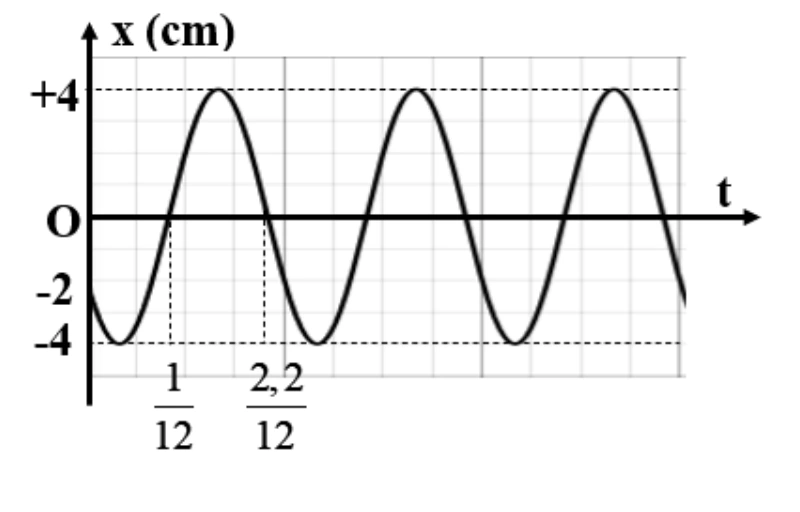{ loading=lazy }

A. $x=4\cos\left(10\pi t+\dfrac{2\pi}{3}\right)\,\mathrm{cm}$.

B. $x=4\cos\left(20\pi t+\dfrac{2\pi}{3}\right)\,\mathrm{cm}$.

C. $x=4\cos\left(10\pi t+\dfrac{5\pi}{6}\right)\,\mathrm{cm}$.

D. $x=4\cos\left(20\pi t-\dfrac{\pi}{3}\right)\,\mathrm{cm}$.

??? success "Đáp án và lời giải"
    **Đáp án:** A.

    **Hướng dẫn giải:**

    Từ đồ thị đọc được $A=4\,\mathrm{cm}$. Chu kì $T=0{,}2\,\mathrm s$ nên $\omega=10\pi\,\mathrm{rad/s}$. Trạng thái ban đầu trên đồ thị cho $\varphi=2\pi/3$, vì vậy phương án A phù hợp.
#### Bài 104

<!-- source-id: BT-Chuong-I-p15-q38-38 -->

Một vật dao động điều hòa trên trục $Ox$. Tại $t=0$, vật ở biên dương. Tại các thời điểm $t=\tau$ và $t=2\tau$, vật có li độ lần lượt là $3\sqrt2\,\mathrm{cm}$ và $-5\,\mathrm{cm}$. Biên độ dao động của vật bằng

A. $9\,\mathrm{cm}$.

B. $3\,\mathrm{cm}$.

C. $6\,\mathrm{cm}$.

D. $5\,\mathrm{cm}$.

??? success "Đáp án và lời giải"
    **Đáp án:** A.

    **Hướng dẫn giải:**

    Vì tại $t=0$ vật ở biên dương, có thể viết

    $$x=A\cos(\omega t).$$

    Đặt $c=\cos(\omega\tau)$. Từ dữ kiện tại $t=\tau$:

    $$Ac=3\sqrt2.\tag{1}$$

    Tại $t=2\tau$:

    $A\cos(2\omega\tau)=A(2c^2-1)=-5.\tag{2}$

    Từ (1), $c^2=18/A^2$. Thay vào (2):

    $A\left(\frac{36}{A^2}-1\right)=-5 \Rightarrow A^2-5A-36=0.$

    Do $A>0$, suy ra $A=9\,\mathrm{cm}$.
#### Bài 105

<!-- source-id: BT-Chuong-I-p16-q39-39 -->

Một vật dao động điều hòa trên trục $Ox$. Hình dưới là đồ thị biểu diễn sự phụ thuộc của li độ $x$ vào thời gian $t$. Phương trình dao động của vật là

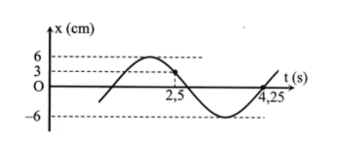{ loading=lazy }

A. $x=6\cos\left(\dfrac{\pi}{3}t-\dfrac{2\pi}{3}\right)\,\mathrm{cm}$.

B. $x=6\cos\left(\dfrac{2\pi}{3}t+\dfrac{2\pi}{3}\right)\,\mathrm{cm}$.

C. $x=6\cos\left(\dfrac{\pi}{3}t+\dfrac{2\pi}{3}\right)\,\mathrm{cm}$.

D. $x=6\cos\left(\dfrac{2\pi}{3}t-\dfrac{2\pi}{3}\right)\,\mathrm{cm}$.

??? success "Đáp án và lời giải"
    **Đáp án:** B.

    **Hướng dẫn giải:**

    Từ đồ thị đọc được $A=6\,\mathrm{cm}$. Khoảng thời gian từ $t=2{,}5\,\mathrm s$ đến $t=4{,}25\,\mathrm s$ tương ứng tổng $T/3+T/4=7T/12$, do đó

    $$1{,}75=\frac{7T}{12}\Rightarrow T=3\ \text{s},\qquad \omega=\frac{2\pi}{3}\ \text{rad/s}.$$

    Tại $t=2{,}5\,\mathrm s$, vật có $x=A/2$ ở nhánh phù hợp của đồ thị, suy ra pha tại thời điểm đó là $\pi/3$ (theo modulo $2\pi$). Từ $\omega t+\varphi\equiv\pi/3$ ta được $\varphi\equiv2\pi/3$. Vậy

    $$x=6\cos\left(\frac{2\pi}{3}t+\frac{2\pi}{3}\right)\ \text{cm}.$$
#### Bài 106

<!-- source-id: BT-Chuong-I-p16-q40-40 -->

Một vật dao động điều hòa trên trục $Ox$. Đồ thị li độ – thời gian được cho như hình dưới. Pha ban đầu của dao động là

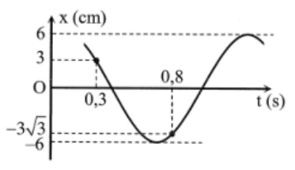{ loading=lazy }

A. $\dfrac{\pi}{6}$ rad.

B. $-\dfrac{\pi}{6}$ rad.

C. $\dfrac{\pi}{3}$ rad.

D. $-\dfrac{\pi}{3}$ rad.

??? success "Đáp án và lời giải"
    **Đáp án:** B.

    **Hướng dẫn giải:**

    Từ đồ thị, khoảng thời gian từ $t=0{,}3\,\mathrm s$ đến $t=0{,}8\,\mathrm s$ tương ứng

    $\frac{T}{3}+\frac{T}{12}=0{,}5\ \text{s}.$

    Suy ra $T=6/5\,\mathrm s$ và

    $\omega=\frac{2\pi}{T}=\frac{5\pi}{3}\ \text{rad/s}.$

    Tại $t=0{,}3\,\mathrm s$, đồ thị cho $x=A/2$ và vật đang đi xuống, nên pha khi đó là $\pi/3$. Vì

    $\omega\cdot0{,}3+\varphi=\frac{\pi}{3},$

    ta có

    $\frac{5\pi}{3}\cdot0{,}3+\varphi=\frac{\pi}{3} \Rightarrow \varphi=-\frac{\pi}{6}.$
#### Bài 107

<!-- source-id: BT-Chuong-I-p26-q2-56 -->

Một vật dao động điều hòa theo phương trình

$$
x=10\cos(2\pi t+\pi)\ \text{cm}.
$$

Tần số góc của dao động là

A. $2\pi\,\mathrm{rad/s}$.

B. $\pi\,\mathrm{rad/s}$.

C. $2\pi t\,\mathrm{rad/s}$.

D. $(2\pi t+\pi)\,\mathrm{rad/s}$.

??? success "Đáp án và lời giải"
    **Đáp án:** A.

    **Hướng dẫn giải:**

    So sánh với $x=A\cos(\omega t+\varphi)$, ta đọc trực tiếp

    $$\omega=2\pi\ \text{rad/s}.$$
#### Bài 108

<!-- source-id: BT-Chuong-I-p26-q3-57 -->

Trong phương trình dao động điều hòa

$$
x=A\cos(\omega t+\varphi_0),
$$

độ dịch chuyển cực đại của vật tính từ vị trí cân bằng là

A. biên độ $A$.

B. tần số góc $\omega$.

C. pha dao động $(\omega t+\varphi_0)$.

D. chu kì $T$.

??? success "Đáp án và lời giải"
    **Đáp án:** A.

    **Hướng dẫn giải:**

    Biên độ $A$ chính là độ lớn li độ cực đại, tức khoảng cách lớn nhất từ vật đến vị trí cân bằng.
#### Bài 109

<!-- source-id: BT-Chuong-I-p26-q4-58 -->

Phương trình dao động của một vật dao động điều hòa có dạng

$$x=A\cos\left(\omega t+\frac{3\pi}{4}\right).$$

Gốc thời gian đã được chọn lúc nào?

A. Lúc chất điểm đi qua vị trí $x=A/2$ theo chiều dương.

B. Lúc chất điểm đi qua vị trí $x=A\sqrt2/2$ theo chiều dương.

C. Lúc chất điểm đi qua vị trí $x=-A\sqrt2/2$ theo chiều âm.

D. Lúc chất điểm đi qua vị trí $x=A/2$ theo chiều âm.

??? success "Đáp án và lời giải"
    **Đáp án:** C.

    **Hướng dẫn giải:**

    Tại $t=0$, pha bằng $3\pi/4$, nên $x_0=A\cos(3\pi/4)=-A\sqrt2/2$. Đồng thời $v_0=-A\omega\sin(3\pi/4)<0$, tức vật đang chuyển động theo chiều âm.
#### Bài 110

<!-- source-id: BT-Chuong-I-p26-q5-59 -->

Một chất điểm dao động điều hòa có phương trình li độ theo thời gian

$$x=5\sqrt3\cos\left(20\pi t+\frac{\pi}{4}\right)\ \text{cm}.$$

Tần số dao động là

A. $10\,\mathrm{Hz}$.

B. $20\,\mathrm{Hz}$.

C. $10\pi\,\mathrm{Hz}$.

D. $5\,\mathrm{Hz}$.

??? success "Đáp án và lời giải"
    **Đáp án:** A.

    **Hướng dẫn giải:**

    Hệ số của $t$ trong pha là $\omega=20\pi\,\mathrm{rad/s}$, do đó $f=\omega/(2\pi)=10\,\mathrm{Hz}$.
#### Bài 111

<!-- source-id: BT-Chuong-I-p26-q7-61 -->

Trường hợp nào sau đây chuyển động của vật không phải là dao động cơ?

A. Dây đàn vĩ cầm rung động.

B. Cành cây đung đưa trước gió.

C. Thuyền nhấp nhô trên mặt biển.

D. Thả một vật rơi từ trên cao xuống.

??? success "Đáp án và lời giải"
    **Đáp án:** D.

    **Hướng dẫn giải:**

    Dao động cơ là chuyển động có trạng thái lặp lại quanh một vị trí cân bằng. Dây đàn rung, cành cây đung đưa và thuyền nhấp nhô đều có tính dao động; vật rơi tự do từ trên cao xuống không chuyển động qua lại quanh một vị trí cân bằng.
#### Bài 112

<!-- source-id: BT-Chuong-I-p27-q11-65 -->

Nhận định nào sau đây là đúng?

A. Biên độ là đại lượng đại số.

B. Biên độ là đại lượng luôn dương.

C. Biên độ là đại lượng luôn âm.

D. Biên độ là đại lượng biến đổi theo thời gian.

??? success "Đáp án và lời giải"
    **Đáp án:** B.

    **Hướng dẫn giải:**

    Biên độ là độ lệch cực đại so với vị trí cân bằng và được lấy dương; trong phương trình chuẩn nó là hệ số $A$.
#### Bài 113

<!-- source-id: BT-Chuong-I-p27-q12-66 -->

Trong phương trình dao động điều hòa

$$
x=A\cos(\omega t+\varphi_0),
$$

phát biểu nào sau đây **sai**?

A. Biên độ $A$ phụ thuộc vào cách kích thích dao động.

B. Biên độ $A$ không phụ thuộc vào cách chọn gốc thời gian.

C. Pha ban đầu $\varphi_0$ không phụ thuộc vào cách chọn gốc thời gian.

D. Tần số góc $\omega$ phụ thuộc vào các đặc tính của hệ.

??? success "Đáp án và lời giải"
    **Đáp án:** C.

    **Hướng dẫn giải:**

    Pha ban đầu $\varphi_0$ **phụ thuộc vào cách chọn gốc thời gian**. Nếu thay đổi mốc $t=0$, giá trị pha ban đầu thay đổi tương ứng. Vì vậy phát biểu C là sai.

    Biên độ không thay đổi chỉ vì đổi mốc thời gian, còn tần số góc của dao động riêng được quyết định bởi các đặc tính của hệ.
#### Bài 114

<!-- source-id: BT-Chuong-I-p40-q34-115 -->

Một vật dao động điều hòa theo phương trình

$$
x=2\cos\left(4\pi t+\frac{\pi}{3}\right)\ \text{cm}.
$$

Chu kì và tần số dao động của vật là

A. $T=2\,\mathrm s$ và $f=0{,}5\,\mathrm{Hz}$.

B. $T=0{,}5\,\mathrm s$ và $f=2\,\mathrm{Hz}$.

C. $T=0{,}25\,\mathrm s$ và $f=4\,\mathrm{Hz}$.

D. $T=4\,\mathrm s$ và $f=0{,}5\,\mathrm{Hz}$.

??? success "Đáp án và lời giải"
    **Đáp án:** B.

    **Hướng dẫn giải:**

    $\omega=4\pi\,\mathrm{rad/s}$ nên

    $T=\frac{2\pi}{\omega}=\frac12\ \text{s}=0{,}5\ \text{s}, \qquad f=\frac1T=2\ \text{Hz}.$
#### Bài 115

<!-- source-id: BT-Chuong-I-p41-q37-118 -->

Một vật dao động điều hòa có đồ thị biểu diễn như hình dưới. Phương trình dao động của vật là

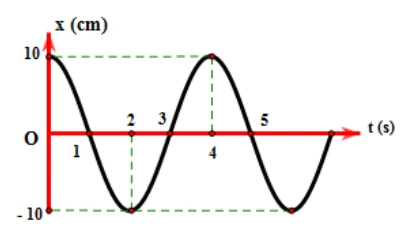{ loading=lazy }

A. $x=10\cos(0{,}5\pi t)\,\mathrm{cm}$.

B. $x=10\cos\left(4t+\dfrac{\pi}{2}\right)\,\mathrm{cm}$.

C. $x=4\cos(10t)\,\mathrm{cm}$.

D. $x=10\cos(8\pi t)\,\mathrm{cm}$.

??? success "Đáp án và lời giải"
    **Đáp án:** A.

    **Hướng dẫn giải:**

    Từ đồ thị: $A=10\,\mathrm{cm}$. Hai cực đại liên tiếp ở $t=0\,\mathrm s$ và $t=4\,\mathrm s$ nên $T=4\,\mathrm s$:

    $$\omega=\frac{2\pi}{T}=\frac{\pi}{2}=0{,}5\pi\ \text{rad/s}.$$

    Tại $t=0$, vật ở biên dương nên có thể chọn $\varphi=0$. Do đó

    $$x=10\cos(0{,}5\pi t)\ \text{cm}.$$
#### Bài 116

<!-- source-id: BT-Chuong-I-p41-q38-119 -->

Dựa vào đồ thị hai dao động dưới đây. Chu kì dao động là

{ loading=lazy }

A. $0{,}5\,\mathrm s$.

B. $0{,}02\,\mathrm s$.

C. $0{,}4\,\mathrm s$.

D. $0{,}05\,\mathrm s$.

??? success "Đáp án và lời giải"
    **Đáp án:** C.

    **Hướng dẫn giải:**

    Trên trục thời gian, mỗi ô ứng với $5\times10^{-2}\,\mathrm s$. Một chu kì dài $8$ ô, do đó

    $T=8\cdot5\times10^{-2}=0{,}4\ \text{s}.$
### Vận dụng — Đúng/Sai

#### Bài 117

<!-- source-id: BT-Chuong-I-p18-q3-43 -->

Vật dao động điều hòa có đồ thị li độ phụ thuộc thời gian như hình dưới. Xét các phát biểu:

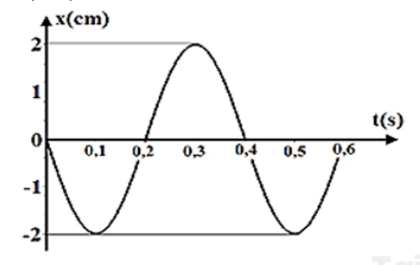{ loading=lazy }

a) Tại thời điểm $t=0{,}1\,\mathrm s$, li độ của vật là $-2\,\mathrm{cm}$.

b) Quãng đường vật đi được sau $0{,}6\,\mathrm s$ là $10\,\mathrm{cm}$.

c) Tại thời điểm $t=0{,}5\,\mathrm s$, li độ của vật là $-2\,\mathrm{cm}$.

d) Tại thời điểm $t=0$, vật ở biên dương.

??? success "Đáp án và lời giải"
    **Đáp án:** a) Đúng; b) Sai; c) Đúng; d) Sai.

    **Hướng dẫn giải:**

    a) **Đúng.** Từ đồ thị, tại $t=0{,}1\,\mathrm s$ vật ở biên âm nên $x=-2\,\mathrm{cm}$.

    b) **Sai.** Trong $0{,}6\,\mathrm s$, cộng các đoạn đường giữa các vị trí biên và cân bằng trên đồ thị được $S=12\,\mathrm{cm}$, không phải $10\,\mathrm{cm}$.

    c) **Đúng.** Tại $t=0{,}5\,\mathrm s$, đồ thị lại đạt biên âm $x=-2\,\mathrm{cm}$.

    d) **Sai.** Tại $t=0$, đồ thị đi qua vị trí cân bằng $x=0$ theo chiều âm; vật không ở biên dương.

#### Bài 118

<!-- source-id: BT-Chuong-I-p20-q5-45 -->

Đồ thị li độ - thời gian của một vật dao động điều hòa như hình dưới. Xét các phát biểu:

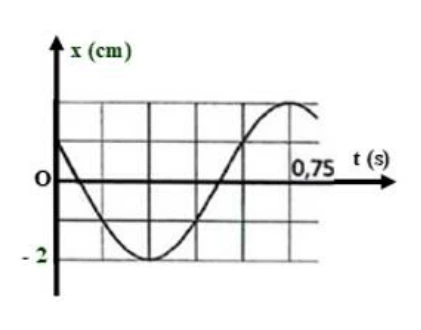{ loading=lazy }

a) Biên độ dao động của vật là $4\,\mathrm{cm}$.

b) Chu kì dao động của vật là $0{,}75\,\mathrm s$.

c) Tại thời điểm $t=0$, vật có li độ $2\,\mathrm{cm}$ và đi theo chiều dương.

d) Tại thời điểm $t=0{,}75\,\mathrm s$, vật đi qua vị trí cân bằng theo chiều dương.

??? success "Đáp án và lời giải"
    **Đáp án:** a) Sai; b) Sai; c) Sai; d) Sai.

    **Hướng dẫn giải:**

    a) **Sai.** Cực tiểu của đồ thị nằm đúng tại mức $x=-2\,\mathrm{cm}$ và cực đại đối xứng ở $x=+2\,\mathrm{cm}$, nên $A=2\,\mathrm{cm}$.

    b) **Sai.** Năm ô ngang ứng với $0{,}75\,\mathrm s$, nên mỗi ô là $0{,}15\,\mathrm s$. Một chu kì kéo dài sáu ô, do đó $T=0{,}9\,\mathrm s$.

    c) **Sai.** Tại $t=0$, đường cong ở mức $x=+1\,\mathrm{cm}$ và đang đi xuống, nên vật chuyển động theo chiều âm; phát biểu sai cả về li độ lẫn chiều chuyển động.

    d) **Sai.** Tại $t=0{,}75\,\mathrm s$, đường cong đạt biên dương, không đi qua vị trí cân bằng.

#### Bài 119

<!-- source-id: BT-Chuong-I-p20-q6-46 -->

Dao động của một vật là tổng hợp của hai dao động điều hòa cùng phương có li độ lần lượt là $x_1$ và $x_2$. Đồ thị dưới đây biểu diễn sự phụ thuộc của $x_1$ và $x_2$ theo thời gian $t$. Xét các phát biểu:

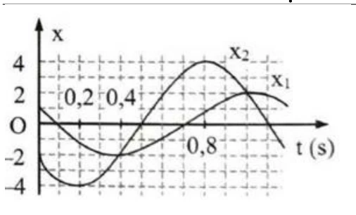{ loading=lazy }

a) Tại thời điểm $0{,}4\,\mathrm s$, hai dao động thành phần có cùng li độ.

b) Chu kì dao động là $1{,}2\,\mathrm s$.

c) Tại thời điểm $t=0$, pha dao động của $x_2$ là $\dfrac{\pi}{4}\,\mathrm{rad}$.

d) Dao động $x_1$ nhanh pha hơn dao động $x_2$ một góc $\dfrac{2\pi}{3}\,\mathrm{rad}$.

??? success "Đáp án và lời giải"
    **Đáp án:** a) Đúng; b) Đúng; c) Sai; d) Sai.

    **Hướng dẫn giải:**

    a) **Đúng.** Tại $t=0{,}4\,\mathrm s$, hai đường đồ thị cắt nhau nên $x_1=x_2$.

    b) **Đúng.** Tám ô ngang ứng với $0{,}8\,\mathrm s$, nên mỗi ô là $0{,}1\,\mathrm s$. Một chu kì dài $12$ ô, do đó $T=1{,}2\,\mathrm s$.

    c) **Sai.** Từ đồ thị của $x_2$: $A_2=4\,\mathrm{cm}$, $x_2(0)=-2\,\mathrm{cm}$ và đường cong đang đi xuống. Với $x_2=A_2\cos(\omega t+\varphi_2)$, $\cos\varphi_2=-1/2$ và $v_2(0)<0$ nên $\sin\varphi_2>0$. Có thể chọn $\varphi_2=2\pi/3$, không phải $\pi/4$.

    d) **Sai.** Dao động $x_2$ đạt cùng trạng thái sớm hơn $x_1$ một khoảng $\Delta t=0{,}2\,\mathrm s$, nên $x_1$ trễ pha so với $x_2$. Với $T=1{,}2\,\mathrm s$,

    $|\Delta\varphi|=\dfrac{2\pi}{T}\Delta t=\dfrac{\pi}{3}$.

    Vì vậy $x_1$ trễ pha $x_2$ một góc $\pi/3$, không phải nhanh pha $2\pi/3$.

