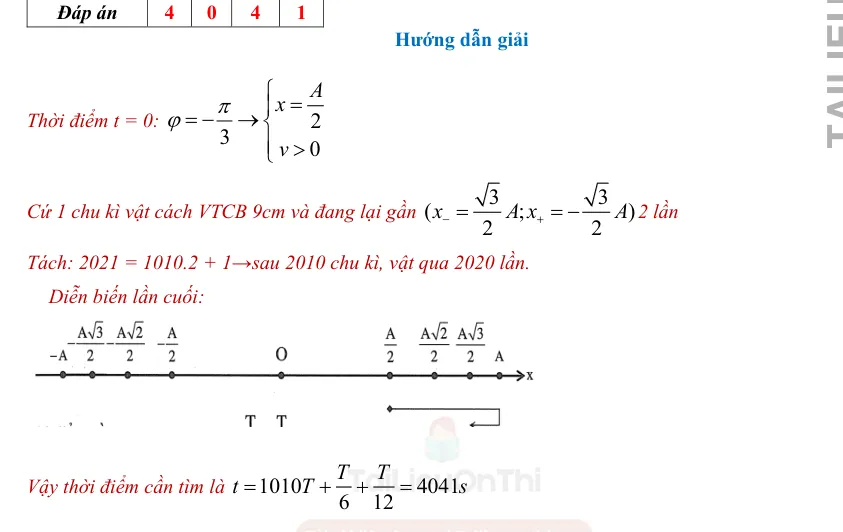
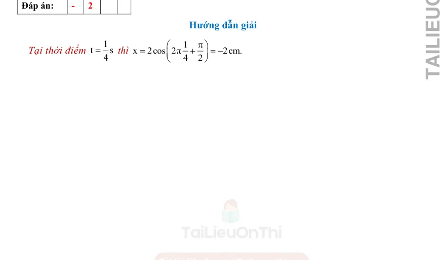
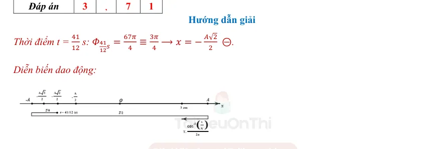
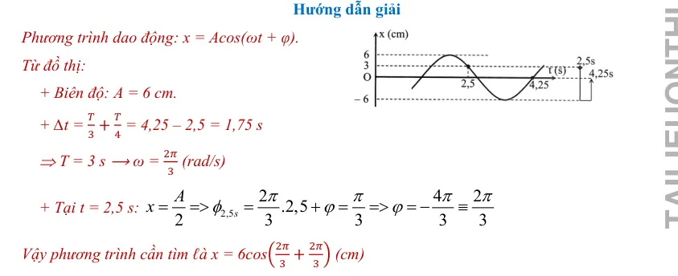

# Đáp án và lời giải — Bài 1 — Đại cương về dao động điều hòa

> Câu nền tảng được giải vừa đủ để kiểm tra cách làm. Câu vận dụng được trình bày chi tiết hơn để người học thấy được đường suy luận, điều kiện dùng công thức và bước kiểm tra kết quả.

[← Bài tập](exercises.md)

## Câu 1

Chọn **A**. So sánh với $x=A\cos(\omega t+\varphi)$: $A=6$ cm, $\omega=4\pi$ rad/s nên $f=\omega/(2\pi)=2$ Hz.

## Câu 2

Chọn **C**. $\omega=2\pi/T=2\pi/0,25=8\pi$ rad/s.

## Câu 3

Chọn **C**. Vật chuyển động giữa hai biên $-A$ và $+A$, vì vậy chiều dài quỹ đạo là $2A=10$ cm.

## Câu 4

Chọn **B**. Dao động điều hòa là trường hợp đặc biệt của dao động tuần hoàn; biên độ được quy ước dương và tần số góc có đơn vị rad/s.

## Câu 5

a) **Đúng**. $A=8$ cm.  
b) **Đúng**. $T=2\pi/\omega=2\pi/5$ s.  
c) **Sai**. $f=\omega/(2\pi)=5/(2\pi)$ Hz.  
d) **Đúng**. $\varphi=\pi/6$ rad.

## Câu 6

a) **Đúng**.  
b) **Đúng**.  
c) **Sai**. Hệ số của $t$ là $\omega$, không phải $f$.  
d) **Sai**. Dạng chuẩn lấy $A>0$; nếu gặp biên độ âm phải chuyển dấu vào pha.

## Câu 7

Ta có $f=N/\Delta t=45/18=2,5$ Hz. Do đó $T=1/f=0,4$ s và $\omega=2\pi f=5\pi$ rad/s.

## Câu 8

Pha tại $t=1/6$ s:

$\Phi=2\pi\cdot\frac16+\frac\pi3=\frac{2\pi}{3}$.

Suy ra $x=10\cos(2\pi/3)=-5$ cm.

## Câu 9

Quỹ đạo dài $2A=16$ cm nên $A=8$ cm. $T=1/f=0,25$ s và $\omega=2\pi f=8\pi$ rad/s.

## Câu 10

**Chọn dạng chuẩn:** $x=A\cos(\omega t+\varphi)$.

$\omega=2\pi/T=2,5\pi$ rad/s. Tại $t=0$:

$\cos\varphi=x_0/A=1/2$.

Vì vật chuyển động theo chiều âm nên $v_0=-A\omega\sin\varphi<0$, tức $\sin\varphi>0$. Do đó chọn $\varphi=\pi/3$.

Vậy

$$
x=6\cos\left(2,5\pi t+\frac{\pi}{3}\right)\text{ cm}.
$$

Kiểm tra: tại $t=0$, $x=3$ cm và $v<0$, đúng với đề.

---

[← Bài tập](exercises.md)

## Đáp án và lời giải — Ngân hàng PDF mở rộng

> Câu có lời giải trong tài liệu được giữ phần hướng dẫn. Câu trắc nghiệm không kèm lời giải dài chỉ hiện đáp án đã đối chiếu từ dấu đáp án/khóa đáp án của tài liệu.

### Nhận biết — Trả lời ngắn

#### Bài PDF 1

Hướng dẫn giải
Dựa vào đồ thị ta xác định được:
2
7,07
2
x
A
cm
=
=

#### Bài PDF 2

Hướng dẫn giải
Dựa vào đồ thị ta có:
14
1
0,6
2
4
15
3
T
T
t
s
Δ=
+
=
−
=

#### Bài PDF 3

Hướng dẫn giải
Dựa vào đồ thị ta có:
0,7
12
2
T
T
t
s
=
+
=

#### Bài PDF 4

{ loading=lazy }
#### Bài PDF 5

**Đáp án:** 2

Đáp án:
2

Hướng dẫn giải
Chu kì dao động của vật: T = 2. (
5
3 −
2
3) = 2𝑠.

#### Bài PDF 6

**Đáp án:** 0

Đáp án:
0
,
8
7
Hướng dẫn giải
Tại thời điểm t = 2s, ta thay vào phương trình dao động được:
  𝑥= 2 𝑐𝑜𝑠(2𝜋. 2 −
𝜋
6) ≅0,87(𝑐𝑚)

#### Bài PDF 7

**Đáp án:** 2

Đáp án:
2

Hướng dẫn giải
∆t = 1 phút = 60 s =&gt; T =
∆t
N =
60
30 = 2 s

#### Bài PDF 8

**Đáp án:** -

Đáp án:
-
1

Hướng dẫn giải
Tại thời điểm
1
t
3
=
s , ta thay vào phương trình dao động được:
 𝑥= 2 𝑐𝑜𝑠(2𝜋.
1
3) = −1(𝑐𝑚)

#### Bài PDF 9

**Đáp án:** 3

Đáp án:
3

Hướng dẫn giải
Từ đồ thị ta thấy : 1s = 4 ô
T/2 = 6 ô =&gt; T = 12 ô = 3s

#### Bài PDF 10

**Đáp án:** 1

Đáp án:
1
2

Hướng dẫn giải
Biên độ dao động của vật là A = 3cm
Trong một chu kì chất điểm đi được quãng đường là s = 4A = 12cm

#### Bài PDF 11

**Đáp án:** 8

Đáp án:
8
,
3
3
Hướng dẫn giải
Chu kì dao động của vật là 120 ms  = 0,12 s
=&gt; Tần số 𝑓=
1
0,12 = 8,33 𝐻𝑧.

#### Bài PDF 12

**Đáp án:** 4

Đáp án:
4
,
7
1
Hướng dẫn giải
Từ đồ thị ta xác định được biên độ A = 2 cm
Chu kì dao động là 4 s =&gt; 𝜔 = 0,5π rad.
Pha ban đầu của dao động là -0,5π

Vậy phương trình của dao động là: 𝑥= 2 𝑐𝑜𝑠(
𝜋
2 𝑡−
𝜋
2)(cm).
Tại thời điểm t = 4s, Pha của dao động là:
 2 𝑐𝑜𝑠(
𝜋
2 . 4 −
𝜋
2) = 4,71 rad

#### Bài PDF 13

**Đáp án:** 3

Đáp án:
3

Hướng dẫn giải
Tại thời điểm
1
t
3
=
s , ta thay vào phương trình dao động được:

 𝑥= 2 𝑐𝑜𝑠(4𝜋.
1
3 +
𝜋
3) = 3(𝑐𝑚)

#### Bài PDF 14

**Đáp án:** 0

Đáp án:
0
,
4

Hướng dẫn giải
Từ đồ thị ta xác định được:
 tại thời điểm t = 0,4s li độ của  x1 = 0 cm, li độ của x2 = 5 cm

#### Bài PDF 15

**Đáp án:** -

{ loading=lazy }

### Nhận biết — Trắc nghiệm 4 lựa chọn

#### Bài PDF 16

**Đáp án:** D

Đây là câu trắc nghiệm có đáp án được xác định từ khóa đáp án của tài liệu; không có lời giải dài kèm theo trong phần nguồn tương ứng.

#### Bài PDF 17

**Đáp án:** B

Đây là câu trắc nghiệm có đáp án được xác định từ khóa đáp án của tài liệu; không có lời giải dài kèm theo trong phần nguồn tương ứng.

#### Bài PDF 18

**Đáp án:** A

Đây là câu trắc nghiệm có đáp án được xác định từ khóa đáp án của tài liệu; không có lời giải dài kèm theo trong phần nguồn tương ứng.

#### Bài PDF 19

**Đáp án:** A

Đây là câu trắc nghiệm có đáp án được xác định từ khóa đáp án của tài liệu; không có lời giải dài kèm theo trong phần nguồn tương ứng.

#### Bài PDF 20

**Đáp án:** C

Đây là câu trắc nghiệm có đáp án được xác định từ khóa đáp án của tài liệu; không có lời giải dài kèm theo trong phần nguồn tương ứng.

#### Bài PDF 21

**Đáp án:** D

Đây là câu trắc nghiệm có đáp án được xác định từ khóa đáp án của tài liệu; không có lời giải dài kèm theo trong phần nguồn tương ứng.

#### Bài PDF 22

**Đáp án:** B

Đây là câu trắc nghiệm có đáp án được xác định từ khóa đáp án của tài liệu; không có lời giải dài kèm theo trong phần nguồn tương ứng.

#### Bài PDF 23

**Đáp án:** A

Đây là câu trắc nghiệm có đáp án được xác định từ khóa đáp án của tài liệu; không có lời giải dài kèm theo trong phần nguồn tương ứng.

#### Bài PDF 24

**Đáp án:** C

Đây là câu trắc nghiệm có đáp án được xác định từ khóa đáp án của tài liệu; không có lời giải dài kèm theo trong phần nguồn tương ứng.

#### Bài PDF 25

**Đáp án:** A

Đây là câu trắc nghiệm có đáp án được xác định từ khóa đáp án của tài liệu; không có lời giải dài kèm theo trong phần nguồn tương ứng.

#### Bài PDF 26

**Đáp án:** B

Đây là câu trắc nghiệm có đáp án được xác định từ khóa đáp án của tài liệu; không có lời giải dài kèm theo trong phần nguồn tương ứng.

#### Bài PDF 27

**Đáp án:** D

Đây là câu trắc nghiệm có đáp án được xác định từ khóa đáp án của tài liệu; không có lời giải dài kèm theo trong phần nguồn tương ứng.

#### Bài PDF 28

**Đáp án:** D

Đây là câu trắc nghiệm có đáp án được xác định từ khóa đáp án của tài liệu; không có lời giải dài kèm theo trong phần nguồn tương ứng.

#### Bài PDF 29

**Đáp án:** C

Đây là câu trắc nghiệm có đáp án được xác định từ khóa đáp án của tài liệu; không có lời giải dài kèm theo trong phần nguồn tương ứng.

#### Bài PDF 30

**Đáp án:** D

Đây là câu trắc nghiệm có đáp án được xác định từ khóa đáp án của tài liệu; không có lời giải dài kèm theo trong phần nguồn tương ứng.

#### Bài PDF 31

**Đáp án:** B

Đây là câu trắc nghiệm có đáp án được xác định từ khóa đáp án của tài liệu; không có lời giải dài kèm theo trong phần nguồn tương ứng.

#### Bài PDF 32

**Đáp án:** D

Đây là câu trắc nghiệm có đáp án được xác định từ khóa đáp án của tài liệu; không có lời giải dài kèm theo trong phần nguồn tương ứng.

#### Bài PDF 33

**Đáp án:** A

Đây là câu trắc nghiệm có đáp án được xác định từ khóa đáp án của tài liệu; không có lời giải dài kèm theo trong phần nguồn tương ứng.

#### Bài PDF 34

**Đáp án:** B

Đây là câu trắc nghiệm có đáp án được xác định từ khóa đáp án của tài liệu; không có lời giải dài kèm theo trong phần nguồn tương ứng.

#### Bài PDF 35

**Đáp án:** D

Đây là câu trắc nghiệm có đáp án được xác định từ khóa đáp án của tài liệu; không có lời giải dài kèm theo trong phần nguồn tương ứng.

#### Bài PDF 36

**Đáp án:** B

Đây là câu trắc nghiệm có đáp án được xác định từ khóa đáp án của tài liệu; không có lời giải dài kèm theo trong phần nguồn tương ứng.

#### Bài PDF 37

**Đáp án:** B

Đây là câu trắc nghiệm có đáp án được xác định từ khóa đáp án của tài liệu; không có lời giải dài kèm theo trong phần nguồn tương ứng.

#### Bài PDF 38

**Đáp án:** B

Đây là câu trắc nghiệm có đáp án được xác định từ khóa đáp án của tài liệu; không có lời giải dài kèm theo trong phần nguồn tương ứng.

#### Bài PDF 39

**Đáp án:** D

Đây là câu trắc nghiệm có đáp án được xác định từ khóa đáp án của tài liệu; không có lời giải dài kèm theo trong phần nguồn tương ứng.

#### Bài PDF 40

**Đáp án:** A

Đây là câu trắc nghiệm có đáp án được xác định từ khóa đáp án của tài liệu; không có lời giải dài kèm theo trong phần nguồn tương ứng.

#### Bài PDF 41

**Đáp án:** C

Đây là câu trắc nghiệm có đáp án được xác định từ khóa đáp án của tài liệu; không có lời giải dài kèm theo trong phần nguồn tương ứng.

#### Bài PDF 42

**Đáp án:** B

Đây là câu trắc nghiệm có đáp án được xác định từ khóa đáp án của tài liệu; không có lời giải dài kèm theo trong phần nguồn tương ứng.

#### Bài PDF 43

**Đáp án:** C

Đây là câu trắc nghiệm có đáp án được xác định từ khóa đáp án của tài liệu; không có lời giải dài kèm theo trong phần nguồn tương ứng.

#### Bài PDF 44

**Đáp án:** A

Đây là câu trắc nghiệm có đáp án được xác định từ khóa đáp án của tài liệu; không có lời giải dài kèm theo trong phần nguồn tương ứng.

#### Bài PDF 45

**Đáp án:** C

Đây là câu trắc nghiệm có đáp án được xác định từ khóa đáp án của tài liệu; không có lời giải dài kèm theo trong phần nguồn tương ứng.

#### Bài PDF 46

**Đáp án:** C

Đây là câu trắc nghiệm có đáp án được xác định từ khóa đáp án của tài liệu; không có lời giải dài kèm theo trong phần nguồn tương ứng.

#### Bài PDF 47

**Đáp án:** B

Đây là câu trắc nghiệm có đáp án được xác định từ khóa đáp án của tài liệu; không có lời giải dài kèm theo trong phần nguồn tương ứng.

#### Bài PDF 48

**Đáp án:** B

Đây là câu trắc nghiệm có đáp án được xác định từ khóa đáp án của tài liệu; không có lời giải dài kèm theo trong phần nguồn tương ứng.

### Nhận biết — Đúng/Sai

#### Bài PDF 49

Hướng dẫn giải
a. Biên độ dao động của vật là 4 cm.
b. Tần số dao động của vật:
Dựa vào đồ thị 5 ô = 0,5 s =&gt; 1ô = 0,1 s. Suy ra T = 10 ô = 1 s
Do đó f = 1/T = 1 Hz
c.
2π
ω =
 = 2π rad/s
T
.
d. Dựa vào đồ thị xác định được độ dịch chuyển của vật ở thời điểm 1,2 s là 2 cm.

x(cm)
t(s
)
0,5
1
+5
-5

#### Bài PDF 50

Hướng dẫn
a. Hai dao động có cùng chu kì là 0,5 s. ⟹ Đ
b. Tần số của hai dao động là 0,5 Hz =&gt; S
Tần số của hai dao động là 2 Hz
c. Hai dao động cùng pha ⟹ Đ
d. Biên độ của hai dao động là 2cm và 6cm ⟹ Đ

#### Bài PDF 51

Hướng dẫn giải
a) Biên độ dao động của vật bằng 2 cm  =&gt; Đ
b) Chu kì dao động của vật bằng 0,4 s  =&gt; S
Vì: Chu kì dao động của vật bằng 0,4 s
c) Pha ban đầu của dao động là - 0,5π rad  =&gt; S
Vì: Pha ban đầu của dao động là 0,5π rad
d) Tại thời điểm t = 0,6 s vật ở vị trí cân bằng  =&gt; Đ

#### Bài PDF 52

Hướng dẫn giải
a) Biên độ dao động của vật bằng 0,2 cm =&gt; Đ
b) Chu kì dao động của vật bằng 0,4 s =&gt; Đ
c) Pha ban đầu của dao động là 0,5π rad =&gt; S
Pha ban đầu của dao động là - 0,5π rad

d) Tại thời điểm t = 0,5 s vật ở vị trí biên =&gt; Đ

#### Bài PDF 53

Hướng dẫn
a. Hai dao động có cùng chu kì ⟹ Đ
b. Chu kì của hai dao động là 4s =&gt; Đ
c. Hai dao động cùng pha ⟹ S
Vì hai dao động này ngược pha
d. Biên độ của hai dao động là 3cm và 2cm ⟹ Đ

#### Bài PDF 54

Hướng dẫn giải
a) Biên độ dao động của vật bằng 10 cm   =&gt; Đ
b) Chu kì dao động của vật bằng 1 s  =&gt; S
Vì: nửa chu kì là 1s, nên chu kì của vật dao động là 2s.
c) Pha ban đầu của dao động là 0,5π rad  =&gt; S
Vì: Pha ban đầu của dao động là - 0,5π rad
d) Tại thời điểm t = 1,5 s vật ở vị trí biên  =&gt; Đ

#### Bài PDF 55

Hướng dẫn giải
a. Pha ban đầu của dao động bằng 0

b. Tần số
1
1
f
5 Hz.
T
0.2
=
=
=
.

c. Pha dao động tại thời điểm t = 0,075 s là
3π
Δφ = t = 10π.0,075 =
 rad.
4
ω

d. Thay t = 0,075 vào phương trình li độ ta được
(
)
(
)
x
5cos 10 .0,075
2,5 2 cm .
=
π
= −

### Thông hiểu — Trắc nghiệm 4 lựa chọn

#### Bài PDF 56

**Đáp án:** B

Đây là câu trắc nghiệm có đáp án được xác định từ khóa đáp án của tài liệu; không có lời giải dài kèm theo trong phần nguồn tương ứng.

#### Bài PDF 57

**Đáp án:** C

Đây là câu trắc nghiệm có đáp án được xác định từ khóa đáp án của tài liệu; không có lời giải dài kèm theo trong phần nguồn tương ứng.

#### Bài PDF 58

**Đáp án:** B

Đây là câu trắc nghiệm có đáp án được xác định từ khóa đáp án của tài liệu; không có lời giải dài kèm theo trong phần nguồn tương ứng.

#### Bài PDF 59

**Đáp án:** A

Đây là câu trắc nghiệm có đáp án được xác định từ khóa đáp án của tài liệu; không có lời giải dài kèm theo trong phần nguồn tương ứng.

#### Bài PDF 60

**Đáp án:** C

Đây là câu trắc nghiệm có đáp án được xác định từ khóa đáp án của tài liệu; không có lời giải dài kèm theo trong phần nguồn tương ứng.

#### Bài PDF 61

**Đáp án:** A

Đây là câu trắc nghiệm có đáp án được xác định từ khóa đáp án của tài liệu; không có lời giải dài kèm theo trong phần nguồn tương ứng.

#### Bài PDF 62

**Đáp án:** C

Đây là câu trắc nghiệm có đáp án được xác định từ khóa đáp án của tài liệu; không có lời giải dài kèm theo trong phần nguồn tương ứng.

#### Bài PDF 63

**Đáp án:** A

Hướng dẫn giải
Dựa vào đồ thị ta có biên độ A = 5 ô li. Mỗi ô – 1 cm =&gt; A – 5 cm.

#### Bài PDF 64

**Đáp án:** A

Hướng dẫn giải
Trạng thái dao động tại vị trí P và R ngược pha nhau =&gt;
T
Δt = 2

#### Bài PDF 65

**Đáp án:** A

Hướng dẫn giải
Hàng Biên độ (cm)
Chu kỳ (s)
I
10 cm
1,0 s
II
10 cm
0,5 s
III
20 cm
1,0 s
IV
20 cm
0,5 s

Dựa vào đồ thị ta có: T = 0,2 =&gt; T = 0,4 s
2
. Do đó:
2π
2π
ω =
 =
 = 5π rad/s
T
0,4

#### Bài PDF 66

**Đáp án:** B

Hướng dẫn giải
Thay t = 5 s vào phương trình ta được:
(
)
x = 10cos 4π.5  = 10 cm

#### Bài PDF 67

**Đáp án:** C

Hướng dẫn giải
Dựa vào phương trình ta có: A = 6 cm ; ω = 4π rad/s; φ = 0 rad.

#### Bài PDF 68

**Đáp án:** B

Hướng dẫn giải
Ta có
(
)
(
)
cos
cos
2 2
4
4
0
0
,
4
4
x
x
t
x
A
v
t
A
π
ω
ϕ
π
φ
φ
ω
ϕ

+
=



=
=



=
=








=
+
=
=



#### Bài PDF 69

**Đáp án:** B

Hướng dẫn giải
Ta có :
Δt
4,8
T =
 =
 = 0,96s
N
5

#### Bài PDF 70

**Đáp án:** A

Hướng dẫn giải
Ban đầu vật đi qua vị trí cân bằng theo chiều âm, vậy pha ban đầu của dao động là

0,5 rad
π

#### Bài PDF 71

**Đáp án:** A

Đây là câu trắc nghiệm có đáp án được xác định từ khóa đáp án của tài liệu; không có lời giải dài kèm theo trong phần nguồn tương ứng.

#### Bài PDF 72

**Đáp án:** A

Hướng dẫn giải
Dựa vào đồ thị ta có:
0,2
0,4
2
T
T
s
=
=
=

2π
2π
ω =
 =
 = 5π rad/s
T
0,4

#### Bài PDF 73

**Đáp án:** A

Hướng dẫn giải
Dựa vào đồ thị ta xác định được thời điểm vật đi qua vị trí cân bằng lần đầu tiên là 0,4 s.

#### Bài PDF 74

**Đáp án:** C

Hướng dẫn giải
Dựa vào đồ thị ta xác định được: A = 10 cm; T = 1s =&gt; f = 1/T = 1 Hz

#### Bài PDF 75

**Đáp án:** B

Hướng dẫn giải
Dựa vào đồ thi ta có : A = 4 cm
T

 = 0,5 =&gt;T = 1s
2
2π
ω =
 =  2π rad/s
T

#### Bài PDF 76

**Đáp án:** C

Đây là câu trắc nghiệm có đáp án được xác định từ khóa đáp án của tài liệu; không có lời giải dài kèm theo trong phần nguồn tương ứng.

#### Bài PDF 77

**Đáp án:** D

Đây là câu trắc nghiệm có đáp án được xác định từ khóa đáp án của tài liệu; không có lời giải dài kèm theo trong phần nguồn tương ứng.

#### Bài PDF 78

**Đáp án:** D

Đây là câu trắc nghiệm có đáp án được xác định từ khóa đáp án của tài liệu; không có lời giải dài kèm theo trong phần nguồn tương ứng.

#### Bài PDF 79

**Đáp án:** B

Đây là câu trắc nghiệm có đáp án được xác định từ khóa đáp án của tài liệu; không có lời giải dài kèm theo trong phần nguồn tương ứng.

#### Bài PDF 80

**Đáp án:** A

Đây là câu trắc nghiệm có đáp án được xác định từ khóa đáp án của tài liệu; không có lời giải dài kèm theo trong phần nguồn tương ứng.

#### Bài PDF 81

**Đáp án:** B

Đây là câu trắc nghiệm có đáp án được xác định từ khóa đáp án của tài liệu; không có lời giải dài kèm theo trong phần nguồn tương ứng.

#### Bài PDF 82

**Đáp án:** A

Đây là câu trắc nghiệm có đáp án được xác định từ khóa đáp án của tài liệu; không có lời giải dài kèm theo trong phần nguồn tương ứng.

#### Bài PDF 83

**Đáp án:** B

Đây là câu trắc nghiệm có đáp án được xác định từ khóa đáp án của tài liệu; không có lời giải dài kèm theo trong phần nguồn tương ứng.

#### Bài PDF 84

**Đáp án:** D

{ loading=lazy }
#### Bài PDF 85

**Đáp án:** A

Đây là câu trắc nghiệm có đáp án được xác định từ khóa đáp án của tài liệu; không có lời giải dài kèm theo trong phần nguồn tương ứng.

#### Bài PDF 86

**Đáp án:** A

Đây là câu trắc nghiệm có đáp án được xác định từ khóa đáp án của tài liệu; không có lời giải dài kèm theo trong phần nguồn tương ứng.

#### Bài PDF 87

**Đáp án:** D

Hướng dẫn giải
Trong thời gian 1 phút có số dao động là 360.
Suy ra, trong 1 giây số dao động là  360
6
60 =
 tần số f = 6 Hz

### Vận dụng — Trả lời ngắn

#### Bài PDF 88

Hướng dẫn giải
Tốc độ trung bình của vật trong 1 dao động là:
4
60(
/ )
0,6(
/ )
S
A
v
cm s
m s
t
T
=
=
=
=

#### Bài PDF 89

Hướng dẫn giải
+ Tại t = 0: x =
𝐴
2 ⊕⟶𝜑= −
𝜋
3.
+ ∆t =
𝑇
6 +
𝑇
2 +
𝑇
6 = 0,3 s ⟶ T =
9
25 = 0,36s

#### Bài PDF 90

Hướng dẫn giải
Thời điểm t =
13
8  s: 𝛷13
8 𝑠= 4𝜋≡0 ⟶ x = A
Trạng thái vật đi qua là x =
𝐴√2
2  ⨁ và x = −
𝐴√2
2 ⊝.
Diễn biến dao động:

Vậy thời điểm cần tìm là : t’ = t +
𝑇
2 +
𝑇
4 +
𝑇
8 = 𝑡+
7𝑇
8 = 2,5 s.

#### Bài PDF 91

Hướng dẫn giải
2
2
3
T
s
π
ω
=
=

Tại t = 0: φ = −
𝜋
3 ⟶𝑥=
𝐴
2
Cứ 1T, vật qua x = 8 cm 2 lần; tách: 16 = 7.2 + 2  sau 7T, vật đi qua x = 8 cm 14 lần.
Diễn biến dao động 2 lần cuối:

Với ∆t =
𝑐𝑜𝑠−1( 8
10)
2𝜋
𝑇
→ thời điểm cần tìm là
1
8
cos
10
7
 4,85 s
6
2
T
t
T
T
π
−





=
+
+


#### Bài PDF 92

Hướng dẫn giải
Dựa vào đồ thị ta xác định được:
t1 = 5s : vật đi qua vị trí cân bằng (x1 = 0) theo chiều âm.
t2 = 9s : vật đi qua vị trí x2 = - 2,5 cm theo chiều dương.
=&gt; Độ dịch chuyển của vật từ lúc t1 = 5s đến t2 = 9s là
1
2
Δx = x - x = 2,5 cm

#### Bài PDF 93

{ loading=lazy }

### Vận dụng — Trắc nghiệm 4 lựa chọn

#### Bài PDF 94

**Đáp án:** A

Hướng dẫn giải
Ta có
A
4cm
T
2,2 1
1
T
s
10  rad/s.
2
12
5
=

−

=

=
ω=
π


Tại thời điểm t = 0 ta có
0
A
x
2
2
2
3
v
0

= −= −
π

ϕ=




#### Bài PDF 95

**Đáp án:** A

Hướng dẫn giải

Phương trình dao động: x = Acos(ωt)
+Tại
:Acosω
3 2
t
τ
τ
=
=

+Tại
2
2 :Acos2ω
5
A(2cos ω
1)
5
t
τ
τ
τ
=
= −
−
= −=&gt; A = 9cm

#### Bài PDF 96

**Đáp án:** B

{ loading=lazy }
#### Bài PDF 97

**Đáp án:** B

Hướng dẫn giải
Dựa vào đồ thị ta có:

•  Δt =
𝑇
3 +
𝑇
12 = 0,8 −0,3 = 0,5( 𝑠) →𝑇=
6
5  𝑠→𝜔=
5𝜋
3 (rad/s)

• Tại t = 0,3s:
0,3
5 .0,3
2
3
3
3
6
s
A
x
π
π
π
π
φ
ϕ
ϕ
ϕ
=
=
=
+
=
=
=
→
= −

#### Bài PDF 98

**Đáp án:** A

Đây là câu trắc nghiệm có đáp án được xác định từ khóa đáp án của tài liệu; không có lời giải dài kèm theo trong phần nguồn tương ứng.

#### Bài PDF 99

**Đáp án:** A

Đây là câu trắc nghiệm có đáp án được xác định từ khóa đáp án của tài liệu; không có lời giải dài kèm theo trong phần nguồn tương ứng.

#### Bài PDF 100

**Đáp án:** C

Đây là câu trắc nghiệm có đáp án được xác định từ khóa đáp án của tài liệu; không có lời giải dài kèm theo trong phần nguồn tương ứng.

#### Bài PDF 101

**Đáp án:** A

Đây là câu trắc nghiệm có đáp án được xác định từ khóa đáp án của tài liệu; không có lời giải dài kèm theo trong phần nguồn tương ứng.

#### Bài PDF 102

**Đáp án:** A

Đây là câu trắc nghiệm có đáp án được xác định từ khóa đáp án của tài liệu; không có lời giải dài kèm theo trong phần nguồn tương ứng.

#### Bài PDF 103

**Đáp án:** B

Đây là câu trắc nghiệm có đáp án được xác định từ khóa đáp án của tài liệu; không có lời giải dài kèm theo trong phần nguồn tương ứng.

#### Bài PDF 104

**Đáp án:** A

Đây là câu trắc nghiệm có đáp án được xác định từ khóa đáp án của tài liệu; không có lời giải dài kèm theo trong phần nguồn tương ứng.

#### Bài PDF 105

**Đáp án:** B

Đây là câu trắc nghiệm có đáp án được xác định từ khóa đáp án của tài liệu; không có lời giải dài kèm theo trong phần nguồn tương ứng.

#### Bài PDF 106

**Đáp án:** A

Hướng dẫn giải
Ta có
A = 10 cm
2
  =
 rad/s
4
2

π
π
ω
=


Tại thời điểm t = 0 thì
0
 x
A
0
=
ϕ=
Dựa vào đồ thị li độ - thời gian của một vật dao động điều hoà ở hình sau để trả lời các câu hỏi
38, 39, 40

#### Bài PDF 107

**Đáp án:** C

Hướng dẫn giải
Từ đồ thị ta thấy : 1ô = 5.10-2s
T =&gt; T = 8 ô = 8. 5.10-2 = 0,4 s

### Vận dụng — Đúng/Sai

#### Bài PDF 108

Hướng dẫn giải
a. Dựa vào đồ thị: Độ dịch chuyển của vật ở thời điểm 0,1 s là x = -2 cm
b. Quãng đường vật đi được sau 0,6s : s = 6A = 12cm
c. Tại t = 0,5 s : x = - 2 cm (VT biên âm)
d. Tại t = 0 : x = 0 (VTCB)

#### Bài PDF 109

Hướng dẫn giải
a . Biên độ dao động của vật: A = 4 cm.
b. Trên trục Ot, 5 ô tương ứng 0,75 s.
 Suy ra, 1 ô tương ứng = 0,15 s.
Chu kì dao động của vật:
T = 6ô = 0,9 (s).
c. Trên trục Ox, 2 ô tương ứng 4 cm. Do đó, 1 ô tương ứng 2 cm.
Suy ra, tại thời điểm, ban đầu (t = 0), vật có li độ 2 cm và đi theo chiều âm (đồ thị đi xuống).
d. Tại thời điêm t = 0,75 s, vật đang ở vị trí biên dương.

#### Bài PDF 110

Hướng dẫn giải
a) Tại thời điểm 0,4 s, hai dao động thành phần có cùng li độ.
b) Dựa vào đồ thị suy ra: 8 ô ngang = 0,8 s =&gt; 1 ô = 0,1 s.
1T = 12 ô =&gt; T = 1,2 s
c) Dựa vào đồ thị ta có: A2 = 4 cm
2
2
2
2
2
2
cos
2
0:
0
3
0
x
x
t
A
v
v
ϕ
π
ϕ

= −
=


=
=
=
=








d) Dựa vào đồ thị ta xác định được: t
Δ= 2 ô = 0,2 s
2
.
.
3
t
t
T
π
π
ϕ
ω
Δ
=
Δ=
Δ=

Vậy x1 nhanh pha hơn dao động x2 là π  rad.
3

