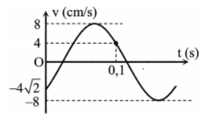
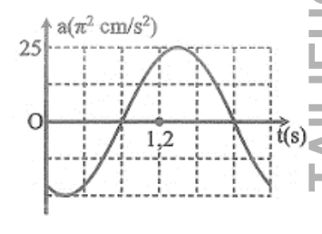
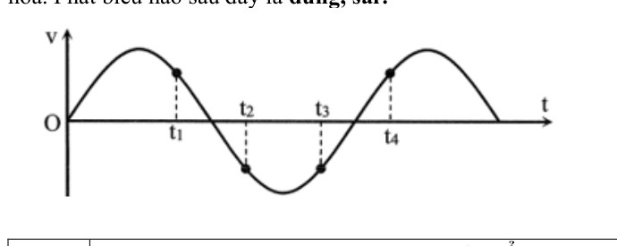
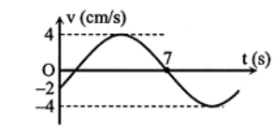
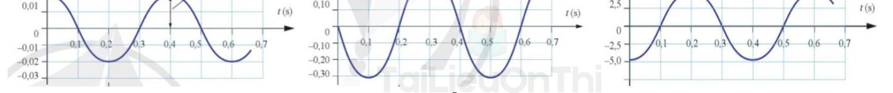

# Bài tập — Bài 2 — Li độ, vận tốc và gia tốc

> Hệ bài tập được biên soạn theo các dạng xuất hiện trong bộ tài liệu Vật lí 11 của dự án. Câu hỏi được giữ ngắn, trực tiếp; độ khó tăng dần và không cố tình thêm dữ kiện gây nhiễu.

[← Trở lại bài học](../../02-displacement-velocity-acceleration.md)

## Phần A — Trắc nghiệm 4 lựa chọn

### Bài 1 — Mức 1 — Nhận biết

Trong dao động điều hòa, gia tốc và li độ liên hệ bởi

A. $a=\omega x$.

B. $a=-\omega x$.

C. $a=-\omega^2x$.

D. $a=\omega^2v$.

??? success "Đáp án và lời giải"
    Chọn **C**. Gia tốc luôn hướng về vị trí cân bằng và có độ lớn tỉ lệ với $|x|$: $a=-\omega^2x$.

### Bài 2 — Mức 1 — Nhận biết

Vật dao động điều hòa có $A=4$ cm, $\omega=5$ rad/s. Tốc độ cực đại bằng

A. $5$ cm/s.

B. $9$ cm/s.

C. $20$ cm/s.

D. $80$ cm/s.

??? success "Đáp án và lời giải"
    Chọn **C**. $v_{\max}=\omega A=5\cdot4=20$ cm/s.

### Bài 3 — Mức 1 — Nhận biết

Tại vị trí biên của dao động điều hòa, đại lượng nào bằng không?

A. Li độ.

B. Vận tốc.

C. Gia tốc.

D. Cả vận tốc và gia tốc.

??? success "Đáp án và lời giải"
    Chọn **B**. Ở biên $|x|=A$ nên $v=0$, còn $|a|=\omega^2A$ đạt cực đại.

### Bài 4 — Mức 1 — Nhận biết

Vận tốc trong dao động điều hòa sớm pha hay trễ pha so với li độ?

A. Sớm pha $\pi/2$.

B. Trễ pha $\pi/2$.

C. Cùng pha.

D. Ngược pha.

??? success "Đáp án và lời giải"
    Chọn **A**. Nếu $x=A\cos\Phi$ thì $v=A\omega\cos(\Phi+\pi/2)$.

## Phần B — Đúng/Sai

### Bài 5 — Mức 2 — Thông hiểu

Một vật dao động điều hòa có $x=5\cos(4t)$ cm. Xét các phát biểu:

a) $v_{\max}=20$ cm/s.

b) $a_{\max}=80$ cm/s².

c) Tại $x=3$ cm, độ lớn vận tốc là $16$ cm/s.

d) Khi $x>0$ thì gia tốc cũng dương.

??? success "Đáp án và lời giải"
    a) **Đúng**: $v_{\max}=\omega A=20$ cm/s.
    b) **Đúng**: $a_{\max}=\omega^2A=16\cdot5=80$ cm/s².
    c) **Đúng**: $|v|=\omega\sqrt{A^2-x^2}=4\sqrt{25-9}=16$ cm/s.
    d) **Sai**: $a=-\omega^2x$, nên $x>0$ thì $a<0$.

### Bài 6 — Mức 2 — Thông hiểu

Xét một vật dao động điều hòa:

a) Khi đi từ biên về vị trí cân bằng, tốc độ tăng.

b) Khi đi từ vị trí cân bằng ra biên, độ lớn gia tốc giảm.

c) Ở vị trí cân bằng, gia tốc bằng không.

d) Ở cùng một li độ, độ lớn vận tốc luôn như nhau.

??? success "Đáp án và lời giải"
    a) **Đúng**.
    b) **Sai**: $|a|=\omega^2|x|$ tăng khi ra xa vị trí cân bằng.
    c) **Đúng**.
    d) **Đúng**: $v^2=\omega^2(A^2-x^2)$ chỉ phụ thuộc $x^2$.

## Phần C — Trả lời ngắn

### Bài 7 — Mức 3 — Vận dụng

Vật có $A=10$ cm, $\omega=6$ rad/s. Tại $x=8$ cm, tính tốc độ và độ lớn gia tốc.

??? success "Đáp án và lời giải"
    $|v|=\omega\sqrt{A^2-x^2}=6\sqrt{100-64}=36$ cm/s. $|a|=\omega^2|x|=36\cdot8=288$ cm/s².

### Bài 8 — Mức 3 — Vận dụng

Một vật dao động điều hòa có $v_{\max}=40$ cm/s và $a_{\max}=200$ cm/s². Tính $\omega$ và $A$.

??? success "Đáp án và lời giải"
    Từ $a_{\max}=\omega v_{\max}$ suy ra $\omega=200/40=5$ rad/s. Sau đó $A=v_{\max}/\omega=40/5=8$ cm.

### Bài 9 — Mức 3 — Vận dụng

Tại li độ $x=3$ cm, một vật có gia tốc $a=-48$ cm/s². Biết biên độ $A=5$ cm. Tính $\omega$ và tốc độ tại vị trí này.

??? success "Đáp án và lời giải"
    Từ $a=-\omega^2x$: $\omega^2=48/3=16$, nên $\omega=4$ rad/s. Khi đó $|v|=4\sqrt{25-9}=16$ cm/s.

## Phần D — Vận dụng và vận dụng cao

### Bài 10 — Mức 4 — Vận dụng cao

Một vật dao động điều hòa. Tại $x_1=3$ cm, tốc độ là $v_1=20$ cm/s; tại $x_2=4$ cm, tốc độ là $v_2=10\sqrt3$ cm/s. Tính $\omega$ và biên độ $A$.

??? success "Đáp án và lời giải"
    Dùng hệ thức độc lập $v^2=\omega^2(A^2-x^2)$ cho hai trạng thái:

    $v_1^2-v_2^2=\omega^2(x_2^2-x_1^2)$.

    Suy ra $400-300=\omega^2(16-9)$, nên $\omega^2=100/7$ và $\omega=10/\sqrt7$ rad/s.

    Thay vào trạng thái thứ nhất:

    $A^2=x_1^2+v_1^2/\omega^2=9+400/(100/7)=37$.

    Vậy $A=\sqrt{37}$ cm. Kết quả thỏa $A>|x_1|,|x_2|$.

## Ngân hàng bài tập mở rộng

### Nhận biết — Trả lời ngắn

#### Bài 11

<!-- source-id: BT-Chuong-I-p82-q1-232 -->

Một chất điểm dao động điều hòa với phương trình

$$
x=4\cos\left(\pi t+\frac{\pi}{3}\right)\ \text{cm},
$$

với $t$ tính bằng giây. Hãy cho biết số dao động toàn phần chất điểm thực hiện được trong $10$ s là bao nhiêu?

??? success "Đáp án và lời giải"
    **Đáp án: 5 dao động toàn phần.**
    **Hướng dẫn giải:**

    Từ phương trình, $\omega=\pi$ rad/s nên

    $\displaystyle T=\frac{2\pi}{\omega}=2\ \text{s}.$

    Trong $10$ s, số dao động toàn phần là

    $\displaystyle N=\frac{\Delta t}{T}=\frac{10}{2}=5.$
#### Bài 12

<!-- source-id: BT-Chuong-I-p82-q2-233 -->

Một vật dao động điều hòa với tần số góc 10 rad/s, khi vật có li độ là 3 cm thì tốc độ là 40 cm/s. Biên
độ của dao động là bao nhiêu cm?

??? success "Đáp án và lời giải"
    **Đáp án:** 5
    **Hướng dẫn giải:**

    Dùng $v=-\omega A\sin(\omega t+\varphi)$, $a=-\omega^2x$ và $v^2=\omega^2(A^2-x^2)$ để liên hệ trực tiếp giữa li độ, vận tốc và gia tốc.

    Vậy kết quả cần tìm là **5**.
#### Bài 13

<!-- source-id: BT-Chuong-I-p82-q3-234 -->

Một vật dao động điều hòa với biên độ 5 cm, khi vật có li độ 2,5 cm thì tốc độ của vật là 5 3 cm/s.
Vận tốc cực đại của dao động là bao nhiêu cm/s?

??? success "Đáp án và lời giải"
    **Đáp án:** $10$
    **Hướng dẫn giải:**

    Dùng $v=-\omega A\sin(\omega t+\varphi)$, $a=-\omega^2x$ và $v^2=\omega^2(A^2-x^2)$ để liên hệ trực tiếp giữa li độ, vận tốc và gia tốc.

    Vậy kết quả cần tìm là **$10$**.
#### Bài 14

<!-- source-id: BT-Chuong-I-p82-q4-235 -->

Một vật dao động điều hòa có chu kì 2 s, biên độ 10 cm. Khi vật cách vị trí cân bằng 5 cm, tốc độ của
nó bằng bao nhiêu cm/s ?

??? success "Đáp án và lời giải"
    **Đáp án:** $27{,}2$
    **Hướng dẫn giải:**

    Dùng $v=-\omega A\sin(\omega t+\varphi)$, $a=-\omega^2x$ và $v^2=\omega^2(A^2-x^2)$ để liên hệ trực tiếp giữa li độ, vận tốc và gia tốc.

    - Từ công thức

    Vậy kết quả cần tìm là **$27{,}2$**.
### Nhận biết — Trắc nghiệm 4 lựa chọn

#### Bài 15

<!-- source-id: BT-Chuong-I-p27-q15-69 -->

Một vật dao động điều hòa với chu kì $T$. Chọn gốc thời gian là lúc vật qua vị trí cân bằng, vận tốc của vật bằng 0 lần đầu tiên ở thời điểm

A. $\dfrac{T}{2}$.

B. $\dfrac{T}{3}$.

C. $\dfrac{2T}{3}$.

D. $\dfrac{T}{4}$.

??? success "Đáp án và lời giải"
    **Đáp án:** D
    **Hướng dẫn giải:**

    Dùng $v=-\omega A\sin(\omega t+\varphi)$, $a=-\omega^2x$ và $v^2=\omega^2(A^2-x^2)$ để liên hệ trực tiếp giữa li độ, vận tốc và gia tốc.

    Đối chiếu kết quả với các lựa chọn, phương án phù hợp là **D. $\dfrac{T}{4}$**
#### Bài 16

<!-- source-id: BT-Chuong-I-p68-q1-160 -->

Trong dao động điều hoà thì li độ, vận tốc và gia tốc là những đại lượng biến đổi theo hàm sin hoặc cosin theo thời gian và

A. cùng biên độ.

B. cùng pha ban đầu.

C. cùng chu kì.

D. cùng pha dao động.

??? success "Đáp án và lời giải"
    **Đáp án:** C

    **Hướng dẫn giải:**
    Li độ, vận tốc và gia tốc đều biến thiên điều hoà với cùng tần số góc $\omega$, nên chúng có cùng chu kì $T=2\pi/\omega$.

#### Bài 17

<!-- source-id: BT-Chuong-I-p68-q2-161 -->

Phương trình li độ của một vật dao động điều hoà có dạng

$$
x=A\cos(\omega t+\varphi).
$$

Phương trình gia tốc của vật là

A. $a=A\omega^2\cos(\omega t+\varphi)$.

B. $a=A\omega^2\sin(\omega t+\varphi)$.

C. $a=-A\omega^2\cos(\omega t+\varphi)$.

D. $a=-A\omega^2\sin(\omega t+\varphi)$.

??? success "Đáp án và lời giải"
    **Đáp án:** C

    **Hướng dẫn giải:**
    Từ $x=A\cos(\omega t+\varphi)$,

    $a=x''=-\omega^2x=-A\omega^2\cos(\omega t+\varphi).$

#### Bài 18

<!-- source-id: BT-Chuong-I-p68-q5-164 -->

Đối với dao động cơ điều hòa của một chất điểm thì khi chất điểm đi đến vị trí biên nó có

A. tốc độ bằng không và độ lớn gia tốc cực đại.

B. tốc độ bằng không và gia tốc bằng không.

C. tốc độ cực đại và gia tốc cực đại.

D. tốc độ cực đại và gia tốc bằng không.

??? success "Đáp án và lời giải"
    **Đáp án:** A
    **Hướng dẫn giải:**

    Dùng $v=-\omega A\sin(\omega t+\varphi)$, $a=-\omega^2x$ và $v^2=\omega^2(A^2-x^2)$ để liên hệ trực tiếp giữa li độ, vận tốc và gia tốc.

    Đối chiếu kết quả với các lựa chọn, phương án phù hợp là **A. tốc độ bằng không và độ lớn gia tốc cực đại.**
#### Bài 19

<!-- source-id: BT-Chuong-I-p68-q7-166 -->

Vận tốc và gia tốc của dao động điều hòa thỏa mãn mệnh đề nào sau đây?

A. Ở vị trí biên thì vận tốc triệt tiêu, gia tốc triệt tiêu.

B. Ở vị trí biên thì vận tốc cực đại, gia tốc triệt tiêu.

C. Ở vị trí cân bằng thì vận tốc cực đại, gia tốc cực đại.

D. Ở vị trí cân bằng thì tốc độ cực đại, gia tốc triệt tiêu.

??? success "Đáp án và lời giải"
    **Đáp án:** D
    **Hướng dẫn giải:**

    Dùng $v=-\omega A\sin(\omega t+\varphi)$, $a=-\omega^2x$ và $v^2=\omega^2(A^2-x^2)$ để liên hệ trực tiếp giữa li độ, vận tốc và gia tốc.

    Đối chiếu kết quả với các lựa chọn, phương án phù hợp là **D. Ở vị trí cân bằng thì tốc độ cực đại, gia tốc triệt tiêu.**
#### Bài 20

<!-- source-id: BT-Chuong-I-p68-q8-167 -->

Khi vật dao động điều hoà, đại lượng không thay đổi theo thời gian là

A. tốc độ.

B. thế năng.

C. gia tốc.

D. tần số

??? success "Đáp án và lời giải"
    **Đáp án:** D
    **Hướng dẫn giải:**

    Dùng $v=-\omega A\sin(\omega t+\varphi)$, $a=-\omega^2x$ và $v^2=\omega^2(A^2-x^2)$ để liên hệ trực tiếp giữa li độ, vận tốc và gia tốc.

    Đối chiếu kết quả với các lựa chọn, phương án phù hợp là **D. tần số**
#### Bài 21

<!-- source-id: BT-Chuong-I-p68-q10-169 -->

Cho một chất điểm dao động điều hòa với phương trình

$$
x=3\cos\left(\omega t-\frac{5\pi}{6}\right)\ \text{cm}.
$$

Pha ban đầu của **vận tốc** dao động nhận giá trị là

A. $-\dfrac{\pi}{3}$ rad.

B. $\dfrac{\pi}{3}$ rad.

C. $-\dfrac{5\pi}{6}$ rad.

D. Không thể xác định được.

??? success "Đáp án và lời giải"
    **Đáp án: A.**
    **Hướng dẫn giải:**

    Với $x=A\cos(\omega t+\varphi)$, vận tốc có thể viết dưới dạng cos:

    $\displaystyle v=\omega A\cos\left(\omega t+\varphi+\frac{\pi}{2}\right).$

    Ở đây $\varphi=-\dfrac{5\pi}{6}$, do đó pha ban đầu của vận tốc là

    $\displaystyle \varphi_v=-\frac{5\pi}{6}+\frac{\pi}{2}=-\frac{\pi}{3}.$
#### Bài 22

<!-- source-id: BT-Chuong-I-p69-q12-171 -->

Một vật dao động điều hòa với biên độ $A=4$ cm, tần số góc $\omega=2\pi$ rad/s. Tốc độ cực đại của vật là

A. $8\pi$ cm/s.

B. $4$ rad/s.

C. $\dfrac{\pi}{2}$ rad/s.

D. $\dfrac{2}{\pi}$ rad/s.

??? success "Đáp án và lời giải"
    **Đáp án:** A
    **Hướng dẫn giải:**

    Theo công thức $v_{\max}=\omega A$, ta có $v_{\max}=2\pi\cdot4=8\pi$ cm/s.
#### Bài 23

<!-- source-id: BT-Chuong-I-p69-q14-173 -->

Phương trình li độ của một vật dao động điều hoà có dạng

$$
x=A\cos(\omega t+\varphi).
$$

Vận tốc cực đại của vật là

A. $v_{\max}=\omega A$.

B. $v_{\max}=\omega^2A$.

C. $v_{\max}=2\omega A$.

D. $v_{\max}=\omega^2A^2$.

??? success "Đáp án và lời giải"
    **Đáp án:** A
    **Hướng dẫn giải:**

    Dùng $v=-\omega A\sin(\omega t+\varphi)$, $a=-\omega^2x$ và $v^2=\omega^2(A^2-x^2)$ để liên hệ trực tiếp giữa li độ, vận tốc và gia tốc.

    Đối chiếu kết quả với các lựa chọn, phương án phù hợp là **A. $v_{\max}=\omega A$.**
#### Bài 24

<!-- source-id: BT-Chuong-I-p69-q18-177 -->

Khi một chất điểm dao động điều hòa thì vận tốc của chất điểm là

A. một hàm sin của thời gian.

B. là một hàm tan của thời gian.

C. là một hàm bậc nhất của thời gian.

D. là một hàm bậc hai của thời gian

??? success "Đáp án và lời giải"
    **Đáp án:** A
    **Hướng dẫn giải:**
    Dao động điều hòa là một dao động trong đó li độ của vật là một hàm côsin hay sin) của thời gian.

#### Bài 25

<!-- source-id: BT-Chuong-I-p69-q19-178 -->

Phương trình li độ của một vật dao động điều hoà có dạng

$$
x=A\cos(\omega t+\varphi).
$$

Phương trình vận tốc của vật là

A. $v=\omega A\cos(\omega t+\varphi)$.

B. $v=\omega A\sin(\omega t+\varphi)$.

C. $v=-\omega A\cos(\omega t+\varphi)$.

D. $v=-\omega A\sin(\omega t+\varphi)$.

??? success "Đáp án và lời giải"
    **Đáp án:** D

    **Hướng dẫn giải:**

    Từ $x=A\cos(\omega t+\varphi)$, lấy đạo hàm theo thời gian:

    $v=x'=-\omega A\sin(\omega t+\varphi)=\omega A\cos\left(\omega t+\varphi+\dfrac{\pi}{2}\right).$

#### Bài 26

<!-- source-id: BT-Chuong-I-p71-q35-194 -->

Một chất điểm dao động điều hòa. Biết li độ và vận tốc của chất điểm tại thời điểm $t_1$ lần lượt là $x_1=3$ cm và $v_1=-60\sqrt{3}$ cm/s; tại thời điểm $t_2$ lần lượt là $x_2=3\sqrt{2}$ cm và $v_2=60\sqrt{2}$ cm/s. Biên độ và tần số góc của dao động lần lượt bằng

A. 6 cm, 2 rad/s.

B. 6 cm, 12 rad/s.

C. 12 cm, 20 rad/s.

D. 12 cm, 10 rad/s.

??? success "Đáp án và lời giải"
    **Kết luận:** Không có phương án nào đúng hoàn toàn. Theo dữ kiện đề, $A=6$ cm và $\omega=20\,\mathrm{rad/s}$.

    **Hướng dẫn giải:**

    Với dao động điều hòa, $v^2=\omega^2(A^2-x^2)$.

    Lấy hiệu hai trạng thái:

    $v_1^2-v_2^2=\omega^2(x_2^2-x_1^2)$.

    Do đó $10800-7200=\omega^2(18-9)$, suy ra $\omega^2=400$ và $\omega=20\,\mathrm{rad/s}$.

    Tiếp theo, $A^2=x_1^2+v_1^2/\omega^2=9+10800/400=36$, nên $A=6$ cm.

!!! warning "Đối chiếu nguồn"
    PDF tô **C. 12 cm, 20 rad/s**. Tính trực tiếp từ cả hai cặp $(x,v)$ cho kết quả duy nhất $(A,\omega)=(6\,\mathrm{cm},20\,\mathrm{rad/s})$, nên đáp án nguồn không phù hợp với dữ kiện đã in.

#### Bài 27

<!-- source-id: BT-Chuong-I-p72-q40-199 -->

Li độ và tốc độ của một vật dao động điều hòa liên hệ với nhau theo biểu thức

$$
10^3x^2=10^5-v^2,
$$

trong đó $x$ và $v$ lần lượt tính bằng cm và cm/s. Lấy $\pi^2=10$. Khi gia tốc của vật là $50$ m/s² thì tốc độ của vật là

A. $50\pi$ cm/s.

B. $50\pi\sqrt3$ cm/s.

C. $0$ cm/s.

D. $100\pi$ cm/s.

??? success "Đáp án và lời giải"
    **Đáp án:** B

    **Hướng dẫn giải:**
    So sánh $v^2=\omega^2(A^2-x^2)$ với $v^2=10^5-10^3x^2$ suy ra $\omega^2=10^3$ s$^{-2}$. Với $|a|=50$ m/s² $=5000$ cm/s²:

    $|x|=\frac{|a|}{\omega^2}=5\ \text{cm}.$

    Khi đó $v^2=10^5-10^3\cdot25=75000$, nên

    $|v|=50\sqrt{30}=50\pi\sqrt3\ \text{cm/s}$

    do $\pi^2=10$.

#### Bài 28

<!-- source-id: BT-Chuong-I-p76-q2-211 -->

Một vật dao động điều hòa khi đang chuyến động từ vị trí cân bằng đến vị trí biên âm thì

A. vectơ vận tốc ngược chiều với vectơ gia tốc.

B. độ lớn vận tốc và gia tốc cùng tăng.

C. vận tốc và gia tốc cùng có giá trị âm.

D. độ lớn vận tốc và độ lớn gia tốc cùng giảm.

??? success "Đáp án và lời giải"
    **Đáp án:** A
    **Hướng dẫn giải:**

    Dùng $v=-\omega A\sin(\omega t+\varphi)$, $a=-\omega^2x$ và $v^2=\omega^2(A^2-x^2)$ để liên hệ trực tiếp giữa li độ, vận tốc và gia tốc.

    Đối chiếu kết quả với các lựa chọn, phương án phù hợp là **A. vectơ vận tốc ngược chiều với vectơ gia tốc.**
#### Bài 29

<!-- source-id: BT-Chuong-I-p76-q4-213 -->

Gia tốc của một chất điểm dao động điểu hoà biến thiên

A. cùng tần số và ngược pha với li độ.

B. khác tần số và ngược pha với li độ.

C. khác tần số và cùng pha với li đô.

D. củng tần số và cùng pha với li độ.

??? success "Đáp án và lời giải"
    **Đáp án:** A
    **Hướng dẫn giải:**

    Dùng $v=-\omega A\sin(\omega t+\varphi)$, $a=-\omega^2x$ và $v^2=\omega^2(A^2-x^2)$ để liên hệ trực tiếp giữa li độ, vận tốc và gia tốc.

    Đối chiếu kết quả với các lựa chọn, phương án phù hợp là **A. cùng tần số và ngược pha với li độ.**
#### Bài 30

<!-- source-id: BT-Chuong-I-p76-q5-214 -->

Một vật dao động điều hòa có độ lớn vận tốc cực đại là 47,1 cm/s. lấy π = 3,14. Tốc độ trung bình của
vật trong một chu kì dao động là

A. 15 cm/s

B. 30 cm/s.

C. 7,5 cm/s.

D. 31,4 cm/s.

??? success "Đáp án và lời giải"
    **Đáp án:** B
    **Hướng dẫn giải:**

    Dùng $v=-\omega A\sin(\omega t+\varphi)$, $a=-\omega^2x$ và $v^2=\omega^2(A^2-x^2)$ để liên hệ trực tiếp giữa li độ, vận tốc và gia tốc.

    Đối chiếu kết quả với các lựa chọn, phương án phù hợp là **B. 30 cm/s.**
#### Bài 31

<!-- source-id: BT-Chuong-I-p76-q6-215 -->

Một vật dao động điều hòa. Khoảng thời gian giữa hai lần liên tiếp vật có vận tốc bằng không là 1 s, đồng thời tốc độ trung bình trong khoảng thời gian này là 20 cm/s. Khi qua vị trí cân bằng, tốc độ của vật là

A. $5\pi$ cm/s.

B. $10\pi$ cm/s.

C. 20 cm/s.

D. 10 cm/s.

??? success "Đáp án và lời giải"
    **Đáp án:** B

    **Hướng dẫn giải:**
    Hai lần liên tiếp vận tốc bằng 0 cách nhau nửa chu kì, nên

    $\dfrac{T}{2}=1\ \mathrm{s}\Rightarrow T=2\ \mathrm{s}$.

    Trong khoảng này vật đi từ biên này sang biên kia, do đó $S=2A$. Vì $v_{\mathrm{tb}}=20$ cm/s trong 1 s nên $S=20$ cm, suy ra $A=10$ cm.

    $v_{\max}=\omega A=\dfrac{2\pi}{T}A=10\pi\ \mathrm{cm/s}$.

    Vậy chọn **B**.

#### Bài 32

<!-- source-id: BT-Chuong-I-p76-q7-216 -->

Một vật dao động điều hòa với phương trình vận tốc $v=10\pi\cos(2\pi t+0{,}5\pi)$ cm/s. Phát biểu nào sau đây đúng?

A. Quỹ đạo dao động dài 20 cm.

B. Tốc độ cực đại là 10 cm/s.

C. Gia tốc cực đại là $20\pi^2$ cm/s$^2$.

D. Tần số của dao động là 2 Hz.

??? success "Đáp án và lời giải"
    **Đáp án:** C

    **Hướng dẫn giải:**
    Từ $v=10\pi\cos(2\pi t+0{,}5\pi)$ cm/s, có $v_{\max}=10\pi$ cm/s và $\omega=2\pi$ rad/s.

    $A=\dfrac{v_{\max}}{\omega}=5$ cm, nên quỹ đạo dài $2A=10$ cm: A sai.

    $f=\dfrac{\omega}{2\pi}=1$ Hz: D sai. Tốc độ cực đại là $10\pi$ cm/s: B sai.

    $a_{\max}=\omega^2A=(2\pi)^2\cdot5=20\pi^2$ cm/s$^2$: C đúng.

#### Bài 33

<!-- source-id: BT-Chuong-I-p76-q8-217 -->

Một vật dao động điều hòa với vận tốc cực đại $v_{\max}=6\pi$ cm/s và gia tốc cực đại $a_{\max}=18\pi^2$ cm/s$^2$. Tại $t=0$, vật qua vị trí cân bằng theo chiều âm. Phương trình dao động của vật là

A. $x=3\cos\left(2\pi t+\dfrac{\pi}{2}\right)$ cm.

B. $x=2\cos\left(3\pi t+\dfrac{\pi}{2}\right)$ cm.

C. $x=3\cos\left(2\pi t-\dfrac{\pi}{2}\right)$ cm.

D. $x=2\cos\left(3\pi t-\dfrac{\pi}{2}\right)$ cm.

??? success "Đáp án và lời giải"
    **Đáp án:** B

    **Hướng dẫn giải:**
    $\omega=\dfrac{a_{\max}}{v_{\max}}=\dfrac{18\pi^2}{6\pi}=3\pi$ rad/s và $A=\dfrac{v_{\max}}{\omega}=2$ cm.

    Tại $t=0$, vật ở vị trí cân bằng và chuyển động theo chiều âm, nên có thể chọn $\varphi=\dfrac{\pi}{2}$.

    Vì vậy $x=2\cos\left(3\pi t+\dfrac{\pi}{2}\right)$ cm. Chọn **B**.

#### Bài 34

<!-- source-id: BT-Chuong-I-p77-q10-219 -->

Một vật dao động điều hòa trên trục $Ox$. Đồ thị biểu diễn sự phụ thuộc vào thời gian của vận tốc của vật có dạng như hình vẽ bên. Phương trình dao động của li độ là

{ loading=lazy }

A. $x=\dfrac{48}{65\pi}\cos\left(\dfrac{65\pi}{6}t+\dfrac{\pi}{4}\right)$ cm.

B. $x=\dfrac{48}{65\pi}\cos\left(\dfrac{65\pi}{6}t-\dfrac{3\pi}{4}\right)$ cm.

C. $x=\dfrac{48}{65\pi}\cos\left(\dfrac{65\pi}{6}t+\dfrac{3\pi}{4}\right)$ cm.

D. $x=\dfrac{48}{65\pi}\cos\left(\dfrac{65\pi}{6}t-\dfrac{\pi}{4}\right)$ cm.

??? success "Đáp án và lời giải"
    **Đáp án:** C
    **Hướng dẫn giải:**

    Viết vận tốc dưới dạng $v=v_{\max}\cos(\omega t+\varphi_v)$. Từ đồ thị, $v_{\max}=8$ cm/s.

    Tại $t=0$, $v=-\dfrac{v_{\max}\sqrt{2}}{2}$ và vận tốc đang tăng, nên $\varphi_v=-\dfrac{3\pi}{4}$.

    Theo các khoảng thời gian thể hiện trên đồ thị,
    $0,1=\dfrac{T}{8}+\dfrac{T}{4}+\dfrac{T}{6}$, do đó $T=\dfrac{12}{65}$ s và $\omega=\dfrac{65\pi}{6}$ rad/s.

    Suy ra
    $v=8\cos\left(\dfrac{65\pi}{6}t-\dfrac{3\pi}{4}\right)$ cm/s.
    Vì $v_{\max}=\omega A$, ta có $A=\dfrac{48}{65\pi}$ cm; pha của li độ chậm pha hơn vận tốc $\dfrac{\pi}{2}$, nên có thể chọn $\varphi_x=\dfrac{3\pi}{4}$.

    Vậy $x=\dfrac{48}{65\pi}\cos\left(\dfrac{65\pi}{6}t+\dfrac{3\pi}{4}\right)$ cm, chọn **C**.

#### Bài 35

<!-- source-id: BT-Chuong-I-p77-q11-220 -->

Hình bên là đồ thị biểu diễn sự phụ thuộc của gia tốc $a$ theo thời gian $t$ của một vật dao động điều hòa. Phương trình vận tốc của vật dao động là

{ loading=lazy }

A. $v=30\pi\cos\left(\dfrac{5\pi}{6}t+\dfrac{\pi}{3}\right)$ cm/s.

B. $v=30\pi\cos\left(\dfrac{5\pi}{6}t-\dfrac{2\pi}{3}\right)$ cm/s.

C. $v=15\pi\cos\left(\dfrac{5\pi}{3}t+\dfrac{\pi}{3}\right)$ cm/s.

D. $v=15\pi\cos\left(\dfrac{5\pi}{3}t-\dfrac{2\pi}{3}\right)$ cm/s.

??? success "Đáp án và lời giải"
    **Đáp án:** A
    **Hướng dẫn giải:**

    Dùng $v=-\omega A\sin(\omega t+\varphi)$, $a=-\omega^2x$ và $v^2=\omega^2(A^2-x^2)$ để liên hệ trực tiếp giữa li độ, vận tốc và gia tốc.

    • Tại t= 0,8: a= 0⊕ →Φ_a=−

    Đối chiếu kết quả với các lựa chọn, phương án phù hợp là **A. $v=30\pi\cos\left(\dfrac{5\pi}{6}t+\dfrac{\pi}{3}\right)$ cm/s**
#### Bài 36

<!-- source-id: BT-Chuong-I-p77-q12-221 -->

Một vật dao động điều hòa trên trục Ox. Khi vật qua vị trí cân bằng, tốc độ của nó là 10π cm/s. Khi
vật cách vị trí cân bằng 4 cm thì nó có tốc độ là 6π cm/s. Tần số của dao động là

A. 4 Hz.

B. 0,5 Hz.

C. 2 Hz.

D. 1 Hz.

??? success "Đáp án và lời giải"
    **Đáp án:** D
    **Hướng dẫn giải:**

    Dùng $v=-\omega A\sin(\omega t+\varphi)$, $a=-\omega^2x$ và $v^2=\omega^2(A^2-x^2)$ để liên hệ trực tiếp giữa li độ, vận tốc và gia tốc.

    → A=5 cm→ω = 2π (rad/s)→f = 1Hz.

    Đối chiếu kết quả với các lựa chọn, phương án phù hợp là **D. 1 Hz.**
#### Bài 37

<!-- source-id: BT-Chuong-I-p78-q13-222 -->

Một vật dao động điều hoà với biên độ $A$. Khi vật đi qua vị trí có li độ $-A/2$ thì có tốc độ $8\pi\sqrt3$ cm/s. Tốc độ trung bình của vật trong một nửa chu kì là

A. $24$ cm/s.

B. $12$ cm/s.

C. $16$ cm/s.

D. $32$ cm/s.

??? success "Đáp án và lời giải"
    **Đáp án:** D

    **Hướng dẫn giải:**
    Tại $x=-A/2$,

    $|v|=v_{\max}\sqrt{1-\frac{x^2}{A^2}} =\frac{\sqrt3}{2}v_{\max}=8\pi\sqrt3,$

    nên $v_{\max}=16\pi$ cm/s. Trong nửa chu kì, vật đi quãng đường $2A$, vì vậy

    $v_{\mathrm{tb}}=\frac{2A}{T/2}=\frac{4A}{T} =\frac{2v_{\max}}{\pi}=32\ \text{cm/s}.$

#### Bài 38

<!-- source-id: BT-Chuong-I-p78-q14-223 -->

Một vật dao động điều hòa với chu kì $T$ và biên độ 4 cm. Tại thời điểm $t$, vật có tốc độ 10 cm/s. Tại thời điểm $t+\dfrac{T}{4}$, gia tốc của vật có độ lớn 50 cm/s$^2$. Tại thời điểm $t$, li độ của vật có độ lớn là

A. 2 cm.

B. 3 cm.

C. $2\sqrt{2}$ cm.

D. $2\sqrt{3}$ cm.

??? success "Đáp án và lời giải"
    **Đáp án:** D

    **Hướng dẫn giải:**
    Với $\Delta t=T/4$, trạng thái lệch pha $\pi/2$, nên độ lớn gia tốc ở thời điểm sau thỏa $|a_2|=\omega|v_1|$.

    $50=\omega\cdot10\Rightarrow \omega=5$ rad/s.

    Dùng $x_1^2+\dfrac{v_1^2}{\omega^2}=A^2$:

    $|x_1|=\sqrt{4^2-\dfrac{10^2}{5^2}}=2\sqrt3$ cm.

    Vậy chọn **D**.

#### Bài 39

<!-- source-id: BT-Chuong-I-p78-q15-224 -->

Một vật dao động điều hòa trên trục $Ox$ với tần số $2$ Hz. Trong một chu kì, khoảng thời gian mà vận tốc của vật không vượt quá một nửa giá trị cực đại của nó là

A. $\dfrac14$ s.

B. $\dfrac13$ s.

C. $\dfrac16$ s.

D. $\dfrac15$ s.

??? success "Đáp án và lời giải"
    **Đáp án:** B

    **Hướng dẫn giải:**
    Theo cách hiểu vận tốc có dấu của đề, điều kiện là $v\le v_{\max}/2$. Trong một chu kì, điều kiện này chiếm $2T/3$. Vì $f=2$ Hz nên $T=1/f=0{,}5$ s, do đó

    $\Delta t=\frac{2T}{3}=\frac13\ \text{s}.$

#### Bài 40

<!-- source-id: BT-Chuong-I-p78-q18-227 -->

Một chất điểm dao động điều hòa trên trục $Ox$. Khi chất điểm đi qua vị trí cân bằng thì tốc độ của nó là $20$ cm/s. Khi chất điểm có tốc độ $10$ cm/s thì gia tốc của nó có độ lớn $40\sqrt3$ cm/s². Biên độ dao động của chất điểm là

A. $5$ cm.

B. $4$ cm.

C. $10$ cm.

D. $8$ cm.

??? success "Đáp án và lời giải"
    **Đáp án:** A

    **Hướng dẫn giải:**
    Ta có $v_{\max}=20$ cm/s. Khi $|v|=v_{\max}/2$,

    $|a|=a_{\max}\frac{\sqrt3}{2}=40\sqrt3,$

    nên $a_{\max}=80$ cm/s². Mặt khác,

    $a_{\max}=\omega^2A=80,\qquad v_{\max}=\omega A=20.$

    Suy ra $\omega=4$ rad/s và $A=5$ cm.

### Nhận biết — Đúng/Sai

#### Bài 41

<!-- source-id: BT-Chuong-I-p73-q1-200 -->

Một vật có khối lượng 100 g dao động theo phương trình $x=4\cos(3\pi t+0{,}5\pi)$ cm.

a) Chiều dài quỹ đạo dao động của vật là 8 cm.

b) Độ lớn vận tốc cực đại của vật là $12\pi$ m/s.

c) Lấy $\pi^2=10$. Độ lớn gia tốc cực đại của vật là 360 cm/s$^2$.

d) Lấy $\pi^2=10$. Độ lớn lực kéo về cực đại tác dụng lên vật là 0,36 N.

??? success "Đáp án và lời giải"
    **Đáp án:** a) Đúng; b) Sai; c) Đúng; d) Đúng.

    **Hướng dẫn giải:**
    Từ $x=4\cos(3\pi t+\pi/2)$ cm, có $A=4$ cm và $\omega=3\pi$ rad/s.

    a) **Đúng.** Chiều dài quỹ đạo là $2A=8$ cm.

    b) **Sai.** $v_{\max}=\omega A=12\pi$ **cm/s**, không phải $12\pi$ m/s.

    c) **Đúng.** Với $\pi^2=10$, $a_{\max}=\omega^2A=36\pi^2=360$ cm/s$^2$.

    d) **Đúng.** Đổi $m=0{,}1$ kg, $A=0{,}04$ m; khi đó $F_{\max}=m\omega^2A=0{,}1(3\pi)^2(0{,}04)=0{,}36$ N.

#### Bài 42

<!-- source-id: BT-Chuong-I-p73-q2-201 -->

Một vật dao động điều hòa với biên độ 4 cm và tốc độ cực đại là $8\pi$ cm/s.

a) Vật dao động điều hòa theo quỹ đạo hình sin.

b) Tần số góc của vật là $2\pi$ rad/s.

c) Chu kì dao động của vật là 1 Hz.

d) Gia tốc cực đại của vật là $16\pi^2$ cm/s$^2$.
??? success "Đáp án và lời giải"
    **Đáp án:** a) Sai; b) Đúng; c) Sai; d) Đúng.

    **Hướng dẫn giải:**
    Ta có $A=4$ cm và $v_{\max}=8\pi$ cm/s, nên
    $\omega=v_{\max}/A=2\pi$ rad/s và $T=2\pi/\omega=1$ s.

    a) **Sai.** Quỹ đạo của vật là đoạn thẳng dài $2A$, còn đồ thị $x(t)$ mới có dạng hình sin.

    b) **Đúng.** $\omega=2\pi$ rad/s.

    c) **Sai.** Chu kì là $T=1$ **s**; Hz là đơn vị của tần số, không phải chu kì.

    d) **Đúng.** $a_{\max}=\omega^2A=(2\pi)^2\cdot4=16\pi^2$ cm/s$^2$.
#### Bài 43

<!-- source-id: BT-Chuong-I-p73-q3-202 -->

Một vật có khối lượng 200 g dao động điều hòa với phương trình vận tốc $v=20\cos(5t+0{,}5\pi)$ cm/s.

a) Tốc độ cực đại của vật là 5 cm/s

b) Biên độ dao động của vật là 20 cm

c) Gia tốc cực đại của vật là 100 cm/s$^2$.

d) Lực kéo về cực đại tác dụng lên vật dao động là 0,2 N

??? success "Đáp án và lời giải"
    **Đáp án:** a) Sai; b) Sai; c) Đúng; d) Đúng.

    **Hướng dẫn giải:**
    Từ $v=20\cos(5t+\pi/2)$ cm/s, suy ra $v_{\max}=20$ cm/s và $\omega=5$ rad/s.

    a) **Sai.** Tốc độ cực đại là $20$ cm/s, không phải $5$ cm/s.

    b) **Sai.** $A=v_{\max}/\omega=20/5=4$ cm, không phải $20$ cm.

    c) **Đúng.** $a_{\max}=\omega v_{\max}=5\cdot20=100$ cm/s$^2$.

    d) **Đúng.** Đổi $m=0{,}2$ kg, $A=0{,}04$ m; $F_{\max}=m\omega^2A=0{,}2\cdot25\cdot0{,}04=0{,}2$ N.

#### Bài 44

<!-- source-id: BT-Chuong-I-p73-q4-203 -->

Một vật dao động điều hòa dọc theo trục $Ox$. Khi qua vị trí cân bằng, tốc độ của vật là $8\pi$ cm/s. Khi ở biên, gia tốc của vật có độ lớn là $16\pi^2$ cm/s$^2$. Tại $t=0$, vật qua vị trí có li độ $x=2$ cm theo chiều dương.

a) Tần số góc của vật là $\dfrac{1}{2\pi}$ rad/s.

b) Vật dao động điều hòa với biên độ là 4 cm

c) Pha ban đầu của vật dao động điều hòa là $\dfrac{\pi}{3}$ rad.

d) Phương trình dao động của vật là $x=4\cos\left(2\pi t+\dfrac{\pi}{3}\right)$ cm.

??? success "Đáp án và lời giải"
    **Đáp án:** a) Sai; b) Đúng; c) Sai; d) Sai.

    **Hướng dẫn giải:**
    Vì $v_{\max}=\omega A=8\pi$ cm/s và $a_{\max}=\omega^2A=16\pi^2$ cm/s$^2$, nên
    $\omega=a_{\max}/v_{\max}=2\pi$ rad/s và $A=v_{\max}/\omega=4$ cm.

    a) **Sai.** $\omega=2\pi$ rad/s, không phải $1/(2\pi)$ rad/s.

    b) **Đúng.** $A=4$ cm.

    c) **Sai.** Tại $t=0$, $x=A/2$ và vật chuyển động theo chiều dương. Với $x=A\cos(\omega t+\varphi)$, ta có $\cos\varphi=1/2$ và $v_0=-\omega A\sin\varphi>0$, nên $\sin\varphi<0$; do đó có thể chọn $\varphi=-\pi/3$, không phải $+\pi/3$.

    d) **Sai.** Phương trình phù hợp là $x=4\cos(2\pi t-\pi/3)$ cm.

#### Bài 45

<!-- source-id: BT-Chuong-I-p74-q1-204 -->

Một vật dao động điều hòa với phương trình gia tốc $a=80\cos(4t+\pi)$ cm/s$^2$. Tính tốc độ cực đại của vật theo đơn vị cm/s.

??? success "Đáp án và lời giải"
    **Đáp án:** $20$ cm/s
    **Hướng dẫn giải:**

    Từ phương trình gia tốc, $a_{\max}=80$ cm/s$^2$ và $\omega=4$ rad/s. Với dao động điều hòa,
    $a_{\max}=\omega^2A$, nên
    $A=\dfrac{80}{4^2}=5$ cm.

    Do đó $v_{\max}=\omega A=4\cdot5=20$ cm/s.

#### Bài 46

<!-- source-id: BT-Chuong-I-p74-q2-205 -->

Một vật có khối lượng 100 g dao động điều hòa dưới tác dụng của lực kéo về có biểu thức F =
0,5cos10t (N). Tính biên độ dao động của vật là theo đơn vị cm.

??? success "Đáp án và lời giải"
    **Đáp án:** 5
    **Hướng dẫn giải:**

    Dùng $v=-\omega A\sin(\omega t+\varphi)$, $a=-\omega^2x$ và $v^2=\omega^2(A^2-x^2)$ để liên hệ trực tiếp giữa li độ, vận tốc và gia tốc.

    ▪ F = 0,5cos10t N → Fmax = 0,5N; ω = 10 rad/s.
    0,1.102 = 0,05 (m) = 5 (cm).
#### Bài 47

<!-- source-id: BT-Chuong-I-p74-q3-206 -->

Một vật dao động điều hòa với tốc độ cực đại là 50 cm/s, gia tốc cực đại là 100 cm/s2. Tính biên độ
dao động của vật là theo đơn vị m.

??? success "Đáp án và lời giải"
    **Đáp án đã hiệu chỉnh:** $0{,}25$ m.

    **Hướng dẫn giải:**
    Với dao động điều hòa, $v_{\max}=\omega A$ và $a_{\max}=\omega^2A$, nên
    $\omega=a_{\max}/v_{\max}=100/50=2$ rad/s.

    Suy ra $A=v_{\max}/\omega=50/2=25$ cm $=0{,}25$ m.

    Vậy biên độ cần tìm là $\boxed{0{,}25\ \text{m}}$.

!!! warning "Đối chiếu nguồn"
    PDF nguồn ghi đáp án $25$ và phần hướng dẫn kết luận $A=25$ m, nhưng phép tính $50/2=25$ đang dùng đơn vị cm. Đổi đúng đơn vị cho kết quả $25$ cm $=0{,}25$ m; repository đã hiệu chỉnh đáp án theo đơn vị mà đề yêu cầu.
#### Bài 48

<!-- source-id: BT-Chuong-I-p74-q4-207 -->

Một vật dao động điều hòa có độ lớn vận tốc cực đại là 31,4 cm/s. lấy π = 3,14. Tính tốc độ trung bình
của vật trong một chu kì dao động theo đơn vị cm/s

??? success "Đáp án và lời giải"
    **Đáp án:** $20$
    **Hướng dẫn giải:**

    Dùng $v=-\omega A\sin(\omega t+\varphi)$, $a=-\omega^2x$ và $v^2=\omega^2(A^2-x^2)$ để liên hệ trực tiếp giữa li độ, vận tốc và gia tốc.
#### Bài 49

<!-- source-id: BT-Chuong-I-p74-q5-208 -->

Một chất điểm dao động điều hòa với chu kì $T$. Tốc độ trung bình lớn nhất của chất điểm trong thời gian $\dfrac{T}{6}$ là 30 cm/s. Tính tốc độ cực đại của vật theo số nguyên lần $\pi$ cm/s.

??? success "Đáp án và lời giải"
    **Đáp án:** $10$

    **Hướng dẫn giải:**
    Trong khoảng thời gian $T/6$, quãng đường lớn nhất là $2A\sin(\pi/6)=A$. Do đó

    $v_{\mathrm{tb,max}}=\dfrac{A}{T/6}=\dfrac{6A}{T}=\dfrac{3\omega A}{\pi}=30\ \mathrm{cm/s}$.

    Suy ra $v_{\max}=\omega A=10\pi$ cm/s, nên số nguyên cần tìm là **10**.

#### Bài 50

<!-- source-id: BT-Chuong-I-p80-q1-228 -->

Hình vẽ là đồ thị biểu diễn sự phụ thuộc của vận tốc $v$ vào thời gian $t$ của một chất điểm dao động điều hòa. Phát biểu nào sau đây là đúng, sai?

{ loading=lazy }

a) Từ $t_1$ đến $t_2$, vectơ gia tốc đổi chiều một lần.

b) Từ $t_2$ đến $t_3$, vectơ vận tốc đổi chiều một lần.

c) Từ $t_3$ đến $t_4$, vectơ vận tốc đổi chiều một lần.

d) Từ $t_3$ đến $t_4$, vectơ gia tốc đổi chiều một lần.

??? success "Đáp án và lời giải"
    **Đáp án:** a) Sai; b) Sai; c) Đúng; d) Sai.

    **Hướng dẫn giải:**
    Vectơ vận tốc đổi chiều tại hai vị trí biên, tức khi $v=0$. Vectơ gia tốc đổi chiều khi vật qua vị trí cân bằng, tức khi $|v|=v_{\max}$.

    a) **Sai.** Từ $t_1$ đến $t_2$, gia tốc không đổi chiều.

    b) **Sai.** Từ $t_2$ đến $t_3$, vận tốc không đổi chiều.

    c) **Đúng.** Từ $t_3$ đến $t_4$, vận tốc đổi chiều một lần.

    d) **Sai.** Từ $t_3$ đến $t_4$, gia tốc không đổi chiều.

#### Bài 51

<!-- source-id: BT-Chuong-I-p80-q2-229 -->

Một vật dao động điều hòa trên trục Ox. Hình dưới là đồ thị biểu diễn sự phụ thuộc của vận tốc v của
vật dao động vào thời gian t. Trong các kết luận sau, câu nào đúng, câu nào sai.

{ loading=lazy }

a) Vận tốc cực đại của vật dao động là 4 cm/s

b) Chu kì dao động của vật là 7 s

c) Phương trình li độ của vật dao động là $x=4\cos\left(\dfrac{\pi}{6}t-\dfrac{2\pi}{3}\right)$ cm

d) Phương trình gia tốc của vật dao động là $a=\dfrac{2\pi}{3}\cos\left(\dfrac{\pi}{6}t-\dfrac{\pi}{6}\right)$ cm/s$^2$

??? success "Đáp án và lời giải"
    **Đáp án:** a) Đúng; b) Sai; c) Sai; d) Đúng.

    **Hướng dẫn giải:**

    Từ đồ thị, $v_{\max}=4$ cm/s. Tại $t=0$, $v=-2$ cm/s và đường cong đang đi lên, nên có thể viết $v=4\cos(\omega t-2\pi/3)$ cm/s. Tại $t=7$ s, vật đi qua $v=0$ theo chiều giảm, tương ứng pha $\pi/2$; do đó $7\omega=\pi/2+2\pi/3=7\pi/6$, suy ra $\omega=\pi/6$ rad/s và $T=12$ s.

    a) **Đúng.** $v_{\max}=4$ cm/s.

    b) **Sai.** Chu kì là $12$ s, không phải $7$ s.

    c) **Sai.** Biên độ li độ $A=v_{\max}/\omega=24/\pi$ cm, không phải $4$ cm; vì vậy phương trình li độ nêu trong phát biểu không đúng.

    d) **Đúng.** $a=dv/dt=-(2\pi/3)\sin(\pi t/6-2\pi/3)=(2\pi/3)\cos(\pi t/6-\pi/6)$ cm/s$^2$, đúng với phát biểu.
#### Bài 52

<!-- source-id: BT-Chuong-I-p81-q3-230 -->

Pit-tông bên trong động cơ ô tô dao động lên và xuống khi động cơ ô tô hoạt động (Hình 2.1). Các dao động này được coi là dao động điều hòa với phương trình li độ
$x=12{,}5\cos(60\pi t)$ (cm), trong đó $t$ tính bằng giây. Trong các kết luận sau, câu nào đúng, câu nào sai?

Hình 2.1. Dao động của các pit-tông bên trong động cơ ô tô.

{ loading=lazy }

a) Tần số của dao động là 30 Hz.

b) Vận tốc cực đại của pit-tông là 750 cm/s.

c) Gia tốc cực đại của pit-tông là 45000 cm/s².

d) Vị trí của pit-tông tại thời điểm $t=1{,}25$ s là ở biên dương.

??? success "Đáp án và lời giải"
    **Đáp án:** a) Đúng; b) Sai; c) Sai; d) Sai.

    **Hướng dẫn giải:**

    Từ phương trình, $A=12{,}5$ cm và $\omega=60\pi$ rad/s.

    a) **Đúng.** $f=\dfrac{\omega}{2\pi}=30$ Hz.

    b) **Sai.** $v_{\max}=\omega A=60\pi\cdot12{,}5=750\pi$ cm/s, không phải $750$ cm/s.

    c) **Sai.** $a_{\max}=\omega^2A=(60\pi)^2\cdot12{,}5=45000\pi^2$ cm/s², không phải $45000$ cm/s².

    d) **Sai.** Tại $t=1{,}25$ s, pha bằng $60\pi\cdot1{,}25=75\pi$, nên $x=12{,}5\cos75\pi=-12{,}5$ cm: vật ở biên âm.

#### Bài 53

<!-- source-id: BT-Chuong-I-p81-q4-231 -->

Dựa vào các đồ thị ở hình 1.2. Trong các kết luận sau, câu nào đúng, câu nào sai?

{ loading=lazy }

a) Tần số của dao động là $2{,}5$ Hz.

b) Biên độ của dao động là $2$ cm.

c) Vận tốc cực đại của dao động là $30$ cm/s.

d) Gia tốc cực đại của dao động là $5$ cm/s².

??? success "Đáp án và lời giải"
    **Đáp án:** a) Đúng; b) Đúng; c) Đúng; d) Sai.

    **Hướng dẫn giải:**
    a) **Đúng.** Từ đồ thị đọc được $T=0{,}4$ s, nên $f=1/T=2{,}5$ Hz.

    b) **Đúng.** Đồ thị li độ cho $A=2$ cm $=0{,}02$ m.

    c) **Đúng.** Đồ thị vận tốc cho $v_{\max}=30$ cm/s.

    d) **Sai.** Đồ thị gia tốc cho $a_{\max}\approx5$ m/s², tức khoảng $500$ cm/s², không phải $5$ cm/s². Kết quả cũng phù hợp với $a_{\max}=\omega^2A=(5\pi)^2\cdot0{,}02\approx4{,}93$ m/s².

### Thông hiểu — Trắc nghiệm 4 lựa chọn

#### Bài 54

<!-- source-id: BT-Chuong-I-p69-q20-179 -->

Một chất điểm dao động có phương trình $x=6\cos(\pi t)$, trong đó $x$ tính bằng cm và $t$ tính bằng giây. Phát biểu nào sau đây là đúng?

A. Chu kì dao động là $0{,}5$ s.

B. Tốc độ cực đại của chất điểm là $18{,}8$ cm/s.

C. Gia tốc của chất điểm có độ lớn cực đại là $113$ cm/s².

D. Tần số của dao động là $2$ Hz.

??? success "Đáp án và lời giải"
    **Đáp án:** B

    **Hướng dẫn giải:**
    Ta có $\omega=\pi$ rad/s, nên $T=2$ s và $f=0{,}5$ Hz. Với $A=6$ cm:

    $v_{\max}=\omega A=6\pi\approx18{,}8\ \text{cm/s},$

    còn $a_{\max}=\omega^2A=6\pi^2\approx59{,}2$ cm/s². Vì vậy B đúng.

#### Bài 55

<!-- source-id: BT-Chuong-I-p70-q22-181 -->

Đồ thị quan hệ giữa li độ, vận tốc, gia tốc với thời gian là đường

A. thẳng.

B. elip.

C. parabol.

D. hình sin.
??? success "Đáp án và lời giải"
    **Đáp án:** D
    **Hướng dẫn giải:**
    Trong dao động điều hòa đồ thị quan hệ giữa li độ, vận tốc, gia tốc đối với thời gian là đường hình sin.

#### Bài 56

<!-- source-id: BT-Chuong-I-p70-q23-182 -->

Đồ thị quan hệ giữa li độ và gia tốc là

A. đoạn thẳng qua gốc tọa độ.

B. đường hình sin.

C. đường elip.

D. đường thẳng qua gốc tọa độ.

??? success "Đáp án và lời giải"
    **Đáp án:** A

    **Hướng dẫn giải:**
    Trong dao động điều hoà,

    $a=-\omega^2x.$

    Vì $|x|\le A$, đồ thị $a$ theo $x$ là **một đoạn thẳng** qua gốc tọa độ, có hệ số góc $-\omega^2$.

#### Bài 57

<!-- source-id: BT-Chuong-I-p70-q24-183 -->

Một vật dao động điều hòa có phương trình $x=A\cos(\omega t+\varphi)$. Với $a$ và $v$ là gia tốc và vận tốc của vật, hệ thức đúng là

A. $\dfrac{v^2}{\omega^2}+\dfrac{a^2}{\omega^2}=A^2$.

B. $\dfrac{\omega^2}{v^2}+\dfrac{a^2}{\omega^4}=A^2$.

C. $\dfrac{v^2}{\omega^2}+\dfrac{a^2}{\omega^4}=A^2$.

D. $\dfrac{v^2}{\omega^4}+\dfrac{a^2}{\omega^2}=A^2$.

??? success "Đáp án và lời giải"
    **Đáp án:** C

    **Hướng dẫn giải:**
    Ta có $v^2=\omega^2(A^2-x^2)$ và $a=-\omega^2x$. Do đó

    $\frac{v^2}{\omega^2}+\frac{a^2}{\omega^4}=A^2-x^2+x^2=A^2.$

#### Bài 58

<!-- source-id: BT-Chuong-I-p70-q25-184 -->

Cho một chất điểm dao động điều hòa với biên độ $A$, tốc độ cực đại là $V$. Khi li độ $x=\pm A/2$ thì vận tốc $v$ được tính bằng biểu thức

A. $v=\pm\dfrac{\sqrt3}{2}V$.

B. $v=\pm\dfrac12V$.

C. $v=\dfrac{\sqrt3}{2}V$.

D. $v=\dfrac12V$.

??? success "Đáp án và lời giải"
    **Đáp án:** A

    **Hướng dẫn giải:**
    Từ $v^2=\omega^2(A^2-x^2)$ và $V=\omega A$, với $|x|=A/2$ ta được

    $|v|=V\sqrt{1-\frac14}=\frac{\sqrt3}{2}V.$

    Vận tốc có thể mang hai dấu tùy chiều chuyển động, nên chọn A.

#### Bài 59

<!-- source-id: BT-Chuong-I-p70-q26-185 -->

Tại thời điểm khi vật thực hiện dao động điều hòa có vận tốc bằng một nửa vận tốc cực đại thì vật cách vị trí cân bằng một đoạn là

A. $\dfrac{A}{2}$.

B. $\dfrac{A\sqrt{3}}{2}$.

C. $\dfrac{A}{\sqrt{3}}$.

D. $A\sqrt{2}$.

??? success "Đáp án và lời giải"
    **Đáp án:** B
    **Hướng dẫn giải:**

    Dùng $v=-\omega A\sin(\omega t+\varphi)$, $a=-\omega^2x$ và $v^2=\omega^2(A^2-x^2)$ để liên hệ trực tiếp giữa li độ, vận tốc và gia tốc.

    Đối chiếu kết quả với các lựa chọn, phương án phù hợp là **B. $\dfrac{A\sqrt{3}}{2}$**
#### Bài 60

<!-- source-id: BT-Chuong-I-p70-q28-187 -->

Một vật dao động điều hòa dọc theo trục Ox, gốc tọa độ O tại vị trí cân bằng. Khi vật chuyển động
nhanh dần theo chiều dương thì giá trị của li độ x và vận tốc v là

A. x &gt; 0 và v &gt; 0.

B. x &lt; 0 và v &gt; 0.

C. x &lt; 0 và v &lt; 0.

D. x &gt; 0 và v &lt; 0.

??? success "Đáp án và lời giải"
    **Đáp án:** B.

    **Hướng dẫn giải:**

    Chuyển động theo chiều dương nên $v>0$. Vật nhanh dần khi vận tốc và gia tốc cùng dấu, do đó $a>0$.

    Với dao động điều hòa, $a=-\omega^2x$. Vì $a>0$ nên $x<0$.

    Vậy $x<0$, $v>0$, chọn **B**.

#### Bài 61

<!-- source-id: BT-Chuong-I-p70-q29-188 -->

Khi nói về vận tốc của một vật dao động điều hòa, phát biểu nào sau đây là sai?

A. Vận tốc biến thiên điều hòa theo thời gian.

B. Vận tốc có giá trị dương nếu vật chuyển động từ biên âm về vị trí cân bằng.

C. Khi vận tốc và li độ cùng dấu vật chuyển động nhanh dần.

D. Vận tốc cùng chiều với gia tốc khi vật chuyển động về vị trí cân bằng.

??? success "Đáp án và lời giải"
    **Đáp án:** C.

    **Hướng dẫn giải:**

    Trong dao động điều hòa, $a=-\omega^2x$, nên gia tốc luôn hướng về vị trí cân bằng.

    - A đúng: $v=-\omega A\sin(\omega t+\varphi)$ biến thiên điều hòa theo thời gian.
    - B đúng: từ biên âm về vị trí cân bằng, vật chuyển động theo chiều dương nên $v>0$.
    - C sai: khi $v$ và $x$ cùng dấu, vật đang đi ra xa vị trí cân bằng; khi đó $a$ trái dấu với $v$, nên vật chậm dần.
    - D đúng: khi vật chuyển động về vị trí cân bằng, $a$ cùng chiều với $v$ nên tốc độ tăng.

    Vậy chọn **C**.

### Vận dụng — Trắc nghiệm 4 lựa chọn

#### Bài 62

<!-- source-id: BT-Chuong-I-p71-q33-192 -->

Vận tốc của một vật dao động điều hoà khi đi qua vị trí cân bằng là 1 cm/s và gia tốc của vật khi ở vị
trí biên là 1,57 cm/s2. Chu kì dao động của vật là

A. 3,24 s.

B. 6,26 s.

C. 4 s.

D. 2 s.

??? success "Đáp án và lời giải"
    **Đáp án:** C. $4$ s.

    **Hướng dẫn giải:**
    Khi qua vị trí cân bằng, tốc độ cực đại $v_{\max}=\omega A=1$ cm/s. Ở biên, gia tốc cực đại $a_{\max}=\omega^2A=1{,}57$ cm/s$^2$.

    Suy ra $\omega=a_{\max}/v_{\max}=1{,}57$ rad/s $\approx\pi/2$ rad/s.

    Do đó $T=2\pi/\omega\approx2\pi/1{,}57\approx4{,}00$ s. Vậy chọn **C**.
