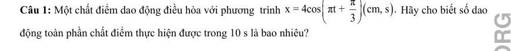
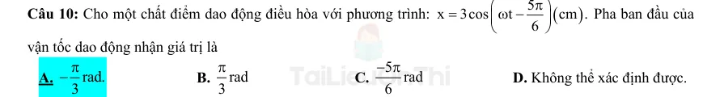
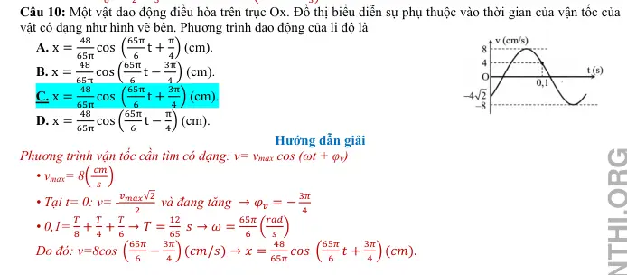
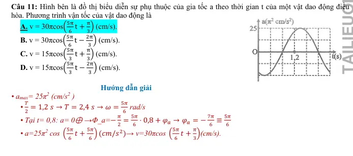
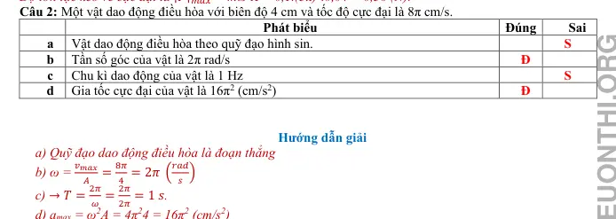
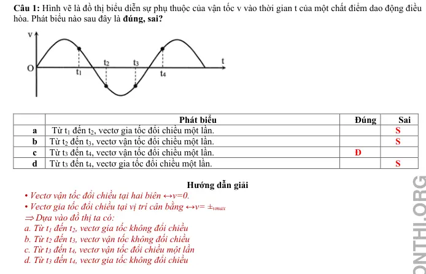
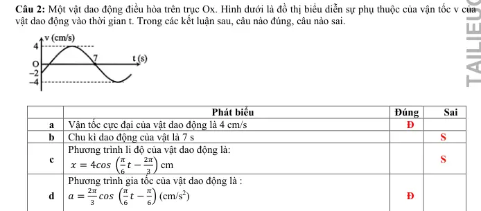
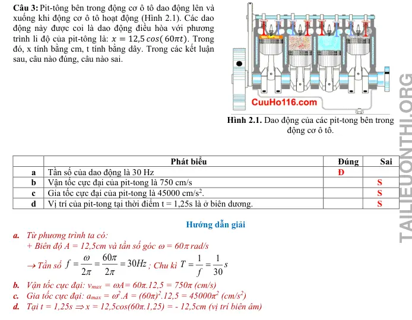
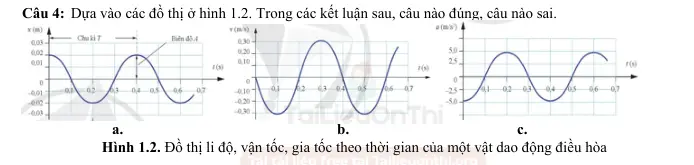
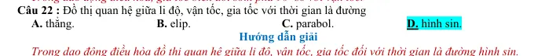

# Bài tập — Bài 2 — Li độ, vận tốc và gia tốc

> Hệ bài tập được biên soạn theo các dạng xuất hiện trong bộ tài liệu Vật lí 11 của dự án. Câu hỏi được giữ ngắn, trực tiếp; độ khó tăng dần và không cố tình thêm dữ kiện gây nhiễu.

[← Trở lại bài học](../../02-displacement-velocity-acceleration.md)

## Phần A — Trắc nghiệm 4 lựa chọn

### Câu 1 — Mức 1 — Nhận biết

Trong dao động điều hòa, gia tốc và li độ liên hệ bởi

A. $a=\omega x$.  
B. $a=-\omega x$.  
C. $a=-\omega^2x$.  
D. $a=\omega^2v$.

### Câu 2 — Mức 1 — Nhận biết

Vật dao động điều hòa có $A=4$ cm, $\omega=5$ rad/s. Tốc độ cực đại bằng

A. $5$ cm/s.  
B. $9$ cm/s.  
C. $20$ cm/s.  
D. $80$ cm/s.

### Câu 3 — Mức 1 — Nhận biết

Tại vị trí biên của dao động điều hòa, đại lượng nào bằng không?

A. Li độ.  
B. Vận tốc.  
C. Gia tốc.  
D. Cả vận tốc và gia tốc.

### Câu 4 — Mức 1 — Nhận biết

Vận tốc trong dao động điều hòa sớm pha hay trễ pha so với li độ?

A. Sớm pha $\pi/2$.  
B. Trễ pha $\pi/2$.  
C. Cùng pha.  
D. Ngược pha.

## Phần B — Đúng/Sai

### Câu 5 — Mức 2 — Thông hiểu

Một vật dao động điều hòa có $x=5\cos(4t)$ cm. Xét các phát biểu:

a) $v_{\max}=20$ cm/s.  
b) $a_{\max}=80$ cm/s².  
c) Tại $x=3$ cm, độ lớn vận tốc là $16$ cm/s.  
d) Khi $x>0$ thì gia tốc cũng dương.

### Câu 6 — Mức 2 — Thông hiểu

Xét một vật dao động điều hòa:

a) Khi đi từ biên về vị trí cân bằng, tốc độ tăng.  
b) Khi đi từ vị trí cân bằng ra biên, độ lớn gia tốc giảm.  
c) Ở vị trí cân bằng, gia tốc bằng không.  
d) Ở cùng một li độ, độ lớn vận tốc luôn như nhau.

## Phần C — Trả lời ngắn

### Câu 7 — Mức 3 — Vận dụng

Vật có $A=10$ cm, $\omega=6$ rad/s. Tại $x=8$ cm, tính tốc độ và độ lớn gia tốc.

### Câu 8 — Mức 3 — Vận dụng

Một vật dao động điều hòa có $v_{\max}=40$ cm/s và $a_{\max}=200$ cm/s². Tính $\omega$ và $A$.

### Câu 9 — Mức 3 — Vận dụng

Tại li độ $x=3$ cm, một vật có gia tốc $a=-48$ cm/s². Biết biên độ $A=5$ cm. Tính $\omega$ và tốc độ tại vị trí này.

## Phần D — Vận dụng và vận dụng cao

### Câu 10 — Mức 4 — Vận dụng cao

Một vật dao động điều hòa. Tại $x_1=3$ cm, tốc độ là $v_1=20$ cm/s; tại $x_2=4$ cm, tốc độ là $v_2=10\sqrt3$ cm/s. Tính $\omega$ và biên độ $A$.

---

[Đáp án và lời giải →](solutions.md)

## Ngân hàng bài tập PDF mở rộng

> Nội dung câu hỏi và dữ kiện trong phần này được giữ nguyên; hệ thống chỉ chuẩn hóa xuống dòng và mã kí tự để hiển thị trên web. Câu trùng được loại bỏ. Với câu có công thức/kí hiệu bị sai khi trích xuất chữ từ PDF, đề bài được giữ dưới dạng ảnh để không làm thay đổi dữ kiện.

### Nhận biết — Trả lời ngắn

#### Bài PDF 1

<!-- source-id: BT-Chuong-I-p82-q1-232 -->

{ loading=lazy }

#### Bài PDF 2

<!-- source-id: BT-Chuong-I-p82-q2-233 -->

Câu 2. Một vật dao động điều hòa với tần số góc 10 rad/s, khi vật có li độ là 3 cm thì tốc độ là 40 cm/s. Biên
độ của dao động là bao nhiêu cm?

#### Bài PDF 3

<!-- source-id: BT-Chuong-I-p82-q3-234 -->

Câu 3. Một vật dao động điều hòa với biên độ 5 cm, khi vật có li độ 2,5 cm thì tốc độ của vật là 5 3 cm/s.
Vận tốc cực đại của dao động là bao nhiêu cm/s?

#### Bài PDF 4

<!-- source-id: BT-Chuong-I-p82-q4-235 -->

Câu 4. Một vật dao động điều hòa có chu kì 2 s, biên độ 10 cm. Khi vật cách vị trí cân bằng 5 cm, tốc độ của
nó bằng bao nhiêu cm/s ?

### Nhận biết — Trắc nghiệm 4 lựa chọn

#### Bài PDF 5

<!-- source-id: BT-Chuong-I-p27-q15-69 -->

Câu 15. Một vật dao động điều hòa với chu kì T. Chọn gốc thời gian là lúc vật qua vị trí cân bằng,
vận tốc của vật bằng 0 lần đầu tiên ở thời điểm
A.
𝑇
2
     B.
𝑇
3
     C.
2𝑇
3
     D.
𝑇
4

#### Bài PDF 6

<!-- source-id: BT-Chuong-I-p68-q1-160 -->

Câu 1. Trong dao động điều hoà thì li độ, vận tốc và gia tốc là những đại lượng biến đổi theo hàm sin hoặc
cosin theo thời gian và
A. cùng biên độ.

B. cùng pha ban đầu.

C. cùng chu kỳ.

D. cùng pha dao động.

#### Bài PDF 7

<!-- source-id: BT-Chuong-I-p68-q2-161 -->

Câu 2. Phương trình li độ của một vật dao động điều hoà có dạng
(
).
x
 Acos
t
ω
=
+ ϕ
Phương trình gia tốc
của vật là
A.
(
)
2
a = Aω cos ωt + φ .
B.
(
)
2
a = Aω sin ωt + φ .
C.
(
)
2
a = -Aω cos ωt + φ .
D.
(
)
2
a = -Aω sin ωt + φ .

#### Bài PDF 8

<!-- source-id: BT-Chuong-I-p68-q5-164 -->

Câu 5. Đối với dao động cơ điều hòa của một chất điểm thì khi chất điểm đi đến vị trí biên nó có
 A. tốc độ bằng không và độ lớn gia tốc cực đại.
B. tốc độ bằng không và gia tốc bằng không.
 C. tốc độ cực đại và gia tốc cực đại.
D. tốc độ cực đại và gia tốc bằng không.

#### Bài PDF 9

<!-- source-id: BT-Chuong-I-p68-q7-166 -->

Câu 7. Vận tốc và gia tốc của dao động điều hòa thỏa mãn mệnh đề nào sau đây?
 A. Ở vị trí biên thì vận tốc triệt tiêu, gia tốc triệt tiêu.
 B. Ở vị trí biên thì vận tốc cực đại, gia tốc triệt tiêu.
 C. Ở vị trí cân bằng thì vận tốc cực đại, gia tốc cực đại.
 D. Ở vị trí cân bằng thì tốc độ cực đại, gia tốc triệt tiêu.

#### Bài PDF 10

<!-- source-id: BT-Chuong-I-p68-q8-167 -->

Câu 8. Khi vật dao động điều hoà, đại lượng không thay đổi theo thời gian là
 A. tốc độ.
B. thế năng.
C. gia tốc.
D. tần số

#### Bài PDF 11

<!-- source-id: BT-Chuong-I-p68-q10-169 -->

{ loading=lazy }

#### Bài PDF 12

<!-- source-id: BT-Chuong-I-p69-q12-171 -->

Câu 12. Một vật dao động điều hòa với biên độ 4 cm , tần số góc của dao động là 2πrad / s  thì tốc độ cực đại
của vật là
A. 8π cm/ s .
B. 4rad / s .
C. π / 2rad / s.
D. 2/ πrad / s .

#### Bài PDF 13

<!-- source-id: BT-Chuong-I-p69-q14-173 -->

Câu 14. Phương trình li độ của một vật dao động điều hoà có dạng
(
).
x
 Acos
t
ω
=
+ ϕ
Vận tốc cực đại của
vật là
A.
max
v
= ωA
B.
2
max
v
= ω A
C.
max
v
= 2ωA
D.
2
2
max
v
= ω A

#### Bài PDF 14

<!-- source-id: BT-Chuong-I-p69-q18-177 -->

Câu 18. Khi một chất điểm dao động điều hòa thì vận tốc của chất điểm là
A. một hàm sin của thời gian.
B. là một hàm tan của thời gian.
C. là một hàm bậc nhất của thời gian.
D. là một hàm bậc hai của thời gian

#### Bài PDF 15

<!-- source-id: BT-Chuong-I-p69-q19-178 -->

Câu 19. Phương trình li độ của một vật dao động điều hoà có dạng
(
).
x
 Acos
t
ω
=
+ ϕ
Phương trình vận tốc
của vật là
A.
(
)
v
Acos
t
.
= ω
ω+ ϕ

B.
(
)
v
Asin
t
.
= ω
ω+ ϕ

C.
(
)
v
Acos
t
.
ω
= −ω
+ ϕ

D.
(
)
v
Asin
t
.
ω
= −ω
+ ϕ

#### Bài PDF 16

<!-- source-id: BT-Chuong-I-p71-q35-194 -->

Câu 35. Một chất điểm dao động điều hoà. Biết li độ và vận tốc của chất điểm tại thời điểm t1, lần lượt là x1
= 3 cm và v1 = 60 3
−
cm/s, tại thời điểm t2, lần lượt là x2 = 3 2 cm và  v2 = 60 2  cm/s. Biên độ và tần số
góc của dao động lần lượt bằng
A. 6 cm, 2 rad/s.
B. 6 cm, 12 rad/s.
C. 12 cm, 20 rad/s.
D. 12 cm, 10 rad/s.

#### Bài PDF 17

<!-- source-id: BT-Chuong-I-p72-q40-199 -->

Câu 40. Li độ và tốc độ của một vật động điều hòa liên hệ với nhau theo biểu thức
3
2
5
2
10 x
10
v
=
−
 Trong đó
x và v lần lượt tính theo đon vị cm và cm/s. Lấy
2
10
π=
. Khi gia tốc của vật là 50 m/s2 thì tốc độ của vật là
A. 50π cm/s.
B. 50
3
π
 cm/s.
C. 0 cm/s.
D. 100π cm/s.

#### Bài PDF 18

<!-- source-id: BT-Chuong-I-p76-q2-211 -->

Câu 2. Một vật dao động điều hòa khi đang chuyến động từ vị trí cân bằng đến vị trí biên âm thì
  A. vectơ vận tốc ngược chiều với vectơ gia tốc.
B. độ lớn vận tốc và gia tốc cùng tăng.
  C. vận tốc và gia tốc cùng có giá trị âm.
D. độ lớn vận tốc và độ lớn gia tốc cùng giảm.

#### Bài PDF 19

<!-- source-id: BT-Chuong-I-p76-q4-213 -->

Câu 4. Gia tốc của một chất điểm dao động điểu hoà biến thiên
  A. cùng tần số và ngược pha với li độ.
B. khác tần số và ngược pha với li độ.
  C. khác tần số và cùng pha với li đô.
D. củng tần số và cùng pha với li độ.

#### Bài PDF 20

<!-- source-id: BT-Chuong-I-p76-q5-214 -->

Câu 5. Một vật dao động điều hòa có độ lớn vận tốc cực đại là 47,1 cm/s. lấy π = 3,14. Tốc độ trung bình của
vật trong một chu kì dao động là

A. 15 cm/s
B. 30 cm/s.
C. 7,5 cm/s.
D. 31,4 cm/s.

#### Bài PDF 21

<!-- source-id: BT-Chuong-I-p76-q6-215 -->

Câu 6. Một vật dao động điều hòa. Khoảng thời gian giữa hai lần liên tiếp vật có vận tốc bằng không là 1s,
đồng thời tốc độ trung bình trong khoảng thời gian này là 20 cm/s. Khi qua vị trí cân bằng, tốc độ của vật là
A. 5π cm/s
B. 10π cm/s.
C. 20 cm/s.

D. 10 cm/s.

#### Bài PDF 22

<!-- source-id: BT-Chuong-I-p76-q7-216 -->

Câu 7. Một vật dao động điều hòa với phương trình vận tốc v = 10πcos(2πt+0,5π) (cm/s). Phát biểu nào sau
đây đúng?
  A. Quỹ đạo dao động dài 20 cm.
B. Tốc độ cực đại là 10 cm/s.
  C. Gia tốc cực đại là 20π2 cm/s2.
D. Tần số của dao động là 2 Hz.

#### Bài PDF 23

<!-- source-id: BT-Chuong-I-p76-q8-217 -->

Câu 8. Một vật dao động điều hòa với vận tốc cực đại vmax = 6π cm/s và gia tốc cực đại amax = 18π2 cm/s2. Tại
t = 0, vật qua vị trí cân bằng theo chiều âm. Phương trình dao động của vật là
  A. x = 3cos (2πt +
π
2) (cm).
B. x = 2cos (3πt +
π
2) (cm).

C. x = 3cos (2πt −
π
2) (cm).
D. x = 2cos (3πt −
π
2) (cm).

#### Bài PDF 24

<!-- source-id: BT-Chuong-I-p77-q10-219 -->

Câu 10. Một vật dao động điều hòa trên trục Ox. Đồ thị biểu diễn sự phụ thuộc vào thời gian của vận tốc của
vật có dạng như hình vẽ bên. Phương trình dao động của li độ là

A. x =
48
65π cos (
65π
6 t +
π
4) (cm).

B. x =
48
65π cos (
65π
6 t −
3π
4 ) (cm).

C. x =
48
65π cos (
65π
6 t +
3π
4 ) (cm).

D. x =
48
65π cos (
65π
6 t −
π
4) (cm).

{ loading=lazy }

#### Bài PDF 25

<!-- source-id: BT-Chuong-I-p77-q11-220 -->

Câu 11. Hình bên là đồ thị biểu diễn sự phụ thuộc của gia tốc a theo thời gian t của một vật dao động điều
hòa. Phương trình vận tốc của vật dao động là

A. v = 30πcos(
5π
6 t +
π
3) (cm/s).

B. v = 30πcos(
5π
6 t −
2π
3 ) (cm/s).

C. v = 15πcos(
5π
3 t +
π
3) (cm/s).

D. v = 15πcos(
5π
3 t −
2π
3 ) (cm/s).

{ loading=lazy }

#### Bài PDF 26

<!-- source-id: BT-Chuong-I-p77-q12-221 -->

Câu 12. Một vật dao động điều hòa trên trục Ox. Khi vật qua vị trí cân bằng, tốc độ của nó là 10π cm/s. Khi
vật cách vị trí cân bằng 4 cm thì nó có tốc độ là 6π cm/s. Tần số của dao động là

A. 4 Hz.
B. 0,5 Hz.
C. 2 Hz.
D. 1 Hz.

#### Bài PDF 27

<!-- source-id: BT-Chuong-I-p78-q13-222 -->

Câu 13. Một vật dao động điều hoà với biên độ A. Khi vật đi qua vị trí có li độ −
A
2 thì có tốc độ là 8π√3
cm/s. Tốc độ trung bình của vật trong một nửa chu kì là
  A. 24 cm/s.
B. 12 cm/s.
C. 16 cm/s.
D. 32 cm/s.

#### Bài PDF 28

<!-- source-id: BT-Chuong-I-p78-q14-223 -->

Câu 14. Một vật động điều hòa với chu kì T và biên độ 4 cm. Tại thời điểm t, vật có tốc độ 10 cm/s. Tại thời
điểm t +
T
4, gia tốc của vật có độ lớn 50 cm/s2. Tại thời điểm t, li độ của vật có độ lớn là
  A. 2 cm.
B. 3 cm.
C. 2√2 cm.
D. 2√3 cm.

#### Bài PDF 29

<!-- source-id: BT-Chuong-I-p78-q15-224 -->

Câu 15. Một vật dao động điều hòa trên trục Ox với tần số là 2 Hz. Trong một chu kì, khoảng thời gian mà
vận tốc của vật không vượt quá một nửa giá trị cực đại của nó là

A.
1
4 s.
B.
1
3 s.
C.
1
6 s.
D.
1
5 s.

#### Bài PDF 30

<!-- source-id: BT-Chuong-I-p78-q18-227 -->

Câu 18. Một chất điểm dao động điều hòa trên trục Ox. Khi chất điểm đi qua vị trí cân bằng thì tốc độ của nó
là 20 cm/s. Khi chất điểm có tốc độ là 10 cm/s thì gia tốc của nó có độ lớn là 40√3 cm/s2. Biên độ dao động
của chất điểm là
  A. 5 cm.
B. 4 cm.
C. 10 cm.
D. 8 cm.

### Nhận biết — Đúng/Sai

#### Bài PDF 31

<!-- source-id: BT-Chuong-I-p73-q1-200 -->

Câu 1. Một vật có khối lượng 100 g dao động theo phương trình x = 4cos(3πt + 0,5π) (cm).

Phát biểu
Đúng
Sai
a
Chiều dài quỹ đạo dao động của vật là 8cm
Đ

b
Độ lớn vận tốc cực đại của vật là 12π m/s

S
c
Lấy π2 = 10. Độ lớn gia tốc cực đại của vật là  360( cm/s2)
Đ

d
Lấy π2 = 10. Độ lớn lực kéo về cực đại tác dụng lên vật là 0,36 N
Đ

#### Bài PDF 32

<!-- source-id: BT-Chuong-I-p73-q2-201 -->

Câu 2. Một vật dao động điều hòa với biên độ 4 cm và tốc độ cực đại là 8π cm/s.

Phát biểu
Đúng
Sai
a
Vật dao động điều hòa theo quỹ đạo hình sin.

S
b
Tần số góc của vật là 2π rad/s
Đ

c
Chu kì dao động của vật là 1 Hz

S
d
Gia tốc cực đại của vật là 16π2 (cm/s2)
Đ

{ loading=lazy }

#### Bài PDF 33

<!-- source-id: BT-Chuong-I-p73-q3-202 -->

Câu 3. Một vật có khối lượng 200 g dao động điều hòa với phương trình của vận tốc là v = 20cos(5t+0,5π)
(cm/s).

Phát biểu
Đúng
Sai
a
Tốc độ cực đại của vật là 5 cm/s

S
b
Biên độ dao động của vật là 20 cm

S
c
Gia tốc cực đại của vật là 100 cm/s2
Đ

d
Lực kéo về cực đại tác dụng lên vật dao động là 0,2 N
Đ

#### Bài PDF 34

<!-- source-id: BT-Chuong-I-p73-q4-203 -->

Câu 4. Một vật dao động điều hòa dọc theo trục Ox. Khi qua vị trí cân bằng, tốc độ của vật là 8π cm/s. Khi ở
biên, gia tốc của vật có độ lớn là 16π2 cm/s2. Tại t = 0, vật qua vị trí có li độ x = 2 cm theo chiều dương.

Phát biểu
Đúng
Sai
a
Tần số góc của vật là
1
2π rad/s

S
b
Vật dao động điều hòa với biên độ là 4 cm
Đ

c
Pha ban đầu của vật dao động điều hòa là
π
3 rad

S

d
Phương trình dao động của vật là:  x = 4cos(2πt +
π
3) (cm).

S

#### Bài PDF 35

<!-- source-id: BT-Chuong-I-p74-q1-204 -->

Câu 1. Một vật dao động điều hòa với phương trình gia tốc là a = 80cos(4t+π) (cm/s2). Tính tốc độ cực đại vật
dao động theo cm/s.

#### Bài PDF 36

<!-- source-id: BT-Chuong-I-p74-q2-205 -->

Câu 2. Một vật có khối lượng 100 g dao động điều hòa dưới tác dụng của lực kéo về có biểu thức F =
0,5cos10t (N). Tính biên độ dao động của vật là theo đơn vị cm.

#### Bài PDF 37

<!-- source-id: BT-Chuong-I-p74-q3-206 -->

Câu 3. Một vật dao động điều hòa với tốc độ cực đại là 50 cm/s, gia tốc cực đại là 100 cm/s2. Tính biên độ
dao động của vật là theo đơn vị m.

#### Bài PDF 38

<!-- source-id: BT-Chuong-I-p74-q4-207 -->

Câu 4. Một vật dao động điều hòa có độ lớn vận tốc cực đại là 31,4 cm/s. lấy π = 3,14. Tính tốc độ trung bình
của vật trong một chu kì dao động theo đơn vị cm/s

#### Bài PDF 39

<!-- source-id: BT-Chuong-I-p74-q5-208 -->

Câu 5. Một chất điểm dao động điều hòa với chu kì T. Tốc độ trung bình lớn nhất của chất điểm trong thời
gian
T
6 là 30 cm/s. Tính tốc độ cực đại của vật theo số nguyên lần π cm/s.

#### Bài PDF 40

<!-- source-id: BT-Chuong-I-p80-q1-228 -->

Câu 1. Hình vẽ là đồ thị biểu diễn sự phụ thuộc của vận tốc v vào thời gian t của một chất điểm dao động điều
hòa. Phát biểu nào sau đây là đúng, sai?

Phát biểu
Đúng
Sai
a
 Từ t1 đến t2, vectơ gia tốc đổi chiều một lần.

S
b
Từ t2 đến t3, vectơ vận tốc đổi chiều một lần.

S
c
Từ t3 đến t4, vectơ vận tốc đổi chiều một lần.
Đ

d
Từ t3 đến t4, vectơ gia tốc đổi chiều một lần.

S

{ loading=lazy }

#### Bài PDF 41

<!-- source-id: BT-Chuong-I-p80-q2-229 -->

Câu 2. Một vật dao động điều hòa trên trục Ox. Hình dưới là đồ thị biểu diễn sự phụ thuộc của vận tốc v của
vật dao động vào thời gian t. Trong các kết luận sau, câu nào đúng, câu nào sai.

Phát biểu
Đúng
Sai
a
Vận tốc cực đại của vật dao động là 4 cm/s
Đ

b
Chu kì dao động của vật là 7 s

S
c
Phương trình li độ của vật dao động là:
 𝑥= 4𝑐𝑜𝑠 (
𝜋
6 𝑡−
2𝜋
3 ) cm

S
d
Phương trình gia tốc của vật dao động là :
𝑎=
2𝜋
3 𝑐𝑜𝑠 (
𝜋
6 𝑡−
𝜋
6) (cm/s2)

Đ

{ loading=lazy }

#### Bài PDF 42

<!-- source-id: BT-Chuong-I-p81-q3-230 -->

Câu 3. Pit-tông bên trong động cơ ô tô dao động lên và
xuống khi động cơ ô tô hoạt động (Hình 2.1). Các dao
động này được coi là dao động điều hòa với phương
trình li độ của pit-tông là: 𝑥= 12,5 𝑐𝑜𝑠( 60𝜋𝑡). Trong
đó, x tính bằng cm, t tính bằng dây. Trong các kết luận
sau, câu nào đúng, câu nào sai.

Hình 2.1. Dao động của các pit-tong bên trong
động cơ ô tô.

Phát biểu
Đúng
Sai
a
Tần số của dao động là 30 Hz
Đ

b
Vận tốc cực đại của pit-tong là 750 cm/s

S
c
Gia tốc cực đại của pit-tong là 45000 cm/s2.

S
d
Vị trí của pit-tong tại thời điểm t = 1,25s là ở biên dương.

S

{ loading=lazy }

#### Bài PDF 43

<!-- source-id: BT-Chuong-I-p81-q4-231 -->

Câu 4. Dựa vào các đồ thị ở hình 1.2. Trong các kết luận sau, câu nào đúng, câu nào sai.

a.

b.

c.
Hình 1.2. Đồ thị li độ, vận tốc, gia tốc theo thời gian của một vật dao động điều hòa

Phát biểu
Đúng
Sai
a
Tần số của dao động là 2,5 Hz
Đ

b
Biên độ của dao động 2 cm
Đ

c
Vận tốc cực đại của dao động 30 cm/s
Đ

d
Gia tốc cực đại của dao dộng 5 cm/s2

S

{ loading=lazy }

### Thông hiểu — Trắc nghiệm 4 lựa chọn

#### Bài PDF 44

<!-- source-id: BT-Chuong-I-p69-q20-179 -->

Câu 20. Một chất điểm dao động có phương trình
(
)
x
6cos
t
=
π
 x tính bằng cm, t tính bằng giây] Phát biểu
nào sau đây là đúng?
A. Chu kì dao động là 0,5 s.

B. Tốc độ cực đại của chất điểm là 18,8 cm/s.
C. Gia tốc của chất điểm có độ lớn cực đại là 113 cm/s2.
D. Tần số của dao động là 2 Hz.

#### Bài PDF 45

<!-- source-id: BT-Chuong-I-p70-q22-181 -->

Câu 22. Đồ thị quan hệ giữa li độ, vận tốc, gia tốc với thời gian là đường
A. thẳng.
B. elip.
C. parabol.
D. hình sin.

{ loading=lazy }

#### Bài PDF 46

<!-- source-id: BT-Chuong-I-p70-q23-182 -->

Câu 23. Đồ thị quan hệ giữa li độ và gia tốc là
A. đoạn thẳng qua gốc tọa độ.
B. đường hình sin.
C. đường elip.

D. đường thẳng qua gốc tọa độ.

{ loading=lazy }

#### Bài PDF 47

<!-- source-id: BT-Chuong-I-p70-q24-183 -->

Câu 24. Một vật dao động điều hòa có phương trình
(
)
x
Acos
t
=
ω+ ϕ. Với a và v là gia tốc và vận tốc của
vật. Hệ thức đúng là
A.
2
2
2
2
2
v
a
A .
+
=
ω
ω

B.
2
2
2
2
4
a
A .
v
ω+
=
ω

C.
2
2
2
2
4
v
a
A .
+
=
ω
ω

D.
2
2
2
4
2
v
a
A .
+
=
ω
ω

#### Bài PDF 48

<!-- source-id: BT-Chuong-I-p70-q25-184 -->

Câu 25. Cho một chất điểm dao động điều hòa với biên độ A, tốc độ cực đại là V. Khi li độ
A
x
2
= ±
 thì vận
tốc v được tính bằng biểu thức
A.
3
v
V.
2
= ±

B.
1
v
V.
2
= ±

C.
3
v
V.
2
=

D.
1
v
V.
2
=

#### Bài PDF 49

<!-- source-id: BT-Chuong-I-p70-q26-185 -->

Câu 26. Tại thời điểm khi vật thực hiện dao động điều hòa có vận tốc bằng một nửa vận tốc cực đại thì vật
cách vị trí cân bằng một đoạn là
A. A .
2

B. A 3 .
2

C. A .
3

D. A 2.

#### Bài PDF 50

<!-- source-id: BT-Chuong-I-p70-q28-187 -->

Câu 28. Một vật dao động điều hòa dọc theo trục Ox, gốc tọa độ O tại vị trí cân bằng. Khi vật chuyển động
nhanh dần theo chiều dương thì giá trị của li độ x và vận tốc v là
A. x &gt; 0 và v &gt; 0.
B. x &lt; 0 và v &gt; 0.
C. x &lt; 0 và v &lt; 0.
D. x &gt; 0 và v &lt; 0.

#### Bài PDF 51

<!-- source-id: BT-Chuong-I-p70-q29-188 -->

Câu 29. Khi nói về vận tốc của một vật dao động điều hòa, phát biểu nào sau đây là sai?
A. Vận tốc biến thiên điều hòa theo thời gian.

B. Vận tốc có giá trị dương nếu vật chuyển động từ biên âm về vị trí cân bằng.
C. Khi vận tốc và li độ cùng dấu vật chuyển động nhanh dần.
D. Vận tốc cùng chiều với gia tốc khi vật chuyển động về vị trí cân bằng.

### Vận dụng — Trắc nghiệm 4 lựa chọn

#### Bài PDF 52

<!-- source-id: BT-Chuong-I-p71-q33-192 -->

Câu 33. Vận tốc của một vật dao động điều hoà khi đi qua vị trí cân bằng là 1 cm/s và gia tốc của vật khi ở vị
trí biên là 1,57 cm/s2. Chu kì dao động của vật là
A. 3,24 s.
B. 6,26 s.
C. 4 s.
D. 2 s.

