# Bài tập — Bài 3 — Đường tròn lượng giác, thời gian và quãng đường

> Hệ bài tập được biên soạn theo các dạng xuất hiện trong bộ tài liệu Vật lí 11 của dự án. Câu hỏi được giữ ngắn, trực tiếp; độ khó tăng dần và không cố tình thêm dữ kiện gây nhiễu.

[← Trở lại bài học](../../03-phase-circle-time-distance.md)

## Phần A — Trắc nghiệm 4 lựa chọn

### Câu 1 — Mức 1 — Nhận biết

Một vật xuất phát từ biên dương. Thời gian ngắn nhất để đến vị trí cân bằng bằng

A. $T/2$.  
B. $T/3$.  
C. $T/4$.  
D. $T/8$.

### Câu 2 — Mức 1 — Nhận biết

Trong một chu kì, vật dao động điều hòa đi qua vị trí $x=A/2$ bao nhiêu lần?

A. 1.  
B. 2.  
C. 3.  
D. 4.

### Câu 3 — Mức 1 — Nhận biết

Một vật dao động với biên độ $A$. Trong đúng nửa chu kì, quãng đường vật đi được luôn bằng

A. $A$.  
B. $2A$.  
C. $3A$.  
D. $4A$.

### Câu 4 — Mức 1 — Nhận biết

Vật xuất phát từ biên dương. Thời gian ngắn nhất để đến $x=A/2$ là

A. $T/12$.  
B. $T/8$.  
C. $T/6$.  
D. $T/4$.

## Phần B — Đúng/Sai

### Câu 5 — Mức 2 — Thông hiểu

Xét dao động điều hòa có chu kì $T$:

a) Từ biên này sang biên kia mất $T/2$.  
b) Từ vị trí cân bằng đến một biên gần nhất mất $T/4$.  
c) Trong $T$, quãng đường luôn bằng $4A$.  
d) Trong $T/4$, quãng đường luôn bằng $A$ bất kể thời điểm bắt đầu.

### Câu 6 — Mức 2 — Thông hiểu

Trên đường tròn lượng giác biểu diễn dao động điều hòa:

a) Góc quét tăng đều theo thời gian với tốc độ góc $\omega$.  
b) Hình chiếu lên trục dao động cho li độ.  
c) Hai điểm có cùng hình chiếu luôn tương ứng cùng chiều chuyển động.  
d) Có thể dùng góc quét để tính thời gian ngắn nhất giữa hai trạng thái.

## Phần C — Trả lời ngắn

### Câu 7 — Mức 3 — Vận dụng

Vật dao động với $A=8$ cm, $T=1,2$ s. Từ biên dương, tính thời gian ngắn nhất để đến $x=-4$ cm.

### Câu 8 — Mức 3 — Vận dụng

Vật dao động với $A=6$ cm, chu kì $0,8$ s. Tính quãng đường đi được trong $2,4$ s.

### Câu 9 — Mức 3 — Vận dụng

Một vật đi từ $x=-A/2$ theo chiều dương đến $x=A/2$ theo chiều dương. Tính thời gian ngắn nhất theo $T$.

## Phần D — Vận dụng và vận dụng cao

### Câu 10 — Mức 4 — Vận dụng cao

Vật dao động điều hòa có $T=1,2$ s. Tại thời điểm ban đầu vật ở $x=A/2$ và đi theo chiều dương. Tính thời gian ngắn nhất kể từ đó để vật đi qua $x=-A/2$ lần thứ hai.

---

[Đáp án và lời giải →](solutions.md)

## Ngân hàng bài tập PDF mở rộng

> Nội dung câu hỏi và dữ kiện trong phần này được giữ nguyên; hệ thống chỉ chuẩn hóa xuống dòng và mã kí tự để hiển thị trên web. Câu trùng được loại bỏ. Với câu có công thức/kí hiệu bị sai khi trích xuất chữ từ PDF, đề bài được giữ dưới dạng ảnh để không làm thay đổi dữ kiện.

### Nhận biết — Trả lời ngắn

#### Bài PDF 1

<!-- source-id: BT-Chuong-I-p33-q6-82 -->

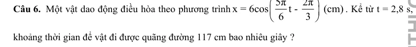{ loading=lazy }

#### Bài PDF 2

<!-- source-id: BT-Chuong-I-p52-q1-154 -->

Câu 1. Sau khi chạy một quãng đường ngắn, nhịp tim của một bạn học sinh là 90 nhịp mỗi phút.
Tần số đập của tim bạn học sinh đó là bao nhiêu Hz (làm tròn đến một chữ số thập phân sau dấu
phẩy)?

#### Bài PDF 3

<!-- source-id: BT-Chuong-I-p84-q5-236 -->

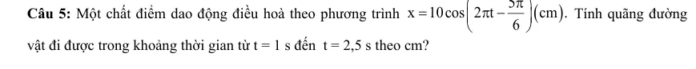{ loading=lazy }

### Nhận biết — Trắc nghiệm 4 lựa chọn

#### Bài PDF 4

<!-- source-id: BT-Chuong-I-p28-q18-72 -->

Câu 18. Cho hai dao động điều hòa x1 và x2 cùng tần số có đồ
thị phụ thuộc vào thời gian t như hình vẽ. Độ lệch pha của hai
dao động là
A. π rad.
B. -πrad.
C. π
2
rad.
D. 0rad.

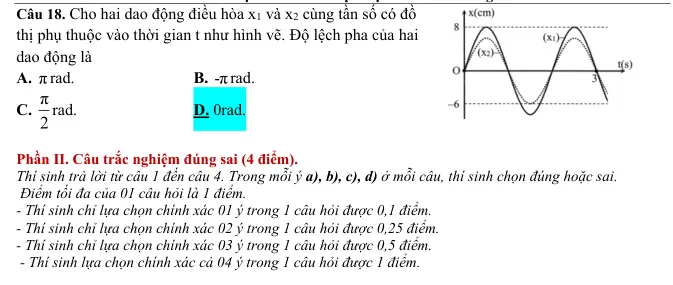{ loading=lazy }

#### Bài PDF 5

<!-- source-id: BT-Chuong-I-p37-q1-83 -->

Câu 1. Khoảng thời gian để vật thực hiện được một dao động gọi là
A. biên độ dao động.
B. chu kì dao động.
C. pha dao động.
D. tần số dao động.

#### Bài PDF 6

<!-- source-id: BT-Chuong-I-p37-q9-90 -->

Câu 9. Biên độ dao động

A. là quãng đường vật đi trong một chu kỳ dao động

B. là quãng đường vật đi được trong nửa chu kỳ dao động

C. là độ dời lớn nhất của vật trong quá trình dao động

D. là độ dài quỹ đạo chuyển động của vật

#### Bài PDF 7

<!-- source-id: BT-Chuong-I-p68-q3-162 -->

Câu 3. Trong dao động điều hoà, li độ biến đổi
A. cùng pha với vận tốc.
B. trễ pha 900 so với vận tốc.
C. vuông pha với gia tốc.
D. cùng pha với gia tốc.

#### Bài PDF 8

<!-- source-id: BT-Chuong-I-p68-q4-163 -->

Câu 4. Trong dao động điều hoà, gia tốc biến đổi
A. cùng pha với vận tốc.
B. sớm pha 900 so với vận tốc.
C. ngược pha với vận tốc.
D. trễ pha 900 so với vận tốc.

#### Bài PDF 9

<!-- source-id: BT-Chuong-I-p69-q17-176 -->

Câu 17. Phát biểu nào sau đây là sai khi nói về dao động điều hoà?
A. Gia tốc sớm pha π so với li độ.
B. Vận tốc và gia tốc luôn ngược pha nhau.
C. Vận tốc luôn trễ pha 2
π so với gia tốc.
D. Vận tốc luôn sớm pha 2
π so với li độ.

#### Bài PDF 10

<!-- source-id: BT-Chuong-I-p76-q3-212 -->

Câu 3. Vận tốc của một chất điểm dao động điều hoà biến thiên
  A. cùng tần số và ngược pha với li độ.
B. cùng tần số và trễ pha
π
2 so với gia tốc.

C. khác tần số và nhanh pha
π
2 so với li độ.
D. củng tần số và cùng pha với li độ.

#### Bài PDF 11

<!-- source-id: BT-Chuong-I-p77-q9-218 -->

Câu 9. Hình bên là đồ thị biểu diễn mối quan hệ giữa gia tốc a và vận
tốc v của một vật dao động điểu hòa trên trục Ox. Quãng đường nhỏ
nhất vật đi được trong 2,5 s là

A. 34 cm.
B. 27 cm

C. 45 cm.
D. 20 cm

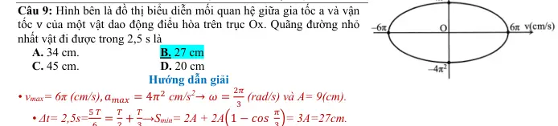{ loading=lazy }

#### Bài PDF 12

<!-- source-id: BT-Chuong-I-p78-q16-225 -->

Câu 16. Một vật dao động điều hòa với phương trình x = 2cos(2πt +
π
3) (cm). Cho π2 = 10. Kể từ t = 0, sau khi
vật đi được quãng đường 74,5 cm thì vận tốc của vật là?
  A. -2π√2 cm/s.
B. 2π√7 cm/s.
C. -2π√7 cm/s.
D. -π√7 cm/s.

### Nhận biết — Đúng/Sai

#### Bài PDF 13

<!-- source-id: BT-Chuong-I-p29-q2-74 -->

Câu 2. Một vật dao động điều hòa có đồ thị li độ  phụ thuộc thời gian như hình bên dưới.

Nhận định nào sau đây đúng, nhận định nào sai khi nói về dao động trên?

Phát biểu
Đúng
Sai
a
Biên độ dao động của vật là 5 cm

S
b
Tần số dao động của vật là 1 Hz.

S
c
Pha ban đầu của dao động là -π  rad.
4

Đ

d
Quãng đường vật đi được sau 0,6 s là 18 cm.
Đ

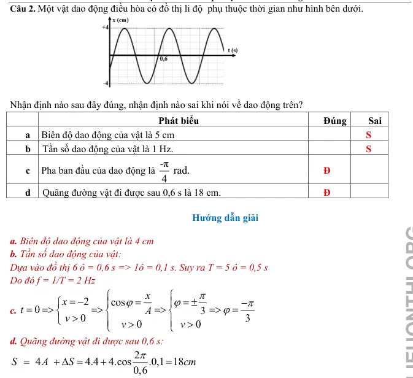{ loading=lazy }

#### Bài PDF 14

<!-- source-id: BT-Chuong-I-p30-q4-76 -->

Câu 4. Xét hai vật (1) và (2) dao động điều hoà cùng phương, li độ tương ứng là x1 và x2. Một
phần đồ thị li độ - thời gian của hai vật được cho như hình.
Xét tính đúng sai của các phát biểu sau:

Phát biểu
Đúng
Sai
a
Hai dao động có cùng tần số.
Đ

b
Hai dao động có cùng biên độ.
Đ

c
Chu kì dao động của vật (1) là 1,25 s.

S
d
Độ lệch pha của hai dao động là π
2
 rad.
Đ

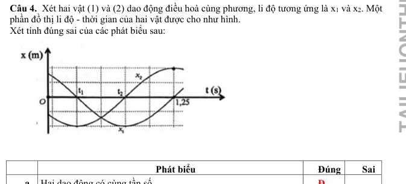{ loading=lazy }

#### Bài PDF 15

<!-- source-id: BT-Chuong-I-p51-q3-152 -->

Câu 3. Cho đồ thị li độ theo thời gian của một vật dao động điều hoà như hình vẽ:

Phát biểu
Đúng Sai
a. Biên độ dao động  x1 của vật bằng 20 cm.
Đ

b. Chu kì dao động của dao động  x2 bằng 0,8 s.
Đ

c. Pha ban đầu của dao động  x1 là 0,5π rad.

S
d. Độ lệch pha của hai dao động  x1 và x2 là π rad.

S

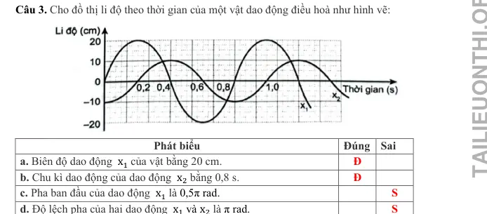{ loading=lazy }

#### Bài PDF 16

<!-- source-id: BT-Chuong-I-p52-q4-153 -->

Câu 4. Xét tính đúng/sai của các phát biểu sau về dao động điều hoà:

Phát biểu
Đúng Sai
a. Chu kì là khoảng thời gian để vật thực hiện được một dao động.
Đ

b. Pha ban đầu cho biết tại thời điểm bất kì vật dao động điều hoà ở đâu và sẽ đi
về phía nào.

S
c. Đồ thị của dao động điều hoà là một đường hình sin.
Đ

d. Các đại lượng biên độ, chu kì, tần số và tần số góc là những đại lượng xác
định, không phụ thuộc vào thời điểm quan sát.
Đ

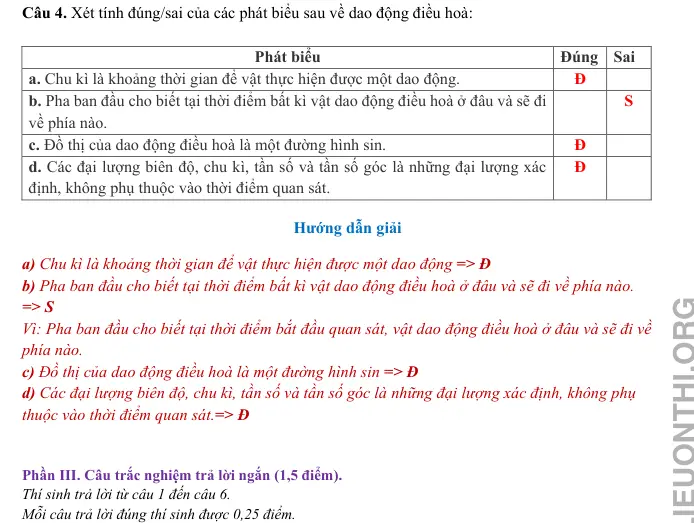{ loading=lazy }

#### Bài PDF 17

<!-- source-id: BT-Chuong-I-p75-q6-209 -->

Câu 6. Một vật dao động điều hòa dọc theo trục Ox với phương trình 𝑥= 4 𝑐𝑜𝑠(4𝜋𝑡+
𝜋
3) (cm). Từ thời điểm
ban đầu đến thời điểm 𝑡=
43
12 𝑠, quãng đường vật đi được là bao nhiêu cm?

### Thông hiểu — Trắc nghiệm 4 lựa chọn

#### Bài PDF 18

<!-- source-id: BT-Chuong-I-p9-q13-13 -->

Câu 13. Một vật dao động điều hòa với phương trình x = Acos(ωt + φ) . Trong một chu kì, vật đi
được quãng đường là
     A. 2A.
     B. 1A.
     C. 4A.
     D. 3A.

#### Bài PDF 19

<!-- source-id: BT-Chuong-I-p13-q32-32 -->

Câu 32. Đồ thi biễu diễn hai dao động điều hoà cùng phương
như hình vẽ. Độ lệch pha của hai dao động này là
A. 0.

B. π
C. 2π.

D. π/2.

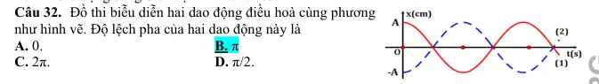{ loading=lazy }

#### Bài PDF 20

<!-- source-id: BT-Chuong-I-p13-q33-33 -->

Câu 33. Hai vật dao động đều hòa có li độ được
biểu diễn trên đồ thi li độ - thời gian như hình bên.
Nhận định nào sau đây là đúng?
A. (1) dao động cùng pha với (2).
B. (1) dao động sớm pha so với (2) là π.
2

C. (1) dao động trễ pha so với (2) là π.
2

D. (1) dao động ngược pha so với (2).

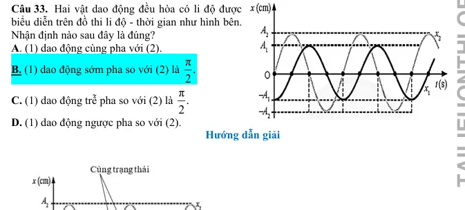{ loading=lazy }

#### Bài PDF 21

<!-- source-id: BT-Chuong-I-p14-q34-34 -->

Câu 34. Đồ thị li độ theo thời gian x1; x2 của hai
chất điểm dao động điều hoà được mô tả như bên.
Độ lệch pha (rad) giữa hai dao động là

A.  3π .
4

B. π.
4

C.  π.
2

D. 3π .
2

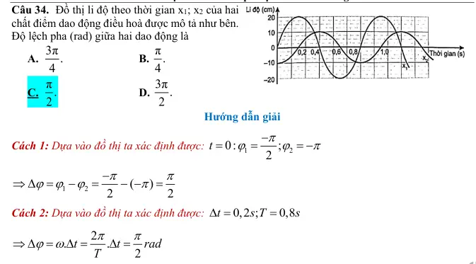{ loading=lazy }

#### Bài PDF 22

<!-- source-id: BT-Chuong-I-p14-q35-35 -->

Câu 35. Độ lệch pha (rad) của hai dao động được biểu diễn trong đồ thị li độ - thời gian như hình là

A. π
4
.
C. 3π
4

B. π
2

D. 2π
3

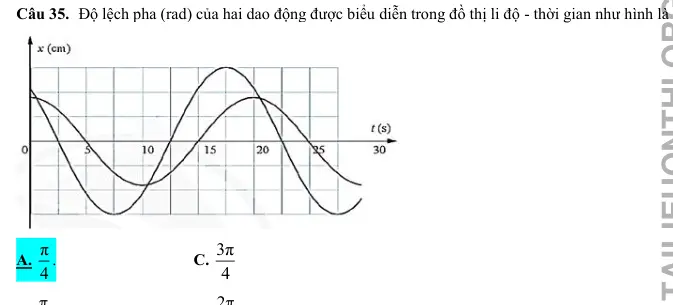{ loading=lazy }

#### Bài PDF 23

<!-- source-id: BT-Chuong-I-p70-q21-180 -->

Câu 21. Trong dao động điều hoà, gia tốc biến đổi
A. cùng pha với vận tốc.
B. sớm pha 900 so với vận tốc.
C. ngược pha với vận tốc.
D. trễ pha 900 so với vận tốc.

### Vận dụng — Trả lời ngắn

#### Bài PDF 24

<!-- source-id: BT-Chuong-I-p22-q3-49 -->

Câu 3. Một vật nhỏ dao động điều hòa trên đoạn thẳng quỹ đạo dài 30 cm. Quãng đường ngắn nhất
vật đi được trong 0,5 s là 15 cm. Tốc độ trung bình của vật trong một chu kì là bao nhiêu milimet/giây?
Đáp án
4
0
0

### Vận dụng — Trắc nghiệm 4 lựa chọn

#### Bài PDF 25

<!-- source-id: BT-Chuong-I-p15-q37-37 -->

Câu 37. Một chất điểm dao động điều hoà trên trục Ox. Đồ thị li độ -
thời gian (x -t) của vật được cho như hình bên. Tại thời điểm 17,25 s
quãng đường vật đi được bằng
A. 685,0 cm.

B. 678,1 cm
C. 688,7 cm.

D. 687,1 cm

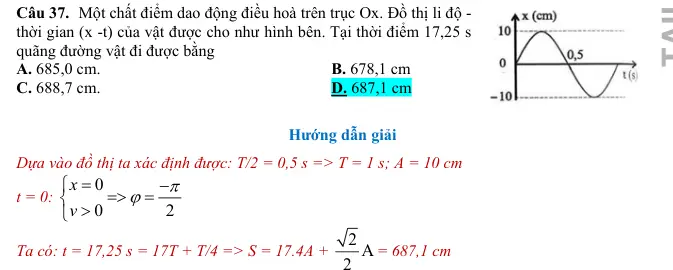{ loading=lazy }

#### Bài PDF 26

<!-- source-id: BT-Chuong-I-p26-q1-55 -->

Câu 1. Chu kỳ dao động là
A. thời gian vật thực hiện một dao động toàn phần.
B. thời gian ngắn nhất để vật trở về vị trí xuất phát.
C. thời gian ngắn nhất để biên độ dao động trở về giá trị ban đầu.
D. thời gian ngắn nhất để li độ dao động trở về giá trị ban đầu.

#### Bài PDF 27

<!-- source-id: BT-Chuong-I-p41-q39-120 -->

Câu 39. Độ lệch pha của hai dao động là
A. 0,5π rad.
B. 0,75π rad.
C. 0,25π rad.
D. π rad.

#### Bài PDF 28

<!-- source-id: BT-Chuong-I-p71-q34-193 -->

Câu 34. Một chất điểm chuyển động tròn đều trên một đường tròn với tốc độ dài 160 cm/s và tốc độ góc 4
rad/s. Hình chiếu P của chất điểm M trên một đường thẳng cố định nằm trong mặt phẳng hình tròn dao động
điều hoà với biên độ và chu kì lần lượt là
A. 40 cm, 0,25s.
B. 40 cm, 1,57 s.
C. 40 m, 0,25s.
D. 2,5 m, 0,25 s.

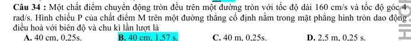{ loading=lazy }

### Vận dụng — Đúng/Sai

#### Bài PDF 29

<!-- source-id: BT-Chuong-I-p17-q1-41 -->

Câu 1. Phương trình dao động của một vật dao động điều hoà có dạng
cos(
)
3
x
A
t
π
ω
=
−
cm.
Nội dung
Đúng Sai
a. Pha ban đầu vật là π/3.

S
b. Ở thời điểm ban đầu vật có li độ x =
2
2
A

S
c. Gốc thời gian là lúc vật đi theo chiều dương
Đ

d. Quãng đường vật đi được sau n dao động là n.4A
Đ

#### Bài PDF 30

<!-- source-id: BT-Chuong-I-p17-q2-42 -->

Câu 2. Một vật nhỏ dao động có đồ thị giữa li độ và thời gian như hình . Nhận định nào đúng, nhận
định nào sai?

Nội dung
Đúng Sai
a. Tần số dao động của vật là 1,5 Hz

S

b. Chiều dài quỹ đạo dao động của vật là 4 cm.
Đ

c. Ở thời điểm 11s
6
 vật chuyển động qua vị trí x = -2 theo chiều âm.

S
d. Tốc độ trung bình khi vật đi được quãng đường 13 cm là 19,5 s.
Đ

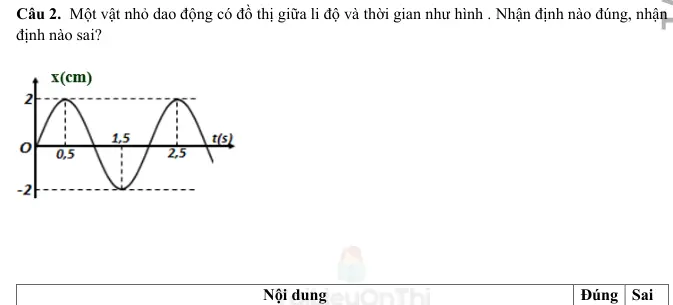{ loading=lazy }

#### Bài PDF 31

<!-- source-id: BT-Chuong-I-p19-q4-44 -->

Câu 4. Cho đồ thị li độ - thời gian của một vật dao động điều hòa như hình. Nhận định nào đúng,
nhận định nào sai?

Nội dung
Đúng Sai
a. Biên độ dao động của vật là 5 cm
Đ

b. Pha dao động ban đầu là 2 rad
π

S
c. Trạng thái chuyển động của vật khi đi qua VTCB là thứ 2 kể từ lúc bắt đầu dao
động là 5
2 rad
π

Đ

d. Thời điểm vật đi được quãng đường 37,5 cm là 19,5 s.

S

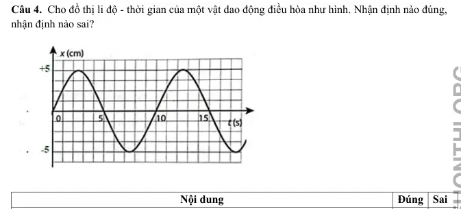{ loading=lazy }

