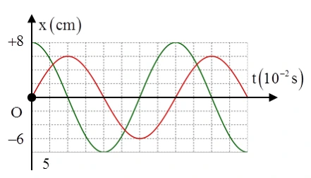

# Bài tập — Bài 3 — Đường tròn lượng giác, thời gian và quãng đường

[← Trở lại bài học](../../03-phase-circle-time-distance.md)

## Phần A — Trắc nghiệm 4 lựa chọn

### Bài 1 — Mức 1 — Nhận biết

Một vật xuất phát từ biên dương. Thời gian ngắn nhất để đến vị trí cân bằng bằng

A. $T/2$.

B. $T/3$.

C. $T/4$.

D. $T/8$.

??? success "Đáp án và lời giải"
    Chọn **C**. Từ biên đến vị trí cân bằng tương ứng góc quét $\pi/2$, bằng một phần tư chu kì.

### Bài 2 — Mức 1 — Nhận biết

Trong một chu kì, vật dao động điều hòa đi qua vị trí $x=A/2$ bao nhiêu lần?

A. 1.

B. 2.

C. 3.

D. 4.

??? success "Đáp án và lời giải"
    Chọn **B**. Mỗi li độ nằm giữa hai biên được vật đi qua hai lần trong một chu kì, một lần theo mỗi chiều.

### Bài 3 — Mức 1 — Nhận biết

Một vật dao động với biên độ $A$. Trong đúng nửa chu kì, quãng đường vật đi được luôn bằng

A. $A$.

B. $2A$.

C. $3A$.

D. $4A$.

??? success "Đáp án và lời giải"
    Chọn **B**. Trong mọi khoảng thời gian dài $T/2$, vật đi từ một trạng thái đến trạng thái đối pha và tổng quãng đường bằng $2A$.

### Bài 4 — Mức 1 — Nhận biết

Vật xuất phát từ biên dương. Thời gian ngắn nhất để đến $x=A/2$ là

A. $T/12$.

B. $T/8$.

C. $T/6$.

D. $T/4$.

??? success "Đáp án và lời giải"
    Chọn **C**. $x/A=\cos\Delta\varphi=1/2$ nên $\Delta\varphi=\pi/3$. Do $T$ ứng với $2\pi$, thời gian là $T/6$.

## Phần B — Đúng/Sai

### Bài 5 — Mức 2 — Thông hiểu

Xét dao động điều hòa có chu kì $T$:

a) Từ biên này sang biên kia mất $T/2$.

b) Từ vị trí cân bằng đến một biên gần nhất mất $T/4$.

c) Trong $T$, quãng đường luôn bằng $4A$.

d) Trong $T/4$, quãng đường luôn bằng $A$ bất kể thời điểm bắt đầu.

??? success "Đáp án và lời giải"
    a) **Đúng.** Hai biên lệch pha $\pi$, tương ứng nửa chu kì nên thời gian là $T/2$.

    b) **Đúng.** Từ cân bằng đến biên gần nhất pha biến thiên $\pi/2$, tức một phần tư chu kì.

    c) **Đúng.** Trong một chu kì vật đi từ một biên sang biên kia rồi trở lại, tổng quãng đường là $2A+2A=4A$.

    d) **Sai**. Quãng đường trong $T/4$ phụ thuộc pha ban đầu; chỉ một số đoạn đặc biệt mới bằng $A$.

### Bài 6 — Mức 2 — Thông hiểu

Trên đường tròn lượng giác biểu diễn dao động điều hòa:

a) Góc quét tăng đều theo thời gian với tốc độ góc $\omega$.

b) Hình chiếu lên trục dao động cho li độ.

c) Hai điểm có cùng hình chiếu luôn tương ứng cùng chiều chuyển động.

d) Có thể dùng góc quét để tính thời gian ngắn nhất giữa hai trạng thái.

??? success "Đáp án và lời giải"
    a) **Đúng.** Trong biểu diễn đường tròn pha, pha có dạng $\omega t+\varphi$, nên góc quét tăng tuyến tính với tốc độ $\omega$.

    b) **Đúng.** Biểu diễn đường tròn pha được xây dựng sao cho hình chiếu của bán kính quay lên trục dao động bằng $x=A\cos(\omega t+\varphi)$.

    c) **Sai.** cùng li độ có thể đi theo hai chiều trái nhau.

    d) **Đúng**, với $\Delta t=\Delta\varphi/\omega$.

## Phần C — Trả lời ngắn

### Bài 7 — Mức 3 — Vận dụng

Vật dao động với $A=8\,\mathrm{cm}$, $T=1,2\,\mathrm s$. Từ biên dương, tính thời gian ngắn nhất để đến $x=-4\,\mathrm{cm}$.

??? success "Đáp án và lời giải"
    Từ biên dương, $x/A=-1/2$ ứng với góc quét nhỏ nhất $2\pi/3$. Do đó $\Delta t=(2\pi/3)/(2\pi/T)=T/3=0,4\,\mathrm s$.

### Bài 8 — Mức 3 — Vận dụng

Vật dao động với $A=6\,\mathrm{cm}$, chu kì $0,8\,\mathrm s$. Tính quãng đường đi được trong $2,4\,\mathrm s$.

??? success "Đáp án và lời giải"
    $2,4\,\mathrm s$ $=3T$. Mỗi chu kì vật đi $4A=24\,\mathrm{cm}$. Vậy quãng đường là $3\cdot24=72\,\mathrm{cm}$.

### Bài 9 — Mức 3 — Vận dụng

Một vật đi từ $x=-A/2$ theo chiều dương đến $x=A/2$ theo chiều dương. Tính thời gian ngắn nhất theo $T$.

??? success "Đáp án và lời giải"
    Ở $x=-A/2$ theo chiều dương, pha có thể chọn $4\pi/3$; ở $x=A/2$ theo chiều dương, trạng thái kế tiếp có pha $5\pi/3$. Chênh pha $\pi/3$, nên $\Delta t=T/6$.

## Phần D — Vận dụng và vận dụng cao

### Bài 10 — Mức 4 — Vận dụng cao

Vật dao động điều hòa có $T=1,2\,\mathrm s$. Tại thời điểm ban đầu vật ở $x=A/2$ và đi theo chiều dương. Tính thời gian ngắn nhất kể từ đó để vật đi qua $x=-A/2$ lần thứ hai.

??? success "Đáp án và lời giải"
    Chọn pha ban đầu $\Phi_0=5\pi/3$ vì $\cos\Phi_0=1/2$ và $v=-A\omega\sin\Phi_0>0$.

    Các trạng thái $x=-A/2$ có pha $2\pi/3+2k\pi$ hoặc $4\pi/3+2k\pi$.

    Sau $5\pi/3$, lần thứ nhất là $2\pi/3+2\pi=8\pi/3$; lần thứ hai là $4\pi/3+2\pi=10\pi/3$.

    Chênh pha đến lần thứ hai: $10\pi/3-5\pi/3=5\pi/3$.

    Vì $2\pi$ ứng với $T$, $\Delta t=(5/6)T=1,0\,\mathrm s$.

## Ngân hàng bài tập mở rộng

### Nhận biết — Trả lời ngắn

#### Bài 11

<!-- source-id: BT-Chuong-I-p33-q6-82 -->

Một vật dao động điều hòa theo phương trình

$$
x=6\cos\left(\frac{5\pi}{6}t-\frac{2\pi}{3}\right)\ \text{cm}.
$$

Kể từ $t=2{,}8\,\mathrm s$, khoảng thời gian để vật đi được quãng đường $117\,\mathrm{cm}$ là bao nhiêu giây?

??? success "Đáp án và lời giải"
    **Đáp án:** $11{,}8\,\mathrm s$.

    **Hướng dẫn giải:**

    Biên độ $A=6\,\mathrm{cm}$ nên $117=19{,}5A=4\cdot4A+3{,}5A$. Tần số góc là $\omega=\dfrac{5\pi}{6}\,\mathrm{rad/s}$, vì thế

    $\displaystyle T=\frac{2\pi}{\omega}=\frac{12}{5}=2{,}4\ \text{s}.$

    Từ trạng thái của vật tại $t=2{,}8\,\mathrm s$, sau $4T$ vật trở lại đúng trạng thái ban đầu và đã đi $16A$. Phần quãng đường còn lại $3{,}5A$ cần thêm $\dfrac{11}{12}T$. Do đó

    $\displaystyle \Delta t=4T+\frac{11}{12}T=\frac{59}{12}\,T=11{,}8\ \text{s}.$
#### Bài 12

<!-- source-id: BT-Chuong-I-p52-q1-154 -->

Sau khi chạy một quãng đường ngắn, nhịp tim của một bạn học sinh là 90 nhịp mỗi phút. Tần số đập của tim bạn học sinh đó là bao nhiêu Hz (làm tròn đến một chữ số thập phân sau dấu phẩy)?

??? success "Đáp án và lời giải"
    **Đáp án:** $1{,}5\,\mathrm{Hz}$

    **Hướng dẫn giải:**

    Một phút có $60\,\mathrm s$, nên tần số đập của tim là
    $f=\dfrac{90}{60}=1{,}5\,\mathrm{Hz}$.

#### Bài 13

<!-- source-id: BT-Chuong-I-p84-q5-236 -->

Một chất điểm dao động điều hòa theo phương trình

$$
x=10\cos\left(2\pi t-\frac{5\pi}{6}\right)\ \text{cm}.
$$

Tính quãng đường vật đi được trong khoảng thời gian từ $t=1\,\mathrm s$ đến $t=2{,}5\,\mathrm s$ theo đơn vị xentimét.

??? success "Đáp án và lời giải"
    **Đáp án:** $60\,\mathrm{cm}$.

    **Hướng dẫn giải:**

    Từ $\omega=2\pi\,\mathrm{rad/s}$ suy ra $T=1\,\mathrm s$. Khoảng thời gian xét là

    $\displaystyle \Delta t=2{,}5-1=1{,}5\ \text{s}=\frac{3T}{2}.$

    Trong mỗi nửa chu kì, vật đi quãng đường $2A$. Vì vậy

    $\displaystyle S=3\cdot2A=6A=60\ \text{cm}.$
### Nhận biết — Trắc nghiệm 4 lựa chọn

#### Bài 14

<!-- source-id: BT-Chuong-I-p28-q18-72 -->

Cho hai dao động điều hòa $x_1$ và $x_2$ cùng tần số có đồ thị phụ thuộc thời gian như hình vẽ. Độ lệch pha của hai dao động là

{ loading=lazy }

A. $\pi\,\mathrm{rad}$.

B. $-\pi\,\mathrm{rad}$.

C. $\dfrac{\pi}{2}\,\mathrm{rad}$.

D. $0\,\mathrm{rad}$.

??? success "Đáp án và lời giải"
    **Đáp án:** D

    **Hướng dẫn giải:**

    Trên đồ thị, hai dao động qua các vị trí tương ứng và đạt cực trị cùng thời điểm. Vì chúng cùng tần số, độ lệch thời gian giữa hai trạng thái cùng pha là $\Delta t=0$, nên

    $\Delta\varphi=\omega\Delta t=0\pmod{2\pi}$.

    Chọn **D**.

#### Bài 15

<!-- source-id: BT-Chuong-I-p37-q1-83 -->

Khoảng thời gian để vật thực hiện được một dao động gọi là

A. biên độ dao động.

B. chu kì dao động.

C. pha dao động.

D. tần số dao động.

??? success "Đáp án và lời giải"
    **Đáp án:** B

    **Hướng dẫn giải:**

    Theo định nghĩa, chu kì $T$ là khoảng thời gian để trạng thái dao động lặp lại sau một dao động toàn phần. Vì vậy chọn **B**.

#### Bài 16

<!-- source-id: BT-Chuong-I-p37-q9-90 -->

<!-- source-correction: source wording “độ dời lớn nhất” was normalized to the precise definition “độ lớn cực đại của li độ so với vị trí cân bằng”. -->

Biên độ dao động

A. là quãng đường vật đi trong một chu kì dao động.

B. là quãng đường vật đi được trong nửa chu kì dao động.

C. là độ lớn cực đại của li độ so với vị trí cân bằng.

D. là độ dài quỹ đạo chuyển động của vật.

??? success "Đáp án và lời giải"
    **Đáp án:** C

    **Hướng dẫn giải:**

    Biên độ $A$ là độ lớn li độ cực đại, tức độ lệch lớn nhất của vật so với vị trí cân bằng. Vì vậy chọn **C**.

#### Bài 17

<!-- source-id: BT-Chuong-I-p68-q3-162 -->

Trong dao động điều hòa, li độ biến đổi

A. cùng pha với vận tốc.

B. trễ pha $90^\circ$ so với vận tốc.

C. vuông pha với gia tốc.

D. cùng pha với gia tốc.

??? success "Đáp án và lời giải"
    **Đáp án:** B

    **Hướng dẫn giải:**

    Nếu $x=A\cos\Phi$ thì $v=\omega A\cos(\Phi+\pi/2)$. Vì vậy vận tốc sớm pha $\pi/2$ so với li độ, hay li độ trễ pha $90^\circ$ so với vận tốc. Chọn **B**.

#### Bài 18

<!-- source-id: BT-Chuong-I-p68-q4-163 -->

Trong dao động điều hòa, gia tốc biến đổi

A. cùng pha với vận tốc.

B. sớm pha $90^\circ$ so với vận tốc.

C. ngược pha với vận tốc.

D. trễ pha $90^\circ$ so với vận tốc.

??? success "Đáp án và lời giải"
    **Đáp án:** B

    **Hướng dẫn giải:**

    Với $x=A\cos\Phi$, có $v=\omega A\cos(\Phi+\pi/2)$ và $a=\omega^2A\cos(\Phi+\pi)$. Do đó gia tốc sớm pha $\pi/2=90^\circ$ so với vận tốc. Chọn **B**.

#### Bài 19

<!-- source-id: BT-Chuong-I-p69-q17-176 -->

Phát biểu nào sau đây là sai khi nói về dao động điều hòa?

A. Gia tốc sớm pha $\pi$ so với li độ.

B. Vận tốc và gia tốc luôn ngược pha nhau.

C. Vận tốc luôn trễ pha $\dfrac{\pi}{2}$ so với gia tốc.

D. Vận tốc luôn sớm pha $\dfrac{\pi}{2}$ so với li độ.

??? success "Đáp án và lời giải"
    **Đáp án:** B

    **Hướng dẫn giải:**

    Nếu $x=A\cos\Phi$ thì $v=\omega A\cos(\Phi+\pi/2)$ và $a=\omega^2A\cos(\Phi+\pi)$. Vì thế $a$ ngược pha với $x$; $v$ sớm pha $\pi/2$ so với $x$ và trễ pha $\pi/2$ so với $a$. Vận tốc và gia tốc không ngược pha mà vuông pha, nên phát biểu **B** sai.

#### Bài 20

<!-- source-id: BT-Chuong-I-p76-q3-212 -->

Vận tốc của một chất điểm dao động điều hòa biến thiên

A. cùng tần số và ngược pha với li độ.

B. cùng tần số và trễ pha $\dfrac{\pi}{2}$ so với gia tốc.

C. khác tần số và nhanh pha $\dfrac{\pi}{2}$ so với li độ.

D. cùng tần số và cùng pha với li độ.

??? success "Đáp án và lời giải"
    **Đáp án:** B

    **Hướng dẫn giải:**

    Li độ, vận tốc và gia tốc đều có cùng tần số góc $\omega$. Với $x=A\cos\Phi$, ta có $v=\omega A\cos(\Phi+\pi/2)$ và $a=\omega^2A\cos(\Phi+\pi)$, nên vận tốc trễ pha $\pi/2$ so với gia tốc. Chọn **B**.

#### Bài 21

<!-- source-id: BT-Chuong-I-p77-q9-218 -->

Hình bên là đồ thị biểu diễn mối quan hệ giữa gia tốc $a$ và vận tốc $v$ của một vật dao động điều hòa trên trục $Ox$. Quãng đường nhỏ nhất vật đi được trong $2{,}5\,\mathrm s$ là

{ loading=lazy }

A. $34\,\mathrm{cm}$.

B. $27\,\mathrm{cm}$.

C. $45\,\mathrm{cm}$.

D. $20\,\mathrm{cm}$.

??? success "Đáp án và lời giải"
    **Đáp án:** B

    **Hướng dẫn giải:**

    Từ đồ thị $a-v$, đọc được $v_{\max}=6\pi\,\mathrm{cm/s}$ và $a_{\max}=4\pi^2\,\mathrm{cm/s^2}$. Do đó

    $\omega=\dfrac{a_{\max}}{v_{\max}}=\dfrac{2\pi}{3}\,\mathrm{rad/s}$,

    và $A=v_{\max}/\omega=9\,\mathrm{cm}$. Suy ra $T=2\pi/\omega=3\,\mathrm s$.

    Ta có $2{,}5\,\mathrm s=5T/6=T/2+T/3$. Trong $T/2$, vật luôn đi quãng đường $2A$. Với phần $T/3$ còn lại, quãng đường nhỏ nhất xảy ra khi khoảng chuyển động đối xứng quanh một vị trí biên:

    $S_{\min,T/3}=2A\left(1-\cos\dfrac{\pi}{3}\right)=A$.

    Vì vậy $S_{\min}=2A+A=3A=27\,\mathrm{cm}$. Chọn **B**.

#### Bài 22

<!-- source-id: BT-Chuong-I-p78-q16-225 -->

Một vật dao động điều hòa với phương trình $x=2\cos\left(2\pi t+\dfrac{\pi}{3}\right)\,\mathrm{cm}$. Cho $\pi^2=10$. Kể từ $t=0$, sau khi vật đi được quãng đường $74,5\,\mathrm{cm}$ thì vận tốc của vật là

A. $-2\pi\sqrt{2}\,\mathrm{cm/s}$.

B. $2\pi\sqrt{7}\,\mathrm{cm/s}$.

C. $-2\pi\sqrt{7}\,\mathrm{cm/s}$.

D. $-\pi\sqrt{7}\,\mathrm{cm/s}$.

??? success "Đáp án và lời giải"
    **Đáp án:** D

    **Hướng dẫn giải:**

    Biên độ $A=2\,\mathrm{cm}$. Ta có
    $74,5=9\cdot4A+1,25A$.
    Sau 9 chu kì, vật trở lại trạng thái ban đầu; trên quãng đường $1,25A$ tiếp theo, vật đến vị trí $x=-\dfrac{3A}{4}$ và đang chuyển động theo chiều âm.

    Do đó
    $v=-\omega\sqrt{A^2-x^2}=-2\pi\sqrt{2^2-\left(\dfrac{3}{2}\right)^2}=-\pi\sqrt7\,\mathrm{cm/s}$.

    Vì vậy chọn **D**.

### Nhận biết — Đúng/Sai

#### Bài 23

<!-- source-id: BT-Chuong-I-p29-q2-74 -->

<!-- source-correction: source key marks c), d) true, but direct reading of the graph gives phi0=-2pi/3 and S(0.6 s)≈20.68 cm, so both statements are false. -->

Một vật dao động điều hòa có đồ thị li độ phụ thuộc thời gian như hình bên dưới. Nhận định nào sau đây đúng, nhận định nào sai khi nói về dao động trên?

{ loading=lazy }

a) Biên độ dao động của vật là $5\,\mathrm{cm}$.

b) Tần số dao động của vật là $1\,\mathrm{Hz}$.

c) Pha ban đầu của dao động là $-\dfrac{\pi}{4}\,\mathrm{rad}$.

d) Quãng đường vật đi được sau $0{,}6\,\mathrm s$ là $18\,\mathrm{cm}$.

??? success "Đáp án và lời giải"
    **Đáp án:** a) Sai; b) Sai; c) Sai; d) Sai.

    **Hướng dẫn giải:**

    Từ đồ thị đọc được $A=4\,\mathrm{cm}$ và $T=0{,}5\,\mathrm s$, nên $f=2\,\mathrm{Hz}$. Tại $t=0$, $x_0=-2\,\mathrm{cm}$ và đồ thị đi lên, tức $v_0>0$.

    a) **Sai.** Biên độ là $4\,\mathrm{cm}$, không phải $5\,\mathrm{cm}$.

    b) **Sai.** $f=1/T=2\,\mathrm{Hz}$, không phải $1\,\mathrm{Hz}$.

    c) **Sai.** $\cos\varphi_0=x_0/A=-1/2$ và $v_0>0\Rightarrow\sin\varphi_0<0$, nên có thể chọn $\varphi_0=-2\pi/3$, không phải $-\pi/4$.

    d) **Sai.** Sau $0{,}5\,\mathrm s=T$, vật trở lại trạng thái ban đầu và đã đi $4A=16\,\mathrm{cm}$. Trong $0{,}1\,\mathrm s$ tiếp theo, pha tăng $2\pi/5$ và vật vẫn chuyển động một chiều từ $x=-2\,\mathrm{cm}$ đến $x\approx2{,}68\,\mathrm{cm}$, nên đi thêm khoảng $4{,}68\,\mathrm{cm}$. Tổng quãng đường xấp xỉ $20{,}68\,\mathrm{cm}$, không phải $18\,\mathrm{cm}$.

#### Bài 24

<!-- source-id: BT-Chuong-I-p30-q4-76 -->

Xét hai vật (1) và (2) dao động điều hòa cùng phương, li độ tương ứng là $x_1$ và $x_2$. Một phần đồ thị li độ - thời gian của hai vật được cho như hình. Xét tính đúng sai của các phát biểu sau:

{ loading=lazy }

a) Hai dao động có cùng tần số.

b) Hai dao động có cùng biên độ.

c) Chu kì dao động của vật (1) là $1,25\,\mathrm s$.

d) Độ lệch pha của hai dao động là $\dfrac{\pi}{2}$ rad.

??? success "Đáp án và lời giải"
    **Đáp án:** a) Đúng; b) Đúng; c) Sai; d) Đúng.

    **Hướng dẫn giải:**

    a) **Đúng.** Từ đồ thị, khoảng thời gian từ $t_1$ đến $1{,}25\,\mathrm s$ là nửa chu kì đối với cả hai vật, nên hai dao động có cùng chu kì và cùng tần số.

    b) **Đúng.** Hai đồ thị có cùng biên độ, tương ứng 2 ô theo trục li độ.

    c) **Sai.** Nửa chu kì của vật (1) tương ứng 4 ô trên trục thời gian, nên một chu kì tương ứng 8 ô; trong khi khoảng từ $t=0$ đến $t=1{,}25\,\mathrm s$ chỉ tương ứng hơn 5 ô.

    d) **Đúng.** Tại $t=1{,}25\,\mathrm s$, vật (1) đi qua vị trí cân bằng theo chiều dương còn vật (2) ở biên dương. Hai dao động vuông pha, nên độ lệch pha là $\dfrac{\pi}{2}$ rad.

#### Bài 25

<!-- source-id: BT-Chuong-I-p51-q3-152 -->

Cho đồ thị li độ theo thời gian của một vật dao động điều hoà như hình vẽ:

{ loading=lazy }

a) Biên độ dao động $x_1$ của vật bằng $20\,\mathrm{cm}$.

b) Chu kì của dao động $x_2$ bằng $0{,}8\,\mathrm s$.

c) Pha ban đầu của dao động $x_1$ là $0{,}5\pi$ rad.

d) Độ lệch pha của hai dao động $x_1$ và $x_2$ là $\pi$ rad.

??? success "Đáp án và lời giải"
    **Đáp án:** a) Đúng; b) Đúng; c) Sai; d) Sai.

    **Hướng dẫn giải:**

    a) **Đúng.** Từ đồ thị đọc được biên độ của $x_1$ là $20\,\mathrm{cm}$.

    b) **Đúng.** Từ đồ thị đọc được chu kì của $x_2$ là $0{,}8\,\mathrm s$.

    c) **Sai.** Pha ban đầu của $x_1$ là $-0{,}5\pi$ rad, không phải $+0{,}5\pi$ rad.

    d) **Sai.** Độ lệch pha của hai dao động là $0{,}5\pi$ rad, không phải $\pi$ rad.

#### Bài 26

<!-- source-id: BT-Chuong-I-p52-q4-153 -->

<!-- source-correction: statements a) and c) were minimally clarified to state “one full oscillation” and the displacement-time graph explicitly. -->

Xét tính đúng/sai của các phát biểu sau về dao động điều hoà:

a) Chu kì là khoảng thời gian để vật thực hiện được một dao động toàn phần.

b) Pha ban đầu cho biết tại thời điểm bất kì vật dao động điều hoà ở đâu và sẽ đi về phía nào.

c) Đồ thị li độ theo thời gian của dao động điều hoà là một đường hình sin.

d) Các đại lượng biên độ, chu kì, tần số và tần số góc là những đại lượng xác định, không phụ thuộc vào thời điểm quan sát.

??? success "Đáp án và lời giải"
    **Đáp án:** a) Đúng; b) Sai; c) Đúng; d) Đúng.

    **Hướng dẫn giải:**

    a) **Đúng.** Chu kì là khoảng thời gian để vật thực hiện một dao động toàn phần.

    b) **Sai.** Pha ban đầu cho biết trạng thái của vật ở thời điểm bắt đầu quan sát; pha tại thời điểm bất kì mới xác định trạng thái tại thời điểm đó.

    c) **Đúng.** Li độ của dao động điều hoà là hàm sin/cos theo thời gian.

    d) **Đúng.** Với một dao động điều hoà xác định, $A$, $T$, $f$ và $\omega$ không phụ thuộc thời điểm quan sát.

#### Bài 27

<!-- source-id: BT-Chuong-I-p75-q6-209 -->

Một vật dao động điều hòa dọc theo trục $Ox$ với phương trình $x=4\cos\left(4\pi t+\dfrac{\pi}{3}\right)\,\mathrm{cm}$. Từ thời điểm ban đầu đến thời điểm $t=\dfrac{43}{12}\,\mathrm s$, quãng đường vật đi được là bao nhiêu xentimét?

??? success "Đáp án và lời giải"
    **Đáp án:** $116\,\mathrm{cm}$

    **Hướng dẫn giải:**

    Ta có $A=4\,\mathrm{cm}$, $\omega=4\pi\,\mathrm{rad/s}$ nên $T=0{,}5\,\mathrm s$. Khoảng thời gian

    $\dfrac{43}{12}\,\mathrm s=7T+\dfrac{T}{6}$.

    Trong $7$ chu kì, quãng đường là $7\cdot4A=112\,\mathrm{cm}$. Ở phần $T/6$ còn lại, pha tăng $\pi/3$. Pha ban đầu là $\pi/3$, nên vật đi từ $x=4\cos(\pi/3)=2\,\mathrm{cm}$ đến $x=4\cos(2\pi/3)=-2\,\mathrm{cm}$ theo một chiều, đi thêm $4\,\mathrm{cm}$.

    Tổng quãng đường là $S=112+4=116\,\mathrm{cm}$.

### Thông hiểu — Trắc nghiệm 4 lựa chọn

#### Bài 28

<!-- source-id: BT-Chuong-I-p9-q13-13 -->

Một vật dao động điều hòa với phương trình $x=A\cos(\omega t+\varphi)$. Trong một chu kì, vật đi
được quãng đường là

A. $2A$.

B. $1A$.

C. $4A$.

D. $3A$.

??? success "Đáp án và lời giải"
    **Đáp án:** C. $4A$.

    **Hướng dẫn giải:**

    Trong một chu kì, vật đi từ một biên sang biên kia rồi trở lại trạng thái ban đầu. Tổng quãng đường luôn bằng
    $S=A+A+A+A=4A$.

    Vậy chọn **C**.

#### Bài 29

<!-- source-id: BT-Chuong-I-p13-q32-32 -->

Đồ thị biểu diễn hai dao động điều hòa cùng phương như hình vẽ. Độ lệch pha của hai dao động này là

{ loading=lazy }

A. $0$.

B. $\pi$.

C. $2\pi$.

D. $\dfrac{\pi}{2}$.

??? success "Đáp án và lời giải"
    **Đáp án:** B

    **Hướng dẫn giải:**

    Từ đồ thị, tại cùng một thời điểm một dao động ở biên dương thì dao động kia ở biên âm; các trạng thái tương ứng lệch nhau nửa chu kì. Vì vậy

    $|\Delta\varphi|=2\pi\dfrac{T/2}{T}=\pi$.

    Chọn **B**.

#### Bài 30

<!-- source-id: BT-Chuong-I-p13-q33-33 -->

<!-- source-correction: source key gives B; independent phase reading from the graph gives phi1-phi2=-pi/2 (mod 2pi), so (1) lags (2) by pi/2 and C is correct. -->

Hai vật dao động điều hòa có li độ được biểu diễn trên đồ thị li độ - thời gian như hình bên. Nhận định nào sau đây là đúng?

{ loading=lazy }

A. (1) dao động cùng pha với (2).

B. (1) dao động sớm pha so với (2) một góc $\dfrac{\pi}{2}$.

C. (1) dao động trễ pha so với (2) một góc $\dfrac{\pi}{2}$.

D. (1) dao động ngược pha với (2).

??? success "Đáp án và lời giải"
    **Đáp án:** C. Dao động (1) trễ pha so với dao động (2) một góc $\pi/2$.

    **Hướng dẫn giải:**

    Tại $t=0$, đồ thị (1) ở biên âm nên có thể lấy $\varphi_1=\pi$. Đồ thị (2) đi qua vị trí cân bằng theo chiều dương nên có thể lấy $\varphi_2=-\pi/2$.

    Do đó
    $\varphi_1-\varphi_2=3\pi/2\equiv-\pi/2\pmod{2\pi}$.

    Vì vậy dao động (1) **trễ pha** dao động (2) một góc $\pi/2$, nên chọn **C**.

#### Bài 31

<!-- source-id: BT-Chuong-I-p14-q34-34 -->

Đồ thị li độ theo thời gian $x_1$, $x_2$ của hai chất điểm dao động điều hòa được mô tả như hình bên. Độ lệch pha giữa hai dao động là

{ loading=lazy }

A. $\dfrac{3\pi}{4}\,\mathrm{rad}$.

B. $\dfrac{\pi}{4}\,\mathrm{rad}$.

C. $\dfrac{\pi}{2}\,\mathrm{rad}$.

D. $\dfrac{3\pi}{2}\,\mathrm{rad}$.

??? success "Đáp án và lời giải"
    **Đáp án:** C

    **Hướng dẫn giải:**

    Đọc đồ thị được chu kì $T=0{,}8\,\mathrm s$ và độ lệch thời gian giữa hai trạng thái tương ứng là $\Delta t=0{,}2\,\mathrm s=T/4$. Do đó

    $|\Delta\varphi|=2\pi\dfrac{\Delta t}{T}=\dfrac{\pi}{2}$.

    Chọn **C**.

#### Bài 32

<!-- source-id: BT-Chuong-I-p14-q35-35 -->

Độ lệch pha của hai dao động được biểu diễn trong đồ thị li độ - thời gian như hình là

{ loading=lazy }

A. $\dfrac{\pi}{4}\,\mathrm{rad}$.

B. $\dfrac{\pi}{2}\,\mathrm{rad}$.

C. $\dfrac{3\pi}{4}\,\mathrm{rad}$.

D. $\dfrac{2\pi}{3}\,\mathrm{rad}$.

??? success "Đáp án và lời giải"
    **Đáp án:** A

    **Hướng dẫn giải:**

    Từ đồ thị, hai trạng thái tương ứng lệch nhau $\Delta t=2{,}5$ đơn vị thời gian, còn một chu kì là $T=20$ đơn vị thời gian. Vì vậy

    $|\Delta\varphi|=2\pi\dfrac{\Delta t}{T}=2\pi\dfrac{2{,}5}{20}=\dfrac{\pi}{4}$.

    Chọn **A**.

### Vận dụng — Trả lời ngắn

#### Bài 33

<!-- source-id: BT-Chuong-I-p22-q3-49 -->

Một vật nhỏ dao động điều hòa trên đoạn thẳng quỹ đạo dài $30\,\mathrm{cm}$. Quãng đường ngắn nhất vật đi được trong $0{,}5\,\mathrm s$ là $15\,\mathrm{cm}$. Tốc độ trung bình của vật trong một chu kì là bao nhiêu milimét trên giây?

??? success "Đáp án và lời giải"
    **Đáp án:** $400\,\mathrm{mm/s}$

    **Hướng dẫn giải:**

    Độ dài quỹ đạo bằng $2A=30\,\mathrm{cm}$ nên $A=15\,\mathrm{cm}$. Với khoảng thời gian $\Delta t\le T/2$, quãng đường nhỏ nhất trong một khoảng $\Delta t$ là

    $S_{\min}=2A\left[1-\cos\left(\dfrac{\pi\Delta t}{T}\right)\right]$.

    Thay $S_{\min}=15\,\mathrm{cm}$, $A=15\,\mathrm{cm}$ và $\Delta t=0{,}5\,\mathrm s$:

    $15=30\left[1-\cos\left(\dfrac{0{,}5\pi}{T}\right)\right]$.

    Suy ra $\cos(0{,}5\pi/T)=1/2$, nên $T=1{,}5\,\mathrm s$. Khi đó $\Delta t=T/3\le T/2$, đúng điều kiện dùng công thức trên. Trong một chu kì vật đi $4A=60\,\mathrm{cm}$, vì vậy

    $v_{\mathrm{tb}}=\dfrac{4A}{T}=\dfrac{60}{1{,}5}=40\,\mathrm{cm/s}=400\,\mathrm{mm/s}$.

### Vận dụng — Trắc nghiệm 4 lựa chọn

#### Bài 34

<!-- source-id: BT-Chuong-I-p15-q37-37 -->

<!-- source-correction: source A-D has no correct value; option D was minimally corrected from 687.1 cm to 690.0 cm after independent graph calculation. -->

Một chất điểm dao động điều hoà trên trục Ox. Đồ thị li độ -
thời gian (x -t) của vật được cho như hình bên. Tại thời điểm $17,25\,\mathrm s$
quãng đường vật đi được bằng

{ loading=lazy }

A. $685,0\,\mathrm{cm}$.

B. $678,1\,\mathrm{cm}$

C. $688,7\,\mathrm{cm}$.

D. $690{,}0\,\mathrm{cm}$.

??? success "Đáp án và lời giải"
    **Đáp án:** D.

    **Hướng dẫn giải:**

    Từ đồ thị: $A=10\,\mathrm{cm}$, $T=1\,\mathrm s$; tại $t=0$ vật ở vị trí cân bằng và chuyển động theo chiều dương.

    Ta có $17{,}25\,\text{s}=17T+T/4$.

    Trong $17T$, quãng đường là $S_1=17\cdot4A=680\,\mathrm{cm}$.

    Trong $T/4$ tiếp theo, vật đi từ vị trí cân bằng đến biên dương, nên $S_2=A=10\,\mathrm{cm}$.

    Do đó $S=S_1+S_2=690\,\mathrm{cm}$. Vậy chọn **D**.

#### Bài 35

<!-- source-id: BT-Chuong-I-p26-q1-55 -->

Chu kỳ dao động là

A. thời gian vật thực hiện một dao động toàn phần.

B. thời gian ngắn nhất để vật trở về vị trí xuất phát.

C. thời gian ngắn nhất để biên độ dao động trở về giá trị ban đầu.

D. thời gian ngắn nhất để li độ dao động trở về giá trị ban đầu.

??? success "Đáp án và lời giải"
    **Đáp án:** A.

    **Hướng dẫn giải:**

    Chu kì $T$ là **khoảng thời gian để vật thực hiện một dao động toàn phần**, tức trở lại đúng trạng thái ban đầu gồm cả vị trí và chiều chuyển động. Vậy chọn **A**.
#### Bài 36

<!-- source-id: BT-Chuong-I-p41-q39-120 -->

Dựa vào đồ thị li độ - thời gian của hai dao động ở hình dưới, độ lệch pha của hai dao động là

{ loading=lazy }

A. $0{,}5\pi\,\mathrm{rad}$.

B. $0{,}75\pi\,\mathrm{rad}$.

C. $0{,}25\pi\,\mathrm{rad}$.

D. $\pi\,\mathrm{rad}$.

??? success "Đáp án và lời giải"
    **Đáp án:** A

    **Hướng dẫn giải:**

    Trên đồ thị, một chu kì chiếm $8$ ô ngang, còn hai trạng thái tương ứng của hai dao động lệch nhau $2$ ô. Vì vậy $\Delta t=T/4$ và

    $|\Delta\varphi|=2\pi\dfrac{\Delta t}{T}=\dfrac{\pi}{2}=0{,}5\pi\,\mathrm{rad}$.

    Chọn **A**.

#### Bài 37

<!-- source-id: BT-Chuong-I-p71-q34-193 -->

Một chất điểm chuyển động tròn đều trên một đường tròn với tốc độ dài $160\,\mathrm{cm/s}$ và tốc độ góc 4
rad/s. Hình chiếu P của chất điểm M trên một đường thẳng cố định nằm trong mặt phẳng hình tròn dao động
điều hoà với biên độ và chu kì lần lượt là

A. $40\,\mathrm{cm}$, $0,25\,\mathrm s$.

B. $40\,\mathrm{cm}$, $1,57\,\mathrm s$.

C. $40\,\mathrm m$, $0,25\,\mathrm s$.

D. $2,5\,\mathrm m$, $0,25\,\mathrm s$.
??? success "Đáp án và lời giải"
    **Đáp án:** B. $40\,\mathrm{cm}$; $1{,}57\,\mathrm s$.

    **Hướng dẫn giải:**

    Hình chiếu của chuyển động tròn đều có biên độ bằng bán kính quỹ đạo tròn. Ta có
    $A=R=v/\omega=160/4=40\,\mathrm{cm}$.

    Chu kì dao động là
    $T=2\pi/\omega=2\pi/4=\pi/2\approx1{,}57\,\mathrm s$.

    Vậy chọn **B**.
### Vận dụng — Đúng/Sai

#### Bài 38

<!-- source-id: BT-Chuong-I-p17-q1-41 -->

Phương trình dao động của một vật dao động điều hoà có dạng

$$
x=A\cos\left(\omega t-\frac{\pi}{3}\right)\ \text{cm}.
$$

Xét tính đúng/sai của các phát biểu sau:

a) Pha ban đầu của vật là $\pi/3$.

b) Ở thời điểm ban đầu vật có li độ $x=A\sqrt2/2$.

c) Gốc thời gian là lúc vật đi theo chiều dương.

d) Quãng đường vật đi được sau $n$ dao động là $4nA$.

??? success "Đáp án và lời giải"
    **Đáp án:** a) Sai; b) Sai; c) Đúng; d) Đúng.

    **Hướng dẫn giải:**

    a) **Sai.** Pha ban đầu là $\varphi_0=-\pi/3$ rad.

    b) **Sai.** Tại $t=0$, $x=A\cos(-\pi/3)=A/2$, không phải $A\sqrt2/2$.

    c) **Đúng.** $v_0=-\omega A\sin(-\pi/3)>0$, nên lúc chọn gốc thời gian vật chuyển động theo chiều dương.

    d) **Đúng.** Trong một dao động toàn phần vật đi quãng đường $4A$; sau $n$ dao động, $S=4nA$.

#### Bài 39

<!-- source-id: BT-Chuong-I-p17-q2-42 -->

<!-- source-correction: source statement d uses seconds for an average speed and its worked time is inconsistent; independent calculation gives t=19/6 s and v_avg=78/19 cm/s. -->

Một vật nhỏ dao động có đồ thị giữa li độ và thời gian như hình. Nhận định nào đúng, nhận định nào sai?

{ loading=lazy }

a) Tần số dao động của vật là $1{,}5\,\mathrm{Hz}$.

b) Chiều dài quỹ đạo dao động của vật là $4\,\mathrm{cm}$.

c) Ở thời điểm $11/6\,\mathrm s$, vật chuyển động qua vị trí $x=-2\,\mathrm{cm}$ theo chiều âm.

d) Tốc độ trung bình khi vật đi được quãng đường $13\,\mathrm{cm}$ là $19{,}5\,\mathrm s$.

??? success "Đáp án và lời giải"
    **Đáp án:** a) Sai; b) Đúng; c) Sai; d) Sai.

    **Hướng dẫn giải:**

    Từ đồ thị: $A=2\,\mathrm{cm}$ và $T=2\,\mathrm s$, nên $f=0{,}5\,\mathrm{Hz}$ và $\omega=\pi\,\mathrm{rad/s}$. Tại $t=0$, $x=0$ và vật đi theo chiều dương, nên có thể viết $x=2\cos(\pi t-\pi/2)\,\mathrm{cm}$.

    a) **Sai.** $f=1/T=0{,}5\,\mathrm{Hz}$, không phải $1{,}5\,\mathrm{Hz}$.

    b) **Đúng.** Chiều dài quỹ đạo là $L=2A=4\,\mathrm{cm}$.

    c) **Sai.** Tại $t=11/6\,\mathrm s$, $x=-1\,\mathrm{cm}$ và $v>0$, nên vật không đi qua $x=-2\,\mathrm{cm}$ theo chiều âm.

    d) **Sai.** Phát biểu so sánh một tốc độ với đơn vị giây nên sai thứ nguyên. Tính độc lập: sau một chu kì vật đã đi $8\,\mathrm{cm}$ trong $2\,\mathrm s$; đi thêm $4\,\mathrm{cm}$ để trở lại vị trí cân bằng mất $1\,\mathrm s$; đi thêm $1\,\mathrm{cm}$ từ vị trí cân bằng về phía biên mất $T/12=1/6\,\mathrm s$. Do đó thời gian để đi $13\,\mathrm{cm}$ là $19/6\,\mathrm s$, và

    $v_{\mathrm{tb}}=\dfrac{13}{19/6}=\dfrac{78}{19}\approx4{,}11\,\mathrm{cm/s}$.

#### Bài 40

<!-- source-id: BT-Chuong-I-p19-q4-44 -->

<!-- source-correction: source key and worked solution conflict on c); wording was clarified to mean the second equilibrium passage after t=0, making the false verdict unambiguous. -->

Cho đồ thị li độ - thời gian của một vật dao động điều hòa như hình. Nhận định nào đúng, nhận định nào sai?

{ loading=lazy }

a) Biên độ dao động của vật là $5\,\mathrm{cm}$.

b) Pha dao động ban đầu là $\pi/2\,\mathrm{rad}$.

c) Ở lần thứ hai vật đi qua vị trí cân bằng sau thời điểm $t=0$, pha dao động là $5\pi/2\,\mathrm{rad}$.

d) Thời điểm vật đi được quãng đường $37{,}5\,\mathrm{cm}$ là $19{,}5\,\mathrm s$.

??? success "Đáp án và lời giải"
    **Đáp án:** a) Đúng; b) Sai; c) Sai; d) Sai.

    **Hướng dẫn giải:**

    Từ đồ thị, $A=5\,\mathrm{cm}$ và $T=10\,\mathrm s$. Tại $t=0$, vật đi qua vị trí cân bằng theo chiều dương, nên có thể chọn pha ban đầu $\varphi_0=-\pi/2$.

    a) **Đúng.** Biên độ đọc trực tiếp từ đồ thị là $A=5\,\mathrm{cm}$.

    b) **Sai.** Pha ban đầu là $-\pi/2$, không phải $+\pi/2$.

    c) **Sai.** Với $\varphi_0=-\pi/2$, lần qua vị trí cân bằng thứ nhất sau $t=0$ có pha $\pi/2$; lần thứ hai có pha $3\pi/2\equiv-\pi/2\pmod{2\pi}$. Trong khi đó $5\pi/2\equiv\pi/2\pmod{2\pi}$, nên không phải trạng thái ở lần thứ hai sau $t=0$.

    d) **Sai.** Một chu kì vật đi $4A=20\,\mathrm{cm}$. Ta có $37{,}5=4A+3A+A/2$, nên

    $t=T+\dfrac{3T}{4}+\dfrac{T}{6}=10+7{,}5+\dfrac{10}{6}\approx19{,}17\,\mathrm s$,

    không phải $19{,}5\,\mathrm s$.

