# Bài tập — Bài 3 — Đường tròn lượng giác, thời gian và quãng đường

> Hệ bài tập được biên soạn theo các dạng xuất hiện trong bộ tài liệu Vật lí 11 của dự án. Câu hỏi được giữ ngắn, trực tiếp; độ khó tăng dần và không cố tình thêm dữ kiện gây nhiễu.

[← Trở lại bài học](../../03-phase-circle-time-distance.md)

## Phần A — Trắc nghiệm 4 lựa chọn

### Bài 1 — Mức 1 — Nhận biết

Một vật xuất phát từ biên dương. Thời gian ngắn nhất để đến vị trí cân bằng bằng

A. $T/2$.
B. $T/3$.
C. $T/4$.
D. $T/8$.

??? success "Đáp án và lời giải"
    Chọn **C**. Từ biên đến vị trí cân bằng tương ứng góc quét $\pi/2$, bằng một phần tư chu kì.

### Bài 2 — Mức 1 — Nhận biết

Trong một chu kì, vật dao động điều hòa đi qua vị trí $x=A/2$ bao nhiêu lần?

A. 1.
B. 2.
C. 3.
D. 4.

??? success "Đáp án và lời giải"
    Chọn **B**. Mỗi li độ nằm giữa hai biên được vật đi qua hai lần trong một chu kì, một lần theo mỗi chiều.

### Bài 3 — Mức 1 — Nhận biết

Một vật dao động với biên độ $A$. Trong đúng nửa chu kì, quãng đường vật đi được luôn bằng

A. $A$.
B. $2A$.
C. $3A$.
D. $4A$.

??? success "Đáp án và lời giải"
    Chọn **B**. Trong mọi khoảng thời gian dài $T/2$, vật đi từ một trạng thái đến trạng thái đối pha và tổng quãng đường bằng $2A$.

### Bài 4 — Mức 1 — Nhận biết

Vật xuất phát từ biên dương. Thời gian ngắn nhất để đến $x=A/2$ là

A. $T/12$.
B. $T/8$.
C. $T/6$.
D. $T/4$.

??? success "Đáp án và lời giải"
    Chọn **C**. $x/A=\cos\Delta\varphi=1/2$ nên $\Delta\varphi=\pi/3$. Do $T$ ứng với $2\pi$, thời gian là $T/6$.

## Phần B — Đúng/Sai

### Bài 5 — Mức 2 — Thông hiểu

Xét dao động điều hòa có chu kì $T$:

a) Từ biên này sang biên kia mất $T/2$.
b) Từ vị trí cân bằng đến một biên gần nhất mất $T/4$.
c) Trong $T$, quãng đường luôn bằng $4A$.
d) Trong $T/4$, quãng đường luôn bằng $A$ bất kể thời điểm bắt đầu.

??? success "Đáp án và lời giải"
    a) **Đúng**.
    b) **Đúng**.
    c) **Đúng**.
    d) **Sai**. Quãng đường trong $T/4$ phụ thuộc pha ban đầu; chỉ một số đoạn đặc biệt mới bằng $A$.

### Bài 6 — Mức 2 — Thông hiểu

Trên đường tròn lượng giác biểu diễn dao động điều hòa:

a) Góc quét tăng đều theo thời gian với tốc độ góc $\omega$.
b) Hình chiếu lên trục dao động cho li độ.
c) Hai điểm có cùng hình chiếu luôn tương ứng cùng chiều chuyển động.
d) Có thể dùng góc quét để tính thời gian ngắn nhất giữa hai trạng thái.

??? success "Đáp án và lời giải"
    a) **Đúng**.
    b) **Đúng**.
    c) **Sai**: cùng li độ có thể đi theo hai chiều trái nhau.
    d) **Đúng**, với $\Delta t=\Delta\varphi/\omega$.

## Phần C — Trả lời ngắn

### Bài 7 — Mức 3 — Vận dụng

Vật dao động với $A=8$ cm, $T=1,2$ s. Từ biên dương, tính thời gian ngắn nhất để đến $x=-4$ cm.

??? success "Đáp án và lời giải"
    Từ biên dương, $x/A=-1/2$ ứng với góc quét nhỏ nhất $2\pi/3$. Do đó $\Delta t=(2\pi/3)/(2\pi/T)=T/3=0,4$ s.

### Bài 8 — Mức 3 — Vận dụng

Vật dao động với $A=6$ cm, chu kì $0,8$ s. Tính quãng đường đi được trong $2,4$ s.

??? success "Đáp án và lời giải"
    $2,4$ s $=3T$. Mỗi chu kì vật đi $4A=24$ cm. Vậy quãng đường là $3\cdot24=72$ cm.

### Bài 9 — Mức 3 — Vận dụng

Một vật đi từ $x=-A/2$ theo chiều dương đến $x=A/2$ theo chiều dương. Tính thời gian ngắn nhất theo $T$.

??? success "Đáp án và lời giải"
    Ở $x=-A/2$ theo chiều dương, pha có thể chọn $4\pi/3$; ở $x=A/2$ theo chiều dương, trạng thái kế tiếp có pha $5\pi/3$. Chênh pha $\pi/3$, nên $\Delta t=T/6$.

## Phần D — Vận dụng và vận dụng cao

### Bài 10 — Mức 4 — Vận dụng cao

Vật dao động điều hòa có $T=1,2$ s. Tại thời điểm ban đầu vật ở $x=A/2$ và đi theo chiều dương. Tính thời gian ngắn nhất kể từ đó để vật đi qua $x=-A/2$ lần thứ hai.

??? success "Đáp án và lời giải"
    Chọn pha ban đầu $\Phi_0=5\pi/3$ vì $\cos\Phi_0=1/2$ và $v=-A\omega\sin\Phi_0>0$.

    Các trạng thái $x=-A/2$ có pha $2\pi/3+2k\pi$ hoặc $4\pi/3+2k\pi$.

    Sau $5\pi/3$, lần thứ nhất là $2\pi/3+2\pi=8\pi/3$; lần thứ hai là $4\pi/3+2\pi=10\pi/3$.

    Chênh pha đến lần thứ hai: $10\pi/3-5\pi/3=5\pi/3$.

    Vì $2\pi$ ứng với $T$, $\Delta t=(5/6)T=1,0$ s.

## Ngân hàng bài tập mở rộng

> Các bài dưới đây được đánh số nối tiếp phần bài tập phía trên. Đề bài được trình bày bằng Markdown; chỉ đồ thị, hình vẽ hoặc sơ đồ thực sự cần thiết mới được giữ dưới dạng hình. Đáp án và lời giải được đặt trong nút mở rộng ngay dưới từng bài.

### Nhận biết — Trả lời ngắn

#### Bài 11

<!-- source-id: BT-Chuong-I-p33-q6-82 -->

Một vật dao động điều hòa theo phương trình

$$
x=6\cos\left(\frac{5\pi}{6}t-\frac{2\pi}{3}\right)\ \text{cm}.
$$

Kể từ $t=2{,}8$ s, khoảng thời gian để vật đi được quãng đường $117$ cm là bao nhiêu giây?

??? success "Đáp án và lời giải"
    **Đáp án: $11{,}8$ s.**
    **Hướng dẫn giải:**

    Biên độ $A=6$ cm nên $117=19{,}5A=4\cdot4A+3{,}5A$. Tần số góc là $\omega=\dfrac{5\pi}{6}$ rad/s, vì thế

    $\displaystyle T=\frac{2\pi}{\omega}=\frac{12}{5}=2{,}4\ \text{s}.$

    Từ trạng thái của vật tại $t=2{,}8$ s, sau $4T$ vật trở lại đúng trạng thái ban đầu và đã đi $16A$. Phần quãng đường còn lại $3{,}5A$ cần thêm $\dfrac{11}{12}T$. Do đó

    $\displaystyle \Delta t=4T+\frac{11}{12}T=\frac{59}{12}\,T=11{,}8\ \text{s}.$
#### Bài 12

<!-- source-id: BT-Chuong-I-p52-q1-154 -->

Sau khi chạy một quãng đường ngắn, nhịp tim của một bạn học sinh là 90 nhịp mỗi phút.
Tần số đập của tim bạn học sinh đó là bao nhiêu Hz (làm tròn đến một chữ số thập phân sau dấu
phẩy)?

??? success "Đáp án và lời giải"
    **Đáp án:** $1{,}5$

    **Hướng dẫn giải:**
    Vì nhịp tim của bạn học sinh là 90 nhịp mỗi phút nên tần số đập của tim bạn học sinh là:
    𝑓= 90
    60 = 1,5 𝐻𝑧.

#### Bài 13

<!-- source-id: BT-Chuong-I-p84-q5-236 -->

Một chất điểm dao động điều hòa theo phương trình

$$
x=10\cos\left(2\pi t-\frac{5\pi}{6}\right)\ \text{cm}.
$$

Tính quãng đường vật đi được trong khoảng thời gian từ $t=1$ s đến $t=2{,}5$ s theo đơn vị xentimét.

??? success "Đáp án và lời giải"
    **Đáp án: $60$ cm.**
    **Hướng dẫn giải:**

    Từ $\omega=2\pi$ rad/s suy ra $T=1$ s. Khoảng thời gian xét là

    $\displaystyle \Delta t=2{,}5-1=1{,}5\ \text{s}=\frac{3T}{2}.$

    Trong mỗi nửa chu kì, vật đi quãng đường $2A$. Vì vậy

    $\displaystyle S=3\cdot2A=6A=60\ \text{cm}.$
### Nhận biết — Trắc nghiệm 4 lựa chọn

#### Bài 14

<!-- source-id: BT-Chuong-I-p28-q18-72 -->

Cho hai dao động điều hòa x1 và x2 cùng tần số có đồ
thị phụ thuộc vào thời gian t như hình vẽ. Độ lệch pha của hai
dao động là

A. π rad.

B. -πrad.

C. π
2
rad.

D. 0rad.

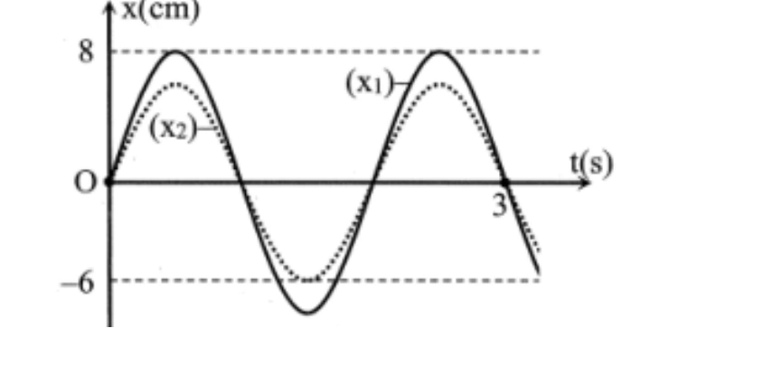{ loading=lazy }

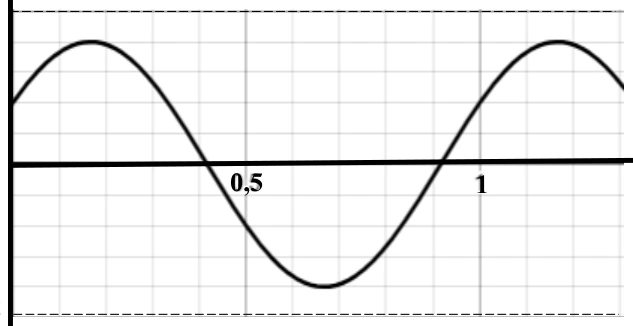{ loading=lazy }

??? success "Đáp án và lời giải"
    **Đáp án:** D
    **Hướng dẫn giải:**

    Dùng $\Delta\varphi=\omega\Delta t=2\pi\Delta t/T$; với bài quãng đường, tách số chu kì nguyên rồi xét phần thời gian còn lại trên đường tròn lượng giác.

    Đối chiếu kết quả với các lựa chọn, phương án phù hợp là **D. 0rad.**
#### Bài 15

<!-- source-id: BT-Chuong-I-p37-q1-83 -->

Khoảng thời gian để vật thực hiện được một dao động gọi là

A. biên độ dao động.

B. chu kì dao động.

C. pha dao động.

D. tần số dao động.

??? success "Đáp án và lời giải"
    **Đáp án:** B
    **Hướng dẫn giải:**

    Dùng $\Delta\varphi=\omega\Delta t=2\pi\Delta t/T$; với bài quãng đường, tách số chu kì nguyên rồi xét phần thời gian còn lại trên đường tròn lượng giác.

    Đối chiếu kết quả với các lựa chọn, phương án phù hợp là **B. chu kì dao động.**
#### Bài 16

<!-- source-id: BT-Chuong-I-p37-q9-90 -->

Biên độ dao động

A. là quãng đường vật đi trong một chu kỳ dao động

B. là quãng đường vật đi được trong nửa chu kỳ dao động

C. là độ dời lớn nhất của vật trong quá trình dao động

D. là độ dài quỹ đạo chuyển động của vật

??? success "Đáp án và lời giải"
    **Đáp án:** C
    **Hướng dẫn giải:**

    Dùng $\Delta\varphi=\omega\Delta t=2\pi\Delta t/T$; với bài quãng đường, tách số chu kì nguyên rồi xét phần thời gian còn lại trên đường tròn lượng giác.

    Đối chiếu kết quả với các lựa chọn, phương án phù hợp là **C. là độ dời lớn nhất của vật trong quá trình dao động**
#### Bài 17

<!-- source-id: BT-Chuong-I-p68-q3-162 -->

Trong dao động điều hoà, li độ biến đổi

A. cùng pha với vận tốc.

B. trễ pha 900 so với vận tốc.

C. vuông pha với gia tốc.

D. cùng pha với gia tốc.

??? success "Đáp án và lời giải"
    **Đáp án:** B
    **Hướng dẫn giải:**

    Dùng $\Delta\varphi=\omega\Delta t=2\pi\Delta t/T$; với bài quãng đường, tách số chu kì nguyên rồi xét phần thời gian còn lại trên đường tròn lượng giác.

    Đối chiếu kết quả với các lựa chọn, phương án phù hợp là **B. trễ pha 900 so với vận tốc.**
#### Bài 18

<!-- source-id: BT-Chuong-I-p68-q4-163 -->

Trong dao động điều hoà, gia tốc biến đổi

A. cùng pha với vận tốc.

B. sớm pha 900 so với vận tốc.

C. ngược pha với vận tốc.

D. trễ pha 900 so với vận tốc.

??? success "Đáp án và lời giải"
    **Đáp án:** B
    **Hướng dẫn giải:**

    Dùng $\Delta\varphi=\omega\Delta t=2\pi\Delta t/T$; với bài quãng đường, tách số chu kì nguyên rồi xét phần thời gian còn lại trên đường tròn lượng giác.

    Đối chiếu kết quả với các lựa chọn, phương án phù hợp là **B. sớm pha 900 so với vận tốc.**
#### Bài 19

<!-- source-id: BT-Chuong-I-p69-q17-176 -->

Phát biểu nào sau đây là sai khi nói về dao động điều hoà?

A. Gia tốc sớm pha π so với li độ.

B. Vận tốc và gia tốc luôn ngược pha nhau.

C. Vận tốc luôn trễ pha 2
π so với gia tốc.

D. Vận tốc luôn sớm pha 2
π so với li độ.

??? success "Đáp án và lời giải"
    **Đáp án:** B
    **Hướng dẫn giải:**

    Dùng $\Delta\varphi=\omega\Delta t=2\pi\Delta t/T$; với bài quãng đường, tách số chu kì nguyên rồi xét phần thời gian còn lại trên đường tròn lượng giác.

    Đối chiếu kết quả với các lựa chọn, phương án phù hợp là **B. Vận tốc và gia tốc luôn ngược pha nhau.**
#### Bài 20

<!-- source-id: BT-Chuong-I-p76-q3-212 -->

Vận tốc của một chất điểm dao động điều hoà biến thiên

A. cùng tần số và ngược pha với li độ.

B. cùng tần số và trễ pha
π
2 so với gia tốc.

C. khác tần số và nhanh pha
π
2 so với li độ.

D. củng tần số và cùng pha với li độ.

??? success "Đáp án và lời giải"
    **Đáp án:** B
    **Hướng dẫn giải:**

    Dùng $\Delta\varphi=\omega\Delta t=2\pi\Delta t/T$; với bài quãng đường, tách số chu kì nguyên rồi xét phần thời gian còn lại trên đường tròn lượng giác.

    Đối chiếu kết quả với các lựa chọn, phương án phù hợp là **B. cùng tần số và trễ pha π 2 so với gia tốc.**
#### Bài 21

<!-- source-id: BT-Chuong-I-p77-q9-218 -->

Hình bên là đồ thị biểu diễn mối quan hệ giữa gia tốc a và vận
tốc v của một vật dao động điểu hòa trên trục Ox. Quãng đường nhỏ
nhất vật đi được trong 2,5 s là

A. 34 cm.

B. 27 cm

C. 45 cm.

D. 20 cm

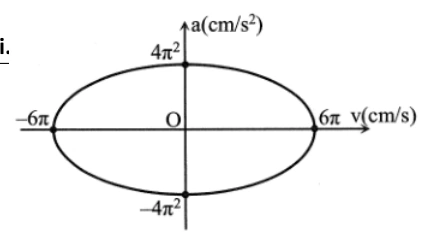{ loading=lazy }

??? success "Đáp án và lời giải"
    **Đáp án:** B
    **Hướng dẫn giải:**

    Dùng $\Delta\varphi=\omega\Delta t=2\pi\Delta t/T$; với bài quãng đường, tách số chu kì nguyên rồi xét phần thời gian còn lại trên đường tròn lượng giác.

    3 (rad/s) và A= 9(cm).

    Đối chiếu kết quả với các lựa chọn, phương án phù hợp là **B. 27 cm**
#### Bài 22

<!-- source-id: BT-Chuong-I-p78-q16-225 -->

Một vật dao động điều hòa với phương trình x = 2cos(2πt +
π
3) (cm). Cho π2 = 10. Kể từ t = 0, sau khi
vật đi được quãng đường 74,5 cm thì vận tốc của vật là?

A. -2π√2 cm/s.

B. 2π√7 cm/s.

C. -2π√7 cm/s.

D. -π√7 cm/s.

??? success "Đáp án và lời giải"
    **Đáp án:** D
    **Hướng dẫn giải:**
    • S= 74,5= 9.4A + 1,25A

    • Sau 9 chu kì, vật được 36A. Vật đi tiếp quãng đường 1,25A cuối như sau:

    Cuối quãng đường vật có: x= -
    3 𝐴
    4 ⊖→𝑣= −𝜔√𝐴2 −𝑥2= -π√7 cm.

### Nhận biết — Đúng/Sai

#### Bài 23

<!-- source-id: BT-Chuong-I-p29-q2-74 -->

Một vật dao động điều hòa có đồ thị li độ phụ thuộc thời gian như hình bên dưới.

Nhận định nào sau đây đúng, nhận định nào sai khi nói về dao động trên?

a) Biên độ dao động của vật là 5 cm
b) Tần số dao động của vật là 1 Hz.
c) Pha ban đầu của dao động là -π rad. 4
d) Quãng đường vật đi được sau 0,6 s là 18 cm.

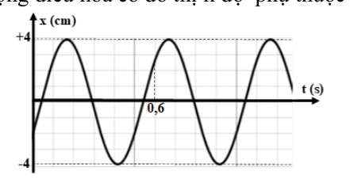{ loading=lazy }

??? success "Đáp án và lời giải"
    **Hướng dẫn giải:**
    Từ đồ thị đọc được $A=4$ cm và $T=0{,}5$ s nên $f=2$ Hz. Tại $t=0$, vật có $x_0=-2$ cm và đồ thị đi lên, tức $v_0>0$.

    a) **Sai.** Biên độ là $4$ cm, không phải $5$ cm.

    b) **Sai.** $f=1/T=2$ Hz, không phải $1$ Hz.

    c) **Sai.** $\cos\varphi_0=x_0/A=-1/2$ và $v_0>0\Rightarrow\sin\varphi_0<0$, nên có thể chọn $\varphi_0=-2\pi/3$ rad; không phải $-\pi/4$ rad.

    d) **Sai.** Sau $0{,}5$ s vật trở lại trạng thái ban đầu và đi $4A=16$ cm. Trong $0{,}1$ s tiếp theo, pha tăng $\Delta\varphi=2\pi(0{,}1/0{,}5)=2\pi/5$; vật vẫn đi theo một chiều nên quãng đường phần này là $|x(0{,}6)-x(0{,}5)|\approx4{,}68$ cm. Tổng quãng đường xấp xỉ $20{,}68$ cm, không phải $18$ cm.

!!! warning "Đối chiếu nguồn"
    Bảng đáp án và phần hướng dẫn của PDF nguồn tại câu c, d không nhất quán với chính đồ thị. Repository ưu tiên dữ kiện đọc từ đồ thị và các hệ thức dao động điều hòa.
#### Bài 24

<!-- source-id: BT-Chuong-I-p30-q4-76 -->

Xét hai vật (1) và (2) dao động điều hoà cùng phương, li độ tương ứng là x1 và x2. Một
phần đồ thị li độ - thời gian của hai vật được cho như hình.
Xét tính đúng sai của các phát biểu sau:

a) Hai dao động có cùng tần số.
b) Hai dao động có cùng biên độ.
c) Chu kì dao động của vật (1) là 1,25 s.
d) Độ lệch pha của hai dao động là π 2 rad.

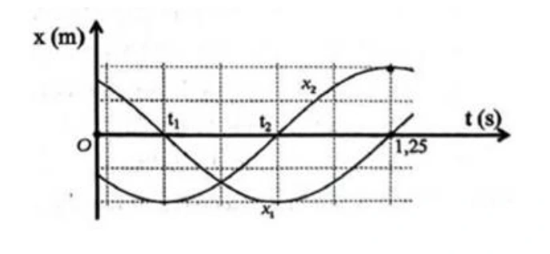{ loading=lazy }

??? success "Đáp án và lời giải"
    **Hướng dẫn giải:**
    Từ đồ thị, ta có:

    a. Khoảng thời gian từ thời điểm ti đến thời điểm 1,25 s là một nửa chu ki dao độr_ của cả vật (1) và

    vật (2). Do đó, hai vật có cùng chu kì dao động nên có cùng tãr sô dao động, =&gt; Đúng.
    b. Hai vật có cùng biên độ (tương ứng 2 ô tính theo trục Ox) nên phát biểu =&gt; Đúng.
    c. Một nửa chu kì của vật (1) tương ứng 4 ô trên trục Ot. Do đó, chu kì dao động cùa vật (1) tương
    ứng 8 ô. Mà từ t = 0 đến t = 1,25 s tương ứng hơn 5 ô trên Ot =&gt; Sai.
    d. Tại thời điểm 1,25 s, vật (1) đi qua vị trí cân bằng theo chiều dương (đồ thị đi lên còn vật (2) đang
    ở vị trí biên dương) . Suy ra hai vật dao động vuông pha, hay độ lệch pha của hai dao động là rad.
    =&gt; Đúng.

#### Bài 25

<!-- source-id: BT-Chuong-I-p51-q3-152 -->

Cho đồ thị li độ theo thời gian của một vật dao động điều hoà như hình vẽ:

Phát biểu
Đúng Sai
a. Biên độ dao động x1 của vật bằng 20 cm.
Đ

b. Chu kì dao động của dao động x2 bằng 0,8 s.
Đ

c. Pha ban đầu của dao động x1 là 0,5π rad.

S
d. Độ lệch pha của hai dao động x1 và x2 là π rad.

S

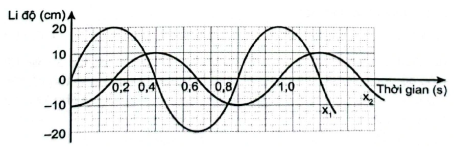{ loading=lazy }

??? success "Đáp án và lời giải"
    **Hướng dẫn giải:**
    a) Biên độ dao động x1 của vật bằng 20 cm =&gt; Đ
    b) Chu kì dao động của dao động x2 bằng 0,8 s =&gt; Đ
    c) Pha ban đầu của dao động x1 là 0,5π rad =&gt; S
    Vì: Pha ban đầu của dao động x1 là - 0,5π rad
    d) Độ lệch pha của hai dao động x1 và x2 là π rad =&gt; S
    Vì: Độ lệch pha của hai dao động x1 và x2 là 0,5 π rad.

#### Bài 26

<!-- source-id: BT-Chuong-I-p52-q4-153 -->

Xét tính đúng/sai của các phát biểu sau về dao động điều hoà:

Phát biểu
Đúng Sai
a. Chu kì là khoảng thời gian để vật thực hiện được một dao động.
Đ

b. Pha ban đầu cho biết tại thời điểm bất kì vật dao động điều hoà ở đâu và sẽ đi
về phía nào.

S
c. Đồ thị của dao động điều hoà là một đường hình sin.
Đ

d. Các đại lượng biên độ, chu kì, tần số và tần số góc là những đại lượng xác
định, không phụ thuộc vào thời điểm quan sát.
Đ
??? success "Đáp án và lời giải"
    **Hướng dẫn giải:**
    a) Chu kì là khoảng thời gian để vật thực hiện được một dao động =&gt; Đ
    b) Pha ban đầu cho biết tại thời điểm bất kì vật dao động điều hoà ở đâu và sẽ đi về phía nào.
    =&gt; S
    Vì: Pha ban đầu cho biết tại thời điểm bắt đầu quan sát, vật dao động điều hoà ở đâu và sẽ đi về
    phía nào.
    c) Đồ thị của dao động điều hoà là một đường hình sin =&gt; Đ
    d) Các đại lượng biên độ, chu kì, tần số và tần số góc là những đại lượng xác định, không phụ
    thuộc vào thời điểm quan sát.=&gt; Đ

#### Bài 27

<!-- source-id: BT-Chuong-I-p75-q6-209 -->

Một vật dao động điều hòa dọc theo trục Ox với phương trình 𝑥= 4 𝑐𝑜𝑠(4𝜋𝑡+
𝜋
3) (cm). Từ thời điểm
ban đầu đến thời điểm 𝑡=
43
12 𝑠, quãng đường vật đi được là bao nhiêu cm?

??? success "Đáp án và lời giải"
    **Đáp án:** $116$
    **Hướng dẫn giải:**

    Dùng $\Delta\varphi=\omega\Delta t=2\pi\Delta t/T$; với bài quãng đường, tách số chu kì nguyên rồi xét phần thời gian còn lại trên đường tròn lượng giác.

    * Cách 1: Xác định Δs dựa vào vòng tròn:
    Tại thời điểm ban đầu
    Trong thời gian 6
    T , góc quét trên vòng tròn:
    → Quét trên vòng tròn, ta thấy vật đến vị trí có li độ
    Do đó: s = 28.4 + 4 = 116 cm .
    * Cách 2: Xác định Δs dựa vào trục thời gian
    T vật đi từ vị trí có li độ
### Thông hiểu — Trắc nghiệm 4 lựa chọn

#### Bài 28

<!-- source-id: BT-Chuong-I-p9-q13-13 -->

Một vật dao động điều hòa với phương trình x = Acos(ωt + φ) . Trong một chu kì, vật đi
được quãng đường là

A. 2A.

B. 1A.

C. 4A.

D. 3A.

??? success "Đáp án và lời giải"
    **Đáp án:** D
    **Hướng dẫn giải:**

    Dùng $\Delta\varphi=\omega\Delta t=2\pi\Delta t/T$; với bài quãng đường, tách số chu kì nguyên rồi xét phần thời gian còn lại trên đường tròn lượng giác.

    Đối chiếu kết quả với các lựa chọn, phương án phù hợp là **D. 3A.**
#### Bài 29

<!-- source-id: BT-Chuong-I-p13-q32-32 -->

Đồ thi biễu diễn hai dao động điều hoà cùng phương
như hình vẽ. Độ lệch pha của hai dao động này là

A. 0.

B. π

C. 2π.

D. π/2.

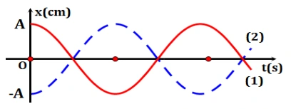{ loading=lazy }

??? success "Đáp án và lời giải"
    **Đáp án:** B
    **Hướng dẫn giải:**

    Dùng $\Delta\varphi=\omega\Delta t=2\pi\Delta t/T$; với bài quãng đường, tách số chu kì nguyên rồi xét phần thời gian còn lại trên đường tròn lượng giác.

    Đối chiếu kết quả với các lựa chọn, phương án phù hợp là **B. π**
#### Bài 30

<!-- source-id: BT-Chuong-I-p13-q33-33 -->

Hai vật dao động đều hòa có li độ được
biểu diễn trên đồ thi li độ - thời gian như hình bên.
Nhận định nào sau đây là đúng?

A. (1) dao động cùng pha với (2).

B. (1) dao động sớm pha so với (2) là π.
2

C. (1) dao động trễ pha so với (2) là π.
2

D. (1) dao động ngược pha so với (2).

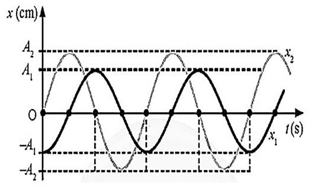{ loading=lazy }

??? success "Đáp án và lời giải"
    **Đáp án:** B
    **Hướng dẫn giải:**
    Dựa vào đồ thị ta thấy khi (1) cực tiểu thì (2) cực đại =&gt; (1) vuông pha (2)
    Trên đồ thị ta thấy tại vị trí cùng trạng thái (1) nhanh pha hơn (2)

#### Bài 31

<!-- source-id: BT-Chuong-I-p14-q34-34 -->

Đồ thị li độ theo thời gian x1; x2 của hai
chất điểm dao động điều hoà được mô tả như bên.
Độ lệch pha (rad) giữa hai dao động là

A. 3π .
4

B. π.
4

C. π.
2

D. 3π .
2

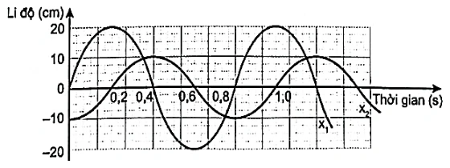{ loading=lazy }

??? success "Đáp án và lời giải"
    **Đáp án:** C
    **Hướng dẫn giải:**

    Dùng $\Delta\varphi=\omega\Delta t=2\pi\Delta t/T$; với bài quãng đường, tách số chu kì nguyên rồi xét phần thời gian còn lại trên đường tròn lượng giác.

    Cách 1: Dựa vào đồ thị ta xác định được:
    Cách 2: Dựa vào đồ thị ta xác định được:

    Đối chiếu kết quả với các lựa chọn, phương án phù hợp là **C. π. 2**
#### Bài 32

<!-- source-id: BT-Chuong-I-p14-q35-35 -->

Độ lệch pha (rad) của hai dao động được biểu diễn trong đồ thị li độ - thời gian như hình là

A. π
4
.

C. 3π
4

B. π
2

D. 2π
3

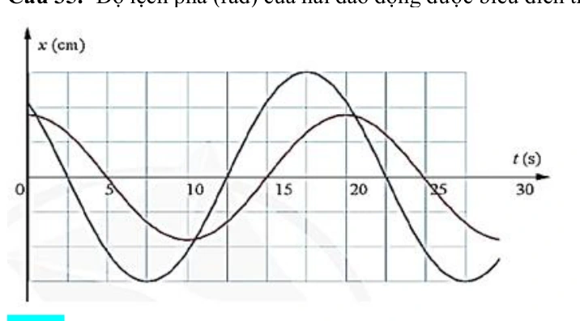{ loading=lazy }

??? success "Đáp án và lời giải"
    **Đáp án:** A
    **Hướng dẫn giải:**

    Dùng $\Delta\varphi=\omega\Delta t=2\pi\Delta t/T$; với bài quãng đường, tách số chu kì nguyên rồi xét phần thời gian còn lại trên đường tròn lượng giác.

    Dựa vào đồ thị ta có:

    Đối chiếu kết quả với các lựa chọn, phương án phù hợp là **A. π 4 .**
### Vận dụng — Trả lời ngắn

#### Bài 33

<!-- source-id: BT-Chuong-I-p22-q3-49 -->

Một vật nhỏ dao động điều hòa trên đoạn thẳng quỹ đạo dài 30 cm. Quãng đường ngắn nhất
vật đi được trong 0,5 s là 15 cm. Tốc độ trung bình của vật trong một chu kì là bao nhiêu milimet/giây?

??? success "Đáp án và lời giải"
    **Đáp án:** 400 mm/s
    **Hướng dẫn giải:**

    Dùng $\Delta\varphi=\omega\Delta t=2\pi\Delta t/T$; với bài quãng đường, tách số chu kì nguyên rồi xét phần thời gian còn lại trên đường tròn lượng giác.

    Vậy kết quả cần tìm là **400 mm/s**.
### Vận dụng — Trắc nghiệm 4 lựa chọn

#### Bài 34

<!-- source-id: BT-Chuong-I-p15-q37-37 -->

Một chất điểm dao động điều hoà trên trục Ox. Đồ thị li độ -
thời gian (x -t) của vật được cho như hình bên. Tại thời điểm 17,25 s
quãng đường vật đi được bằng

A. 685,0 cm.

B. 678,1 cm

C. 688,7 cm.

D. 687,1 cm

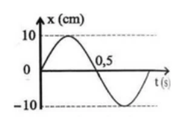{ loading=lazy }

??? success "Đáp án và lời giải"
    **Đáp án:** D. $687{,}1$ cm.

    **Hướng dẫn giải:**
    Từ đồ thị: $A=10$ cm và $T=1$ s. Tại $t=0$, vật ở vị trí cân bằng và chuyển động theo chiều dương.

    Ta tách $17{,}25\,\text{s}=17T+T/4$. Trong $17T$, vật đi được
    $S_1=17\cdot4A=680$ cm.

    Trong $T/4$ tiếp theo, vật đi từ vị trí cân bằng đến $x=A/\sqrt2$, nên
    $S_2=A/\sqrt2\approx7{,}1$ cm.

    Suy ra $S=S_1+S_2\approx680+7{,}1=687{,}1$ cm. Vậy chọn **D**.
#### Bài 35

<!-- source-id: BT-Chuong-I-p26-q1-55 -->

Chu kỳ dao động là

A. thời gian vật thực hiện một dao động toàn phần.

B. thời gian ngắn nhất để vật trở về vị trí xuất phát.

C. thời gian ngắn nhất để biên độ dao động trở về giá trị ban đầu.

D. thời gian ngắn nhất để li độ dao động trở về giá trị ban đầu.

??? success "Đáp án và lời giải"
    **Đáp án:** A.

    **Hướng dẫn giải:**
    Chu kì $T$ là **khoảng thời gian để vật thực hiện một dao động toàn phần**, tức trở lại đúng trạng thái ban đầu gồm cả vị trí và chiều chuyển động. Vậy chọn **A**.
#### Bài 36

<!-- source-id: BT-Chuong-I-p41-q39-120 -->

Độ lệch pha của hai dao động là

A. 0,5π rad.

B. 0,75π rad.

C. 0,25π rad.

D. π rad.

??? success "Đáp án và lời giải"
    **Đáp án:** A
    **Hướng dẫn giải:**

    Dùng $\Delta\varphi=\omega\Delta t=2\pi\Delta t/T$; với bài quãng đường, tách số chu kì nguyên rồi xét phần thời gian còn lại trên đường tròn lượng giác.

    Từ đồ thị ta thấy : độ lệch pha của 2 dao động là 2 ô ứng với T/4 chu kì

    Đối chiếu kết quả với các lựa chọn, phương án phù hợp là **A. 0,5π rad.**
#### Bài 37

<!-- source-id: BT-Chuong-I-p71-q34-193 -->

Một chất điểm chuyển động tròn đều trên một đường tròn với tốc độ dài 160 cm/s và tốc độ góc 4
rad/s. Hình chiếu P của chất điểm M trên một đường thẳng cố định nằm trong mặt phẳng hình tròn dao động
điều hoà với biên độ và chu kì lần lượt là

A. 40 cm, 0,25s.

B. 40 cm, 1,57 s.

C. 40 m, 0,25s.

D. 2,5 m, 0,25 s.
??? success "Đáp án và lời giải"
    **Đáp án:** B. $40$ cm; $1{,}57$ s.

    **Hướng dẫn giải:**
    Hình chiếu của chuyển động tròn đều có biên độ bằng bán kính quỹ đạo tròn. Ta có
    $A=R=v/\omega=160/4=40$ cm.

    Chu kì dao động là
    $T=2\pi/\omega=2\pi/4=\pi/2\approx1{,}57$ s.

    Vậy chọn **B**.
### Vận dụng — Đúng/Sai

#### Bài 38

<!-- source-id: BT-Chuong-I-p17-q1-41 -->

Phương trình dao động của một vật dao động điều hoà có dạng
cos(
)
3
x
A
t
π
ω
=
−
cm.
Nội dung
Đúng Sai
a. Pha ban đầu vật là π/3.

S
b. Ở thời điểm ban đầu vật có li độ x =
2
2
A

S
c. Gốc thời gian là lúc vật đi theo chiều dương
Đ

d. Quãng đường vật đi được sau n dao động là n.4A
Đ

??? success "Đáp án và lời giải"
    **Hướng dẫn giải:**
    Với $x=A\cos(\omega t-\pi/3)$, pha ban đầu là $\varphi=-\pi/3$.

    a) **Sai.** Pha ban đầu là $-\pi/3$, không phải $+\pi/3$.

    b) **Sai.** Tại $t=0$: $x_0=A\cos(-\pi/3)=A/2$, không phải $A\sqrt2/2$.

    c) **Đúng.** $v_0=-\omega A\sin(-\pi/3)>0$, nên lúc chọn gốc thời gian vật chuyển động theo chiều dương.

    d) **Đúng.** Trong một dao động toàn phần vật đi quãng đường $4A$; sau $n$ dao động, $S=4nA$.
#### Bài 39

<!-- source-id: BT-Chuong-I-p17-q2-42 -->

Một vật nhỏ dao động có đồ thị giữa li độ và thời gian như hình . Nhận định nào đúng, nhận
định nào sai?

Nội dung
Đúng Sai
a. Tần số dao động của vật là 1,5 Hz

S

b. Chiều dài quỹ đạo dao động của vật là 4 cm.
Đ

c. Ở thời điểm 11s
6
 vật chuyển động qua vị trí x = -2 theo chiều âm.

S
d. Tốc độ trung bình khi vật đi được quãng đường 13 cm là 8,21 cm/s.
Đ

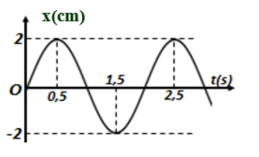{ loading=lazy }

??? success "Đáp án và lời giải"
    **Hướng dẫn giải:**
    Từ đồ thị: $A=2$ cm, hai đỉnh liên tiếp cách nhau $2$ s nên $T=2$ s, $f=0{,}5$ Hz và $\omega=\pi$ rad/s. Tại $t=0$, $x=0$ và vật đi theo chiều dương nên có thể viết $x=2\cos(\pi t-\pi/2)$ (cm).

    a) **Sai.** $f=1/T=0{,}5$ Hz, không phải $1{,}5$ Hz.

    b) **Đúng.** Chiều dài quỹ đạo là $L=2A=4$ cm.

    c) **Sai.** Tại $t=11/6$ s: $x=-1$ cm và $v>0$, nên vật không đi qua $x=-2$ cm theo chiều âm.

    d) **Đúng sau khi hiệu chỉnh đơn vị và giá trị của phát biểu.** Với $S=13$ cm $=4A+2A+A/2$, thời gian tương ứng là $t=T+T/2+T/12=19/12$ s. Do đó
    $v_{\rm tb}=S/t=13/(19/12)\approx8{,}21$ cm/s.

!!! warning "Đối chiếu nguồn"
    PDF nguồn in câu d dưới dạng “tốc độ trung bình ... là 19,5 s”, vừa sai thứ nguyên vừa không khớp với chính phần hướng dẫn. Phần hướng dẫn của nguồn tính $t=19/12$ s và $v_{\rm tb}\approx8{,}21$ cm/s; repository dùng kết quả nhất quán này.
#### Bài 40

<!-- source-id: BT-Chuong-I-p19-q4-44 -->

Cho đồ thị li độ - thời gian của một vật dao động điều hòa như hình. Nhận định nào đúng,
nhận định nào sai?

Nội dung
Đúng Sai
a. Biên độ dao động của vật là 5 cm
Đ

b. Pha dao động ban đầu là 2 rad
π

S
c. Trạng thái chuyển động của vật khi đi qua VTCB là thứ 2 kể từ lúc bắt đầu dao
động là 5
2 rad
π

Đ

d. Thời điểm vật đi được quãng đường 37,5 cm là 19,5 s.

S

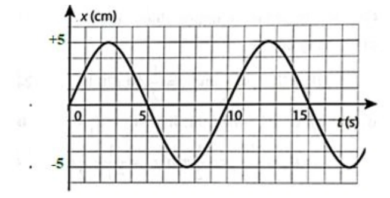{ loading=lazy }

??? success "Đáp án và lời giải"
    **Hướng dẫn giải:**
    Từ đồ thị xác định được $A=5$ cm, $T=10$ s. Tại $t=0$, vật đi qua vị trí cân bằng theo chiều dương nên có thể chọn pha ban đầu $\varphi_0=-\pi/2$.

    a) **Đúng.** Biên độ đọc trực tiếp từ đồ thị là $A=5$ cm.

    b) **Sai.** Pha ban đầu là $-\pi/2$ rad, không phải $+\pi/2$ rad.

    c) **Sai.** Hai lần đi qua vị trí cân bằng sau thời điểm bắt đầu tương ứng với pha $\pi/2$ và $3\pi/2\equiv-\pi/2\pmod{2\pi}$. Vì vậy $5\pi/2\equiv\pi/2$ không phải trạng thái ở lần thứ hai.

    d) **Sai.** Một chu kì vật đi $4A=20$ cm. Ta có $37{,}5=4A+3A+A/2$, nên
    $t=T+3T/4+T/6=19{,}2$ s, không phải $19{,}5$ s.

!!! warning "Đối chiếu nguồn"
    Ở câu c, bảng Đúng/Sai trong PDF đánh dấu “Đúng” cho $5\pi/2$, nhưng phần hướng dẫn của chính PDF cho trạng thái $-\pi/2$ rad. Hai giá trị này không tương đương theo modulo $2\pi$; kết quả vật lí đúng là **Sai**.
