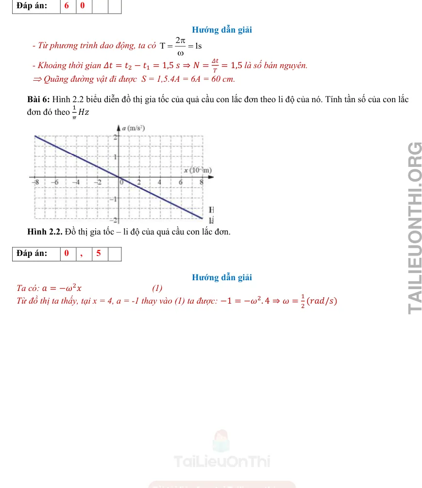

# Đáp án và lời giải — Bài 3 — Đường tròn lượng giác, thời gian và quãng đường

> Câu nền tảng được giải vừa đủ để kiểm tra cách làm. Câu vận dụng được trình bày chi tiết hơn để người học thấy được đường suy luận, điều kiện dùng công thức và bước kiểm tra kết quả.

[← Bài tập](exercises.md)

## Câu 1

Chọn **C**. Từ biên đến vị trí cân bằng tương ứng góc quét $\pi/2$, bằng một phần tư chu kì.

## Câu 2

Chọn **B**. Mỗi li độ nằm giữa hai biên được vật đi qua hai lần trong một chu kì, một lần theo mỗi chiều.

## Câu 3

Chọn **B**. Trong mọi khoảng thời gian dài $T/2$, vật đi từ một trạng thái đến trạng thái đối pha và tổng quãng đường bằng $2A$.

## Câu 4

Chọn **C**. $x/A=\cos\Delta\varphi=1/2$ nên $\Delta\varphi=\pi/3$. Do $T$ ứng với $2\pi$, thời gian là $T/6$.

## Câu 5

a) **Đúng**.  
b) **Đúng**.  
c) **Đúng**.  
d) **Sai**. Quãng đường trong $T/4$ phụ thuộc pha ban đầu; chỉ một số đoạn đặc biệt mới bằng $A$.

## Câu 6

a) **Đúng**.  
b) **Đúng**.  
c) **Sai**: cùng li độ có thể đi theo hai chiều trái nhau.  
d) **Đúng**, với $\Delta t=\Delta\varphi/\omega$.

## Câu 7

Từ biên dương, $x/A=-1/2$ ứng với góc quét nhỏ nhất $2\pi/3$. Do đó $\Delta t=(2\pi/3)/(2\pi/T)=T/3=0,4$ s.

## Câu 8

$2,4$ s $=3T$. Mỗi chu kì vật đi $4A=24$ cm. Vậy quãng đường là $3\cdot24=72$ cm.

## Câu 9

Ở $x=-A/2$ theo chiều dương, pha có thể chọn $4\pi/3$; ở $x=A/2$ theo chiều dương, trạng thái kế tiếp có pha $5\pi/3$. Chênh pha $\pi/3$, nên $\Delta t=T/6$.

## Câu 10

Chọn pha ban đầu $\Phi_0=5\pi/3$ vì $\cos\Phi_0=1/2$ và $v=-A\omega\sin\Phi_0>0$.

Các trạng thái $x=-A/2$ có pha $2\pi/3+2k\pi$ hoặc $4\pi/3+2k\pi$.

Sau $5\pi/3$, lần thứ nhất là $2\pi/3+2\pi=8\pi/3$; lần thứ hai là $4\pi/3+2\pi=10\pi/3$.

Chênh pha đến lần thứ hai: $10\pi/3-5\pi/3=5\pi/3$.

Vì $2\pi$ ứng với $T$, $\Delta t=(5/6)T=1,0$ s.

---

[← Bài tập](exercises.md)

## Đáp án và lời giải — Ngân hàng PDF mở rộng

> Câu có lời giải trong tài liệu được giữ phần hướng dẫn. Câu trắc nghiệm không kèm lời giải dài chỉ hiện đáp án đã đối chiếu từ dấu đáp án/khóa đáp án của tài liệu.

### Nhận biết — Trả lời ngắn

#### Bài PDF 1

Hướng dẫn giải
S = 117 cm = 4.4A +3,5A
Kể từ t = 2,8 s:
2
5
3
3
2
s
A
x
π
π
φ
+
=
−
→
=
, sau 4T vật đi được 16A và quay lại trạng thái tại t. Diễn
biến dao động đi quãng đường 3,5A cuối cùng:

Khoảng thời gian cần tìm là:
11
4
11,8
12
T
t
T
s
Δ=
+
=

CHƯƠNG I - DAO ĐỘNG
Chủ đề 2 :  MÔ TẢ DAO ĐỘNG ĐIỀU HOÀ
• Yêu cầu cần đạt (Trích từ CTGDPT Vật lí 2018):
- Dùng đồ thị li độ - thời gian có dạng hình sin (tạo ra bằng thí nghiệm hoặc hình vẽ cho trước), nêu được
định nghĩa: biên độ, chu kì, tần số, tần số góc, độ lệch pha.
- Vận dụng được các khái niệm: biên độ, chu kì, tần số, tần số góc, độ lệch pha để mô tả dao động điều
hoà.
• Cấu trúc nội dung:
I. TÓM TẮT LÝ THUYẾT …………………………………………………………………
Lý thuyết chung của chủ đề  + Phương pháp giải kèm ví dụ.
II. BÀI TẬP PHÂN DẠNG THEO MỨC ĐỘ………………………………………………..
 (Theo cấu trúc định dạng đề thi kỳ thi tốt nghiệp trung học phổ thông từ năm 2025 – Quyết định số
764/QĐ - BGDĐT)
1. Câu trắc nhiệm nhiều phương án lựa chọn
2. Câu trắc nghiệm đúng sai:
3. Câu trắc nghiệm trả lời  ngắn :

#### Bài PDF 2

**Đáp án:** 1

Đáp án:
1
,
5

Hướng dẫn giải
Vì nhịp tim của bạn học sinh là 90 nhịp mỗi phút nên tần số đập của tim bạn học sinh là:
𝑓= 90
60 = 1,5 𝐻𝑧.

#### Bài PDF 3

**Đáp án:** 6

{ loading=lazy }

### Nhận biết — Trắc nghiệm 4 lựa chọn

#### Bài PDF 4

**Đáp án:** D

Đây là câu trắc nghiệm có đáp án được xác định từ khóa đáp án của tài liệu; không có lời giải dài kèm theo trong phần nguồn tương ứng.

#### Bài PDF 5

**Đáp án:** B

Đây là câu trắc nghiệm có đáp án được xác định từ khóa đáp án của tài liệu; không có lời giải dài kèm theo trong phần nguồn tương ứng.

#### Bài PDF 6

**Đáp án:** C

Đây là câu trắc nghiệm có đáp án được xác định từ khóa đáp án của tài liệu; không có lời giải dài kèm theo trong phần nguồn tương ứng.

#### Bài PDF 7

**Đáp án:** B

Đây là câu trắc nghiệm có đáp án được xác định từ khóa đáp án của tài liệu; không có lời giải dài kèm theo trong phần nguồn tương ứng.

#### Bài PDF 8

**Đáp án:** B

Đây là câu trắc nghiệm có đáp án được xác định từ khóa đáp án của tài liệu; không có lời giải dài kèm theo trong phần nguồn tương ứng.

#### Bài PDF 9

**Đáp án:** B

Đây là câu trắc nghiệm có đáp án được xác định từ khóa đáp án của tài liệu; không có lời giải dài kèm theo trong phần nguồn tương ứng.

#### Bài PDF 10

**Đáp án:** B

Đây là câu trắc nghiệm có đáp án được xác định từ khóa đáp án của tài liệu; không có lời giải dài kèm theo trong phần nguồn tương ứng.

#### Bài PDF 11

**Đáp án:** B

Hướng dẫn giải
• vmax= 6π (cm/s), 𝑎𝑚𝑎𝑥= 4𝜋2 cm/s2→𝜔=
2𝜋
3  (rad/s) và A= 9(cm).

• Δt= 2,5s=
5 𝑇
6 =
𝑇
2 +
𝑇
3→Smin= 2A + 2A(1 −𝑐𝑜𝑠
𝜋
3)= 3A=27cm.

#### Bài PDF 12

**Đáp án:** D

Hướng dẫn giải
• S= 74,5= 9.4A + 1,25A

• Sau 9 chu kì, vật được 36A. Vật đi tiếp quãng đường 1,25A cuối như sau:

Cuối quãng đường vật có: x= -
3 𝐴
4 ⊖→𝑣= −𝜔√𝐴2 −𝑥2= -π√7 cm.

### Nhận biết — Đúng/Sai

#### Bài PDF 13

Hướng dẫn giải
a. Biên độ dao động của vật là 4 cm
b. Tần số dao động của vật:
Dựa vào đồ thị 6 ô = 0,6 s =&gt; 1ô = 0,1 s. Suy ra T = 5 ô = 0,5 s
Do đó f = 1/T = 2 Hz
c.
2
cos
0
3
0
3
0
0
x
x
t
A
v
v
v
π
ϕ
ϕ
π
ϕ


= −
= ±
=

−


=
=
=
=
=
=












d. Quãng đường vật đi được sau 0,6 s:
2

 4
4.4
4.cos
.0,1 18
0,6
S
A
S
cm
π
=
+ Δ=
+
=

#### Bài PDF 14

Hướng dẫn giải
Từ đồ thị, ta có:

a. Khoảng thời gian từ thời điểm ti đến thời điểm 1,25 s là một nửa chu ki dao độr_ của cả vật (1) và

vật (2). Do đó, hai vật có cùng chu kì dao động nên có cùng tãr sô dao động, =&gt; Đúng.
b. Hai vật có cùng biên độ (tương ứng 2 ô tính theo trục Ox) nên phát biểu =&gt; Đúng.
c. Một nửa chu kì của vật (1) tương ứng 4 ô trên trục Ot. Do đó, chu kì dao động cùa vật (1) tương
ứng 8 ô. Mà từ t = 0 đến t = 1,25 s tương ứng hơn 5 ô trên Ot =&gt; Sai.
d. Tại thời điểm 1,25 s, vật (1) đi qua vị trí cân bằng theo chiều dương (đồ thị đi lên còn vật (2) đang
ở vị trí biên dương) . Suy ra hai vật dao động vuông pha, hay độ lệch pha của hai dao động là rad.
=&gt; Đúng.

#### Bài PDF 15

Hướng dẫn giải
a) Biên độ dao động  x1 của vật bằng 20 cm =&gt; Đ
b) Chu kì dao động của dao động  x2 bằng 0,8 s =&gt; Đ
c) Pha ban đầu của dao động  x1 là 0,5π rad =&gt; S
Vì: Pha ban đầu của dao động x1 là - 0,5π rad
d) Độ lệch pha của hai dao động  x1 và x2 là π rad =&gt; S
Vì: Độ lệch pha của hai dao động  x1 và x2 là 0,5 π rad.

#### Bài PDF 16

Hướng dẫn giải
a) Chu kì là khoảng thời gian để vật thực hiện được một dao động =&gt; Đ
b) Pha ban đầu cho biết tại thời điểm bất kì vật dao động điều hoà ở đâu và sẽ đi về phía nào.
=&gt; S
Vì: Pha ban đầu cho biết tại thời điểm bắt đầu quan sát, vật dao động điều hoà ở đâu và sẽ đi về
phía nào.
c) Đồ thị của dao động điều hoà là một đường hình sin =&gt; Đ
d) Các đại lượng biên độ, chu kì, tần số và tần số góc là những đại lượng xác định, không phụ
thuộc vào thời điểm quan sát.=&gt; Đ

#### Bài PDF 17

**Đáp án:** 1

Đáp án:
1
1
6

Hướng dẫn giải

Ta có:
2
0,5
T
s
π
ω
=
=
. Mặt khác
43
1
7
7
.
6
6
6
t
T
t
T
T
Δ=
=
+
Δ=
+

Do đó:
7.4
s
A
s
=
+Δ
* Cách 1: Xác định Δs dựa vào vòng tròn:

Tại thời điểm ban đầu
2
3
x
cm
π
ϕ=

=

Trong thời gian 6
T , góc quét trên vòng tròn:
2
. 6
3
T
t
T
π
π
α
ω
=
=
=

→ Quét trên vòng tròn, ta thấy vật đến vị trí có li độ
2
4
x
s
cm
= −Δ=
.

Do đó: s = 28.4 + 4 = 116 cm .
* Cách 2: Xác định Δs dựa vào trục thời gian

Tại thời điểm ban đầu
2
0
3
x
cm
v
π
ϕ
=

=


.

Trong thời gian 6
T  vật đi từ vị trí có li độ
2
2
4
x
x
s
cm
=
→
= −Δ=
.
Do đó: s = 28.4 + 4 = 116 cm .

### Thông hiểu — Trắc nghiệm 4 lựa chọn

#### Bài PDF 18

**Đáp án:** D

Đây là câu trắc nghiệm có đáp án được xác định từ khóa đáp án của tài liệu; không có lời giải dài kèm theo trong phần nguồn tương ứng.

#### Bài PDF 19

**Đáp án:** B

Đây là câu trắc nghiệm có đáp án được xác định từ khóa đáp án của tài liệu; không có lời giải dài kèm theo trong phần nguồn tương ứng.

#### Bài PDF 20

**Đáp án:** B

Hướng dẫn giải

Dựa vào đồ thị ta thấy khi (1) cực tiểu  thì (2) cực đại =&gt; (1) vuông pha (2)
Trên đồ thị ta thấy tại vị trí cùng trạng thái (1) nhanh pha hơn (2)

#### Bài PDF 21

**Đáp án:** C

Hướng dẫn giải
Cách 1: Dựa vào đồ thị ta xác định được:
1
2
0:
;
2
t
π
ϕ
ϕ
π
−
=
=
= −

1
2
(
)
2
2
π
π
ϕ
ϕ
ϕ
π
−
Δ
=
−
=
−−
=

Cách 2: Dựa vào đồ thị ta xác định được:
0,2 ;
0,8
t
s T
s
Δ=
=

2
.
.
2
t
t
rad
T
π
π
ϕ
ω
Δ
=
Δ=
Δ=

#### Bài PDF 22

**Đáp án:** A

Hướng dẫn giải
Dựa vào đồ thị ta có:
4
20
5,2
.
2
2
π
π
π
ϕ
=
=
Δ
=
Δ
T
t
rad

#### Bài PDF 23

**Đáp án:** B

Hướng dẫn giải
Trong dao động điều hoà, gia tốc biến đổi sớm pha 900 so với vận tốc.

### Vận dụng — Trả lời ngắn

#### Bài PDF 24

Hướng dẫn giải
Smin(∆t) = 2A(1 −𝑐𝑜𝑠
𝜋∆𝑡
𝑇)
𝑆𝑚𝑖𝑛=15
2𝐴=30
→        ∆𝑡=
𝑇
3 → T = 1,5 s → vtb(T) =
4𝐴
𝑇 = 40 cm/s. = 400 mm/s

### Vận dụng — Trắc nghiệm 4 lựa chọn

#### Bài PDF 25

**Đáp án:** D

Hướng dẫn giải
Dựa vào đồ thị ta xác định được: T/2 = 0,5 s =&gt; T = 1 s; A = 10 cm
t = 0:
0
0
2
x
v
π
ϕ
=

−
=
=



Ta có: t = 17,25 s = 17T + T/4 =&gt; S = 17.4A +
2 A
2
= 687,1 cm

#### Bài PDF 26

**Đáp án:** A

Đây là câu trắc nghiệm có đáp án được xác định từ khóa đáp án của tài liệu; không có lời giải dài kèm theo trong phần nguồn tương ứng.

#### Bài PDF 27

**Đáp án:** A

Hướng dẫn giải
Từ đồ thị ta thấy : độ lệch pha của 2 dao động là 2 ô ứng với T/4 chu kì
∆𝜑= 2𝜋. ∆𝑡
𝑇
= 2𝜋. 𝑇/4
𝑇
= 𝜋
2

#### Bài PDF 28

**Đáp án:** C

Đây là câu trắc nghiệm có đáp án được xác định từ khóa đáp án của tài liệu; không có lời giải dài kèm theo trong phần nguồn tương ứng.

### Vận dụng — Đúng/Sai

#### Bài PDF 29

Hướng dẫn giải
a. Từ
cos(
)
3
x
A
t
π
ω
=
−
suy ra pha ban đầu
(
)
3 rad
π
ϕ= −

b. Tại t = 0 :
cos(
)
3
2
A
x
A
π
=
−
=

c. Vì
0
3
π
ϕ= −
   nên ban đầu vật hướng về phía biên dương do đó vật đi theo chiều dương
d. Quãng đường vật đi được trong 1 dao động là 4A nên quãng đường vật đi được trong n dao động
là 4A.n

#### Bài PDF 30

Hướng dẫn giải
a. Dựa vào đồ thị xác định được:
1
2
0,5
T
s
f
Hz
T
=
=
=
=

b. A = 2cm =&gt; Chiều dài quỹ đạo dao động của vật là L = 2A= 4 cm.
c. Ta có:
2
 rad/s
f
ω
π
π
=
=

0
cos
0:
2
0
2
0
0
x
x
t
rad
A
v
v
v
π
ϕ
π
ϕ


=
=
±

−


=
=
=
=
=












=&gt;
2cos
2
11
11
2cos
.
1
6
6
2
x
t
cm
t
s
x
cm
π
π
π
π


=
−






=
=
=
−
= −





11
3
6
4
6
T
T
t
s
=
=
+
. Dựa vào vòng tròn lượng giác=&gt; v&gt;0
Ở thời điểm 11s
6
 vật chuyển động qua vị trí x = -1 theo chiều dương.
d.
4
8
13
4
2
2
T
A
S
A
cm
S
cm
A
A
=
=
=
=
=
+
+

19
2
12
12
8,21cm/s
T
T
t
T
s
S
v
t
=
+
+
=
=
=
=

#### Bài PDF 31

Hướng dẫn giải
a. Biên độ dao động của vật là A = 5 cm
b. Dựa vào đồ thị ta có:
0
cos
0:
2
0
2
0
0
x
x
t
rad
A
v
v
v
π
ϕ
π
ϕ


=
=
±

−


=
=
=
=
=












c. Dựa vào đồ thị xác định được trạng thái chuyển động của vật khi đi qua VTCB là thứ 2 kể từ lúc
bắt đầu dao động là  2 rad
π
−

a. Độ dịch chuyển của vật ở thời điểm 0,1 s là x = -2 cm
Đ

b. Quãng đường vật đi được sau 0,6s là 10cm.

S
c. Tại thời điểm t = 0,5s vật đi qua li độ x = -2 cm.
Đ

d. Tại thời điểm ban đầu, vật ở biên độ dương.

S

d. 1T vật đi được quãng đường S = 4A = 20 cm; T = 10s
Do đó: 37,5 = 4A+3A+A/2 =&gt;
3
4
T
t
T
t
=
+
+ Δ
Dựa vào đường tròn lượng giác xác định:
6
T
t
Δ=

Thời điểm vật đi được quãng đường 37,5 cm là
3
4
6
T
T
t
T
=
+
+
= 19,2 s.

