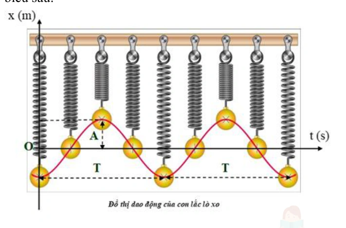

# Bài tập — Bài 4 — Con lắc lò xo

> Hệ bài tập được biên soạn theo các dạng xuất hiện trong bộ tài liệu Vật lí 11 của dự án. Câu hỏi được giữ ngắn, trực tiếp; độ khó tăng dần và không cố tình thêm dữ kiện gây nhiễu.

[← Trở lại bài học](../../04-spring-oscillator.md)

## Phần A — Trắc nghiệm 4 lựa chọn

### Bài 1 — Mức 1 — Nhận biết

Con lắc lò xo có $m=0,20$ kg, $k=80$ N/m. Tần số góc bằng

A. $10$ rad/s.
B. $20$ rad/s.
C. $40$ rad/s.
D. $400$ rad/s.

??? success "Đáp án và lời giải"
    Chọn **B**. $\omega=\sqrt{k/m}=\sqrt{80/0,20}=20$ rad/s.

### Bài 2 — Mức 2 — Phát hiện sai sót

Con lắc lò xo treo thẳng đứng có độ dãn cân bằng $\Delta\ell_0=4$ cm tại nơi $g=10$ m/s². Tần số góc bằng

A. $5\sqrt{10}$ rad/s.
B. $10$ rad/s.
C. $15$ rad/s.
D. $20$ rad/s.

??? success "Đáp án và lời giải"
    Chọn **A**. $\omega=\sqrt{g/\Delta\ell_0}=\sqrt{10/0,04}=5\sqrt{10}\approx15,81$ rad/s.

### Bài 3 — Mức 1 — Nhận biết

Một lò xo có độ cứng $k=60$ N/m. Cắt lò xo thành ba phần bằng nhau. Độ cứng của mỗi phần bằng

A. $20$ N/m.
B. $60$ N/m.
C. $120$ N/m.
D. $180$ N/m.

??? success "Đáp án và lời giải"
    Chọn **D**. Với lò xo đều, $k$ tỉ lệ nghịch chiều dài. Đoạn dài bằng $1/3$ ban đầu nên độ cứng gấp 3: $k'=180$ N/m.

### Bài 4 — Mức 1 — Nhận biết

Hai lò xo có $k_1=60$ N/m và $k_2=30$ N/m ghép nối tiếp. Độ cứng tương đương là

A. $20$ N/m.
B. $30$ N/m.
C. $45$ N/m.
D. $90$ N/m.

??? success "Đáp án và lời giải"
    Chọn **A**. $k_{nt}=k_1k_2/(k_1+k_2)=60\cdot30/90=20$ N/m.

## Phần B — Đúng/Sai

### Bài 5 — Mức 2 — Thông hiểu

Con lắc lò xo treo thẳng đứng dao động quanh vị trí cân bằng. Xét các phát biểu:

a) Ở vị trí cân bằng, lực đàn hồi luôn bằng trọng lực.
b) Độ dãn cân bằng thỏa $k\Delta\ell_0=mg$.
c) Nếu $A>\Delta\ell_0$, trong một phần chu kì lò xo bị nén.
d) Chu kì phụ thuộc biên độ nếu lò xo lí tưởng và dao động nhỏ quanh cân bằng.

??? success "Đáp án và lời giải"
    a) **Đúng** về vị trí cân bằng tĩnh.
    b) **Đúng**.
    c) **Đúng**: li độ lên trên đủ lớn làm chiều dài nhỏ hơn chiều dài tự nhiên.
    d) **Sai**: $T=2\pi\sqrt{m/k}$ không phụ thuộc biên độ trong mô hình lí tưởng.

### Bài 6 — Mức 2 — Thông hiểu

Con lắc lò xo nằm ngang lí tưởng:

a) Lực kéo về là $F=-kx$.
b) Tốc độ cực đại ở hai biên.
c) Gia tốc cực đại về độ lớn ở hai biên.
d) Tăng khối lượng vật thì chu kì tăng.

??? success "Đáp án và lời giải"
    a) **Đúng**.
    b) **Sai**: tốc độ cực đại ở vị trí cân bằng.
    c) **Đúng**.
    d) **Đúng** vì $T\propto\sqrt m$.

## Phần C — Trả lời ngắn

### Bài 7 — Mức 3 — Vận dụng

Con lắc lò xo có $m=250$ g, chu kì $T=0,5$ s. Tính độ cứng $k$ theo $\pi^2\approx10$.

??? success "Đáp án và lời giải"
    $T=2\pi\sqrt{m/k}$ nên $k=4\pi^2m/T^2$. Thay $m=0,25$ kg, $T=0,5$ s: $k=4\cdot10\cdot0,25/0,25=40$ N/m.

### Bài 8 — Mức 3 — Vận dụng

Con lắc lò xo treo thẳng đứng có $m=0,20$ kg, $k=50$ N/m, $g=10$ m/s². Tính độ dãn cân bằng.

??? success "Đáp án và lời giải"
    $\Delta\ell_0=mg/k=0,20\cdot10/50=0,04$ m $=4$ cm.

### Bài 9 — Mức 3 — Vận dụng

Một con lắc lò xo nằm ngang có $k=100$ N/m, biên độ $A=4$ cm. Tính lực kéo về cực đại.

??? success "Đáp án và lời giải"
    $F_{\max}=kA=100\cdot0,04=4$ N.

## Phần D — Vận dụng và vận dụng cao

### Bài 10 — Mức 4 — Vận dụng cao

Con lắc lò xo treo thẳng đứng có $m=0,10$ kg, $k=40$ N/m, $g=10$ m/s² và biên độ $A=4$ cm. Chọn chiều dương hướng xuống, gốc tại vị trí cân bằng. Tính lực đàn hồi lớn nhất và nhỏ nhất trong quá trình dao động; cho biết lò xo có bị nén không.

??? success "Đáp án và lời giải"
    Độ dãn cân bằng:

    $\Delta\ell_0=mg/k=0,1\cdot10/40=0,025$ m $=2,5$ cm.

    Độ biến dạng tức thời so với chiều dài tự nhiên là $\Delta\ell=\Delta\ell_0+x$.

    - Lớn nhất tại $x=+A$: $\Delta\ell_{\max}=2,5+4=6,5$ cm, nên $F_{dh,\max}=40\cdot0,065=2,6$ N.
    - Nhỏ nhất về độ giãn tại $x=-A$: $\Delta\ell=2,5-4=-1,5$ cm. Dấu âm cho biết lò xo **bị nén** $1,5$ cm. Độ lớn lực đàn hồi khi đó là $40\cdot0,015=0,6$ N.

    Trong chu kì còn có thời điểm $\Delta\ell=0$, khi đó lực đàn hồi bằng 0. Vì thế **độ lớn lực đàn hồi nhỏ nhất trong cả quá trình là 0 N**, còn độ lớn cực đại là $2,6$ N. Đây là điểm dễ nhầm nếu chỉ so hai biên.

## Ngân hàng bài tập mở rộng

> Các bài dưới đây được đánh số nối tiếp phần bài tập phía trên. Đề bài được trình bày bằng Markdown; chỉ đồ thị, hình vẽ hoặc sơ đồ thực sự cần thiết mới được giữ dưới dạng hình. Đáp án và lời giải được đặt trong nút mở rộng ngay dưới từng bài.

### Nhận biết — Đúng/Sai

#### Bài 11

<!-- source-id: BT-Chuong-I-p29-q3-75 -->

Dựa vào đồ thị dao động của con lắc lò xo như hình , hãy xác định đúng/sai cho các phát
biểu sau:

a) Biên độ là khoảng cách lớn nhất từ vị trí cân bằng đến điểm cực đại trên đồ thị.
b) Chu kì của dao động điều hòa là khoảng thời gian để vật thực hiện được một dao động toàn phần, và được tính bằng 1/T.
c) Tần số là số lần vật đạt giá trị biên độ trong một giây, được xác định bằng nghịch đảo của chu kì.
d) Độ lệch pha là sự khác biệt giữa pha ban đầu và pha tại một thời điểm bất kỳ trên đồ thị, được biểu diễn bằng độ hoặc radian.

{ loading=lazy }

??? success "Đáp án và lời giải"
    **Hướng dẫn giải:**
    a. Biên độ là khoảng cách lớn nhất từ vị trí cân bằng đến điểm có độ dịch chuyển cực đại trên đồ thị.
    =&gt; Sai.
    b. Chu kì của dao động điều hòa là khoảng thời gian ngắn nhất để vật thực hiện được một dao động
    toàn phần, và được tính bằng 1/f. =&gt; Sai.
    c. Tần số là số lần vật đạt giá trị biên độ trong một giây, được xác định bằng nghịch đảo của chu kì.
    =&gt; Đúng.
    d. Độ lệch pha là sự khác biệt giữa pha ban đầu và pha tại một thời điểm bất kỳ trên đồ thị, được
    biểu diễn bằng độ hoặc radian. =&gt; Đúng.

### Thông hiểu — Trắc nghiệm 4 lựa chọn

#### Bài 12

<!-- source-id: BT-Chuong-I-p8-q11-11 -->

Treo một vật nặng, nhỏ vào đầu tự do của một lò xo nhẹ, ta có con lắc lò xo như hình . Kéo
vật lệch khỏi vị trí cân bằng theo phương thẳng đứng, rồi thả ra cho chuyển động. Chuyển động của
vật nặng được gọi là

A. rơi tự do.

B. chuyển động tròn.

C. dao động cơ.

D. ném ngang.
??? success "Đáp án và lời giải"
    **Đáp án:** A
    **Hướng dẫn giải:**

    Với con lắc lò xo, dùng $\omega=\sqrt{k/m}$, $T=2\pi\sqrt{m/k}$ và $F=-kx$; đổi mọi đại lượng về cùng hệ đơn vị trước khi thay số.

    Đối chiếu kết quả với các lựa chọn, phương án phù hợp là **A. rơi tự do.**
#### Bài 13

<!-- source-id: BT-Chuong-I-p10-q17-17 -->

Một vật khối lượng $M$ treo ở trạng thái cân bằng trên một lò xo. $M$ được làm dao động xung quanh vị trí cân bằng bằng cách kéo nó xuống 10 cm rồi thả nhẹ. Thời gian ngắn nhất để $M$ quay về trạng thái ban đầu là 0,5 s. Bỏ qua ma sát trong quá trình $M$ dao động. Hàng nào từ I đến IV trong bảng dưới đây đúng với dao động này?

| Hàng | Biên độ (cm) | Chu kì (s) |
| --- | ---: | ---: |
| I | 10 | 1,0 |
| II | 10 | 0,5 |
| III | 20 | 1,0 |
| IV | 20 | 0,5 |

A. Hàng I.

B. Hàng II.

C. Hàng III.

D. Hàng IV.

??? success "Đáp án và lời giải"
    **Đáp án:** B
    **Hướng dẫn giải:**

    Với con lắc lò xo, dùng $\omega=\sqrt{k/m}$, $T=2\pi\sqrt{m/k}$ và $F=-kx$; đổi mọi đại lượng về cùng hệ đơn vị trước khi thay số.

    Đối chiếu kết quả với các lựa chọn, phương án phù hợp là **B. Hàng II.**
#### Bài 14

<!-- source-id: BT-Chuong-I-p39-q28-109 -->

Trong quá trình dao động chiều dài của một con lắc lò xo. Con lắc thực hiện 15 dao động
toàn phần hết 30 s. Tần số góc dao động của con lắc là
Hình 1.1

A. π rad/s.

B. 2π rad/s.
 C.0 5π
,
rad.

D. 0 25π
,
rad.
??? success "Đáp án và lời giải"
    **Hướng dẫn giải:**

    Với con lắc lò xo, dùng $\omega=\sqrt{k/m}$, $T=2\pi\sqrt{m/k}$ và $F=-kx$; đổi mọi đại lượng về cùng hệ đơn vị trước khi thay số.
