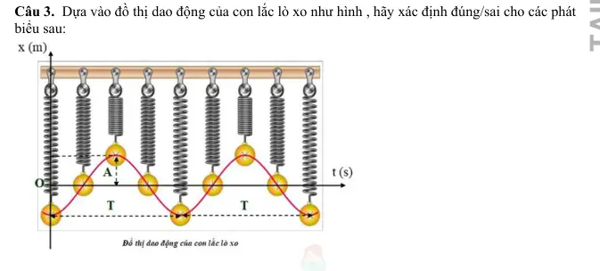
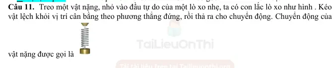
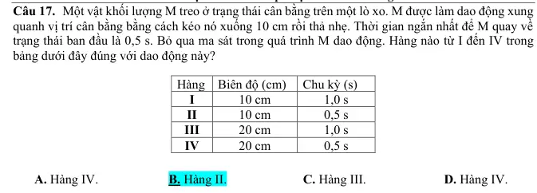
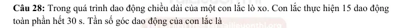

# Bài tập — Bài 4 — Con lắc lò xo

> Hệ bài tập được biên soạn theo các dạng xuất hiện trong bộ tài liệu Vật lí 11 của dự án. Câu hỏi được giữ ngắn, trực tiếp; độ khó tăng dần và không cố tình thêm dữ kiện gây nhiễu.

[← Trở lại bài học](../../04-spring-oscillator.md)

## Phần A — Trắc nghiệm 4 lựa chọn

### Câu 1 — Mức 1 — Nhận biết

Con lắc lò xo có $m=0,20$ kg, $k=80$ N/m. Tần số góc bằng

A. $10$ rad/s.  
B. $20$ rad/s.  
C. $40$ rad/s.  
D. $400$ rad/s.

### Câu 2 — Mức 2 — Phát hiện sai sót

Con lắc lò xo treo thẳng đứng có độ dãn cân bằng $\Delta\ell_0=4$ cm tại nơi $g=10$ m/s². Tần số góc bằng

A. $5\sqrt{10}$ rad/s.  
B. $10$ rad/s.  
C. $15$ rad/s.  
D. $20$ rad/s.

### Câu 3 — Mức 1 — Nhận biết

Một lò xo có độ cứng $k=60$ N/m. Cắt lò xo thành ba phần bằng nhau. Độ cứng của mỗi phần bằng

A. $20$ N/m.  
B. $60$ N/m.  
C. $120$ N/m.  
D. $180$ N/m.

### Câu 4 — Mức 1 — Nhận biết

Hai lò xo có $k_1=60$ N/m và $k_2=30$ N/m ghép nối tiếp. Độ cứng tương đương là

A. $20$ N/m.  
B. $30$ N/m.  
C. $45$ N/m.  
D. $90$ N/m.

## Phần B — Đúng/Sai

### Câu 5 — Mức 2 — Thông hiểu

Con lắc lò xo treo thẳng đứng dao động quanh vị trí cân bằng. Xét các phát biểu:

a) Ở vị trí cân bằng, lực đàn hồi luôn bằng trọng lực.  
b) Độ dãn cân bằng thỏa $k\Delta\ell_0=mg$.  
c) Nếu $A>\Delta\ell_0$, trong một phần chu kì lò xo bị nén.  
d) Chu kì phụ thuộc biên độ nếu lò xo lí tưởng và dao động nhỏ quanh cân bằng.

### Câu 6 — Mức 2 — Thông hiểu

Con lắc lò xo nằm ngang lí tưởng:

a) Lực kéo về là $F=-kx$.  
b) Tốc độ cực đại ở hai biên.  
c) Gia tốc cực đại về độ lớn ở hai biên.  
d) Tăng khối lượng vật thì chu kì tăng.

## Phần C — Trả lời ngắn

### Câu 7 — Mức 3 — Vận dụng

Con lắc lò xo có $m=250$ g, chu kì $T=0,5$ s. Tính độ cứng $k$ theo $\pi^2\approx10$.

### Câu 8 — Mức 3 — Vận dụng

Con lắc lò xo treo thẳng đứng có $m=0,20$ kg, $k=50$ N/m, $g=10$ m/s². Tính độ dãn cân bằng.

### Câu 9 — Mức 3 — Vận dụng

Một con lắc lò xo nằm ngang có $k=100$ N/m, biên độ $A=4$ cm. Tính lực kéo về cực đại.

## Phần D — Vận dụng và vận dụng cao

### Câu 10 — Mức 4 — Vận dụng cao

Con lắc lò xo treo thẳng đứng có $m=0,10$ kg, $k=40$ N/m, $g=10$ m/s² và biên độ $A=4$ cm. Chọn chiều dương hướng xuống, gốc tại vị trí cân bằng. Tính lực đàn hồi lớn nhất và nhỏ nhất trong quá trình dao động; cho biết lò xo có bị nén không.

---

[Đáp án và lời giải →](solutions.md)

## Ngân hàng bài tập PDF mở rộng

> Nội dung câu hỏi và dữ kiện trong phần này được giữ nguyên; hệ thống chỉ chuẩn hóa xuống dòng và mã kí tự để hiển thị trên web. Câu trùng được loại bỏ. Với câu có công thức/kí hiệu bị sai khi trích xuất chữ từ PDF, đề bài được giữ dưới dạng ảnh để không làm thay đổi dữ kiện.

### Nhận biết — Đúng/Sai

#### Bài PDF 1

<!-- source-id: BT-Chuong-I-p29-q3-75 -->

Câu 3. Dựa vào đồ thị dao động của con lắc lò xo như hình , hãy xác định đúng/sai cho các phát
biểu sau:

Phát biểu
Đúng
Sai
a
Biên độ là khoảng cách lớn nhất từ vị trí cân bằng đến điểm cực
đại trên đồ thị.

S
b
Chu kì của dao động điều hòa là khoảng thời gian để vật thực hiện
được một dao động toàn phần, và được tính bằng 1/T.

S
c
Tần số là số lần vật đạt giá trị biên độ trong một giây, được xác
định bằng nghịch đảo của chu kì.
Đ

d
Độ lệch pha là sự khác biệt giữa pha ban đầu và pha tại một thời
điểm bất kỳ trên đồ thị, được biểu diễn bằng độ hoặc radian.
Đ

{ loading=lazy }

### Thông hiểu — Trắc nghiệm 4 lựa chọn

#### Bài PDF 2

<!-- source-id: BT-Chuong-I-p8-q11-11 -->

Câu 11. Treo một vật nặng, nhỏ vào đầu tự do của một lò xo nhẹ, ta có con lắc lò xo như hình . Kéo
vật lệch khỏi vị trí cân bằng theo phương thẳng đứng, rồi thả ra cho chuyển động. Chuyển động của
vật nặng được gọi là

A. rơi tự do.

 B. chuyển động tròn.

C. dao động cơ.

 D. ném ngang.

{ loading=lazy }

#### Bài PDF 3

<!-- source-id: BT-Chuong-I-p10-q17-17 -->

Câu 17. Một vật khối lượng M treo ở trạng thái cân bằng trên một lò xo. M được làm dao động xung
quanh vị trí cân bằng bằng cách kéo nó xuống 10 cm rồi thả nhẹ. Thời gian ngắn nhất để M quay về
trạng thái ban đầu là 0,5 s. Bỏ qua ma sát trong quá trình M dao động. Hàng nào từ I đến IV trong
bảng dưới đây đúng với dao động này?

A. Hàng IV.
B. Hàng II.
C. Hàng III.

D. Hàng IV.

{ loading=lazy }

#### Bài PDF 4

<!-- source-id: BT-Chuong-I-p39-q28-109 -->

Câu 28. Trong quá trình dao động chiều dài của một con lắc lò xo. Con lắc thực hiện 15 dao động
toàn phần hết 30 s. Tần số góc dao động của con lắc là
Hình 1.1

    A. π rad/s.

B. 2π rad/s.
     C.0 5π
,
rad.

D. 0 25π
,
rad.

{ loading=lazy }

