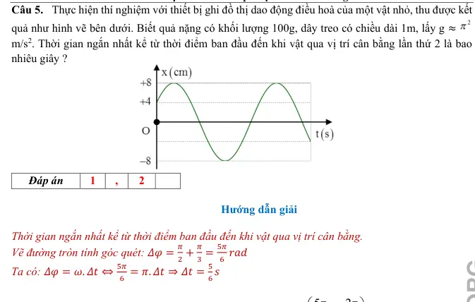
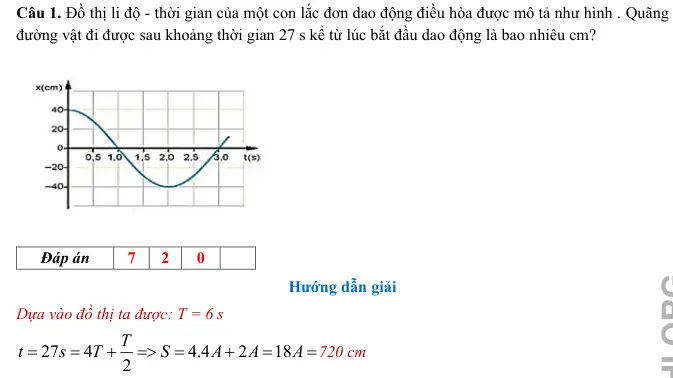

# Bài tập — Bài 5 — Con lắc đơn

> Hệ bài tập được biên soạn theo các dạng xuất hiện trong bộ tài liệu Vật lí 11 của dự án. Câu hỏi được giữ ngắn, trực tiếp; độ khó tăng dần và không cố tình thêm dữ kiện gây nhiễu.

[← Trở lại bài học](../../05-simple-pendulum.md)

## Phần A — Trắc nghiệm 4 lựa chọn

### Câu 1 — Mức 1 — Nhận biết

Chu kì con lắc đơn dao động góc nhỏ là

A. $2\pi\sqrt{g/\ell}$.  
B. $2\pi\sqrt{\ell/g}$.  
C. $\sqrt{\ell/g}$.  
D. $2\pi\ell/g$.

### Câu 2 — Mức 1 — Nhận biết

Giữ nguyên nơi thí nghiệm, tăng chiều dài con lắc đơn lên 4 lần. Chu kì

A. giảm 4 lần.  
B. giảm 2 lần.  
C. tăng 2 lần.  
D. tăng 4 lần.

### Câu 3 — Mức 1 — Nhận biết

Con lắc đơn dài $1$ m tại nơi $g=\pi^2$ m/s² có chu kì

A. $1$ s.  
B. $2$ s.  
C. $\pi$ s.  
D. $2\pi$ s.

### Câu 4 — Mức 1 — Nhận biết

Trong gần đúng góc nhỏ, tần số góc của con lắc đơn là

A. $\sqrt{\ell/g}$.  
B. $g/\ell$.  
C. $\sqrt{g/\ell}$.  
D. $2\pi\sqrt{g/\ell}$.

## Phần B — Đúng/Sai

### Câu 5 — Mức 2 — Thông hiểu

Xét con lắc đơn dao động góc nhỏ:

a) Chu kì không phụ thuộc khối lượng vật nặng.  
b) Chu kì tăng khi tăng chiều dài dây.  
c) Chu kì giảm khi gia tốc trọng trường tăng.  
d) Công thức $T=2\pi\sqrt{\ell/g}$ đúng chính xác cho mọi biên độ góc.

### Câu 6 — Mức 2 — Thông hiểu

Con lắc đơn không ma sát, chọn thế năng bằng 0 ở vị trí cân bằng:

a) Cơ năng bảo toàn.  
b) Ở biên, động năng bằng 0.  
c) Ở vị trí cân bằng, thế năng cực đại.  
d) Tốc độ cực đại ở vị trí cân bằng.

## Phần C — Trả lời ngắn

### Câu 7 — Mức 3 — Vận dụng

Con lắc đơn dài $0,81$ m tại nơi $g=10$ m/s². Tính chu kì gần đúng với $\pi\approx3,14$.

### Câu 8 — Mức 3 — Vận dụng

Một con lắc đơn có chu kì $T_1=2$ s. Tăng chiều dài thêm $21\%$. Tính chu kì mới.

### Câu 9 — Mức 3 — Vận dụng

Con lắc đơn dài $1$ m, biên độ góc nhỏ $0,08$ rad, $g=10$ m/s². Tính tốc độ cực đại theo gần đúng góc nhỏ.

## Phần D — Vận dụng và vận dụng cao

### Câu 10 — Mức 4 — Vận dụng cao

Một con lắc đơn dài $1$ m được kéo lệch đến góc $60^\circ$ rồi thả không vận tốc đầu. Bỏ qua ma sát, lấy $g=10$ m/s². Tính tốc độ ở vị trí thấp nhất và lực căng dây tại đó đối với vật nặng khối lượng $0,20$ kg.

---

[Đáp án và lời giải →](solutions.md)

## Ngân hàng bài tập PDF mở rộng

> Nội dung câu hỏi và dữ kiện trong phần này được giữ nguyên; hệ thống chỉ chuẩn hóa xuống dòng và mã kí tự để hiển thị trên web. Câu trùng được loại bỏ. Với câu có công thức/kí hiệu bị sai khi trích xuất chữ từ PDF, đề bài được giữ dưới dạng ảnh để không làm thay đổi dữ kiện.

### Nhận biết — Trả lời ngắn

#### Bài PDF 1

<!-- source-id: BT-Chuong-I-p33-q5-81 -->

Câu 5. Thực hiện thí nghiệm với thiết bị ghi đồ thị dao động điều hoà của một vật nhỏ, thu được kết
quả như hình vẽ bên dưới. Biết quả nặng có khối lượng 100g, dây treo có chiều dài 1m, lấy g ≈
m/s2. Thời gian ngắn nhất kể từ thời điểm ban đầu đến khi vật qua vị trí cân bằng lần thứ 2 là bao
nhiêu giây ?

Đáp án
1
,
2

{ loading=lazy }

### Vận dụng — Trả lời ngắn

#### Bài PDF 2

<!-- source-id: BT-Chuong-I-p22-q1-47 -->

Câu 1. Đồ thị li độ - thời gian của một con lắc đơn dao động điều hòa được mô tả như hình . Quãng
đường vật đi được sau khoảng thời gian 27 s kể từ lúc bắt đầu dao động là bao nhiêu cm?

Đáp án
7
2
0

{ loading=lazy }

