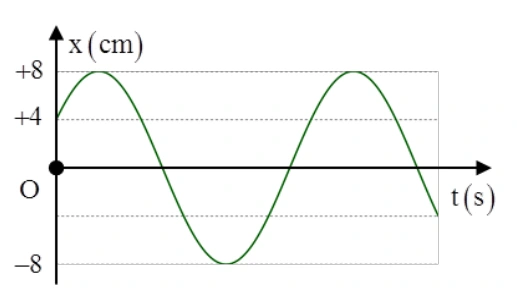
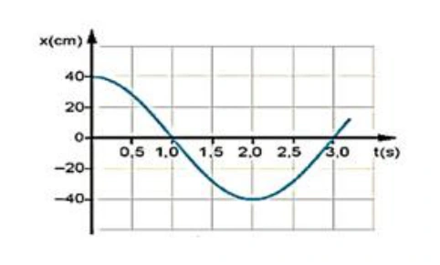

# Bài tập — Bài 5 — Con lắc đơn

> Hệ bài tập được biên soạn theo các dạng xuất hiện trong bộ tài liệu Vật lí 11 của dự án. Câu hỏi được giữ ngắn, trực tiếp; độ khó tăng dần và không cố tình thêm dữ kiện gây nhiễu.

[← Trở lại bài học](../../05-simple-pendulum.md)

## Phần A — Trắc nghiệm 4 lựa chọn

### Bài 1 — Mức 1 — Nhận biết

Chu kì con lắc đơn dao động góc nhỏ là

A. $2\pi\sqrt{g/\ell}$.

B. $2\pi\sqrt{\ell/g}$.

C. $\sqrt{\ell/g}$.

D. $2\pi\ell/g$.

??? success "Đáp án và lời giải"
    Chọn **B**. Công thức dao động góc nhỏ: $T=2\pi\sqrt{\ell/g}$.

### Bài 2 — Mức 1 — Nhận biết

Giữ nguyên nơi thí nghiệm, tăng chiều dài con lắc đơn lên 4 lần. Chu kì

A. giảm 4 lần.

B. giảm 2 lần.

C. tăng 2 lần.

D. tăng 4 lần.

??? success "Đáp án và lời giải"
    Chọn **C** vì $T\propto\sqrt\ell$.

### Bài 3 — Mức 1 — Nhận biết

Con lắc đơn dài $1$ m tại nơi $g=\pi^2$ m/s² có chu kì

A. $1$ s.

B. $2$ s.

C. $\pi$ s.

D. $2\pi$ s.

??? success "Đáp án và lời giải"
    Chọn **B**. $T=2\pi\sqrt{1/\pi^2}=2$ s.

### Bài 4 — Mức 1 — Nhận biết

Trong gần đúng góc nhỏ, tần số góc của con lắc đơn là

A. $\sqrt{\ell/g}$.

B. $g/\ell$.

C. $\sqrt{g/\ell}$.

D. $2\pi\sqrt{g/\ell}$.

??? success "Đáp án và lời giải"
    Chọn **C**. $\omega=\sqrt{g/\ell}$.

## Phần B — Đúng/Sai

### Bài 5 — Mức 2 — Thông hiểu

Xét con lắc đơn dao động góc nhỏ:

a) Chu kì không phụ thuộc khối lượng vật nặng.

b) Chu kì tăng khi tăng chiều dài dây.

c) Chu kì giảm khi gia tốc trọng trường tăng.

d) Công thức $T=2\pi\sqrt{\ell/g}$ đúng chính xác cho mọi biên độ góc.

??? success "Đáp án và lời giải"
    a) **Đúng**.
    b) **Đúng**.
    c) **Đúng**.
    d) **Sai**: công thức chuẩn này dựa trên gần đúng góc nhỏ.

### Bài 6 — Mức 2 — Thông hiểu

Con lắc đơn không ma sát, chọn thế năng bằng 0 ở vị trí cân bằng:

a) Cơ năng bảo toàn.

b) Ở biên, động năng bằng 0.

c) Ở vị trí cân bằng, thế năng cực đại.

d) Tốc độ cực đại ở vị trí cân bằng.

??? success "Đáp án và lời giải"
    a) **Đúng**.
    b) **Đúng**.
    c) **Sai**: với mốc ở cân bằng, thế năng nhỏ nhất bằng 0 tại đó.
    d) **Đúng**.

## Phần C — Trả lời ngắn

### Bài 7 — Mức 3 — Vận dụng

Con lắc đơn dài $0,81$ m tại nơi $g=10$ m/s². Tính chu kì gần đúng với $\pi\approx3,14$.

??? success "Đáp án và lời giải"
    $T=2\pi\sqrt{0,81/10}\approx6,28\cdot0,2846\approx1,79$ s.

### Bài 8 — Mức 3 — Vận dụng

Một con lắc đơn có chu kì $T_1=2$ s. Tăng chiều dài thêm $21\%$. Tính chu kì mới.

??? success "Đáp án và lời giải"
    $\ell_2=1,21\ell_1$, nên $T_2/T_1=\sqrt{1,21}=1,1$. Vậy $T_2=2,2$ s.

### Bài 9 — Mức 3 — Vận dụng

Con lắc đơn dài $1$ m, biên độ góc nhỏ $0,08$ rad, $g=10$ m/s². Tính tốc độ cực đại theo gần đúng góc nhỏ.

??? success "Đáp án và lời giải"
    Với $s_0=\ell\alpha_0=0,08$ m và $\omega=\sqrt{g/\ell}=\sqrt{10}$ rad/s, $v_{\max}=\omega s_0\approx0,253$ m/s.

## Phần D — Vận dụng và vận dụng cao

### Bài 10 — Mức 4 — Vận dụng cao

Một con lắc đơn dài $1$ m được kéo lệch đến góc $60^\circ$ rồi thả không vận tốc đầu. Bỏ qua ma sát, lấy $g=10$ m/s². Tính tốc độ ở vị trí thấp nhất và lực căng dây tại đó đối với vật nặng khối lượng $0,20$ kg.

??? success "Đáp án và lời giải"
    Không dùng gần đúng góc nhỏ vì biên độ $60^\circ$ lớn.

    Bảo toàn cơ năng từ biên đến vị trí thấp nhất:

    $\frac12mv^2=mg\ell(1-\cos60^\circ)$.

    Suy ra $v^2=2g\ell(1-1/2)=10$, nên $v=\sqrt{10}\approx3,16$ m/s.

    Tại vị trí thấp nhất, phương bán kính hướng lên:

    $T-mg=mv^2/\ell$.

    Do đó $T=mg+mv^2/\ell=0,2\cdot10+0,2\cdot10=4$ N.

## Ngân hàng bài tập mở rộng

### Nhận biết — Trả lời ngắn

#### Bài 11

<!-- source-id: BT-Chuong-I-p33-q5-81 -->

Thực hiện thí nghiệm với thiết bị ghi đồ thị dao động điều hoà của một vật nhỏ, thu được kết
quả như hình vẽ bên dưới. Biết quả nặng có khối lượng 100g, dây treo có chiều dài 1m, lấy g ≈
m/s2. Thời gian ngắn nhất kể từ thời điểm ban đầu đến khi vật qua vị trí cân bằng lần thứ 2 là bao
nhiêu giây ?

{ loading=lazy }

??? success "Đáp án và lời giải"
    **Đáp án đã hiệu chỉnh:** $\dfrac{5}{6}$ s $\approx 0{,}833$ s.

    **Hướng dẫn giải:**

    Từ đồ thị, để vật đi từ trạng thái ban đầu đến **lần thứ hai qua vị trí cân bằng**, góc quét nhỏ nhất trên đường tròn lượng giác là

    $\Delta\varphi=\frac{\pi}{2}+\frac{\pi}{3}=\frac{5\pi}{6}.$

    Chu kì đọc từ đồ thị cho $\omega=\pi$ rad/s. Dùng hệ thức

    $\Delta\varphi=\omega\Delta t$

    ta có

    $\frac{5\pi}{6}=\pi\Delta t \quad\Rightarrow\quad \Delta t=\frac56\text{ s}.$

    Vậy thời gian ngắn nhất cần tìm là $\boxed{\dfrac56\text{ s}\approx0{,}833\text{ s}}$.

    !!! warning "Đối chiếu nguồn"
        Ô đáp án trong PDF ghi $1{,}2$ s, nhưng chính phần *Hướng dẫn giải* của PDF tính được $5/6$ s. Phép tính theo $\Delta\varphi=\omega\Delta t$ xác nhận $5/6$ s; vì vậy đáp án hiển thị ở đây được hiệu chỉnh theo lời giải đúng.

### Vận dụng — Trả lời ngắn

#### Bài 12

<!-- source-id: BT-Chuong-I-p22-q1-47 -->

Đồ thị li độ - thời gian của một con lắc đơn dao động điều hòa được mô tả như hình . Quãng
đường vật đi được sau khoảng thời gian 27 s kể từ lúc bắt đầu dao động là bao nhiêu cm?

{ loading=lazy }

??? success "Đáp án và lời giải"
    **Đáp án:** 720 cm
    **Hướng dẫn giải:**

    Với dao động nhỏ của con lắc đơn, dùng $T=2\pi\sqrt{\ell/g}$; nếu bài hỏi trạng thái theo thời gian thì kết hợp $\Delta\varphi=\omega\Delta t$.

    Dựa vào đồ thị ta được: T = 6 s

    Vậy kết quả cần tìm là **720 cm**.
