# Bài tập — Bài 6 — Năng lượng trong dao động

> Hệ bài tập được biên soạn theo các dạng xuất hiện trong bộ tài liệu Vật lí 11 của dự án. Câu hỏi được giữ ngắn, trực tiếp; độ khó tăng dần và không cố tình thêm dữ kiện gây nhiễu.

[← Trở lại bài học](../../06-oscillation-energy.md)

## Phần A — Trắc nghiệm 4 lựa chọn

### Câu 1 — Mức 1 — Nhận biết

Cơ năng của con lắc lò xo dao động điều hòa là

A. $\frac12kA^2$.  
B. $kA^2$.  
C. $\frac12mA^2$.  
D. $m\omega A$.

### Câu 2 — Mức 1 — Nhận biết

Khi $|x|=A/2$, tỉ số thế năng trên cơ năng bằng

A. $1/2$.  
B. $1/4$.  
C. $3/4$.  
D. $1$.

### Câu 3 — Mức 1 — Nhận biết

Khi động năng bằng thế năng, độ lớn li độ bằng

A. $A/2$.  
B. $A/\sqrt2$.  
C. $A\sqrt3/2$.  
D. $0$.

### Câu 4 — Mức 1 — Nhận biết

Trong dao động điều hòa lí tưởng, đại lượng nào không đổi theo thời gian?

A. Động năng.  
B. Thế năng.  
C. Cơ năng.  
D. Công suất tức thời của lực kéo về.

## Phần B — Đúng/Sai

### Câu 5 — Mức 2 — Thông hiểu

Xét dao động điều hòa lí tưởng:

a) Động năng cực đại ở vị trí cân bằng.  
b) Thế năng cực đại ở hai biên.  
c) Động năng và thế năng biến thiên với cùng chu kì bằng $T$.  
d) Tổng động năng và thế năng không đổi.

### Câu 6 — Mức 2 — Thông hiểu

Một con lắc lò xo có biên độ tăng từ $A$ lên $2A$ trong khi $k$ không đổi:

a) Cơ năng tăng 2 lần.  
b) Cơ năng tăng 4 lần.  
c) Tốc độ cực đại tăng 2 lần.  
d) Gia tốc cực đại tăng 2 lần.

## Phần C — Trả lời ngắn

### Câu 7 — Mức 3 — Vận dụng

Con lắc lò xo có $k=50$ N/m, $A=6$ cm. Tính cơ năng.

### Câu 8 — Mức 3 — Vận dụng

Một vật dao động điều hòa có cơ năng $0,20$ J. Tại một vị trí, thế năng bằng $0,05$ J. Tính động năng và tỉ số $|v|/v_{\max}$.

### Câu 9 — Mức 3 — Vận dụng

Tại một vị trí, động năng bằng 3 lần thế năng. Tìm $|x|/A$.

## Phần D — Vận dụng và vận dụng cao

### Câu 10 — Mức 4 — Vận dụng cao

Một con lắc lò xo có $m=0,25$ kg, $k=100$ N/m. Tại một thời điểm vật có $x=3$ cm và $v=0,40$ m/s. Tính biên độ và cơ năng của dao động.

---

[Đáp án và lời giải →](solutions.md)

## Ngân hàng bài tập PDF mở rộng

> Nội dung câu hỏi và dữ kiện trong phần này được giữ nguyên; hệ thống chỉ chuẩn hóa xuống dòng và mã kí tự để hiển thị trên web. Câu trùng được loại bỏ. Với câu có công thức/kí hiệu bị sai khi trích xuất chữ từ PDF, đề bài được giữ dưới dạng ảnh để không làm thay đổi dữ kiện.

### Nhận biết — Trả lời ngắn

#### Bài PDF 1

<!-- source-id: BT-Chuong-I-p105-q1-281 -->

Câu 1. Con lắc lò xo có khối lượng m
400 gam
=
 , độ cứng k =160 N/m  dao động điều hoà theo
phương thẳng đứng. Biết khi vật có li độ 2 cm thì vận tốc của vật bằng 40 cm/s. Năng lượng dao
động của vật là? (Làm tròn đến chữ số thập phân thứ 2 sau dấu phẩy)

#### Bài PDF 2

<!-- source-id: BT-Chuong-I-p105-q2-282 -->

Câu 2. Tại vị trí cân bằng, truyền cho quả nặng một năng lượng ban đầu 22,5mJ   để quả nặng
dao động điều hoà theo phương thẳng đứng xung quanh vị trí cân bằng. Lấy
2
g
10m/s .
=
  Độ cứng
của lò xo là k
18N/m.
=
  Chiều dài quỹ đạo của vật bằng bao nhiêu cm?

#### Bài PDF 3

<!-- source-id: BT-Chuong-I-p105-q3-283 -->

Câu 3. Con lắc lò xo nằm ngang có k = 100 N/m, m =1kg dao động điều hoà. Khi vật có động
năng 10 mJ thì cách vị trí cân bằng 1 cm khi có động năng 5m J thì cách vị trí cân bằng một đoạn
là bao nhiêu? (Làm tròn đến chữ số thứ 2 sau dấu phẩy)

#### Bài PDF 4

<!-- source-id: BT-Chuong-I-p105-q4-284 -->

Câu 4. Một con lắc đơn có khối lượng của vật nặng là 200 g dao động với phương trình
(
)(
)
s
10sin 2 t
cm .
=
π
  Ở thời điểm t
 s
6
π
=
  con lắc có động năng là bao nhiêu? (tính theo đơn vị
mJ)

#### Bài PDF 5

<!-- source-id: BT-Chuong-I-p106-q5-285 -->

Câu 5. Động năng dao động của một con lắc lò xo được mô tả theo thế năng dao động của nó
bằng đồ thị như hình vẽ. Cho biết khối lượng của vật bằng 100 g, vật dao động giữa hai vị trí cách
nhau 8cm. Tính tần số góc của dao động của con lắc lò xo. (Làm tròn đến 2 chữ số thập phân)

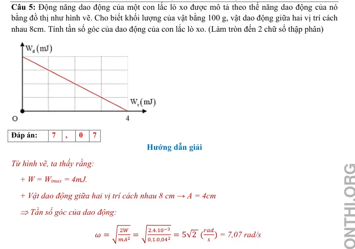{ loading=lazy }

#### Bài PDF 6

<!-- source-id: BT-Chuong-I-p106-q6-286 -->

Câu 6. Một vật có khối lượng 2 kg dao động điều hòa có đồ thị vận tốc – thời gian như hình .
Xác định động năng cực đại của vật trong quá trình dao động theo đơn vị Jun.

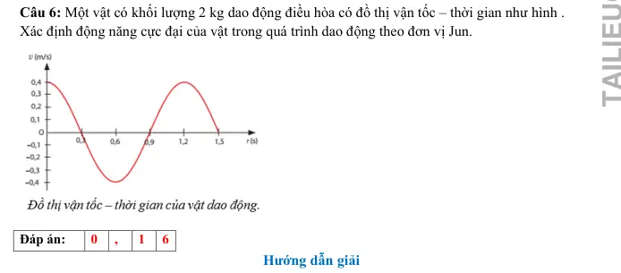{ loading=lazy }

#### Bài PDF 7

<!-- source-id: BT-Chuong-I-p113-q1-309 -->

Câu 1. Một con lắc đơn có chiều dài 1 m khối lượng 100 g dao động trong mặt phẳng thẳng đứng
đi qua điểm treo tại nơi có g = 10 m/s2. Lấy mốc thế năng ở vị trí cân bằng. Bỏ qua mọi ma sát.
Khi sợi dây treo hợp với phương thẳng đứng một góc 30° thì tốc độ của vật nặng là 0,3 m/s. Cơ
năng của con lắc đơn là bao nhiêu Jun? (làm tròn đến 2 số thập phân)

#### Bài PDF 8

<!-- source-id: BT-Chuong-I-p113-q2-310 -->

Câu 2. Một con lắc lò xo gồm lò xo nhẹ và vật nhỏ dao động điều hòa theo phương ngang với tần
số góc 10 rad/s. Biết rằng khi động năng và thế năng (mốc ở vị trí cân bằng của vật) bằng nhau
thì vận tốc của vật có độ lớn bằng 0,6√2 m/s. Biên dộ dao của con lắc là bao nhiêu mét?

#### Bài PDF 9

<!-- source-id: BT-Chuong-I-p114-q3-311 -->

Câu 3. Một con lắc lò xo gồm lò xo có độ cứng k = 100 N/m, vật nặng có khối lượng m = 200g,
dao động điều hoà với biên độ A = 5cm. Xác định tốc độ của vật khi vật ở vị trí cân bằng bao
nhiêu mét/giây? (Làm tròn đến 2 số thập phân)

#### Bài PDF 10

<!-- source-id: BT-Chuong-I-p114-q5-313 -->

Câu 5. Hai chất Hai chất điểm có khối lượng lần lượt là m1, m2 dao động điều hòa cùng phương
cùng tần số. Đồ thị biểu diễn động năng của m1 và thế năng của m2 theo li độ như hình vẽ. Xác
định tỉ số m1/m2.

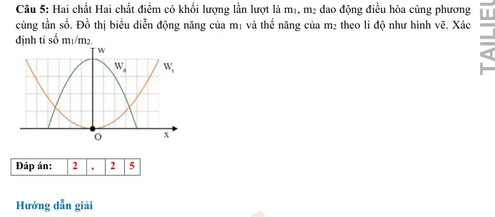{ loading=lazy }

#### Bài PDF 11

<!-- source-id: BT-Chuong-I-p115-q6-314 -->

Câu 6. Một vật dao động điều hòa có li độ x được biểu diễn như hình bên. Cơ năng của vật là
250 mJ. Lấy π2 = 10. Khối lượng vật là bao nhiêu kg?

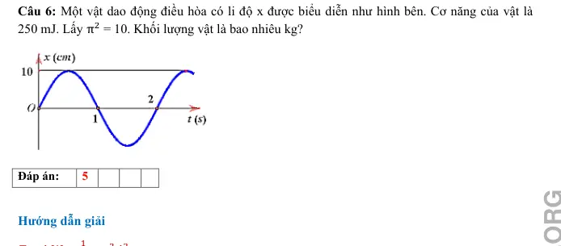{ loading=lazy }

#### Bài PDF 12

<!-- source-id: BT-Chuong-I-p186-q1-475 -->

Câu 1. Một con lắc đơn có chiều dài
1,2
l =
m dao động nhỏ với tần số góc bằng 2,86 rad/s tại nơi có gia tốc
trọng trường g . Giá trị của g  tại đó bằng bao nhiêu m/s2 ? (Làm tròn đến chữ số thập phân thứ 2 sau dấu
phẩy)

#### Bài PDF 13

<!-- source-id: BT-Chuong-I-p186-q2-476 -->

Câu 2. Một vật nhỏ có khối lượng bằng 100 g, dao động điều hòa với biên độ bằng 5 cm và chu kỳ bằng π s.
Động năng cực đại của vật bằng bao nhiêu miliJun?

#### Bài PDF 14

<!-- source-id: BT-Chuong-I-p186-q3-477 -->

Câu 3. Một con lắc lò xo dao động điều hòa. Biết lò xo có độ cứng 36 N/m và vật nhỏ có khối lượng 100 g.
Lấy π2 =10. Động năng của con lắc biến thiên theo thời gian với tần số ?

#### Bài PDF 15

<!-- source-id: BT-Chuong-I-p187-q4-478 -->

Câu 4. Một con lắc đơn có khối lượng 2 kg và có độ dài 4 m, dao động điều hòa ở nơi có gia tốc trọng
trường 9,8 m/s2. Cơ năng dao động của con lắc là 0,2205 J. Biên độ góc (góc lệch lớn nhất) của con lắc bằng
bao nhiêu độ? (Làm tròn đến 1 số thập phân)

#### Bài PDF 16

<!-- source-id: BT-Chuong-I-p187-q6-480 -->

Câu 6. Hai con lắc lò xo dao động điều hòa có động năng biến thiên theo thời gian như đồ thị, con lắc (1) là
đường liền nét và con lắc (2) là đường nét đứt. Vào thời điểm thế năng 2 con lắc bằng nhau thì tỉ số động
năng con lắc (1) và động năng con lắc (2) là bao nhiêu ?

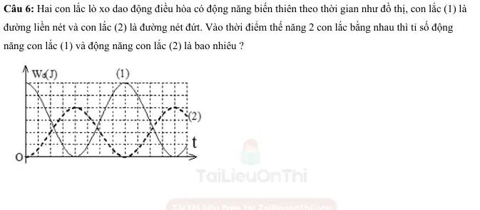{ loading=lazy }

### Nhận biết — Trắc nghiệm 4 lựa chọn

#### Bài PDF 17

<!-- source-id: BT-Chuong-I-p90-q1-237 -->

Câu 1. Trong dao động điều hoà của con lắc lò xo, cơ năng của nó bằng
A. tổng động năng và thế năng của vật khi qua một vị trí bất kì.
B. thế năng của vật nặng khi qua vị trí cân bằng.
C. động năng của vật nặng khi qua vị trí biên.

D. động năng tại vị trí vật có li độ bất kì.

#### Bài PDF 18

<!-- source-id: BT-Chuong-I-p90-q2-238 -->

Câu 2. Một con lắc lò xo dao động điều hoà, cơ năng toàn phần có giá trị là W thì tại vị trí
A. biên dao động  động năng bằng W.
B. cân bằng  động năng bằng W.
C. bất kì  thế năng lớn hơn W.
D. bất kì  động năng lớn hơn W.

#### Bài PDF 19

<!-- source-id: BT-Chuong-I-p90-q3-239 -->

Câu 3. Cơ năng của một vật dao động điều hòa
A. tăng gấp đôi khi biên độ dao động của vật tăng gấp đôi.
B. biến thiên tuần hoàn theo thời gian với chu kỳ bằng chu kỳ dao động của vật.
C. biến thiên tuần hoàn theo thời gian với chu kỳ bằng một nửa chu kỳ dao động của vật.
D. bằng động năng của vật khi vật tới vị trí cân bằng.

#### Bài PDF 20

<!-- source-id: BT-Chuong-I-p90-q4-240 -->

Câu 4. Một chất điểm có khối lượng m đang dao động điều hòa. Khi chất điểm có vận tốc v thì
động năng của nó là

𝑨. mv2.

B.
2
2
mv

𝑪. vm2.

D.
𝑣𝑚2
2 .

#### Bài PDF 21

<!-- source-id: BT-Chuong-I-p90-q5-241 -->

Câu 5. Đối với một chất điểm dao động cơ điều hòa với chu kì T thì động năng và thế năng đều
biến thiên tuần hoàn theo thời gian
A. nhưng không điều hòa.
B. với chu kì T.
C. với chu kì T/2.
D. với chu kì 2T.

#### Bài PDF 22

<!-- source-id: BT-Chuong-I-p90-q6-242 -->

Câu 6. Một con lắc lò xo gồm vật nhỏ và lò xo nhẹ có độ cứng k, đang dao động điều hòa. Mốc
thế năng tại vị trí cân bằng. Biểu thức thế năng của con lắc ở li độ x là
A. 2kx2.

B.
𝑘𝑥2
2

C.
𝑘𝑥
2

D. 2kx

#### Bài PDF 23

<!-- source-id: BT-Chuong-I-p91-q7-243 -->

Câu 7. Cơ năng của một chất điểm dao động điều hoà tỷ lệ thuận với
A. bình phương biên độ dao động.

B. li độ của dao động.
C. biên độ dao động.

D. chu kỳ dao động.

#### Bài PDF 24

<!-- source-id: BT-Chuong-I-p91-q8-244 -->

Câu 8. Chọn câu sai: Năng lượng của một vật dao động điều hòa
A. luôn luôn là một hằng số.

B. bằng động năng của vật khi qua vị trí cân bằng.
C. bằng thế năng của vật khi qua vị trí cân biên.

D. biến thiên tuần hoàn theo thời gian với chu kì T.

#### Bài PDF 25

<!-- source-id: BT-Chuong-I-p91-q9-245 -->

Câu 9. Điều nào sau đây là đúng khi nói về động năng và thế năng của 1 vật dao động điều hòa ?
A. Động năng của vật tăng và thế năng giảm khi vật đi từ VTCB đến vị trí biên.
B. Động năng bằng không và thế năng cực đại khi vật ở VTCB.
C. Động năng giảm, thế năng tăng khi vật đi từ VTCB đến vị trí biên.
D. Động năng giảm, thế năng tăng khi vật đi từ vị trí biên đến VTCB.

#### Bài PDF 26

<!-- source-id: BT-Chuong-I-p91-q10-246 -->

Câu 10. Chọn phát biểu sai . Khi nói về năng lượng trong dao động điều hòa của con lắc lò xo thì
A. cơ năng của con lắc tỉ lệ với bình phương biên độ dao động.
B. cơ năng tỉ lệ với bình phương của tần số dao động.
C. cơ năng là 1 hàm số sin theo thời gian với tần số bằng tần số dao động.
D. có sự chuyển hóa qua lại giữa động năng và thế năng nhưng cơ năng luôn bảo toàn.

#### Bài PDF 27

<!-- source-id: BT-Chuong-I-p91-q11-247 -->

Câu 11. Một con lắc đơn dao động điều hoà từ vị trí biên độ cực đại đến vị trí cân bằng có
     A. thế năng tăng dần.                         B. động năng tăng dần.
     C. vận tốc giảm dần.                          D. vận tốc không đổi.

#### Bài PDF 28

<!-- source-id: BT-Chuong-I-p91-q12-248 -->

Câu 12. Một vật dao động điều hòa theo thời gian có phương trình 𝑥= 𝐴𝑐𝑜𝑠( 𝜔𝑡+ 𝜑) thì động
năng và thế năng cũng dao động điều hòa với tần số góc
A.  𝜔′ = 𝜔.
     B.  𝜔′ = 2𝜔.

C.  𝜔′ =
𝜔
2  .     D.  𝜔′ = 4𝜔.

#### Bài PDF 29

<!-- source-id: BT-Chuong-I-p91-q13-249 -->

Câu 13. Kết luận nào sau đây là sai khi nói về chuyển động điều hoà của chất điểm?
A. Giá trị vận tốc tỉ lệ thuận với li độ.
B. Giá trị của thế năng tỷ lệ thuận với bình phương li độ.
C. Biên độ dao động là đại lượng không đổi.
D. Động năng là đại lượng biến đổi .

#### Bài PDF 30

<!-- source-id: BT-Chuong-I-p91-q14-250 -->

Câu 14. Một vật nhỏ khối lượng m dao động điều hòa trên trục Ox theo phương trình  x =
Acosωt. Động năng của vật tại thời điểm t là
A. Wđ = 2mω2A2sin2ωt.

B. Wđ = ½mω2A2sin2ωt.
C. Wđ = mω2A2sin2ωt.

D. Wđ = ½mω2A2cos2ωt.

#### Bài PDF 31

<!-- source-id: BT-Chuong-I-p92-q15-251 -->

Câu 15. Một con lắc lò xo gồm một lò xo khối lượng không đáng kể, độ cứng k, 1 đầu cố định và
một đầu gắn với một viên bi nhỏ khối lượng m. Con lắc này đang dao động điều hòa có cơ năng
A. tỉ lệ nghịch với khối lượng m của viên bi.
B. tỉ lệ với bình phương biên độ dao động.
C. tỉ lệ với bình phương chu kì dao động.
D. tỉ lệ nghịch với độ cứng k của lò xo.

#### Bài PDF 32

<!-- source-id: BT-Chuong-I-p92-q16-252 -->

Câu 16. Khi nói về dao động điều hoà của một chất điểm, phát biểu nào sau đây sai?
A. Khi động năng của chất điểm giảm thì thế năng của nó tăng.
B. Biên độ dao động của chất điểm không đổi trong quá trình dao động.
C. Độ lớn vận tốc của chất điểm tỉ lệ thuận với độ lớn li độ của nó.
D. Cơ năng của chất điểm được bảo toàn.

#### Bài PDF 33

<!-- source-id: BT-Chuong-I-p92-q17-253 -->

Câu 17. Chọn phát biểu sai . Khi nói về năng lượng trong dao động điều hoà thì
A. tổng năng lượng là đại lượng  tỉ lệ với bình phương của biên độ.
B. tổng năng lượng là đại lượng biến thiên theo li độ.
C. động năng và thế năng là những đại lượng biến thiên tuần hoàn.
D. trong quá trình dao động luôn diễn ra hiện tượng động năng tăng thì thế năng giảm và
ngược lại.

#### Bài PDF 34

<!-- source-id: BT-Chuong-I-p92-q18-254 -->

Câu 18. Một vật dao động điều hòa theo một trục cố định , mốc thế năng ở vị trí cân bằng thì
A. động năng của vật cực đại khi gia tốc của vật có độ lớn cực đại.
B. khi vật đi từ vị trí cân bằng ra biên, vận tốc và gia tốc của vật luôn cùng dấu.
C. khi ở vị trí cân bằng, thế năng của vật bằng cơ năng.
D. thế năng của vật cực đại khi vật ở vị trí biên.

#### Bài PDF 35

<!-- source-id: BT-Chuong-I-p100-q40-276 -->

Câu 40. Hai chất Hai chất điểm có khối lượng lần lượt là m1, m2 dao động điều hòa cùng phương
cùng tần số. Đồ thị biểu diễn động năng của m1 và thế năng của m2 theo li độ như hình vẽ. Tỉ số
1
2
m
m là:

A. 2/3.

B. 9/4.

C. 4/9.

D. 3/2.
Từ đồ thị ta thấy rằng cơ năng của hai vật là như nhau: E1 = E2
2
2
2
2
2
1
2
1
1
2
2
2
2
1
1
1
2
2
m
A
m
A
m
A
m
A
ω
ω

=

=

Mặt khác ta có
1
2
1
2
3
9
2
4
m
A
A
m
=

=

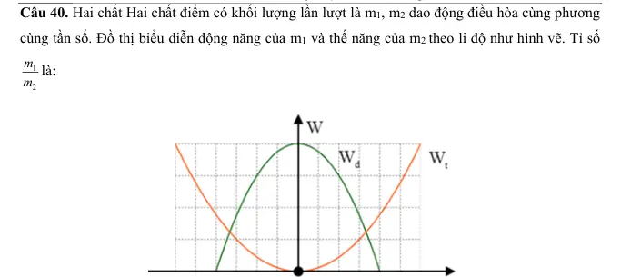{ loading=lazy }

#### Bài PDF 36

<!-- source-id: BT-Chuong-I-p107-q1-287 -->

Câu 1. Một con lắc lò xo gồm một vật nhỏ khối lượng m và lò xo có độ cứng k. Con lắc dao
động điều hòa với tần số góc là
A.
m
ω = 2π
.
k
B.
k
ω = 2π
.
m
C.
m
ω =
.
k
D.
k
ω =
.
m

#### Bài PDF 37

<!-- source-id: BT-Chuong-I-p107-q2-288 -->

Câu 2. Tại nơi có gia tốc trọng trường g một con lắc đơn dao động điều hoà với biên độ góc
0.
α
Biết khối lượng vật nhỏ là m, chiều dài dây treo là .λ Cơ năng của con lắc là
A.
2
0 .
1 mg
2
α
λ

B.
2
0
mg
.
α

C.
2
0
1 mg
.
4
α
λ

D.
2
0
2mg
.
α

#### Bài PDF 38

<!-- source-id: BT-Chuong-I-p107-q3-289 -->

Câu 3. Con lắc lò xo, đầu trên cố định, đầu dưới gắn vật có khối lượng m dao động điều hòa theo
phương thẳng đứng ở nơi có gia tốc trọng trường g. Khi vật ở vị trí cân bằng, độ giãn của lò xo là
Δ .λ Chu kỳ dao động của con lắc được tính bằng biểu thức
A.
g
T
2
.
= πλ

B. T
2
.
g
Δ
= π
λ
C.
g
T
2
.
= πΔλ
D.
1
g
T
.
2
= π
λ

#### Bài PDF 39

<!-- source-id: BT-Chuong-I-p107-q4-290 -->

Câu 4. Năng lượng của một vật dao động điều hoà là E. Khi li độ bằng một nửa biên độ thì động
năng của nó bằng
A. E .
4
B. E .
2
C.
3E .
2

D.
3E .
4

#### Bài PDF 40

<!-- source-id: BT-Chuong-I-p108-q5-291 -->

Câu 5. Công thức tính chu kì dao động của con lắc lò xo là
A. T = 2π
k .
m
B. T = 2π
m.
k
C. T = 2
πk.
m
D. T =
π
k .
2
m

#### Bài PDF 41

<!-- source-id: BT-Chuong-I-p108-q6-292 -->

Câu 6. Một con lắc đơn dao động điều hòa với tần số f. Nếu tăng khối lượng của con lắc lên 4 lần
thì tần số dao động của nó sẽ là
A. 2f.
B. 2f.
C.
f .
2
D. f.

#### Bài PDF 42

<!-- source-id: BT-Chuong-I-p108-q7-293 -->

Câu 7. Một con lắc lò xo gồm viên bi nhỏ có khối lượng m và lò xo khối lượng không đáng kể có
độ cứng k, dao động điều hoà theo phương thẳng đứng tại nơi có gia tốc rơi tự do là g. Khi viên
bi ở vị trí cân bằng, lò xo dãn một đoạn
.λ
λ
 Chu kỳ dao động điều hoà của con lắc này là
A.
1
k
T
.
2π
m
λ

B.
T = 2π
.
g
λ
λ

C.
g
T = 2π
.λ
λ

D.
1
m
T =
.
2π
k

#### Bài PDF 43

<!-- source-id: BT-Chuong-I-p108-q8-294 -->

Câu 8. Công thức được dùng để tính tần số dao động của con lắc lò xo là
A. f =
1
k .
2
m
π

B. f =
1
m.
2
k
π

C. f =
1
m.
k
π

D. f = 2π
k .
m

#### Bài PDF 44

<!-- source-id: BT-Chuong-I-p108-q9-295 -->

Câu 9. Công thức được dùng để tính tần số dao động của con lắc đơn là
A.
m
T
2
.
k
= π

B.
k
T
2
.
m
= π

C.
T
2
.
g
= πλ

D.
T
g
2
.
= πλ

#### Bài PDF 45

<!-- source-id: BT-Chuong-I-p109-q10-296 -->

Câu 10. Công thức được dùng để tính tần số dao động của con lắc đơn là
A.
1
g
f
.
2
=
π
λ
B.
1
f
.
2
g
=
π
λ

C.
1
g
f
.
= π
λ
D.
1
f
.
g
= π
λ

#### Bài PDF 46

<!-- source-id: BT-Chuong-I-p109-q11-297 -->

Câu 11. Một con lắc lò xo gồm lò xo có độ cứng k treo quả nặng có khối lượng m. Hệ dao động
với chu kỳ T. Độ cứng của lò xo là
A.
2
2
2
m
k
.
T
π
=

B.
2
2
4
m
k
.
T
π
=

C.
2
2
m
k
.
4T
π
=

D.
2
2
m
k
.
2T
π
=

#### Bài PDF 47

<!-- source-id: BT-Chuong-I-p109-q12-298 -->

Câu 12. Một con lắc lò xo có khối lượng vật nhỏ là m dao động điều hòa theo phương ngang với
phương trình
λλ
x = Acos ωt . Mốc tính thế năng ở vị trí cân bằng. Cơ năng của con lắc là
A.
2
W
mωA .
λ

B.
2
1
W
mωA .
2
λ

C.
2
2
W
mω A .
λ

D.
2
2
1
W
mω A .
2
λ

#### Bài PDF 48

<!-- source-id: BT-Chuong-I-p109-q13-299 -->

Câu 13. Tại nơi có gia tốc trọng trường g, một con lắc đơn có sợi dây dài  đang dao động điều
hòa. Tần số dao động của con lắc là
A.
T
2
.
g
= πλ

B.
g
T
2
.
= πλ
C.
1
T
.
2π
g
=
λ

D.
1
g
T
.
2π
=
λ

#### Bài PDF 49

<!-- source-id: BT-Chuong-I-p109-q14-300 -->

Câu 14. Trong dao động điều hoà của một vật thì tập hợp ba đại lượng nào sau đây là không đổi
theo thời gian?
A. Biên độ, tần số, cơ năng dao động.
B. Biên độ, tần số, gia tốc.
C. Lực phục hồi, vận tốc, cơ năng dao động.
D. Động năng, tần số, lực hồi phục.

#### Bài PDF 50

<!-- source-id: BT-Chuong-I-p109-q15-301 -->

Câu 15. Chu kì dao động của con lắc lò xo phụ thuộc vào
A. gia tốc của sự rơi tự do.
B. biên độ của dao động.
C. điều kiện kích thích ban đầu.
D. khối lượng của vật nặng.

#### Bài PDF 51

<!-- source-id: BT-Chuong-I-p109-q16-302 -->

Câu 16. Ứng dụng quan trọng nhất của con lắc đơn là
A. xác định chu kì dao động.
B. xác định chiều dài con lắc.

C. xác định gia tốc trọng trường.
D. khảo sát dao động điều hòa của một vật.

#### Bài PDF 52

<!-- source-id: BT-Chuong-I-p110-q17-303 -->

Câu 17. Tại một nơi xác định, chu kỳ dao động điều hòa của con lắc đơn tỉ lệ thuận với
A. gia tốc trọng trường.
B. chiều dài con lắc.
C. căn bậc hai gia tốc trọng trường.
D. căn bậc hai chiều dài con lắc.

#### Bài PDF 53

<!-- source-id: BT-Chuong-I-p110-q18-304 -->

Câu 18. Một con lắc lò xo dao động điều hòa. Biết lò xo có độ cứng 36 N/m và vật nhỏ có khối
lượng 100 gam. Lấy
2
10.
π=
 Động năng của con lắc biến thiên theo thời gian với tần số bằng
A. 6 Hz.
B. 3 Hz.
C. 12 Hz.
D. 1 Hz.

#### Bài PDF 54

<!-- source-id: BT-Chuong-I-p162-q1-393 -->

Câu 1. Cơ năng của một vật dao động điều hòa
A. biến thiên tuần hoàn theo thời gian với chu kỳ bằng một nửa chu kỳ dao động của vật.
B. tăng gấp đôi khi biên độ dao động của vật tăng gấp đôi.

C. bằng động năng của vật khi vật tới vị trí cân bằng.
D. biến thiên tuần hoàn theo thời gian với chu kỳ bằng chu kỳ dao động của vật.

#### Bài PDF 55

<!-- source-id: BT-Chuong-I-p162-q2-394 -->

Câu 2. Khi nói về năng lượng của một vật dao động điều hòa, phát biểu nào sau đây là đúng?
A. Cứ mỗi chu kì dao động của vật, có bốn thời điểm thế năng bằng động năng.
B. Thế năng của vật đạt cực đại khi vật ở vị trí cân bằng.

C. Động năng của vật đạt cực đại khi vật ở vị trí biên.
D. Thế năng và động năng của vật biến thiên cùng tần số với tần số của li độ.

#### Bài PDF 56

<!-- source-id: BT-Chuong-I-p162-q3-395 -->

Câu 3. Một vật dao động điều hòa theo một trục cố định (mốc thế năng ở vị trí cân bằng) thì
A. động năng của vật cực đại khi gia tốc của vật có độ lớn cực đại.
B. khi vật đi từ vị trí cân bằng ra biên, vận tốc và gia tốc của vật  luôn cùng dấu.
C. khi ở vị trí cân bằng, thế năng của vật bằng cơ năng.

D. thế năng của vật cực đại khi vật ở vị trí biên.

#### Bài PDF 57

<!-- source-id: BT-Chuong-I-p162-q4-396 -->

Câu 4. Khi nói về một vật dao động điều hòa, phát biểu nào sau đây sai?
A. Cơ năng của vật biến thiên tuần hoàn theo thời gian.

B. Vận tốc của vật biến thiên điều hòa theo thời gian.
C. Lực kéo về tác dụng lên vật biến thiên điều hòa theo thời gian.
D. Động năng của vật biến thiên tuần hoàn theo thời gian.

#### Bài PDF 58

<!-- source-id: BT-Chuong-I-p162-q5-397 -->

Câu 5. Trong dao động điều hòa, vì cơ năng được bảo toàn nên
A. động năng không đổi.
B. động năng tăng bao nhiêu thì thế năng giảm bấy nhiêu và ngược lại.
C. thế năng không đổi.

D. động năng và thế năng hoặc cùng tăng hoặc cùng giảm.

#### Bài PDF 59

<!-- source-id: BT-Chuong-I-p162-q6-398 -->

Câu 6. Trong dao động điều hòa của một vật thì những đại lượng không thay đổi theo thời gian là
A. tần số, li độ và biên độ.
B. biên độ, tần số và cơ năng.
C. vận tốc, biên độ và cơ năng.
D. cơ năng, tần số và gia tốc.

#### Bài PDF 60

<!-- source-id: BT-Chuong-I-p162-q7-399 -->

Câu 7. Trong dao động điều hòa những đại lượng dao động cùng tần số với li độ là
A. vận tốc, gia tốc và cơ năng.
B. vận tốc, động năng và thế năng.
C. vận tốc, gia tốc và lực phục hồi.
D. động năng, thế năng và lực phục hồi.

#### Bài PDF 61

<!-- source-id: BT-Chuong-I-p163-q8-400 -->

Câu 8. Một vật nhỏ khối lượng m dao động điều hòa với phương trình li độ x = Acos(ωt + φ). Cơ năng của
vật dao động này là
A. W = 0,5mω2A2.
B. W =0,5mω2A.
C. W = 0,5mωA2.
D. W = mω2A.

#### Bài PDF 62

<!-- source-id: BT-Chuong-I-p163-q9-401 -->

Câu 9. Một vật dao động điều hoà theo chu kì T. Trong quá trình dao động, thế năng dao động có giá trị
A. không đổi.
B. biến thiên tuần hoàn theo chu kì T/2.

C. biến thiên tuần hoàn theo chu kì T
D. tăng theo thời gian.

#### Bài PDF 63

<!-- source-id: BT-Chuong-I-p163-q10-402 -->

Câu 10. Trong dao động điều hoà của con lắc lò xo, cơ năng của nó bằng

A. tổng động năng và thế năng của vật khi qua một vị trí bất kì.

B. thế năng của vật nặng khi qua vị trí cân bằng.

C. động năng của vật nặng khi qua vị trí biên.

D. thế năng tại vị trí bất kì.

#### Bài PDF 64

<!-- source-id: BT-Chuong-I-p163-q11-403 -->

Câu 11. Cơ năng của một vật dao động điều hòa

A. tăng gấp đôi khi biên độ dao động của vật tăng gấp đôi.

B. biến thiên tuần hoàn theo thời gian với chu kỳ bằng chu kỳ dao động của vật.

C. biến thiên tuần hoàn theo thời gian với chu kỳ bằng nửa chu kỳ dao động của vật.

D. bằng động năng của vật khi vật tới vị trí cân bằng.

#### Bài PDF 65

<!-- source-id: BT-Chuong-I-p163-q12-404 -->

Câu 12. Một chất điểm có khối lượng m đang dao động điều hòa. Khi chất điểm có vận tốc v thì động năng
của nó là
A. mv2.
B.
mv2
2 .
C. vm2.
D.
vm2
2 .

#### Bài PDF 66

<!-- source-id: BT-Chuong-I-p163-q13-405 -->

Câu 13. Một con lắc lò xo gồm vật nhỏ và lò xo nhẹ có độ cứng k, đang dao động điều hòa. Mốc thế năng
tại vị trí cân bằng. Biểu thức thế năng của con lắc ở li độ x là

A. 2kx2.
B.
𝑘𝑥2
2 .
C.
𝑘𝑥
2 .

D. 2kx.

#### Bài PDF 67

<!-- source-id: BT-Chuong-I-p163-q14-406 -->

Câu 14. Cơ năng của một chất điểm dao động điều hoà tỷ lệ thuận với

A. bình phương biên độ dao động.
B. li độ của dao động.

C. biên độ dao động.

D. chu kỳ dao động.

#### Bài PDF 68

<!-- source-id: BT-Chuong-I-p163-q15-407 -->

Câu 15. Chọn câu sai: Năng lượng của một vật dao động điều hòa

A. luôn luôn là một hằng số.

B. bằng động năng của vật khi qua vị trí cân bằng.

C. bằng thế năng của vật khi qua vị trí cân biên.

D. biến thiên tuần hoàn theo thời gian với chu kì T.

#### Bài PDF 69

<!-- source-id: BT-Chuong-I-p163-q16-408 -->

Câu 16. Chọn phát biểu sai . Năng lượng dao động của con lắc đơn

A. bằng động năng của vật khi vật qua vị trí cân bằng.

C. luôn không đổi.

B. bằng thế năng của vật khi vật ở biên.

D. năng lượng biến thiên tuần hoàn theo thời gian.

#### Bài PDF 70

<!-- source-id: BT-Chuong-I-p163-q17-409 -->

Câu 17. Một vật dao động điều hòa theo thời gian có phương trình 𝑥= 𝐴𝑐𝑜𝑠( 𝜔𝑡+ 𝜑) thì động năng và
thế năng cũng dao động điều hòa với tần số góc

A.  𝜔′ = 𝜔.
B.  𝜔′ = 2𝜔.
C.  𝜔′ =
𝜔
2.
 D.  𝜔′ = 4𝜔.

#### Bài PDF 71

<!-- source-id: BT-Chuong-I-p163-q18-410 -->

Câu 18. Kết luận nào sau đây là sai khi nói về chuyển động điều hoà của chất điểm?

A. Giá trị vận tốc tỉ lệ thuận với li độ.

B. Giá trị của thế năng tỷ lệ thuận với bình phương li độ.

C. Biên độ dao động là đại lượng không đổi.

D. Động năng là đại lượng biến đổi.

#### Bài PDF 72

<!-- source-id: BT-Chuong-I-p164-q19-411 -->

Câu 19. Một vật nhỏ khối lượng m dao động điều hòa trên trục Ox theo phương trình x = Acosωt. Động
năng của vật tại thời điểm t là

A. Wđ = 2mω2A2sin2ωt.
B. Wđ = ½mω2A2sin2ωt.

C. Wđ = mω2A2sin2ωt.

D. Wđ = ½mω2A2cos2ωt.

### Nhận biết — Đúng/Sai

#### Bài PDF 73

<!-- source-id: BT-Chuong-I-p101-q1-277 -->

Câu 1. Một con lắc lò xo gồm vật nhỏ có khối lượng m và lò xo có độ cứng 40N/ m đang dao
động điều hoà với biên độ 5 cm.

Phát biểu
Đúng
Sai
a
Trong quá trình vật dao động cơ năng của vật
được bảo toàn.
Đ

b
Cơ năng của vật có giá trị là 0,032 J khi vật qua
vị trí có li độ là 3 cm

S
c
Động năng của vật có giá trị là 0,032J khi vật
qua vị trí có li độ 3 cm.
Đ

d
Nếu giữ nguyên khối lượng của vật và thay đổi
lò xo có độ cứng tăng lên 2 lần mà vẫn giữ cho
vật do động có biên độ 5 cm thì cơ năng của vật
tăng lên 2 lần so với ban đầu
Đ

#### Bài PDF 74

<!-- source-id: BT-Chuong-I-p102-q2-278 -->

Câu 2. Biết phương trình li độ của một vật có khối lượng 0,2 kg dao động điều hòa là:
cm.
 )
20
cos(
5
t
x =

#### Bài PDF 75

<!-- source-id: BT-Chuong-I-p102-q3-279 -->

Câu 3. Một con lắc đơn có khối lượng vật nặng 200 g dây treo có chiều dài 100 cm. Kéo con lắc
ra khỏi vị trí cân bằng một góc 60o  rồi buông ra không vận tốc đầu. Lấy
2
g = 10 m/s .

Phát biểu
Đúng
Sai
a
Cơ năng
J
A
m
W
40
05
,0.
20
.2,0.
2
1
2
1
2
2
2
2
=
=
=
ω

S

b
Biểu thức động năng và thế năng lần lượt là:
2
2
2
2
0
1
sin (
)
0,1sin (20 )( )
2
đ
W
m
A
t
t J
ω
ω
φ
=
+
=

2
2
2
2
0
1
cos (
)
0,1cos (20 )( )
2
t
W
m
A
t
t J
ω
ω
φ
=
+
=

Đ
c
Thế năng của con lắc tại thời điểm 2 giây là 17,79 J
S

d
Vật có vận tốc cực đại là 20√10 cm/s
S

Phát biểu
Đúng
Sai
a
Chu kì dao động của con lắc là 0,316 s

S

b
Cơ năng của con lắc là 1 J

Đ
c
Thế năng của vật tại vị trí dây treo hợp với phương
thẳng đứng góc
0
30 là 0,5 J
S

d
Động năng của vật tại vị trí dây treo hợp với
phương thẳng đứng góc
0
30 là 0,5 J
S

#### Bài PDF 76

<!-- source-id: BT-Chuong-I-p103-q4-280 -->

Câu 4. Một con lắc lò xo gồm một vật nặng có khối lượng 100 g và 1 lò xo có độ cứng 100 N/m.
dao động điều hoà với biên độ A trên mặt phẳng nằm ngang. Khi thế năng của vật gấp đôi động
năng thì vận tốc của vật là 10 cm/s.

Phát biểu
Đúng
Sai
a
Tốc độ cực đại của vật trong quá trình dao động là
10 3(
/ )
cm s

Đ

b
Trong quá trình dao động, cơ năng của vật luôn
bằng tổng động năng và thế năng tại bất kì vị trí nào
Đ

c
Tần số góc của dao động là 10 (
/ )
rad s
π
.
Đ

d
Động năng của con lắc biên thiên với chu kì 0,2 s.
S

#### Bài PDF 77

<!-- source-id: BT-Chuong-I-p110-q1-305 -->

Câu 1. Một con lắc lò xo gồm vật nặng 0,2 kg gắn vào đầu lò xo có độ cứng 20 N/m. Kéo quả
nặng ra khỏi vị trí cân bằng rồi thả nhẹ cho nó dao động, tốc độ trung bình trong 1 chu kỳ là
160/π cm/s.

Phát biểu
Đúng
Sai
a
Tần số của con lắc là 0,5 (Hz)
S

b
Quãng đường đi được trong 1 chu kỳ là 4A.
2
2
2
2
0
1
sin (
)
0,1sin (20 )( )
2
đ
W
m
A
t
t J
ω
ω
φ
=
+
=

2
2
2
2
0
1
cos (
)
0,1cos (20 )( )
2
t
W
m
A
t
t J
ω
ω
φ
=
+
=

Đ
c
Biên độ dao động của vật là 8m.
S

d
Cơ năng của vật dao động là 640 J.
S

#### Bài PDF 78

<!-- source-id: BT-Chuong-I-p111-q2-306 -->

Câu 2. Một vật dao động điều hòa với biên độ 6 cm. Mốc thế năng ở vị trí cân bằng.

Phát biểu
Đúng
Sai
a
Trong dao động điều hoà, cơ năng là một đại lượng bảo
toàn.
Đ

b
Khi
3
W
W
4
d =
thì vật có tốc độ bằng 0.

S
c
Khi
3
W
W
4
d =
 thì Wtx = (1/4)WA.

S
d
Tại vị trí vật có
3
W
W
4
d =
 thì li độ x = 3 cm.
Đ

#### Bài PDF 79

<!-- source-id: BT-Chuong-I-p111-q3-307 -->

Câu 3. Đồ thị hình 3.4 mô tả sự thay đổi động năng theo li độ của quả cầu có khối lượng 400 g
trong một con lắc lò xo treo thẳng đứng.

Hình 3.4. Đồ thị mô tả sự thay đổi của động năng theo li độ của quả cầu trong con lắc lò xo
thẳng đứng.

Phát biểu
Đúng
Sai
a
Khi vật có li độ 2 cm thì động năng của vật là 80 mJ

S
b
Vật có động năng cực đại là 80 mJ
Đ

c
Tốc độ cực đại của vật trong quá trình dao động là
10 (
/ )
5
m s
Đ

d
Tại x = 2cm, từ đồ thị ta thấy Wt = 20mJ
Đ

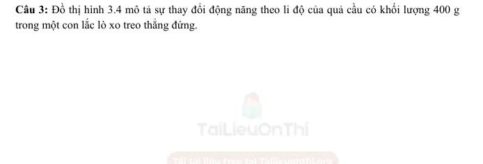{ loading=lazy }

#### Bài PDF 80

<!-- source-id: BT-Chuong-I-p112-q4-308 -->

Câu 4. Một con lắc đơn gồm vật nặng có khối lượng 1 kg, độ dài dây treo 2 m, góc lệch cực đại
của dây so với đường thẳng đứng 0,175 rad. Chọn mốc thế năng trọng trường ngang với vị trí
thấp nhất, g = 9,8 m/s2.

Phát biểu
Đúng
Sai
a
Tốc độ của vật nặng khi nó ở vị trí thấp nhất  là 0,3 m/s

S
b
Cơ năng của vật được bảo toàn nên ở vị trí thấp nhất
W = 0,3 J
Đ

c
Khi vật ở vị trí thấp nhất thì thế năng bằng 0
Đ

d
Vật có tốc độ bằng 0 khi ở vị trí cao nhất
Đ

#### Bài PDF 81

<!-- source-id: BT-Chuong-I-p184-q2-472 -->

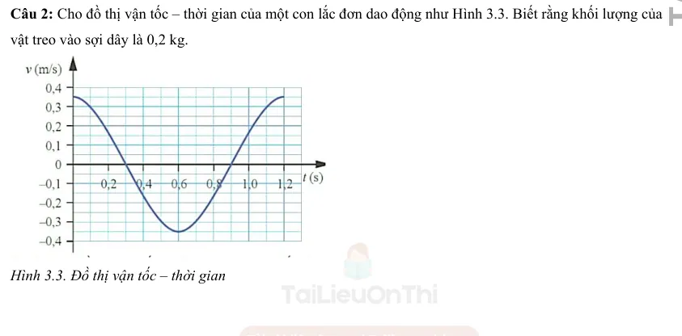{ loading=lazy }

#### Bài PDF 82

<!-- source-id: BT-Chuong-I-p185-q3-473 -->

Câu 3. Một vật có khối lượng m = 1 kg, dao động điều hoà với chu kì T = 0,2π s, biên độ dao động bằng 2
cm.

Phát biểu
Đúng
Sai
a
Trong quá trình dao động, cơ năng của vật là được bảo toàn.
Đ

b
Khi vật chuyển động từ vị trí cân bằng đến biên dương, thế năng tăng
dần đều.

S
c
Vận tốc cực đại của vật là vmax = 20 cm/s.
Đ

d
Tại vị trí cân bằng, động năng của vật đạt cực đại: Wdmax = 200 mJ.

S

#### Bài PDF 83

<!-- source-id: BT-Chuong-I-p185-q4-474 -->

Câu 4. Một con lắc đơn gồm vật nặng có khối lượng 1 kg, độ dài dây treo 2 m, góc lệch cực đại của dây so
với đường thẳng đứng 0,175 rad. Chọn mốc thế năng trọng trường ngang với vị trí thấp nhất,
2
10
π=
,
g = 9,8m/s2.

Phát biểu
Đúng
Sai
a
Con lắc đơn dao động điều hòa với tần số góc
(
)
7
10
/
rad
s
π
ω=

Đ

b
Cơ năng của vật được bảo toàn nên ở vị trí thấp nhất W = 0,3 J
Đ

c
Khi vật ở vị trí thấp nhất: Wđ = 0

S
d
Vận tốc của con lắc đơn khi qua vị trí thấp nhất theo chiều dương là:
𝑣𝑚𝑎𝑥=  0,77  𝑚/𝑠
Đ

### Thông hiểu — Trắc nghiệm 4 lựa chọn

#### Bài PDF 84

<!-- source-id: BT-Chuong-I-p92-q19-255 -->

Câu 19. Một con lắc lò xo gồm vật nhỏ và lò xo nhẹ, đang dao động điều hòa trên mặt phẳng
nằm ngang. Động năng của con lắc đạt giá trị cực tiểu khi
A. lò xo không biến dạng

B. vật có vận tốc cực đại.
C. vật đi qua vị trí cân bằng.

D. lò xo có chiều dài cực đại.

#### Bài PDF 85

<!-- source-id: BT-Chuong-I-p92-q20-256 -->

Câu 20. Trong dao động điều hoà khi động năng giảm đi 2 lần so với động năng cực đại thì
A. thế năng đối với vị trí cân bằng tăng hai lần.
B. li độ dao động tăng 2 lần
C. tốc độ giảm √2 lần

D. gia tốc dao động tăng 2 lần.

#### Bài PDF 86

<!-- source-id: BT-Chuong-I-p92-q21-257 -->

Câu 21. Một con lắc lò xo dao động điều hòa với tần số 2f1. Động năng của con lắc biến thiên
tuần hoàn theo thời gian với tần số f2 bằng
A. 2f1.
B. f1/2.
C. f1.
D. 4 f1.

#### Bài PDF 87

<!-- source-id: BT-Chuong-I-p93-q22-258 -->

Câu 22. Một con lắc lò xo dao động điều hòa, nếu không thay đổi cấu tạo của con lắc, không thay
đổi cách kích thích dao động nhưng thay đổi cách chọn gốc thời gian thì
A. biên độ, chu kỳ, pha của dao động sẽ không thay đổi
B. biên độ và chu kỳ không đổi; pha thay đổi.
C. biên độ và chu kỳ thay đổi; pha không đổi
D. biên độ và pha thay đổi, chu kỳ không đổi.

#### Bài PDF 88

<!-- source-id: BT-Chuong-I-p93-q23-259 -->

Câu 23. Cho một vật dao động điều hòa với biên độ A dọc theo trục Ox và quanh gốc tọa độ O.
Một đại lượng Y nào đó của vật phụ thuộc vào li độ x của vật theo đồ thị có dạng một phần của
đường pa-ra-bôn như hình vẽ bên. Y là đại lượng nào trong số các đại lượng sau?

A. Vận tốc của vật

C. Động năng của vật
B. Thế năng của vật

D. Gia tốc của vật

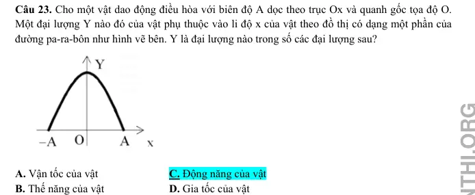{ loading=lazy }

#### Bài PDF 89

<!-- source-id: BT-Chuong-I-p93-q24-260 -->

Câu 24. Đồ thị dưới đây biểu diễn sự biến thiên của một đại lượng z theo đại lượng y trong dao
động điều hòa của con lắc đơn. Khi đó li dộ của con lắc là x, vận tốc là v, thế năng là 𝐸𝑡 và động
năng là 𝐸𝑑. Đại lượng z, y ở đây có thể là

A. z = 𝐸𝑡, y = 𝐸đ.

C. z = 𝐸𝑡, y = x.
B. z = 𝐸đ, y = v².

D. z = 𝐸𝑡, y = x².

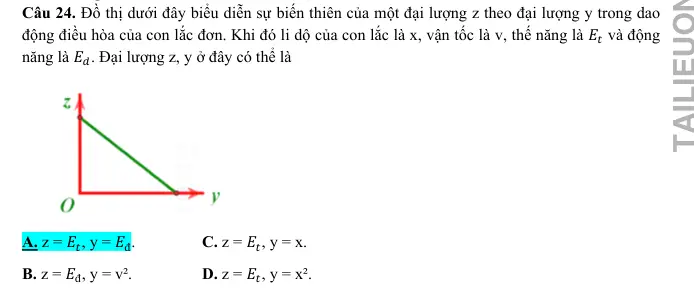{ loading=lazy }

#### Bài PDF 90

<!-- source-id: BT-Chuong-I-p94-q26-262 -->

Câu 26. Một vật dao động điều hòa dọc theo trục Ox và xung quanh vị trí cân bằng O. Đồ thị
biểu diễn sự thay đổi theo thời gian của một đại lượng Y nào đó trong dao động của vật có dạng
như hình vẽ dưới đây. Hỏi Y có thể là đại lượng nào?

A. Gia tốc của vật.
C. Cơ năng của vật.
B. Thế năng của vật.
D. Vận tốc của vật.

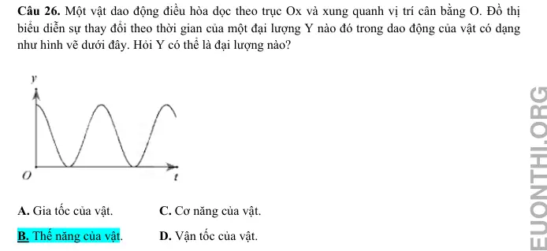{ loading=lazy }

#### Bài PDF 91

<!-- source-id: BT-Chuong-I-p94-q27-263 -->

Câu 27. Khi thực hành khảo sát thực nghiệm các định luật dao động của con lắc đơn, một hoc
sinh đã tiến hành thí nghiệm, kết quả đo được học sinh đó biểu diễn bởi đồ thị như hình vẽ bên.
Nhưng do sơ suất nên em học sinh đó quên ghi ký hiệu đại lượng trên các trục tọa độ Oxy. Dựa
vào đồ thị ta có thể kết luận trục Ox và Oy tương ứng biểu diễn cho

A. chiều dài con lắc, bình phương chu kỳ dao động.
B. chiều dài con lắc, chu kỳ dao động.
C. khối lượng con lắc, bình phương chu kỳ dao động.
D. khối lượng con lắc, chu kỳ dao động.

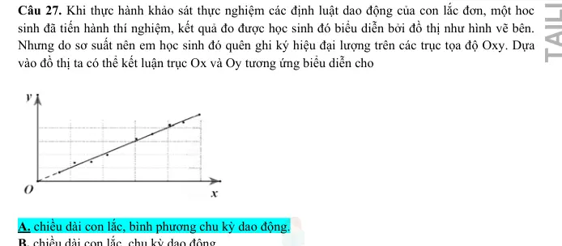{ loading=lazy }

#### Bài PDF 92

<!-- source-id: BT-Chuong-I-p95-q28-264 -->

Câu 28. Con lắc lò xo gồm vật nặng khối lượng 300 g, dao động điều hoà trên quỹ đạo dài 20 cm.
Trong khoảng thời gian 6 phút, vật thực hiện được 720 dao động. Lấy
2
10
π=
. Mốc thế năng ở vị
trí cân bằng. Cơ năng dao động của vật bằng:
A. 0,024 J.

B. 0,24 J.

C. 4,8 J.

D. 0,96 J.

#### Bài PDF 93

<!-- source-id: BT-Chuong-I-p95-q29-265 -->

Câu 29. Một con lắc lò xo có độ cứng k = 150 N/m và có năng lượng dao động là E = 0,12 J.
Biên độ dao động của con lắc có giá trị là
A. A = 0,4 m.
B. A = 4 mm.
C. A = 0,04 m.
D. A = 2 cm.

#### Bài PDF 94

<!-- source-id: BT-Chuong-I-p95-q30-266 -->

Câu 30. Dao động của một chất điẻm có khối lượng 100 g là tổng hợp của hai dao động điều hoà
cùng phương, có phương trình li độ lần lượt là
1
5cos10
x
t
=
và
2
10cos10
x
t
=
(
1x  và
2x tính bằng
cm, t tính bằng s). Mốc thế năng ở vị trí cân bằng. Cơ năng của chất diểm bằng:
A. 225 J.

B. 0,225 J.

C.112,5 J.

D. 0,1125 J.

#### Bài PDF 95

<!-- source-id: BT-Chuong-I-p95-q31-267 -->

Câu 31. Một con lắc đơn gồm một sợi dây nhẹ, không giãn và một vật nhỏ có khối lượng
m
100g
=
dao động điều hòa tại một nơi có gia tốc trọng trường
2
g
10m/ s
=
với biên độ góc
0,05rad. Năng lượng dao động điều hòa của vật bằng
4
5.10 J
−
. Chiều dài dây treo là
A. 20 cm .

B. 30 cm .

C. 25 cm .

D. 40 cm .

#### Bài PDF 96

<!-- source-id: BT-Chuong-I-p96-q32-268 -->

Câu 32. Tại nơi có gia tốc trọng trường g, một con lắc đơn dao động điều hòa với biên độ góc
0
α
nhỏ. Lấy mốc thế năng tại vị trí cân bằng. Khi con lắc chuyển động nhanh dần theo chiều dương
đến vị trí có động năng bằng thế năng thì li độ góc αcủa con lắc bằng
A.
0
3
−α.

B.
0
2
−α.

C.
0
2
α.

D.
0
3
α.

#### Bài PDF 97

<!-- source-id: BT-Chuong-I-p96-q33-269 -->

Câu 33. Một con lắc lò xo có độ cứng
100
/
k
N m
=
. Vật nặng dao động với biên độ
20
A
cm
=
,
khi vật đi qua li độ
12
x
cm
=
thì động năng của vật bằng
A. 1,28 J.

B. 2,56 J.

C. 0,72 J.

D. 1,44 J.

#### Bài PDF 98

<!-- source-id: BT-Chuong-I-p164-q20-412 -->

Câu 20. Khi nói về một vật dao động điều hoà với biên độ A và tần số f, trong những phát biểu dưới đây:
(1) Cơ năng biến thiên tuần hoàn với tần số 2f.
(2) Cơ năng bằng thế năng tại thời điểm vật ở biên.
(3) Cơ năng tỉ lệ thuận với biên độ dao động.
(4) Khi vật đi từ vị trí cân bằng ra biên, thế năng giảm, động năng tăng.
(5) Khi vật đi từ biên về vị trí cân bằng, thế năng giảm, động năng tăng.
Số phát biểu đúng là
A. 1.
B. 3.
C. 2.
D. 4.

#### Bài PDF 99

<!-- source-id: BT-Chuong-I-p164-q21-413 -->

Câu 21. Một vật dao động điều hòa với tần số 4f1. Động năng của con lắc biến thiên tuần hoàn theo thời
gian với tần số f2 bằng
A. 4f1.
B. f1/4
C. 2f1.
D. 8f1.

#### Bài PDF 100

<!-- source-id: BT-Chuong-I-p164-q22-414 -->

Câu 22. Một vật dao động điều hòa. Động năng của vật biến thiên tuần hoàn theo thời gian với tần số bằng
f. Lực kéo về tác dụng vào vật biến thiên điều hòa với tần số bằng
A. 2f.
B. f/2.
C. 4f.
D. f.

#### Bài PDF 101

<!-- source-id: BT-Chuong-I-p164-q23-415 -->

Câu 23. Điều nào sau đây là đúng khi nói về động năng và thế năng của 1 vật dao động điều hòa ?

A. Động năng của vật tăng và thế năng giảm khi vật đi từ vị trí cân bằng đến vị trí biên.

B. Động năng bằng không và thế năng cực đại khi vật ở vị trí cân bằng.

C. Động năng giảm, thế năng tăng khi vật đi từ vị trí cân bằng đến vị trí biên.

D. Động năng giảm, thế năng tăng khi vật đi từ vị trí biên đến vị trí cân bằng.

#### Bài PDF 102

<!-- source-id: BT-Chuong-I-p164-q24-416 -->

Câu 24. Trong dao động điều hoà khi động năng giảm đi 2 lần so với động năng cực đại thì

A. thế năng đối với vị trí cân bằng tăng hai lần.          B. li độ dao động tăng 2 lần.

C. vận tốc dao động giảm ξ2 lần.                                D. gia tốc dao động tăng 2 lần.

#### Bài PDF 103

<!-- source-id: BT-Chuong-I-p165-q26-418 -->

Câu 26. Đồ thị dưới đây biểu diễn sự biến thiên của một đại lượng z theo đại lượng y trong dao động điều
hòa của con lắc đơn. Khi đó li độ của con lắc là x, vận tốc là v, thế năng là 𝐸𝑡 và động năng là 𝐸đ. Đại lượng
z, y ở đây có thể là

A. z = 𝐸𝑡, y = 𝐸đ.

C. z = 𝐸𝑡, y = x.
B. z = 𝐸đ, y = v².
                                     D. z = 𝐸𝑡, y = x².

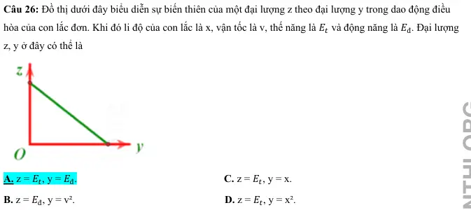{ loading=lazy }

#### Bài PDF 104

<!-- source-id: BT-Chuong-I-p165-q27-419 -->

Câu 27. Một vật dao động điều hòa, đồ thị biểu diễn mối quan hệ giữa cơ năng W và động năng 𝑊đ có dạng
đường nào?

A. Đường IV.
C. Đường III.
B. Đường I.
D. Đường II.

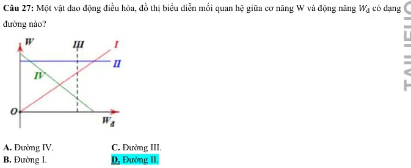{ loading=lazy }

#### Bài PDF 105

<!-- source-id: BT-Chuong-I-p166-q29-421 -->

Câu 29. Khi thực hành khảo sát thực nghiệm các định luật dao
động của con lắc đơn, một học sinh đã tiến hành thí nghiệm, kết quả
đo được học sinh đó biểu diễn bởi đồ thị như hình vẽ bên. Nhưng
do sơ suất nên em học sinh đó quên ghi ký hiệu đại lượng trên các
trục tọa độ Oxy. Dựa vào đồ thị ta có thể kết luận trục Ox và Oy
tương ứng biểu diễn cho
A. chiều dài con lắc, bình phương chu kỳ dao động.
B. chiều dài con lắc, chu kỳ dao động.
C. khối lượng con lắc, bình phương chu kỳ dao động.
D. khối lượng con lắc, chu kỳ dao động.

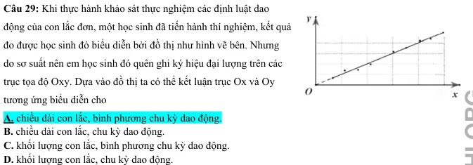{ loading=lazy }

#### Bài PDF 106

<!-- source-id: BT-Chuong-I-p166-q30-422 -->

Câu 30. Một vật dao động điều hoà có phương trình li độ là x = 5cos(10t) (x tính bằng cm, t tính bằng s).
Động năng và thế năng biến thiên tuần hoàn với tần số góc bằng
A. 10 rad/s.
B. 10t rad/s.
C. 5 rad/s.
D. 20 rad/s.

#### Bài PDF 107

<!-- source-id: BT-Chuong-I-p166-q31-423 -->

Câu 31. Một vật nhỏ có khối lượng 2/π2 kg dao động điều hòa với tần số 5 Hz, và biên độ 5 cm. Cơ năng
dao động bằng
A. 2,5 J.
B. 250 J.
C. 0,25 J.
D. 0,5 J.

#### Bài PDF 108

<!-- source-id: BT-Chuong-I-p166-q32-424 -->

Câu 32. Một vật có khối lượng 750 g dao động điều hòa với biên độ 4 cm và chu kì T = 2 s. Năng lượng của
dao động bằng
A. 10 mJ.
B. 20 mJ
C. 6 mJ.
D. 72 mJ.

#### Bài PDF 109

<!-- source-id: BT-Chuong-I-p167-q33-425 -->

Câu 33. Một vật nhỏ thực hiện dao động điều hòa theo phương trình x = 10cos(4πt) cm với t tính bằng giây.
Động năng của vật đó biến thiên với chu kì bằng
A. 1,50 s
B. 1,00 s
C. 0,50 s
D. 0,25 s

#### Bài PDF 110

<!-- source-id: BT-Chuong-I-p167-q34-426 -->

Câu 34. Một chất điểm dao động điều hòa với chu kì T. Khoảng thời gian hai lần liên tiếp thế năng triệt tiêu
là
A. T/2.
B. T.
C. T/4.
D. T/3.

#### Bài PDF 111

<!-- source-id: BT-Chuong-I-p167-q35-427 -->

Câu 35. Một chất điểm dao động điều hòa với chu kì T. Khoảng thời gian hai lần liên tiếp thế năng cực đại
là
A. T/2.
B. T.
C. T/4.
D. T/3.

### Vận dụng — Trả lời ngắn

#### Bài PDF 112

<!-- source-id: BT-Chuong-I-p176-q1-447 -->

Câu 1. Một con lắc lò xo gồm viên bi nhỏ và lò xo nhẹ có độ cứng 100 N/m, dao động điều hòa với biên độ
0,1 m. Mốc thế năng ở vị trí cân bằng. Khi viên bi cách vị trí cân bằng 6 cm thì động năng của con lắc bằng
bao nhiêu Jun?

#### Bài PDF 113

<!-- source-id: BT-Chuong-I-p176-q2-448 -->

Câu 2. Một con lắc lò xo gồm quả cầu nhỏ khối lượng 1 kg và lò xo có độ cứng 50 N/m. Cho con lắc dao
động điều hòa trên phương nằm ngang. Tại thời điểm vận tốc của quả cầu là 0,2 m/s thì gia tốc của nó là
−ξ3 m/s2. Cơ năng của con lắc là bao nhiêu Jun?

#### Bài PDF 114

<!-- source-id: BT-Chuong-I-p176-q3-449 -->

Câu 3. Một con lắc lò xo gồm lò xo nhẹ có độ cứng 100 N/m và vật nhỏ dao động điều hòa. Khi vật có động

năng 0,01 J thì nó cách vị trí cân bằng 1 cm. Hỏi khi nó có động năng 0,005 J thì nó cách vị trí cân bằng bao
nhiêu centimet? (Làm tròn đến chữ số thập phân thứ 2 sau dấu phẩy)

#### Bài PDF 115

<!-- source-id: BT-Chuong-I-p177-q4-450 -->

Câu 4. Một con lắc đơn có chiều dài 1 m khối lượng 100 g dao động trong mặt phẳng thẳng đứng đi qua
điểm treo tại nơi có g = 10 m/s2. Lấy mốc thế năng ở vị trí cân bằng. Bỏ qua mọi ma sát. Khi sợi dây treo
hợp với phương thẳng đứng một góc 30° thì tốc độ của vật nặng là 0,3 m/s. Cơ năng của con lắc đơn là bao
nhiêu Jun? (Làm tròn đến chữ số thập phân thứ 2 sau dấu phẩy)

#### Bài PDF 116

<!-- source-id: BT-Chuong-I-p177-q5-451 -->

Câu 5. Một vât có khối lượng 1kg dao động diều hòa xung quanh vị trí cân bằng. Ðồ thị dao động của thế
năng của vật như hình vẽ. Cho π2 = 10 thì biên độ dao động của vật bằng bao nhiêu centimet ?

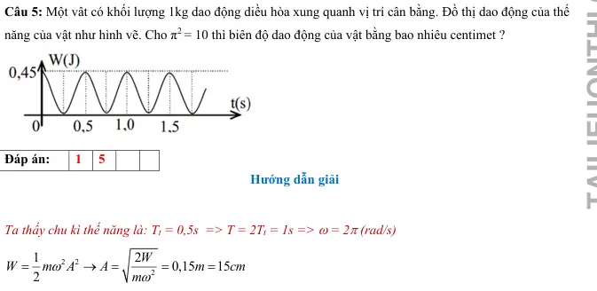{ loading=lazy }

#### Bài PDF 117

<!-- source-id: BT-Chuong-I-p177-q6-452 -->

Câu 6. Một học sinh thực nghiệm thí nghiệm kiểm chứng chu kì dao động điều hòa của con lắc đơn phụ
thuộc vào chiều dài của con lắc. Từ kết quả thí nghiệm, học sinh này vẽ đồ thị biểu diễn sự phụ thuộc của T2
vào chiều dài của con lắc như hình vẽ. Học sinh này đo được góc hợp bởi giữa đường thẳng đồ thị với trục
Ol là α = 76,1 0 . Lấy π ≈ 3,14. Theo kết quả thí nghiệm của học sinh này thì gia tốc trọng trường tại nơi làm
thí nghiệm bằng bao nhiêu m/s2 ? (Làm tròn đến chữ số thập phân thứ 2 sau dấu phẩy)

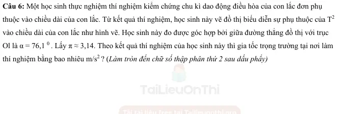{ loading=lazy }

#### Bài PDF 118

<!-- source-id: BT-Chuong-I-p178-q7-453 -->

Câu 7. Một chất điểm có khối lượng m = 50g dao động điều hòa có đồ thị động năng theo thời gian của chất
điểm như hình bên. Biên độ dao động của chất điểm bằng bao nhiêu centimet? (Làm tròn đến chữ số thập
phân thứ 2 sau dấu phẩy)

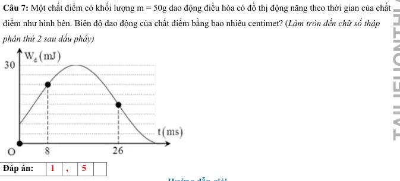{ loading=lazy }

### Vận dụng — Trắc nghiệm 4 lựa chọn

#### Bài PDF 119

<!-- source-id: BT-Chuong-I-p96-q34-270 -->

Câu 34. Một con lắc lò xo dao động theo phương ngang với cơ năng dao động là 1 J và lực đàn hồi cực
đại là 10 N. Mốc thế năng tại vị trí cân bằng. Gọi Q là đầu cố định của lò xo, khoảng thời gian ngắn nhất
giữa 2 lần liên tiếp Q chịu tác dụng lực kéo của lò xo có độ lớn là 5 3 (N) là 0,1 s. Quãng đường lớn nhất
mà vật nhỏ con lắc đi được trong 0,4s là
A. 60 cm.

B. 115 cm.

C. 80 cm.

D. 40 cm.

#### Bài PDF 120

<!-- source-id: BT-Chuong-I-p97-q35-271 -->

Câu 35. Một con lắc đơn gồm một vật nặng khối lượng m
100g
=
, con lắc có chiều dài dây treo là
λ, dao động tại nơi có gia tốc trọng trường
2
g
10m/ s
=
. Kéo con lắc khỏi vị trí cân bằng rồi
buông nhé, trong quá trình dao động lực căng dây cực tiểu nếu bỏ qua ma sát là 0,5N . Gốc thế
năng tại vị trí cân bằng. Khi dây treo hợp với phương thẳng đứng một góc 30οthì tỉ số giữa động
năng và thế năng là:
A. 0,73.

B. 2,73.

C. 0,5.

D. 0,96.

#### Bài PDF 121

<!-- source-id: BT-Chuong-I-p97-q36-272 -->

Câu 36. Một vật có khối lượng 2kg dao động điều hòa có đồ thị vận tốc – thời gian như Hình 3.3.
Động năng cực đại của vật trong quá trình dao động là:

Hình 3.3. Đồ thị vận tốc – thời gian của vật dao động.
A. 0,16 J.

B. 6,16 mJ.

C. 0,16 mJ.

D. 0,96 mJ.

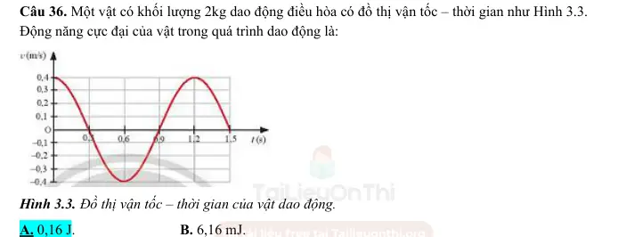{ loading=lazy }

#### Bài PDF 122

<!-- source-id: BT-Chuong-I-p98-q37-273 -->

Câu 37. Đồ thị hình 3.4 mô tả sự thay đổi động năng theo li độ của quả cầu có khối lượng 0,4kg
trong một con lắc lò xo treo thẳng đứng. Xác định: Thế năng của con lắc lò xo khi quả cầu ở vị trí
có li độ 2cm là

A. 60 mJ.

B. 20 mJ.
C. 80 mJ.

D. 100 mJ.

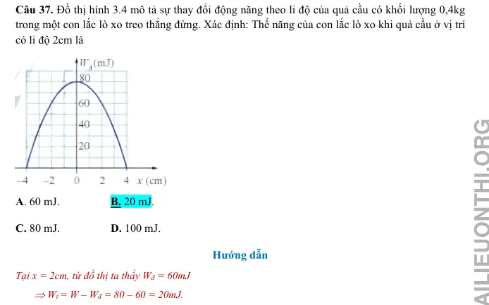{ loading=lazy }

#### Bài PDF 123

<!-- source-id: BT-Chuong-I-p98-q38-274 -->

Câu 38. Một chất điểm dao động điều hoà trên trục Ox với biên độ 10 cm, chu kỳ 2s. Mốc thế
năng ở vị trí cân bằng. Tốc độ trung bình của chất điểm trong khoảng thời gian ngắn nhất khi chất
điểm đi từ vị trí có động năng bằng 3 lần thế năng đến vị trí có động năng bằng 1
3  lần thế năng là
A. 26,12 cm/s.

B. 21,96 cm/s.

C. 7,32 cm/s.
D. 14,64 cm/s.

#### Bài PDF 124

<!-- source-id: BT-Chuong-I-p99-q39-275 -->

Câu 39. Một con lắc lò xo đang dao động điều hòa. Hình bên là đồ thị biểu diễn sự phụ thuộc
của động năng Wđ của con lắc theo thời gian t. Biết 3
2
 –   0,25
t
t
s
=
. Giá trị của 4
1
 –
t
t  là

A. 0,54 s.

B. 0,40 s.

C. 0,45 s.

D. 0,50 s.

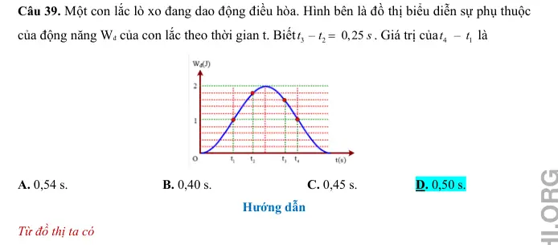{ loading=lazy }

#### Bài PDF 125

<!-- source-id: BT-Chuong-I-p167-q36-428 -->

Câu 36. Một vật có khối lượng m = 100 g dao động điều hòa với chu kì T = π/10 s, biên độ 5 cm. Tại vị trí
vật có gia tốc a = 1200 cm/s2 thì động năng của vật bằng
A. 320 J.
B. 160J
C. 32 mJ.
D. 16 mJ.

#### Bài PDF 126

<!-- source-id: BT-Chuong-I-p168-q37-429 -->

Câu 37. Tỉ số thế năng và cơ năng của một vật dao động điều hoà tại thời điểm tốc độ của vật bằng 25% tốc
độ cực đại là

A. 15
16
.
B. 1
16
.
C. 1
4
.
D. 3
4
.

#### Bài PDF 127

<!-- source-id: BT-Chuong-I-p168-q38-430 -->

Câu 38. Một vật dao động điều hòa dọc theo trục Ox. Mốc thế năng ở vị trí cân bằng, ở thời điểm độ lớn
vận tốc của vật bằng 50% vận tốc cực đại thì tỉ số giữa động năng và cơ năng của vật là
A. 3/4.
B. 1/4.
C. 4/3.
D. 1/2

#### Bài PDF 128

<!-- source-id: BT-Chuong-I-p168-q39-431 -->

Câu 39. Một vật dao động điều hòa với biên độ 6 cm. Mốc thế năng ở vị trí cân bằng. Khi vật có động năng
bằng 3/4 lần cơ năng thì vật cách vị trí cân bằng một đoạn
A. 6 cm.
B. 4,5 cm.
C. 4 cm.
D. 3 cm.

#### Bài PDF 129

<!-- source-id: BT-Chuong-I-p168-q40-432 -->

Câu 40. Một vật nhỏ khối lượng 85 g dao động điều hòa với chu kỳ π/10 s. Tại vị trí vật có tốc độ 40 cm/s
thì gia tốc của nó là 8 m/s2. Năng lượng dao động là
A. 1360 J
B. 34 J
C. 34 mJ
D. 13,6 mJ.

#### Bài PDF 130

<!-- source-id: BT-Chuong-I-p169-q41-433 -->

Câu 41. Treo lần lượt hai vật nhỏ có khối lượng m và 2m vào cùng một lò xo và kích thích cho chúng dao
động điều hòa với cùng một cơ năng nhất định. Tỉ số biên độ của trường hợp 1 và trường hợp 2 là

A. l.
B. 2.
C.
 .
D.
 .

#### Bài PDF 131

<!-- source-id: BT-Chuong-I-p169-q42-434 -->

Câu 42. Một vật nhỏ khối lượng 1 kg thực hiện dao động điều hòa với biên độ 0,1 m. Động năng của vật
biến thiên với chu kì bằng 0,25π s. Cơ năng dao động là
A. 0,32 J.
B. 0,64 J.
C. 0,08 J.
D. 0,16 J.

#### Bài PDF 132

<!-- source-id: BT-Chuong-I-p169-q43-435 -->

Câu 43. Một vật dao động điều hòa theo phương ngang với biên độ 2 cm. Tỉ số động năng và thế năng của
vật tại li độ 1,5 cm là
A. 7/9.
B. 9/7.
C. 7/16.
D. 9/16.

#### Bài PDF 133

<!-- source-id: BT-Chuong-I-p169-q44-436 -->

Câu 44. Trong một dao động điều hòa, khi vận tốc của vật bằng một nửa vận tốc cực đại của nó thì tỉ số
giữa thế năng và động năng là
A. 2.
B. 3.
C. 4
D. 5.

#### Bài PDF 134

<!-- source-id: BT-Chuong-I-p169-q45-437 -->

Câu 45. Một vật dao động điều hoà, tại vị trí động năng gấp 2 lần thế năng thì gia tốc của vật nhỏ hơn gia
2
1/
2

tốc cực đại
A. 2 lần.
B. 2 lần.
C. 3 lần.
D. 3lần.

#### Bài PDF 135

<!-- source-id: BT-Chuong-I-p170-q46-438 -->

Câu 46. Một vật dao động điều hòa với phương trình: x = l,25cos(20t) cm (t đo bằng giây). Vận tốc tại vị trí
mà động năng lớn hơn thế năng 3 lần là
A. ±25 cm/s.
B. ±21,65cm/s.
C. ±10 cm/s.
D. ±7,5 cm/s.

#### Bài PDF 136

<!-- source-id: BT-Chuong-I-p170-q47-439 -->

Câu 47. Một con lắc lò xo gồm một vật nhỏ và lò xo nhẹ có độ cứng 100 N/m. Con lắc dao động điều hòa
theo phương ngang với phương trình x = Acos(ωt + φ). Mốc thế năng tại vị trí cân bằng. Khoảng thời gian
giữa hai lần liên tiếp con lắc có động năng bằng thế năng là 0,1 s. Lấy π2 = 10 . Khối lượng vật nhỏ bằng
A. 400 g.
B. 140 g.
C. 200 g.
D. 100 g.

#### Bài PDF 137

<!-- source-id: BT-Chuong-I-p171-q48-440 -->

Câu 48. Con lắc lò xo dao động điều hoà với chu kì T. Đồ thị biểu diễn sự biến đối động năng và thế năng
theo thời gian cho ở hình vẽ. Chu kì T bằng

A. 0,2s
B. 0,6s

C. 0,8s.
D. 0,4s.

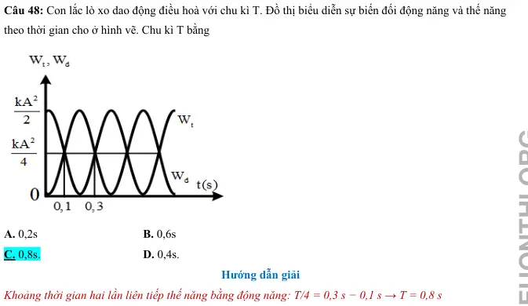{ loading=lazy }

#### Bài PDF 138

<!-- source-id: BT-Chuong-I-p171-q49-441 -->

Câu 49. Một vật có khối lượng 400g dao động điều hòa có đồ thị động năng như hình vẽ. Tại thời điểm t =
0 vật đang chuyển động theo chiều dương, lấy π2 =10. Phương trình dao động của vật là

A. x = 5cos(2πt +
π
3) cm.

B. x =10cos(πt +
π
6) cm.
C. x = 5cos(2πt –π/3) cm.

D. x =10cos(πt – π/3) cm.

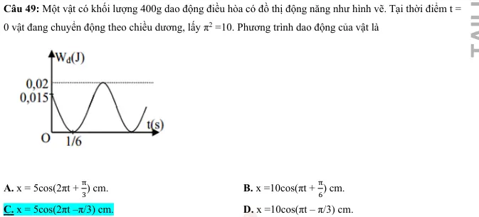{ loading=lazy }

#### Bài PDF 139

<!-- source-id: BT-Chuong-I-p172-q50-442 -->

Câu 50. Một vật có khối lượng100g dao động điều hòa có đồ thị thế năng như hình vẽ. Tại thời điểm t = 0
vật có gia tốc âm, lấy π2 =10. Phương trình vận tốc của vật là

A. v = 60π.cos(5πt + π/4) cm/s.
B. v = 60πsin(5πt +
3π
4 ) cm/s.
C. v = 60πcos(10πt + 3π/4) cm/s.
D. v = 60π.cos(10πt + π/4) cm/s.

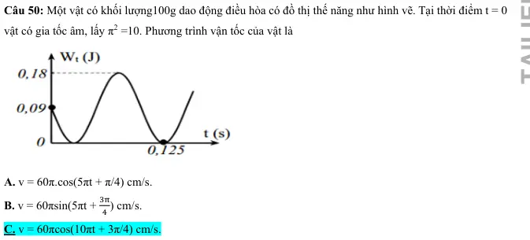{ loading=lazy }

#### Bài PDF 140

<!-- source-id: BT-Chuong-I-p180-q1-454 -->

Câu 1. Trong dao động điều hòa của một vật thì tập hợp ba đại lượng nào sau đây là không thay đổi theo
thời gian
A. vận tốc, lực, năng lượng toàn phần.
B. biên độ, tần số, gia tốc.
C. biên độ, tần số, năng lượng toàn phần.
D. gia tốc, chu kỳ, lực.

#### Bài PDF 141

<!-- source-id: BT-Chuong-I-p180-q2-455 -->

Câu 2. Trong dao động điều hòa
A. khi gia tốc cực đại thì động năng cực tiểu.

B. khi cơ năng cực tiểu thì thế năng cực đại.
C. khi động năng cực đại thì thế năng cũng cực đại.
D. khi vận tốc cực đại thì pha dao động cũng cực đại.

#### Bài PDF 142

<!-- source-id: BT-Chuong-I-p180-q3-456 -->

Câu 3. Một vật dao động điều hoà với chu kỳ T, động năng của vật biến đổi theo thời gian
A. tuần hoàn với chu kỳ T.

B. tuần hoàn với chu kỳ 2T.
C. với một hàm sin hoặc cosin.
D. tuần hoàn với chu kỳ T/2.

#### Bài PDF 143

<!-- source-id: BT-Chuong-I-p180-q4-457 -->

Câu 4. Phát biểu nào sau đây về động năng và thế năng trong dao động điều hoà là sai?
A. Thế năng đạt giá trị cực tiểu khi độ lớn gia tốc của vật đạt giá trị cực tiểu.
B. Động năng đạt giá trị cực đại khi vật chuyển động qua vị trí cân bằng.
C. Thế năng đạt giá trị cực đại khi tốc độ của vật đạt giá trị cực đại.
D. Động năng đạt giá trị cực tiểu khi vật ở một trong hai vị trí biên.

#### Bài PDF 144

<!-- source-id: BT-Chuong-I-p181-q5-458 -->

Câu 5. Một vật có khối lượng m dao động điều hòa với biên độ A. Khi chu kì tăng 3 lần thì năng lượng của
vật sẽ
A. tăng 3 lần.
B. giảm 9 lần.
C. tăng 9 lần.
D. giảm 3 lần.

#### Bài PDF 145

<!-- source-id: BT-Chuong-I-p181-q6-459 -->

Câu 6. Trong dao động điều hoà khi động năng giảm đi 2 lần so với động năng cực đại thì
A. thế năng đối với vị trí cân bằng tăng hai lần.
B. li độ dao động tăng 2 lần.
C. vận tốc dao động giảm ξ2 lần.
D. gia tốc dao động tăng 2 lần.

#### Bài PDF 146

<!-- source-id: BT-Chuong-I-p181-q7-460 -->

Câu 7. Công thức tính chu kì dao động của con lắc lò xo là
A. T = 2π
k
m.
B. T = 2π
m
k .
C. T = 2
k
m .
π

D. T =
k
2
m.
π

#### Bài PDF 147

<!-- source-id: BT-Chuong-I-p181-q8-461 -->

Câu 8. Một con lắc đơn dao động điều hòa với tần số f. Nếu tăng khối lượng của con lắc lên 4 lần thì tần số
dao động của nó sẽ là
A. 2f.
B.
2 .f
C. f
2 .
D. f.

#### Bài PDF 148

<!-- source-id: BT-Chuong-I-p181-q9-462 -->

Câu 9. Một vật dao động điều hòa, đồ thị biểu diễn mối quan hệ giữa thế
năng Wt và động năng 𝑊đ có dạng đường nào?
A. Đường IV.
C. Đường III.
B. Đường I.
D. Đường II.

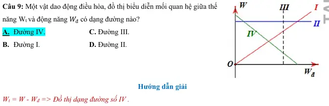{ loading=lazy }

#### Bài PDF 149

<!-- source-id: BT-Chuong-I-p181-q10-463 -->

Câu 10. Một con lắc đơn có độ dài dây là 2m, treo quả nặng 1 kg, kéo con lắc lệch khỏi vị trí cân bằng góc
600 rồi buông tay. Thế năng cực đại của con lắc đơn bằng
A. 1 J
B. 5 J .
C. 10 J .
D. 15 J.

#### Bài PDF 150

<!-- source-id: BT-Chuong-I-p182-q11-464 -->

Câu 11. Một con lắc lò xo gồm lò xo có độ cứng 40 N/m gắn với quả cầu có khối lượng m. Cho quả cầu dao
động với biên độ 5 cm. Động năng của quả cầu ở vị trí ứng li độ 3 cm bằng
A. 0,032 J.
B. 320 J.
C. 0,018 J.
  D. 0,5 J.

#### Bài PDF 151

<!-- source-id: BT-Chuong-I-p182-q12-465 -->

Câu 12. Một con lắc lò xo gồm viên bi nhỏ và lò xo nhẹ có độ cứng 100 N/m, dao động điều hòa với biên
độ 0,1 m. Mốc thế năng ở vị trí cân bằng. Khi viên bi cách biên 6 cm thì động năng của con lắc bằng
A. 0,64 J.
B. 4,2 mJ.
C. 6,4 mJ.
D. 0,42 J.

#### Bài PDF 152

<!-- source-id: BT-Chuong-I-p182-q13-466 -->

Câu 13. Vật nhỏ của một con lắc lò xo có khối lượng 100 g dao động điều hòa với chu kì 0,2s, cơ năng là
0,18J  (mốc thế năng tại vị trí cân bằng), lấy π2 = 10. Tại li độ 3 2 cm, tỉ số động năng và thế năng bằng

A. 3.
B. 4.
C. 2
D. 1.

#### Bài PDF 153

<!-- source-id: BT-Chuong-I-p182-q14-467 -->

Câu 14. Con lắc lò xo dao động với biên độ 6 cm. Li độ của vật để thế năng của lò xo bằng 1/3 động năng là
 A.  ±3ξ2𝑐𝑚.
B.  ±3𝑐𝑚.
C.  ±2ξ2𝑐𝑚.
D.  ±ξ2𝑐𝑚.

#### Bài PDF 154

<!-- source-id: BT-Chuong-I-p182-q15-468 -->

Câu 15. Một con lắc đơn có khối lượng m = 10 kg và chiều dài dây treo l = 2 m. Góc lệch cực đại so với
đường thẳng đứng là 𝛼= 100 = 0,175 𝑟𝑎𝑑. Lấy 𝑔= 10 𝑚/𝑠2. Cơ năng của con lắc và vận tốc vật nặng
khi nó ở vị trí thấp nhất là
A.  W = 0,1525J; 𝑉𝑚𝑎𝑥 = 0,055 m/s.
B.  W = 1,525J; 𝑉𝑚𝑎𝑥= 0,55 m/s.
C.  W = 30,45J; 𝑉𝑚𝑎𝑥 = 7,8 m/s.
D.  W = 3,063J; 𝑉𝑚𝑎𝑥= 0,78 m/s.

#### Bài PDF 155

<!-- source-id: BT-Chuong-I-p183-q16-469 -->

Câu 16. Một vật nhỏ có khối lượng 2/π2 g dao động điều hòa với tần số 5 Hz, và biên độ 5 cm. Cơ năng dao
động bằng

A. 2,5 J.
B. 250 J.
C. 0,25 J.
D. 0,5 J.

#### Bài PDF 156

<!-- source-id: BT-Chuong-I-p183-q17-470 -->

Câu 17. Một con lắc lò xo dao động điều hòa với biên độ A = 10 cm. Đồ
thị biểu diễn mối liên hệ giữa động năng và vận tốc của vật dao động được
cho như hình vẽ. Chu kì và độ cứng của lò xo lần lượt là
A. 1 s và 4 N/m.
B. 2π s và 40 N/m.
C. 2π s và 4 N/m.
D. 1 s và 40 N/m.

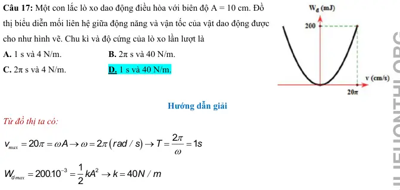{ loading=lazy }

#### Bài PDF 157

<!-- source-id: BT-Chuong-I-p183-q18-471 -->

Câu 18. Một vật nhỏ dao động điều hòa dọc theo trục Ox. Khi vật cách vị trí cân bằng một đoạn 2 cm thì
động năng của vật là 0,48 J. Khi vật cách vị trí cân bằng một đoạn 6 cm thì động năng của vật là 0,32 J. Biên
độ dao động của vật bằng
A. 8 cm.
B. 14 cm.
C. 10 cm.
D. 12 cm.

### Vận dụng — Đúng/Sai

#### Bài PDF 158

<!-- source-id: BT-Chuong-I-p174-q1-443 -->

Câu 1. Trong các phát biểu sau, ý nào đúng, ý nào sai về năng lượng trong dao động điều hòa:

Phát biểu
Đúng
Sai
a
Năng lượng toàn phần của một vật dao động điều hòa luôn luôn không đổi theo
thời gian.
Đ

b
Tại vị trí cân bằng của vật dao động điều hòa, thế năng của vật đạt giá trị cực
đại.

S
c
Khi biên độ dao động của vật tăng gấp đôi, năng lượng toàn phần của dao động
tăng gấp bốn lần.
Đ

d
Động năng của vật dao động điều hòa tại vị trí cân bằng bằng 0.

S

#### Bài PDF 159

<!-- source-id: BT-Chuong-I-p174-q2-444 -->

Câu 2. Trong các phát biểu sau, phát biểu nào đúng, phát biểu nào sai:

Phát biểu
Đúng
Sai
a
Cơ năng của một vật dao động điều hòa biến thiên tuần hoàn theo thời gian
với chu kỳ bằng một nửa chu kỳ dao động của vật.

S
b
Cơ năng của một vật dao động điều hòa bằng động năng của vật tại vị trí cân
bằng.
Đ

c
Cơ năng của một vật dao động điều hòa bằng tổng động năng và thế năng của
vật.
Đ

d
Trong mỗi chu kì dao động, có 2 lần động năng bằng thế năng.

S

#### Bài PDF 160

<!-- source-id: BT-Chuong-I-p174-q3-445 -->

Câu 3. Một vật có khối lượng 100g dao động điều hoà có đồ thị động năng như hình vẽ. Tại thời điểm t = 0
vật có gia tốc âm, lấy
2
10
π=
.

Phát biểu
Đúng
Sai
a Động năng cực đại của vật có giá trị
3
8010
.
mJ
−

S
b Tại thời điểm ban đầu, Wt = 4Wđ

S
c Cơ năng của vật có giá trị
3
32010
.
mJ
−

S
d Tần số góc của dao động
10
3
/
rad
s
π
ω=

Đ

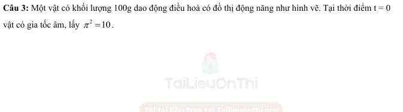{ loading=lazy }

#### Bài PDF 161

<!-- source-id: BT-Chuong-I-p175-q4-446 -->

Câu 4. Hai chất Hai chất điểm có khối lượng lần lượt là m1, m2 dao động điều hòa cùng phương cùng tần
số. Đồ thị biểu diễn động năng của m1 và thế năng của m2 theo li độ như hình vẽ.

Phát biểu
Đúng Sai
a
Hai vật dao động với cùng biên độ

S
b
Năng lượng dao động của hai vật là bằng nhau
Đ

c
Trong một chu kì, có 2 thời điểm động năng vật 1 bằng với thế năng vật 2

S
d
1
2
2
3
A
A =

Đ

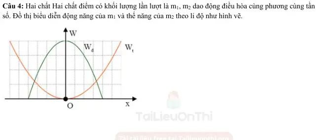{ loading=lazy }

