# Bài tập — Bài 6 — Năng lượng trong dao động

[← Trở lại bài học](../../06-oscillation-energy.md)

## Phần A — Trắc nghiệm 4 lựa chọn

### Bài 1 — Mức 1 — Nhận biết

Cơ năng của con lắc lò xo dao động điều hòa là

A. $\frac12kA^2$.

B. $kA^2$.

C. $\frac12mA^2$.

D. $m\omega A$.

??? success "Đáp án và lời giải"
    Chọn **A**. $W=\frac12kA^2=\frac12m\omega^2A^2$.

### Bài 2 — Mức 1 — Nhận biết

Khi $|x|=A/2$, tỉ số thế năng trên cơ năng bằng

A. $1/2$.

B. $1/4$.

C. $3/4$.

D. $1$.

??? success "Đáp án và lời giải"
    Chọn **B** vì $W_t/W=x^2/A^2=1/4$.

### Bài 3 — Mức 1 — Nhận biết

Khi động năng bằng thế năng, độ lớn li độ bằng

A. $A/2$.

B. $A/\sqrt2$.

C. $A\sqrt3/2$.

D. $0$.

??? success "Đáp án và lời giải"
    Chọn **B**. $W_t=W_d=W/2$ nên $x^2/A^2=1/2$.

### Bài 4 — Mức 1 — Nhận biết

Trong dao động điều hòa lí tưởng, đại lượng nào không đổi theo thời gian?

A. Động năng.

B. Thế năng.

C. Cơ năng.

D. Công suất tức thời của lực kéo về.

??? success "Đáp án và lời giải"
    Chọn **C** nếu không có lực cản hay tác động làm thay đổi cơ năng.

## Phần B — Đúng/Sai

### Bài 5 — Mức 2 — Thông hiểu

Xét dao động điều hòa lí tưởng:

a) Động năng cực đại ở vị trí cân bằng.

b) Thế năng cực đại ở hai biên.

c) Động năng và thế năng biến thiên với cùng chu kì bằng $T$.

d) Tổng động năng và thế năng không đổi.

??? success "Đáp án và lời giải"
    a) **Đúng.** Tại $x=0$, thế năng đàn hồi nhỏ nhất; vì cơ năng bảo toàn nên động năng đạt cực đại.

    b) **Đúng.** Tại hai biên $|x|=A$, thế năng $W_t=\tfrac12kx^2$ đạt giá trị lớn nhất.

    c) **Sai.** mỗi năng lượng biến thiên với chu kì $T/2$.

    d) **Đúng.** Trong dao động điều hòa lí tưởng, cơ năng $W=W_\mathrm{đ}+W_t$ được bảo toàn.

### Bài 6 — Mức 2 — Thông hiểu

Một con lắc lò xo có biên độ tăng từ $A$ lên $2A$ trong khi $k$ không đổi:

a) Cơ năng tăng 2 lần.

b) Cơ năng tăng 4 lần.

c) Tốc độ cực đại tăng 2 lần.

d) Gia tốc cực đại tăng 2 lần.

??? success "Đáp án và lời giải"
    a) **Sai.** Vì $W=\tfrac12kA^2$, khi biên độ tăng từ $A$ lên $2A$ thì cơ năng tăng $4$ lần, không phải $2$ lần.

    b) **Đúng.** vì $W\propto A^2$.

    c) **Đúng.** vì $v_{\max}=\omega A$.

    d) **Đúng.** vì $a_{\max}=\omega^2A$.

## Phần C — Trả lời ngắn

### Bài 7 — Mức 3 — Vận dụng

Con lắc lò xo có $k=50\,\mathrm{N/m}$, $A=6\,\mathrm{cm}$. Tính cơ năng.

??? success "Đáp án và lời giải"
    $W=\frac12kA^2=\frac12\cdot50\cdot0,06^2=0,09\,\mathrm J$.

### Bài 8 — Mức 3 — Vận dụng

Một vật dao động điều hòa có cơ năng $0,20\,\mathrm J$. Tại một vị trí, thế năng bằng $0,05\,\mathrm J$. Tính động năng và tỉ số $|v|/v_{\max}$.

??? success "Đáp án và lời giải"
    $W_d=W-W_t=0,15\,\mathrm J$. Vì $W_d/W=v^2/v_{\max}^2$, ta có $|v|/v_{\max}=\sqrt{0,15/0,20}=\sqrt3/2$.

### Bài 9 — Mức 3 — Vận dụng

Tại một vị trí, động năng bằng 3 lần thế năng. Tìm $|x|/A$.

??? success "Đáp án và lời giải"
    $W_d=3W_t$ nên $W=4W_t$. Do $W_t/W=x^2/A^2=1/4$, suy ra $|x|/A=1/2$.

## Phần D — Vận dụng và vận dụng cao

### Bài 10 — Mức 4 — Vận dụng cao

Một con lắc lò xo có $m=0,25\,\mathrm{kg}$, $k=100\,\mathrm{N/m}$. Tại một thời điểm vật có $x=3\,\mathrm{cm}$ và $v=0,40\,\mathrm{m/s}$. Tính biên độ và cơ năng của dao động.

??? success "Đáp án và lời giải"
    Tần số góc $\omega=\sqrt{k/m}=\sqrt{100/0,25}=20\,\mathrm{rad/s}$.

    Dùng hệ thức độc lập:

    $A^2=x^2+v^2/\omega^2=0,03^2+0,40^2/20^2=0,0009+0,0004=0,0013$.

    Suy ra $A=\sqrt{0,0013}\approx0,0361\,\mathrm m$ $=3,61\,\mathrm{cm}$.

    Cơ năng:

    $W=\frac12kA^2=50\cdot0,0013=0,065\,\mathrm J$.

    Có thể kiểm tra lại bằng $W=\frac12kx^2+\frac12mv^2=0,045+0,020=0,065\,\mathrm J$.

## Ngân hàng bài tập mở rộng

### Nhận biết — Trả lời ngắn

#### Bài 11

<!-- source-id: BT-Chuong-I-p105-q1-281 -->

Con lắc lò xo có khối lượng $m=400$ g, độ cứng $k=160\,\mathrm{N/m}$ dao động điều hòa theo phương thẳng đứng. Biết khi vật có li độ $2\,\mathrm{cm}$ thì vận tốc của vật bằng $40\,\mathrm{cm/s}$. Năng lượng dao động của vật là bao nhiêu J? (Làm tròn đến chữ số thập phân thứ 2 sau dấu phẩy.)

??? success "Đáp án và lời giải"
    **Đáp án:** $0{,}06$

    **Hướng dẫn giải:**

    Tại li độ $x=0{,}02\,\mathrm m$ và vận tốc $v=0{,}4\,\mathrm{m/s}$, cơ năng là

    $W=\dfrac12kx^2+\dfrac12mv^2=\dfrac12\cdot160\cdot(0{,}02)^2+\dfrac12\cdot0{,}4\cdot(0{,}4)^2\approx0{,}06\,\mathrm J$.

    Vậy kết quả cần tìm là **$0{,}06\,\mathrm J$**.

#### Bài 12

<!-- source-id: BT-Chuong-I-p105-q2-282 -->

Tại vị trí cân bằng, truyền cho quả nặng một năng lượng ban đầu $22,5\,\mathrm{mJ}$ để quả nặng dao động điều hòa theo phương thẳng đứng xung quanh vị trí cân bằng. Lấy $g=10\,\mathrm{m/s}^2$. Độ cứng của lò xo là $k=18\,\mathrm{N/m}$. Chiều dài quỹ đạo của vật bằng bao nhiêu cm?

??? success "Đáp án và lời giải"
    **Đáp án:** $10$

    **Hướng dẫn giải:**

    Tại vị trí cân bằng, năng lượng ban đầu là cơ năng của dao động:

    $E=\dfrac12kA^2\Rightarrow A=\sqrt{\dfrac{2E}{k}}=\sqrt{\dfrac{2\cdot22{,}5\times10^{-3}}{18}}=0{,}05\,\mathrm m$ $=5\,\mathrm{cm}$.

    Chiều dài quỹ đạo là $2A=10\,\mathrm{cm}$.

    Vậy kết quả cần tìm là **$10\,\mathrm{cm}$**.

#### Bài 13

<!-- source-id: BT-Chuong-I-p105-q3-283 -->

Con lắc lò xo nằm ngang có $k=100\,\mathrm{N/m}$, $m=1\,\mathrm{kg}$, dao động điều hòa. Khi vật có động năng $10\,\mathrm{mJ}$ thì cách vị trí cân bằng $1\,\mathrm{cm}$. Khi vật có động năng $5\,\mathrm{mJ}$ thì cách vị trí cân bằng bao nhiêu centimet? (Làm tròn đến hai chữ số sau dấu phẩy.)

??? success "Đáp án và lời giải"
    **Đáp án:** $1{,}41\,\mathrm{cm}$

    **Hướng dẫn giải:**

    Ta có $W=10\,\mathrm{mJ}+\tfrac12\cdot100\cdot0{,}01^2=15\,\mathrm{mJ}$. Ở trạng thái sau, $W_\mathrm{t}=W-W_\mathrm{đ}=15-5=10\,\mathrm{mJ}$. Suy ra $\tfrac12kx_2^2=0{,}010\,\mathrm J$, nên $|x_2|=\sqrt{2\cdot0{,}010/100}=0{,}01414\,\mathrm m\approx1{,}41\,\mathrm{cm}$.
#### Bài 14

<!-- source-id: BT-Chuong-I-p105-q4-284 -->

<!-- source-note: Phần hướng dẫn của PDF không nhất quán với phương trình đã in; kết quả hiện tại được tính lại trực tiếp từ phương trình đề bài. -->
Một con lắc đơn có khối lượng của vật nặng là $200\,\mathrm g$ dao động với phương trình

$$
s=10\sin(2\pi t)\ \text{cm}.
$$

Ở thời điểm $t=\pi/6\,\mathrm s$, con lắc có động năng là bao nhiêu? (Tính theo đơn vị mJ.)

??? success "Đáp án và lời giải"
    **Đáp án:** $W_\mathrm{đ}\approx38{,}62\,\mathrm{mJ}$.

    **Hướng dẫn giải:**

    Đổi sang SI: $s=0{,}1\sin(2\pi t)\,\mathrm m$. Vì vậy

    $v=\dfrac{ds}{dt}=0{,}2\pi\cos(2\pi t)\,\mathrm{m/s}$.

    Tại $t=\pi/6\,\mathrm s$:

    $v=0{,}2\pi\cos(\pi^2/3)\,\mathrm{m/s}$.

    Suy ra

    $W_\mathrm{đ}=\dfrac12mv^2=0{,}004\pi^2\cos^2(\pi^2/3)\,\mathrm J$ $\approx38{,}62\,\mathrm{mJ}$.

#### Bài 15

<!-- source-id: BT-Chuong-I-p106-q5-285 -->

Động năng dao động của một con lắc lò xo được mô tả theo thế năng dao động của nó bằng đồ thị như hình vẽ. Cho biết khối lượng của vật bằng $100$ g, vật dao động giữa hai vị trí cách nhau $8\,\mathrm{cm}$. Tính tần số góc của dao động của con lắc lò xo. (Làm tròn đến 2 chữ số thập phân.)

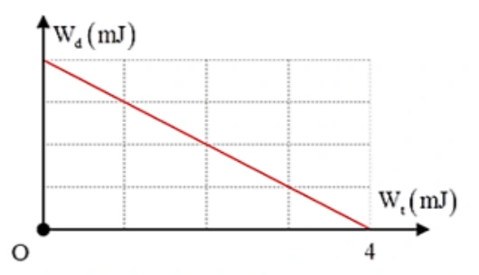{ loading=lazy }

??? success "Đáp án và lời giải"
    **Đáp án:** $7{,}07$

    **Hướng dẫn giải:**

    Từ đồ thị, cơ năng $W=W_{\mathrm t,\max}=4\,\mathrm{mJ}$. Hai vị trí biên cách nhau $8\,\mathrm{cm}$ nên $A=4\,\mathrm{cm}$ $=0{,}04\,\mathrm m$. Với $m=0{,}1\,\mathrm{kg}$:

    $W=\frac12m\omega^2A^2 \quad\Rightarrow\quad \omega=\sqrt{\frac{2W}{mA^2}} =\sqrt{\frac{2\cdot4\cdot10^{-3}}{0{,}1\cdot(0{,}04)^2}} =5\sqrt2\approx7{,}07\ \text{rad/s}.$

#### Bài 16

<!-- source-id: BT-Chuong-I-p106-q6-286 -->

Một vật có khối lượng $2\,\mathrm{kg}$ dao động điều hòa có đồ thị vận tốc – thời gian như hình .
Xác định động năng cực đại của vật trong quá trình dao động theo đơn vị Jun.

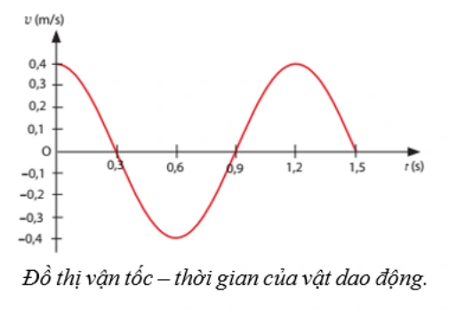{ loading=lazy }

??? success "Đáp án và lời giải"
    **Đáp án:** $0{,}16\,\mathrm J$

    **Hướng dẫn giải:**

    Đồ thị cho $v_\max=0{,}40\,\mathrm{m/s}$. Với $m=2\,\mathrm{kg}$, $W_\mathrm{đ,max}=\tfrac12mv_\max^2=\tfrac12\cdot2\cdot0{,}40^2=0{,}16\,\mathrm J$.
#### Bài 17

<!-- source-id: BT-Chuong-I-p113-q1-309 -->

Một con lắc đơn có chiều dài $1\,\mathrm m$ khối lượng 100 g dao động trong mặt phẳng thẳng đứng
đi qua điểm treo tại nơi có g = $10\,\mathrm{m/s^2}$. Lấy mốc thế năng ở vị trí cân bằng. Bỏ qua mọi ma sát.
Khi sợi dây treo hợp với phương thẳng đứng một góc 30° thì tốc độ của vật nặng là $0,3\,\mathrm{m/s}$. Cơ
năng của con lắc đơn là bao nhiêu Jun? (làm tròn đến 2 số thập phân)

??? success "Đáp án và lời giải"
    **Đáp án:** $0{,}14\,\mathrm J$

    **Hướng dẫn giải:**

    Cơ năng tại trạng thái đã cho là tổng động năng và thế năng: $W=\tfrac12mv^2+mg\ell(1-\cos30^\circ)$. Thay $m=0{,}10\,\mathrm{kg}$, $v=0{,}30\,\mathrm{m/s}$, $g=10\,\mathrm{m/s^2}$, $\ell=1\,\mathrm m$ được $W\approx0{,}0045+0{,}13397=0{,}13847\,\mathrm J\approx0{,}14\,\mathrm J$.
#### Bài 18

<!-- source-id: BT-Chuong-I-p113-q2-310 -->

Một con lắc lò xo gồm lò xo nhẹ và vật nhỏ dao động điều hòa theo phương ngang với tần
số góc $10\,\mathrm{rad/s}$. Biết rằng khi động năng và thế năng (mốc ở vị trí cân bằng của vật) bằng nhau
thì vận tốc của vật có độ lớn bằng $0{,}6\sqrt2\,\mathrm{m/s}$. Biên dộ dao của con lắc là bao nhiêu mét?

??? success "Đáp án và lời giải"
    **Đáp án:** $0{,}12\,\mathrm m$

    **Hướng dẫn giải:**

    Khi $W_\mathrm{đ}=W_\mathrm{t}$, động năng bằng nửa cơ năng nên $|v|=v_\max/\sqrt2$. Với $|v|=0{,}6\sqrt2\,\mathrm{m/s}$, suy ra $v_\max=1{,}2\,\mathrm{m/s}$. Do $v_\max=\omega A$ và $\omega=10\,\mathrm{rad/s}$, $A=1{,}2/10=0{,}12\,\mathrm m$.
#### Bài 19

<!-- source-id: BT-Chuong-I-p114-q3-311 -->

Một con lắc lò xo gồm lò xo có độ cứng $k=100\,\mathrm{N/m}$, vật nặng có khối lượng $m=200\,\mathrm g$,
dao động điều hoà với biên độ $A=5\,\mathrm{cm}$. Xác định tốc độ của vật khi vật ở vị trí cân bằng bao
nhiêu mét/giây? (Làm tròn đến 2 số thập phân)

??? success "Đáp án và lời giải"
    **Đáp án:** $1{,}12\,\mathrm{m/s}$

    **Hướng dẫn giải:**

    Tần số góc $\omega=\sqrt{k/m}=\sqrt{100/0{,}20}=\sqrt{500}\,\mathrm{rad/s}$. Ở vị trí cân bằng tốc độ đạt cực đại: $v_\max=\omega A=\sqrt{500}\cdot0{,}05\approx1{,}12\,\mathrm{m/s}$.
#### Bài 20

<!-- source-id: BT-Chuong-I-p114-q5-313 -->

Hai chất điểm có khối lượng lần lượt là $m_1,m_2$ dao động điều hòa cùng phương, cùng tần số. Đồ thị biểu diễn động năng của vật 1 và thế năng của vật 2 theo li độ như hình vẽ. Xác định tỉ số $m_1/m_2$.

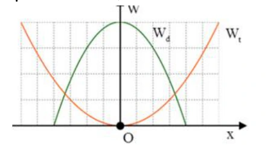{ loading=lazy }

??? success "Đáp án và lời giải"
    **Đáp án:** $2{,}25$

    **Hướng dẫn giải:**

    Đồ thị cho hai cơ năng bằng nhau, $W_1=W_2$, và các biên độ theo trục li độ là $A_1=4$ ô, $A_2=6$ ô. Hai dao động cùng tần số nên $W=\tfrac12m\omega^2A^2$. Vì vậy $m_1A_1^2=m_2A_2^2$, hay $m_1/m_2=(A_2/A_1)^2=(6/4)^2=9/4=2{,}25$.
#### Bài 21

<!-- source-id: BT-Chuong-I-p115-q6-314 -->

Một vật dao động điều hòa có li độ x được biểu diễn như hình bên. Cơ năng của vật là
$250\,\mathrm{mJ}$. Lấy $\pi^2=10$. Khối lượng vật là bao nhiêu kg?

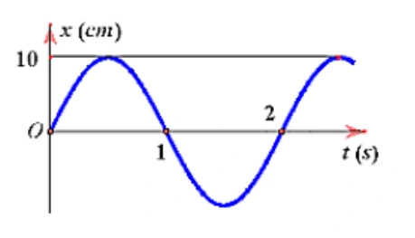{ loading=lazy }

??? success "Đáp án và lời giải"
    **Đáp án:** $5\,\mathrm{kg}$

    **Hướng dẫn giải:**

    Đồ thị li độ cho biên độ $A=10\,\mathrm{cm}=0{,}10\,\mathrm m$ và chu kì $T=2\,\mathrm s$, nên $\omega=\pi\,\mathrm{rad/s}$. Với $W=250\,\mathrm{mJ}=0{,}25\,\mathrm J$ và $\pi^2=10$, $m=2W/(\omega^2A^2)=0{,}50/(10\cdot0{,}01)=5\,\mathrm{kg}$.
#### Bài 22

<!-- source-id: BT-Chuong-I-p186-q1-475 -->

Một con lắc đơn có chiều dài $\ell=1{,}2\,\mathrm m$ dao động nhỏ với tần số góc $\omega=2{,}86\,\mathrm{rad/s}$ tại nơi có gia tốc trọng trường $g$. Giá trị của $g$ bằng bao nhiêu $\mathrm{m/s^2}$? (Làm tròn đến hai chữ số sau dấu phẩy.)

??? success "Đáp án và lời giải"
    **Đáp án:** $9{,}82\,\mathrm{m/s^2}$

    **Hướng dẫn giải:**

    Con lắc đơn góc nhỏ có $\omega=\sqrt{g/\ell}$. Do đó $g=\omega^2\ell=2{,}86^2\cdot1{,}2\approx9{,}82\,\mathrm{m/s^2}$.
#### Bài 23

<!-- source-id: BT-Chuong-I-p186-q2-476 -->

<!-- source-note: PDF đổi sai đơn vị từ J sang mJ; kết quả hiện tại dùng phép đổi đơn vị đúng. -->
Một vật nhỏ có khối lượng $m=100\,\mathrm g$, dao động điều hòa với biên độ $A=5\,\mathrm{cm}$ và chu kì $T=\pi\,\mathrm s$.
Động năng cực đại của vật bằng bao nhiêu miliJun?

??? success "Đáp án và lời giải"
    **Đáp án:** $0{,}5\,\mathrm{mJ}$.

    **Hướng dẫn giải:**

    Đổi đơn vị: $m=0{,}1\,\mathrm{kg}$, $A=0{,}05\,\mathrm m$. Với $T=\pi\,\mathrm s$,
    $\omega=\dfrac{2\pi}{T}=2\,\mathrm{rad/s}$.

    Động năng cực đại bằng cơ năng:
    $W_{\mathrm{đ,max}}=W=\dfrac12m\omega^2A^2=\dfrac12\cdot0{,}1\cdot2^2\cdot0{,}05^2=5\times10^{-4}\,\mathrm J$ $=0{,}5\,\mathrm{mJ}$.

#### Bài 24

<!-- source-id: BT-Chuong-I-p186-q3-477 -->

Một con lắc lò xo dao động điều hòa. Biết lò xo có độ cứng $36\,\mathrm{N/m}$ và vật nhỏ có khối lượng 100 g.
Lấy $\pi^2=10$. Động năng của con lắc biến thiên theo thời gian với tần số bao nhiêu?

??? success "Đáp án và lời giải"
    **Đáp án:** $6\,\mathrm{Hz}$.

    **Hướng dẫn giải:**

    Với $m=0{,}1\,\mathrm{kg}$,
    $\omega=\sqrt{\dfrac{k}{m}}=\sqrt{360}=6\sqrt{10}=6\pi\,\mathrm{rad/s}$, nên tần số dao động của vật là
    $f=\dfrac{\omega}{2\pi}=3\,\mathrm{Hz}$.

    Động năng biến thiên theo $\sin^2(\omega t+\varphi)$ nên có tần số gấp đôi tần số dao động:
    $f_{W_\mathrm{đ}}=2f=6\,\mathrm{Hz}$.

#### Bài 25

<!-- source-id: BT-Chuong-I-p187-q4-478 -->

Một con lắc đơn có khối lượng $2\,\mathrm{kg}$ và có độ dài $4\,\mathrm m$, dao động điều hòa ở nơi có gia tốc trọng
trường $9,8\,\mathrm{m/s^2}$. Cơ năng dao động của con lắc là $0,2205\,\mathrm J$. Biên độ góc (góc lệch lớn nhất) của con lắc bằng
bao nhiêu độ? (Làm tròn đến 1 số thập phân)

??? success "Đáp án và lời giải"
    **Đáp án:** $4{,}3^\circ$

    **Hướng dẫn giải:**

    Với góc nhỏ, $W\approx\tfrac12mg\ell\alpha_0^2$. Suy ra $\alpha_0=\sqrt{2W/(mg\ell)}=\sqrt{2\cdot0{,}2205/(2\cdot9{,}8\cdot4)}=0{,}075\,\mathrm{rad}\approx4{,}3^\circ$.
#### Bài 26

<!-- source-id: BT-Chuong-I-p187-q6-480 -->

Hai con lắc lò xo dao động điều hòa có động năng biến thiên theo thời gian như đồ thị, con lắc (1) là
đường liền nét và con lắc (2) là đường nét đứt. Vào thời điểm thế năng 2 con lắc bằng nhau thì tỉ số động
năng con lắc (1) và động năng con lắc (2) là bao nhiêu ?

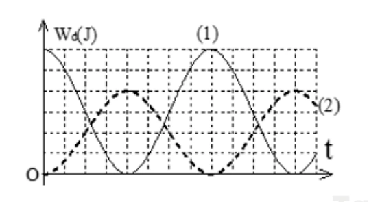{ loading=lazy }

??? success "Đáp án và lời giải"
    **Đáp án:** $2{,}25$

    **Hướng dẫn giải:**

    Từ đồ thị, cơ năng của hai con lắc lần lượt là $W_1=6$ và $W_2=4$ theo cùng đơn vị trên trục năng lượng. Khi $W_{\mathrm t1}=W_{\mathrm t2}=W_\mathrm t$, các pha biểu diễn trên đồ thị cho $W_\mathrm t/W_1+W_\mathrm t/W_2=1$, nên $W_\mathrm t=2{,}4$. Khi đó $W_{\mathrm đ1}=6-2{,}4=3{,}6$ và $W_{\mathrm đ2}=4-2{,}4=1{,}6$, do đó $W_{\mathrm đ1}/W_{\mathrm đ2}=2{,}25$.
### Nhận biết — Trắc nghiệm 4 lựa chọn

#### Bài 27

<!-- source-id: BT-Chuong-I-p90-q1-237 -->

Trong dao động điều hoà của con lắc lò xo, cơ năng của nó bằng

A. tổng động năng và thế năng của vật khi qua một vị trí bất kì.

B. thế năng của vật nặng khi qua vị trí cân bằng.

C. động năng của vật nặng khi qua vị trí biên.

D. động năng tại vị trí vật có li độ bất kì.

??? success "Đáp án và lời giải"
    **Đáp án:** A

    **Hướng dẫn giải:**

    Trong dao động điều hòa lí tưởng, cơ năng tại mọi vị trí thỏa $W=W_\mathrm{đ}+W_\mathrm{t}$. Ở vị trí cân bằng thế năng bằng 0, còn ở biên động năng bằng 0; vì vậy chỉ A đúng.
#### Bài 28

<!-- source-id: BT-Chuong-I-p90-q2-238 -->

Một con lắc lò xo dao động điều hoà, cơ năng toàn phần có giá trị là W thì tại vị trí

A. biên dao động động năng bằng W.

B. cân bằng động năng bằng W.

C. bất kì thế năng lớn hơn W.

D. bất kì động năng lớn hơn W.

??? success "Đáp án và lời giải"
    **Đáp án:** B

    **Hướng dẫn giải:**

    Tại vị trí cân bằng $x=0$ nên $W_\mathrm{t}=0$. Bảo toàn cơ năng cho $W_\mathrm{đ}=W$, do đó chọn B.
#### Bài 29

<!-- source-id: BT-Chuong-I-p90-q3-239 -->

Cơ năng của một vật dao động điều hòa

A. tăng gấp đôi khi biên độ dao động của vật tăng gấp đôi.

B. biến thiên tuần hoàn theo thời gian với chu kỳ bằng chu kỳ dao động của vật.

C. biến thiên tuần hoàn theo thời gian với chu kỳ bằng một nửa chu kỳ dao động của vật.

D. bằng động năng của vật khi vật tới vị trí cân bằng.

??? success "Đáp án và lời giải"
    **Đáp án:** D

    **Hướng dẫn giải:**

    Cơ năng của dao động điều hòa lí tưởng là hằng số $W=\tfrac12kA^2$. Khi vật qua vị trí cân bằng, $W_\mathrm{t}=0$ nên $W=W_\mathrm{đ,max}$; chọn D.
#### Bài 30

<!-- source-id: BT-Chuong-I-p90-q4-240 -->

Một chất điểm có khối lượng $m$ đang dao động điều hòa. Khi chất điểm có vận tốc $v$ thì động năng của nó là

A. $mv^2$.

B. $\dfrac{mv^2}{2}$.

C. $vm^2$.

D. $\dfrac{vm^2}{2}$.

??? success "Đáp án và lời giải"
    **Đáp án:** B

    **Hướng dẫn giải:**

    Động năng của chất điểm có khối lượng $m$ và tốc độ $v$ là $W_\mathrm{đ}=\tfrac12mv^2$. Vì vậy chọn B.
#### Bài 31

<!-- source-id: BT-Chuong-I-p90-q5-241 -->

Đối với một chất điểm dao động cơ điều hòa với chu kì T thì động năng và thế năng đều
biến thiên tuần hoàn theo thời gian

A. nhưng không điều hòa.

B. với chu kì T.

C. với chu kì T/2.

D. với chu kì 2T.

??? success "Đáp án và lời giải"
    **Đáp án:** C

    **Hướng dẫn giải:**

    Vì $W_\mathrm{t}\propto\cos^2(\omega t+\varphi)$ và $W_\mathrm{đ}\propto\sin^2(\omega t+\varphi)$, cả hai lặp lại sau $\pi/\omega=T/2$. Chọn C.
#### Bài 32

<!-- source-id: BT-Chuong-I-p90-q6-242 -->

<!-- source-alias-id: BT-Chuong-I-p163-q13-405 -->

Một con lắc lò xo gồm vật nhỏ và lò xo nhẹ có độ cứng $k$, đang dao động điều hòa. Mốc thế năng tại vị trí cân bằng. Biểu thức thế năng của con lắc ở li độ $x$ là

A. $2kx^2$.

B. $\dfrac{kx^2}{2}$.

C. $\dfrac{kx}{2}$.

D. $2kx$.

??? success "Đáp án và lời giải"
    **Đáp án:** B

    **Hướng dẫn giải:**

    Chọn mốc thế năng tại vị trí cân bằng, thế năng đàn hồi ở li độ $x$ là $W_\mathrm{t}=\tfrac12kx^2$. Chọn B.
#### Bài 33

<!-- source-id: BT-Chuong-I-p91-q7-243 -->

Cơ năng của một chất điểm dao động điều hoà tỷ lệ thuận với

A. bình phương biên độ dao động.

B. li độ của dao động.

C. biên độ dao động.

D. chu kỳ dao động.

??? success "Đáp án và lời giải"
    **Đáp án:** A

    **Hướng dẫn giải:**

    Với cùng con lắc, $W=\tfrac12kA^2$, nên cơ năng tỉ lệ với $A^2$. Chọn A.
#### Bài 34

<!-- source-id: BT-Chuong-I-p91-q8-244 -->

Chọn câu sai: Năng lượng của một vật dao động điều hòa

A. luôn luôn là một hằng số.

B. bằng động năng của vật khi qua vị trí cân bằng.

C. bằng thế năng của vật khi qua vị trí biên.

D. biến thiên tuần hoàn theo thời gian với chu kì T.

??? success "Đáp án và lời giải"
    **Đáp án:** D

    **Hướng dẫn giải:**

    Trong dao động điều hòa lí tưởng, cơ năng $W$ không đổi theo thời gian. Vì vậy phát biểu “năng lượng biến thiên tuần hoàn theo thời gian với chu kì $T$” là sai; chọn D.
#### Bài 35

<!-- source-id: BT-Chuong-I-p91-q9-245 -->

Điều nào sau đây là đúng khi nói về động năng và thế năng của 1 vật dao động điều hòa ?

A. Động năng của vật tăng và thế năng giảm khi vật đi từ VTCB đến vị trí biên.

B. Động năng bằng không và thế năng cực đại khi vật ở VTCB.

C. Động năng giảm, thế năng tăng khi vật đi từ VTCB đến vị trí biên.

D. Động năng giảm, thế năng tăng khi vật đi từ vị trí biên đến VTCB.

??? success "Đáp án và lời giải"
    **Đáp án:** C

    **Hướng dẫn giải:**

    Từ vị trí cân bằng ra biên, độ lớn li độ tăng nên thế năng $W_\mathrm{t}=\tfrac12kx^2$ tăng; do $W$ bảo toàn, động năng giảm. Chọn C.
#### Bài 36

<!-- source-id: BT-Chuong-I-p91-q10-246 -->

Chọn phát biểu sai . Khi nói về năng lượng trong dao động điều hòa của con lắc lò xo thì

A. với độ cứng lò xo không đổi, cơ năng của con lắc tỉ lệ với bình phương biên độ dao động.

B. với khối lượng và biên độ không đổi, cơ năng tỉ lệ với bình phương của tần số dao động.

C. cơ năng là 1 hàm số sin theo thời gian với tần số bằng tần số dao động.

D. có sự chuyển hóa qua lại giữa động năng và thế năng nhưng cơ năng luôn bảo toàn.

??? success "Đáp án và lời giải"
    **Đáp án:** C

    **Hướng dẫn giải:**

    Cơ năng $W=\tfrac12m\omega^2A^2$ là hằng số trong dao động điều hòa lí tưởng, không phải một hàm sin theo thời gian. Do đó C là phát biểu sai.
#### Bài 37

<!-- source-id: BT-Chuong-I-p91-q11-247 -->

Một con lắc đơn dao động điều hoà từ vị trí biên độ cực đại đến vị trí cân bằng có

A. thế năng tăng dần.

B. động năng tăng dần.

C. vận tốc giảm dần.

D. vận tốc không đổi.

??? success "Đáp án và lời giải"
    **Đáp án:** B

    **Hướng dẫn giải:**

    Khi con lắc đi từ biên về vị trí cân bằng, thế năng giảm và chuyển thành động năng; tốc độ tăng đến cực đại ở cân bằng. Chọn B.
#### Bài 38

<!-- source-id: BT-Chuong-I-p91-q12-248 -->

Một vật dao động điều hòa theo thời gian có phương trình $x=A\cos(\omega t+\varphi)$ thì động năng và thế năng biến thiên tuần hoàn với tần số góc

A. $\omega'=\omega$.

B. $\omega'=2\omega$.

C. $\omega'=\dfrac{\omega}{2}$.

D. $\omega'=4\omega$.

??? success "Đáp án và lời giải"
    **Đáp án:** B

    **Hướng dẫn giải:**

    Bình phương các hàm sin/cos tạo thành phần $\cos(2\omega t+2\varphi)$, nên động năng và thế năng biến thiên với tần số góc $2\omega$. Chọn B.
#### Bài 39

<!-- source-id: BT-Chuong-I-p91-q13-249 -->

Kết luận nào sau đây là sai khi nói về chuyển động điều hoà của chất điểm?

A. Giá trị vận tốc tỉ lệ thuận với li độ.

B. Giá trị của thế năng tỷ lệ thuận với bình phương li độ.

C. Biên độ dao động là đại lượng không đổi.

D. Động năng là đại lượng biến đổi .

??? success "Đáp án và lời giải"
    **Đáp án:** A

    **Hướng dẫn giải:**

    Trong dao động điều hòa $v^2=\omega^2(A^2-x^2)$, nên vận tốc không tỉ lệ thuận với li độ. A là kết luận sai.
#### Bài 40

<!-- source-id: BT-Chuong-I-p91-q14-250 -->

Một vật nhỏ khối lượng $m$ dao động điều hòa trên trục $Ox$ theo phương trình $x=A\cos(\omega t)$. Động năng của vật tại thời điểm $t$ là

A. $W_\mathrm{đ}=2m\omega^2A^2\sin^2(\omega t)$.

B. $W_\mathrm{đ}=\dfrac12m\omega^2A^2\sin^2(\omega t)$.

C. $W_\mathrm{đ}=m\omega^2A^2\sin^2(\omega t)$.

D. $W_\mathrm{đ}=\dfrac12m\omega^2A^2\cos^2(\omega t)$.

??? success "Đáp án và lời giải"
    **Đáp án:** B

    **Hướng dẫn giải:**

    Từ $x=A\cos\omega t$ suy ra $v=-A\omega\sin\omega t$. Do đó $W_\mathrm{đ}=\tfrac12mv^2=\tfrac12m\omega^2A^2\sin^2\omega t$, ứng với B.
#### Bài 41

<!-- source-id: BT-Chuong-I-p92-q15-251 -->

Một con lắc lò xo gồm một lò xo khối lượng không đáng kể, độ cứng k, 1 đầu cố định và
một đầu gắn với một viên bi nhỏ khối lượng m. Con lắc này đang dao động điều hòa có cơ năng

A. tỉ lệ nghịch với khối lượng m của viên bi.

B. tỉ lệ với bình phương biên độ dao động.

C. tỉ lệ với bình phương chu kì dao động.

D. tỉ lệ nghịch với độ cứng k của lò xo.

??? success "Đáp án và lời giải"
    **Đáp án:** B

    **Hướng dẫn giải:**

    Cơ năng con lắc lò xo là $W=\tfrac12kA^2$, nên với $k$ cố định nó tỉ lệ với bình phương biên độ. Chọn B.
#### Bài 42

<!-- source-id: BT-Chuong-I-p92-q16-252 -->

Khi nói về dao động điều hoà của một chất điểm, phát biểu nào sau đây sai?

A. Khi động năng của chất điểm giảm thì thế năng của nó tăng.

B. Biên độ dao động của chất điểm không đổi trong quá trình dao động.

C. Độ lớn vận tốc của chất điểm tỉ lệ thuận với độ lớn li độ của nó.

D. Cơ năng của chất điểm được bảo toàn.

??? success "Đáp án và lời giải"
    **Đáp án:** C

    **Hướng dẫn giải:**

    Độ lớn vận tốc thỏa $|v|=\omega\sqrt{A^2-x^2}$, không tỉ lệ thuận với $|x|$. Vì vậy C là phát biểu sai.
#### Bài 43

<!-- source-id: BT-Chuong-I-p92-q17-253 -->

Chọn phát biểu sai . Khi nói về năng lượng trong dao động điều hoà thì

A. tổng năng lượng là đại lượng tỉ lệ với bình phương của biên độ.

B. tổng năng lượng là đại lượng biến thiên theo li độ.

C. động năng và thế năng là những đại lượng biến thiên tuần hoàn.

D. trong quá trình dao động luôn diễn ra hiện tượng động năng tăng thì thế năng giảm và
ngược lại.

??? success "Đáp án và lời giải"
    **Đáp án:** B

    **Hướng dẫn giải:**

    Trong dao động điều hòa lí tưởng, tổng năng lượng $W=\tfrac12kA^2$ không phụ thuộc li độ. Vì thế B là phát biểu sai.
#### Bài 44

<!-- source-id: BT-Chuong-I-p92-q18-254 -->

Một vật dao động điều hòa theo một trục cố định , mốc thế năng ở vị trí cân bằng thì

A. động năng của vật cực đại khi gia tốc của vật có độ lớn cực đại.

B. khi vật đi từ vị trí cân bằng ra biên, vận tốc và gia tốc của vật luôn cùng dấu.

C. khi ở vị trí cân bằng, thế năng của vật bằng cơ năng.

D. thế năng của vật cực đại khi vật ở vị trí biên.

??? success "Đáp án và lời giải"
    **Đáp án:** D

    **Hướng dẫn giải:**

    Ở hai biên $|x|=A$, vận tốc bằng 0 nên động năng bằng 0 và thế năng bằng toàn bộ cơ năng. Vì vậy thế năng cực đại ở biên; chọn D.
#### Bài 45

<!-- source-id: BT-Chuong-I-p100-q40-276 -->

Hai chất điểm có khối lượng lần lượt là $m_1$, $m_2$ dao động điều hòa cùng phương, cùng tần số. Đồ thị biểu diễn động năng của $m_1$ và thế năng của $m_2$ theo li độ như hình vẽ. Tỉ số $m_1/m_2$ là

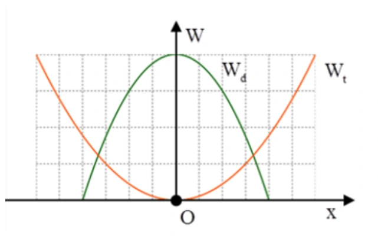{ loading=lazy }

A. $2/3$.

B. $9/4$.

C. $4/9$.

D. $3/2$.

??? success "Đáp án và lời giải"
    **Đáp án:** B

    **Hướng dẫn giải:**

    Từ đồ thị, cơ năng của hai dao động bằng nhau: $E_1=E_2$. Vì hai dao động có cùng $\omega$,

    $\frac12m_1\omega^2A_1^2=\frac12m_2\omega^2A_2^2 \quad\Rightarrow\quad \frac{m_1}{m_2}=\frac{A_2^2}{A_1^2}.$

    Đồ thị cho $A_2=\dfrac32A_1$, nên

    $\frac{m_1}{m_2}=\left(\frac32\right)^2=\frac94.$

#### Bài 46

<!-- source-id: BT-Chuong-I-p107-q1-287 -->

Một con lắc lò xo gồm một vật nhỏ khối lượng $m$ và lò xo có độ cứng $k$. Con lắc dao động điều hòa với tần số góc là

A. $\omega=2\pi\sqrt{m/k}$.

B. $\omega=2\pi\sqrt{k/m}$.

C. $\omega=\sqrt{m/k}$.

D. $\omega=\sqrt{k/m}$.

??? success "Đáp án và lời giải"
    **Đáp án:** D

    **Hướng dẫn giải:**

    Tần số góc riêng của con lắc lò xo là $\omega=\sqrt{k/m}$.

#### Bài 47

<!-- source-id: BT-Chuong-I-p107-q2-288 -->

Tại nơi có gia tốc trọng trường $g$, một con lắc đơn dao động điều hoà với biên độ góc $\alpha_0$. Biết khối lượng vật nhỏ là $m$, chiều dài dây treo là $\ell$. Cơ năng của con lắc là

A. $\dfrac12mg\ell\alpha_0^2$.

B. $mg\alpha_0^2$.

C. $\dfrac14mg\ell\alpha_0^2$.

D. $2mg\alpha_0^2$.

??? success "Đáp án và lời giải"
    **Đáp án:** A

    **Hướng dẫn giải:**

    Với dao động góc nhỏ, $s_0=\ell\alpha_0$ và $\omega^2=g/\ell$. Do đó

    $W=\frac12m\omega^2s_0^2 =\frac12mg\ell\alpha_0^2.$

#### Bài 48

<!-- source-id: BT-Chuong-I-p107-q3-289 -->

Con lắc lò xo, đầu trên cố định, đầu dưới gắn vật có khối lượng $m$, dao động điều hòa theo phương thẳng đứng ở nơi có gia tốc trọng trường $g$. Khi vật ở vị trí cân bằng, độ giãn của lò xo là $\Delta\ell$. Chu kì dao động của con lắc được tính bằng biểu thức

A. $T=2\pi\sqrt{g/\ell}$.

B. $T=2\pi\sqrt{\Delta\ell/g}$.

C. $T=2\pi\sqrt{g/\Delta\ell}$.

D. $T=\dfrac{1}{2\pi}\sqrt{g/\ell}$.

??? success "Đáp án và lời giải"
    **Đáp án:** B

    **Hướng dẫn giải:**

    Ở vị trí cân bằng, $k\Delta\ell=mg$, nên $m/k=\Delta\ell/g$. Vì vậy

    $T=2\pi\sqrt{\frac{m}{k}}=2\pi\sqrt{\frac{\Delta\ell}{g}}.$

#### Bài 49

<!-- source-id: BT-Chuong-I-p107-q4-290 -->

Năng lượng của một vật dao động điều hòa là $E$. Khi li độ bằng một nửa biên độ thì động năng của nó bằng

A. $\dfrac{E}{4}$.

B. $\dfrac{E}{2}$.

C. $\dfrac{\sqrt{3}E}{2}$.

D. $\dfrac{3E}{4}$.

??? success "Đáp án và lời giải"
    **Đáp án:** D

    **Hướng dẫn giải:**

    Khi $x=A/2$,

    $W_t=E\dfrac{x^2}{A^2}=\dfrac{E}{4}$.

    Do $W_đ=E-W_t$, suy ra

    $W_đ=E-\dfrac{E}{4}=\dfrac{3E}{4}$.

    Vậy chọn **D**.

#### Bài 50

<!-- source-id: BT-Chuong-I-p108-q5-291 -->

<!-- source-alias-id: BT-Chuong-I-p181-q7-460 -->

Công thức tính chu kì dao động của con lắc lò xo là

A. $T=2\pi\sqrt{k/m}$.

B. $T=2\pi\sqrt{m/k}$.

C. $T=2\sqrt{\pi k/m}$.

D. $T=\dfrac{\pi}{2}\sqrt{k/m}$.

??? success "Đáp án và lời giải"
    **Đáp án:** B

    **Hướng dẫn giải:**

    Chu kì của con lắc lò xo là $T=2\pi\sqrt{m/k}$.

#### Bài 51

<!-- source-id: BT-Chuong-I-p108-q6-292 -->

Một con lắc đơn dao động điều hòa với tần số $f$. Nếu tăng khối lượng của con lắc lên 4 lần thì tần số dao động của nó sẽ là

A. $2f$.

B. $\sqrt{2}f$.

C. $\dfrac{f}{2}$.

D. $f$.

??? success "Đáp án và lời giải"
    **Đáp án:** D

    **Hướng dẫn giải:**

    Với con lắc đơn dao động điều hòa ở cùng nơi, $f=\dfrac{1}{2\pi}\sqrt{\dfrac{g}{\ell}}$ không phụ thuộc vào khối lượng vật nặng.

    Tăng khối lượng lên 4 lần không làm đổi tần số, nên tần số vẫn là $f$. Chọn **D**.

#### Bài 52

<!-- source-id: BT-Chuong-I-p108-q7-293 -->

Một con lắc lò xo gồm viên bi nhỏ có khối lượng $m$ và lò xo khối lượng không đáng kể có độ cứng $k$, dao động điều hoà theo phương thẳng đứng tại nơi có gia tốc rơi tự do $g$. Khi viên bi ở vị trí cân bằng, lò xo dãn một đoạn $\Delta\ell$. Chu kì dao động điều hoà của con lắc này là

A. $T=\dfrac{1}{2\pi}\sqrt{k/m}$.

B. $T=2\pi\sqrt{\Delta\ell/g}$.

C. $T=2\pi\sqrt{g/\Delta\ell}$.

D. $T=\dfrac{1}{2\pi}\sqrt{m/k}$.

??? success "Đáp án và lời giải"
    **Đáp án:** B

    **Hướng dẫn giải:**

    Ở vị trí cân bằng $k\Delta\ell=mg$, nên $k/m=g/\Delta\ell=\omega^2$. Do đó

    $T=\frac{2\pi}{\omega}=2\pi\sqrt{\frac{\Delta\ell}{g}}.$

#### Bài 53

<!-- source-id: BT-Chuong-I-p108-q8-294 -->

Công thức được dùng để tính tần số dao động của con lắc lò xo là

A. $f=\dfrac{1}{2\pi}\sqrt{k/m}$.

B. $f=\dfrac{1}{2\pi}\sqrt{m/k}$.

C. $f=\dfrac{1}{\pi}\sqrt{m/k}$.

D. $f=2\pi\sqrt{k/m}$.

??? success "Đáp án và lời giải"
    **Đáp án:** A

    **Hướng dẫn giải:**

    Tần số của con lắc lò xo là

    $f=\frac{1}{T}=\frac{1}{2\pi}\sqrt{\frac{k}{m}}.$

#### Bài 54

<!-- source-id: BT-Chuong-I-p108-q9-295 -->

<!-- source-note: Câu dẫn PDF ghi nhầm “tần số” trong khi các phương án đều là công thức chu kì; câu dẫn đã được chuẩn hóa. -->
Công thức được dùng để tính **chu kì** dao động của con lắc đơn là

A. $T=2\pi\sqrt{m/k}$.

B. $T=2\pi\sqrt{k/m}$.

C. $T=2\pi\sqrt{\ell/g}$.

D. $T=2\pi\sqrt{g/\ell}$.

??? success "Đáp án và lời giải"
    **Đáp án:** C.

    **Hướng dẫn giải:**

    Với con lắc đơn dao động góc nhỏ, chu kì là $T=2\pi\sqrt{\ell/g}$, nên chọn **C**.

#### Bài 55

<!-- source-id: BT-Chuong-I-p109-q10-296 -->

Công thức được dùng để tính tần số dao động của con lắc đơn là

A. $f=\dfrac{1}{2\pi}\sqrt{g/\ell}$.

B. $f=\dfrac{1}{2\pi}\sqrt{\ell/g}$.

C. $f=\dfrac{1}{\pi}\sqrt{g/\ell}$.

D. $f=\dfrac{1}{\pi}\sqrt{\ell/g}$.

??? success "Đáp án và lời giải"
    **Đáp án:** A

    **Hướng dẫn giải:**

    Với dao động góc nhỏ của con lắc đơn,

    $f=\frac{1}{2\pi}\sqrt{\frac{g}{\ell}}.$

#### Bài 56

<!-- source-id: BT-Chuong-I-p109-q11-297 -->

Một con lắc lò xo gồm lò xo có độ cứng $k$ treo quả nặng có khối lượng $m$. Hệ dao động với chu kì $T$. Độ cứng của lò xo là

A. $k=\dfrac{2\pi^2m}{T^2}$.

B. $k=\dfrac{4\pi^2m}{T^2}$.

C. $k=\dfrac{\pi^2m}{4T^2}$.

D. $k=\dfrac{\pi^2m}{2T^2}$.

??? success "Đáp án và lời giải"
    **Đáp án:** B

    **Hướng dẫn giải:**

    Từ $T=2\pi\sqrt{m/k}$ suy ra

    $k=\frac{4\pi^2m}{T^2}.$

#### Bài 57

<!-- source-id: BT-Chuong-I-p109-q12-298 -->

Một con lắc lò xo có vật nhỏ khối lượng $m$ dao động điều hòa theo phương ngang với phương trình $x=A\cos(\omega t)$. Mốc tính thế năng ở vị trí cân bằng. Cơ năng của con lắc là

A. $W=m\omega A^2$.

B. $W=\dfrac12m\omega A^2$.

C. $W=m\omega^2A^2$.

D. $W=\dfrac12m\omega^2A^2$.

??? success "Đáp án và lời giải"
    **Đáp án:** D

    **Hướng dẫn giải:**

    Cơ năng của con lắc lò xo là

    $W=\frac12kA^2=\frac12m\omega^2A^2.$

#### Bài 58

<!-- source-id: BT-Chuong-I-p109-q13-299 -->

<!-- source-note: Các phương án PDF dùng nhầm ký hiệu T cho công thức tần số; ký hiệu đã được chuẩn hóa thành f. -->
Tại nơi có gia tốc trọng trường $g$, một con lắc đơn có sợi dây dài $\ell$ đang dao động điều hòa. Tần số dao động của con lắc là

A. $f=2\pi\sqrt{\ell/g}$.

B. $f=2\pi\sqrt{g/\ell}$.

C. $f=\dfrac{1}{2\pi}\sqrt{\ell/g}$.

D. $f=\dfrac{1}{2\pi}\sqrt{g/\ell}$.

??? success "Đáp án và lời giải"
    **Đáp án:** D.

    **Hướng dẫn giải:**

    Tần số của con lắc đơn dao động góc nhỏ là $f=\dfrac{1}{2\pi}\sqrt{g/\ell}$, nên chọn **D**.

#### Bài 59

<!-- source-id: BT-Chuong-I-p109-q14-300 -->

Trong dao động điều hoà của một vật thì tập hợp ba đại lượng nào sau đây là không đổi
theo thời gian?

A. Biên độ, tần số, cơ năng dao động.

B. Biên độ, tần số, gia tốc.

C. Lực phục hồi, vận tốc, cơ năng dao động.

D. Động năng, tần số, lực hồi phục.

??? success "Đáp án và lời giải"
    **Đáp án:** A

    **Hướng dẫn giải:**

    Biên độ, tần số và cơ năng là các đặc trưng không đổi của dao động điều hòa lí tưởng; còn li độ, vận tốc, gia tốc và lực kéo về biến thiên theo thời gian. Chọn A.
#### Bài 60

<!-- source-id: BT-Chuong-I-p109-q15-301 -->

Chu kì dao động của con lắc lò xo phụ thuộc vào

A. gia tốc của sự rơi tự do.

B. biên độ của dao động.

C. điều kiện kích thích ban đầu.

D. khối lượng của vật nặng.

??? success "Đáp án và lời giải"
    **Đáp án:** D

    **Hướng dẫn giải:**

    Chu kì con lắc lò xo $T=2\pi\sqrt{m/k}$. Với cùng lò xo, $T$ phụ thuộc khối lượng vật nặng, không phụ thuộc $g$ hay biên độ; chọn D.
#### Bài 61

<!-- source-id: BT-Chuong-I-p109-q16-302 -->

Ứng dụng quan trọng nhất của con lắc đơn là

A. xác định chu kì dao động.

B. xác định chiều dài con lắc.

C. xác định gia tốc trọng trường.

D. khảo sát dao động điều hòa của một vật.

??? success "Đáp án và lời giải"
    **Đáp án:** C

    **Hướng dẫn giải:**

    Từ $T=2\pi\sqrt{\ell/g}$ suy ra $g=4\pi^2\ell/T^2$. Đo $\ell$ và $T$ của con lắc đơn cho phép xác định gia tốc trọng trường; chọn C.
#### Bài 62

<!-- source-id: BT-Chuong-I-p110-q17-303 -->

Tại một nơi xác định, chu kỳ dao động điều hòa của con lắc đơn tỉ lệ thuận với

A. gia tốc trọng trường.

B. chiều dài con lắc.

C. căn bậc hai gia tốc trọng trường.

D. căn bậc hai chiều dài con lắc.

??? success "Đáp án và lời giải"
    **Đáp án:** D

    **Hướng dẫn giải:**

    Tại một nơi xác định, $g$ không đổi và $T=2\pi\sqrt{\ell/g}$, nên $T\propto\sqrt{\ell}$. Chọn D.
#### Bài 63

<!-- source-id: BT-Chuong-I-p110-q18-304 -->

Một con lắc lò xo dao động điều hòa. Biết lò xo có độ cứng $36\,\mathrm{N/m}$ và vật nhỏ có khối lượng 100 g. Lấy $\pi^2=10$. Động năng của con lắc biến thiên theo thời gian với tần số bằng

A. $6\,\mathrm{Hz}$.

B. $3\,\mathrm{Hz}$.

C. $12\,\mathrm{Hz}$.

D. $1\,\mathrm{Hz}$.

??? success "Đáp án và lời giải"
    **Đáp án:** A

    **Hướng dẫn giải:**

    Tần số dao động của con lắc lò xo là

    $f=\dfrac{1}{2\pi}\sqrt{\dfrac{k}{m}}=\dfrac{1}{2\pi}\sqrt{\dfrac{36}{0{,}1}}=3\,\mathrm{Hz}$,

    trong đó đã dùng $\pi^2=10$. Động năng biến thiên với tần số $2f$, nên $f_{W_đ}=6\,\mathrm{Hz}$.

    Vậy chọn **A**.

#### Bài 64

<!-- source-id: BT-Chuong-I-p162-q1-393 -->

Cơ năng của một vật dao động điều hòa

A. biến thiên tuần hoàn theo thời gian với chu kỳ bằng một nửa chu kỳ dao động của vật.

B. tăng gấp đôi khi biên độ dao động của vật tăng gấp đôi.

C. bằng động năng của vật khi vật tới vị trí cân bằng.

D. biến thiên tuần hoàn theo thời gian với chu kỳ bằng chu kỳ dao động của vật.

??? success "Đáp án và lời giải"
    **Đáp án:** C

    **Hướng dẫn giải:**

    Cơ năng của dao động điều hòa lí tưởng là hằng số. Ở vị trí cân bằng, thế năng bằng 0 nên cơ năng bằng động năng cực đại; chọn C.
#### Bài 65

<!-- source-id: BT-Chuong-I-p162-q2-394 -->

Khi nói về năng lượng của một vật dao động điều hòa, phát biểu nào sau đây là đúng?

A. Cứ mỗi chu kì dao động của vật, có bốn thời điểm thế năng bằng động năng.

B. Thế năng của vật đạt cực đại khi vật ở vị trí cân bằng.

C. Động năng của vật đạt cực đại khi vật ở vị trí biên.

D. Thế năng và động năng của vật biến thiên cùng tần số với tần số của li độ.

??? success "Đáp án và lời giải"
    **Đáp án:** A

    **Hướng dẫn giải:**

    Điều kiện $W_\mathrm{t}=W_\mathrm{đ}$ tương đương $|x|=A/\sqrt2$. Trong một chu kì vật đi qua hai vị trí này tổng cộng bốn lần; chọn A.
#### Bài 66

<!-- source-id: BT-Chuong-I-p162-q3-395 -->

Một vật dao động điều hòa theo một trục cố định (mốc thế năng ở vị trí cân bằng) thì

A. động năng của vật cực đại khi gia tốc của vật có độ lớn cực đại.

B. khi vật đi từ vị trí cân bằng ra biên, vận tốc và gia tốc của vật luôn cùng dấu.

C. khi ở vị trí cân bằng, thế năng của vật bằng cơ năng.

D. thế năng của vật cực đại khi vật ở vị trí biên.

??? success "Đáp án và lời giải"
    **Đáp án:** D

    **Hướng dẫn giải:**

    Thế năng $W_\mathrm{t}=\tfrac12kx^2$ lớn nhất khi $|x|=A$, tức tại hai biên. Chọn D.
#### Bài 67

<!-- source-id: BT-Chuong-I-p162-q4-396 -->

Khi nói về một vật dao động điều hòa, phát biểu nào sau đây sai?

A. Cơ năng của vật biến thiên tuần hoàn theo thời gian.

B. Vận tốc của vật biến thiên điều hòa theo thời gian.

C. Lực kéo về tác dụng lên vật biến thiên điều hòa theo thời gian.

D. Động năng của vật biến thiên tuần hoàn theo thời gian.

??? success "Đáp án và lời giải"
    **Đáp án:** A

    **Hướng dẫn giải:**

    Cơ năng của dao động điều hòa lí tưởng được bảo toàn, không biến thiên tuần hoàn theo thời gian. Vì vậy A là phát biểu sai.
#### Bài 68

<!-- source-id: BT-Chuong-I-p162-q5-397 -->

Trong dao động điều hòa, vì cơ năng được bảo toàn nên

A. động năng không đổi.

B. động năng tăng bao nhiêu thì thế năng giảm bấy nhiêu và ngược lại.

C. thế năng không đổi.

D. động năng và thế năng hoặc cùng tăng hoặc cùng giảm.

??? success "Đáp án và lời giải"
    **Đáp án:** B

    **Hướng dẫn giải:**

    Vì $W=W_\mathrm{đ}+W_\mathrm{t}$ không đổi, phần động năng tăng bao nhiêu thì thế năng phải giảm bấy nhiêu và ngược lại. Chọn B.
#### Bài 69

<!-- source-id: BT-Chuong-I-p162-q6-398 -->

Trong dao động điều hòa của một vật thì những đại lượng không thay đổi theo thời gian là

A. tần số, li độ và biên độ.

B. biên độ, tần số và cơ năng.

C. vận tốc, biên độ và cơ năng.

D. cơ năng, tần số và gia tốc.

??? success "Đáp án và lời giải"
    **Đáp án:** B

    **Hướng dẫn giải:**

    Trong dao động điều hòa lí tưởng, biên độ $A$, tần số $f$ và cơ năng $W$ là các hằng số; li độ, vận tốc và gia tốc đều biến thiên. Chọn B.
#### Bài 70

<!-- source-id: BT-Chuong-I-p162-q7-399 -->

Trong dao động điều hòa những đại lượng dao động cùng tần số với li độ là

A. vận tốc, gia tốc và cơ năng.

B. vận tốc, động năng và thế năng.

C. vận tốc, gia tốc và lực phục hồi.

D. động năng, thế năng và lực phục hồi.

??? success "Đáp án và lời giải"
    **Đáp án:** C

    **Hướng dẫn giải:**

    Li độ, vận tốc, gia tốc và lực kéo về đều biến thiên điều hòa với tần số $f$; còn động năng và thế năng có tần số $2f$, cơ năng không đổi. Chọn C.
#### Bài 71

<!-- source-id: BT-Chuong-I-p163-q8-400 -->

Một vật nhỏ khối lượng $m$ dao động điều hòa với phương trình li độ $x=A\cos(\omega t+\varphi)$. Cơ năng của vật dao động này là

A. $W=\dfrac12m\omega^2A^2$.

B. $W=\dfrac12m\omega^2A$.

C. $W=\dfrac12m\omega A^2$.

D. $W=m\omega^2A$.

??? success "Đáp án và lời giải"
    **Đáp án:** A

    **Hướng dẫn giải:**

    Cơ năng của dao động điều hòa bằng động năng cực đại tại vị trí cân bằng:
    $W=\tfrac12mv_{\max}^2=\tfrac12m(\omega A)^2=\tfrac12m\omega^2A^2$. Chọn A.

#### Bài 72

<!-- source-id: BT-Chuong-I-p163-q9-401 -->

Một vật dao động điều hoà theo chu kì T. Trong quá trình dao động, thế năng dao động có giá trị

A. không đổi.

B. biến thiên tuần hoàn theo chu kì T/2.

C. biến thiên tuần hoàn theo chu kì T

D. tăng theo thời gian.

??? success "Đáp án và lời giải"
    **Đáp án:** B

    **Hướng dẫn giải:**

    Thế năng tỉ lệ với $x^2$, nên có dạng $\cos^2(\omega t+\varphi)$ và lặp lại sau $T/2$. Chọn B.
#### Bài 73

<!-- source-id: BT-Chuong-I-p163-q10-402 -->

Trong dao động điều hoà của con lắc lò xo, cơ năng của nó bằng

A. tổng động năng và thế năng của vật khi qua một vị trí bất kì.

B. thế năng của vật nặng khi qua vị trí cân bằng.

C. động năng của vật nặng khi qua vị trí biên.

D. thế năng tại vị trí bất kì.

??? success "Đáp án và lời giải"
    **Đáp án:** A

    **Hướng dẫn giải:**

    Ở mọi thời điểm $W=W_\mathrm{đ}+W_\mathrm{t}$. Vì vậy cơ năng bằng tổng động năng và thế năng tại vị trí bất kì; chọn A.
#### Bài 74

<!-- source-id: BT-Chuong-I-p163-q11-403 -->

Cơ năng của một vật dao động điều hòa

A. tăng gấp đôi khi biên độ dao động của vật tăng gấp đôi.

B. biến thiên tuần hoàn theo thời gian với chu kỳ bằng chu kỳ dao động của vật.

C. biến thiên tuần hoàn theo thời gian với chu kỳ bằng nửa chu kỳ dao động của vật.

D. bằng động năng của vật khi vật tới vị trí cân bằng.

??? success "Đáp án và lời giải"
    **Đáp án:** D

    **Hướng dẫn giải:**

    Cơ năng không đổi theo thời gian; tại vị trí cân bằng $W_\mathrm{t}=0$ nên $W=W_\mathrm{đ}$. Chọn D.
#### Bài 75

<!-- source-id: BT-Chuong-I-p163-q12-404 -->

Một chất điểm có khối lượng $m$ đang dao động điều hòa. Khi chất điểm có vận tốc $v$ thì động năng của nó là

A. $mv^2$.

B. $\dfrac12mv^2$.

C. $vm^2$.

D. $\dfrac12vm^2$.

??? success "Đáp án và lời giải"
    **Đáp án:** B

    **Hướng dẫn giải:**

    Động năng của chất điểm khối lượng $m$ chuyển động với vận tốc $v$ là $W_\mathrm{đ}=\tfrac12mv^2$. Chọn B.

#### Bài 76

<!-- source-id: BT-Chuong-I-p163-q16-408 -->

Chọn phát biểu sai. Năng lượng dao động của con lắc đơn

A. bằng động năng của vật khi vật qua vị trí cân bằng.

B. bằng thế năng của vật khi vật ở biên.

C. luôn không đổi.

D. năng lượng biến thiên tuần hoàn theo thời gian.

??? success "Đáp án và lời giải"
    **Đáp án:** D

    **Hướng dẫn giải:**

    Dùng bảo toàn cơ năng $W=W_\mathrm{đ}+W_\mathrm{t}$. Khi bỏ qua ma sát, cơ năng của con lắc đơn được bảo toàn: tại vị trí cân bằng cơ năng bằng động năng cực đại, còn ở biên cơ năng bằng thế năng cực đại.

    Vì vậy phát biểu sai là **D**.

#### Bài 77

<!-- source-id: BT-Chuong-I-p163-q17-409 -->

Một vật dao động điều hòa theo phương trình $x=A\cos(\omega t+\varphi)$. Động năng và thế năng cũng biến thiên tuần hoàn với tần số góc

A. $\omega'=\omega$.

B. $\omega'=2\omega$.

C. $\omega'=\dfrac{\omega}{2}$.

D. $\omega'=4\omega$.

??? success "Đáp án và lời giải"
    **Đáp án:** B

    **Hướng dẫn giải:**

    Thế năng tỉ lệ với $x^2$:
    $W_\mathrm{t}=\dfrac{1}{2}kA^2\cos^2(\omega t+\varphi)$.
    Dùng $\cos^2\theta=\dfrac{1+\cos2\theta}{2}$, ta thấy thế năng biến thiên với tần số góc $2\omega$. Động năng $W_\mathrm{đ}=W-W_\mathrm{t}$ cũng có cùng tần số góc.

    Vì vậy $\omega'=2\omega$, chọn **B**.

#### Bài 78

<!-- source-id: BT-Chuong-I-p163-q18-410 -->

Kết luận nào sau đây là sai khi nói về chuyển động điều hoà của chất điểm?

A. Giá trị vận tốc tỉ lệ thuận với li độ.

B. Giá trị của thế năng tỷ lệ thuận với bình phương li độ.

C. Biên độ dao động là đại lượng không đổi.

D. Động năng là đại lượng biến đổi.

??? success "Đáp án và lời giải"
    **Đáp án:** A

    **Hướng dẫn giải:**

    Vận tốc và li độ không tỉ lệ thuận: $v^2=\omega^2(A^2-x^2)$. Vì vậy A là kết luận sai.
### Nhận biết — Đúng/Sai

#### Bài 79

<!-- source-id: BT-Chuong-I-p101-q1-277 -->

Một con lắc lò xo gồm vật nhỏ có khối lượng m và lò xo có độ cứng $40\,\mathrm{N/m}$ đang dao
động điều hoà với biên độ $5\,\mathrm{cm}$.

a) Trong quá trình vật dao động cơ năng của vật được bảo toàn.

b) Cơ năng của vật có giá trị là $0,032\,\mathrm J$ khi vật qua vị trí có li độ là $3\,\mathrm{cm}$

c) Động năng của vật có giá trị là $0,032\,\mathrm J$ khi vật qua vị trí có li độ $3\,\mathrm{cm}$.

d) Nếu giữ nguyên khối lượng của vật và thay đổi lò xo có độ cứng tăng lên 2 lần mà vẫn giữ cho vật do động có biên độ $5\,\mathrm{cm}$ thì cơ năng của vật tăng lên 2 lần so với ban đầu

??? success "Đáp án và lời giải"
    **Đáp án:** a) Đúng; b) Sai; c) Đúng; d) Đúng.

    **Hướng dẫn giải:**

    Với $k=40\,\mathrm{N/m}$, $A=0{,}05\,\mathrm m$:
    $W=\dfrac12kA^2=\dfrac12\cdot40\cdot0{,}05^2=0{,}05\,\mathrm J$.

    a) **Đúng.** Với dao động điều hòa lí tưởng, cơ năng được bảo toàn.

    b) **Sai.** Cơ năng là $0{,}05\,\mathrm J$ và không phụ thuộc li độ tức thời, nên không bằng $0{,}032\,\mathrm J$.

    c) **Đúng.** Tại $x=0{,}03\,\mathrm m$,
    $W_\mathrm{t}=\dfrac12kx^2=\dfrac12\cdot40\cdot0{,}03^2=0{,}018\,\mathrm J$,
    nên $W_\mathrm{đ}=W-W_\mathrm{t}=0{,}032\,\mathrm J$.

    d) **Đúng.** Khi giữ nguyên $A$, $W=\dfrac12kA^2\propto k$; tăng $k$ hai lần làm cơ năng tăng hai lần.

#### Bài 80

<!-- source-id: BT-Chuong-I-p102-q2-278 -->

<!-- source-note: Extraction PDF làm vỡ đơn vị; các đại lượng được khôi phục từ phương trình và khối lượng in trong đề. -->
Biết phương trình li độ của vật khối lượng $m=0{,}2\,\mathrm{kg}$ là $x=5\cos(20t)$ (cm). Chọn mốc thế năng tại vị trí cân bằng. Xét các phát biểu:

a) Cơ năng của vật bằng $40\,\mathrm J$.

b) Động năng và thế năng lần lượt có thể viết $W_\mathrm{đ}=0{,}1\sin^2(20t)\,\mathrm J$ và $W_\mathrm{t}=0{,}1\cos^2(20t)\,\mathrm J$.

c) Thế năng của vật tại $t=2\,\mathrm s$ bằng $17{,}79\,\mathrm J$.

d) Vận tốc cực đại của vật bằng $20\sqrt{10}\,\mathrm{cm/s}$.

??? success "Đáp án và lời giải"
    **Đáp án:** a) Sai; b) Đúng; c) Sai; d) Sai.

    **Hướng dẫn giải:**

    Ta có $A=5\,\mathrm{cm}$ $=0{,}05\,\mathrm m$, $\omega=20\,\mathrm{rad/s}$.

    a) **Sai.** Cơ năng $W=\tfrac12m\omega^2A^2=\tfrac12\cdot0{,}2\cdot20^2\cdot0{,}05^2=0{,}10\,\mathrm J$.

    b) **Đúng.** Vì $x=A\cos20t$, nên $W_\mathrm{t}=W(x/A)^2=0{,}1\cos^2(20t)\,\mathrm J$ và $W_\mathrm{đ}=W-W_\mathrm{t}=0{,}1\sin^2(20t)\,\mathrm J$.

    c) **Sai.** Tại $t=2\,\mathrm s$, $W_\mathrm{t}=0{,}1\cos^2(40)\,\mathrm J\approx0{,}0445\,\mathrm J$, không phải $17{,}79\,\mathrm J$.

    d) **Sai.** $v_{\max}=\omega A=20\cdot0{,}05=1\,\mathrm{m/s}$ $=100\,\mathrm{cm/s}$.
#### Bài 81

<!-- source-id: BT-Chuong-I-p102-q3-279 -->

<!-- source-note: Hướng dẫn PDF hoán đổi động năng và thế năng tại 30 độ; kết quả hiện tại đã được kiểm chứng độc lập. -->
Một con lắc đơn có khối lượng vật nặng 200 g, dây treo dài $100\,\mathrm{cm}$. Kéo con lắc ra khỏi vị trí cân bằng một góc $60^\circ$ rồi buông ra không vận tốc đầu. Lấy $g=10\,\mathrm{m/s^2}$.

a) Chu kì dao động của con lắc là $0,316\,\mathrm s$.

b) Cơ năng của con lắc là $1\,\mathrm J$.

c) Thế năng của vật tại vị trí dây treo hợp với phương thẳng đứng góc $30^\circ$ là $0,5\,\mathrm J$.

d) Động năng của vật tại vị trí dây treo hợp với phương thẳng đứng góc $30^\circ$ là $0,5\,\mathrm J$.

??? success "Đáp án và lời giải"
    **Đáp án:** a) Sai; b) Đúng; c) Sai; d) Sai.

    **Hướng dẫn giải:**

    a) **Sai.** Biên góc $60^\circ$ không thỏa điều kiện góc nhỏ để coi con lắc đơn dao động điều hòa. Ngay cả nếu dùng công thức góc nhỏ $T\approx2\pi\sqrt{\ell/g}$ thì $T\approx2\pi\sqrt{0{,}1}\approx1{,}99\,\mathrm s$, không phải $0{,}316\,\mathrm s$.

    b) **Đúng.** Chọn mốc thế năng ở vị trí thấp nhất. Khi thả từ $60^\circ$ với $v_0=0$,
    $W=mg\ell(1-\cos60^\circ)=0{,}2\cdot10\cdot1\cdot(1-0{,}5)=1\,\mathrm J$.

    c) **Sai.** Tại $30^\circ$,
    $W_\mathrm{t}=mg\ell(1-\cos30^\circ)=2\left(1-\dfrac{\sqrt3}{2}\right)\approx0{,}268\,\mathrm J$.

    d) **Sai.** Bảo toàn cơ năng cho
    $W_\mathrm{đ}=W-W_\mathrm{t}=1-0{,}268\approx0{,}732\,\mathrm J$, không phải $0{,}5\,\mathrm J$.

#### Bài 82

<!-- source-id: BT-Chuong-I-p103-q4-280 -->

<!-- source-note: PDF đánh dấu c) theo gần đúng pi^2=10 nhưng đề không nêu gần đúng; kết quả hiện tại giữ giá trị chính xác. -->
Một con lắc lò xo gồm một vật nặng có khối lượng 100 g và một lò xo có độ cứng $100\,\mathrm{N/m}$, dao động điều hòa với biên độ $A$ trên mặt phẳng nằm ngang. Khi thế năng của vật gấp đôi động năng thì vận tốc của vật là $10\,\mathrm{cm/s}$.

a) Tốc độ cực đại của vật trong quá trình dao động là $10\sqrt3\,\mathrm{cm/s}$.

b) Trong quá trình dao động, cơ năng của vật luôn bằng tổng động năng và thế năng tại bất kì vị trí nào.

c) Tần số góc của dao động là $10\pi\,\mathrm{rad/s}$.

d) Động năng của con lắc biến thiên với chu kì $0,2\,\mathrm s$.

??? success "Đáp án và lời giải"
    **Đáp án:** a) Đúng; b) Đúng; c) Sai; d) Sai.

    **Hướng dẫn giải:**

    a) **Đúng.** Khi $W_\mathrm{t}=2W_\mathrm{đ}$ thì $W=3W_\mathrm{đ}$. Tại thời điểm đã cho, $v=0{,}1\,\mathrm{m/s}$ nên
    $\tfrac12mv_{\max}^2=3\cdot\tfrac12mv^2$. Suy ra $v_{\max}=\sqrt3\,v=10\sqrt3\,\mathrm{cm/s}$.

    b) **Đúng.** Với dao động điều hòa lí tưởng, cơ năng tại mọi vị trí thỏa $W=W_\mathrm{đ}+W_\mathrm{t}$.

    c) **Sai.** $\omega=\sqrt{k/m}=\sqrt{100/0{,}1}=10\sqrt{10}\,\mathrm{rad/s}$. Giá trị này không bằng chính xác $10\pi\,\mathrm{rad/s}$ nếu đề không cho phép lấy $\pi^2=10$.

    d) **Sai.** Chu kì dao động là $T=2\pi/\omega$; động năng biến thiên với chu kì $T/2$, nên
    $T_{W_\mathrm{đ}}=\pi/(10\sqrt{10})\approx0{,}0993\,\mathrm s$, không phải $0{,}2\,\mathrm s$.

#### Bài 83

<!-- source-id: BT-Chuong-I-p110-q1-305 -->

Một con lắc lò xo gồm vật nặng $0,2\,\mathrm{kg}$ gắn vào đầu lò xo có độ cứng $20\,\mathrm{N/m}$. Kéo quả
nặng ra khỏi vị trí cân bằng rồi thả nhẹ cho nó dao động, tốc độ trung bình trong 1 chu kỳ là
$160/\pi\,\mathrm{cm/s}$.

a) Tần số của con lắc là $0,5\,\mathrm{Hz}$.

b) Quãng đường đi được trong 1 chu kỳ là $4A$.

c) Biên độ dao động của vật là $8\,\mathrm m$.

d) Cơ năng của vật dao động là $640\,\mathrm J$.

??? success "Đáp án và lời giải"
    **Đáp án:** a) Sai; b) Đúng; c) Sai; d) Sai.

    **Hướng dẫn giải:**

    a) **Sai.** $\omega=\sqrt{k/m}=\sqrt{20/0{,}2}=10\,\mathrm{rad/s}$, nên $T=2\pi/\omega=\pi/5\,\mathrm s$ và $f=1/T=5/\pi\approx1{,}59\,\mathrm{Hz}$, không phải $0{,}5\,\mathrm{Hz}$.

    b) **Đúng.** Trong một chu kì dao động điều hòa, vật đi quãng đường $4A$.

    c) **Sai.** Từ tốc độ trung bình trong một chu kì,
    $\bar v=4A/T=160/\pi\,\mathrm{cm/s}$. Do đó
    $A=(160/\pi)(\pi/5)/4=8\,\mathrm{cm}=0{,}08\,\mathrm m$, không phải $8\,\mathrm m$.

    d) **Sai.** $W=\tfrac12kA^2=\tfrac12\cdot20\cdot0{,}08^2=0{,}064\,\mathrm J$, không phải $640\,\mathrm J$.

#### Bài 84

<!-- source-id: BT-Chuong-I-p111-q2-306 -->

<!-- source-note: Bảng đáp án PDF mâu thuẫn với chính hướng dẫn ở ý c); verdict hiện tại được kiểm chứng độc lập. -->
Một vật dao động điều hòa với biên độ $A=6\,\mathrm{cm}$. Chọn mốc thế năng ở vị trí cân bằng. Xét các phát biểu:

a) Trong dao động điều hòa, cơ năng của vật được bảo toàn.

b) Khi động năng $W_\mathrm{đ}=\dfrac34W$ thì vật có tốc độ bằng $0$.

c) Khi động năng $W_\mathrm{đ}=\dfrac34W$ thì thế năng $W_\mathrm{t}=\dfrac14W$.

d) Khi $W_\mathrm{đ}=\dfrac34W$ thì độ lớn li độ của vật bằng $3\,\mathrm{cm}$.

??? success "Đáp án và lời giải"
    **Đáp án:** a) Đúng; b) Sai; c) Đúng; d) Đúng.

    **Hướng dẫn giải:**

    a) **Đúng.** Khi bỏ qua ma sát, $W=W_\mathrm{đ}+W_\mathrm{t}$ không đổi.

    b) **Sai.** $W_\mathrm{đ}=3W/4>0$ nên vận tốc khác $0$. Vận tốc chỉ bằng $0$ ở hai biên, khi $W_\mathrm{đ}=0$.

    c) **Đúng.** Từ $W=W_\mathrm{đ}+W_\mathrm{t}$, suy ra $W_\mathrm{t}=W-3W/4=W/4$.

    d) **Đúng.** Với dao động điều hòa, $W_\mathrm{t}/W=x^2/A^2$. Do $W_\mathrm{t}=W/4$, ta có $|x|/A=1/2$, nên $|x|=A/2=3\,\mathrm{cm}$.

#### Bài 85

<!-- source-id: BT-Chuong-I-p111-q3-307 -->

Đồ thị hình 3.4 mô tả sự thay đổi động năng theo li độ của quả cầu có khối lượng 400 g
trong một con lắc lò xo treo thẳng đứng.

Hình 3.4. Đồ thị mô tả sự thay đổi của động năng theo li độ của quả cầu trong con lắc lò xo
thẳng đứng.

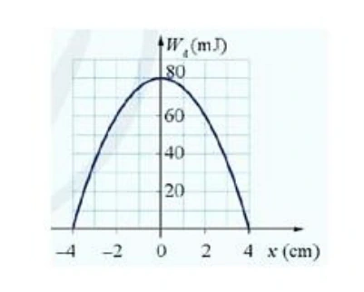{ loading=lazy }

a) Khi vật có li độ $2\,\mathrm{cm}$ thì động năng của vật là $80\,\mathrm{mJ}$.

b) Vật có động năng cực đại là $80\,\mathrm{mJ}$.

c) Tốc độ cực đại của vật trong quá trình dao động là $\dfrac{\sqrt{10}}{5}\,\mathrm{m/s}$.

d) Tại $x=2\,\mathrm{cm}$, thế năng của vật là $20\,\mathrm{mJ}$.

??? success "Đáp án và lời giải"
    **Đáp án:** a) Sai; b) Đúng; c) Đúng; d) Đúng.

    **Hướng dẫn giải:**

    a) **Sai.** Từ đồ thị, tại $x=2\,\mathrm{cm}$ có $W_\mathrm{đ}=60\,\mathrm{mJ}$, không phải $80\,\mathrm{mJ}$.

    b) **Đúng.** $W=W_{\mathrm{đ,max}}=80\,\mathrm{mJ}$ $=0{,}08\,\mathrm J$.

    c) **Đúng.** Tại vị trí động năng cực đại,
    $W=\dfrac12mv_{\max}^2$, nên
    $v_{\max}=\sqrt{\dfrac{2W}{m}}=\sqrt{\dfrac{2\cdot0{,}08}{0{,}4}}=\sqrt{0{,}4}=\dfrac{\sqrt{10}}5\,\mathrm{m/s}$.

    d) **Đúng.** Tại $x=2\,\mathrm{cm}$, $W_\mathrm{t}=W-W_\mathrm{đ}=80-60=20\,\mathrm{mJ}$.

#### Bài 86

<!-- source-id: BT-Chuong-I-p112-q4-308 -->

Một con lắc đơn gồm vật nặng có khối lượng $1\,\mathrm{kg}$, độ dài dây treo $2\,\mathrm m$, góc lệch cực đại
của dây so với đường thẳng đứng 0,175 rad. Chọn mốc thế năng trọng trường ngang với vị trí
thấp nhất, $g=9{,}8\,\mathrm{m/s^2}$.

a) Tốc độ của vật nặng khi nó ở vị trí thấp nhất là $0,3\,\mathrm{m/s}$.

b) Cơ năng của vật được bảo toàn nên ở vị trí thấp nhất $W=0{,}3\,\mathrm J$.

c) Khi vật ở vị trí thấp nhất thì thế năng bằng 0.

d) Vật có tốc độ bằng 0 khi ở vị trí cao nhất.

??? success "Đáp án và lời giải"
    **Đáp án:** a) Sai; b) Đúng; c) Đúng; d) Đúng.

    **Hướng dẫn giải:**

    Cơ năng được tính trực tiếp từ độ tăng thế năng ở biên:
    $W=mg\ell(1-\cos\alpha_0)=1\cdot9{,}8\cdot2\,[1-\cos(0{,}175)]\approx0{,}299\,\mathrm J$.

    a) **Sai.** Ở vị trí thấp nhất, $W=\dfrac12mv_{\max}^2$, nên
    $v_{\max}=\sqrt{2W/m}\approx\sqrt{0{,}598}\approx0{,}773\,\mathrm{m/s}$, không phải $0{,}3\,\mathrm{m/s}$.

    b) **Đúng.** $W\approx0{,}299\,\mathrm J$, làm tròn thành $0{,}3\,\mathrm J$.

    c) **Đúng.** Mốc thế năng được chọn tại vị trí thấp nhất nên $W_\mathrm{t}=0$ ở đó.

    d) **Đúng.** Ở hai vị trí biên cao nhất, vật đổi chiều nên $v=0$.

#### Bài 87

<!-- source-id: BT-Chuong-I-p184-q2-472 -->

<!-- source-note: Bảng đáp án PDF mâu thuẫn với chính phép tính ở ý d); verdict hiện tại được kiểm chứng độc lập. -->
Cho đồ thị vận tốc – thời gian của một con lắc đơn dao động như hình dưới. Biết khối lượng của vật treo vào sợi dây là $0{,}2\,\mathrm{kg}$. Xét các phát biểu:

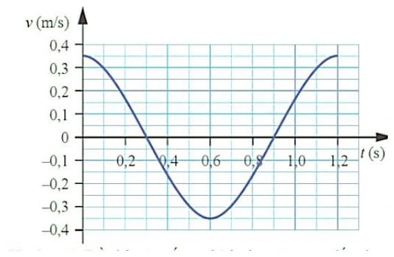{ loading=lazy }

a) Từ đồ thị ta có $\omega=\dfrac{5\pi}{3}\,\mathrm{rad/s}$.

b) Phương trình vận tốc là $v=0{,}35\cos\left(\dfrac{5\pi}{3}t\right)\,\mathrm{m/s}$.

c) Cơ năng của vật là $W=4{,}9\times10^{-3}\,\mathrm J$.

d) Tại thời điểm $t=0{,}4\,\mathrm s$, thế năng của vật là $W_t=9{,}1875\times10^{-3}\,\mathrm J$.

??? success "Đáp án và lời giải"
    **Đáp án:** a) Đúng; b) Đúng; c) Sai; d) Đúng.

    **Hướng dẫn giải:**

    a) **Đúng.** Đồ thị cho $T=1{,}2\,\mathrm s$, nên $\omega=2\pi/T=5\pi/3\,\mathrm{rad/s}$.

    b) **Đúng.** Đồ thị có $v_\max=0{,}35\,\mathrm{m/s}$ và $v(0)=v_\max$, nên $v=0{,}35\cos(5\pi t/3)\,\mathrm{m/s}$.

    c) **Sai.** $W=\tfrac12mv_\max^2=\tfrac12\cdot0{,}2\cdot0{,}35^2=0{,}01225\,\mathrm J$, không phải $4{,}9\times10^{-3}\,\mathrm J$.

    d) **Đúng.** Tại $t=0{,}4\,\mathrm s$, $v=0{,}35\cos(2\pi/3)=-0{,}175\,\mathrm{m/s}$. Suy ra $W_\mathrm t=W-\tfrac12mv^2=9{,}1875\times10^{-3}\,\mathrm J$.
#### Bài 88

<!-- source-id: BT-Chuong-I-p185-q3-473 -->

Một vật có khối lượng $m=1\,\mathrm{kg}$, dao động điều hòa với chu kì $T=0{,}2\pi\,\mathrm s$, biên độ dao động bằng $2\,\mathrm{cm}$.

a) Trong quá trình dao động, cơ năng của vật được bảo toàn.

b) Khi vật chuyển động từ vị trí cân bằng đến biên dương, thế năng tăng dần đều.

c) Vận tốc cực đại của vật là $v_{\max}=20\,\mathrm{cm/s}$.

d) Tại vị trí cân bằng, động năng của vật đạt cực đại: $W_{\mathrm{đ,max}}=200\,\mathrm{mJ}$.

??? success "Đáp án và lời giải"
    **Đáp án:** a) Đúng; b) Sai; c) Đúng; d) Sai.

    **Hướng dẫn giải:**

    Ta có $T=0{,}2\pi\,\mathrm s$ nên $\omega=2\pi/T=10\,\mathrm{rad/s}$; $A=2\,\mathrm{cm}$ $=0{,}02\,\mathrm m$.

    a) **Đúng.** Bỏ qua lực cản, cơ năng của dao động điều hòa được bảo toàn.

    b) **Sai.** Từ vị trí cân bằng ra biên, thế năng tăng theo $W_\mathrm{t}=\tfrac12m\omega^2x^2$, tức tăng theo $x^2$, không tăng đều theo thời gian hay theo li độ.

    c) **Đúng.** $v_{\max}=\omega A=10\cdot0{,}02=0{,}20\,\mathrm{m/s}$ $=20\,\mathrm{cm/s}$.

    d) **Sai.** Ở vị trí cân bằng, động năng cực đại bằng cơ năng: $W_\mathrm{đ,max}=\tfrac12m\omega^2A^2=0{,}02\,\mathrm J$ $=20\,\mathrm{mJ}$, không phải $200\,\mathrm{mJ}$.
#### Bài 89

<!-- source-id: BT-Chuong-I-p185-q4-474 -->

Một con lắc đơn có $m=1\,\mathrm{kg}$, chiều dài dây $l=2\,\mathrm m$, biên độ góc $\alpha_0=0{,}175$ rad. Chọn mốc thế năng tại vị trí thấp nhất, lấy $g=9{,}8\ \text{m/s}^2$ và $\pi^2\approx10$. Xét các phát biểu:

a) Tần số góc của con lắc xấp xỉ $\dfrac{7\pi}{10}\,\mathrm{rad/s}$.

b) Cơ năng của con lắc xấp xỉ $0{,}30\,\mathrm J$.

c) Khi vật ở vị trí thấp nhất, động năng bằng $0$.

d) Tốc độ cực đại của vật xấp xỉ $0{,}77\,\mathrm{m/s}$.

??? success "Đáp án và lời giải"
    **Đáp án:** a) Đúng; b) Đúng; c) Sai; d) Đúng.

    **Hướng dẫn giải:**

    a) **Đúng.** Với dao động góc nhỏ, $\omega=\sqrt{g/l}=\sqrt{9{,}8/2}\approx2{,}21\,\mathrm{rad/s}$, gần $7\pi/10\approx2{,}20\,\mathrm{rad/s}$.

    b) **Đúng.** Cơ năng bằng thế năng ở biên: $W=mgl(1-\cos\alpha_0)\approx\tfrac12mgl\alpha_0^2\approx0{,}30\,\mathrm J$.

    c) **Sai.** Ở vị trí thấp nhất, thế năng bằng $0$ nên động năng đạt cực đại và bằng cơ năng.

    d) **Đúng.** $W=\tfrac12mv_{\max}^2$, nên $v_{\max}=\sqrt{2W/m}\approx\sqrt{0{,}60}\approx0{,}77\,\mathrm{m/s}$.
### Thông hiểu — Trắc nghiệm 4 lựa chọn

#### Bài 90

<!-- source-id: BT-Chuong-I-p92-q19-255 -->

Một con lắc lò xo gồm vật nhỏ và lò xo nhẹ, đang dao động điều hòa trên mặt phẳng
nằm ngang. Động năng của con lắc đạt giá trị cực tiểu khi

A. lò xo không biến dạng

B. vật có vận tốc cực đại.

C. vật đi qua vị trí cân bằng.

D. lò xo có chiều dài cực đại.

??? success "Đáp án và lời giải"
    **Đáp án:** D

    **Hướng dẫn giải:**

    Ở biên, vận tốc bằng 0 nên động năng đạt giá trị nhỏ nhất bằng 0. Trong các mô tả đã cho, vị trí lò xo dài nhất là một vị trí biên; chọn D.
#### Bài 91

<!-- source-id: BT-Chuong-I-p92-q20-256 -->

Trong dao động điều hoà khi động năng giảm đi 2 lần so với động năng cực đại thì

A. thế năng đối với vị trí cân bằng tăng hai lần.

B. li độ dao động tăng 2 lần

C. tốc độ giảm $\sqrt2$ lần.

D. gia tốc dao động tăng 2 lần.

??? success "Đáp án và lời giải"
    **Đáp án:** C

    **Hướng dẫn giải:**

    Nếu $W_\mathrm{đ}=W_\mathrm{đ,max}/2$ thì $v^2/v_\mathrm{max}^2=1/2$, nên $|v|=v_\mathrm{max}/\sqrt2$. Chọn C.
#### Bài 92

<!-- source-id: BT-Chuong-I-p92-q21-257 -->

Một con lắc lò xo dao động điều hòa với tần số $2f_1$. Động năng của con lắc biến thiên
tuần hoàn theo thời gian với tần số $f_2$ bằng

A. $2f_1$.

B. $f_1/2$.

C. $f_1$.

D. $4f_1$.

??? success "Đáp án và lời giải"
    **Đáp án:** D

    **Hướng dẫn giải:**

    Động năng biến thiên với tần số gấp đôi tần số dao động. Nếu tần số dao động là $2f_1$ thì tần số động năng là $4f_1$; chọn D.
#### Bài 93

<!-- source-id: BT-Chuong-I-p93-q22-258 -->

Một con lắc lò xo dao động điều hòa, nếu không thay đổi cấu tạo của con lắc, không thay
đổi cách kích thích dao động nhưng thay đổi cách chọn gốc thời gian thì

A. biên độ, chu kỳ, pha của dao động sẽ không thay đổi

B. biên độ và chu kỳ không đổi; pha thay đổi.

C. biên độ và chu kỳ thay đổi; pha không đổi

D. biên độ và pha thay đổi, chu kỳ không đổi.

??? success "Đáp án và lời giải"
    **Đáp án:** B

    **Hướng dẫn giải:**

    Đổi mốc thời gian chỉ làm thay đổi pha ban đầu của biểu thức dao động; biên độ và chu kì là các đặc trưng của dao động nên không đổi. Chọn B.
#### Bài 94

<!-- source-id: BT-Chuong-I-p93-q23-259 -->

Cho một vật dao động điều hòa với biên độ $A$ dọc theo trục $Ox$ và quanh gốc tọa độ $O$. Một đại lượng $Y$ nào đó của vật phụ thuộc vào li độ $x$ của vật theo đồ thị có dạng một phần của đường parabol như hình vẽ bên. $Y$ là đại lượng nào trong số các đại lượng sau?

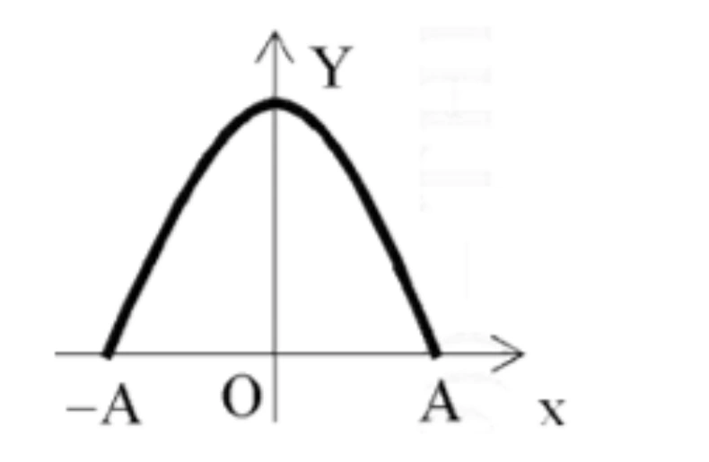{ loading=lazy }

A. Vận tốc của vật.

B. Thế năng của vật.

C. Động năng của vật.

D. Gia tốc của vật.

??? success "Đáp án và lời giải"
    **Đáp án:** C

    **Hướng dẫn giải:**

    Với dao động điều hòa, động năng phụ thuộc vào li độ theo
    $W_\mathrm{đ}=\dfrac12m\omega^2(A^2-x^2)$, là một hàm bậc hai của $x$ có dạng parabol quay xuống.

    Vì vậy chọn **C**.

#### Bài 95

<!-- source-id: BT-Chuong-I-p93-q24-260 -->

<!-- source-alias-id: BT-Chuong-I-p165-q26-418 -->

Đồ thị dưới đây biểu diễn sự biến thiên của một đại lượng $z$ theo đại lượng $y$ trong dao động điều hòa của con lắc đơn. Khi đó li độ của con lắc là $x$, vận tốc là $v$, thế năng là $E_\mathrm{t}$ và động năng là $E_\mathrm{đ}$. Đại lượng $z$, $y$ ở đây có thể là

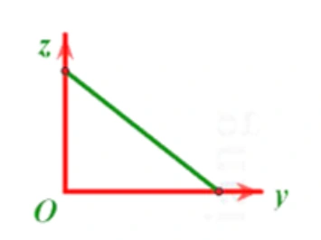{ loading=lazy }

A. $z=E_\mathrm{t}$, $y=E_\mathrm{đ}$.

B. $z=E_\mathrm{đ}$, $y=v^2$.

C. $z=E_\mathrm{t}$, $y=x$.

D. $z=E_\mathrm{t}$, $y=x^2$.

??? success "Đáp án và lời giải"
    **Đáp án:** A

    **Hướng dẫn giải:**

    Cơ năng được bảo toàn nên $E_\mathrm{t}+E_\mathrm{đ}=E$, hay $E_\mathrm{t}=E-E_\mathrm{đ}$. Quan hệ giữa thế năng và động năng là đường thẳng có hệ số góc âm, phù hợp với đồ thị.

    Vì vậy chọn **A**.

#### Bài 96

<!-- source-id: BT-Chuong-I-p94-q26-262 -->

Một vật dao động điều hòa dọc theo trục $Ox$ và xung quanh vị trí cân bằng $O$. Đồ thị biểu diễn sự thay đổi theo thời gian của một đại lượng $Y$ nào đó trong dao động của vật có dạng như hình vẽ dưới đây. Hỏi $Y$ có thể là đại lượng nào?

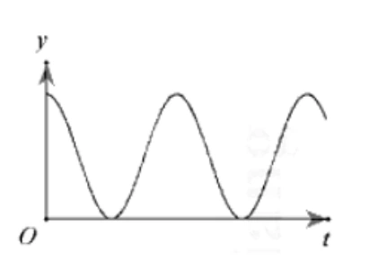{ loading=lazy }

A. Gia tốc của vật.

B. Thế năng của vật.

C. Cơ năng của vật.

D. Vận tốc của vật.

??? success "Đáp án và lời giải"
    **Đáp án:** B

    **Hướng dẫn giải:**

    Đồ thị cho một đại lượng không âm và biến thiên tuần hoàn theo thời gian. Trong các lựa chọn, thế năng của dao động điều hòa có dạng $W_\mathrm{t}=\dfrac12kx^2$ nên thỏa đặc điểm đó; cơ năng không đổi, còn vận tốc và gia tốc đổi dấu.

    Vì vậy chọn **B**.

#### Bài 97

<!-- source-id: BT-Chuong-I-p94-q27-263 -->

Khi thực hành khảo sát thực nghiệm các định luật dao động của con lắc đơn, một hoc
sinh đã tiến hành thí nghiệm, kết quả đo được học sinh đó biểu diễn bởi đồ thị như hình vẽ bên.
Nhưng do sơ suất nên em học sinh đó quên ghi ký hiệu đại lượng trên các trục tọa độ Oxy. Dựa
vào đồ thị ta có thể kết luận trục Ox và Oy tương ứng biểu diễn cho

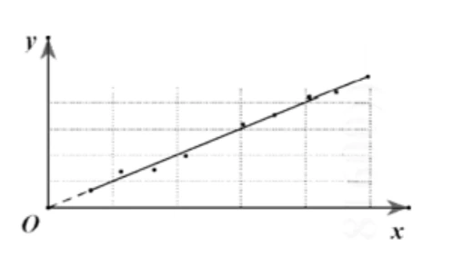{ loading=lazy }

A. chiều dài con lắc, bình phương chu kỳ dao động.

B. chiều dài con lắc, chu kỳ dao động.

C. khối lượng con lắc, bình phương chu kỳ dao động.

D. khối lượng con lắc, chu kỳ dao động.

??? success "Đáp án và lời giải"
    **Đáp án:** A

    **Hướng dẫn giải:**

    Con lắc đơn góc nhỏ có $T^2=(4\pi^2/g)\ell$. Vì đồ thị là đường thẳng qua gốc, trục hoành biểu diễn $\ell$ và trục tung biểu diễn $T^2$; chọn A.
#### Bài 98

<!-- source-id: BT-Chuong-I-p95-q28-264 -->

Con lắc lò xo gồm vật nặng khối lượng 300 g, dao động điều hòa trên quỹ đạo dài $20\,\mathrm{cm}$. Trong khoảng thời gian 6 phút, vật thực hiện được 720 dao động. Lấy $\pi^2=10$. Mốc thế năng ở vị trí cân bằng. Cơ năng dao động của vật bằng

A. $0,024\,\mathrm J$.

B. $0,24\,\mathrm J$.

C. $4,8\,\mathrm J$.

D. $0,96\,\mathrm J$.

??? success "Đáp án và lời giải"
    **Đáp án:** B

    **Hướng dẫn giải:**

    Với $m=0{,}3\,\mathrm{kg}$, $A=0{,}1\,\mathrm m$, $f=2\,\mathrm{Hz}$ thì $\omega=4\pi\,\mathrm{rad/s}$. Suy ra $W=\tfrac12m\omega^2A^2=0{,}024\pi^2\,\mathrm J\approx0{,}24\,\mathrm J$ (lấy $\pi^2\approx10$), chọn B.
#### Bài 99

<!-- source-id: BT-Chuong-I-p95-q29-265 -->

Một con lắc lò xo có độ cứng $k=150\,\mathrm{N/m}$ và có năng lượng dao động $E=0{,}12\,\mathrm J$.
Biên độ dao động của con lắc có giá trị là

A. A = $0,4\,\mathrm m$.

B. A = $4\,\mathrm{mm}$.

C. A = $0,04\,\mathrm m$.

D. A = $2\,\mathrm{cm}$.

??? success "Đáp án và lời giải"
    **Đáp án:** C

    **Hướng dẫn giải:**

    Từ $W=\tfrac12kA^2$ suy ra $A=\sqrt{2W/k}=\sqrt{0{,}24/150}=0{,}04\,\mathrm m$. Chọn C.
#### Bài 100

<!-- source-id: BT-Chuong-I-p95-q30-266 -->

Dao động của một chất điểm có khối lượng $100\,\mathrm g$ là tổng hợp của hai dao động điều hoà cùng phương, có phương trình li độ lần lượt là

hai phương trình $x_1=5\cos(10t)\,\mathrm{cm}$ và $x_2=10\cos(10t)\,\mathrm{cm}$, với $t$ tính bằng giây. Mốc thế năng ở vị trí cân bằng. Cơ năng của chất điểm bằng

A. $225\,\mathrm J$.

B. $0{,}225\,\mathrm J$.

C. $112{,}5\,\mathrm J$.

D. $0{,}1125\,\mathrm J$.

??? success "Đáp án và lời giải"
    **Đáp án:** D

    **Hướng dẫn giải:**

    Hai dao động cùng pha nên $x=x_1+x_2=15\cos(10t)\,\mathrm{cm}$. Với $m=0{,}1\,\mathrm{kg}$, $\omega=10\,\mathrm{rad/s}$ và $A=0{,}15\,\mathrm m$:

    $W=\tfrac12m\omega^2A^2=\tfrac12\cdot0{,}1\cdot10^2\cdot0{,}15^2=0{,}1125\,\mathrm J$.

#### Bài 101

<!-- source-id: BT-Chuong-I-p95-q31-267 -->

Một con lắc đơn gồm một sợi dây nhẹ, không giãn và một vật nhỏ có khối lượng $m=100$ g dao động điều hòa tại một nơi có gia tốc trọng trường $g=10\,\mathrm{m/s}^2$ với biên độ góc 0,05 rad. Năng lượng dao động điều hòa của vật bằng $5\times10^{-4}\,\mathrm J$. Chiều dài dây treo là

A. $20\,\mathrm{cm}$.

B. $30\,\mathrm{cm}$.

C. $25\,\mathrm{cm}$.

D. $40\,\mathrm{cm}$.

??? success "Đáp án và lời giải"
    **Đáp án:** D

    **Hướng dẫn giải:**

    Với góc nhỏ, $W\approx\tfrac12mg\ell\alpha_0^2$. Do đó $\ell=2W/(mg\alpha_0^2)=0{,}40\,\mathrm m=40\,\mathrm{cm}$; chọn D.
#### Bài 102

<!-- source-id: BT-Chuong-I-p96-q32-268 -->

Tại nơi có gia tốc trọng trường $g$, một con lắc đơn dao động điều hòa với biên độ góc $\alpha_0$ nhỏ. Lấy mốc thế năng tại vị trí cân bằng. Khi con lắc chuyển động nhanh dần theo chiều dương đến vị trí có động năng bằng thế năng thì li độ góc $\alpha$ của con lắc bằng

A. $-\dfrac{\alpha_0}{\sqrt{3}}$.

B. $-\dfrac{\alpha_0}{\sqrt{2}}$.

C. $\dfrac{\alpha_0}{\sqrt{2}}$.

D. $\dfrac{\alpha_0}{\sqrt{3}}$.

??? success "Đáp án và lời giải"
    **Đáp án:** B

    **Hướng dẫn giải:**

    Khi $W_\mathrm{đ}=W_\mathrm{t}$ thì $|\alpha|=\alpha_0/\sqrt2$. Vật nhanh dần theo chiều dương nên $v>0$ và $a>0$; với $a=-\omega^2\alpha$ phải có $\alpha<0$. Chọn B.
#### Bài 103

<!-- source-id: BT-Chuong-I-p96-q33-269 -->

Một con lắc lò xo có độ cứng $k=100\,\mathrm{N/m}$. Vật nặng dao động với biên độ $A=20\,\mathrm{cm}$; khi vật đi qua li độ $x=12\,\mathrm{cm}$ thì động năng của vật bằng

A. $1{,}28\,\mathrm J$.

B. $2{,}56\,\mathrm J$.

C. $0{,}72\,\mathrm J$.

D. $1{,}44\,\mathrm J$.

??? success "Đáp án và lời giải"
    **Đáp án:** A

    **Hướng dẫn giải:**

    Động năng tại li độ $x$ là

    $W_\mathrm{đ}=\frac12k(A^2-x^2) =\frac12\cdot100\left(0{,}20^2-0{,}12^2\right) =1{,}28\ \text{J}.$

#### Bài 104

<!-- source-id: BT-Chuong-I-p164-q20-412 -->

Khi nói về một vật dao động điều hoà với biên độ $A$ và tần số $f$, trong những phát biểu dưới đây:
(1) Cơ năng biến thiên tuần hoàn với tần số $2f$.
(2) Cơ năng bằng thế năng tại thời điểm vật ở biên.
(3) Cơ năng tỉ lệ thuận với biên độ dao động.
(4) Khi vật đi từ vị trí cân bằng ra biên, thế năng giảm, động năng tăng.
(5) Khi vật đi từ biên về vị trí cân bằng, thế năng giảm, động năng tăng.
Số phát biểu đúng là

A. 1.

B. 3.

C. 2.

D. 4.

??? success "Đáp án và lời giải"
    **Đáp án:** C

    **Hướng dẫn giải:**

    (1) **Sai.** Trong dao động điều hòa lí tưởng, cơ năng không đổi theo thời gian.

    (2) **Đúng.** Ở biên, vận tốc bằng 0 nên động năng bằng 0 và cơ năng bằng thế năng.

    (3) **Sai.** Với cùng hệ dao động, $W=\tfrac12kA^2$ nên cơ năng tỉ lệ với $A^2$, không tỉ lệ với $A$.

    (4) **Sai.** Từ vị trí cân bằng ra biên, thế năng tăng và động năng giảm.

    (5) **Đúng.** Từ biên về vị trí cân bằng, thế năng giảm và động năng tăng.

    Vậy có 2 phát biểu đúng, chọn **C**.

#### Bài 105

<!-- source-id: BT-Chuong-I-p164-q21-413 -->

Một vật dao động điều hòa với tần số $4f_1$. Động năng của con lắc biến thiên tuần hoàn theo thời
gian với tần số $f_2$ bằng

A. $4f_1$.

B. $f_1/4$.

C. $2f_1$.

D. $8f_1$.

??? success "Đáp án và lời giải"
    **Đáp án:** D

    **Hướng dẫn giải:**

    Động năng biến thiên với tần số gấp đôi tần số dao động. Vật dao động với $4f_1$ nên $f_2=2(4f_1)=8f_1$; chọn D.
#### Bài 106

<!-- source-id: BT-Chuong-I-p164-q22-414 -->

Một vật dao động điều hòa. Động năng của vật biến thiên tuần hoàn theo thời gian với tần số bằng
$f$. Lực kéo về tác dụng vào vật biến thiên điều hòa với tần số bằng

A. $2f$.

B. $f/2$.

C. $4f$.

D. $f$.

??? success "Đáp án và lời giải"
    **Đáp án:** B

    **Hướng dẫn giải:**

    Nếu động năng biến thiên với tần số $f$ thì tần số dao động của vật là $f/2$. Lực kéo về $F=-kx$ biến thiên cùng tần số với li độ, nên có tần số $f/2$; chọn B.
#### Bài 107

<!-- source-id: BT-Chuong-I-p164-q23-415 -->

Điều nào sau đây là đúng khi nói về động năng và thế năng của 1 vật dao động điều hòa ?

A. Động năng của vật tăng và thế năng giảm khi vật đi từ vị trí cân bằng đến vị trí biên.

B. Động năng bằng không và thế năng cực đại khi vật ở vị trí cân bằng.

C. Động năng giảm, thế năng tăng khi vật đi từ vị trí cân bằng đến vị trí biên.

D. Động năng giảm, thế năng tăng khi vật đi từ vị trí biên đến vị trí cân bằng.

??? success "Đáp án và lời giải"
    **Đáp án:** C

    **Hướng dẫn giải:**

    Từ vị trí cân bằng ra biên, $|x|$ tăng nên thế năng tăng; vì cơ năng bảo toàn nên động năng giảm. Chọn C.
#### Bài 108

<!-- source-id: BT-Chuong-I-p164-q24-416 -->

Trong dao động điều hòa, khi động năng giảm đi 2 lần so với động năng cực đại thì

A. thế năng đối với vị trí cân bằng tăng hai lần.

B. li độ dao động tăng 2 lần.

C. vận tốc dao động giảm $\sqrt{2}$ lần.

D. gia tốc dao động tăng 2 lần.

??? success "Đáp án và lời giải"
    **Đáp án:** C

    **Hướng dẫn giải:**

    Vì $W_\mathrm{đ}=\dfrac12mv^2$ và $W_{\mathrm{đ,max}}=\dfrac12mv_{\max}^2$, điều kiện $W_\mathrm{đ}=\dfrac12W_{\mathrm{đ,max}}$ cho
    $v^2=\dfrac12v_{\max}^2$, hay $|v|=\dfrac{v_{\max}}{\sqrt2}$.

    Vận tốc giảm $\sqrt2$ lần, chọn **C**.

#### Bài 109

<!-- source-id: BT-Chuong-I-p165-q27-419 -->

Một vật dao động điều hòa, đồ thị biểu diễn mối quan hệ giữa cơ năng $W$ và động năng $W_\mathrm{đ}$ có dạng đường nào?

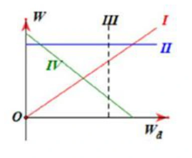{ loading=lazy }

A. Đường IV.

B. Đường I.

C. Đường III.

D. Đường II.

??? success "Đáp án và lời giải"
    **Đáp án:** D

    **Hướng dẫn giải:**

    Cơ năng $W$ của dao động điều hòa lí tưởng không đổi, không phụ thuộc vào động năng tức thời $W_\mathrm{đ}$. Trên hệ trục của hình, quan hệ này tương ứng với đường II.

    Vì vậy chọn **D**.

#### Bài 110

<!-- source-id: BT-Chuong-I-p166-q29-421 -->

Khi thực hành khảo sát thực nghiệm các định luật dao
động của con lắc đơn, một học sinh đã tiến hành thí nghiệm, kết quả
đo được học sinh đó biểu diễn bởi đồ thị như hình vẽ bên. Nhưng
do sơ suất nên em học sinh đó quên ghi ký hiệu đại lượng trên các
trục tọa độ Oxy. Dựa vào đồ thị ta có thể kết luận trục Ox và Oy
tương ứng biểu diễn cho

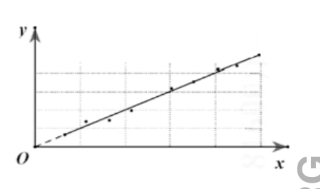{ loading=lazy }

A. chiều dài con lắc, bình phương chu kỳ dao động.

B. chiều dài con lắc, chu kỳ dao động.

C. khối lượng con lắc, bình phương chu kỳ dao động.

D. khối lượng con lắc, chu kỳ dao động.

??? success "Đáp án và lời giải"
    **Đáp án:** A

    **Hướng dẫn giải:**

    Đối với con lắc đơn góc nhỏ, $T^2=(4\pi^2/g)\ell$. Đồ thị tuyến tính qua gốc vì vậy tương ứng $x=\ell$, $y=T^2$; chọn A.
#### Bài 111

<!-- source-id: BT-Chuong-I-p166-q30-422 -->

Một vật dao động điều hoà có phương trình li độ $x=5\cos(10t)\,\mathrm{cm}$, với $t$ tính bằng giây.
Động năng và thế năng biến thiên tuần hoàn với tần số góc bằng

A. $10\,\mathrm{rad/s}$.

B. $10t\,\mathrm{rad/s}$.

C. $5\,\mathrm{rad/s}$.

D. $20\,\mathrm{rad/s}$.

??? success "Đáp án và lời giải"
    **Đáp án:** D

    **Hướng dẫn giải:**

    Li độ có tần số góc $\omega=10\,\mathrm{rad/s}$. Động năng và thế năng chứa $\sin^2$ hoặc $\cos^2$, nên có tần số góc $2\omega=20\,\mathrm{rad/s}$; chọn D.
#### Bài 112

<!-- source-id: BT-Chuong-I-p166-q31-423 -->

<!-- source-alias-id: BT-Chuong-I-p183-q16-469 -->

Một vật nhỏ có khối lượng $\dfrac{2}{\pi^2}\,\mathrm{kg}$ dao động điều hòa với tần số $5\,\mathrm{Hz}$, và biên độ $5\,\mathrm{cm}$. Cơ năng
dao động bằng

A. $2,5\,\mathrm J$.

B. $250\,\mathrm J$.

C. $0,25\,\mathrm J$.

D. $0,5\,\mathrm J$.

??? success "Đáp án và lời giải"
    **Đáp án:** C

    **Hướng dẫn giải:**

    Ta có $\omega=2\pi f=10\pi\,\mathrm{rad/s}$. Với $m=\dfrac{2}{\pi^2}\,\mathrm{kg}$ và $A=0{,}05\,\mathrm m$, $W=\tfrac12m\omega^2A^2=0{,}25\,\mathrm J$; chọn C.
#### Bài 113

<!-- source-id: BT-Chuong-I-p166-q32-424 -->

Một vật có khối lượng 750 g dao động điều hòa với biên độ $4\,\mathrm{cm}$ và chu kì $T=2\,\mathrm s$. Năng lượng của
dao động bằng

A. $10\,\mathrm{mJ}$.

B. $20\,\mathrm{mJ}$

C. $6\,\mathrm{mJ}$.

D. $72\,\mathrm{mJ}$.

??? success "Đáp án và lời giải"
    **Đáp án:** C

    **Hướng dẫn giải:**

    Với $m=0{,}75\,\mathrm{kg}$, $A=0{,}04\,\mathrm m$, $T=2\,\mathrm s$ thì $\omega=\pi\,\mathrm{rad/s}$. Do đó $W=\tfrac12m\omega^2A^2\approx5{,}92\,\mathrm{mJ}$, gần nhất $6\,\mathrm{mJ}$; chọn C.
#### Bài 114

<!-- source-id: BT-Chuong-I-p167-q33-425 -->

Một vật nhỏ thực hiện dao động điều hòa theo phương trình $x=10\cos(4\pi t)\,\mathrm{cm}$ với $t$ tính bằng giây.
Động năng của vật đó biến thiên với chu kì bằng

A. $1,50\,\mathrm s$

B. $1,00\,\mathrm s$

C. $0,50\,\mathrm s$

D. $0,25\,\mathrm s$

??? success "Đáp án và lời giải"
    **Đáp án:** D

    **Hướng dẫn giải:**

    Từ $x=10\cos(4\pi t)\,\mathrm{cm}$ có $T=2\pi/(4\pi)=0{,}5\,\mathrm s$. Động năng có chu kì $T/2=0{,}25\,\mathrm s$; chọn D.
#### Bài 115

<!-- source-id: BT-Chuong-I-p167-q34-426 -->

Một chất điểm dao động điều hòa với chu kì T. Khoảng thời gian hai lần liên tiếp thế năng triệt tiêu
là

A. T/2.

B. T.

C. T/4.

D. T/3.

??? success "Đáp án và lời giải"
    **Đáp án:** A

    **Hướng dẫn giải:**

    Thế năng triệt tiêu khi $x=0$. Hai lần liên tiếp vật qua vị trí cân bằng cách nhau nửa chu kì, nên khoảng thời gian là $T/2$; chọn A.
#### Bài 116

<!-- source-id: BT-Chuong-I-p167-q35-427 -->

Một chất điểm dao động điều hòa với chu kì T. Khoảng thời gian hai lần liên tiếp thế năng cực đại
là

A. T/2.

B. T.

C. T/4.

D. T/3.

??? success "Đáp án và lời giải"
    **Đáp án:** A

    **Hướng dẫn giải:**

    Thế năng cực đại ở cả hai biên. Từ biên này đến biên kia mất $T/2$, nên hai lần liên tiếp thế năng cực đại cách nhau $T/2$; chọn A.
### Vận dụng — Trả lời ngắn

#### Bài 117

<!-- source-id: BT-Chuong-I-p176-q1-447 -->

Một con lắc lò xo gồm viên bi nhỏ và lò xo nhẹ có độ cứng $k=100\,\mathrm{N/m}$, dao động điều hòa với biên độ $A=0{,}1\,\mathrm m$. Mốc thế năng ở vị trí cân bằng. Khi viên bi cách vị trí cân bằng $x=6\,\mathrm{cm}$ thì động năng của con lắc bằng bao nhiêu jun?

??? success "Đáp án và lời giải"
    **Đáp án:** $0{,}32\,\mathrm J$

    **Hướng dẫn giải:**

    Cơ năng của con lắc là $W=\tfrac12kA^2$ và thế năng tại li độ $x$ là $W_\mathrm t=\tfrac12kx^2$. Vì thế
    $W_\mathrm{đ}=W-W_\mathrm t=\tfrac12k(A^2-x^2)$.

    Thay $A=0{,}10\,\mathrm m$, $x=0{,}06\,\mathrm m$, $k=100\,\mathrm{N/m}$:
    $W_\mathrm{đ}=\tfrac12\cdot100(0{,}10^2-0{,}06^2)=0{,}32\,\mathrm J$.

#### Bài 118

<!-- source-id: BT-Chuong-I-p176-q2-448 -->

Một con lắc lò xo gồm quả cầu nhỏ khối lượng $1\,\mathrm{kg}$ và lò xo có độ cứng $50\,\mathrm{N/m}$. Cho con lắc dao động điều hòa trên phương nằm ngang. Tại thời điểm vận tốc của quả cầu là $0,2\,\mathrm{m/s}$ thì gia tốc của nó là $-\sqrt3\,\mathrm{m/s}^2$. Cơ năng của con lắc là bao nhiêu Jun?

??? success "Đáp án và lời giải"
    **Đáp án:** $0{,}05\,\mathrm J$

    **Hướng dẫn giải:**

    Với $a=-\omega^2x=-\dfrac{k}{m}x$, ta có $x=-\dfrac{ma}{k}$. Do đó
    $W=\dfrac12kx^2+\dfrac12mv^2=\dfrac{(ma)^2}{2k}+\dfrac12mv^2$.

    Thay $m=1\,\mathrm{kg}$, $k=50\,\mathrm{N/m}$, $a=-\sqrt3\,\mathrm{m/s}^2$, $v=0{,}2\,\mathrm{m/s}$:
    $W=\dfrac{3}{2\cdot50}+\dfrac{0{,}2^2}{2}=0{,}05\,\mathrm J$.

#### Bài 119

<!-- source-id: BT-Chuong-I-p176-q3-449 -->

Một con lắc lò xo gồm lò xo nhẹ có độ cứng $k=100\,\mathrm{N/m}$ và vật nhỏ dao động điều hòa. Khi vật có động năng $0{,}01\,\mathrm J$ thì nó cách vị trí cân bằng $1\,\mathrm{cm}$. Hỏi khi nó có động năng $0{,}005\,\mathrm J$ thì nó cách vị trí cân bằng bao nhiêu centimet? (Làm tròn đến chữ số thập phân thứ 2 sau dấu phẩy.)

??? success "Đáp án và lời giải"
    **Đáp án:** $1{,}41\,\mathrm{cm}$

    **Hướng dẫn giải:**

    Cơ năng không đổi nên tại hai thời điểm:
    $W_{\mathrm{đ}1}+\tfrac12kx_1^2=W_{\mathrm{đ}2}+\tfrac12kx_2^2$.

    Với $W_{\mathrm{đ}1}=0{,}01\,\mathrm J$, $x_1=0{,}01\,\mathrm m$, $W_{\mathrm{đ}2}=0{,}005\,\mathrm J$ và $k=100\,\mathrm{N/m}$:
    $0{,}01+\tfrac12\cdot100\cdot0{,}01^2=0{,}005+\tfrac12\cdot100x_2^2$.

    Suy ra $x_2^2=2\times10^{-4}\,\mathrm{m^2}$, nên $|x_2|=0{,}01\sqrt2\,\mathrm m\approx1{,}41\,\mathrm{cm}$.

#### Bài 120

<!-- source-id: BT-Chuong-I-p177-q4-450 -->

Một con lắc đơn có chiều dài $\ell=1\,\mathrm m$, khối lượng $m=100\,\mathrm g$, dao động trong mặt phẳng thẳng đứng đi qua điểm treo tại nơi có $g=10\,\mathrm{m/s^2}$. Lấy mốc thế năng ở vị trí cân bằng và bỏ qua ma sát. Khi sợi dây treo hợp với phương thẳng đứng một góc $30^\circ$ thì tốc độ của vật nặng là $v=0{,}3\,\mathrm{m/s}$. Cơ năng của con lắc đơn là bao nhiêu jun? (Làm tròn đến chữ số thập phân thứ 2 sau dấu phẩy.)

??? success "Đáp án và lời giải"
    **Đáp án:** $0{,}14\,\mathrm J$

    **Hướng dẫn giải:**

    Với mốc thế năng ở vị trí cân bằng, tại góc lệch $\alpha$ ta có
    $W=mg\ell(1-\cos\alpha)+\tfrac12mv^2$.

    Thay $m=0{,}10\,\mathrm{kg}$, $g=10\,\mathrm{m/s^2}$, $\ell=1\,\mathrm m$, $\alpha=30^\circ$, $v=0{,}30\,\mathrm{m/s}$:
    $W=0{,}1\cdot10\cdot1(1-\cos30^\circ)+\tfrac12\cdot0{,}1\cdot0{,}3^2\approx0{,}1385\,\mathrm J\approx0{,}14\,\mathrm J$.

#### Bài 121

<!-- source-id: BT-Chuong-I-p177-q5-451 -->

Một vật có khối lượng $m=1\,\mathrm{kg}$ dao động điều hòa xung quanh vị trí cân bằng. Đồ thị thế năng của vật theo thời gian như hình vẽ. Cho $\pi^2=10$. Biên độ dao động của vật bằng bao nhiêu centimet?

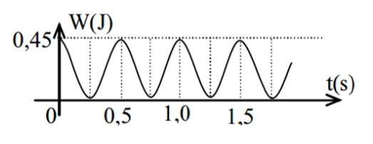{ loading=lazy }

??? success "Đáp án và lời giải"
    **Đáp án:** $15\,\mathrm{cm}$

    **Hướng dẫn giải:**

    Từ đồ thị, thế năng cực đại bằng cơ năng: $W=0{,}45\,\mathrm J$. Hai cực đại liên tiếp của thế năng cách nhau $0{,}5\,\mathrm s$, nên chu kì thế năng là $T_\mathrm t=0{,}5\,\mathrm s$. Vì thế năng biến thiên với chu kì $T/2$, chu kì dao động là $T=1\,\mathrm s$ và $\omega=2\pi\,\mathrm{rad/s}$.

    Từ $W=\tfrac12m\omega^2A^2$:
    $A=\sqrt{\dfrac{2W}{m\omega^2}}=\sqrt{\dfrac{0{,}9}{4\pi^2}}=0{,}15\,\mathrm m=15\,\mathrm{cm}$, với $\pi^2=10$.

#### Bài 122

<!-- source-id: BT-Chuong-I-p177-q6-452 -->

Một học sinh thực hiện thí nghiệm kiểm chứng sự phụ thuộc của chu kì con lắc đơn vào chiều dài con lắc. Từ kết quả thí nghiệm, học sinh vẽ đồ thị biểu diễn $T^2$ theo chiều dài $\ell$ như hình vẽ. Đường thẳng đồ thị hợp với trục $O\ell$ một góc $\alpha=76{,}1^\circ$. Lấy $\pi\approx3{,}14$. Theo kết quả thí nghiệm, gia tốc trọng trường tại nơi làm thí nghiệm bằng bao nhiêu $\mathrm{m/s^2}$? (Làm tròn đến chữ số thập phân thứ 2 sau dấu phẩy.)

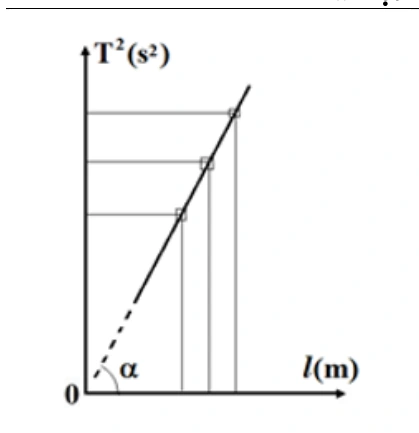{ loading=lazy }

??? success "Đáp án và lời giải"
    **Đáp án:** $9{,}76\,\mathrm{m/s^2}$

    **Hướng dẫn giải:**

    Với con lắc đơn, $T=2\pi\sqrt{\ell/g}$ nên $T^2=(4\pi^2/g)\ell$. Do đó hệ số góc của đồ thị $T^2$ theo $\ell$ là
    $\tan\alpha=4\pi^2/g$.

    Suy ra $g=4\pi^2\cot\alpha=4\cdot3{,}14^2\cot76{,}1^\circ\approx9{,}76\,\mathrm{m/s^2}$.

#### Bài 123

<!-- source-id: BT-Chuong-I-p178-q7-453 -->

Một chất điểm có khối lượng $m=50\,\mathrm g$ dao động điều hòa có đồ thị động năng theo thời gian của chất
điểm như hình bên. Biên độ dao động của chất điểm bằng bao nhiêu centimet? (Làm tròn đến chữ số thập
phân thứ 2 sau dấu phẩy)

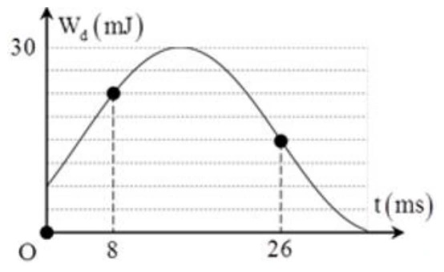{ loading=lazy }

??? success "Đáp án và lời giải"
    **Đáp án:** $1{,}50\,\mathrm{cm}$

    **Hướng dẫn giải:**

    Đồ thị cho $W=30\,\mathrm{mJ}$. Tại $t_1=8\,\mathrm{ms}$, $W_\mathrm{đ}=3W/4$ nên $|x_1|=A/2$; tại $t_2=26\,\mathrm{ms}$, $W_\mathrm{đ}=W/2$ nên $|x_2|=A/\sqrt2$. Hai trạng thái gần nhau trên đường tròn pha lệch $45^\circ+30^\circ=75^\circ$, ứng với $18\,\mathrm{ms}$, nên $T=86{,}4\,\mathrm{ms}$ và $\omega=2\pi/T\approx72{,}7\,\mathrm{rad/s}$. Với $m=0{,}05\,\mathrm{kg}$, $A=\sqrt{2W/(m\omega^2)}\approx0{,}0150\,\mathrm m=1{,}50\,\mathrm{cm}$.
### Vận dụng — Trắc nghiệm 4 lựa chọn

#### Bài 124

<!-- source-id: BT-Chuong-I-p96-q34-270 -->

Một con lắc lò xo dao động theo phương ngang với cơ năng dao động là $1\,\mathrm J$ và lực đàn hồi cực
đại là $10\,\mathrm N$. Mốc thế năng tại vị trí cân bằng. Gọi Q là đầu cố định của lò xo, khoảng thời gian ngắn nhất
giữa 2 lần liên tiếp Q chịu tác dụng lực kéo của lò xo có độ lớn là $5\sqrt3\,\mathrm N$ là $0,1\,\mathrm s$. Quãng đường lớn nhất
mà vật nhỏ con lắc đi được trong $0,4\,\mathrm s$ là

A. $60\,\mathrm{cm}$.

B. $115\,\mathrm{cm}$.

C. $80\,\mathrm{cm}$.

D. $40\,\mathrm{cm}$.

??? success "Đáp án và lời giải"
    **Đáp án:** A

    **Hướng dẫn giải:**

    Cơ năng $W=1\,\mathrm J$ và lực đàn hồi cực đại $F_\max=kA=10\,\mathrm N$ cho $A=2W/F_\max=0{,}20\,\mathrm m$. Điều kiện $|F|=5\sqrt3\,\mathrm N$ tương ứng $|x|=\sqrt3A/2$; hai lần liên tiếp gần nhất cách nhau $T/6=0{,}1\,\mathrm s$, nên $T=0{,}6\,\mathrm s$. Trong $0{,}4\,\mathrm s=2T/3$, quãng đường lớn nhất là $3A=0{,}60\,\mathrm m=60\,\mathrm{cm}$; chọn A.
#### Bài 125

<!-- source-id: BT-Chuong-I-p97-q35-271 -->

<!-- source-note: Hướng dẫn PDF có một dòng nhầm alpha_0=30 độ; phép tính đúng dùng alpha=30 độ và alpha_0=60 độ. -->
Một con lắc đơn gồm một vật nặng khối lượng $m=100$ g, con lắc có chiều dài dây treo là $\ell$, dao động tại nơi có gia tốc trọng trường $g=10\,\mathrm{m/s}^2$. Kéo con lắc khỏi vị trí cân bằng rồi buông nhẹ; trong quá trình dao động, lực căng dây cực tiểu nếu bỏ qua ma sát là $0,5\,\mathrm N$. Gốc thế năng tại vị trí cân bằng. Khi dây treo hợp với phương thẳng đứng một góc $30^\circ$ thì tỉ số giữa động năng và thế năng là

A. 0,73.

B. 2,73.

C. 0,5.

D. 0,96.

??? success "Đáp án và lời giải"
    **Đáp án:** B

    **Hướng dẫn giải:**

    Ở vị trí biên $\alpha_0$, vận tốc bằng 0 nên lực căng cực tiểu thỏa

    $T_{\min}=mg\cos\alpha_0=0{,}5\,\mathrm N$.

    Với $m=0{,}1\,\mathrm{kg}$ và $g=10\,\mathrm{m/s}^2$:

    $\cos\alpha_0=\dfrac{0{,}5}{0{,}1\cdot10}=\dfrac12\Rightarrow \alpha_0=60^\circ$.

    Tại $\alpha=30^\circ$,

    $\dfrac{W_đ}{W_t}=\dfrac{mg\ell(\cos\alpha-\cos\alpha_0)}{mg\ell(1-\cos\alpha)}=\dfrac{\cos30^\circ-\cos60^\circ}{1-\cos30^\circ}\approx2{,}73$.

    Vậy chọn **B**.

#### Bài 126

<!-- source-id: BT-Chuong-I-p97-q36-272 -->

Một vật có khối lượng $2\,\mathrm{kg}$ dao động điều hòa có đồ thị vận tốc – thời gian như Hình 3.3.
Động năng cực đại của vật trong quá trình dao động là:

Hình 3.3. Đồ thị vận tốc – thời gian của vật dao động.

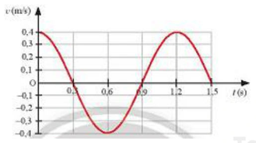{ loading=lazy }

A. $0,16\,\mathrm J$.

B. $6,16\,\mathrm{mJ}$.

C. $0,16\,\mathrm{mJ}$.

D. $0,96\,\mathrm{mJ}$.

??? success "Đáp án và lời giải"
    **Đáp án:** A

    **Hướng dẫn giải:**

    Đồ thị cho $v_\max=0{,}4\,\mathrm{m/s}$. Vì $m=2\,\mathrm{kg}$, động năng cực đại là $W_\mathrm{đ,max}=\tfrac12mv_\max^2=0{,}16\,\mathrm J$; chọn A.
#### Bài 127

<!-- source-id: BT-Chuong-I-p98-q37-273 -->

Đồ thị hình 3.4 mô tả sự thay đổi động năng theo li độ của quả cầu có khối lượng $0{,}4\,\mathrm{kg}$ trong một con lắc lò xo treo thẳng đứng. Xác định thế năng của con lắc lò xo khi quả cầu ở vị trí có li độ $2\,\mathrm{cm}$.

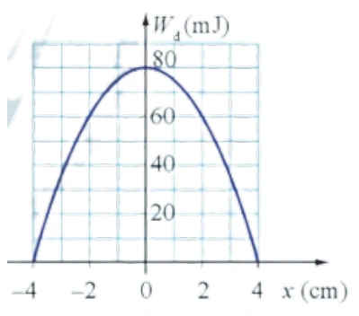{ loading=lazy }

A. $60\,\mathrm{mJ}$.

B. $20\,\mathrm{mJ}$.

C. $80\,\mathrm{mJ}$.

D. $100\,\mathrm{mJ}$.

??? success "Đáp án và lời giải"
    **Đáp án:** B

    **Hướng dẫn giải:**

    Từ đồ thị, cơ năng của con lắc là $W=80\,\mathrm{mJ}$. Tại $x=2\,\mathrm{cm}$, động năng $W_\mathrm{đ}=60\,\mathrm{mJ}$, nên

    $W_\mathrm{t}=W-W_\mathrm{đ}=80-60=20\ \text{mJ}.$

#### Bài 128

<!-- source-id: BT-Chuong-I-p98-q38-274 -->

Một chất điểm dao động điều hoà trên trục Ox với biên độ $10\,\mathrm{cm}$, chu kỳ $2\,\mathrm s$. Mốc thế
năng ở vị trí cân bằng. Tốc độ trung bình của chất điểm trong khoảng thời gian ngắn nhất khi chất
điểm đi từ vị trí có động năng bằng 3 lần thế năng đến vị trí có động năng bằng 1
3 lần thế năng là

A. $26,12\,\mathrm{cm/s}$.

B. $21,96\,\mathrm{cm/s}$.

C. $7,32\,\mathrm{cm/s}$.

D. $14,64\,\mathrm{cm/s}$.

??? success "Đáp án và lời giải"
    **Đáp án:** B

    **Hướng dẫn giải:**

    Với $W_\mathrm{đ}=3W_\mathrm{t}$ có $|x_1|=A/2$; với $W_\mathrm{đ}=W_\mathrm{t}/3$ có $|x_2|=A\sqrt3/2$. Chọn hai trạng thái gần nhau nhất cho $s=A(\sqrt3-1)/2=5(\sqrt3-1)\,\mathrm{cm}$ và $\Delta t=(T/2\pi)(\pi/6)=1/6\,\mathrm s$. Do đó $v_\mathrm{tb}=s/\Delta t\approx21{,}96\,\mathrm{cm/s}$; chọn B.
#### Bài 129

<!-- source-id: BT-Chuong-I-p99-q39-275 -->

Một con lắc lò xo đang dao động điều hòa. Hình bên là đồ thị biểu diễn sự phụ thuộc của động năng $W_\mathrm{đ}$ của con lắc theo thời gian $t$. Biết $t_3-t_2=0{,}25\,\mathrm s$. Giá trị của $t_4-t_1$ là

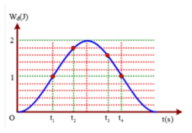{ loading=lazy }

A. $0{,}54\,\mathrm s$.

B. $0{,}40\,\mathrm s$.

C. $0{,}45\,\mathrm s$.

D. $0{,}50\,\mathrm s$.

??? success "Đáp án và lời giải"
    **Đáp án:** D. $0{,}50\,\mathrm s$

    **Hướng dẫn giải:**

    Từ đồ thị, tại $t_2$ có $W_\mathrm{đ}=9W/10$ nên $|x_2|=A/\sqrt{10}$; tại $t_3$ có $W_\mathrm{đ}=8W/10$ nên $|x_3|=A/\sqrt5$. Khoảng pha tương ứng trên đường tròn cho $t_3-t_2=(T/2\pi)[\arcsin(1/\sqrt{10})+\arcsin(1/\sqrt5)]=0{,}25\,\mathrm s$, từ đó $T\approx2\,\mathrm s$. Trên đồ thị $t_4-t_1=T/4=0{,}50\,\mathrm s$; chọn D.
#### Bài 130

<!-- source-id: BT-Chuong-I-p167-q36-428 -->

Một vật có khối lượng $m=100\,\mathrm g$ dao động điều hòa với chu kì $T=\pi/10\,\mathrm s$, biên độ $A=5\,\mathrm{cm}$. Tại vị trí vật có gia tốc $a=1200\,\mathrm{cm/s^2}$ thì động năng của vật bằng

A. $320\,\mathrm J$.

B. $160\,\mathrm J$.

C. $32\,\mathrm{mJ}$.

D. $16\,\mathrm{mJ}$.

??? success "Đáp án và lời giải"
    **Đáp án:** C

    **Hướng dẫn giải:**

    Từ $T=\pi/10\,\mathrm s$ suy ra $\omega=2\pi/T=20\,\mathrm{rad/s}$. Độ lớn gia tốc $|a|=1200\,\mathrm{cm/s^2}=12\,\mathrm{m/s^2}$ nên
    $|x|=|a|/\omega^2=12/400=0{,}03\,\mathrm m$.

    Với $m=0{,}10\,\mathrm{kg}$, $A=0{,}05\,\mathrm m$:
    $W_\mathrm{đ}=\tfrac12m\omega^2(A^2-x^2)=0{,}032\,\mathrm J=32\,\mathrm{mJ}$. Chọn C.

#### Bài 131

<!-- source-id: BT-Chuong-I-p168-q37-429 -->

Tỉ số thế năng và cơ năng của một vật dao động điều hòa tại thời điểm tốc độ của vật bằng 25% tốc độ cực đại là

A. $\dfrac{15}{16}$.

B. $\dfrac{1}{16}$.

C. $\dfrac{1}{4}$.

D. $\dfrac{3}{4}$.

??? success "Đáp án và lời giải"
    **Đáp án:** A

    **Hướng dẫn giải:**

    Vì $W_đ/W=(v/v_{\max})^2$ nên tại $v=0{,}25v_{\max}$:

    $\dfrac{W_đ}{W}=0{,}25^2=\dfrac1{16}$.

    Do $W=W_đ+W_t$,

    $\dfrac{W_t}{W}=1-\dfrac1{16}=\dfrac{15}{16}$.

    Vậy chọn **A**.

#### Bài 132

<!-- source-id: BT-Chuong-I-p168-q38-430 -->

Một vật dao động điều hòa dọc theo trục Ox. Mốc thế năng ở vị trí cân bằng, ở thời điểm độ lớn
vận tốc của vật bằng 50% vận tốc cực đại thì tỉ số giữa động năng và cơ năng của vật là

A. 3/4.

B. 1/4.

C. 4/3.

D. 1/2

??? success "Đáp án và lời giải"
    **Đáp án:** B

    **Hướng dẫn giải:**

    Vì $W_\mathrm{đ}/W=v^2/v_\max^2$, khi $|v|=0{,}5v_\max$ ta có $W_\mathrm{đ}/W=0{,}25=1/4$. Chọn B.
#### Bài 133

<!-- source-id: BT-Chuong-I-p168-q39-431 -->

Một vật dao động điều hòa với biên độ $6\,\mathrm{cm}$. Mốc thế năng ở vị trí cân bằng. Khi vật có động năng
bằng 3/4 lần cơ năng thì vật cách vị trí cân bằng một đoạn

A. $6\,\mathrm{cm}$.

B. $4,5\,\mathrm{cm}$.

C. $4\,\mathrm{cm}$.

D. $3\,\mathrm{cm}$.

??? success "Đáp án và lời giải"
    **Đáp án:** D

    **Hướng dẫn giải:**

    Nếu $W_\mathrm{đ}=3W/4$ thì $W_\mathrm{t}=W/4$. Do $W_\mathrm{t}/W=x^2/A^2$, suy ra $|x|=A/2=3\,\mathrm{cm}$; chọn D.
#### Bài 134

<!-- source-id: BT-Chuong-I-p168-q40-432 -->

Một vật nhỏ khối lượng $85\,\mathrm g$ dao động điều hòa với chu kỳ $T=\pi/10\,\mathrm s$. Tại vị trí vật có tốc độ $40\,\mathrm{cm/s}$
thì gia tốc của nó là $8\,\mathrm{m/s^2}$. Năng lượng dao động là

A. $1360\,\mathrm J$

B. $34\,\mathrm J$

C. $34\,\mathrm{mJ}$

D. $13,6\,\mathrm{mJ}$.

??? success "Đáp án và lời giải"
    **Đáp án:** D

    **Hướng dẫn giải:**

    Từ $T=\pi/10\,\mathrm s$ có $\omega=20\,\mathrm{rad/s}$. Tại thời điểm xét, $|x|=|a|/\omega^2=8/400=0{,}02\,\mathrm m$. Cơ năng $W=\tfrac12m(v^2+\omega^2x^2)=\tfrac12\cdot0{,}085(0{,}4^2+400\cdot0{,}02^2)=0{,}0136\,\mathrm J$; chọn D.
#### Bài 135

<!-- source-id: BT-Chuong-I-p169-q41-433 -->

Treo lần lượt hai vật nhỏ có khối lượng $m$ và $2m$ vào cùng một lò xo và kích thích cho chúng dao
động điều hòa với cùng một cơ năng nhất định. Tỉ số biên độ của trường hợp 1 và trường hợp 2 là

A. $1$.

B. $2$.

C. $\sqrt2$.

D. $1/\sqrt2$.

??? success "Đáp án và lời giải"
    **Đáp án:** A

    **Hướng dẫn giải:**

    Hai vật gắn vào cùng lò xo nên $k$ như nhau. Với cùng cơ năng $W=\tfrac12kA^2$, biên độ không phụ thuộc khối lượng; vì vậy $A_1/A_2=1$, chọn A.
#### Bài 136

<!-- source-id: BT-Chuong-I-p169-q42-434 -->

Một vật nhỏ khối lượng $1\,\mathrm{kg}$ thực hiện dao động điều hòa với biên độ $0,1\,\mathrm m$. Động năng của vật
biến thiên với chu kì $0{,}25\pi\,\mathrm s$. Cơ năng dao động là

A. $0,32\,\mathrm J$.

B. $0,64\,\mathrm J$.

C. $0,08\,\mathrm J$.

D. $0,16\,\mathrm J$.

??? success "Đáp án và lời giải"
    **Đáp án:** C

    **Hướng dẫn giải:**

    Động năng có chu kì $T_\mathrm{đ}=T/2=0{,}25\pi\,\mathrm s$, nên $T=0{,}5\pi\,\mathrm s$ và $\omega=4\,\mathrm{rad/s}$. Với $m=1\,\mathrm{kg}$, $A=0{,}1\,\mathrm m$, $W=\tfrac12m\omega^2A^2=0{,}08\,\mathrm J$; chọn C.
#### Bài 137

<!-- source-id: BT-Chuong-I-p169-q43-435 -->

Một vật dao động điều hòa theo phương ngang với biên độ $2\,\mathrm{cm}$. Tỉ số động năng và thế năng của
vật tại li độ $1,5\,\mathrm{cm}$ là

A. 7/9.

B. 9/7.

C. 7/16.

D. 9/16.

??? success "Đáp án và lời giải"
    **Đáp án:** A

    **Hướng dẫn giải:**

    Tỉ số $W_\mathrm{đ}/W_\mathrm{t}=(A^2-x^2)/x^2$. Thay $A=2\,\mathrm{cm}$, $|x|=1{,}5\,\mathrm{cm}$ được $(4-2{,}25)/2{,}25=7/9$; chọn A.
#### Bài 138

<!-- source-id: BT-Chuong-I-p169-q44-436 -->

Trong một dao động điều hòa, khi vận tốc của vật bằng một nửa vận tốc cực đại của nó thì tỉ số
giữa thế năng và động năng là

A. 2.

B. 3.

C. 4

D. 5.

??? success "Đáp án và lời giải"
    **Đáp án:** B

    **Hướng dẫn giải:**

    Khi $|v|=v_\max/2$, $W_\mathrm{đ}/W=1/4$, nên $W_\mathrm{t}/W=3/4$. Vì vậy $W_\mathrm{t}/W_\mathrm{đ}=3$; chọn B.
#### Bài 139

<!-- source-id: BT-Chuong-I-p169-q45-437 -->

Một vật dao động điều hòa, tại vị trí động năng gấp 2 lần thế năng thì gia tốc của vật nhỏ hơn gia tốc cực đại

A. 2 lần.

B. $\sqrt{2}$ lần.

C. 3 lần.

D. $\sqrt{3}$ lần.

??? success "Đáp án và lời giải"
    **Đáp án:** D

    **Hướng dẫn giải:**

    Điều kiện $W_đ=2W_t$ cho

    $\dfrac{A^2-x^2}{x^2}=2\Rightarrow 3x^2=A^2\Rightarrow |x|=\dfrac{A}{\sqrt3}$.

    Vì $|a|=\omega^2|x|$ và $a_{\max}=\omega^2A$ nên

    $\dfrac{a_{\max}}{|a|}=\dfrac{A}{|x|}=\sqrt3$.

    Vậy gia tốc của vật nhỏ hơn gia tốc cực đại $\sqrt3$ lần. Chọn **D**.

#### Bài 140

<!-- source-id: BT-Chuong-I-p170-q46-438 -->

Một vật dao động điều hòa với phương trình: $x=1{,}25\cos(20t)\,\mathrm{cm}$ (t đo bằng giây). Vận tốc tại vị trí
mà động năng lớn hơn thế năng 3 lần là

A. ±$25\,\mathrm{cm/s}$.

B. ±$21,65\,\mathrm{cm/s}$.

C. ±$10\,\mathrm{cm/s}$.

D. ±$7,5\,\mathrm{cm/s}$.

??? success "Đáp án và lời giải"
    **Đáp án:** B

    **Hướng dẫn giải:**

    Phương trình có $A=1{,}25\,\mathrm{cm}$, $\omega=20\,\mathrm{rad/s}$ nên $v_\max=25\,\mathrm{cm/s}$. Điều kiện $W_\mathrm{đ}=3W_\mathrm{t}$ cho $W_\mathrm{đ}=3W/4$, vì vậy $|v|=(\sqrt3/2)v_\max\approx21{,}65\,\mathrm{cm/s}$; chọn B.
#### Bài 141

<!-- source-id: BT-Chuong-I-p170-q47-439 -->

Một con lắc lò xo gồm một vật nhỏ và lò xo nhẹ có độ cứng $100\,\mathrm{N/m}$. Con lắc dao động điều hòa
theo phương ngang với phương trình $x=A\cos(\omega t+\varphi)$. Mốc thế năng tại vị trí cân bằng. Khoảng thời gian
giữa hai lần liên tiếp con lắc có động năng bằng thế năng là $0,1\,\mathrm s$. Lấy $\pi^2=10$. Khối lượng vật nhỏ bằng

A. 400 g.

B. 140 g.

C. 200 g.

D. 100 g.

??? success "Đáp án và lời giải"
    **Đáp án:** A

    **Hướng dẫn giải:**

    Điều kiện $W_\mathrm{đ}=W_\mathrm{t}$ xảy ra bốn lần mỗi chu kì, nên hai lần liên tiếp cách nhau $T/4=0{,}1\,\mathrm s$, tức $T=0{,}4\,\mathrm s$. Từ $T=2\pi\sqrt{m/k}$ với $k=100\,\mathrm{N/m}$, $\pi^2=10$ suy ra $m=kT^2/(4\pi^2)=0{,}4\,\mathrm{kg}=400\,\mathrm g$; chọn A.
#### Bài 142

<!-- source-id: BT-Chuong-I-p171-q48-440 -->

Con lắc lò xo dao động điều hoà với chu kì T. Đồ thị biểu diễn sự biến đối động năng và thế năng
theo thời gian cho ở hình vẽ. Chu kì T bằng

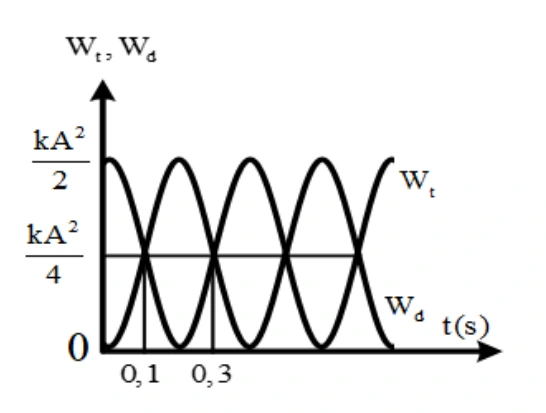{ loading=lazy }

A. $0,2\,\mathrm s$

B. $0,6\,\mathrm s$

C. $0,8\,\mathrm s$.

D. $0,4\,\mathrm s$.

??? success "Đáp án và lời giải"
    **Đáp án:** C

    **Hướng dẫn giải:**

    Hai lần liên tiếp thế năng bằng động năng cách nhau $T/4$. Từ đồ thị, $T/4=0{,}3-0{,}1=0{,}2\,\mathrm s$, suy ra $T=0{,}8\,\mathrm s$. Vậy chọn **C**.

#### Bài 143

<!-- source-id: BT-Chuong-I-p171-q49-441 -->

Một vật có khối lượng 400 g dao động điều hòa có đồ thị động năng như hình vẽ. Tại thời điểm $t=0$ vật đang chuyển động theo chiều dương, lấy $\pi^2=10$. Phương trình dao động của vật là

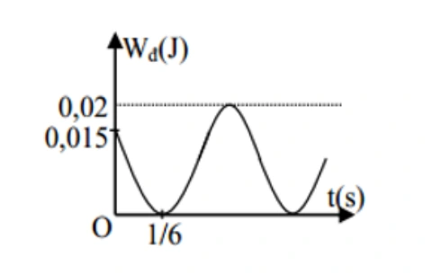{ loading=lazy }

A. $x=5\cos\left(2\pi t+\dfrac{\pi}{3}\right)\,\mathrm{cm}$.

B. $x=10\cos\left(\pi t+\dfrac{\pi}{6}\right)\,\mathrm{cm}$.

C. $x=5\cos\left(2\pi t-\dfrac{\pi}{3}\right)\,\mathrm{cm}$.

D. $x=10\cos\left(\pi t-\dfrac{\pi}{3}\right)\,\mathrm{cm}$.

??? success "Đáp án và lời giải"
    **Đáp án:** C

    **Hướng dẫn giải:**

    Từ đồ thị, cơ năng $W=W_{đ,\max}=0{,}02\,\mathrm J$ và tại $t=0$ có $W_đ=0{,}015\,\mathrm J$. Do đó

    $\dfrac{W_đ}{W}=\dfrac{0{,}015}{0{,}02}=\dfrac34\Rightarrow \dfrac{W_t}{W}=\dfrac14\Rightarrow |x|=\dfrac{A}{2}$.

    Tại $t=0$ vật chuyển động theo chiều dương, nên pha ban đầu phù hợp là $\varphi=-\dfrac{\pi}{3}$.

    Trên đồ thị, sau $\Delta t=\dfrac16\,\mathrm s$ pha biến đổi $\Delta\varphi=\dfrac{\pi}{3}$, vì vậy

    $\omega=\dfrac{\Delta\varphi}{\Delta t}=2\pi\,\mathrm{rad/s}$.

    Với $m=0{,}4\,\mathrm{kg}$, $k=m\omega^2=0{,}4(2\pi)^2=16\,\mathrm{N/m}$. Từ $W=\dfrac12kA^2=0{,}02\,\mathrm J$ suy ra $A=0{,}05\,\mathrm m$ $=5\,\mathrm{cm}$.

    Phương trình là $x=5\cos\left(2\pi t-\dfrac{\pi}{3}\right)\,\mathrm{cm}$. Chọn **C**.

#### Bài 144

<!-- source-id: BT-Chuong-I-p172-q50-442 -->

Một vật có khối lượng $100\,\mathrm g$ dao động điều hòa có đồ thị thế năng như hình vẽ. Tại thời điểm $t=0$ vật có gia tốc âm, lấy $\pi^2=10$. Phương trình vận tốc của vật là

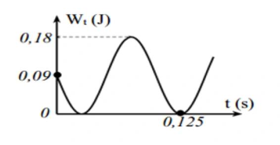{ loading=lazy }

A. $v=60\pi\cos(5\pi t+\pi/4)\,\mathrm{cm/s}$.

B. $v=60\pi\sin(5\pi t+3\pi/4)\,\mathrm{cm/s}$.

C. $v=60\pi\cos(10\pi t+3\pi/4)\,\mathrm{cm/s}$.

D. $v=60\pi\cos(10\pi t+\pi/4)\,\mathrm{cm/s}$.

??? success "Đáp án và lời giải"
    **Đáp án:** C

    **Hướng dẫn giải:**

    Từ đồ thị $W=0{,}18\,\mathrm J$ và $W_\mathrm{t}(0)=0{,}09\,\mathrm J$, nên $x(0)=A/\sqrt2$. Vì $a(0)<0$ nên $x(0)>0$; đồng thời thế năng đang giảm nên vật chuyển động theo chiều âm, do đó pha ban đầu của li độ là $\varphi=\pi/4$. Đồ thị cho sau $0{,}125\,\mathrm s$ pha tăng $5\pi/4$, suy ra $\omega=10\pi\,\mathrm{rad/s}$. Với $m=0{,}1\,\mathrm{kg}$ và $\pi^2=10$, từ $W=\tfrac12m\omega^2A^2$ được $A=6\,\mathrm{cm}$. Vậy $v=-60\pi\sin(10\pi t+\pi/4)=60\pi\cos(10\pi t+3\pi/4)\,\mathrm{cm/s}$; chọn C.
#### Bài 145

<!-- source-id: BT-Chuong-I-p180-q1-454 -->

Trong dao động điều hòa của một vật thì tập hợp ba đại lượng nào sau đây là không thay đổi theo
thời gian

A. vận tốc, lực, năng lượng toàn phần.

B. biên độ, tần số, gia tốc.

C. biên độ, tần số, năng lượng toàn phần.

D. gia tốc, chu kỳ, lực.

??? success "Đáp án và lời giải"
    **Đáp án:** C

    **Hướng dẫn giải:**

    Năng lượng được bảo toàn nên không đổi, biên độ và tần số không đổi .

#### Bài 146

<!-- source-id: BT-Chuong-I-p180-q2-455 -->

Trong dao động điều hòa

A. khi gia tốc cực đại thì động năng cực tiểu.

B. khi cơ năng cực tiểu thì thế năng cực đại.

C. khi động năng cực đại thì thế năng cũng cực đại.

D. khi vận tốc cực đại thì pha dao động cũng cực đại.

??? success "Đáp án và lời giải"
    **Đáp án:** A

    **Hướng dẫn giải:**

    Gia tốc cực đại khi vật ở biên âm. Ở biên thì vận tốc bằng 0 nên động năng cũng bằng 0.

#### Bài 147

<!-- source-id: BT-Chuong-I-p180-q3-456 -->

Một vật dao động điều hoà với chu kỳ T, động năng của vật biến đổi theo thời gian

A. tuần hoàn với chu kỳ T.

B. tuần hoàn với chu kỳ 2T.

C. với một hàm sin hoặc cosin.

D. tuần hoàn với chu kỳ T/2.

??? success "Đáp án và lời giải"
    **Đáp án:** D

    **Hướng dẫn giải:**

    Ta có $W_\mathrm{đ}=\tfrac12m\omega^2A^2\sin^2(\omega t+\varphi)$. Vì $\sin^2$ có chu kì góc $\pi$, động năng biến thiên tuần hoàn với chu kì $T/2$. Vậy chọn **D**.

#### Bài 148

<!-- source-id: BT-Chuong-I-p180-q4-457 -->

Phát biểu nào sau đây về động năng và thế năng trong dao động điều hoà là sai?

A. Thế năng đạt giá trị cực tiểu khi độ lớn gia tốc của vật đạt giá trị cực tiểu.

B. Động năng đạt giá trị cực đại khi vật chuyển động qua vị trí cân bằng.

C. Thế năng đạt giá trị cực đại khi tốc độ của vật đạt giá trị cực đại.

D. Động năng đạt giá trị cực tiểu khi vật ở một trong hai vị trí biên.

??? success "Đáp án và lời giải"
    **Đáp án:** C

    **Hướng dẫn giải:**

    Tốc độ của vật đạt giá trị cực đại khi vật ở vị trí cân bằng. Ở vị trí cân bằng, thế năng bằng 0.

#### Bài 149

<!-- source-id: BT-Chuong-I-p181-q5-458 -->

Một vật có khối lượng $m$ dao động điều hòa với biên độ $A$. Khi chu kì tăng $3$ lần thì năng lượng của vật sẽ

A. tăng $3$ lần.

B. giảm $9$ lần.

C. tăng $9$ lần.

D. giảm $3$ lần.

??? success "Đáp án và lời giải"
    **Đáp án:** B

    **Hướng dẫn giải:**

    Với $m$ và $A$ không đổi,

    $W=\frac12m\omega^2A^2 =\frac12m\left(\frac{2\pi}{T}\right)^2A^2 \propto\frac{1}{T^2}.$

    Khi $T$ tăng $3$ lần, $W$ giảm $3^2=9$ lần.

#### Bài 150

<!-- source-id: BT-Chuong-I-p181-q8-461 -->

Một con lắc đơn dao động điều hòa với tần số $f$. Nếu tăng khối lượng của con lắc lên 4 lần thì tần số dao động của nó sẽ là

A. $2f$.

B. $\sqrt2f$.

C. $\dfrac f2$.

D. $f$.

??? success "Đáp án và lời giải"
    **Đáp án:** D

    **Hướng dẫn giải:**

    Với dao động nhỏ, tần số con lắc đơn là $f=\dfrac{1}{2\pi}\sqrt{g/\ell}$, không phụ thuộc khối lượng vật nặng. Vì vậy tăng khối lượng lên 4 lần không làm đổi tần số; chọn D.

#### Bài 151

<!-- source-id: BT-Chuong-I-p181-q9-462 -->

Một vật dao động điều hòa, đồ thị biểu diễn mối quan hệ giữa thế năng $W_\mathrm{t}$ và động năng $W_\mathrm{đ}$ có dạng đường nào?

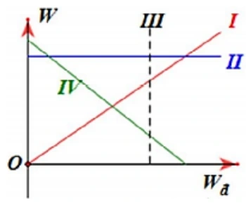{ loading=lazy }

A. Đường IV.

B. Đường I.

C. Đường III.

D. Đường II.

??? success "Đáp án và lời giải"
    **Đáp án:** A

    **Hướng dẫn giải:**

    Vì cơ năng được bảo toàn, $W_\mathrm{t}=W-W_\mathrm{đ}$. Do đó $W_\mathrm{t}$ phụ thuộc tuyến tính vào $W_\mathrm{đ}$ với hệ số góc âm, tương ứng với đường IV.

    Vì vậy chọn **A**.

#### Bài 152

<!-- source-id: BT-Chuong-I-p181-q10-463 -->

<!-- source-note: Đề PDF không nêu g nhưng hướng dẫn dùng g=10 m/s^2; dữ kiện này đã được đưa vào đề để bài tự đủ. -->
Một con lắc đơn có độ dài dây $\ell=2\,\mathrm m$, treo quả nặng $m=1\,\mathrm{kg}$, kéo con lắc lệch khỏi vị trí cân bằng góc $60^\circ$ rồi buông tay. Lấy $g=10\,\mathrm{m/s^2}$. Thế năng cực đại của con lắc đơn bằng

A. $1\,\mathrm J$

B. $5\,\mathrm J$ .

C. $10\,\mathrm J$ .

D. $15\,\mathrm J$.

??? success "Đáp án và lời giải"
    **Đáp án:** C

    **Hướng dẫn giải:**

    Chọn mốc thế năng ở vị trí thấp nhất. Ở góc cực đại $60^\circ$, $W_\mathrm{t,max}=mg\ell(1-\cos60^\circ)=1\cdot10\cdot2\cdot(1-1/2)=10\,\mathrm J$. Vậy chọn **C**.
#### Bài 153

<!-- source-id: BT-Chuong-I-p182-q11-464 -->

Một con lắc lò xo gồm lò xo có độ cứng $40\,\mathrm{N/m}$ gắn với quả cầu có khối lượng m. Cho quả cầu dao
động với biên độ $5\,\mathrm{cm}$. Động năng của quả cầu ở vị trí ứng li độ $3\,\mathrm{cm}$ bằng

A. $0,032\,\mathrm J$.

B. $320\,\mathrm J$.

C. $0,018\,\mathrm J$.

D. $0,5\,\mathrm J$.

??? success "Đáp án và lời giải"
    **Đáp án:** A

    **Hướng dẫn giải:**

    Động năng tại li độ $x$ là $W_\mathrm{đ}=\tfrac12k(A^2-x^2)$. Thay $k=40\,\mathrm{N/m}$, $A=0{,}05\,\mathrm m$, $x=0{,}03\,\mathrm m$ được $W_\mathrm{đ}=0{,}032\,\mathrm J$; chọn A.
#### Bài 154

<!-- source-id: BT-Chuong-I-p182-q12-465 -->

Một con lắc lò xo gồm viên bi nhỏ và lò xo nhẹ có độ cứng $100\,\mathrm{N/m}$, dao động điều hòa với biên
độ $0,1\,\mathrm m$. Mốc thế năng ở vị trí cân bằng. Khi viên bi cách biên $6\,\mathrm{cm}$ thì động năng của con lắc bằng

A. $0,64\,\mathrm J$.

B. $4,2\,\mathrm{mJ}$.

C. $6,4\,\mathrm{mJ}$.

D. $0,42\,\mathrm J$.

??? success "Đáp án và lời giải"
    **Đáp án:** D

    **Hướng dẫn giải:**

    “Cách biên $6\,\mathrm{cm}$” nghĩa là $|x|=A-6\,\mathrm{cm}=4\,\mathrm{cm}$. Do đó $W_\mathrm{đ}=\tfrac12k(A^2-x^2)=\tfrac12\cdot100(0{,}1^2-0{,}04^2)=0{,}42\,\mathrm J$; chọn D.
#### Bài 155

<!-- source-id: BT-Chuong-I-p182-q13-466 -->

Vật nhỏ của một con lắc lò xo có khối lượng 100 g dao động điều hòa với chu kì $0,2\,\mathrm s$, cơ năng là $0,18\,\mathrm J$ (mốc thế năng tại vị trí cân bằng), lấy $\pi^2=10$. Tại li độ $3\sqrt2\,\mathrm{cm}$, tỉ số động năng và thế năng bằng

A. 3.

B. 4.

C. 2.

D. 1.

??? success "Đáp án và lời giải"
    **Đáp án:** D

    **Hướng dẫn giải:**

    $\omega=\dfrac{2\pi}{T}=10\pi\,\mathrm{rad/s}$. Từ
    $W=\dfrac12m\omega^2A^2=0{,}18\,\mathrm J$ với $m=0{,}1\,\mathrm{kg}$ và $\pi^2=10$, suy ra $A=0{,}06\,\mathrm m$ $=6\,\mathrm{cm}$.

    Tại $x=3\sqrt2\,\mathrm{cm}$,
    $\dfrac{W_\mathrm{t}}{W}=\dfrac{x^2}{A^2}=\dfrac{18}{36}=\dfrac12$.
    Vì vậy $W_\mathrm{đ}=W_\mathrm{t}$ và $\dfrac{W_\mathrm{đ}}{W_\mathrm{t}}=1$, chọn **D**.

#### Bài 156

<!-- source-id: BT-Chuong-I-p182-q14-467 -->

Con lắc lò xo dao động với biên độ $6\,\mathrm{cm}$. Li độ của vật để thế năng của lò xo bằng $1/3$ động năng là

A. $\pm3\sqrt{2}\,\mathrm{cm}$.

B. $\pm3\,\mathrm{cm}$.

C. $\pm2\sqrt{2}\,\mathrm{cm}$.

D. $\pm\sqrt{2}\,\mathrm{cm}$.

??? success "Đáp án và lời giải"
    **Đáp án:** B

    **Hướng dẫn giải:**

    Điều kiện $W_\mathrm{t}=\dfrac{1}{3}W_\mathrm{đ}$ tương đương $W_\mathrm{đ}=3W_\mathrm{t}$, nên cơ năng $W=4W_\mathrm{t}$.

    Với con lắc lò xo, $\dfrac{W_\mathrm{t}}{W}=\dfrac{x^2}{A^2}=\dfrac14$. Do đó $|x|=\dfrac{A}{2}=3\,\mathrm{cm}$.

    Vậy $x=\pm3\,\mathrm{cm}$, chọn **B**.

#### Bài 157

<!-- source-id: BT-Chuong-I-p182-q15-468 -->

Một con lắc đơn có khối lượng $m=10\,\mathrm{kg}$ và chiều dài dây treo $l=2\,\mathrm m$. Góc lệch cực đại so với đường thẳng đứng là $\alpha_0=10^\circ=0,175$ rad. Lấy $g=10\,\mathrm{m/s}^2$. Cơ năng của con lắc và vận tốc vật nặng khi nó ở vị trí thấp nhất là

A. $W=0,1525\,\mathrm J$; $v_{\max}=0,055\,\mathrm{m/s}$.

B. $W=1,525\,\mathrm J$; $v_{\max}=0,55\,\mathrm{m/s}$.

C. $W=30,45\,\mathrm J$; $v_{\max}=7,8\,\mathrm{m/s}$.

D. $W=3,063\,\mathrm J$; $v_{\max}=0,78\,\mathrm{m/s}$.

??? success "Đáp án và lời giải"
    **Đáp án:** D

    **Hướng dẫn giải:**

    Theo mô hình góc nhỏ dùng trong tài liệu nguồn,
    $W=\dfrac12mgl\alpha_0^2=\dfrac12\cdot10\cdot10\cdot2\cdot0,175^2=3,0625\,\mathrm J$.

    Ở vị trí thấp nhất, thế năng được chọn bằng 0 nên
    $W=\dfrac12mv_{\max}^2$. Suy ra
    $v_{\max}=\sqrt{\dfrac{2W}{m}}\approx0,783\,\mathrm{m/s}$.

    Làm tròn theo các phương án: $W\approx3,063\,\mathrm J$ và $v_{\max}\approx0,78\,\mathrm{m/s}$, chọn **D**.

#### Bài 158

<!-- source-id: BT-Chuong-I-p183-q17-470 -->

Một con lắc lò xo dao động điều hòa với biên độ $A=10\,\mathrm{cm}$. Đồ
thị biểu diễn mối liên hệ giữa động năng và vận tốc của vật dao động được
cho như hình vẽ. Chu kì và độ cứng của lò xo lần lượt là

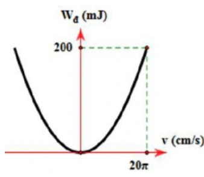{ loading=lazy }

A. $1\,\mathrm s$ và $4\,\mathrm{N/m}$.

B. $2\pi\,\mathrm s$ và $40\,\mathrm{N/m}$.

C. $2\pi\,\mathrm s$ và $4\,\mathrm{N/m}$.

D. $1\,\mathrm s$ và $40\,\mathrm{N/m}$.

??? success "Đáp án và lời giải"
    **Đáp án:** D

    **Hướng dẫn giải:**

    Từ đồ thị, tại $v_\max=20\pi\,\mathrm{cm/s}=0{,}2\pi\,\mathrm{m/s}$ thì $W_\mathrm{đ,max}=0{,}2\,\mathrm J$. Suy ra $m=2W/v_\max^2=10/\pi^2\,\mathrm{kg}\approx1\,\mathrm{kg}$. Với $A=0{,}1\,\mathrm m$, $v_\max=\omega A$ cho $\omega=2\pi\,\mathrm{rad/s}$, nên $T=1\,\mathrm s$ và $k=m\omega^2\approx40\,\mathrm{N/m}$. Chọn D.
#### Bài 159

<!-- source-id: BT-Chuong-I-p183-q18-471 -->

Một vật nhỏ dao động điều hòa dọc theo trục Ox. Khi vật cách vị trí cân bằng một đoạn $2\,\mathrm{cm}$ thì
động năng của vật là $0,48\,\mathrm J$. Khi vật cách vị trí cân bằng một đoạn $6\,\mathrm{cm}$ thì động năng của vật là $0,32\,\mathrm J$. Biên
độ dao động của vật bằng

A. $8\,\mathrm{cm}$.

B. $14\,\mathrm{cm}$.

C. $10\,\mathrm{cm}$.

D. $12\,\mathrm{cm}$.

??? success "Đáp án và lời giải"
    **Đáp án:** C

    **Hướng dẫn giải:**

    Vì $W_\mathrm{đ}=W-\tfrac12kx^2$, lấy hiệu hai trạng thái: $0{,}48-0{,}32=\tfrac12k(0{,}06^2-0{,}02^2)$, suy ra $k=100\,\mathrm{N/m}$. Cơ năng $W=0{,}48+\tfrac12\cdot100\cdot0{,}02^2=0{,}50\,\mathrm J$, nên $A=\sqrt{2W/k}=0{,}10\,\mathrm m=10\,\mathrm{cm}$; chọn C.
### Vận dụng — Đúng/Sai

#### Bài 160

<!-- source-id: BT-Chuong-I-p174-q1-443 -->

Trong các phát biểu sau, ý nào đúng, ý nào sai về năng lượng trong dao động điều hòa:

a) Năng lượng toàn phần của một vật dao động điều hòa luôn luôn không đổi theo thời gian.

b) Tại vị trí cân bằng của vật dao động điều hòa, thế năng của vật đạt giá trị cực đại.

c) Khi biên độ dao động của vật tăng gấp đôi, năng lượng toàn phần của dao động tăng gấp bốn lần.

d) Động năng của vật dao động điều hòa tại vị trí cân bằng bằng 0.

??? success "Đáp án và lời giải"
    **Đáp án:** a) Đúng; b) Sai; c) Đúng; d) Sai.

    **Hướng dẫn giải:**

    a) **Đúng.** Với dao động điều hòa lí tưởng, cơ năng $W=W_\mathrm{đ}+W_\mathrm{t}$ được bảo toàn.

    b) **Sai.** Tại vị trí cân bằng $x=0$, thế năng nhỏ nhất (bằng $0$ nếu chọn mốc tại cân bằng), còn động năng cực đại.

    c) **Đúng.** $W=\tfrac12m\omega^2A^2$, nên khi $A$ tăng gấp đôi thì $W$ tăng $2^2=4$ lần.

    d) **Sai.** Tại vị trí cân bằng, vận tốc có độ lớn cực đại nên động năng cực đại, không bằng $0$.
#### Bài 161

<!-- source-id: BT-Chuong-I-p174-q2-444 -->

Trong các phát biểu sau, phát biểu nào đúng, phát biểu nào sai:

a) Cơ năng của một vật dao động điều hòa biến thiên tuần hoàn theo thời gian với chu kì bằng một nửa chu kì dao động của vật.

b) Cơ năng của một vật dao động điều hòa bằng động năng của vật tại vị trí cân bằng.

c) Cơ năng của một vật dao động điều hòa bằng tổng động năng và thế năng của vật.

d) Trong mỗi chu kì dao động, có 2 lần động năng bằng thế năng.

??? success "Đáp án và lời giải"
    **Đáp án:** a) Sai; b) Đúng; c) Đúng; d) Sai.

    **Hướng dẫn giải:**

    a) **Sai.** Cơ năng của một vật dao động điều hòa luôn không đổi .

    b) **Đúng.** Tại vị trí cân bằng của vật dao động điều hòa, động năng của vật đạt cực đại = Cơ năng .

    c) **Đúng.** Cơ năng của một vật dao động điều hòa bằng tổng động năng và thế năng của vật.

    d) **Sai.** Trong mỗi chu kì, có 4 lần động năng = thế năng .

#### Bài 162

<!-- source-id: BT-Chuong-I-p174-q3-445 -->

<!-- source-note: PDF lẫn đơn vị trên các phát biểu; nội dung hiện tại được chuẩn hóa theo trục tung đồ thị và phép tính vật lí. -->
Một vật khối lượng $m=100\,\mathrm g$ dao động điều hòa. Đồ thị động năng theo thời gian được cho trong hình; tại $t=0$ vật có gia tốc âm, lấy $\pi^2\approx10$. Xét các phát biểu:

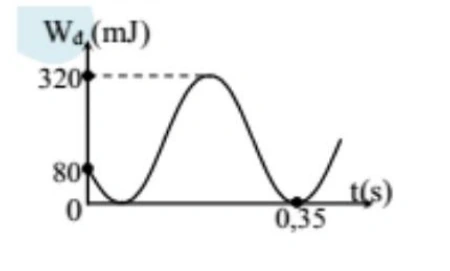{ loading=lazy }

a) Động năng cực đại của vật bằng $80\,\mathrm{mJ}$.

b) Tại thời điểm ban đầu, $W_\mathrm{t}=4W_\mathrm{đ}$.

c) Cơ năng của vật bằng $320\,\mathrm{mJ}$.

d) Tần số góc của dao động bằng $\dfrac{10\pi}{3}\,\mathrm{rad/s}$.

??? success "Đáp án và lời giải"
    **Đáp án:** a) Sai; b) Sai; c) Đúng; d) Đúng.

    **Hướng dẫn giải:**

    a) **Sai.** Từ đỉnh đồ thị động năng, $W_\mathrm{đ,max}=W=320\,\mathrm{mJ}$, không phải $80\,\mathrm{mJ}$.

    b) **Sai.** Tại $t=0$, đồ thị cho $W_\mathrm{đ}=80\,\mathrm{mJ}$, nên $W_\mathrm{t}=W-W_\mathrm{đ}=320-80=240\,\mathrm{mJ}$. Do đó $W_\mathrm{t}=3W_\mathrm{đ}$, không phải $4W_\mathrm{đ}$.

    c) **Đúng.** Cơ năng bằng động năng cực đại, nên $W=320\,\mathrm{mJ}$.

    d) **Đúng.** Động năng biến thiên với chu kì $T/2$. Đọc chu kì của đồ thị động năng rồi suy ra chu kì dao động cho $\omega=2\pi/T=10\pi/3\,\mathrm{rad/s}$.
#### Bài 163

<!-- source-id: BT-Chuong-I-p175-q4-446 -->

Hai chất điểm có khối lượng lần lượt $m_1,m_2$ dao động điều hòa cùng phương, cùng tần số. Đồ thị biểu diễn động năng của vật 1 và thế năng của vật 2 theo li độ như hình. Xét các phát biểu:

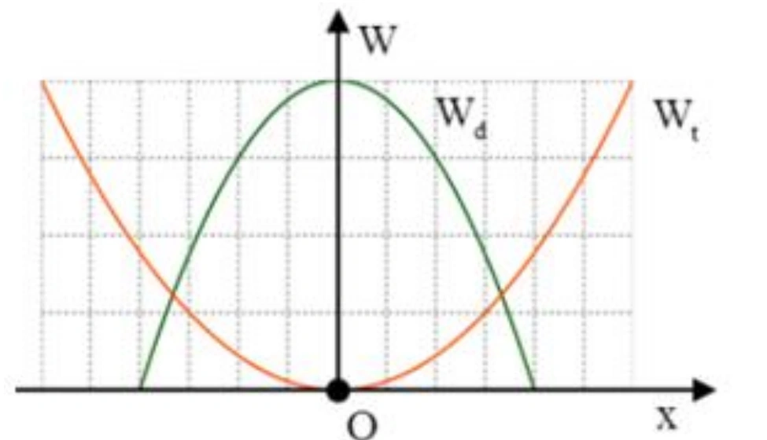{ loading=lazy }

a) Hai vật dao động với cùng biên độ.

b) Năng lượng dao động của hai vật bằng nhau.

c) Trong một chu kì có $2$ thời điểm động năng của vật 1 bằng thế năng của vật 2.

d) Tỉ số biên độ là $A_1/A_2=2/3$.

??? success "Đáp án và lời giải"
    **Đáp án:** a) Sai; b) Đúng; c) Sai; d) Đúng.

    **Hướng dẫn giải:**

    a) **Sai.** Từ các giao điểm với trục li độ trên đồ thị, $A_1$ ứng với $4$ ô còn $A_2$ ứng với $6$ ô, nên hai biên độ khác nhau.

    b) **Đúng.** Giá trị cực đại của hai đường năng lượng đều bằng $4$ đơn vị trên trục tung, nên cơ năng hai dao động bằng nhau.

    c) **Sai.** Trong nửa chu kì có $2$ lần hai đại lượng bằng nhau; vì vậy trong một chu kì có $4$ lần.

    d) **Đúng.** $A_1/A_2=4/6=2/3$.
