# Bài tập — Bài 7 — Tổng hợp dao động, tắt dần, cưỡng bức và cộng hưởng

> Hệ bài tập được biên soạn theo các dạng xuất hiện trong bộ tài liệu Vật lí 11 của dự án. Câu hỏi được giữ ngắn, trực tiếp; độ khó tăng dần và không cố tình thêm dữ kiện gây nhiễu.

[← Trở lại bài học](../../07-combined-damped-forced-resonance.md)

## Phần A — Trắc nghiệm 4 lựa chọn

### Câu 1 — Mức 1 — Nhận biết

Hai dao động cùng phương, cùng tần số và cùng pha có biên độ $A_1=3$ cm, $A_2=5$ cm. Biên độ tổng hợp là

A. $2$ cm.  
B. $4$ cm.  
C. $8$ cm.  
D. $15$ cm.

### Câu 2 — Mức 1 — Nhận biết

Hai dao động cùng phương, cùng tần số, ngược pha có $A_1=7$ cm, $A_2=4$ cm. Biên độ tổng hợp là

A. $3$ cm.  
B. $11$ cm.  
C. $\sqrt{33}$ cm.  
D. $28$ cm.

### Câu 3 — Mức 1 — Nhận biết

Trong dao động cưỡng bức ổn định, tần số dao động của hệ bằng

A. tần số riêng của hệ trong mọi trường hợp.  
B. tần số của ngoại lực cưỡng bức.  
C. tổng hai tần số.  
D. bằng 0.

### Câu 4 — Mức 1 — Nhận biết

Cộng hưởng xảy ra rõ nhất khi

A. tần số ngoại lực gần bằng tần số riêng và lực cản nhỏ.  
B. tần số ngoại lực bằng 0.  
C. lực cản rất lớn.  
D. hệ không chịu ngoại lực.

## Phần B — Đúng/Sai

### Câu 5 — Mức 2 — Thông hiểu

Xét dao động tắt dần:

a) Biên độ giảm theo thời gian.  
b) Cơ năng cơ học thường giảm do lực cản.  
c) Không có sự chuyển hóa cơ năng sang dạng năng lượng khác.  
d) Giảm chấn ô tô là một ứng dụng có lợi của dao động tắt dần.

### Câu 6 — Mức 2 — Thông hiểu

Xét hiện tượng cộng hưởng:

a) Biên độ cưỡng bức phụ thuộc độ chênh giữa tần số ngoại lực và tần số riêng.  
b) Lực cản càng nhỏ thì đỉnh cộng hưởng thường càng rõ.  
c) Cộng hưởng luôn có lợi.  
d) Thiết kế cầu và máy móc cần xét khả năng cộng hưởng.

## Phần C — Trả lời ngắn

### Câu 7 — Mức 3 — Vận dụng

Hai dao động $x_1=3\cos\omega t$ cm và $x_2=4\cos(\omega t+\pi/2)$ cm. Tính biên độ dao động tổng hợp.

### Câu 8 — Mức 3 — Vận dụng

Hai dao động cùng phương có $A_1=A_2=5$ cm và lệch pha $120^\circ$. Tính biên độ tổng hợp.

### Câu 9 — Mức 3 — Vận dụng

Một hệ có tần số riêng $4$ Hz. Ngoại lực tuần hoàn có thể chọn các tần số $3,5$ Hz; $4,0$ Hz; $5,0$ Hz. Khi lực cản nhỏ, chọn tần số nào để biên độ ổn định lớn nhất?

## Phần D — Vận dụng và vận dụng cao

### Câu 10 — Mức 4 — Vận dụng cao

Hai dao động cùng phương:

$x_1=4\cos(10t+\pi/6)$ cm, $x_2=3\cos(10t-\pi/3)$ cm.

Tìm biên độ và pha ban đầu của dao động tổng hợp.

---

[Đáp án và lời giải →](solutions.md)

## Ngân hàng bài tập PDF mở rộng

> Nội dung câu hỏi và dữ kiện trong phần này được giữ nguyên; hệ thống chỉ chuẩn hóa xuống dòng và mã kí tự để hiển thị trên web. Câu trùng được loại bỏ. Với câu có công thức/kí hiệu bị sai khi trích xuất chữ từ PDF, đề bài được giữ dưới dạng ảnh để không làm thay đổi dữ kiện.

### Nhận biết — Trả lời ngắn

#### Bài PDF 1

<!-- source-id: BT-Chuong-I-p140-q1-359 -->

Câu 1. Một người xách một xô nước đi trên đường, mỗi bước đi dài L = 50 cm thì nước trong xô
bị sóng sánh mạnh nhất. Tốc độ đi của người đó là v = 2,5 km/h. Chu kì dao động riêng của nước
trong xô tính theo đơn vị giây là bao nhiêu ? (làm tròn đến chữ số thập phân thứ hai)

#### Bài PDF 2

<!-- source-id: BT-Chuong-I-p140-q2-360 -->

Câu 2. Một con lắc lò xo đang dao động tắt dần, sau mỗi chu kỳ biên độ dao động giảm 5%. Phần
trăm cơ năng còn lại sau khoảng thời gian đó xấp xỉ là bao nhiêu (đơn vị tính theo %) ?

#### Bài PDF 3

<!-- source-id: BT-Chuong-I-p140-q3-361 -->

Câu 3. Con lắc lò xo gồm vật nhỏ khối lượng 0,4 kg gắn vào đầu một lò xo có độ cứng 20 N/m.
Vật được gắn trên một giá đỡ cố định nằm dọc theo trục lò xo. Hệ dao động theo phương nằm
ngang. Biết hệ số ma sát giữa vật và giá đỡ là 0,1. Kéo vật khỏi vị trí cân bằng một khoảng 20 cm
theo chiều dương rồi thả cho vật dao động không vận tốc đầu.  Lấy g = 10 m/s2. Tốc độ lớn nhất

vật đạt được trong quá trình dao động là bao nhiêu ? (tính theo đơn vị m/s, làm tròn đến hai chữ
số thập phân thứ hai)

#### Bài PDF 4

<!-- source-id: BT-Chuong-I-p141-q4-362 -->

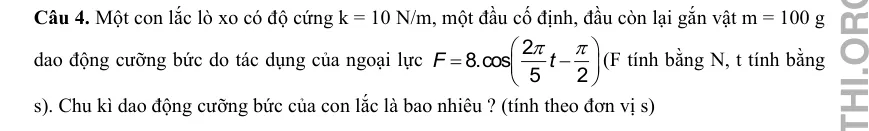{ loading=lazy }

#### Bài PDF 5

<!-- source-id: BT-Chuong-I-p141-q5-363 -->

Câu 5. Con lắc lò xo có độ cứng
2
25.π N/m một đầu cố định, đầu còn lại gắn vật có khối lượng
m = 250 gam dao động điều hòa theo phương nằm ngang. Người ta tác dụng lên con lắc một
ngoại lực tuần hoàn
(
)( )
4.cos 2
F
ft
N
π
=
. Thay đổi tần số ngoại lực từ 6,15 Hz đến 8,75 Hz thì
biên độ dao động đạt giá trị lớn nhất khi tần số là bao nhiêu ? (tần số tính theo đơn vị Hz)

#### Bài PDF 6

<!-- source-id: BT-Chuong-I-p142-q6-364 -->

Câu 6. Con lăc lò xo có độ cứng
2
25.π(N/m) một đầu cố định, đầu còn lại gắn vật m dao động
điều hòa theo phương ngang. Hệ số ma sát giữa vật và mặt phẳng nằm ngang là μ. Đồ thị dao
động của vật theo thời gian như hình 2.15 , trong mỗi chu kì biên độ dao động con lắc giảm số
mi- li-mét là bao nhiêu ?

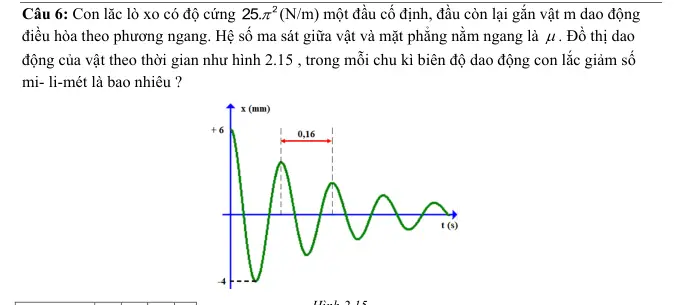{ loading=lazy }

#### Bài PDF 7

<!-- source-id: BT-Chuong-I-p150-q1-387 -->

Câu 1. Một tàu hỏa chạy trên đường, mỗi thanh ray dài L = 12,5 m. Người ta treo vào trần toa xe
một con lắc lò xo có độ cứng 25 N/m. Khi xe chạy với tốc độ 54 km/h thì con lắc dao động mạnh
nhất. Khối lượng vật nặng tính theo đơn vị kg là bao nhiêu ? (làm tròn đến số thập phân thứ hai)

#### Bài PDF 8

<!-- source-id: BT-Chuong-I-p151-q2-388 -->

Câu 2. Một con lắc lò xo đang dao động tắt dần, sau mỗi chu kì dao động, biên độ của nó giảm đi
2%. Sau bao nhiêu dao động thì cơ năng của con lắc giảm 30%?

#### Bài PDF 9

<!-- source-id: BT-Chuong-I-p151-q3-389 -->

Câu 3. Một con lắc lò xo có độ cứng k = 25 N/m, một đầu cố định, đầu còn lại gắn vật m = 100 g
dao động cưỡng bức do tác dụng của ngoại lực
(
)
2.cos 2
F
t
π
=
(F tính bằng N, t tính bằng s). Tần
số dao động cưỡng bức của con lắc là bao nhiêu  (tính theo đơn vị Hz) ?

#### Bài PDF 10

<!-- source-id: BT-Chuong-I-p151-q4-390 -->

Câu 4. Con lắc lò xo gồm vật nhỏ khối lượng 0,25 kg gắn vào đầu một lò xo có độ cứng 100
N/m. Vật được gắn trên một giá đỡ cố định nằm dọc theo trục lò xo. Hệ dao động theo phương
nằm ngang. Biết hệ số ma sát giữa vật và giá đỡ là 0,2. Kéo vật khỏi vị trí cân bằng một khoảng 8
cm theo chiều dương rồi thả cho vật dao động không vận tốc đầu. Lấy g = 10 m/s2. Độ giảm biên
độ sau mỗi chu kì dao động là bao nhiêu  (tính theo đơn vị m, làm tròn đến hai chữ số thập phân
thứ hai) ?

#### Bài PDF 11

<!-- source-id: BT-Chuong-I-p153-q5-391 -->

Câu 5. Con lăc lò xo có độ cứng
2
25.π(N/m) một đầu cố định, đầu còn lại gắn vật m dao động
điều hòa theo phương ngang. Hệ số ma sát giữa vật và mặt phẳng nằm ngang là μ. Đồ thị dao
động của vật theo thời gian như hình 3.5. Hệ số ma sát giữa vật và mặt phẳng nằm ngang là bao
nhiêu (làm tròn đến số thập phân thứ hai) ?

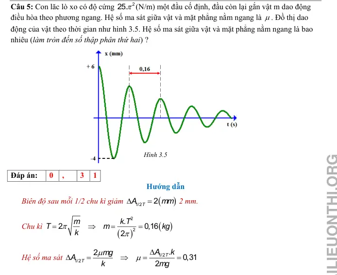{ loading=lazy }

#### Bài PDF 12

<!-- source-id: BT-Chuong-I-p153-q6-392 -->

Câu 6. Con lắc lò xo có độ cứng
2
25.π N/m một đầu cố định, đầu còn lại gắn vật có khối lượng
m = 250 gam dao động điều hòa theo phương nằm ngang. Người ta tác dụng lên con lắc một
ngoại lực tuần hoàn
(
)( )
4.cos 2
F
ft
N
π
=
. Thay đổi tần số ngoại lực từ 1,25 Hz đến 4,25 Hz thì
biên độ dao động đạt giá trị lớn nhất khi tần số là bao nhiêu (tần số tính theo đơn vị Hz) ?

### Nhận biết — Trắc nghiệm 4 lựa chọn

#### Bài PDF 13

<!-- source-id: BT-Chuong-I-p124-q1-315 -->

Câu 1. Trong dao động tắt dần, đại lượng có độ lớn giảm dần theo thời gian là

A. động năng.
B. thế năng.
C. cơ năng.
D. gia tốc.

#### Bài PDF 14

<!-- source-id: BT-Chuong-I-p124-q2-316 -->

Câu 2. Trong dao động tắt dần dưới hạn, đại lượng có giá trị không thay đổi là

A. biên độ.
B. chu kỳ.
C. gia tốc.
D. vận tốc.

#### Bài PDF 15

<!-- source-id: BT-Chuong-I-p124-q3-317 -->

Câu 3. Trong dao động tắt dần, khi độ lớn lực cản môi trường tăng lên, đại lượng có độ lớn giảm
là

A. số dao động vật thực hiện cho đến khi dừng hẳn.

B. thế năng của vật  dao động điều hòa.

C. vận tốc của vật dao động điều hòa.

D. động năng của vật dao động điều hòa.

#### Bài PDF 16

<!-- source-id: BT-Chuong-I-p124-q4-318 -->

Câu 4. Trong dao động tắt dần, một phần cơ năng của vật dao động chuyển hóa thành

A. nhiệt năng.
B. điện năng.
C. quang năng.
D. hóa năng.

#### Bài PDF 17

<!-- source-id: BT-Chuong-I-p124-q5-319 -->

Câu 5. Chọn phát biểu đúng khi nói về dao động tắt dần.
 A. Dao động tắt dần có chu kỳ giảm dần theo thời gian.
 B. Dao động tắt dần có tần số giảm dần theo thời gian.
 C. Dao động tắt dần có tần số góc giảm dần theo thời gian.
 D. Dao động tắt dần có cơ năng giảm dần theo thời gian.

#### Bài PDF 18

<!-- source-id: BT-Chuong-I-p124-q6-320 -->

Câu 6. Dao động mà tốc độ cực đại và thế năng cực đại giảm dần theo thời gian là

A. dao động điều hòa.

B. dao động tuần hoàn.

C. dao động tắt dần.

D. dao động cưỡng bức.

#### Bài PDF 19

<!-- source-id: BT-Chuong-I-p124-q7-321 -->

Câu 7. Biên độ của dao động cơ tắt dần

A. không đổi theo thời gian.
B. tăng dần theo thời gian.

C. giảm dần theo thời gian.
D. biến thiên điều hòa theo thời gian.

#### Bài PDF 20

<!-- source-id: BT-Chuong-I-p124-q8-322 -->

Câu 8. Hãy chỉ ra phát biểu sai.

A. Dao động tắt dần càng nhanh khi độ lớn lực cản môi trường càng lớn.

B. Dao động duy trì có chu kỳ bằng chu kỳ riêng của hệ.

C. Biên độ dao động cưỡng bức không phụ thuộc vào tần số của ngoại lực cưỡng bức.

D. Dao động cưỡng bức có tần số bằng tần số ngoại lực cưỡng bức.

#### Bài PDF 21

<!-- source-id: BT-Chuong-I-p124-q9-323 -->

Câu 9. Dao động cưỡng bức của một vật là dao động dưới tác dụng của ngoại lực biến thiên tuần
hoàn. Kết quả vật sẽ dao động với

A. biên độ của ngoại lực.
B. pha ban đầu của ngoại lực.

C. tần số của ngoại lực.
D. biên độ của dao động riêng.

#### Bài PDF 22

<!-- source-id: BT-Chuong-I-p125-q12-326 -->

Câu 12. Nhận xét nào sau đây là không đúng?

A. Dao động tắt dần càng nhanh nếu lực cản của môi trường càng lớn.

B. Dao động duy trì có chu kỳ bằng chu kỳ dao động riêng của con lắc.

C. Dao động cưỡng bức có tần số bằng tần số của lực cưỡng bức.

D. Biên độ của dao động cưỡng bức không phụ thuộc vào chu kỳ của lực cưỡng bức.

#### Bài PDF 23

<!-- source-id: BT-Chuong-I-p125-q13-327 -->

Câu 13. Khi xảy ra hiện tượng cộng hưởng cơ học, vật dao động cưỡng bức sẽ tiếp tục dao động
với

A. biên độ ngoại lực cưỡng bức.
B. biên độ dao động riêng.

C. tần số dao dộng riêng.
D. cả biên độ và tần số dao động riêng.

#### Bài PDF 24

<!-- source-id: BT-Chuong-I-p125-q14-328 -->

Câu 14. Hiện tượng cộng hưởng chỉ xảy ra với

A. dao động tắt dần.

B. dao động duy trì.

C. dao động điều hoà.
D. dao động cưỡng bức.

#### Bài PDF 25

<!-- source-id: BT-Chuong-I-p125-q15-329 -->

Câu 15. Một em bé đang chơi xích đu. Để cho xích đu đung đưa như thế mãi thì đến điểm cao
nhất thì người mẹ lại đẩy một cái. Đây là dao động gì?

A. Dao động tắt dần.

B. Dao động duy trì.

C. Dao động cộng hưởng.
D. Dao động cưỡng bức.

#### Bài PDF 26

<!-- source-id: BT-Chuong-I-p125-q16-330 -->

Câu 16. Một con lắc đồng hồ đang dao động tắt dần, mỗi chu kỳ năng lượng bị mất đi do ma sát
là 0,01 J. Để duy trì dao động của con lắc đồng hồ, ta cần cung cấp cho con lắc một năng lượng
 A. lớn hơn 0,01 J trong mỗi chu kỳ.

B. lớn hơn 0,01 J trong mỗi nửa chu kỳ.
 C. vừa bằng 0,01 J trong mỗi chu kỳ.

D. lớn hơn 0,01 J trong mỗi nửa chu kỳ.

#### Bài PDF 27

<!-- source-id: BT-Chuong-I-p125-q17-331 -->

Câu 17. Hiện tượng cộng hưởng cơ học gây hại trong trường hợp nào dưới đây?

A. Trong đàn vi-ô-lông.
B. Trong đàn ghi-ta.

C. Trong dao động của các cây cầu.
D. Máy ra-di-o thu sóng điện từ.

#### Bài PDF 28

<!-- source-id: BT-Chuong-I-p126-q18-332 -->

Câu 18. Một con lắc đơn dao động tắt dần với chu kỳ T = 2 (s). Sau khoảng thời gian 20 (s) thì
con lắc đơn dừng hẳn. Dao động của con lắc là

A. dao động cưỡng bức.
B. dao động tắt dần vượt hạn.

C. dao động tắt dần tới hạn.
D. dao động tắt dần dưới hạn.

#### Bài PDF 29

<!-- source-id: BT-Chuong-I-p130-q28-342 -->

Câu 28. Một vật thực hiện dao động tắt dần có đồ thị như hình 2.5 Kể từ khi vật bắt đầu dao động
đến khi dừng hẳn. Số dao động vật thực hiện là

A. 4.
B. 3.
C. 2.
D. 1.

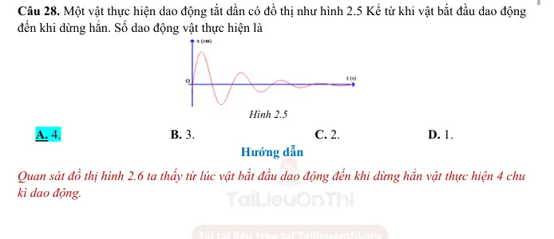{ loading=lazy }

#### Bài PDF 30

<!-- source-id: BT-Chuong-I-p131-q29-343 -->

Câu 29. Một vật dao động tắt dần, sau 8 chu kì dao động liên tiếp thì cơ năng của vật giảm 48%
so với cơ năng ban đầu. Sau mỗi chu kì dao động, biên độ dao động giảm

A. 1%.
B. 2%.
C. 3%.
D. 4%.

#### Bài PDF 31

<!-- source-id: BT-Chuong-I-p131-q30-344 -->

Câu 30. Cây cầu Tacoma Narrows được xây dựng ở Mỹ rất vững chắc. Tuy vậy đến ngày 7 tháng
11 năm 1940, một vụ sập cầu đã xảy ra do gió lớn, phần nhịp chính (840 m) của cây cầu đã bị hư
hỏng rất nặng, thậm chí bị đứt gãy hẳn ở nhiều chỗ. Điều này xảy ra do thiết kế của cây cầu, nó
rất dễ bị rung lắc do ảnh hưởng của gió và từ đó dần dần khiến cầu bị sập. Gió làm sập cầu do

A. dao động tắt dần.

B. dao động duy trì.

C. dao động tự do.

D. hiện tượng cộng hưởng.

#### Bài PDF 32

<!-- source-id: BT-Chuong-I-p131-q31-345 -->

Câu 31. Một vật dao động điều hòa với biên độ A0 và tần số f0. Vật chịu tác dụng của ngoại lực
có biên độ A và tần số f. Bỏ qua sức cản của môi trường, khi dao động cưỡng bức đến giai đoạn
dao động ổn định, vật sẽ dao động với

A. biên độ A.
B. tần số f.
C. biên độ A0.
D. tần số f0.

#### Bài PDF 33

<!-- source-id: BT-Chuong-I-p131-q32-346 -->

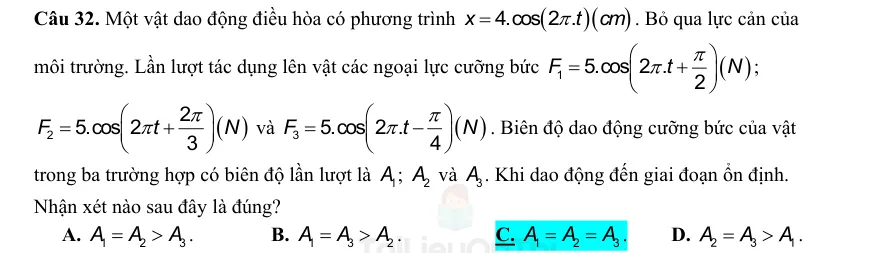{ loading=lazy }

#### Bài PDF 34

<!-- source-id: BT-Chuong-I-p132-q33-347 -->

Câu 33. Con lắc lò xo gồm vật nhỏ khối lượng 0,5 kg gắn vào đầu một lò xo có độ cứng 50 N/m.
Vật được gắn trên một giá đỡ cố định nằm dọc theo trục lò xo. Hệ dao động theo phương nằm
ngang. Biết hệ số ma sát giữa vật và giá đỡ là 0,1. Kéo vật khỏi vị trí cân bằng một khoảng 20 cm
theo chiều dương rồi thả cho vật dao động không vận tốc đầu.  Lấy g = 10 m/s2. Số dao động vật
thực hiện được từ lúc bắt đầu dao động đến khi dừng lại là

A. 4 dao động.
B. 10 dao động.
C. 6 dao động.
D. 5 dao động.

#### Bài PDF 35

<!-- source-id: BT-Chuong-I-p132-q34-348 -->

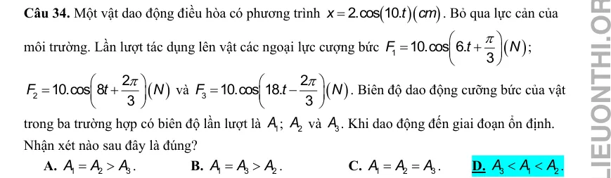{ loading=lazy }

#### Bài PDF 36

<!-- source-id: BT-Chuong-I-p143-q1-365 -->

Câu 1. Trong dao động tắt dần, đại lượng có độ lớn giảm dần theo thời gian là

A. vận tốc.
B. gia tốc.
C. biên độ.
D. thế năng.

#### Bài PDF 37

<!-- source-id: BT-Chuong-I-p143-q2-366 -->

Câu 2. Trong dao động tắt dần dưới hạn, đại lượng có giá trị không thay đổi là

A. tần số.
B. biên độ.
C. tốc độ cực đại.
D. gia tốc.

#### Bài PDF 38

<!-- source-id: BT-Chuong-I-p143-q3-367 -->

Câu 3. Trong dao động tắt dần, khi độ lớn lực cản môi trường giảm, đại lượng có độ lớn tăng là

A. vận tốc cực đại của vật dao động điều hòa.

B. thế năng của vật dao động điều hòa.

C. số dao động vật thực hiện cho đến khi dừng hẳn.

D. động năng của vật dao động điều hòa.

#### Bài PDF 39

<!-- source-id: BT-Chuong-I-p143-q4-368 -->

Câu 4. Hệ thống giảm xóc của xe máy là ứng dụng của

A. dao động cưỡng bức.
B. dao động tắt dần dưới hạn.

C. dao động tắt dần vượt hạn.
D. dao động tắt dần tới hạn.

#### Bài PDF 40

<!-- source-id: BT-Chuong-I-p143-q5-369 -->

Câu 5. Một con lò xo dao động tắt dần với chu kỳ T = 1,5 (s). Ban đầu kéo con lắc lệch khỏi vị trí
cân bằng một khoảng 4 cm rồi thả không vận tốc đầu. Sau khoảng thời gian 1,2 (s) thì con lắc đi
từ biên về tới vị trí cân bằng rồi dừng hẳn. Dao động của con lắc là

A. dao động cưỡng bức.
B. dao động tắt dần vượt hạn.

C. dao động tắt dần tới hạn.
D. dao động tắt dần dưới hạn.

#### Bài PDF 41

<!-- source-id: BT-Chuong-I-p143-q6-370 -->

Câu 6. Dao động mà biên độ và cơ năng giảm dần theo thời gian là

A. dao động điều hòa.

B. dao động tuần hoàn.

C. dao động tắt dần.

D. dao động cưỡng bức.

#### Bài PDF 42

<!-- source-id: BT-Chuong-I-p143-q7-371 -->

Câu 7. Tổng động năng và thế năng của dao động cơ tắt dần

A. biến thiên điều hòa theo thời gian.
B. giảm dần theo thời gian.

C. tăng dần theo thời gian.
D. không đổi theo thời gian.

#### Bài PDF 43

<!-- source-id: BT-Chuong-I-p143-q8-372 -->

Câu 8. Phát biểu nào sau đây là đúng khi nói về dao động tắt dần?

A. Dao động tắt dần có biên độ giảm dần theo thời gian.

B. Cơ năng của vật dao động tắt dần không đổi theo thời gian.

C. Lực cản môi trường tác dụng lên vật luôn sinh công dương.

D. Dao động tắt dần là dao động chỉ chịu tác dụng của nội lực.

#### Bài PDF 44

<!-- source-id: BT-Chuong-I-p144-q9-373 -->

Câu 9. Khi nói về một hệ dao động cưỡng bức ở giai đoạn ổn định, phát biểu nào dưới đây là sai?

A. Tần số của hệ dao động cưỡng bức bằng tần số của ngoại lực cưỡng bức.

B. Tần số của hệ dao động cưỡng bức luôn bằng tần số dao động riêng của hệ.

C. Biên độ của hệ dao động cưỡng bức phụ thuộc vào tần số của ngoại lực cưỡng bức.

D. Biên độ của hệ dao động cưỡng bức phụ thuộc biên độ của ngoại lực cưỡng bức.

#### Bài PDF 45

<!-- source-id: BT-Chuong-I-p144-q10-374 -->

Câu 10. Một vật dao động điều hòa với tần số f0 cưỡng bức dưới tác dụng của ngoại lực biến
thiên tuần hòa. Thay đổi tần số f của ngoại lực cưỡng bức thì biên độ dao động thay đổi như hình
3.1. Nhận xét nào sau đây là đúng?

A.
1
0
2
0
3
0
f
f
f
f
f
f
−

−

−

B.
3
0
2
0
1
0
f
f
f
f
f
f
−

−

−

C.
1
0
3
0
2
0
f
f
f
f
f
f
−

−

−

D.
2
0
3
0
1
0
f
f
f
f
f
f
−

−

−

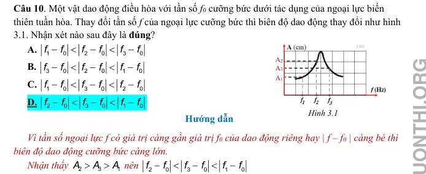{ loading=lazy }

#### Bài PDF 46

<!-- source-id: BT-Chuong-I-p144-q11-375 -->

Câu 11. Vật dao động tắt dần có

A. pha dao động luôn giảm dần theo thời gian.  B. li độ luôn giảm dần theo thời gian.

C. thế năng luôn giảm dần theo thời gian.
D. cơ năng luôn giảm dần theo thời gian.

#### Bài PDF 47

<!-- source-id: BT-Chuong-I-p145-q13-377 -->

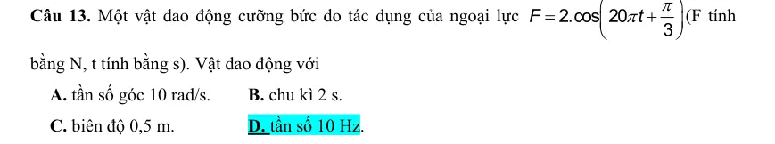{ loading=lazy }

#### Bài PDF 48

<!-- source-id: BT-Chuong-I-p145-q14-378 -->

Câu 14. Phát biểu nào sau đây không đúng khi nói về dao động tắt dần?

A. Biên độ dao động giảm dần.

B. Tốc độ dao động cực đại giảm dần.

C. Tần số dao động càng lớn thì dao động tắt dần càng nhanh.

D. Độ lớn lực cản càng lớn thì dao động tắt dần càng nhanh.

#### Bài PDF 49

<!-- source-id: BT-Chuong-I-p145-q15-379 -->

Câu 15. Một con lắc lò xo dao động tắt dần trên mặt phẳng nằm ngang. Cứ sau mỗi chu kì biên
độ giảm 2%. Gốc thế năng tại vị trí của vật mà lò xo không biến dạng. Phần trăm cơ năng của con
lắc bị mất đi trong hai dao động toàn phần liên tiếp có giá trị gần nhất với giá trị nào sau đây?

A. 7%.
B. 4%.
C. 10%.
D. 8%.

#### Bài PDF 50

<!-- source-id: BT-Chuong-I-p145-q16-380 -->

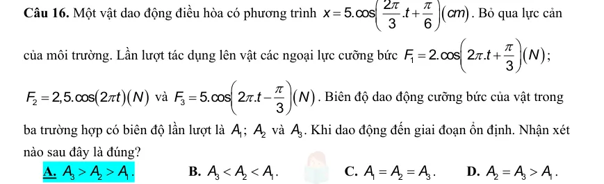{ loading=lazy }

#### Bài PDF 51

<!-- source-id: BT-Chuong-I-p146-q17-381 -->

Câu 17. Một người xách một xô nước đi trên đường, mỗi bước đi dài 40 cm thì nước trong xô bị
sóng sánh mạnh nhất khi tốc độ đi của người đó là v = 3,6 km/h. Chu kì dao động riêng của nước
trong xô là

A. 1 s.
B. 2 s.
C. 0,4 s.
D. 0,25 s.

#### Bài PDF 52

<!-- source-id: BT-Chuong-I-p146-q18-382 -->

Câu 18. Một con lắc lò xo có độ cứng k = 25 N/m, vật nặng khối lượng m dao động tắt dần theo
phương ngang. Thời gian từ lúc bắt dầu dao động đến khi dừng hẳn là 10 (s). Đồ thị dao động của
vật như hình 3.3. Khối lượng vật nặng xấp xỉ là

A. 2,5 kg.
B. 2,7 kg.
C. 1,8 kg.
D. 0,5 kg.

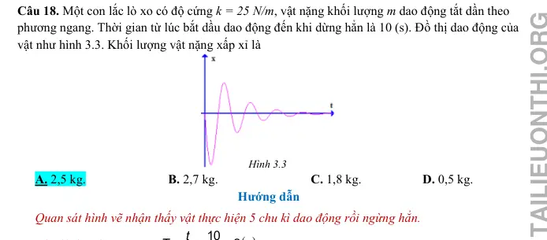{ loading=lazy }

### Nhận biết — Đúng/Sai

#### Bài PDF 53

<!-- source-id: BT-Chuong-I-p137-q3-357 -->

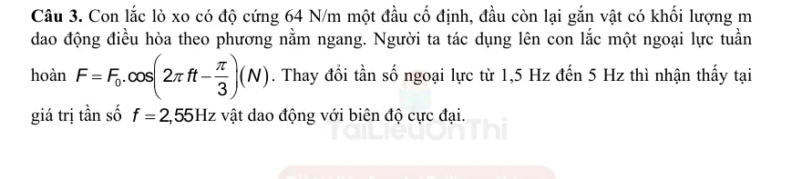{ loading=lazy }

#### Bài PDF 54

<!-- source-id: BT-Chuong-I-p138-q4-358 -->

Câu 4. Con lắc lò xo gồm vật nhỏ khối lượng 20 gam gắn vào đầu một lò xo có độ cứng 1 N/m.
Vật được gắn trên một giá đỡ cố định nằm dọc theo trục lò xo. Hệ dao động theo phương nằm
ngang. Biết hệ số ma sát giữa vật và giá đỡ là 0,1. Kéo vật khỏi vị trí cân bằng một khoảng 10 cm
theo chiều dương rồi thả cho vật dao động không vận tốc đầu.  Lấy g = 10 m/s2.

Phát biểu
Đúng
Sai
a
vị trí cân bằng tạm thời trong 1
2  chu kỳ dao động
đầu cách vị trí cân bằng một khoảng 1 cm.

S
b
biên độ sau 1
4  chu kỳ dao động đầu tiên là 10
cm.

S
c
độ giảm biên độ dao động trong mỗi chu kì dao
động là 8 cm.
Đ

d
tốc độ lớn nhất mà vật đạt được trong quá trình
dao động là 40 2 (cm/s)
Đ

#### Bài PDF 55

<!-- source-id: BT-Chuong-I-p147-q1-383 -->

Câu 1. Một con lắc lò xo gồm một lò xo có độ cứng 36 N/m, vật nặng khối lượng 250 gam. Kéo
vật khỏi vị trí cân bằng một khoảng 4 cm rồi thả cho vật dao động theo phương nằm ngang. Biết
rằng sau mỗi chu kì dao động biên độ giảm 5%.

Phát biểu
Đúng
Sai
a
chu kì dao động của vật là 0,52 s.
Đ

b
cơ năng ban đầu của vật là  0,029 J.
Đ

c
cơ năng của vật sau 2 chu kì dao động là 0,02 J.

S
d
sau 6 dao động toàn phần cơ năng của vật còn lại
0,0127 J.

S

#### Bài PDF 56

<!-- source-id: BT-Chuong-I-p147-q2-384 -->

Câu 2. Một con lắc lò xo gồm vật nặng khối lượng 0,2 kg, lò xo có độ cứng 80 (N/m) dao động
theo phương ngang. Hệ số ma sát giữa vật và mặt phẳng nghiêng là 0,1. Kéo vật khỏi vị trí cân
bằng một khoảng 4 cm theo chiều dương rồi thả không vận tốc đầu.

Phát biểu
Đúng
Sai
a
Độ giảm biên độ sau mỗi ½ chu kỳ dao động là
0,25 cm.

S
b
Quãng đường vật đi được từ lúc vật bắt đầu dao
động đến khi vật dừng lại lần đầu tiên là 7,5 cm.
Đ

c
Số dao động vật thực hiện cho tới khi dừng lại là
8 dao động.

S

d
Thời gian từ lúc vật bắt đầu dao động cho đến
khi dừng lại là 1,26 (s).
Đ

#### Bài PDF 57

<!-- source-id: BT-Chuong-I-p148-q3-385 -->

Câu 3. Một đồng hồ quả lắc có cấu tạo gồm một thanh dài 25 cm có khối lượng không đáng kể,
con lắc dao động với biên độ góc 0,18 rad. Biết sau mỗi chu kì biên độ dao động của con lắc giảm
5%. Lấy g = 10 m/s2. Để duy trì dao động của con lắc một cách liên tục người ta dùng một pin
AA có suất điện động 1,5 V và dung lượng pin là 900 mAH. Biết rằng điện năng tiêu thụ bằng
tích số suất điện động và dung lượng của pin và hiệu suất của pin là 80%.

Phát biểu
Đúng
Sai
a
Cơ năng dao động của con lắc là 0,02 J.

S
b
Năng lượng hao phí sau mỗi chu kì là 0,0002 J.
Đ

c
Điện năng của pin là 3240 J.

S
d
Giả sử sự hao phí năng lượng sau mỗi chu kì dao
động là như nhau và đồng hồ chạy ổn định trong
suốt thời gian sử dụng pin. Thời gian sử dụng
pin là 225,42 ngày.
Đ

#### Bài PDF 58

<!-- source-id: BT-Chuong-I-p149-q4-386 -->

Câu 4. Một con lắc lò xo dao động tắt dần trên mặt phẳng nằm ngang có đồ thị (x-t) như hình 3.4.
Biết rằng lò xo có độ cứng 25 (N/m). Lấy
.

Phát biểu
Đúng
Sai
a
Chu kì dao động của vật là 0,8 (s)
Đ

b
Khối lượng của vật là 0,5 kg.

S
c
Độ giảm biên độ của vật trong ½ chu kỳ dao
động là 1,4 cm.
Đ

d
Hệ số ma sát giữa vật và mặt phẳng ngang là
0,05.

S

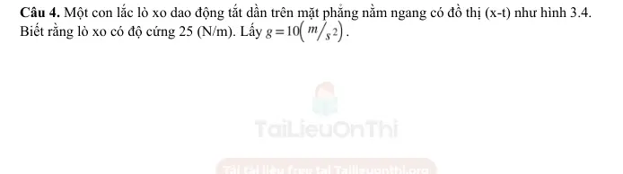{ loading=lazy }

### Thông hiểu — Trắc nghiệm 4 lựa chọn

#### Bài PDF 59

<!-- source-id: BT-Chuong-I-p126-q19-333 -->

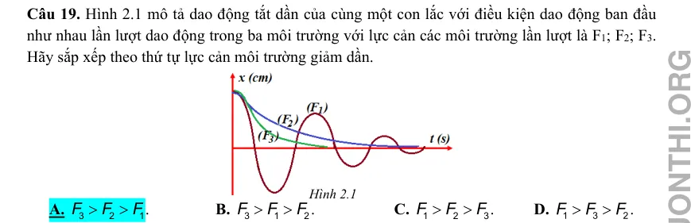{ loading=lazy }

#### Bài PDF 60

<!-- source-id: BT-Chuong-I-p126-q20-334 -->

Câu 20. Thực hiện thí nghiệm về dao động cưỡng bức như hình 2.2. Năm con lắc đơn: (1), (2),
(3), (4) và M (con lắc điều khiển) được treo trên một sợi dây. Ban đầu hệ đang đứng yên ở vị trí
cân bằng. Kích thích M dao động nhỏ trong mặt phẳng vuông góc với mặt phẳng hình vẽ thì các
con lắc còn lại dao động theo. Không kể M, con lắc dao động mạnh nhất là

A. con lắc (2).
B. con lắc (1).
C. con lắc (3).
D. con lắc (4).
Hình 2.2
Hình 2.1

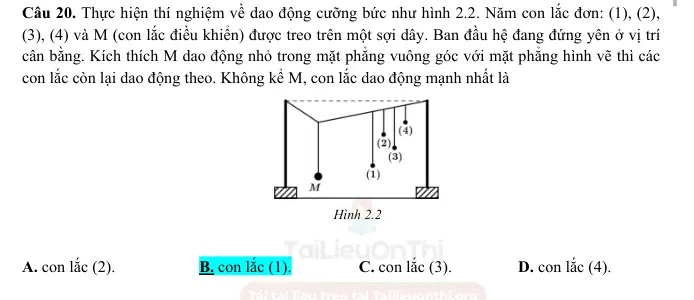{ loading=lazy }

#### Bài PDF 61

<!-- source-id: BT-Chuong-I-p127-q21-335 -->

Câu 21. Một vật dao động cưỡng bức dưới tác dụng của ngoại lực biến thiên tuần hoàn. Tăng dần
tần số ngoại lực, khi đó biên độ dao động của vật thay đổi như hình 2.3 Chu kỳ dao động riêng
của vật là (làm tròn đến số thập phân thứ hai)

A. 0,25 s.

B. 0,12 s.

C. 0,5 s.

D. 0,17 s.

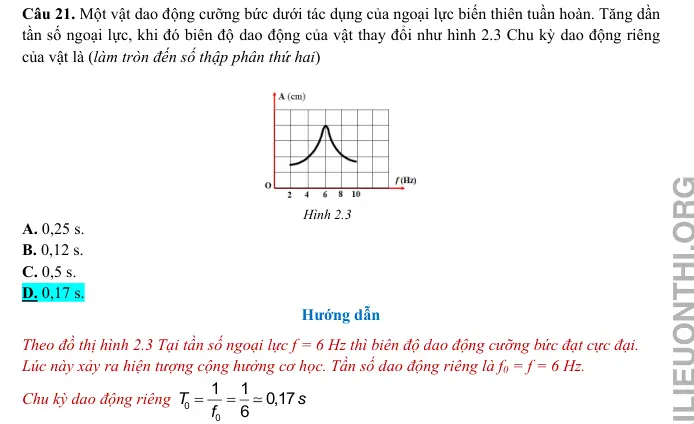{ loading=lazy }

#### Bài PDF 62

<!-- source-id: BT-Chuong-I-p127-q22-336 -->

Câu 22. Một vật dao động điều hòa với tần số riêng  f0 = 5 Hz. Ngoài dao động riêng, vật còn
chịu tác dụng của ngoại lực cưỡng bức tuần hoàn có tần số  f = 7,5 Hz. Sau khi vật đạt trạng thái
dao động ổn định, tần số dao động của hệ là

A. 12,5 Hz.
B. 7,5 Hz.
C. 5 Hz.
D. 2,5 Hz.

#### Bài PDF 63

<!-- source-id: BT-Chuong-I-p127-q23-337 -->

Câu 23. Một vật dao động cưỡng bức dưới tác dụng của ngoại lực F = F0cos4πft (với F0 và f
không đổi, t tính bằng s). Tần số dao động cưỡng bức của vật là

A. f.
B. πf.
C. 2f.
D. 0,5f.

#### Bài PDF 64

<!-- source-id: BT-Chuong-I-p128-q24-338 -->

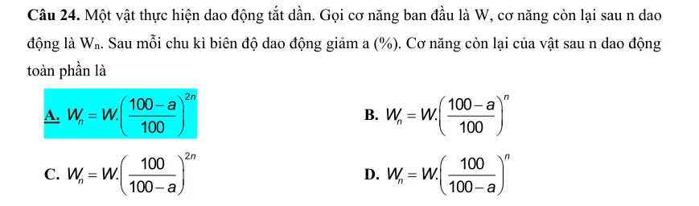{ loading=lazy }

#### Bài PDF 65

<!-- source-id: BT-Chuong-I-p128-q25-339 -->

Câu 25. Một con lắc lò xo đang dao động tắt dần, sau ba chu kì đầu tiên, biên độ của nó giảm đi
5%. Phần trăm cơ năng còn lại sau khoảng thời gian đó là

A. 90,25 %.
B. 75 %.
C. 25 %.
D. 95,75 %.

#### Bài PDF 66

<!-- source-id: BT-Chuong-I-p130-q26-340 -->

Câu 26. Một vật dao động tắt dần có đồ thị như hình 2.4. Sau một chu kì dao động biên độ của
vật là

A. 2 cm.
B. 4 cm.
C. 1 cm.
D. 5 cm.

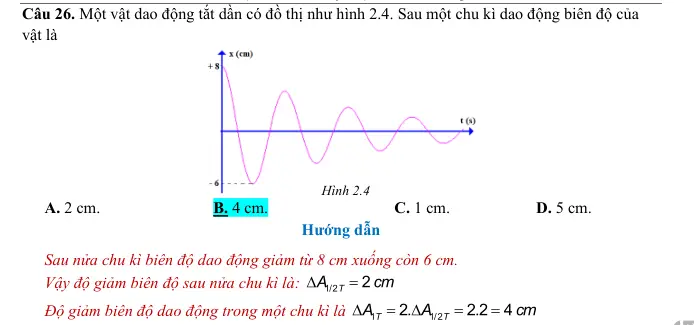{ loading=lazy }

#### Bài PDF 67

<!-- source-id: BT-Chuong-I-p130-q27-341 -->

Câu 27. Một người xách một xô nước từ một bờ sông về nhà. Nước trong xô dao động với chu kì
0,3 s. Biết rằng mỗi chân người này có độ dài 0,6 (m). Nước trong xô dao động mạnh nhất khi
người này bước đi với tốc độ

A. 2 km/h.
B. 3,6 km/h.
C. 5 km/h.
D. 7,2 km/h.

### Vận dụng — Trắc nghiệm 4 lựa chọn

#### Bài PDF 68

<!-- source-id: BT-Chuong-I-p132-q35-349 -->

Câu 35. Một con lắc lò xo dao động tắt dần theo phương ngang với chu kì T = 0,2s, lò xo nhẹ, vật
nhỏ dao động có khối lượng 100g. Hệ số ma sát giữa vật và mặt phẳng ngang là 0,01. Độ giảm
biên độ của vật sau một nửa chu kì dao động là

A. 0,4 cm
B. 0,3 cm
C. 0,2 cm
D. 0,2 m

#### Bài PDF 69

<!-- source-id: BT-Chuong-I-p133-q36-350 -->

Câu 36. Con lắc lò xo dao động điều hòa với chu kì
( )
10
T
s
π
=
khối lượng lò xo không đáng kể,
một đầu cố định, đầu còn lại gắn vật nặng khối lượng m = 0,25 kg. Con lắc dao động cưỡng bức
theo phương trùng với trục của lò xo dưới tác dụng của ngoại lực tuần hoàn
(
)( )
0.cos
F
F
t
N
ω
=
.
Thay đổi tần số góc ωtừ giá trị 10 rad/s đến 15 rad/s thì biên độ dao động

A. tăng lên.

B. tăng lên rồi giảm xuống.

C. không thay đổi.

D. giảm xuống rồi tăng lên.

#### Bài PDF 70

<!-- source-id: BT-Chuong-I-p133-q37-351 -->

Câu 37. Một vật dao động tắt dần. Đồ thị (x-t) như hình 2.7 Biên độ A1 có giá trị là

A. 4.
B. 15.
C. 12.
D. 10.

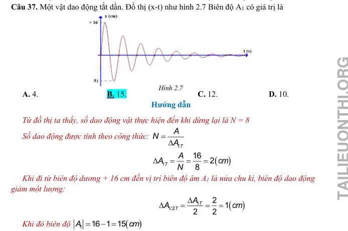{ loading=lazy }

#### Bài PDF 71

<!-- source-id: BT-Chuong-I-p133-q38-352 -->

Câu 38. Tác dụng vào hệ dao động một ngoại lực cưỡng bức tuần hoàn có biên độ không đổi
nhưng tần số f  thay đổi được, ứng với mỗi giá trị của f  thì hệ sẽ dao động cưỡng bức với biên
độ A. Hình 2.8 là đồ thị biểu diễn sự phụ thuộc của A vào f . Chu kì dao động riêng của hệ gần
nhất với giá trị nào sau đây?
Hình 2.7

A. 0,15s.
B. 0,35 s.
C. 0,45 s.
D. 0,55 s.

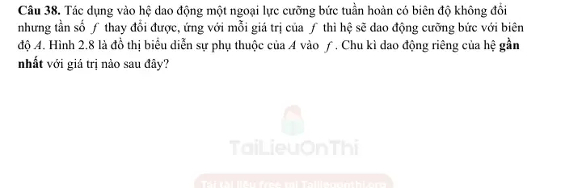{ loading=lazy }

#### Bài PDF 72

<!-- source-id: BT-Chuong-I-p134-q39-353 -->

Câu 39. Một con lắc lò xo có độ cứng
2
4.
k
π
=
(N/m) dao động tắt dần trên mặt phẳng nằm
ngang có đồ thị như hình 2.10. Hệ số ma sát giữa vật và mặt phẳng nằm ngang có giá trị gần đúng
là

A. 0,01.
B. 0,02.
C. 0,08.
D. 0,5.

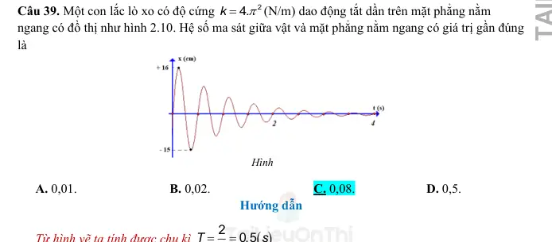{ loading=lazy }

#### Bài PDF 73

<!-- source-id: BT-Chuong-I-p135-q40-354 -->

Câu 40. Một con lắc lò xo gồm vật nhỏ khối lượng m = 0,02 kg và lò xo có độ cứng k = 1N/m.
Vật nhỏ được đặt trên giá đỡ cố định nằm ngang dọc theo trục lò xo. Hệ số ma sát trượt giữa giá
đỡ và vật nhỏ là μ=0,1. Ban đầu giữ vật ở vị trí lò xo bị giãn ra theo chiều dương một
khoảng Δl0=10 cm rồi buông nhẹ để con lắc dao động tắt dần. Lấy g = 10m/s2. Độ giảm thế năng
của con lắc trong giai đoạn từ khi buông tới vị trí mà tốc độ dao động của con lắc cực đại lần đầu
là

A. 2,4 mJ.
B. 4,8 mJ.

C. 3,6 mJ.
D. 5,4 mJ.

### Vận dụng — Đúng/Sai

#### Bài PDF 74

<!-- source-id: BT-Chuong-I-p136-q1-355 -->

Câu 1. Máy đo địa chấn được sử dụng để phát hiện và đo đạc những rung động địa chấn được
tạo ra bởi sự dịch chuyển của lớp vỏ Trái Đất. Tần số của những cơn địa chấn thường nằm trong
khoảng 30 Hz – 40 Hz. Năng lượng từ các cơn địa chấn có khả năng kích thích con lắc lò xo
bên trong máy đo làm đầu bút di chuyển để vẽ lên giấy như hình 2.12.

Phát biểu
Đúng
Sai
a
Dao động của con lắc lò xo trong máy địa chấn
là dao động duy trì.

S
b
Đầu bút di chuyển và vẽ được lên tờ giấy là do
các cơn địa chấn tạo ra dao động duy trì.

S
c
Tần số dao động của những con lắc lò xo trong
máy địa chấn vào khoảng 30 Hz – 40 Hz.
Đ

d
Để máy địa chấn ghi nhận được kết quả tốt nhất
thì tần số riêng của con lắc lò xo phải có giá trị
thật nhỏ so với con số 30 Hz – 40 Hz.
Đ

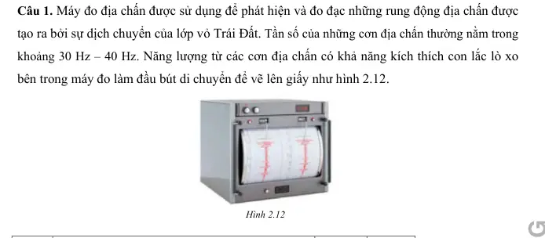{ loading=lazy }

#### Bài PDF 75

<!-- source-id: BT-Chuong-I-p137-q2-356 -->

Câu 2. Một hành khách dùng một sợi dây không giãn có chiều dài l để treo một ba lô lên trần một
toa tàu hoả. Biết rằng mỗi thanh ray của đường tàu có độ dài 12 (m) và mỗi khi tàu chạy qua chỗ
nối hai thanh ray thì ba lô bị dao động cưỡng bức. Khi tàu chạy với tốc độ 36 (km/h) thì thấy
chiếc ba lô dao động mạnh nhất.

Phát biểu
Đúng
Sai
a
Dao động của chiếc ba lô là mạnh nhất khi xảy ra
cộng hưởng cơ học.
Đ

b
Chu kì ngoại lực là 2 s.

S
c
Chu kì dao động riêng của ba lô được tính theo
công thức
0
2
l
T
g
π
=
.
Đ

d
Chiều dài dây treo xấp xỉ 36 cm.
Đ

