# Bài tập — Bài 7 — Tổng hợp dao động, tắt dần, cưỡng bức và cộng hưởng

> Hệ bài tập được biên soạn theo các dạng xuất hiện trong bộ tài liệu Vật lí 11 của dự án. Câu hỏi được giữ ngắn, trực tiếp; độ khó tăng dần và không cố tình thêm dữ kiện gây nhiễu.

[← Trở lại bài học](../../07-combined-damped-forced-resonance.md)

## Phần A — Trắc nghiệm 4 lựa chọn

### Bài 1 — Mức 1 — Nhận biết

Hai dao động cùng phương, cùng tần số và cùng pha có biên độ $A_1=3$ cm, $A_2=5$ cm. Biên độ tổng hợp là

A. $2$ cm.

B. $4$ cm.

C. $8$ cm.

D. $15$ cm.

??? success "Đáp án và lời giải"
    Chọn **C**. Hai dao động cùng pha nên $A=A_1+A_2=8$ cm.

### Bài 2 — Mức 1 — Nhận biết

Hai dao động cùng phương, cùng tần số, ngược pha có $A_1=7$ cm, $A_2=4$ cm. Biên độ tổng hợp là

A. $3$ cm.

B. $11$ cm.

C. $\sqrt{33}$ cm.

D. $28$ cm.

??? success "Đáp án và lời giải"
    Chọn **A**. Ngược pha nên $A=|A_1-A_2|=3$ cm.

### Bài 3 — Mức 1 — Nhận biết

Trong dao động cưỡng bức ổn định, tần số dao động của hệ bằng

A. tần số riêng của hệ trong mọi trường hợp.

B. tần số của ngoại lực cưỡng bức.

C. tổng hai tần số.

D. bằng 0.

??? success "Đáp án và lời giải"
    Chọn **B**. Trạng thái cưỡng bức ổn định dao động theo tần số của ngoại lực.

### Bài 4 — Mức 1 — Nhận biết

Cộng hưởng xảy ra rõ nhất khi

A. tần số ngoại lực gần bằng tần số riêng và lực cản nhỏ.

B. tần số ngoại lực bằng 0.

C. lực cản rất lớn.

D. hệ không chịu ngoại lực.

??? success "Đáp án và lời giải"
    Chọn **A**.

## Phần B — Đúng/Sai

### Bài 5 — Mức 2 — Thông hiểu

Xét dao động tắt dần:

a) Biên độ giảm theo thời gian.

b) Cơ năng cơ học thường giảm do lực cản.

c) Không có sự chuyển hóa cơ năng sang dạng năng lượng khác.

d) Giảm chấn ô tô là một ứng dụng có lợi của dao động tắt dần.

??? success "Đáp án và lời giải"
    a) **Đúng**.
    b) **Đúng**.
    c) **Sai**: một phần cơ năng chuyển thành nhiệt và các dạng khác.
    d) **Đúng**.

### Bài 6 — Mức 2 — Thông hiểu

Xét hiện tượng cộng hưởng:

a) Biên độ cưỡng bức phụ thuộc độ chênh giữa tần số ngoại lực và tần số riêng.

b) Lực cản càng nhỏ thì đỉnh cộng hưởng thường càng rõ.

c) Cộng hưởng luôn có lợi.

d) Thiết kế cầu và máy móc cần xét khả năng cộng hưởng.

??? success "Đáp án và lời giải"
    a) **Đúng**.
    b) **Đúng**.
    c) **Sai**: có thể có lợi hoặc có hại.
    d) **Đúng**.

## Phần C — Trả lời ngắn

### Bài 7 — Mức 3 — Vận dụng

Hai dao động $x_1=3\cos\omega t$ cm và $x_2=4\cos(\omega t+\pi/2)$ cm. Tính biên độ dao động tổng hợp.

??? success "Đáp án và lời giải"
    Độ lệch pha $\Delta\varphi=\pi/2$. $A=\sqrt{A_1^2+A_2^2+2A_1A_2\cos\Delta\varphi}=\sqrt{9+16}=5$ cm.

### Bài 8 — Mức 3 — Vận dụng

Hai dao động cùng phương có $A_1=A_2=5$ cm và lệch pha $120^\circ$. Tính biên độ tổng hợp.

??? success "Đáp án và lời giải"
    $A^2=25+25+50\cos120^\circ=50-25=25$. Vậy $A=5$ cm.

### Bài 9 — Mức 3 — Vận dụng

Một hệ có tần số riêng $4$ Hz. Ngoại lực tuần hoàn có thể chọn các tần số $3,5$ Hz; $4,0$ Hz; $5,0$ Hz. Khi lực cản nhỏ, chọn tần số nào để biên độ ổn định lớn nhất?

??? success "Đáp án và lời giải"
    Chọn $4,0$ Hz vì bằng tần số riêng, gần điều kiện cộng hưởng.

## Phần D — Vận dụng và vận dụng cao

### Bài 10 — Mức 4 — Vận dụng cao

Hai dao động cùng phương:

$x_1=4\cos(10t+\pi/6)$ cm, $x_2=3\cos(10t-\pi/3)$ cm.

Tìm biên độ và pha ban đầu của dao động tổng hợp.

??? success "Đáp án và lời giải"
    Hai dao động cùng tần số. Tách theo trục cos–sin:

    $C=A_1\cos\varphi_1+A_2\cos\varphi_2=4\frac{\sqrt3}{2}+3\frac12=2\sqrt3+\frac32$.

    $S=A_1\sin\varphi_1+A_2\sin\varphi_2=4\frac12+3\left(-\frac{\sqrt3}{2}\right)=2-\frac{3\sqrt3}{2}$.

    Biên độ:

    $A=\sqrt{C^2+S^2}=\sqrt{4^2+3^2+2\cdot4\cdot3\cos(\pi/2)}=5$ cm.

    Pha $\varphi$ thỏa $\cos\varphi=C/5$, $\sin\varphi=S/5$. Giá trị gần đúng:

    $C\approx4,964$, $S\approx-0,598$ nên $\varphi\approx-0,120$ rad.

    Vậy có thể viết $x\approx5\cos(10t-0,120)$ cm.

## Ngân hàng bài tập mở rộng

### Nhận biết — Trả lời ngắn

#### Bài 11

<!-- source-id: BT-Chuong-I-p140-q1-359 -->

Một người xách một xô nước đi trên đường, mỗi bước đi dài L = 50 cm thì nước trong xô
bị sóng sánh mạnh nhất. Tốc độ đi của người đó là v = 2,5 km/h. Chu kì dao động riêng của nước
trong xô tính theo đơn vị giây là bao nhiêu ? (làm tròn đến chữ số thập phân thứ hai)

??? success "Đáp án và lời giải"
    **Đáp án:** $0{,}72$
    **Hướng dẫn giải:**

    Trước hết xác định đúng loại dao động: tắt dần có biên độ giảm do lực cản; dao động cưỡng bức có tần số bằng tần số ngoại lực; cộng hưởng xảy ra khi tần số cưỡng bức gần tần số riêng.

    Tốc độ di chuyển của người
    Nước trong xô sóng sánh mạnh nhất khi xảy ra cộng hưởng cơ học. Khi đó chu kì dao động riêng
    bằng chu kì ngoại lực

    Vậy kết quả cần tìm là **$0{,}72$**.
#### Bài 12

<!-- source-id: BT-Chuong-I-p140-q2-360 -->

Một con lắc lò xo đang dao động tắt dần, sau mỗi chu kỳ biên độ dao động giảm 5%. Phần
trăm cơ năng còn lại sau khoảng thời gian đó xấp xỉ là bao nhiêu (đơn vị tính theo %) ?

??? success "Đáp án và lời giải"
    **Đáp án:** $90{,}3$
    **Hướng dẫn giải:**

    Trước hết xác định đúng loại dao động: tắt dần có biên độ giảm do lực cản; dao động cưỡng bức có tần số bằng tần số ngoại lực; cộng hưởng xảy ra khi tần số cưỡng bức gần tần số riêng.

    Sau mỗi dao động, biên độ giảm 5%, còn lại 95%.
    Cơ năng tỉ lệ thuận với bình phương biên độ, ta có tỉ lệ
    Vậy cơ năng sau xấp xỉ bằng 90,3% cơ năng ban đầu

    Vậy kết quả cần tìm là **$90{,}3$**.
#### Bài 13

<!-- source-id: BT-Chuong-I-p140-q3-361 -->

Con lắc lò xo gồm vật nhỏ khối lượng 0,4 kg gắn vào đầu một lò xo có độ cứng 20 N/m.
Vật được gắn trên một giá đỡ cố định nằm dọc theo trục lò xo. Hệ dao động theo phương nằm
ngang. Biết hệ số ma sát giữa vật và giá đỡ là 0,1. Kéo vật khỏi vị trí cân bằng một khoảng 20 cm
theo chiều dương rồi thả cho vật dao động không vận tốc đầu. Lấy g = 10 m/s2. Tốc độ lớn nhất

vật đạt được trong quá trình dao động là bao nhiêu ? (tính theo đơn vị m/s, làm tròn đến hai chữ
số thập phân thứ hai)

??? success "Đáp án và lời giải"
    **Đáp án:** $1{,}27$
    **Hướng dẫn giải:**

    Trước hết xác định đúng loại dao động: tắt dần có biên độ giảm do lực cản; dao động cưỡng bức có tần số bằng tần số ngoại lực; cộng hưởng xảy ra khi tần số cưỡng bức gần tần số riêng.

    Độ giảm biên độ sau ¼ chu kì là:
    Tần số góc
    Biên độ cực đại trong quá trình dao động:
    Tốc độ cực đại trong quá trình dao động là:

    Vậy kết quả cần tìm là **$1{,}27$**.
#### Bài 14

<!-- source-id: BT-Chuong-I-p141-q4-362 -->

Một con lắc lò xo có độ cứng $k=10$ N/m, một đầu cố định, đầu còn lại gắn vật $m=100$ g, dao động cưỡng bức do tác dụng của ngoại lực

$$
F=8\cos\left(\frac{2\pi}{5}t-\frac{\pi}{2}\right)\ \text{N}.
$$

Chu kì dao động cưỡng bức của con lắc là bao nhiêu giây?

??? success "Đáp án và lời giải"
    **Đáp án: $5$ s.**
    **Hướng dẫn giải:**

    Ở trạng thái ổn định, dao động cưỡng bức có tần số bằng tần số của ngoại lực. Từ

    $\displaystyle \omega_F=\frac{2\pi}{5}\ \text{rad/s}$

    suy ra

    $\displaystyle T=\frac{2\pi}{\omega_F}=5\ \text{s}.$
#### Bài 15

<!-- source-id: BT-Chuong-I-p141-q5-363 -->

Con lắc lò xo có độ cứng $25\pi^2$ N/m, một đầu cố định, đầu còn lại gắn vật có khối lượng
$m=250$ g dao động theo phương nằm ngang. Người ta tác dụng lên con lắc một ngoại lực tuần hoàn
$F=4\cos(2\pi f t)$ N. Thay đổi tần số ngoại lực từ 6,15 Hz đến 8,75 Hz thì biên độ dao động đạt giá trị lớn nhất khi tần số là bao nhiêu Hz?

??? success "Đáp án và lời giải"
    **Đáp án:** $6{,}15$ Hz.

    **Hướng dẫn giải:**

    Tần số riêng của hệ:
    $f_0=\dfrac{1}{2\pi}\sqrt{\dfrac{k}{m}}=\dfrac{1}{2\pi}\sqrt{\dfrac{25\pi^2}{0{,}25}}=5$ Hz.

    Toàn bộ khoảng khảo sát $6{,}15$–$8{,}75$ Hz nằm phía trên tần số cộng hưởng $f_0=5$ Hz. Khi tăng $f$ ra xa $f_0$ ở phía này, biên độ cưỡng bức giảm. Vì vậy trong khoảng đã cho, biên độ lớn nhất tại tần số nhỏ nhất:
    $f=6{,}15$ Hz.

#### Bài 16

<!-- source-id: BT-Chuong-I-p142-q6-364 -->

Con lắc lò xo có độ cứng $25\pi^2$ N/m, một đầu cố định, đầu còn lại gắn vật $m$ dao động điều hòa theo phương ngang. Hệ số ma sát giữa vật và mặt phẳng nằm ngang là $\mu$. Đồ thị dao động của vật theo thời gian như Hình 2.15. Trong mỗi chu kì, biên độ dao động của con lắc giảm bao nhiêu milimét?

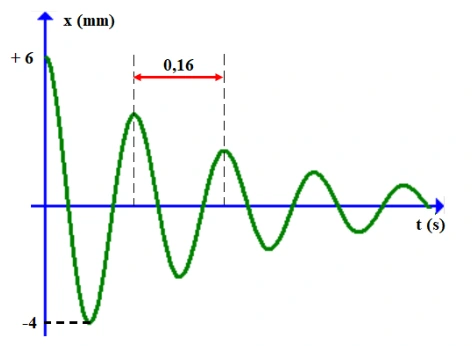{ loading=lazy }

??? success "Đáp án và lời giải"
    **Đáp án:** 4

    **Hướng dẫn giải:**
    Từ đồ thị, sau nửa chu kì biên độ giảm từ 6 mm xuống 4 mm, tức giảm 2 mm.

    Sau một chu kì, biên độ giảm $2\times2=4$ mm.

    Vậy kết quả cần tìm là **4 mm**.

#### Bài 17

<!-- source-id: BT-Chuong-I-p150-q1-387 -->

Một tàu hỏa chạy trên đường, mỗi thanh ray dài L = 12,5 m. Người ta treo vào trần toa xe
một con lắc lò xo có độ cứng 25 N/m. Khi xe chạy với tốc độ 54 km/h thì con lắc dao động mạnh
nhất. Khối lượng vật nặng tính theo đơn vị kg là bao nhiêu ? (làm tròn đến số thập phân thứ hai)

??? success "Đáp án và lời giải"
    **Đáp án:** $0{,}44$
    **Hướng dẫn giải:**

    Trước hết xác định đúng loại dao động: tắt dần có biên độ giảm do lực cản; dao động cưỡng bức có tần số bằng tần số ngoại lực; cộng hưởng xảy ra khi tần số cưỡng bức gần tần số riêng.

    Tốc độ tàu hỏa là
    Chu kì ngoại lực
    Khi lò xo dao động mạnh nhất, lúc này xảy ra cộng hưởng cơ học
    Khối lượng vật nặng

    Vậy kết quả cần tìm là **$0{,}44$**.
#### Bài 18

<!-- source-id: BT-Chuong-I-p151-q2-388 -->

Một con lắc lò xo đang dao động tắt dần, sau mỗi chu kì dao động, biên độ của nó giảm đi
2%. Sau bao nhiêu dao động thì cơ năng của con lắc giảm 30%?

??? success "Đáp án và lời giải"
    **Đáp án:** 9
    **Hướng dẫn giải:**

    Trước hết xác định đúng loại dao động: tắt dần có biên độ giảm do lực cản; dao động cưỡng bức có tần số bằng tần số ngoại lực; cộng hưởng xảy ra khi tần số cưỡng bức gần tần số riêng.

    Hao phí 30% nên cơ năng còn lại chiếm 70% = 0,7.
    Áp dụng công thức

    Vậy kết quả cần tìm là **9**.
#### Bài 19

<!-- source-id: BT-Chuong-I-p151-q3-389 -->

Một con lắc lò xo có độ cứng $k=25$ N/m, một đầu cố định, đầu còn lại gắn vật $m=100$ g, dao động cưỡng bức do tác dụng của ngoại lực

$$
F=2\cos(2\pi t),
$$

trong đó $F$ tính bằng N và $t$ tính bằng s. Tần số dao động cưỡng bức của con lắc là bao nhiêu Hz?

??? success "Đáp án và lời giải"
    **Đáp án:** $1$

    **Hướng dẫn giải:**
    Dao động cưỡng bức ổn định có tần số bằng tần số ngoại lực. Từ $\omega=2\pi$ rad/s:

    $f=\frac{\omega}{2\pi}=1\ \text{Hz}.$

#### Bài 20

<!-- source-id: BT-Chuong-I-p151-q4-390 -->

Con lắc lò xo gồm vật nhỏ khối lượng 0,25 kg gắn vào đầu một lò xo có độ cứng 100
N/m. Vật được gắn trên một giá đỡ cố định nằm dọc theo trục lò xo. Hệ dao động theo phương
nằm ngang. Biết hệ số ma sát giữa vật và giá đỡ là 0,2. Kéo vật khỏi vị trí cân bằng một khoảng 8
cm theo chiều dương rồi thả cho vật dao động không vận tốc đầu. Lấy g = 10 m/s2. Độ giảm biên
độ sau mỗi chu kì dao động là bao nhiêu (tính theo đơn vị m, làm tròn đến hai chữ số thập phân
thứ hai) ?

??? success "Đáp án và lời giải"
    **Đáp án:** $0{,}02$
    **Hướng dẫn giải:**

    Trước hết xác định đúng loại dao động: tắt dần có biên độ giảm do lực cản; dao động cưỡng bức có tần số bằng tần số ngoại lực; cộng hưởng xảy ra khi tần số cưỡng bức gần tần số riêng.

    Độ giảm biên độ sau mỗi chu kỳ dao động tính theo công thức

    Vậy kết quả cần tìm là **$0{,}02$**.
#### Bài 21

<!-- source-id: BT-Chuong-I-p153-q5-391 -->

Con lắc lò xo có độ cứng $25\pi^2$ N/m, một đầu cố định, đầu còn lại gắn vật $m$ dao động điều hòa theo phương ngang. Hệ số ma sát giữa vật và mặt phẳng nằm ngang là $\mu$. Đồ thị dao động của vật theo thời gian như Hình 3.5. Hệ số ma sát giữa vật và mặt phẳng nằm ngang là bao nhiêu? (Làm tròn đến chữ số thập phân thứ hai.)

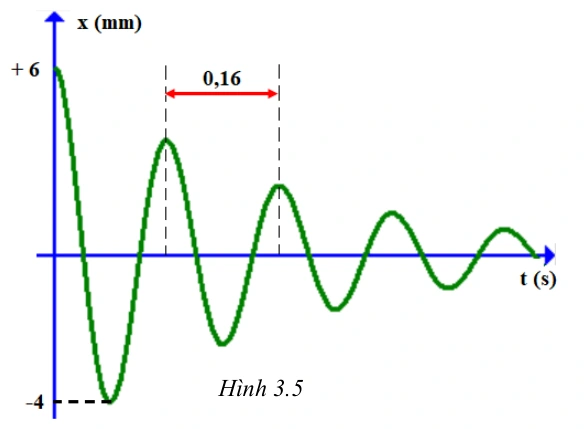{ loading=lazy }

??? success "Đáp án và lời giải"
    **Đáp án:** $0{,}31$

    **Hướng dẫn giải:**
    Từ đồ thị, sau nửa chu kì biên độ giảm $\Delta A_{T/2}=2$ mm $=0{,}002$ m và chu kì $T=0{,}16$ s.

    Với $k=25\pi^2$ N/m,

    $m=\dfrac{kT^2}{(2\pi)^2}=0{,}16$ kg.

    Đối với dao động tắt dần do ma sát khô, độ giảm biên độ sau nửa chu kì thỏa $\Delta A_{T/2}=\dfrac{2\mu mg}{k}$. Do đó

    $\mu=\dfrac{\Delta A_{T/2}k}{2mg}=\dfrac{0{,}002\cdot25\pi^2}{2\cdot0{,}16\cdot10}\approx0{,}31$.

    Vậy kết quả cần tìm là **$0{,}31$**.

#### Bài 22

<!-- source-id: BT-Chuong-I-p153-q6-392 -->

Con lắc lò xo có độ cứng $25\pi^2$ N/m, một đầu cố định, đầu còn lại gắn vật có khối lượng $m=250$ g, dao động điều hòa theo phương nằm ngang. Người ta tác dụng lên con lắc một ngoại lực tuần hoàn

$$
F=4\cos(2\pi ft)\ \text{N}.
$$

Thay đổi tần số ngoại lực từ $1{,}25$ Hz đến $4{,}25$ Hz thì biên độ dao động đạt giá trị lớn nhất khi tần số là bao nhiêu Hz?

??? success "Đáp án và lời giải"
    **Đáp án:** $4{,}25$

    **Hướng dẫn giải:**
    Tần số riêng là

    $f_0=\frac{1}{2\pi}\sqrt{\frac{k}{m}} =\frac{1}{2\pi}\sqrt{\frac{25\pi^2}{0{,}25}} =5\ \text{Hz}.$

    Trên khoảng $1{,}25\le f\le4{,}25$ Hz, $f$ càng tăng càng tiến gần $f_0$, nên biên độ lớn nhất tại $f=4{,}25$ Hz.

### Nhận biết — Trắc nghiệm 4 lựa chọn

#### Bài 23

<!-- source-id: BT-Chuong-I-p124-q1-315 -->

Trong dao động tắt dần, đại lượng có độ lớn giảm dần theo thời gian là

A. động năng.

B. thế năng.

C. cơ năng.

D. gia tốc.

??? success "Đáp án và lời giải"
    **Đáp án:** C
    **Hướng dẫn giải:**

    Trước hết xác định đúng loại dao động: tắt dần có biên độ giảm do lực cản; dao động cưỡng bức có tần số bằng tần số ngoại lực; cộng hưởng xảy ra khi tần số cưỡng bức gần tần số riêng.

    Đối chiếu kết quả với các lựa chọn, phương án phù hợp là **C. cơ năng.**
#### Bài 24

<!-- source-id: BT-Chuong-I-p124-q2-316 -->

Trong dao động tắt dần dưới hạn, đại lượng có giá trị không thay đổi là

A. biên độ.

B. chu kỳ.

C. gia tốc.

D. vận tốc.

??? success "Đáp án và lời giải"
    **Đáp án:** B
    **Hướng dẫn giải:**

    Trước hết xác định đúng loại dao động: tắt dần có biên độ giảm do lực cản; dao động cưỡng bức có tần số bằng tần số ngoại lực; cộng hưởng xảy ra khi tần số cưỡng bức gần tần số riêng.

    Đối chiếu kết quả với các lựa chọn, phương án phù hợp là **B. chu kỳ.**
#### Bài 25

<!-- source-id: BT-Chuong-I-p124-q3-317 -->

Trong dao động tắt dần, khi độ lớn lực cản môi trường tăng lên, đại lượng có độ lớn giảm
là

A. số dao động vật thực hiện cho đến khi dừng hẳn.

B. thế năng của vật dao động điều hòa.

C. vận tốc của vật dao động điều hòa.

D. động năng của vật dao động điều hòa.

??? success "Đáp án và lời giải"
    **Đáp án:** A
    **Hướng dẫn giải:**

    Trước hết xác định đúng loại dao động: tắt dần có biên độ giảm do lực cản; dao động cưỡng bức có tần số bằng tần số ngoại lực; cộng hưởng xảy ra khi tần số cưỡng bức gần tần số riêng.

    Đối chiếu kết quả với các lựa chọn, phương án phù hợp là **A. số dao động vật thực hiện cho đến khi dừng hẳn.**
#### Bài 26

<!-- source-id: BT-Chuong-I-p124-q4-318 -->

Trong dao động tắt dần, một phần cơ năng của vật dao động chuyển hóa thành

A. nhiệt năng.

B. điện năng.

C. quang năng.

D. hóa năng.

??? success "Đáp án và lời giải"
    **Đáp án:** A
    **Hướng dẫn giải:**

    Trước hết xác định đúng loại dao động: tắt dần có biên độ giảm do lực cản; dao động cưỡng bức có tần số bằng tần số ngoại lực; cộng hưởng xảy ra khi tần số cưỡng bức gần tần số riêng.

    Đối chiếu kết quả với các lựa chọn, phương án phù hợp là **A. nhiệt năng.**
#### Bài 27

<!-- source-id: BT-Chuong-I-p124-q5-319 -->

Chọn phát biểu đúng khi nói về dao động tắt dần.

A. Dao động tắt dần có chu kỳ giảm dần theo thời gian.

B. Dao động tắt dần có tần số giảm dần theo thời gian.

C. Dao động tắt dần có tần số góc giảm dần theo thời gian.

D. Dao động tắt dần có cơ năng giảm dần theo thời gian.

??? success "Đáp án và lời giải"
    **Đáp án:** D
    **Hướng dẫn giải:**

    Trước hết xác định đúng loại dao động: tắt dần có biên độ giảm do lực cản; dao động cưỡng bức có tần số bằng tần số ngoại lực; cộng hưởng xảy ra khi tần số cưỡng bức gần tần số riêng.

    Đối chiếu kết quả với các lựa chọn, phương án phù hợp là **D. Dao động tắt dần có cơ năng giảm dần theo thời gian.**
#### Bài 28

<!-- source-id: BT-Chuong-I-p124-q6-320 -->

Dao động mà tốc độ cực đại và thế năng cực đại giảm dần theo thời gian là

A. dao động điều hòa.

B. dao động tuần hoàn.

C. dao động tắt dần.

D. dao động cưỡng bức.

??? success "Đáp án và lời giải"
    **Đáp án:** C
    **Hướng dẫn giải:**

    Trước hết xác định đúng loại dao động: tắt dần có biên độ giảm do lực cản; dao động cưỡng bức có tần số bằng tần số ngoại lực; cộng hưởng xảy ra khi tần số cưỡng bức gần tần số riêng.

    Đối chiếu kết quả với các lựa chọn, phương án phù hợp là **C. dao động tắt dần.**
#### Bài 29

<!-- source-id: BT-Chuong-I-p124-q7-321 -->

Biên độ của dao động cơ tắt dần

A. không đổi theo thời gian.

B. tăng dần theo thời gian.

C. giảm dần theo thời gian.

D. biến thiên điều hòa theo thời gian.

??? success "Đáp án và lời giải"
    **Đáp án:** C
    **Hướng dẫn giải:**

    Trước hết xác định đúng loại dao động: tắt dần có biên độ giảm do lực cản; dao động cưỡng bức có tần số bằng tần số ngoại lực; cộng hưởng xảy ra khi tần số cưỡng bức gần tần số riêng.

    Đối chiếu kết quả với các lựa chọn, phương án phù hợp là **C. giảm dần theo thời gian.**
#### Bài 30

<!-- source-id: BT-Chuong-I-p124-q8-322 -->

Hãy chỉ ra phát biểu sai.

A. Dao động tắt dần càng nhanh khi độ lớn lực cản môi trường càng lớn.

B. Dao động duy trì có chu kỳ bằng chu kỳ riêng của hệ.

C. Biên độ dao động cưỡng bức không phụ thuộc vào tần số của ngoại lực cưỡng bức.

D. Dao động cưỡng bức có tần số bằng tần số ngoại lực cưỡng bức.

??? success "Đáp án và lời giải"
    **Đáp án:** C
    **Hướng dẫn giải:**
    Biên độ dao động cưỡng bức phụ thuộc vào độ chênh lệch giữa tần số ngoại lực cưỡng bức và

    tần số dao động riêng.

#### Bài 31

<!-- source-id: BT-Chuong-I-p124-q9-323 -->

Dao động cưỡng bức của một vật là dao động dưới tác dụng của ngoại lực biến thiên tuần
hoàn. Kết quả vật sẽ dao động với

A. biên độ của ngoại lực.

B. pha ban đầu của ngoại lực.

C. tần số của ngoại lực.

D. biên độ của dao động riêng.

??? success "Đáp án và lời giải"
    **Đáp án:** C
    **Hướng dẫn giải:**

    Trước hết xác định đúng loại dao động: tắt dần có biên độ giảm do lực cản; dao động cưỡng bức có tần số bằng tần số ngoại lực; cộng hưởng xảy ra khi tần số cưỡng bức gần tần số riêng.

    Đối chiếu kết quả với các lựa chọn, phương án phù hợp là **C. tần số của ngoại lực.**
#### Bài 32

<!-- source-id: BT-Chuong-I-p125-q12-326 -->

Nhận xét nào sau đây là không đúng?

A. Dao động tắt dần càng nhanh nếu lực cản của môi trường càng lớn.

B. Dao động duy trì có chu kỳ bằng chu kỳ dao động riêng của con lắc.

C. Dao động cưỡng bức có tần số bằng tần số của lực cưỡng bức.

D. Biên độ của dao động cưỡng bức không phụ thuộc vào chu kỳ của lực cưỡng bức.

??? success "Đáp án và lời giải"
    **Đáp án:** D
    **Hướng dẫn giải:**

    Trước hết xác định đúng loại dao động: tắt dần có biên độ giảm do lực cản; dao động cưỡng bức có tần số bằng tần số ngoại lực; cộng hưởng xảy ra khi tần số cưỡng bức gần tần số riêng.

    Đối chiếu kết quả với các lựa chọn, phương án phù hợp là **D. Biên độ của dao động cưỡng bức không phụ thuộc vào chu kỳ của lực cưỡng bức.**
#### Bài 33

<!-- source-id: BT-Chuong-I-p125-q13-327 -->

Khi xảy ra hiện tượng cộng hưởng cơ học, vật dao động cưỡng bức sẽ tiếp tục dao động
với

A. biên độ ngoại lực cưỡng bức.

B. biên độ dao động riêng.

C. tần số dao dộng riêng.

D. cả biên độ và tần số dao động riêng.

??? success "Đáp án và lời giải"
    **Đáp án:** C
    **Hướng dẫn giải:**

    Trước hết xác định đúng loại dao động: tắt dần có biên độ giảm do lực cản; dao động cưỡng bức có tần số bằng tần số ngoại lực; cộng hưởng xảy ra khi tần số cưỡng bức gần tần số riêng.

    Đối chiếu kết quả với các lựa chọn, phương án phù hợp là **C. tần số dao dộng riêng.**
#### Bài 34

<!-- source-id: BT-Chuong-I-p125-q14-328 -->

Hiện tượng cộng hưởng chỉ xảy ra với

A. dao động tắt dần.

B. dao động duy trì.

C. dao động điều hoà.

D. dao động cưỡng bức.

??? success "Đáp án và lời giải"
    **Đáp án:** D
    **Hướng dẫn giải:**

    Trước hết xác định đúng loại dao động: tắt dần có biên độ giảm do lực cản; dao động cưỡng bức có tần số bằng tần số ngoại lực; cộng hưởng xảy ra khi tần số cưỡng bức gần tần số riêng.

    Đối chiếu kết quả với các lựa chọn, phương án phù hợp là **D. dao động cưỡng bức.**
#### Bài 35

<!-- source-id: BT-Chuong-I-p125-q15-329 -->

Một em bé đang chơi xích đu. Để cho xích đu đung đưa như thế mãi thì đến điểm cao
nhất thì người mẹ lại đẩy một cái. Đây là dao động gì?

A. Dao động tắt dần.

B. Dao động duy trì.

C. Dao động cộng hưởng.

D. Dao động cưỡng bức.

??? success "Đáp án và lời giải"
    **Đáp án:** B
    **Hướng dẫn giải:**

    Trước hết xác định đúng loại dao động: tắt dần có biên độ giảm do lực cản; dao động cưỡng bức có tần số bằng tần số ngoại lực; cộng hưởng xảy ra khi tần số cưỡng bức gần tần số riêng.

    Đối chiếu kết quả với các lựa chọn, phương án phù hợp là **B. Dao động duy trì.**
#### Bài 36

<!-- source-id: BT-Chuong-I-p125-q16-330 -->

Một con lắc đồng hồ đang dao động tắt dần, mỗi chu kỳ năng lượng bị mất đi do ma sát
là 0,01 J. Để duy trì dao động của con lắc đồng hồ, ta cần cung cấp cho con lắc một năng lượng

A. lớn hơn 0,01 J trong mỗi chu kỳ.

B. lớn hơn 0,01 J trong mỗi nửa chu kỳ.

C. vừa bằng 0,01 J trong mỗi chu kỳ.

D. lớn hơn 0,01 J trong mỗi nửa chu kỳ.

??? success "Đáp án và lời giải"
    **Đáp án:** C
    **Hướng dẫn giải:**

    Trước hết xác định đúng loại dao động: tắt dần có biên độ giảm do lực cản; dao động cưỡng bức có tần số bằng tần số ngoại lực; cộng hưởng xảy ra khi tần số cưỡng bức gần tần số riêng.

    Đối chiếu kết quả với các lựa chọn, phương án phù hợp là **C. vừa bằng 0,01 J trong mỗi chu kỳ.**
#### Bài 37

<!-- source-id: BT-Chuong-I-p125-q17-331 -->

Hiện tượng cộng hưởng cơ học gây hại trong trường hợp nào dưới đây?

A. Trong đàn vi-ô-lông.

B. Trong đàn ghi-ta.

C. Trong dao động của các cây cầu.

D. Máy ra-di-o thu sóng điện từ.

??? success "Đáp án và lời giải"
    **Đáp án:** C
    **Hướng dẫn giải:**
    Trong dao động của những cây cầu, khi hiện tượng cộng hưởng xảy ra, các cây cầu sẽ dao động
    với biên độ cực đại gây ra gãy, sập cầu.

#### Bài 38

<!-- source-id: BT-Chuong-I-p126-q18-332 -->

Một con lắc đơn dao động tắt dần với chu kỳ T = 2 (s). Sau khoảng thời gian 20 (s) thì
con lắc đơn dừng hẳn. Dao động của con lắc là

A. dao động cưỡng bức.

B. dao động tắt dần vượt hạn.

C. dao động tắt dần tới hạn.

D. dao động tắt dần dưới hạn.

??? success "Đáp án và lời giải"
    **Đáp án:** D
    **Hướng dẫn giải:**

    Trước hết xác định đúng loại dao động: tắt dần có biên độ giảm do lực cản; dao động cưỡng bức có tần số bằng tần số ngoại lực; cộng hưởng xảy ra khi tần số cưỡng bức gần tần số riêng.

    Số dao động mà vật thực hiện được cho tới khi dừng hẳn là
    Như vậy vật dao động tắt dần, sau khi thực hiện được nhiều dao động mới dừng hẳn. Do đó dao
    động thuộc loại dao động tắt dần dưới hạn.

    Đối chiếu kết quả với các lựa chọn, phương án phù hợp là **D. dao động tắt dần dưới hạn.**
#### Bài 39

<!-- source-id: BT-Chuong-I-p130-q28-342 -->

Một vật thực hiện dao động tắt dần có đồ thị như hình 2.5 Kể từ khi vật bắt đầu dao động
đến khi dừng hẳn. Số dao động vật thực hiện là

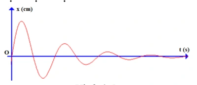{ loading=lazy }

A. 4.

B. 3.

C. 2.

D. 1.

??? success "Đáp án và lời giải"
    **Đáp án:** A
    **Hướng dẫn giải:**
    Quan sát đồ thị hình 2.6 ta thấy từ lúc vật bắt đầu dao động đến khi dừng hẳn vật thực hiện 4 chu
    kì dao động.
    Hình 2.4
    Hình 2.5

#### Bài 40

<!-- source-id: BT-Chuong-I-p131-q29-343 -->

Một vật dao động tắt dần, sau 8 chu kì dao động liên tiếp thì cơ năng của vật giảm 48%
so với cơ năng ban đầu. Sau mỗi chu kì dao động, biên độ dao động giảm

A. 1%.

B. 2%.

C. 3%.

D. 4%.

??? success "Đáp án và lời giải"
    **Đáp án:** D
    **Hướng dẫn giải:**

    Trước hết xác định đúng loại dao động: tắt dần có biên độ giảm do lực cản; dao động cưỡng bức có tần số bằng tần số ngoại lực; cộng hưởng xảy ra khi tần số cưỡng bức gần tần số riêng.

    Vì cơ năng giảm 48%, do đó cơ năng lúc sau bằng 52% cơ năng ban đầu.
    Vậy phần trăm biên độ giảm sau mỗi chu kì là a = 4 (%)

    Đối chiếu kết quả với các lựa chọn, phương án phù hợp là **D. 4%.**
#### Bài 41

<!-- source-id: BT-Chuong-I-p131-q30-344 -->

Cây cầu Tacoma Narrows được xây dựng ở Mỹ rất vững chắc. Tuy vậy đến ngày 7 tháng
11 năm 1940, một vụ sập cầu đã xảy ra do gió lớn, phần nhịp chính (840 m) của cây cầu đã bị hư
hỏng rất nặng, thậm chí bị đứt gãy hẳn ở nhiều chỗ. Điều này xảy ra do thiết kế của cây cầu, nó
rất dễ bị rung lắc do ảnh hưởng của gió và từ đó dần dần khiến cầu bị sập. Gió làm sập cầu do

A. dao động tắt dần.

B. dao động duy trì.

C. dao động tự do.

D. hiện tượng cộng hưởng.

??? success "Đáp án và lời giải"
    **Đáp án:** D
    **Hướng dẫn giải:**

    Trước hết xác định đúng loại dao động: tắt dần có biên độ giảm do lực cản; dao động cưỡng bức có tần số bằng tần số ngoại lực; cộng hưởng xảy ra khi tần số cưỡng bức gần tần số riêng.

    Đối chiếu kết quả với các lựa chọn, phương án phù hợp là **D. hiện tượng cộng hưởng.**
#### Bài 42

<!-- source-id: BT-Chuong-I-p131-q31-345 -->

Một vật dao động điều hòa với biên độ $A_0$ và tần số $f_0$. Vật chịu tác dụng của ngoại lực có biên độ $A$ và tần số $f$. Bỏ qua sức cản của môi trường, khi dao động cưỡng bức đến giai đoạn ổn định, vật sẽ dao động với

A. biên độ $A$.

B. tần số $f$.

C. biên độ $A_0$.

D. tần số $f_0$.

??? success "Đáp án và lời giải"
    **Đáp án:** B

    **Hướng dẫn giải:**
    Ở trạng thái dao động cưỡng bức ổn định, hệ dao động với **tần số của ngoại lực cưỡng bức**, tức $f$. Biên độ ổn định phụ thuộc ngoại lực, độ lệch giữa $f$ và tần số riêng, cùng độ cản; không nhất thiết bằng $A$ hoặc $A_0$.

#### Bài 43

<!-- source-id: BT-Chuong-I-p131-q32-346 -->

Một vật dao động điều hòa có phương trình $x=4\cos(2\pi t)$ cm. Bỏ qua lực cản của môi trường. Lần lượt tác dụng lên vật các ngoại lực cưỡng bức

- $F_1=5\cos\left(2\pi t+\frac{\pi}{2}\right)$ N;
- $F_2=5\cos\left(2\pi t+\frac{2\pi}{3}\right)$ N;
- $F_3=5\cos\left(2\pi t-\frac{\pi}{4}\right)$ N.

Biên độ dao động cưỡng bức ở giai đoạn ổn định trong ba trường hợp lần lượt là $A_1,A_2,A_3$. Nhận xét nào sau đây đúng?

A. $A_1=A_2>A_3$.

B. $A_1=A_3>A_2$.

C. $A_1=A_2=A_3$.

D. $A_2=A_3>A_1$.

??? success "Đáp án và lời giải"
    **Đáp án: C.**
    **Hướng dẫn giải:**

    Ba ngoại lực có cùng biên độ và cùng tần số góc, chỉ khác pha ban đầu. Biên độ dao động cưỡng bức ở trạng thái ổn định không phụ thuộc pha ban đầu của ngoại lực, nên

    $$A_1=A_2=A_3.$$
#### Bài 44

<!-- source-id: BT-Chuong-I-p132-q33-347 -->

Con lắc lò xo gồm vật nhỏ khối lượng 0,5 kg gắn vào đầu một lò xo có độ cứng 50 N/m.
Vật được gắn trên một giá đỡ cố định nằm dọc theo trục lò xo. Hệ dao động theo phương nằm
ngang. Biết hệ số ma sát giữa vật và giá đỡ là 0,1. Kéo vật khỏi vị trí cân bằng một khoảng 20 cm
theo chiều dương rồi thả cho vật dao động không vận tốc đầu. Lấy g = 10 m/s2. Số dao động vật
thực hiện được từ lúc bắt đầu dao động đến khi dừng lại là

A. 4 dao động.

B. 10 dao động.

C. 6 dao động.

D. 5 dao động.

??? success "Đáp án và lời giải"
    **Đáp án:** D
    **Hướng dẫn giải:**

    Trước hết xác định đúng loại dao động: tắt dần có biên độ giảm do lực cản; dao động cưỡng bức có tần số bằng tần số ngoại lực; cộng hưởng xảy ra khi tần số cưỡng bức gần tần số riêng.

    Độ giảm biên độ sau mỗi chu kì dao động là
    Số dao động vật thực hiện cho tới khi dừng lại là

    Đối chiếu kết quả với các lựa chọn, phương án phù hợp là **D. 5 dao động.**
#### Bài 45

<!-- source-id: BT-Chuong-I-p132-q34-348 -->

Một vật dao động điều hòa có phương trình $x=2\cos(10t)$ cm. Bỏ qua lực cản của môi trường. Lần lượt tác dụng lên vật các ngoại lực cưỡng bức

- $F_1=10\cos\left(6t+\frac{\pi}{3}\right)$ N;
- $F_2=10\cos\left(8t+\frac{2\pi}{3}\right)$ N;
- $F_3=10\cos\left(18t-\frac{2\pi}{3}\right)$ N.

Biên độ dao động cưỡng bức ở giai đoạn ổn định trong ba trường hợp lần lượt là $A_1,A_2,A_3$. Nhận xét nào sau đây đúng?

A. $A_1=A_2>A_3$.

B. $A_1=A_3>A_2$.

C. $A_1=A_2=A_3$.

D. $A_3<A_1<A_2$.

??? success "Đáp án và lời giải"
    **Đáp án: D.**
    **Hướng dẫn giải:**

    Tần số góc riêng là $\omega_0=10$ rad/s. Với cùng biên độ ngoại lực, trường hợp có tần số cưỡng bức gần $\omega_0$ hơn cho biên độ ổn định lớn hơn. Ta có

    $\displaystyle |18-10|>|6-10|>|8-10|,$

    nên

    $$A_3<A_1<A_2.$$
#### Bài 46

<!-- source-id: BT-Chuong-I-p143-q1-365 -->

Trong dao động tắt dần, đại lượng có độ lớn giảm dần theo thời gian là

A. vận tốc.

B. gia tốc.

C. biên độ.

D. thế năng.

??? success "Đáp án và lời giải"
    **Đáp án:** C
    **Hướng dẫn giải:**

    Trước hết xác định đúng loại dao động: tắt dần có biên độ giảm do lực cản; dao động cưỡng bức có tần số bằng tần số ngoại lực; cộng hưởng xảy ra khi tần số cưỡng bức gần tần số riêng.

    Đối chiếu kết quả với các lựa chọn, phương án phù hợp là **C. biên độ.**
#### Bài 47

<!-- source-id: BT-Chuong-I-p143-q2-366 -->

Trong dao động tắt dần dưới hạn, đại lượng có giá trị không thay đổi là

A. tần số.

B. biên độ.

C. tốc độ cực đại.

D. gia tốc.

??? success "Đáp án và lời giải"
    **Đáp án:** A
    **Hướng dẫn giải:**

    Trước hết xác định đúng loại dao động: tắt dần có biên độ giảm do lực cản; dao động cưỡng bức có tần số bằng tần số ngoại lực; cộng hưởng xảy ra khi tần số cưỡng bức gần tần số riêng.

    Đối chiếu kết quả với các lựa chọn, phương án phù hợp là **A. tần số.**
#### Bài 48

<!-- source-id: BT-Chuong-I-p143-q3-367 -->

Trong dao động tắt dần, khi độ lớn lực cản môi trường giảm, đại lượng có độ lớn tăng là

A. vận tốc cực đại của vật dao động điều hòa.

B. thế năng của vật dao động điều hòa.

C. số dao động vật thực hiện cho đến khi dừng hẳn.

D. động năng của vật dao động điều hòa.

??? success "Đáp án và lời giải"
    **Đáp án:** C
    **Hướng dẫn giải:**

    Trước hết xác định đúng loại dao động: tắt dần có biên độ giảm do lực cản; dao động cưỡng bức có tần số bằng tần số ngoại lực; cộng hưởng xảy ra khi tần số cưỡng bức gần tần số riêng.

    Đối chiếu kết quả với các lựa chọn, phương án phù hợp là **C. số dao động vật thực hiện cho đến khi dừng hẳn.**
#### Bài 49

<!-- source-id: BT-Chuong-I-p143-q4-368 -->

Hệ thống giảm xóc của xe máy là ứng dụng của

A. dao động cưỡng bức.

B. dao động tắt dần dưới hạn.

C. dao động tắt dần vượt hạn.

D. dao động tắt dần tới hạn.

??? success "Đáp án và lời giải"
    **Đáp án:** D
    **Hướng dẫn giải:**

    Trước hết xác định đúng loại dao động: tắt dần có biên độ giảm do lực cản; dao động cưỡng bức có tần số bằng tần số ngoại lực; cộng hưởng xảy ra khi tần số cưỡng bức gần tần số riêng.

    Đối chiếu kết quả với các lựa chọn, phương án phù hợp là **D. dao động tắt dần tới hạn.**
#### Bài 50

<!-- source-id: BT-Chuong-I-p143-q5-369 -->

Một con lò xo dao động tắt dần với chu kỳ T = 1,5 (s). Ban đầu kéo con lắc lệch khỏi vị trí
cân bằng một khoảng 4 cm rồi thả không vận tốc đầu. Sau khoảng thời gian 1,2 (s) thì con lắc đi
từ biên về tới vị trí cân bằng rồi dừng hẳn. Dao động của con lắc là

A. dao động cưỡng bức.

B. dao động tắt dần vượt hạn.

C. dao động tắt dần tới hạn.

D. dao động tắt dần dưới hạn.

??? success "Đáp án và lời giải"
    **Đáp án:** C
    **Hướng dẫn giải:**

    Trước hết xác định đúng loại dao động: tắt dần có biên độ giảm do lực cản; dao động cưỡng bức có tần số bằng tần số ngoại lực; cộng hưởng xảy ra khi tần số cưỡng bức gần tần số riêng.

    Đối chiếu kết quả với các lựa chọn, phương án phù hợp là **C. dao động tắt dần tới hạn.**
#### Bài 51

<!-- source-id: BT-Chuong-I-p143-q6-370 -->

Dao động mà biên độ và cơ năng giảm dần theo thời gian là

A. dao động điều hòa.

B. dao động tuần hoàn.

C. dao động tắt dần.

D. dao động cưỡng bức.

??? success "Đáp án và lời giải"
    **Đáp án:** C
    **Hướng dẫn giải:**

    Trước hết xác định đúng loại dao động: tắt dần có biên độ giảm do lực cản; dao động cưỡng bức có tần số bằng tần số ngoại lực; cộng hưởng xảy ra khi tần số cưỡng bức gần tần số riêng.

    Đối chiếu kết quả với các lựa chọn, phương án phù hợp là **C. dao động tắt dần.**
#### Bài 52

<!-- source-id: BT-Chuong-I-p143-q7-371 -->

Tổng động năng và thế năng của dao động cơ tắt dần

A. biến thiên điều hòa theo thời gian.

B. giảm dần theo thời gian.

C. tăng dần theo thời gian.

D. không đổi theo thời gian.

??? success "Đáp án và lời giải"
    **Đáp án:** B
    **Hướng dẫn giải:**

    Trước hết xác định đúng loại dao động: tắt dần có biên độ giảm do lực cản; dao động cưỡng bức có tần số bằng tần số ngoại lực; cộng hưởng xảy ra khi tần số cưỡng bức gần tần số riêng.

    Đối chiếu kết quả với các lựa chọn, phương án phù hợp là **B. giảm dần theo thời gian.**
#### Bài 53

<!-- source-id: BT-Chuong-I-p143-q8-372 -->

Phát biểu nào sau đây là đúng khi nói về dao động tắt dần?

A. Dao động tắt dần có biên độ giảm dần theo thời gian.

B. Cơ năng của vật dao động tắt dần không đổi theo thời gian.

C. Lực cản môi trường tác dụng lên vật luôn sinh công dương.

D. Dao động tắt dần là dao động chỉ chịu tác dụng của nội lực.

??? success "Đáp án và lời giải"
    **Đáp án:** A
    **Hướng dẫn giải:**

    Trước hết xác định đúng loại dao động: tắt dần có biên độ giảm do lực cản; dao động cưỡng bức có tần số bằng tần số ngoại lực; cộng hưởng xảy ra khi tần số cưỡng bức gần tần số riêng.

    Đối chiếu kết quả với các lựa chọn, phương án phù hợp là **A. Dao động tắt dần có biên độ giảm dần theo thời gian.**
#### Bài 54

<!-- source-id: BT-Chuong-I-p144-q9-373 -->

Khi nói về một hệ dao động cưỡng bức ở giai đoạn ổn định, phát biểu nào dưới đây là sai?

A. Tần số của hệ dao động cưỡng bức bằng tần số của ngoại lực cưỡng bức.

B. Tần số của hệ dao động cưỡng bức luôn bằng tần số dao động riêng của hệ.

C. Biên độ của hệ dao động cưỡng bức phụ thuộc vào tần số của ngoại lực cưỡng bức.

D. Biên độ của hệ dao động cưỡng bức phụ thuộc biên độ của ngoại lực cưỡng bức.

??? success "Đáp án và lời giải"
    **Đáp án:** B
    **Hướng dẫn giải:**

    Trước hết xác định đúng loại dao động: tắt dần có biên độ giảm do lực cản; dao động cưỡng bức có tần số bằng tần số ngoại lực; cộng hưởng xảy ra khi tần số cưỡng bức gần tần số riêng.

    Đối chiếu kết quả với các lựa chọn, phương án phù hợp là **B. Tần số của hệ dao động cưỡng bức luôn bằng tần số dao động riêng của hệ.**
#### Bài 55

<!-- source-id: BT-Chuong-I-p144-q10-374 -->

Một vật dao động điều hòa với tần số riêng $f_0$ và chịu tác dụng của ngoại lực biến thiên tuần hoàn. Thay đổi tần số $f$ của ngoại lực cưỡng bức thì biên độ dao động thay đổi như hình 3.1. Nhận xét nào sau đây là đúng?

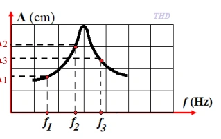{ loading=lazy }

A. $|f_1-f_0|<|f_2-f_0|<|f_3-f_0|$.

B. $|f_3-f_0|<|f_2-f_0|<|f_1-f_0|$.

C. $|f_1-f_0|<|f_3-f_0|<|f_2-f_0|$.

D. $|f_2-f_0|<|f_3-f_0|<|f_1-f_0|$.

??? success "Đáp án và lời giải"
    **Đáp án:** D

    **Hướng dẫn giải:**
    Với cùng hệ dao động và biên độ ngoại lực, tần số cưỡng bức càng gần tần số riêng $f_0$ thì biên độ ổn định càng lớn. Từ đồ thị có $A_2>A_3>A_1$, nên

    $|f_2-f_0|<|f_3-f_0|<|f_1-f_0|.$

#### Bài 56

<!-- source-id: BT-Chuong-I-p144-q11-375 -->

Vật dao động tắt dần có

A. pha dao động luôn giảm dần theo thời gian.

B. li độ luôn giảm dần theo thời gian.

C. thế năng luôn giảm dần theo thời gian.

D. cơ năng luôn giảm dần theo thời gian.

??? success "Đáp án và lời giải"
    **Đáp án:** D
    **Hướng dẫn giải:**

    Trước hết xác định đúng loại dao động: tắt dần có biên độ giảm do lực cản; dao động cưỡng bức có tần số bằng tần số ngoại lực; cộng hưởng xảy ra khi tần số cưỡng bức gần tần số riêng.

    Đối chiếu kết quả với các lựa chọn, phương án phù hợp là **D. cơ năng luôn giảm dần theo thời gian.**
#### Bài 57

<!-- source-id: BT-Chuong-I-p145-q13-377 -->

Một vật dao động cưỡng bức do tác dụng của ngoại lực

$$
F=2\cos\left(20\pi t+\frac{\pi}{3}\right),
$$

với $F$ tính bằng niutơn và $t$ tính bằng giây. Vật dao động với

A. tần số góc $10$ rad/s.

B. chu kì $2$ s.

C. biên độ $0{,}5$ m.

D. tần số $10$ Hz.

??? success "Đáp án và lời giải"
    **Đáp án: D.**
    **Hướng dẫn giải:**

    Dao động cưỡng bức ổn định có tần số bằng tần số của ngoại lực. Ở đây $\omega=20\pi$ rad/s nên

    $\displaystyle f=\frac{\omega}{2\pi}=10\ \text{Hz}.$
#### Bài 58

<!-- source-id: BT-Chuong-I-p145-q14-378 -->

Phát biểu nào sau đây không đúng khi nói về dao động tắt dần?

A. Biên độ dao động giảm dần.

B. Tốc độ dao động cực đại giảm dần.

C. Tần số dao động càng lớn thì dao động tắt dần càng nhanh.

D. Độ lớn lực cản càng lớn thì dao động tắt dần càng nhanh.

??? success "Đáp án và lời giải"
    **Đáp án:** C
    **Hướng dẫn giải:**

    Trước hết xác định đúng loại dao động: tắt dần có biên độ giảm do lực cản; dao động cưỡng bức có tần số bằng tần số ngoại lực; cộng hưởng xảy ra khi tần số cưỡng bức gần tần số riêng.

    Đối chiếu kết quả với các lựa chọn, phương án phù hợp là **C. Tần số dao động càng lớn thì dao động tắt dần càng nhanh.**
#### Bài 59

<!-- source-id: BT-Chuong-I-p145-q15-379 -->

Một con lắc lò xo dao động tắt dần trên mặt phẳng nằm ngang. Cứ sau mỗi chu kì biên
độ giảm 2%. Gốc thế năng tại vị trí của vật mà lò xo không biến dạng. Phần trăm cơ năng của con
lắc bị mất đi trong hai dao động toàn phần liên tiếp có giá trị gần nhất với giá trị nào sau đây?

A. 7%.

B. 4%.

C. 10%.

D. 8%.

??? success "Đáp án và lời giải"
    **Đáp án:** D
    **Hướng dẫn giải:**

    Trước hết xác định đúng loại dao động: tắt dần có biên độ giảm do lực cản; dao động cưỡng bức có tần số bằng tần số ngoại lực; cộng hưởng xảy ra khi tần số cưỡng bức gần tần số riêng.

    Phần trăm cơ năng còn lại sau hai chu kì dao động là
    Phần trăm cơ năng hao phí là 100% - 92% = 8%

    Đối chiếu kết quả với các lựa chọn, phương án phù hợp là **D. 8%.**
#### Bài 60

<!-- source-id: BT-Chuong-I-p145-q16-380 -->

Một vật dao động điều hòa có phương trình

$$
x=5\cos\left(\frac{2\pi}{3}t+\frac{\pi}{6}\right)\ \text{cm}.
$$

Bỏ qua lực cản của môi trường. Lần lượt tác dụng lên vật các ngoại lực cưỡng bức

- $F_1=2\cos\left(2\pi t+\frac{\pi}{3}\right)$ N;
- $F_2=2{,}5\cos(2\pi t)$ N;
- $F_3=5\cos\left(2\pi t-\frac{\pi}{3}\right)$ N.

Biên độ dao động cưỡng bức ở giai đoạn ổn định trong ba trường hợp lần lượt là $A_1,A_2,A_3$. Nhận xét nào sau đây đúng?

A. $A_3>A_2>A_1$.

B. $A_3<A_2<A_1$.

C. $A_1=A_2=A_3$.

D. $A_2=A_3>A_1$.

??? success "Đáp án và lời giải"
    **Đáp án: A.**
    **Hướng dẫn giải:**

    Ba ngoại lực có cùng tần số góc $2\pi$ rad/s. Với cùng hệ dao động và cùng tần số cưỡng bức, biên độ ổn định tỉ lệ với biên độ ngoại lực. Vì

    $$5>2{,}5>2,$$

    nên $A_3>A_2>A_1$.
#### Bài 61

<!-- source-id: BT-Chuong-I-p146-q17-381 -->

Một người xách một xô nước đi trên đường, mỗi bước đi dài 40 cm thì nước trong xô bị
sóng sánh mạnh nhất khi tốc độ đi của người đó là v = 3,6 km/h. Chu kì dao động riêng của nước
trong xô là

A. 1 s.

B. 2 s.

C. 0,4 s.

D. 0,25 s.

??? success "Đáp án và lời giải"
    **Đáp án:** C
    **Hướng dẫn giải:**

    Trước hết xác định đúng loại dao động: tắt dần có biên độ giảm do lực cản; dao động cưỡng bức có tần số bằng tần số ngoại lực; cộng hưởng xảy ra khi tần số cưỡng bức gần tần số riêng.

    Tốc độ di chuyển của người
    Nước trong xô sóng sánh mạnh nhất khi xảy ra cộng hưởng cơ học. Khi đó chu kì dao động riêng
    bằng chu kì ngoại lực

    Đối chiếu kết quả với các lựa chọn, phương án phù hợp là **C. 0,4 s.**
#### Bài 62

<!-- source-id: BT-Chuong-I-p146-q18-382 -->

Một con lắc lò xo có độ cứng k = 25 N/m, vật nặng khối lượng m dao động tắt dần theo
phương ngang. Thời gian từ lúc bắt dầu dao động đến khi dừng hẳn là 10 (s). Đồ thị dao động của
vật như hình 3.3. Khối lượng vật nặng xấp xỉ là

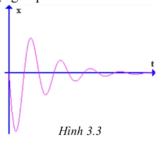{ loading=lazy }

A. 2,5 kg.

B. 2,7 kg.

C. 1,8 kg.

D. 0,5 kg.

??? success "Đáp án và lời giải"
    **Đáp án:** A
    **Hướng dẫn giải:**

    Trước hết xác định đúng loại dao động: tắt dần có biên độ giảm do lực cản; dao động cưỡng bức có tần số bằng tần số ngoại lực; cộng hưởng xảy ra khi tần số cưỡng bức gần tần số riêng.

    Quan sát hình vẽ nhận thấy vật thực hiện 5 chu kì dao động rồi ngừng hẳn.
    Chu kì dao động:
    Khối lượng vật nặng:

    Đối chiếu kết quả với các lựa chọn, phương án phù hợp là **A. 2,5 kg.**
### Nhận biết — Đúng/Sai

#### Bài 63

<!-- source-id: BT-Chuong-I-p137-q3-357 -->

Con lắc lò xo có độ cứng $64$ N/m, một đầu cố định, đầu còn lại gắn vật khối lượng $m$, dao động theo phương ngang. Tác dụng lên con lắc ngoại lực tuần hoàn

$$
F=F_0\cos\left(2\pi f t-\frac{\pi}{3}\right)\ \text{N}.
$$

Thay đổi tần số ngoại lực từ $1{,}5$ Hz đến $5$ Hz thì nhận thấy tại $f=2{,}55$ Hz vật dao động với biên độ cực đại. Xét các phát biểu:

a) Tần số dao động riêng của con lắc lò xo là $2{,}55$ Hz.

b) Khối lượng vật nặng là $200$ g.

c) Khi tăng tần số ngoại lực trong khoảng khảo sát, biên độ dao động lúc đầu tăng lên, sau đó giảm đi.

d) Khi dao động cưỡng bức đã ổn định, nếu thay đổi pha ban đầu của lực cưỡng bức thì biên độ dao động không thay đổi.

??? success "Đáp án và lời giải"
    **Đáp án: a) Đúng; b) Sai; c) Đúng; d) Đúng.**
    **Hướng dẫn giải:**

    Biên độ cực đại tại $f=2{,}55$ Hz cho biết hệ xảy ra cộng hưởng, nên $f_0=2{,}55$ Hz.

    Từ

    $\displaystyle f_0=\frac{1}{2\pi}\sqrt{\frac{k}{m}}$

    suy ra

    $\displaystyle m=\frac{k}{4\pi^2f_0^2}\approx\frac{64}{4\pi^2\cdot2{,}55^2}\approx0{,}25\ \text{kg}=250\ \text{g}.$

    Vì vậy b sai. Khi quét tần số qua vùng cộng hưởng, biên độ tăng tới cực đại rồi giảm. Biên độ ổn định phụ thuộc biên độ và tần số ngoại lực, độ cản và đặc trưng hệ, không phụ thuộc pha ban đầu của ngoại lực.
#### Bài 64

<!-- source-id: BT-Chuong-I-p138-q4-358 -->

Con lắc lò xo gồm vật nhỏ khối lượng 20 gam gắn vào đầu một lò xo có độ cứng 1 N/m.
Vật được gắn trên một giá đỡ cố định nằm dọc theo trục lò xo. Hệ dao động theo phương nằm
ngang. Biết hệ số ma sát giữa vật và giá đỡ là 0,1. Kéo vật khỏi vị trí cân bằng một khoảng 10 cm
theo chiều dương rồi thả cho vật dao động không vận tốc đầu. Lấy $g=10$ m/s².

a) Vị trí cân bằng tạm thời trong nửa chu kì dao động đầu cách vị trí cân bằng ban đầu 1 cm.

b) Biên độ sau một phần tư chu kì dao động đầu tiên là 10 cm.

c) Độ giảm biên độ dao động trong mỗi chu kì là 8 cm.

d) Tốc độ lớn nhất mà vật đạt được trong quá trình dao động là $40\sqrt2$ cm/s.

??? success "Đáp án và lời giải"
    **Đáp án:** a) Sai; b) Sai; c) Đúng; d) Đúng.

    **Hướng dẫn giải:**

    Lực ma sát trượt có độ lớn $F_\mathrm{ms}=\mu mg=0{,}1\cdot0{,}02\cdot10=0{,}02$ N.
    Độ lệch của vị trí cân bằng tạm thời là
    $x_0=F_\mathrm{ms}/k=0{,}02$ m $=2$ cm. Vì vậy a) **Sai**.

    Trong nửa chu kì đầu, biên độ giảm một lượng $2x_0=4$ cm; còn sau một phần tư chu kì đầu tiên, độ lệch cực đại tương ứng quanh vị trí cân bằng tạm thời là $A-x_0=8$ cm, không phải 10 cm. Vì vậy b) **Sai**.

    Sau một chu kì, độ giảm biên độ là
    $\Delta A_T=4x_0=8$ cm, nên c) **Đúng**.

    $\omega=\sqrt{k/m}=\sqrt{1/0{,}02}=5\sqrt2$ rad/s. Trong nhánh đầu, biên độ đối với vị trí cân bằng tạm thời là $A-x_0=0{,}08$ m, nên
    $v_{\max}=\omega(A-x_0)=5\sqrt2\cdot0{,}08=0{,}4\sqrt2$ m/s $=40\sqrt2$ cm/s. Do đó d) **Đúng**.

#### Bài 65

<!-- source-id: BT-Chuong-I-p147-q1-383 -->

Một con lắc lò xo gồm một lò xo có độ cứng 36 N/m, vật nặng khối lượng 250 gam. Kéo
vật khỏi vị trí cân bằng một khoảng 4 cm rồi thả cho vật dao động theo phương nằm ngang. Biết
rằng sau mỗi chu kì dao động biên độ giảm 5%.

a) Chu kì dao động của vật là 0,52 s.

b) Cơ năng ban đầu của vật là 0,029 J.

c) Cơ năng của vật sau 2 chu kì dao động là 0,02 J.

d) Sau 6 dao động toàn phần cơ năng của vật còn lại 0,0127 J.

??? success "Đáp án và lời giải"
    **Đáp án:** a) Đúng; b) Đúng; c) Sai; d) Sai.

    **Hướng dẫn giải:**

    a) $T=2\pi\sqrt{m/k}=2\pi\sqrt{0{,}25/36}=\pi/6\approx0{,}524$ s, nên phát biểu $0{,}52$ s là **Đúng**.

    b) $W_0=\dfrac12kA_0^2=\dfrac12\cdot36\cdot0{,}04^2=0{,}0288$ J $\approx0{,}029$ J, nên **Đúng**.

    Sau mỗi chu kì, $A$ còn $0{,}95$ lần nên cơ năng còn $0{,}95^2$ lần.

    c) $W_2=W_0\cdot0{,}95^4\approx0{,}02346$ J, không phải $0{,}02$ J nếu làm tròn theo dữ kiện đã cho. Vì vậy **Sai**.

    d) $W_6=W_0\cdot0{,}95^{12}\approx0{,}01556$ J, không phải $0{,}0127$ J. Vì vậy **Sai**.

#### Bài 66

<!-- source-id: BT-Chuong-I-p147-q2-384 -->

Một con lắc lò xo gồm vật nặng khối lượng 0,2 kg, lò xo có độ cứng 80 N/m dao động
theo phương ngang. Hệ số ma sát giữa vật và mặt phẳng nghiêng là 0,1. Kéo vật khỏi vị trí cân
bằng một khoảng 4 cm theo chiều dương rồi thả không vận tốc đầu. Lấy $g=10$ m/s².

a) Độ giảm biên độ sau mỗi nửa chu kì dao động là 0,25 cm.

b) Quãng đường vật đi được từ lúc vật bắt đầu dao động đến khi vật dừng lại lần đầu tiên là 7,5 cm.

c) Số dao động vật thực hiện cho tới khi dừng lại là 8 dao động.

d) Thời gian từ lúc vật bắt đầu dao động cho đến khi dừng lại là 1,26 s.

??? success "Đáp án và lời giải"
    **Đáp án:** a) Sai; b) Đúng; c) Sai; d) Đúng.

    **Hướng dẫn giải:**

    Với mô hình ma sát trượt không đổi, độ giảm biên độ sau mỗi nửa chu kì là
    $\Delta A_{T/2}=\dfrac{2\mu mg}{k}=\dfrac{2\cdot0{,}1\cdot0{,}2\cdot10}{80}=0{,}005$ m $=0{,}5$ cm. Do đó a) **Sai**.

    Sau nửa chu kì đầu, biên độ phía âm còn $4-0{,}5=3{,}5$ cm, nên quãng đường đến lần dừng thứ nhất là $4+3{,}5=7{,}5$ cm. Vì vậy b) **Đúng**.

    Độ giảm biên độ sau một chu kì là $1$ cm, nên từ $A_0=4$ cm vật thực hiện $N=4$ chu kì trước khi dừng, không phải 8. Vì vậy c) **Sai**.

    $T=2\pi\sqrt{m/k}=2\pi\sqrt{0{,}2/80}\approx0{,}31416$ s.
    Thời gian dao động là $t=NT\approx4\cdot0{,}31416=1{,}2566$ s $\approx1{,}26$ s, nên d) **Đúng**.

#### Bài 67

<!-- source-id: BT-Chuong-I-p148-q3-385 -->

Một đồng hồ quả lắc có cấu tạo gồm một thanh dài 25 cm có khối lượng không đáng kể và vật nặng khối lượng $50$ g. Con lắc dao động với biên độ góc $0{,}18$ rad. Biết sau mỗi chu kì biên độ dao động của con lắc giảm 5%. Lấy $g=10$ m/s². Để duy trì dao động của con lắc một cách liên tục người ta dùng một pin AA có suất điện động $1{,}5$ V và dung lượng pin $900$ mAh. Biết điện năng tiêu thụ bằng tích số suất điện động và điện lượng do pin cung cấp, hiệu suất của pin là 80%.

a) Cơ năng dao động của con lắc là $0{,}02$ J.

b) Năng lượng hao phí sau chu kì đầu xấp xỉ $0{,}0002$ J.

c) Điện năng lí tưởng của pin là $3240$ J.

d) Giả sử năng lượng hao phí sau mỗi chu kì bằng giá trị xấp xỉ ở b) và đồng hồ chạy ổn định trong suốt thời gian sử dụng pin. Thời gian sử dụng pin là $225{,}42$ ngày.

??? success "Đáp án và lời giải"
    **Đáp án sau kiểm tra:** a) Sai; b) Đúng; c) Sai; d) Sai.

    **Hướng dẫn giải:**

    Với góc nhỏ, cơ năng ban đầu xấp xỉ

    $W_0=\dfrac12mgl\alpha_0^2=\dfrac12\cdot0{,}05\cdot10\cdot0{,}25\cdot0{,}18^2\approx2{,}03\times10^{-3}$ J.

    Vì vậy a) **Sai**.

    Sau một chu kì, $\alpha_1=0{,}95\alpha_0$. Do $W\propto\alpha^2$ trong gần đúng góc nhỏ,

    $\Delta W=W_0-W_1=W_0(1-0{,}95^2)\approx1{,}97\times10^{-4}$ J $\approx0{,}0002$ J.

    Vậy b) **Đúng** theo mức làm tròn của đề.

    Dung lượng $0{,}9$ Ah tương ứng điện lượng $Q=0{,}9\cdot3600=3240$ C. Điện năng lí tưởng của pin là

    $E=UQ=1{,}5\cdot3240=4860$ J,

    nên c) **Sai**. Năng lượng hữu ích ở hiệu suất 80% là $E_h=0{,}8\cdot4860=3888$ J.

    Với giả thiết riêng của d) rằng mỗi chu kì hao phí xấp xỉ $0{,}0002$ J, nếu dùng cùng gần đúng $T\approx1$ s như lời giải nguồn thì

    $t\approx\dfrac{3888}{0{,}0002}\,\mathrm s=1{,}944\times10^7$ s $=225$ ngày,

    không phải $225{,}42$ ngày. Vì vậy d) **Sai**. Nếu dùng chu kì không làm tròn $T=2\pi\sqrt{0{,}25/10}\approx0{,}9935$ s thì kết quả còn nhỏ hơn, nên kết luận d) không thay đổi.

!!! warning "Đối chiếu nguồn"
    Câu dẫn PDF bỏ mất khối lượng vật nặng, nhưng chính dòng thay số đầu tiên của lời giải dùng $m=0{,}05$ kg; bản learner-facing phục hồi đúng dữ kiện $50$ g từ đó. PDF còn tính sai $3240\cdot1{,}5$ thành $4869$ J, rồi dùng $80\%$ của giá trị sai này để ra $225{,}42$ ngày. Sửa phép nhân cho $4860$ J làm c) và d) đều Sai; các dữ kiện còn lại được giữ nguyên.

#### Bài 68

<!-- source-id: BT-Chuong-I-p149-q4-386 -->

Một con lắc lò xo dao động tắt dần trên mặt phẳng nằm ngang có đồ thị (x-t) như hình 3.4.
Biết rằng lò xo có độ cứng 25 N/m. Lấy $g=10$ m/s².

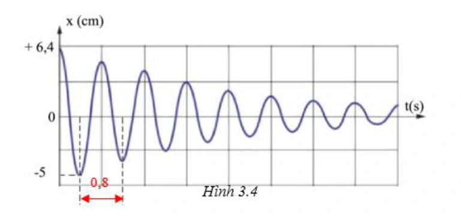{ loading=lazy }

a) Chu kì dao động của vật là 0,8 s.

b) Khối lượng của vật là 0,5 kg.

c) Độ giảm biên độ của vật trong nửa chu kì dao động là 1,4 cm.

d) Hệ số ma sát giữa vật và mặt phẳng ngang là 0,05.

??? success "Đáp án và lời giải"
    **Đáp án:** a) Đúng; b) Sai; c) Đúng; d) Sai.

    **Hướng dẫn giải:**

    a) Từ đồ thị đọc được $T=0{,}8$ s, nên **Đúng**.

    b) Với $T=2\pi\sqrt{m/k}$,
    $m=k\left(\dfrac{T}{2\pi}\right)^2=25\left(\dfrac{0{,}8}{2\pi}\right)^2\approx0{,}405$ kg, không phải $0{,}5$ kg. Vì vậy **Sai**.

    c) Từ hai biên liên tiếp trên đồ thị, biên độ giảm $6{,}4-5{,}0=1{,}4$ cm sau nửa chu kì, nên **Đúng**.

    d) Với ma sát trượt không đổi,
    $\Delta A_{T/2}=\dfrac{2\mu mg}{k}$.
    Do đó
    $\mu=\dfrac{k\Delta A_{T/2}}{2mg}\approx\dfrac{25\cdot0{,}014}{2\cdot0{,}405\cdot10}\approx0{,}043$, không phải $0{,}05$. Vì vậy **Sai**.

### Thông hiểu — Trắc nghiệm 4 lựa chọn

#### Bài 69

<!-- source-id: BT-Chuong-I-p126-q19-333 -->

Hình dưới mô tả dao động tắt dần của cùng một con lắc, với điều kiện ban đầu như nhau, lần lượt trong ba môi trường có lực cản $F_1,F_2,F_3$. Hãy sắp xếp các lực cản theo thứ tự giảm dần.

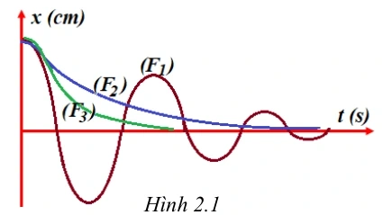{ loading=lazy }

A. $F_3>F_2>F_1$.

B. $F_3>F_1>F_2$.

C. $F_1>F_2>F_3$.

D. $F_1>F_3>F_2$.

??? success "Đáp án và lời giải"
    **Đáp án: A.**
    **Hướng dẫn giải:**

    Lực cản càng lớn thì biên độ giảm càng nhanh. Từ đồ thị, dao động 3 tắt nhanh nhất, sau đó đến dao động 2, còn dao động 1 tắt chậm nhất. Vì vậy

    $$F_3>F_2>F_1.$$
#### Bài 70

<!-- source-id: BT-Chuong-I-p126-q20-334 -->

Thực hiện thí nghiệm về dao động cưỡng bức như hình 2.2. Năm con lắc đơn: (1), (2),
(3), (4) và M (con lắc điều khiển) được treo trên một sợi dây. Ban đầu hệ đang đứng yên ở vị trí
cân bằng. Kích thích M dao động nhỏ trong mặt phẳng vuông góc với mặt phẳng hình vẽ thì các
con lắc còn lại dao động theo. Không kể M, con lắc dao động mạnh nhất là

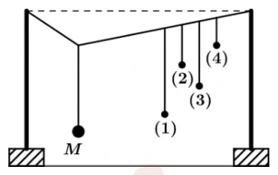{ loading=lazy }

A. con lắc (2).

B. con lắc (1).

C. con lắc (3).

D. con lắc (4).
Hình 2.2
Hình 2.1

??? success "Đáp án và lời giải"
    **Đáp án:** B
    **Hướng dẫn giải:**

    Trước hết xác định đúng loại dao động: tắt dần có biên độ giảm do lực cản; dao động cưỡng bức có tần số bằng tần số ngoại lực; cộng hưởng xảy ra khi tần số cưỡng bức gần tần số riêng.

    Tần số dao động được xác định theo công thức
    Con lắc điều khiền M và con lắc (1) có chiều dài gần bằng nhau. Độ sai lệch tần số dao động của
    con lắc 1 và con lắc điều khiển M nhỏ nhất. Do đó con lắc (1) dao động mạnh nhất.

    Đối chiếu kết quả với các lựa chọn, phương án phù hợp là **B. con lắc (1).**
#### Bài 71

<!-- source-id: BT-Chuong-I-p127-q21-335 -->

Một vật dao động cưỡng bức dưới tác dụng của ngoại lực biến thiên tuần hoàn. Tăng dần
tần số ngoại lực, khi đó biên độ dao động của vật thay đổi như hình 2.3 Chu kỳ dao động riêng
của vật là (làm tròn đến số thập phân thứ hai)

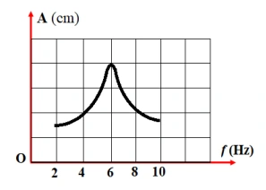{ loading=lazy }

A. 0,25 s.

B. 0,12 s.

C. 0,5 s.

D. 0,17 s.

??? success "Đáp án và lời giải"
    **Đáp án:** D
    **Hướng dẫn giải:**

    Trước hết xác định đúng loại dao động: tắt dần có biên độ giảm do lực cản; dao động cưỡng bức có tần số bằng tần số ngoại lực; cộng hưởng xảy ra khi tần số cưỡng bức gần tần số riêng.

    Theo đồ thị hình 2.3 Tại tần số ngoại lực f = 6 Hz thì biên độ dao động cưỡng bức đạt cực đại.
    Lúc này xảy ra hiện tượng cộng hưởng cơ học. Tần số dao động riêng là f0 = f = 6 Hz.
    Chu kỳ dao động riêng

    Đối chiếu kết quả với các lựa chọn, phương án phù hợp là **D. 0,17 s.**
#### Bài 72

<!-- source-id: BT-Chuong-I-p127-q22-336 -->

Một vật dao động điều hòa với tần số riêng f0 = 5 Hz. Ngoài dao động riêng, vật còn
chịu tác dụng của ngoại lực cưỡng bức tuần hoàn có tần số f = 7,5 Hz. Sau khi vật đạt trạng thái
dao động ổn định, tần số dao động của hệ là

A. 12,5 Hz.

B. 7,5 Hz.

C. 5 Hz.

D. 2,5 Hz.

??? success "Đáp án và lời giải"
    **Đáp án:** B
    **Hướng dẫn giải:**
    Dao động cưỡng bức, vật dao động cưỡng bức sẽ dao động với tần số của ngoại lực
    Do đó: fdđcb = f = 7,5 Hz

#### Bài 73

<!-- source-id: BT-Chuong-I-p127-q23-337 -->

Một vật dao động cưỡng bức dưới tác dụng của ngoại lực F = F0cos4πft (với F0 và f
không đổi, t tính bằng s). Tần số dao động cưỡng bức của vật là

A. f.

B. πf.

C. 2f.

D. 0,5f.

??? success "Đáp án và lời giải"
    **Đáp án:** C
    **Hướng dẫn giải:**

    Trước hết xác định đúng loại dao động: tắt dần có biên độ giảm do lực cản; dao động cưỡng bức có tần số bằng tần số ngoại lực; cộng hưởng xảy ra khi tần số cưỡng bức gần tần số riêng.

    Tần số góc của lực cưỡng bức
    Tần số dao động cưỡng bức bằng tần số lực cưỡng bức

    Đối chiếu kết quả với các lựa chọn, phương án phù hợp là **C. 2f.**
#### Bài 74

<!-- source-id: BT-Chuong-I-p128-q24-338 -->

Một vật thực hiện dao động tắt dần. Gọi cơ năng ban đầu là $W$, cơ năng còn lại sau $n$ dao động là $W_n$. Sau mỗi chu kì, biên độ dao động giảm $a\%$. Cơ năng còn lại của vật sau $n$ dao động toàn phần là

A. $W_n=W\left(\dfrac{100-a}{100}\right)^{2n}$.

B. $W_n=W\left(\dfrac{100-a}{100}\right)^n$.

C. $W_n=W\left(\dfrac{100}{100-a}\right)^{2n}$.

D. $W_n=W\left(\dfrac{100}{100-a}\right)^n$.

??? success "Đáp án và lời giải"
    **Đáp án: A.**
    **Hướng dẫn giải:**

    Sau mỗi chu kì,

    $$A' = A\frac{100-a}{100}.$$

    Sau $n$ chu kì,

    $$A_n=A\left(\frac{100-a}{100}\right)^n.$$

    Vì cơ năng tỉ lệ với bình phương biên độ, $W\propto A^2$, nên

    $$W_n=W\left(\frac{100-a}{100}\right)^{2n}.$$
#### Bài 75

<!-- source-id: BT-Chuong-I-p128-q25-339 -->

Một con lắc lò xo đang dao động tắt dần, sau ba chu kì đầu tiên, biên độ của nó giảm đi
5%. Phần trăm cơ năng còn lại sau khoảng thời gian đó là

A. 90,25 %.

B. 75 %.

C. 25 %.

D. 95,75 %.

??? success "Đáp án và lời giải"
    **Đáp án:** A.

    **Hướng dẫn giải:**

    Sau **ba chu kì đầu tiên**, biên độ còn $A'=0{,}95A$.
    Vì cơ năng tỉ lệ với bình phương biên độ,
    $\dfrac{W'}{W}=\left(\dfrac{A'}{A}\right)^2=0{,}95^2=0{,}9025$.

    Vậy cơ năng còn lại bằng $90{,}25\%$ cơ năng ban đầu, chọn **A**.

#### Bài 76

<!-- source-id: BT-Chuong-I-p130-q26-340 -->

Một vật dao động tắt dần có đồ thị như hình 2.4. Sau một chu kì dao động biên độ của
vật là

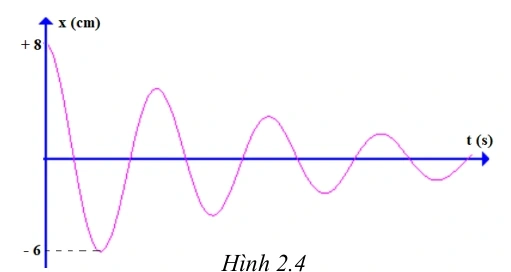{ loading=lazy }

A. 2 cm.

B. 4 cm.

C. 1 cm.

D. 5 cm.

??? success "Đáp án và lời giải"
    **Đáp án:** B
    **Hướng dẫn giải:**

    Trước hết xác định đúng loại dao động: tắt dần có biên độ giảm do lực cản; dao động cưỡng bức có tần số bằng tần số ngoại lực; cộng hưởng xảy ra khi tần số cưỡng bức gần tần số riêng.

    Sau nửa chu kì biên độ dao động giảm từ 8 cm xuống còn 6 cm.
    Vậy độ giảm biên độ sau nửa chu kì là:
    Độ giảm biên độ dao động trong một chu kì là

    Đối chiếu kết quả với các lựa chọn, phương án phù hợp là **B. 4 cm.**
#### Bài 77

<!-- source-id: BT-Chuong-I-p130-q27-341 -->

Một người xách một xô nước từ một bờ sông về nhà. Nước trong xô dao động với chu kì
0,3 s. Biết rằng mỗi chân người này có độ dài 0,6 m. Nước trong xô dao động mạnh nhất khi
người này bước đi với tốc độ

A. 2 km/h.

B. 3,6 km/h.

C. 5 km/h.

D. 7,2 km/h.

??? success "Đáp án và lời giải"
    **Đáp án:** D.

    **Hướng dẫn giải:**

    Nước dao động mạnh nhất khi xảy ra cộng hưởng, nên chu kì bước bằng chu kì riêng của nước:
    $T=T_0=0{,}3$ s.

    Với mỗi bước dài $0{,}6$ m, tốc độ là
    $v=\dfrac{0{,}6}{0{,}3}=2$ m/s $=7{,}2$ km/h.

    Vậy chọn **D**.

### Vận dụng — Trắc nghiệm 4 lựa chọn

#### Bài 78

<!-- source-id: BT-Chuong-I-p132-q35-349 -->

Một con lắc lò xo dao động tắt dần theo phương ngang với chu kì T = 0,2s, lò xo nhẹ, vật
nhỏ dao động có khối lượng 100g. Hệ số ma sát giữa vật và mặt phẳng ngang là 0,01. Độ giảm
biên độ của vật sau một nửa chu kì dao động là

A. 0,4 cm

B. 0,3 cm

C. 0,02 cm

D. 0,2 m

??? success "Đáp án và lời giải"
    **Đáp án:** C. $0{,}02$ cm.

    **Hướng dẫn giải:**
    Từ $T=2\pi\sqrt{m/k}$:
    $k=4\pi^2m/T^2\approx4\pi^2\cdot0{,}1/0{,}2^2\approx100$ N/m (lấy $\pi^2\approx10$ như cách trình bày của nguồn).

    Với ma sát trượt không đổi, độ giảm biên độ sau nửa chu kì là
    $\Delta A_{T/2}=2\mu mg/k=2\cdot0{,}01\cdot0{,}1\cdot10/100=2\times10^{-4}$ m.

    Đổi đơn vị: $2\times10^{-4}$ m $=0{,}02$ cm. Vậy chọn **C**.

!!! warning "Đối chiếu nguồn"
    PDF nguồn tính đúng $\Delta A=0{,}0002$ m nhưng đổi nhầm thành $0{,}2$ cm. Đúng ra $0{,}0002$ m $=0{,}02$ cm; phương án C được hiệu chỉnh theo giá trị đúng.
#### Bài 79

<!-- source-id: BT-Chuong-I-p133-q36-350 -->

Con lắc lò xo dao động điều hòa với chu kì $T=\pi/10$ s, khối lượng lò xo không đáng kể; một đầu cố định, đầu còn lại gắn vật nặng khối lượng $m=0{,}25$ kg. Con lắc dao động cưỡng bức theo phương trùng với trục của lò xo dưới tác dụng của ngoại lực tuần hoàn

$$
F=F_0\cos(\omega t)\ \text{N}.
$$

Thay đổi tần số góc $\omega$ từ $10$ rad/s đến $15$ rad/s thì biên độ dao động

A. tăng lên.

B. tăng lên rồi giảm xuống.

C. không thay đổi.

D. giảm xuống rồi tăng lên.

??? success "Đáp án và lời giải"
    **Đáp án:** A

    **Hướng dẫn giải:**
    Tần số góc riêng của hệ là $\omega_0=2\pi/T=20$ rad/s. Khi $\omega$ tăng từ $10$ lên $15$ rad/s, tần số cưỡng bức tiến gần $\omega_0$, nên trong khoảng này biên độ cưỡng bức tăng.

#### Bài 80

<!-- source-id: BT-Chuong-I-p133-q37-351 -->

Một vật dao động tắt dần. Đồ thị (x-t) như hình 2.7 Biên độ A1 có giá trị là

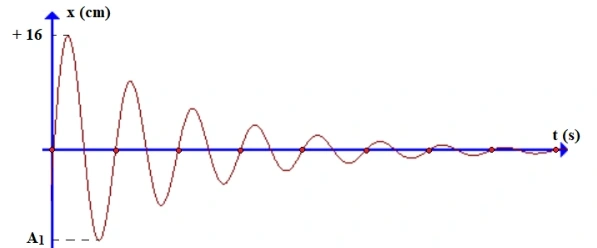{ loading=lazy }

A. 4.

B. 15.

C. 12.

D. 10.

??? success "Đáp án và lời giải"
    **Đáp án:** B
    **Hướng dẫn giải:**

    Trước hết xác định đúng loại dao động: tắt dần có biên độ giảm do lực cản; dao động cưỡng bức có tần số bằng tần số ngoại lực; cộng hưởng xảy ra khi tần số cưỡng bức gần tần số riêng.

    Từ đồ thị ta thấy, số dao động vật thực hiện đến khi dừng lại là N = 8
    Số dao động được tính theo công thức:
    Khi đi từ biên độ dương + 16 cm đến vị trí biên độ âm A1 là nửa chu kì, biên độ dao động
    giảm một lượng:
    Khi đó biên độ

    Đối chiếu kết quả với các lựa chọn, phương án phù hợp là **B. 15.**
#### Bài 81

<!-- source-id: BT-Chuong-I-p133-q38-352 -->

Tác dụng vào hệ dao động một ngoại lực cưỡng bức tuần hoàn có biên độ không đổi nhưng tần số $f$ thay đổi được. Ứng với mỗi giá trị của $f$, hệ dao động cưỡng bức với biên độ $A$. Hình 2.8 là đồ thị biểu diễn sự phụ thuộc của $A$ vào $f$. Chu kì dao động riêng của hệ gần nhất với giá trị nào sau đây?

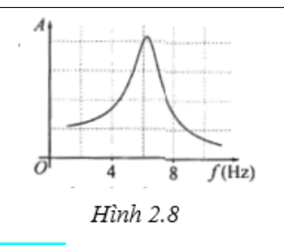{ loading=lazy }

A. $0{,}15$ s.

B. $0{,}35$ s.

C. $0{,}45$ s.

D. $0{,}55$ s.

??? success "Đáp án và lời giải"
    **Đáp án:** A

    **Hướng dẫn giải:**
    Biên độ cưỡng bức cực đại tại tần số gần tần số riêng. Từ đỉnh đồ thị, nguồn đọc được $f_0\approx6{,}25$ Hz, nên

    $T_0\approx\frac{1}{6{,}25}=0{,}16\ \text{s}.$

    Giá trị gần nhất là $0{,}15$ s.

#### Bài 82

<!-- source-id: BT-Chuong-I-p134-q39-353 -->

Một con lắc lò xo có độ cứng $k=4\pi^2$ N/m dao động tắt dần trên mặt phẳng nằm ngang có đồ thị như hình 2.10. Hệ số ma sát giữa vật và mặt phẳng nằm ngang có giá trị gần đúng là

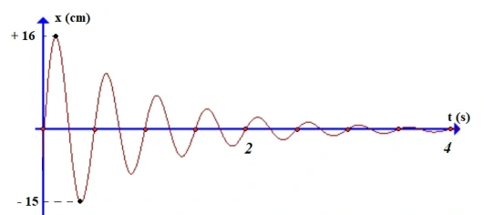{ loading=lazy }

A. $0{,}01$.

B. $0{,}02$.

C. $0{,}08$.

D. $0{,}5$.

??? success "Đáp án và lời giải"
    **Đáp án:** C

    **Hướng dẫn giải:**
    Đọc chu kì và độ giảm biên độ từ đồ thị rồi dùng quan hệ giảm biên độ của dao động tắt dần do ma sát khô như hướng dẫn nguồn. Kết quả gần đúng là $\mu\approx0{,}08$.

#### Bài 83

<!-- source-id: BT-Chuong-I-p135-q40-354 -->

Một con lắc lò xo gồm vật nhỏ khối lượng m = 0,02 kg và lò xo có độ cứng k = 1N/m.
Vật nhỏ được đặt trên giá đỡ cố định nằm ngang dọc theo trục lò xo. Hệ số ma sát trượt giữa giá
đỡ và vật nhỏ là μ=0,1. Ban đầu giữ vật ở vị trí lò xo bị giãn ra theo chiều dương một
khoảng Δl0=10 cm rồi buông nhẹ để con lắc dao động tắt dần. Lấy g = 10m/s2. Độ giảm thế năng
của con lắc trong giai đoạn từ khi buông tới vị trí mà tốc độ dao động của con lắc cực đại lần đầu
là

A. 2,4 mJ.

B. 4,8 mJ.

C. 3,6 mJ.

D. 5,4 mJ.

??? success "Đáp án và lời giải"
    **Đáp án:** B
    **Hướng dẫn giải:**

    Trước hết xác định đúng loại dao động: tắt dần có biên độ giảm do lực cản; dao động cưỡng bức có tần số bằng tần số ngoại lực; cộng hưởng xảy ra khi tần số cưỡng bức gần tần số riêng.

    Ban đầu vật ở cách vị trí cân bằng 10 cm. Do đó vật đang ở biên A = 10 cm = 0,1 m.
    Khi tốc độ con lắc cực đại lần đầu, khi đó vật đi qua vị trí cân bằng tạm thời +x0.
    Vị trí +x0 cách vị trí O ban đầu một khoảng
    Độ giảm thế năng

    Đối chiếu kết quả với các lựa chọn, phương án phù hợp là **B. 4,8 mJ.**
### Vận dụng — Đúng/Sai

#### Bài 84

<!-- source-id: BT-Chuong-I-p136-q1-355 -->

Máy đo địa chấn được sử dụng để phát hiện và đo đạc những rung động địa chấn được tạo ra bởi sự dịch chuyển của lớp vỏ Trái Đất. Tần số của những cơn địa chấn thường nằm trong khoảng 30 Hz – 40 Hz. Năng lượng từ các cơn địa chấn có khả năng kích thích con lắc lò xo bên trong máy đo làm đầu bút di chuyển để vẽ lên giấy như hình 2.12.

{ loading=lazy }

a) Dao động của con lắc lò xo trong máy địa chấn là dao động duy trì.

b) Đầu bút di chuyển và vẽ được lên tờ giấy là do các cơn địa chấn tạo ra dao động duy trì.

c) Tần số dao động của những con lắc lò xo trong máy địa chấn vào khoảng 30 Hz – 40 Hz.

d) Để máy địa chấn ghi nhận được kết quả tốt nhất thì tần số riêng của con lắc lò xo phải có giá trị thật nhỏ so với 30 Hz – 40 Hz.

??? success "Đáp án và lời giải"
    **Đáp án:** a) Sai; b) Sai; c) Đúng; d) Đúng.

    **Hướng dẫn giải:**
    a) Dao động con lắc lò xo trong máy địa chấn là dao động cưỡng bức.
    b) Đầu bút di chuyển và vẽ lên tờ giấy là do các dao động cưỡng bức từ các cơn địa chấn tác
    dụng lên lò xo.
    c) Vì con lắc lò xo trong máy địa chấn dao động cưỡng bức nên tần số dao động bằng tần số
    ngoại lực cưỡng bức. Do đó tần số vào khoảng 30 Hz – 40 Hz.
    d) Để kết quả ghi tốt nhất, cần thiết kế tần số riêng của lò xo có giá trị nhỏ so với tần 30 Hz – 40
    Hz của địa chấn. Vì tần số riêng của lò xo gần tần số của địa chấn thì sẽ gây ra hiện tượng cộng
    hưởng, khi đó máy có thể cho kết quả đo không chính xác hoặc bị hỏng.

#### Bài 85

<!-- source-id: BT-Chuong-I-p137-q2-356 -->

Một hành khách dùng một sợi dây không giãn có chiều dài $l$ để treo một ba lô lên trần một
toa tàu hoả. Biết rằng mỗi thanh ray của đường tàu có độ dài 12 m và mỗi khi tàu chạy qua chỗ
nối hai thanh ray thì ba lô bị dao động cưỡng bức. Khi tàu chạy với tốc độ 36 km/h thì thấy
chiếc ba lô dao động mạnh nhất.

a) Dao động của chiếc ba lô là mạnh nhất khi xảy ra cộng hưởng cơ học.

b) Chu kì ngoại lực là 2 s.

c) Chu kì dao động riêng của ba lô được tính theo công thức $T_0=2\pi\sqrt{l/g}$.

d) Chiều dài dây treo xấp xỉ 36 cm.

??? success "Đáp án và lời giải"
    **Đáp án:** a) Đúng; b) Sai; c) Đúng; d) Đúng.

    **Hướng dẫn giải:**

    a) **Đúng.** Biên độ cưỡng bức lớn nhất tại cộng hưởng.

    Đổi $36$ km/h $=10$ m/s. Mỗi lần tàu đi qua một mối nối cách nhau $12$ m là một chu kì của ngoại lực, nên
    $T_F=\dfrac{12}{10}=1{,}2$ s. Vì vậy b) **Sai**.

    c) **Đúng.** Coi ba lô là con lắc đơn dao động nhỏ, $T_0=2\pi\sqrt{l/g}$.

    d) **Đúng.** Khi cộng hưởng, $T_0=T_F=1{,}2$ s. Suy ra
    $l=g\left(\dfrac{T_0}{2\pi}\right)^2$.
    Với $g\approx10$ m/s², $l\approx10\left(\dfrac{1{,}2}{2\pi}\right)^2\approx0{,}365$ m $\approx36$ cm.
