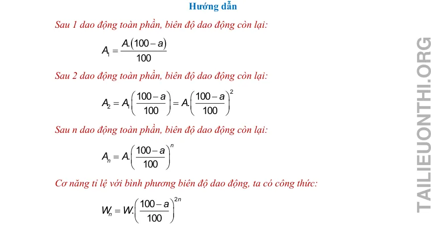

# Đáp án và lời giải — Bài 7 — Tổng hợp dao động, tắt dần, cưỡng bức và cộng hưởng

> Câu nền tảng được giải vừa đủ để kiểm tra cách làm. Câu vận dụng được trình bày chi tiết hơn để người học thấy được đường suy luận, điều kiện dùng công thức và bước kiểm tra kết quả.

[← Bài tập](exercises.md)

## Câu 1

Chọn **C**. Hai dao động cùng pha nên $A=A_1+A_2=8$ cm.

## Câu 2

Chọn **A**. Ngược pha nên $A=|A_1-A_2|=3$ cm.

## Câu 3

Chọn **B**. Trạng thái cưỡng bức ổn định dao động theo tần số của ngoại lực.

## Câu 4

Chọn **A**.

## Câu 5

a) **Đúng**.  
b) **Đúng**.  
c) **Sai**: một phần cơ năng chuyển thành nhiệt và các dạng khác.  
d) **Đúng**.

## Câu 6

a) **Đúng**.  
b) **Đúng**.  
c) **Sai**: có thể có lợi hoặc có hại.  
d) **Đúng**.

## Câu 7

Độ lệch pha $\Delta\varphi=\pi/2$. $A=\sqrt{A_1^2+A_2^2+2A_1A_2\cos\Delta\varphi}=\sqrt{9+16}=5$ cm.

## Câu 8

$A^2=25+25+50\cos120^\circ=50-25=25$. Vậy $A=5$ cm.

## Câu 9

Chọn $4,0$ Hz vì bằng tần số riêng, gần điều kiện cộng hưởng.

## Câu 10

Hai dao động cùng tần số. Tách theo trục cos–sin:

$C=A_1\cos\varphi_1+A_2\cos\varphi_2=4\frac{\sqrt3}{2}+3\frac12=2\sqrt3+\frac32$.

$S=A_1\sin\varphi_1+A_2\sin\varphi_2=4\frac12+3\left(-\frac{\sqrt3}{2}\right)=2-\frac{3\sqrt3}{2}$.

Biên độ:

$A=\sqrt{C^2+S^2}=\sqrt{4^2+3^2+2\cdot4\cdot3\cos(\pi/2)}=5$ cm.

Pha $\varphi$ thỏa $\cos\varphi=C/5$, $\sin\varphi=S/5$. Giá trị gần đúng:

$C\approx4,964$, $S\approx-0,598$ nên $\varphi\approx-0,120$ rad.

Vậy có thể viết $x\approx5\cos(10t-0,120)$ cm.

---

[← Bài tập](exercises.md)

## Đáp án và lời giải — Ngân hàng PDF mở rộng

> Câu có lời giải trong tài liệu được giữ phần hướng dẫn. Câu trắc nghiệm không kèm lời giải dài chỉ hiện đáp án đã đối chiếu từ dấu đáp án/khóa đáp án của tài liệu.

### Nhận biết — Trả lời ngắn

#### Bài PDF 1

**Đáp án:** 0

Đáp án:
0
,
7
2
Hướng dẫn
Tốc độ di chuyển của người
(
)
2,5
25
/
3,6
36
v
m s
=
=

Nước trong xô sóng sánh mạnh nhất khi xảy ra cộng hưởng cơ học. Khi đó chu kì dao động riêng
bằng chu kì ngoại lực

( )
0
0,72
s
T
T
s
v
=
=
=

#### Bài PDF 2

**Đáp án:** 9

Đáp án:
9
0
,
3

Hướng dẫn

Sau mỗi dao động, biên độ giảm 5%, còn lại 95%.

Cơ năng tỉ lệ thuận với bình phương biên độ, ta có tỉ lệ

2
2
2
2
2
­
­
0,95 .
0,903
sau
sau
tr í c
tr í c
W
A
A
W
A
A
=
=


Vậy cơ năng sau xấp xỉ bằng 90,3% cơ năng ban đầu

#### Bài PDF 3

**Đáp án:** 1

Đáp án:
1
,
2
7
Hướng dẫn

Độ giảm biên độ sau ¼ chu kì là:
( )
(
)
1/4
0,1.0,4.10
0,02
2
20
T
mg
A
m
cm
k
μ
Δ
=
=
=
=

Tần số góc
(
)
20
7,07
/
0,4
k
rad s
m
ω=
=
=

Biên độ cực đại trong quá trình dao động:
(
)
20 2
18
A
cm
=
−
=

Tốc độ cực đại trong quá trình dao động là:

(
)
max
.
18.7,07
127
/
v
A
cm s
ω
=
=
=
=1,27 (m/s)

#### Bài PDF 4

**Đáp án:** 5

{ loading=lazy }
#### Bài PDF 5

**Đáp án:** 6

Đáp án:
6
,
1
5
Hướng dẫn
Tần số dao động riêng
(
)
2
0
1
1
25.
5
2
2
0,25
k
f
Hz
m
π
π
π
=
=
=

Nhận thấy f &gt; f0. Do đó biên độ dao động tăng dần khi f  tăng dần từ 6,15 Hz đến 8,25 Hz. Vậy
biên độ dao động có giá trị lớn nhất khi tần số là 6,15 Hz.

#### Bài PDF 6

**Đáp án:** 4

Đáp án:
4

Hướng dẫn

Mỗi nửa chu kì biên độ giảm 6 – 4 = 2 (mm)

Mỗi chu kì biên độ giảm 2.2 = 4 (mm)

Hình 2.15

#### Bài PDF 7

**Đáp án:** 0

Đáp án:
0
,
4
4

Hướng dẫn

Tốc độ tàu hỏa là
(
)
54
15
/
3,6
v
m s
=
=

Chu kì ngoại lực
( )
12,5
0,83
15
L
T
s
v
=
=
=

Khi lò xo dao động mạnh nhất, lúc này xảy ra cộng hưởng cơ học
( )
0
0,83
T
T
s
=
=

Khối lượng vật nặng
(
)
(
)
2
0
0
2
.
2
0,44
2
k T
m
T
m
kg
k
π
π
=

=
=

#### Bài PDF 8

**Đáp án:** 9

Đáp án:
9

Hướng dẫn
Hao phí 30% nên cơ năng còn lại chiếm 70% = 0,7.
Áp dụng công thức
2.
100
2
0,7
100
n
n
W
W
−




=
=









Suy ra n = 9.

#### Bài PDF 9

**Đáp án:** 1

Đáp án:
1

Hướng dẫn

Tần số dao động cưỡng bức bằng tần số ngoại lực
(
)
2
1
2
2
f
Hz
ω
π
π
π
=
=
=

#### Bài PDF 10

**Đáp án:** 0

Đáp án:
0
,
0
2

Hướng dẫn

Độ giảm biên độ sau mỗi chu kỳ dao động tính theo công thức

( )
1
4
4.0,2.0,25.10
0,02
100
T
mg
A
m
k
μ
Δ
=
=
=

#### Bài PDF 11

**Đáp án:** 0

Đáp án:
0
,
3
1
Hướng dẫn

Biên độ sau mỗi 1/2 chu kì giảm
(
)
1/2
2
T
A
mm
Δ
=
 2 mm.

Chu kì
(
)
(
)
2
2
.
2
0,16
2
m
k T
T
m
kg
k
π
π
=

=
=

Hệ số ma sát
1/2
1/2
.
2
0,31
2
T
T
A
k
mg
A
k
mg
μ
μ
Δ
Δ
=

=
=

#### Bài PDF 12

**Đáp án:** 4

Đáp án:
4
,
2
5
Hướng dẫn

Tần số dao động riêng
(
)
2
0
1
1
25.
5
2
2
0,25
k
f
Hz
m
π
π
π
=
=
=

Nhận thấy f &lt; f0. Do đó biên độ dao động tăng dần khi f tăng dần từ 1,25 Hz đến 4,25 Hz. Vậy
biên độ dao động có giá trị lớn nhất khi tần số là 4,25 Hz.
Hình 3.5

Chủ đề 6 : BÀI TẬP VỀ SỰ CHUYỂN HÓA NĂNG
LƯỢNG TRONG DAO ĐỘNG ĐIỀU HÒA

I . TÓM TẮT LÝ THUYẾT – PHƯƠNG PHÁP GIẢI
1. ĐỘNG NĂNG, THẾ NĂNG, CƠ NĂNG:

a) Động năng:
Biểu thức:
2
2
2
2
2
2
2
2
2
2
1
2
1
2
1
[1
]
2
1
= 2
sin (
)
cos (
)
(
)
đ
W
mv
m
A
t
m
A
t
m
A
x
ω
ω
ϕ
ω
ω
ϕ
ω
=
=
+
=
−
+
−

Nhận xét:
+ Động năng cực đại là:
2
2
2
1
1
2
2
max
max
d
W
mv
m
A
ω
=
=

+ Động năng biến thiên với:
TĐ = T/2; fĐ = 2f; ωĐ = 2ω
Đồ thị:

Nhận xét:
+ Sự biến thiên của động năng Wđ theo li độ x là một
đường Parabol có bề lõm hướng xuống.
+ Khi vật đi từ vị trí cân bằng đến vị trí biên: Động
năng từ cực đại giảm đến 0
+ Khi vật đi từ vị trí biên đến vị trí cân bằng: Động
năng từ 0 tăng đến giá trị cực đại

b) Thế năng
Biểu thức
(
)
2
2
2
2
2
1
2
1

.
cos
2
t
W
m
x
m
A
t
ω
ω
ω
ϕ
=
=
+

Nhận xét:
+ Thế năng cực đại là:
2
2
1
2
max
t
W
m
A
ω
=

+ Thế năng biến thiên với:
TT = T/2; fT = 2f; ωT = 2ω
Đồ thị:

Nhận xét:
+ Sự biến thiên của thế năng Wt theo li độ x → là một
đường Parabol có bề lõm hướng lên

+ Khi vật đi từ vị trí cân bằng đến vị trí biên: Thế năng
từ 0 tăng đến giá trị cực đại
+ Khi vật đi từ vị trí biên đến vị trí cân bằng: Thế năng
từ cực đại giảm đến 0

 c) Cơ năng:
Biểu thức
2
2

1

2
max
max
d
t
t
d
W
W
W
W
W
m
A
ω
=
+
=
=
=

Đồ thị:

Nhận xét:
+ Cơ năng không biến thiên → là một đường thẳng
song song với trục Ot.

d) Sự chuyển hóa năng lượng trong dao động điều hòa:

 Đồ thị biểu diễn sự thay đổi động năng, thế năng và cơ năng dao động theo li độ.
Nhận xét:
+ Khi vật ở biên, thế năng có giá trị cực đại còn động năng bằng 0.
+ Khi vật ở vị trí cân bằng, thế năng bằng 0 và động năng có giá trị cực đại.
+ Trong dao động điều hòa, có sự chuyển hóa qua lại giữa động năng và thế năng của vật. Còn cơ năng thì
được bảo toàn.

2) NĂNG LƯỢNG DAO ĐỘNG CỦA CON LẮC ĐƠN VÀ CON LẮC LÒ XO

Con lắc lò xo
Con lắc đơn
Tần số góc, tần
số, chu kì
m
k
=
ω
   
2
m
T
k
π
=

               
1
2
k
f
m
π
=

l
g
=
ω
  
2
l
T
g
π
=

              
1
2
g
f
π
=
λ

Động năng
2
2
2
1
2
1
2 (
)
đ
W
mv
k A
x
=
=
−

+ Tổng quát:
(
)
2
0
1
2
cos
cos
d
W
mv
mg
α
α
=
=
−
λ

+ Dao động điều hòa (
0
0
10
α
)
(
)
2
2
0
1
2
d
W
mg
α
α
=
−
λ

Thế năng
2
1
2
t
W
kx
=

+ Tổng quát:
1
(
cos
)
t
W
mgl
α
=
−

+ Dao động điều hòa (
0
0
10
α
)
2
1
2
t
W
mglα
=
, với
s
l
α=

Cơ năng
2
2
2
1
1
1
2
2
2
đ
t
W
W
W
mv
kx
kA
=
+
=
+
=

+ Tổng quát:
0
1
(
cos
)
W
mg
α
=
−
λ

+ Dao động điều hòa (
0
0
10
α
)
2
0
1
2
t
W
mglα
=

PHƯƠNG PHÁP GIẢI CÁC DẠNG BÀI TẬP

DẠNG 1: SỰ CHUYỂN HÓA NĂNG LƯỢNG TRONG DAO ĐỘNG ĐIỀU HÒA
* Phương pháp
1. Khi Wđ = n.Wt:

W = Wđ + Wt = nWt + Wt = (n + 1)Wt
2
2
2
2
max
1
1
(
1)
2
2
1
1
v
A
m
A
n
m
x
x
n
n
ω
ω
ω

=
+

= ±
= ±
+
+

1
n
v
A n
ω
= ±
+
 hoặc
ax
1
m
n
v
v
n
= ±
+

πLưu ý: Khoảng thời gian giữa hai lần Wđ = Wt (x = ±A/ξ2):  Δt = T/4
2. Động năng và thế năng tại các vị trí đặc biệt:

Ví dụ:
Ví dụ 1: Biết phương trình li độ của một vật có khối lượng 0,2kg dao động điều hòa là: 𝑥= 5 𝑐𝑜𝑠( 20𝑡) 𝑐𝑚.

a) Tính cơ năng trong quá trình dao động.

b) Viết biểu thức thế năng và động năng.
Hướng dẫn giải:
a) Từ pt x =&gt; A = 0,05m; ω = 20 rad/s
2
2
2
2
1
1 0 220 0 05
0 1
2
2 . , .
. ,
,
W
m
A
J
ω
=
=
=

b)
(
)
2
2
2
2
2
2
1
1 .
cos
0,1cos (20 )( )
2
2
t
W
m
x
m
A
t
t
J
ω
ω
ω
ϕ
=
=
+
=

(
)
2
2
2
2
2
2
1
1 .
cos
0,1cos (20 )( )
2
2
d
W
m
x
m
A
t
t J
ω
ω
ω
ϕ
=
=
+
=

Ví dụ 2: Một con lắc lò xo gồm vật nặng có khối lượng 0,2 kg gắn vào một lò xo. Kích thích cho con lắc
dao động với biên độ 6 cm và tần số góc 5 rad/s. Tính động năng của chất điểm khi nó đi qua vị trí có li độ 2
cm.
Hướng dẫn giải:
(
)
(
)
2
2
2
2
2
4
1
1 0 2 0 06
0 02
3 210
2
2 . , .
,
,
, .
d
W
m
A
x
J
ω
−
=
−
=
−
=

Ví dụ 3: Một vật khối lượng 2 kg có thể dao động điều hoà trên mặt phẳng nằm ngang không ma sát với tần
số góc là 4 rad/s. Để kích thích vật dao động điều hoà, tại thời điểm t = 0, kéo vật ra khỏi vị trí cân bằng 10
cm và truyền cho vật một vận tốc có độ lớn 1 m/s hướng về vị trí cân bằng. Hãy xác định:
a) Động năng của vật tại vị trí cân bằng.
b) Biên độ dao động của vật.
c) Tỉ số động năng và thế năng tại vị trí x = 15 cm.
d) Tốc độ của vật tại vị trí mà động năng bằng 5/11 thế năng.
Hướng dẫn giải:
2
2
2
2
2
2
1
1
1
1
24 0 1
21
116
2
2
2
2
max
. .
. ,
. .
,
d
W
W
m
x
mv
J
ω
=
=
+
=
+
=
a)

2
2
2
2
1
2
2116
0 27
2
24
. ,
,
.
W
W
m
A
A
m
m
ω
ω
=
→
=
=

b)

3
2
A
−
2
2
A
−
2
A
−
A
−
A
O
2
A
2
2
A
3
2
A
max
W
0
 W
d
t
=
max
W
0
 W
d
t
=
1
W
W
3
d
t
=
1
W
W
3
d
t
=
W
3W
d
t
=
W
3W
d
t
=
W
W
d
t
=
W
W
d
t
=
max
 W
W
0
d
t =

(
)
2
2
2
2
2
2
2
2
2
2
2
1
0 27
0 15
2
2 24
1
0 15
2
,
,
,
,
d
t
m
A
x
W
A
x
W
x
m
x
ω
ω
−
−
−
=
=
=
=
c)

5
5
11
11
d
t
W
W
n
=
→
=
d) Từ giả thiết:

5
11
4.0,27.
0,6
5
1
1
11
n
v
A n
ω
=
=

+
+
Áp dụng

Ví dụ 4: Một con lắc lò xo gồm quả cầu nhỏ khối lượng 1 kg và lò xo có độ cứng 50 N/m. Cho con lắc dao
động điều hòa trên phương nằm ngang. Tại thời điểm vận tốc của quả cầu là 0,2 m/s thì gia tốc của nó là
3
−
 m/s2. Cơ năng của con lắc là
Hướng dẫn giải:
(
)
(
)
( )
2
2
2
2
2
2
2
1 3
10 2
0 05
2
2
2
2
250
2
.
. ,
,
.
a
ma
x
k
x
ma
kx
mv
mv
W
W
J
k
ω
−
=
=
−
−
=
+
⎯⎯⎯⎯⎯→
=
+
=
+
=

Ví dụ 5: Một con lắc đơn gồm quả cầu có khối lượng 400 g và sợi dây treo không dãn có trọng lượng không
đáng kể, chiều dài 0,1 m được treo thẳng đứng ở điểm A. Biết con lắc đơn dao động điều hoà, tại vị trí có li
độ góc 0,075 rad thì có vận tốc 0,075ξ3 m/s. Cho gia tốc trọng trường 10 m/s2. Tính cơ năng dao động.
Hướng dẫn giải:
(
)
2
2
2
2
3
0 4 0 075 3
0 4100 175
4 510
2
2
2
2
, .
,
, .
. ,
, .
mg
mv
W
J
α
−
=
+
=
+
=
λ

Ví dụ 6: Một con lắc đơn có chiều dài 1 m khối lượng 100 g dao động trong mặt phẳng thẳng đứng đi qua
điểm treo tại nơi có g = 10 m/s2. Lấy mốc thế năng ở vị trí cân bằng. Bỏ qua mọi ma sát. Khi sợi dây treo
hợp với phương thẳng đứng một góc 30° thì tốc độ của vật nặng là 0,3 m/s. Cơ năng của con lắc đơn là?
Hướng dẫn giải:
Áp dụng công thức:
(
)
(
)
(
)
2
2
2
1
1
0 10 3
1
0 1101 1
30
0 14
1
2
2
2
(
cos
)
, . ,
cos
, .
.
cos
,
t
d
W
mgl
W
mg
mv
J
W
mv
α
α
=
−
→
=
−
+
=
−
+
=

=

λ

DẠNG 2: CÁC BÀI TẬP VỀ ĐỒ THỊ NĂNG LƯỢNG TRONG DAO ĐỘNG ĐIỀU HÒA
* Phương pháp
Động năng
Thế năng
Cơ năng

+ Động năng cực đại tại vị trí
cân bằng:
2
2
max
1
2
đ
W
m
A
ω
=

+ Động năng cực tiểu tại biên:
Wđ  = 0
+ Thế năng cực đại tại biên:
2
2
max
max
1
2
t
đ
W
W
m
A
ω
=
=

+ Thế năng cực tiểu tại vị trí
cân bằng:
Wt =0
2
2
1
2
W
m
A
ω
=
 = hằng số
Chu kì biến đổi của động năng và thế năng bằng nửa chu kì dao
động của vật:
TNL = T/2; fNL = 2f; ωNL = 2ω
Không biến thiên

Ví dụ 1: Một con lắc lò xo có vật nặng khối lượng 0,4kg, dao
động điều hoà. Đồ thị vận tốc v theo thời gian t như hình bên.
Tính:
a) Vận tốc cực đại của vật.
b) Động năng cực đại của vật.
c) Độ cứng k của lò xo.

Hướng dẫn giải:
a) Từ đồ thị  =&gt; Vmax = 0,3cm/s
b)
2
2
1
1 0 40 4
0 018
2
2
max
max
. , . ,
,
d
W
mv
J
=
=
=

c)

T = 1,2s =&gt;
2
2
4
2
11
/
m
m
T
k
N
m
k
T
π
π
=
→
=


Ví dụ 2: Đồ thị hình dưới đây mô tả sự thay đổi động năng theo li độ của quả cầu có khối lượng 0,4 kg trong
một con lắc lò xo treo thẳng đứng.

Xác định:

a) Cơ năng của con lắc lò xo.
b) Vận tốc cực đại của quả cầu.
c) Thế năng của con lắc lò xo khi quả cầu ở vị trí có li độ 2cm.
Đáp án:
a) W = 80mJ
b) vmax = 20ξ10 cm/s
c) Wt = 20mJ

Hướng dẫn giải:
a) Từ đồ thị ta thấy
3
80
8010
max
.
d
W
mJ
J
W
−
=
=
=

b)
(
)
2
3
2
28010
10
2
0 4
5
max
max
.
.
/
,
mv
W
W
v
m s
m
−
=
→
=
=
=

c) Từ đồ thị ta thấy A = 4cm = 0,04m
2
1
100
2
/
W
kA
k
N
m
=
=
=

2
2
1
1 1000 02
0 02
2
2 .
. ,
,
t
W
kx
J
→
=
=
=

Ví dụ 3: Hình vẽ bên là đồ thị biểu diễn sự phụ thuộc của thế năng đàn hồi
dh
W  của một con lắc lò xo vào
thời gian t. Tính tần số dao động của con lắc

Hướng dẫn giải

Từ đồ thị: kẻ một trục ngang chia đôi đồ thị, từ đó thấy đồ thị mới giống với đồ thị dao động điều hòa.
3
1
2010
50
.
t
t
t
T
s
f
Hz
T
−
=
→
=
=
=&gt;

2
25
2
t
t
f
f
f
f
Hz
=
→
=
=
Áp dụng:

### Nhận biết — Trắc nghiệm 4 lựa chọn

#### Bài PDF 13

**Đáp án:** C

Đây là câu trắc nghiệm có đáp án được xác định từ khóa đáp án của tài liệu; không có lời giải dài kèm theo trong phần nguồn tương ứng.

#### Bài PDF 14

**Đáp án:** B

Đây là câu trắc nghiệm có đáp án được xác định từ khóa đáp án của tài liệu; không có lời giải dài kèm theo trong phần nguồn tương ứng.

#### Bài PDF 15

**Đáp án:** A

Đây là câu trắc nghiệm có đáp án được xác định từ khóa đáp án của tài liệu; không có lời giải dài kèm theo trong phần nguồn tương ứng.

#### Bài PDF 16

**Đáp án:** A

Đây là câu trắc nghiệm có đáp án được xác định từ khóa đáp án của tài liệu; không có lời giải dài kèm theo trong phần nguồn tương ứng.

#### Bài PDF 17

**Đáp án:** D

Đây là câu trắc nghiệm có đáp án được xác định từ khóa đáp án của tài liệu; không có lời giải dài kèm theo trong phần nguồn tương ứng.

#### Bài PDF 18

**Đáp án:** C

Đây là câu trắc nghiệm có đáp án được xác định từ khóa đáp án của tài liệu; không có lời giải dài kèm theo trong phần nguồn tương ứng.

#### Bài PDF 19

**Đáp án:** C

Đây là câu trắc nghiệm có đáp án được xác định từ khóa đáp án của tài liệu; không có lời giải dài kèm theo trong phần nguồn tương ứng.

#### Bài PDF 20

**Đáp án:** C

Hướng dẫn

Biên độ dao động cưỡng bức phụ thuộc vào độ chênh lệch giữa tần số ngoại lực cưỡng bức và

tần số dao động riêng.

#### Bài PDF 21

**Đáp án:** C

Đây là câu trắc nghiệm có đáp án được xác định từ khóa đáp án của tài liệu; không có lời giải dài kèm theo trong phần nguồn tương ứng.

#### Bài PDF 22

**Đáp án:** D

Đây là câu trắc nghiệm có đáp án được xác định từ khóa đáp án của tài liệu; không có lời giải dài kèm theo trong phần nguồn tương ứng.

#### Bài PDF 23

**Đáp án:** C

Đây là câu trắc nghiệm có đáp án được xác định từ khóa đáp án của tài liệu; không có lời giải dài kèm theo trong phần nguồn tương ứng.

#### Bài PDF 24

**Đáp án:** D

Đây là câu trắc nghiệm có đáp án được xác định từ khóa đáp án của tài liệu; không có lời giải dài kèm theo trong phần nguồn tương ứng.

#### Bài PDF 25

**Đáp án:** B

Đây là câu trắc nghiệm có đáp án được xác định từ khóa đáp án của tài liệu; không có lời giải dài kèm theo trong phần nguồn tương ứng.

#### Bài PDF 26

**Đáp án:** C

Đây là câu trắc nghiệm có đáp án được xác định từ khóa đáp án của tài liệu; không có lời giải dài kèm theo trong phần nguồn tương ứng.

#### Bài PDF 27

**Đáp án:** C

Hướng dẫn
Trong dao động của những cây cầu, khi hiện tượng cộng hưởng xảy ra, các cây cầu sẽ dao động
với biên độ cực đại gây ra gãy, sập cầu.

#### Bài PDF 28

**Đáp án:** D

Hướng dẫn
Số dao động mà vật thực hiện được cho tới khi dừng hẳn là
20
10
2
t
N
T
=
=
=
 dao động.
Như vậy vật dao động tắt dần, sau khi thực hiện được nhiều dao động mới dừng hẳn. Do đó dao
động thuộc loại dao động tắt dần dưới hạn.

#### Bài PDF 29

**Đáp án:** A

Hướng dẫn
Quan sát đồ thị hình 2.6 ta thấy từ lúc vật bắt đầu dao động đến khi dừng hẳn vật thực hiện 4 chu
kì dao động.
Hình 2.4
Hình 2.5

#### Bài PDF 30

**Đáp án:** D

Hướng dẫn

Vì cơ năng giảm 48%, do đó cơ năng lúc sau bằng 52% cơ năng ban đầu.

0,52.
n
W
W
=

2.
100
.
100
n
n
a
W
W
−


=





suy ra
2.8
100
0,52.
.
100
a
W
W
−


=





Vậy phần trăm biên độ giảm sau mỗi chu kì là a = 4 (%)

#### Bài PDF 31

**Đáp án:** D

Đây là câu trắc nghiệm có đáp án được xác định từ khóa đáp án của tài liệu; không có lời giải dài kèm theo trong phần nguồn tương ứng.

#### Bài PDF 32

**Đáp án:** B

Đây là câu trắc nghiệm có đáp án được xác định từ khóa đáp án của tài liệu; không có lời giải dài kèm theo trong phần nguồn tương ứng.

#### Bài PDF 33

**Đáp án:** C

Hướng dẫn

Vì các lực cưỡng bức có cùng tần số góc và cùng biên độ, chỉ khác pha ban đầu. Biên độ dao
động cưỡng bức không phụ thuộc pha ban đầu. Do đó
1
2
3
A
A
A
=
=
.

#### Bài PDF 34

**Đáp án:** D

Hướng dẫn

Độ giảm biên độ sau mỗi chu kì dao động là

( )
(
)
1
4
4.0,1.0,5.10
0,04
4
50
T
mg
A
m
cm
k
μ
Δ
=
=
=
=

Số dao động vật thực hiện cho tới khi dừng lại là

1
20
5
4
T
A
N
A
=
=
=
Δ

#### Bài PDF 35

**Đáp án:** D

{ loading=lazy }
#### Bài PDF 36

**Đáp án:** C

Đây là câu trắc nghiệm có đáp án được xác định từ khóa đáp án của tài liệu; không có lời giải dài kèm theo trong phần nguồn tương ứng.

#### Bài PDF 37

**Đáp án:** A

Đây là câu trắc nghiệm có đáp án được xác định từ khóa đáp án của tài liệu; không có lời giải dài kèm theo trong phần nguồn tương ứng.

#### Bài PDF 38

**Đáp án:** C

Đây là câu trắc nghiệm có đáp án được xác định từ khóa đáp án của tài liệu; không có lời giải dài kèm theo trong phần nguồn tương ứng.

#### Bài PDF 39

**Đáp án:** D

Đây là câu trắc nghiệm có đáp án được xác định từ khóa đáp án của tài liệu; không có lời giải dài kèm theo trong phần nguồn tương ứng.

#### Bài PDF 40

**Đáp án:** C

Đây là câu trắc nghiệm có đáp án được xác định từ khóa đáp án của tài liệu; không có lời giải dài kèm theo trong phần nguồn tương ứng.

#### Bài PDF 41

**Đáp án:** C

Đây là câu trắc nghiệm có đáp án được xác định từ khóa đáp án của tài liệu; không có lời giải dài kèm theo trong phần nguồn tương ứng.

#### Bài PDF 42

**Đáp án:** B

Đây là câu trắc nghiệm có đáp án được xác định từ khóa đáp án của tài liệu; không có lời giải dài kèm theo trong phần nguồn tương ứng.

#### Bài PDF 43

**Đáp án:** A

Đây là câu trắc nghiệm có đáp án được xác định từ khóa đáp án của tài liệu; không có lời giải dài kèm theo trong phần nguồn tương ứng.

#### Bài PDF 44

**Đáp án:** B

Đây là câu trắc nghiệm có đáp án được xác định từ khóa đáp án của tài liệu; không có lời giải dài kèm theo trong phần nguồn tương ứng.

#### Bài PDF 45

**Đáp án:** D

Hướng dẫn

Vì tần số ngoại lực f có giá trị càng gần giá trị f0 của dao động riêng hay | f – f0 | càng bé thì
biên độ dao động cưỡng bức càng lớn.

Nhận thấy
2
3
1
A
A
A


 nên
2
0
3
0
1
0
f
f
f
f
f
f
−

−

−

#### Bài PDF 46

**Đáp án:** D

Đây là câu trắc nghiệm có đáp án được xác định từ khóa đáp án của tài liệu; không có lời giải dài kèm theo trong phần nguồn tương ứng.

#### Bài PDF 47

**Đáp án:** D

Hướng dẫn

Tần số góc dao động cưỡng bức bằng tần số góc của ngoại lực:
20
ω
π
=
 (rad/s)

Tần số dao động cưỡng bức:
20
10
2
2
f
ω
π
π
π
=
=
=
Hz

#### Bài PDF 48

**Đáp án:** C

Đây là câu trắc nghiệm có đáp án được xác định từ khóa đáp án của tài liệu; không có lời giải dài kèm theo trong phần nguồn tương ứng.

#### Bài PDF 49

**Đáp án:** D

Hướng dẫn

Phần trăm cơ năng còn lại sau hai chu kì dao động là

2.2
2
100
2
0,92
92%
100
W
W
−


=
=
=





Phần trăm cơ năng hao phí là 100% - 92% = 8%

#### Bài PDF 50

**Đáp án:** A

{ loading=lazy }
#### Bài PDF 51

**Đáp án:** C

Hướng dẫn
Tốc độ di chuyển của người
(
)
3,6
1
/
3,6
v
m s
=
=

Nước trong xô sóng sánh mạnh nhất khi xảy ra cộng hưởng cơ học. Khi đó chu kì dao động riêng
bằng chu kì ngoại lực

( )
0
0,4
s
T
T
s
v
=
=
=

#### Bài PDF 52

**Đáp án:** A

Hướng dẫn

Quan sát hình vẽ nhận thấy vật thực hiện 5 chu kì dao động rồi ngừng hẳn.

Chu kì dao động:
( )
10
2
5
t
T
s
N
=
=
=

Khối lượng vật nặng:
(
)
(
)
2
2
2
2,53
2
m
kT
T
m
kg
k
π
π
=

=
=

### Nhận biết — Đúng/Sai

#### Bài PDF 53

Hướng dẫn
a) Tại giá trị tần số ngoại lực là 2,55 Hz thì biên độ cực đại. Lúc này xảy ra hiện tượng cộng
hưởng cơ học.

0
2,55
f
f
=
=
 Hz
b) Áp dụng công thức
1
2
k
f
m
π
=

(
)
(
)
2
2
2
2
64
0,25
250
4
4
.2,55
k
m
kg
gam
f
π
π
=
=
=
=

c) Theo đồ thị như hình 2.13 ta thấy lúc đầu biên độ dao động tăng lên, sau đó giảm đi.

d) Biên độ dao động cưỡng bức không phụ thuộc pha ban đầu. Vậy biên độ không thay đổi.

#### Bài PDF 54

Hướng dẫn
a) Theo hình 2.14. Trong nửa chu kì đầu tiên, khi vật đi từ biên độ dương A về biên độ âm A1, vật
nhận vị trí + x0 là vị trí cần bằng tạm thời.

Vị trí + x0 cách vị trí cân bằng ban đầu một khoảng

( )
(
)
0,1.0,02.10
0,02
2
1
mg
m
cm
k
μ
=
=
=

b) Từ hình 2.5 nếu so với biên độ ban đầu A, biên độ dao động sau 1
4 chu kì bị giảm một lượng
bằng độ dài đoạn Ox0.
Vậy
(
)
1/4
10
2
8
T
mg
A
A
cm
k
μ
=
−
=
−
=

c) Độ giảm biên độ sau mỗi chu kì dao động là

( )
4
4.0,1.0,02.10
0,08
8
1
T
mg
A
m
cm
k
μ
Δ
=
=
=
=

d) Tần số góc của dao động là
(
)
1
5 2
/
0,02
k
rad s
m
ω=
=
=

Biên độ dao động lớn nhất Amax = A1/4 = 8 cm.

Tốc độ dao động cực đại của vật trong toàn bộ quá trình dao động là

(
)
max
max.
8.5 2
40 2
/
v
A
cm s
ω
=
=
=

#### Bài PDF 55

Hướng dẫn

a) Chu kì dao động:
0,25
2
2
0,52( )
36
m
T
s
k
π
π
=
=
=

b) Cơ năng của vật:
2
2
.
36.0,04
0,029( )
2
2
k A
W
J
=
=


c) Cơ năng của vật sau 2 chu kì.

    Thay a = 5, W = 0,029 (J) và số dao động n = 2 ta được

2.
2.2
2
100
100
5
.
0,029.
0,024( )
100
100
n
a
W
W
J
−
−




=
=










d) Áp dụng công thức:
2.
100
.
100
n
n
a
W
W
−


=





2.
100
5
0,0127
0,029.
8
100
n
n
−


=
=
=





Vậy sau 8 dao động toàn phần cơ năng còn lại 0,0127 (J)

#### Bài PDF 56

Hướng dẫn
a) Biên độ dao động sau nửa chu kỳ đầu giảm một lượng là :

( )
(
)
1/2
2
2.0,1.0,2.10
0,05
0,5
80
T
mg
A
m
cm
k
μ
Δ
=
=
=
=

Biên độ dao động khi vật đến biên âm là
(
)
1
1/2
4 0,5
3,5
T
A
A
A
cm
=
−Δ
=
−
=

b) Quãng đường vật đi kể từ lúc bắt đầu dao động ở biên dương đến khi dừng lại lần đầu ở biên
âm là: 4 + 3,5 = 7,5 cm.
c) Số dao động vật thực hiện đến khi dừng lại là:
1
4
4
1
T
A
N
A
=
=
=
Δ
(dao động)
d) Chu kì dao động
( )
2
0,31416
m
T
s
k
π
=
=

Thời gian vật dao động:
( )
.
4.0,31416
1,26
t
N T
s
=
=
=

#### Bài PDF 57

Hướng dẫn
a) Cơ năng con lắc là:

(
)
(
)
(
)
( )
0
1 cos
0,05.10.0,25. 1 cos 0,18
0,002
W
mgl
J
α
=
−
=
−
=

b) Cơ năng sau 1 chu kì dao động:
( )
2.1
1
100
5
0,002.
0,0018
100
W
J
−


=
=





 Năng lượng hao phí sau mỗi chu kì:

( )
1
0,002 0,0018
0,0002
W
W
W
J
Δ
=
−
=
−
=

c) Tính điện năng của pin:
Dung lượng pin: q = 900 mAH = 900.10-3.3600 = 3240 (C)
 Điện năng của pin: A = q.E = 3240.1,5 = 4869 (J)
d) Tính thời gian sử dụng pin :

     Chu kì dao động:
( )
2
0,25
2
2
1
l
T
s
g
π
π
π
=
=
=

     Công suất hao phí đồng hồ tiêu thụ trong một chu kì:

(
)
0,0002
0,0002
1
hp
W
P
W
T
Δ
=
=
=

     Điện năng có ích của pin:

( )
0,8.
0,8.4869
3895,2
ich
A
A
J
=
=
=

     Thời gian đồng hồ hoạt động

( )
3895,2
19476000
0,0002
ich
hp
A
t
s
P
=
=
=

      Số ngày đồng hồ có thể hoạt động: số ngày = 19476000
225,42
3600.24 =
 (ngày)

#### Bài PDF 58

Hướng dẫn
a) Từ hình 3.4 ta thấy chu kì T = 0,8 (s)
b) Khối lượng vật nặng
(
)
(
)
2
2
.
2
0,4
2
m
k T
T
m
kg
k
π
π
=

=
=

c) Biên độ giảm trong nửa chu kỳ là
(
)
1/2
6,4
5 1,4
T
A
cm
Δ
=
−
=
  Đ
d) Hệ số ma sát
1/2
1/2
.
2
0,04
2
T
T
A
k
mg
A
k
mg
μ
μ
Δ
Δ
=

=
=
 S

### Thông hiểu — Trắc nghiệm 4 lựa chọn

#### Bài PDF 59

**Đáp án:** A

Hướng dẫn
Vì lực cản môi trường càng lớn thì dao động tắt dần càng nhanh. Từ hình 2.1 dễ dàng nhận thấy
dao động 3 tắt dần nhanh nhất, rồi đến dao động 2 còn dao động 1 dao động lâu nhất. Do đó lực
cản môi trường 3 lớn nhất, kế tiếp là lực cản môi trường 2. Lực cản môi trường 1 là bé nhất.

#### Bài PDF 60

**Đáp án:** B

Hướng dẫn

Tần số dao động được xác định theo công thức
1
2
g
f
l
π
=
.
Con lắc điều khiền M và con lắc (1) có chiều dài gần bằng nhau. Độ sai lệch tần số dao động của
con lắc 1 và con lắc điều khiển M nhỏ nhất. Do đó con lắc (1) dao động mạnh nhất.

#### Bài PDF 61

**Đáp án:** D

Hướng dẫn
Theo đồ thị hình 2.3 Tại tần số ngoại lực f = 6 Hz thì biên độ dao động cưỡng bức đạt cực đại.
Lúc này xảy ra hiện tượng cộng hưởng cơ học. Tần số dao động riêng là f0 = f = 6 Hz.
Chu kỳ dao động riêng
0
0
1
1
0,17
6
T
s
f
=
=


#### Bài PDF 62

**Đáp án:** B

Hướng dẫn
Dao động cưỡng bức, vật dao động cưỡng bức sẽ dao động với tần số của ngoại lực
Do đó: fdđcb = f = 7,5 Hz

#### Bài PDF 63

**Đáp án:** C

Hướng dẫn

Tần số góc của lực cưỡng bức
4 f
ω
π
=

Hình 2.3

Tần số dao động cưỡng bức bằng tần số lực cưỡng bức
4
2
2
2
cb
f
f
f
ω
π
π
π
=
=
=

#### Bài PDF 64

**Đáp án:** A

{ loading=lazy }
#### Bài PDF 65

**Đáp án:** A

Hướng dẫn

Sau mỗi dao động, biên độ giảm 5%, còn lại 95%.

                  A1 = 0,95.A

Cơ năng tỉ lệ thuận với bình phương biên độ, ta có tỉ lệ

2
2
2
1
1
2
2
0,95 .
0,9025
W
A
A
W
A
A
=
=
=
 = 90,25 %

Vậy cơ năng sau bằng 90,25% cơ năng ban đầu

Hay có thể áp dụng công thức
2.
2.1
100
100
5
.
.
0,9025.
100
100
n
n
a
W
W
W
W
−
−




=
=
=









#### Bài PDF 66

**Đáp án:** B

Hướng dẫn

Sau nửa chu kì biên độ dao động giảm từ 8 cm xuống còn 6 cm.

Vậy độ giảm biên độ sau nửa chu kì là:
1/2
2
T
A
cm
Δ
=

Độ giảm biên độ dao động trong một chu kì là
1
1/2
2.
2.2
4
T
T
A
A
cm
Δ
=
Δ
=
=

#### Bài PDF 67

**Đáp án:** D

Hướng dẫn

Nước trong xô dao động mạnh nhất khi xảy ra hiện tượng cộng hưởng cơ học.

trong đó
T0 = 0,3 (s) là chu kì dao động riêng

và
s
T
v
=
là chu kì bước chân của người gánh nước.

Khi có cộng hưởng thì T = T0 = 3 (s)

Tốc độ bước
(
)
(
)
0
0,6
2
/
7,2
/
0,3
s
v
m s
km h
T
=
=
=
=

### Vận dụng — Trắc nghiệm 4 lựa chọn

#### Bài PDF 68

**Đáp án:** C

Hướng dẫn

Độ cứng của lò xo
(
)
2
2
2
2
4
4
.0,1
2
100
/
0,2
m
m
T
k
N m
k
T
π
π
π
=

=
=


Độ giảm biên độ sau nửa chu kì dao động:

( )
(
)
1/2
2
2.0,01.0,1.10
0,0002
0,2
100
T
mg
A
m
cm
k
μ
Δ
=
=
=
=

#### Bài PDF 69

**Đáp án:** A

Đây là câu trắc nghiệm có đáp án được xác định từ khóa đáp án của tài liệu; không có lời giải dài kèm theo trong phần nguồn tương ứng.

#### Bài PDF 70

**Đáp án:** B

Hướng dẫn

Từ đồ thị ta thấy, số dao động vật thực hiện đến khi dừng lại là N = 8

Số dao động được tính theo công thức:
1T
A
N
A
= Δ

(
)
1
16
2
8
T
A
A
cm
N
Δ
=
=
=

Khi đi từ biên độ dương + 16 cm đến vị trí biên độ âm A1 là nửa chu kì, biên độ dao động
giảm một lượng:

(
)
1
1/2
2
1
2
2
T
T
A
A
cm
Δ
Δ
=
=
=

Khi đó biên độ
(
)
1
16 1 15
A
cm
=
−=

#### Bài PDF 71

Hướng dẫn

Vị trí có biên độ cực đại hình 2.9 ứng với tần số (vạch xanh trên hình) vào khoảng

(
)
6,25
f
Hz
=

Chu kì dao động riêng của vật

( )
1
1
0,16
6,25
T
s
f
=
=
=

Đáp án gần nhất là 0,15 s

#### Bài PDF 72

**Đáp án:** C

Hướng dẫn

Từ hình vẽ ta tính được chu kì
( )
2
0,5
4
T
s
=
=

Hình

Khối lượng vật dao động
(
)
2
2
2
0,25
4
m
kT
T
m
kg
k
π
π
=

=
=

Từ đồ thị suy ra độ giảm biên độ là
(
)
1/2
16 15 1
T
A
cm
Δ
=
−
=

Hệ số ma sát
1/2
1/2
2
0,08
2
T
T
A
k
mg
A
k
mg
μ
μ
Δ
Δ
=

=


#### Bài PDF 73

**Đáp án:** B

Hướng dẫn

Ban đầu vật ở cách vị trí cân bằng 10 cm. Do đó vật đang ở biên A = 10 cm = 0,1 m.

Khi tốc độ con lắc cực đại lần đầu, khi đó vật đi qua vị trí cân bằng tạm thời +x0.

Vị trí +x0 cách vị trí O ban đầu một khoảng
( )
0
0,1.0,02.10
0,02
1
mg
x
m
k
μ
=
=
=

Độ giảm thế năng

( )
(
)
2
2
2
2
0
1.0,1
1.0,02
0,0048
4,8
2
2
2
2
t
kx
kA
W
J
mJ
Δ
=
−
=
−
=
=

### Vận dụng — Đúng/Sai

#### Bài PDF 74

Hướng dẫn
a) Dao động con lắc lò xo trong máy địa chấn là dao động cưỡng bức.
b) Đầu bút di chuyển và vẽ lên tờ giấy là do các dao động cưỡng bức từ các cơn địa chấn tác
dụng lên lò xo.
c) Vì con lắc lò xo trong máy địa chấn dao động cưỡng bức nên tần số dao động bằng tần số
ngoại lực cưỡng bức. Do đó tần số vào khoảng 30 Hz – 40 Hz.
d) Để kết quả ghi tốt nhất, cần thiết kế tần số riêng của lò xo có giá trị nhỏ so với tần 30 Hz – 40
Hz của địa chấn. Vì tần số riêng của lò xo gần tần số của địa chấn thì sẽ gây ra hiện tượng cộng
hưởng, khi đó máy có thể cho kết quả đo không chính xác hoặc bị hỏng.

Hình 2.12

#### Bài PDF 75

Hướng dẫn
a) Khi xảy ra hiện tượng cộng hưởng, biên độ dao động đạt giá trị cực đại.
b) Khi đi qua vị trí nối giữa hai thanh ray, xe lại tác dụng lực lên chiếc ba lô (coi là con lắc đơn).
Ngoại lực này có tính tuần hoàn với chu kì:
( )
12
1,2
10
s
T
s
v
=
=
=

c) Chiếc ba lô treo trên trần toa xe coi như một con lắc đơn. Chu kì con lắc đơn là

0
2
l
T
g
π
=

d) Chiếc ba lô rung lắc mạnh nhất là lúc xảy ra hiện tượng cộng hưởng.

0T
T
=

2
1,2
l
g
π
=

(
)
( )
(
)
2
2
1,2 .
0,36
36
2
g
l
m
cm
π
=
=


