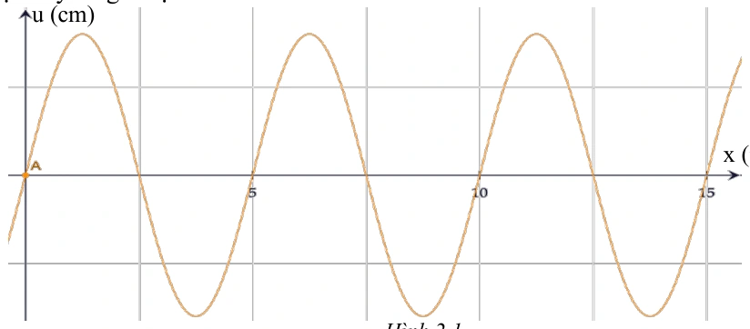
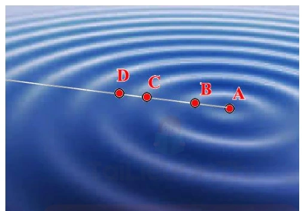
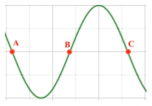
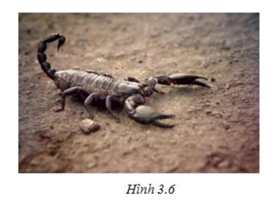
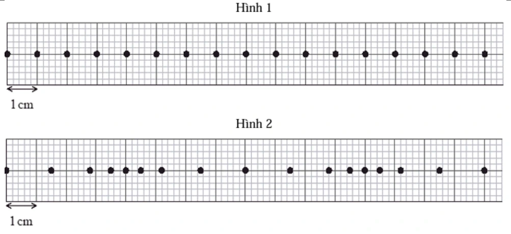
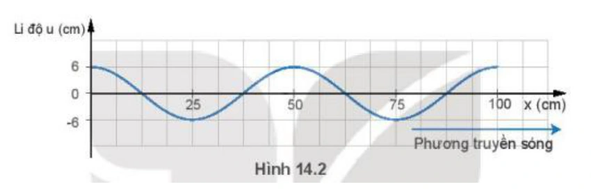
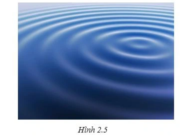
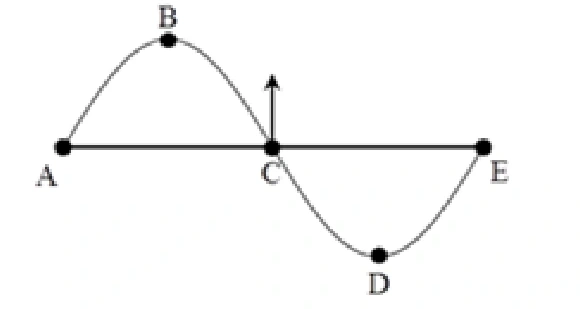

# Bài tập — Bài 1 — Đại cương sóng cơ và sự truyền sóng

> Hệ bài tập được biên soạn theo các dạng xuất hiện trong bộ tài liệu Vật lí 11 của dự án. Câu hỏi được giữ ngắn, trực tiếp; độ khó tăng dần và không cố tình thêm dữ kiện gây nhiễu.

[← Trở lại bài học](../../01-mechanical-wave-basics.md)

## Phần A — Trắc nghiệm 4 lựa chọn

### Bài 1 — Mức 1 — Nhận biết

Một sóng cơ có tần số $20$ Hz truyền với tốc độ $4$ m/s. Bước sóng là

A. $0,10$ m.
B. $0,20$ m.
C. $5$ m.
D. $80$ m.

??? success "Đáp án và lời giải"
    Chọn **B**. $\lambda=v/f=4/20=0,20$ m.

### Bài 2 — Mức 1 — Nhận biết

Phát biểu đúng về sóng cơ là

A. Sóng cơ truyền được trong chân không.
B. Khi sóng truyền, các phần tử môi trường chuyển dời theo sóng từ nguồn đến rất xa.
C. Sóng cơ truyền dao động và năng lượng qua môi trường.
D. Tốc độ truyền sóng chỉ phụ thuộc tần số nguồn.

??? success "Đáp án và lời giải"
    Chọn **C**. Sóng cơ cần môi trường vật chất và truyền trạng thái dao động/năng lượng, không mang các phần tử môi trường đi theo.

### Bài 3 — Mức 1 — Nhận biết

Một sóng có $\lambda=40$ cm. Hai điểm gần nhau nhất trên cùng phương truyền sóng dao động cùng pha cách nhau

A. $10$ cm.
B. $20$ cm.
C. $40$ cm.
D. $80$ cm.

??? success "Đáp án và lời giải"
    Chọn **C**. Hai điểm gần nhất cùng pha trên phương truyền sóng cách nhau một bước sóng.

## Phần B — Đúng/Sai

### Bài 4 — Mức 2 — Thông hiểu

Xét một sóng cơ hình sin:

a) Chu kì dao động của phần tử môi trường bằng chu kì nguồn.
b) Bước sóng là quãng đường sóng truyền trong một chu kì.
c) Sóng ngang luôn truyền được trong chất khí.
d) Khi truyền sang môi trường khác, tần số do nguồn quyết định thường không đổi.

??? success "Đáp án và lời giải"
    a) **Đúng**.
    b) **Đúng**.
    c) **Sai** đối với sóng cơ trong khối môi trường thông thường; chất khí không truyền sóng cơ ngang thể tích.
    d) **Đúng**: tần số liên tục qua mặt phân cách, còn tốc độ và bước sóng có thể đổi.

## Phần C — Trả lời ngắn

### Bài 5 — Mức 3 — Vận dụng

Một nguồn dao động với tần số $25$ Hz tạo sóng truyền với tốc độ $5$ m/s. Tính bước sóng và thời gian sóng truyền đi $3$ m.

??? success "Đáp án và lời giải"
    $\lambda=v/f=5/25=0,20$ m. Thời gian truyền $t=s/v=3/5=0,60$ s.

### Bài 6 — Mức 3 — Vận dụng

Một sóng có bước sóng $60$ cm. Tính khoảng cách ngắn nhất giữa hai điểm trên phương truyền sóng dao động ngược pha.

??? success "Đáp án và lời giải"
    Ngược pha khi $\Delta d=(k+1/2)\lambda$. Khoảng cách nhỏ nhất ứng với $k=0$: $\lambda/2=30$ cm.

### Bài 7 — Mức 3 — Vận dụng

Một sóng truyền qua điểm A rồi đến B cách A $1,5$ m sau $0,30$ s. Tần số nguồn là $4$ Hz. Tính tốc độ và bước sóng.

??? success "Đáp án và lời giải"
    $v=1,5/0,30=5$ m/s. $\lambda=v/f=5/4=1,25$ m.

## Phần D — Vận dụng và vận dụng cao

### Bài 8 — Mức 4 — Vận dụng cao

Một sóng hình sin truyền trên dây với tốc độ $2,4$ m/s. Hai điểm M, N trên cùng phương truyền cách nhau $45$ cm dao động lệch pha $3\pi/2$ rad theo độ lớn nhỏ nhất tương ứng với khoảng cách đó. Tính bước sóng và tần số.

??? success "Đáp án và lời giải"
    Độ lệch pha theo không gian: $|\Delta\varphi|=2\pi d/\lambda$. Với $d=0,45$ m và độ lệch pha đang xét là $3\pi/2$:

    $2\pi\cdot0,45/\lambda=3\pi/2$.

    Suy ra $\lambda=0,60$ m. Tần số $f=v/\lambda=2,4/0,60=4$ Hz.

## Ngân hàng bài tập mở rộng

> Các bài dưới đây được đánh số nối tiếp phần bài tập phía trên. Đề bài được trình bày bằng Markdown; chỉ đồ thị, hình vẽ hoặc sơ đồ thực sự cần thiết mới được giữ dưới dạng hình. Đáp án và lời giải được đặt trong nút mở rộng ngay dưới từng bài.

### Nhận biết — Trả lời ngắn

#### Bài 9

<!-- source-id: BT-Chuong-II-p24-q1-45 -->

Một nguồn sóng dao động điều hòa thực hiện 15 dao động trong thời gian 20 giây. Tốc độ
truyền sóng
5(
/ )
v
m s
=
. Bước sóng của sóng này có giá trị bao nhiêu? (Làm tròn đến chữ số thập
phân thứ 2 sau dấu phẩy)

??? success "Đáp án và lời giải"
    **Đáp án:** $6{,}67$
    **Hướng dẫn giải:**

    Dùng quan hệ $v=\lambda f=\lambda/T$; khi đọc đồ thị phải xác định đúng chu kì theo thời gian và bước sóng theo không gian.

    Bước sóng được tính theo công thức:

    Vậy kết quả cần tìm là **$6{,}67$**.
#### Bài 10

<!-- source-id: BT-Chuong-II-p37-q4-76 -->

Một sóng cơ truyền dọc theo trục Ox có phương trình là u
5cos(6 t
x)
=
π−π
 (cm), với t đo
bằng s, x đo bằng m. Khoảng cách giữa 3 gợn sóng liên tiếp trên phương truyền sóng cách nhau một
khoảng bao nhiêu (tính theo đơn vị mét) ?

??? success "Đáp án và lời giải"
    **Đáp án:** $12$
    **Hướng dẫn giải:**

    Dùng quan hệ $v=\lambda f=\lambda/T$; khi đọc đồ thị phải xác định đúng chu kì theo thời gian và bước sóng theo không gian.

    Vậy kết quả cần tìm là **$12$**.
#### Bài 11

<!-- source-id: BT-Chuong-II-p37-q5-77 -->

Hai điểm M, N lần lượt cùng nằm trên một phương truyền sóng và cách nhau một phần ba
bước sóng. Biên độ sóng không đổi trong quá trình truyền sóng. Tại một thời điểm, khi li độ dao
động của một phần tử M là 3 cm thì li của của phần tử tại N là – 3 cm. Tính biên độ sóng? (tính theo
đơn vị cm và là tròn đến số thập phân thứ hai)

??? success "Đáp án và lời giải"
    **Đáp án:** $3{,}46$
    **Hướng dẫn giải:**

    Dùng quan hệ $v=\lambda f=\lambda/T$; khi đọc đồ thị phải xác định đúng chu kì theo thời gian và bước sóng theo không gian.

    Độ lệch pha giữa M và N:
    Dùng đường tròn lượng giác ( hình 3.7 ) biểu diễn độ lệch pha suy ra:

    Vậy kết quả cần tìm là **$3{,}46$**.
#### Bài 12

<!-- source-id: BT-Chuong-II-p56-q1-125 -->

Một nguồn phát sóng trên mặt nước tạo dao động với tần số 100 Hz gây ra các sóng tròn lan rộng trên
mặt nước. Biết khoảng cách giữa 7 gợn lồi liên tiếp là 3 cm. Tốc độ truyền sóng trên mặt nước là bao nhiêu
(tính theo đơn vị m/s)?

??? success "Đáp án và lời giải"
    **Đáp án:** $50$
    **Hướng dẫn giải:**

    Dùng quan hệ $v=\lambda f=\lambda/T$; khi đọc đồ thị phải xác định đúng chu kì theo thời gian và bước sóng theo không gian.

    Khoảng cách giữa 7 gợn lồi liên tiếp bằng 6 bước sóng nên
    Tốc độ truyền sóng

    Vậy kết quả cần tìm là **$50$**.
#### Bài 13

<!-- source-id: BT-Chuong-II-p56-q5-129 -->

Tại điểm O trong lòng đất đang xảy ra dư chấn của một trận động đất. Ở điểm A trên mặt đất có một
trạm quan sát địa chấn. Tại thời điểm nào đó, một rung chuyển ở O tạo ra hai sóng cơ (một sóng dọc, một sóng
ngang) truyền thẳng đến A và tới A ở hai thời điểm cách nhau 15 s. Biết tốc độ truyền sóng dọc và tốc độ

truyền sóng ngang lần lượt là 8000 m/s và 5000 m/s. Khoảng cách từ O đến A là bao nhiêu (tính theo đơn vị
km)?

??? success "Đáp án và lời giải"
    **Đáp án:** $200$
    **Hướng dẫn giải:**

    Dùng quan hệ $v=\lambda f=\lambda/T$; khi đọc đồ thị phải xác định đúng chu kì theo thời gian và bước sóng theo không gian.

    Gọi s là khoảng cách từ tâm chấn động đất đến trạm quan trắc.
    Khoảng thời gian chênh lệch trạm quan trắc nhận được hai tín hiệu

    Vậy kết quả cần tìm là **$200$**.
#### Bài 14

<!-- source-id: BT-Chuong-II-p57-q6-130 -->

Một sóng ngang cơ học truyền trên một sợi dây đàn hồi với biên độ bằng 4 cm không đổi. Biết tần số
và tốc độ truyền sóng lần lượt là 4 Hz và 60 cm/s. Nếu khoảng cách gần nhất giữa hai điểm trên dây là 35 cm
thì khoảng cách xa nhất giữa chúng là bao nhiêu (tính theo đơn vị cm, làm tròn đến một chữ số thập phân sau
dấu phẩy)?

??? success "Đáp án và lời giải"
    **Đáp án:** $35{,}7$
    **Hướng dẫn giải:**

    Dùng quan hệ $v=\lambda f=\lambda/T$; khi đọc đồ thị phải xác định đúng chu kì theo thời gian và bước sóng theo không gian.

    → hai điểm dao động lệch pha một góc 2

    Vậy kết quả cần tìm là **$35{,}7$**.
#### Bài 15

<!-- source-id: BT-Chuong-II-p63-q5-157 -->

Sóng ngang truyền trên mặt chất lỏng với biên độ không đổi và tần số 10 Hz. Trên cùng phương truyền
sóng, ta thấy có hai điểm M và N mà khoảng cách của chúng luôn không đổi là 12 cm. Biết tốc độ có giá trị
trong khoảng 50 cm/s đến 70 cm/s. Giá trị của tốc độ sóng là bao nhiêu (tính theo đơn vị m/s)?

??? success "Đáp án và lời giải"
    **Đáp án:** $0{,}6$
    **Hướng dẫn giải:**

    Dùng quan hệ $v=\lambda f=\lambda/T$; khi đọc đồ thị phải xác định đúng chu kì theo thời gian và bước sóng theo không gian.

    Vậy kết quả cần tìm là **$0{,}6$**.
#### Bài 16

<!-- source-id: BT-Chuong-II-p63-q6-158 -->

Một sóng dọc truyền trong môi trường với bước sóng 15 cm, biên độ không đổi 5 3 cm. Gọi P và Q là
hai điểm cùng nằm trên một phương truyền sóng. Khi chưa có sóng truyền đến hai điểm P và Q nằm cách
nguồn các khoảng lần lượt là 20 cm và 30 cm. Khoảng cách xa nhất giữa hai phần tử môi trường tại P và Q khi
có sóng truyền qua là bao nhiêu (tính theo đơn vị m)?

??? success "Đáp án và lời giải"
    **Đáp án:** $0{,}25$
    **Hướng dẫn giải:**

    Dùng quan hệ $v=\lambda f=\lambda/T$; khi đọc đồ thị phải xác định đúng chu kì theo thời gian và bước sóng theo không gian.

    Phương trình dao động của phần tử P và Q lần lượt là
    Chủ đề 9 - THỰC HÀNH: ĐO TẦN SỐ CỦA SÓNG ÂM
    I. TÓM TẮT LÝ THUYẾT – PHƯƠNG PHÁP GIẢI CÁC DẠNG BÀI TẬP
    1. Giới thiệu và hướng dẫn sử dụng dao động kí điện tử
    Máy dao động kí điện tử có dao diện như hình 1.1 dưới đây
    Bước 1: Để khởi động máy dao động kí, ta bấm nút Power. Kết quả ta được dao diện như hình 1.2.

    Vậy kết quả cần tìm là **$0{,}25$**.
#### Bài 17

<!-- source-id: BT-Chuong-II-p208-q1-471 -->

Tính bước sóng của sóng? (tính theo mm)

??? success "Đáp án và lời giải"
    **Đáp án:** 8
    **Hướng dẫn giải:**

    Dùng quan hệ $v=\lambda f=\lambda/T$; khi đọc đồ thị phải xác định đúng chu kì theo thời gian và bước sóng theo không gian.

    Vậy kết quả cần tìm là **8**.
#### Bài 18

<!-- source-id: BT-Chuong-II-p208-q2-472 -->

Tốc độ sóng trên mặt nước là bao nhiêu? (tính theo m/s)

??? success "Đáp án và lời giải"
    **Đáp án:** $0{,}8$
    **Hướng dẫn giải:**

    Dùng quan hệ $v=\lambda f=\lambda/T$; khi đọc đồ thị phải xác định đúng chu kì theo thời gian và bước sóng theo không gian.

    Vậy kết quả cần tìm là **$0{,}8$**.
#### Bài 19

<!-- source-id: BT-Chuong-II-p208-q3-475 -->

Bước sóng là bao nhiêu? (tính theo cm)

??? success "Đáp án và lời giải"
    **Đáp án:** 4
    **Hướng dẫn giải:**

    Dùng quan hệ $v=\lambda f=\lambda/T$; khi đọc đồ thị phải xác định đúng chu kì theo thời gian và bước sóng theo không gian.

    Vậy kết quả cần tìm là **4**.
#### Bài 20

<!-- source-id: BT-Chuong-II-p208-q4-476 -->

Tính khoảng cách AB? (tính theo mét)

??? success "Đáp án và lời giải"
    **Đáp án:** $0{,}08$
    **Hướng dẫn giải:**

    Dùng quan hệ $v=\lambda f=\lambda/T$; khi đọc đồ thị phải xác định đúng chu kì theo thời gian và bước sóng theo không gian.

    Vậy kết quả cần tìm là **$0{,}08$**.
#### Bài 21

<!-- source-id: BT-Chuong-II-p209-q6-480 -->

Bước sóng của ánh sáng đơn sắc là bao nhiêu ? (tính theo μm )

??? success "Đáp án và lời giải"
    **Đáp án:** $0{,}75$
    **Hướng dẫn giải:**

    Dùng quan hệ $v=\lambda f=\lambda/T$; khi đọc đồ thị phải xác định đúng chu kì theo thời gian và bước sóng theo không gian.

    Vậy kết quả cần tìm là **$0{,}75$**.
#### Bài 22

<!-- source-id: BT-Chuong-II-p218-q1-505 -->

Bước sóng là bao nhiêu? (tính theo m)

??? success "Đáp án và lời giải"
    **Đáp án:** $0{,}5$
    **Hướng dẫn giải:**

    Dùng quan hệ $v=\lambda f=\lambda/T$; khi đọc đồ thị phải xác định đúng chu kì theo thời gian và bước sóng theo không gian.

    Vậy kết quả cần tìm là **$0{,}5$**.
#### Bài 23

<!-- source-id: BT-Chuong-II-p218-q2-506 -->

Tốc độ sóng trên dây bằng bao nhiêu? (tính theo mét/giây)

??? success "Đáp án và lời giải"
    **Đáp án:** $50$
    **Hướng dẫn giải:**

    Dùng quan hệ $v=\lambda f=\lambda/T$; khi đọc đồ thị phải xác định đúng chu kì theo thời gian và bước sóng theo không gian.

    Vậy kết quả cần tìm là **$50$**.
#### Bài 24

<!-- source-id: BT-Chuong-II-p218-q3-509 -->

Xác định bước sóng λ? (tính theo mét)

??? success "Đáp án và lời giải"
    **Đáp án:** $0{,}2$
    **Hướng dẫn giải:**

    Dùng quan hệ $v=\lambda f=\lambda/T$; khi đọc đồ thị phải xác định đúng chu kì theo thời gian và bước sóng theo không gian.

    Vậy kết quả cần tìm là **$0{,}2$**.
#### Bài 25

<!-- source-id: BT-Chuong-II-p218-q4-510 -->

Tốc độ truyền sóng trên mặt nước bằng bao nhiêu? (tính theo mét/giây)

??? success "Đáp án và lời giải"
    **Đáp án:** $0{,}4$
    **Hướng dẫn giải:**

    Dùng quan hệ $v=\lambda f=\lambda/T$; khi đọc đồ thị phải xác định đúng chu kì theo thời gian và bước sóng theo không gian.

    Vậy kết quả cần tìm là **$0{,}4$**.
#### Bài 26

<!-- source-id: BT-Chuong-II-p219-q6-514 -->

Số điểm có biên độ dao động đứng yên là bao nhiêu?

??? success "Đáp án và lời giải"
    **Đáp án:** 6
    **Hướng dẫn giải:**

    Dùng quan hệ $v=\lambda f=\lambda/T$; khi đọc đồ thị phải xác định đúng chu kì theo thời gian và bước sóng theo không gian.

    Vậy kết quả cần tìm là **6**.
### Nhận biết — Trắc nghiệm 4 lựa chọn

#### Bài 27

<!-- source-id: BT-Chuong-II-p9-q2-2 -->

Một nguồn sóng cơ học thực hiện dao động điều hoà, trong thời gian 60 s nguồn sóng thực
hiện được 30 dao động toàn phần. Sóng cơ do nguồn này tạo ra có chu kỳ

A. 60 s.

B. 0,5 s.

C. 2 s.

D. 30 s.

??? success "Đáp án và lời giải"
    **Đáp án:** C
    **Hướng dẫn giải:**

    Dùng quan hệ $v=\lambda f=\lambda/T$; khi đọc đồ thị phải xác định đúng chu kì theo thời gian và bước sóng theo không gian.

    Đối chiếu kết quả với các lựa chọn, phương án phù hợp là **C. 2 s.**
#### Bài 28

<!-- source-id: BT-Chuong-II-p9-q4-4 -->

Gọi v là tốc độ truyền sóng, T là chu kỳ sóng, f là tần số sóng và λlà bước sóng. Công
thức nào sau đây sai?

A. v
f
λ=
.

B. f
v
λ
=
.

C. T
v
λ
=
.

D. 1
f
T
=
.

??? success "Đáp án và lời giải"
    **Đáp án:** B
    **Hướng dẫn giải:**

    Dùng quan hệ $v=\lambda f=\lambda/T$; khi đọc đồ thị phải xác định đúng chu kì theo thời gian và bước sóng theo không gian.

    Đối chiếu kết quả với các lựa chọn, phương án phù hợp là **B. f v λ = .**
#### Bài 29

<!-- source-id: BT-Chuong-II-p9-q5-5 -->

Trong cùng một môi trường truyền sóng cơ học, tốc độ truyền sóng

A. càng lớn nếu tần số của sóng càng lớn.

B. càng lớn nếu tần số của sóng càng nhỏ.

C. càng lớn nếu tần số góc của sóng càng nhỏ.

D. có giá trị như nhau với mọi tần số.

??? success "Đáp án và lời giải"
    **Đáp án:** D
    **Hướng dẫn giải:**

    Dùng quan hệ $v=\lambda f=\lambda/T$; khi đọc đồ thị phải xác định đúng chu kì theo thời gian và bước sóng theo không gian.

    Đối chiếu kết quả với các lựa chọn, phương án phù hợp là **D. có giá trị như nhau với mọi tần số.**
#### Bài 30

<!-- source-id: BT-Chuong-II-p9-q6-6 -->

Tốc độ truyền sóng phụ thuộc vào

A. chu kỳ sóng.

B. môi trường truyền sóng.

C. tần số sóng.

D. biên độ sóng.

??? success "Đáp án và lời giải"
    **Đáp án:** B
    **Hướng dẫn giải:**

    Dùng quan hệ $v=\lambda f=\lambda/T$; khi đọc đồ thị phải xác định đúng chu kì theo thời gian và bước sóng theo không gian.

    Đối chiếu kết quả với các lựa chọn, phương án phù hợp là **B. môi trường truyền sóng.**
#### Bài 31

<!-- source-id: BT-Chuong-II-p9-q7-7 -->

Trong cùng một môi trường truyền sóng, bước sóng sẽ giảm nếu:

A. tăng chu kỳ sóng.

B. tăng biên độ sóng.

C. tăng tần số sóng.

D. tăng li độ sóng.

??? success "Đáp án và lời giải"
    **Đáp án:** C
    **Hướng dẫn giải:**

    Dùng quan hệ $v=\lambda f=\lambda/T$; khi đọc đồ thị phải xác định đúng chu kì theo thời gian và bước sóng theo không gian.

    Đối chiếu kết quả với các lựa chọn, phương án phù hợp là **C. tăng tần số sóng.**
#### Bài 32

<!-- source-id: BT-Chuong-II-p10-q9-9 -->

Sóng cơ học không truyền được trong môi trường

A. không khí.

B. thép.

C. dầu hoả.

D. chân không.

??? success "Đáp án và lời giải"
    **Đáp án:** D
    **Hướng dẫn giải:**

    Dùng quan hệ $v=\lambda f=\lambda/T$; khi đọc đồ thị phải xác định đúng chu kì theo thời gian và bước sóng theo không gian.

    Đối chiếu kết quả với các lựa chọn, phương án phù hợp là **D. chân không.**
#### Bài 33

<!-- source-id: BT-Chuong-II-p10-q10-10 -->

Một nguồn sóng có tần số 20 Hz, tạo ra sóng trên mặt nước. Biết sóng truyền đi với tốc độ
0,4 (m/s). Bước sóng được tạo ra trên mặt nước có giá trị

A. 2
λ=
cm .

B. 8
λ=
m.

C. 50
λ=
m.

D. 8
λ=
cm.

??? success "Đáp án và lời giải"
    **Đáp án:** A
    **Hướng dẫn giải:**

    Dùng quan hệ $v=\lambda f=\lambda/T$; khi đọc đồ thị phải xác định đúng chu kì theo thời gian và bước sóng theo không gian.

    Đối chiếu kết quả với các lựa chọn, phương án phù hợp là **A. 2 λ= cm .**
#### Bài 34

<!-- source-id: BT-Chuong-II-p10-q11-11 -->

Sóng cơ học không truyền được trong môi trường

A. không khí.

B. chân không.

C. chất lỏng.

D. chất rắn.

??? success "Đáp án và lời giải"
    **Đáp án:** B
    **Hướng dẫn giải:**

    Dùng quan hệ $v=\lambda f=\lambda/T$; khi đọc đồ thị phải xác định đúng chu kì theo thời gian và bước sóng theo không gian.

    Đối chiếu kết quả với các lựa chọn, phương án phù hợp là **B. chân không.**
#### Bài 35

<!-- source-id: BT-Chuong-II-p10-q12-12 -->

Một sóng cơ học lan truyền trên một sợi dây đàn hồi có hình dạng như hình 2.1 Bước sóng
của sóng cơ học này có giá trị

A. 2,5 m.

B. 10 m.

C. 5 m.

D. 15 m.

{ loading=lazy }

??? success "Đáp án và lời giải"
    **Đáp án:** A
    **Hướng dẫn giải:**
    Bước sóng là khoảng cách giữa hai điễm liên tiếp dao động cùng pha trên phương truyền sóng.
    u (cm)
    x (m)
    u (cm)
    Hình 2.1

    Từ hình 2.2 ta có thể suy ra bước sóng

#### Bài 36

<!-- source-id: BT-Chuong-II-p11-q13-13 -->

Một sóng truyền trên mặt chất lỏng với tần số 10 Hz. Biết khoảng cách giữa 5 gợn sóng liên
tiếp là 16 m. Tốc độ truyền sóng trên mặt nước là

A. 0,4 m/s

B. 8 m/s

C. 1,6 m/s

D. 4 m/s.

??? success "Đáp án và lời giải"
    **Đáp án:** D
    **Hướng dẫn giải:**
    Áp dụng công thức:

    Lại có:

#### Bài 37

<!-- source-id: BT-Chuong-II-p11-q14-14 -->

Một sóng có tần số 50 Hz trên trong một môi trường với vận tốc 340 m/s. Bước sóng của
nó là

A. 1,7 m.

B. 3,4 m.

C. 6,8 m.

D. 13,6 m.

??? success "Đáp án và lời giải"
    **Đáp án:** C
    **Hướng dẫn giải:**
    Tần số

    Tốc độ truyền sóng:

    Áp dụng công thức:

#### Bài 38

<!-- source-id: BT-Chuong-II-p11-q15-15 -->

Cường độ sóng được xác định bằng

A. Công suất của sóng truyền qua một đơn vị diện tích vuông góc với phương truyền sóng.

B. Năng lượng sóng truyền qua một đơn vị diện tích vuông góc với phương truyền sóng.

C. Năng lượng sóng truyền qua diện tích S vuông góc với phương truyền sóng, trong một

đơn vị thời gian.

D. Năng lượng sóng truyền qua diện tích S vuông góc với phương truyền sóng trong
 khoảng thời gian t.

??? success "Đáp án và lời giải"
    **Đáp án:** A
    **Hướng dẫn giải:**

    Dùng quan hệ $v=\lambda f=\lambda/T$; khi đọc đồ thị phải xác định đúng chu kì theo thời gian và bước sóng theo không gian.

    Đối chiếu kết quả với các lựa chọn, phương án phù hợp là **A. Công suất của sóng truyền qua một đơn vị diện tích vuông góc với phương truyền sóng.**
#### Bài 39

<!-- source-id: BT-Chuong-II-p12-q18-18 -->

Hình 2.4 bên mô tả quá trình sóng lan truyền trên bề mặt nước. Bước sóng là khoảng cách
giữa hai điểm

Hình 2.3

A. AB.

B. BC.

C. CD.

D. AC.

{ loading=lazy }

??? success "Đáp án và lời giải"
    **Hướng dẫn giải:**
    Các vị trí B và C là hai ngọn sóng liên tiếp trên cùng một phương truyền sóng. Do đó bước sóng
    của sóng nước bằng với đoạn BC.

#### Bài 40

<!-- source-id: BT-Chuong-II-p15-q30-30 -->

Một nguồn sóng dao động điều hòa. Khoảng thời gian giữa 9 lần liên tiếp ngọn sóng tại nhô
lên cao là 3,2 giây. Biết sóng truyền từ nguồn sóng cách bờ 5 m đến khi vào tới bờ mất 4 giây. Bước
sóng của sóng này có giá trị

A. 0,25 m.

B. 0,5 m.

C. 0,125 m.

D. 2,5 m.

??? success "Đáp án và lời giải"
    **Đáp án:** B
    **Hướng dẫn giải:**

    Dùng quan hệ $v=\lambda f=\lambda/T$; khi đọc đồ thị phải xác định đúng chu kì theo thời gian và bước sóng theo không gian.

    Ta có: Ngọn sóng nhô lên cao 9 lần tương ứng với 8 chu kỳ sóng.
    Tốc độ truyền sóng:
    Bước sóng của sóng là:

    Đối chiếu kết quả với các lựa chọn, phương án phù hợp là **B. 0,5 m.**
#### Bài 41

<!-- source-id: BT-Chuong-II-p16-q32-32 -->

Một nguồn sóng dao động điều hòa theo phương trình

$$
u=2\cos\left(\frac{2\pi}{5}t+\frac{\pi}{3}\right)\ \text{cm}.
$$

Biết tốc độ truyền sóng trong môi trường là $2$ m/s. Bước sóng do nguồn này tạo ra là

A. $5$ m.

B. $10$ m.

C. $2{,}5$ m.

D. $4$ m.

??? success "Đáp án và lời giải"
    **Đáp án: B.**
    **Hướng dẫn giải:**

    $\omega=\dfrac{2\pi}{5}$ rad/s nên $T=\dfrac{2\pi}{\omega}=5$ s. Do đó

    $$\lambda=vT=2\cdot5=10\ \text{m}.$$
#### Bài 42

<!-- source-id: BT-Chuong-II-p27-q1-51 -->

Một sóng cơ truyền từ không khí vào môi trường nước sau đó đi vào thủy tinh. Tốc độ của
sóng cơ truyền trong các môi trường nước
nc
v , không khí
kk
v và thủy tinh
ttv được sắp xếp theo thứ
tự tăng dần là

A. ,
,
nc
kk
tt
v
v
v

B. ,
,
nc
tt
kk
v
v v

C. nc
kk
tt
v
v
v
=
=

D. ,
,
kk
nc
tt
v
v
v

??? success "Đáp án và lời giải"
    **Đáp án:** D
    **Hướng dẫn giải:**

    Dùng quan hệ $v=\lambda f=\lambda/T$; khi đọc đồ thị phải xác định đúng chu kì theo thời gian và bước sóng theo không gian.

    Đối chiếu kết quả với các lựa chọn, phương án phù hợp là **D. , , kk nc tt v v v**
#### Bài 43

<!-- source-id: BT-Chuong-II-p27-q2-52 -->

Đơn vị nào sau đây không là đơn cường độ sóng ?

A. 2 .
J
m

B. 2 .
W
m

C. 2 .
.
J
s m

D. .
.
N
s m

??? success "Đáp án và lời giải"
    **Đáp án:** A
    **Hướng dẫn giải:**

    Dùng quan hệ $v=\lambda f=\lambda/T$; khi đọc đồ thị phải xác định đúng chu kì theo thời gian và bước sóng theo không gian.

    Đối chiếu kết quả với các lựa chọn, phương án phù hợp là **A. 2 . J m**
#### Bài 44

<!-- source-id: BT-Chuong-II-p27-q4-54 -->

Trong quá trình truyền sóng đại lượng không được truyền đi là

A. năng lượng.

B. xung lượng.

C. biến dạng đàn hồi.

D. các phần tử vật chất.

??? success "Đáp án và lời giải"
    **Đáp án:** D
    **Hướng dẫn giải:**

    Dùng quan hệ $v=\lambda f=\lambda/T$; khi đọc đồ thị phải xác định đúng chu kì theo thời gian và bước sóng theo không gian.

    Đối chiếu kết quả với các lựa chọn, phương án phù hợp là **D. các phần tử vật chất.**
#### Bài 45

<!-- source-id: BT-Chuong-II-p27-q5-55 -->

Một nguồn sóng dao động điều hòa theo phương trình
(
)
2.cos 5
u
t
π
=
. Sóng do nguồn này
tạo ra có tần số

A. 5 Hz.

B. 2,5 Hz.

C. 10 Hz.

D. 15,7Hz.

??? success "Đáp án và lời giải"
    **Đáp án:** B
    **Hướng dẫn giải:**

    Dùng quan hệ $v=\lambda f=\lambda/T$; khi đọc đồ thị phải xác định đúng chu kì theo thời gian và bước sóng theo không gian.

    Tần số sóng

    Đối chiếu kết quả với các lựa chọn, phương án phù hợp là **B. 2,5 Hz.**
#### Bài 46

<!-- source-id: BT-Chuong-II-p28-q8-58 -->

Công thức nào sau đây tính bước sóng là sai?

A. .v f
λ=
.

B. .v T
λ=
.

C. v
f
λ=
.

D. .2
v π
λ
ω
=
.

??? success "Đáp án và lời giải"
    **Đáp án:** A
    **Hướng dẫn giải:**

    Dùng quan hệ $v=\lambda f=\lambda/T$; khi đọc đồ thị phải xác định đúng chu kì theo thời gian và bước sóng theo không gian.

    Đối chiếu kết quả với các lựa chọn, phương án phù hợp là **A. .v f λ= .**
#### Bài 47

<!-- source-id: BT-Chuong-II-p29-q12-62 -->

Một sóng hình sin truyền theo chiều dương của trục $Ox$, với phương trình dao động của nguồn tại $O$ là

$$u_O=2\cos(20\pi t)\ \text{cm}.$$

Tại điểm $M$ theo hướng $Ox$, cách $O$ một phần ba bước sóng, phần tử môi trường dao động với phương trình nào?

A. $u_M=2\cos\left(20\pi t+\dfrac{2\pi}{3}\right)$ cm.

B. $u_M=2\cos\left(10\pi t+\dfrac{2\pi}{3}\right)$ cm.

C. $u_M=2\cos\left(10\pi t-\dfrac{2\pi}{3}\right)$ cm.

D. $u_M=2\cos\left(20\pi t-\dfrac{2\pi}{3}\right)$ cm.

??? success "Đáp án và lời giải"
    **Đáp án: D.**
    **Hướng dẫn giải:**

    Sóng truyền theo chiều dương nên điểm $M$ trễ pha so với nguồn một lượng

    $\displaystyle \Delta\varphi=\frac{2\pi x}{\lambda}=\frac{2\pi}{3}.$

    Do đó

    $$u_M=2\cos\left(20\pi t-\frac{2\pi}{3}\right)\ \text{cm}.$$
#### Bài 48

<!-- source-id: BT-Chuong-II-p30-q13-63 -->

Một người ngồi bên bờ biển thấy trong khoảng thời gian 9 giây có 19 ngọn sóng truyền qua
trước mặt. Biết khoảng cách giữa hai ngọn sóng liên tiếp là 3m. Trong thời gian 5 s sóng truyền được
quãng đường là

A. 20 m.

B. 30 m.

C. 15 m.

D. 25 m.

??? success "Đáp án và lời giải"
    **Đáp án:** B
    **Hướng dẫn giải:**

    Dùng quan hệ $v=\lambda f=\lambda/T$; khi đọc đồ thị phải xác định đúng chu kì theo thời gian và bước sóng theo không gian.

    Chu kỳ sóng:
    Tốc độ truyền sóng:
    Quãng đường sóng truyền:

    Đối chiếu kết quả với các lựa chọn, phương án phù hợp là **B. 30 m.**
#### Bài 49

<!-- source-id: BT-Chuong-II-p30-q14-64 -->

Hai điểm A và C trong hình 3.1 cách nhau một bước sóng do

A. phần tử tại A và C cùng trạng thái.

B. phần tử tại A và C cùng vị trí.

C. phần tử tại A và C cùng vị tốc độ.

D. phần tử tại A và C cùng vị gia tốc.

{ loading=lazy }

??? success "Đáp án và lời giải"
    **Đáp án:** A
    **Hướng dẫn giải:**

    Dùng quan hệ $v=\lambda f=\lambda/T$; khi đọc đồ thị phải xác định đúng chu kì theo thời gian và bước sóng theo không gian.

    Đối chiếu kết quả với các lựa chọn, phương án phù hợp là **A. phần tử tại A và C cùng trạng thái.**
#### Bài 50

<!-- source-id: BT-Chuong-II-p44-q1-79 -->

Để phân loại sóng dọc và sóng ngang người ta dựa vào

A. tốc độ truyền sóng và bước sóng.

B. phương truyền sóng và tần số sóng.

C. phương dao động và phương truyền sóng.

D. phương dao động và tốc độ truyền sóng.

??? success "Đáp án và lời giải"
    **Đáp án:** C
    **Hướng dẫn giải:**

    Dùng quan hệ $v=\lambda f=\lambda/T$; khi đọc đồ thị phải xác định đúng chu kì theo thời gian và bước sóng theo không gian.

    Đối chiếu kết quả với các lựa chọn, phương án phù hợp là **C. phương dao động và phương truyền sóng.**
#### Bài 51

<!-- source-id: BT-Chuong-II-p44-q2-80 -->

Sóng dọc là sóng có phương dao động

A. trùng với phương truyền sóng.

B. nằm ngang.

C. vuông góc với phương truyền sóng.

D. thẳng đứng.

??? success "Đáp án và lời giải"
    **Đáp án:** A
    **Hướng dẫn giải:**

    Dùng quan hệ $v=\lambda f=\lambda/T$; khi đọc đồ thị phải xác định đúng chu kì theo thời gian và bước sóng theo không gian.

    Đối chiếu kết quả với các lựa chọn, phương án phù hợp là **A. trùng với phương truyền sóng.**
#### Bài 52

<!-- source-id: BT-Chuong-II-p44-q3-81 -->

Sóng ngang là sóng có phương dao động của các phần tử môi trường và phương truyền sóng hợp với
nhau một góc

A. 30o

B. 60o.

C. 90o.

D. 0o.

??? success "Đáp án và lời giải"
    **Đáp án:** C
    **Hướng dẫn giải:**

    Dùng quan hệ $v=\lambda f=\lambda/T$; khi đọc đồ thị phải xác định đúng chu kì theo thời gian và bước sóng theo không gian.

    Đối chiếu kết quả với các lựa chọn, phương án phù hợp là **C. 90o.**
#### Bài 53

<!-- source-id: BT-Chuong-II-p44-q4-82 -->

Trong sự truyền sóng cơ, biên độ dao động của các phần tử môi trường có sóng truyền qua được gọi là

A. chu kì của sóng.

B. biên độ của sóng.

C. tốc độ truyền sóng.

D. năng lượng sóng.

??? success "Đáp án và lời giải"
    **Đáp án:** B
    **Hướng dẫn giải:**

    Dùng quan hệ $v=\lambda f=\lambda/T$; khi đọc đồ thị phải xác định đúng chu kì theo thời gian và bước sóng theo không gian.

    Đối chiếu kết quả với các lựa chọn, phương án phù hợp là **B. biên độ của sóng.**
#### Bài 54

<!-- source-id: BT-Chuong-II-p44-q6-84 -->

Sóng ngang (sóng cơ học) truyền được trong các môi trường

A. chất rắn và trong lòng chất lỏng.

B. chất khí và trong lòng chất rắn.

C. chất rắn và bề mặt chất lỏng.

D. chất khí và bề mặt chất rắn.

??? success "Đáp án và lời giải"
    **Đáp án:** C
    **Hướng dẫn giải:**

    Dùng quan hệ $v=\lambda f=\lambda/T$; khi đọc đồ thị phải xác định đúng chu kì theo thời gian và bước sóng theo không gian.

    Đối chiếu kết quả với các lựa chọn, phương án phù hợp là **C. chất rắn và bề mặt chất lỏng.**
#### Bài 55

<!-- source-id: BT-Chuong-II-p44-q7-85 -->

Đối với sóng cơ học, sóng dọc truyền được trong các môi trường

A. rắn, lỏng, chân không.

B. rắn, lỏng, khí.

C. rắn, khí, chân không.

D. lỏng, khí, chân không.

??? success "Đáp án và lời giải"
    **Đáp án:** B
    **Hướng dẫn giải:**

    Dùng quan hệ $v=\lambda f=\lambda/T$; khi đọc đồ thị phải xác định đúng chu kì theo thời gian và bước sóng theo không gian.

    Đối chiếu kết quả với các lựa chọn, phương án phù hợp là **B. rắn, lỏng, khí.**
#### Bài 56

<!-- source-id: BT-Chuong-II-p45-q9-87 -->

Chọn phát biểu sai.

A. Sóng dọc là sóng mà phương dao động của các phần tử vật chất nơi sóng truyền qua trùng với
phương truyền sóng.

B. Sóng cơ không truyền được trong chân không.

C. Sóng ngang là sóng mà phương dao động của các phần tử vật chất nơi sóng truyền qua vuông góc
với phương truyền sóng.

D. Khi sóng truyền đi, các phần tử vật chất nơi sóng truyền qua cùng truyền đi theo sóng.

??? success "Đáp án và lời giải"
    **Đáp án:** D
    **Hướng dẫn giải:**

    Dùng quan hệ $v=\lambda f=\lambda/T$; khi đọc đồ thị phải xác định đúng chu kì theo thời gian và bước sóng theo không gian.

    Đối chiếu kết quả với các lựa chọn, phương án phù hợp là **D. Khi sóng truyền đi, các phần tử vật chất nơi sóng truyền qua cùng truyền đi theo sóng.**
#### Bài 57

<!-- source-id: BT-Chuong-II-p48-q25-103 -->

Một sóng ngang tần số 50 Hz truyền theo phương nằm ngang với tốc độ truyền sóng là 4 m/s. Bước
sóng của sóng trên là

A. 4 cm.

B. 12,5 cm.

C. 8 cm.

D. 200 cm.

??? success "Đáp án và lời giải"
    **Đáp án:** C
    **Hướng dẫn giải:**

    Dùng quan hệ $v=\lambda f=\lambda/T$; khi đọc đồ thị phải xác định đúng chu kì theo thời gian và bước sóng theo không gian.

    Đối chiếu kết quả với các lựa chọn, phương án phù hợp là **C. 8 cm.**
#### Bài 58

<!-- source-id: BT-Chuong-II-p50-q36-114 -->

Một người quan sát mặt biển thấy có 5 ngọn sóng đi qua trước mặt mình trong khoảng 10 s và đo
được khoảng cách giữa 2 ngọn sóng liên tiếp là 5 m. Xem sóng biển là sóng ngang. Tốc độ truyền sóng là

A. 2 m/s.

B. 4 m/s.

C. 6 m/s.

D. 8 m/s.

??? success "Đáp án và lời giải"
    **Hướng dẫn giải:**

    Dùng quan hệ $v=\lambda f=\lambda/T$; khi đọc đồ thị phải xác định đúng chu kì theo thời gian và bước sóng theo không gian.

    Thời gian 5 ngọn sóng đí qua chính bằng 4 lần chu kì nên 4
    Khoảng cách giữa 2 ngọn sóng liên tiếp chính bằng bước sóng nên
    Tốc độ truyền sóng
#### Bài 59

<!-- source-id: BT-Chuong-II-p51-q37-115 -->

Tại một điểm trên mặt nước có một nguồn dao động với tần số 120 Hz, tạo ra sóng ổn định. Tốc độ
truyền sóng là 15 m/s. Xét 5 gợn sóng liên tiếp trên một phương truyền sóng, ở một phía so với nguồn, gợn thứ
nhất cách gợn thứ năm một khoảng

A. 0,1 m.

B. 0,3 m.

C. 0,5 m.

D. 0,7 m.

??? success "Đáp án và lời giải"
    **Đáp án:** C
    **Hướng dẫn giải:**

    Dùng quan hệ $v=\lambda f=\lambda/T$; khi đọc đồ thị phải xác định đúng chu kì theo thời gian và bước sóng theo không gian.

    Khoảng cách gợn thứ nhất và gợn thứ năm là 4

    Đối chiếu kết quả với các lựa chọn, phương án phù hợp là **C. 0,5 m.**
#### Bài 60

<!-- source-id: BT-Chuong-II-p51-q39-117 -->

P và Q là hai điểm trên mặt nước cách nhau một khoảng 20 cm. Tại một điểm O trên đường
thẳng PQ và nằm ngoài đoạn PQ, người ta đặt nguồn dao động điều hòa theo phương vuông góc với mặt nước
với phương trình
cos
u
t
a
ω
=
cm, tạo ra sóng trên mặt nước với bước sóng 15 cm. Khoảng cách gần nhất giữa
hai phần tử môi trường tại P và Q khi có bước sóng truyền qua là

A. 15 m.

B. 20 m.

C. 5 m.

D. 35 m.

??? success "Đáp án và lời giải"
    **Đáp án:** B
    **Hướng dẫn giải:**

    Dùng quan hệ $v=\lambda f=\lambda/T$; khi đọc đồ thị phải xác định đúng chu kì theo thời gian và bước sóng theo không gian.

    Khoảng cách gần nhất giữa hai phần tử môi trường tại P và Q khi có bước sóng truyền qua

    Đối chiếu kết quả với các lựa chọn, phương án phù hợp là **B. 20 m.**
#### Bài 61

<!-- source-id: BT-Chuong-II-p58-q1-131 -->

Sóng ngang là sóng có phương dao động

A. trùng với phương truyền sóng.

B. nằm ngang.

C. vuông góc với phương truyền sóng.

D. thẳng đứng.

??? success "Đáp án và lời giải"
    **Đáp án:** C
    **Hướng dẫn giải:**

    Dùng quan hệ $v=\lambda f=\lambda/T$; khi đọc đồ thị phải xác định đúng chu kì theo thời gian và bước sóng theo không gian.

    Đối chiếu kết quả với các lựa chọn, phương án phù hợp là **C. vuông góc với phương truyền sóng.**
#### Bài 62

<!-- source-id: BT-Chuong-II-p58-q2-132 -->

Sóng dọc là sóng có phương dao động của các phần tử môi trường và phương truyền sóng hợp với nhau
một góc

A. 30o.

B. 60o.

C. 90o.

D. 0o.

??? success "Đáp án và lời giải"
    **Đáp án:** D
    **Hướng dẫn giải:**

    Dùng quan hệ $v=\lambda f=\lambda/T$; khi đọc đồ thị phải xác định đúng chu kì theo thời gian và bước sóng theo không gian.

    Đối chiếu kết quả với các lựa chọn, phương án phù hợp là **D. 0o.**
#### Bài 63

<!-- source-id: BT-Chuong-II-p58-q3-133 -->

Đối với sóng cơ học, sóng dọc không truyền được trong

A. chân không.

B. kim loại.

C. không khí.

D. nước.

??? success "Đáp án và lời giải"
    **Đáp án:** A
    **Hướng dẫn giải:**

    Dùng quan hệ $v=\lambda f=\lambda/T$; khi đọc đồ thị phải xác định đúng chu kì theo thời gian và bước sóng theo không gian.

    Đối chiếu kết quả với các lựa chọn, phương án phù hợp là **A. chân không.**
#### Bài 64

<!-- source-id: BT-Chuong-II-p58-q5-135 -->

Trong sự truyền sóng cơ, chu kì dao động của một phần từ môi trường có sóng truyền qua gọi là

A. chu kì của sóng.

B. biên độ của sóng.

C. tốc độ truyền sóng.

D. năng lượng sóng.

??? success "Đáp án và lời giải"
    **Đáp án:** A
    **Hướng dẫn giải:**

    Dùng quan hệ $v=\lambda f=\lambda/T$; khi đọc đồ thị phải xác định đúng chu kì theo thời gian và bước sóng theo không gian.

    Đối chiếu kết quả với các lựa chọn, phương án phù hợp là **A. chu kì của sóng.**
#### Bài 65

<!-- source-id: BT-Chuong-II-p58-q8-138 -->

Nhận định nào sau đây không đúng khi nói về sóng?

A. Sóng cơ là dao động cơ lan truyền trong một môi trường đàn hồi.

B. Cường độ sóng là tốc độ lan truyền biến dạng được truyền qua một đơn vị diện tích vuông góc với

phương truyền sóng trong một đơn vị thời gian.

C. Sóng ánh sáng có bản chất là sóng điện từ.

D. Đối với sóng cơ, cả sóng dọc và sóng ngang đều không truyền được trong chân không.

??? success "Đáp án và lời giải"
    **Đáp án:** B
    **Hướng dẫn giải:**

    Dùng quan hệ $v=\lambda f=\lambda/T$; khi đọc đồ thị phải xác định đúng chu kì theo thời gian và bước sóng theo không gian.

    Đối chiếu kết quả với các lựa chọn, phương án phù hợp là **B. Cường độ sóng là tốc độ lan truyền biến dạng được truyền qua một đơn vị diện tích vuông góc với phương truyền sóng trong một đơn vị thời gian.**
#### Bài 66

<!-- source-id: BT-Chuong-II-p58-q9-139 -->

Sóng thần là hiện tượng các đợt sóng rất lớn được hình thành và di chuyển rất nhanh trên một quy mô
lớn. Cơn sóng thần xảy ra ở bờ biển Sumatra (Indonesia) năm 2004 được biết là một trong những thiên tai gây
ra nhiều thiệt hại nhất trong lịch sử thế giới hiện đại. Những hình ảnh từ vệ tinh nhân tạo cho thấy khoảng cách
giữa hai đỉnh sóng liên tiếp của cơn sóng thần này vào khoảng 800 km và chu kì là khoảng 1 giờ. Tốc độ của
cơn sóng thần này là

A. 800 km/h.

B. 200 km/h.

C. 800 m/s.

D. 200 m/s.
??? success "Đáp án và lời giải"
    **Đáp án:** A
    **Hướng dẫn giải:**

    Dùng quan hệ $v=\lambda f=\lambda/T$; khi đọc đồ thị phải xác định đúng chu kì theo thời gian và bước sóng theo không gian.

    Đối chiếu kết quả với các lựa chọn, phương án phù hợp là **A. 800 km/h.**
#### Bài 67

<!-- source-id: BT-Chuong-II-p59-q10-140 -->

Đơn vị của cường độ sóng là

A. J/s.

B. W/m2.

C. Wm2.

D. Js.

??? success "Đáp án và lời giải"
    **Đáp án:** B
    **Hướng dẫn giải:**

    Dùng quan hệ $v=\lambda f=\lambda/T$; khi đọc đồ thị phải xác định đúng chu kì theo thời gian và bước sóng theo không gian.

    Đối chiếu kết quả với các lựa chọn, phương án phù hợp là **B. W/m2.**
#### Bài 68

<!-- source-id: BT-Chuong-II-p59-q13-143 -->

Khi sóng truyền từ một nguồn điểm trong không gian đồng nhất và đẳng hướng và không hấp thụ
năng lượng sóng, năng lượng dao động của một phần tử môi trường trên phương truyền sóng sẽ

A. giảm tỷ lệ với khoảng cách tới nguồn.

B. giảm tỉ lệ với bình phương quãng đường truyền sóng.

C. tăng tỷ lệ với khoảng cách tới nguồn.

D. tăng tỉ lệ với bình phương quãng đường truyền

??? success "Đáp án và lời giải"
    **Đáp án:** B
    **Hướng dẫn giải:**

    Dùng quan hệ $v=\lambda f=\lambda/T$; khi đọc đồ thị phải xác định đúng chu kì theo thời gian và bước sóng theo không gian.

    Đối chiếu kết quả với các lựa chọn, phương án phù hợp là **B. giảm tỉ lệ với bình phương quãng đường truyền sóng.**
#### Bài 69

<!-- source-id: BT-Chuong-II-p60-q18-148 -->

Một sóng ngang cơ học truyền trên một sợi dây đàn hồi với biên độ bằng 5 cm không đổi. Biết tần số
và tốc độ truyền sóng lần lượt là 5 Hz và 100 cm/s. Nếu khoảng cách gần nhất giữa hai điểm trên dây là 30 cm
thì khoảng cách xa nhất giữa chúng xấp xỉ bằng

A. 31,2 cm.

B. 30,8 cm.

C. 31,6 cm.

D. 30,4 cm.

??? success "Đáp án và lời giải"
    **Đáp án:** C
    **Hướng dẫn giải:**

    Dùng quan hệ $v=\lambda f=\lambda/T$; khi đọc đồ thị phải xác định đúng chu kì theo thời gian và bước sóng theo không gian.

    Khoảng cách gần nhất giữa hai điểm
    → hai điểm ngược pha.
    Khoảng cách xa nhất giữa hai điểm

    Đối chiếu kết quả với các lựa chọn, phương án phù hợp là **C. 31,6 cm.**
#### Bài 70

<!-- source-id: BT-Chuong-II-p194-q1-425 -->

Một sóng cơ có tần số f, truyền trên dây đàn hồi với tốc độ truyền sóng v và bước sóng λ. Hệ
thức đúng là

A. v
f
λ
=
.

B. f
v
λ
=
.

C. v
f
λ
=
.

D. 2
v
f
πλ
=
.

??? success "Đáp án và lời giải"
    **Đáp án:** A
    **Hướng dẫn giải:**

    Dùng quan hệ $v=\lambda f=\lambda/T$; khi đọc đồ thị phải xác định đúng chu kì theo thời gian và bước sóng theo không gian.

    Đối chiếu kết quả với các lựa chọn, phương án phù hợp là **A. v f λ = .**
#### Bài 71

<!-- source-id: BT-Chuong-II-p194-q3-427 -->

Phát biểu nào sau đây về đại lượng đặc trưng của sóng cơ không đúng?

A. Chu kì của sóng chính bằng chu kì dao động của các phần tử dao động.

B. Tần số của sóng chính bằng tần số dao động của các phần tử dao động.

C. Tốc độ của sóng chính bằng tốc độ dao động của các phần tử dao động.

D. Bước sóng là quãng đường sóng truyền đi được trong một chu kì.

??? success "Đáp án và lời giải"
    **Đáp án:** C
    **Hướng dẫn giải:**
    Tốc độ lan truyền sóng cơ là tốc độ lan truyền pha dao động được tính bằng v = λ/T = λf. Còn tốc độ
    dao động của các phần tử dao động được tính bằng v = u’(t).

#### Bài 72

<!-- source-id: BT-Chuong-II-p194-q4-428 -->

Với một sóng nhất định, tốc độ truyền sóng phụ thuộc vào

A. năng lượng sóng.

B. tần số dao động.

C. môi trường truyền sóng.

D. bước sóng.

??? success "Đáp án và lời giải"
    **Đáp án:** C
    **Hướng dẫn giải:**
    Tốc độ truyền sóng phụ thuộc vào bản chất của môi trường truyền sóng.

#### Bài 73

<!-- source-id: BT-Chuong-II-p194-q5-429 -->

Một sóng cơ học lan truyền trong một môi trường tốc độ v. Bước sóng của sóng này trong
môi trường đó là λ. Chu kì dao động của sóng có biểu thức là

A. T = v/λ.

B. T = v.λ.

C. T = λ/v.

D. T = 2πv/λ.

??? success "Đáp án và lời giải"
    **Hướng dẫn giải:**

    Dùng quan hệ $v=\lambda f=\lambda/T$; khi đọc đồ thị phải xác định đúng chu kì theo thời gian và bước sóng theo không gian.
#### Bài 74

<!-- source-id: BT-Chuong-II-p195-q8-432 -->

Một sóng có tần số 120 Hz truyền trong một môi trường với tốc độ 60 m/s. Bước sóng của nó
là

A. 1,0 m.

B. 2,0 m.

C. 0,5 m.

D. 0,25 m.

??? success "Đáp án và lời giải"
    **Đáp án:** C
    **Hướng dẫn giải:**

    Dùng quan hệ $v=\lambda f=\lambda/T$; khi đọc đồ thị phải xác định đúng chu kì theo thời gian và bước sóng theo không gian.

    Đối chiếu kết quả với các lựa chọn, phương án phù hợp là **C. 0,5 m.**
#### Bài 75

<!-- source-id: BT-Chuong-II-p195-q9-433 -->

Sóng cơ lan truyền trong môi trường đàn hồi với tốc độ v không đổi, khi tăng tần số sóng lên
2 lần thì bước sóng

A. tăng 2 lần.

B. tăng 1,5 lần.

C. không đổi.

D. giảm 2 lần.

??? success "Đáp án và lời giải"
    **Đáp án:** D
    **Hướng dẫn giải:**
    v
    f
    λ=

    V không đổi, bước sóng tỉ lệ nghịch với tần số → tần số tăng 2 lần thì bước sóng giảm 2 lần.

#### Bài 76

<!-- source-id: BT-Chuong-II-p196-q11-435 -->

Khi nói về sóng ngắn, phát biểu nào sau đây sai?

A. Sóng ngắn phản xạ tốt trên tầng điện li.

B. Sóng ngắn không truyền được trong chân không.

C. Sóng ngắn phản xạ tốt trên mặt đất.

D. Sóng ngắn có mang năng lượng.

??? success "Đáp án và lời giải"
    **Đáp án:** B
    **Hướng dẫn giải:**
    Sóng ngắn là sóng điện từ có bước sóng nhỏ vẫn truyền được trong chân không.

#### Bài 77

<!-- source-id: BT-Chuong-II-p196-q12-436 -->

Ánh sáng đơn sắc có bước sóng 0,75μm ứng với màu

A. Lục.

B. Đỏ.

C. Tím.

D. Chàm.

??? success "Đáp án và lời giải"
    **Đáp án:** B
    **Hướng dẫn giải:**
    Ánh sáng đơn sắc có bước sóng 0,75μm ứng với màu đỏ.

#### Bài 78

<!-- source-id: BT-Chuong-II-p210-q1-483 -->

Với một sóng nhất định, tốc độ truyền sóng phụ thuộc vào

A. năng lượng sóng.

B. tần số dao động.

C. môi trường truyền sóng.

D. bước sóng.

??? success "Đáp án và lời giải"
    **Đáp án:** C
    **Hướng dẫn giải:**
    Với một sóng nhất định, tốc độ truyền sóng phụ thuộc vào bản chất của môi trường.

#### Bài 79

<!-- source-id: BT-Chuong-II-p211-q3-485 -->

Một sóng có tần số 120 Hz truyền trong một môi trường với tốc độ 60 m/s. Bước sóng của nó
là

A. 1,0 m.

B. 2,0 m.

C. 0,5 m.

D. 0,25 m.

??? success "Đáp án và lời giải"
    **Đáp án:** C
    **Hướng dẫn giải:**

    Dùng quan hệ $v=\lambda f=\lambda/T$; khi đọc đồ thị phải xác định đúng chu kì theo thời gian và bước sóng theo không gian.

    Đối chiếu kết quả với các lựa chọn, phương án phù hợp là **C. 0,5 m.**
#### Bài 80

<!-- source-id: BT-Chuong-II-p211-q6-488 -->

Một sóng lan truyền với tốc độ v = 200 m/s có bước sóng λ = 4 m. Chu kì dao động của sóng
là

A. T = 0,02 s.

B. T = 50 s.

C. T = 1,25 s.

D. T = 0,2 s.

??? success "Đáp án và lời giải"
    **Đáp án:** A
    **Hướng dẫn giải:**

    Dùng quan hệ $v=\lambda f=\lambda/T$; khi đọc đồ thị phải xác định đúng chu kì theo thời gian và bước sóng theo không gian.

    Đối chiếu kết quả với các lựa chọn, phương án phù hợp là **A. T = 0,02 s.**
#### Bài 81

<!-- source-id: BT-Chuong-II-p211-q7-489 -->

Một điểm A trên mặt nước dao động với tần số 100 Hz. Trên mặt nước người ta đo được
khoảng cách giữa 7 gợn lồi liên tiếp là 3 cm. Khi đó tốc độ truyền sóng trên mặt nước là

A. 50
v =
cm/s.

B. 50
v =
m/s.

C. 5
v = cm/s.

D. 0,5
v =
cm/s.

??? success "Đáp án và lời giải"
    **Đáp án:** A
    **Hướng dẫn giải:**

    Dùng quan hệ $v=\lambda f=\lambda/T$; khi đọc đồ thị phải xác định đúng chu kì theo thời gian và bước sóng theo không gian.

    Đối chiếu kết quả với các lựa chọn, phương án phù hợp là **A. 50 v = cm/s.**
### Nhận biết — Đúng/Sai

#### Bài 82

<!-- source-id: BT-Chuong-II-p22-q1-41 -->

Một sóng cơ học truyền đi trong nước với tốc độ 2 m/s, tần số dao động của nguồn sóng là 5
Hz.

a) Khi sóng truyền từ nước ra ngoài không khí, tần số sóng trong không khí là 5 Hz.
b) Bước sóng của sóng này trong nước là 10 m
c) Khoảng cách giữa 3 ngọn sóng liên tiếp trên phương truyền sóng là 0,8 m.
d) Bước sóng của sóng này khi truyền sang môi trường không khí giảm đi.

??? success "Đáp án và lời giải"
    **Hướng dẫn giải:**
    a. Tần số sóng cơ không đổi khi truyền từ môi trường này sang môi trường khác.
    b. Bước sóng
    .
    c. Ba ngọn sóng liên tiếp cách nhau
     = 0,8 (m).
    d. Khi sóng truyền từ nước ra không khí thì vận tốc sóng giảm. Bước sóng tỉ lệ với tốc độ. Do đó
    bước sóng giảm khi truyền từ nước ra không khí.

#### Bài 83

<!-- source-id: BT-Chuong-II-p32-q2-70 -->

Sóng tại nguồn $O$ tạo ra năm ngọn sóng truyền qua trước mặt trong thời gian $4$ s. Tại thời điểm ban đầu, nguồn $O$ có li độ $2\sqrt3$ cm, đang đi lên và biên độ sóng là $4$ cm. Biết tốc độ truyền sóng là $5$ m/s. Xét các phát biểu:

a) Chọn chiều dương hướng lên, nguồn sóng dao động theo phương trình $u_O=4\cos\left(2\pi t-\dfrac{\pi}{3}\right)$ cm.
b) Bước sóng của sóng cơ học là $10$ m.
c) Tốc độ dao động cực đại của các phần tử có sóng truyền qua là $8\pi$ cm/s.
d) Tại điểm $M$ cách nguồn $O$ một khoảng $\dfrac{\lambda}{4}$, phương trình sóng là $u_M=4\cos\left(2\pi t-\dfrac{\pi}{2}\right)$ cm.

??? success "Đáp án và lời giải"
    **Đáp án đã hiệu chỉnh:** a) Đúng; b) Sai; c) Đúng; d) Sai.

    **Hướng dẫn giải:**

    Năm ngọn sóng liên tiếp tạo ra $4$ khoảng chu kì, nên $T=4/(5-1)=1$ s và $\omega=2\pi$ rad/s.

    a) **Đúng.** Tại $t=0$, $u_0=2\sqrt3$ cm, $A=4$ cm nên $\cos\varphi=\sqrt3/2$. Nguồn đang đi lên nên $v_0>0$, tức $-\omega A\sin\varphi>0$; chọn $\varphi=-\pi/3$. Do đó $u_O=4\cos(2\pi t-\pi/3)$ cm.

    b) **Sai.** $\lambda=vT=5\cdot1=5$ m, không phải $10$ m.

    c) **Đúng.** $v_{\max}=\omega A=2\pi\cdot4=8\pi$ cm/s.

    d) **Sai.** Tại $M$ cách nguồn $\lambda/4$, sóng trễ pha $2\pi(\lambda/4)/\lambda=\pi/2$. Vì vậy $u_M=4\cos(2\pi t-\pi/3-\pi/2)=4\cos(2\pi t-5\pi/6)$ cm, không phải pha $-\pi/2$.

    !!! warning "Đối chiếu nguồn"
        Bảng đáp án PDF đánh dấu d) đúng nhưng công thức truyền sóng và chính pha ban đầu ở ý a) cho pha tại $M$ là $-5\pi/6$. Vì vậy d) được hiệu chỉnh thành sai.
#### Bài 84

<!-- source-id: BT-Chuong-II-p34-q4-72 -->

Khi một con bọ cánh cam bò trên bãi cát trong phạm vi vài chục xen-ti-mét cách con bọ cạp
cát thì con bọ cạp cát quay ngay về phía con bọ cánh cam và xông vào chỗ trú ẩn của nó để giết và
ăn thịt nó. Để làm được như vậy, khi con mồi cánh cam làm xáo động cát, nó sẽ gửi đồng thời hai
sóng truyền ra môi trường xung quanh, một sóng dọc và một sóng ngang. Sóng dọc truyền đi với tốc
độ 150 m/s và sóng ngang truyền đi với vận tốc 50 m/s. Con bọ cạp với tám cái chân vươn đều trong
(m)
M
N
Hình 3.4

một vòng tròn đường kính chứng 5 cm, bắt được xung dọc trước vì truyền nhanh hơn và biết được
hướng của con cánh cam: đó là hướng cái chân nào nhận rung động trước. Sau đó con bọ cạp cảm
nhận thời gian
t
Δgiữa hai lần cảm nhận sự rung động của sóng dọc và sóng ngang. Nhờ đó con bọ
cạp dễ dạng nhận được vị trí và bắt được con mồi.

a) Trong quá trình truyền sóng, thời gian truyền sóng dọc nhiều hơn thời gian truyền sóng ngang.
b) Con bọ cạp dùng sóng dọc để xác định được hướng
c) ủa con mồi.
c) Nếu d là khoảng cách từ con bọ cạp đến con mồi thì thời gian con bọ cạp cảm nhận được tín hiệu đầu tiên là 50
d) .
d) Nếu thời gian chênh lệch giữa hai tín hiệu sóng dọc và sóng ngang là ( ) 4 ms thì khoảng cách từ con bọ cạp đến con mồi là 30 cm,

{ loading=lazy }

??? success "Đáp án và lời giải"
    **Hướng dẫn giải:**

    Dùng quan hệ $v=\lambda f=\lambda/T$; khi đọc đồ thị phải xác định đúng chu kì theo thời gian và bước sóng theo không gian.

    a) Thời gian truyền sóng
    . Do sóng dọc có tốc độ lớn hơn nên thời gian truyền nhỏ hơn.
    b) Sóng dọc truyền đến trước, con bọ cạp cảm nhận rung động đến chân nào thì đó là hướng của
    c) Sóng dọc truyền nhanh hơn và đến trước với tốc độ
    . Do đó thời điểm đầu tiên
    con bọ cạp nhận được tín hiệu từ con mồi là 150
    d) Khoảng thời gian chênh lệch giữa hai tín hiệu
    Vị trí con mồi cách một khoảng d = 0,3 m = 30 cm
#### Bài 85

<!-- source-id: BT-Chuong-II-p53-q2-120 -->

Thang sóng điện từ phân loại sóng điện từ theo tần số của chúng, mỗi miền tần số có tên gọi, tính chất và công dụng khác nhau. Tần số các miền bức xạ điện từ được thể hiện ở bảng dưới. Biết tốc độ ánh sáng là $c=3\times10^8$ m/s.

| Miền bức xạ | Tần số (Hz) | Công dụng (ví dụ) |
| --- | --- | --- |
| Sóng vô tuyến | $10^4$ đến $3\times10^{12}$ | Liên lạc, truyền thông vô tuyến |
| Hồng ngoại | $3\times10^{11}$ đến $4\times10^{14}$ | Sưởi ấm, sấy khô |
| Ánh sáng nhìn thấy | $4\times10^{14}$ (đỏ) đến $8\times10^{14}$ (tím) | Chiếu sáng |
| Tử ngoại | $8\times10^{14}$ đến $3\times10^{17}$ | Khử trùng, diệt khuẩn |
| Tia X | $3\times10^{16}$ đến $3\times10^{19}$ | Chẩn đoán hình ảnh trong y học, an ninh hải quan |
| Tia gamma | Trên $3\times10^{19}$ | Hủy diệt tế bào ung thư |

a) Bức xạ có tần số 100 000 Hz là ánh sáng nhìn thấy.
b) Sóng vô tuyến là sóng ngang.
c) Chỉ có tia X truyền được trong chân không.
d) Bước sóng ánh sáng nhìn thấy nằm trong khoảng từ $3,75\times10^{-4}$ mm đến $7,5\times10^{-4}$ mm.

??? success "Đáp án và lời giải"
    **Hướng dẫn giải:**

    Dùng quan hệ $v=\lambda f=\lambda/T$; khi đọc đồ thị phải xác định đúng chu kì theo thời gian và bước sóng theo không gian.

    a) Bức xạ có tần số 100 000 Hz là sóng vô tuyến.
    c) Tất cả miền bức xạ điện từ có thể truyền qua chân không.
    d) Bước sóng ánh sáng đỏ
    Bước sóng ánh sáng tím
#### Bài 86

<!-- source-id: BT-Chuong-II-p61-q3-151 -->

Biết cường độ ánh sáng Mặt Trời đo được lại Trái Đất là
3
2
1
1,37.10 W/m
I =
 và khoảng cách từ Mặt
Trời đến Trái Đất và Sao Hoả lần lượt là
2
1
1
1
1
1
1,5.10 m,
2,279.10 m
R
R
=
=
.

a) Ánh sáng không thể truyền trong chân không.
b) Cường độ ánh sáng Mặt Trời là công suất bức xạ của chùm ánh sáng do một nguồn sáng phát ra truyền qua một đơn vị diện tích.
c) Công suất bức xạ sóng ánh sáng Mặt Trời khoảng 0,39.1026 W.
d) Cường độ ánh sáng đo được tại Sao Hoả gấp 1,5 lần cường độ ánh sáng đo được tại Trái Đất.

??? success "Đáp án và lời giải"
    **Hướng dẫn giải:**

    Dùng quan hệ $v=\lambda f=\lambda/T$; khi đọc đồ thị phải xác định đúng chu kì theo thời gian và bước sóng theo không gian.

    a) Ánh sáng là sóng điện từ nên có thể truyền trong chân không.
    b) Cường độ ánh sáng Mặt Trời là công suất bức xạ của chùm ánh sáng do một nguồn sáng phát ra truyền qua
    một đơn vị diện tích, được tính theo công thức I
    c) Công suất bức xạ sóng ánh sáng Mặt Trời
    d) Cường độ ánh sáng đo được tại Sao Hoả so với đo được tại Trái Đất
#### Bài 87

<!-- source-id: BT-Chuong-II-p61-q4-152 -->

Hình 1 biểu diễn vị trí của các điểm xác định cách đều nhau 1 cm trên một lò xo đang ở trạng thái cân
bằng. Hình 2 thể hiện vị trí của các điểm đó tại một thời điểm nhất định khi cho sóng truyền qua lò xo này.
Biết chu kì sóng là 0,5 s.

a) Sóng truyền qua lò xo là sóng ngang.
b) Sóng truyền qua lò xo là quá trình lan truyền các phần tử lò xo theo thời gian
c) Bước sóng của sóng truyền qua lò xo có giá trị là 4 cm.
d) Tốc độ sóng truyền trên lò xo là 4 cm/s.

{ loading=lazy }

??? success "Đáp án và lời giải"
    **Đáp án:** a) Sai; b) Sai; c) Sai; d) Sai.

    **Hướng dẫn giải:**

    a) **Sai.** Sóng truyền trên lò xo trong hình là sóng dọc: phần tử môi trường dao động theo phương trùng với phương truyền sóng.

    b) **Sai.** Sóng truyền năng lượng và trạng thái dao động; các phần tử của lò xo chỉ dao động quanh vị trí cân bằng, không bị mang đi theo sóng.

    c) **Sai.** Từ hình, khoảng cách giữa hai phần tử gần nhau nhất dao động cùng pha cho $\lambda=8\ \text{cm}$.

    d) **Sai.** Với $T=0{,}5\ \text{s}$, tốc độ truyền sóng là $v=\lambda/T=8/0{,}5=16\ \text{cm/s}$, không phải giá trị nêu trong phát biểu.

    !!! warning "Đối chiếu nguồn"
        Phần hướng dẫn của PDF ghi đúng $\lambda=8\ \text{cm}$ nhưng ở dòng tính tốc độ lại thay nhầm tử số thành $4\ \text{cm}$. Phần giải trên dùng nhất quán $v=\lambda/T$ với chính bước sóng đã xác định từ hình.
#### Bài 88

<!-- source-id: BT-Chuong-II-p204-q1-465 -->

Trên mặt hồ yên lặng, một người làm cho con thuyền dao động tạo ra sóng trên mặt nước.
Thuyền thực hiện được 24 dao động trong 40 s, mỗi dao động tạo ra một ngọn sóng cao 12 cm so với
mặt hồ yên lặng và ngọn sóng tới bờ cách thuyền 10 m sau 5 s.

a) Chu kì dao động của thuyền là 0,6 s.
b) Tốc độ lan truyền của sóng là 6 m/s.
c) Bước sóng của sóng là 10(cm) 3 .
d) Biên độ sóng là 12 cm.

??? success "Đáp án và lời giải"
    **Hướng dẫn giải:**

    Dùng quan hệ $v=\lambda f=\lambda/T$; khi đọc đồ thị phải xác định đúng chu kì theo thời gian và bước sóng theo không gian.

    a) Chu kì dao động của thuyền là 5(s)
    b) Tốc độ lan truyền của sóng là
    c) Bước sóng của sóng là 10(m)
    d) Biên độ sóng bằng độ cao của sóng so với mặt hồ yên lặng: A= 12 cm
#### Bài 89

<!-- source-id: BT-Chuong-II-p205-q3-467 -->

Một sóng hình sin được mô tả như hình 14.2

a) Bước sóng của sóng là 50 cm.
b) Nếu chu kì sóng là 1 s thì tần số truyền sóng bằng 1 Hz.
c) Nếu chu kì sóng là 1 s thì tốc độ truyền sóng bằng 50 m/s
d) Nếu tần số tăng lên 5 Hz và tốc độ truyền sóng không đổi thì bước sóng là 25 cm.

{ loading=lazy }

??? success "Đáp án và lời giải"
    **Hướng dẫn giải:**

    Dùng quan hệ $v=\lambda f=\lambda/T$; khi đọc đồ thị phải xác định đúng chu kì theo thời gian và bước sóng theo không gian.

    a) Bước sóng của sóng là 50 cm.
    Từ đồ thị ta xác định được bước sóng là λ=50 cm.
    b) Nếu chu kì sóng là 1 s thì tần số truyền sóng bằng 1 Hz.
    c) Nếu chu kì sóng là 1 s thì tốc độ truyền sóng bằng 50 m/s
    d) Nếu tần số tăng lên 5 Hz và tốc độ truyền sóng không đổi thì bước sóng là 10 cm
#### Bài 90

<!-- source-id: BT-Chuong-II-p206-q4-468 -->

Đầu O của một sợi dây đàn hồi nằm ngang dao động điều hòa theo phương thẳng đứng với
biên độ 3,6 cm và tần số f = 1 Hz, sau 6 s sóng truyền được 6 m. Coi đầu O bắt đầu dao động từ
VTCB và theo chiều dương.

a) Vận tốc truyền sóng là 1 m/s.
b) Bước sóng của sóng là 1 m.
c) Phương trình
d) ao động
c) ủa đầu O là 0 3,6cos(2 )(cm) 2 u t π π = +
d) Li độ của điểm M trên dây cách O đoạn 2,5 m tại thời điểm 2 s là 3,6 cm

??? success "Đáp án và lời giải"
    **Hướng dẫn giải:**

    Dùng quan hệ $v=\lambda f=\lambda/T$; khi đọc đồ thị phải xác định đúng chu kì theo thời gian và bước sóng theo không gian.

    a) Vận tốc truyền sóng là 1(m/s)
    b) Bước sóng của sóng là 1 m.
    c) Phương trình dao động của đầu O là
    d) Li độ của điểm M trên dây cách O đoạn 2,5 m tại thời điểm 2 s là
#### Bài 91

<!-- source-id: BT-Chuong-II-p206-q5-469 -->

Trên mặt hồ yên lặng, một người dập dình một con thuyền tạo ra sóng trên mặt nước. Người
này nhận thấy rằng thuyền thực hiện được 12 dao động trong 20 s, mỗi dao động tạo ra một ngọn
sóng cao 15 cm so với mặt hồ yên lặng. Người này còn nhận thấy rằng ngọn sóng đã tới bờ cách
thuyền 12 m sau 6 s. Với sóng trên mặt nước

a) Chu kỳ của sóng là 1,7 s.
b) Tốc độ lan truyền của sóng là 2 m/s.
c) Bước sóng là 4 m.
d) Biên độ sóng là 15 m.

??? success "Đáp án và lời giải"
    **Hướng dẫn giải:**

    Dùng quan hệ $v=\lambda f=\lambda/T$; khi đọc đồ thị phải xác định đúng chu kì theo thời gian và bước sóng theo không gian.

    a) Chu kỳ của sóng là 1,7 s.
    b) Tốc độ lan truyền của sóng là 2 m/s.
    c) Bước sóng là 3,3 m.
    d) Biên độ sóng bằng chiều cao ngọn sóng: 15 m.
#### Bài 92

<!-- source-id: BT-Chuong-II-p216-q4-504 -->

Một chiếc lá trên mặt nước nhô lên 9 lần trong khoảng thời gian 2 s. Biết khoảng cách giữa
hai đỉnh sóng liên tiếp nhau là 24 cm.

a) Chu kì của sóng là 4,5 s.
b) Bước sóng là 24 cm.
c) Tần số của sóng là 4,5 Hz
d) Tốc độ truyền sóng nước là 108 cm/s.

??? success "Đáp án và lời giải"
    **Hướng dẫn giải:**

    Dùng quan hệ $v=\lambda f=\lambda/T$; khi đọc đồ thị phải xác định đúng chu kì theo thời gian và bước sóng theo không gian.

    a) Chu kì của sóng là 4,5 s.
    b) Bước sóng là 24 cm.
    Khoảng cách giữa 2 đỉnh sóng liên tiếp là
    c) Tần số của sóng là 4,5 Hz
    d) Tốc độ truyền sóng nước là 108 cm/s.
### Thông hiểu — Trắc nghiệm 4 lựa chọn

#### Bài 93

<!-- source-id: BT-Chuong-II-p13-q20-20 -->

Khoảng cách từ một ngọn sóng và một lõm sóng liên tiếp trên cùng một phương truyền
sóng cách nhau

A. .

B. .

C. .

D. .

??? success "Đáp án và lời giải"
    **Đáp án:** A
    **Hướng dẫn giải:**

    Dùng quan hệ $v=\lambda f=\lambda/T$; khi đọc đồ thị phải xác định đúng chu kì theo thời gian và bước sóng theo không gian.

    Đối chiếu kết quả với các lựa chọn, phương án phù hợp là **A. .**
#### Bài 94

<!-- source-id: BT-Chuong-II-p13-q21-21 -->

Khi biên độ dao động của một nguồn sóng tăng. Đại lượng tăng là

A. tần số sóng.

B. tốc độ truyền sóng.

C. bước sóng.

D. năng lượng.

??? success "Đáp án và lời giải"
    **Đáp án:** D
    **Hướng dẫn giải:**
    Năng lượng sóng tỉ lệ với bình phương biên độ dao động. Do đó khi tăng biên độ sóng thì năng
    lượng sẽ tăng.

#### Bài 95

<!-- source-id: BT-Chuong-II-p14-q24-24 -->

Hình 2.5 mô tả quá trình truyền sóng trên mặt nước. Trong quá trình truyên sóng trên mặt
nước, đại lượng giảm dần là

A. bước sóng.

B. tốc độ truyền sóng.

C. tần số sóng.

D. biên độ sóng.

{ loading=lazy }

??? success "Đáp án và lời giải"
    **Đáp án:** D
    **Hướng dẫn giải:**

    Dùng quan hệ $v=\lambda f=\lambda/T$; khi đọc đồ thị phải xác định đúng chu kì theo thời gian và bước sóng theo không gian.

    Đối chiếu kết quả với các lựa chọn, phương án phù hợp là **D. biên độ sóng.**
#### Bài 96

<!-- source-id: BT-Chuong-II-p14-q25-25 -->

Sóng cơ học lan truyền từ không khí vào nước. Đại lượng tăng là

A. biên độ sóng.

B. tần số sóng

C. bước sóng.

D. chu kỳ sóng.

??? success "Đáp án và lời giải"
    **Đáp án:** C
    **Hướng dẫn giải:**

    Dùng quan hệ $v=\lambda f=\lambda/T$; khi đọc đồ thị phải xác định đúng chu kì theo thời gian và bước sóng theo không gian.

    Đối chiếu kết quả với các lựa chọn, phương án phù hợp là **C. bước sóng.**
#### Bài 97

<!-- source-id: BT-Chuong-II-p46-q19-97 -->

Một sóng ngang truyền trên mặt nước có tần số 10 Hz. Tại một thời điểm nào đó một phần mặt nước
có hình dạng như hình vẽ. Trong đó điểm C ở vị trí cân bằng đang đi lên qua. Biết khoảng cách từ các vị trí cân
bằng của A đến vị trí cân bằng của C là 60 cm. Chiều truyền sóng và tốc độ truyền sóng lần lượt là

A. từ E đến A, 12 m/s.

B. từ A đến E, 12 m/s.

C. từ E đến A, 6 m/s.

D. từ A đến E, 6 m/s.

{ loading=lazy }

??? success "Đáp án và lời giải"
    **Hướng dẫn giải:**

    Dùng quan hệ $v=\lambda f=\lambda/T$; khi đọc đồ thị phải xác định đúng chu kì theo thời gian và bước sóng theo không gian.

    Khoảng cách từ các vị trí cân bằng của A đến vị trí cân bằng của C là
    Tốc độ truyền sóng
#### Bài 98

<!-- source-id: BT-Chuong-II-p197-q1-440 -->

Một sóng cơ truyền dọc theo trục Ox có phương trình
(
)
2cos 20
2
=
−
u
t
x
π
π
 (cm), với t tính
bằng s. Tần số của sóng này bằng

A. 15 Hz.

B. 10 Hz.

C. 5 Hz.

D. 20 Hz.

??? success "Đáp án và lời giải"
    **Đáp án:** B
    **Hướng dẫn giải:**

    Dùng quan hệ $v=\lambda f=\lambda/T$; khi đọc đồ thị phải xác định đúng chu kì theo thời gian và bước sóng theo không gian.

    Đối chiếu kết quả với các lựa chọn, phương án phù hợp là **B. 10 Hz.**
#### Bài 99

<!-- source-id: BT-Chuong-II-p197-q2-441 -->

Một sóng cơ truyền dọc theo trục Ox với phương trình
(
)
2cos 40
2
u
t
x
π
π
=
−
 (mm). Biên độ
của sóng này là

A. 2 mm.

B. 4 mm.

C. π mm.

D. 40π mm.

??? success "Đáp án và lời giải"
    **Đáp án:** A
    **Hướng dẫn giải:**
    Biên độ của sóng là 2 mm.

### Vận dụng — Trắc nghiệm 4 lựa chọn

#### Bài 100

<!-- source-id: BT-Chuong-II-p17-q34-34 -->

Một sóng truyền trên mặt nước có phương trình

$$
u=2\cos\left(5\pi t-\frac{\pi}{3}x\right)\ \text{cm},
$$

trong đó $t$ tính bằng giây, $x$ tính bằng mét. Sóng tạo ra trên bề mặt nước những vòng tròn sóng. Khoảng cách từ vòng tròn sóng thứ ba đến vòng tròn sóng thứ bảy trên cùng một phương truyền sóng là

A. $24$ m.

B. $12$ m.

C. $30$ m.

D. $8$ m.

??? success "Đáp án và lời giải"
    **Đáp án: A.**
    **Hướng dẫn giải:**

    Số sóng $k=\dfrac{\pi}{3}$ rad/m nên

    $$\lambda=\frac{2\pi}{k}=6\ \text{m}.$$

    Từ vòng tròn thứ ba đến vòng tròn thứ bảy có $7-3=4$ khoảng bước sóng:

    $$\Delta x=4\lambda=24\ \text{m}.$$
#### Bài 101

<!-- source-id: BT-Chuong-II-p200-q1-455 -->

Khi một sóng biển truyền đi, người ta quan sát thấy khoảng cách giữa 2 đỉnh sóng liên tiếp
bằng 8,5 m. Biết một điểm trên mặt sóng thực hiện một dao động toàn phần sau thời gian bằng 3,0 s.
Tốc độ truyền của sóng biển có giá trị gần bằng

A. 2,8 m/s.

B. 1,41 m/s.

C. 25,5 m/s.

D. 0,35 m/s.

??? success "Đáp án và lời giải"
    **Đáp án:** A
    **Hướng dẫn giải:**

    Dùng quan hệ $v=\lambda f=\lambda/T$; khi đọc đồ thị phải xác định đúng chu kì theo thời gian và bước sóng theo không gian.

    Khoảng cách giữa 2 đỉnh sóng liên tiếp:

    Đối chiếu kết quả với các lựa chọn, phương án phù hợp là **A. 2,8 m/s.**
