# Bài tập — Bài 1 — Đại cương sóng cơ và sự truyền sóng

> Hệ bài tập được biên soạn theo các dạng xuất hiện trong bộ tài liệu Vật lí 11 của dự án. Câu hỏi được giữ ngắn, trực tiếp; độ khó tăng dần và không cố tình thêm dữ kiện gây nhiễu.

[← Trở lại bài học](../../01-mechanical-wave-basics.md)

## Phần A — Trắc nghiệm 4 lựa chọn

### Câu 1 — Mức 1 — Nhận biết

Một sóng cơ có tần số $20$ Hz truyền với tốc độ $4$ m/s. Bước sóng là

A. $0,10$ m.  
B. $0,20$ m.  
C. $5$ m.  
D. $80$ m.

### Câu 2 — Mức 1 — Nhận biết

Phát biểu đúng về sóng cơ là

A. Sóng cơ truyền được trong chân không.  
B. Khi sóng truyền, các phần tử môi trường chuyển dời theo sóng từ nguồn đến rất xa.  
C. Sóng cơ truyền dao động và năng lượng qua môi trường.  
D. Tốc độ truyền sóng chỉ phụ thuộc tần số nguồn.

### Câu 3 — Mức 1 — Nhận biết

Một sóng có $\lambda=40$ cm. Hai điểm gần nhau nhất trên cùng phương truyền sóng dao động cùng pha cách nhau

A. $10$ cm.  
B. $20$ cm.  
C. $40$ cm.  
D. $80$ cm.

## Phần B — Đúng/Sai

### Câu 4 — Mức 2 — Thông hiểu

Xét một sóng cơ hình sin:

a) Chu kì dao động của phần tử môi trường bằng chu kì nguồn.  
b) Bước sóng là quãng đường sóng truyền trong một chu kì.  
c) Sóng ngang luôn truyền được trong chất khí.  
d) Khi truyền sang môi trường khác, tần số do nguồn quyết định thường không đổi.

## Phần C — Trả lời ngắn

### Câu 5 — Mức 3 — Vận dụng

Một nguồn dao động với tần số $25$ Hz tạo sóng truyền với tốc độ $5$ m/s. Tính bước sóng và thời gian sóng truyền đi $3$ m.

### Câu 6 — Mức 3 — Vận dụng

Một sóng có bước sóng $60$ cm. Tính khoảng cách ngắn nhất giữa hai điểm trên phương truyền sóng dao động ngược pha.

### Câu 7 — Mức 3 — Vận dụng

Một sóng truyền qua điểm A rồi đến B cách A $1,5$ m sau $0,30$ s. Tần số nguồn là $4$ Hz. Tính tốc độ và bước sóng.

## Phần D — Vận dụng và vận dụng cao

### Câu 8 — Mức 4 — Vận dụng cao

Một sóng hình sin truyền trên dây với tốc độ $2,4$ m/s. Hai điểm M, N trên cùng phương truyền cách nhau $45$ cm dao động lệch pha $3\pi/2$ rad theo độ lớn nhỏ nhất tương ứng với khoảng cách đó. Tính bước sóng và tần số.

---

[Đáp án và lời giải →](solutions.md)

## Ngân hàng bài tập PDF mở rộng

> Nội dung câu hỏi và dữ kiện trong phần này được giữ nguyên; hệ thống chỉ chuẩn hóa xuống dòng và mã kí tự để hiển thị trên web. Câu trùng được loại bỏ. Với câu có công thức/kí hiệu bị sai khi trích xuất chữ từ PDF, đề bài được giữ dưới dạng ảnh để không làm thay đổi dữ kiện.

### Nhận biết — Trả lời ngắn

#### Bài PDF 1

<!-- source-id: BT-Chuong-II-p24-q1-45 -->

Câu 1. Một nguồn sóng dao động điều hòa thực hiện 15 dao động trong thời gian 20 giây. Tốc độ
truyền sóng
5(
/ )
v
m s
=
. Bước sóng của sóng này có giá trị bao nhiêu? (Làm tròn đến chữ số thập
phân thứ 2 sau dấu phẩy)

#### Bài PDF 2

<!-- source-id: BT-Chuong-II-p37-q4-76 -->

Câu 4. Một sóng cơ truyền dọc theo trục Ox có phương trình là u
5cos(6 t
x)
=
π−π
 (cm), với t đo
bằng s, x đo bằng m. Khoảng cách giữa 3 gợn sóng liên tiếp trên phương truyền sóng cách nhau một
khoảng bao nhiêu (tính theo đơn vị mét) ?

#### Bài PDF 3

<!-- source-id: BT-Chuong-II-p37-q5-77 -->

Câu 5. Hai điểm M, N lần lượt cùng nằm trên một phương truyền sóng và cách nhau một phần ba
bước sóng. Biên độ sóng không đổi trong quá trình truyền sóng. Tại một thời điểm, khi li độ dao
động của một phần tử M là 3 cm thì li của của phần tử tại N là – 3 cm. Tính biên độ sóng? (tính theo
đơn vị cm và là tròn đến số thập phân thứ hai)

#### Bài PDF 4

<!-- source-id: BT-Chuong-II-p56-q1-125 -->

Câu 1. Một nguồn phát sóng trên mặt nước tạo dao động với tần số 100 Hz gây ra các sóng tròn lan rộng trên
mặt nước. Biết khoảng cách giữa 7 gợn lồi liên tiếp là 3 cm. Tốc độ truyền sóng trên mặt nước là bao nhiêu
(tính theo đơn vị m/s)?

#### Bài PDF 5

<!-- source-id: BT-Chuong-II-p56-q5-129 -->

Câu 5. Tại điểm O trong lòng đất đang xảy ra dư chấn của một trận động đất. Ở điểm A trên mặt đất có một
trạm quan sát địa chấn. Tại thời điểm nào đó, một rung chuyển ở O tạo ra hai sóng cơ (một sóng dọc, một sóng
ngang) truyền thẳng đến A và tới A ở hai thời điểm cách nhau 15 s. Biết tốc độ truyền sóng dọc và tốc độ

truyền sóng ngang lần lượt là 8000 m/s và 5000 m/s. Khoảng cách từ O đến A là bao nhiêu (tính theo đơn vị
km)?

#### Bài PDF 6

<!-- source-id: BT-Chuong-II-p57-q6-130 -->

Câu 6. Một sóng ngang cơ học truyền trên một sợi dây đàn hồi với biên độ bằng 4 cm không đổi. Biết tần số
và tốc độ truyền sóng lần lượt là 4 Hz và 60 cm/s. Nếu khoảng cách gần nhất giữa hai điểm trên dây là 35 cm
thì khoảng cách xa nhất giữa chúng là bao nhiêu (tính theo đơn vị cm, làm tròn đến một chữ số thập phân sau
dấu phẩy)?

#### Bài PDF 7

<!-- source-id: BT-Chuong-II-p63-q5-157 -->

Câu 5. Sóng ngang truyền trên mặt chất lỏng với biên độ không đổi và tần số 10 Hz. Trên cùng phương truyền
sóng, ta thấy có hai điểm M và N mà khoảng cách của chúng luôn không đổi là 12 cm. Biết tốc độ có giá trị
trong khoảng 50 cm/s đến 70 cm/s. Giá trị của tốc độ sóng là bao nhiêu (tính theo đơn vị m/s)?

#### Bài PDF 8

<!-- source-id: BT-Chuong-II-p63-q6-158 -->

Câu 6. Một sóng dọc truyền trong môi trường với bước sóng 15 cm, biên độ không đổi 5 3 cm. Gọi P và Q là
hai điểm cùng nằm trên một phương truyền sóng. Khi chưa có sóng truyền đến hai điểm P và Q nằm cách
nguồn các khoảng lần lượt là 20 cm và 30 cm. Khoảng cách xa nhất giữa hai phần tử môi trường tại P và Q khi
có sóng truyền qua là bao nhiêu (tính theo đơn vị m)?

#### Bài PDF 9

<!-- source-id: BT-Chuong-II-p208-q1-471 -->

Câu 1. Tính bước sóng của sóng? (tính theo mm)

#### Bài PDF 10

<!-- source-id: BT-Chuong-II-p208-q2-472 -->

Câu 2. Tốc độ sóng trên mặt nước là bao nhiêu? (tính theo m/s)

#### Bài PDF 11

<!-- source-id: BT-Chuong-II-p208-q3-475 -->

Câu 3. Bước sóng là bao nhiêu? (tính theo cm)

#### Bài PDF 12

<!-- source-id: BT-Chuong-II-p208-q4-476 -->

Câu 4. Tính khoảng cách AB? (tính theo mét)

#### Bài PDF 13

<!-- source-id: BT-Chuong-II-p209-q6-480 -->

Câu 6. Bước sóng của ánh sáng đơn sắc là bao nhiêu ? (tính theo μm )

#### Bài PDF 14

<!-- source-id: BT-Chuong-II-p218-q1-505 -->

Câu 1. Bước sóng là bao nhiêu? (tính theo m)

#### Bài PDF 15

<!-- source-id: BT-Chuong-II-p218-q2-506 -->

Câu 2. Tốc độ sóng trên dây bằng bao nhiêu? (tính theo mét/giây)

#### Bài PDF 16

<!-- source-id: BT-Chuong-II-p218-q3-509 -->

Câu 3. Xác định bước sóng λ? (tính theo mét)

#### Bài PDF 17

<!-- source-id: BT-Chuong-II-p218-q4-510 -->

Câu 4. Tốc độ truyền sóng trên mặt nước bằng bao nhiêu? (tính theo mét/giây)

#### Bài PDF 18

<!-- source-id: BT-Chuong-II-p219-q6-514 -->

Câu 6. Số điểm có biên độ dao động đứng yên là bao nhiêu?

### Nhận biết — Trắc nghiệm 4 lựa chọn

#### Bài PDF 19

<!-- source-id: BT-Chuong-II-p9-q2-2 -->

Câu 2. Một nguồn sóng cơ học thực hiện dao động điều hoà, trong thời gian 60 s nguồn sóng thực
hiện được 30 dao động toàn phần. Sóng cơ do nguồn này tạo ra có chu kỳ

A. 60 s.
B. 0,5 s.
C. 2 s.
D. 30 s.

#### Bài PDF 20

<!-- source-id: BT-Chuong-II-p9-q4-4 -->

Câu 4. Gọi v là tốc độ truyền sóng, T  là chu kỳ sóng, f  là tần số sóng và λlà bước sóng. Công
thức nào sau đây sai?

A.
v
f
λ=
.
B. f
v
λ
=
.
C. T
v
λ
=
.
D.
1
f
T
=
.

#### Bài PDF 21

<!-- source-id: BT-Chuong-II-p9-q5-5 -->

Câu 5. Trong cùng một môi trường truyền sóng cơ học, tốc độ truyền sóng

A. càng lớn nếu tần số của sóng càng lớn.

B. càng lớn nếu tần số của sóng càng nhỏ.

C. càng lớn nếu tần số góc của sóng càng nhỏ.

D. có giá trị như nhau với mọi tần số.

#### Bài PDF 22

<!-- source-id: BT-Chuong-II-p9-q6-6 -->

Câu 6. Tốc độ truyền sóng phụ thuộc vào

A. chu kỳ sóng.

B. môi trường truyền sóng.

C. tần số sóng.

D. biên độ sóng.

#### Bài PDF 23

<!-- source-id: BT-Chuong-II-p9-q7-7 -->

Câu 7. Trong cùng một môi trường truyền sóng, bước sóng sẽ giảm nếu:

A. tăng chu kỳ sóng.
B. tăng biên độ sóng.

C. tăng tần số sóng.
D. tăng li độ sóng.

#### Bài PDF 24

<!-- source-id: BT-Chuong-II-p10-q9-9 -->

Câu 9. Sóng cơ học không truyền được trong môi trường

A. không khí.

B. thép.

C. dầu hoả.

D. chân không.

#### Bài PDF 25

<!-- source-id: BT-Chuong-II-p10-q10-10 -->

Câu 10. Một nguồn sóng có tần số 20 Hz, tạo ra sóng trên mặt nước. Biết sóng truyền đi với tốc độ
0,4 (m/s). Bước sóng được tạo ra trên mặt nước có giá trị

A.
2
λ=
cm .
B.
8
λ=
m.
C.
50
λ=
m.
D.
8
λ=
cm.

#### Bài PDF 26

<!-- source-id: BT-Chuong-II-p10-q11-11 -->

Câu 11. Sóng cơ học không truyền được trong môi trường
A. không khí.
B.  chân không.
C. chất lỏng.
D. chất rắn.

#### Bài PDF 27

<!-- source-id: BT-Chuong-II-p10-q12-12 -->

Câu 12. Một sóng cơ học lan truyền trên một sợi dây đàn hồi có hình dạng như hình 2.1 Bước sóng
của sóng cơ học này có giá trị

A. 2,5 m.
B. 10 m.
C. 5 m.
D. 15 m.

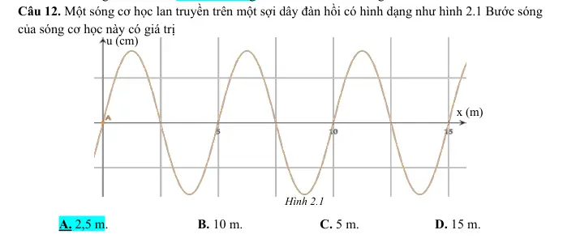{ loading=lazy }

#### Bài PDF 28

<!-- source-id: BT-Chuong-II-p11-q13-13 -->

Câu 13. Một sóng truyền trên mặt chất lỏng với tần số 10 Hz. Biết khoảng cách giữa 5 gợn sóng liên
tiếp là 16 m. Tốc độ truyền sóng trên mặt nước là

A. 0,4 m/s
B. 8 m/s
C. 1,6 m/s
D. 4 m/s.

#### Bài PDF 29

<!-- source-id: BT-Chuong-II-p11-q14-14 -->

Câu 14. Một sóng có tần số 50 Hz trên trong một môi trường với vận tốc 340 m/s. Bước sóng của
nó là

A. 1,7 m.
B.  3,4 m.
C.  6,8 m.
D. 13,6 m.

#### Bài PDF 30

<!-- source-id: BT-Chuong-II-p11-q15-15 -->

Câu 15. Cường độ sóng được xác định bằng

A. Công suất của sóng truyền qua một đơn vị diện tích vuông góc với phương truyền sóng.

B. Năng lượng sóng truyền qua một đơn vị diện tích vuông góc với phương truyền sóng.

C. Năng lượng sóng truyền qua diện tích S vuông góc với phương truyền sóng, trong một

đơn vị thời gian.

   D. Năng lượng sóng truyền qua diện tích S vuông góc với phương truyền sóng trong
    khoảng thời gian t.

#### Bài PDF 31

<!-- source-id: BT-Chuong-II-p12-q18-18 -->

Câu 18. Hình 2.4 bên mô tả quá trình sóng lan truyền trên bề mặt nước. Bước sóng là khoảng cách
giữa hai điểm

Hình 2.3

A. AB.
B. BC.
C. CD.
D. AC.

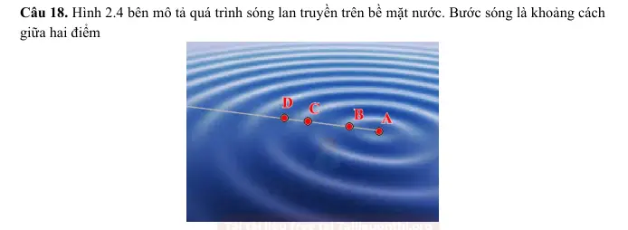{ loading=lazy }

#### Bài PDF 32

<!-- source-id: BT-Chuong-II-p15-q30-30 -->

Câu 30. Một nguồn sóng dao động điều hòa. Khoảng thời gian giữa 9 lần liên tiếp ngọn sóng tại nhô
lên cao là 3,2 giây. Biết sóng truyền từ nguồn sóng cách bờ 5 m đến khi vào tới bờ mất 4 giây. Bước
sóng của sóng này có giá trị
A. 0,25 m.

B. 0,5 m.

C. 0,125 m.
D. 2,5 m.

#### Bài PDF 33

<!-- source-id: BT-Chuong-II-p16-q32-32 -->

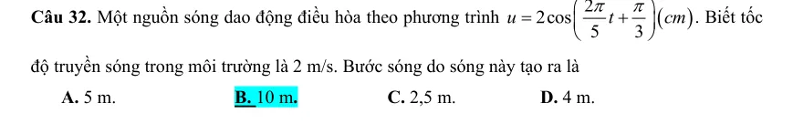{ loading=lazy }

#### Bài PDF 34

<!-- source-id: BT-Chuong-II-p27-q1-51 -->

Câu 1. Một sóng cơ truyền từ không khí vào môi trường nước sau đó đi vào thủy tinh. Tốc độ của
sóng cơ truyền trong các môi trường nước
nc
v , không khí
kk
v và thủy tinh
ttv  được sắp xếp theo thứ
tự tăng dần là
A.
,
,
nc
kk
tt
v
v
v
B.
,
,
nc
tt
kk
v
v v
C.
nc
kk
tt
v
v
v
=
=

D.
,
,
kk
nc
tt
v
v
v

#### Bài PDF 35

<!-- source-id: BT-Chuong-II-p27-q2-52 -->

Câu 2. Đơn vị nào sau đây không là đơn cường độ sóng ?
A.
2 .
J
m

B.
2 .
W
m

C.
2 .
.
J
s m

D.
.
.
N
s m

#### Bài PDF 36

<!-- source-id: BT-Chuong-II-p27-q4-54 -->

Câu 4. Trong quá trình truyền sóng đại lượng  không được truyền đi là
A. năng lượng.

B. xung lượng.

C. biến dạng đàn hồi.

D. các phần tử vật chất.

#### Bài PDF 37

<!-- source-id: BT-Chuong-II-p27-q5-55 -->

Câu 5. Một nguồn sóng dao động điều hòa theo phương trình
(
)
2.cos 5
u
t
π
=
. Sóng do nguồn này
tạo ra có tần số
A. 5 Hz.
B. 2,5 Hz.
C. 10 Hz.
D. 15,7Hz.

#### Bài PDF 38

<!-- source-id: BT-Chuong-II-p28-q8-58 -->

Câu 8. Công thức nào sau đây tính bước sóng là sai?
A.
.v f
λ=
.
B.
.v T
λ=
.
C.
v
f
λ=
.
D.
.2
v π
λ
ω
=
.

#### Bài PDF 39

<!-- source-id: BT-Chuong-II-p29-q12-62 -->

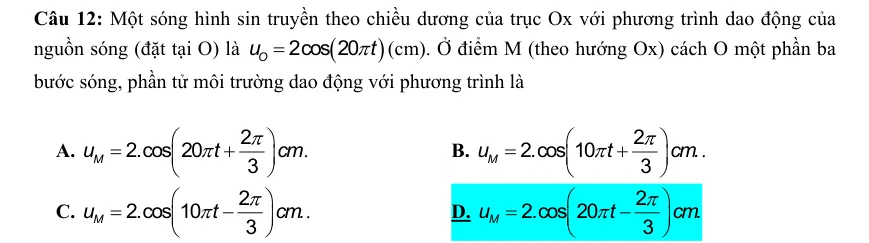{ loading=lazy }

#### Bài PDF 40

<!-- source-id: BT-Chuong-II-p30-q13-63 -->

Câu 13. Một người ngồi bên bờ biển thấy trong khoảng thời gian 9 giây có 19 ngọn sóng truyền qua
trước mặt. Biết khoảng cách giữa hai ngọn sóng liên tiếp là 3m. Trong thời gian 5 s sóng truyền được
quãng đường là
 A. 20 m.
B. 30 m.
C. 15 m.
D. 25 m.

#### Bài PDF 41

<!-- source-id: BT-Chuong-II-p30-q14-64 -->

Câu 14. Hai điểm A và C trong hình 3.1 cách nhau một bước sóng do
A. phần tử tại A và C cùng trạng thái.

B. phần tử tại A và C cùng vị trí.
C. phần tử tại A và C cùng vị tốc độ.

D. phần tử tại A và C cùng vị gia tốc.

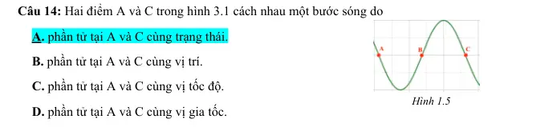{ loading=lazy }

#### Bài PDF 42

<!-- source-id: BT-Chuong-II-p44-q1-79 -->

Câu 1. Để phân loại sóng dọc và sóng ngang người ta dựa vào

A. tốc độ truyền sóng và bước sóng.
B. phương truyền sóng và tần số sóng.

C. phương dao động và phương truyền sóng.
D. phương dao động và tốc độ truyền sóng.

#### Bài PDF 43

<!-- source-id: BT-Chuong-II-p44-q2-80 -->

Câu 2. Sóng dọc là sóng có phương dao động

A. trùng với phương truyền sóng.
B. nằm ngang.

C. vuông góc với phương truyền sóng.
D. thẳng đứng.

#### Bài PDF 44

<!-- source-id: BT-Chuong-II-p44-q3-81 -->

Câu 3. Sóng ngang là sóng có phương dao động của các phần tử môi trường và phương truyền sóng hợp với
nhau một góc

A. 30o
B. 60o.
C. 90o.
D. 0o.

#### Bài PDF 45

<!-- source-id: BT-Chuong-II-p44-q4-82 -->

Câu 4. Trong sự truyền sóng cơ, biên độ dao động của các phần tử môi trường có sóng truyền qua được gọi là

A. chu kì của sóng.
B. biên độ của sóng.
C. tốc độ truyền sóng.
D. năng lượng sóng.

#### Bài PDF 46

<!-- source-id: BT-Chuong-II-p44-q6-84 -->

Câu 6. Sóng ngang (sóng cơ học) truyền được trong các môi trường

A. chất rắn và trong lòng chất lỏng.
B. chất khí và trong lòng chất rắn.

C. chất rắn và bề mặt chất lỏng.
D. chất khí và bề mặt chất rắn.

#### Bài PDF 47

<!-- source-id: BT-Chuong-II-p44-q7-85 -->

Câu 7. Đối với sóng cơ học, sóng dọc truyền được trong các môi trường

A. rắn, lỏng, chân không.
B. rắn, lỏng, khí.

C. rắn, khí, chân không.
D. lỏng, khí, chân không.

#### Bài PDF 48

<!-- source-id: BT-Chuong-II-p45-q9-87 -->

Câu 9. Chọn phát biểu sai.

A. Sóng dọc là sóng mà phương dao động của các phần tử vật chất nơi sóng truyền qua trùng với
phương truyền sóng.

B. Sóng cơ không truyền được trong chân không.

C. Sóng ngang là sóng mà phương dao động của các phần tử vật chất nơi sóng truyền qua vuông góc
với phương truyền sóng.

D. Khi sóng truyền đi, các phần tử vật chất nơi sóng truyền qua cùng truyền đi theo sóng.

#### Bài PDF 49

<!-- source-id: BT-Chuong-II-p48-q25-103 -->

Câu 25. Một sóng ngang tần số 50 Hz truyền theo phương nằm ngang với tốc độ truyền sóng là 4 m/s. Bước
sóng của sóng trên là

A. 4 cm.
B. 12,5 cm.
C.  8 cm.

D. 200 cm.

#### Bài PDF 50

<!-- source-id: BT-Chuong-II-p50-q36-114 -->

Câu 36. Một người quan sát mặt biển thấy có 5 ngọn sóng đi qua trước mặt mình trong khoảng 10 s và đo
được khoảng cách giữa 2 ngọn sóng liên tiếp là 5 m. Xem sóng biển là sóng ngang. Tốc độ truyền sóng là

A. 2 m/s.
B. 4 m/s.
C. 6 m/s.

D. 8 m/s.

#### Bài PDF 51

<!-- source-id: BT-Chuong-II-p51-q37-115 -->

Câu 37. Tại một điểm trên mặt nước có một nguồn dao động với tần số 120 Hz, tạo ra sóng ổn định. Tốc độ
truyền sóng là 15 m/s. Xét 5 gợn sóng liên tiếp trên một phương truyền sóng, ở một phía so với nguồn, gợn thứ
nhất cách gợn thứ năm một khoảng

A. 0,1 m.
B. 0,3 m.
C. 0,5 m.
D. 0,7 m.

#### Bài PDF 52

<!-- source-id: BT-Chuong-II-p51-q39-117 -->

Câu 39. P và Q là hai điểm trên mặt nước cách nhau một khoảng 20 cm. Tại một điểm O trên đường
thẳng PQ và nằm ngoài đoạn PQ, người ta đặt nguồn dao động điều hòa theo phương vuông góc với mặt nước
với phương trình
cos
u
t
a
ω
=
cm, tạo ra sóng trên mặt nước với bước sóng 15 cm. Khoảng cách gần nhất giữa
hai phần tử môi trường tại P và Q khi có bước sóng truyền qua là

A. 15 m.
B. 20 m.
C. 5 m.

D. 35 m.

#### Bài PDF 53

<!-- source-id: BT-Chuong-II-p58-q1-131 -->

Câu 1. Sóng ngang là sóng có phương dao động

A. trùng với phương truyền sóng.
B. nằm ngang.

C. vuông góc với phương truyền sóng.
D. thẳng đứng.

#### Bài PDF 54

<!-- source-id: BT-Chuong-II-p58-q2-132 -->

Câu 2. Sóng dọc là sóng có phương dao động của các phần tử môi trường và phương truyền sóng hợp với nhau
một góc

A. 30o.
B. 60o.
C. 90o.
D. 0o.

#### Bài PDF 55

<!-- source-id: BT-Chuong-II-p58-q3-133 -->

Câu 3. Đối với sóng cơ học, sóng dọc không truyền được trong

A. chân không.
B. kim loại.
C. không khí.
D. nước.

#### Bài PDF 56

<!-- source-id: BT-Chuong-II-p58-q5-135 -->

Câu 5. Trong sự truyền sóng cơ, chu kì dao động của một phần từ môi trường có sóng truyền qua gọi là

A. chu kì của sóng.
B. biên độ của sóng.
C. tốc độ truyền sóng.
D. năng lượng sóng.

#### Bài PDF 57

<!-- source-id: BT-Chuong-II-p58-q8-138 -->

Câu 8. Nhận định nào sau đây không đúng khi nói về sóng?

A. Sóng cơ là dao động cơ lan truyền trong một môi trường đàn hồi.

B. Cường độ sóng là tốc độ lan truyền biến dạng được truyền qua một đơn vị diện tích vuông góc với

phương truyền sóng trong một đơn vị thời gian.

C. Sóng ánh sáng có bản chất là sóng điện từ.

D. Đối với sóng cơ, cả sóng dọc và sóng ngang đều không truyền được trong chân không.

#### Bài PDF 58

<!-- source-id: BT-Chuong-II-p58-q9-139 -->

Câu 9. Sóng thần là hiện tượng các đợt sóng rất lớn được hình thành và di chuyển rất nhanh trên một quy mô
lớn. Cơn sóng thần xảy ra ở bờ biển Sumatra (Indonesia) năm 2004 được biết là một trong những thiên tai gây
ra nhiều thiệt hại nhất trong lịch sử thế giới hiện đại. Những hình ảnh từ vệ tinh nhân tạo cho thấy khoảng cách
giữa hai đỉnh sóng liên tiếp của cơn sóng thần này vào khoảng 800 km và chu kì là khoảng 1 giờ. Tốc độ của
cơn sóng thần này là

A. 800 km/h.
B. 200 km/h.
C. 800 m/s.
D. 200 m/s.

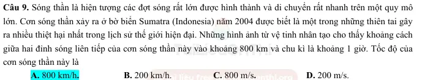{ loading=lazy }

#### Bài PDF 59

<!-- source-id: BT-Chuong-II-p59-q10-140 -->

Câu 10. Đơn vị của cường độ sóng là

A. J/s.
B. W/m2.
C. Wm2.
D. Js.

#### Bài PDF 60

<!-- source-id: BT-Chuong-II-p59-q13-143 -->

Câu 13. Khi sóng truyền từ một nguồn điểm trong không gian đồng nhất và đẳng hướng và không hấp thụ
năng lượng sóng, năng lượng dao động của một phần tử môi trường trên phương truyền sóng sẽ
A. giảm tỷ lệ với khoảng cách tới nguồn.

B. giảm tỉ lệ với bình phương quãng đường truyền sóng.
C. tăng tỷ lệ với khoảng cách tới nguồn.

D. tăng tỉ lệ với bình phương quãng đường truyền

#### Bài PDF 61

<!-- source-id: BT-Chuong-II-p60-q18-148 -->

Câu 18. Một sóng ngang cơ học truyền trên một sợi dây đàn hồi với biên độ bằng 5 cm không đổi. Biết tần số
và tốc độ truyền sóng lần lượt là 5 Hz và 100 cm/s. Nếu khoảng cách gần nhất giữa hai điểm trên dây là 30 cm
thì khoảng cách xa nhất giữa chúng xấp xỉ bằng

A. 31,2 cm.
B. 30,8 cm.
C. 31,6 cm.

D. 30,4 cm.

#### Bài PDF 62

<!-- source-id: BT-Chuong-II-p194-q1-425 -->

Câu 1. Một sóng cơ có tần số f, truyền trên dây đàn hồi với tốc độ truyền sóng v và bước sóng λ. Hệ
thức đúng là
A. v
f
λ
=
.
B.
f
v
λ
=
.
C. v
f
λ
=
.
D.
2
v
f
πλ
=
.

#### Bài PDF 63

<!-- source-id: BT-Chuong-II-p194-q3-427 -->

Câu 3. Phát biểu nào sau đây về đại lượng đặc trưng của sóng cơ không đúng?
A. Chu kì của sóng chính bằng chu kì dao động của các phần tử dao động.
B. Tần số của sóng chính bằng tần số dao động của các phần tử dao động.
C. Tốc độ của sóng chính bằng tốc độ dao động của các phần tử dao động.
D. Bước sóng là quãng đường sóng truyền đi được trong một chu kì.

#### Bài PDF 64

<!-- source-id: BT-Chuong-II-p194-q4-428 -->

Câu 4. Với một sóng nhất định, tốc độ truyền sóng phụ thuộc vào
A. năng lượng sóng.

B. tần số dao động.
C. môi trường truyền sóng.

D. bước sóng.

#### Bài PDF 65

<!-- source-id: BT-Chuong-II-p194-q5-429 -->

Câu 5. Một sóng cơ học lan truyền trong một môi trường tốc độ v. Bước sóng của sóng này trong
môi trường đó là λ. Chu kì dao động của sóng có biểu thức là

A. T = v/λ.

B. T = v.λ.

C.  T = λ/v.

D. T = 2πv/λ.

#### Bài PDF 66

<!-- source-id: BT-Chuong-II-p195-q8-432 -->

Câu 8. Một sóng có tần số 120 Hz truyền trong một môi trường với tốc độ 60 m/s. Bước sóng của nó
là

A. 1,0 m.

B. 2,0 m.

C. 0,5 m.

D. 0,25 m.

#### Bài PDF 67

<!-- source-id: BT-Chuong-II-p195-q9-433 -->

Câu 9. Sóng cơ lan truyền trong môi trường đàn hồi với tốc độ v không đổi, khi tăng tần số sóng lên
2 lần thì bước sóng

A. tăng 2 lần.
B. tăng 1,5 lần.
C. không đổi.
D. giảm 2 lần.

#### Bài PDF 68

<!-- source-id: BT-Chuong-II-p196-q11-435 -->

Câu 11. Khi nói về sóng ngắn, phát biểu nào sau đây sai?
A. Sóng ngắn phản xạ tốt trên tầng điện li.

B. Sóng ngắn không truyền được trong chân không.

C. Sóng ngắn phản xạ tốt trên mặt đất.

D. Sóng ngắn có mang năng lượng.

#### Bài PDF 69

<!-- source-id: BT-Chuong-II-p196-q12-436 -->

Câu 12. Ánh sáng đơn sắc có bước sóng 0,75μm ứng với màu
A. Lục.

B. Đỏ.

C. Tím.

D. Chàm.

#### Bài PDF 70

<!-- source-id: BT-Chuong-II-p210-q1-483 -->

Câu 1. Với một sóng nhất định, tốc độ truyền sóng phụ thuộc vào
A. năng lượng sóng.

B. tần số dao động.
C. môi trường truyền sóng.

D. bước sóng.

#### Bài PDF 71

<!-- source-id: BT-Chuong-II-p211-q3-485 -->

Câu 3. Một sóng có tần số 120 Hz truyền trong một môi trường với tốc độ 60 m/s. Bước sóng của nó
là

A. 1,0 m.

B. 2,0 m.

C. 0,5 m.

D. 0,25 m.

#### Bài PDF 72

<!-- source-id: BT-Chuong-II-p211-q6-488 -->

Câu 6. Một sóng lan truyền với tốc độ v = 200 m/s có bước sóng λ = 4 m. Chu kì dao động của sóng
là
A. T  = 0,02 s.
B. T = 50 s.
C. T = 1,25 s.
D. T = 0,2 s.

#### Bài PDF 73

<!-- source-id: BT-Chuong-II-p211-q7-489 -->

Câu 7. Một điểm A trên mặt nước dao động với tần số 100 Hz. Trên mặt nước người ta đo được
khoảng cách giữa 7 gợn lồi liên tiếp là 3 cm. Khi đó tốc độ truyền sóng trên mặt nước là
A.
50
v =
cm/s.
B.
50
v =
m/s.
C.
5
v =  cm/s.
D.
0,5
v =
cm/s.

### Nhận biết — Đúng/Sai

#### Bài PDF 74

<!-- source-id: BT-Chuong-II-p22-q1-41 -->

Câu 1. Một sóng cơ học truyền đi trong nước với tốc độ 2 m/s, tần số dao động của nguồn sóng là 5
Hz.

Phát biểu
Đúng
Sai
a
Khi sóng truyền từ nước ra ngoài không khí, tần
số sóng trong không khí là 5 Hz.
Đ

b
Bước sóng của sóng này trong nước là 10 m

S
c
Khoảng cách giữa 3 ngọn sóng liên tiếp trên
phương truyền sóng là 0,8 m.
Đ

d
Bước sóng của sóng này khi truyền sang môi
trường không khí giảm đi.
Đ

#### Bài PDF 75

<!-- source-id: BT-Chuong-II-p32-q2-70 -->

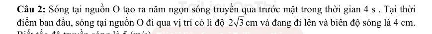{ loading=lazy }

#### Bài PDF 76

<!-- source-id: BT-Chuong-II-p34-q4-72 -->

Câu 4. Khi một con bọ cánh cam bò trên bãi cát trong phạm vi vài chục xen-ti-mét cách con bọ cạp
cát thì con bọ cạp cát quay ngay về phía con bọ cánh cam và xông vào chỗ trú ẩn của nó để giết và
ăn thịt nó. Để làm được như vậy, khi con mồi cánh cam làm xáo động cát, nó sẽ gửi đồng thời hai
sóng truyền ra môi trường xung quanh, một sóng dọc và một sóng ngang. Sóng dọc truyền đi với tốc
độ 150 m/s và sóng ngang truyền đi với vận tốc 50 m/s. Con bọ cạp với tám cái chân vươn đều trong
(m)
M
N
Hình 3.4

một vòng tròn đường kính chứng 5 cm, bắt được xung dọc trước vì truyền nhanh hơn và biết được
hướng của con cánh cam: đó là hướng cái chân nào nhận rung động trước. Sau đó con bọ cạp cảm
nhận thời gian
t
Δgiữa hai lần cảm nhận sự rung động của sóng dọc và sóng ngang. Nhờ đó con bọ
cạp dễ dạng nhận được vị trí và bắt được con mồi.

Phát biểu
Đúng
Sai
a
Trong quá trình truyền sóng, thời gian truyền sóng dọc
nhiều hơn thời gian truyền sóng ngang.

S
b
Con bọ cạp dùng sóng dọc để xác định được hướng
của con mồi.
Đ

c
Nếu d là khoảng cách từ con bọ cạp đến con mồi thì
thời gian con bọ cạp cảm nhận được tín hiệu đầu tiên
là 50
d .

S
d
Nếu thời gian chênh lệch giữa hai tín hiệu sóng dọc và sóng
ngang là (
)
4 ms thì khoảng cách từ con bọ cạp đến con mồi
là 30 cm,
Đ

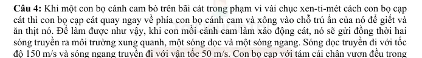{ loading=lazy }

#### Bài PDF 77

<!-- source-id: BT-Chuong-II-p53-q2-120 -->

Câu 2. Thang sóng điện từ phân loại sóng điện từ theo tần số của chúng, mỗi miền tần số có tên gọi, tính chất
và công dụng khác nhau. Tần số các miền bức xạ điện từ được thể hiện ở bảng dưới. Biết tốc độ ánh sáng là
8
3.10  m/s
c =

Miền bức xạ
Tần số (Hz)
Công dụng (Ví dụ)
Sóng vô tuyến
104 đến 3.1012
Liên lạc, truyền thông vô tuyến
Hồng ngoại
3.1011 đến 4.1014
Sưởi ấm, sấy khô
Ánh sáng nhìn thấy
4.1014 (đỏ) đến 8.1014 (tím)
Chiếu sáng
Tử ngoại
8.1014 đến 3.1017
Khử trùng, diệt khuẩn
Tia X
3.1016 đến 3.1019
Chẩn đoán hình ảnh trong y học, an ninh hải quan
Tia gamma
Trên 3.1019
Hủy diệt tế bào ung thư

Phát biểu
Đúng
Sai
a
Bức xạ có tần số 100 000 Hz là ánh sáng nhìn thấy.

S
b
Sóng vô tuyến là sóng ngang.
Đ

c
Chỉ có tia X truyền được trong chân không.

S
d
Bước sóng ánh sáng nhìn thấy nằm trong khoảng từ 3,75.10-4 mm đến 7,5.10-4 mm.
Đ

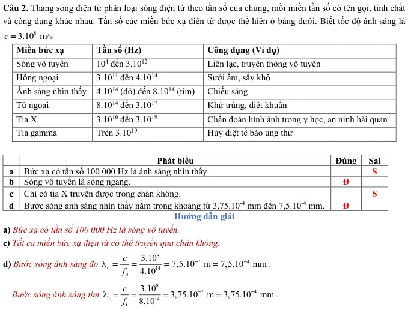{ loading=lazy }

#### Bài PDF 78

<!-- source-id: BT-Chuong-II-p61-q3-151 -->

Câu 3. Biết cường độ ánh sáng Mặt Trời đo được lại Trái Đất là
3
2
1
1,37.10  W/m
I =
 và khoảng cách từ Mặt
Trời đến Trái Đất và Sao Hoả lần lượt là
2
1
1
1
1
1
1,5.10  m,
2,279.10  m
R
R
=
=
.

Phát biểu
Đúng
Sai
a
Ánh sáng không thể truyền trong chân không.

S
b
Cường độ ánh sáng Mặt Trời là công suất bức xạ của chùm ánh sáng do một
nguồn sáng phát ra truyền qua một đơn vị diện tích.
Đ

c
Công suất bức xạ sóng ánh sáng Mặt Trời khoảng 0,39.1026 W.

S
d
Cường độ ánh sáng đo được tại Sao Hoả gấp 1,5 lần cường độ ánh sáng đo được
tại Trái Đất.

S

#### Bài PDF 79

<!-- source-id: BT-Chuong-II-p61-q4-152 -->

Câu 4. Hình 1 biểu diễn vị trí của các điểm xác định cách đều nhau 1 cm trên một lò xo đang ở trạng thái cân
bằng. Hình 2 thể hiện vị trí của các điểm đó tại một thời điểm nhất định khi cho sóng truyền qua lò xo này.
Biết chu kì sóng là 0,5 s.

Phát biểu
Đúng
Sai
a
Sóng truyền qua lò xo là sóng ngang.

S
b
Sóng truyền qua lò xo là quá trình lan truyền các phần tử lò xo theo thời gian

S
c
Bước sóng của sóng truyền qua lò xo có giá trị là 4 cm.

S
d
Tốc độ sóng truyền trên lò xo là 4 cm/s.

S

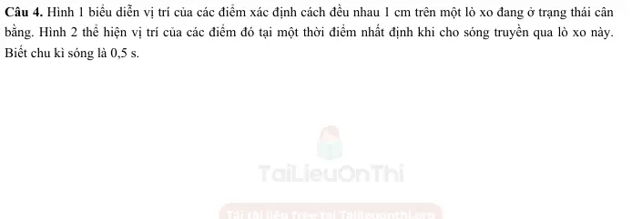{ loading=lazy }

#### Bài PDF 80

<!-- source-id: BT-Chuong-II-p204-q1-465 -->

Câu 1. Trên mặt hồ yên lặng, một người làm cho con thuyền dao động tạo ra sóng trên mặt nước.
Thuyền thực hiện được 24 dao động trong 40 s, mỗi dao động tạo ra một ngọn sóng cao 12 cm so với
mặt hồ yên lặng và ngọn sóng tới bờ cách thuyền 10 m sau 5 s.

Phát biểu
Đúng
Sai
a Chu kì dao động của thuyền là 0,6 s.

S
b Tốc độ lan truyền của sóng là 6 m/s.

S
c Bước sóng của sóng là 10(cm)
3
.

S
d Biên độ sóng là 12 cm.
Đ

#### Bài PDF 81

<!-- source-id: BT-Chuong-II-p205-q3-467 -->

Câu 3. Một sóng hình sin được mô tả như hình 14.2

Phát biểu
Đúng
Sai
a Bước sóng của sóng là 50 cm.
Đ

b Nếu chu kì sóng là 1 s thì tần số truyền sóng bằng 1
Hz.
Đ

c Nếu chu kì sóng là 1 s thì tốc độ truyền sóng bằng
50 m/s

S
d Nếu tần số tăng lên 5 Hz và tốc độ truyền sóng
không đổi thì bước sóng là 25 cm.

S

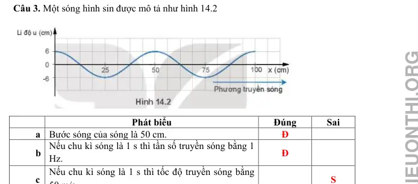{ loading=lazy }

#### Bài PDF 82

<!-- source-id: BT-Chuong-II-p206-q4-468 -->

Câu 4. Đầu O của một sợi dây đàn hồi nằm ngang dao động điều hòa theo phương thẳng đứng với
biên độ 3,6 cm và tần số f = 1 Hz, sau 6 s sóng truyền được 6 m. Coi đầu O bắt đầu dao động từ
VTCB và theo chiều dương.

Phát biểu
Đúng
Sai
a Vận tốc truyền sóng là 1 m/s.
Đ

b Bước sóng của sóng là  1 m.
Đ

c
Phương
trình
dao
động
của
đầu
O
là
0
3,6cos(2
)(cm)
2
u
t
π
π
=
+

S
d Li độ của điểm M trên dây cách O đoạn 2,5 m tại
thời điểm 2 s là 3,6 cm

S

#### Bài PDF 83

<!-- source-id: BT-Chuong-II-p206-q5-469 -->

Câu 5. Trên mặt hồ yên lặng, một người dập dình một con thuyền tạo ra sóng trên mặt nước. Người
này nhận thấy rằng thuyền thực hiện được 12 dao động trong 20 s, mỗi dao động tạo ra một ngọn
sóng cao 15 cm so với mặt hồ yên lặng. Người này còn nhận thấy rằng ngọn sóng đã tới bờ cách
thuyền 12 m sau 6 s. Với sóng trên mặt nước

Phát biểu
Đúng
Sai
a Chu kỳ của sóng là 1,7 s.
Đ

b Tốc độ lan truyền của sóng là 2 m/s.
Đ

c Bước sóng là 4 m.

S

d Biên độ sóng là 15 m.

S

#### Bài PDF 84

<!-- source-id: BT-Chuong-II-p216-q4-504 -->

Câu 4. Một chiếc lá trên mặt nước nhô lên 9 lần trong khoảng thời gian 2 s. Biết khoảng cách giữa
hai đỉnh sóng liên tiếp nhau là 24 cm.

Phát biểu
Đúng
Sai
a Chu kì của sóng là 4,5 s.

S
b Bước sóng là 24 cm.
Đ

c Tần số của sóng là 4,5 Hz
Đ

d Tốc độ truyền sóng nước là 108 cm/s.
Đ

### Thông hiểu — Trắc nghiệm 4 lựa chọn

#### Bài PDF 85

<!-- source-id: BT-Chuong-II-p13-q20-20 -->

Câu 20. Khoảng cách từ một ngọn sóng và một lõm sóng liên tiếp trên cùng một phương truyền
sóng cách nhau

A.
.
B.
.
C. .
D.
.

#### Bài PDF 86

<!-- source-id: BT-Chuong-II-p13-q21-21 -->

Câu 21. Khi biên độ dao động của một nguồn sóng tăng. Đại lượng  tăng là

A. tần số sóng.
B. tốc độ truyền sóng. C. bước sóng.
D. năng lượng.

#### Bài PDF 87

<!-- source-id: BT-Chuong-II-p14-q24-24 -->

Câu 24. Hình 2.5 mô tả quá trình truyền sóng trên mặt nước. Trong quá trình truyên sóng trên mặt
nước, đại lượng giảm dần là

A. bước sóng.
B. tốc độ truyền sóng. C. tần số sóng.
D. biên độ sóng.

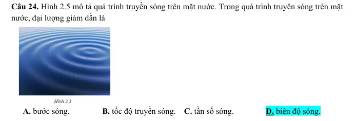{ loading=lazy }

#### Bài PDF 88

<!-- source-id: BT-Chuong-II-p14-q25-25 -->

Câu 25. Sóng cơ học lan truyền từ không khí vào nước. Đại lượng tăng là
A. biên độ sóng.
B. tần số sóng
C. bước sóng.
D. chu kỳ sóng.

#### Bài PDF 89

<!-- source-id: BT-Chuong-II-p46-q19-97 -->

Câu 19. Một sóng ngang truyền trên mặt nước có tần số 10 Hz. Tại một thời điểm nào đó một phần mặt nước
có hình dạng như hình vẽ. Trong đó điểm C ở vị trí cân bằng đang đi lên qua. Biết khoảng cách từ các vị trí cân
bằng của A đến vị trí cân bằng của C là 60 cm. Chiều truyền sóng và tốc độ truyền sóng lần lượt là

A. từ E đến A, 12 m/s.

B. từ A đến E, 12 m/s.

C. từ E đến A, 6 m/s.

D. từ A đến E, 6 m/s.

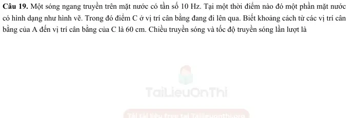{ loading=lazy }

#### Bài PDF 90

<!-- source-id: BT-Chuong-II-p197-q1-440 -->

Câu 1. Một sóng cơ truyền dọc theo trục Ox có phương trình
(
)
2cos 20
2
=
−
u
t
x
π
π
  (cm), với t tính
bằng s. Tần số của sóng này bằng
A. 15 Hz.
B. 10 Hz.
C. 5 Hz.
D. 20 Hz.

#### Bài PDF 91

<!-- source-id: BT-Chuong-II-p197-q2-441 -->

Câu 2. Một sóng cơ truyền dọc theo trục Ox với phương trình
(
)
2cos 40
2
u
t
x
π
π
=
−
 (mm). Biên độ
của sóng này là
A. 2 mm.
B. 4 mm.
C. π mm.
D. 40π mm.

### Vận dụng — Trắc nghiệm 4 lựa chọn

#### Bài PDF 92

<!-- source-id: BT-Chuong-II-p17-q34-34 -->

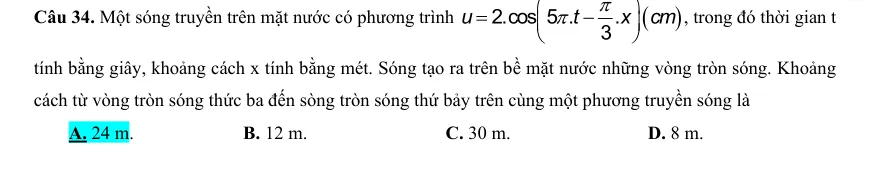{ loading=lazy }

#### Bài PDF 93

<!-- source-id: BT-Chuong-II-p200-q1-455 -->

Câu 1. Khi một sóng biển truyền đi, người ta quan sát thấy khoảng cách giữa 2 đỉnh sóng liên tiếp
bằng 8,5 m. Biết một điểm trên mặt sóng thực hiện một dao động toàn phần sau thời gian bằng 3,0 s.
Tốc độ truyền của sóng biển có giá trị gần bằng
A. 2,8 m/s.

B. 1,41 m/s.
C. 25,5 m/s.

D. 0,35 m/s.

