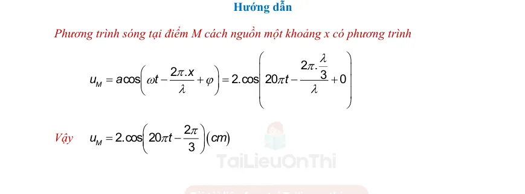

# Đáp án và lời giải — Bài 1 — Đại cương sóng cơ và sự truyền sóng

> Câu nền tảng được giải vừa đủ để kiểm tra cách làm. Câu vận dụng được trình bày chi tiết hơn để người học thấy được đường suy luận, điều kiện dùng công thức và bước kiểm tra kết quả.

[← Bài tập](exercises.md)

## Câu 1

Chọn **B**. $\lambda=v/f=4/20=0,20$ m.

## Câu 2

Chọn **C**. Sóng cơ cần môi trường vật chất và truyền trạng thái dao động/năng lượng, không mang các phần tử môi trường đi theo.

## Câu 3

Chọn **C**. Hai điểm gần nhất cùng pha trên phương truyền sóng cách nhau một bước sóng.

## Câu 4

a) **Đúng**.  
b) **Đúng**.  
c) **Sai** đối với sóng cơ trong khối môi trường thông thường; chất khí không truyền sóng cơ ngang thể tích.  
d) **Đúng**: tần số liên tục qua mặt phân cách, còn tốc độ và bước sóng có thể đổi.

## Câu 5

$\lambda=v/f=5/25=0,20$ m. Thời gian truyền $t=s/v=3/5=0,60$ s.

## Câu 6

Ngược pha khi $\Delta d=(k+1/2)\lambda$. Khoảng cách nhỏ nhất ứng với $k=0$: $\lambda/2=30$ cm.

## Câu 7

$v=1,5/0,30=5$ m/s. $\lambda=v/f=5/4=1,25$ m.

## Câu 8

Độ lệch pha theo không gian: $|\Delta\varphi|=2\pi d/\lambda$. Với $d=0,45$ m và độ lệch pha đang xét là $3\pi/2$:

$2\pi\cdot0,45/\lambda=3\pi/2$.

Suy ra $\lambda=0,60$ m. Tần số $f=v/\lambda=2,4/0,60=4$ Hz.

---

[← Bài tập](exercises.md)

## Đáp án và lời giải — Ngân hàng PDF mở rộng

> Câu có lời giải trong tài liệu được giữ phần hướng dẫn. Câu trắc nghiệm không kèm lời giải dài chỉ hiện đáp án đã đối chiếu từ dấu đáp án/khóa đáp án của tài liệu.

### Nhận biết — Trả lời ngắn

#### Bài PDF 1

**Đáp án:** 6

Đáp án:
6
,
6
7
Hướng dẫn
Bước sóng được tính theo công thức:
( )
20
.
.
5.
6,67
15
t
vT
v
m
N
λ=
=
=
=

#### Bài PDF 2

**Đáp án:** 1

Đáp án:
1
2

Hướng dẫn

Bước sóng
( )
6
6 m
π
λ
π
=
=

Lại có
(
)
(
)
( )
1 .
3 1 .6
12
1
x
x
N
m
N
λ
λ
=

=
−
=
−
=
−

#### Bài PDF 3

**Đáp án:** 3

Đáp án:
3
,
4
6
Hướng dẫn
3
N
M
- a
+ a
O
- 3

Độ lệch pha giữa M và N:
(
)
2 .
2 .
2
3
3
x
rad
λ
π
π
π
ϕ
λ
λ
Δ
=
=
=

Dùng đường tròn lượng giác ( hình 3.7 ) biểu diễn độ lệch pha suy ra:

(
)
3
cos
2 3
6
a
cm
a
π

=

=





#### Bài PDF 4

**Đáp án:** 5

Đáp án:
5
0

Hướng dẫn giải
Khoảng cách giữa 7 gợn lồi liên tiếp bằng 6 bước sóng nên
3
0,5 m
6
λ=
=
.
Tốc độ truyền sóng
0,5.100
50 m/s.
v
f
λ=
=
=

#### Bài PDF 5

**Đáp án:** 2

Đáp án:
2
0
0

Hướng dẫn giải
Gọi s là khoảng cách từ tâm chấn động đất đến trạm quan trắc.
Khoảng thời gian chênh lệch trạm quan trắc nhận được hai tín hiệu
15
200
8
 km
5
s
s
s
−
=

=
.

#### Bài PDF 6

**Đáp án:** 3

Đáp án:
3
5
,
7
Hướng dẫn giải
min
60
15 cm
d
4
3
35 cm
2
v
f
λ
λ
λ
=
=
=
=
=

+

→ hai điểm dao động lệch pha một góc 2
3
π
 rad
(
)
(
)
(
)
2
2
2
2
max
1
cos
35
2.4
1
cos 2
35,7 cm
(
)
2
3
d
x
a
Δ
Δϕ
π
=
+
−
=
+
−

.

#### Bài PDF 7

**Đáp án:** 0

Đáp án:
0
,
6

Hướng dẫn giải
(
)
1
0,1
1
2
0,12
2
,
.10
0,5
0,7
0,5
0,7
,7
2,4
2
0,6 m s
2
1,2
,2
1,
2
/
2
d
d
k
k
k
k
v
f
k
k
v
k
k
k
v
π
Δϕ
π
λ
λ
λ
=
=

=
=

=
=
=









=

=
=


#### Bài PDF 8

**Đáp án:** 0

Đáp án:
0
,
2
5
Hướng dẫn giải
Phương trình dao động của phần tử P và Q lần lượt là
(
)
Q
P
2 .20
8
2 .30
3cos
3cos
;
3cos
3co
1
5
5
5
s
1
5
4
5
3
5
u
t
t
t
t
u
π
π
π
ω
ω
ω
ω
π






−
=
−
−
=
−












=
=

Q
max
max
max
P
15
15 cm
10
15
25 cm
0,25 m
cos
6
u
u
u
t
u
d
x
u
π
Δ
ω
Δ
Δ
Δ
−
=
=

=


=
+
=
=
−






=
+

Chủ đề 9 -  THỰC HÀNH: ĐO TẦN SỐ CỦA SÓNG ÂM
I. TÓM TẮT LÝ THUYẾT – PHƯƠNG PHÁP GIẢI CÁC DẠNG BÀI TẬP
1. Giới thiệu và hướng dẫn sử dụng dao động kí điện tử

Máy dao động kí điện tử có dao diện như hình 1.1 dưới đây

Bước 1: Để khởi động máy dao động kí, ta bấm nút Power. Kết quả ta được dao diện như hình 1.2.

Bước 2: Điều chỉnh màn hình và vị trí thanh biểu diễn tín hiệu về trung tâm màn hình.
1. Điều chỉnh màn hình và chọn kênh đo và chế độ do AC/DC.

Để điều chỉnh độ sáng màn hình, xoay núm Scale Illum tới độ sáng phù hợp.

Để điều chỉnh độ sắc nét của vạch tín hiệu ta xoay núm Focus.

Để điều chỉnh độ sáng tối của vạch tín hiệu ta xoay núm Intensity.

Để chọn kênh đo số 1, ta bấm nút CH1, chọn kênh đo 2 ta bấm nút CH2…

Vị trí các núm được ghi chú trên hình 31.

2. Điều chỉnh vạch tín hiệu về trung tâm màn hình.

Để điều chỉnh vạch tín hiệu trục ngang lên xuống ta xoay núm Position  ở kênh CH1. Nếu
xoay cùng chiều kim đồng hồ trục ngang sẽ dời lên trên, nếu xoay ngược chiều kim đồng hồ trục ngang
sẽ đi xuống phía dưới màn hình 1.4.

Ví dụ, sau khi xoay núm cùng chiều kim đồng hồ, thanh ngang tín hiệu sẽ dời lên đúng vị trí giữa màn
hình 1.5.

Tuy nhiên thanh này đang nằm lệch sang bên phải màn hình. Do đó ta xoay núm Position
  để
dịch chuyển thanh này sang trái hay sang phải. Nếu xoay núm cùng chiều kim đồng hồ, thanh di
chuyển sang bên phải, xoay ngược chiều kim đồng hồ thanh di chuyển sang trái.

Ví dụ sau khi xoay núm ngược chiều kim đồng hồ thì thanh ngang sẽ dịch chuyển ra giữa màn
hình 1.6.

Nếu vạch tín hiệu bị nằm lệch mà không phải nằm ngang, ta dùng tua vít vặn chốt như hình 1.7.

Bước 3: Chọn chế độ đo tần số, chu kì hay đo điện áp.
3.1. Chọn chế độ đo tần số

Bấm chọn nút Mode để chọn chế độ đo.

Ví dụ sau khi bấm màn hình xuất hiện chữ FRQ như hình 1.8 là đang đo tần số

Sau khi bấm màn hình xuất hiện chữ AV1 là đang ở chế độ do điện áp

Bước 4: Chuẩn tín hiệu đo.

Để chuẩn tín hiệu đo, ta sẽ diều chình các núm VOLT và núm TIME hết về phía tay phải.

Dùng que đo để kiểm tra tín hiệu hiệu chỉnh. Cắm Jack que đo vào cổng Input của CH1, sau đó
dùng đầu nhọn que tín hiệu cắm vào khe CAL. Sau đó bấm vào nút AUTO SET để kiểm tra dạng xung.
Nếu ra dạng xung vuông thì que tín hiệu tốt. Nếu không ra tín hiệu xung vuông có thể phải thay que tín
hiệu khác.

Sau đó xuất hiện màn hình xung. Điều chỉnh núm Intensity để quan sát rõ hình ảnh xung vuông.

Bước 5: Đọc chu kì tần số và điện áp của xung test.

Chu kì: T = 5 ô × 0,2 ms = 1 ms = 0,001 s.

Đo tần số, bấm vào nút Mode, chọn chế độ đo tần số. Sau đó dùng nút Position dịch chuyển trái
phải để đưa khoảng canh về giữa hai vị trí của chu kí, tên màn hình sẽ xuất hiện giá trị tần số 1.00 kHz.
Vậy tần số của tín hiệu test là 1 kz.

Để đo điện áp, khoảng cách từ biên dương đến biên âm là 2 ô. Mỗi ô có giá trị 0,5 V.

Ta có 2.
2 0,5 1
0,5
A
V
A
V
= 
=

=

2. Cơ sở lý thuyết

Để tiến hành và khai thác số liệu từ thí nghiệm đo tần số âm, học sinh phải nắm rõ một số kiến
thức cơ bản sau:

- Sóng âm do âm thoa hoặc loa điện động phát ra có dạng sóng hình sin.

- Chu kì T: Trên đồ thị sóng, đồ thị dao động, chu kì là khoảng thời gian liên tiếp giữa hai vị trí
dao động cùng pha. Do đó chu kì là khoảng thời gian giữa hai biên độ dương liên tiếp hoạc hai vị trí
cân bằng liên tiếp.

- Tần số là số dao động vật thực hiện trong một đơn vị thời gian. Tần số được tính theo chu kì
dao động qua công thức:

1
f
T
=
 (Hz)

- Tín hiệu sóng âm sau khi được biến đổi qua tín hiệu điện thì giữ nguyên tần số và chu kì.

fâm = fđiện

3. Dụng cụ thí nghiệm

Mục đích thí nghiệm

Đo được tần số âm.
Dụng cụ thí nghiệm

- Nguồn âm:  Loa điện động hoặc âm thoa + búa để phá ra sóng âm.

- Micro: Micro dùng để biến đổi dao động âm thành dao động điện.

- Máy phát tần số: Dùng để khuếch đại tín hiệu từ micro và đưa tín hiệu vào dao động kí.

- Dao động kí: Hiển thị đồ thị dao động âm, thang đo…
4. Tiến hành thí nghiệm
Bước 1: Bố trí sơ đồ thí nghiệm như hình 1.16 Cấp nguồn điện cho máy dao động kí điện tử và máy
phát tần số.

Bước 2: Bật micro, máy phát tần số và dao động kí ở chế độ làm việc.
Bước 3: Âm thoa được đặt trước micro, dùng búa gõ vào âm thoa để tạo nguồn âm (đảm bảo không có
nguồn âm khác ở gần). Tín hiệu từ âm thoa được micro biến đổi thành tín hiệu điện có cùng tần số.
Biên độ tín hiệu tỉ lệ với độ to do nguồn âm phát ra. Tín hiệu này sau đó đi qua máy phát cao tần và đi
vào máy dao động kí điện tử. Trên màn hình dao động kí điện tử sẽ xuất hiện đồ thị dao động âm.
Bước 4: Điều chỉnh dao động kí để ghi nhận được tín hiệu. Sau đó lặp lại thí nghiệm 3 lần.
Tương tự, khi nguồn âm là loa điện động. Lặp lại từ bước 2 đến bước 5. Tiến hành đo ít nhất 3 lần.

5. Kết quả thí nghiệm
Nguồn âm
Lần
Chu kì T (ms) Tần số f (Hz)
Tần số trung
bình f (Hz)
Sai số tuyệt
đối f
Δ(Hz)

Âm thoa
1

2

3

Loa điện
động
1

2

3

Xử lí kết quả thí nghiệm
a) Tính tần số các lần đo
1
2
3
1
2
3
1
1
1
;
;
f
f
f
T
T
T
=
=
=

b) Tần số trung bình
1
2
3
3
f
f
f
f
+
+
=

c) Sai số tuyệt đối
1
1
2
2
3
3
;
;
f
f
f
f
f
f
f
f
f
Δ=
−
Δ
=
−
Δ
=
−

d) Sai số tuyệt đối của phép đo
1
2
3
3
f
f
f
f
f
f
f
−
+
−
+
−
Δ=
+
dc
f
Δ

Trong đó
dc
f
Δ
là sai số dụng cụ. Sai số dụng cụ thường lấy nửa độ chia nhỏ nhất (hoặc một độ chia nhỏ
nhất tùy theo thống nhất với giáo viên hướng dẫn).
e) Kết quả thí nghiệm
f
f
f
=
±Δ
6. Sai số trong thí nghiệm
Nguyên nhân gây ra sai số trong thí nghiệm:
-
Thực hiện thí nghiệm gần các nguồn âm khác, gây nhiễu tín hiệu.
-
Do dụng cụ thí nghiệm, các điểm kết nối dây tín hiệu không ổn định.
-
Sai số do thao tác người thực hiện thí nghiệm (do vị trí quan sát dẫn đến việc đọc số liệu
từ đồ thị tín hiệu không chính xác…).
Cách khắc phục:
-
Thực hiện thí nghiệm ở xa các nguồn tạp âm.
-
Chuẩn tín hiệu trước khi đo.
-
Vị trí người thực hiện thí nghiệm nhìn thẳng, vuông góc trước màn hình dao động kí điện
tử.
7. Phương pháp giải các dạng bài tập
Dạng 1: Học sinh biết xử lí được số liệu đo như tính giá trị trung bình, tính sai số của phép đo.
Dạng 2: Học sinh đọc được kết quả từ màn hình dao động kí.
Ví dụ 1: Thực hiện thí nghiệm đo tần số âm ta được kết quả theo bảng sau:
Nguồn âm
Lần
Chu kì T
(ms)
Tần số f (Hz) Tần số trung
bình f (Hz)
Sai số tuyệt
đối f
Δ(Hz)
Âm thoa
1
2,45
408,16

392,84

15,32
2
2,70
370,37
3
2,50
400,00

Loa điện
động
1
2,3
434,78

435,33

12,81
2
2,2
454,55
3
2,4
416,67

Trường hợp thực hiện thí nghiệm với âm thoa.
a) Tần số các lần đo
(
)
(
)
(
)
1
3
2
3
3
3
1
408,16
;
2,45.10
1
370,37
;
2,70.10
1
400,00
2,50.10
f
Hz
f
Hz
f
Hz
−
−
−
=
=
=




b) Tần số trung bình
(
)
1
2
3
408,16
370,37
400,00
392,84
3
3
f
f
f
f
Hz
+
+
+
+
=
=


c) Sai số tuyệt đối

(
)
(
)
(
)
1
1
2
2
3
3
15,32
;
22,47
;
8,16
f
f
f
Hz
f
f
f
Hz
f
f
f
Hz
Δ=
−
Δ
=
−
Δ
=
−


d) Sai số tuyệt đối của phép đo tần số.

(
)
1
2
3
15,32
22,47
8,16
15,32
3
3
f
f
f
f
f
f
f
Hz
−
+
−
+
−
+
+
Δ=
=


e) Kết quả thí nghiệm
(
)
392,84 15,32
f
f
f
Hz
=
±Δ=
±

Trường hợp thực hiện thí nghiệm với loa điện động.
a) Tần số các lần đo
(
)
(
)
(
)
1
3
2
3
3
3
1
434,78
;
2,3.10
1
454,55
;
2,2.10
1
416,67
24.10
f
Hz
f
Hz
f
Hz
−
−
−
=
=
=




b) Tần số trung bình
(
)
1
2
3
434,78
454,55
416,67
435,33
3
3
f
f
f
f
Hz
+
+
+
+
=
=


c) Sai số tuyệt đối

(
)
(
)
(
)
1
1
2
2
3
3
0,55
;
19,22
;
18,66
f
f
f
Hz
f
f
f
Hz
f
f
f
Hz
Δ=
−
Δ
=
−
Δ
=
−


d) Sai số tuyệt đối của phép đo
(
)
1
2
3
0,55 19,22 18,66
12,81
3
3
f
f
f
f
f
f
f
Hz
−
+
−
+
−
+
+
Δ=
=


e) Kết quả thí nghiệm
(
)
435,33 12,81
f
f
f
Hz
=
±Δ=
±

Ví dụ 2: Dạng sóng của một tín hiệu âm có dạng như hình 1.17 dưới đây. Biết dao động kí đang chọn ở
thang đo 1 volt/div và thang 1 ms. (chú ký div = ô tín hiệu)

a) Quan sát hình vẽ hãy so sánh tần số âm của hai tín hiệu.
b) Tính biên độ của tín hiệu.
c) Tính chu kì và tần số của tín hiệu.
Hướng dẫn

a) Trong cùng một khoảng thới gian, dao động B thực hiện được nhiều dao động hơn dao động A. Vậy
tần số fB &gt; fA.
b) Biên độ tín hiệu A:

Ta có 2.AA = 4,5 ô = 4,5.1 = 4,5 V

Biên độ dao động của A là: AA = 2,25 V.
    Biên độ tín hiệu B:

Ta có 2.AB = 2 ô = 2.1 = 2 V

Biên độ dao động của B là: AB = 1 V.
c) Chu kì tín hiệu A:

2.TA = 8,8 ô = 8,8.1 ms = 8,8 ms

TA = 4,4 ms
    Tần số của A là:
(
)
3
1
1
227,3
4,4.10
A
A
f
Hz
T
−
=
=


   Chu kì tín hiệu B:

6.TB = 8,8 ô = 8,8.1 ms = 8,8 ms

TB 1,47 ms
    Tần số của B là:
(
)
3
1
1
680,3
1,47.10
A
B
f
Hz
T
−
=
=


#### Bài PDF 9

**Đáp án:** 8

Đáp án:
8

#### Bài PDF 10

**Đáp án:** 0

Đáp án:
0
,
8

Hướng dẫn giải

#### Bài PDF 11

**Đáp án:** 4

Đáp án:
4

#### Bài PDF 12

**Đáp án:** 0

Đáp án:
0
,
0
8

Hướng dẫn giải

#### Bài PDF 13

**Đáp án:** 0

Đáp án:
0
,
7
5

Hướng dẫn giải

#### Bài PDF 14

**Đáp án:** 0

Đáp án:
0
,
5

#### Bài PDF 15

**Đáp án:** 5

Đáp án:
5
0

Hướng dẫn giải

#### Bài PDF 16

**Đáp án:** 0

Đáp án:
0
,
2

#### Bài PDF 17

**Đáp án:** 0

Đáp án:
0
,
4

Hướng dẫn giải

#### Bài PDF 18

**Đáp án:** 6

Đáp án:
6

Hướng dẫn giải

### Nhận biết — Trắc nghiệm 4 lựa chọn

#### Bài PDF 19

**Đáp án:** C

Đây là câu trắc nghiệm có đáp án được xác định từ khóa đáp án của tài liệu; không có lời giải dài kèm theo trong phần nguồn tương ứng.

#### Bài PDF 20

**Đáp án:** B

Đây là câu trắc nghiệm có đáp án được xác định từ khóa đáp án của tài liệu; không có lời giải dài kèm theo trong phần nguồn tương ứng.

#### Bài PDF 21

**Đáp án:** D

Đây là câu trắc nghiệm có đáp án được xác định từ khóa đáp án của tài liệu; không có lời giải dài kèm theo trong phần nguồn tương ứng.

#### Bài PDF 22

**Đáp án:** B

Đây là câu trắc nghiệm có đáp án được xác định từ khóa đáp án của tài liệu; không có lời giải dài kèm theo trong phần nguồn tương ứng.

#### Bài PDF 23

**Đáp án:** C

Đây là câu trắc nghiệm có đáp án được xác định từ khóa đáp án của tài liệu; không có lời giải dài kèm theo trong phần nguồn tương ứng.

#### Bài PDF 24

**Đáp án:** D

Đây là câu trắc nghiệm có đáp án được xác định từ khóa đáp án của tài liệu; không có lời giải dài kèm theo trong phần nguồn tương ứng.

#### Bài PDF 25

**Đáp án:** A

Hướng dẫn

Bước sóng:
( )
(
)
0,4
0,02
2
20
v
m
cm
f
λ=
=
=
=

#### Bài PDF 26

**Đáp án:** B

Đây là câu trắc nghiệm có đáp án được xác định từ khóa đáp án của tài liệu; không có lời giải dài kèm theo trong phần nguồn tương ứng.

#### Bài PDF 27

**Đáp án:** A

Hướng dẫn
Bước sóng là khoảng cách giữa hai điễm liên tiếp dao động cùng pha trên phương truyền sóng.
u (cm)
x (m)
u (cm)
Hình 2.1

Từ hình 2.2 ta có thể suy ra bước sóng

#### Bài PDF 28

**Đáp án:** D

Hướng dẫn

Áp dụng công thức:

Lại có:

#### Bài PDF 29

**Đáp án:** C

Hướng dẫn

Tần số

Tốc độ truyền sóng:

Áp dụng công thức:

#### Bài PDF 30

**Đáp án:** A

Đây là câu trắc nghiệm có đáp án được xác định từ khóa đáp án của tài liệu; không có lời giải dài kèm theo trong phần nguồn tương ứng.

#### Bài PDF 31

Hướng dẫn
Các vị trí B và C là hai ngọn sóng liên tiếp trên cùng một phương truyền sóng. Do đó bước sóng
của sóng nước bằng với đoạn BC.

#### Bài PDF 32

**Đáp án:** B

Hướng dẫn
Ta có: Ngọn sóng nhô lên cao 9 lần tương ứng với 8 chu kỳ sóng.

3,2
8.
0,4( )
8
8
t
t
T
T
s
=

=
=
=

Tốc độ truyền sóng:
(
)
5
1,25
/
4
s
v
m s
t
=
=
=

Bước sóng của sóng là:
( )
.
1,25.0,4
0,5
vT
m
λ=
=
=

#### Bài PDF 33

**Đáp án:** B

Hướng dẫn

Bước sóng:
( )
.2
2.2
.
10
2
5
v
vT
m
π
π
λ
π
ω
=
=
=
=

#### Bài PDF 34

**Đáp án:** D

Đây là câu trắc nghiệm có đáp án được xác định từ khóa đáp án của tài liệu; không có lời giải dài kèm theo trong phần nguồn tương ứng.

#### Bài PDF 35

**Đáp án:** A

Đây là câu trắc nghiệm có đáp án được xác định từ khóa đáp án của tài liệu; không có lời giải dài kèm theo trong phần nguồn tương ứng.

#### Bài PDF 36

**Đáp án:** D

Đây là câu trắc nghiệm có đáp án được xác định từ khóa đáp án của tài liệu; không có lời giải dài kèm theo trong phần nguồn tương ứng.

#### Bài PDF 37

**Đáp án:** B

Hướng dẫn
Tần số sóng
(
)
5
2,5
2
2
f
Hz
ω
π
π
π
=
=
=

#### Bài PDF 38

**Đáp án:** A

Đây là câu trắc nghiệm có đáp án được xác định từ khóa đáp án của tài liệu; không có lời giải dài kèm theo trong phần nguồn tương ứng.

#### Bài PDF 39

**Đáp án:** D

{ loading=lazy }
#### Bài PDF 40

**Đáp án:** B

Hướng dẫn

Chu kỳ sóng:
( )
9
0,5
1
19 1
t
T
s
N
=
=
=
−
−

Bước sóng:
( )
3
3
1
2 1
x
m
N
λ=
=
=
−
−

Tốc độ truyền sóng:
(
)
3
6
/
0,5
v
m s
T
λ
=
=
=

Quãng đường sóng truyền:
( )
.
6.5
30
s
vt
m
=
=
=

#### Bài PDF 41

**Đáp án:** A

Đây là câu trắc nghiệm có đáp án được xác định từ khóa đáp án của tài liệu; không có lời giải dài kèm theo trong phần nguồn tương ứng.

#### Bài PDF 42

**Đáp án:** C

Đây là câu trắc nghiệm có đáp án được xác định từ khóa đáp án của tài liệu; không có lời giải dài kèm theo trong phần nguồn tương ứng.

#### Bài PDF 43

**Đáp án:** A

Đây là câu trắc nghiệm có đáp án được xác định từ khóa đáp án của tài liệu; không có lời giải dài kèm theo trong phần nguồn tương ứng.

#### Bài PDF 44

**Đáp án:** C

Đây là câu trắc nghiệm có đáp án được xác định từ khóa đáp án của tài liệu; không có lời giải dài kèm theo trong phần nguồn tương ứng.

#### Bài PDF 45

**Đáp án:** B

Đây là câu trắc nghiệm có đáp án được xác định từ khóa đáp án của tài liệu; không có lời giải dài kèm theo trong phần nguồn tương ứng.

#### Bài PDF 46

**Đáp án:** C

Đây là câu trắc nghiệm có đáp án được xác định từ khóa đáp án của tài liệu; không có lời giải dài kèm theo trong phần nguồn tương ứng.

#### Bài PDF 47

**Đáp án:** B

Đây là câu trắc nghiệm có đáp án được xác định từ khóa đáp án của tài liệu; không có lời giải dài kèm theo trong phần nguồn tương ứng.

#### Bài PDF 48

**Đáp án:** D

Đây là câu trắc nghiệm có đáp án được xác định từ khóa đáp án của tài liệu; không có lời giải dài kèm theo trong phần nguồn tương ứng.

#### Bài PDF 49

**Đáp án:** C

Hướng dẫn giải
Bước sóng
4
0,08 m
8 cm
50
v
f
λ=
=
=
=
.

#### Bài PDF 50

Hướng dẫn giải
Thời gian 5 ngọn sóng đí qua chính bằng 4 lần chu kì nên 4
10 s
2,5 s
T
T
=

=
.
Khoảng cách giữa 2 ngọn sóng liên tiếp chính bằng bước sóng nên
5 m
λ=
.
Tốc độ truyền sóng
5
2 m/s.
2,5
v
T
λ=
=
=

#### Bài PDF 51

**Đáp án:** C

Hướng dẫn giải
Bước sóng
15
0,125 m.
120
v
f
λ
=
=
=

Khoảng cách gợn thứ nhất và gợn thứ năm là 4
4.0,125
0,5 m.
λ
=
=

#### Bài PDF 52

**Đáp án:** B

Hướng dẫn giải
Khoảng cách gần nhất giữa hai phần tử môi trường tại P và Q khi có bước sóng truyền qua
min
20 cm.
d
x
Δ
=
=

#### Bài PDF 53

**Đáp án:** C

Đây là câu trắc nghiệm có đáp án được xác định từ khóa đáp án của tài liệu; không có lời giải dài kèm theo trong phần nguồn tương ứng.

#### Bài PDF 54

**Đáp án:** D

Đây là câu trắc nghiệm có đáp án được xác định từ khóa đáp án của tài liệu; không có lời giải dài kèm theo trong phần nguồn tương ứng.

#### Bài PDF 55

**Đáp án:** A

Đây là câu trắc nghiệm có đáp án được xác định từ khóa đáp án của tài liệu; không có lời giải dài kèm theo trong phần nguồn tương ứng.

#### Bài PDF 56

**Đáp án:** A

Đây là câu trắc nghiệm có đáp án được xác định từ khóa đáp án của tài liệu; không có lời giải dài kèm theo trong phần nguồn tương ứng.

#### Bài PDF 57

**Đáp án:** B

Đây là câu trắc nghiệm có đáp án được xác định từ khóa đáp án của tài liệu; không có lời giải dài kèm theo trong phần nguồn tương ứng.

#### Bài PDF 58

**Đáp án:** A

Hướng dẫn giải
800
800 km/h
1
v
T
λ=
=
=
.

#### Bài PDF 59

**Đáp án:** B

Đây là câu trắc nghiệm có đáp án được xác định từ khóa đáp án của tài liệu; không có lời giải dài kèm theo trong phần nguồn tương ứng.

#### Bài PDF 60

**Đáp án:** B

Đây là câu trắc nghiệm có đáp án được xác định từ khóa đáp án của tài liệu; không có lời giải dài kèm theo trong phần nguồn tương ứng.

#### Bài PDF 61

**Đáp án:** C

Hướng dẫn giải
Bước sóng
100
20 cm
5
v
f
λ=
=
=

Khoảng cách gần nhất giữa hai điểm
min
2
30 cm
d
λ
λ
=
=
+
→ hai điểm ngược pha.
Khoảng cách xa nhất giữa hai điểm
2
2
2
x
2
ma
4a
30
4
m
0
.5
0 1
31  c
1
,6
d
x
Δ

=
+
=
+
=

#### Bài PDF 62

**Đáp án:** A

Hướng dẫn giải
.vT
v
T
λ
λ=

=

#### Bài PDF 63

**Đáp án:** C

Hướng dẫn giải
Tốc độ lan truyền sóng cơ là tốc độ lan truyền pha dao động được tính bằng v = λ/T = λf. Còn tốc độ
dao động của các phần tử dao động được tính bằng v = u’(t).

#### Bài PDF 64

**Đáp án:** C

Hướng dẫn giải
Tốc độ truyền sóng phụ thuộc vào bản chất của môi trường truyền sóng.

#### Bài PDF 65

Hướng dẫn giải
.vT
T
v
λ
λ=

=

#### Bài PDF 66

**Đáp án:** C

Hướng dẫn giải
60
.
0,5( )
120
v
vT
m
f
λ
λ
=

=
=
=

#### Bài PDF 67

**Đáp án:** D

Hướng dẫn giải
v
f
λ=

V không đổi, bước sóng tỉ lệ nghịch với tần số → tần số tăng 2 lần thì bước sóng giảm 2 lần.

#### Bài PDF 68

**Đáp án:** B

Hướng dẫn giải
Sóng ngắn là sóng điện từ có bước sóng nhỏ vẫn truyền được trong chân không.

#### Bài PDF 69

**Đáp án:** B

Hướng dẫn giải
Ánh sáng đơn sắc có bước sóng 0,75μm ứng với màu đỏ.

#### Bài PDF 70

**Đáp án:** C

Hướng dẫn giải
Với một sóng nhất định, tốc độ truyền sóng phụ thuộc vào bản chất của môi trường.

#### Bài PDF 71

**Đáp án:** C

Hướng dẫn giải
λ=
=
=
v
60
0,5(m)
f
120

#### Bài PDF 72

**Đáp án:** A

Hướng dẫn giải
λ
=
=
=
4
T
0,02(s)
v
200

#### Bài PDF 73

**Đáp án:** A

Hướng dẫn giải
6
3
0,5(
)
cm
λ
λ
= 
=

0,5.100
50(
/ )
v
f
cm s
λ
=
=
=

### Nhận biết — Đúng/Sai

#### Bài PDF 74

Hướng dẫn
a. Tần số sóng cơ không đổi khi truyền từ môi trường này sang môi trường khác.
b. Bước sóng
.
c. Ba ngọn sóng liên tiếp cách nhau
 = 0,8 (m).
d. Khi sóng truyền từ nước ra không khí thì vận tốc sóng giảm. Bước sóng tỉ lệ với tốc độ. Do đó
bước sóng giảm khi truyền từ nước ra không khí.

#### Bài PDF 75

Hướng dẫn

a) Biên độ dao động a = 4 cm ; vị trí ban đầu x0 = 2 3 cm theo chiều dương (đi lên)

cos φ = A
x0  =
4
3
2
 =&gt;   φ = ± 3
π ,  chất điểm O đang dao động đi lên

=&gt;  chọn φ = - 3
π

    Có năm ngọn sóng  =&gt;
( )
4
1
1
5 1
t
T
s
N
=
=
=
−
−
  =&gt;  ω = 2π (rad/s)
        Phương trình dao động của nguồn O là:    u0 = 4cos(2πt –  3
π ) cm

b) Bước sóng của sóng cơ học
(
)
.
5.1
5
/
v T
m s
λ=
=
=

c) Tốc độ dao động cực đại của phần tử sóng:
(
)
max
.
4.2
8
/
v
A
cm s
ω
π
π
=
=
=

d) Phương trình sóng tại M:
2 .
2 .
4
.cos
4.cos 2 .
0
M
x
u
a
t
t
λ
π
π
ω
ϕ
π
λ
λ






=
−
+
=
−
+











Vậy sóng tại M có phương trình:
4.cos 2 .
2
M
u
t
π
π


=
−




(cm)

#### Bài PDF 76

Hướng dẫn
a) Thời gian truyền sóng
d
t
v
=
. Do sóng dọc có tốc độ lớn hơn nên thời gian truyền nhỏ hơn.
b) Sóng dọc truyền đến trước, con bọ cạp cảm nhận rung động đến chân nào thì đó là hướng của
con mồi.
c) Sóng dọc truyền nhanh hơn và đến trước với tốc độ
(
)
150
/
v
m s
=
. Do đó thời điểm đầu tiên
con bọ cạp nhận được tín hiệu từ con mồi là 150
d

d) Khoảng thời gian chênh lệch giữa hai tín hiệu
ngang
doc
d
d
t
v
v
Δ=
−

hay 0,004
50
150
d
d
=
−

Vị trí con mồi cách một khoảng d = 0,3 m = 30 cm

#### Bài PDF 77

Hướng dẫn giải
a) Bức xạ có tần số 100 000 Hz là sóng vô tuyến.
c) Tất cả miền bức xạ điện từ có thể truyền qua chân không.
d) Bước sóng ánh sáng đỏ
8
7
4
d
14
d
3.10
7,
m

5.10
4.1
m
7,5.1

0
0
m
c
f
λ
−
−
=
=
=
=
.
    Bước sóng ánh sáng tím
8
7
4
t
14
t
3.10
3,7
m
5.10
8.10
m

3,75.10  m
c
f
λ
−
−
=
=
=
=
.

#### Bài PDF 78

Hướng dẫn giải
a) Ánh sáng là sóng điện từ nên có thể truyền trong chân không.
b) Cường độ ánh sáng Mặt Trời là công suất bức xạ của chùm ánh sáng do một nguồn sáng phát ra truyền qua
một đơn vị diện tích, được tính theo công thức I
P
S
=
.
c) Công suất bức xạ sóng ánh sáng Mặt Trời
(
)
2
2
3
11
27
1 1
1
1
.4
1,37.10 .4
0,39.10  W
1,5.10
P
I S
R
I
π
π
=
=
=

.
d) Cường độ ánh sáng đo được tại Sao Hoả so với đo được tại Trái Đất
2
2
1
1
2
11
2
1
1
2,279.10
2,31
1,5.10
I
R
I
R




=
=









.

#### Bài PDF 79

Hướng dẫn giải
a) Sóng truyền qua lò xo là sóng dọc.
b) Sóng truyền qua lò xo không lan truyền các phần tử lò xo.
c)
8 cm
λ=
.
d)
4
8 cm/s
0,5
v
T
λ=
=
=
.

#### Bài PDF 80

Hướng dẫn giải
a) Chu kì dao động của thuyền là 5(s)
3

Δ
=
=
=
t
40
5
T
(s)
N
24
3

b) Tốc độ lan truyền của sóng là
=
=
=
d
10
v
2(m/ s)
t
5

c) Bước sóng của sóng là 10(m)
3

λ=
=
=
5
10
v.T
2.
(m)
3
3

d) Biên độ sóng bằng độ cao của sóng so với mặt hồ yên lặng: A= 12 cm

#### Bài PDF 81

Hướng dẫn giải
a) Bước sóng của sóng là 50 cm.
Từ đồ thị ta xác định được bước sóng là λ=50 cm.
b) Nếu chu kì sóng là 1 s thì tần số truyền sóng bằng 1 Hz.
=
=
=
1
1
f
1(Hz)
T
1

c) Nếu chu kì sóng là 1 s thì tốc độ truyền sóng bằng 50 m/s
λ
=
=
=
50
v
50(cm/ s)
T
1

d) Nếu tần số tăng lên 5 Hz và tốc độ truyền sóng không đổi thì bước sóng là 10 cm

λ=
=
=
v
50
'
10(cm)
f '
5

#### Bài PDF 82

Hướng dẫn giải

a) Vận tốc truyền sóng là 1(m/s)
6
1(
/ )
6
s
v
m s
t
=
=
=

b) Bước sóng của sóng là 1 m.

1
1( )
1
v
m
f
λ=
=
=

c) Phương trình dao động của đầu O là
0
3,6cos(2
)
2
u
t
π
π
=
−
(cm)
d) Li độ của điểm M trên dây cách O đoạn 2,5 m tại thời điểm 2 s là
2 2,5
11
3,6cos(2
)
3,6cos(2 t
)
2
1
2
M
u
t
π
π
π
π
π
=
−
−
=
−

Tại t = 2 s
11
3,6cos(2 2
)
0
2
M
u
π
π

=
−
=

#### Bài PDF 83

Hướng dẫn giải
a) Chu kỳ của sóng là 1,7 s.
Δ
=
=
=
t
20
5
T
(s)
N
12
3

b) Tốc độ lan truyền của sóng là 2 m/s.
=
=
=
s
12
v
2(m/ s)
t
6

c) Bước sóng là 3,3 m.
λ=
=
=

5
10
v.T
2.
3,3(m)
3
3

d)  Biên độ sóng bằng chiều cao ngọn sóng: 15 m.

#### Bài PDF 84

Hướng dẫn giải
a) Chu kì của sóng là 4,5 s.

2 ( )
9
t
T
s
N
Δ
=
=

b) Bước sóng là 24 cm.
Khoảng cách giữa 2 đỉnh sóng liên tiếp là
24(
)
cm
λ=

c) Tần số của sóng là 4,5 Hz
9
4,5(Hz)
2
N
f
t
=
=
=
Δ

d) Tốc độ truyền sóng nước là 108 cm/s.
24.4,5 108(
/ )
v
f
cm s
λ
=
=
=

### Thông hiểu — Trắc nghiệm 4 lựa chọn

#### Bài PDF 85

**Đáp án:** A

Đây là câu trắc nghiệm có đáp án được xác định từ khóa đáp án của tài liệu; không có lời giải dài kèm theo trong phần nguồn tương ứng.

#### Bài PDF 86

**Đáp án:** D

Hướng dẫn
Năng lượng sóng tỉ lệ với bình phương biên độ dao động. Do đó khi tăng biên độ sóng thì năng
lượng sẽ tăng.

#### Bài PDF 87

**Đáp án:** D

Đây là câu trắc nghiệm có đáp án được xác định từ khóa đáp án của tài liệu; không có lời giải dài kèm theo trong phần nguồn tương ứng.

#### Bài PDF 88

**Đáp án:** C

Đây là câu trắc nghiệm có đáp án được xác định từ khóa đáp án của tài liệu; không có lời giải dài kèm theo trong phần nguồn tương ứng.

#### Bài PDF 89

Hướng dẫn giải
Khoảng cách từ các vị trí cân bằng của A đến vị trí cân bằng của C là
1
0,6

m
2
,2 m
λ
λ=
=

.
Tốc độ truyền sóng
12 m/s
v
f
λ=
=

#### Bài PDF 90

**Đáp án:** B

Hướng dẫn giải

2
20
10(
)
f
f
Hz
ω
π
π
=
=

=

#### Bài PDF 91

**Đáp án:** A

Hướng dẫn giải
Biên độ của sóng là 2 mm.

### Vận dụng — Trắc nghiệm 4 lựa chọn

#### Bài PDF 92

**Đáp án:** A

Hướng dẫn

Bước sóng:
( )
2
2
6
­
3
m
sè tr í c x
π
π
λ
π
=
=
=

Khoảng cách từ sóng tròn thứ 3 đến thứ 7 của sóng bằng 4 lần bước sóng.

( )
4.
4.6
24
x
m
λ
=
=
=

#### Bài PDF 93

**Đáp án:** A

Hướng dẫn giải
Khoảng cách giữa 2 đỉnh sóng liên tiếp:
8,5( )
m
λ=

8,5
2,83(m/ s)
3
v
T
λ
=
=


