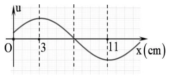
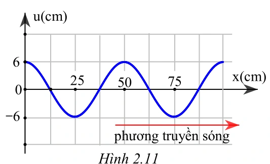
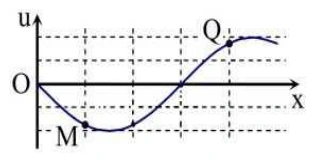
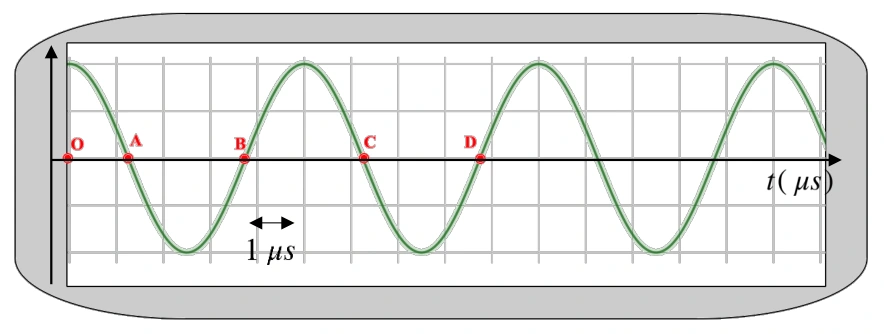
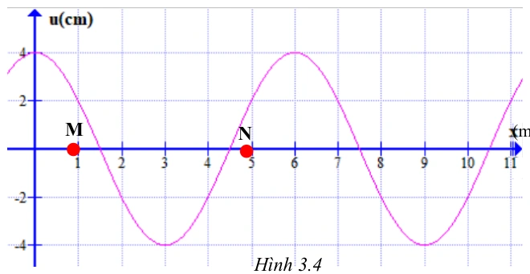
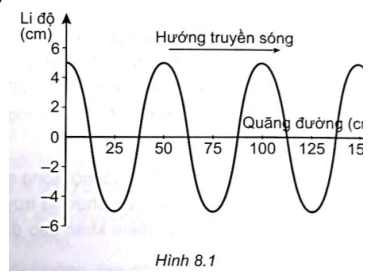

# Bài tập — Bài 2 — Phương trình sóng, độ lệch pha và đồ thị

> Hệ bài tập được biên soạn theo các dạng xuất hiện trong bộ tài liệu Vật lí 11 của dự án. Câu hỏi được giữ ngắn, trực tiếp; độ khó tăng dần và không cố tình thêm dữ kiện gây nhiễu.

[← Trở lại bài học](../../02-wave-equation-phase-graphs.md)

## Phần A — Trắc nghiệm 4 lựa chọn

### Bài 1 — Mức 1 — Nhận biết

Sóng truyền theo chiều dương Ox, nguồn tại O có $u_O=A\cos\omega t$. Phương trình tại điểm cách O một đoạn $x$ là

A. $u=A\cos(\omega t+2\pi x/\lambda)$.
B. $u=A\cos(\omega t-2\pi x/\lambda)$.
C. $u=A\cos(2\pi x/\lambda)$.
D. $u=A\cos(\omega x-2\pi t/\lambda)$.

??? success "Đáp án và lời giải"
    Chọn **B**. Điểm xa nguồn trễ pha $2\pi x/\lambda$.

### Bài 2 — Mức 1 — Nhận biết

Hai điểm cách nhau $\lambda/4$ trên cùng phương truyền sóng có độ lệch pha theo độ lớn là

A. $\pi/4$.
B. $\pi/2$.
C. $\pi$.
D. $2\pi$.

??? success "Đáp án và lời giải"
    Chọn **B**. $\Delta\varphi=2\pi(\lambda/4)/\lambda=\pi/2$.

### Bài 3 — Mức 1 — Nhận biết

Một sóng có phương trình $u=3\cos(8\pi t-2\pi x)$ cm, với $x$ tính bằng mét. Tốc độ truyền sóng là

A. $2$ m/s.
B. $4$ m/s.
C. $8$ m/s.
D. $16$ m/s.

??? success "Đáp án và lời giải"
    Chọn **B**. $\omega=8\pi$ nên $f=4$ Hz; hệ số của $x$ là $2\pi/\lambda=2\pi$ nên $\lambda=1$ m. Do đó $v=f\lambda=4$ m/s.

## Phần B — Đúng/Sai

### Bài 4 — Mức 2 — Thông hiểu

Với sóng $u=A\cos(\omega t-kx+\varphi_0)$:

a) $k=2\pi/\lambda$.
b) Điểm ở xa hơn theo chiều truyền có pha nhỏ hơn tại cùng thời điểm.
c) Khoảng thời gian trễ giữa hai điểm cách nhau $d$ là $d/v$.
d) Hai điểm cách nhau $2\lambda$ ngược pha.

??? success "Đáp án và lời giải"
    a) **Đúng**.
    b) **Đúng** với dạng truyền theo chiều dương Ox.
    c) **Đúng**.
    d) **Sai**: chênh pha $4\pi$, nên cùng pha.

## Phần C — Trả lời ngắn

### Bài 5 — Mức 3 — Vận dụng

Sóng có $f=10$ Hz, $v=2$ m/s. Tính độ lệch pha giữa hai điểm cách nhau $15$ cm trên phương truyền.

??? success "Đáp án và lời giải"
    $\lambda=v/f=0,20$ m. $\Delta\varphi=2\pi d/\lambda=2\pi\cdot0,15/0,20=3\pi/2$ rad.

### Bài 6 — Mức 3 — Vận dụng

Nguồn O dao động $u_O=4\cos(10\pi t+\pi/6)$ cm. Sóng truyền với $v=2$ m/s. Viết phương trình tại M cách O $30$ cm theo chiều truyền.

??? success "Đáp án và lời giải"
    $f=\omega/(2\pi)=5$ Hz nên $\lambda=v/f=0,4$ m. Độ trễ pha $2\pi d/\lambda=2\pi\cdot0,3/0,4=3\pi/2$. Do đó $u_M=4\cos(10\pi t+\pi/6-3\pi/2)$ cm, có thể rút gọn pha tương đương.

### Bài 7 — Mức 3 — Vận dụng

Một ảnh chụp sóng tại một thời điểm cho thấy khoảng cách giữa hai đỉnh liên tiếp là $24$ cm. Nguồn dao động $5$ Hz. Tính tốc độ truyền sóng.

??? success "Đáp án và lời giải"
    Khoảng cách giữa hai đỉnh liên tiếp chính là $\lambda=0,24$ m. $v=f\lambda=5\cdot0,24=1,20$ m/s.

## Phần D — Vận dụng và vận dụng cao

### Bài 8 — Mức 4 — Vận dụng cao

Một sóng truyền theo chiều dương Ox có phương trình tại M là $u_M=5\cos(6\pi t-\pi/3)$ cm và tại N là $u_N=5\cos(6\pi t-5\pi/6)$ cm. Biết MN nằm theo chiều truyền và nhỏ hơn một bước sóng. Tốc độ truyền sóng $v=3$ m/s. Tính MN.

??? success "Đáp án và lời giải"
    Tại cùng thời điểm, N trễ pha so với M một lượng

    $\Delta\varphi=5\pi/6-\pi/3=\pi/2$.

    Tần số $f=6\pi/(2\pi)=3$ Hz, nên $\lambda=v/f=1$ m.

    Vì $\Delta\varphi=2\pi\,MN/\lambda$ và $MN<\lambda$:

    $MN=(\pi/2)\lambda/(2\pi)=\lambda/4=0,25$ m.

## Ngân hàng bài tập mở rộng

> Các bài dưới đây được đánh số nối tiếp phần bài tập phía trên. Đề bài được trình bày bằng Markdown; chỉ đồ thị, hình vẽ hoặc sơ đồ thực sự cần thiết mới được giữ dưới dạng hình. Đáp án và lời giải được đặt trong nút mở rộng ngay dưới từng bài.

### Nhận biết — Trả lời ngắn

#### Bài 9

<!-- source-id: BT-Chuong-II-p24-q2-46 -->

Tốc độ truyền âm trong không khí là 340 m/s, khoảng cách giữa hai điểm gần nhau nhất trên một
phương truyền sóng dao động ngược pha cách nhau 0,8 (m). Tần số của sóng âm là bao nhiêu Hz ?

??? success "Đáp án và lời giải"
    **Đáp án:** $213$
    **Hướng dẫn giải:**

    Trên cùng phương truyền sóng, $\Delta\varphi=2\pi d/\lambda$; phương trình tại điểm cách nguồn $x$ chậm pha một lượng $2\pi x/\lambda$ theo chiều truyền sóng.

    Hai vị trí dao động ngược pha cách nhau
    Tần số sóng

    Vậy kết quả cần tìm là **$213$**.
#### Bài 10

<!-- source-id: BT-Chuong-II-p25-q3-47 -->

Một sóng cơ học truyền dọc theo trục $Ox$ có phương trình

$$
u=5\cos\left(5\pi t-\frac{\pi}{3}x\right)\ \text{cm},
$$

với $t$ tính bằng giây và $x$ tính bằng mét. Tốc độ truyền sóng là bao nhiêu mét trên giây?

??? success "Đáp án và lời giải"
    **Đáp án: $15$ m/s.**
    **Hướng dẫn giải:**

    So sánh với $u=A\cos(\omega t-kx)$, ta có

    $$\omega=5\pi\ \text{rad/s},\qquad k=\frac{\pi}{3}\ \text{rad/m}.$$

    Vì $v=\omega/k$,

    $$v=\frac{5\pi}{\pi/3}=15\ \text{m/s}.$$
#### Bài 11

<!-- source-id: BT-Chuong-II-p25-q5-49 -->

Sóng truyền dọc theo trục Ox có đồ thị như hình. Bước sóng của sóng là bao nhiêu cm ?

{ loading=lazy }

??? success "Đáp án và lời giải"
    **Đáp án:** $16$
    **Hướng dẫn giải:**

    Trên cùng phương truyền sóng, $\Delta\varphi=2\pi d/\lambda$; phương trình tại điểm cách nguồn $x$ chậm pha một lượng $2\pi x/\lambda$ theo chiều truyền sóng.

    Vậy kết quả cần tìm là **$16$**.
#### Bài 12

<!-- source-id: BT-Chuong-II-p26-q6-50 -->

Sóng truyền dọc theo trục Ox có đồ thị như hình 2.11. Vị trí gần nguồn sóng nhất và dao
động ngược pha với nguồn O cách nguồn O một khoảng bao nhiêu xen-ti-mét?

{ loading=lazy }

??? success "Đáp án và lời giải"
    **Đáp án:** $25$
    **Hướng dẫn giải:**

    Trên cùng phương truyền sóng, $\Delta\varphi=2\pi d/\lambda$; phương trình tại điểm cách nguồn $x$ chậm pha một lượng $2\pi x/\lambda$ theo chiều truyền sóng.

    Hai vị trí trên hình vẽ cách nhau 2
    λ= 25 cm. Do đó Vị trí gần nhất dao động ngược pha với
    nguồn cách nguồn một khoảng 25 cm.
    phương truyền sóng

    Vậy kết quả cần tìm là **$25$**.
#### Bài 13

<!-- source-id: BT-Chuong-II-p36-q1-73 -->

Một nguồn âm có tần số 725 Hz đặt trong nước. Biết tốc độ truyền âm trong không khí là 1450 m/s.
Khoảng cách giữa hai điểm gần nhau nhất trên cùng một phương truyền sóng dao động lệch pha 4
π(rad)
là bao nhiêu (tính theo đơn vị mét) ?

??? success "Đáp án và lời giải"
    **Đáp án:** $0{,}25$
    **Hướng dẫn giải:**

    Trên cùng phương truyền sóng, $\Delta\varphi=2\pi d/\lambda$; phương trình tại điểm cách nguồn $x$ chậm pha một lượng $2\pi x/\lambda$ theo chiều truyền sóng.

    Hai vị trí gần nhau nhất lệch pha 4

    Vậy kết quả cần tìm là **$0{,}25$**.
#### Bài 14

<!-- source-id: BT-Chuong-II-p36-q2-74 -->

Một sóng cơ học truyền dọc theo trục Ox của một môi trường vật chất đàn hồi. Biết tốc độ
truyền sóng là 36 (m/s), tần số sóng là 6 Hz. Độ lệch pha giữa hai vị trí cách nhau 4 cm trên cùng
phương truyền sóng là bao nhiêu (tính theo đơn vị rad và làm tròn đến số thập phân thứ hai) ?

??? success "Đáp án và lời giải"
    **Đáp án:** $4{,}19$
    **Hướng dẫn giải:**

    Trên cùng phương truyền sóng, $\Delta\varphi=2\pi d/\lambda$; phương trình tại điểm cách nguồn $x$ chậm pha một lượng $2\pi x/\lambda$ theo chiều truyền sóng.

    Độ lệch pha:

    Vậy kết quả cần tìm là **$4{,}19$**.
#### Bài 15

<!-- source-id: BT-Chuong-II-p37-q3-75 -->

Nguồn sóng dao động điều hòa dao động với tần số 100 Hz. Hai điểm nằm trên cùng một
phương truyền sóng cách nhau 15 cm dao động cùng pha. Biết vận tốc sóng nằm trong khoảng từ 5
(m/s) đến 6,7 (m/s). Tính tốc độ truyền sóng tính theo đơn vị m/s?

??? success "Đáp án và lời giải"
    **Đáp án:** 5
    **Hướng dẫn giải:**

    Trên cùng phương truyền sóng, $\Delta\varphi=2\pi d/\lambda$; phương trình tại điểm cách nguồn $x$ chậm pha một lượng $2\pi x/\lambda$ theo chiều truyền sóng.

    Hai điểm dao động cùng pha khi:
    Thay số x = 15 cm; v1 = 5 (m/s) và f = 100 Hz ta tính được k1 = 3
    Thay số x = 15 cm; v2 = 6,7 (m/s) và f = 100 Hz ta tính được k2 = 2,24
    Vì k là số nguyên và 2,24

    Vậy kết quả cần tìm là **5**.
#### Bài 16

<!-- source-id: BT-Chuong-II-p38-q6-78 -->

Một sóng cơ truyền dọc theo trục Ox với phương trình u = 5cos(8πt – πx) (u và x tính bằng
cm, t tính bằng s). Tại thời điểm
( )
1
12 s và ở vị trí cách nguồn một khoảng ( )
1
3 m thì li độ sóng có
giá trị là bao nhiêu (tính theo đơn vị cm) ?

??? success "Đáp án và lời giải"
    **Đáp án:** $2{,}5$
    **Hướng dẫn giải:**

    Trên cùng phương truyền sóng, $\Delta\varphi=2\pi d/\lambda$; phương trình tại điểm cách nguồn $x$ chậm pha một lượng $2\pi x/\lambda$ theo chiều truyền sóng.

    Li độ sóng
    Chủ đề 9: SÓNG NGANG. SÓNG DỌC. SỰ TRUYỀN NĂNG LƯỢNG CỦA
    • Yêu cầu cần đạt (Trích từ CTGDPT Vật lí 2018):
    – So sánh được sóng dọc và sóng ngang.
    – Nêu được ví dụ chứng tỏ sóng truyền năng lượng.
    – Sử dụng mô hình sóng giải thích được một số tính chất đơn giản của âm thanh và ánh sáng.

    Vậy kết quả cần tìm là **$2{,}5$**.
#### Bài 17

<!-- source-id: BT-Chuong-II-p62-q3-155 -->

Sóng trên mặt nước là sóng ngang. Một người quan sát thấy một chiếc phao trên mặt biển nhô lên cao
10 lần trong 36 giây và đo được khoảng cách hai đỉnh lân cận là 10 m. Tốc độ truyền sóng trên mặt biển là bao
nhiêu (tính theo đơn vị m/s)?

??? success "Đáp án và lời giải"
    **Đáp án:** $2{,}5$
    **Hướng dẫn giải:**

    Trên cùng phương truyền sóng, $\Delta\varphi=2\pi d/\lambda$; phương trình tại điểm cách nguồn $x$ chậm pha một lượng $2\pi x/\lambda$ theo chiều truyền sóng.

    Chiếc phao nhô lên cao 10 lần trong 9 chu kỳ nên 9
    Khoảng cách giữa 2 đỉnh lân cận chính bằng bước sóng nên
    Tốc độ truyền sóng

    Vậy kết quả cần tìm là **$2{,}5$**.
### Nhận biết — Trắc nghiệm 4 lựa chọn

#### Bài 18

<!-- source-id: BT-Chuong-II-p9-q1-1 -->

Chọn phương án sai. Quá trình truyền sóng cơ học là quá trình

A. lan truyền các biến dạng cơ học trong môi trường vật chất đàn hồi.

B. lan truyền pha dao động giữa các phần tử vật chất có sóng truyền qua.

C. lan truyền dao động trong môi trường vật chất đàn hồi.

D. lan truyền các phần tử vật chất trong môi trường vật chất đàn hồi

??? success "Đáp án và lời giải"
    **Đáp án:** D
    **Hướng dẫn giải:**

    Trên cùng phương truyền sóng, $\Delta\varphi=2\pi d/\lambda$; phương trình tại điểm cách nguồn $x$ chậm pha một lượng $2\pi x/\lambda$ theo chiều truyền sóng.

    Đối chiếu kết quả với các lựa chọn, phương án phù hợp là **D. lan truyền các phần tử vật chất trong môi trường vật chất đàn hồi**
#### Bài 19

<!-- source-id: BT-Chuong-II-p11-q16-16 -->

Hai điểm liên tiếp $M$ và $N$ trên cùng một phương truyền sóng dao động ngược pha cách nhau một khoảng $x$. Giá trị của $x$ là

A. $\lambda$.

B. $\dfrac{\lambda}{2}$.

C. $\dfrac{\lambda}{4}$.

D. $\dfrac{\lambda}{8}$.

??? success "Đáp án và lời giải"
    **Hướng dẫn giải:**
    Hai điểm M và N trên phương truyền sóng cách nhau
    , có độ lệch pha tương ứng là
    (ngược pha) được minh hoạ qua hình 2.3.

    .

#### Bài 20

<!-- source-id: BT-Chuong-II-p12-q17-17 -->

Hai điểm A, B liên tiếp trên cùng một phương truyền sóng cách nhau 20 cm dao động lệch
pha nhau
 (rad). Bước sóng của sóng này là

A. 40 cm.

B. 60 cm.

C. 120 cm.

D. 180 cm.

??? success "Đáp án và lời giải"
    **Đáp án:** C
    **Hướng dẫn giải:**
    Hai điểm điểm liên tiếp trên cùng một phương truyền sóng dao động lệch pha nhau

     (rad) cách
    nhau một khoảng:

#### Bài 21

<!-- source-id: BT-Chuong-II-p15-q28-28 -->

Hai phần tử trên cùng một phương truyền sóng cách nhau một khoảng $x$ dao động ngược pha khi

A. $x=\dfrac{k\lambda}{2}$.

B. $x=k\lambda$.

C. $x=\left(k+\dfrac12\right)\lambda$.

D. $x=\left(k+\dfrac12\right)\dfrac{\lambda}{2}$, với $k\in\mathbb Z$.

??? success "Đáp án và lời giải"
    **Đáp án: C.**
    **Hướng dẫn giải:**

    Hai điểm ngược pha khi

    $$\Delta\varphi=(2k+1)\pi.$$

    Mà $\Delta\varphi=\dfrac{2\pi x}{\lambda}$, nên

    $$x=\frac{(2k+1)\lambda}{2}=\left(k+\frac12\right)\lambda.$$
#### Bài 22

<!-- source-id: BT-Chuong-II-p15-q31-31 -->

Một nguồn sóng dao động điều hòa. Tại thời điểm t, pha dao động của nguồn là 5
6
π. Tại
một điểm M cách nguồn sóng một khoảng 3
λpha dao động tại M có giá trị là

A. .
2
πrad

B. .
4
πrad

C. .
3
πrad

D. .
6
πrad

??? success "Đáp án và lời giải"
    **Đáp án:** D
    **Hướng dẫn giải:**

    Trên cùng phương truyền sóng, $\Delta\varphi=2\pi d/\lambda$; phương trình tại điểm cách nguồn $x$ chậm pha một lượng $2\pi x/\lambda$ theo chiều truyền sóng.

    Độ lệch pha giữa sóng tại M và nguồn O là:
    Vì sóng truyền từ nguồn O đến M nên tại M sóng trễ pha so với nguồn O. Pha dao động tại điểm M

    Đối chiếu kết quả với các lựa chọn, phương án phù hợp là **D. . 6 πrad**
#### Bài 23

<!-- source-id: BT-Chuong-II-p16-q33-33 -->

Nguồn sóng tại $O$ dao động theo phương trình

$$
u_O=4\cos\left(2\pi t+\frac{\pi}{2}\right)\ \text{cm}.
$$

Sóng truyền ra môi trường xung quanh với tốc độ $6$ m/s. **Để dữ kiện và các phương án của đề đồng nhất, lấy điểm $M$ cách nguồn $4$ m**. Phương trình sóng tại $M$ là

A. $u_M=4\cos\left(2\pi t-\dfrac{5\pi}{6}\right)$ cm.

B. $u_M=4\cos\left(2\pi t-\dfrac{11\pi}{6}\right)$ cm.

C. $u_M=4\cos\left(2\pi t+\dfrac{5\pi}{6}\right)$ cm.

D. $u_M=4\cos\left(2\pi t+\dfrac{11\pi}{6}\right)$ cm.

??? success "Đáp án và lời giải"
    **Đáp án: A.**
    **Hướng dẫn giải:**

    Từ $\omega=2\pi$ rad/s suy ra $T=1$ s và

    $$\lambda=vT=6\ \text{m}.$$

    Với $OM=4$ m, độ trễ pha là

    $\displaystyle \Delta\varphi=\frac{2\pi OM}{\lambda}=\frac{4\pi}{3}.$

    Do đó

    $\displaystyle u_M=4\cos\left(2\pi t+\frac{\pi}{2}-\frac{4\pi}{3}\right) =4\cos\left(2\pi t-\frac{5\pi}{6}\right)\ \text{cm}.$

    *Tài liệu nguồn in khoảng cách $12$ m nhưng lại đánh dấu phương án A; với $12$ m thì các phương án không khớp. Bài được hiệu chỉnh tối thiểu thành $4$ m để giữ đúng ý tưởng và đáp án của nguồn.*
#### Bài 24

<!-- source-id: BT-Chuong-II-p18-q37-37 -->

Nguồn sóng dao động điều hòa dao động với tần số 1000 Hz. Hai điểm nằm trên cùng một
phương truyền sóng cách nhau 15 cm dao động cùng pha. Biết vận tốc sóng nằm trong khoảng từ
28 (m/s) đến 34 (m/s). Vận tốc truyền sóng bằng

A. 28 m/s.

B. 30 m/s.

C. 34 m/s.

D. 32 m/s.

??? success "Đáp án và lời giải"
    **Đáp án:** B
    **Hướng dẫn giải:**

    Trên cùng phương truyền sóng, $\Delta\varphi=2\pi d/\lambda$; phương trình tại điểm cách nguồn $x$ chậm pha một lượng $2\pi x/\lambda$ theo chiều truyền sóng.

    , hai điểm dđ cùng pha khi Δϕ = k 2π, với k =1, 2, 3, 4, …
    Với v = 28 m/s ⇒ k = 5,36
    Với v = 34 m/s ⇒ k = 4,4
    k là số nguyên và 4,4  k  5,36 ⇒ k = 5
    Thế k = 5 vào (*) ta tính được v = 150/5 = 30 m/s

    Đối chiếu kết quả với các lựa chọn, phương án phù hợp là **B. 30 m/s.**
#### Bài 25

<!-- source-id: BT-Chuong-II-p27-q3-53 -->

Gọi d là khoảng cách giữa hai điểm liên tiếp trên phương truyền sóng dao động vuông pha.
Bước sóng của sóng này bằng

A. 2d.

B. 4d.

C. 3d.

D. d.

??? success "Đáp án và lời giải"
    **Đáp án:** B
    **Hướng dẫn giải:**

    Trên cùng phương truyền sóng, $\Delta\varphi=2\pi d/\lambda$; phương trình tại điểm cách nguồn $x$ chậm pha một lượng $2\pi x/\lambda$ theo chiều truyền sóng.

    Hai điểm liên tiếp dao động vuông pha cách nhau một khoảng

    Đối chiếu kết quả với các lựa chọn, phương án phù hợp là **B. 4d.**
#### Bài 26

<!-- source-id: BT-Chuong-II-p28-q6-56 -->

Một sóng cơ truyền dọc theo trục Ox với phương trình u = 5cos(8πt – 0,04πx) (u và x tính
bằng cm, t tính bằng s). Tốc độ truyền sóng của sóng này là

A. 200 m/s.

B. 20 m/s.

C. 0,2 m/s.

D. 2 m/s.

??? success "Đáp án và lời giải"
    **Đáp án:** D
    **Hướng dẫn giải:**

    Trên cùng phương truyền sóng, $\Delta\varphi=2\pi d/\lambda$; phương trình tại điểm cách nguồn $x$ chậm pha một lượng $2\pi x/\lambda$ theo chiều truyền sóng.

    Tốc độ truyền sóng

    Đối chiếu kết quả với các lựa chọn, phương án phù hợp là **D. 2 m/s.**
#### Bài 27

<!-- source-id: BT-Chuong-II-p28-q7-57 -->

Một sóng cơ lan truyền trên một sợi dây đàn hội. Xét trên một hướng truyền sóng, khoảng
cách giữa hai phần tử môi trường

A. dao động cùng pha là một phần tư bước sóng.

B. gần nhau nhất dao động cùng pha là một bước sóng.

C. dao động ngược pha là một phần tư bước sóng.

D. gần nhau nhất dao động ngược pha là một bước sóng.

??? success "Đáp án và lời giải"
    **Đáp án:** B
    **Hướng dẫn giải:**

    Trên cùng phương truyền sóng, $\Delta\varphi=2\pi d/\lambda$; phương trình tại điểm cách nguồn $x$ chậm pha một lượng $2\pi x/\lambda$ theo chiều truyền sóng.

    Đối chiếu kết quả với các lựa chọn, phương án phù hợp là **B. gần nhau nhất dao động cùng pha là một bước sóng.**
#### Bài 28

<!-- source-id: BT-Chuong-II-p28-q10-60 -->

Một nguồn O sóng dao động điều hòa, khi pha dao động tại nguồn sóng là
(
)
5
6
rad
π
thì tại
điểm M cách nguồn một khoảng 3
λsóng có pha dao động là

A. .
3 rad
π

B. 2
.
3 rad
π

C. .
6 rad
π

D. .
2 rad
π

??? success "Đáp án và lời giải"
    **Đáp án:** C
    **Hướng dẫn giải:**

    Trên cùng phương truyền sóng, $\Delta\varphi=2\pi d/\lambda$; phương trình tại điểm cách nguồn $x$ chậm pha một lượng $2\pi x/\lambda$ theo chiều truyền sóng.

    Độ lệch pha giữa M và nguồn O có độ lệch pha là
    Điểm M dao động trễ pha so với nguồn. Khi đó pha dao động tại M là :

    Đối chiếu kết quả với các lựa chọn, phương án phù hợp là **C. . 6 rad π**
#### Bài 29

<!-- source-id: BT-Chuong-II-p29-q11-61 -->

Trên cùng một phương truyền sóng, hai phần tử dao động vuông pha cách nhau một khoảng

A. $x=k\lambda$.

B. $x=\dfrac{k\lambda}{2}$.

C. $x=\left(k+\dfrac12\right)\lambda$.

D. $x=\left(k+\dfrac12\right)\dfrac{\lambda}{2}$, với $k\in\mathbb Z$.

??? success "Đáp án và lời giải"
    **Đáp án: D.**
    **Hướng dẫn giải:**

    Hai điểm vuông pha khi

    $$\Delta\varphi=\frac{(2k+1)\pi}{2}.$$

    Từ $\Delta\varphi=\dfrac{2\pi x}{\lambda}$ suy ra

    $$x=\frac{(2k+1)\lambda}{4}=\left(k+\frac12\right)\frac{\lambda}{2}.$$
#### Bài 30

<!-- source-id: BT-Chuong-II-p30-q15-65 -->

Vận tốc truyền âm trong nước là 1500 m/s, khoảng cách giữa hai điểm gần nhau nhất trên
một phương truyền sóng dao động vuông pha cách nhau 3 (m). Tần số của sóng âm này là

A. 50 Hz.

B. 25 Hz.

C. 125 Hz.

D. 100 Hz.

??? success "Đáp án và lời giải"
    **Đáp án:** C
    **Hướng dẫn giải:**

    Trên cùng phương truyền sóng, $\Delta\varphi=2\pi d/\lambda$; phương trình tại điểm cách nguồn $x$ chậm pha một lượng $2\pi x/\lambda$ theo chiều truyền sóng.

    Hai điểm dao động vuông pha Δϕ = (2k + 1) 2
    Là hai điểm gần nhau nhất, ta chọn k = 0.
    Tần số sóng: λ=v/f ⇒ f = v/ λ = 1500/12 = 125 Hz

    Đối chiếu kết quả với các lựa chọn, phương án phù hợp là **C. 125 Hz.**
#### Bài 31

<!-- source-id: BT-Chuong-II-p31-q17-67 -->

Một sợi dây đàn hồi rất dài, đầu A dao động với tần số 16
20
Hz
f
Hz


. Biết tốc độ truyền
sóng trên dây là 2 (m/s). Người ta nhận thấy hai điểm A, B trên dây cách nhau 40 cm luôn dao động
ngược pha. Tần số của sóng này là

A. 16 Hz.

B. 17,5 Hz.

C. 18 Hz.

D. 20 Hz.

??? success "Đáp án và lời giải"
    **Đáp án:** B
    **Hướng dẫn giải:**

    Trên cùng phương truyền sóng, $\Delta\varphi=2\pi d/\lambda$; phương trình tại điểm cách nguồn $x$ chậm pha một lượng $2\pi x/\lambda$ theo chiều truyền sóng.

    Hai dao động ngược pha có
    Thay x = 0,4 (m); v = 2 (m/s) và f1 = 16 Hz ta tính được
    Thay x = 0,4 (m); v = 2 (m/s) và f2 = 20 Hz ta tính được
    Vì k lấy giá trị nguyên trong khoảng 2,7 đến 3,5. Vậy k = 3
    ta tính được

    Đối chiếu kết quả với các lựa chọn, phương án phù hợp là **B. 17,5 Hz.**
#### Bài 32

<!-- source-id: BT-Chuong-II-p31-q18-68 -->

Trên một sợi dây dài đang có sóng ngang hình sin truyền qua theo chiều dương của trục
Ox. Tại thời điểm t0, một đoạn của sợi dây có hình dạng như hình 3.2. Hai phần tử dây tại M và Q
dao động lệch pha nhau là

A. 3
π

B. π.

C. 2π.

D. 4
π.

{ loading=lazy }

??? success "Đáp án và lời giải"
    **Đáp án:** B
    **Hướng dẫn giải:**

    Trên cùng phương truyền sóng, $\Delta\varphi=2\pi d/\lambda$; phương trình tại điểm cách nguồn $x$ chậm pha một lượng $2\pi x/\lambda$ theo chiều truyền sóng.

    Từ hình 3.3 ta thấy khoảng cách nửa bước sóng 2
    Khoảng cách M và Q là x = MQ = 3 ô
    Độ lệch pha giữa M và Q là

    Đối chiếu kết quả với các lựa chọn, phương án phù hợp là **B. π.**
#### Bài 33

<!-- source-id: BT-Chuong-II-p45-q10-88 -->

Phát biểu nào sau đây đúng khi nói về sóng cơ?

A. Sóng cơ truyền trong chất lỏng luôn là sóng ngang.

B. Bước sóng là khoảng cách giữa hai điểm trên cùng một phương truyền sóng mà dao động tại hai
điểm đó cùng pha.

C. Sóng cơ truyền trong chất rắn luôn là sóng dọc.

D. Bước sóng là khoảng cách giữa hai điểm gần nhau nhất trên cùng một phương truyền sóng mà dao
động tại hai điểm đó cùng pha.

??? success "Đáp án và lời giải"
    **Đáp án:** D
    **Hướng dẫn giải:**

    Trên cùng phương truyền sóng, $\Delta\varphi=2\pi d/\lambda$; phương trình tại điểm cách nguồn $x$ chậm pha một lượng $2\pi x/\lambda$ theo chiều truyền sóng.

    Đối chiếu kết quả với các lựa chọn, phương án phù hợp là **D. Bước sóng là khoảng cách giữa hai điểm gần nhau nhất trên cùng một phương truyền sóng mà dao động tại hai điểm đó cùng pha.**
#### Bài 34

<!-- source-id: BT-Chuong-II-p50-q35-113 -->

Một sóng ngang truyền trên sợi dây rất dài với tốc độ truyền sóng là 4 m/s và tần số sóng có giá trị
trong khoảng từ 33 Hz đến 43 Hz. Biết hai phần tử tại hai điểm trên dây cách nhau 25 cm luôn dao động ngược
pha nhau. Tần số sóng trên dây là

A. 35 Hz.

B. 37 Hz.

C. 40 Hz.

D. 42 Hz.

??? success "Đáp án và lời giải"
    **Đáp án:** C
    **Hướng dẫn giải:**

    Trên cùng phương truyền sóng, $\Delta\varphi=2\pi d/\lambda$; phương trình tại điểm cách nguồn $x$ chậm pha một lượng $2\pi x/\lambda$ theo chiều truyền sóng.

    Hai điểm trên dây cách nhau 25 cm luôn dao động ngược pha nhau
    Tần số sóng

    Đối chiếu kết quả với các lựa chọn, phương án phù hợp là **C. 40 Hz.**
#### Bài 35

<!-- source-id: BT-Chuong-II-p51-q40-118 -->

Một sóng ngang cơ học truyền trên một sợi dây đàn hồi với biên độ không đổi bằng 7 cm. Trong quá
trình dao động, khoảng cách gần nhất và xa nhất giữa hai điểm M, N trên dây lần lượt bằng 21 cm và
490
cm. Như vậy hai điểm M, N dao động

A. cùng pha với nhau.

B. ngược pha với nhau.

C. vuông pha với nhau.

D. lệch pha nhau
3
π
.

??? success "Đáp án và lời giải"
    **Đáp án:** D
    **Hướng dẫn giải:**

    Trên cùng phương truyền sóng, $\Delta\varphi=2\pi d/\lambda$; phương trình tại điểm cách nguồn $x$ chậm pha một lượng $2\pi x/\lambda$ theo chiều truyền sóng.

    - Khoảng cách nhỏ nhất
    - Khoảng cách lớn nhất

    Đối chiếu kết quả với các lựa chọn, phương án phù hợp là **D. lệch pha nhau 3 π .**
#### Bài 36

<!-- source-id: BT-Chuong-II-p58-q4-134 -->

Kết luận nào sau đây không đúng về quá trình lan truyền của sóng cơ?

A. Quá trình truyền sóng cơ là quá trình truyền năng lượng.

B. Quãng đường sóng đi được trong nửa chu kỳ đúng bằng nửa bước sóng.

C. Quá trình truyền sóng cơ không có sự truyền pha dao động.

D. Quá trình truyền sóng cơ không mang theo phần tử môi trường khi lan truyền.

??? success "Đáp án và lời giải"
    **Đáp án:** C
    **Hướng dẫn giải:**

    Trên cùng phương truyền sóng, $\Delta\varphi=2\pi d/\lambda$; phương trình tại điểm cách nguồn $x$ chậm pha một lượng $2\pi x/\lambda$ theo chiều truyền sóng.

    Đối chiếu kết quả với các lựa chọn, phương án phù hợp là **C. Quá trình truyền sóng cơ không có sự truyền pha dao động.**
#### Bài 37

<!-- source-id: BT-Chuong-II-p194-q2-426 -->

Phát biểu nào sau đây là sai khi nói về quá trình truyền sóng?

A. Quá trình truyền sóng là quá trình truyền dao động trong môi trường đàn hồi.

B. Quá trình truyền sóng là quá trình truyền năng lượng.

C. Quá trình truyền sóng là quá trình truyền pha dao động.

D. Quá trình truyền sóng là quá trình truyền các phần tử vật chất.

??? success "Đáp án và lời giải"
    **Đáp án:** D
    **Hướng dẫn giải:**
    Quá trình truyền sóng là quá trình truyền pha dao động và quá trình truyền năng lượng.

#### Bài 38

<!-- source-id: BT-Chuong-II-p195-q6-430 -->

Tìm phát biểu sai:

A. Bước sóng là khoảng cách giữa 2 điểm trên cùng phương truyền gần nhau nhất và dao động cùng
pha.

B. Những điểm cách nhau một số lẻ lần nửa bước sóng trên cùng phương truyền sóng thì dao động
ngược pha.

C. Bước sóng là khoảng truyền của sóng trong thời gian 1 chu kì T.

D. Những điểm cách nhau một số nguyên lần nửa bước sóng trên cùng phương truyền thì dao động
cùng pha.

??? success "Đáp án và lời giải"
    **Đáp án:** D
    **Hướng dẫn giải:**
    Những điểm cách nhau một số nguyên lần nửa bước sóng trên cùng phương truyền thì dao động
    ngược pha.

#### Bài 39

<!-- source-id: BT-Chuong-II-p195-q7-431 -->

Phương trình sóng có dạng nào trong các dạng dưới đây?

A. $x=A\cos(\omega t+\varphi)$.

B. $u=A\cos\left(\omega t-\dfrac{x}{\lambda}\right)$.

C. $u=A\cos\left[2\pi\left(\dfrac{t}{T}-\dfrac{x}{\lambda}\right)\right]$.

D. $u=A\cos\left(\dfrac{\omega t}{T}+\varphi\right)$.

??? success "Đáp án và lời giải"
    **Đáp án: C.**
    **Hướng dẫn giải:**

    Một sóng điều hòa truyền theo chiều dương có thể viết

    $\displaystyle u=A\cos(\omega t-kx+\varphi_0),$

    với $\omega=2\pi/T$ và $k=2\pi/\lambda$. Khi chọn pha ban đầu bằng $0$,

    $\displaystyle u=A\cos\left[2\pi\left(\frac{t}{T}-\frac{x}{\lambda}\right)\right].$
#### Bài 40

<!-- source-id: BT-Chuong-II-p196-q10-434 -->

Một sóng cơ có chu kì 2 s truyền với tốc độ 1 m/s. Khoảng cách giữa 2 điểm gần nhau nhất
trên một phương truyền mà tại đó các phần tử môi trường dao động ngược pha là

A. 0,5m.

B. 1,0m.

C. 2,0m.

D. 2,5m.

??? success "Đáp án và lời giải"
    **Đáp án:** B
    **Hướng dẫn giải:**

    Trên cùng phương truyền sóng, $\Delta\varphi=2\pi d/\lambda$; phương trình tại điểm cách nguồn $x$ chậm pha một lượng $2\pi x/\lambda$ theo chiều truyền sóng.

    Đối chiếu kết quả với các lựa chọn, phương án phù hợp là **B. 1,0m.**
#### Bài 41

<!-- source-id: BT-Chuong-II-p200-q3-457 -->

Một sóng cơ học phát ra từ một nguồn O lan truyền trên mặt nước với vận tốc v = 2 m/s.
Người ta thấy 2 điểm M, N gần nhau nhất trên mặt nước nằm trên cùng đường thẳng qua O và cách
nhau 40 cm luôn dao động ngược pha nhau. Tần số sóng đó là

A. 0,4 Hz.

B. 1,5 Hz.

C. 2 Hz.

D. 2,5 Hz.

??? success "Đáp án và lời giải"
    **Đáp án:** D
    **Hướng dẫn giải:**

    Trên cùng phương truyền sóng, $\Delta\varphi=2\pi d/\lambda$; phương trình tại điểm cách nguồn $x$ chậm pha một lượng $2\pi x/\lambda$ theo chiều truyền sóng.

    Hai điểm gần nhau nhất luôn dao động ngược pha:

    Đối chiếu kết quả với các lựa chọn, phương án phù hợp là **D. 2,5 Hz.**
#### Bài 42

<!-- source-id: BT-Chuong-II-p211-q5-487 -->

Xét một sóng truyền dọc theo trục Ox với phương trình u = 4cos (240t - 80x) (cm) (x được
tính bằng cm, t được tính bằng s). Tốc độ truyền của sóng này bằng

A. 6 cm/s.

B. 4,0 cm/s.

C. 0,33 m/s.

D. 3,0 cm/s.

??? success "Đáp án và lời giải"
    **Đáp án:** D
    **Hướng dẫn giải:**

    Trên cùng phương truyền sóng, $\Delta\varphi=2\pi d/\lambda$; phương trình tại điểm cách nguồn $x$ chậm pha một lượng $2\pi x/\lambda$ theo chiều truyền sóng.

    Đối chiếu kết quả với các lựa chọn, phương án phù hợp là **D. 3,0 cm/s.**
#### Bài 43

<!-- source-id: BT-Chuong-II-p211-q8-490 -->

Một sóng cơ lan truyền trong một môi trường. Hai điểm trên cùng một phương truyền sóng,
cách nhau một khoảng bằng bước sóng có dao động

A. ngược pha.

B. cùng pha.

C. lệch pha
𝜋
2 .

D. lệch pha
𝜋
4.

??? success "Đáp án và lời giải"
    **Hướng dẫn giải:**
    Hai điểm trên cùng một phương truyền sóng, cách nhau một khoảng bằng bước sóng có dao động
    cùng pha.

#### Bài 44

<!-- source-id: BT-Chuong-II-p212-q9-491 -->

Một sóng cơ có chu kì 2 s truyền với tốc độ 1 m/s. Khoảng cách giữa 2 điểm gần nhau nhất
trên một phương truyền mà tại đó các phần tử môi trường dao động ngược pha là

A. 0,5 m.

B. 1,0 m.

C. 2,0 m.

D. 2,5 m.

??? success "Đáp án và lời giải"
    **Đáp án:** B
    **Hướng dẫn giải:**

    Trên cùng phương truyền sóng, $\Delta\varphi=2\pi d/\lambda$; phương trình tại điểm cách nguồn $x$ chậm pha một lượng $2\pi x/\lambda$ theo chiều truyền sóng.

    Khoảng cách giữa 2 điểm gần nhau nhất trên một phương truyền mà tại đó các phần tử môi trường

    Đối chiếu kết quả với các lựa chọn, phương án phù hợp là **B. 1,0 m.**
#### Bài 45

<!-- source-id: BT-Chuong-II-p212-q10-492 -->

Một sóng cơ có chu kì 2 s truyền với tốc độ 1 m/s. Khoảng cách giữa hai điểm gần nhau nhất
trên một phương truyền mà tại đó các phần tử môi trường dao động cùng pha nhau là

A. 0,5 m.

B. 1,0 m.

C. 2,0 m.

D. 2,5 m.

??? success "Đáp án và lời giải"
    **Đáp án:** C
    **Hướng dẫn giải:**

    Trên cùng phương truyền sóng, $\Delta\varphi=2\pi d/\lambda$; phương trình tại điểm cách nguồn $x$ chậm pha một lượng $2\pi x/\lambda$ theo chiều truyền sóng.

    Đối chiếu kết quả với các lựa chọn, phương án phù hợp là **C. 2,0 m.**
#### Bài 46

<!-- source-id: BT-Chuong-II-p212-q11-493 -->

Đầu A của một dây đàn hồi nằm ngang dao động theo phương thẳng đứng với chu kỳ 10 s.
Biết vận tốc truyền sóng trên dây v = 0,2 m/s, khoảng cách giữa hai điểm gần nhau nhất dao động
vuông pha là

A. 1 m.

B. 1,5 m.

C. 2 m.

D. 0,5 m.

??? success "Đáp án và lời giải"
    **Đáp án:** D
    **Hướng dẫn giải:**

    Trên cùng phương truyền sóng, $\Delta\varphi=2\pi d/\lambda$; phương trình tại điểm cách nguồn $x$ chậm pha một lượng $2\pi x/\lambda$ theo chiều truyền sóng.

    Đối chiếu kết quả với các lựa chọn, phương án phù hợp là **D. 0,5 m.**
#### Bài 47

<!-- source-id: BT-Chuong-II-p212-q12-494 -->

Một sóng ngang truyền trên sợi dây rất dài với phương trình sóng u=u0cos(20πt – πx/10).
Trong đó x tính bằng cm, t tính bằng giây. Tốc độ truyền sóng bằng

A. 2 m/s.

B. 4 m/s.

C. 1 m/s.

D. 3 m/s.

??? success "Đáp án và lời giải"
    **Đáp án:** A
    **Hướng dẫn giải:**

    Trên cùng phương truyền sóng, $\Delta\varphi=2\pi d/\lambda$; phương trình tại điểm cách nguồn $x$ chậm pha một lượng $2\pi x/\lambda$ theo chiều truyền sóng.

    Đối chiếu kết quả với các lựa chọn, phương án phù hợp là **A. 2 m/s.**
### Nhận biết — Đúng/Sai

#### Bài 48

<!-- source-id: BT-Chuong-II-p22-q2-42 -->

Giữa hai điểm gần nhau nhất trên phương truyền sóng dao động vuông pha cách nhau 10 cm.
Thời gian hai ngọn sóng liên tiếp truyền qua trước mặt là 2 s. Biết khoảng cách từ ngọn sóng tới mức
cân bằng của mặt nước là 8 cm.

a) Chu kỳ sóng là 1 s
b) Bước sóng của sóng này là 40 cm
c) Tốc độ truyền sóng là 20 m/s
d) Tốc độ dao động cực đại của nguồn sóng là 8 cm/s

??? success "Đáp án và lời giải"
    **Đáp án:** a) Sai; b) Đúng; c) Sai; d) Sai.

    **Hướng dẫn giải:**

    a) **Sai.** Khoảng thời gian giữa hai ngọn sóng liên tiếp đi qua một điểm chính là chu kì, nên $T=2$ s.

    b) **Đúng.** Hai điểm gần nhau nhất dao động vuông pha cách nhau $\lambda/4$. Vì $\lambda/4=10$ cm nên $\lambda=40$ cm.

    c) **Sai.** Tốc độ truyền sóng $v=\lambda/T=40/2=20$ cm/s $=0{,}20$ m/s, không phải $20$ m/s.

    d) **Sai.** Biên độ $A=8$ cm và $\omega=2\pi/T=\pi$ rad/s, nên tốc độ dao động cực đại $v_{\max}=\omega A=8\pi$ cm/s, không phải $8$ cm/s.
#### Bài 49

<!-- source-id: BT-Chuong-II-p23-q3-43 -->

Ảnh chụp màn hình một dao động ký điện tử như hình 2.9 Biết tốc độ truyền sóng là 3.108
(m/s).

a) Hai thời điểm điểm A và B sóng cùng pha
b) Chu kỳ dao động của sóng là
c) Bước sóng của sóng này là 2 km
d) Nguồn sóng thực hiện 200.000 dao động toàn phần trong thời gian 1 s

{ loading=lazy }

??? success "Đáp án và lời giải"
    **Hướng dẫn giải:**

    Trên cùng phương truyền sóng, $\Delta\varphi=2\pi d/\lambda$; phương trình tại điểm cách nguồn $x$ chậm pha một lượng $2\pi x/\lambda$ theo chiều truyền sóng.

    a) Hai điểm A và B dao động ngược pha.
    b) Chu kỳ là khoảng thời gian từ A đến B.
    c) Bước sóng
    d) Áp dụng công thức:
#### Bài 50

<!-- source-id: BT-Chuong-II-p32-q1-69 -->

Sóng cơ truyền dọc theo trục Ox có phương trình u = 4cos(20πt – πx) (cm), với t tính bằng
giây, x tính bằng mét. .

a) Tần số sóng là 20 Hz
b) Tốc độ truyền sóng 20 (m/s)
c) Bước sóng là 2 (m)
d) Khoảng cách giữa một gợn sóng là một vị trí cân bằng liên tiếp là 1 (m)

??? success "Đáp án và lời giải"
    **Hướng dẫn giải:**

    Trên cùng phương truyền sóng, $\Delta\varphi=2\pi d/\lambda$; phương trình tại điểm cách nguồn $x$ chậm pha một lượng $2\pi x/\lambda$ theo chiều truyền sóng.

    a) Tần số của sóng là
    b) Tốc độ truyền sóng
    c) Bước sóng
    d) Khoảng cách giữa một ngọn sóng và một vị trí cân bằng liên tiếp cách nhau
#### Bài 51

<!-- source-id: BT-Chuong-II-p33-q3-71 -->

Một sóng cơ học truyền dọc theo trục Ox có hình dạng như hình 3.4. Biết tốc độ truyền
sóng là 3 (m/s)

a) Biên độ sóng là 8 cm
b) Bước sóng của sóng cơ học này là 6 m
c) Tần số của sóng là 0,5 Hz
d) Sóng tại M và N lệch pha 4 π(rad)

{ loading=lazy }

??? success "Đáp án và lời giải"
    **Hướng dẫn giải:**

    Trên cùng phương truyền sóng, $\Delta\varphi=2\pi d/\lambda$; phương trình tại điểm cách nguồn $x$ chậm pha một lượng $2\pi x/\lambda$ theo chiều truyền sóng.

    a) Từ đồ thị ta thấy biên độ sóng là 4 (cm)
    b) Bước sóng λ= 6 ô = 6 (cm)
    c) Tần số sóng
    d) Hai điểm M và N cách nhau khoảng x = 4 ô = 4 cm
    Độ lệch pha giữa M và N là:
#### Bài 52

<!-- source-id: BT-Chuong-II-p204-q2-466 -->

Một sóng truyền trên một dây rất dài có phương trình: u=10cos(2πt+0,01πx). Trong đó u và x
được tính bằng cm và t được tính bằng s.

a) Chu kì của sóng là 1 s.
b) Biên độ của sóng là 10 m.
c) Bước sóng của sóng là 2 m.
d) Tại điểm có x = 50 cm vào thời điểm t = 4 s, giá trị
c) ủa li độ u là 10 cm.

??? success "Đáp án và lời giải"
    **Hướng dẫn giải:**

    Trên cùng phương truyền sóng, $\Delta\varphi=2\pi d/\lambda$; phương trình tại điểm cách nguồn $x$ chậm pha một lượng $2\pi x/\lambda$ theo chiều truyền sóng.

    a) Chu kì của sóng là 1 s.
    b) Biên độ của sóng là 10 cm.
    c) Bước sóng của sóng là 2 m.
    d) Tại điểm có x = 50 cm vào thời điểm t = 4 s, giá trị của li độ u là
#### Bài 53

<!-- source-id: BT-Chuong-II-p207-q6-470 -->

Một sóng ngang truyền trên một dây rất dài có phương trình sóng là u
6cos(4 t
0,02
)
=
π−
πx
trong đó u, x tính bằng cm, t tính bằng s.

a) Biên độ sóng là 6 cm.
b) Bước sóng là 100 cm.
c) Tốc độ lan truyền của sóng là 200 cm/s.
d) Tại điểm có tọa độ x = 25 cm lúc t = 4 s, giá trị của li độ u là 6 cm.

??? success "Đáp án và lời giải"
    **Hướng dẫn giải:**

    Trên cùng phương truyền sóng, $\Delta\varphi=2\pi d/\lambda$; phương trình tại điểm cách nguồn $x$ chậm pha một lượng $2\pi x/\lambda$ theo chiều truyền sóng.

    a) Biên độ sóng là 6 cm. ( dựa vào phương trình sóng ta có )
    b) Bước sóng là
    c) Tốc độ lan truyền của sóng là 200 cm/s
    d) Tại điểm có tọa độ x = 25 cm lúc t = 4 s, giá trị của li độ u là 0 cm.
#### Bài 54

<!-- source-id: BT-Chuong-II-p214-q1-501 -->

Một sóng ngang truyền từ M đến O rồi đến N trên cùng một phương truyền sóng với vận tốc
18 m/s. Biết MN = 3 m và MO = ON, phương trình sóng tại O là
0
5cos(4
)(
)
6
u
t
cm
π
π
=
−

a) Tần số của sóng là 2 Hz.
b) Biên độ của sóng là 5 cm.
c) Bước sóng là 10 m.
d) Phương trình sóng tại M là 5cos(4 )( ) 6 M u t
c) m π π = +

??? success "Đáp án và lời giải"
    **Hướng dẫn giải:**

    Trên cùng phương truyền sóng, $\Delta\varphi=2\pi d/\lambda$; phương trình tại điểm cách nguồn $x$ chậm pha một lượng $2\pi x/\lambda$ theo chiều truyền sóng.

    a) Tần số của sóng là 2 Hz.
    b) Biên độ của sóng là 5 cm.
    Dựa vào phương trình sóng
    c) Bước sóng là 9 m.
    d. Vì M ở phía trước O theo chiều truyền sóng nên
### Thông hiểu — Trắc nghiệm 4 lựa chọn

#### Bài 55

<!-- source-id: BT-Chuong-II-p13-q19-19 -->

Hai vị trí cân bằng liên tiếp trên phương truyền sóng dao động

A. cùng pha.

B. ngược pha.

C. vuông pha.

D. lệch pha
.

??? success "Đáp án và lời giải"
    **Đáp án:** B
    **Hướng dẫn giải:**

    Trên cùng phương truyền sóng, $\Delta\varphi=2\pi d/\lambda$; phương trình tại điểm cách nguồn $x$ chậm pha một lượng $2\pi x/\lambda$ theo chiều truyền sóng.

    Đối chiếu kết quả với các lựa chọn, phương án phù hợp là **B. ngược pha.**
#### Bài 56

<!-- source-id: BT-Chuong-II-p14-q26-26 -->

Hai phần tử nằm trên cùng một phương truyền sóng cách nhau một khoảng x. Độ lệch pha
giữa hai này được xác định theo công thức

A. 2 x
π
ϕ
λ
Δ
=
.

B. 2 .
x
πλ
ϕ
Δ
=
.

C. 2 .T
π
ϕ
λ
Δ
=
.

D. 2 x
T
π
ϕ
Δ
=
.

??? success "Đáp án và lời giải"
    **Đáp án:** A
    **Hướng dẫn giải:**

    Trên cùng phương truyền sóng, $\Delta\varphi=2\pi d/\lambda$; phương trình tại điểm cách nguồn $x$ chậm pha một lượng $2\pi x/\lambda$ theo chiều truyền sóng.

    Đối chiếu kết quả với các lựa chọn, phương án phù hợp là **A. 2 x π ϕ λ Δ = .**
#### Bài 57

<!-- source-id: BT-Chuong-II-p46-q18-96 -->

Một sóng ngang truyền dọc theo sợi dây với tần số 10 Hz, hai điểm trên dây cách nhau 50 cm dao
động với độ lệch pha 5
3
π
. Tốc độ truyền sóng trên dây bằng

A. 6 m/s.

B. 3 m/s.

C. 10 m/s.

D. 5 m/s.

??? success "Đáp án và lời giải"
    **Đáp án:** A
    **Hướng dẫn giải:**

    Trên cùng phương truyền sóng, $\Delta\varphi=2\pi d/\lambda$; phương trình tại điểm cách nguồn $x$ chậm pha một lượng $2\pi x/\lambda$ theo chiều truyền sóng.

    Đối chiếu kết quả với các lựa chọn, phương án phù hợp là **A. 6 m/s.**
#### Bài 58

<!-- source-id: BT-Chuong-II-p197-q3-442 -->

Vào một thời điểm Hình 8.1 là đồ thị li độ - quãng đường truyền sóng của một sóng hình sin.
Biên độ và bước sóng của sóng này là

A. 5cm; 50 cm.

B. 6 cm; 50 cm.

C. 5 cm; 30 cm.

D. 6 cm; 30 cm.

{ loading=lazy }

??? success "Đáp án và lời giải"
    **Đáp án:** A
    **Hướng dẫn giải:**
    Dựa vào đồ thị, ta có
    Biên độ là 5 cm.
    Bước sóng là 50 cm.

#### Bài 59

<!-- source-id: BT-Chuong-II-p197-q4-443 -->

Một sóng hình sin lan truyền trên trục Ox. Trên phương truyền sóng, khoảng cách ngắn nhất
giữa 2 điểm mà các phần tử của môi trường tại điểm đó dao động ngược pha nhau là 0,4 m. Bước
sóng của sóng này là

A. 0,4 m.

B. 0,8 m.

C. 0,4 cm.

D. 0,8 cm.
??? success "Đáp án và lời giải"
    **Đáp án:** B
    **Hướng dẫn giải:**

    Trên cùng phương truyền sóng, $\Delta\varphi=2\pi d/\lambda$; phương trình tại điểm cách nguồn $x$ chậm pha một lượng $2\pi x/\lambda$ theo chiều truyền sóng.

    Đối chiếu kết quả với các lựa chọn, phương án phù hợp là **B. 0,8 m.**
#### Bài 60

<!-- source-id: BT-Chuong-II-p197-q5-444 -->

Xét một sóng truyền dọc theo trục Ox với phương trình u = 6cos (100πt - 4πx) (cm) (x được
tính bằng cm, t được tính bằng s). Tại một thời điểm, hai điểm gần nhất dao động cùng pha và hai
điểm gần nhất dao động ngược pha cách nhau các khoảng lần lượt bằng

A. 1,00 cm và 0,50 cm.

B. 0,50 cm và 0,25 cm.

C. 0,25 cm và 0,50 cm.

D. 100 cm và 4 cm.

??? success "Đáp án và lời giải"
    **Đáp án:** B
    **Hướng dẫn giải:**

    Trên cùng phương truyền sóng, $\Delta\varphi=2\pi d/\lambda$; phương trình tại điểm cách nguồn $x$ chậm pha một lượng $2\pi x/\lambda$ theo chiều truyền sóng.

    Hai điểm gần nhau nhất dao động cùng pha:
    Hai điểm gần nhau nhất dao động ngược pha:

    Đối chiếu kết quả với các lựa chọn, phương án phù hợp là **B. 0,50 cm và 0,25 cm.**
#### Bài 61

<!-- source-id: BT-Chuong-II-p198-q6-445 -->

Một sóng cơ truyền trong môi trường với tốc độ 120 m/s. Ở cùng một thời điểm, hai điểm gần
nhau nhất trên một phương truyền sóng dao động ngược pha cách nhau 1,2 m. Tần số của sóng là

A. 220Hz.

B. 150Hz.

C. 100Hz.

D. 50Hz.

??? success "Đáp án và lời giải"
    **Đáp án:** D
    **Hướng dẫn giải:**

    Trên cùng phương truyền sóng, $\Delta\varphi=2\pi d/\lambda$; phương trình tại điểm cách nguồn $x$ chậm pha một lượng $2\pi x/\lambda$ theo chiều truyền sóng.

    Đối chiếu kết quả với các lựa chọn, phương án phù hợp là **D. 50Hz.**
#### Bài 62

<!-- source-id: BT-Chuong-II-p198-q7-446 -->

Một sóng truyền theo trục Ox với phương trình u = acos(4πt – 0,02πx) (u và x tính bằng cm, t
tính bằng giây). Tốc độ truyền của sóng này là

A. 100 cm/s.

B. 150 cm/s.

C. 200 cm/s.

D. 50 cm/s.

??? success "Đáp án và lời giải"
    **Đáp án:** C
    **Hướng dẫn giải:**

    Trên cùng phương truyền sóng, $\Delta\varphi=2\pi d/\lambda$; phương trình tại điểm cách nguồn $x$ chậm pha một lượng $2\pi x/\lambda$ theo chiều truyền sóng.

    Đối chiếu kết quả với các lựa chọn, phương án phù hợp là **C. 200 cm/s.**
### Vận dụng — Trắc nghiệm 4 lựa chọn

#### Bài 63

<!-- source-id: BT-Chuong-II-p17-q35-35 -->

Tại điểm $M$, phần tử môi trường dao động theo phương trình

$$
u_M=2\cos\left(\frac{\pi}{2}t-\frac{2\pi}{3}\right)\ \text{cm}.
$$

Sóng truyền từ nguồn $O$ ra môi trường với tốc độ $3$ m/s. Nguồn $O$ cách $M$ một khoảng $2$ m. Phương trình dao động tại nguồn $O$ là

A. $u_O=2\cos\left(\dfrac{\pi}{2}t+\dfrac{\pi}{3}\right)$ cm.

B. $u_O=2\cos\left(\dfrac{\pi}{2}t\right)$ cm.

C. $u_O=2\cos\left(\dfrac{\pi}{2}t-\dfrac{\pi}{3}\right)$ cm.

D. $u_O=2\cos\left(\dfrac{\pi}{2}t+\dfrac{2\pi}{3}\right)$ cm.

??? success "Đáp án và lời giải"
    **Đáp án: C.**
    **Hướng dẫn giải:**

    $\omega=\pi/2$ rad/s nên $T=4$ s và

    $$\lambda=vT=3\cdot4=12\ \text{m}.$$

    Độ lệch pha giữa $O$ và $M$:

    $$\Delta\varphi=\frac{2\pi\cdot2}{12}=\frac{\pi}{3}.$$

    Nguồn $O$ sớm pha hơn $M$, nên

    $\displaystyle \varphi_O=-\frac{2\pi}{3}+\frac{\pi}{3}=-\frac{\pi}{3}.$

    Do đó $u_O=2\cos\left(\dfrac{\pi}{2}t-\dfrac{\pi}{3}\right)$ cm.
#### Bài 64

<!-- source-id: BT-Chuong-II-p18-q36-36 -->

Một nguồn phát sóng dao động điều hòa tạo ra sóng tròn đồng tâm O trên mặt nước với
bước sóng λ. Hai điểm M, N thuộc mặt nước, nằm trên hai phương truyền sóng mà các phần tử nước
đang dao động. Biết OM = 8 λ, ON = 12 λ và OM vuông góc với ON. Trên đoạn MN, số điểm mà
các phần tử nước dao động ngược pha với dao động tại nguồn O là

A. 5.

B. 7.

C. 3.

D. 6.

??? success "Đáp án và lời giải"
    **Đáp án:** D
    **Hướng dẫn giải:**

    Trên cùng phương truyền sóng, $\Delta\varphi=2\pi d/\lambda$; phương trình tại điểm cách nguồn $x$ chậm pha một lượng $2\pi x/\lambda$ theo chiều truyền sóng.

    Các điểm M, N nằm trên các trục tọa độ như hình 2.6
    Chân đường cao OH hạ từ O lên MN được xác định theo công thức:
    Thay OM = 8 λ, ON = 12 λ ta tính được OH = 6,66λ
    Các vị trí dao động ngược pha với nguồn cách nguồn sóng
    Những điểm P thuộc MH cách nguồn O một khoảng x dao
    động ngược pha với nguồn thỏa điều kiện:

    Đối chiếu kết quả với các lựa chọn, phương án phù hợp là **D. 6.**
#### Bài 65

<!-- source-id: BT-Chuong-II-p50-q34-112 -->

Sóng ngang truyền trên mặt chất lỏng với biên độ không đổi và tần số 100 Hz. Trên cùng một phương
truyền sóng ta thấy hai điểm cách nhau 15 cm dao động cùng pha nhau. Biết tốc độ truyền sóng có giá trị từ 2,8
m/s đến 3,4 m/s. Tốc độ truyền sóng bằng

A. 2,8 m/s.

B. 3 m/s.

C. 3,1 m/s.

D. 3,2 m/s.

??? success "Đáp án và lời giải"
    **Đáp án:** B
    **Hướng dẫn giải:**

    Trên cùng phương truyền sóng, $\Delta\varphi=2\pi d/\lambda$; phương trình tại điểm cách nguồn $x$ chậm pha một lượng $2\pi x/\lambda$ theo chiều truyền sóng.

    Đối chiếu kết quả với các lựa chọn, phương án phù hợp là **B. 3 m/s.**
