# Bài tập — Bài 2 — Phương trình sóng, độ lệch pha và đồ thị

> Hệ bài tập được biên soạn theo các dạng xuất hiện trong bộ tài liệu Vật lí 11 của dự án. Câu hỏi được giữ ngắn, trực tiếp; độ khó tăng dần và không cố tình thêm dữ kiện gây nhiễu.

[← Trở lại bài học](../../02-wave-equation-phase-graphs.md)

## Phần A — Trắc nghiệm 4 lựa chọn

### Câu 1 — Mức 1 — Nhận biết

Sóng truyền theo chiều dương Ox, nguồn tại O có $u_O=A\cos\omega t$. Phương trình tại điểm cách O một đoạn $x$ là

A. $u=A\cos(\omega t+2\pi x/\lambda)$.  
B. $u=A\cos(\omega t-2\pi x/\lambda)$.  
C. $u=A\cos(2\pi x/\lambda)$.  
D. $u=A\cos(\omega x-2\pi t/\lambda)$.

### Câu 2 — Mức 1 — Nhận biết

Hai điểm cách nhau $\lambda/4$ trên cùng phương truyền sóng có độ lệch pha theo độ lớn là

A. $\pi/4$.  
B. $\pi/2$.  
C. $\pi$.  
D. $2\pi$.

### Câu 3 — Mức 1 — Nhận biết

Một sóng có phương trình $u=3\cos(8\pi t-2\pi x)$ cm, với $x$ tính bằng mét. Tốc độ truyền sóng là

A. $2$ m/s.  
B. $4$ m/s.  
C. $8$ m/s.  
D. $16$ m/s.

## Phần B — Đúng/Sai

### Câu 4 — Mức 2 — Thông hiểu

Với sóng $u=A\cos(\omega t-kx+\varphi_0)$:

a) $k=2\pi/\lambda$.  
b) Điểm ở xa hơn theo chiều truyền có pha nhỏ hơn tại cùng thời điểm.  
c) Khoảng thời gian trễ giữa hai điểm cách nhau $d$ là $d/v$.  
d) Hai điểm cách nhau $2\lambda$ ngược pha.

## Phần C — Trả lời ngắn

### Câu 5 — Mức 3 — Vận dụng

Sóng có $f=10$ Hz, $v=2$ m/s. Tính độ lệch pha giữa hai điểm cách nhau $15$ cm trên phương truyền.

### Câu 6 — Mức 3 — Vận dụng

Nguồn O dao động $u_O=4\cos(10\pi t+\pi/6)$ cm. Sóng truyền với $v=2$ m/s. Viết phương trình tại M cách O $30$ cm theo chiều truyền.

### Câu 7 — Mức 3 — Vận dụng

Một ảnh chụp sóng tại một thời điểm cho thấy khoảng cách giữa hai đỉnh liên tiếp là $24$ cm. Nguồn dao động $5$ Hz. Tính tốc độ truyền sóng.

## Phần D — Vận dụng và vận dụng cao

### Câu 8 — Mức 4 — Vận dụng cao

Một sóng truyền theo chiều dương Ox có phương trình tại M là $u_M=5\cos(6\pi t-\pi/3)$ cm và tại N là $u_N=5\cos(6\pi t-5\pi/6)$ cm. Biết MN nằm theo chiều truyền và nhỏ hơn một bước sóng. Tốc độ truyền sóng $v=3$ m/s. Tính MN.

---

[Đáp án và lời giải →](solutions.md)

## Ngân hàng bài tập PDF mở rộng

> Nội dung câu hỏi và dữ kiện trong phần này được giữ nguyên; hệ thống chỉ chuẩn hóa xuống dòng và mã kí tự để hiển thị trên web. Câu trùng được loại bỏ. Với câu có công thức/kí hiệu bị sai khi trích xuất chữ từ PDF, đề bài được giữ dưới dạng ảnh để không làm thay đổi dữ kiện.

### Nhận biết — Trả lời ngắn

#### Bài PDF 1

<!-- source-id: BT-Chuong-II-p24-q2-46 -->

Câu 2. Tốc độ truyền âm trong không khí là 340 m/s, khoảng cách giữa hai điểm gần nhau nhất trên một
phương truyền sóng dao động ngược pha cách nhau 0,8 (m). Tần số của sóng âm là bao nhiêu Hz ?

#### Bài PDF 2

<!-- source-id: BT-Chuong-II-p25-q3-47 -->

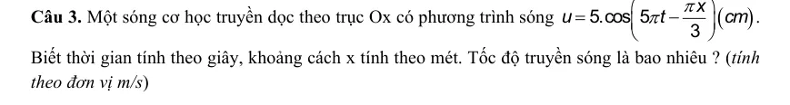{ loading=lazy }

#### Bài PDF 3

<!-- source-id: BT-Chuong-II-p25-q5-49 -->

Câu 5. Sóng truyền dọc theo trục Ox có đồ thị như hình.  Bước sóng của sóng là bao nhiêu cm ?

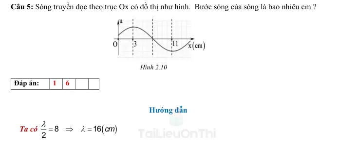{ loading=lazy }

#### Bài PDF 4

<!-- source-id: BT-Chuong-II-p26-q6-50 -->

Câu 6. Sóng truyền dọc theo trục Ox có đồ thị như hình 2.11. Vị trí gần nguồn sóng nhất và dao
động ngược pha với nguồn O cách nguồn O một khoảng bao nhiêu xen-ti-mét?

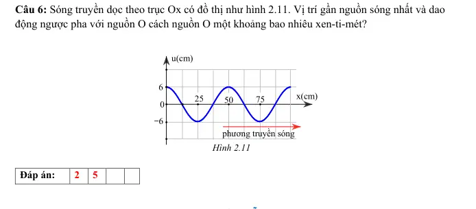{ loading=lazy }

#### Bài PDF 5

<!-- source-id: BT-Chuong-II-p36-q1-73 -->

Câu 1. Một nguồn âm có tần số 725 Hz đặt trong nước. Biết tốc độ truyền âm trong không khí là 1450 m/s.
Khoảng cách giữa hai điểm gần nhau nhất trên cùng một phương truyền sóng dao động lệch pha 4
π(rad)
là bao nhiêu (tính theo đơn vị mét) ?

#### Bài PDF 6

<!-- source-id: BT-Chuong-II-p36-q2-74 -->

Câu 2. Một sóng cơ học truyền dọc theo trục Ox của một môi trường vật chất đàn hồi. Biết tốc độ
truyền sóng là 36 (m/s), tần số sóng là 6 Hz. Độ lệch pha giữa hai vị trí cách nhau 4 cm trên cùng
phương truyền sóng là bao nhiêu (tính theo đơn vị rad và làm tròn đến số thập phân thứ hai) ?

#### Bài PDF 7

<!-- source-id: BT-Chuong-II-p37-q3-75 -->

Câu 3. Nguồn sóng dao động điều hòa dao động với tần số 100 Hz. Hai điểm nằm trên cùng một
phương truyền sóng cách nhau 15 cm dao động cùng pha. Biết vận tốc sóng nằm trong khoảng từ  5
(m/s) đến 6,7 (m/s). Tính tốc độ truyền sóng tính theo đơn vị m/s?

#### Bài PDF 8

<!-- source-id: BT-Chuong-II-p38-q6-78 -->

Câu 6. Một sóng cơ truyền dọc theo trục Ox với phương trình u = 5cos(8πt – πx) (u và x tính bằng
cm, t tính bằng s). Tại thời điểm
( )
1
12 s và ở vị trí cách nguồn một khoảng ( )
1
3 m  thì li độ sóng có
giá trị là bao nhiêu (tính theo đơn vị cm) ?

#### Bài PDF 9

<!-- source-id: BT-Chuong-II-p62-q3-155 -->

Câu 3. Sóng trên mặt nước là sóng ngang. Một người quan sát thấy một chiếc phao trên mặt biển nhô lên cao
10 lần trong 36 giây và đo được khoảng cách hai đỉnh lân cận là 10 m. Tốc độ truyền sóng trên mặt biển là bao
nhiêu (tính theo đơn vị m/s)?

### Nhận biết — Trắc nghiệm 4 lựa chọn

#### Bài PDF 10

<!-- source-id: BT-Chuong-II-p9-q1-1 -->

Câu 1. Chọn phương án sai. Quá trình truyền sóng cơ học là quá trình

A. lan truyền các biến dạng cơ học trong môi trường vật chất đàn hồi.

B. lan truyền pha dao động giữa các phần tử vật chất có sóng truyền qua.

C. lan truyền dao động trong môi trường vật chất đàn hồi.

D. lan truyền các phần tử vật chất trong môi trường vật chất đàn hồi

#### Bài PDF 11

<!-- source-id: BT-Chuong-II-p11-q16-16 -->

Câu 16. Hai điểm liên tiếp M và N trên cùng một phương truyền sóng dao động ngược pha cách
nhau một khoảng
x (m)

Hình 2.2

A. .
B.
.
C.
.
D.
.

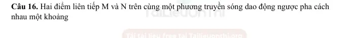{ loading=lazy }

#### Bài PDF 12

<!-- source-id: BT-Chuong-II-p12-q17-17 -->

Câu 17. Hai điểm A, B liên tiếp trên cùng một phương truyền sóng cách nhau 20 cm dao động lệch
pha nhau
 (rad). Bước sóng của sóng này là

A. 40 cm.
B. 60 cm.
C. 120 cm.
D. 180 cm.

#### Bài PDF 13

<!-- source-id: BT-Chuong-II-p15-q28-28 -->

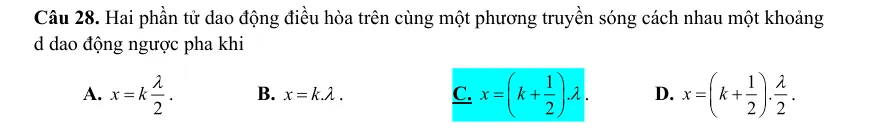{ loading=lazy }

#### Bài PDF 14

<!-- source-id: BT-Chuong-II-p15-q31-31 -->

Câu 31. Một nguồn sóng dao động điều hòa. Tại thời điểm t, pha dao động của nguồn là 5
6
π. Tại
một điểm M cách nguồn sóng một khoảng 3
λpha dao động tại M có giá trị là
A.
.
2
πrad

B.
.
4
πrad

C.
.
3
πrad

D.
.
6
πrad

#### Bài PDF 15

<!-- source-id: BT-Chuong-II-p16-q33-33 -->

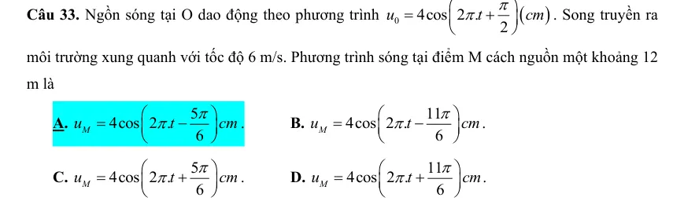{ loading=lazy }

#### Bài PDF 16

<!-- source-id: BT-Chuong-II-p18-q37-37 -->

Câu 37. Nguồn sóng dao động điều hòa dao động với tần số 1000 Hz. Hai điểm nằm trên cùng một
phương truyền sóng cách nhau 15 cm dao động cùng pha. Biết vận tốc sóng nằm trong khoảng từ
28 (m/s) đến 34 (m/s). Vận tốc truyền sóng bằng
A. 28 m/s.

B. 30 m/s.

C. 34 m/s.

D. 32 m/s.

#### Bài PDF 17

<!-- source-id: BT-Chuong-II-p27-q3-53 -->

Câu 3. Gọi d là khoảng cách giữa hai điểm liên tiếp trên phương truyền sóng dao động vuông pha.
Bước sóng của sóng này bằng
A. 2d.
B. 4d.
C. 3d.
D. d.

#### Bài PDF 18

<!-- source-id: BT-Chuong-II-p28-q6-56 -->

Câu 6. Một sóng cơ truyền dọc theo trục Ox với phương trình u = 5cos(8πt – 0,04πx) (u và x tính
bằng cm, t tính bằng s). Tốc độ truyền sóng của sóng này là
A. 200 m/s.
B. 20 m/s.
C. 0,2 m/s.
D. 2 m/s.

#### Bài PDF 19

<!-- source-id: BT-Chuong-II-p28-q7-57 -->

Câu 7. Một sóng cơ lan truyền trên một sợi dây đàn hội. Xét trên một hướng truyền sóng, khoảng
cách giữa hai phần tử môi trường
A. dao động cùng pha là một phần tư bước sóng.
B. gần nhau nhất dao động cùng pha là một bước sóng.
C. dao động ngược pha là một phần tư bước sóng.
D. gần nhau nhất dao động ngược pha là một bước sóng.

#### Bài PDF 20

<!-- source-id: BT-Chuong-II-p28-q10-60 -->

Câu 10. Một nguồn O sóng dao động điều hòa, khi pha dao động tại nguồn sóng là
(
)
5
6
rad
π
thì tại
điểm M cách nguồn một khoảng 3
λsóng có pha dao động là
A.
.
3 rad
π

B.  2
.
3 rad
π

C.
.
6 rad
π

D.
.
2 rad
π

#### Bài PDF 21

<!-- source-id: BT-Chuong-II-p29-q11-61 -->

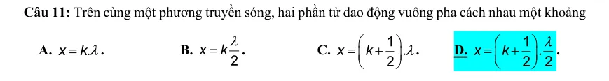{ loading=lazy }

#### Bài PDF 22

<!-- source-id: BT-Chuong-II-p30-q15-65 -->

Câu 15. Vận tốc truyền âm trong nước là 1500 m/s, khoảng cách giữa hai điểm gần nhau nhất trên
một phương truyền sóng dao động vuông pha cách nhau 3 (m). Tần số của sóng âm này là
A. 50 Hz.
B. 25 Hz.
C. 125 Hz.
D. 100 Hz.

#### Bài PDF 23

<!-- source-id: BT-Chuong-II-p31-q17-67 -->

Câu 17. Một sợi dây đàn hồi rất dài, đầu A dao động với tần số 16
20
Hz
f
Hz


. Biết tốc độ truyền
sóng trên dây là 2 (m/s). Người ta nhận thấy hai điểm A, B trên dây cách nhau 40 cm luôn dao động
ngược pha. Tần số của sóng này là

A. 16 Hz.
B. 17,5 Hz.
C. 18 Hz.
D. 20 Hz.

#### Bài PDF 24

<!-- source-id: BT-Chuong-II-p31-q18-68 -->

Câu 18. Trên một sợi dây dài đang có sóng ngang hình sin truyền qua theo chiều dương của trục
Ox. Tại thời điểm t0, một đoạn của sợi dây có hình dạng như hình 3.2. Hai phần tử dây tại M và Q
dao động lệch pha nhau là

A. 3
π
B. π.
C. 2π.
D. 4
π.

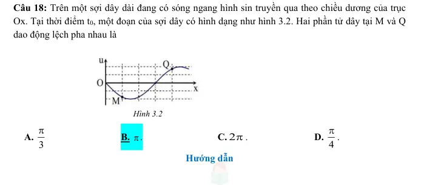{ loading=lazy }

#### Bài PDF 25

<!-- source-id: BT-Chuong-II-p45-q10-88 -->

Câu 10. Phát biểu nào sau đây đúng khi nói về sóng cơ?

A. Sóng cơ truyền trong chất lỏng luôn là sóng ngang.

B. Bước sóng là khoảng cách giữa hai điểm trên cùng một phương truyền sóng mà dao động tại hai
điểm đó cùng pha.

C. Sóng cơ truyền trong chất rắn luôn là sóng dọc.

D. Bước sóng là khoảng cách giữa hai điểm gần nhau nhất trên cùng một phương truyền sóng mà dao
động tại hai điểm đó cùng pha.

#### Bài PDF 26

<!-- source-id: BT-Chuong-II-p50-q35-113 -->

Câu 35. Một sóng ngang truyền trên sợi dây rất dài với tốc độ truyền sóng là 4 m/s và tần số sóng có giá trị
trong khoảng từ 33 Hz đến 43 Hz. Biết hai phần tử tại hai điểm trên dây cách nhau 25 cm luôn dao động ngược
pha nhau. Tần số sóng trên dây là

A. 35 Hz.
B. 37 Hz.
C. 40 Hz.

D. 42 Hz.

#### Bài PDF 27

<!-- source-id: BT-Chuong-II-p51-q40-118 -->

Câu 40. Một sóng ngang cơ học truyền trên một sợi dây đàn hồi với biên độ không đổi bằng 7 cm. Trong quá
trình dao động, khoảng cách gần nhất và xa nhất giữa hai điểm M, N trên dây lần lượt bằng 21 cm và
490
cm. Như vậy hai điểm M, N dao động

A. cùng pha với nhau.

B. ngược pha với nhau.

C. vuông pha với nhau.

D. lệch pha nhau
3
π
.

#### Bài PDF 28

<!-- source-id: BT-Chuong-II-p58-q4-134 -->

Câu 4. Kết luận nào sau đây không đúng về quá trình lan truyền của sóng cơ?

A. Quá trình truyền sóng cơ là quá trình truyền năng lượng.

B. Quãng đường sóng đi được trong nửa chu kỳ đúng bằng nửa bước sóng.

C. Quá trình truyền sóng cơ không có sự truyền pha dao động.

D. Quá trình truyền sóng cơ không mang theo phần tử môi trường khi lan truyền.

#### Bài PDF 29

<!-- source-id: BT-Chuong-II-p194-q2-426 -->

Câu 2. Phát biểu nào sau đây là sai khi nói về quá trình truyền sóng?
A. Quá trình truyền sóng là quá trình truyền dao động trong môi trường đàn hồi.
B. Quá trình truyền sóng là quá trình truyền năng lượng.
C. Quá trình truyền sóng là quá trình truyền pha dao động.
D. Quá trình truyền sóng là quá trình truyền các phần tử vật chất.

#### Bài PDF 30

<!-- source-id: BT-Chuong-II-p195-q6-430 -->

Câu 6. Tìm phát biểu sai:
A. Bước sóng là khoảng cách giữa 2 điểm trên cùng phương truyền gần nhau nhất và dao động cùng
pha.
B. Những điểm cách nhau một số lẻ lần nửa bước sóng trên cùng phương truyền sóng thì dao động
ngược pha.
C. Bước sóng là khoảng truyền của sóng trong thời gian 1 chu kì T.
D. Những điểm cách nhau một số nguyên lần nửa bước sóng trên cùng phương truyền thì dao động
cùng pha.

#### Bài PDF 31

<!-- source-id: BT-Chuong-II-p195-q7-431 -->

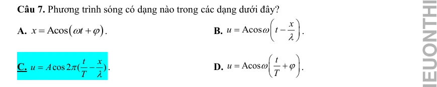{ loading=lazy }

#### Bài PDF 32

<!-- source-id: BT-Chuong-II-p196-q10-434 -->

Câu 10. Một sóng cơ có chu kì 2 s truyền với tốc độ 1 m/s. Khoảng cách giữa 2 điểm gần nhau nhất
trên một phương truyền mà tại đó các phần tử môi trường dao động ngược pha là

A. 0,5m.

B. 1,0m.

C. 2,0m.

D. 2,5m.

#### Bài PDF 33

<!-- source-id: BT-Chuong-II-p200-q3-457 -->

Câu 3. Một sóng cơ học phát ra từ một nguồn O lan truyền trên mặt nước với vận tốc v = 2 m/s.
Người ta thấy 2 điểm M, N gần nhau nhất trên mặt nước nằm trên cùng đường thẳng qua O và cách
nhau 40 cm luôn dao động ngược pha nhau. Tần số sóng đó là
A. 0,4 Hz.
       B. 1,5 Hz.
C. 2 Hz.
D. 2,5 Hz.

#### Bài PDF 34

<!-- source-id: BT-Chuong-II-p210-q2-484 -->

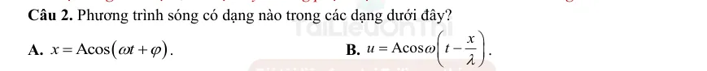{ loading=lazy }

#### Bài PDF 35

<!-- source-id: BT-Chuong-II-p211-q5-487 -->

Câu 5. Xét một sóng truyền dọc theo trục Ox với phương trình u = 4cos (240t - 80x) (cm) (x được
tính bằng cm, t được tính bằng s). Tốc độ truyền của sóng này bằng
A. 6 cm/s.

B. 4,0 cm/s.
C. 0,33 m/s.

D. 3,0 cm/s.

#### Bài PDF 36

<!-- source-id: BT-Chuong-II-p211-q8-490 -->

Câu 8. Một sóng cơ lan truyền trong một môi trường. Hai điểm trên cùng một phương truyền sóng,
cách nhau một khoảng bằng bước sóng có dao động

A. ngược pha.

B. cùng pha.

C. lệch pha
𝜋
2 .
D. lệch pha
𝜋
4.

#### Bài PDF 37

<!-- source-id: BT-Chuong-II-p212-q9-491 -->

Câu 9. Một sóng cơ có chu kì 2 s truyền với tốc độ 1 m/s. Khoảng cách giữa 2 điểm gần nhau nhất
trên một phương truyền mà tại đó các phần tử môi trường dao động ngược pha là
A. 0,5 m.
B. 1,0 m.
C. 2,0 m.
D. 2,5 m.

#### Bài PDF 38

<!-- source-id: BT-Chuong-II-p212-q10-492 -->

Câu 10. Một sóng cơ có chu kì 2 s truyền với tốc độ 1 m/s. Khoảng cách giữa hai điểm gần nhau nhất
trên một phương truyền mà tại đó các phần tử môi trường dao động cùng pha nhau là
A. 0,5 m.
       B. 1,0 m.
C. 2,0 m.
D. 2,5 m.

#### Bài PDF 39

<!-- source-id: BT-Chuong-II-p212-q11-493 -->

Câu 11. Đầu A của một dây đàn hồi nằm ngang dao động theo phương thẳng đứng với chu kỳ 10 s.
Biết vận tốc truyền sóng trên dây v = 0,2 m/s, khoảng cách giữa hai điểm gần nhau nhất dao động
vuông pha là
A. 1 m.
B. 1,5 m.
C. 2 m.
D. 0,5 m.

#### Bài PDF 40

<!-- source-id: BT-Chuong-II-p212-q12-494 -->

Câu 12. Một sóng ngang truyền trên sợi dây rất dài với phương trình sóng u=u0cos(20πt – πx/10).
Trong đó x tính bằng cm, t tính bằng giây. Tốc độ truyền sóng bằng
A. 2 m/s.

B. 4 m/s.

C. 1 m/s.

D. 3 m/s.

### Nhận biết — Đúng/Sai

#### Bài PDF 41

<!-- source-id: BT-Chuong-II-p22-q2-42 -->

Câu 2. Giữa hai điểm gần nhau nhất trên phương truyền sóng dao động vuông pha cách nhau 10 cm.
Thời gian hai ngọn sóng liên tiếp truyền qua trước mặt là 2 s. Biết khoảng cách từ ngọn sóng tới mức
cân bằng của mặt nước là 8 cm.

Phát biểu
Đúng
Sai
a
Chu kỳ sóng là 1 s

S
b
 Bước sóng của sóng này là 40 cm
Đ

c
Tốc độ truyền sóng là 20 m/s
Đ

d
Tốc độ dao động cực đại của nguồn sóng là 8 cm/s

S

#### Bài PDF 42

<!-- source-id: BT-Chuong-II-p23-q3-43 -->

Câu 3. Ảnh chụp màn hình một dao động ký điện tử như hình 2.9 Biết tốc độ truyền sóng là 3.108
(m/s).

Phát biểu
Đúng
Sai
a
Hai thời điểm điểm A và B sóng cùng pha

S
b
Chu kỳ dao động của sóng là

Đ

c
Bước sóng của sóng này là 2 km

S
d
Nguồn sóng thực hiện 200.000 dao động toàn phần
trong thời gian 1 s
Đ

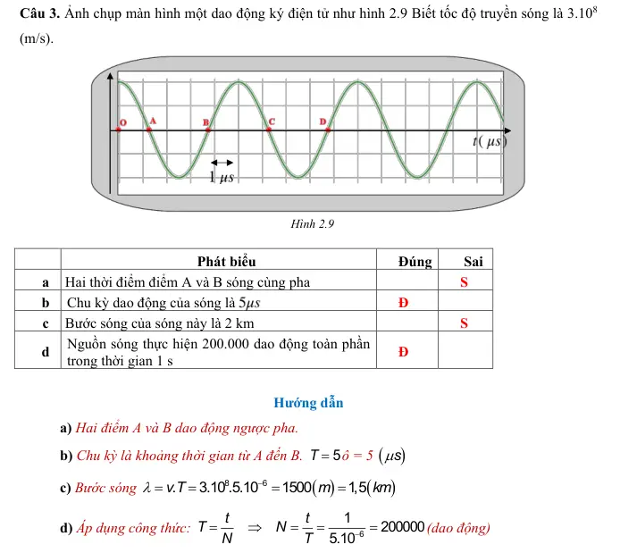{ loading=lazy }

#### Bài PDF 43

<!-- source-id: BT-Chuong-II-p32-q1-69 -->

Câu 1. Sóng cơ truyền dọc theo trục Ox có phương trình u = 4cos(20πt – πx) (cm), với t tính bằng
giây, x tính bằng mét. .

Phát biểu
Đúng
Sai
a
Tần số sóng là 20 Hz

S
b
Tốc độ truyền sóng 20 (m/s)
Đ

c
Bước sóng là 2 (m)
Đ

d
Khoảng cách giữa một gợn sóng là một vị trí cân bằng
liên tiếp là 1 (m)

S

#### Bài PDF 44

<!-- source-id: BT-Chuong-II-p33-q3-71 -->

Câu 3. Một sóng cơ học truyền dọc theo trục Ox có hình dạng như hình 3.4. Biết tốc độ truyền
sóng là 3 (m/s)

Phát biểu
Đúng
Sai
a
Biên độ sóng là 8 cm

S
b
Bước sóng của sóng cơ học này là 6 m
Đ

c
Tần số của sóng là 0,5 Hz
Đ

d
Sóng tại M và N lệch pha 4
π(rad)

S

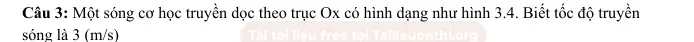{ loading=lazy }

#### Bài PDF 45

<!-- source-id: BT-Chuong-II-p204-q2-466 -->

Câu 2. Một sóng truyền trên một dây rất dài có phương trình: u=10cos(2πt+0,01πx). Trong đó u và x
được tính bằng cm và t được tính bằng s.

Phát biểu
Đúng
Sai
a Chu kì của sóng là 1 s.
Đ

b Biên độ của sóng là 10 m.

S
c Bước sóng của sóng là 2 m.
Đ

d Tại điểm có x = 50 cm vào thời điểm t = 4 s, giá trị
của li độ u là 10 cm.

S

#### Bài PDF 46

<!-- source-id: BT-Chuong-II-p207-q6-470 -->

Câu 6. Một sóng ngang truyền trên một dây rất dài có phương trình sóng là u
6cos(4 t
0,02
)
=
π−
πx
trong đó u, x tính bằng cm, t tính bằng s.

Phát biểu
Đúng
Sai
a Biên độ sóng là 6 cm.
Đ

b Bước sóng là 100 cm.
Đ

c Tốc độ lan truyền của sóng là 200 cm/s.
Đ

d Tại điểm có tọa độ x = 25 cm lúc t = 4 s, giá trị của
li độ u là 6 cm.

S

#### Bài PDF 47

<!-- source-id: BT-Chuong-II-p214-q1-501 -->

Câu 1. Một sóng ngang truyền từ M đến O rồi đến N trên cùng một phương truyền sóng với vận tốc
18 m/s. Biết MN = 3 m và MO = ON, phương trình sóng tại O là
0
5cos(4
)(
)
6
u
t
cm
π
π
=
−

Phát biểu
Đúng
Sai
a Tần số của sóng là 2 Hz.
Đ

b Biên độ của sóng là 5 cm.
Đ

c Bước sóng là 10 m.

S

d Phương trình sóng tại M là
5cos(4
)(
)
6
M
u
t
cm
π
π
=
+

Đ

### Thông hiểu — Trắc nghiệm 4 lựa chọn

#### Bài PDF 48

<!-- source-id: BT-Chuong-II-p13-q19-19 -->

Câu 19. Hai vị trí cân bằng liên tiếp trên phương truyền sóng dao động

A. cùng pha.
B. ngược pha.
C. vuông pha.
D. lệch pha
.

#### Bài PDF 49

<!-- source-id: BT-Chuong-II-p14-q26-26 -->

Câu 26. Hai phần tử nằm trên cùng một phương truyền sóng cách nhau một khoảng x. Độ lệch pha
giữa hai này được xác định theo công thức

A.
2 x
π
ϕ
λ
Δ
=
.
B.
2 .
x
πλ
ϕ
Δ
=
.
C.
2 .T
π
ϕ
λ
Δ
=
.
D.
2 x
T
π
ϕ
Δ
=
.

#### Bài PDF 50

<!-- source-id: BT-Chuong-II-p46-q18-96 -->

Câu 18. Một sóng ngang truyền dọc theo sợi dây với tần số 10 Hz, hai điểm trên dây cách nhau 50 cm dao
động với độ lệch pha 5
3
π
. Tốc độ truyền sóng trên dây bằng

A. 6 m/s.
B. 3 m/s.
C.  10 m/s.

D. 5 m/s.

#### Bài PDF 51

<!-- source-id: BT-Chuong-II-p197-q3-442 -->

Câu 3. Vào một thời điểm Hình 8.1 là đồ thị li độ - quãng đường truyền sóng của một sóng hình sin.
Biên độ và bước sóng của sóng này là

A. 5cm; 50 cm.

B. 6 cm; 50 cm.
 C. 5 cm; 30 cm.
D. 6 cm; 30 cm.

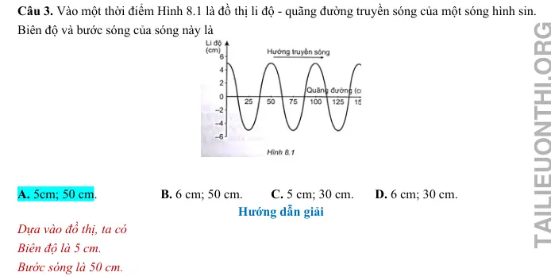{ loading=lazy }

#### Bài PDF 52

<!-- source-id: BT-Chuong-II-p197-q4-443 -->

Câu 4. Một sóng hình sin lan truyền trên trục Ox. Trên phương truyền sóng, khoảng cách ngắn nhất
giữa 2 điểm mà các phần tử của môi trường tại điểm đó dao động ngược pha nhau là 0,4 m. Bước
sóng của sóng này là

A. 0,4 m.

B. 0,8 m.

C. 0,4 cm.

D. 0,8 cm.

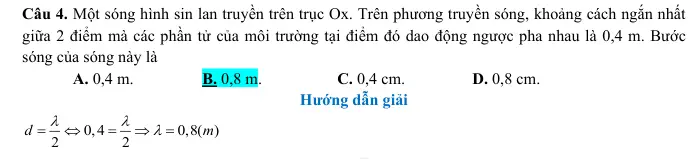{ loading=lazy }

#### Bài PDF 53

<!-- source-id: BT-Chuong-II-p197-q5-444 -->

Câu 5. Xét một sóng truyền dọc theo trục Ox với phương trình u = 6cos (100πt - 4πx) (cm) (x được
tính bằng cm, t được tính bằng s). Tại một thời điểm, hai điểm gần nhất dao động cùng pha và hai
điểm gần nhất dao động ngược pha cách nhau các khoảng lần lượt bằng
A. 1,00 cm và 0,50 cm.

B. 0,50 cm và 0,25 cm.

C. 0,25 cm và 0,50 cm.

D. 100 cm và 4 cm.

#### Bài PDF 54

<!-- source-id: BT-Chuong-II-p198-q6-445 -->

Câu 6. Một sóng cơ truyền trong môi trường với tốc độ 120 m/s. Ở cùng một thời điểm, hai điểm gần
nhau nhất trên một phương truyền sóng dao động ngược pha cách nhau 1,2 m. Tần số của sóng là
A. 220Hz.
       B. 150Hz.
C. 100Hz.
D. 50Hz.

#### Bài PDF 55

<!-- source-id: BT-Chuong-II-p198-q7-446 -->

Câu 7. Một sóng truyền theo trục Ox với phương trình u = acos(4πt – 0,02πx) (u và x tính bằng cm, t
tính bằng giây). Tốc độ truyền của sóng này là
A. 100 cm/s.

B. 150 cm/s.
C. 200 cm/s.

D. 50 cm/s.

### Vận dụng — Trắc nghiệm 4 lựa chọn

#### Bài PDF 56

<!-- source-id: BT-Chuong-II-p17-q35-35 -->

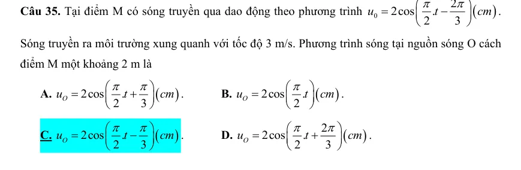{ loading=lazy }

#### Bài PDF 57

<!-- source-id: BT-Chuong-II-p18-q36-36 -->

Câu 36. Một nguồn phát sóng dao động điều hòa tạo ra sóng tròn đồng tâm O trên mặt nước với
bước sóng λ. Hai điểm M, N thuộc mặt nước, nằm trên hai phương truyền sóng mà các phần tử nước
đang dao động. Biết OM = 8 λ, ON = 12 λ và OM vuông góc với ON. Trên đoạn MN, số điểm mà
các phần tử nước dao động ngược pha với dao động tại nguồn O là

A. 5.
B. 7.
C. 3.
D. 6.

#### Bài PDF 58

<!-- source-id: BT-Chuong-II-p50-q34-112 -->

Câu 34. Sóng ngang truyền trên mặt chất lỏng với biên độ không đổi và tần số 100 Hz. Trên cùng một phương
truyền sóng ta thấy hai điểm cách nhau 15 cm dao động cùng pha nhau. Biết tốc độ truyền sóng có giá trị từ 2,8
m/s đến 3,4 m/s. Tốc độ truyền sóng bằng

A. 2,8 m/s.
B. 3 m/s.
C. 3,1 m/s.

D. 3,2 m/s.

