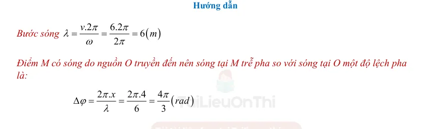
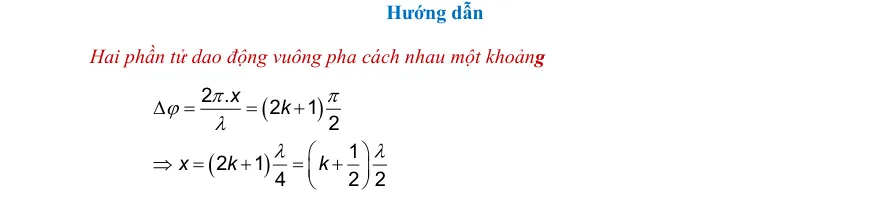
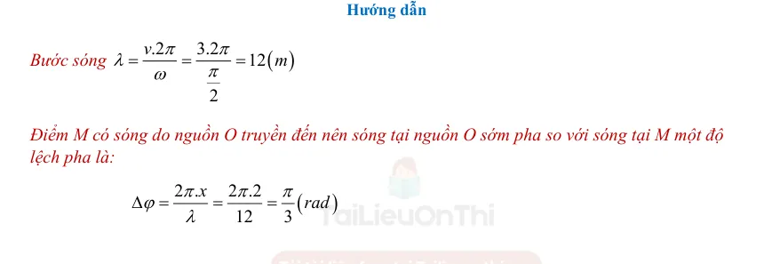

# Đáp án và lời giải — Bài 2 — Phương trình sóng, độ lệch pha và đồ thị

> Câu nền tảng được giải vừa đủ để kiểm tra cách làm. Câu vận dụng được trình bày chi tiết hơn để người học thấy được đường suy luận, điều kiện dùng công thức và bước kiểm tra kết quả.

[← Bài tập](exercises.md)

## Câu 1

Chọn **B**. Điểm xa nguồn trễ pha $2\pi x/\lambda$.

## Câu 2

Chọn **B**. $\Delta\varphi=2\pi(\lambda/4)/\lambda=\pi/2$.

## Câu 3

Chọn **B**. $\omega=8\pi$ nên $f=4$ Hz; hệ số của $x$ là $2\pi/\lambda=2\pi$ nên $\lambda=1$ m. Do đó $v=f\lambda=4$ m/s.

## Câu 4

a) **Đúng**.  
b) **Đúng** với dạng truyền theo chiều dương Ox.  
c) **Đúng**.  
d) **Sai**: chênh pha $4\pi$, nên cùng pha.

## Câu 5

$\lambda=v/f=0,20$ m. $\Delta\varphi=2\pi d/\lambda=2\pi\cdot0,15/0,20=3\pi/2$ rad.

## Câu 6

$f=\omega/(2\pi)=5$ Hz nên $\lambda=v/f=0,4$ m. Độ trễ pha $2\pi d/\lambda=2\pi\cdot0,3/0,4=3\pi/2$. Do đó $u_M=4\cos(10\pi t+\pi/6-3\pi/2)$ cm, có thể rút gọn pha tương đương.

## Câu 7

Khoảng cách giữa hai đỉnh liên tiếp chính là $\lambda=0,24$ m. $v=f\lambda=5\cdot0,24=1,20$ m/s.

## Câu 8

Tại cùng thời điểm, N trễ pha so với M một lượng

$\Delta\varphi=5\pi/6-\pi/3=\pi/2$.

Tần số $f=6\pi/(2\pi)=3$ Hz, nên $\lambda=v/f=1$ m.

Vì $\Delta\varphi=2\pi\,MN/\lambda$ và $MN<\lambda$:

$MN=(\pi/2)\lambda/(2\pi)=\lambda/4=0,25$ m.

---

[← Bài tập](exercises.md)

## Đáp án và lời giải — Ngân hàng PDF mở rộng

> Câu có lời giải trong tài liệu được giữ phần hướng dẫn. Câu trắc nghiệm không kèm lời giải dài chỉ hiện đáp án đã đối chiếu từ dấu đáp án/khóa đáp án của tài liệu.

### Nhận biết — Trả lời ngắn

#### Bài PDF 1

**Đáp án:** 2

Đáp án:
2
1
3

Hướng dẫn
Hai vị trí dao động ngược pha cách nhau
( )
2
2.0,8
1,6
2
x
x
m
λ
λ
=

=
=
=

Tần số sóng
(
)
=
=

340
213
1,6
v
f
Hz
λ

#### Bài PDF 2

**Đáp án:** 1

Đáp án:
1
5

Hướng dẫn

Tốc độ truyền sóng
(
)
­
5
v
15
/
­
3
Sè tr í c t
m s
sè tr í c x
π
π
=
=
=

#### Bài PDF 3

**Đáp án:** 1

Đáp án:
1
6

Hướng dẫn

Ta có
(
)
8
16
2
cm
λ
λ
=

=

Hình 2.10

#### Bài PDF 4

**Đáp án:** 2

Đáp án:
2
5

Hướng dẫn
Hai vị trí trên hình vẽ  cách nhau 2
λ= 25 cm. Do đó Vị trí gần nhất dao động ngược pha với
nguồn cách nguồn một khoảng 25 cm.

phương truyền sóng
75
50
25
6
6
x(cm)
u(cm)
0
Hình 2.11
phương truyền sóng
75
50
25
6
6
x(cm)
u(cm)
0

#### Bài PDF 5

**Đáp án:** 0

Đáp án:
0
,
2
5
Hướng dẫn

Bước sóng
( )
1450
2
725
v
m
f
λ=
=
=

Hai vị trí gần nhau nhất lệch pha 4
π cách nhau
( )
2
0,25
8
8
x
m
λ
=
=
=

#### Bài PDF 6

**Đáp án:** 4

Đáp án:
4
,
1
9
Hướng dẫn

Bước sóng:
( )
36
6
6
v
m
f
λ=
=
=

Độ lệch pha:
(
)
2 .
2 .4
4
6
3
x
rad
π
π
π
ϕ
λ
Δ
=
=
=
 = 4,19 rad

#### Bài PDF 7

**Đáp án:** 5

Đáp án:
5

Hướng dẫn

Hai điểm dao động cùng pha khi:
2 .
.
.2
x
x f
k
k
v
π
ϕ
π
λ
Δ
=
=

=

Thay số x = 15 cm; v1 = 5 (m/s) và f = 100 Hz ta tính được k1 = 3

Thay số x = 15 cm; v2 = 6,7 (m/s) và f = 100 Hz ta tính được k2 = 2,24

Vì k là số nguyên và 2,24
3
3
k
k



=

Thay k = 3 vào
(
)
.
.
0,15.100
5
/
3
x f
x f
k
v
m s
v
k
=

=
=
=

#### Bài PDF 8

**Đáp án:** 2

Đáp án:
2
,
5

Hướng dẫn

Li độ sóng
(
)
(
)
1
1
5.cos 8 .
.
5.cos 8 .
.
2,5
12
3
u
t
x
cm
π
π
π
π


=
−
=
−
=





6
π
Hình 3.7

Chủ đề 9: SÓNG NGANG. SÓNG DỌC. SỰ TRUYỀN NĂNG LƯỢNG CỦA
SÓNG CƠ

• Yêu cầu cần đạt (Trích từ CTGDPT Vật lí 2018):
– So sánh được sóng dọc và sóng ngang.
– Nêu được ví dụ chứng tỏ sóng truyền năng lượng.
– Sử dụng mô hình sóng giải thích được một số tính chất đơn giản của âm thanh và ánh sáng.
• Cấu trúc nội dung:
I. TÓM TẮT LÝ THUYẾT …………………………………………………………………
Lý thuyết chung của chủ đề  + Phương pháp giải kèm ví dụ.
II. BÀI TẬP PHÂN DẠNG THEO MỨC ĐỘ………………………………………………..
 (Theo cấu trúc định dạng đề thi kỳ thi tốt nghiệp trung học phổ thông từ năm 2025 – Quyết định số 764/QĐ -
BGDĐT)
1. Câu trắc nhiệm nhiều phương án lựa chọn
2. Câu trắc nghiệm đúng sai
3. Câu trắc nghiệm trả lời ngắn

#### Bài PDF 9

**Đáp án:** 2

Đáp án:
2
,
5

Hướng dẫn giải
Chiếc phao nhô lên cao 10 lần trong 9 chu kỳ nên 9
36 s
4 s
T
T
=

=
.
Khoảng cách giữa 2 đỉnh lân cận chính bằng bước sóng nên
10 m
λ=
.
Tốc độ truyền sóng
10
2,5 m/s.
4
v
T
λ=
=
=

### Nhận biết — Trắc nghiệm 4 lựa chọn

#### Bài PDF 10

**Đáp án:** D

Đây là câu trắc nghiệm có đáp án được xác định từ khóa đáp án của tài liệu; không có lời giải dài kèm theo trong phần nguồn tương ứng.

#### Bài PDF 11

Hướng dẫn

Hai điểm M và N trên phương truyền sóng cách nhau
, có độ lệch pha tương ứng là
(ngược pha) được minh hoạ qua hình 2.3.

Vậy khoảng cách giữa hai điểm dao động ngược pha là x =
.

#### Bài PDF 12

**Đáp án:** C

Hướng dẫn
Hai điểm điểm liên tiếp trên cùng một phương truyền sóng dao động lệch pha nhau

 (rad) cách
nhau một khoảng:

#### Bài PDF 13

**Đáp án:** C

Đây là câu trắc nghiệm có đáp án được xác định từ khóa đáp án của tài liệu; không có lời giải dài kèm theo trong phần nguồn tương ứng.

#### Bài PDF 14

**Đáp án:** D

Hướng dẫn
Độ lệch pha giữa sóng tại M và nguồn O là:
(
)
2 .
2 .
2
3
3
x
rad
λ
π
π
π
ϕ
λ
λ
Δ
=
=
=

Vì sóng truyền từ nguồn O đến M nên tại M sóng trễ pha so với nguồn O. Pha dao động tại điểm M
là:

(
)
5
2
6
3
6 rad
π
π
π
−
=

#### Bài PDF 15

**Đáp án:** A

{ loading=lazy }
#### Bài PDF 16

**Đáp án:** B

Hướng dẫn
N
M
O
H
P
Q
Hình 2.6

Độ lệch pha Δϕ =
λ
πd
2
, hai điểm dđ cùng pha khi Δϕ = k 2π,  với   k =1, 2, 3, 4, …
Vậy
π
λ
π
2
2
k
d =
   &lt;=&gt;   k = v
f
d
 =&gt;   k =
v
1000
.
15
,0
 (*)

Với v = 28 m/s    =&gt;  k = 5,36

Với v = 34 m/s    =&gt;  k = 4,4
k là số nguyên và  4,4  k  5,36   =&gt;   k = 5
Thế k = 5 vào (*) ta tính được v = 150/5 = 30 m/s

#### Bài PDF 17

**Đáp án:** B

Hướng dẫn
Hai điểm liên tiếp dao động vuông pha cách nhau một khoảng
4
4
d
d
λ
λ
=

=

#### Bài PDF 18

**Đáp án:** D

Hướng dẫn

Tốc độ truyền sóng
(
)
(
)
­
8
v
200
/
2
/
­
0,04
Sè tr í c t
cm s
m s
sè tr í c x
π
π
=
=
=
=

#### Bài PDF 19

**Đáp án:** B

Đây là câu trắc nghiệm có đáp án được xác định từ khóa đáp án của tài liệu; không có lời giải dài kèm theo trong phần nguồn tương ứng.

#### Bài PDF 20

**Đáp án:** C

Hướng dẫn

Độ lệch pha giữa M và nguồn O có độ lệch pha là
(
)
2 .
2 .
2
3
3
d
rad
λ
π
π
π
ϕ
λ
λ
Δ
=
=
=

Điểm M dao động trễ pha so với nguồn. Khi đó pha dao động tại M là :

(
)
5
2
6
3
6 rad
π
π
π
−
=

#### Bài PDF 21

**Đáp án:** D

{ loading=lazy }
#### Bài PDF 22

**Đáp án:** C

Hướng dẫn
Độ lệch pha giữa hai điểm  Δϕ =
λ
πd
2

Hai điểm dao động vuông pha Δϕ = (2k + 1) 2
π
với  k = 0, 1, 2, 3, …

Là hai điểm gần nhau nhất, ta chọn  k = 0.

Vậy
2
)1
0.2
(
2
π
λ
π
+
=
d
   =&gt;
2
3
.
2
π
λ
π
=
    =&gt;    λ = 12 cm

Tần số sóng:  λ=v/f    =&gt;    f = v/ λ = 1500/12 = 125 Hz

#### Bài PDF 23

**Đáp án:** B

Hướng dẫn

Hai dao động ngược pha có
(
)
2 .
2
1
x
k
π
ϕ
π
λ
Δ
=
=
+

Suy ra
(
)
0,5
x
k
λ
=
+

hay
.
0,5
x f
k
v
=
−

Thay x = 0,4 (m); v = 2 (m/s) và f1 = 16 Hz ta tính được
1
2,7
k =

Thay x = 0,4 (m); v = 2 (m/s) và f2 = 20 Hz ta tính được
1
3,5
k =

Vì k lấy giá trị nguyên trong khoảng 2,7 đến 3,5. Vậy k = 3

Thay k = 3 vào
.
0,5
x f
k
v
=
−
 ta tính được
(
)
17,5
f
Hz
=

#### Bài PDF 24

**Đáp án:** B

Hướng dẫn
Hình 3.2

Từ hình 3.3 ta thấy khoảng cách nửa bước sóng 2
λ= 3 ô.

Ssuy ra λ= 6 ô

Khoảng cách M và Q là x = MQ = 3 ô

Độ lệch pha giữa M và Q là
2 .
2 .3
6
x
π
π
ϕ
π
λ
Δ
=
=
=

#### Bài PDF 25

**Đáp án:** D

Đây là câu trắc nghiệm có đáp án được xác định từ khóa đáp án của tài liệu; không có lời giải dài kèm theo trong phần nguồn tương ứng.

#### Bài PDF 26

**Đáp án:** C

Hướng dẫn giải
Hai điểm trên dây cách nhau 25 cm luôn dao động ngược pha nhau
2
2 .25
50
0,5
(
1)
 cm
 m.
1
1
d
k
k
k
π
π
Δϕ
π
λ
λ
λ
=

+
=

=
=
+
+

Tần số sóng
4(
1)
8(
1)
0,5
v
k
f
k
λ
+
=
=
=
+
 mà 33 Hz
43 Hz
f



33
8(
1)
43
3,125
4,375
4
40 Hz
k
k
k
f


+





=

=

#### Bài PDF 27

**Đáp án:** D

Hướng dẫn giải
- Khoảng cách nhỏ nhất
min
21 cm
x
d
Δ=
=

- Khoảng cách lớn nhất
(
)
(
)
2
2
2
2
max
1
cos
490
21
2.
)
7 1
c
(
2
os
d
x
a
Δ
Δϕ
Δϕ
=
+
−

=
+
−

1
 rad
2
cos
3
π
Δϕ
Δϕ
=

=


#### Bài PDF 28

**Đáp án:** C

Đây là câu trắc nghiệm có đáp án được xác định từ khóa đáp án của tài liệu; không có lời giải dài kèm theo trong phần nguồn tương ứng.

#### Bài PDF 29

**Đáp án:** D

Hướng dẫn giải
Quá trình truyền sóng là quá trình truyền pha dao động và quá trình truyền năng lượng.

#### Bài PDF 30

**Đáp án:** D

Hướng dẫn giải
Những điểm cách nhau một số nguyên lần nửa bước sóng trên cùng phương truyền thì dao động
ngược pha.

#### Bài PDF 31

**Đáp án:** C

Hướng dẫn giải
cos2 (
)
t
x
u
A
T
π
λ
=
−

#### Bài PDF 32

**Đáp án:** B

Hướng dẫn giải
.
1.2
1( )
2
2
2
vT
d
m
λ
=
=
=
=

#### Bài PDF 33

**Đáp án:** D

Hướng dẫn giải
Hai điểm gần nhau nhất luôn dao động ngược pha:
40
80(
)
2
cm
λ
λ
=

=

=
=
=
λ
v
2
f
2,5(Hz)
0,8

#### Bài PDF 34

Hướng dẫn giải
Phương trình sóng có dạng : u = Acos2π(
𝑡
𝑇−
𝑥
𝜆)

#### Bài PDF 35

**Đáp án:** D

Hướng dẫn giải
2
80
(
)
40
x
x
cm
π
π
λ
λ
=

=

240
120
2
2
120
3(
/ )
40
f
v
f
cm s
ω
π
π
π
π
λ
π
=
=
=
=
=
=

#### Bài PDF 36

Hướng dẫn giải
Hai điểm trên cùng một phương truyền sóng, cách nhau một khoảng bằng bước sóng có dao động
cùng pha.

#### Bài PDF 37

**Đáp án:** B

Hướng dẫn giải
Khoảng cách giữa 2 điểm gần nhau nhất trên một phương truyền mà tại đó các phần tử môi trường
dao động ngược pha là λ=
=
=
v.T
1.2
1(m)
2
2
2

#### Bài PDF 38

**Đáp án:** C

Hướng dẫn giải

.
1.2
2
vT
m
λ=
=
=

#### Bài PDF 39

**Đáp án:** D

Hướng dẫn giải
v.T
0,2.10
0,5(m)
4
4
4
λ=
=
=

#### Bài PDF 40

**Đáp án:** A

Hướng dẫn giải
2
20(
)
10
x
x
cm
π
π
λ
λ
=

=

2
20
10(
)
f
f
Hz
ω
π
π
=
=

=

20.10
200(
/ )
2(m/s)
v
f
cm s
λ
=
=
=
=

### Nhận biết — Đúng/Sai

#### Bài PDF 41

Hướng dẫn
a) Chu kỳ sóng được xác định theo công thức:

      b)  Hai điềm gần nhau nhất dao động vuông pha cách nhau:

c)  Áp dụng công thức:

      d) Tốc độ dao động cực đại của nguồn sóng:

#### Bài PDF 42

Hướng dẫn

a) Hai điểm A và B dao động ngược pha.

b) Chu kỳ là khoảng thời gian từ A đến B.
5
T =
ô = 5 (
)s
μ

c) Bước sóng
( )
(
)
8
6
.
3.10 .5.10
1500
1,5
v T
m
km
λ
−
=
=
=
=

d) Áp dụng công thức:
6
1
200000
5.10
t
t
T
N
N
T
−
=

=
=
=
(dao động)

#### Bài PDF 43

Hướng dẫn
a) Tần số của sóng là
(
)
20
10
2
2
Hz
ω
π
π
π
=
=

b) Tốc độ truyền sóng
(
)
20
20
/
v
m s
π
π
=
=

c) Bước sóng
( )
2
2 m
π
λ
π
=
=

d) Khoảng cách giữa một ngọn sóng và một vị trí cân bằng liên tiếp cách nhau
( )
2
0,5
4
4
m
λ=
=

#### Bài PDF 44

Hướng dẫn

a) Từ đồ thị ta thấy biên độ sóng là 4 (cm)
b) Bước sóng λ= 6 ô = 6 (cm)
c) Tần số sóng
(
)
3
0,5
6
v
f
Hz
λ
=
=
=

d) Hai điểm M và N cách nhau khoảng x = 4 ô = 4 cm

Độ lệch pha giữa M và N là:
2 .
2 .4
4
6
3
x
π
π
π
ϕ
λ
Δ
=
=
=

#### Bài PDF 45

Hướng dẫn giải
a) Chu kì của sóng là 1 s.
π
π
=
=
=
ω
π
2
2
T
1(s)
2

b) Biên độ của sóng là 10 cm.
c) Bước sóng của sóng là 2 m.
π
π=
λ=
=
λ
2 x
0,01 x
200(cm)
2(m)
d) Tại điểm có x = 50 cm vào thời điểm t = 4 s, giá trị của li độ u là
=
π+
π
+
π
=
=
π
u 10cos 2 t
0,01 x
10cos 2 .4 0,01 .5
)
(
0
(
)
0

#### Bài PDF 46

Hướng dẫn giải
a)  Biên độ sóng là 6 cm. ( dựa vào phương trình sóng ta có )
b)  Bước sóng là
2 x
0,02
100(cm)
x=
π
π
λ=
λ

c)  Tốc độ lan truyền của sóng là 200 cm/s
4
2(Hz)
2
2
f
ω
π
π
π
=
=
=

100.2
200(
/ )
v
f
cm s
λ
=
=
=

d)  Tại điểm có tọa độ x = 25 cm lúc t = 4 s, giá trị của li độ u là 0 cm.
u
6cos(4 .4
0,02 25)
0
=
π
−
π
=

#### Bài PDF 47

Hướng dẫn giải
a) Tần số của sóng là 2 Hz.
4
2(
)
2
f
Hz
π
π
=
=

b) Biên độ của sóng là 5 cm.
Dựa vào phương trình sóng
c) Bước sóng là 9 m.
18
9( )
2
v
m
f
λ=
=
=

d. Vì M ở phía trước O theo chiều truyền sóng nên
2. .
5cos(4
)
5cos(4
)(
)
6
6
M
MO
u
t
t
cm
π
π
π
π
π
λ
=
−
+
=
+

### Thông hiểu — Trắc nghiệm 4 lựa chọn

#### Bài PDF 48

**Đáp án:** B

Đây là câu trắc nghiệm có đáp án được xác định từ khóa đáp án của tài liệu; không có lời giải dài kèm theo trong phần nguồn tương ứng.

#### Bài PDF 49

**Đáp án:** A

Đây là câu trắc nghiệm có đáp án được xác định từ khóa đáp án của tài liệu; không có lời giải dài kèm theo trong phần nguồn tương ứng.

#### Bài PDF 50

**Đáp án:** A

Hướng dẫn giải
2
2
2
2 .50.10
600 cm/s
6 m/s
5
3
d
df
df
v
v
π
π
π
π
Δϕ
λ
Δϕ
π
=
=

=
=
=
=

#### Bài PDF 51

**Đáp án:** A

Hướng dẫn giải
Dựa vào đồ thị, ta có
Biên độ là 5 cm.
Bước sóng là 50 cm.

#### Bài PDF 52

**Đáp án:** B

Hướng dẫn giải
0,4
0,8( )
2
2
d
m
λ
λ
λ
=

=

=

#### Bài PDF 53

**Đáp án:** B

Hướng dẫn giải
2
1
4
0,5(c
)
2
d
x
m
π
π
λ
λ
λ
=

=

=

Hai điểm gần nhau nhất dao động cùng pha:
1
0,5(c
)
d
m
λ
=
=

Hai điểm gần nhau nhất dao động ngược pha:
0,5
0,25(c
)
2
2
d
m
λ
=
=
=

#### Bài PDF 54

**Đáp án:** D

Hướng dẫn giải
1,2
2,4( )
2
m
λ
λ
=

=

120
50(Hz)
2,4
v
f
λ
=
=
=

#### Bài PDF 55

**Đáp án:** C

Hướng dẫn giải
2
0,02
100(c
)
d
x
m
π
π
λ
λ
=

=

100.2
200(c
/ )
v
f
m s
λ
=
=
=

### Vận dụng — Trắc nghiệm 4 lựa chọn

#### Bài PDF 56

**Đáp án:** C

{ loading=lazy }
#### Bài PDF 57

**Đáp án:** D

Hướng dẫn
Các điểm M, N nằm trên các trục tọa độ như hình 2.6
Chân đường cao OH hạ từ O lên MN được xác định theo công thức:

2
2
2
1
1
1
OH
OM
ON
=
+

Thay OM = 8 λ, ON = 12 λ ta tính được OH = 6,66λ
Các vị trí dao động ngược pha với nguồn cách nguồn sóng
O một khoảng
(
)
0,5 .
x
k
λ
=
+

Những điểm P thuộc MH cách nguồn O một khoảng x dao
động ngược pha với nguồn thỏa điều kiện:

(
)
6,66
0,5
8
6,16
7,5
OH
x
OM
k
k
λ
λ
λ



+




Vì k là những số nguyên nên chọn k = 7.
Vậy trên đoạn MH có 1 điểm dao động ngược pha với nguồn.
Tương tự cho đoạn NH ta có

(
)
6,66
0,5
12
6,16
11,5
OH
x
ON
k
k
λ
λ
λ



+




Vì k là những số nguyên nên chọn k = 7,8,9,10,11.
Vậy trên đoạn MH có 1 điểm dao động ngược pha với nguồn.
Kết luận: Trên đoạn MN có tổng cộng 6 vị trí mà tại đó sóng dao động ngược pha với nguồn.

#### Bài PDF 58

**Đáp án:** B

Hướng dẫn giải
(
)
2
0,15
2
,
.100
2,8
3,4
2,8
3,4
4,41
5,36
5
3 m/s
0,15
15
15
15
5
d
d
k
k
k
k
v
f
k
k
v
k
k
k
v
π
Δϕ
π
λ
λ
λ
=
=

=
=

=
=
=









=

=
=


