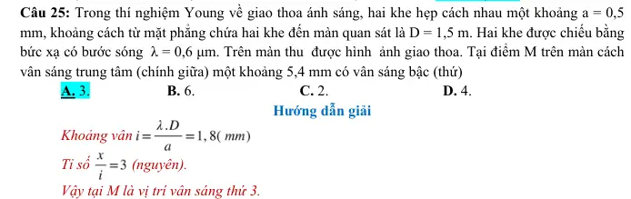

# Bài tập — Bài 3 — Giao thoa sóng cơ

> Hệ bài tập được biên soạn theo các dạng xuất hiện trong bộ tài liệu Vật lí 11 của dự án. Câu hỏi được giữ ngắn, trực tiếp; độ khó tăng dần và không cố tình thêm dữ kiện gây nhiễu.

[← Trở lại bài học](../../03-mechanical-interference.md)

## Phần A — Trắc nghiệm 4 lựa chọn

### Câu 1 — Mức 1 — Nhận biết

Hai nguồn kết hợp cùng pha. Điểm M có hiệu đường đi $d_2-d_1=3\lambda$. M là

A. cực đại giao thoa.  
B. cực tiểu giao thoa.  
C. không dao động vì hai sóng triệt tiêu.  
D. chưa đủ dữ kiện.

### Câu 2 — Mức 1 — Nhận biết

Hai nguồn cùng pha. Cực tiểu giao thoa thỏa

A. $d_2-d_1=k\lambda$.  
B. $d_2-d_1=(k+1/2)\lambda$.  
C. $d_2+d_1=k\lambda$.  
D. $d_2d_1=\lambda^2$.

### Câu 3 — Mức 1 — Nhận biết

Hai nguồn cùng pha, cùng biên độ $a$. Tại điểm có hai sóng đến cùng pha, biên độ tổng hợp là

A. $0$.  
B. $a$.  
C. $\sqrt2a$.  
D. $2a$.

## Phần B — Đúng/Sai

### Câu 4 — Mức 2 — Thông hiểu

Trong giao thoa của hai nguồn kết hợp cùng pha:

a) Các điểm cực đại có hiệu đường đi là bội nguyên của $\lambda$.  
b) Các điểm cực tiểu có hiệu đường đi là nửa nguyên lần $\lambda$.  
c) Trên trung trực đoạn nối hai nguồn luôn là cực tiểu.  
d) Nguồn kết hợp phải có hiệu pha không đổi theo thời gian.

## Phần C — Trả lời ngắn

### Câu 5 — Mức 3 — Vận dụng

Hai nguồn cùng pha cách nhau $12$ cm, bước sóng $2$ cm. Một điểm M có $d_1=10$ cm, $d_2=14$ cm. M là cực đại hay cực tiểu?

### Câu 6 — Mức 3 — Vận dụng

Hai nguồn cùng pha phát sóng bước sóng $1,5$ cm. Một điểm có hiệu đường đi $3,75$ cm. Xác định loại điểm giao thoa.

### Câu 7 — Mức 3 — Vận dụng

Hai nguồn cùng pha cách nhau $10$ cm, bước sóng $2$ cm. Trên đoạn nối hai nguồn, bỏ hai nguồn, có bao nhiêu vị trí cực đại nếu coi điều kiện hình học lí tưởng?

## Phần D — Vận dụng và vận dụng cao

### Câu 8 — Mức 4 — Vận dụng cao

Hai nguồn A, B cùng pha, cách nhau $20$ cm, phát sóng có $\lambda=4$ cm. Trên đường thẳng AB, tìm số điểm cực tiểu nằm **giữa** A và B, không tính hai nguồn.

---

[Đáp án và lời giải →](solutions.md)

## Ngân hàng bài tập PDF mở rộng

> Nội dung câu hỏi và dữ kiện trong phần này được giữ nguyên; hệ thống chỉ chuẩn hóa xuống dòng và mã kí tự để hiển thị trên web. Câu trùng được loại bỏ. Với câu có công thức/kí hiệu bị sai khi trích xuất chữ từ PDF, đề bài được giữ dưới dạng ảnh để không làm thay đổi dữ kiện.

### Nhận biết — Trả lời ngắn

#### Bài PDF 1

<!-- source-id: BT-Chuong-II-p144-q1-335 -->

Câu 1. Trong thí nghiệm Young về giao thoa ánh sáng, nguồnsáng phát ra ánh sáng đơn sắc có bước
sóng 450nm, Khoảng cách giữa hai khe là 1mm. Trên màn quan sát, khoảng cách giữa hai vân sáng
liên tiếp là 0,72 mm. Khoảng cách từ mặt phẳng chứa hai khe đến màn bằng bao nhiêu met (làm tròn
đến số thập phân thứ nhất sau dấu phẩy)?

#### Bài PDF 2

<!-- source-id: BT-Chuong-II-p144-q2-336 -->

Câu 2. Trong thí nghiệm Young về giao thoa với ánh sáng đơn sắc xác định, thì tại điểm M trên màn
quan sát là vân sáng bậc 5. Sau đó giảm khoảng cách giữa hai khe một đoạn bằng 0,2 mm thì tại M trở
thành vân tối thứ 5 so với vân sáng trung tâm. Ban đầu khoảng cách giữa hai khe là bao nhiêu milimet?

#### Bài PDF 3

<!-- source-id: BT-Chuong-II-p144-q3-337 -->

Câu 3. Trên mặt nước phẳng lặng có hai nguồn điểm dao động A và B, với AB = 8,1 cm, f = 30 Hz.
Khi đó trên mặt nước, tại vùng giữa A và B người quan sát thấy có 14 gợn lồi và những gợn này chia
đoạn AB thành 15 đoạn mà hai đoạn ở hai đầu chỉ dài bằng một phần tư các đoạn còn lại. Tốc độ truyền
sóng bằng bao nhiêu cm/s?

#### Bài PDF 4

<!-- source-id: BT-Chuong-II-p144-q4-338 -->

Câu 4. Trong thí nghiệm giao thoa trên mặt nước, hai nguồn A, B dao động cùng pha với tần số f. Tại
một điểm M cách các nguồn A, B những khoảng d1 = 19cm, d2 = 21cm, sóng có biên độ cực đại. Giữa
M và đường trung trực của AB không có dãy cực đại nào khác. Vận tốc truyền sóng trên mặt nước là v
= 26cm/s. Tần số dao động của hai nguồn là bao nhiêu Hec?

#### Bài PDF 5

<!-- source-id: BT-Chuong-II-p145-q5-339 -->

Câu 5. Trong thí nghiệm Young về giao thoa với ánh sáng đơn sắc, khoảng cách hai khe không đổi.
Khi khoảng cách từ mặt phẳng chứa hai khe tới màn quan sát là D thì khoảng vân trên màn là 1 mm.
Khi khoảng cách từ mặt phẳng chứa hai khe tới màn quan sát lần lượt là (D – ΔD) và (D + ΔD) thì
khoảng vân trên màn tương ứng là i và 2i. Khi khoảng cách từ mặt phẳng chứa hai khe tới màn quan
sát là (D + 3ΔD) thì khoảng vân trên màn là bao nhiêu milimet?

#### Bài PDF 6

<!-- source-id: BT-Chuong-II-p145-q6-340 -->

Câu 6. Trong thí nghiệm Young về giao thoa ánh sáng, chiếu vào hai khe đồng thời  hai ánh sáng đơn
sắc có bước sóng lần lượt là
1λ = 0,66 µm và
2
λ= 0,55µm. Trên màn quan sát, vân sáng bậc 5 của ánh
sáng có bước sóng λ1 trùng với vân sáng bậc mấy của ánh sáng có bước sóng λ2?

#### Bài PDF 7

<!-- source-id: BT-Chuong-II-p219-q5-513 -->

Câu 5. Số điểm có biên độ dao động cực đại là bao nhiêu?

### Nhận biết — Trắc nghiệm 4 lựa chọn

#### Bài PDF 8

<!-- source-id: BT-Chuong-II-p125-q1-261 -->

Câu 1. Trong thí nghiệm giao thoa sóng nước. Hai điểm trên cùng một phương truyền sóng, cách nhau
một khoảng bằng bước sóng có dao động
A. lệch pha 2
π.

B. ngược pha.

C. lệch pha 4
π.

D. cùng pha.

#### Bài PDF 9

<!-- source-id: BT-Chuong-II-p125-q2-262 -->

Câu 2. Giao thoa ở mặt nước với hai nguồn sóng kết hợp đặt tại A và B dao động điều hòa cùng pha
theo phương thẳng đứng. Sóng truyền ở mặt nước có bước sóng λ. Cực tiểu giao thoa nằm tại những
điểm có hiệu đường đi của hai sóng từ hai nguồn tới đó bằng
A. 2kλ với k = 0, ± 1, ± 2, …

B. (2k +1) λ với k = 0, ± 1, ± 2, …
C. kλ với k = 0, ± 1, ± 2, …

D. (k + 0,5) λ với k = 0, ± 1, ± 2, …

#### Bài PDF 10

<!-- source-id: BT-Chuong-II-p125-q3-263 -->

Câu 3. Trong thí nghiệm Young về giao thoa ánh sáng, khoảng cách giữa hai khe là a, khoảng cách từ
mặt phẳng chứa hai khe đến màn quan sát là D. Khi nguồn sáng phát bức xạ đơn sắc có bước sóng λ
thì khoảng vân giao thoa trên màn là i. Hệ thức nào sau đây đúng?
A.
a
i
D
λ
=

B.
aD
i = λ

C.
i
aD
λ=

D.
ia
D
λ=

#### Bài PDF 11

<!-- source-id: BT-Chuong-II-p125-q4-264 -->

Câu 4. Trong thí nghiệm Young về giao thoa ánh sáng, hai khe được chiếu bằng ánh sáng đơn sắc có
bước sóng λ. Nếu tại điểm M trên màn quan sát có vân tối thứ ba (tính từ vân sáng trung tâm) thì hiệu
đường đi của ánh sáng từ hai khe S1, S2 đến M có độ lớn bằng
A. 2λ.

B. 1,5λ.

C. 3λ.

D. 2,5λ.

#### Bài PDF 12

<!-- source-id: BT-Chuong-II-p125-q5-265 -->

Câu 5. Trong thí nghiệm Young về giao thoa ánh sáng, hai khe được chiếu bằng ánh sáng đơn sắc có
bước sóng λ. Nếu tại điểm M trên màn quan sát có vân tối thì hiệu đường đi của ánh sáng từ hai khe
đến điểm M có độ lớn nhỏ nhất bằng
A. 4
λ.

B. λ.

C. 2
λ.

D. 2λ.

#### Bài PDF 13

<!-- source-id: BT-Chuong-II-p125-q7-267 -->

Câu 7. Hai nguồn kết hợp là hai nguồn có
A. cùng phương dao động, cùng biên độ.

B. cùng phương dao động, cùng tần số.
C. cùng phương dao động, cùng pha ban đầu.

D. cùng phương dao động, cùng tần số và hiệu số pha không đổi theo thời gian.

#### Bài PDF 14

<!-- source-id: BT-Chuong-II-p126-q8-268 -->

Câu 8. Hai sóng phát ra từ hai nguồn kết hợp cùng pha. Cực đại giao thoa nằm tại các điểm có hiệu
khoảng cách tới hai nguồn sóng bằng
A. một ước số của bước sóng.
   B. một bội số nguyên của bước sóng.
C. một bội số lẻ của nửa bước sóng.
   D. một ước số của nửa bước sóng.

#### Bài PDF 15

<!-- source-id: BT-Chuong-II-p126-q10-270 -->

Câu 10. Trong hiện tượng giao thoa sóng trên mặt nước, khoảng cách giữa hai cực đại liên tiếp nằm
trên đường nối hai tâm sóng
A. bằng hai lần bước sóng.
            B. bằng một bước sóng.
C. bằng một nửa bước sóng.
            D. bằng một phần tư bước sóng.

#### Bài PDF 16

<!-- source-id: BT-Chuong-II-p126-q14-274 -->

Câu 14. Khi xảy ra hiện tượng giao thoa sóng nước với hai nguồn kết hợp cùng pha A, B. Những điểm
trên mặt nước nằm trên đường trung trực của AB sẽ
A. dao động với biên độ lớn nhất.

B. dao động với biên độ bé nhất.
C. đứng yên không dao động.

D. dao động với biên độ có giá trị trung bình.

#### Bài PDF 17

<!-- source-id: BT-Chuong-II-p126-q15-275 -->

Câu 15. Trong thí nghiệm Y‒âng về giao thoa với ánh sáng đơn sắc, nếu giữ nguyên bước sóng, giữ
nguyên khoảng cách giữa hai khe
1S ,
2
S  đồng thời tăng khoảng cách từ mặt phẳng chứa
1
2
SS  đến màn
lên 2 lần thì khoảng vân sẽ
A. giảm 2 lần.
B. tăng 2 lần.
C. tăng 4 lần.
D. giảm 4 lần.

#### Bài PDF 18

<!-- source-id: BT-Chuong-II-p126-q16-276 -->

Câu 16. Dùng thí nghiệm Y − âng về giao thoa ánh sáng để đo bước sóng của một ánh sáng đơn sắc
với khoảng cách giữa hai khe hẹp là a  và khoảng cách giữa mặt phẳng chứa hai khe đến màn quan sát
là D. Nếu bước sóng dùng trong thí nghiệm là λ, khoảng cách giữa ba vân sáng liên tiếp là
A. D
a
λ.
B. 2D
a
λ.
C. D
2a
λ.
D. D
4a
λ.

#### Bài PDF 19

<!-- source-id: BT-Chuong-II-p127-q17-277 -->

Câu 17. Hiện tượng giao thoa ánh sáng là bằng chứng thực nghiệm chứng tỏ ánh sáng
A. là sóng siêu âm.
B. là sóng dọc.
C. có tính chất hạt.
D. có tính chất sóng.

#### Bài PDF 20

<!-- source-id: BT-Chuong-II-p127-q18-278 -->

Câu 18. Hiện tượng giao thoa ánh sáng chỉ quan sát được khi hai nguồn ánh sáng là hai nguồn
A. đơn sắc

B. cùng màu sắc
C. kết hợp.

D. cùng cường độ sáng.

#### Bài PDF 21

<!-- source-id: BT-Chuong-II-p128-q26-286 -->

Câu 26. Trong thí nghiệm Young về giao thoa ánh sáng với ánh sáng đơn sắc. Biết khoảng cách giữa
hai khe hẹp là 1,2 mm và khoảng cách từ mặt phẳng chứa hai khe hẹp đến màn quan sát là 0,9 m. Quan
sát được hệ vân giao thoa trên màn với khoảng cách giữa 9 vân sáng liên tiếp là 3,6 mm. Bước sóng
của ánh sáng dùng trong thí nghiệm là
A. 0,50.10-6 m.

B. 0,55.10-6 m.
C. 0,45.10-6 m.

D. 0,60.10-6 m.

#### Bài PDF 22

<!-- source-id: BT-Chuong-II-p128-q27-287 -->

Câu 27. Trong thí nghiệm Young về giao thoa ánh sáng, khoảng cách giữa hai khe là 0,5 mm, khoảng
cách từ mặt phẳng chứa hai khe đến màn là 2 m. Ánh sáng đơn sắc dùng trong thí nghiệm có bước sóng
0,5 μm. Vùng giao thoa trên màn rộng 26 mm (vân trung tâm ở chính giữa). Số vân sáng là
A. 15.

B. 17.

C. 13.

D. 11.

#### Bài PDF 23

<!-- source-id: BT-Chuong-II-p128-q28-288 -->

Câu 28. Trên đường nối hai nguồn dao động kết hợp trên mặt nước, giữa hai đỉnh của hai vân cực đại
giao thoa có 3 vân cực đại giao thoa nữa và khoảng cách giữa hai đỉnh này là 5 cm. Biết tần số dao
động của nguồn là 9 Hz. Tốc độ truyền sóng trên mặt nước là
A. 25 cm/s

B. 15 cm/s

C. 22,5 cm/s
D. 20 cm/s.

#### Bài PDF 24

<!-- source-id: BT-Chuong-II-p128-q29-289 -->

Câu 29. Trong thí nghiệm về giao thoa sóng trên mặt nước, hai nguồn kết hợp A, B dao động cùng pha
với tần số 16Hz. Tại một điểm M cách các nguồn A, B lần lượt những khoảng d1 = 30cm, d2 = 25,5cm,
sóng có biên độ cực đại. Giữa M và đường trung trực của AB có 3 dãy cực tiểu khác nhau. Vận tốc
truyền sóng trên mặt nước là

A. 24m/s.

B. 24cm/s.

C. 36m/s.

D. 36cm/s.

#### Bài PDF 25

<!-- source-id: BT-Chuong-II-p129-q30-290 -->

Câu 30. Trong một thí nghiệm về giao thoa sóng nước, hai nguồn sóng kết hợp được đặt tại A và B
dao động theo phương trình uA = uB = acos25πt (a không đổi, t tính bằng s). Trên đoạn thẳng AB, hai
điểm có phần tử nước dao động với biên độ cực đại cách nhau một khoảng ngắn nhất là 2 cm. Tốc độ
truyền sóng là
A. 25 cm/s.

B. 100 cm/s.
C. 75 cm/s.
D. 50 cm/s.

#### Bài PDF 26

<!-- source-id: BT-Chuong-II-p129-q31-291 -->

Câu 31. Một sóng cơ học phát ra từ một nguồn O lan truyền trên mặt nước với vận tốc v = 2 m/s. Người
ta thấy 2 điểm M, N gần nhau nhất trên mặt nước nằm trên cùng đường thẳng qua O và cách nhau 40
cm luôn dao động ngược pha nhau. Tần số sóng đó là :
A. 0,4 Hz

B. 1,5 Hz

C. 2 Hz

D. 5Hz

#### Bài PDF 27

<!-- source-id: BT-Chuong-II-p129-q32-292 -->

Câu 32. Một sóng cơ truyền trong môi trường với tốc độ 120m/s. Ở cùng một thời điểm, hai điểm gần
nhau nhất trên một phương truyền sóng dao động ngược pha cách nhau 1,2m. Tần số của sóng là
A. 220Hz.

B. 150Hz.

C. 100Hz.

D. 50Hz.

#### Bài PDF 28

<!-- source-id: BT-Chuong-II-p129-q33-293 -->

Câu 33. Một sóng cơ có chu kì 2 s truyền với tốc độ 1 m/s. Khoảng cách giữa hai điểm gần nhau nhất
trên một phương truyền mà tại đó các phần tử môi trường dao động cùng pha nhau là:
A. 0,5m.

B. 1,0m.

C. 2,0 m.

D. 2,5 m.

#### Bài PDF 29

<!-- source-id: BT-Chuong-II-p139-q11-323 -->

Câu 11. Trên mặt nước phẳng lặng có hai nguồn điểm dao động S1 và S2. Biết S1S2 = 10 cm, tần số và
biên độ dao động của S1, S2 là ƒ = 120 Hz, a = 0,5 cm. Khi đó trên mặt nước, tại vùng giữa S1 và S2
người ta quan sát thấy có 5 gợn lồi và những gợn này chia đoạn S1S2 thành 6 đoạn mà hai đoạn ở hai
đầu chỉ dài bằng một nữa các đoạn còn lại. Bước sóng λ có giá trị là
A. λ = 4 cm.

B. λ = 8 cm.

C. λ = 2 cm.
D. λ = 6 cm.

#### Bài PDF 30

<!-- source-id: BT-Chuong-II-p139-q12-324 -->

Câu 12. Trong thí nghiệm giao thoa ánh sáng dùng hai khe Young, biết D = 1 m, a = 1 mm. Khoảng
cách từ vân sáng thứ 4 đến vân sáng thứ 10 ở cùng bên với vân trung tâm là 3,6 mm. Tính bước sóng
ánh sáng.

A. 0,44 μm
B. 0,52 μm

C. 0,60 μm
D. 0,58 μm.

#### Bài PDF 31

<!-- source-id: BT-Chuong-II-p140-q13-325 -->

Câu 13. Ở mặt thoáng của một chất lỏng có hai nguồn kết hợp A và B dao động đều hòa cùng pha với
nhau và theo phương thẳng đứng. Biết tốc độ truyền sóng không đổi trong quá trình lan truyền, bước
sóng do mỗi nguồn trên phát ra bằng 12 cm. Khoảng cách ngắn nhất giữa hai điểm dao động với biên
độ cực đai nằm trên đoạn thẳng AB là
A. 9 cm.

B. 12 cm.

 C. 6 cm.

D. 3 cm.

#### Bài PDF 32

<!-- source-id: BT-Chuong-II-p140-q14-326 -->

Câu 14. Trong thí nghiệm Young về giao thoa của ánh sáng đơn sắc, hai khe hẹp cách nhau 1 mm, mặt
phẳng chứa hai khe cách màn quan sát 1,5 m. Khoảng cách giữa 5 vân sáng liên tiếp là 3,6 mm. Bước
sóng của ánh sáng dùng trong thí nghiệm này bằng bao nhiêu?
A. 0,6𝜇m.

B. 0,4𝜇m.

C. 0,48𝜇m.
    D. 0,76𝜇m.

#### Bài PDF 33

<!-- source-id: BT-Chuong-II-p140-q15-327 -->

Câu 15. Trong thí nghiệm giao thoa ánh sáng với khe Iâng, người ta chiếu sáng 2 khe bằng ánh sáng
đơn sắc có bước sóng λ=0,5 µm, khoảng cách giữa 2 khe là 2 mm. Khoảng cách từ 2 khe tới màn là
1m. khoảng cách giữa vân sáng bậc 3 và vân tối thứ 5 ở 2 bên so với vân trung tâm là:
A. 0,375 mm
B. 1,875 mm.
C. 18,75mm               D. 3,75 mm

#### Bài PDF 34

<!-- source-id: BT-Chuong-II-p140-q16-328 -->

Câu 16. Dùng một âm thoa có tần số rung ƒ =100 Hz người ta tạo ra tại hai điểm S1, S2 trên mặt nước
hai nguồn sóng cùng biên độ, ngược pha. Kết quả tạo ra những gợn sóng dạng hypebol, khoảng cách
giữa hai gợn lồi liên tiếp là 2 cm. Tốc độ truyền pha của dao động trên mặt nước là
A. v = 2 m/s.

B. v = 3 m/s.

C. v = 1,5 cm/s.
D. v = 4 m/s.

#### Bài PDF 35

<!-- source-id: BT-Chuong-II-p140-q17-329 -->

Câu 17. Một sóng cơ có chu kì 2s truyền với tốc độ 1 m/s. Khoảng cách giữa 2 điểm gần nhau nhất
trên một phương truyền mà tại đó các phần tử môi trường dao động cùng pha là:
A. 0,5m.

B. 1,0m.

C. 2,0m.

D. 2,5m.

#### Bài PDF 36

<!-- source-id: BT-Chuong-II-p140-q18-330 -->

Câu 18. Trong thí nghiệm Young về giao thoa với ánh sáng, nguồn S phát ánh sáng đơn sắc có bước
sóng 𝜆. Màn quan sát cách 2 khe một khoảng không đổi D, khoảng cách giữa 2 khe S1S2 = a có thể thay
đổi (nhưng S1, S2 luôn cách đều S). Xét điểm P trên màn quan sát, lúc đầu là vân sáng bậc 4, nếu lần
lượt giảm hoặc tăng khoảng cách S1S2 một lượng ∆a thì tại đó là vân sáng bậc k và 3k. Nếu tăng khoảng
cách S1S2 một lượng 2∆a thì tại đó là vân sáng hay vân tối, bậc hoặc thứ bao nhiêu?
A. vân tối thứ 9.

B. vân sáng bậc 8.
C. vân sáng bậc 9.
D. vân tối thứ 7.

#### Bài PDF 37

<!-- source-id: BT-Chuong-II-p196-q14-438 -->

Câu 14. Trong hiện tượng giao thoa sóng của hai nguồn kết hợp A, B cùng pha, điều kiện để tại điểm
M cách các nguồn d1, d2 dao động với biên độ cực đại là
A. d2 – d1 = kλ/2.

B. d2 – d1 = (2k + 1)λ/2.

C. d2 – d1 = kλ.

D. d2 – d1 = (2k + 1)λ/4.

#### Bài PDF 38

<!-- source-id: BT-Chuong-II-p196-q15-439 -->

Câu 15. Hiện tượng giao thoa ánh sáng là bằng chứng thực nghiệm chứng tỏ ánh sáng
A. là sóng siêu âm.

B. có tính chất sóng.
C. là sóng dọc.

D. có tính chất hạt.

#### Bài PDF 39

<!-- source-id: BT-Chuong-II-p202-q9-463 -->

Câu 9. Hai nguồn kết hợp S1, S2 cách nhau 10 cm, có chu kỳ sóng là 0,2 s. Tốc độ truyền sóng trong
môi trường là 25 cm/s. Số cực đại giao thoa trong khoảng S1S2 là
A. 4.

B. 3.

C. 5.

D. 7.

#### Bài PDF 40

<!-- source-id: BT-Chuong-II-p203-q10-464 -->

Câu 10. Trong thí nghiệm giao thoa sóng trên mặt nước, khoảng cách giữa nguồn sóng kết hợp O1,
O2 là 8,5 cm, tần số dao động của hai nguồn là ƒ = 25 Hz, tốc độ truyền sóng trên mặt nước là v = 10
cm/s. Xem biên độ sóng không giảm trong quá trình truyền đi từ nguồn. Số gợn sóng quan sát được
trên đoạn O1O2 là
A. 51.

B. 31.

C. 21.

D. 43.

#### Bài PDF 41

<!-- source-id: BT-Chuong-II-p212-q13-495 -->

Câu 13. Hai nguồn sóng giống nhau tại A và B cách nhau 47 cm trên mặt nước, chỉ xét riêng một
nguồn thì nó lan truyền trên mặt nước mà khoảng cách giữa hai ngọn sóng liên tiếp là 3 cm, khi hai
sóng trên giao thoa nhau thì trên đoạn AB có số điểm không dao động là
A. 32.

B. 30.

C. 16.

D. 15.

#### Bài PDF 42

<!-- source-id: BT-Chuong-II-p213-q14-496 -->

Câu 14. Hai nguồn sóng kết hợp A và B dao động ngược pha với tần số ƒ = 40 Hz, tốc độ truyền
sóng v = 60 cm/s. Khoảng cách giữa hai nguồn sóng là 7 cm. Số điểm dao động với biên độ cực đại
giữa A và B là
A. 7.

B. 8.

C. 10.

D. 9.

#### Bài PDF 43

<!-- source-id: BT-Chuong-II-p213-q15-497 -->

Câu 15. Hiện tượng giao thoa ánh sáng chỉ quan sát được khi hai nguồn ánh sáng là hai nguồn
A. đơn sắc.

B. cùng màu sắc.

C. kết hợp.

D. cùng cường độ sáng.

#### Bài PDF 44

<!-- source-id: BT-Chuong-II-p213-q16-498 -->

Câu 16. Để 2 sóng kết hợp cùng pha tăng cường lẫn nhau khi giao thoa thì hiệu đường đi của chúng
bằng
A. (k -
1
2)𝜆.

B. 0.
C. (k +
1
4)𝜆.
 D. k𝜆.

### Nhận biết — Đúng/Sai

#### Bài PDF 45

<!-- source-id: BT-Chuong-II-p142-q1-331 -->

Câu 1. Trong một thí nghiệm Young về giao thoa ánh sáng, khi nguồn sáng là ánh sáng đơn sắc có bước
sóng λ, người ta đo khoảng cách giữa 9 vân sáng liên tiếp là 25,3 mm. Cho biết khoảng cách giữa hai
khe là 0,2 mm và khoảng cách từ hai khe đến màn là 1m.
Phát biểu
Đúng Sai
a. Khoảng cách giữa 9 vân sáng liên tiếp là 9 khoảng vân

S
b. Khoảng vân i = 3,16mm.
Đ

c. Bước sóng là 632 nm
Đ

d. Khoảng cách từ vân sáng bậc hai đến vân tối thứ tư ở cùng bên so với vân sáng
trung tâm là: 4,74 mm
Đ

#### Bài PDF 46

<!-- source-id: BT-Chuong-II-p142-q2-332 -->

Câu 2. Hai điểm M và N trên mặt chất lỏng cách 2 nguồn O1O2 những đoạn lần lượt là O1M = 3,25cm,
O2M=9,25cm, O1N =33cm, O2N = 67cm, hai nguồn dao động cùng tần số 20Hz, cùng pha, vận tốc
truyền sóng trên mặt chất lỏng là 80cm/s.

Phát biểu
Đúng Sai
a. Bước sóng: 𝜆 =16m

S
b. M đứng yên không dao động.
Đ

c. N dao động với biên độ cực đại.

S
d. N  thuộc cực tiểu thứ chín kể từ trung trực.
Đ

#### Bài PDF 47

<!-- source-id: BT-Chuong-II-p143-q3-333 -->

Câu 3. Thực hiện thí nghiệm Young về giao thoa với ánh sáng đơn sắc có bước song 0,6 μm, khoảng
cách giữa hai khe là 0,5 mm, khoảng cách từ mặt phẳng chứa hai khe đến màn là 1m.

Phát biểu
Đúng Sai
a. Trên màn quan sát hai vân sáng liên tiếp cách nhau 1mm.

S
b. Trên màn quan sát, vân sáng bậc 3 cách vân sáng trung tâm là 3,6mm.
Đ

c. Tại điểm M trên màn cách vân sáng trung tâm (chính giữa) một khoảng
6,0 mm có vân sáng bậc (thứ) 6

S
d. Tại điểm N trên màn cách vân sáng trung tâm (chính giữa) một khoảng
3,0 mm có vân tối thứ 2
Đ

#### Bài PDF 48

<!-- source-id: BT-Chuong-II-p143-q4-334 -->

Câu 4. Trên mặt nước nằm ngang, tại hai điểm S1, S2 cách nhau 9,6cm, người ta đặt hai  nguồn sóng
cơ kết hợp, dao động điều hòa theo phương thẳng đứng có tần số 15Hz và luôn dao động cùng pha.
Biết tốc độ truyền sóng trên mặt nước là 45cm/s và coi biên độ sóng không đổi khi truyền đi.

Phát biểu
Đúng Sai
a. Bước sóng 𝜆= 3𝑐𝑚 .
Đ

b. Số điểm dao động với biên độ cực đại trên đoạn S1S2 là 7 điểm .
Đ

c. Số điểm không dao động trên đoạn S1S2 là 7 điểm.

S
d. Điểm M cách S1S2 lần lượt những đoạn d1 = 12cm; d2 = 15cm dao động
với biên độ cực đại.
Đ

### Thông hiểu — Trắc nghiệm 4 lựa chọn

#### Bài PDF 49

<!-- source-id: BT-Chuong-II-p127-q19-279 -->

Câu 19. Một sóng nước có chu kì 2 s truyền với tốc độ 1 m/s. Khoảng cách giữa hai điểm gần nhau
nhất trên một phương truyền mà tại đó các phần tử môi trường dao động ngược pha nhau là
 A. 0,5m.
B. 1,0m.
C. 2,0 m.
D. 2,5 m.

#### Bài PDF 50

<!-- source-id: BT-Chuong-II-p127-q20-280 -->

Câu 20. Trong thí nghiệm Young về giao thoa ánh sáng, hai khe được chiếu bằng ánh sáng đơn sắc có bước
sống 0,6μm. Khoảng cách giữa hai khe sáng là 1mm, khoảng cách từ mặt phẳng chứa hai khe đến màn quan
sát là 1,5m. Trên màn quan sát, hai vân tối liên tiếp cách nhau một đoạn là
 A. 0,45 mm.
B. 0,6 mm.
C. 0,9 mm.
D. 1,8 mm.

#### Bài PDF 51

<!-- source-id: BT-Chuong-II-p127-q21-281 -->

Câu 21. Trong  thí nghiệm Young về giao thoa ánh sáng, hai khe được chiếu bằng ánh sáng đơn sắc.
Khoảng vân giao thoa trên màn quan sát là i. Khoảng cách giữa hai vân sáng bậc 3 nằm ở hai bên vân
sáng trung tâm là
 A. 5i.
B. 3i.
C. 4i.
D. 6i.

#### Bài PDF 52

<!-- source-id: BT-Chuong-II-p127-q22-282 -->

Câu 22. Trong thí nghiệp Young về giao thoa với ánh sáng đơn sắc, khoảng cách giữa hai khe là
1mm, khoảng cách từ mặt phẳng chứa hai khe đến màn quan sát là 2m. Tại điểm M trên màn quan sát
cách vân sáng trung tâm 3mm có vân sáng bậc 3. Bước sóng của ánh sáng dùng trong thí nghiệm là
A. 0,5
m
μ
.

B. 0,45
m
μ
.

C. 0,6
m
μ
.

D. 0,75
m
μ
.

#### Bài PDF 53

<!-- source-id: BT-Chuong-II-p127-q23-283 -->

Câu 23. Trong một thí nghiệm Young về giao thoa ánh sáng, bước sóng ánh sáng đơn sắc là 600 nm,
khoảng cách giữa hai khe hẹp là 1 mm. Khoảng cách từ mặt phẳng chứa hai khe đến màn quan sát là 2
m. Khoảng vân quan sát được  trên màn có giá trị bằng

A. 1,2 mm
B. 1,5 mm
C. 0,9 mm
D. 0,3 mm

#### Bài PDF 54

<!-- source-id: BT-Chuong-II-p128-q25-285 -->

Câu 25. Trong thí nghiệm Young về giao thoa ánh sáng, hai khe hẹp cách nhau một khoảng a = 0,5
mm, khoảng cách từ mặt phẳng chứa hai khe đến màn quan sát là D = 1,5 m. Hai khe được chiếu bằng
bức xạ có bước sóng  λ = 0,6 μm. Trên màn thu  được hình  ảnh giao thoa. Tại điểm M trên màn cách
vân sáng trung tâm (chính giữa) một khoảng 5,4 mm có vân sáng bậc (thứ)
A. 3.
 B. 6.
C. 2.
D. 4.

{ loading=lazy }

#### Bài PDF 55

<!-- source-id: BT-Chuong-II-p198-q9-448 -->

Câu 9. Trong thí nghiệm tạo vân giao thoa sóng trên mặt nước, người ta dùng nguồn dao động có tần
số 100 Hz và đo được khoảng cách giữa hai cực tiểu liên tiếp nằm trên đường nối hai tâm dao động là
4 mm. Tốc độ sóng trên mặt nước là
A. v = 0,2 m/s.        B. v = 0,4 m/s.

C. v = 0,6 m/s.            D. v = 0,8 m/s.

#### Bài PDF 56

<!-- source-id: BT-Chuong-II-p199-q10-449 -->

Câu 10. Hai nguồn sóng S1 và S2 dao động cùng pha, với tần số 100 Hz. Khoảng cách  S1S2 = 9,6 cm.
Tốc độ truyền sóng nước là 1,2 m/s. Số gợn sóng cực đại trong khoảng giữa S1 và S2 là
A. 17.

B. 14.

C. 15.

D. 8.

### Vận dụng — Trả lời ngắn

#### Bài PDF 57

<!-- source-id: BT-Chuong-II-p135-q1-307 -->

Câu 1. Trong thí nghiệm Young về giao thoa ánh sáng, nguồn sáng phát ra ánh sáng đơn sắc có bước
sóng 500 nm. Khoảng cách giữa hai khe là 1 mm, khoảng cách từ mặt phẳng chứa hai khe đến màn
quan sát là 1 m. Trên màn, khoảng cách giữa một vân sáng và một vân tối liên tiếp bằng bao nhiêu
milimet (làm tròn đến số thập phân thứ 2 sau dấu phẩy)

#### Bài PDF 58

<!-- source-id: BT-Chuong-II-p135-q2-308 -->

Câu 2. Trong thí nghiệm tạo vân giao thoa sóng trên mặt nước, người ta dùng nguồn dao động có tần
số 50Hz và đo được khoảng cách giữa hai cực tiểu liên tiếp nằm trên đường nối hai tâm dao động là
2mm. Bước sóng của sóng trên mặt nước là bao nhiêu milimet (làm tròn đến hàng đơn vị)

#### Bài PDF 59

<!-- source-id: BT-Chuong-II-p135-q3-309 -->

Câu 3. Trên mặt nước phẳng lặng có hai nguồn điểm dao động A và B, với AB = 8 cm, f = 20 Hz. Khi
đó trên mặt nước, tại vùng giữa A và B người quan sát thấy có 11 gợn lồi và những gợn này chia đoạn
AB thành 12 đoạn mà hai đoạn ở hai đầu chỉ dài bằng một phần ba các đoạn còn lại. Tốc độ truyền
sóng có giá trị bằng bao nhiêu cm/s (làm tròn đến hàng đơn vị)

#### Bài PDF 60

<!-- source-id: BT-Chuong-II-p135-q4-310 -->

Câu 4. Trong một thí nghiệm về giao thoa sóng nước, hai nguồn sóng kết hợp dao động cùng pha đặt
tại hai điểm A và B cách nhau 16 cm. Sóng truyền trên mặt nước với bước sóng 3cm. Trên đoạn AB,
số điểm mà tại đó phần tử nước dao động với biên độ cực đại là bao nhiêu?

#### Bài PDF 61

<!-- source-id: BT-Chuong-II-p137-q5-311 -->

Câu 5. Trong thí nghiệm Young về giao thoa ánh sáng, khoảng cách giữa hai khe là 0,5 mm, khoảng
cách từ hai khe đến màn quan sát là 2m. Nguồn sáng dùng trong thí nghiệm gồm hai bức xạ có bước
sóng λ1 = 450 nm và λ2 = 600 nm. Trên màn quan sát, gọi M, N là hai điểm ở cùng một phía so với vân
trung tâm và cách vân trung tâm lần lượt là 5,5 mm và 22 mm. Trên đoạn MN, số vị trí vân sáng trùng
nhau của hai bức xạ là bao nhiêu?

#### Bài PDF 62

<!-- source-id: BT-Chuong-II-p137-q6-312 -->

Câu 6. Trong thí nghiệm Young về giao thoa ánh sáng, nguồn sáng phát ra ánh sáng đơn sắc có bước
sóng λ. Khoảng cách giữa hai khe 1 mm. Nếu di chuyển màn ra xa mặt phẳng hai khe một đoạn 80 cm
thì khoảng vân trên màn tăng thêm 0,4 mm. Bước sóng của bức xạ dùng trong thí nghiệm là nm (làm
tròn đến hàng đơn vị)

### Vận dụng — Trắc nghiệm 4 lựa chọn

#### Bài PDF 63

<!-- source-id: BT-Chuong-II-p129-q34-294 -->

Câu 34. Trong thí nghiệm Y-âng về giao thoa ánh sáng, nguồn sáng phát ra ánh sáng đơn sắc có bước
sóng λ. Khoảng cách giữa hai khe 1 mm. Nếu di chuyển màn ra xa mặt phẳng hai khe một đoạn 50 cm
thì khoảng vân trên màn tăng thêm 0,3 mm. Bước sóng của bức xạ dùng trong thí nghiệm là

A. 400 nm.
B. 600 nm.
C. 540 nm.
D. 500 nm.

#### Bài PDF 64

<!-- source-id: BT-Chuong-II-p130-q35-295 -->

Câu 35. Trong thí nghiệm Y-âng về giao thoa ánh sáng, khoảng cách giữa hai khe là 0,5 mm, khoảng
cách từ hai khe đến màn quan sát là 2 m. Nguồn sáng dùng trong thí nghiệm gồm hai bức xạ có bước
sóng
1
450nm
λ=
 và
2
600nm
λ=
. Trên màn quan sát, gọi M, N là hai điểm ở cùng một phía so với
vân trung tâm và cách vân trung tâm lần lượt là 5,5 mm và 22 mm. Trên đoạn MN, số vị trí vân sáng
trùng nhau của hai bức xạ là:
A. 4.

B. 2.

C. 5

D. 3

#### Bài PDF 65

<!-- source-id: BT-Chuong-II-p130-q36-296 -->

Câu 36. Hai nguồn sóng cơ AB cách nhau dao động chạm nhẹ trên mặt chất lỏng, cùng tần số 80Hz,
cùng pha theo phương vuông góc với mặt chất lỏng. Vận tốc truyền sóng 16m/s. Số điểm không dao
động trên đoạn AB = 90 cm là bao nhiêu?
A. 5.

B. 7.

C. 6

D. 8

#### Bài PDF 66

<!-- source-id: BT-Chuong-II-p130-q37-297 -->

Câu 37. Hai nguồn sóng kết hợp A và B dao động cùng pha với tần số ƒ = 40 Hz, tốc độ truyền sóng
v = 60 cm/s. Khoảng cách giữa hai nguồn sóng là 7 cm. Số điểm dao động với biên độ cực đại giữa A
và B là:
A. 7.

B. 8.

C. 10.

D. 9.

#### Bài PDF 67

<!-- source-id: BT-Chuong-II-p131-q38-298 -->

Câu 38. Trong thí nghiệm Young về giao thoa ánh sáng, hai khe được chiếu bằng ánh sáng đơn sắc,
khoảng cách giữa hai khe là 0,6 mm. Khoảng vân trên màn quan sát đo được là 1 mm. Từ vị trí ban
đầu, nếu tịnh tiến màn quan sát một đoạn 25 cm lại gần mặt phẳng chứa hai khe thì khoảng vân mới
trên màn là 0,8 mm. Bước sóng của ánh sáng dùng trong thí nghiệm là
A. 0,64 μm.
B. 0,50 μm.
C. 0,45 μm.
D. 0,48 μm.

#### Bài PDF 68

<!-- source-id: BT-Chuong-II-p131-q39-299 -->

Câu 39. Trong thí nghiệm Young về giao thoa ánh sáng với ánh sáng đơn sắc có bước song 600nm,
khoảng vân đo được trên màn là 1mm. nếu dịch chuyển ra xa hai khe (theo phương vuông góc với màn)
một đoạn 20 cm thì khoảng vân đo được là 1,2 mm. Khoảng cách giữa hai khe trong thí nghiệm này là
A. 1,0 mm.
B. 0,6 mm.
C. 1,2 mm.
D. 0,5 mm.

#### Bài PDF 69

<!-- source-id: BT-Chuong-II-p131-q40-300 -->

Câu 40. Trong thí nghiệm về giao thoa ánh sáng, người ta chiếu ánh sáng đơn sắc có bước sóng λ vào
hai khe. Khoảng cách giữa 2 khe là 0,5 mm. Khoảng cách giữa 11 vân sáng liên tiếp trên màn đo được
là 1,2 cm. Nếu dịch chuyển màn ra xa 2 khe thêm 30 cm thì đo được khoảng cách giữa 11 vân sáng liên
tiếp là 1,5 cm. Bước sóng λ bằng
A. 500 nm.
B. 600 nm.
C. 450 nm.
D. 750 nm.

#### Bài PDF 70

<!-- source-id: BT-Chuong-II-p138-q1-313 -->

Câu 1. Giao thoa ở mặt nước với hai nguồn sóng kết hợp đặt tại A và B dao động điều hòa cùng pha
theo phương thẳng đứng. Sóng truyền ở mặt nước có bước sóng λ. Cực đại giao thoa nằm tại những
điểm có hiệu đường đi của hai sóng từ hai nguồn tới đó bằng
A. 2kλ với k = 0, ± 1, ± 2, …

B. (2k +1) λ với k = 0, ± 1, ± 2, …
C. kλ với k = 0, ± 1, ± 2, …

D. (k + 0,5) λ với k = 0, ± 1, ± 2, …

#### Bài PDF 71

<!-- source-id: BT-Chuong-II-p138-q2-314 -->

Câu 2. Trong thí nghiệm giao thoa với ánh sáng trắng của Young, khoảng cách giữa vân sáng và vân
tối liên tiếp bằng
A. một khoảng vân

B. một nửa khoảng vân.

C. một phần tư khoảng vân

D. hai lần khoảng vân.

#### Bài PDF 72

<!-- source-id: BT-Chuong-II-p138-q3-315 -->

Câu 3. Sóng truyền từ A đến M với bước sóng λ = 60 cm. M cách A một khoảng d = 30 cm. So với
sóng tại A thì sóng tại M
A. cùng pha với nhau.

B. sớm pha hơn một góc là 3 / 2
π
 rad.
C. ngược pha với nhau.

D. vuông pha với nhau

#### Bài PDF 73

<!-- source-id: BT-Chuong-II-p138-q4-316 -->

Câu 4. Trong thí nghiệm Young về giao thoa ánh sáng, khoảng cách giữa hai khe là a, khoảng cách từ
mặt phẳng chứa hai khe đến màn quan sát là D, khoảng vân i. Bước sóng ánh sáng chiếu vào hai khe là
A. λ = D/(ai).

B. λ = aD/i.

C. λ = ai/D.

D. λ = iD/a.

#### Bài PDF 74

<!-- source-id: BT-Chuong-II-p138-q5-317 -->

Câu 5. Để sóng từ 2 nguồn kết hợp dao động cùng pha tăng cường lẫn nhau khi giao thoa thì hiệu được
đi của chúng
A. bằng (k -
1
2)𝜆.

B. bằng 0.

C. bằng (k +
1
4)𝜆.

D. bằng k𝜆.

#### Bài PDF 75

<!-- source-id: BT-Chuong-II-p138-q6-318 -->

Câu 6. Trong thí nghiệm Young, vân tối thứ nhất xuất hiện ở trên màn tại các vị trí cách vân sáng trung
tâm là
A. i/4

B. i/2

C. i

D. 2i

#### Bài PDF 76

<!-- source-id: BT-Chuong-II-p138-q7-319 -->

Câu 7. Trong thí nghiệm giao thoa ánh sáng đơn sắc của Iâng, khoảng vân  đo được trên màn sẽ tăng
lên khi
A. giảm bước sóng ánh sáng

B. tịnh tiến màn lại gần hai khe
C. tăng khoảng cách hai khe

D. tăng bước sóng ánh sáng

#### Bài PDF 77

<!-- source-id: BT-Chuong-II-p139-q9-321 -->

Câu 9. Trong một thí nghiệm về giao thoa sóng trên mặt nước, hai nguồn kết hợp A, B dao động với
tần số f = 15Hz và cùng pha. Tại một điểm M trên mặt nước cách A, B những khoảng d1 = 16cm, d2 =
20cm sóng có biên độ cực tiểu. Giữa M và đường trung trực của AB có hai dãy cực đại. Vận tốc truyền
sóng trên mặt nước là
A. 24cm/s.

B. 20cm/s.

C. 36cm/s.

D. 48cm/s.

#### Bài PDF 78

<!-- source-id: BT-Chuong-II-p139-q10-322 -->

Câu 10. Tại hai điểm M và N trong một môi trường truyền sóng có hai nguồn sóng kết hợp cùng
phương và cùng pha dao động. Biết biên độ, vận tốc của sóng không đổi trong quá trình truyền, tần số
của sóng bằng 40 Hz và có sự giao thoa sóng trong đoạn MN. Trong đoạn MN, hai điểm dao động có
biên độ cực đại gần nhau nhất cách nhau 1,5 cm. Tốc độ truyền sóng trong môi trường này có giá trị là
A. v = 0,3 m/s.

B. v = 0,6 m/s.

C. v = 2,4 m/s.

D. v = 1,2 m/s.

### Vận dụng — Đúng/Sai

#### Bài PDF 79

<!-- source-id: BT-Chuong-II-p132-q1-301 -->

Câu 1. Trong thí nghiệm giao thoa ánh sáng

Phát biểu
Đúng Sai
a) Khoảng vân sẽ giảm đi khi tăng khoảng cách từ màn chứa 2 khe và màn quan
sát.

S
b) Tại một vị trí trên màn quan sát ban đầu là vân sáng, nếu dịch chuyển màn lại
gần thì bậc của vân sáng giảm.

S
c) Khoảng vân giảm đi khi tăng khoảng cách hai khe.
Đ

d) Tại một vị trí trên màn quan sát ban đầu là vân sáng, nếu tăng khoảng cách giữa
hai khe thì bậc của vân sáng tăng.
Đ

#### Bài PDF 80

<!-- source-id: BT-Chuong-II-p132-q2-302 -->

Câu 2. Thực hiện thí nghiệm Young về giao thoa với ánh sáng đơn sắc có bước song 0,4 μm, khoảng
cách giữa hai khe là 0,5 mm, khoảng cách từ mặt phẳng chứa hai khe đến màn là 1m.

Phát biểu
Đúng Sai
a) Trên màn quan sát hai vân sáng liên tiếp cách nhau 0,6mm.

S
b) Trên màn quan sát, vân sáng bậc 4 cách vân sáng trung tâm là 3,2mm.
Đ

c)  Tại điểm M trên màn cách vân sáng trung tâm (chính giữa) một khoảng
5,6 mm có vân sáng bậc (thứ) 9

S
d) Tại điểm N trên màn cách vân sáng trung tâm (chính giữa) một khoảng
2,0 mm có vân tối thứ 2

S

#### Bài PDF 81

<!-- source-id: BT-Chuong-II-p133-q3-303 -->

Câu 3. Trên mặt chất lỏng tại có hai nguồn kết hợp A, B dao động với chu kỳ 0,02 (s). Tốc độ truyền
sóng trên mặt chất lỏng là v = 15 cm/s. Trạng thái dao động của M1 cách A, B lần lượt những khoảng
d1 = 12 cm, d2 = 14,4 cm và của M2 cách A, B lần lượt những khoảng d1’= 16,5 cm, d2’= 19,05 cm

Phát biểu
Đúng Sai
a. Bước sóng: 𝜆 =0,3cm
Đ

b. M1 dao động với biên độ cực đại.
Đ

c. M2 đứng yên không dao động.
Đ

d. M2  thuộc cực đại thứ tám kể từ trung trực.

S

#### Bài PDF 82

<!-- source-id: BT-Chuong-II-p133-q4-304 -->

Câu 4. Tại mặt thoáng của một chất lỏng có hai nguồn sóng S1 và S2 dao động theo phương thẳng đứng
với cùng phương trình u = acos40πt (a không đổi, t tính bằng s). Tốc độ trên mặt chất lỏng bằng 80
cm/s.

Phát biểu
Đúng Sai
a. Sóng có chu kỳ là 0,05s.
Đ

b. Quãng đường sóng truyền đi được trong 1 chu kỳ là 4cm.
Đ

c. Điểm M cách S1 S2  lần lượt những khoảng d1 = 15cm, d2 = 11cm đứng
yên không dao động.

S
d. Khoảng cách ngắn nhất giữa hai phần tử chất lỏng trên đoạn thẳng S1S2
dao động với biên độ cực đại là 2cm.
Đ

#### Bài PDF 83

<!-- source-id: BT-Chuong-II-p133-q5-305 -->

Câu 5. Trong thí nghiệm Young về giao thoa với ánh sáng đơn sắc có bước sóng, khoảng cách giữa
hai khe hẹp là a, khoảng cách từ mặt phẳng chứa hai khe hẹp đến màn quan sát là 2 m. Trên màn quan
sát, tại điểm M cách vân sáng trung tâm 6 mm, có vân sáng bậc 5. Khi thay đổi khoảng cách giữa hai

khe hẹp một đoạn bằng 0,2 mm sao cho vị trí vân sáng trung tâm không thay đổi thì tại M có vân sáng
bậc 6.

Phát biểu
Đúng Sai
a. Tại M chuyển thành vân sáng bậc 6 chứng tỏ khoảng cách giữa hai khe
hẹp tăng.
Đ

b. Khoảng cách giữa hai khe là 1mm.
Đ

c. Ánh sáng đơn sắc dùng trong thí nghiệm có bước sóng bằng 6μm.

S
d. Khoảng vân ban đầu là 1mm.

S

#### Bài PDF 84

<!-- source-id: BT-Chuong-II-p134-q6-306 -->

Câu 6. Hai nguồn phát sóng A, B trên mặt nước dao động điều hoà với tần số f = 15Hz, cùng pha.
Tại điểm M trên mặt nước cách các nguồn đoạn d1 = 14,5cm và d2 = 17,5cm sóng có biên độ cực đại.
Giữa M và trung trực của AB có hai dãy cực đại khác.

Phát biểu
Đúng Sai
a. Những điểm thuộc đường trung trực của đoạn nối hai nguồn là những
điểm đứng yên không dao động.

S
b. M thuộc dãy cực đại bậc 2.

S
c. Bước sóng: 𝜆 = 1cm
Đ

d. Tốc độ truyền sóng trên mặt nước là 15cm/s.
Đ

