# Bài tập — Bài 4 — Sóng dừng

> Hệ bài tập được biên soạn theo các dạng xuất hiện trong bộ tài liệu Vật lí 11 của dự án. Câu hỏi được giữ ngắn, trực tiếp; độ khó tăng dần và không cố tình thêm dữ kiện gây nhiễu.

[← Trở lại bài học](../../04-standing-waves.md)

## Phần A — Trắc nghiệm 4 lựa chọn

### Bài 1 — Mức 1 — Nhận biết

Một sợi dây hai đầu cố định dài $L$. Điều kiện có sóng dừng là

A. $L=k\lambda$.

B. $L=k\lambda/2$.

C. $L=(2k+1)\lambda/4$.

D. $L=\lambda/8$.

??? success "Đáp án và lời giải"
    Chọn **B**, với $k=1,2,3,\ldots$

### Bài 2 — Mức 1 — Nhận biết

Khoảng cách giữa hai nút liên tiếp của sóng dừng là

A. $\lambda/4$.

B. $\lambda/2$.

C. $\lambda$.

D. $2\lambda$.

??? success "Đáp án và lời giải"
    Chọn **B**.

### Bài 3 — Mức 1 — Nhận biết

Khoảng cách từ một nút đến bụng gần nhất bằng

A. $\lambda/8$.

B. $\lambda/4$.

C. $\lambda/2$.

D. $\lambda$.

??? success "Đáp án và lời giải"
    Chọn **B**.

## Phần B — Đúng/Sai

### Bài 4 — Mức 2 — Thông hiểu

Sóng dừng trên dây:

a) Các nút có biên độ bằng 0.

b) Các bụng có biên độ cực đại.

c) Khoảng cách hai bụng liên tiếp là $\lambda/2$.

d) Mọi điểm trên dây dao động cùng pha.

??? success "Đáp án và lời giải"
    a) **Đúng**.
    b) **Đúng**.
    c) **Đúng**.
    d) **Sai**: các đoạn giữa hai nút liên tiếp dao động cùng pha, hai đoạn kề nhau ngược pha.

## Phần C — Trả lời ngắn

### Bài 5 — Mức 3 — Vận dụng

Dây dài $1,2$ m hai đầu cố định có 6 bụng sóng. Tính bước sóng.

??? success "Đáp án và lời giải"
    Với hai đầu cố định, số bụng $k=6$ và $L=k\lambda/2$. Do đó $\lambda=2L/k=2,4/6=0,40$ m.

### Bài 6 — Mức 3 — Vận dụng

Dây dài $0,90$ m, hai đầu cố định, vận tốc sóng $180$ m/s. Tính tần số cơ bản.

??? success "Đáp án và lời giải"
    Ở họa âm cơ bản $\lambda_1=2L=1,8$ m. $f_1=v/\lambda_1=180/1,8=100$ Hz.

### Bài 7 — Mức 3 — Vận dụng

Một đầu dây cố định, đầu kia tự do. Chiều dài dây $0,75$ m. Ở mode cơ bản, tính bước sóng.

??? success "Đáp án và lời giải"
    Một đầu nút, một đầu bụng: mode cơ bản có $L=\lambda/4$. Vậy $\lambda=4L=3,0$ m.

## Phần D — Vận dụng và vận dụng cao

### Bài 8 — Mức 4 — Vận dụng cao

Một dây dài $1$ m hai đầu cố định. Khi kích thích ở $120$ Hz thấy có 4 bụng. Giữ nguyên lực căng và khối lượng riêng dài của dây. Muốn có 5 bụng thì cần tần số bao nhiêu?

??? success "Đáp án và lời giải"
    Với hai đầu cố định, $f_n=n\,v/(2L)$ nên tần số tỉ lệ số bụng $n$.

    $f_5/f_4=5/4$.

    Do $f_4=120$ Hz, $f_5=120\cdot5/4=150$ Hz.

## Ngân hàng bài tập mở rộng

### Nhận biết — Trả lời ngắn

#### Bài 9

<!-- source-id: BT-Chuong-II-p164-q1-385 -->

Trên dây đàn hồi AB dài 100 cm, với đầu B cố định. Tại đầu A gắn với một vật dao động
với tần số ƒ = 40 Hz. Tốc độ truyền sóng trên dây là v = 20 m/s. Trên dây có bao nhiêu nút sóng?

??? success "Đáp án và lời giải"
    **Đáp án:** 5
    **Hướng dẫn giải:**

    Hai nút liên tiếp hoặc hai bụng liên tiếp cách nhau $\lambda/2$. Dây hai đầu cố định có $L=n\lambda/2$; một đầu cố định, một đầu tự do có $L=(2n+1)\lambda/4$.

    Để trên dây xuất hiện sóng dừng, ta có
    Số bụng sóng n trên dây AB là
    . Vậy trên dây có 4 bụng, 5 nút.

    Vậy kết quả cần tìm là **5**.
#### Bài 10

<!-- source-id: BT-Chuong-II-p164-q2-386 -->

Trên một sợi dây đàn hồi có chiều dài 1,2 m người ta tạo ra sóng dừng được mô tả như hình
bên, với tốc độ truyền sóng trên dây là 10,64 m/s. Tần số của sóng truyền trên dây có giá trị bằng
bao nhiêu Hz ?

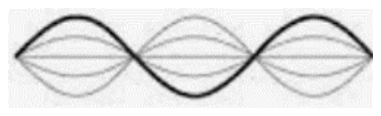{ loading=lazy }

??? success "Đáp án và lời giải"
    **Đáp án:** $13{,}3$
    **Hướng dẫn giải:**

    Hai nút liên tiếp hoặc hai bụng liên tiếp cách nhau $\lambda/2$. Dây hai đầu cố định có $L=n\lambda/2$; một đầu cố định, một đầu tự do có $L=(2n+1)\lambda/4$.

    Để trên dây xuất hiện sóng dừng, ta có
    Tốc độ truyền sóng trên dây là

    Vậy kết quả cần tìm là **$13{,}3$**.
#### Bài 11

<!-- source-id: BT-Chuong-II-p164-q3-387 -->

Một nam châm điện có dòng điện xoay chiều tần số 50 Hz chạy qua. Đặt nam châm điện
phía trên một dây thép AB căng ngang với hai đầu cố định. Chiều dài sợi dây là 0,6 m (Hình 13.2).
Người ta thấy trên dây có sóng dừng với hai bụng sóng. Sóng truyền trên dây có tốc độ bằng bao
nhiêu m/s?

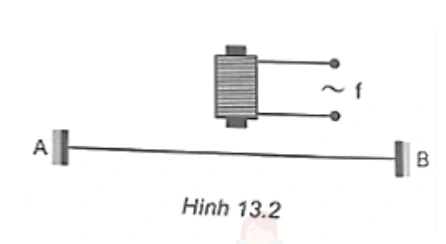{ loading=lazy }

??? success "Đáp án và lời giải"
    **Đáp án:** $60$
    **Hướng dẫn giải:**
    Nam châm điện hút dây hai lần trong một chu kì dòng điện xoay chiều, nên tần số dao động cưỡng bức của dây là $f=2\cdot50=100\,\mathrm{Hz}$.
    Hai đầu dây là nút; trên dây có 2 bụng nên $n=2$ và
    $L=n\dfrac{\lambda}{2}\Rightarrow\lambda=\dfrac{2L}{n}=0{,}6\,\mathrm{m}$.
    Vậy $v=\lambda f=0{,}6\cdot100=60\,\mathrm{m/s}$.
#### Bài 12

<!-- source-id: BT-Chuong-II-p165-q4-388 -->

Một sợi dây AB dài 1 m đầu A cố định đầu B gắn với cần rung có tần số thay đổi được. B
coi là nút sóng Ban đầu trên dây có sóng dừng. Khi tần số tăng thêm 20 Hz thì số nút sóng trên dây
tăng thêm 7 nút. Sau khoảng thời gian bằng bao nhiêu giây thì sóng phản xạ từ A truyền hết một lần
chiều dài sợi dây? (Kết quả làm tròn đến chữ số thập phân thứ 2 sau dấu phẩy)

??? success "Đáp án và lời giải"
    **Đáp án:** $0{,}18$
    **Hướng dẫn giải:**
    Với dây hai đầu là nút, điều kiện sóng dừng là
    $L=n\dfrac{\lambda}{2}=n\dfrac{v}{2f}$, hay $f=\dfrac{nv}{2L}$.
    Khi tần số tăng $\Delta f=20\,\mathrm{Hz}$ thì số nút tăng tương ứng $\Delta n=7$:
    $v=\dfrac{2L\Delta f}{\Delta n}=\dfrac{2\cdot1\cdot20}{7}=\dfrac{40}{7}\,\mathrm{m/s}$.
    Thời gian sóng đi một lần chiều dài dây:
    $t=\dfrac{L}{v}=\dfrac{7}{40}=0{,}175\,\mathrm{s}\approx0{,}18\,\mathrm{s}$.

    Vậy kết quả cần tìm là **$0{,}18$**.
#### Bài 13

<!-- source-id: BT-Chuong-II-p165-q5-389 -->

Trong thí nghiệm về sóng dừng trên một sợi dây đàn hồi dài 1,2m với hai đầu cố định, người
ta quan sát thấy ngoài 2 đầu dây cố định còn có hai điểm khác trên dây không dao động. Biết
khoảng thời gian giữa hai lần liên tiếp sợi dây duỗi thẳng là 0,05s. Tốc độ truyền sóng trên dây bằng
bao nhiêu cm/s ?

??? success "Đáp án và lời giải"
    **Đáp án:** $800\,\mathrm{cm/s}$.

    **Hướng dẫn giải:**
    Ngoài hai đầu cố định còn có hai nút bên trong, nên toàn dây có 4 nút và 3 khoảng nút-nút:
    $L=3\lambda/2$. Từ $L=1{,}2\,\mathrm{m}$ suy ra $\lambda=0{,}8\,\mathrm{m}$.
    Hai lần liên tiếp toàn dây duỗi thẳng cách nhau $T/2$, nên $T/2=0{,}05\,\mathrm{s}\Rightarrow T=0{,}10\,\mathrm{s}$.
    Vì vậy $v=\lambda/T=0{,}8/0{,}10=8\,\mathrm{m/s}=800\,\mathrm{cm/s}$.

    !!! warning "Đối chiếu nguồn"
        PDF nguồn cho $80\,\mathrm{cm/s}$; kết quả đúng là $800\,\mathrm{cm/s}$ sau khi đổi $8\,\mathrm{m/s}$ sang cm/s.

#### Bài 14

<!-- source-id: BT-Chuong-II-p166-q6-390 -->

Một sợi dây đàn hồi căng ngang, đang có sóng dừng ổn định. Trên dây, A là một điểm nút,
B là một điểm bụng gần A nhất, C là trung điểm của AB, với AB = 10 cm. Biết khoảng thời gian
ngắn nhất giữa hai lần mà li độ dao động của phần tử tại B bằng biên độ dao động của phần tử tại C
là 0,2 s. Tốc độ truyền sóng trên dây có giá trị bằng bao nhiêu m/s?

??? success "Đáp án và lời giải"
    **Đáp án:** $0{,}5$
    **Hướng dẫn giải:**
    Vì B là bụng gần nút A nhất, $AB=\lambda/4=10\,\mathrm{cm}$ nên $\lambda=40\,\mathrm{cm}$.
    C là trung điểm AB nên $AC=5\,\mathrm{cm}=\lambda/8$.
    Theo nguồn, khoảng thời gian ngắn nhất đã cho bằng $T/4$:
    $T/4=0{,}2\Rightarrow T=0{,}8\,\mathrm{s}$.
    Do $\lambda=vT$, suy ra $v=40/0{,}8=50\,\mathrm{cm/s}=0{,}5\,\mathrm{m/s}$.
#### Bài 15

<!-- source-id: BT-Chuong-II-p166-q7-391 -->

Sóng dừng trong cột không khí có dạng như hình . Chiều dài cột không khí bằng bao nhiêu
lần bước sóng?

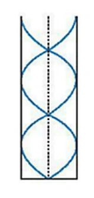{ loading=lazy }

??? success "Đáp án và lời giải"
    **Đáp án:** $1{,}25$
    **Hướng dẫn giải:**

    Cột không khí có một đầu kín, một đầu hở nên $L=(2n+1)\lambda/4$.

    Hình cho 2 bó sóng, tương ứng $n=2$, do đó

    $L=(2\cdot2+1)\dfrac{\lambda}{4}=\dfrac{5}{4}\lambda=1{,}25\lambda$.

    Vậy kết quả cần tìm là **$1{,}25$**.
#### Bài 16

<!-- source-id: BT-Chuong-II-p166-q8-392 -->

Trên một sợi dây đang có sóng dừng, khoảng cách ngắn nhất giữa một nút và một bụng là
2cm. Sóng truyền trên dây có bước sóng là bao nhiêu cm?

??? success "Đáp án và lời giải"
    **Đáp án:** 8
    **Hướng dẫn giải:**

    Hai nút liên tiếp hoặc hai bụng liên tiếp cách nhau $\lambda/2$. Dây hai đầu cố định có $L=n\lambda/2$; một đầu cố định, một đầu tự do có $L=(2n+1)\lambda/4$.

    Khoảng cách giữa một nút và một bụng là

    Vậy kết quả cần tìm là **8**.
#### Bài 17

<!-- source-id: BT-Chuong-II-p167-q9-393 -->

Một sợi dây đàn hồi dài 30 cm có hai đầu cố định. Trên dây đang có sóng dừng. Biết sóng
truyền trên dây với bước sóng 20 cm và biên độ dao động của điểm bụng là 2 cm. Số điểm trên dây
mà phần tử tại đó dao động với biên độ 6 mm là bao nhiêu?

??? success "Đáp án và lời giải"
    **Đáp án:** 6

    **Hướng dẫn giải:**

    $\dfrac{AB}{\lambda/2}=\dfrac{30}{10}=3$, nên trên dây có 3 bó sóng. Mỗi bó có 2 phần tử dao động với biên độ 6 mm.

    Vậy trên dây có **6 điểm** dao động với biên độ 6 mm.

#### Bài 18

<!-- source-id: BT-Chuong-II-p167-q10-394 -->

Sóng dừng trên sợi dây đàn hồi 2 đầu cố định AB dài 1 m. Biết tần số sóng trong khoảng
300 Hz đến 450 Hz. Tốc độ truyền dao động là 320 m/s. Sóng truyền trên dây có tần số bằng bao
nhiêu Hz?

??? success "Đáp án và lời giải"
    **Đáp án:** $320$
    **Hướng dẫn giải:**

    Hai nút liên tiếp hoặc hai bụng liên tiếp cách nhau $\lambda/2$. Dây hai đầu cố định có $L=n\lambda/2$; một đầu cố định, một đầu tự do có $L=(2n+1)\lambda/4$.

    Vậy kết quả cần tìm là **$320$**.
#### Bài 19

<!-- source-id: BT-Chuong-II-p167-q11-395 -->

Một sợi dây sắt, mảnh, dài 120 cm căng ngang, có hai đầu cố định. Ở phía trên, gần sợi dây
có một nam châm điện được nuôi bằng nguồn điện xoay chiều có tần số 50 Hz. Trên dây xuất hiện
sóng dừng với 2 bụng sóng. Tốc độ truyền sóng trên dây là bao nhiêu m/s ?

??? success "Đáp án và lời giải"
    **Đáp án:** $120\,\mathrm{m/s}$.

    **Hướng dẫn giải:**
    Hai bụng trên dây hai đầu cố định tương ứng $n=2$:
    $L=n\lambda/2\Rightarrow1{,}2=\lambda$, nên $\lambda=1{,}2\,\mathrm{m}$.
    Lực hút của nam châm điện không phụ thuộc chiều dòng điện, nên với nguồn xoay chiều $50\,\mathrm{Hz}$ lực kích thích biến thiên hai lần trong mỗi chu kì: $f_{\text{dây}}=100\,\mathrm{Hz}$.
    Do đó $v=\lambda f=1{,}2\cdot100=120\,\mathrm{m/s}$.

    !!! warning "Đối chiếu nguồn"
        PDF nguồn cho $2{,}4\,\mathrm{m/s}$ dù chính mô tả lời giải dùng tần số rung gấp đôi $50\,\mathrm{Hz}$.

#### Bài 20

<!-- source-id: BT-Chuong-II-p167-q12-396 -->

Một sợi dây đàn hồi căng ngang với đầu A cố định đang có sóng dừng. M và N là hai phân
tử dao động điều hòa có vị trí cân bằng cách đầu A những đoạn lần lượt là 16 cm và 27 cm. Biết
sóng truyền trên dây có bước sóng 24 cm. Tính tỉ số giữa biên độ dao động của M và biên độ dao
động của N. (Kết quả làm tròn đến chữ số thập phân thứ nhất sau dấu phẩy)

??? success "Đáp án và lời giải"
    **Đáp án:** $1{,}2$.

    **Hướng dẫn giải:**
    Với đầu A là nút, biên độ tại vị trí cách A một đoạn $x$ tỉ lệ với $|\sin(2\pi x/\lambda)|$.
    Do đó
    $\dfrac{A_M}{A_N}=\dfrac{|\sin(2\pi\cdot16/24)|}{|\sin(2\pi\cdot27/24)|}=\dfrac{\sqrt3/2}{\sqrt2/2}=\sqrt{\dfrac32}\approx1{,}2247$.
    Làm tròn ở bước cuối được $1{,}2$.

    !!! warning "Đối chiếu nguồn"
        PDF nguồn cho $-1{,}2$ do dùng giá trị có dấu của hàm sin. Biên độ là độ lớn không âm, nên tỉ số biên độ phải dương.

#### Bài 21

<!-- source-id: BT-Chuong-II-p173-q1-419 -->

Thực hiện thí nghiệm sóng dừng trên sợi dây ta thu được ảnh như hình. Trên sợi dây có mấy
bụng sóng?

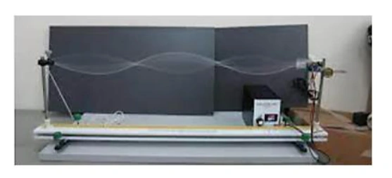{ loading=lazy }

??? success "Đáp án và lời giải"
    **Đáp án:** 3

    **Hướng dẫn giải:**
    Đếm được trên dây có 3 bụng

#### Bài 22

<!-- source-id: BT-Chuong-II-p174-q2-420 -->

Sóng truyền trên sợi dây OB được mô tả như hình vẽ. Bề rộng của một bụng sóng có giá trị
bằng bao nhiêu cm?

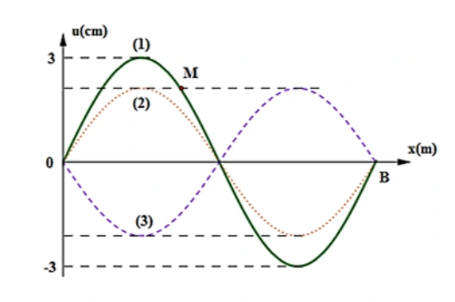{ loading=lazy }

??? success "Đáp án và lời giải"
    **Đáp án:** 6

    **Hướng dẫn giải:**
    Bề rộng của bụng = 3 + 3 = 6

#### Bài 23

<!-- source-id: BT-Chuong-II-p174-q3-421 -->

Một sợi dây AB dài 100 cm căng ngang, đầu B cố định, đầu A gắn với một nhánh của âm
thoa dao động điều hòa với tần số 40 Hz. Trên dây AB có một sóng dừng ổn định, A được coi là nút
sóng. Tốc độ truyền sóng trên dây là 20 m/s. Kể cả A và B, Tổng số nút và số bụng của sợi dây là
bao nhiêu?

??? success "Đáp án và lời giải"
    **Đáp án:** 9
    **Hướng dẫn giải:**

    Hai nút liên tiếp hoặc hai bụng liên tiếp cách nhau $\lambda/2$. Dây hai đầu cố định có $L=n\lambda/2$; một đầu cố định, một đầu tự do có $L=(2n+1)\lambda/4$.

    . Suy ra có 4 bụng và 5 nút, tổng số nút và bụng là 5+4=9

    Vậy kết quả cần tìm là **9**.
#### Bài 24

<!-- source-id: BT-Chuong-II-p175-q4-422 -->

Một sợi dây sắt dài 1,21 m căng ngang, có một đầu cố định một đầu tự do. Ở phía trên, gần
sợi dây có một nam châm điện được nuôi bằng nguồn điện xoay chiều. Cho dòng điện qua nam
châm thì trên dây xuất hiện sóng dừng với 6 bụng sóng. Nếu tốc độ truyền sóng trên dây là 66 m/s
thì tần số của dòng điện xoay chiều là bao nhiêu Hz ?

??? success "Đáp án và lời giải"
    **Đáp án:** $75$
    **Hướng dẫn giải:**

    Hai nút liên tiếp hoặc hai bụng liên tiếp cách nhau $\lambda/2$. Dây hai đầu cố định có $L=n\lambda/2$; một đầu cố định, một đầu tự do có $L=(2n+1)\lambda/4$.

    Vậy kết quả cần tìm là **$75$**.
#### Bài 25

<!-- source-id: BT-Chuong-II-p175-q5-423 -->

Quan sát sóng dừng trên sợi dây AB, đầu A dao động điều hòa theo phương vuông góc với
sợi dây (coi A là nút). Với đầu B tự do và tần số dao động của đầu A là 22 Hz thì trên dây có 6 nút.
Nếu đầu B cố định và coi tốc độ truyền sóng trên dây như cũ, để vẫn có 6 nút thì tần số dao động
của đầu A phải bằng bao nhiêu Hz?

??? success "Đáp án và lời giải"
    **Đáp án:** $20$
    **Hướng dẫn giải:**

    Hai nút liên tiếp hoặc hai bụng liên tiếp cách nhau $\lambda/2$. Dây hai đầu cố định có $L=n\lambda/2$; một đầu cố định, một đầu tự do có $L=(2n+1)\lambda/4$.

    Đầu A tự do, đầu B cố định, ta có
    Khi 2 đầu cố định

    Vậy kết quả cần tìm là **$20$**.
#### Bài 26

<!-- source-id: BT-Chuong-II-p175-q6-424 -->

Một sợi dây đang có sóng dừng ổn định. Sóng truyền trên dây có tần số 10 Hz và bước sóng 6 cm. Trên dây, hai phần tử M và N có vị trí cân bằng cách nhau 8 cm, M thuộc một bụng sóng dao động điều hòa với biên độ 6 mm. Lấy $\pi^2=10$. Tại thời điểm $t$, phần tử M đang chuyển động với tốc độ $6\pi$ cm/s thì phần tử N chuyển động với gia tốc có độ lớn bằng bao nhiêu m/s²? (Kết quả làm tròn đến chữ số thập phân thứ nhất sau dấu phẩy)

??? success "Đáp án và lời giải"
    **Đáp án:** $10{,}4$
    **Hướng dẫn giải:**

    Biên độ của M là $A_M=6\,\mathrm{mm}=0{,}6\,\mathrm{cm}$ và $\omega=2\pi f=20\pi\,\mathrm{rad/s}$.

    Vì $MN=8\,\mathrm{cm}=4\lambda/3$, biên độ của N là

    $A_N=A_M\left|\cos\dfrac{2\pi d}{\lambda}\right|=6\left|\cos\dfrac{8\pi}{3}\right|=3\,\mathrm{mm}$.

    Tại thời điểm xét,

    $|a_M|=\omega\sqrt{\omega^2A_M^2-v_M^2}=12\sqrt3\,\mathrm{m/s^2}$.

    M và N dao động ngược pha, nên độ lớn gia tốc tỉ lệ với biên độ:

    $|a_N|=|a_M|\dfrac{A_N}{A_M}=12\sqrt3\cdot\dfrac36=6\sqrt3\approx10{,}4\,\mathrm{m/s^2}$.

    Vậy kết quả cần tìm là **$10{,}4$**.

### Nhận biết — Trắc nghiệm 4 lựa chọn

#### Bài 27

<!-- source-id: BT-Chuong-II-p152-q1-341 -->

Tại điểm phản xạ thì sóng phản xạ

A. luôn ngược pha với sóng tới.

B. ngược pha với sóng tới nếu vật cản là cố định.

C. ngược pha với sóng tới nếu vật cản là tự do.

D. cùng pha với sóng tới nếu vật cản là cố định.

??? success "Đáp án và lời giải"
    **Đáp án:** B
    **Hướng dẫn giải:**

    Hai nút liên tiếp hoặc hai bụng liên tiếp cách nhau $\lambda/2$. Dây hai đầu cố định có $L=n\lambda/2$; một đầu cố định, một đầu tự do có $L=(2n+1)\lambda/4$.

    Đối chiếu kết quả với các lựa chọn, phương án phù hợp là **B. ngược pha với sóng tới nếu vật cản là cố định.**
#### Bài 28

<!-- source-id: BT-Chuong-II-p152-q2-342 -->

Trong hiện tượng sóng dừng trên một sợi dây có hai đầu cố định, khoảng cách giữa hai nút
hoặc hai bụng liên tiếp bằng

A. một bước sóng.

B. hai bước sóng.

C. một phần tư bước sóng.

D. một nửa bước sóng.

??? success "Đáp án và lời giải"
    **Đáp án:** D
    **Hướng dẫn giải:**

    Hai nút liên tiếp hoặc hai bụng liên tiếp cách nhau $\lambda/2$. Dây hai đầu cố định có $L=n\lambda/2$; một đầu cố định, một đầu tự do có $L=(2n+1)\lambda/4$.

    Đối chiếu kết quả với các lựa chọn, phương án phù hợp là **D. một nửa bước sóng.**
#### Bài 29

<!-- source-id: BT-Chuong-II-p152-q3-343 -->

Trong hiện tượng sóng dừng trên một sợi dây mà hai đầu được giữ cố định thì độ dài của
bước sóng phải bằng

A. khoảng cách giữa hai nút hoặc hai bụng.

B. độ dài của dây.

C. hai lần độ dài của dây.

D. hai lần khoảng cách giữa hai nút hoặc hai bụng kề nhau.

??? success "Đáp án và lời giải"
    **Đáp án:** D
    **Hướng dẫn giải:**

    Hai nút liên tiếp hoặc hai bụng liên tiếp cách nhau $\lambda/2$. Dây hai đầu cố định có $L=n\lambda/2$; một đầu cố định, một đầu tự do có $L=(2n+1)\lambda/4$.

    Đối chiếu kết quả với các lựa chọn, phương án phù hợp là **D. hai lần khoảng cách giữa hai nút hoặc hai bụng kề nhau.**
#### Bài 30

<!-- source-id: BT-Chuong-II-p152-q4-344 -->

Để tạo một sóng dừng giữa hai đầu dây cố định thì độ dài của dây bằng

A. một số nguyên lần bước sóng.

B. một số lẻ lần nửa bước sóng.

C. một số nguyên lần nửa bước sóng.

D. một số lẻ lần bước sóng.

??? success "Đáp án và lời giải"
    **Đáp án:** C
    **Hướng dẫn giải:**

    Hai nút liên tiếp hoặc hai bụng liên tiếp cách nhau $\lambda/2$. Dây hai đầu cố định có $L=n\lambda/2$; một đầu cố định, một đầu tự do có $L=(2n+1)\lambda/4$.

    Đối chiếu kết quả với các lựa chọn, phương án phù hợp là **C. một số nguyên lần nửa bước sóng.**
#### Bài 31

<!-- source-id: BT-Chuong-II-p152-q5-345 -->

Một hình thí nghiệm khảo sát hiện tượng sóng dừng trên dây được thực hiện như Hình 9.2.

Bước sóng trong thí nghiệm có chiều dài bằng

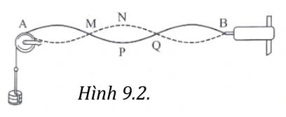{ loading=lazy }

A. AM.

B. AN.

C. AP.

D. AQ.

??? success "Đáp án và lời giải"
    **Đáp án:** D
    **Hướng dẫn giải:**

    Hai nút liên tiếp hoặc hai bụng liên tiếp cách nhau $\lambda/2$. Dây hai đầu cố định có $L=n\lambda/2$; một đầu cố định, một đầu tự do có $L=(2n+1)\lambda/4$.

    Đối chiếu kết quả với các lựa chọn, phương án phù hợp là **D. AQ.**
#### Bài 32

<!-- source-id: BT-Chuong-II-p152-q6-346 -->

Sóng dừng là

A. hai sóng cùng biên độ, cùng bước sóng lan truyền theo hai hướng ngược nhau gặp nhau và giao
thoa với nhau tạo nên một sóng tổng hợp.

B. hai sóng khác biên độ, cùng bước sóng lan truyền theo hai hướng ngược nhau gặp nhau và giao
thoa với nhau tạo nên một sóng tổng hợp.

C. hai sóng cùng biên độ, khác bước sóng lan truyền theo hai hướng ngược nhau gặp nhau và giao
thoa với nhau tạo nên một sóng tổng hợp.

D. hai sóng khác biên độ, khác bước sóng lan truyền theo hai hướng ngược nhau gặp nhau và giao
Hình 9.2.

thoa với nhau tạo nên một sóng tổng hợp.
??? success "Đáp án và lời giải"
    **Đáp án:** A
    **Hướng dẫn giải:**

    Hai nút liên tiếp hoặc hai bụng liên tiếp cách nhau $\lambda/2$. Dây hai đầu cố định có $L=n\lambda/2$; một đầu cố định, một đầu tự do có $L=(2n+1)\lambda/4$.

    Đối chiếu kết quả với các lựa chọn, phương án phù hợp là **A. hai sóng cùng biên độ, cùng bước sóng lan truyền theo hai hướng ngược nhau gặp nhau và giao**
#### Bài 33

<!-- source-id: BT-Chuong-II-p153-q7-347 -->

Khi nói về sóng dừng. Phát biểu nào sau đây là đúng?

A. Những điểm luôn đứng yên gọi là nút sóng.

B. Những điểm luôn đứng yên gọi là bụng sóng.

C. Những điểm luôn dao động với biên độ cực đại gọi là nút sóng.

D. Những điểm luôn dao động với biên độ cực tiểu gọi là bụng sóng.

??? success "Đáp án và lời giải"
    **Đáp án:** A
    **Hướng dẫn giải:**

    Hai nút liên tiếp hoặc hai bụng liên tiếp cách nhau $\lambda/2$. Dây hai đầu cố định có $L=n\lambda/2$; một đầu cố định, một đầu tự do có $L=(2n+1)\lambda/4$.

    Đối chiếu kết quả với các lựa chọn, phương án phù hợp là **A. Những điểm luôn đứng yên gọi là nút sóng.**
#### Bài 34

<!-- source-id: BT-Chuong-II-p153-q8-348 -->

Trong sóng dừng nút sóng và bụng sóng liên tiếp cách nhau

A. một nửa bước sóng.

B. một bước sóng.

C. một phần tư bước sóng.

D. hai lần tư bước sóng.

??? success "Đáp án và lời giải"
    **Đáp án:** C
    **Hướng dẫn giải:**

    Hai nút liên tiếp hoặc hai bụng liên tiếp cách nhau $\lambda/2$. Dây hai đầu cố định có $L=n\lambda/2$; một đầu cố định, một đầu tự do có $L=(2n+1)\lambda/4$.

    Đối chiếu kết quả với các lựa chọn, phương án phù hợp là **C. một phần tư bước sóng.**
#### Bài 35

<!-- source-id: BT-Chuong-II-p153-q9-349 -->

Sóng truyền trên một sợi dây hai đầu cố định có bước sóng $\lambda$. Muốn có sóng dừng trên dây thì chiều dài $L$ của dây phải thỏa mãn điều kiện là

A. $L=\lambda$.

B. $L=\dfrac{\lambda}{2}$.

C. $L=2\lambda$.

D. $L=\dfrac{\lambda}{4}$.

??? success "Đáp án và lời giải"
    **Đáp án:** B
    **Hướng dẫn giải:**

    Hai nút liên tiếp hoặc hai bụng liên tiếp cách nhau $\lambda/2$. Dây hai đầu cố định có $L=n\lambda/2$; một đầu cố định, một đầu tự do có $L=(2n+1)\lambda/4$.

    Đối chiếu kết quả với các lựa chọn, phương án phù hợp là **B. $L=\dfrac{\lambda}{2}$.**
#### Bài 36

<!-- source-id: BT-Chuong-II-p153-q10-350 -->

Đàn tính như hình là loại nhạc cụ dây khi gảy đàn trên dây sẽ xuất hiện sóng dừng. Âm do
dây đàn phát ra có bước sóng lớn nhất bằng

{ loading=lazy }

A. L
2 .

B. L
4 .

C. L.

D. 2L.

??? success "Đáp án và lời giải"
    **Đáp án:** D
    **Hướng dẫn giải:**

    Hai nút liên tiếp hoặc hai bụng liên tiếp cách nhau $\lambda/2$. Dây hai đầu cố định có $L=n\lambda/2$; một đầu cố định, một đầu tự do có $L=(2n+1)\lambda/4$.

    Đối chiếu kết quả với các lựa chọn, phương án phù hợp là **D. 2L.**
#### Bài 37

<!-- source-id: BT-Chuong-II-p153-q11-351 -->

Một sợi dây đàn hồi chiều dài $L$ có hai đầu cố định, bước sóng của sóng trên dây là $\lambda$. Khi có sóng dừng trên dây, chiều dài $L$ được xác định theo công thức

A. $L=n\dfrac{\lambda}{2}$ với $n=1,2,3,\ldots$.

B. $L=n\dfrac{\lambda}{4}$ với $n=1,2,3,\ldots$.

C. $L=(2n+1)\dfrac{\lambda}{4}$ với $n=0,1,2,3,\ldots$.

D. $L=(2n+1)\dfrac{\lambda}{2}$ với $n=1,2,3,\ldots$.

??? success "Đáp án và lời giải"
    **Đáp án:** A
    **Hướng dẫn giải:**

    Hai nút liên tiếp hoặc hai bụng liên tiếp cách nhau $\lambda/2$. Dây hai đầu cố định có $L=n\lambda/2$; một đầu cố định, một đầu tự do có $L=(2n+1)\lambda/4$.

    Đối chiếu kết quả với các lựa chọn, phương án phù hợp là **A. $L=n\dfrac{\lambda}{2}$ với $n=1,2,3,\ldots$.**
#### Bài 38

<!-- source-id: BT-Chuong-II-p153-q12-352 -->

Một sợi dây đàn hồi chiều dài $L$ có một đầu cố định, một đầu tự do, bước sóng của sóng trên dây là $\lambda$. Khi có sóng dừng trên dây, chiều dài $L$ được xác định theo công thức

A. $L=n\dfrac{\lambda}{2}$ với $n=1,2,3,\ldots$.

B. $L=n\dfrac{\lambda}{4}$ với $n=0,1,2,3,\ldots$.

C. $L=(2n+1)\dfrac{\lambda}{4}$ với $n=0,1,2,3,\ldots$.

D. $L=(2n+1)\dfrac{\lambda}{2}$ với $n=1,2,3,\ldots$.

??? success "Đáp án và lời giải"
    **Đáp án:** C
    **Hướng dẫn giải:**

    Hai nút liên tiếp hoặc hai bụng liên tiếp cách nhau $\lambda/2$. Dây hai đầu cố định có $L=n\lambda/2$; một đầu cố định, một đầu tự do có $L=(2n+1)\lambda/4$.

    Đối chiếu kết quả với các lựa chọn, phương án phù hợp là **C. $L=(2n+1)\dfrac{\lambda}{4}$ với $n=0,1,2,3,\ldots$.**
#### Bài 39

<!-- source-id: BT-Chuong-II-p153-q13-353 -->

Sóng dừng trên một sợi dây đàn hồi chiều dài L = PQ được mô tả như Hình bên. Số nút
sóng (kể cả hai đầu dây) và số bụng sóng trên dây là

{ loading=lazy }

A. hai nút sóng và ba bụng sóng.

B. ba nút sóng và bốn bụng sóng.

C. bốn nút sóng và ba bụng sóng.

D. bốn nút sóng và sáu bụng sóng.

??? success "Đáp án và lời giải"
    **Đáp án:** C
    **Hướng dẫn giải:**

    Hai nút liên tiếp hoặc hai bụng liên tiếp cách nhau $\lambda/2$. Dây hai đầu cố định có $L=n\lambda/2$; một đầu cố định, một đầu tự do có $L=(2n+1)\lambda/4$.

    Đối chiếu kết quả với các lựa chọn, phương án phù hợp là **C. bốn nút sóng và ba bụng sóng.**
#### Bài 40

<!-- source-id: BT-Chuong-II-p154-q14-354 -->

Điều nào sau đây là sai khi nói về sóng dừng?

A. Sóng dừng là sóng có các bụng và các nút cố định trong không gian.

B. Khoảng cách giữa hai nút hoặc hai bụng liên tiếp bằng bước sóng $\lambda$.

C. Sóng dừng là tổng hợp của nhiều sóng tới và sóng phản xạ.

D. Khoảng cách giữa hai nút hoặc hai bụng liên tiếp bằng $\lambda/2$.

??? success "Đáp án và lời giải"
    **Đáp án:** B
    **Hướng dẫn giải:**

    Hai nút liên tiếp hoặc hai bụng liên tiếp cách nhau $\lambda/2$. Dây hai đầu cố định có $L=n\lambda/2$; một đầu cố định, một đầu tự do có $L=(2n+1)\lambda/4$.

    Đối chiếu kết quả với các lựa chọn, phương án phù hợp là **B. Khoảng cách giữa hai nút hoặc hai bụng liên tiếp bằng bước sóng $\lambda$.**
#### Bài 41

<!-- source-id: BT-Chuong-II-p154-q15-355 -->

Khi nói về ứng dụng của sóng dừng. Phát biểu nào sau đây là đúng?

A. Xác định vận tốc truyền sóng.

B. Xác định tần số sóng.

C. Xác định chu kì sóng.

D. Xác định năng lượng sóng.

??? success "Đáp án và lời giải"
    **Đáp án:** A
    **Hướng dẫn giải:**

    Hai nút liên tiếp hoặc hai bụng liên tiếp cách nhau $\lambda/2$. Dây hai đầu cố định có $L=n\lambda/2$; một đầu cố định, một đầu tự do có $L=(2n+1)\lambda/4$.

    Đối chiếu kết quả với các lựa chọn, phương án phù hợp là **A. Xác định vận tốc truyền sóng.**
#### Bài 42

<!-- source-id: BT-Chuong-II-p154-q16-356 -->

Sóng truyền trên một sợi dây có một đầu cố định, một đầu tự do. Muốn có sóng dừng trên
dây thì chiều dài của sợi dây phải bằng một số

A. chẵn lần một phần tư bước sóng.

B. lẻ lần nửa bước sóng.

C. nguyên lần bước sóng.

D. lẻ lần một phần tư bước sóng.

??? success "Đáp án và lời giải"
    **Đáp án:** D
    **Hướng dẫn giải:**

    Hai nút liên tiếp hoặc hai bụng liên tiếp cách nhau $\lambda/2$. Dây hai đầu cố định có $L=n\lambda/2$; một đầu cố định, một đầu tự do có $L=(2n+1)\lambda/4$.

    Đối chiếu kết quả với các lựa chọn, phương án phù hợp là **D. lẻ lần một phần tư bước sóng.**
#### Bài 43

<!-- source-id: BT-Chuong-II-p154-q17-357 -->

Điều kiện xảy ra sóng dừng trên sợi dây đàn hồi hai đầu cố định là

A. chiều dài bằng một phần tư bước sóng.

B. chiều dài dây bằng một số nguyên lần nửa bước sóng.

C. bước sóng gấp đôi chiều dài dây.

D. bước sóng bằng số lẻ lần chiều dài dây.

??? success "Đáp án và lời giải"
    **Đáp án:** B
    **Hướng dẫn giải:**

    Hai nút liên tiếp hoặc hai bụng liên tiếp cách nhau $\lambda/2$. Dây hai đầu cố định có $L=n\lambda/2$; một đầu cố định, một đầu tự do có $L=(2n+1)\lambda/4$.

    Đối chiếu kết quả với các lựa chọn, phương án phù hợp là **B. chiều dài dây bằng một số nguyên lần nửa bước sóng.**
#### Bài 44

<!-- source-id: BT-Chuong-II-p154-q18-358 -->

Sóng dừng là tổng hợp của sóng

A. tới và sóng phản xạ.

B. ngang và sóng phản xạ.

C. dọc và sóng ngang.

D. tới và sóng ngang.

??? success "Đáp án và lời giải"
    **Đáp án:** A
    **Hướng dẫn giải:**

    Hai nút liên tiếp hoặc hai bụng liên tiếp cách nhau $\lambda/2$. Dây hai đầu cố định có $L=n\lambda/2$; một đầu cố định, một đầu tự do có $L=(2n+1)\lambda/4$.

    Đối chiếu kết quả với các lựa chọn, phương án phù hợp là **A. tới và sóng phản xạ.**
#### Bài 45

<!-- source-id: BT-Chuong-II-p156-q29-369 -->

Trên một sợi dây đàn hồi đang có sóng dừng. Biết khoảng cách ngắn nhất giữa một nút
sóng và vị trí cân bằng của một bụng sóng là 0,25m. Sóng truyền trên dây với bước sóng là

A. 0,5 m.

B. 1,5 m.

C. 1,0 m.

D. 2,0 m.

??? success "Đáp án và lời giải"
    **Đáp án:** C
    **Hướng dẫn giải:**

    Hai nút liên tiếp hoặc hai bụng liên tiếp cách nhau $\lambda/2$. Dây hai đầu cố định có $L=n\lambda/2$; một đầu cố định, một đầu tự do có $L=(2n+1)\lambda/4$.

    Đối chiếu kết quả với các lựa chọn, phương án phù hợp là **C. 1,0 m.**
#### Bài 46

<!-- source-id: BT-Chuong-II-p156-q30-370 -->

Trên một sợi dây đang có sóng dừng. Biết sóng truyền trên dây có bước sóng 30 cm.
Khoảng cách ngắn nhất từ một nút đến một bụng là

A. 15 cm.

B. 30 cm.

C. 7,5 cm.

D. 60 cm.

??? success "Đáp án và lời giải"
    **Đáp án:** C
    **Hướng dẫn giải:**

    Hai nút liên tiếp hoặc hai bụng liên tiếp cách nhau $\lambda/2$. Dây hai đầu cố định có $L=n\lambda/2$; một đầu cố định, một đầu tự do có $L=(2n+1)\lambda/4$.

    Khi có sóng dừng trên dây, khoảng cách ngắn nhất từ một nút đến một bụng là

    Đối chiếu kết quả với các lựa chọn, phương án phù hợp là **C. 7,5 cm.**
#### Bài 47

<!-- source-id: BT-Chuong-II-p157-q32-372 -->

Một sợi dây đàn hồi có độ dài AB = 80cm, đầu B giữ cố định, đầu A gắn với cần rung dao
động điều hòa với tần số 50Hz theo phương vuông góc với AB. Trên dây có một sóng dừng với 4
bụng sóng, coi A và B là nút sóng. Tốc độ truyền sóng trên dây là

A. 10 m/s.

B. 5 m/s.

C. 20 m/s.

D. 40 m/s.

??? success "Đáp án và lời giải"
    **Đáp án:** C
    **Hướng dẫn giải:**

    Hai nút liên tiếp hoặc hai bụng liên tiếp cách nhau $\lambda/2$. Dây hai đầu cố định có $L=n\lambda/2$; một đầu cố định, một đầu tự do có $L=(2n+1)\lambda/4$.

    Đối chiếu kết quả với các lựa chọn, phương án phù hợp là **C. 20 m/s.**
#### Bài 48

<!-- source-id: BT-Chuong-II-p157-q33-373 -->

Trên một sợi dây cố định dài 0,9 m có sóng dừng. Kể cả hai nút ở hai đầu dây thì trên dây
có 10 nút sóng. Biết tốc độ truyền sóng truyền trên dây là 40m/s. Sóng truyền trên dây có tần s

A. 100 Hz.

B. 200 Hz.

C. 300 Hz.

D. 400 Hz.

??? success "Đáp án và lời giải"
    **Đáp án:** B
    **Hướng dẫn giải:**

    Hai nút liên tiếp hoặc hai bụng liên tiếp cách nhau $\lambda/2$. Dây hai đầu cố định có $L=n\lambda/2$; một đầu cố định, một đầu tự do có $L=(2n+1)\lambda/4$.

    Đối chiếu kết quả với các lựa chọn, phương án phù hợp là **B. 200 Hz.**
#### Bài 49

<!-- source-id: BT-Chuong-II-p157-q34-374 -->

Một sợi dây sắt dài 120 cm căng ngang, có hai đầu cố định. Ở phía trên, gần sợi dây có
một nam châm điện được nuôi bằng nguồn điện xoay chiều có tần số 50 Hz. Trên dây xuất hiện
sóng dừng với 2 bụng sóng. Tốc độ truyền sóng trên dây là

A. 120 m/s.

B. 60 m/s.

C. 180 m/s.

D. 240 m/s.

??? success "Đáp án và lời giải"
    **Đáp án:** A
    **Hướng dẫn giải:**

    Hai nút liên tiếp hoặc hai bụng liên tiếp cách nhau $\lambda/2$. Dây hai đầu cố định có $L=n\lambda/2$; một đầu cố định, một đầu tự do có $L=(2n+1)\lambda/4$.

    Nguồn điện xoay chiều có tần số 50 Hz nên tần số của sóng trên dây là 100 Hz

    Đối chiếu kết quả với các lựa chọn, phương án phù hợp là **A. 120 m/s.**
#### Bài 50

<!-- source-id: BT-Chuong-II-p157-q35-375 -->

Một sợi dây sắt dài 1,2 m căng ngang, có hai đầu cố định. Ở phía trên, gần sợi dây có một
nam châm điện được nuôi bằng nguồn điện xoay chiều. Cho dòng điện qua nam châm thì trên dây
xuất hiện sóng dừng với 6 bụng sóng. Nếu tốc độ truyền sóng trên dây là 20m/s thì tần số của dòng
điện xoay chiều là

A. 50 Hz.

B. 100 Hz.

C. 60 Hz.

D. 25 Hz.

??? success "Đáp án và lời giải"
    **Đáp án:** D
    **Hướng dẫn giải:**

    Hai nút liên tiếp hoặc hai bụng liên tiếp cách nhau $\lambda/2$. Dây hai đầu cố định có $L=n\lambda/2$; một đầu cố định, một đầu tự do có $L=(2n+1)\lambda/4$.

    Đối chiếu kết quả với các lựa chọn, phương án phù hợp là **D. 25 Hz.**
#### Bài 51

<!-- source-id: BT-Chuong-II-p157-q36-376 -->

Một sợi dây đàn hồi 2 đầu cố định, hai tần số liên tiếp có sóng dừng trên dây là 50 Hz và
70Hz. Hãy xác định tần số nhỏ nhất có sóng dừng trên dây.

A. 20.

B. 10.

C. 30.

D. 40.

??? success "Đáp án và lời giải"
    **Đáp án:** A
    **Hướng dẫn giải:**

    Hai nút liên tiếp hoặc hai bụng liên tiếp cách nhau $\lambda/2$. Dây hai đầu cố định có $L=n\lambda/2$; một đầu cố định, một đầu tự do có $L=(2n+1)\lambda/4$.

    Đối chiếu kết quả với các lựa chọn, phương án phù hợp là **A. 20.**
#### Bài 52

<!-- source-id: BT-Chuong-II-p157-q37-377 -->

Một sợi dây đàn hồi căng ngang, hai đầu cố định. Trên dây có sóng dừng, tốc độ truyền
sóng không đổi. Khi tần số sóng trên dây là 42 Hz thì trên dây có 4 điểm bụng. Nếu trên dây có 6
điểm bụng thì tần số sóng trên dây là

A. 252 Hz.

B. 126 Hz.

C. 28 Hz.

D. 63 Hz.

??? success "Đáp án và lời giải"
    **Đáp án:** D
    **Hướng dẫn giải:**

    Hai nút liên tiếp hoặc hai bụng liên tiếp cách nhau $\lambda/2$. Dây hai đầu cố định có $L=n\lambda/2$; một đầu cố định, một đầu tự do có $L=(2n+1)\lambda/4$.

    Đối chiếu kết quả với các lựa chọn, phương án phù hợp là **D. 63 Hz.**
#### Bài 53

<!-- source-id: BT-Chuong-II-p158-q38-378 -->

Trên một sợi dây đàn hồi đang có sóng dừng với biên độ dao động của các điểm bụng
là a. M là một phần tử dây dao động với biên độ 0,5a. Biết vị trí cân bằng của M cách điểm nút
gần nó nhất một khoảng 2 cm. Sóng truyền trên dây có bước sóng là:

A. 24 cm.

B. 12 cm.

C. 16 cm.

D. 3 cm.

??? success "Đáp án và lời giải"
    **Đáp án:** A
    **Hướng dẫn giải:**

    Hai nút liên tiếp hoặc hai bụng liên tiếp cách nhau $\lambda/2$. Dây hai đầu cố định có $L=n\lambda/2$; một đầu cố định, một đầu tự do có $L=(2n+1)\lambda/4$.

    Biên độ của 1 phần tử M sóng dừng cách nút sóng doạn d là

    Đối chiếu kết quả với các lựa chọn, phương án phù hợp là **A. 24 cm.**
#### Bài 54

<!-- source-id: BT-Chuong-II-p158-q39-379 -->

Một sợi dây căng ngang với hai đầu cố định, đang có sóng đừng, Biết khoảng cách xa
nhất giữa hai phần tử dây dao động với cùng biên độ 5 mm là 80 cm, còn khoảng cách xa nhất
giữa hai phần tử dây dao động cùng pha với cùng biên độ 5 mm là 65 cm. Tỉ số giữa tốc độ cực
đại của một phần tử dây tại bụng sóng và tốc độ truyền sóng trên dây là

A. 0,12.

B. 0,41.

C. 0,21.

D. 0,14.

??? success "Đáp án và lời giải"
    **Đáp án:** A
    **Hướng dẫn giải:**
    Hai phần tử xa nhau nhất có cùng biên độ ở hai bó sóng ngoài cùng. Gọi $x$ là khoảng cách từ mỗi điểm đó đến đầu dây gần nhất.
    Hai phần tử cùng biên độ ở hai bó liền kề cách nhau xa nhất một nửa bước sóng, nên
    $\lambda=2(80-65)=30\,\mathrm{cm}$.
    Vì $80\,\mathrm{cm}<3\lambda$, trên dây có 6 bó sóng; do đó $l=3\lambda=90\,\mathrm{cm}$ và
    $l-80=2x\Rightarrow x=5\,\mathrm{cm}$.
    Biên độ tại điểm cách nút một khoảng $x$ là
    $A_M=\left|2a\sin\dfrac{2\pi x}{\lambda}\right|=5\,\mathrm{mm}$,
    suy ra $a=\dfrac{5}{\sqrt3}\,\mathrm{mm}$.
    Tốc độ dao động cực đại tại bụng:
    $v_{\max}=2a\omega=\dfrac{20\pi f}{\sqrt3}\,\mathrm{mm/s}$.
    Tốc độ truyền sóng:
    $v=\lambda f=300f\,\mathrm{mm/s}$.
    Vì thế
    $\dfrac{v_{\max}}{v}=\dfrac{20\pi}{300\sqrt3}\approx0{,}12$.
#### Bài 55

<!-- source-id: BT-Chuong-II-p159-q40-380 -->

Trên một sợi dây OB căng ngang, hai đầu cố định đang có sóng dừng với tần số $f$ xác định. Gọi M, N và P là ba điểm trên dây có vị trí cân bằng cách B lần lượt 4 cm, 6 cm và 38 cm. Hình vẽ mô tả dạng sợi dây ở thời điểm $t_1$ (đường 1) và thời điểm $t_2=t_1+\dfrac{11}{12f}$ (đường 2). Tại thời điểm $t_1$, li độ của phần tử dây ở N bằng biên độ của phần tử dây ở M và tốc độ của phần tử dây ở M là 60 cm/s. Tại thời điểm $t_2$, vận tốc của phần tử dây ở P là

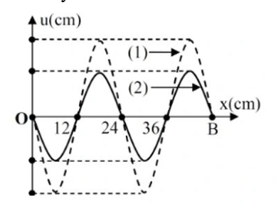{ loading=lazy }

A. $20\sqrt3$ cm/s.

B. 60 cm/s.

C. $-20\sqrt3$ cm/s.

D. $-60$ cm/s.

??? success "Đáp án và lời giải"
    **Đáp án:** D
    **Hướng dẫn giải:**
    Từ đồ thị, $\lambda=24\,\mathrm{cm}$; $BM=\lambda/6$, $BN=\lambda/4$ và $BP=3\lambda/2+\lambda/12$.
    Với B là nút, N là bụng; M và N cùng pha, còn P ngược pha với M.
    Biên độ tại điểm cách nút một đoạn $x$ là $A=A_b\left|\sin\dfrac{2\pi x}{\lambda}\right|$, nên
    $A_M=\dfrac{\sqrt3}{2}A_b$, $A_N=A_b$, $A_P=\dfrac12A_b$.
    Tại $t_1$, từ $u_N=A_M$ suy ra $u_M=3A_b/4$. Do
    $|v_M|=\omega\sqrt{A_M^2-u_M^2}=60\,\mathrm{cm/s}$, ta có $\omega A_b=80\sqrt3$.
    Sau $11T/12$, nguồn cho $u_P=-A_b/4$ và P chuyển động theo chiều âm, nên
    $v_P=-\omega\sqrt{A_P^2-u_P^2}=-60\,\mathrm{cm/s}$.

    Đối chiếu kết quả với các lựa chọn, phương án phù hợp là **D. $-60$ cm/s.**
#### Bài 56

<!-- source-id: BT-Chuong-II-p168-q1-397 -->

Sóng phản xạ

A. luôn luôn cùng pha với sóng tới ở điểm phản xạ.

B. ngược pha với sóng tới ở điểm phản xạ khi phản xạ trên một vật cản cố định.

C. ngược pha với sóng tới ở điểm phản xạ khi phản xạ trên một vật cản tự do.

D. luôn luôn ngược pha với sóng tới ở điểm phản xạ.

??? success "Đáp án và lời giải"
    **Đáp án:** B
    **Hướng dẫn giải:**

    Hai nút liên tiếp hoặc hai bụng liên tiếp cách nhau $\lambda/2$. Dây hai đầu cố định có $L=n\lambda/2$; một đầu cố định, một đầu tự do có $L=(2n+1)\lambda/4$.

    Đối chiếu kết quả với các lựa chọn, phương án phù hợp là **B. ngược pha với sóng tới ở điểm phản xạ khi phản xạ trên một vật cản cố định.**
#### Bài 57

<!-- source-id: BT-Chuong-II-p168-q2-398 -->

Khi nói về sự phản xạ của sóng cơ trên vật cản tự do, phát biểu nào sau đây đúng?

A. Tần số của sóng phản xạ luôn lớn hơn tần số của sóng tới.

B. Sóng phản xạ luôn cùng pha với sóng tới ở điểm phản xạ.

C. Tần số của sóng phản xạ luôn nhỏ hơn tần số của sóng tới.

D. Sóng phản xạ luôn ngược pha với sóng tới ở điểm phản xạ.

??? success "Đáp án và lời giải"
    **Đáp án:** B
    **Hướng dẫn giải:**

    Hai nút liên tiếp hoặc hai bụng liên tiếp cách nhau $\lambda/2$. Dây hai đầu cố định có $L=n\lambda/2$; một đầu cố định, một đầu tự do có $L=(2n+1)\lambda/4$.

    Đối chiếu kết quả với các lựa chọn, phương án phù hợp là **B. Sóng phản xạ luôn cùng pha với sóng tới ở điểm phản xạ.**
#### Bài 58

<!-- source-id: BT-Chuong-II-p168-q3-399 -->

Tại điểm phản xạ của vật cản tự do thì sóng tới và sóng phản xạ

A. lệch pha $\dfrac{\pi}{2}$.

B. ngược pha.

C. lệch pha $k\pi$.

D. cùng pha.

??? success "Đáp án và lời giải"
    **Đáp án:** D
    **Hướng dẫn giải:**

    Hai nút liên tiếp hoặc hai bụng liên tiếp cách nhau $\lambda/2$. Dây hai đầu cố định có $L=n\lambda/2$; một đầu cố định, một đầu tự do có $L=(2n+1)\lambda/4$.

    Đối chiếu kết quả với các lựa chọn, phương án phù hợp là **D. cùng pha.**
#### Bài 59

<!-- source-id: BT-Chuong-II-p168-q4-400 -->

Sóng dừng là hiện tượng

A. sóng trên một sợi dây mà hai đầu dây được giữ cố định.

B. sóng được tạo thành do sự giao thoa giữa sóng tới và sóng phản xạ.

C. sóng không lan truyền nữa do bị một vật cản chặn lại.

D. sóng được tạo thành giữa hai điểm cố định trong một môi trường.

??? success "Đáp án và lời giải"
    **Đáp án:** B
    **Hướng dẫn giải:**

    Hai nút liên tiếp hoặc hai bụng liên tiếp cách nhau $\lambda/2$. Dây hai đầu cố định có $L=n\lambda/2$; một đầu cố định, một đầu tự do có $L=(2n+1)\lambda/4$.

    Đối chiếu kết quả với các lựa chọn, phương án phù hợp là **B. sóng được tạo thành do sự giao thoa giữa sóng tới và sóng phản xạ.**
#### Bài 60

<!-- source-id: BT-Chuong-II-p168-q5-401 -->

Ta quan sát thấy hiện tượng gì khi trên dây có sóng dừng?

A. Trên dây có những bụng sóng xen kẽ với nút sóng.

B. Tất cả các điểm trên dây đều chuyển động với cùng tốc độ.

C. Tất cả các điểm trên dây đều dao động với biên độ cực đại.

D. Tất cả phần tử dây đều đứng yên.

??? success "Đáp án và lời giải"
    **Đáp án:** A
    **Hướng dẫn giải:**

    Hai nút liên tiếp hoặc hai bụng liên tiếp cách nhau $\lambda/2$. Dây hai đầu cố định có $L=n\lambda/2$; một đầu cố định, một đầu tự do có $L=(2n+1)\lambda/4$.

    Đối chiếu kết quả với các lựa chọn, phương án phù hợp là **A. Trên dây có những bụng sóng xen kẽ với nút sóng.**
#### Bài 61

<!-- source-id: BT-Chuong-II-p168-q6-402 -->

Sóng truyền trên một sợi dây hai đầu cố định có bước sóng $\lambda$. Điều kiện để có sóng dừng trên dây thì chiều dài $L$ của dây là

A. $L=(2n+1)\dfrac{\lambda}{4}$.

B. $L=n\dfrac{\lambda}{2}$.

C. $L=n\dfrac{\lambda}{4}$.

D. $L=n\lambda$.

??? success "Đáp án và lời giải"
    **Đáp án:** B
    **Hướng dẫn giải:**

    Hai nút liên tiếp hoặc hai bụng liên tiếp cách nhau $\lambda/2$. Dây hai đầu cố định có $L=n\lambda/2$; một đầu cố định, một đầu tự do có $L=(2n+1)\lambda/4$.

    Đối chiếu kết quả với các lựa chọn, phương án phù hợp là **B. $L=n\dfrac{\lambda}{2}$.**
#### Bài 62

<!-- source-id: BT-Chuong-II-p169-q8-404 -->

Quan sát trên một sợi dây thấy có sóng dừng với biên độ của bụng sóng là a. Tại điểm trên
sợi dây cách bụng sóng một phần tư bước sóng có biên độ dao động bằng

A. a/2.

B. 0.

C. a/4.

D. A.

??? success "Đáp án và lời giải"
    **Đáp án:** B
    **Hướng dẫn giải:**
    Điểm cách bụng một phần tư bước sóng là nút nên biên độ bằng 0

#### Bài 63

<!-- source-id: BT-Chuong-II-p169-q9-405 -->

Một sợi dây chiều dài L căng ngang, hai đầu cố định. Trên dây đang có sóng dừng với n
bụng sóng, tốc độ truyền sóng trên dây là v. Khoảng thời gian giữa hai lần liên tiếp sợi dây duỗi
thẳng là

A. v .
nL

B. nv
L .

C. L
2nv .

D. L
nv .

??? success "Đáp án và lời giải"
    **Đáp án:** D
    **Hướng dẫn giải:**

    Hai nút liên tiếp hoặc hai bụng liên tiếp cách nhau $\lambda/2$. Dây hai đầu cố định có $L=n\lambda/2$; một đầu cố định, một đầu tự do có $L=(2n+1)\lambda/4$.

    Khoảng thời gian giữa hai lần liên tiếp sợi dây dũi thẳng là

    Đối chiếu kết quả với các lựa chọn, phương án phù hợp là **D. L**
#### Bài 64

<!-- source-id: BT-Chuong-II-p169-q10-406 -->

Trên một sợi dây đàn hồi dài 1m, hai đầu cố định, có sóng dừng với 2 bụng sóng. Bước
sóng của sóng truyền trên đây là

A. 1 m.

B. 0,5 m.

C. 2 m.

D. 0,25 m.

??? success "Đáp án và lời giải"
    **Đáp án:** A
    **Hướng dẫn giải:**

    Hai nút liên tiếp hoặc hai bụng liên tiếp cách nhau $\lambda/2$. Dây hai đầu cố định có $L=n\lambda/2$; một đầu cố định, một đầu tự do có $L=(2n+1)\lambda/4$.

    Đối chiếu kết quả với các lựa chọn, phương án phù hợp là **A. 1 m.**
#### Bài 65

<!-- source-id: BT-Chuong-II-p169-q11-407 -->

Trong hệ sóng dừng trên một sợi dây mà hai đầu được giữ cố định, bước sóng bằng

A. độ dài của dây.

B. một nửa độ dài của dây.

C. khoảng cách giữa hai nút sóng liên tiếp.

D. hai lần khoảng cách giữa hai nút sóng liên tiếp.

??? success "Đáp án và lời giải"
    **Đáp án:** D
    **Hướng dẫn giải:**
    Khoảng cách giữa hai nút sóng liên tiếp là 2
    $\lambda$nên hai lần khoảng cách giữa hai nút sóng liên tiếp là
    một bước sóng

#### Bài 66

<!-- source-id: BT-Chuong-II-p169-q12-408 -->

Một sợi dây đàn hồi có một đầu cố định, một đầu tự do. Sóng dừng xảy ra trên dây đàn hồi
khi

A. chiều dài của dây bằng số nguyên lần nửa bước sóng.

B. chiều dài của dây bằng số nguyên lần bước sóng.

C. chiều dài của dây bằng một phần tư bước sóng.

D. chiều dài của dây bằng một số nguyên lẻ lần một phần tư bước sóng.

??? success "Đáp án và lời giải"
    **Đáp án:** D
    **Hướng dẫn giải:**

    Hai nút liên tiếp hoặc hai bụng liên tiếp cách nhau $\lambda/2$. Dây hai đầu cố định có $L=n\lambda/2$; một đầu cố định, một đầu tự do có $L=(2n+1)\lambda/4$.

    Đối chiếu kết quả với các lựa chọn, phương án phù hợp là **D. chiều dài của dây bằng một số nguyên lẻ lần một phần tư bước sóng.**
#### Bài 67

<!-- source-id: BT-Chuong-II-p169-q13-409 -->

Khi có sóng dừng trên một sợi dây đàn hồi, khoảng cách từ vị trí cân bằng một bụng sóng
đến nút gần nó nhất bằng

A. một nửa bước sóng.

B. một số nguyên lần bước sóng.

C. một bước sóng.

D. một phần tư bước sóng.

??? success "Đáp án và lời giải"
    **Đáp án:** D
    **Hướng dẫn giải:**

    Hai nút liên tiếp hoặc hai bụng liên tiếp cách nhau $\lambda/2$. Dây hai đầu cố định có $L=n\lambda/2$; một đầu cố định, một đầu tự do có $L=(2n+1)\lambda/4$.

    Đối chiếu kết quả với các lựa chọn, phương án phù hợp là **D. một phần tư bước sóng.**
#### Bài 68

<!-- source-id: BT-Chuong-II-p170-q14-410 -->

Trên một sợi dây đàn hồi dài 1,2 m, hai đầu cố định, đang có sóng dừng. Biết sóng truyền
trên dây có tần số 100 Hz và tốc độ 80 m/s. Số bụng sóng trên dây là

A. 3.

B. 5.

C. 4.

D. 2.

??? success "Đáp án và lời giải"
    **Đáp án:** A
    **Hướng dẫn giải:**

    Hai nút liên tiếp hoặc hai bụng liên tiếp cách nhau $\lambda/2$. Dây hai đầu cố định có $L=n\lambda/2$; một đầu cố định, một đầu tự do có $L=(2n+1)\lambda/4$.

    = , Trên dây có 3 bụng

    Đối chiếu kết quả với các lựa chọn, phương án phù hợp là **A. 3.**
#### Bài 69

<!-- source-id: BT-Chuong-II-p170-q15-411 -->

Tạo sóng dừng trên sợi dây hai đầu cố định có chiều dài 1m, vận tốc truyền sóng trên dây
là 30m/s. Hỏi nếu kích thích với các tần số sau thì tần số nào có khả năng gây ra hiện tuợng sóng
dừng trên dây.

A. 20 Hz.

B. 40 Hz.

C. 35Hz.

D. 45Hz.

??? success "Đáp án và lời giải"
    **Đáp án:** D
    **Hướng dẫn giải:**

    Hai nút liên tiếp hoặc hai bụng liên tiếp cách nhau $\lambda/2$. Dây hai đầu cố định có $L=n\lambda/2$; một đầu cố định, một đầu tự do có $L=(2n+1)\lambda/4$.

    . Suy ra n = 3 và f = 45 Hz

    Đối chiếu kết quả với các lựa chọn, phương án phù hợp là **D. 45Hz.**
#### Bài 70

<!-- source-id: BT-Chuong-II-p170-q16-412 -->

Một sợi dây đàn hồi 1 đầu cố định 1 đầu tự do, hai tần số liên tiếp có sóng dừng trên dây là
45 Hz và 75 Hz. Hãy xác định tần số nhỏ nhất có sóng dừng trên dây.

A. 20.

B. 15.

C. 30.

D. 40.

??? success "Đáp án và lời giải"
    **Đáp án:** B
    **Hướng dẫn giải:**

    Hai nút liên tiếp hoặc hai bụng liên tiếp cách nhau $\lambda/2$. Dây hai đầu cố định có $L=n\lambda/2$; một đầu cố định, một đầu tự do có $L=(2n+1)\lambda/4$.

    Đối chiếu kết quả với các lựa chọn, phương án phù hợp là **B. 15.**
#### Bài 71

<!-- source-id: BT-Chuong-II-p170-q17-413 -->

Trên một sợi dây căng ngang với hai đầu cố định đang có sóng dừng. Không xét các điểm
bụng hoặc nút, quan sát thấy những điểm có cùng biên độ và ở gần nhau nhất thì đều cách đều nhau
15cm. Bước sóng trên dây có giá trị bằng

A. 30 cm.

B. 60 cm.

C. 90 cm.

D. 45 cm.

??? success "Đáp án và lời giải"
    **Đáp án:** B
    **Hướng dẫn giải:**

    Hai nút liên tiếp hoặc hai bụng liên tiếp cách nhau $\lambda/2$. Dây hai đầu cố định có $L=n\lambda/2$; một đầu cố định, một đầu tự do có $L=(2n+1)\lambda/4$.

    Những điểm có cùng biên độ và ở gần nhau nhất thì đều cách đều nhau

    Đối chiếu kết quả với các lựa chọn, phương án phù hợp là **B. 60 cm.**
#### Bài 72

<!-- source-id: BT-Chuong-II-p170-q18-414 -->

Một sợi dây đàn hồi dài 90 cm có một đầu cố định và một đầu tự do đang có sóng dừng.
Kể cả đầu dây cố định, trên dây có 8 nút. Biết rằng khoảng thời gian giữa 6 lần liên tiếp sợi dây
duỗi thẳng là 0,25 s. Tốc độ truyền sóng trên dây là

A. 1,2 m/s.

B. 2,9 m/s.

C. 2,4 m/s.

D. 2,6 m/s.

??? success "Đáp án và lời giải"
    **Đáp án:** C
    **Hướng dẫn giải:**

    Hai nút liên tiếp hoặc hai bụng liên tiếp cách nhau $\lambda/2$. Dây hai đầu cố định có $L=n\lambda/2$; một đầu cố định, một đầu tự do có $L=(2n+1)\lambda/4$.

    Đối chiếu kết quả với các lựa chọn, phương án phù hợp là **C. 2,4 m/s.**
#### Bài 73

<!-- source-id: BT-Chuong-II-p200-q15-454 -->

Một sợi dây đàn hồi dài 21 cm, một đầu cố định, một đầu tự do. Biết tốc độ truyền sóng trên
dây là 2,8 m/s. Nếu dây dao động với tám bụng sóng thì tần số rung của sợi dây là

A. ƒ = 40 Hz.

B. ƒ = 50 Hz.

C. ƒ = 60 Hz.

D. ƒ = 20 Hz.

??? success "Đáp án và lời giải"
    **Đáp án:** B
    **Hướng dẫn giải:**

    Hai nút liên tiếp hoặc hai bụng liên tiếp cách nhau $\lambda/2$. Dây hai đầu cố định có $L=n\lambda/2$; một đầu cố định, một đầu tự do có $L=(2n+1)\lambda/4$.

    Đối chiếu kết quả với các lựa chọn, phương án phù hợp là **B. ƒ = 50 Hz.**
#### Bài 74

<!-- source-id: BT-Chuong-II-p202-q7-461 -->

Trên sợi dây AB người ta tạo ra sóng dừng có hình dạng được mô tả như Hình bên. Biết
khoảng cách từ B đến nút dao động thứ 3 (kể từ B) là 5 cm. Bước sóng có giá trị là

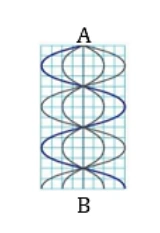{ loading=lazy }

A. $\lambda$ = 4 cm.

B. $\lambda$ = 5 cm.

C. $\lambda$ = 8 cm.

D. $\lambda$ =10 cm.

??? success "Đáp án và lời giải"
    **Đáp án:** A
    **Hướng dẫn giải:**

    Hai nút liên tiếp hoặc hai bụng liên tiếp cách nhau $\lambda/2$. Dây hai đầu cố định có $L=n\lambda/2$; một đầu cố định, một đầu tự do có $L=(2n+1)\lambda/4$.

    Đối chiếu kết quả với các lựa chọn, phương án phù hợp là **A. $\lambda$ = 4 cm.**
#### Bài 75

<!-- source-id: BT-Chuong-II-p202-q8-462 -->

Một dây AB dài 20 cm, điểm B cố định. Đầu A gắn vào một âm thoa rung coi là nút. Biết tần
số của sóng là ƒ = 20 Hz, tốc độ truyền sóng là v =100 cm/s. Số bụng và số nút quan sát được khi có
hiện tượng sóng dừng là

A. 8 bụng, 9 nút.

B. 8 bụng, 8 nút.

C. 7 bụng, 8 nút.

D. 9 bụng, 8 nút.

??? success "Đáp án và lời giải"
    **Đáp án:** A
    **Hướng dẫn giải:**

    Hai nút liên tiếp hoặc hai bụng liên tiếp cách nhau $\lambda/2$. Dây hai đầu cố định có $L=n\lambda/2$; một đầu cố định, một đầu tự do có $L=(2n+1)\lambda/4$.

    Đối chiếu kết quả với các lựa chọn, phương án phù hợp là **A. 8 bụng, 9 nút.**
### Nhận biết — Đúng/Sai

#### Bài 76

<!-- source-id: BT-Chuong-II-p161-q1-381 -->

Một sợi dây dài 2 m được căng cố định ở hai đầu. Sóng dừng xuất hiện với tần số 50 Hz và
trên dây có 4 nút sóng (không kể hai đầu dây).

a) Số bụng sóng trên dây là 5.

b) Chiều dài sợi dây bằng 2 lần bước sóng.

c) Bước sóng của sóng trên dây là 0,8 m.

d) Tốc độ truyền sóng trên dây là 40 m/s.

??? success "Đáp án và lời giải"
    **Hướng dẫn giải:**
    a) Kể cả hai đầu dây có $6$ nút, nên có $5$ bụng.

    b) $L=n\dfrac{\lambda}{2}=5\dfrac{\lambda}{2}=2{,}5\lambda$.

    c) $2=2{,}5\lambda\Rightarrow\lambda=0{,}8\,\mathrm{m}$.

    d) $v=\lambda f=0{,}8\cdot50=40\,\mathrm{m/s}$.
#### Bài 77

<!-- source-id: BT-Chuong-II-p161-q2-382 -->

Một sợi dây dài 1,8 m được cố định ở hai đầu. Sóng dừng xuất hiện trên dây với bước sóng
là 0,9 m với tốc độ 45 m/s.

a) Khoảng cách giữa hai nút sóng liên tiếp là 0,45 m.

b) Khoảng cách giữa một nút sóng và một bụng liên tiếp là 0,9 m.

c) Trên dây có 4 bụng và 5 nút sóng.

d) Tần số của sóng trên dây là 100 Hz

??? success "Đáp án và lời giải"
    **Hướng dẫn giải:**
    a) Hai nút liên tiếp cách nhau $\lambda/2=0{,}45\,\mathrm{m}$.

    b) Một nút và một bụng liên tiếp cách nhau $\lambda/4=0{,}225\,\mathrm{m}$.

    c) $L=n\lambda/2\Rightarrow1{,}8=0{,}45n\Rightarrow n=4$, nên có $4$ bụng và $5$ nút.

    d) $f=v/\lambda=45/0{,}9=50$.
#### Bài 78

<!-- source-id: BT-Chuong-II-p162-q3-383 -->

Một sợi dây dài 1,4 m được cố định ở một đầu và đầu còn lại tự do. Sóng dừng xuất hiện
trên dây với tần số 75 Hz và tốc độ truyền sóng là 60 m/s.

a) Đầu cố định là nút, đầu tự do là bụng.

b) Bước sóng truyền trên dây là 0,8 m

c) Khoảng cách giữa hai bụng sóng liên tiếp là 0,45 m.

d) Tổng số bụng và số nút trên dây là 8

??? success "Đáp án và lời giải"
    **Đáp án:** a) Đúng; b) Đúng; c) Sai; d) Đúng.

    **Hướng dẫn giải:**

    a) **Đúng.** Hình cho thấy hệ nút - bụng cố định, đặc trưng của sóng dừng.

    b) **Đúng.** Từ $v=60\ \text{m/s}$ và $f=75\ \text{Hz}$: $\lambda=v/f=0{,}80\ \text{m}$.

    c) **Sai.** Hai bụng sóng liên tiếp cách nhau $\lambda/2=0{,}40\ \text{m}$, không phải một bước sóng.

    d) **Đúng.** Với $L=1{,}40\ \text{m}=7\lambda/4$, hệ có $4$ nút và $4$ bụng, tổng cộng $8$ vị trí nút/bụng đặc trưng như hình.
#### Bài 79

<!-- source-id: BT-Chuong-II-p162-q4-384 -->

Thực hiện thí nghiệm sóng dừng trên sợi dây ta thu được hình ảnh bên dưới, biết sợi dây có
chiều dài 1,5 m và tốc độ truyền sóng trên dây là 100 m/s.

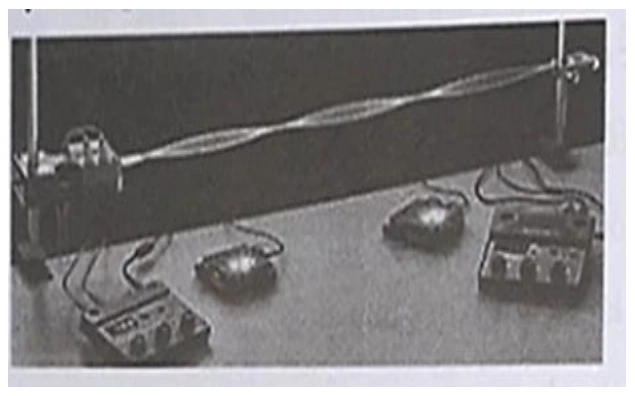{ loading=lazy }

a) Sợi dây có hai đầu cố định

b) Tính cả hai đầu dây, trên dây có 3 bụng và 4 nút

c) Chiều dài sợi dây bằng ba lần bước sóng

d) Tần số của sóng truyền trên sợi dây là 50 Hz

??? success "Đáp án và lời giải"
    **Đáp án:** a) Đúng; b) Đúng; c) Sai; d) Sai.

    **Hướng dẫn giải:**
    Hình cho thấy hai đầu là nút và có 3 bụng, 4 nút. Với dây hai đầu cố định và $n=3$:
    $L=3\lambda/2\Rightarrow\lambda=2L/3=1{,}0\,\mathrm{m}$.
    Vì vậy $L=1{,}5\lambda$, không phải $3\lambda$, và
    $f=v/\lambda=100/1=100\,\mathrm{Hz}$, không phải $50\,\mathrm{Hz}$.

#### Bài 80

<!-- source-id: BT-Chuong-II-p171-q1-415 -->

Một thí nghiệm khảo sát hiện tượng sóng dừng trên dây được thực hiện như hình.

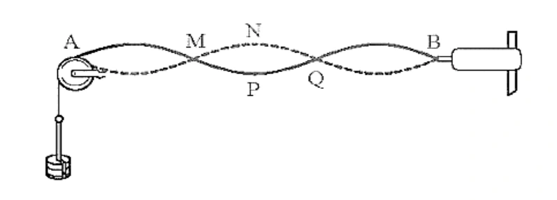{ loading=lazy }

a) Điểm trên dây có biên độ dao động lớn nhất là P

b) Bước sóng trong thí nghiệm có chiều dài bằng AQ

c) Tại điểm M và P sóng tới và sóng phản xạ ngược pha

d) Cho biết thời gian để một điểm trên dây dao động từ vị trí N đến vị trí P là 0,02 s. Tấn số sóng sử dụng trong thí nghiệm này bằng 25 Hz

??? success "Đáp án và lời giải"
    **Hướng dẫn giải:**
    a) P là bụng nên dao động với biên độ lớn nhất.
    b) Hai nút liên tiếp cách nhau $\lambda/2$; A và Q là ba nút liên tiếp nên $AQ=\lambda$.
    c) M là nút nên sóng tới và sóng phản xạ ngược pha; P là bụng nên hai sóng cùng pha.
    d) Từ N đến P, thời gian dao động là $T/2=0{,}02\,\mathrm{s}$, suy ra $T=0{,}04\,\mathrm{s}$ và $f=1/T=25\,\mathrm{Hz}$.
#### Bài 81

<!-- source-id: BT-Chuong-II-p171-q2-416 -->

Sóng dừng trên một dây đàn dài 0,6 m, hai đầu cố định. Trên dây có một bụng sóng

a) Trên dây có 2 nút.

b) Bước sóng của sóng trên sợi dây là 1 m

c) Nếu sóng truyền trên dây có tần số 50 Hz thì vận tốc của sóng là 60 m/s

d) Nếu dây dao động với 4 bụng sóng thì bước sóng trên dây là 0,3 m

??? success "Đáp án và lời giải"
    **Đáp án:** a) Đúng; b) Sai; c) Đúng; d) Đúng.

    **Hướng dẫn giải:**
    Với một bụng và hai đầu cố định, dây ở họa âm cơ bản: $L=\lambda/2$.
    Do $L=0{,}6\,\mathrm{m}$ nên $\lambda=1{,}2\,\mathrm{m}$.
    Vì vậy a) Đúng, b) Sai và nếu $f=50\,\mathrm{Hz}$ thì $v=\lambda f=60\,\mathrm{m/s}$, nên c) Đúng.
    Nếu có 4 bụng: $L=4\lambda'/2$, suy ra $\lambda'=2L/4=0{,}3\,\mathrm{m}$, nên d) Đúng.

    !!! warning "Đối chiếu nguồn"
        PDF in “dây dài 6 m”, nhưng toàn bộ mệnh đề và hướng dẫn của chính nguồn dùng $L=0{,}6\,\mathrm{m}$. Dữ kiện được hiệu chỉnh tối thiểu thành $0{,}6\,\mathrm{m}$.

#### Bài 82

<!-- source-id: BT-Chuong-II-p172-q3-417 -->

Trên sợi dây đàn hồi có chiều dài 40 cm, người ta tạo ra sóng dừng có hình dạng được mô tả
như hình.

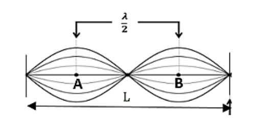{ loading=lazy }

a) Trên dây có 2 bó sóng nguyên

b) Bước sóng của sóng trên sợi dây là 40 cm

c) Hai điểm A và B cách nhau 10 cm

d) Nếu sóng truyền trên dây có tần số 50 Hz thì tốc độ của sóng là 2 m/s

??? success "Đáp án và lời giải"
    **Hướng dẫn giải:**
    a) Quan sát thấy trên dây có 2 bó sóng nguyên.
    b) $n=2$ và $L=n\lambda/2$, nên $\lambda=2L/n=40\,\mathrm{cm}$.
    c) A và B là hai bụng nên cách nhau $\lambda/2=20\,\mathrm{cm}$.
    d) $v=\lambda f=40\cdot50=2000\,\mathrm{cm/s}=20\,\mathrm{m/s}$.
#### Bài 83

<!-- source-id: BT-Chuong-II-p172-q4-418 -->

Mô hình hóa sóng dừng xuất hiện trên dây như hình bên. Biết dây có chiều dài 140 cm.

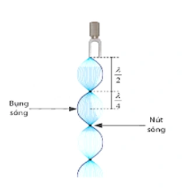{ loading=lazy }

a) Sóng truyền trên sợi dây có một đầu cố định và một đầu tự do.

b) Trên dây có 4 nút và 3 bụng.

c) Bước sóng của sóng trên sợi dây là 80 cm.

d) Nếu sóng truyền trên dây có vận tốc 3,2 m/s thì tần số của sóng là 40 Hz.

??? success "Đáp án và lời giải"
    **Đáp án:** a) Đúng; b) Sai; c) Đúng; d) Sai.

    **Hướng dẫn giải:**
    a) Một đầu là nút, đầu kia là bụng nên dây có một đầu cố định và một đầu tự do.

    b) Hình có 4 nút và 4 bụng, không phải 3 bụng.

    c) Với 3 bó nguyên cộng một phần tư bước sóng ở đầu tự do,
    $L=(2\cdot3+1)\lambda/4=7\lambda/4$. Từ $L=140\,\mathrm{cm}$ suy ra $\lambda=80\,\mathrm{cm}$.

    d) $v=3{,}2\,\mathrm{m/s}=320\,\mathrm{cm/s}$, nên
    $f=v/\lambda=320/80=4\,\mathrm{Hz}$, không phải $40\,\mathrm{Hz}$.

    !!! warning "Đối chiếu nguồn"
        PDF nguồn đổi $3{,}2\,\mathrm{m/s}$ thành $3200\,\mathrm{cm/s}$, lệch một hệ số 10, nên kết luận $40\,\mathrm{Hz}$ bị sai.

#### Bài 84

<!-- source-id: BT-Chuong-II-p215-q2-502 -->

Một sợi dây AB dài 100 cm căng ngang đầu B cố định đầu A gắn với một nhánh của âm thoa
dao động điều hòa với tần số 20 Hz. Trên dây AB có một sóng dừng ổn định, A được coi là nút sóng.
Tốc độ truyền sóng trên dây là 20 m/s. Kể cả A và B

a) Chu kì của sóng là 0,05 s .

b) Sóng có bước sóng là 1 cm.

c) Kể cả A và B có 5 nút

d) Kể cả A và B có 2 bụng

??? success "Đáp án và lời giải"
    **Hướng dẫn giải:**

    Hai nút liên tiếp hoặc hai bụng liên tiếp cách nhau $\lambda/2$. Dây hai đầu cố định có $L=n\lambda/2$; một đầu cố định, một đầu tự do có $L=(2n+1)\lambda/4$.

    a) Chu kì của sóng là 0,05 s
    b) Sóng có bước sóng là
    c) Kể cả A và B có 3 nút
    d) Kể cả A và B có 2 bụng
#### Bài 85

<!-- source-id: BT-Chuong-II-p216-q3-503 -->

Trong thí nghiệm sóng dừng trên dây mềm có hai đầu cố định, người ta thấy có 5 bụng sóng
xuất hiện khi tần số dao động của dây là 50 Hz. Biết tốc độ truyền sóng trên dây là 16 m/s. Chiều dài
sợi dây có giá trị

a) Chu kì dao động của sợi dây là 0,02 s.

b) Bước sóng là 800 cm.

c) Ta thấy trên sợi dây có 5 nút sóng.

d) Chiều dài sợi dây là 0,8 m.

??? success "Đáp án và lời giải"
    **Hướng dẫn giải:**

    Hai nút liên tiếp hoặc hai bụng liên tiếp cách nhau $\lambda/2$. Dây hai đầu cố định có $L=n\lambda/2$; một đầu cố định, một đầu tự do có $L=(2n+1)\lambda/4$.

    a) Chu kì dao động của sợi dây là 0,02 s.
    b) Bước sóng là 0,32 m.
    c) Ta thấy trên sợi dây có 6 nút sóng.
    Vì sóng dừng trên sợi dây có 2 đầu cố định nên số nút là 6 nút
    d) Chiều dài sợi dây là 0,8 m.
### Thông hiểu — Trắc nghiệm 4 lựa chọn

#### Bài 86

<!-- source-id: BT-Chuong-II-p154-q19-359 -->

Sóng dừng trên một sợi dây đàn hồi được mô tả như hình bên dưới, bước sóng của sóng trên dây là $\lambda$. Khi có sóng dừng, chiều dài AB bằng

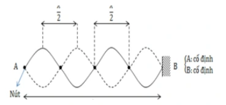{ loading=lazy }

A. $AB=2\lambda$.

B. $AB=3\lambda$.

C. $AB=2{,}25\lambda$.

D. $AB=3{,}25\lambda$.

??? success "Đáp án và lời giải"
    **Đáp án:** A
    **Hướng dẫn giải:**

    Hai nút liên tiếp hoặc hai bụng liên tiếp cách nhau $\lambda/2$. Dây hai đầu cố định có $L=n\lambda/2$; một đầu cố định, một đầu tự do có $L=(2n+1)\lambda/4$.

    Đối chiếu kết quả với các lựa chọn, phương án phù hợp là **A. $AB=2\lambda$.**
#### Bài 87

<!-- source-id: BT-Chuong-II-p154-q20-360 -->

Sóng dừng trên một sợi dây đàn hồi được mô tả như hình bên dưới, bước sóng của sóng trên dây là $\lambda$. Khi có sóng dừng, chiều dài AB bằng

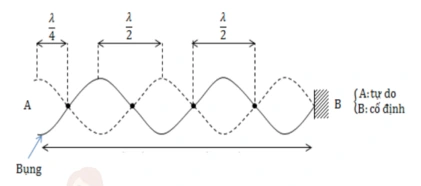{ loading=lazy }

A. $AB=\lambda$.

B. $AB=3\lambda$.

C. $AB=2{,}25\lambda$.

D. $AB=1{,}75\lambda$.

??? success "Đáp án và lời giải"
    **Đáp án:** C
    **Hướng dẫn giải:**

    Hai nút liên tiếp hoặc hai bụng liên tiếp cách nhau $\lambda/2$. Dây hai đầu cố định có $L=n\lambda/2$; một đầu cố định, một đầu tự do có $L=(2n+1)\lambda/4$.

    Đối chiếu kết quả với các lựa chọn, phương án phù hợp là **C. $AB=2{,}25\lambda$.**
#### Bài 88

<!-- source-id: BT-Chuong-II-p154-q21-361 -->

Một sợi dây đàn hồi đang có sóng dừng ổn định được mô tả như hình bên dưới. Bước sóng
của sóng trên dây bằng

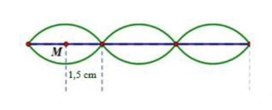{ loading=lazy }

A. 3 cm.

B. 4 cm.

C. 5 cm.

D. 6 cm.

??? success "Đáp án và lời giải"
    **Đáp án: D.**

    **Hướng dẫn giải:**

    Trên hình, điểm $M$ nằm giữa một nút và nút kế tiếp, tức ở vị trí bụng sóng. Khoảng cách từ bụng đến nút gần nhất bằng $\lambda/4$. Hình cho khoảng cách đó là $1{,}5\,\text{cm}$, do đó

    $\displaystyle \frac{\lambda}{4}=1{,}5\,\text{cm}\Rightarrow \lambda=6\,\text{cm}.$

#### Bài 89

<!-- source-id: BT-Chuong-II-p155-q22-362 -->

Một sợi dây đàn hồi có chiều dài $L$, hai đầu cố định, vận tốc truyền sóng trên dây là $v$ không đổi. Khi có sóng dừng trên dây, chiều dài $L$ được xác định theo công thức

A. $L=n\dfrac{v}{2f}$ với $n=1,2,3,\ldots$.

B. $L=n\dfrac{v}{4f}$ với $n=1,2,3,\ldots$.

C. $L=(2n+1)\dfrac{v}{4f}$ với $n=0,1,2,3,\ldots$.

D. $L=(2n+1)\dfrac{v}{2f}$.

??? success "Đáp án và lời giải"
    **Đáp án:** A
    **Hướng dẫn giải:**

    Hai nút liên tiếp hoặc hai bụng liên tiếp cách nhau $\lambda/2$. Dây hai đầu cố định có $L=n\lambda/2$; một đầu cố định, một đầu tự do có $L=(2n+1)\lambda/4$.

    Đối chiếu kết quả với các lựa chọn, phương án phù hợp là **A. $L=n\dfrac{v}{2f}$ với $n=1,2,3,\ldots$.**
#### Bài 90

<!-- source-id: BT-Chuong-II-p155-q23-363 -->

Một sợi dây đàn hồi có chiều dài $L$, một đầu cố định, một đầu tự do, vận tốc truyền sóng trên dây là $v$ không đổi. Khi có sóng dừng trên dây, chiều dài $L$ được xác định theo công thức

A. $L=n\dfrac{v}{2f}$ với $n=1,2,3,\ldots$.

B. $L=n\dfrac{v}{4f}$ với $n=0,1,2,3,\ldots$.

C. $L=(2n+1)\dfrac{v}{4f}$ với $n=0,1,2,3,\ldots$.

D. $L=(2n+1)\dfrac{v}{2f}$ với $n=1,2,3,\ldots$.

??? success "Đáp án và lời giải"
    **Đáp án:** C
    **Hướng dẫn giải:**

    Hai nút liên tiếp hoặc hai bụng liên tiếp cách nhau $\lambda/2$. Dây hai đầu cố định có $L=n\lambda/2$; một đầu cố định, một đầu tự do có $L=(2n+1)\lambda/4$.

    Đối chiếu kết quả với các lựa chọn, phương án phù hợp là **C. $L=(2n+1)\dfrac{v}{4f}$ với $n=0,1,2,3,\ldots$.**
#### Bài 91

<!-- source-id: BT-Chuong-II-p155-q24-364 -->

Xét sóng dừng trên một sợi dây có bước sóng $\lambda$, tại A một bụng sóng và tại B một nút sóng. Quan sát cho thấy giữa hai điểm A và B còn có thêm một bụng khác nữa. Khoảng cách AB bằng

A. $\lambda$.

B. $1{,}75\lambda$.

C. $1{,}25\lambda$.

D. $0{,}75\lambda$.

??? success "Đáp án và lời giải"
    **Đáp án:** D
    **Hướng dẫn giải:**

    Hai nút liên tiếp hoặc hai bụng liên tiếp cách nhau $\lambda/2$. Dây hai đầu cố định có $L=n\lambda/2$; một đầu cố định, một đầu tự do có $L=(2n+1)\lambda/4$.

    Đối chiếu kết quả với các lựa chọn, phương án phù hợp là **D. $0{,}75\lambda$.**
#### Bài 92

<!-- source-id: BT-Chuong-II-p155-q25-365 -->

Xét sóng dừng trên một sợi dây có bước sóng $\lambda$, tại A một bụng sóng và tại B một nút sóng. Quan sát cho thấy giữa hai điểm A và B còn có thêm hai nút khác nữa. Khoảng cách AB bằng

A. $\lambda$.

B. $1{,}75\lambda$.

C. $1{,}25\lambda$.

D. $0{,}75\lambda$.

??? success "Đáp án và lời giải"
    **Đáp án:** C
    **Hướng dẫn giải:**

    Hai nút liên tiếp hoặc hai bụng liên tiếp cách nhau $\lambda/2$. Dây hai đầu cố định có $L=n\lambda/2$; một đầu cố định, một đầu tự do có $L=(2n+1)\lambda/4$.

    Đối chiếu kết quả với các lựa chọn, phương án phù hợp là **C. $1{,}25\lambda$.**
#### Bài 93

<!-- source-id: BT-Chuong-II-p155-q26-366 -->

Khi sóng dừng hình thành trên một sợi dây đàn hồi, điều nào sau đây là đúng?

{ loading=lazy }

A. Các điểm nút là các điểm mà biên độ dao động lớn nhất.

B. Các điểm bụng là các điểm mà vận tốc dao động lớn nhất.

C. Tần số của sóng dừng phụ thuộc vào chiều dài của sợi dây và tốc độ truyền sóng.

D. Sóng dừng chỉ xảy ra khi hai sóng gặp nhau cùng pha và có cùng tần số.

??? success "Đáp án và lời giải"
    **Đáp án:** C
    **Hướng dẫn giải:**

    Hai nút liên tiếp hoặc hai bụng liên tiếp cách nhau $\lambda/2$. Dây hai đầu cố định có $L=n\lambda/2$; một đầu cố định, một đầu tự do có $L=(2n+1)\lambda/4$.

    Đối chiếu kết quả với các lựa chọn, phương án phù hợp là **C. Tần số của sóng dừng phụ thuộc vào chiều dài của sợi dây và tốc độ truyền sóng.**
#### Bài 94

<!-- source-id: BT-Chuong-II-p155-q27-367 -->

Mô hình hóa sóng dừng xuất hiện trên sợi dây có một đầu cố định, một đầu tự do như hình vẽ. Với vận tốc truyền sóng trên dây $v$ và chiều dài sợi dây $L$ cố định, tần số $f$ của sóng âm là $f_1=m\dfrac{v}{4L}$ với $m=1$ được gọi là âm bậc 1 (âm cơ bản). Để tiếp tục xảy ra hiện tượng sóng dừng, phải tăng tần số tối thiểu đến giá trị $f_m=mf_1$. Giá trị $m$ bằng

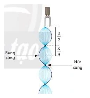{ loading=lazy }

A. 4.

B. 3.

C. 6.

D. 2.

??? success "Đáp án và lời giải"
    **Đáp án: B.**

    **Hướng dẫn giải:**

    Với một đầu cố định, một đầu tự do, điều kiện sóng dừng là

    $\displaystyle L=\frac{(2n+1)\lambda}{4},\qquad n=0,1,2,\ldots$

    nên các tần số cho phép có dạng $f_m=m\dfrac{v}{4L}$ với $m=1,3,5,\ldots$. Sau âm cơ bản $m=1$, giá trị nhỏ nhất tiếp theo là $m=3$.

#### Bài 95

<!-- source-id: BT-Chuong-II-p156-q31-371 -->

Quan sát sóng dừng trên một sợi dây đàn hồi, người ta đo được khoảng cách giữa 5 nút
sóng liên tiếp là 100 cm. Biết tần số của sóng truyền trên dây bằng 100 Hz, tốc độ truyền sóng trên
dây là:

A. 50 m/s.

B. 100 m/s.

C. 25 m/s.

D. 75 m/s.

??? success "Đáp án và lời giải"
    **Đáp án:** A
    **Hướng dẫn giải:**

    Hai nút liên tiếp hoặc hai bụng liên tiếp cách nhau $\lambda/2$. Dây hai đầu cố định có $L=n\lambda/2$; một đầu cố định, một đầu tự do có $L=(2n+1)\lambda/4$.

    Đối chiếu kết quả với các lựa chọn, phương án phù hợp là **A. 50 m/s.**