# Bài tập — Bài 4 — Sóng dừng

> Hệ bài tập được biên soạn theo các dạng xuất hiện trong bộ tài liệu Vật lí 11 của dự án. Câu hỏi được giữ ngắn, trực tiếp; độ khó tăng dần và không cố tình thêm dữ kiện gây nhiễu.

[← Trở lại bài học](../../04-standing-waves.md)

## Phần A — Trắc nghiệm 4 lựa chọn

### Câu 1 — Mức 1 — Nhận biết

Một sợi dây hai đầu cố định dài $L$. Điều kiện có sóng dừng là

A. $L=k\lambda$.  
B. $L=k\lambda/2$.  
C. $L=(2k+1)\lambda/4$.  
D. $L=\lambda/8$.

### Câu 2 — Mức 1 — Nhận biết

Khoảng cách giữa hai nút liên tiếp của sóng dừng là

A. $\lambda/4$.  
B. $\lambda/2$.  
C. $\lambda$.  
D. $2\lambda$.

### Câu 3 — Mức 1 — Nhận biết

Khoảng cách từ một nút đến bụng gần nhất bằng

A. $\lambda/8$.  
B. $\lambda/4$.  
C. $\lambda/2$.  
D. $\lambda$.

## Phần B — Đúng/Sai

### Câu 4 — Mức 2 — Thông hiểu

Sóng dừng trên dây:

a) Các nút có biên độ bằng 0.  
b) Các bụng có biên độ cực đại.  
c) Khoảng cách hai bụng liên tiếp là $\lambda/2$.  
d) Mọi điểm trên dây dao động cùng pha.

## Phần C — Trả lời ngắn

### Câu 5 — Mức 3 — Vận dụng

Dây dài $1,2$ m hai đầu cố định có 6 bụng sóng. Tính bước sóng.

### Câu 6 — Mức 3 — Vận dụng

Dây dài $0,90$ m, hai đầu cố định, vận tốc sóng $180$ m/s. Tính tần số cơ bản.

### Câu 7 — Mức 3 — Vận dụng

Một đầu dây cố định, đầu kia tự do. Chiều dài dây $0,75$ m. Ở mode cơ bản, tính bước sóng.

## Phần D — Vận dụng và vận dụng cao

### Câu 8 — Mức 4 — Vận dụng cao

Một dây dài $1$ m hai đầu cố định. Khi kích thích ở $120$ Hz thấy có 4 bụng. Giữ nguyên lực căng và khối lượng riêng dài của dây. Muốn có 5 bụng thì cần tần số bao nhiêu?

---

[Đáp án và lời giải →](solutions.md)

## Ngân hàng bài tập PDF mở rộng

> Nội dung câu hỏi và dữ kiện trong phần này được giữ nguyên; hệ thống chỉ chuẩn hóa xuống dòng và mã kí tự để hiển thị trên web. Câu trùng được loại bỏ. Với câu có công thức/kí hiệu bị sai khi trích xuất chữ từ PDF, đề bài được giữ dưới dạng ảnh để không làm thay đổi dữ kiện.

### Nhận biết — Trả lời ngắn

#### Bài PDF 1

<!-- source-id: BT-Chuong-II-p164-q1-385 -->

Câu 1. Trên dây đàn hồi AB dài 100 cm, với đầu B cố định. Tại đầu A gắn với một vật dao động
với tần số ƒ = 40 Hz. Tốc độ truyền sóng trên dây là v = 20 m/s. Trên dây có bao nhiêu nút sóng?

#### Bài PDF 2

<!-- source-id: BT-Chuong-II-p164-q2-386 -->

Câu 2. Trên một sợi dây đàn hồi có chiều dài 1,2 m người ta tạo ra sóng dừng được mô tả như hình
bên, với tốc độ truyền sóng trên dây là 10,64 m/s. Tần số của sóng truyền trên dây có giá trị bằng
bao nhiêu Hz ?

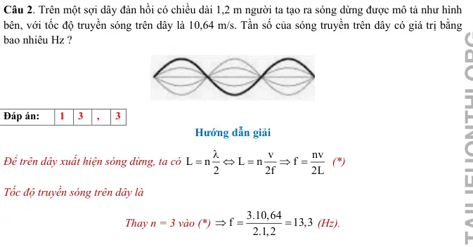{ loading=lazy }

#### Bài PDF 3

<!-- source-id: BT-Chuong-II-p164-q3-387 -->

Câu 3. Một nam châm điện có dòng điện xoay chiều tần số 50 Hz chạy qua. Đặt nam châm điện
phía trên một dây thép AB căng ngang với hai đầu cố định. Chiều dài sợi dây là 0,6 m (Hình 13.2).
Người ta thấy trên dây có sóng dừng với hai bụng sóng. Sóng truyền trên dây có tốc độ bằng bao
nhiêu m/s?

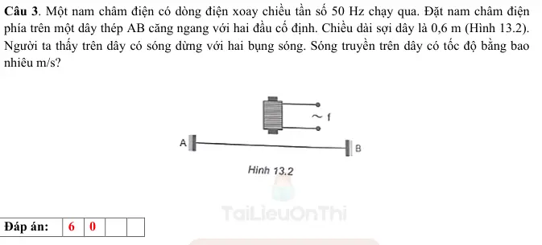{ loading=lazy }

#### Bài PDF 4

<!-- source-id: BT-Chuong-II-p165-q4-388 -->

Câu 4. Một sợi dây AB dài 1 m đầu A cố định đầu B gắn với cần rung có tần số thay đổi được. B
coi là nút sóng Ban đầu trên dây có sóng dừng. Khi tần số tăng thêm 20 Hz thì số nút sóng trên dây
tăng thêm 7 nút. Sau khoảng thời gian bằng bao nhiêu giây thì sóng phản xạ từ A truyền hết một lần
chiều dài sợi dây? (Kết quả làm tròn đến chữ số thập phân thứ 2 sau dấu phẩy)

#### Bài PDF 5

<!-- source-id: BT-Chuong-II-p165-q5-389 -->

Câu 5. Trong thí nghiệm về sóng dừng trên một sợi dây đàn hồi dài 1,2m với hai đầu cố định, người
ta quan sát thấy ngoài 2 đầu dây cố định còn có hai điểm khác trên dây không dao động. Biết
khoảng thời gian giữa hai lần liên tiếp sợi dây duỗi thẳng là 0,05s. Tốc độ truyền sóng trên dây bằng
bao nhiêu cm/s ?

#### Bài PDF 6

<!-- source-id: BT-Chuong-II-p166-q6-390 -->

Câu 6. Một sợi dây đàn hồi căng ngang, đang có sóng dừng ổn định. Trên dây, A là một điểm nút,
B là một điểm bụng gần A nhất, C là trung điểm của AB, với AB = 10 cm. Biết khoảng thời gian
ngắn nhất giữa hai lần mà li độ dao động của phần tử tại B bằng biên độ dao động của phần tử tại C
là 0,2 s. Tốc độ truyền sóng trên dây có giá trị bằng bao nhiêu m/s?

#### Bài PDF 7

<!-- source-id: BT-Chuong-II-p166-q7-391 -->

Câu 7. Sóng dừng trong cột không khí có dạng như hình . Chiều dài cột không khí bằng bao nhiêu
lần bước sóng?

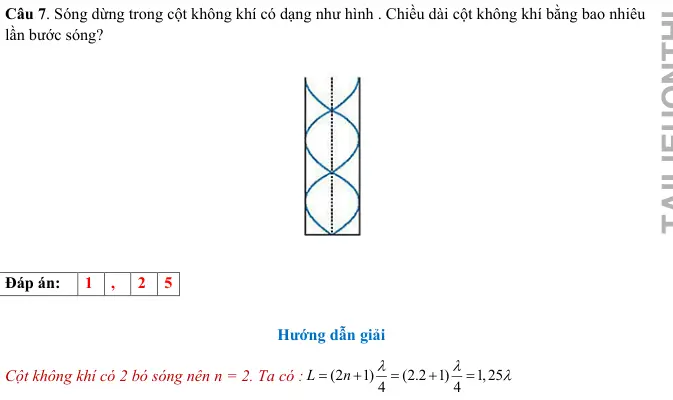{ loading=lazy }

#### Bài PDF 8

<!-- source-id: BT-Chuong-II-p166-q8-392 -->

Câu 8. Trên một sợi dây đang có sóng dừng, khoảng cách ngắn nhất giữa một nút và một bụng là
2cm. Sóng truyền trên dây có bước sóng là bao nhiêu cm?

#### Bài PDF 9

<!-- source-id: BT-Chuong-II-p167-q9-393 -->

Câu 9. Một sợi dây đàn hồi dài 30 cm có hai đầu cố định. Trên dây đang có sóng dừng. Biết sóng
truyền trên dây với bước sóng 20 cm và biên độ dao động của điểm bụng là 2 cm. Số điểm trên dây
mà phần tử tại đó dao động với biên độ 6 mm là bao nhiêu?

#### Bài PDF 10

<!-- source-id: BT-Chuong-II-p167-q10-394 -->

Câu 10. Sóng dừng trên sợi dây đàn hồi 2 đầu cố định AB dài 1 m. Biết tần số sóng trong khoảng
300 Hz đến 450 Hz. Tốc độ truyền dao động là 320 m/s. Sóng truyền trên dây có tần số bằng bao
nhiêu Hz?

#### Bài PDF 11

<!-- source-id: BT-Chuong-II-p167-q11-395 -->

Câu 11. Một sợi dây sắt, mảnh, dài 120 cm căng ngang, có hai đầu cố định. Ở phía trên, gần sợi dây
có một nam châm điện được nuôi bằng nguồn điện xoay chiều có tần số 50 Hz. Trên dây xuất hiện
sóng dừng với 2 bụng sóng. Tốc độ truyền sóng trên dây là bao nhiêu m/s ?

#### Bài PDF 12

<!-- source-id: BT-Chuong-II-p167-q12-396 -->

Câu 12. Một sợi dây đàn hồi căng ngang với đầu A cố định đang có sóng dừng. M và N là hai phân
tử dao động điều hòa có vị trí cân bằng cách đầu A những đoạn lần lượt là 16 cm và 27 cm. Biết
sóng truyền trên dây có bước sóng 24 cm. Tính tỉ số giữa biên độ dao động của M và biên độ dao
động của N. (Kết quả làm tròn đến chữ số thập phân thứ nhất sau dấu phẩy)

#### Bài PDF 13

<!-- source-id: BT-Chuong-II-p173-q1-419 -->

Câu 1. Thực hiện thí nghiệm sóng dừng trên sợi dây ta thu được ảnh như hình. Trên sợi dây có mấy
bụng sóng?

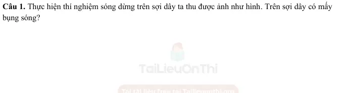{ loading=lazy }

#### Bài PDF 14

<!-- source-id: BT-Chuong-II-p174-q2-420 -->

Câu 2. Sóng truyền trên sợi dây OB được mô tả như hình vẽ. Bề rộng của một bụng sóng có giá trị
bằng bao nhiêu cm?

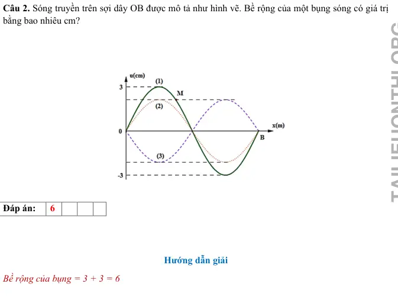{ loading=lazy }

#### Bài PDF 15

<!-- source-id: BT-Chuong-II-p174-q3-421 -->

Câu 3. Một sợi dây AB dài 100 cm căng ngang, đầu B cố định, đầu A gắn với một nhánh của âm
thoa dao động điều hòa với tần số 40 Hz. Trên dây AB có một sóng dừng ổn định, A được coi là nút
sóng. Tốc độ truyền sóng trên dây là 20 m/s. Kể cả A và B, Tổng số nút và số bụng của sợi dây là
bao nhiêu?

#### Bài PDF 16

<!-- source-id: BT-Chuong-II-p175-q4-422 -->

Câu 4. Một sợi dây sắt dài 1,21 m căng ngang, có một đầu cố định một đầu tự do. Ở phía trên, gần
sợi dây có một nam châm điện được nuôi bằng nguồn điện xoay chiều. Cho dòng điện qua nam
châm thì trên dây xuất hiện sóng dừng với 6 bụng sóng. Nếu tốc độ truyền sóng trên dây là 66 m/s
thì tần số của dòng điện xoay chiều là bao nhiêu Hz ?

#### Bài PDF 17

<!-- source-id: BT-Chuong-II-p175-q5-423 -->

Câu 5. Quan sát sóng dừng trên sợi dây AB, đầu A dao động điều hòa theo phương vuông góc với
sợi dây (coi A là nút). Với đầu B tự do và tần số dao động của đầu A là 22 Hz thì trên dây có 6 nút.
Nếu đầu B cố định và coi tốc độ truyền sóng trên dây như cũ, để vẫn có 6 nút thì tần số dao động
của đầu A phải bằng bao nhiêu Hz?

#### Bài PDF 18

<!-- source-id: BT-Chuong-II-p175-q6-424 -->

Câu 6. Một sợi dây đang có sóng dừng ổn định. Sóng truyền trên dây có tần số 10 Hz và bước sóng
6 cm. Trên dây, hai phần tử M và N có vị trí cân bằng cách nhau 8 cm, M thuộc một bụng sóng dao
động điều hòa với biên độ 6 mm. Lấy
2
10.
π=
 Tại thời điểm t, phần tử M đang chuyển động với tốc
độ 6π (cm/s) thì phần tử N chuyển động với gia tốc có độ lớn bằng bao nhiêu m/s2 ? (Kết quả làm
tròn đến chữ số thập phân thứ nhất sau dấu phẩy)

### Nhận biết — Trắc nghiệm 4 lựa chọn

#### Bài PDF 19

<!-- source-id: BT-Chuong-II-p152-q1-341 -->

Câu 1. Tại điểm phản xạ thì sóng phản xạ
A. luôn ngược pha với sóng tới.
B. ngược pha với sóng tới nếu vật cản là cố định.
C. ngược pha với sóng tới nếu vật cản là tự do.
D. cùng pha với sóng tới nếu vật cản là cố định.

#### Bài PDF 20

<!-- source-id: BT-Chuong-II-p152-q2-342 -->

Câu 2. Trong hiện tượng sóng dừng trên một sợi dây có hai đầu cố định, khoảng cách giữa hai nút
hoặc hai bụng liên tiếp bằng
A. một bước sóng.

B. hai bước sóng.
C. một phần tư bước sóng.

D. một nửa bước sóng.

#### Bài PDF 21

<!-- source-id: BT-Chuong-II-p152-q3-343 -->

Câu 3. Trong hiện tượng sóng dừng trên một sợi dây mà hai đầu được giữ cố định thì độ dài của
bước sóng phải bằng
A. khoảng cách giữa hai nút hoặc hai bụng.

B. độ dài của dây.
C. hai lần độ dài của dây.

D. hai lần khoảng cách giữa hai nút hoặc hai bụng kề nhau.

#### Bài PDF 22

<!-- source-id: BT-Chuong-II-p152-q4-344 -->

Câu 4. Để tạo một sóng dừng giữa hai đầu dây cố định thì độ dài của dây bằng
A. một số nguyên lần bước sóng.

B. một số lẻ lần nửa bước sóng.
C. một số nguyên lần nửa bước sóng.

D. một số lẻ lần bước sóng.

#### Bài PDF 23

<!-- source-id: BT-Chuong-II-p152-q5-345 -->

Câu 5. Một hình thí nghiệm khảo sát hiện tượng sóng dừng trên dây được thực hiện như Hình 9.2.

Bước sóng trong thí nghiệm có chiều dài bằng
A. AM.

B. AN.

C. AP.

D. AQ.

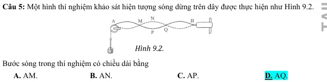{ loading=lazy }

#### Bài PDF 24

<!-- source-id: BT-Chuong-II-p152-q6-346 -->

Câu 6. Sóng dừng là
A. hai sóng cùng biên độ, cùng bước sóng lan truyền theo hai hướng ngược nhau gặp nhau và giao
thoa với nhau tạo nên một sóng tổng hợp.
B. hai sóng khác biên độ, cùng bước sóng lan truyền theo hai hướng ngược nhau gặp nhau và giao
thoa với nhau tạo nên một sóng tổng hợp.
C. hai sóng cùng biên độ, khác bước sóng lan truyền theo hai hướng ngược nhau gặp nhau và giao
thoa với nhau tạo nên một sóng tổng hợp.
D. hai sóng khác biên độ, khác bước sóng lan truyền theo hai hướng ngược nhau gặp nhau và giao
Hình 9.2.

thoa với nhau tạo nên một sóng tổng hợp.

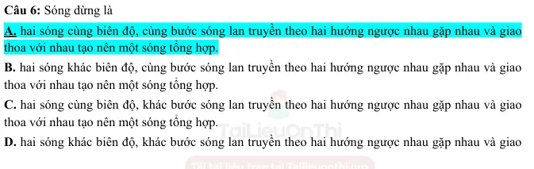{ loading=lazy }

#### Bài PDF 25

<!-- source-id: BT-Chuong-II-p153-q7-347 -->

Câu 7. Khi nói về sóng dừng. Phát biểu nào sau đây là đúng?
A. Những điểm luôn đứng yên gọi là nút sóng.
B. Những điểm luôn đứng yên gọi là bụng sóng.
C. Những điểm luôn dao động với biên độ cực đại gọi là nút sóng.

D. Những điểm luôn dao động với biên độ cực tiểu gọi là bụng sóng.

#### Bài PDF 26

<!-- source-id: BT-Chuong-II-p153-q8-348 -->

Câu 8. Trong sóng dừng nút sóng và bụng sóng liên tiếp cách nhau
A. một nửa bước sóng.
B. một bước sóng.
C. một phần tư bước sóng.
D. hai lần tư bước sóng.

#### Bài PDF 27

<!-- source-id: BT-Chuong-II-p153-q9-349 -->

Câu 9. Sóng truyền trên một sợi dây hai đầu cố định có bước sóng λ. Muốn có sóng dừng trên dây
thì chiều dài L của dây phải thoả mãn điều kiện là
A. L  .
=λ

B. L
 .
2
λ
=

C. L  2 .
= λ

D.  L
 .
4
λ
=

#### Bài PDF 28

<!-- source-id: BT-Chuong-II-p153-q10-350 -->

Câu 10. Đàn tính như hình là loại nhạc cụ dây khi gảy đàn trên dây sẽ xuất hiện sóng dừng. Âm do
dây đàn phát ra có bước sóng lớn nhất bằng

A. L
2 .

B. L
4 .

C. L.

D. 2L.

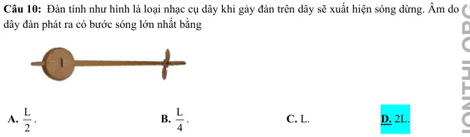{ loading=lazy }

#### Bài PDF 29

<!-- source-id: BT-Chuong-II-p153-q11-351 -->

Câu 11. Một sợi dây đàn hồi chiều dài L có hai đầu cố định, bước sóng của sóng trên dây là λ. Khi
có sóng dừng trên dây, chiều dài L được xác định theo công thức
A. L
n 2
λ
=
 với (n = 1, 2, 3,...).

B. L
n 4
λ
=
 với (n = 1, 2, 3,...).

C.
(
)
L
2n
1 4
λ
=
+
 với (n = 0, 1, 2, 3,...).
D.
(
)
L
2n
1 2
λ
=
+
 với (n = 1, 2, 3,...).

#### Bài PDF 30

<!-- source-id: BT-Chuong-II-p153-q12-352 -->

Câu 12. Một sợi dây đàn hồi chiều dài L có một đầu cố định, một đầu tự do, bước sóng của sóng
trên dây là λ. Khi có sóng dừng trên dây, chiều dài L được xác định theo công thức
A. L
n 2
λ
=
 với (n = 1, 2, 3,...).

B. L
n 4
λ
=
 với (n =0, 1, 2, 3,...).
C.
(
)
L
2n
1 4
λ
=
+
 với (n = 0, 1, 2, 3,...).                      D.
(
)
L
2n
1 2
λ
=
+
 với (n = 1, 2, 3,...).

#### Bài PDF 31

<!-- source-id: BT-Chuong-II-p153-q13-353 -->

Câu 13. Sóng dừng trên một sợi dây đàn hồi chiều dài L = PQ được mô tả như Hình bên. Số nút
sóng (kể cả hai đầu dây) và số bụng sóng trên dây là
A. hai nút sóng và ba bụng sóng.
B. ba nút sóng và bốn bụng sóng.

C. bốn nút sóng và ba bụng sóng.

D. bốn nút sóng và sáu bụng sóng.

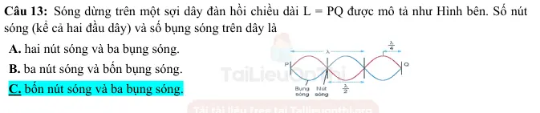{ loading=lazy }

#### Bài PDF 32

<!-- source-id: BT-Chuong-II-p154-q14-354 -->

Câu 14. Điều nào sau đây là sai khi nói về sóng dừng?
A. Sóng dừng là sóng có các bụng và các nút cố định trong không gian.
B. Khoảng cách giữa hai nút hoặc hai bụng liên tiếp bằng bước sóng λ.
C. Sóng dừng là tổng hợp của nhiều sóng tới và sóng phản xạ.
D. Khoảng cách giữa hai nút hoặc hai bụng liên tiếp bằng λ/2.

#### Bài PDF 33

<!-- source-id: BT-Chuong-II-p154-q15-355 -->

Câu 15. Khi nói về ứng dụng của sóng dừng. Phát biểu nào sau đây là đúng?
A. Xác định vận tốc truyền sóng.

C. Xác định chu kì sóng.
B. Xác định tần số sóng.

D. Xác định năng lượng sóng.

#### Bài PDF 34

<!-- source-id: BT-Chuong-II-p154-q16-356 -->

Câu 16. Sóng truyền trên một sợi dây có một đầu cố định, một đầu tự do. Muốn có sóng dừng trên
dây thì chiều dài của sợi dây phải bằng một số
A. chẵn lần một phần tư bước sóng.

B. lẻ lần nửa bước sóng.
C. nguyên lần bước sóng.

D. lẻ lần một phần tư bước sóng.

#### Bài PDF 35

<!-- source-id: BT-Chuong-II-p154-q17-357 -->

Câu 17. Điều kiện xảy ra sóng dừng trên sợi dây đàn hồi hai đầu cố định là
A. chiều dài bằng một phần tư bước sóng.
B. chiều dài dây bằng một số nguyên lần nửa bước sóng.
C. bước sóng gấp đôi chiều dài dây.
D. bước sóng bằng số lẻ lần chiều dài dây.

#### Bài PDF 36

<!-- source-id: BT-Chuong-II-p154-q18-358 -->

Câu 18. Sóng dừng là tổng hợp của sóng
A. tới và sóng phản xạ.

B. ngang và sóng phản xạ.
C. dọc và sóng ngang.

D. tới và sóng ngang.

#### Bài PDF 37

<!-- source-id: BT-Chuong-II-p156-q29-369 -->

Câu 29. Trên một sợi dây đàn hồi đang có sóng dừng. Biết khoảng cách ngắn nhất giữa một nút
sóng và vị trí cân bằng của một bụng sóng là 0,25m. Sóng truyền trên dây với bước sóng là

A. 0,5 m.

B. 1,5 m.

C. 1,0 m.

D. 2,0 m.

#### Bài PDF 38

<!-- source-id: BT-Chuong-II-p156-q30-370 -->

Câu 30. Trên một sợi dây đang có sóng dừng. Biết sóng truyền trên dây có bước sóng 30 cm.
Khoảng cách ngắn nhất từ một nút đến một bụng là
A. 15 cm.
B. 30 cm.
C. 7,5 cm.
D. 60 cm.

#### Bài PDF 39

<!-- source-id: BT-Chuong-II-p157-q32-372 -->

Câu 32. Một sợi dây đàn hồi có độ dài AB = 80cm, đầu B giữ cố định, đầu A gắn với cần rung dao
động điều hòa với tần số 50Hz theo phương vuông góc với AB. Trên dây có một sóng dừng với 4
bụng sóng, coi A và B là nút sóng. Tốc độ truyền sóng trên dây là
A. 10 m/s.
B. 5 m/s.

C. 20 m/s.

D. 40 m/s.

#### Bài PDF 40

<!-- source-id: BT-Chuong-II-p157-q33-373 -->

Câu 33. Trên một sợi dây cố định dài 0,9 m có sóng dừng. Kể cả hai nút ở hai đầu dây thì trên dây
có 10 nút sóng. Biết tốc độ truyền sóng truyền trên dây là 40m/s. Sóng truyền trên dây có tần s
A. 100 Hz.

B. 200 Hz.

C. 300 Hz.

D. 400 Hz.

#### Bài PDF 41

<!-- source-id: BT-Chuong-II-p157-q34-374 -->

Câu 34. Một sợi dây sắt dài 120 cm căng ngang, có hai đầu cố định. Ở phía trên, gần sợi dây có
một nam châm điện được nuôi bằng nguồn điện xoay chiều có tần số 50 Hz. Trên dây xuất hiện
sóng dừng với 2 bụng sóng. Tốc độ truyền sóng trên dây là
A. 120 m/s.
B. 60 m/s.

C. 180 m/s.
D. 240 m/s.

#### Bài PDF 42

<!-- source-id: BT-Chuong-II-p157-q35-375 -->

Câu 35. Một sợi dây sắt dài 1,2 m căng ngang, có hai đầu cố định. Ở phía trên, gần sợi dây có một
nam châm điện được nuôi bằng nguồn điện xoay chiều. Cho dòng điện qua nam châm thì trên dây
xuất hiện sóng dừng với 6 bụng sóng. Nếu tốc độ truyền sóng trên dây là 20m/s thì tần số của dòng
điện xoay chiều là
A. 50 Hz.

B. 100 Hz.

C. 60 Hz.

D. 25 Hz.

#### Bài PDF 43

<!-- source-id: BT-Chuong-II-p157-q36-376 -->

Câu 36. Một sợi dây đàn hồi 2 đầu cố định, hai tần số liên tiếp có sóng dừng trên dây là 50 Hz và
70Hz. Hãy xác định tần số nhỏ nhất có sóng dừng trên dây.

A. 20.

B. 10.

C. 30.

D. 40.

#### Bài PDF 44

<!-- source-id: BT-Chuong-II-p157-q37-377 -->

Câu 37. Một sợi dây đàn hồi căng ngang, hai đầu cố định. Trên dây có sóng dừng, tốc độ truyền
sóng không đổi. Khi tần số sóng trên dây là 42 Hz thì trên dây có 4 điểm bụng. Nếu trên dây có 6
điểm bụng thì tần số sóng trên dây là
A. 252 Hz.

B. 126 Hz.

C. 28 Hz.

D. 63 Hz.

#### Bài PDF 45

<!-- source-id: BT-Chuong-II-p158-q38-378 -->

Câu 38. Trên một sợi dây đàn hồi đang có sóng dừng với biên độ dao động của các điểm bụng
là a. M là một phần tử dây dao động với biên độ 0,5a. Biết vị trí cân bằng của M cách điểm nút
gần nó nhất một khoảng 2 cm. Sóng truyền trên dây có bước sóng là:
A. 24 cm.

B. 12 cm.

C. 16 cm.

D. 3 cm.

#### Bài PDF 46

<!-- source-id: BT-Chuong-II-p158-q39-379 -->

Câu 39. Một sợi dây căng ngang với hai đầu cố định, đang có sóng đừng, Biết khoảng cách xa
nhất giữa hai phần tử dây dao động với cùng biên độ 5 mm là 80 cm, còn khoảng cách xa nhất
giữa hai phần tử dây dao động cùng pha với cùng biên độ 5 mm là 65 cm. Tỉ số giữa tốc độ cực
đại của một phần tử dây tại bụng sóng và tốc độ truyền sóng trên dây là
A. 0,12.

B. 0,41.

C. 0,21.

D. 0,14.

#### Bài PDF 47

<!-- source-id: BT-Chuong-II-p159-q40-380 -->

Câu 40. Trên một sợi dây OB căng ngang, hai đầu cố định đang có sóng dừng với tần số f xác định.
Gọi M, N và P là ba điểm trên dây có vị trí cân bằng cách B lần lượt 4 cm, 6 cm và 38 cm. Hình vẽ
mô tả dạng sợi dây ở thời điểm t1 (đường 1) và thời điểm t2 = t1 +
f
12
11 (đường 2). Tại thời điểm t1, li
độ của phần tử dây ở N bằng biên độ của phần tử dây ở M và tốc độ của phần tử dây ở M là 60 cm/s
. Tại thời điểm t2, vận tốc của phần tử dây ở P là

A. 20
3 cm/s.

B. 60 cm/s.
C. - 20
3 cm/s.

D.  – 60 cm/s.

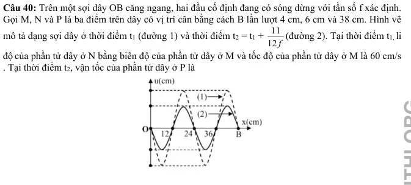{ loading=lazy }

#### Bài PDF 48

<!-- source-id: BT-Chuong-II-p168-q1-397 -->

Câu 1. Sóng phản xạ
 A.  luôn luôn cùng pha với sóng tới ở điểm phản xạ.
 B.  ngược pha với sóng tới ở điểm phản xạ khi phản xạ trên một vật cản cố định.
 C.  ngược pha với sóng tới ở điểm phản xạ khi phản xạ trên một vật cản tự do.
 D.  luôn luôn ngược pha với sóng tới ở điểm phản xạ.

#### Bài PDF 49

<!-- source-id: BT-Chuong-II-p168-q2-398 -->

Câu 2. Khi nói về sự phản xạ của sóng cơ trên vật cản tự do, phát biểu nào sau đây đúng?
 A.  Tần số của sóng phản xạ luôn lớn hơn tần số của sóng tới.
 B.  Sóng phản xạ luôn cùng pha với sóng tới ở điểm phản xạ.
 C.  Tần số của sóng phản xạ luôn nhỏ hơn tần số của sóng tới.
 D.  Sóng phản xạ luôn ngược pha với sóng tới ở điểm phản xạ.

#### Bài PDF 50

<!-- source-id: BT-Chuong-II-p168-q3-399 -->

Câu 3. Tại điểm phản xạ của vật cản tự do thì sóng tới và sóng phản xạ
 A. lệch pha π .
2
B. ngược pha.
C. lệch pha  kπ.
D. cùng pha.

#### Bài PDF 51

<!-- source-id: BT-Chuong-II-p168-q4-400 -->

Câu 4. Sóng dừng là hiện tượng
 A.  sóng trên một sợi dây mà hai đầu dây được giữ cố định.
 B.  sóng được tạo thành do sự giao thoa giữa sóng tới và sóng phản xạ.
 C.  sóng không lan truyền nữa do bị một vật cản chặn lại.
 D.  sóng được tạo thành giữa hai điểm cố định trong một môi trường.

#### Bài PDF 52

<!-- source-id: BT-Chuong-II-p168-q5-401 -->

Câu 5. Ta quan sát thấy hiện tượng gì khi trên dây có sóng dừng?
 A.  Trên dây có những bụng sóng xen kẽ với nút sóng.
 B.  Tất cả các điểm trên dây đều chuyển động với cùng tốc độ.
 C.  Tất cả các điểm trên dây đều dao động với biên độ cực đại.
 D.  Tất cả phần tử dây đều đứng yên.

#### Bài PDF 53

<!-- source-id: BT-Chuong-II-p168-q6-402 -->

Câu 6. Sóng truyền trên một sợi dây hai đầu cố định có bước sóng λ . Điều kiện để có sóng dừng
trên dây thì chiều dài L của dây là
 A.
(
)
L
2n
1 4
λ
=
+
.
B.  L
n 2
λ
=
.
C.
λ
L
n 4
=
.
D.
λ
=
L
n .

#### Bài PDF 54

<!-- source-id: BT-Chuong-II-p169-q8-404 -->

Câu 8. Quan sát trên một sợi dây thấy có sóng dừng với biên độ của bụng sóng là a. Tại điểm trên
sợi dây cách bụng sóng một phần tư bước sóng có biên độ dao động bằng

A. a/2.

B. 0.
  C. a/4.

D. A.

#### Bài PDF 55

<!-- source-id: BT-Chuong-II-p169-q9-405 -->

Câu 9. Một sợi dây chiều dài L căng ngang, hai đầu cố định. Trên dây đang có sóng dừng với n
bụng sóng, tốc độ truyền sóng trên dây là v. Khoảng thời gian giữa hai lần liên tiếp sợi dây duỗi
thẳng là

A. v .
nL

B. nv
L .

C. L
2nv .

D. L
nv .

#### Bài PDF 56

<!-- source-id: BT-Chuong-II-p169-q10-406 -->

Câu 10. Trên một sợi dây đàn hồi dài 1m, hai đầu cố định, có sóng dừng với 2 bụng sóng. Bước
sóng của sóng truyền trên đây là
A. 1 m.

B. 0,5 m.

C. 2 m.

D. 0,25 m.

#### Bài PDF 57

<!-- source-id: BT-Chuong-II-p169-q11-407 -->

Câu 11. Trong hệ sóng dừng trên một sợi dây mà hai đầu được giữ cố định, bước sóng bằng
A. độ dài của dây.

B. một nửa độ dài của dây.
C. khoảng cách giữa hai nút sóng liên tiếp.

D. hai lần khoảng cách giữa hai nút sóng liên tiếp.

#### Bài PDF 58

<!-- source-id: BT-Chuong-II-p169-q12-408 -->

Câu 12. Một sợi dây đàn hồi có một đầu cố định, một đầu tự do. Sóng dừng xảy ra trên dây đàn hồi
khi
 A.  chiều dài của dây bằng số nguyên lần nửa bước sóng.
 B.  chiều dài của dây bằng số nguyên lần bước sóng.
 C.  chiều dài của dây bằng một phần tư bước sóng.
 D.  chiều dài của dây bằng một số nguyên lẻ lần một phần tư bước sóng.

#### Bài PDF 59

<!-- source-id: BT-Chuong-II-p169-q13-409 -->

Câu 13. Khi có sóng dừng trên một sợi dây đàn hồi, khoảng cách từ vị trí cân bằng một bụng sóng
đến nút gần nó nhất bằng
 A.  một nửa bước sóng.
B.  một số nguyên lần bước sóng.
 C.  một bước sóng.
D.  một phần tư bước sóng.

#### Bài PDF 60

<!-- source-id: BT-Chuong-II-p170-q14-410 -->

Câu 14. Trên một sợi dây đàn hồi dài 1,2 m, hai đầu cố định, đang có sóng dừng. Biết sóng truyền
trên dây có tần số 100 Hz và tốc độ 80 m/s. Số bụng sóng trên dây là
A. 3.

B. 5.

C. 4.

D. 2.

#### Bài PDF 61

<!-- source-id: BT-Chuong-II-p170-q15-411 -->

Câu 15. Tạo sóng dừng trên sợi dây hai đầu cố định có chiều dài 1m, vận tốc truyền sóng trên dây
là 30m/s. Hỏi nếu kích thích với các tần số sau thì tần số nào có khả năng gây ra hiện tuợng sóng
dừng trên dây.
A. 20 Hz.

B. 40 Hz.

C. 35Hz.
         D. 45Hz.

#### Bài PDF 62

<!-- source-id: BT-Chuong-II-p170-q16-412 -->

Câu 16. Một sợi dây đàn hồi 1 đầu cố định 1 đầu tự do, hai tần số liên tiếp có sóng dừng trên dây là
45 Hz và 75 Hz. Hãy xác định tần số nhỏ nhất có sóng dừng trên dây.

A. 20.

B. 15.

C. 30.

D. 40.

#### Bài PDF 63

<!-- source-id: BT-Chuong-II-p170-q17-413 -->

Câu 17. Trên một sợi dây căng ngang với hai đầu cố định đang có sóng dừng. Không xét các điểm
bụng hoặc nút, quan sát thấy những điểm có cùng biên độ và ở gần nhau nhất thì đều cách đều nhau
15cm. Bước sóng trên dây có giá trị bằng
A. 30 cm.

B. 60 cm.

C. 90 cm.

D. 45 cm.

#### Bài PDF 64

<!-- source-id: BT-Chuong-II-p170-q18-414 -->

Câu 18. Một sợi dây đàn hồi dài 90 cm có một đầu cố định và một đầu tự do đang có sóng dừng.
Kể cả đầu dây cố định, trên dây có 8 nút. Biết rằng khoảng thời gian giữa 6 lần liên tiếp sợi dây
duỗi thẳng là 0,25 s. Tốc độ truyền sóng trên dây là
A. 1,2 m/s.
B. 2,9 m/s.
C. 2,4 m/s.
D. 2,6 m/s.

#### Bài PDF 65

<!-- source-id: BT-Chuong-II-p200-q15-454 -->

Câu 15. Một sợi dây đàn hồi dài 21 cm, một đầu cố định, một đầu tự do. Biết tốc độ truyền sóng trên
dây là 2,8 m/s. Nếu dây dao động với tám bụng sóng thì tần số rung của sợi dây là
A. ƒ = 40 Hz.

B. ƒ = 50 Hz.

C. ƒ = 60 Hz.

D. ƒ = 20 Hz.

#### Bài PDF 66

<!-- source-id: BT-Chuong-II-p202-q7-461 -->

Câu 7. Trên sợi dây AB người ta tạo ra sóng dừng có hình dạng được mô tả như Hình bên. Biết
khoảng cách từ B đến nút dao động thứ 3 (kể từ B) là 5 cm. Bước sóng có giá trị là

A. λ = 4 cm.

B. λ = 5 cm.
C. λ = 8 cm.
D. λ =10 cm.

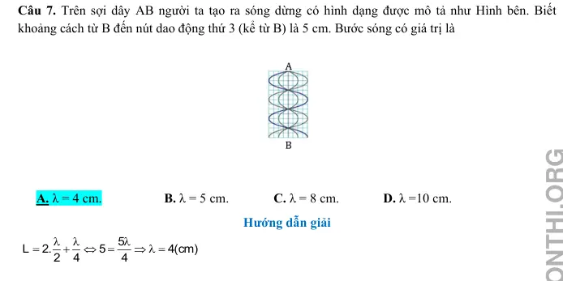{ loading=lazy }

#### Bài PDF 67

<!-- source-id: BT-Chuong-II-p202-q8-462 -->

Câu 8. Một dây AB dài 20 cm, điểm B cố định. Đầu A gắn vào một âm thoa rung coi là nút. Biết tần
số của sóng là ƒ = 20 Hz, tốc độ truyền sóng là v =100 cm/s. Số bụng và số nút quan sát được khi có
hiện tượng sóng dừng là
A. 8 bụng, 9 nút.

B. 8 bụng, 8 nút.

C. 7 bụng, 8 nút.

D. 9 bụng, 8 nút.

### Nhận biết — Đúng/Sai

#### Bài PDF 68

<!-- source-id: BT-Chuong-II-p161-q1-381 -->

Câu 1. Một sợi dây dài 2 m được căng cố định ở hai đầu. Sóng dừng xuất hiện với tần số 50 Hz và
trên dây có 4 nút sóng (không kể hai đầu dây).

Phát biểu
Đúng
Sai
a
Số bụng sóng trên dây là 5.
Đ

b
Chiều dài sợi dây bằng 2 lần bước sóng.

S
c
Bước sóng của sóng trên dây là 0,8 m.
Đ

d
Tốc độ truyền sóng trên dây là 40 m/s.
Đ

#### Bài PDF 69

<!-- source-id: BT-Chuong-II-p161-q2-382 -->

Câu 2. Một sợi dây dài 1,8 m được cố định ở hai đầu. Sóng dừng xuất hiện trên dây với bước sóng
là 0,9 m với tốc độ 45 m/s.

Phát biểu
Đúng
Sai
a
Khoảng cách giữa hai nút sóng liên tiếp là 0,45 m.
Đ

b
Khoảng cách giữa một nút sóng và một bụng liên tiếp là 0,9 m.

S
c
Trên dây có 4 bụng và 5 nút sóng.
Đ

d
Tần số của sóng trên dây là 100 Hz

S

#### Bài PDF 70

<!-- source-id: BT-Chuong-II-p162-q3-383 -->

Câu 3. Một sợi dây dài 1,4 m được cố định ở một đầu và đầu còn lại tự do. Sóng dừng xuất hiện
trên dây với tần số 75 Hz và tốc độ truyền sóng là 60 m/s.

Phát biểu
Đúng
Sai
a
Đầu cố định là nút, đầu tự do là bụng.
Đ

b
Bước sóng truyền trên dây là 0,8 m
Đ

c
Khoảng cách giữa hai bụng sóng liên tiếp là 0,45 m.

S
d
Tổng số bụng và số nút trên dây là 8
Đ

#### Bài PDF 71

<!-- source-id: BT-Chuong-II-p162-q4-384 -->

Câu 4. Thực hiện thí nghiệm sóng dừng trên sợi dây ta thu được hình ảnh bên dưới, biết sợi dây có
chiều dài 1,5 m và tốc độ truyền sóng trên dây là 100 m/s.

Phát biểu
Đúng
Sai
a
Sợi dây có hai đầu cố định
Đ

b
Tính cả hai đầu dây, trên dây có 3 bụng và 4 nút
Đ

c
Chiều dài sợi dây bằng ba lần bước sóng

S

d
Tần số của sóng truyền trên sợi dây là 50 Hz

S

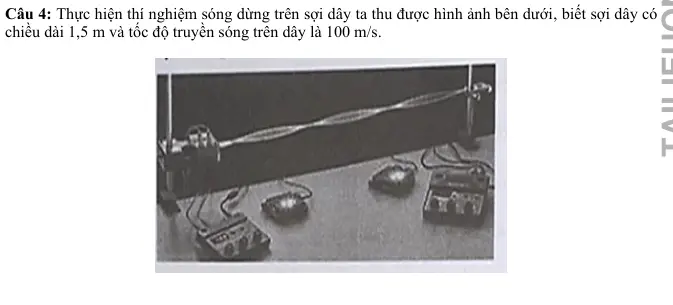{ loading=lazy }

#### Bài PDF 72

<!-- source-id: BT-Chuong-II-p171-q1-415 -->

Câu 1. Một thí nghiệm khảo sát hiện tượng sóng dừng trên dây được thực hiện như hình.

Phát biểu
Đúng
Sai
a
Điểm trên dây có biên độ dao động lớn nhất là P
Đ

b
Bước sóng trong thí nghiệm có chiều dài bằng AQ
Đ

c
Tại điểm M và P sóng tới và sóng phản xạ ngược pha

S
d
Cho biết thời gian để một điểm trên dây dao động từ vị trí N
đến vị trí P là 0,02 s. Tấn số sóng sử dụng trong thí nghiệm
này bằng 25 Hz
Đ

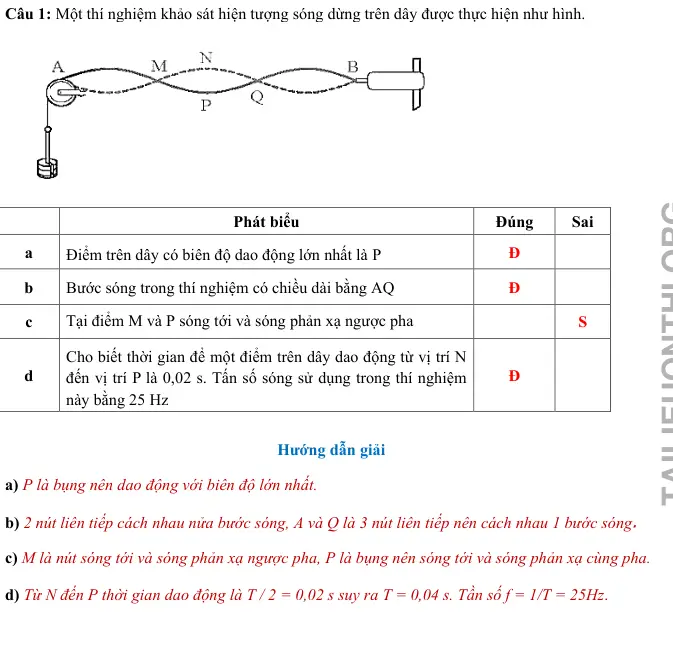{ loading=lazy }

#### Bài PDF 73

<!-- source-id: BT-Chuong-II-p171-q2-416 -->

Câu 2. Sóng dừng trên một dây đàn dài 6 m, hai đầu cố định. Trên dây có một bụng sóng

Phát biểu
Đúng
Sai
a
Trên dây có 2 nút.
Đ

b
Bước sóng của sóng trên sợi dây là 1 m

S

c
Nếu sóng truyền trên dây có tần số 50 Hz thì vận tốc của
sóng là 60 m/s
Đ

d
Nếu dây dao động với 4 bụng sóng thì bước sóng trên dây là
0,3 m
Đ

#### Bài PDF 74

<!-- source-id: BT-Chuong-II-p172-q3-417 -->

Câu 3. Trên sợi dây đàn hồi có chiều dài 40 cm, người ta tạo ra sóng dừng có hình dạng được mô tả
như hình.

Phát biểu
Đúng
Sai
a
Trên dây có 2 bó sóng nguyên
Đ

b
Bước sóng của sóng trên sợi dây là 40 cm
Đ

c
Hai điểm A và B cách nhau 10 cm

S
d
Nếu sóng truyền trên dây có tần số 50 Hz thì tốc độ của sóng
là 2 m/s

S

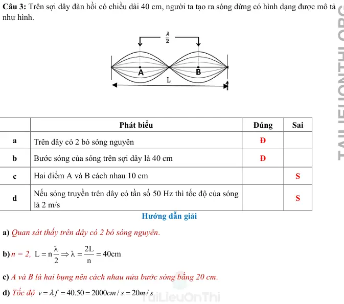{ loading=lazy }

#### Bài PDF 75

<!-- source-id: BT-Chuong-II-p172-q4-418 -->

Câu 4. Mô hình hóa sóng dừng xuất hiện trên dây như hình bên. Biết dây có chiều dài 140 cm.

Phát biểu
Đúng
Sai
a
Sóng truyền trên sợi dây có một đầu cố định và một đầu tự
do
Đ

b
Trên dây có 4 nút và 3 bụng

S
c
Bước sóng của sóng trên sợi dây là 80 cm
Đ

d
Nếu sóng truyền trên dây có vận tốc 3,2 m/s thì tần số của
sóng là 40 Hz
Đ

{ loading=lazy }

#### Bài PDF 76

<!-- source-id: BT-Chuong-II-p215-q2-502 -->

Câu 2. Một sợi dây AB dài 100 cm căng ngang đầu B cố định đầu A gắn với một nhánh của âm thoa
dao động điều hòa với tần số 20 Hz. Trên dây AB có một sóng dừng ổn định, A được coi là nút sóng.
Tốc độ truyền sóng trên dây là 20 m/s. Kể cả A và B

Phát biểu
Đúng
Sai
a Chu kì của sóng là 0,05 s .
Đ

b Sóng có bước sóng là 1 cm.

S
c Kể cả A và B có 5 nút

S
d Kể cả A và B có 2 bụng
Đ

#### Bài PDF 77

<!-- source-id: BT-Chuong-II-p216-q3-503 -->

Câu 3. Trong thí nghiệm sóng dừng trên dây mềm có hai đầu cố định, người ta thấy có 5 bụng sóng
xuất hiện khi tần số dao động của dây là 50 Hz. Biết tốc độ truyền sóng trên dây là 16 m/s. Chiều dài
sợi dây có giá trị

Phát biểu
Đúng
Sai
a Chu kì dao động của sợi dây là 0,02 s.
Đ

b Bước sóng là 800 cm.

S
c Ta thấy trên sợi dây có 5 nút sóng.

S
d Chiều dài sợi dây là 0,8 m.
Đ

### Thông hiểu — Trắc nghiệm 4 lựa chọn

#### Bài PDF 78

<!-- source-id: BT-Chuong-II-p154-q19-359 -->

Câu 19. Sóng dừng trên một sợi dây đàn hồi được mô tả như hình bên dưới, bước sóng của sóng
trên dây là λ. Khi có sóng dừng trên chiều dài AB bằng
A. AB
2
= λ.

B. AB
3
= λ.
C. AB
2,25
=
λ.

D. AB
3,25
=
λ.

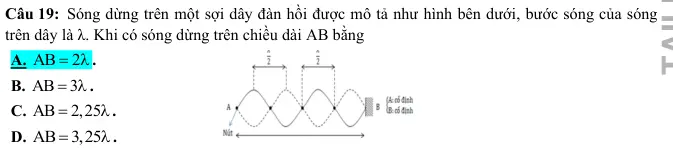{ loading=lazy }

#### Bài PDF 79

<!-- source-id: BT-Chuong-II-p154-q20-360 -->

Câu 20. Sóng dừng trên một sợi dây đàn hồi được mô tả như hình bên dưới, bước sóng của sóng
trên dây là λ. Khi có sóng dừng trên chiều dài chiều dài AB bằng
A. AB = λ.

B. AB
3
= λ.
C. AB
2,25
=
λ.

D. AB
1,75
=
λ.

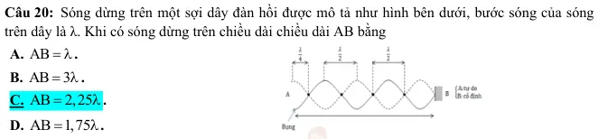{ loading=lazy }

#### Bài PDF 80

<!-- source-id: BT-Chuong-II-p154-q21-361 -->

Câu 21. Một sợi dây đàn hồi đang có sóng dừng ổn định được mô tả như hình bên dưới. Bước sóng
của sóng trên dây bằng

A. 3 cm.

B. 4 cm.

C. 5 cm.

D. 6 cm.

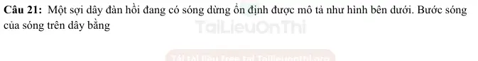{ loading=lazy }

#### Bài PDF 81

<!-- source-id: BT-Chuong-II-p155-q22-362 -->

Câu 22. Một sợi dây đàn hồi có chiều dài là L có hai đầu cố định, vận tốc truyền sóng trên dây là v
không đổi. Khi có sóng dừng trên dây, chiều dài L được xác định theo công thức
A.
v
L
n 2f
=
 với (n = 1, 2, 3,...).

B.
v
L
n 4f
=
 với (n = 1, 2, 3,...).
C.
(
) v
L
2n
1 4f
=
+
 với (n = 0, 1, 2, 3,...).                      D.
(
) v
L
2n
1 2f
=
+
.

#### Bài PDF 82

<!-- source-id: BT-Chuong-II-p155-q23-363 -->

Câu 23. Một sợi dây đàn hồi có chiều dài là L có một đầu cố định, một đầu tự do, vận tốc truyền
sóng trên dây là v không đổi. Khi có sóng dừng trên dây, chiều dài L được xác định theo công thức
A.
v
L
n 2f
=
 với (n = 1, 2, 3,...).

B.
v
L
n 4f
=
 với (n = 0, 1, 2, 3,...).

C.
(
) v
L
2n
1 4f
=
+
 với (n = 0, 1, 2, 3,...).           D.
(
) v
L
2n
1 2f
=
+
 với (n = 1, 2, 3,...).

#### Bài PDF 83

<!-- source-id: BT-Chuong-II-p155-q24-364 -->

Câu 24. Xét sóng dừng trên một sợi dây có bước sóng λ, tại A một bụng sóng và tại B một nút
sóng. Quan sát cho thấy giữa hai điểm A và B còn có thêm một bụng khác nữa. Khoảng cách AB
bằng
A. λ.

B. 1 75
,
λ.
C. 1 25
,
λ.
D. 0 75
,
λ.

#### Bài PDF 84

<!-- source-id: BT-Chuong-II-p155-q25-365 -->

Câu 25. Xét sóng dừng trên một sợi dây có bước sóng λ, tại A một bụng sóng và tại B một nút
sóng. Quan sát cho thấy giữa hai điểm A và B còn có thêm hai nút khác nữa. Khoảng cách AB bằng
A. λ.

B. 1 75
,
λ.
C. 1 25
,
λ.
D. 0 75
,
λ.

#### Bài PDF 85

<!-- source-id: BT-Chuong-II-p155-q26-366 -->

Câu 26. Khi sóng dừng hình thành trên một sợi dây đàn hồi, điều nào sau đây là đúng?
A. Các điểm nút là các điểm mà biên độ dao động lớn nhất.
B. Các điểm bụng là các điểm mà vận tốc dao động lớn nhất.
C. Tần số của sóng dừng phụ thuộc vào chiều dài của sợi dây và tốc độ truyền sóng.
D. Sóng dừng chỉ xảy ra khi hai sóng gặp nhau cùng pha và có cùng tần số.

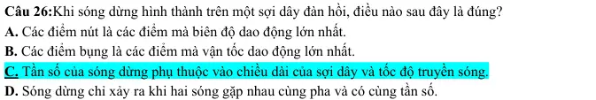{ loading=lazy }

#### Bài PDF 86

<!-- source-id: BT-Chuong-II-p155-q27-367 -->

Câu 27. Mô hình hóa sóng dừng xuất hiện trên sợi dây có một đầu cố định, một đầu tự do như hình
vẽ. Với vận tốc truyền sóng trên dây v và chiều dài sợi dây L cố định, tần số f của sóng âm là
1
4
=
v
f
m L  với m = 1 được gọi là âm bậc 1 (âm cơ bản). Để tiếp tục xảy ra hiện tượng sóng dừng,

phải tăng tần số tối thiểu đến giá trị
1
=
mf
mf . Giá trị m bằng

A. 4.

B. 3.
C. 6.
 D. 2.

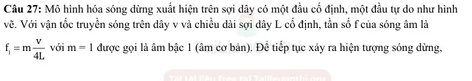{ loading=lazy }

#### Bài PDF 87

<!-- source-id: BT-Chuong-II-p156-q28-368 -->

Câu 28. Trên một sợi dây đàn hồi dài 1m, hai đầu cố định, có sóng dừng với 2 bụng sóng. Bước
sóng của sóng truyền trên đây là
A. 1 m.

B. 0,5 m.

C. 2 m.

D. 0,25 m.

### Vận dụng — Trắc nghiệm 4 lựa chọn

#### Bài PDF 88

<!-- source-id: BT-Chuong-II-p156-q31-371 -->

Câu 31. Quan sát sóng dừng trên một sợi dây đàn hồi, người ta đo được khoảng cách giữa 5 nút
sóng liên tiếp là 100 cm. Biết tần số của sóng truyền trên dây bằng 100 Hz, tốc độ truyền sóng trên
dây là:
A. 50 m/s.

B.100 m/s.

C. 25 m/s.
           D. 75 m/s.

