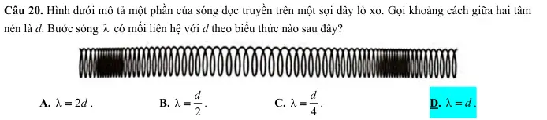
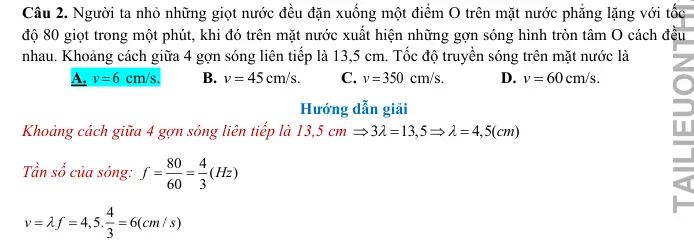
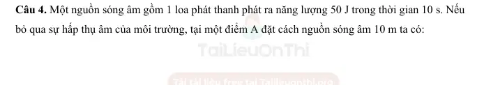
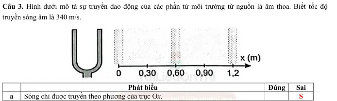
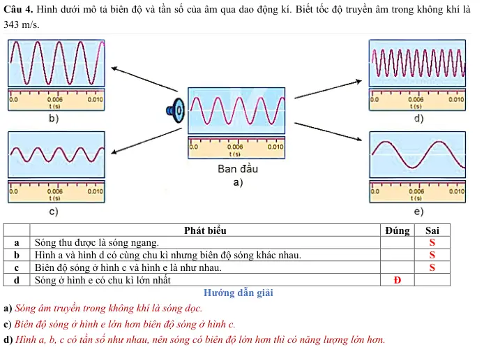
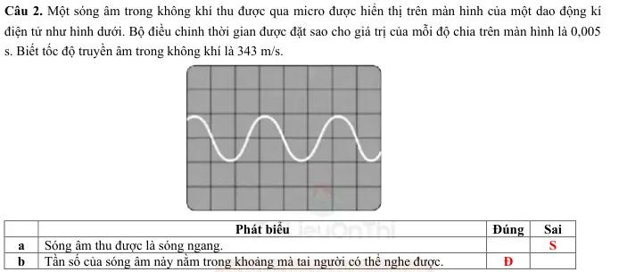
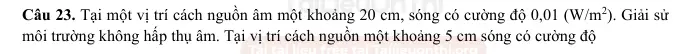

# Bài tập — Bài 5 — Sóng âm

> Hệ bài tập được biên soạn theo các dạng xuất hiện trong bộ tài liệu Vật lí 11 của dự án. Câu hỏi được giữ ngắn, trực tiếp; độ khó tăng dần và không cố tình thêm dữ kiện gây nhiễu.

[← Trở lại bài học](../../05-sound-waves.md)

## Phần A — Trắc nghiệm 4 lựa chọn

### Câu 1 — Mức 1 — Nhận biết

Âm truyền từ không khí vào nước. Đại lượng nào không đổi khi qua mặt phân cách?

A. Tốc độ.  
B. Bước sóng.  
C. Tần số.  
D. Cả tốc độ và bước sóng.

### Câu 2 — Mức 1 — Nhận biết

Mức cường độ âm tăng thêm $10$ dB thì cường độ âm tăng

A. 2 lần.  
B. 5 lần.  
C. 10 lần.  
D. 100 lần.

### Câu 3 — Mức 1 — Nhận biết

Độ cao của âm chủ yếu gắn với

A. biên độ.  
B. tần số.  
C. tốc độ âm.  
D. cường độ âm.

## Phần B — Đúng/Sai

### Câu 4 — Mức 2 — Thông hiểu

Xét sóng âm:

a) Âm nghe được là sóng cơ.  
b) Trong cùng một môi trường tuyến tính, tốc độ âm gần như không phụ thuộc tần số trong miền thông thường.  
c) Âm càng to thì tần số nhất thiết càng lớn.  
d) Cường độ âm có đơn vị W/m².

## Phần C — Trả lời ngắn

### Câu 5 — Mức 3 — Vận dụng

Một âm có tần số $680$ Hz truyền trong không khí với tốc độ $340$ m/s. Tính bước sóng.

### Câu 6 — Mức 3 — Vận dụng

Cường độ âm tại điểm M là $10^{-6}$ W/m². Lấy $I_0=10^{-12}$ W/m². Tính mức cường độ âm.

### Câu 7 — Mức 3 — Vận dụng

Một nguồn điểm phát âm đều mọi hướng. Bỏ hấp thụ. Khi khoảng cách đến nguồn tăng từ $2$ m lên $6$ m, cường độ giảm bao nhiêu lần?

## Phần D — Vận dụng và vận dụng cao

### Câu 8 — Mức 4 — Vận dụng cao

Một ống khí một đầu kín, một đầu hở cộng hưởng ở hai chiều dài liên tiếp $L_1=18$ cm và $L_2=42$ cm với cùng âm thoa. Tính bước sóng và tần số âm nếu tốc độ âm $v=336$ m/s.

---

[Đáp án và lời giải →](solutions.md)

## Ngân hàng bài tập PDF mở rộng

> Nội dung câu hỏi và dữ kiện trong phần này được giữ nguyên; hệ thống chỉ chuẩn hóa xuống dòng và mã kí tự để hiển thị trên web. Câu trùng được loại bỏ. Với câu có công thức/kí hiệu bị sai khi trích xuất chữ từ PDF, đề bài được giữ dưới dạng ảnh để không làm thay đổi dữ kiện.

### Nhận biết — Trả lời ngắn

#### Bài PDF 1

<!-- source-id: BT-Chuong-II-p25-q4-48 -->

Câu 4. Một nguồn sóng âm đặt tại nguồn O thì tại điểm A cách nguồn một khoảng d người ta đo
được cường độ sóng là 9.
(
)
6
2
10
/
W m
−
. Hỏi tại M cách nguồn O một khoảng 3d có cường độ sóng
là bao nhiêu ? ( tính theo đơn vị :
(
)
−6
2
10
/
W m
 )

#### Bài PDF 2

<!-- source-id: BT-Chuong-II-p56-q2-126 -->

Câu 2. Năng lượng mà sóng âm truyền qua trong 1 s qua một diện tích 4 m2 vuông góc với phương truyền âm
tại một điểm M là 2 mJ. Cường độ sóng âm tại điểm M (tính theo đơn vị mW/m2) là bao nhiêu?

#### Bài PDF 3

<!-- source-id: BT-Chuong-II-p56-q3-127 -->

Câu 3. Trên đường phố có mức cường độ âm là
1
70 dB
L =
, trong phòng đo được mức cường độ âm là
2
40 dB
L =
. Với
1I ,
2I lần lượt là cường độ âm tại vị trí có mức cường độ âm tương ứng
1L  và
2L . Tỉ số
1
2
I
I  bằng bao nhiêu?

#### Bài PDF 4

<!-- source-id: BT-Chuong-II-p56-q4-128 -->

Câu 4. Cường độ âm tại một điểm trong môi trường truyền âm là
4
2
10  W/m
−
. Biết cường độ âm chuẩn là
12
2
0
10
 W/m
I
−
=
. Mức cường độ âm tại điểm đó bằng bao nhiêu (tính theo đơn vị dB)?

#### Bài PDF 5

<!-- source-id: BT-Chuong-II-p62-q1-153 -->

Câu 1. Cường độ âm tại điểm khảo sát lớn gấp 1000 lần cường độ âm chuẩn tương ứng. Mức cường độ âm tại
điểm khảo sát là bao nhiêu (tính theo đơn vị dB)?

#### Bài PDF 6

<!-- source-id: BT-Chuong-II-p62-q2-154 -->

Câu 2. Người ta đo được mức cường độ âm tại A là 90 dB và tại B là 70 dB. Tỉ số cường độ âm tại A và
cường độ âm tại B là bao nhiêu?

#### Bài PDF 7

<!-- source-id: BT-Chuong-II-p63-q4-156 -->

Câu 4. Một nguồn âm có công suất 125,6 W. Cường độ sóng âm tại điểm cách nguồn 1 m là bao nhiêu (tính
theo đơn vị W/m2, làm tròn đến chữ số thập phân thứ hai sau dấu phẩy)?

### Nhận biết — Trắc nghiệm 4 lựa chọn

#### Bài PDF 8

<!-- source-id: BT-Chuong-II-p14-q27-27 -->

Câu 27. Một sóng âm truyền từ không khí vào nước. Biết vận tốc truyền sóng trong nước và trong không
khí lần lượt là 1020 m/s và 340 m/s. Tỉ số
nc
kk
λ
λ
là

A. 2 .
B.
.
C.
.
D. 3.

#### Bài PDF 9

<!-- source-id: BT-Chuong-II-p15-q29-29 -->

Câu 29. Một sóng âm được tạo ra từ một nguồn âm có công suất 200 W. Biết sóng âm truyền ra
môi trường xung quanh có dạng các mặt cầu có tâm là nguồn âm. Cường độ sóng âm tại một điểm
cách nguồn 10 m có giá trị
A.
2
2
/
W m .
B.
2
0,16
/
W m .
C.
2
1,6
/
W m .
D.
2
5
/
W m .

#### Bài PDF 10

<!-- source-id: BT-Chuong-II-p19-q38-38 -->

Câu 38. Một đội kèn gồm 5 người cùng thổi thì tại vị trí cách đội kèn một khoảng r sóng âm có cường
độ I. Nếu đội kèn gồm 10 người cùng thổi và giả sử các kèn phải có cùng công suất phát âm như
nhau thì tại vị trí cách đội kèn 2r sóng âm có cường độ là
A.
2
1
2
I
I
=
.

B.
2
1
4
I
I
=
.
C.
2
2.
I
I
=
.
D.
2
4.
I
I
=
.

#### Bài PDF 11

<!-- source-id: BT-Chuong-II-p19-q39-39 -->

Câu 39. Tại đỉnh A của một tam giác đều ABC đặt một nguồn sóng âm thì tại B đo được cường độ
sóng là I. Cường độ âm lớn nhất khi ta di chuyển trên đoạn AB là

A. 1,5.I.

B. 0,5.I.

C.
 .

D.
.

#### Bài PDF 12

<!-- source-id: BT-Chuong-II-p20-q40-40 -->

Câu 40. Trong hệ trục toạ độ Oxy người ta đặt tại gốc toạ độ O một nguồn sóng âm. Hai điểm A và
B nằm trên hai trục toạ độ tạo với gốc toạ độ O thành một tam giác vuông cân đỉnh O có cạnh bên
bằng a. Người ta đo được cường độ sóng âm tại A là
. Cường độ sóng âm lớn nhất
có thể thu được khi di chuyển trên đoạn AB là

A.
5
2
10
/
.
W m
−

B.
5
2
2.10
/
.
W m
−

C.
5
2
2.10
/
.
W m
−

D.
5
2
3.10
/
.
W m
−

#### Bài PDF 13

<!-- source-id: BT-Chuong-II-p28-q9-59 -->

Câu 9. Một nguồn sóng âm có công 15 W phát âm ra môi trường xung quanh. Hại vị trí cách nguồn
sóng âm 5 m, cường độ sóng có giá trị xấp xỉ
A. 0,025 W/m2.
B.  0,075 W/m2.
C. 0,05 W/m2.
D.  0,0025 W/m2.

#### Bài PDF 14

<!-- source-id: BT-Chuong-II-p44-q5-83 -->

Câu 5. Hai âm có cùng độ cao là hai âm có cùng

A. tần số.
B. biên độ.
C. bước sóng.
D. biên độ và tần số.

#### Bài PDF 15

<!-- source-id: BT-Chuong-II-p45-q11-89 -->

Câu 11. Hai âm thanh có độ cao khác nhau là do khác nhau về

A. tần số.

B. dụng cụ phát ra âm thanh.

C. cường độ âm.

D. biên độ của sóng.

#### Bài PDF 16

<!-- source-id: BT-Chuong-II-p45-q12-90 -->

Câu 12. Cường độ âm là năng lượng sóng âm truyền

A. qua một đơn vị diện tích đặt vuông góc theo phương truyền âm.

B. trong một đơn vị thời gian.

C. trong một đơn vị thời gian qua một đơn vị diện tích đặt vuông góc với phương truyền âm.

D. trong một đơn vị thời gian qua một đơn vị diện tích đặt song song với phương truyền âm.

#### Bài PDF 17

<!-- source-id: BT-Chuong-II-p45-q13-91 -->

Câu 13. Trong các sóng sau, có bao nhiêu sóng là sóng dọc?
(I)
Sóng trên dây đàn ghi-ta được gảy.
(II)
Sóng âm được tạo ra bởi một dây đàn ghi-ta đang rung.
(III)
Sóng trên một lò xo với đầu lò xo có thể di chuyển tới lui dọc theo chiều dài của lò xo.

A. 0.
B. 1.
C.  2.

D. 3.

#### Bài PDF 18

<!-- source-id: BT-Chuong-II-p46-q15-93 -->

Câu 15. Siêu âm là âm thanh

A. có tần số bé hơn tần số âm thanh thông thường.

B. có cường độ rất lớn có thể gây điếc vĩnh viễn.

C. có tần số trên 20 000 Hz.

D. có thể truyền trong mọi môi trường nhanh hơn âm thanh thông thường.

#### Bài PDF 19

<!-- source-id: BT-Chuong-II-p47-q20-98 -->

Câu 20. Hình dưới mô tả một phần của sóng dọc truyền trên một sợi dây lò xo. Gọi khoảng cách giữa hai tâm
nén là d. Bước sóng λ có mối liên hệ với d theo biểu thức nào sau đây?

A.
2d
λ=
.
B.
2
d
λ=
.
C.
4
d
λ=
.

D.
d
λ=
.

{ loading=lazy }

#### Bài PDF 20

<!-- source-id: BT-Chuong-II-p47-q21-99 -->

Câu 21. Một nam châm điện dùng dòng điện xoay chiều có chu kì 62,5μs . Nam châm tác dụng lên một lá thép
mỏng làm cho lá thép dao động điều hoà và tạo ra sóng âm. Biết tần số dao động của lá thép gấp đôi tần số của
dòng điện. Sóng âm do nó phát ra truyền trong không khí là

A. sóng ngang.

B. siêu âm.

C. hạ âm.

D. âm tai người có thể nghe được

#### Bài PDF 21

<!-- source-id: BT-Chuong-II-p47-q22-100 -->

Câu 22. Một sóng ngang truyền trên một sợi dây rất dài từ P đến Q. Hai điểm P, Q trên phương truyền sóng
cách nhau một khoảng 5
4
λ. Kết luận nào sau đây là đúng?

A. Khi P có li độ cực đại thì Q có vận tốc cực đại.

B. Li độ P, Q luôn trái dấu.

C. Khi Q có li độ cực đại thì P có vận tốc cực đại.

D. Khi Q có li độ cực đại thì P qua vị trí cân bằng theo chiều âm.

#### Bài PDF 22

<!-- source-id: BT-Chuong-II-p48-q23-101 -->

Câu 23. Với
0I  là cường độ âm chuẩn, I là cường độ âm. Khi mức cường độ âm
2 B
L =
thì

A.
0
2
I
I
=
.
B.
0
0,5
I
I
=
.
C.
2
0
10
I
I
=
.
D.
2
0
10
I
I
−
=
.

#### Bài PDF 23

<!-- source-id: BT-Chuong-II-p48-q24-102 -->

Câu 24. Trên mặt nước có một nguồn dao động tạo ra tại điểm O một dao động điều hoà có tần số 50 Hz. Trên
mặt nước xuất hiện những sóng tròn đồng tâm O cách đều, mỗi gợn lồi cách nhau 3 cm. Tốc độ truyền sóng
ngang trên mặt nước bằng

A. 120 cm/s.
B. 150 cm/s.
C.  360 cm/s.

D. 150 m/s.

#### Bài PDF 24

<!-- source-id: BT-Chuong-II-p48-q26-104 -->

Câu 26. Để đảm bảo an toàn lao động cho công nhân, mức cường độ âm trong phân xưởng của nhà máy phải
giữa ở mức không vượt quá 85 dB. Biết cường độ âm chuẩn là
12
2
0
10
 W/m
I
−
=
. Cường độ âm cực đại mà nhà
máy đó quy định là

A.
21
2
3,16.10
 W/m
−
.
B.
4
2
3,16.10  W/m
−
.
C.
12
2
3,16.10
 W/m
−
.
D.
2
20
3,16.10  W/m .

#### Bài PDF 25

<!-- source-id: BT-Chuong-II-p48-q27-105 -->

Câu 27. Một cái loa có công suất âm thanh 6,28 W khi mở to hết công suất. Âm truyền đi trong môi trường
đẳng hướng và không hấp thụ âm. Cường độ âm do loa phát ra tại một điểm cách loa 5 m là

A. 1,5 W/m2.
B. 0,02 W/m2.
C. 2 W/m2.

D. 0,5 W/m2.

#### Bài PDF 26

<!-- source-id: BT-Chuong-II-p48-q28-106 -->

Câu 28. Một nguồn điểm phát sóng âm có công suất không đổi trong môi trường truyền âm đẳng hướng và
không hấp thụ âm. Hai điểm A, B cách nguồn âm lần lượt là 1
2
,
r r . Tỉ số 2
1
r r là

A. 4.
B. 0,5.
C. 0,25.

D. 2.

#### Bài PDF 27

<!-- source-id: BT-Chuong-II-p48-q29-107 -->

Câu 29. Một lá thép dao động với chu kì 80 ms. Âm nó phát ra là

A. siêu âm.
B. hạ âm.
C. âm nghe được.
D. không phải sóng.

#### Bài PDF 28

<!-- source-id: BT-Chuong-II-p49-q30-108 -->

Câu 30. Một nguồn âm là nguồn điểm phát âm đẳng hướng trong không gian. Giả sử không có sự hấp thụ và
phản xạ âm. Tại một điểm cách nguồn âm 10 m thì mức cường độ âm là 80 dB. Tại một điểm cách nguồn âm
1 m thì mức cường độ âm bằng

A. 100 dB.
B. 110 dB.
C. 90 dB.

D. 120 dB.

#### Bài PDF 29

<!-- source-id: BT-Chuong-II-p51-q38-116 -->

Câu 38. Trong chất rắn, sóng cơ lan truyền bao gồm cả sóng dọc và sóng ngang với tốc độ truyền sóng khác
nhau. Khi xảy ra động đất, bằng cách theo dõi khoảng thời gian chênh lệch giữa sóng dọc và sóng ngang khi
truyền đến, ta có thể ước tính khoảng cách đến vị trí tâm chấn. Sóng dọc truyền với tốc độ 8 km/s, nhanh hơn
sóng ngang nên đến trước, được gọi là sóng sơ cấp (sóng P), sóng ngang truyền với tốc độ 5 km/s đến sau nên
được gọi là sóng thứ cấp (sóng S). Một trạm quan trắc nhận được hai tín hiệu từ một vụ động đất cách nhau
5,25 s. Khoảng cách từ tâm chấn động đất đến trạm quan trắc là

A. 57 km.
B. 73 km.
C. 35 km.
D. 70 km.

#### Bài PDF 30

<!-- source-id: BT-Chuong-II-p58-q6-136 -->

Câu 6. Hãy nối ý ở cột A với những khái niệm tương ứng ở cột B.
CỘT A
CỘT B
1 – Âm nghe được có tần số nằm trong khoảng
a – phương dao động và phương truyền sóng.
2 – Sóng ánh sáng có thể truyền được trong
b – chân không.
3 – Nguồn sóng là
c – từ 16 Hz đến 20 000 Hz.
4 – Để phân biệt sóng ngang và sóng dọc, người ta dựa vào
d – nguồn dao động.

A.  1 – a, 2 – b, 3 – d, 4 – c.
B.  1 – a, 2 – b, 3 – c, 4 – d.

C. 1 – c, 2 – b, 3 – d, 4 – a.
D.  1 – c, 2 – b, 3 – a, 4 – d.

#### Bài PDF 31

<!-- source-id: BT-Chuong-II-p58-q7-137 -->

Câu 7. Tần số âm nào sau đây mà tai người không thể nghe được?

A. 180 Hz.
B. 1800 Hz.
C. 18 000 Hz.
D. 180 000 Hz.

#### Bài PDF 32

<!-- source-id: BT-Chuong-II-p59-q11-141 -->

Câu 11. Kết luận nào sau đây không đúng khi nói về tính chất của sự truyền sóng trong môi trường?

A. Sóng truyền được trong các môi trường rắn, lỏng, khí.

B. Quá trình truyền sóng là quá trình truyền năng lượng.

C. Sóng truyền đi không mang theo vật chất của môi trường.

D. Các sóng âm có tần số khác nhau nhưng truyền đi với vận tốc như nhau trong mọi môi trường.

#### Bài PDF 33

<!-- source-id: BT-Chuong-II-p59-q12-142 -->

Câu 12. Lượng năng lượng được sóng âm truyền trong một đơn vị thời gian qua một đơn vị diện tích đặt
vuông góc với phương truyền âm gọi là

A. cường độ sóng âm.
B. vận tốc truyền âm.
C. chu kì âm.
D. năng lượng âm.

#### Bài PDF 34

<!-- source-id: BT-Chuong-II-p59-q14-144 -->

Câu 14. Tại một vị trí cách nguồn âm điểm (nguồn phát sóng âm trong môi trường đồng chất, đẳng hướng)
một khoảng 200 m, cường độ âm đo được bằng 6.10-5 W/m2. Công suất của nguồn âm là

A. 0,012 W.
B. 0,014 W.
C. 12 W.
D. 14 W.

#### Bài PDF 35

<!-- source-id: BT-Chuong-II-p59-q15-145 -->

Câu 15. Tại một điểm A nằm cách nguồn âm N (nguồn điểm) một khoảng 1 m, có mức cường độ âm 90 dB.
Biết ngưỡng nghe của âm đó là
12
2
0
10
 W/m
I
−
=
. Cường độ của âm đó tại A là

A. 1 nW/m2.
B. 1 mW/m2.
C. 1 W/m2.
D. 1 GW/m2.

#### Bài PDF 36

<!-- source-id: BT-Chuong-II-p59-q16-146 -->

Câu 16. Một nguồn điểm O phát sóng âm có công suất không đổi trong một môi trường truyền âm đẳng hướng
và không hấp thụ âm. Hai điểm A, B cách nguồn âm lần lượt là 1r  và
2r . Biết cường độ âm tại A gấp 3 lần
cường độ âm tại B. Tỉ số 1
2
r r  bằng

A. 3.
B. 1
3
.
C. 3 .
D. 1
3 .

#### Bài PDF 37

<!-- source-id: BT-Chuong-II-p60-q17-147 -->

Câu 17. Một người đứng cách nguồn âm một khoảng d thì cường độ âm là I. Khi người đó tiến xa thêm một
đoạn 40 m thì cường độ âm giảm chỉ còn
9
I
. Khoảng cách d có giá trị là

A. 20 m.
B. 10 m.
C. 60 m.
D. 30 m.

#### Bài PDF 38

<!-- source-id: BT-Chuong-II-p200-q2-456 -->

Câu 2. Người ta nhỏ những giọt nước đều đặn xuống một điểm O trên mặt nước phẳng lặng với tốc
độ 80 giọt trong một phút, khi đó trên mặt nước xuất hiện những gợn sóng hình tròn tâm O cách đều
nhau. Khoảng cách giữa 4 gợn sóng liên tiếp là 13,5 cm. Tốc độ truyền sóng trên mặt nước là
A.
6
v =  cm/s.
B.
45
v =
cm/s.
C.
350
v =
 cm/s.
D.
60
v =
cm/s.

{ loading=lazy }

### Nhận biết — Đúng/Sai

#### Bài PDF 39

<!-- source-id: BT-Chuong-II-p23-q4-44 -->

Câu 4. Một nguồn sóng âm gồm 1 loa phát thanh phát ra năng lượng 50 J trong thời gian 10 s. Nếu
bỏ qua sự hấp thụ âm của môi trường, tại một điểm A đặt cách nguồn sóng âm 10 m ta có:

Hình 2.9

Phát biểu
Đúng
Sai
a
Công suất nguồn âm là 5 W
Đ

b
Cường độ âm tại A là 4 (mW/m2)
Đ

c
Tại nơi đặt nguồn âm, nếu đặtcùng lúc  2 loa phát
thanh thì cường độ sóng tại A là 16 (mW/m2)

S
d
Từ vị trí A nếu đi xa nguồn âm thêm 20 m thì cường độ
âm là 2 (mW/m2)

S

{ loading=lazy }

#### Bài PDF 40

<!-- source-id: BT-Chuong-II-p53-q3-121 -->

Câu 3. Hình dưới mô tả sự truyền dao động của các phần tử môi trường từ nguồn là âm thoa. Biết tốc độ
truyền sóng âm là 340 m/s.

Phát biểu
Đúng
Sai
a
Sóng chỉ được truyền theo phương của trục Ox.

S

b
Sóng được mô tả trên hình là sóng ngang.

S
c
Bước sóng bằng khoảng cách giữa hai tâm nén gần nhau nhất.
Đ

d
Tần số sóng khoảng 567 Hz.
Đ

{ loading=lazy }

#### Bài PDF 41

<!-- source-id: BT-Chuong-II-p54-q4-122 -->

Câu 4. Hình dưới mô tả biên độ và tần số của âm qua dao động kí. Biết tốc độ truyền âm trong không khí là
343 m/s.

Phát biểu
Đúng
Sai
a
Sóng thu được là sóng ngang.

S
b
Hình a và hình d có cùng chu kì nhưng biên độ sóng khác nhau.

S
c
Biên độ sóng ở hình c và hình e là như nhau.

S
d
Sóng ở hình e có chu kì lớn nhất
Đ

{ loading=lazy }

#### Bài PDF 42

<!-- source-id: BT-Chuong-II-p54-q5-123 -->

Câu 5. Vào năm 2019, một trận động đất có độ lớn 5,4 độ richter xảy ra tại Trùng Khánh tỉnh Cao Bằng. Khi
sóng địa chấn P được phát ra từ một vị trí khởi nguồn của động đất (nguồn sóng ở tâm chấn) với tốc độ khoảng
5000 m/s thì nhà cửa, công trình và các đồ đạc, vật dụng của nhà dân ở những vị trí cách xa tâm chấn vẫn bị
ảnh hưởng do có sóng truyền qua (hay còn gọi là dư chấn của động đất). Cũng trong khoảng thời gian này, trận
động đất khác tại Mộc Châu có biên độ nhỏ hơn hai lần trận động đất tại Trùng Khánh. Độ richter là đơn vị
được dùng để đánh giá độ lớn của cường độ của các trận động đất. Độ richter được tính như sau:
0
log
log
L
M
A
A
=
−
, với A là biên độ tối đa đo được bằng địa chấn kế và
0A  là một biên độ chuẩn. Một trận
động đất được xem có cấp độ nhẹ khi
4,
L
M 
trung bình khi 4
5,
L
M


 mạnh khi 5
6,
L
M


và rất mạnh
khi 6
L
M

.

Phát biểu
Đúng
Sai
a
Dư chấn của động đất cho thấy sóng địa chấn mang năng lượng và năng lượng
này đã được truyền trong không gian dưới dạng sóng.
Đ

b
Sóng địa chấn P truyền đến một trạm địa chấn tại Bắc Giang, cách tâm chấn
khoảng 250 km sau khoảng 5 s.

S
c
Sóng địa chấn tại Mộc Châu mang năng lượng lớn hơn sóng địa chấn tại Trùng
Khánh.
Đ

d
Trận động đất tại Mộc Châu có thể được xem có cấp độ rất mạnh.

S

#### Bài PDF 43

<!-- source-id: BT-Chuong-II-p55-q6-124 -->

Câu 6. Một còi báo động có kích thước nhỏ phát ra sóng âm trong môi trường đồng chất, đẳng hướng. Ở vị trí
cách còi một đoạn 1
15 m,
r =
 cường độ sóng âm là
2
1
0,25 W/m
I =
. Ở vị trí cách còi một đoạn
2,
r  cường độ
sóng âm là
2
2
0,01 W/m
I =
. Xem gần đúng sóng âm không bị môi trường hấp thụ.

Phát biểu
Đúng
Sai
a
Sóng âm do còi báo động phát ra là sóng dọc.
Đ

b
Công suất của còi báo động càng giảm khi sóng càng truyền đi xa.

S
c
Khoảng cách
2r  xa nguồn âm gấp 3 lần 1r .

S
d
Tổng diện tích bề mặt sóng truyền qua tại vị trí cách còi một đoạn r2  khoảng 7
km2.

S

#### Bài PDF 44

<!-- source-id: BT-Chuong-II-p60-q2-150 -->

Câu 2. Một sóng âm trong không khí thu được qua micro được hiển thị trên màn hình của một dao động kí
điện tử như hình dưới. Bộ điều chỉnh thời gian được đặt sao cho giá trị của mỗi độ chia trên màn hình là 0,005
s. Biết tốc độ truyền âm trong không khí là 343 m/s.

Phát biểu
Đúng
Sai
a
Sóng âm thu được là sóng ngang.

S
b
Tần số của sóng âm này nằm trong khoảng mà tai người có thể nghe được.
Đ

c
Chưa thể xác định biên độ dao động.
Đ

d
Bước sóng là 1,5 cm.

S

{ loading=lazy }

### Thông hiểu — Trắc nghiệm 4 lựa chọn

#### Bài PDF 45

<!-- source-id: BT-Chuong-II-p13-q22-22 -->

Câu 22. Cường độ sóng âm được đo tại một điểm cách nguồn một khoảng d có cường độ là I. Tại vị
trí cách nguồn một khoảng 2d sóng có cường độ là
A.
.
B.
.
C.
.
D.
.

#### Bài PDF 46

<!-- source-id: BT-Chuong-II-p13-q23-23 -->

Câu 23. Tại một vị trí cách nguồn âm một khoảng 20 cm, sóng có cường độ 0,01 (W/m2). Giải sử
môi trường không hấp thụ âm. Tại vị trí cách nguồn một khoảng 5 cm sóng có cường độ
Hình 2.4

A. 0,016 W/m2.
B. 0,04 W/m2.
C. 0,16 W/m2.
D. 0,02 W/m2.

{ loading=lazy }

#### Bài PDF 47

<!-- source-id: BT-Chuong-II-p46-q16-94 -->

Câu 16. Phát biểu nào sau đây sai khi nói về sự truyền âm?

A. Tần số âm càng thấp thì âm càng bổng.

B. Cường độ âm càng lớn, âm nghe được càng to.

C. Ngưỡng đau của tai người không phụ thuộc vào tần số của âm.

D. Sóng âm truyền trong không khí là sóng dọc.

#### Bài PDF 48

<!-- source-id: BT-Chuong-II-p46-q17-95 -->

Câu 17. Tần số của một sóng âm có bước sóng 0,25 m truyền qua một tấm thép với tốc độ 5060 m/s là

A. 20240 Hz.
B. 2024 Hz.
C.  20200 Hz.

D. 2020 Hz.

### Vận dụng — Trắc nghiệm 4 lựa chọn

#### Bài PDF 49

<!-- source-id: BT-Chuong-II-p49-q31-109 -->

Câu 31. Một nguồn điểm phát âm đẳng hướng trong môi trường không hấp thụ âm. Tiến hành đo độ to của âm
tại một điểm A cách nguồn 10 m, sau đó đo độ to của âm tại một điểm B cách nguồn 20 m. Muốn đo được độ
to của âm tại hai điểm là như nhau thì công suất nguồn âm khi đo tại B phải

A. tăng 4 lần.
B. tăng 2 lần.
C. giảm 4 lần.
D. giảm 4 lần.

#### Bài PDF 50

<!-- source-id: BT-Chuong-II-p49-q32-110 -->

Câu 32. Nguồn âm điểm O phát ra sóng âm truyền trong môi trường đẳng hướng. Có hai điểm A và B nằm
trên nửa đường thẳng xuất phát từ S. Mức cường độ âm tại A là 40 dB và tại B là 60 dB. Bỏ qua sự hấp thụ âm.
Mức cường độ âm tại trung điểm C của AB là

A. 45,2 dB.
B. 46,7 dB.
C. 50 dB.

D. 52,3 dB.

#### Bài PDF 51

<!-- source-id: BT-Chuong-II-p49-q33-111 -->

Câu 33. S là nguồn âm điểm phát ra sóng âm truyền như nhau theo mọi phương trong môi trường không hấp
thụ và không phản xạ âm. Xét đường thẳng chứa S có hai điểm A, B cách nhau đoạn d không đổi (d &gt; 90 m) và
SA dài 45 m. Gọi M là trung điểm của AB; so với S, nếu B ở cùng phía với A thì mức cường độ âm tại M là 50
dB; nếu B ở khác phía với A thì mức cường độ âm tại M là 70 dB. Khoảng cách d là

A. 100 m.
B. 110 m.
C. 180 m.

D. 190 m.

