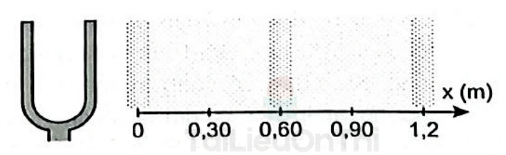
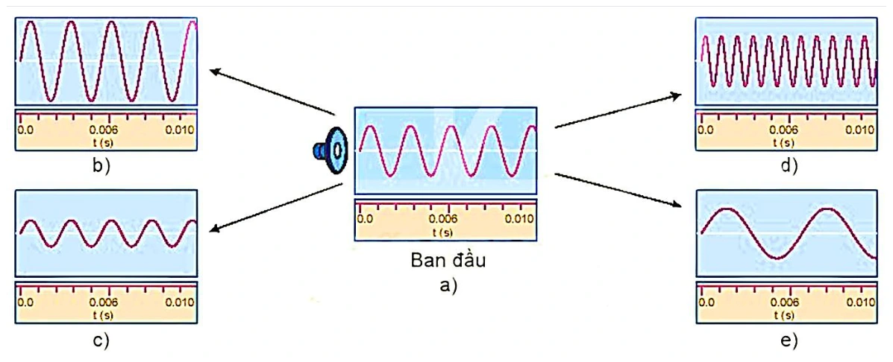
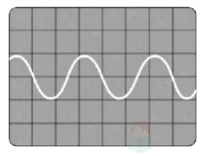

# Bài tập — Bài 5 — Sóng âm

[← Trở lại bài học](../../05-sound-waves.md)

## Phần A — Trắc nghiệm 4 lựa chọn

### Bài 1 — Mức 1 — Nhận biết

Âm truyền từ không khí vào nước. Đại lượng nào không đổi khi qua mặt phân cách?

A. Tốc độ.

B. Bước sóng.

C. Tần số.

D. Cả tốc độ và bước sóng.

??? success "Đáp án và lời giải"
    Chọn **C**. Tần số do nguồn quyết định; tốc độ và bước sóng thay đổi theo môi trường.

### Bài 2 — Mức 1 — Nhận biết

Mức cường độ âm tăng thêm $10\,\mathrm{dB}$ thì cường độ âm tăng

A. 2 lần.

B. 5 lần.

C. 10 lần.

D. 100 lần.

??? success "Đáp án và lời giải"
    Chọn **C** vì $\Delta L=10\log(I_2/I_1)=10\,\mathrm{dB}$ suy ra $I_2/I_1=10$.

### Bài 3 — Mức 1 — Nhận biết

Độ cao của âm chủ yếu gắn với

A. biên độ.

B. tần số.

C. tốc độ âm.

D. cường độ âm.

??? success "Đáp án và lời giải"
    Chọn **B**.

## Phần B — Đúng/Sai

### Bài 4 — Mức 2 — Thông hiểu

Xét sóng âm:

a) Âm nghe được là sóng cơ.

b) Trong cùng một môi trường tuyến tính, tốc độ âm gần như không phụ thuộc tần số trong miền thông thường.

c) Âm càng to thì tần số nhất thiết càng lớn.

d) Cường độ âm có đơn vị W/m².

??? success "Đáp án và lời giải"
    a) **Đúng.** Âm cần môi trường vật chất để truyền, nên thuộc loại sóng cơ.

    b) **Đúng.** trong mô hình phổ thông.

    c) **Sai.** độ to liên quan cường độ/mức cường độ, không đồng nhất với tần số.

    d) **Đúng.** Cường độ âm là công suất truyền qua một đơn vị diện tích, nên đơn vị SI là $\mathrm{W/m^2}$.

## Phần C — Trả lời ngắn

### Bài 5 — Mức 3 — Vận dụng

Một âm có tần số $680\,\mathrm{Hz}$ truyền trong không khí với tốc độ $340\,\mathrm{m/s}$. Tính bước sóng.

??? success "Đáp án và lời giải"
    $\lambda=v/f=340/680=0,50\,\mathrm m$.

### Bài 6 — Mức 3 — Vận dụng

Cường độ âm tại điểm M là $10^{-6}\,\mathrm{W/m^2}$. Lấy $I_0=10^{-12}\,\mathrm{W/m^2}$. Tính mức cường độ âm.

??? success "Đáp án và lời giải"
    $L=10\log(I/I_0)=10\log(10^6)=60\,\mathrm{dB}$.

### Bài 7 — Mức 3 — Vận dụng

Một nguồn điểm phát âm đều mọi hướng. Bỏ hấp thụ. Khi khoảng cách đến nguồn tăng từ $2\,\mathrm m$ lên $6\,\mathrm m$, cường độ giảm bao nhiêu lần?

??? success "Đáp án và lời giải"
    $I\propto1/r^2$. Vì $r$ tăng 3 lần nên cường độ giảm $3^2=9$ lần.

## Phần D — Vận dụng và vận dụng cao

### Bài 8 — Mức 4 — Vận dụng cao

Một ống khí một đầu kín, một đầu hở cộng hưởng ở hai chiều dài liên tiếp $L_1=18\,\mathrm{cm}$ và $L_2=42\,\mathrm{cm}$ với cùng âm thoa. Tính bước sóng và tần số âm nếu tốc độ âm $v=336\,\mathrm{m/s}$.

??? success "Đáp án và lời giải"
    Với ống một đầu kín, các chiều dài cộng hưởng liên tiếp hơn kém nhau $\lambda/2$.

    $L_2-L_1=42-18=24\,\mathrm{cm}$ $=\lambda/2$.

    Suy ra $\lambda=48\,\mathrm{cm}$ $=0,48\,\mathrm m$. Tần số $f=v/\lambda=336/0,48=700\,\mathrm{Hz}$.

## Ngân hàng bài tập mở rộng

### Nhận biết — Trả lời ngắn

#### Bài 9

<!-- source-id: BT-Chuong-II-p25-q4-48 -->

Một nguồn sóng âm đặt tại nguồn O thì tại điểm A cách nguồn một khoảng $d$ người ta đo được cường độ sóng là $9\times10^{-6}\,\mathrm{W/m^2}$. Hỏi tại M cách nguồn O một khoảng $3d$ có cường độ sóng là bao nhiêu? (Tính theo đơn vị $10^{-6}\,\mathrm{W/m^2}$.)

??? success "Đáp án và lời giải"
    **Đáp án:** 1

    **Hướng dẫn giải:**

    Với nguồn điểm đẳng hướng, $I\propto\dfrac1{r^2}$, nên
    $\dfrac{I_M}{I_A}=\dfrac{r_A^2}{r_M^2}=\dfrac{d^2}{(3d)^2}=\dfrac19$.
    Suy ra $I_M=\dfrac19 I_A=10^{-6}\,\mathrm{W/m^2}$.

    Vậy kết quả cần tìm là **1**.

#### Bài 10

<!-- source-id: BT-Chuong-II-p56-q2-126 -->

Năng lượng mà sóng âm truyền qua trong $1\,\mathrm s$ qua một diện tích $4\,\mathrm{m^2}$ vuông góc với phương truyền âm
tại một điểm M là $2\,\mathrm{mJ}$. Cường độ sóng âm tại điểm M (tính theo đơn vị $\mathrm{mW/m^2}$) là bao nhiêu?

??? success "Đáp án và lời giải"
    **Đáp án:** $0{,}5$

    **Hướng dẫn giải:**

    Cường độ âm là năng lượng truyền qua một đơn vị diện tích vuông góc với phương truyền trong một đơn vị thời gian:

    $I=\dfrac{E}{S\Delta t}=\dfrac{2\times10^{-3}}{4\cdot1}=5\times10^{-4}\,\mathrm{W/m^2}=0{,}5\,\mathrm{mW/m^2}$.

    Vậy giá trị cần tìm là $0{,}5$.

#### Bài 11

<!-- source-id: BT-Chuong-II-p56-q3-127 -->

Trên đường phố có mức cường độ âm là $L_1=70\,\mathrm{dB}$, trong phòng đo được mức cường độ âm là $L_2=40\,\mathrm{dB}$. Với $I_1,I_2$ lần lượt là cường độ âm tại vị trí có mức cường độ âm tương ứng $L_1,L_2$. Tỉ số $I_1/I_2$ bằng bao nhiêu?

??? success "Đáp án và lời giải"
    **Đáp án:** $1000$

    **Hướng dẫn giải:**

    Hiệu mức cường độ âm là

    $L_1-L_2=10\log_{10}\dfrac{I_1}{I_2}$.

    Thay $L_1-L_2=70-40=30\,\mathrm{dB}$:

    $30=10\log_{10}\dfrac{I_1}{I_2}\Rightarrow \dfrac{I_1}{I_2}=10^3=1000$.

    Vậy tỉ số cần tìm là $1000$.

#### Bài 12

<!-- source-id: BT-Chuong-II-p56-q4-128 -->

Cường độ âm tại một điểm trong môi trường truyền âm là $10^{-4}\,\mathrm{W/m^2}$. Biết cường độ âm chuẩn là $I_0=10^{-12}\,\mathrm{W/m^2}$. Mức cường độ âm tại điểm đó bằng bao nhiêu (tính theo đơn vị dB)?

??? success "Đáp án và lời giải"
    **Đáp án:** $80$

    **Hướng dẫn giải:**

    Mức cường độ âm:

    $L=10\log_{10}\dfrac{I}{I_0}=10\log_{10}\dfrac{10^{-4}}{10^{-12}}=10\log_{10}(10^8)=80\,\mathrm{dB}$.

    Vậy giá trị cần tìm là $80$.

#### Bài 13

<!-- source-id: BT-Chuong-II-p62-q1-153 -->

Cường độ âm tại điểm khảo sát lớn gấp 1000 lần cường độ âm chuẩn tương ứng. Mức cường độ âm tại
điểm khảo sát là bao nhiêu (tính theo đơn vị dB)?

??? success "Đáp án và lời giải"
    **Đáp án:** $30$

    **Hướng dẫn giải:**

    Vì $I=1000I_0=10^3I_0$ nên

    $L=10\log_{10}\dfrac{I}{I_0}=10\log_{10}(10^3)=30\,\mathrm{dB}$.

    Vậy mức cường độ âm là $30\,\mathrm{dB}$.

#### Bài 14

<!-- source-id: BT-Chuong-II-p62-q2-154 -->

Người ta đo được mức cường độ âm tại A là $90\,\mathrm{dB}$ và tại B là $70\,\mathrm{dB}$. Tỉ số cường độ âm tại A và
cường độ âm tại B là bao nhiêu?

??? success "Đáp án và lời giải"
    **Đáp án:** $100$

    **Hướng dẫn giải:**

    Từ

    $L_A-L_B=10\log_{10}\dfrac{I_A}{I_B}$

    và $L_A-L_B=20\,\mathrm{dB}$, ta có

    $\dfrac{I_A}{I_B}=10^{20/10}=10^2=100$.

    Vậy tỉ số cần tìm là $100$.

#### Bài 15

<!-- source-id: BT-Chuong-II-p63-q4-156 -->

Một nguồn âm có công suất $125,6\,\mathrm W$. Cường độ sóng âm tại điểm cách nguồn $1\,\mathrm m$ là bao nhiêu (tính
theo đơn vị $\mathrm{W/m^2}$, làm tròn đến chữ số thập phân thứ hai sau dấu phẩy)?

??? success "Đáp án và lời giải"
    **Đáp án:** $9{,}99$

    **Hướng dẫn giải:**

    Với nguồn điểm phát đẳng hướng,

    $I=\dfrac{P}{4\pi r^2}=\dfrac{125{,}6}{4\pi\cdot1^2}\approx9{,}995\,\mathrm{W/m^2}$.

    Theo cách làm tròn của nguồn, kết quả là $9{,}99\,\mathrm{W/m^2}$.

### Nhận biết — Trắc nghiệm 4 lựa chọn

#### Bài 16

<!-- source-id: BT-Chuong-II-p14-q27-27 -->

Một sóng âm truyền từ không khí vào nước. Biết vận tốc truyền sóng trong nước và trong không khí lần lượt là $1020\,\mathrm{m/s}$ và $340\,\mathrm{m/s}$. Tỉ số $\lambda_{nc}/\lambda_{kk}$ là

A. $2$.

B. $\dfrac{1}{3}$.

C. $\dfrac{1}{2}$.

D. $3$.

??? success "Đáp án và lời giải"
    **Đáp án:** D

    **Hướng dẫn giải:**

    Khi sóng truyền qua mặt phân cách, tần số do nguồn quyết định nên không đổi. Vì $\lambda=v/f$ nên bước sóng tỉ lệ với tốc độ truyền:

    $\dfrac{\lambda_{\mathrm{nước}}}{\lambda_{\mathrm{không\ khí}}}=\dfrac{1020}{340}=3$.

    Chọn **D**.

#### Bài 17

<!-- source-id: BT-Chuong-II-p15-q29-29 -->

Một sóng âm được tạo ra từ một nguồn âm có công suất $200\,\mathrm W$. Biết sóng âm truyền ra môi trường xung quanh có dạng các mặt cầu có tâm là nguồn âm. Cường độ sóng âm tại một điểm cách nguồn $10\,\mathrm m$ có giá trị

A. $2\,\mathrm{W/m^2}$.

B. $0{,}16\,\mathrm{W/m^2}$.

C. $1{,}6\,\mathrm{W/m^2}$.

D. $5\,\mathrm{W/m^2}$.

??? success "Đáp án và lời giải"
    **Đáp án:** B

    **Hướng dẫn giải:**

    Sóng lan theo các mặt cầu nên tại $r=10\,\mathrm m$ diện tích mặt sóng là

    $S=4\pi r^2=400\pi\,\mathrm{m^2}$.

    Do đó

    $I=\dfrac{P}{S}=\dfrac{200}{400\pi}\approx0{,}159\,\mathrm{W/m^2}\approx0{,}16\,\mathrm{W/m^2}$.

    Chọn **B**.

#### Bài 18

<!-- source-id: BT-Chuong-II-p19-q38-38 -->

Một đội kèn gồm 5 người cùng thổi thì tại vị trí cách đội kèn một khoảng $r$ sóng âm có cường độ $I$. Nếu đội kèn gồm 10 người cùng thổi và giả sử các kèn có cùng công suất phát âm như nhau thì tại vị trí cách đội kèn $2r$ sóng âm có cường độ là

A. $I_2=\dfrac{1}{2}I$.

B. $I_2=\dfrac{1}{4}I$.

C. $I_2=2I$.

D. $I_2=4I$.

??? success "Đáp án và lời giải"
    **Đáp án:** A

    **Hướng dẫn giải:**

    Với $n$ kèn giống nhau, tổng công suất tỉ lệ với $n$, còn cường độ của nguồn điểm đẳng hướng tỉ lệ nghịch với bình phương khoảng cách:

    $\dfrac{I_2}{I}=\dfrac{10}{5}\left(\dfrac{r}{2r}\right)^2=2\cdot\dfrac14=\dfrac12$.

    Suy ra $I_2=I/2$. Chọn **A**.

#### Bài 19

<!-- source-id: BT-Chuong-II-p19-q39-39 -->

Tại đỉnh A của một tam giác đều ABC đặt một nguồn sóng âm thì tại B đo được cường độ sóng là $I$. Cường độ âm lớn nhất khi ta di chuyển trên đoạn BC là

A. $1{,}5I$.

B. $0{,}5I$.

C. $\dfrac{3}{4}I$.

D. $\dfrac{4}{3}I$.

??? success "Đáp án và lời giải"
    **Đáp án:** D

    **Hướng dẫn giải:**

    Đặt cạnh tam giác đều bằng $a$. Trên đoạn $BC$, điểm gần nguồn $A$ nhất là chân đường cao $H$, với

    $AB=a,\qquad AH=\dfrac{a\sqrt3}{2}$.

    Do $I\propto1/r^2$,

    $\dfrac{I_H}{I_B}=\dfrac{AB^2}{AH^2}=\dfrac{a^2}{(a\sqrt3/2)^2}=\dfrac43$.

    Vậy $I_{\max}=\dfrac43I$, chọn **D**.

    !!! warning "Đối chiếu nguồn"
        Dòng đề trong PDF in “di chuyển trên đoạn AB”, nhưng phần hình và hướng dẫn của chính PDF xét chân đường cao $H$ nằm trên $BC$. Nếu thật sự di chuyển trên $AB$ và coi nguồn điểm đặt tại $A$, cường độ tăng không bị chặn khi tiến sát $A$, nên không cho đáp án hữu hạn như các lựa chọn. Vì vậy câu được trình bày với đoạn $BC$, phù hợp hình và phép tính của nguồn.

#### Bài 20

<!-- source-id: BT-Chuong-II-p20-q40-40 -->

Trong hệ trục tọa độ Oxy người ta đặt tại gốc tọa độ O một nguồn sóng âm. Hai điểm A và B nằm trên hai trục tọa độ tạo với gốc tọa độ O thành một tam giác vuông cân đỉnh O có cạnh bên bằng $a$. Người ta đo được cường độ sóng âm tại A là $10^{-5}\,\mathrm{W/m^2}$. Cường độ sóng âm lớn nhất có thể thu được khi di chuyển trên đoạn AB là

A. $10^{-5}\,\mathrm{W/m^2}$.

B. $2\times10^{-5}\,\mathrm{W/m^2}$.

C. $\sqrt{2}\times10^{-5}\,\mathrm{W/m^2}$.

D. $\sqrt{3}\times10^{-5}\,\mathrm{W/m^2}$.

??? success "Đáp án và lời giải"
    **Đáp án:** B

    **Hướng dẫn giải:**

    Khi di chuyển trên AB, tại H là chân đường cao từ O xuống AB thì khoảng cách đến nguồn nhỏ nhất, nên cường độ lớn nhất.
    Với tam giác vuông cân, $OA=a$ và $OH=a\sqrt2/2$.
    Tại A: $I_A=10^{-5}\,\mathrm{W/m^2}$.
    Vì $I\propto1/r^2$:
    $\dfrac{I_H}{I_A}=\dfrac{OA^2}{OH^2}=\dfrac{a^2}{(a\sqrt2/2)^2}=2$.
    Suy ra $I_H=2\times10^{-5}\,\mathrm{W/m^2}$.

#### Bài 21

<!-- source-id: BT-Chuong-II-p28-q9-59 -->

Một nguồn sóng âm có công suất $15\,\mathrm W$ phát âm ra môi trường xung quanh. Tại vị trí cách nguồn
sóng âm $5\,\mathrm m$, cường độ sóng có giá trị xấp xỉ

A. $0{,}025\,\mathrm{W/m^2}$.

B. $0{,}075\,\mathrm{W/m^2}$.

C. $0{,}05\,\mathrm{W/m^2}$.

D. $0{,}0025\,\mathrm{W/m^2}$.

??? success "Đáp án và lời giải"
    **Đáp án:** C

    **Hướng dẫn giải:**

    Với nguồn điểm phát đẳng hướng,

    $I=\dfrac{P}{4\pi r^2}=\dfrac{15}{4\pi\cdot5^2}\approx4{,}77\times10^{-2}\,\mathrm{W/m^2}\approx0{,}05\,\mathrm{W/m^2}$.

    Chọn **C**.

#### Bài 22

<!-- source-id: BT-Chuong-II-p44-q5-83 -->

Hai âm có cùng độ cao là hai âm có cùng

A. tần số.

B. biên độ.

C. bước sóng.

D. biên độ và tần số.

??? success "Đáp án và lời giải"
    **Đáp án:** A

    **Hướng dẫn giải:**

    Độ cao của âm gắn với tần số. Hai âm có cùng độ cao thì có cùng tần số, còn biên độ chủ yếu liên quan độ to và dạng dao động liên quan âm sắc.

    Chọn **A**.

#### Bài 23

<!-- source-id: BT-Chuong-II-p45-q11-89 -->

Hai âm thanh có độ cao khác nhau là do khác nhau về

A. tần số.

B. dụng cụ phát ra âm thanh.

C. cường độ âm.

D. biên độ của sóng.

??? success "Đáp án và lời giải"
    **Đáp án:** A

    **Hướng dẫn giải:**

    Độ cao của âm phụ thuộc vào tần số: tần số lớn hơn cho âm cao hơn, tần số nhỏ hơn cho âm trầm hơn. Vì vậy hai âm có độ cao khác nhau phải khác tần số.

    Chọn **A**.

#### Bài 24

<!-- source-id: BT-Chuong-II-p45-q12-90 -->

Cường độ âm là năng lượng sóng âm truyền

A. qua một đơn vị diện tích đặt vuông góc theo phương truyền âm.

B. trong một đơn vị thời gian.

C. trong một đơn vị thời gian qua một đơn vị diện tích đặt vuông góc với phương truyền âm.

D. trong một đơn vị thời gian qua một đơn vị diện tích đặt song song với phương truyền âm.

??? success "Đáp án và lời giải"
    **Đáp án:** C

    **Hướng dẫn giải:**

    Theo định nghĩa,

    $I=\dfrac{\Delta E}{S\,\Delta t}$,

    trong đó $\Delta E$ là năng lượng sóng âm truyền qua diện tích $S$ đặt vuông góc với phương truyền trong thời gian $\Delta t$. Vì vậy cường độ âm là năng lượng truyền qua một đơn vị diện tích vuông góc với phương truyền trong một đơn vị thời gian.

    Chọn **C**.

#### Bài 25

<!-- source-id: BT-Chuong-II-p45-q13-91 -->

Trong các sóng sau, có bao nhiêu sóng là sóng dọc?
(I)
Sóng trên dây đàn ghi-ta được gảy.
(II)
Sóng âm được tạo ra bởi một dây đàn ghi-ta đang rung.
(III)
Sóng trên một lò xo với đầu lò xo có thể di chuyển tới lui dọc theo chiều dài của lò xo.

A. 0.

B. 1.

C. 2.

D. 3.

??? success "Đáp án và lời giải"
    **Đáp án:** C

    **Hướng dẫn giải:**

    (I) Sóng ngang.
    (II) , (III) Sóng dọc.

#### Bài 26

<!-- source-id: BT-Chuong-II-p46-q15-93 -->

Siêu âm là âm thanh

A. có tần số bé hơn tần số âm thanh thông thường.

B. có cường độ rất lớn có thể gây điếc vĩnh viễn.

C. có tần số trên $20\,000\,\mathrm{Hz}$.

D. có thể truyền trong mọi môi trường nhanh hơn âm thanh thông thường.

??? success "Đáp án và lời giải"
    **Đáp án:** C

    **Hướng dẫn giải:**

    Siêu âm là âm có tần số lớn hơn giới hạn trên của vùng tai người nghe được. Theo quy ước phổ thông của bài, đó là $f>20\,\mathrm{kHz}$.

    Chọn **C**.

#### Bài 27

<!-- source-id: BT-Chuong-II-p47-q20-98 -->

Hình dưới mô tả một phần của sóng dọc truyền trên một sợi dây lò xo. Gọi khoảng cách giữa hai tâm nén là $d$. Bước sóng $\lambda$ có mối liên hệ với $d$ theo biểu thức nào sau đây?

{ loading=lazy }

A. $\lambda=2d$.

B. $\lambda=\dfrac{d}{2}$.

C. $\lambda=\dfrac{d}{4}$.

D. $\lambda=d$.

??? success "Đáp án và lời giải"
    **Đáp án:** D

    **Hướng dẫn giải:**

    Trong sóng dọc, một bước sóng là khoảng cách giữa hai điểm gần nhau nhất dao động cùng pha. Hai tâm vùng nén liên tiếp là hai vị trí cùng pha gần nhau nhất nên khoảng cách giữa chúng bằng một bước sóng:

    $\lambda=d$.

    Chọn **D**.

#### Bài 28

<!-- source-id: BT-Chuong-II-p47-q21-99 -->

Một nam châm điện dùng dòng điện xoay chiều có chu kì $62{,}5\,\mu\mathrm{s}$ . Nam châm tác dụng lên một lá thép
mỏng làm cho lá thép dao động điều hoà và tạo ra sóng âm. Biết tần số dao động của lá thép gấp đôi tần số của
dòng điện. Sóng âm do nó phát ra truyền trong không khí là

A. sóng ngang.

B. siêu âm.

C. hạ âm.

D. âm tai người có thể nghe được

??? success "Đáp án và lời giải"
    **Đáp án:** B

    **Hướng dẫn giải:**

    Dòng xoay chiều có chu kì $T=62{,}5\,\mu\mathrm s$ nên tần số dòng điện là

    $f_I=\dfrac1T=\dfrac1{62{,}5\times10^{-6}}=1{,}6\times10^4\,\mathrm{Hz}$.

    Lực hút của nam châm điện không đổi dấu theo chiều dòng điện nên biến thiên hai lần trong một chu kì điện, làm lá thép dao động với $f=2f_I=3{,}2\times10^4\,\mathrm{Hz}=32\,\mathrm{kHz}$. Tần số này thuộc vùng siêu âm.

    Chọn **B**.

#### Bài 29

<!-- source-id: BT-Chuong-II-p47-q22-100 -->

Một sóng ngang truyền trên một sợi dây rất dài từ P đến Q. Hai điểm P, Q trên phương truyền sóng cách nhau một khoảng $\dfrac{5\lambda}{4}$. Kết luận nào sau đây là đúng?

A. Khi P có li độ cực đại thì Q có vận tốc cực đại.

B. Li độ P, Q luôn trái dấu.

C. Khi Q có li độ cực đại thì P có vận tốc cực đại.

D. Khi Q có li độ cực đại thì P qua vị trí cân bằng theo chiều âm.

??? success "Đáp án và lời giải"
    **Đáp án:** D

    **Hướng dẫn giải:**

    Sóng truyền từ P đến Q nên tại cùng thời điểm P sớm pha hơn Q một góc

    $\Delta\varphi=\dfrac{2\pi\,PQ}{\lambda}=\dfrac{2\pi\cdot5\lambda/4}{\lambda}=\dfrac{5\pi}{2}\equiv\dfrac{\pi}{2}\pmod{2\pi}$.

    Khi Q ở biên dương, có thể lấy pha tại Q bằng $0$. Khi đó pha tại P bằng $\pi/2$, nên $x_P=0$ và vận tốc tại P âm cực đại, tức P đi qua vị trí cân bằng theo chiều âm.

    Chọn **D**.

#### Bài 30

<!-- source-id: BT-Chuong-II-p48-q23-101 -->

Với $I_0$ là cường độ âm chuẩn, $I$ là cường độ âm. Khi mức cường độ âm $L=2\,\mathrm{B}$ thì

A. $I=2I_0$.

B. $I=0{,}5I_0$.

C. $I=10^2I_0$.

D. $I=10^{-2}I_0$.

??? success "Đáp án và lời giải"
    **Đáp án:** C

    **Hướng dẫn giải:**

    Ở đây mức cường độ âm được cho theo đơn vị bel:

    $L_{\mathrm B}=\log_{10}\dfrac{I}{I_0}=2$.

    Suy ra $I/I_0=10^2=100$, hay $I=100I_0$.

    Chọn **C**.

#### Bài 31

<!-- source-id: BT-Chuong-II-p48-q24-102 -->

Trên mặt nước có một nguồn dao động tạo ra tại điểm O một dao động điều hoà có tần số $50\,\mathrm{Hz}$. Trên
mặt nước xuất hiện những sóng tròn đồng tâm O cách đều, mỗi gợn lồi cách nhau $3\,\mathrm{cm}$. Tốc độ truyền sóng
ngang trên mặt nước bằng

A. $120\,\mathrm{cm/s}$.

B. $150\,\mathrm{cm/s}$.

C. $360\,\mathrm{cm/s}$.

D. $150\,\mathrm{m/s}$.

??? success "Đáp án và lời giải"
    **Đáp án:** B

    **Hướng dẫn giải:**

    Khoảng cách giữa hai gợn lồi liên tiếp bằng bước sóng nên $\lambda=3\,\mathrm{cm}$.
    Tốc độ truyền sóng $v=\lambda f=3\cdot50=150\,\mathrm{cm/s}$.

#### Bài 32

<!-- source-id: BT-Chuong-II-p48-q26-104 -->

Để đảm bảo an toàn lao động cho công nhân, mức cường độ âm trong phân xưởng của nhà máy phải giữ ở mức không vượt quá $85\,\mathrm{dB}$. Biết cường độ âm chuẩn là $I_0=10^{-12}\,\mathrm{W/m^2}$. Cường độ âm cực đại mà nhà máy đó quy định là

A. $3{,}16\times10^{-21}\,\mathrm{W/m^2}$.

B. $3{,}16\times10^{-4}\,\mathrm{W/m^2}$.

C. $3{,}16\times10^{-12}\,\mathrm{W/m^2}$.

D. $3{,}16\times10^{20}\,\mathrm{W/m^2}$.

??? success "Đáp án và lời giải"
    **Đáp án:** B

    **Hướng dẫn giải:**

    Từ $L=10\log_{10}(I/I_0)$,

    $I=I_0\,10^{L/10}=10^{-12}\cdot10^{8{,}5}\approx3{,}16\times10^{-4}\,\mathrm{W/m^2}$.

    Chọn **B**.

#### Bài 33

<!-- source-id: BT-Chuong-II-p48-q27-105 -->

Một cái loa có công suất âm thanh $6,28\,\mathrm W$ khi mở to hết công suất. Âm truyền đi trong môi trường
đẳng hướng và không hấp thụ âm. Cường độ âm do loa phát ra tại một điểm cách loa $5\,\mathrm m$ là

A. 1,5 $\mathrm{W/m^2}$.

B. 0,02 $\mathrm{W/m^2}$.

C. 2 $\mathrm{W/m^2}$.

D. 0,5 $\mathrm{W/m^2}$.

??? success "Đáp án và lời giải"
    **Đáp án:** B

    **Hướng dẫn giải:**

    Với loa coi như nguồn điểm phát đẳng hướng,

    $I=\dfrac{P}{4\pi r^2}=\dfrac{6{,}28}{4\pi\cdot5^2}\approx2{,}0\times10^{-2}\,\mathrm{W/m^2}$.

    Chọn **B**.

#### Bài 34

<!-- source-id: BT-Chuong-II-p48-q28-106 -->

Một nguồn điểm phát sóng âm có công suất không đổi trong môi trường truyền âm đẳng hướng và không hấp thụ âm. Hai điểm A, B cách nguồn âm lần lượt là $r_1,r_2$. **Cường độ âm tại A gấp 4 lần cường độ âm tại B**, tức $I_1/I_2=4$. Tỉ số $r_2/r_1$ là

A. 4.

B. 0,5.

C. 0,25.

D. 2.

??? success "Đáp án và lời giải"
    **Đáp án:** D.

    **Hướng dẫn giải:**

    Với nguồn điểm đẳng hướng, $I=P/(4\pi r^2)$. Do đó

    $\dfrac{I_1}{I_2}=\left(\dfrac{r_2}{r_1}\right)^2=4$,

    suy ra $r_2/r_1=2$. Chọn **D**.

    !!! warning "Đối chiếu nguồn"
        Câu dẫn trong PDF bị thiếu tỉ số cường độ âm, nhưng chính dòng thay số của lời giải nguồn ghi $I_1/I_2=(r_2/r_1)^2$ rồi đặt $(r_2/r_1)^2=4$ và chọn D. Bản trình bày này phục hồi đúng điều kiện $I_1/I_2=4$ mà lời giải nguồn đã sử dụng.

#### Bài 35

<!-- source-id: BT-Chuong-II-p48-q29-107 -->

Một lá thép dao động với chu kì $80\,\mathrm{ms}$. Âm nó phát ra là

A. siêu âm.

B. hạ âm.

C. âm nghe được.

D. không phải sóng.

??? success "Đáp án và lời giải"
    **Đáp án:** B. Hạ âm.

    **Hướng dẫn giải:**

    $T=80\,\mathrm{ms}=0{,}080\,\mathrm{s}$ nên
    $f=1/T=12{,}5\,\mathrm{Hz}$.
    Vì $f<20\,\mathrm{Hz}$, âm phát ra thuộc vùng hạ âm.

#### Bài 36

<!-- source-id: BT-Chuong-II-p49-q30-108 -->

Một nguồn âm là nguồn điểm phát âm đẳng hướng trong không gian. Giả sử không có sự hấp thụ và
phản xạ âm. Tại một điểm cách nguồn âm $10\,\mathrm m$ thì mức cường độ âm là $80\,\mathrm{dB}$. Tại một điểm cách nguồn âm
$1\,\mathrm m$ thì mức cường độ âm bằng

A. $100\,\mathrm{dB}$.

B. $110\,\mathrm{dB}$.

C. $90\,\mathrm{dB}$.

D. $120\,\mathrm{dB}$.

??? success "Đáp án và lời giải"
    **Đáp án:** A

    **Hướng dẫn giải:**

    Khi khoảng cách giảm từ $10\,\mathrm m$ xuống $1\,\mathrm m$, cường độ tăng

    $\left(\dfrac{10}{1}\right)^2=100$ lần.

    Do đó mức cường độ âm tăng $10\log_{10}100=20\,\mathrm{dB}$. Từ $80\,\mathrm{dB}$ suy ra mức mới là $100\,\mathrm{dB}$.

    Chọn **A**.

#### Bài 37

<!-- source-id: BT-Chuong-II-p51-q38-116 -->

Trong chất rắn, sóng cơ lan truyền bao gồm cả sóng dọc và sóng ngang với tốc độ truyền sóng khác
nhau. Khi xảy ra động đất, bằng cách theo dõi khoảng thời gian chênh lệch giữa sóng dọc và sóng ngang khi
truyền đến, ta có thể ước tính khoảng cách đến vị trí tâm chấn. Sóng dọc truyền với tốc độ $8\,\mathrm{km/s}$, nhanh hơn
sóng ngang nên đến trước, được gọi là sóng sơ cấp (sóng P), sóng ngang truyền với tốc độ $5\,\mathrm{km/s}$ đến sau nên
được gọi là sóng thứ cấp (sóng S). Một trạm quan trắc nhận được hai tín hiệu từ một vụ động đất cách nhau
$5,25\,\mathrm s$. Khoảng cách từ tâm chấn động đất đến trạm quan trắc là

A. $57\,\mathrm{km}$.

B. $73\,\mathrm{km}$.

C. $35\,\mathrm{km}$.

D. $70\,\mathrm{km}$.

??? success "Đáp án và lời giải"
    **Đáp án:** D

    **Hướng dẫn giải:**

    Gọi $s$ là khoảng cách từ tâm chấn đến trạm. Sóng nhanh $8\,\mathrm{km/s}$ đến trước, sóng chậm $5\,\mathrm{km/s}$ đến sau, nên

    $\Delta t=\dfrac{s}{5}-\dfrac{s}{8}=\dfrac{3s}{40}$.

    Với $\Delta t=5{,}25\,\mathrm s$,

    $s=\dfrac{40\cdot5{,}25}{3}=70\,\mathrm{km}$.

    Chọn **D**.

#### Bài 38

<!-- source-id: BT-Chuong-II-p58-q6-136 -->

Hãy nối ý ở cột A với những khái niệm tương ứng ở cột B.

**Cột A**

1. Âm nghe được có tần số nằm trong khoảng.
2. Sóng ánh sáng có thể truyền được trong.
3. Nguồn sóng là.
4. Để phân biệt sóng ngang và sóng dọc, người ta dựa vào.

**Cột B**

a. phương dao động và phương truyền sóng.

b. chân không.

c. từ $16\,\mathrm{Hz}$ đến $20\,000\,\mathrm{Hz}$.

d. nguồn dao động.

A. 1-a, 2-b, 3-d, 4-c.

B. 1-a, 2-b, 3-c, 4-d.

C. 1-c, 2-b, 3-d, 4-a.

D. 1-c, 2-b, 3-a, 4-d.

??? success "Đáp án và lời giải"
    **Đáp án:** C

    **Hướng dẫn giải:**

    Ghép theo định nghĩa và tính chất:

    - âm nghe được: khoảng tần số mà tai người cảm nhận được $\rightarrow$ c;
    - ánh sáng truyền được trong chân không $\rightarrow$ b;
    - sóng âm trong không khí là sóng dọc $\rightarrow$ d;
    - sóng trên dây căng là sóng ngang $\rightarrow$ a.

    Vì vậy ghép $1-c,\ 2-b,\ 3-d,\ 4-a$, chọn **C**.

#### Bài 39

<!-- source-id: BT-Chuong-II-p58-q7-137 -->

Tần số âm nào sau đây mà tai người không thể nghe được?

A. $180\,\mathrm{Hz}$.

B. $1800\,\mathrm{Hz}$.

C. $18\,000\,\mathrm{Hz}$.

D. $180\,000\,\mathrm{Hz}$.

??? success "Đáp án và lời giải"
    **Đáp án:** D

    **Hướng dẫn giải:**

    Theo khoảng nghe được mà tài liệu sử dụng, tai người nghe được xấp xỉ từ $16\,\mathrm{Hz}$ đến $20\,\mathrm{kHz}$. Tần số $180000\,\mathrm{Hz}=180\,\mathrm{kHz}$ lớn hơn giới hạn này nên tai người không nghe được.

    Chọn **D**.

#### Bài 40

<!-- source-id: BT-Chuong-II-p59-q11-141 -->

Kết luận nào sau đây không đúng khi nói về tính chất của sự truyền sóng trong môi trường?

A. Sóng truyền được trong các môi trường rắn, lỏng, khí.

B. Quá trình truyền sóng là quá trình truyền năng lượng.

C. Sóng truyền đi không mang theo vật chất của môi trường.

D. Các sóng âm có tần số khác nhau nhưng truyền đi với vận tốc như nhau trong mọi môi trường.

??? success "Đáp án và lời giải"
    **Đáp án:** D

    **Hướng dẫn giải:**

    Khi sóng truyền từ môi trường này sang môi trường khác, tần số do nguồn quyết định nên giữ nguyên, còn tốc độ truyền và bước sóng có thể thay đổi theo môi trường. Vì vậy phát biểu cho rằng tốc độ truyền sóng không phụ thuộc môi trường là sai.

    Chọn **D**.

#### Bài 41

<!-- source-id: BT-Chuong-II-p59-q12-142 -->

Lượng năng lượng được sóng âm truyền trong một đơn vị thời gian qua một đơn vị diện tích đặt
vuông góc với phương truyền âm gọi là

A. cường độ sóng âm.

B. vận tốc truyền âm.

C. chu kì âm.

D. năng lượng âm.

??? success "Đáp án và lời giải"
    **Đáp án:** A

    **Hướng dẫn giải:**

    Đại lượng đặc trưng cho năng lượng sóng truyền qua một đơn vị diện tích trong một đơn vị thời gian là **cường độ sóng âm**,

    $I=\dfrac{\Delta E}{S\Delta t}$.

    Chọn **A**.

#### Bài 42

<!-- source-id: BT-Chuong-II-p59-q14-144 -->

Tại một vị trí cách nguồn âm điểm (nguồn phát sóng âm trong môi trường đồng chất, đẳng hướng)
một khoảng $200\,\mathrm m$, cường độ âm đo được bằng $6\times10^{-5}\,\mathrm{W/m^2}$. Công suất của nguồn âm là

A. $0,012\,\mathrm W$.

B. $0,014\,\mathrm W$.

C. $12\,\mathrm W$.

D. $14\,\mathrm W$.

??? success "Đáp án và lời giải"
    **Đáp án:** Không có phương án đúng; $Ppprox30{,}2\,\mathrm W$.

    **Hướng dẫn giải:**

    Với nguồn điểm đẳng hướng và bỏ qua hấp thụ,

    $I=\dfrac{P}{4\pi r^2}\Rightarrow P=4\pi r^2I$.

    Thay $r=200\,\mathrm m$ và $I=6\times10^{-5}\,\mathrm{W/m^2}$:

    $P=4\pi(200)^2\cdot6\times10^{-5}\approx30{,}16\,\mathrm W\approx30{,}2\,\mathrm W$.

    Không phương án A–D nào bằng giá trị này.

    !!! warning "Đối chiếu nguồn"
        PDF tô đáp án A ($0{,}012\,\mathrm W$), trong khi phần hướng dẫn lại ghi phép nhân $6\times10^{-5}\times200=0{,}12\,\mathrm W$. Cả hai đều không dùng diện tích mặt cầu $4\pi r^2$ và còn mâu thuẫn nhau một bậc thập phân. Tính độc lập theo mô hình nguồn điểm đẳng hướng của chính đề cho $P\approx30{,}2\,\mathrm W$.

#### Bài 43

<!-- source-id: BT-Chuong-II-p59-q15-145 -->

Tại một điểm A nằm cách nguồn âm N (nguồn điểm) một khoảng $1\,\mathrm m$, có mức cường độ âm $90\,\mathrm{dB}$. Biết ngưỡng nghe của âm đó là $I_0=10^{-12}\,\mathrm{W/m^2}$. Cường độ của âm đó tại A là

A. $1\,\mathrm{nW/m^2}$.

B. $1\,\mathrm{mW/m^2}$.

C. $1\,\mathrm{W/m^2}$.

D. $1\,\mathrm{GW/m^2}$.

??? success "Đáp án và lời giải"
    **Đáp án:** B

    **Hướng dẫn giải:**

    Từ $L=90\,\mathrm{dB}$ và $I_0=10^{-12}\,\mathrm{W/m^2}$:

    $I=I_0\,10^{L/10}=10^{-12}\cdot10^9=10^{-3}\,\mathrm{W/m^2}=1\,\mathrm{mW/m^2}$.

    Chọn **B**.

#### Bài 44

<!-- source-id: BT-Chuong-II-p59-q16-146 -->

Một nguồn điểm O phát sóng âm có công suất không đổi trong một môi trường truyền âm đẳng hướng và không hấp thụ âm. Hai điểm A, B cách nguồn âm lần lượt là $r_1$ và $r_2$. Biết cường độ âm tại A gấp 3 lần cường độ âm tại B. Tỉ số $r_1/r_2$ bằng

A. $3$.

B. $\dfrac{1}{\sqrt{3}}$.

C. $\sqrt{3}$.

D. $\dfrac{1}{3}$.

??? success "Đáp án và lời giải"
    **Đáp án:** B

    **Hướng dẫn giải:**

    Cùng một nguồn điểm, $I\propto1/r^2$. Nếu $I_A=3I_B$ thì

    $\dfrac{I_A}{I_B}=\dfrac{r_B^2}{r_A^2}=3\Rightarrow\dfrac{r_A}{r_B}=\dfrac1{\sqrt3}$.

    Chọn **B**.

#### Bài 45

<!-- source-id: BT-Chuong-II-p60-q17-147 -->

Một người đứng cách nguồn âm một khoảng $d$ thì cường độ âm là $I$. Khi người đó tiến xa thêm một đoạn $40\,\mathrm m$ thì cường độ âm giảm chỉ còn $I/9$. Khoảng cách $d$ có giá trị là

A. $20\,\mathrm m$.

B. $10\,\mathrm m$.

C. $60\,\mathrm m$.

D. $30\,\mathrm m$.

??? success "Đáp án và lời giải"
    **Đáp án:** A

    **Hướng dẫn giải:**

    Gọi khoảng cách ban đầu tới nguồn là $d$. Khi đi xa thêm $40\,\mathrm m$, cường độ giảm còn $1/9$:

    $\dfrac{I_2}{I_1}=\left(\dfrac{d}{d+40}\right)^2=\dfrac19$.

    Lấy căn dương: $d/(d+40)=1/3$, suy ra $3d=d+40$ và $d=20\,\mathrm m$.

    Chọn **A**.

#### Bài 46

<!-- source-id: BT-Chuong-II-p200-q2-456 -->

Người ta nhỏ những giọt nước đều đặn xuống một điểm O trên mặt nước phẳng lặng với tốc độ 80 giọt trong một phút, khi đó trên mặt nước xuất hiện những gợn sóng hình tròn tâm O cách đều nhau. Khoảng cách giữa 4 gợn sóng liên tiếp là $13,5\,\mathrm{cm}$. Tốc độ truyền sóng trên mặt nước là

A. $v=6\,\mathrm{cm/s}$.

B. $v=45\,\mathrm{cm/s}$.

C. $v=350\,\mathrm{cm/s}$.

D. $v=60\,\mathrm{cm/s}$.

??? success "Đáp án và lời giải"
    **Đáp án:** A

    **Hướng dẫn giải:**

    Khoảng cách giữa 4 gợn sóng liên tiếp gồm 3 bước sóng nên $3\lambda=13{,}5\,\mathrm{cm}$, suy ra $\lambda=4{,}5\,\mathrm{cm}$.

    Tần số của sóng là $f=\dfrac{80}{60}=\dfrac{4}{3}\,\mathrm{Hz}$.

    Do đó $v=\lambda f=4{,}5\cdot\dfrac{4}{3}=6\,\mathrm{cm/s}$.

### Nhận biết — Đúng/Sai

#### Bài 47

<!-- source-id: BT-Chuong-II-p23-q4-44 -->

Một nguồn sóng âm gồm 1 loa phát thanh phát ra năng lượng $50\,\mathrm J$ trong thời gian $10\,\mathrm s$. Nếu bỏ qua sự hấp thụ âm của môi trường, tại một điểm A đặt cách nguồn sóng âm $10\,\mathrm m$ ta có:

a) Công suất nguồn âm là $5\,\mathrm W$.

b) Cường độ âm tại A là $4\,\mathrm{mW/m^2}$.

c) Tại nơi đặt nguồn âm, nếu đặt cùng lúc 2 loa phát thanh thì cường độ sóng tại A là $16\,\mathrm{mW/m^2}$.

d) Từ vị trí A nếu đi xa nguồn âm thêm $20\,\mathrm m$ thì cường độ âm là $2\,\mathrm{mW/m^2}$.

??? success "Đáp án và lời giải"
    **Đáp án:** a) Đúng; b) Đúng; c) Sai; d) Sai.

    **Hướng dẫn giải:**

    a) **Đúng.** $P=E/t=50/10=5\,\mathrm{W}$.

    b) **Đúng.** $I_A=\dfrac{5}{4\pi\cdot10^2}\approx3{,}98\times10^{-3}\,\mathrm{W/m^2}\approx4\,\mathrm{mW/m^2}$.

    c) **Sai.** Hai loa giống nhau phát độc lập tại cùng vị trí cho tổng công suất $2P$, nên $I\approx7{,}96\,\mathrm{mW/m^2}$, không phải $16\,\mathrm{mW/m^2}$.

    d) **Sai.** Ở $r=30\,\mathrm{m}$, $I=5/(4\pi\cdot30^2)\approx0{,}442\,\mathrm{mW/m^2}$, không phải $2\,\mathrm{mW/m^2}$.

#### Bài 48

<!-- source-id: BT-Chuong-II-p53-q3-121 -->

Hình dưới mô tả sự truyền dao động của các phần tử môi trường từ nguồn là âm thoa. Biết tốc độ
truyền sóng âm là $340\,\mathrm{m/s}$.

{ loading=lazy }

a) Sóng chỉ được truyền theo phương của trục Ox.

b) Sóng được mô tả trên hình là sóng ngang.

c) Bước sóng bằng khoảng cách giữa hai tâm nén gần nhau nhất.

d) Tần số sóng khoảng $567\,\mathrm{Hz}$.

??? success "Đáp án và lời giải"
    **Đáp án:** a) Sai; b) Sai; c) Đúng; d) Đúng.

    **Hướng dẫn giải:**

    a) **Sai.** Âm thoa phát sóng âm lan ra môi trường theo nhiều phương, không chỉ dọc Ox.

    b) **Sai.** Sóng âm trong không khí là sóng dọc.

    c) **Đúng.** Hai tâm nén gần nhau nhất là hai điểm cùng trạng thái dao động liên tiếp, cách nhau một bước sóng.

    d) **Đúng.** Từ hình, $\lambda=0{,}60\,\mathrm{m}$. Do đó
    $f=v/\lambda=340/0{,}60\approx566{,}7\,\mathrm{Hz}\approx567\,\mathrm{Hz}$.

#### Bài 49

<!-- source-id: BT-Chuong-II-p54-q4-122 -->

Hình dưới mô tả biên độ và tần số của âm qua dao động kí. Biết tốc độ truyền âm trong không khí là
$343\,\mathrm{m/s}$.

{ loading=lazy }

a) Sóng thu được là sóng ngang.

b) Hình a và hình d có cùng chu kì nhưng biên độ sóng khác nhau.

c) Biên độ sóng ở hình c và hình e là như nhau.

d) Sóng ở hình e có chu kì lớn nhất

??? success "Đáp án và lời giải"
    **Đáp án:** a) Sai; b) Sai; c) Sai; d) Đúng.

    **Hướng dẫn giải:**

    a) **Sai.** Sóng âm truyền trong không khí là sóng dọc; đường trên dao động kí chỉ biểu diễn tín hiệu theo thời gian, không biến sóng âm thành sóng ngang.

    b) **Sai.** Đọc số chu kì trên cùng bề rộng màn hình cho thấy hình a và d không có cùng chu kì.

    c) **Sai.** Biên độ tín hiệu ở hình e lớn hơn ở hình c, nên phát biểu “như nhau” sai.

    d) **Đúng.** Hình e có số dao động ít nhất trong cùng khoảng thời gian hiển thị, nên có chu kì lớn nhất.

#### Bài 50

<!-- source-id: BT-Chuong-II-p54-q5-123 -->

Vào năm 2019, một trận động đất có độ lớn 5,4 độ richter xảy ra tại Trùng Khánh tỉnh Cao Bằng. Khi sóng địa chấn P được phát ra từ một vị trí khởi nguồn của động đất (nguồn sóng ở tâm chấn) với tốc độ khoảng $5000\,\mathrm{m/s}$ thì nhà cửa, công trình và các đồ đạc, vật dụng của nhà dân ở những vị trí cách xa tâm chấn vẫn bị ảnh hưởng do có sóng truyền qua (hay còn gọi là dư chấn của động đất). Cũng trong khoảng thời gian này, trận động đất khác tại Mộc Châu có biên độ nhỏ hơn hai lần trận động đất tại Trùng Khánh. Độ richter là đơn vị được dùng để đánh giá độ lớn của cường độ của các trận động đất. Độ richter được tính như sau: $M_L=\log A-\log A_0$, với $A$ là biên độ tối đa đo được bằng địa chấn kế và $A_0$ là một biên độ chuẩn. Một trận động đất được xem có cấp độ nhẹ khi $M_L<4$, trung bình khi $4\le M_L\le5$, mạnh khi $5\le M_L\le6$, và rất mạnh khi $6\le M_L$.

a) Dư chấn của động đất cho thấy sóng địa chấn mang năng lượng và năng lượng này đã được truyền trong không gian dưới dạng sóng.

b) Sóng địa chấn P truyền đến một trạm địa chấn tại Bắc Giang, cách tâm chấn khoảng $250\,\mathrm{km}$ sau khoảng $5\,\mathrm s$.

c) Sóng địa chấn tại Mộc Châu mang năng lượng lớn hơn sóng địa chấn tại Trùng Khánh.

d) Trận động đất tại Mộc Châu có thể được xem có cấp độ rất mạnh.

??? success "Đáp án và lời giải"
    **Đáp án:** a) Đúng; b) Sai; c) Sai; d) Sai.

    **Hướng dẫn giải:**

    a) **Đúng.** Việc công trình ở xa tâm chấn vẫn chịu tác động cho thấy sóng địa chấn đã truyền năng lượng từ vùng nguồn tới nơi khác; vật chất môi trường chỉ dao động quanh vị trí cân bằng chứ không chuyển khối từ tâm chấn đến trạm.

    b) **Sai.** Quãng đường $250\,\mathrm{km}=2{,}5\times10^5\,\mathrm m$, nên $t=s/v=2{,}5\times10^5/5000=50\,\mathrm s$, không phải $5\,\mathrm s$.

    c) **Sai.** Đề cho biên độ tại Mộc Châu nhỏ hơn hai lần, tức $A_M=A_T/2$. Chỉ riêng dữ kiện này đã không cho cơ sở để kết luận sóng tại Mộc Châu có năng lượng lớn hơn.

    d) **Sai.** Theo công thức trong đề,

    $M_M=M_T+\log_{10}(A_M/A_T)=5{,}4+\log_{10}(1/2)\approx5{,}10$.

    Theo đúng thang phân loại được nêu trong câu, giá trị này thuộc mức mạnh, không phải rất mạnh.

    !!! warning "Đối chiếu nguồn"
        Phần hướng dẫn PDF đảo dữ kiện “nhỏ hơn hai lần” thành “lớn hơn hai lần”, kéo theo kết luận khác ở c), d). Lời giải trên giữ đúng câu chữ của đề và tính lại từ đó.

#### Bài 51

<!-- source-id: BT-Chuong-II-p55-q6-124 -->

Một còi báo động có kích thước nhỏ phát ra sóng âm trong môi trường đồng chất, đẳng hướng. Ở vị trí cách còi một đoạn $r_1=15\,\mathrm{m}$, cường độ sóng âm là $I_1=0{,}25\,\mathrm{W/m^2}$. Ở vị trí cách còi một đoạn $r_2$, cường độ sóng âm là $I_2=0{,}01\,\mathrm{W/m^2}$. Xem gần đúng sóng âm không bị môi trường hấp thụ.

a) Sóng âm do còi báo động phát ra là sóng dọc.

b) Công suất của còi báo động càng giảm khi sóng càng truyền đi xa.

c) Khoảng cách $r_2$ xa nguồn âm gấp 3 lần $r_1$.

d) Tổng diện tích bề mặt sóng truyền qua tại vị trí cách còi một đoạn $r_2$ khoảng $7\,\mathrm{km^2}$.

??? success "Đáp án và lời giải"
    **Đáp án:** a) Đúng; b) Sai; c) Sai; d) Sai.

    **Hướng dẫn giải:**

    a) **Đúng.** Trong không khí, âm là sóng dọc.

    b) **Sai.** Nếu bỏ qua hấp thụ, công suất âm của nguồn không tự giảm theo khoảng cách; cường độ giảm vì năng lượng phân bố trên diện tích mặt cầu tăng theo $r^2$.

    c) **Sai.** Vì $I=P/(4\pi r^2)$ nên $r_2/r_1=\sqrt{I_1/I_2}=\sqrt{25}=5$.

    d) **Sai.** Với dữ kiện của bài, suy ra $r_2=75\ \text{m}$. Diện tích mặt cầu khi đó là $S=4\pi r_2^2\approx7{,}07\times10^4\ \text{m}^2\approx0{,}0707\ \text{km}^2$, không phải $7\ \text{km}^2$.

#### Bài 52

<!-- source-id: BT-Chuong-II-p60-q2-150 -->

Một sóng âm trong không khí thu được qua micro được hiển thị trên màn hình của một dao động kí
điện tử như hình dưới. Bộ điều chỉnh thời gian được đặt sao cho giá trị của mỗi độ chia trên màn hình là 0,005
s. Biết tốc độ truyền âm trong không khí là $343\,\mathrm{m/s}$.

{ loading=lazy }

a) Sóng âm thu được là sóng ngang.

b) Tần số của sóng âm này nằm trong khoảng mà tai người có thể nghe được.

c) Chưa thể xác định biên độ dao động.

d) Bước sóng là $1,5\,\mathrm{cm}$.

??? success "Đáp án và lời giải"
    **Đáp án:** a) Sai; b) Đúng; c) Đúng; d) Sai.

    **Hướng dẫn giải:**

    a) **Sai.** Sóng âm trong không khí là sóng dọc.

    b) **Đúng.** Từ hình, một chu kì ứng với khoảng 3 ô; mỗi ô là $0{,}005\,\mathrm{s}$, nên $T\approx0{,}015\,\mathrm{s}$ và $f\approx66{,}7\,\mathrm{Hz}$, nằm trong vùng nghe được.

    c) **Đúng.** Đề không cho độ nhạy điện áp/biên độ theo trục đứng nên chưa xác định được biên độ dao động âm.

    d) **Sai.** $\lambda=vT\approx343\cdot0{,}015=5{,}145\,\mathrm{m}$, không phải $1{,}5\,\mathrm{cm}$.

### Thông hiểu — Trắc nghiệm 4 lựa chọn

#### Bài 53

<!-- source-id: BT-Chuong-II-p13-q22-22 -->

Cường độ sóng âm được đo tại một điểm cách nguồn một khoảng $d$ có cường độ là $I$. Tại vị trí cách nguồn một khoảng $2d$ sóng có cường độ là

A. $\dfrac{I}{2}$.

B. $\dfrac{I}{4}$.

C. $2I$.

D. $4I$.

??? success "Đáp án và lời giải"
    **Đáp án:** B

    **Hướng dẫn giải:**

    Cường độ sóng $I=P/S$. Với nguồn điểm đẳng hướng, $S=4\pi r^2$, nên $I\propto 1/r^2$.
    Do đó
    $\dfrac{I}{I_2}=\dfrac{(2d)^2}{d^2}=4\Rightarrow I_2=\dfrac{I}{4}$.

#### Bài 54

<!-- source-id: BT-Chuong-II-p13-q23-23 -->

Tại một vị trí cách nguồn âm một khoảng $20\,\mathrm{cm}$, sóng có cường độ $0{,}01\,\mathrm{W/m^2}$. Giả sử môi trường không hấp thụ âm. Tại vị trí cách nguồn một khoảng $5\,\mathrm{cm}$ sóng có cường độ

A. $0{,}016\,\mathrm{W/m^2}$.

B. $0{,}04\,\mathrm{W/m^2}$.

C. $0{,}16\,\mathrm{W/m^2}$.

D. $0{,}02\,\mathrm{W/m^2}$.

??? success "Đáp án và lời giải"
    **Đáp án:** C. $0{,}16\,\mathrm{W/m^2}$.

    **Hướng dẫn giải:**

    Với nguồn điểm đẳng hướng, $I\propto1/r^2$, nên
    $I_2=I_1\left(\dfrac{r_1}{r_2}\right)^2=0{,}01\left(\dfrac{20}{5}\right)^2=0{,}16\,\mathrm{W/m^2}$.

#### Bài 55

<!-- source-id: BT-Chuong-II-p46-q16-94 -->

Phát biểu nào sau đây sai khi nói về sự truyền âm?

A. Tần số âm càng thấp thì âm càng bổng.

B. Cường độ âm càng lớn, âm nghe được càng to.

C. Ngưỡng đau của tai người không phụ thuộc vào tần số của âm.

D. Sóng âm truyền trong không khí là sóng dọc.

??? success "Đáp án và lời giải"
    **Đáp án:** A

    **Hướng dẫn giải:**

    Độ cao tăng khi tần số tăng. Vì thế phát biểu “tần số càng thấp thì âm càng bổng” đảo ngược quan hệ này và là phát biểu sai.

    Trong mô hình phổ thông mà câu hỏi sử dụng, các phát biểu còn lại được xem là đúng. Chọn **A**.

#### Bài 56

<!-- source-id: BT-Chuong-II-p46-q17-95 -->

Tần số của một sóng âm có bước sóng $0,25\,\mathrm m$ truyền qua một tấm thép với tốc độ $5060\,\mathrm{m/s}$ là

A. $20240\,\mathrm{Hz}$.

B. $2024\,\mathrm{Hz}$.

C. $20200\,\mathrm{Hz}$.

D. $2020\,\mathrm{Hz}$.

??? success "Đáp án và lời giải"
    **Đáp án:** A

    **Hướng dẫn giải:**

    Tần số âm do lá thép phát ra là

    $f=\dfrac{v}{\lambda}=\dfrac{5060}{0{,}25}=20240\,\mathrm{Hz}=20{,}24\,\mathrm{kHz}$.

    Giá trị này lớn hơn $20\,\mathrm{kHz}$ nên thuộc vùng siêu âm. Chọn **A**.

### Vận dụng — Trắc nghiệm 4 lựa chọn

#### Bài 57

<!-- source-id: BT-Chuong-II-p49-q31-109 -->

Một nguồn điểm phát âm đẳng hướng trong môi trường không hấp thụ âm. Tiến hành đo độ to của âm
tại một điểm A cách nguồn $10\,\mathrm m$, sau đó đo độ to của âm tại một điểm B cách nguồn $20\,\mathrm m$. Muốn đo được độ
to của âm tại hai điểm là như nhau thì công suất nguồn âm khi đo tại B phải

A. tăng 4 lần.

B. tăng 2 lần.

C. giảm 4 lần.

D. giảm 4 lần.

??? success "Đáp án và lời giải"
    **Đáp án:** A

    **Hướng dẫn giải:**

    Tại cùng vị trí, nếu cường độ âm không đổi thì $I=P/(4\pi r^2)$ cho $P\propto r^2$. Để cùng cường độ tại khoảng cách tăng gấp đôi, công suất phải tăng

    $\left(\dfrac{2r}{r}\right)^2=4$ lần.

    Chọn **A**.

    !!! note "Đối chiếu nguồn"
        PDF in trùng nội dung hai phương án C và D (“giảm 4 lần”). Điều này không ảnh hưởng kết luận vì phương án đúng là A.

#### Bài 58

<!-- source-id: BT-Chuong-II-p49-q32-110 -->

Nguồn âm điểm O phát ra sóng âm truyền trong môi trường đẳng hướng. Có hai điểm A và B nằm
trên nửa đường thẳng xuất phát từ S. Mức cường độ âm tại A là $40\,\mathrm{dB}$ và tại B là $60\,\mathrm{dB}$. Bỏ qua sự hấp thụ âm.
Mức cường độ âm tại trung điểm C của AB là

A. $45,2\,\mathrm{dB}$.

B. $46,7\,\mathrm{dB}$.

C. $50\,\mathrm{dB}$.

D. $52,3\,\mathrm{dB}$.

??? success "Đáp án và lời giải"
    **Đáp án:** A

    **Hướng dẫn giải:**

    Hai điểm A và B nằm trên cùng một tia từ nguồn, với $L_A=40\,\mathrm{dB}$ và $L_B=60\,\mathrm{dB}$. Do

    $L_B-L_A=20\log_{10}\dfrac{OA}{OB}=20\,\mathrm{dB}$,

    suy ra $OA/OB=10$. Điểm C là trung điểm AB nên

    $OC=\dfrac{OA+OB}{2}=\dfrac{10OB+OB}{2}=5{,}5OB$.

    Vì vậy

    $L_C=L_B-20\log_{10}(5{,}5)\approx60-14{,}81=45{,}19\,\mathrm{dB}\approx45{,}2\,\mathrm{dB}$.

    Chọn **A**.

#### Bài 59

<!-- source-id: BT-Chuong-II-p49-q33-111 -->

S là nguồn âm điểm phát ra sóng âm truyền như nhau theo mọi phương trong môi trường không hấp
thụ và không phản xạ âm. Xét đường thẳng chứa S có hai điểm A, B cách nhau đoạn d không đổi (d &gt; $90\,\mathrm m$) và
SA dài $45\,\mathrm m$. Gọi M là trung điểm của AB; so với S, nếu B ở cùng phía với A thì mức cường độ âm tại M là 50
dB; nếu B ở khác phía với A thì mức cường độ âm tại M là $70\,\mathrm{dB}$. Khoảng cách d là

A. $100\,\mathrm m$.

B. $110\,\mathrm m$.

C. $180\,\mathrm m$.

D. $190\,\mathrm m$.

??? success "Đáp án và lời giải"
    **Đáp án:** B

    **Hướng dẫn giải:**

    Gọi $AB=d>90\,\mathrm m$ và M là trung điểm AB. Với hai vị trí A, B nằm trên cùng đường thẳng qua nguồn O nhưng ở hai phía theo hình học của bài, khoảng cách từ O đến M trong hai cấu hình tương ứng là

    $r_+=45+\dfrac d2,\qquad r_-=\dfrac d2-45$.

    Chênh lệch mức cường độ âm $20\,\mathrm{dB}$ cho

    $20=20\log_{10}\dfrac{r_+}{r_-}\Rightarrow\dfrac{45+d/2}{d/2-45}=10$.

    Giải ra $45+d/2=5d-450$, nên $d=110\,\mathrm m$. Chọn **B**.
