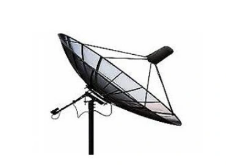
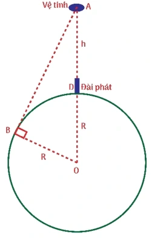

# Bài tập — Bài 6 — Sóng điện từ và thang sóng điện từ

> Hệ bài tập được biên soạn theo các dạng xuất hiện trong bộ tài liệu Vật lí 11 của dự án. Câu hỏi được giữ ngắn, trực tiếp; độ khó tăng dần và không cố tình thêm dữ kiện gây nhiễu.

[← Trở lại bài học](../../06-electromagnetic-waves.md)

## Phần A — Trắc nghiệm 4 lựa chọn

### Bài 1 — Mức 1 — Nhận biết

Sóng điện từ truyền được

A. chỉ trong chất rắn.
B. chỉ trong không khí.
C. trong chân không.
D. chỉ trong chất dẫn điện.

??? success "Đáp án và lời giải"
    Chọn **C**. Sóng điện từ không cần môi trường vật chất.

### Bài 2 — Mức 1 — Nhận biết

Trong chân không, sóng điện từ có tần số $100$ MHz. Bước sóng gần bằng

A. $0,3$ m.
B. $3$ m.
C. $30$ m.
D. $300$ m.

??? success "Đáp án và lời giải"
    Chọn **B**. $\lambda=c/f=3\cdot10^8/10^8=3$ m.

### Bài 3 — Mức 1 — Nhận biết

Trong sóng điện từ, vectơ điện trường và vectơ cảm ứng từ

A. song song nhau.
B. vuông góc nhau và vuông góc phương truyền sóng.
C. luôn ngược pha.
D. không biến thiên theo thời gian.

??? success "Đáp án và lời giải"
    Chọn **B**. Trong mô hình sóng phẳng, $\vec E$, $\vec B$ và phương truyền đôi một vuông góc; $E$ và $B$ dao động cùng pha.

## Phần B — Đúng/Sai

### Bài 4 — Mức 2 — Thông hiểu

Xét sóng điện từ trong chân không:

a) Tốc độ bằng $c\approx3\cdot10^8$ m/s.
b) Tần số càng lớn thì bước sóng càng nhỏ.
c) Sóng điện từ là sóng dọc.
d) Ánh sáng nhìn thấy là một phần của phổ điện từ.

??? success "Đáp án và lời giải"
    a) **Đúng**.
    b) **Đúng** vì $c=\lambda f$.
    c) **Sai**: là sóng ngang.
    d) **Đúng**.

## Phần C — Trả lời ngắn

### Bài 5 — Mức 3 — Vận dụng

Một bức xạ điện từ có bước sóng $600$ nm trong chân không. Tính tần số.

??? success "Đáp án và lời giải"
    $f=c/\lambda=3\cdot10^8/(600\cdot10^{-9})=5\cdot10^{14}$ Hz.

### Bài 6 — Mức 3 — Vận dụng

Một sóng vô tuyến có tần số $75$ MHz. Tính bước sóng trong chân không.

??? success "Đáp án và lời giải"
    $\lambda=3\cdot10^8/(75\cdot10^6)=4$ m.

### Bài 7 — Mức 3 — Vận dụng

Tín hiệu điện từ truyền từ vệ tinh đến trạm mặt đất khoảng $3,6\cdot10^7$ m. Bỏ qua đường đi cong. Ước tính thời gian truyền.

??? success "Đáp án và lời giải"
    $t=s/c=3,6\cdot10^7/(3\cdot10^8)=0,12$ s.

## Phần D — Vận dụng và vận dụng cao

### Bài 8 — Mức 4 — Vận dụng cao

Một bức xạ có tần số $6,0\cdot10^{14}$ Hz đi từ chân không vào thủy tinh có chiết suất $n=1,5$. Tính tốc độ, tần số và bước sóng trong thủy tinh.

??? success "Đáp án và lời giải"
    Tốc độ trong thủy tinh $v=c/n=2,0\cdot10^8$ m/s. Tần số không đổi khi qua mặt phân cách: $f=6,0\cdot10^{14}$ Hz. Bước sóng trong thủy tinh:

    $\lambda=v/f=2,0\cdot10^8/(6,0\cdot10^{14})=3,33\cdot10^{-7}$ m $=333$ nm.

## Ngân hàng bài tập mở rộng

> Các bài dưới đây được đánh số nối tiếp phần bài tập phía trên. Đề bài được trình bày bằng Markdown; chỉ đồ thị, hình vẽ hoặc sơ đồ thực sự cần thiết mới được giữ dưới dạng hình. Đáp án và lời giải được đặt trong nút mở rộng ngay dưới từng bài.

### Nhận biết — Trả lời ngắn

#### Bài 9

<!-- source-id: BT-Chuong-II-p106-q1-227 -->

Một sóng điện từ có tần số 150 MHz truyền với tốc độ
8
3.10 m/s có bước sóng là bao nhiêu mét?

??? success "Đáp án và lời giải"
    **Đáp án:** 2
    **Hướng dẫn giải:**

    Sóng điện từ trong chân không thỏa $c=\lambda f$; $\vec E$, $\vec B$ và phương truyền sóng đôi một vuông góc.

    Vậy kết quả cần tìm là **2**.
#### Bài 10

<!-- source-id: BT-Chuong-II-p106-q2-228 -->

Biết tốc độ ánh sáng trong chân không là c = 3.108 m/s. Khi truyền trong nước có chiết suất bằng
4/3 thì bước sóng của ánh sáng có tần số 5,6.1014 Hz bằng bao nhiêu μm?

??? success "Đáp án và lời giải"
    **Đáp án:** $0{,}4$
    **Hướng dẫn giải:**

    Sóng điện từ trong chân không thỏa $c=\lambda f$; $\vec E$, $\vec B$ và phương truyền sóng đôi một vuông góc.

    Bước sóng của ánh sáng khi truyền trong nước:

    Vậy kết quả cần tìm là **$0{,}4$**.
#### Bài 11

<!-- source-id: BT-Chuong-II-p106-q3-229 -->

Tại Việt Nam sẽ chính thức tắt sóng 2G hoàn toàn trên toàn quốc vào tháng 9/2024 và sử dụng
sóng 4G, 5G có tần số trải từ 1800 MHz đến 3900 MHz. Tính bước sóng lớn nhất của sóng điện từ tương
ứng với dải tần số này theo mét?

??? success "Đáp án và lời giải"
    **Đáp án:** $0{,}17$
    **Hướng dẫn giải:**

    Sóng điện từ trong chân không thỏa $c=\lambda f$; $\vec E$, $\vec B$ và phương truyền sóng đôi một vuông góc.

    Bước sóng lớn nhất ứng với tần số nhỏ nhất 1800 MHz là

    Vậy kết quả cần tìm là **$0{,}17$**.
#### Bài 12

<!-- source-id: BT-Chuong-II-p106-q4-230 -->

Một máy phát sóng vô tuyến AM đẳng hướng trong không gian. Ở khoảng cách 30 km từ máy
phát này, ta nhận được sóng có cường độ bằng 4,42.10-6 W/m2. Công suất của máy phát này là bao nhiêu
kW?

??? success "Đáp án và lời giải"
    **Đáp án:** $50$
    **Hướng dẫn giải:**

    Sóng điện từ trong chân không thỏa $c=\lambda f$; $\vec E$, $\vec B$ và phương truyền sóng đôi một vuông góc.

    Vậy kết quả cần tìm là **$50$**.
#### Bài 13

<!-- source-id: BT-Chuong-II-p106-q5-231 -->

Dùng sóng vô tuyến ngắn người ta đo được khoảng cách từ Trái Đất đến Mặt Trăng là 3,75.108
m, bằng cách phát một tín hiệu từ Trái Đất tới Mặt Trăng và thu tín hiệu trở lại, đo khoảng thời gian từ
khi phát đến khi nhận tín hiệu. Biết tốc độ của sóng vô tuyến này là
8
3.10 m/s. Khoảng thời gian từ khi
phát tới khi nhận được tín hiệu trở lại là bao nhiêu giây?

??? success "Đáp án và lời giải"
    **Đáp án:** $2{,}5$
    **Hướng dẫn giải:**

    Sóng điện từ trong chân không thỏa $c=\lambda f$; $\vec E$, $\vec B$ và phương truyền sóng đôi một vuông góc.

    Khoảng cách từ Trái Đất đến Mặt Trăng là:

    Vậy kết quả cần tìm là **$2{,}5$**.
#### Bài 14

<!-- source-id: BT-Chuong-II-p107-q6-232 -->

Một vệ tinh địa tĩnh nhận sóng truyền hình từ đài phát rồi phát lại tức thời tín hiệu đó về Trái Đất.
Khoảng thời gian lớn nhất mà sóng truyền hình đi từ đài phát đến Trái Đất là 0,25 s. Coi Trái Đất là một
hình cầu có bán kính 6400 km, đài phát hình trên mặt đất, nằm trên đường thẳng nối vệ tinh và tâm Trái
Đất. Biết tốc độ truyền sóng c = 3.108 m/s. Độ cao của vệ tinh là bao nhiêu nghìn km?
??? success "Đáp án và lời giải"
    **Đáp án:** $34{,}6$
    **Hướng dẫn giải:**

    Sóng điện từ trong chân không thỏa $c=\lambda f$; $\vec E$, $\vec B$ và phương truyền sóng đôi một vuông góc.

    Thời gian lớn nhất mà sóng truyền hình đi từ đài phát đến Trái Đất chính là thời gian sóng đi từ đài
    phát đến vệ tinh sau đó từ vệ tinh truyền về Trái Đất theo phương tiếp tuyến với Trái Đất.
    Khoảng cách lớn nhất đó là:
    Khoảng thời gian lớn nhất mà sóng truyền hình đi từ đài phát đến vệ tinh rồi quay lại Trái Đất là:

    Vậy kết quả cần tìm là **$34{,}6$**.
#### Bài 15

<!-- source-id: BT-Chuong-II-p114-q1-255 -->

Sóng điện từ có tần số 20 MHz truyền trong chân không với bước sóng là bao nhiêu mét?

??? success "Đáp án và lời giải"
    **Đáp án:** $15$
    **Hướng dẫn giải:**

    Sóng điện từ trong chân không thỏa $c=\lambda f$; $\vec E$, $\vec B$ và phương truyền sóng đôi một vuông góc.

    Vậy kết quả cần tìm là **$15$**.
#### Bài 16

<!-- source-id: BT-Chuong-II-p114-q2-256 -->

Khi ánh sáng đỏ (có bước sóng 0,75 μm trong chân không. truyền vào môi trường trong suốt, tốc
độ của nó giảm xuống còn 2,5.108 m/s. Tần số của ánh sáng đỏ trong chân không có giá trị là bao nhiêu
1014 Hz?

??? success "Đáp án và lời giải"
    **Đáp án:** 4
    **Hướng dẫn giải:**

    Sóng điện từ trong chân không thỏa $c=\lambda f$; $\vec E$, $\vec B$ và phương truyền sóng đôi một vuông góc.

    Tần số của ánh sáng đỏ trong chân không:

    Vậy kết quả cần tìm là **4**.
#### Bài 17

<!-- source-id: BT-Chuong-II-p114-q3-257 -->

Một vệ tinh nhân tạo chuyển động ở độ cao 350 km so với mặt đất phát sóng vô tuyến với công
suất bằng 50 kW về phía mặt đất. Bỏ qua sự hấp thụ sóng của khí quyển. Cường độ sóng nhận được bởi
một máy thu vô tuyến ở mặt đất ngay phía dưới vệ tinh là bao nhiêu
2
nW/m ?

??? success "Đáp án và lời giải"
    **Đáp án:** $32{,}5$
    **Hướng dẫn giải:**

    Sóng điện từ trong chân không thỏa $c=\lambda f$; $\vec E$, $\vec B$ và phương truyền sóng đôi một vuông góc.

    Cường độ sóng mà máy thu vô tuyến ở mặt đất ngay phía dưới vệ tinh thu được

    Vậy kết quả cần tìm là **$32{,}5$**.
#### Bài 18

<!-- source-id: BT-Chuong-II-p114-q5-259 -->

Một ăng ten ra đa phát ra sóng điện từ đến một máy bay đang bay về phía ra đa. Thời gian từ lúc
ăng ten phát đến lúc sóng phản xạ trở lại là 120 µs, ăng ten quay với tốc độ 0,6 vòng/s. Ở vị trí của đầu
vòng quay tiếp theo ứng với hướng của máy bay, ăng ten lại phát sóng điện từ, thời gian từ lúc phát đến
lúc nhận lần này là 116µs. Biết tốc độ truyền sóng điện từ trong không khí bằng 3.108 (m/s). Tính vận
tốc trung bình của máy bay ra km/h?

??? success "Đáp án và lời giải"
    **Đáp án:** $1296$
    **Hướng dẫn giải:**

    Sóng điện từ trong chân không thỏa $c=\lambda f$; $\vec E$, $\vec B$ và phương truyền sóng đôi một vuông góc.

    Khoảng thời gian hai lần đo liên tiếp đúng bằng thời gian quay 1 vòng của rada:

    Vậy kết quả cần tìm là **$1296$**.
#### Bài 19

<!-- source-id: BT-Chuong-II-p115-q6-260 -->

Trạm rada Sơn Trà (Đà Nẵng. ở độ cao 900 m so với mực nước biến, có tọa độ 16°8’vĩ Bắc và
108°15’kinh Đông (ngay cạnh bờ biển). Coi mặt biển là một mặt cầu bán kính 6400 km. Nếu chỉ xét
sóng phát từ rada truyền thẳng trong không khí đến tàu thuyền và bỏ qua chiều cao con thuyền thì vùng
phủ sóng của trạm trên mặt biến là một phần mặt cầu − gọi là vùng phủ sóng. Tính độ dài vĩ tuyến Bắc
16°8’ tính từ chân rada đến hết vùng phủ sóng ra km?

??? success "Đáp án và lời giải"
    **Đáp án:** $103$
    **Hướng dẫn giải:**

    Sóng điện từ trong chân không thỏa $c=\lambda f$; $\vec E$, $\vec B$ và phương truyền sóng đôi một vuông góc.

    Gọi N là vị trí Rada, r là bán kính mặt phẳng vĩ tuyến (hình tròn). R là bán kính Trái Đất. HA là tiếp
    tuyến 16°8’ của đường tròn vĩ tuyến tại A.
    CHƯƠNG II - SÓNG
    Chủ đề 11 : GIAO THOA SÓNG
    • Yêu cầu cần đạt (Trích từ CTGDPT Vật lí 2018):
    - Thực hiện (hoặc mô tả) được thí nghiệm chứng minh sự giao thoa hai sóng kết hợp bằng dụng cụ thực hành

    Vậy kết quả cần tìm là **$103$**.
### Nhận biết — Trắc nghiệm 4 lựa chọn

#### Bài 20

<!-- source-id: BT-Chuong-II-p99-q1-197 -->

Sóng điện từ

A. mang năng lượng.

B. là sóng dọc.

C. truyền đi với cùng một vận tốc trong mọi môi trường.

D. luôn không bị phản xạ, khúc xạ khi gặp mặt phân cách giữa 2 môi trường.

??? success "Đáp án và lời giải"
    **Đáp án:** A
    **Hướng dẫn giải:**

    Sóng điện từ trong chân không thỏa $c=\lambda f$; $\vec E$, $\vec B$ và phương truyền sóng đôi một vuông góc.

    Đối chiếu kết quả với các lựa chọn, phương án phù hợp là **A. mang năng lượng.**
#### Bài 21

<!-- source-id: BT-Chuong-II-p99-q8-205 -->

Ánh sáng không có đặc điểm nào sau đây?

A. Luôn truyền với vận tốc 3.108m/s.

B. Có thể truyền trong môi trường vật chất.

C. Có thể truyền trong chân không.

D. Có mang năng lượng.

??? success "Đáp án và lời giải"
    **Hướng dẫn giải:**
    Ánh sáng chỉ truyền trong chân không với vận tốc v = 3.108 m/s.

#### Bài 22

<!-- source-id: BT-Chuong-II-p99-q10-199 -->

Khi nói về sóng điện từ, phát biểu nào sau đây là sai?

A. Sóng điện từ mang năng lượng.

B. Sóng điện từ tuân theo các quy luật giao thoa, nhiễu xạ.

C. Sóng điện từ là sóng ngang.

D. Sóng điện từ không truyền được trong chân không.

??? success "Đáp án và lời giải"
    **Đáp án:** A
    **Hướng dẫn giải:**

    Sóng điện từ trong chân không thỏa $c=\lambda f$; $\vec E$, $\vec B$ và phương truyền sóng đôi một vuông góc.

    Đối chiếu kết quả với các lựa chọn, phương án phù hợp là **A. Sóng điện từ mang năng lượng.**
#### Bài 23

<!-- source-id: BT-Chuong-II-p102-q23-220 -->

Một angten vệ tinh có công suất phát sóng là 1570 W hướng về một vùng của Trái Đất. Tín hiệu
nhận được từ vệ tinh ở vùng đó trên mặt đất có cường độ là 5.10-10W/m2. Bán kính đáy của hình nón tiếp
xúc với mặt đất được vệ tinh phủ sóng là

A. 1000 km.

B. 500 km.

C. 10000 km.

D. 5000 km.

{ loading=lazy }

??? success "Đáp án và lời giải"
    **Đáp án:** A
    **Hướng dẫn giải:**
    Ta có: P = I.S = I.πR2  R = 1000 km

#### Bài 24

<!-- source-id: BT-Chuong-II-p102-q24-221 -->

Vinasat-1 là vệ tinh viễn thông địa tĩnh đầu tiên của Việt Nam được phóng vào vũ trụ lúc 22 giờ
17 phút ngày 18 tháng 4 năm 2008 (giờ UTC.. Dự án vệ tinh Vinasat-1 đã khởi động từ năm 1998 với
tổng mức đầu tư là khoảng hơn 300 triệu USD. Việt Nam đã tiến hành đàm phán với 27 quốc gia và vùng
lãnh thổ để có được vị trí 132 độ Đông trên quỹ đạo địa tĩnh. Biết rằng khi vệ tinh phát tín hiệu vô tuyến
đến một điểm xa nhất trên mặt đất thì từ lúc phát tín hiệu đến mặt đất cho đến lúc vệ tinh thu lại được tín
hiệu phản hồi mất khoảng thời gian là 0,28 s. Trái đất được xem như một hình cầu có bán kính khoảng
6400 km (ghi kết quả gần đúng chính xác đến hàng đơn vị), giả sử vận tốc sóng vô tuyến là 3.108 m/s.
Khoảng cách từ vệ tinh Vinasat-1 đến mặt đất là

A. 36065 km

B. 36085 km

C. 36185 km

D. 36165 km

{ loading=lazy }

??? success "Đáp án và lời giải"
    **Đáp án:** B
    **Hướng dẫn giải:**

    Sóng điện từ trong chân không thỏa $c=\lambda f$; $\vec E$, $\vec B$ và phương truyền sóng đôi một vuông góc.

    Do thời gian từ lúc truyền tín hiệu đến lúc nhận lại tín hiệu là 0,28s, nên thời gian tín hiệu truyền từ A
    đến M là: 0,28 : 2 = 0,14 (s) Độ dài đoạn AM cũng là quãng đường tín hiệu truyền đi được trong 0,14s
    Vị trí xa nhất trên trái đất có thể có thể nhận tín hiệu từ vệ tinh là vô số điểm M ( với AM là tiếp tuyến
    kẻ từ A đến đường tròn tâm O) Vì AM là tiếp tuyến (O) ⇒ OM ⊥ AM tại M, Xét vuông AMO, áp dụng
    định lý pitago ta có:
    Khoảng cách từ vệ tỉnh Vinasat-1 đến mặt đất là độ dài đoạn AH:

    Đối chiếu kết quả với các lựa chọn, phương án phù hợp là **B. 36085 km**
#### Bài 25

<!-- source-id: BT-Chuong-II-p103-q25-222 -->

Giả sử một vệ tinh dùng trong truyền thông đang đứng yên so với mặt đất ở một độ cao xác định
trong mặt phẳng Xích đạo Trái Đất; đường thẳng nối vệ tinh với tâm trái đất đi qua kinh tuyến 30°Đ. Coi
Trái Đất như một quả cầu, bán kính là 6370 km; khối lượng là 6.1024 kg và chu kì quay quanh trục của nó
là 24 h; hằng số hấp dẫn G = 6,67.10 − 11 N.m2/kg2. Sóng cực ngắn f &gt; 30 MHz phát từ vệ tinh truyền
thắng đến các điểm nằm trên Xích Đạo Trái Đất trong khoảng kinh độ nào dưới đây ?

A. Từ kinh độ 85°20’ Đ đến kinh độ 85°20’T.

B. Từ kinh độ 111°20' Đ đến kinh đô 51°20’T.

C. Từ kinh độ 81°20’ Đ đến kinh độ 81°20’T.

D. Từ kinh độ 83°20'T đến kinh độ 83°20'Đ.

??? success "Đáp án và lời giải"
    **Đáp án:** B
    **Hướng dẫn giải:**

    Sóng điện từ trong chân không thỏa $c=\lambda f$; $\vec E$, $\vec B$ và phương truyền sóng đôi một vuông góc.

    Với vệ tinh địa tĩnh (đứng yên so với Trái Đất), lực hấp dẫn là lực hướng tâm nên:
    Vùng phủ sóng nằm trong miền giữa hai tiếp tuyến kể từ vệ tinh với Trái Đất.
    Từ đó tính được
    Từ kinh độ
    đến kinh độ

    Đối chiếu kết quả với các lựa chọn, phương án phù hợp là **B. Từ kinh độ 111°20' Đ đến kinh đô 51°20’T.**
#### Bài 26

<!-- source-id: BT-Chuong-II-p108-q3-235 -->

Để truyền các tín hiệu truyền hình vô tuyến, người ta thường dùng các sóng điện từ có bước sóng
vào khoảng

A. 1 km đến 3 km.

B. vài trăm mét.

C. 50 m trở lên.

D. dưới 10 m.
??? success "Đáp án và lời giải"
    **Đáp án:** B
    **Hướng dẫn giải:**

    Sóng điện từ trong chân không thỏa $c=\lambda f$; $\vec E$, $\vec B$ và phương truyền sóng đôi một vuông góc.

    Đối chiếu kết quả với các lựa chọn, phương án phù hợp là **B. vài trăm mét.**
#### Bài 27

<!-- source-id: BT-Chuong-II-p196-q13-437 -->

Loại sóng điện từ ứng với tần số 1018 Hz là

A. tia X.

B. tia hồng ngoại.

C. Sóng Viba.

D. ánh sáng nhìn thấy.

??? success "Đáp án và lời giải"
    **Đáp án:** A
    **Hướng dẫn giải:**
    Loại sóng điện từ ứng với tần số 1018 Hz là tia X.

### Nhận biết — Đúng/Sai

#### Bài 28

<!-- source-id: BT-Chuong-II-p104-q2-224 -->

Một ánh sáng đơn sắc có tần số 6.1014 Hz. Biết tốc độ ánh sáng trong chân không là c = 3.108 m/s.

Phát biểu
Đúng Sai
a
Bước sóng của ánh sáng trong chân không là 0,5 m
μ

Đ

b
Tốc độ ánh sáng khi truyền trong môi trường có chiết
suất 1,52 là 225.106 m/s.

S
c
Bước sóng của ánh sáng khi truyền trong nước có
chiết suất 4/3 là 0,3 m
μ
.

S
d
Ánh sáng khi truyền trong nước là ánh sáng khả kiến.

S

??? success "Đáp án và lời giải"
    **Hướng dẫn giải:**

    Sóng điện từ trong chân không thỏa $c=\lambda f$; $\vec E$, $\vec B$ và phương truyền sóng đôi một vuông góc.

    a) Bước sóng của ánh sáng trong chân không là:
    b) Tốc độ ánh sáng khi truyền trong môi trường có chiết suất n là
    c) Bước sóng của ánh sáng khi truyền trong trong nước là:
    d) Ánh sáng khi truyền trong khi truyền trong trong nước là tia tử ngoại .
#### Bài 29

<!-- source-id: BT-Chuong-II-p105-q3-225 -->

Một radar phát vi sóng có công suất $10$ W. Biết cường độ vi sóng tối đa không gây nguy hiểm cho cơ thể người khi bị phơi nhiễm là $1500$ mW/m$^2$. Xét các phát biểu:

a) Cường độ vi sóng tối thiểu sẽ gây nguy hiểm cho cơ thể người là $1{,}5$ W/m$^2$.
b) Cường độ vi sóng tỉ lệ nghịch với khoảng cách $r$ đến radar.
c) Khi cường độ vi sóng vượt quá $1{,}5$ W/m$^2$ sẽ gây nguy hiểm cho cơ thể người.
d) Khoảng cách tối thiểu từ người đến radar để bảo đảm an toàn xấp xỉ $0{,}728$ m.

??? success "Đáp án và lời giải"
    **Đáp án: a) Sai; b) Sai; c) Đúng; d) Đúng.**
    **Hướng dẫn giải:**

    Đổi $1500$ mW/m$^2=1{,}5$ W/m$^2$. Đây là **giá trị tối đa không gây nguy hiểm**, vì vậy ngưỡng gây nguy hiểm phải lớn hơn giá trị này; a sai, c đúng.

    Nếu coi nguồn phát đều theo mọi hướng,

    $$I=\frac{P}{4\pi r^2},$$

    nên $I\propto1/r^2$, không phải $1/r$; b sai.

    Điều kiện an toàn $I\le1{,}5$ W/m$^2$ cho

    $\displaystyle r\ge\sqrt{\frac{P}{4\pi I_{\max}}} =\sqrt{\frac{10}{4\pi\cdot1{,}5}} \approx0{,}728\ \text{m}.$
#### Bài 30

<!-- source-id: BT-Chuong-II-p105-q4-226 -->

Một anten radar phát ra những sóng điện từ đến vật đang chuyển động ra xa phía radar. Thời gian
từ lúc anten phát sóng đến lúc nhận sóng phản xạ từ vật trở lại là 80 𝜇s. Sau 5 phút, đo lần thứ hai, thời
gian từ lúc phát đến lúc nhận lần này là 84 𝜇s. Coi tốc độ của sóng điện từ trong không khí bằng 3.108
m/s.

Phát biểu
Đúng Sai
a
Khoảng cách từ radar đến vật ở lần phát thứ nhất là
12000 m.
Đ

b
Khoảng cách từ radar đến vật ở lần phát thứ 2 là
14000 m.

S
c
Quãng đường vật đã đi giữa 2 lần đo là 2000 m.

S
d
Tốc độ trung bình của vật chuyển động là 2 m/s.
Đ

??? success "Đáp án và lời giải"
    **Hướng dẫn giải:**

    Sóng điện từ trong chân không thỏa $c=\lambda f$; $\vec E$, $\vec B$ và phương truyền sóng đôi một vuông góc.

    a) Lần 1:
    c.t
    b) Lần 2:
    c) Quãng đường vật đã đi giữa 2 lần đo: s = d2 – d1 = 600 m.
    d) Tốc độ trung bình của vật: vtb = s/Δt = 600/300 = 2 m/s.
#### Bài 31

<!-- source-id: BT-Chuong-II-p111-q3-253 -->

Tại Việt Nam sẽ chính thức tắt sóng 2G hoàn toàn trên toàn quốc vào tháng 9/2024, có tần số trải
từ 900 MHz đến 1800 MHz.

Phát biểu
Đúng Sai
a
Bước sóng lớn nhất của sóng điện từ mà điện thoại
di động bắt được là 0,3 m.

S
b
Bước sóng nhỏ nhất của sóng điện từ mà điện thoại
di động bắt được là 0,12 m.

S
c
Sóng điện từ 2G mà điện thoại di động bắt chúng ta
không thể nhìn thấy được bằng mắt thường.
Đ

d
Sóng điện từ mà điện thoại di động bắt được là sóng
vô tuyến.
Đ

??? success "Đáp án và lời giải"
    **Hướng dẫn giải:**

    Sóng điện từ trong chân không thỏa $c=\lambda f$; $\vec E$, $\vec B$ và phương truyền sóng đôi một vuông góc.

    a) Bước sóng ứng với tần số 900 MHz là
    b) Bước sóng ứng với tần số 2600 MHzlà
    c) Mắt chúng ta không thể nhìn thấy các sóng này vì bước sóng của chúng không nằm trong dải ánh
    sáng nhìn thấy.
    d) Theo thang sóng điện từ, sóng điện từ 2G mà điện thoại di động bắt được là sóng vô tuyến.
#### Bài 32

<!-- source-id: BT-Chuong-II-p113-q4-254 -->

Một vệ tinh thông tín (vệ tinh địa tĩnh) chuyển động trên quỹ đạo tròn ngay phía trên xích đạo
của Trái Đất, quay cùng hướng và cùng chu kì tự quay của Trái Đất ở độ cao 36600 km so với đài phát
hình trên mặt đất Đài phát nằm trên đường thẳng nối vệ tinh và tâm Trái Đất. Coi Trái Đất là một hình
cầu có bán kính R = 6400 km. Vệ tinh nhận sóng truyền hình từ đài phát rồi phát lại tức thời tín hiệu đó
về Trái Đất. Biết sóng có bước sóng
0,5 m,
λ=
 tốc độ truyền sóng
8
c

3.10 m/s.
=

Phát biểu
Đúng Sai
a
Thông tin được đài phát phát đi, vệ tinh thu nhận tín
hiệu đó và phát trở lại trái đất. Các điểm trên mặt đất
sẽ nhận được thông tin đó thông qua đầu thu tín hiệu.
Đ

b
Khoảng thời gian lớn nhất mà sóng truyền hình đi từ
đài phát đến một điểm trên mặt Trái Đất tương ứng
với thời gian sóng truyền từ điểm D đến A sau đó từ
A về

B. Đ

c
Độ dài đoạn AB là 41521,1 km.

S
d
Khoảng thời gian lớn nhất mà sóng truyền hình đi từ
đài phát đến một điểm trên mặt Trái Đất là 0,64 s.

S

{ loading=lazy }

??? success "Đáp án và lời giải"
    **Hướng dẫn giải:**

    Sóng điện từ trong chân không thỏa $c=\lambda f$; $\vec E$, $\vec B$ và phương truyền sóng đôi một vuông góc.

    a) Đúng.
    b) Đúng.
    c) Độ dài đoạn AB là
    d) Khoảng thời gian lớn nhất mà sóng truyền hình đi từ đài phát đến một điểm trên mặt Trái Đất:
### Thông hiểu — Trắc nghiệm 4 lựa chọn

#### Bài 33

<!-- source-id: BT-Chuong-II-p100-q16-213 -->

Một sóng vô tuyến có tần số 108 Hz được truyền trong không trung với tốc độ 3.108 m/s. Bước
sóng của sóng đó là

A. 1,5 m

B. 3 m

C. 0,33 m

D. 0,16 m

??? success "Đáp án và lời giải"
    **Đáp án:** A
    **Hướng dẫn giải:**

    Sóng điện từ trong chân không thỏa $c=\lambda f$; $\vec E$, $\vec B$ và phương truyền sóng đôi một vuông góc.

    Đối chiếu kết quả với các lựa chọn, phương án phù hợp là **A. 1,5 m**
#### Bài 34

<!-- source-id: BT-Chuong-II-p198-q8-447 -->

Sóng điện từ có bước sóng nào dưới đây thuộc về tia hồng ngoại?

A. 7.10-2 m.

B. 7.10-6 m.

C. 7.10-7 m.

D. 7.10-12 m.

??? success "Đáp án và lời giải"
    **Đáp án:** B
    **Hướng dẫn giải:**
    Sóng điện từ có bước sóng 7.10-6m thuộc về tia hồng ngoại.

### Vận dụng — Trắc nghiệm 4 lựa chọn

#### Bài 35

<!-- source-id: BT-Chuong-II-p101-q21-218 -->

Khoảng cách từ một anten đến một vệ tinh địa tĩnh là 36000 km. Lấy tốc độ lan truyền sóng điện
từ là 3.108 m/s. Thời gian truyền một tín hiệu sóng vô tuyến từ vệ tinh đến anten bằng

A. 1,08 s.

B. 12 ms.

C. 0,12 s.

D. 10,8 ms.

??? success "Đáp án và lời giải"
    **Đáp án:** C
    **Hướng dẫn giải:**

    Sóng điện từ trong chân không thỏa $c=\lambda f$; $\vec E$, $\vec B$ và phương truyền sóng đôi một vuông góc.

    Theo bài ra ta có 36000 km = 36000000 m
    Khi đó thời gian để truyền tín hiệu sóng vô tuyến từ vệ tinh đến anten là:

    Đối chiếu kết quả với các lựa chọn, phương án phù hợp là **C. 0,12 s.**
#### Bài 36

<!-- source-id: BT-Chuong-II-p101-q22-219 -->

Sóng vô tuyến ngắn có thể được sử dụng để đo khoảng cách từ Trái Đất đến Mặt Trăng, bằng
cách phát một tín hiệu từ Trái Đất tới Mặt Trăng và thu tín hiệu trở lại, đo khoảng thời gian từ khi phát
đến khi nhận tín hiệu. Biết tốc độ của sóng vô tuyến là 3.108 m/s và có tần số là 107 Hz. Bước sóng của
sóng vô tuyến đã sử dụng là

A. 10 m

B. 20 m

C. 30 m

D. 40 m

??? success "Đáp án và lời giải"
    **Đáp án:** C
    **Hướng dẫn giải:**

    Sóng điện từ trong chân không thỏa $c=\lambda f$; $\vec E$, $\vec B$ và phương truyền sóng đôi một vuông góc.

    Bước sóng của sóng vô tuyến đã sử dụng:
    Khoảng cách từ Trái Đất đến Mặt Trăng là

    Đối chiếu kết quả với các lựa chọn, phương án phù hợp là **C. 30 m**
