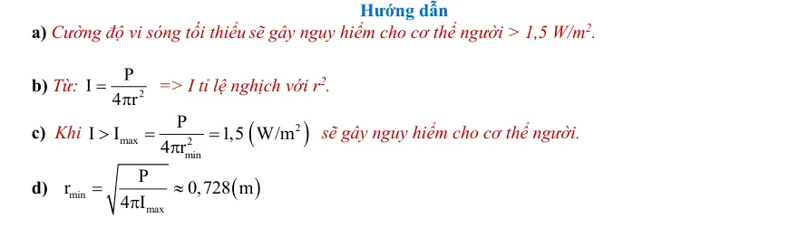

# Đáp án và lời giải — Bài 6 — Sóng điện từ và thang sóng điện từ

> Câu nền tảng được giải vừa đủ để kiểm tra cách làm. Câu vận dụng được trình bày chi tiết hơn để người học thấy được đường suy luận, điều kiện dùng công thức và bước kiểm tra kết quả.

[← Bài tập](exercises.md)

## Câu 1

Chọn **C**. Sóng điện từ không cần môi trường vật chất.

## Câu 2

Chọn **B**. $\lambda=c/f=3\cdot10^8/10^8=3$ m.

## Câu 3

Chọn **B**. Trong mô hình sóng phẳng, $\vec E$, $\vec B$ và phương truyền đôi một vuông góc; $E$ và $B$ dao động cùng pha.

## Câu 4

a) **Đúng**.  
b) **Đúng** vì $c=\lambda f$.  
c) **Sai**: là sóng ngang.  
d) **Đúng**.

## Câu 5

$f=c/\lambda=3\cdot10^8/(600\cdot10^{-9})=5\cdot10^{14}$ Hz.

## Câu 6

$\lambda=3\cdot10^8/(75\cdot10^6)=4$ m.

## Câu 7

$t=s/c=3,6\cdot10^7/(3\cdot10^8)=0,12$ s.

## Câu 8

Tốc độ trong thủy tinh $v=c/n=2,0\cdot10^8$ m/s. Tần số không đổi khi qua mặt phân cách: $f=6,0\cdot10^{14}$ Hz. Bước sóng trong thủy tinh:

$\lambda=v/f=2,0\cdot10^8/(6,0\cdot10^{14})=3,33\cdot10^{-7}$ m $=333$ nm.

---

[← Bài tập](exercises.md)

## Đáp án và lời giải — Ngân hàng PDF mở rộng

> Câu có lời giải trong tài liệu được giữ phần hướng dẫn. Câu trắc nghiệm không kèm lời giải dài chỉ hiện đáp án đã đối chiếu từ dấu đáp án/khóa đáp án của tài liệu.

### Nhận biết — Trả lời ngắn

#### Bài PDF 1

**Đáp án:** 2

Đáp án:
2

Hướng dẫn
8
f
150 MHz 1,5.10 Hz
=
=

Ta có:
8
8
c
3.10
2m.
f
1,5.10
λ=
=
=

#### Bài PDF 2

**Đáp án:** 0

Đáp án:
0
,
4

Hướng dẫn
Bước sóng của ánh sáng khi truyền trong nước:
8
14
c
3.10
0,4 m
f.n
5,6.10 .4/3
λ=
=

μ

#### Bài PDF 3

**Đáp án:** 0

Đáp án:
0
,
1
7

Hướng dẫn
Bước sóng  lớn nhất ứng với tần số nhỏ nhất 1800 MHz  là
8
max
6
1
c
3.10
0,17 m.
f
1800.10
λ
=
=


#### Bài PDF 4

**Đáp án:** 5

Đáp án:
5
0

Hướng dẫn

Ta có
(
)
6
2
2
3
P
P
I
4,2.10
4 r
4
30,0.10
P 50 kW.
−
=

=

π
π


#### Bài PDF 5

**Đáp án:** 2

Đáp án:
2
,
5

Hướng dẫn

Khoảng cách từ Trái Đất đến Mặt Trăng là:
c.t
d
2
=

8
8
2d
2.3,75.10
t
2,5s.
c
3.10
==
=
=

#### Bài PDF 6

**Đáp án:** 3

Đáp án:
3
4
,
6

Hướng dẫn

Thời gian lớn nhất mà sóng truyền hình đi từ đài phát đến Trái Đất chính là thời gian sóng đi từ đài
phát đến vệ tinh sau đó từ vệ tinh truyền về Trái Đất theo phương tiếp tuyến với Trái Đất.
Khoảng cách lớn nhất đó là:
(
)
(
)
2
2
max
2
2
2
2
s
h
AB
h
AO
BO
h
h
R
R
h
h
6400
6400
=
+
=
+
−
=
+
+
−
=
+
+
−

Khoảng thời gian lớn nhất mà sóng truyền hình đi từ đài phát đến vệ tinh rồi quay lại Trái Đất là:
(
)
2
2
max
max
h
h
6400
6400
s
t
c
c
+
+
−
=
=

(
)
2
2
3
5
h
h
6400
6400
0,25
h
34,6.10 km
3.10
+
+
−
=
=
=


#### Bài PDF 7

**Đáp án:** 1

Đáp án:
1
5

Hướng dẫn

Ta có:
8
7
c
3.10
15 m.
f
2.10
λ=
=
=

#### Bài PDF 8

**Đáp án:** 4

Đáp án:
4

Hướng dẫn
Tần số của ánh sáng đỏ trong chân không:
8
14
6
c
3.10
f
4.10 Hz
0,75.10−
=
=
=
λ

#### Bài PDF 9

**Đáp án:** 3

Đáp án:
3
2
,
5

Hướng dẫn
Cường độ sóng mà máy thu vô tuyến ở mặt đất ngay phía dưới vệ tinh thu được
(
)
3
9
2
2
2
2
3
P
50.10
I
32,5.10  W/m
32,5 nW/m .
4 r
4 . 350.10
−
=
=

=
π
π

#### Bài PDF 10

**Đáp án:** 1

Đáp án:
1
2
9
6

Hướng dẫn
(
)
(
)
(
)
8
1
1
1
2
8
2
2
t
3.10
1800 m
2
v
5 m / s
t
t
3.10
17400 m
2

=
=

−


=
=

Δ

=
=

υ
υυ
υ

Khoảng thời gian hai lần đo liên tiếp đúng bằng thời gian quay 1 vòng của rada:
( )
(
)
(
)
1
2
1
1
5
t
T
s
v
360 m / s
1296 km / h
f
0,6
3
t
−
Δ=
=
=
=

=
=
=
Δ
υυ

#### Bài PDF 11

**Đáp án:** 1

Đáp án:
1
0
3

Hướng dẫn
Gọi N là vị trí Rada, r là bán kính mặt phẳng vĩ tuyến (hình tròn). R là bán kính Trái Đất. HA là tiếp
tuyến 16°8’ của đường tròn vĩ tuyến  tại A.

* Từ
(
)
(
)
(
)
0
0
MN
9000 m ;r
R cos16 8';MH
MNcos16 8'
r
cos
0,01393 rad
AM
r
103 km
r
MH

=
=
=

α=
α=

= α=

+


CHƯƠNG II - SÓNG
Chủ đề 11 :  GIAO THOA SÓNG
• Yêu cầu cần đạt (Trích từ CTGDPT Vật lí 2018):
- Thực hiện (hoặc mô tả) được thí nghiệm chứng minh sự giao thoa hai sóng kết hợp bằng dụng cụ thực hành
sử dụng sóng nước (hoặc sóng ánh sáng).
- Phân tích, đánh giá kết quả thu được từ thí nghiệm, nêu được các điều kiện cần thiết để quan sát được hệ vân
giao thoa.
- Vận dụng được biểu thức  i =
λ.D
a    cho giao thoa ánh sáng qua hai khe hẹp.
• Cấu trúc nội dung:
I. TÓM TẮT LÝ THUYẾT …………………………………………………………………
Lý thuyết chung của chủ đề  + Phương pháp giải kèm ví dụ.
II. BÀI TẬP PHÂN DẠNG THEO MỨC ĐỘ………………………………………………..
 (Theo cấu trúc định dạng đề thi kỳ thi tốt nghiệp trung học phổ thông từ năm 2025 – Quyết định số 764/QĐ -
BGDĐT)
1. Câu trắc nhiệm nhiều phương án lựa chọn
2. Câu trắc nghiệm đúng sai:
3. Câu trắc nghiệm trả lời  ngắn :

### Nhận biết — Trắc nghiệm 4 lựa chọn

#### Bài PDF 12

**Đáp án:** A

Đây là câu trắc nghiệm có đáp án được xác định từ khóa đáp án của tài liệu; không có lời giải dài kèm theo trong phần nguồn tương ứng.

#### Bài PDF 13

Hướng dẫn
Ánh sáng chỉ truyền trong chân không với vận tốc v = 3.108 m/s.

#### Bài PDF 14

**Đáp án:** A

Đây là câu trắc nghiệm có đáp án được xác định từ khóa đáp án của tài liệu; không có lời giải dài kèm theo trong phần nguồn tương ứng.

#### Bài PDF 15

**Đáp án:** A

Hướng dẫn
Ta có: P = I.S = I.πR2  R = 1000 km

#### Bài PDF 16

**Đáp án:** B

Hướng dẫn

Do thời gian từ lúc truyền tín hiệu đến lúc nhận lại tín hiệu là 0,28s, nên thời gian tín hiệu truyền từ A
đến M là: 0,28 : 2 = 0,14 (s) Độ dài đoạn AM cũng là quãng đường tín hiệu truyền đi được trong 0,14s
8
S
AM
v.t
3.10 . 0,14
 42.108 m
 42000km
=
=
=
=
=

Vị trí xa nhất trên trái đất có thể có thể nhận tín hiệu từ vệ tinh là vô số điểm M ( với AM là tiếp tuyến
kẻ từ A đến đường tròn tâm O) Vì AM là tiếp tuyến (O) =&gt; OM ⊥ AM tại M, Xét vuông AMO, áp dụng
định lý pitago ta có:
2
2
2
2
2
OA
OM
 MA
6400
42000
1804960000
 OA
42485km
=
+
=
+
=
=
=

Khoảng cách từ vệ tỉnh Vinasat-1 đến mặt đất là độ dài đoạn AH:
AH = AO - OH = 42485 - 6400 = 36085 km

#### Bài PDF 17

**Đáp án:** B

Hướng dẫn
Với vệ tinh địa tĩnh (đứng yên so với Trái Đất), lực hấp dẫn là lực hướng tâm nên:
2
2
3
2
2
GmM
T
m
r
r
GM
T
r
2
π




=

=




π





(
)
2
11
24
3
24.60.60
r
6,67.10
.6.10
42297523,87 m
2
−



=



π



Vùng phủ sóng nằm trong miền giữa hai tiếp tuyến kể từ vệ tinh với Trái Đất.
Từ đó tính được
0
R
cos
81 20
r
ϕ=
ϕ

 Từ kinh độ
0
0
0
30
81 20'
51 20'T
−
+
=
 đến kinh độ
0
0
0
30
81 20'
110 20'
+
=
 Đ.

#### Bài PDF 18

**Đáp án:** B

Đây là câu trắc nghiệm có đáp án được xác định từ khóa đáp án của tài liệu; không có lời giải dài kèm theo trong phần nguồn tương ứng.

#### Bài PDF 19

**Đáp án:** A

Hướng dẫn giải
Loại sóng điện từ ứng với tần số 1018 Hz là tia X.

### Nhận biết — Đúng/Sai

#### Bài PDF 20

Hướng dẫn
a)  Bước sóng của ánh sáng trong chân không là:
7
c
5.10 m
0,5 m
f
−
λ=
=
=
μ

b) Tốc độ ánh sáng khi truyền trong môi trường có chiết suất n là
8
c
v
1,97.10 m/s
n
=


c)  Bước sóng của ánh sáng khi truyền trong trong nước là:
7
n
v
c/n
3,29.10
m
f
f
−
λ=
=


d)  Ánh sáng khi truyền trong khi truyền trong trong nước là tia tử ngoại .

#### Bài PDF 21

{ loading=lazy }
#### Bài PDF 22

Hướng dẫn

a) Lần 1:
8
6
1
1
c.t
3.10 .80.10
d
12000 m
2
2
−
=
=
=
  .
b) Lần 2:
8
6
2
2
c.t
3.10 .84.10
d
12600 m
2
2
−
=
=
=
 .
c)  Quãng đường vật đã đi giữa 2 lần đo: s = d2 – d1 = 600 m.
d)  Tốc độ trung bình của vật: vtb = s/Δt = 600/300 = 2 m/s.

#### Bài PDF 23

Hướng dẫn
a) Bước sóng ứng với tần số 900 MHz  là
8
max
6
1
c
3.10
0,33 m.
f
900.10
λ
=
=


b) Bước sóng ứng với tần số 2600 MHzlà
8
min
6
2
c
3.10
0,17 m.
f
2600.10
λ
=
=


c)  Mắt chúng ta không thể nhìn thấy các sóng này vì bước sóng của chúng không nằm trong dải ánh
sáng nhìn thấy.

d) Theo thang sóng điện từ, sóng điện từ 2G mà điện thoại di động bắt được là sóng vô tuyến.

#### Bài PDF 24

Hướng dẫn
a)  Đúng.
b)  Đúng.
c) Độ dài đoạn AB là
(
)
(
)
2
2
2
2
2
2
AB
AO
BO
h
R
R
36600
6400
6400
42521,1 km.
=
−
=
+
−
=
+
−
=

d)  Khoảng thời gian lớn nhất mà sóng truyền hình đi từ đài phát đến một điểm trên mặt Trái Đất:

(
)
3
DA
AB
8
36600
42521,1 .10
AD
AB
t
t
t
0,264 s.
c
c
3.10
+
=
+
=
+
=
=

### Thông hiểu — Trắc nghiệm 4 lựa chọn

#### Bài PDF 25

**Đáp án:** A

Đây là câu trắc nghiệm có đáp án được xác định từ khóa đáp án của tài liệu; không có lời giải dài kèm theo trong phần nguồn tương ứng.

#### Bài PDF 26

**Đáp án:** B

Hướng dẫn giải
Sóng điện từ có bước sóng 7.10-6m thuộc về tia hồng ngoại.

### Vận dụng — Trắc nghiệm 4 lựa chọn

#### Bài PDF 27

**Đáp án:** C

Hướng dẫn
Theo bài ra ta có 36000 km = 36000000 m
Khi đó thời gian để truyền tín hiệu sóng vô tuyến từ vệ tinh đến anten là:

8
s
36000000
t
0,12s
c
3.10
=
=
=

#### Bài PDF 28

**Đáp án:** C

Hướng dẫn
Bước sóng của sóng vô tuyến đã sử dụng:
Khoảng cách từ Trái Đất đến Mặt Trăng là
8
7
c
3.10
30 m
f
10
λ=
=
=

