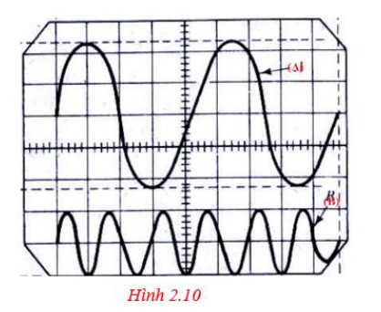
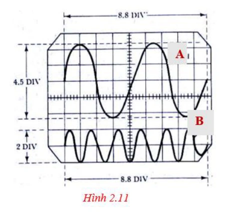
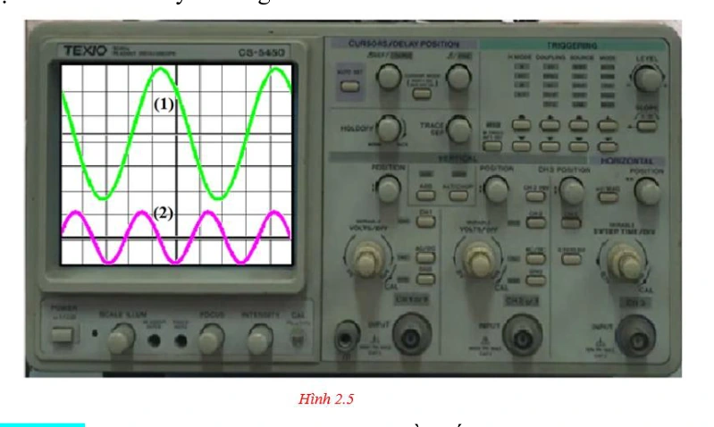
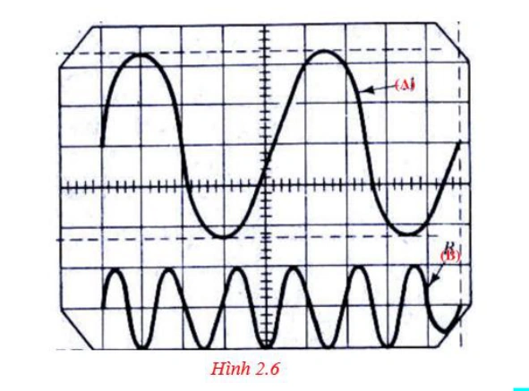
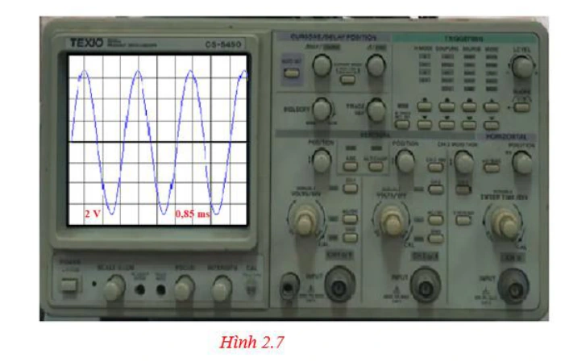
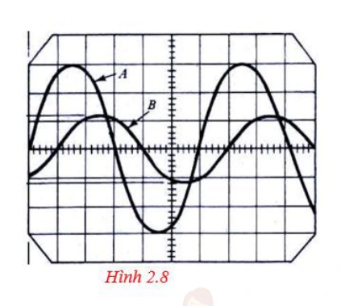
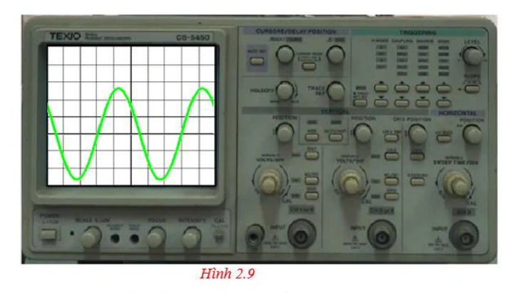
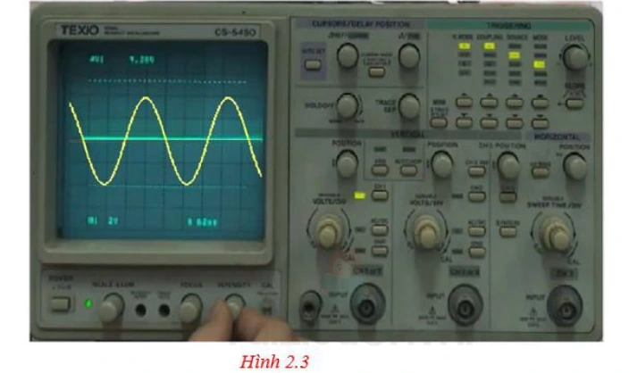
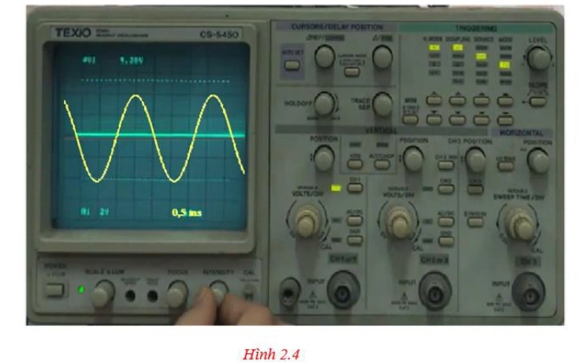
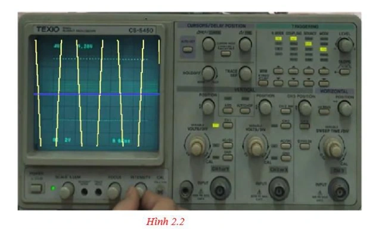

# Bài tập — Bài 8 — Thực hành đo tần số của sóng âm

> Hệ bài tập được biên soạn theo các dạng xuất hiện trong bộ tài liệu Vật lí 11 của dự án. Câu hỏi được giữ ngắn, trực tiếp; độ khó tăng dần và không cố tình thêm dữ kiện gây nhiễu.

[← Trở lại bài học](../../08-practical-sound-frequency.md)

## Phần A — Trắc nghiệm 4 lựa chọn

### Bài 1 — Mức 1 — Nhận biết

Khi đo tần số bằng màn hình dao động kí, nếu $5$ chu kì chiếm $10$ ms thì tần số là

A. $50$ Hz.

B. $100$ Hz.

C. $500$ Hz.

D. $2000$ Hz.

??? success "Đáp án và lời giải"
    Chọn **C**. $T=10\text{ ms}/5=2$ ms, nên $f=1/T=500$ Hz.

### Bài 2 — Mức 1 — Nhận biết

Để giảm sai số khi đo chu kì trên đồ thị, nên

A. chỉ đo một phần rất nhỏ của một chu kì.

B. đo thời gian của nhiều chu kì rồi chia cho số chu kì.

C. bỏ qua đơn vị thời gian.

D. chọn hai điểm bất kì không cùng pha.

??? success "Đáp án và lời giải"
    Chọn **B**. Đo trên nhiều chu kì giúp giảm ảnh hưởng sai số đọc một mốc thời gian.

### Bài 3 — Mức 1 — Nhận biết

Hai đỉnh liên tiếp trên tín hiệu âm cách nhau $0,8$ ms. Tần số gần bằng

A. $125$ Hz.

B. $800$ Hz.

C. $1250$ Hz.

D. $8000$ Hz.

??? success "Đáp án và lời giải"
    Chọn **C**. $f=1/(0,8\cdot10^{-3})=1250$ Hz.

## Phần B — Đúng/Sai

### Bài 4 — Mức 2 — Thông hiểu

Trong thí nghiệm đo tần số âm:

a) Hai điểm dùng để đo một chu kì phải ở cùng trạng thái pha.

b) Đo 10 chu kì thường ổn định hơn đo 1 chu kì.

c) Biên độ tín hiệu quyết định trực tiếp tần số.

d) Cần đổi đúng đơn vị ms sang s trước khi tính Hz.

??? success "Đáp án và lời giải"
    a) **Đúng**.
    b) **Đúng**.
    c) **Sai**.
    d) **Đúng**.

## Phần C — Trả lời ngắn

### Bài 5 — Mức 3 — Vận dụng

Trên màn hình, 8 chu kì chiếm $16,4$ ms. Tính tần số.

??? success "Đáp án và lời giải"
    $T=16,4/8=2,05$ ms $=2,05\cdot10^{-3}$ s. $f=1/T\approx487,8$ Hz.

### Bài 6 — Mức 3 — Vận dụng

Một tín hiệu có tần số danh định $440$ Hz. Nếu đo được $10$ chu kì trong $22,9$ ms, tính tần số đo và sai lệch tương đối so với giá trị danh định.

??? success "Đáp án và lời giải"
    $T=2,29$ ms, nên $f_{đo}=1/0,00229\approx436,7$ Hz. Sai lệch tương đối $\approx|436,7-440|/440\cdot100\%\approx0,75\%$.

### Bài 7 — Mức 3 — Vận dụng

Thang thời gian là $0,5$ ms/ô. Khoảng cách giữa hai đỉnh liên tiếp là $4,8$ ô. Tính tần số.

??? success "Đáp án và lời giải"
    $T=4,8\cdot0,5=2,4$ ms. $f=1/(2,4\cdot10^{-3})\approx416,7$ Hz.

## Phần D — Vận dụng và vận dụng cao

### Bài 8 — Mức 4 — Vận dụng cao

Ba lần đo thời gian của 20 chu kì cho các giá trị $45,2$ ms; $45,6$ ms; $45,4$ ms. Tính tần số từ giá trị trung bình và nêu vì sao nên dùng nhiều chu kì.

??? success "Đáp án và lời giải"
    Thời gian trung bình của 20 chu kì:

    $\bar t=(45,2+45,6+45,4)/3=45,4$ ms.

    $T=45,4/20=2,27$ ms, nên $f\approx1/0,00227\approx440,5$ Hz.

    Đo nhiều chu kì làm sai số đọc mốc thời gian được chia cho số chu kì, nên sai số tương đối của chu kì giảm đáng kể.

## Ngân hàng bài tập mở rộng

### Nhận biết — Trả lời ngắn

#### Bài 9

<!-- source-id: BT-Chuong-II-p85-q1-191 -->

Trong thí nghiệm đo tần số của âm bằng dao động kí điện tử, tần số sóng âm được cho trong bảng sau:

| Lần đo | 1 | 2 | 3 |
| --- | ---: | ---: | ---: |
| Tần số (Hz) | 502 | 498 | 505 |

Giá trị tần số trung bình của sóng âm này xấp xỉ bao nhiêu Hz? (Làm tròn đến chữ số hàng đơn vị.)

??? success "Đáp án và lời giải"
    **Đáp án:** $502$
    **Hướng dẫn giải:**

    Xác định chu kì từ số dao động hoặc đồ thị rồi dùng $f=1/T$; chú ý đổi mili giây, micro giây về giây trước khi tính.

    Giá trị tần số trung bình là

    Vậy kết quả cần tìm là **$502$**.
#### Bài 10

<!-- source-id: BT-Chuong-II-p85-q2-192 -->

Trong thí nghiệm đo tần số âm. Một học sinh ghi nhận được một bảng số liệu về chu kì dao động âm như sau:

| | Lần 1 | Lần 2 | Lần 3 |
|---|---:|---:|---:|
| Chu kì (ms) | 1,6 | 1,9 | 1,8 |

Giá trị trung bình của tần số trong thí nghiệm này xấp xỉ bao nhiêu Hz? (Làm tròn đến chữ số hàng đơn vị)

??? success "Đáp án và lời giải"
    **Đáp án:** $566$
    **Hướng dẫn giải:**
    Chu kì trung bình:
    $\overline T=\dfrac{1{,}6+1{,}9+1{,}8}{3}\approx1{,}77\,\mathrm{ms}=1{,}77\times10^{-3}\,\mathrm{s}$.
    Tần số trung bình:
    $\overline f=\dfrac1{\overline T}\approx566\,\mathrm{Hz}$.

    Vậy kết quả cần tìm là **$566$**.
#### Bài 11

<!-- source-id: BT-Chuong-II-p86-q3-193 -->

Một học sinh ghi nhận được một bảng số liệu về chu kì dao động âm trong một thí nghiệm đo tần số âm như sau:

| | Lần 1 | Lần 2 | Lần 3 |
|---|---:|---:|---:|
| Chu kì (ms) | 1,5 | 1,2 | 1,4 |

Sai số tuyệt đối của tần số trong thí nghiệm này xấp xỉ bao nhiêu Hz? (Làm tròn đến chữ số hàng đơn vị)

??? success "Đáp án và lời giải"
    **Đáp án:** $63$
    **Hướng dẫn giải:**
    Các tần số đo được:
    $f_1=1/T_1\approx666{,}67\,\mathrm{Hz}$, $f_2\approx833{,}33\,\mathrm{Hz}$, $f_3\approx714{,}29\,\mathrm{Hz}$.
    Tần số trung bình:
    $\overline f=\dfrac{f_1+f_2+f_3}{3}\approx738{,}01\,\mathrm{Hz}$.
    Sai số tuyệt đối trung bình:
    $\overline{\Delta f}=\dfrac{|666{,}67-738{,}01|+|833{,}33-738{,}01|+|714{,}29-738{,}01|}{3}\approx63\,\mathrm{Hz}$.

    Vậy kết quả cần tìm là **$63$**.
#### Bài 12

<!-- source-id: BT-Chuong-II-p86-q4-194 -->

Tần số của một nguồn âm trong một thí nghiệm được ghi lại trong bảng sau:

| Lần đo | 1 | 2 | 3 | 4 |
| --- | ---: | ---: | ---: | ---: |
| Tần số (Hz) | 475 | 485 | 462 | 472 |

Sai số tỉ đối của tần số trong thí nghiệm xấp xỉ bao nhiêu %? (Làm tròn đến hai chữ số thập phân.)

??? success "Đáp án và lời giải"
    **Đáp án:** $1{,}37$

    **Hướng dẫn giải:**
    Tần số trung bình:
    $\overline f=\dfrac{475+485+462+472}{4}=473{,}5\,\mathrm{Hz}$.
    Sai số tuyệt đối trung bình:
    $\overline{\Delta f}=\dfrac{|475-473{,}5|+|485-473{,}5|+|462-473{,}5|+|472-473{,}5|}{4}=6{,}5\,\mathrm{Hz}$.
    Sai số tỉ đối:
    $\delta_f=\dfrac{\overline{\Delta f}}{\overline f}\cdot100\%\approx1{,}37\%$.
#### Bài 13

<!-- source-id: BT-Chuong-II-p87-q5-195 -->

Dao động kí điện tử đo cùng lúc hai tín hiệu âm tần ở hai kênh CH1 (âm thoa A) và kênh CH2
(âm thoa B). Đồ thị tín hiệu cho bởi hình 2.10 Tần số dao động của âm thoa B bằng bao nhiêu lần tần
số dao động của âm thoa A?

{ loading=lazy }

??? success "Đáp án và lời giải"
    **Đáp án:** 3
    **Hướng dẫn giải:**

    Xác định chu kì từ số dao động hoặc đồ thị rồi dùng $f=1/T$; chú ý đổi mili giây, micro giây về giây trước khi tính.

    Trong cùng một khoảng thời gian, sóng A chỉ có 2 dao động, trong khi sóng B có 6 dao động. Vậy số
    dao động của sóng B gấp 3 lần số dao động của sóng A. Vậy tần số

    Vậy kết quả cần tìm là **3**.
#### Bài 14

<!-- source-id: BT-Chuong-II-p87-q6-196 -->

Dạng sóng của một tín hiệu âm có dạng như hình 2.11 dưới đây. Biết dao động kí đang chọn ở
thang đo . Biết rằng một ô trong màn hình gọi là một div có giá trị 2,5 volt/div và 1,2 ms.
Hiệu số giữa tần số dao động của tín hiệu B và tần số của tín hiệu A là bao nhiêu Hz? (làm tròn đến
chữ số hàng đơn vị)

{ loading=lazy }

??? success "Đáp án và lời giải"
    **Đáp án:** $379$
    **Hướng dẫn giải:**

    Xác định chu kì từ số ô trên dao động kí rồi dùng $f=1/T$; đổi mili giây về giây trước khi tính.

    Chu kì tín hiệu A: $T_A=4{,}4\cdot1{,}2\times10^{-3}=0{,}00528\,\mathrm{s}$.

    Chu kì tín hiệu B: $T_B=(8{,}8/6)\cdot1{,}2\times10^{-3}=0{,}00176\,\mathrm{s}$.

    Hiệu hai tần số xấp xỉ $568-189=379\,\mathrm{Hz}$.

    Vậy kết quả cần tìm là **$379$**.

#### Bài 15

<!-- source-id: BT-Chuong-II-p76-q1-159 -->

Một đại lượng $A$ được đo trong $n$ lần có giá trị lần lượt là $A_1,A_2,\ldots,A_n$. Giá trị trung bình của đại lượng $A$ là

A. $\overline A=\dfrac{A_1+A_2+\cdots+A_n}{n}$.

B. $\overline A=\dfrac{A_1-A_2+\cdots+A_m}{m}$.

C. $\overline A=\dfrac{A_1-A_2-\cdots-A_2}{n}$.

D. $\overline A=\dfrac{A_1+A_2-\cdots-A_n}{n}$.

??? success "Đáp án và lời giải"
    **Đáp án:** A.

    **Hướng dẫn giải:**
    Giá trị trung bình của $n$ lần đo là
    $\overline A=\dfrac{A_1+A_2+\cdots+A_n}{n}$.

    !!! warning "Đối chiếu nguồn"
        PDF in nhầm số hạng cuối ở phương án A thành $A_2$. Ký hiệu được sửa thành $A_n$; đây là công thức mà phương án đúng của nguồn muốn biểu diễn.

#### Bài 16

<!-- source-id: BT-Chuong-II-p76-q2-160 -->

Một đại lượng $A$ được đo trong $n$ lần có giá trị lần lượt là $A_1,A_2,\ldots,A_n$. Sai số tuyệt đối trung bình của $n$ lần đo là

A. $A=\overline A\pm\Delta A$.

B. $\delta A=\dfrac{\Delta A}{\overline A}\cdot100\%$.

C. $\overline A=\dfrac{A_1+A_2+\cdots+A_n}{n}$.

D. $\overline{\Delta A}=\dfrac{\Delta A_1+\Delta A_2+\cdots+\Delta A_n}{n}$.

??? success "Đáp án và lời giải"
    **Đáp án:** D
    **Hướng dẫn giải:**

    Xác định chu kì từ số dao động hoặc đồ thị rồi dùng $f=1/T$; chú ý đổi mili giây, micro giây về giây trước khi tính.

    Đối chiếu kết quả với các lựa chọn, phương án phù hợp là **D. $\overline{\Delta A}=\dfrac{\Delta A_1+\Delta A_2+\cdots+\Delta A_n}{n}$.**
#### Bài 17

<!-- source-id: BT-Chuong-II-p76-q3-161 -->

Một đại lượng $A$ được đo trong $n$ lần có giá trị lần lượt là $A_1,A_2,\ldots,A_n$. Gọi $\overline{\Delta A}$, $\overline A$ là sai số tuyệt đối trung bình và giá trị trung bình của đại lượng $A$. Sai số tỉ đối của phép đo là

A. $\delta A=\dfrac{\overline{\Delta A}}{\overline A}\cdot100\%$.

B. $\delta A=\dfrac{\Delta A}{\overline A}\cdot100\%$.

C. $\delta A=\dfrac{\overline A}{\Delta A}\cdot100\%$.

D. $\delta A=\dfrac{\Delta A'}{\overline A}\cdot100\%$.

??? success "Đáp án và lời giải"
    **Đáp án:** A.

    **Hướng dẫn giải:**
    Sai số tỉ đối của phép đo được tính bởi
    $\delta A=\dfrac{\overline{\Delta A}}{\overline A}\cdot100\%$.

    !!! warning "Đối chiếu nguồn"
        Trong câu dẫn PDF, dấu gạch trên $\Delta A$ bị thiếu/không nhất quán với tên “sai số tuyệt đối trung bình” và với chính phương án A. Ký hiệu được chuẩn hóa thành $\overline{\Delta A}$.

#### Bài 18

<!-- source-id: BT-Chuong-II-p76-q4-162 -->

Đo một đại lượng $A$ trong $n$ lần. Gọi $\overline A$ là giá trị trung bình của đại lượng $A$ sau $n$ lần đo và $\Delta A$ là sai số tuyệt đối trung bình. Kết quả thí nghiệm của đại lượng $A$ được biểu diễn là

A. $A=\overline A\pm\Delta A$.

B. $A=\overline A\,\Delta A$.

C. $A=\dfrac{\overline A}{\Delta A}$.

D. $A=\Delta A\pm\overline A$.

??? success "Đáp án và lời giải"
    **Đáp án:** A
    **Hướng dẫn giải:**

    Xác định chu kì từ số dao động hoặc đồ thị rồi dùng $f=1/T$; chú ý đổi mili giây, micro giây về giây trước khi tính.

    Đối chiếu kết quả với các lựa chọn, phương án phù hợp là **A. $A=\overline A\pm\Delta A$.**
#### Bài 19

<!-- source-id: BT-Chuong-II-p76-q5-163 -->

Đại lượng chu kì $T$ được đo trong $n$ lần có giá trị $T_1,T_2,\ldots,T_n$. Giá trị trung bình của $T$ là 20,5 s. Sai số tỉ đối là 5,2 %. Sai số tuyệt đối của phép đo xấp xỉ là

A. 1,02 s.

B. 2,01 s.

C. 1,07 s.

D. 2,07 s.

??? success "Đáp án và lời giải"
    **Đáp án:** C
    **Hướng dẫn giải:**

    Xác định chu kì từ số dao động hoặc đồ thị rồi dùng $f=1/T$; chú ý đổi mili giây, micro giây về giây trước khi tính.

    Đối chiếu kết quả với các lựa chọn, phương án phù hợp là **C. 1,07 s.**
#### Bài 20

<!-- source-id: BT-Chuong-II-p81-q26-184 -->

Màn hình dao động kí điện tử đo ở hai kênh CH1 và kênh CH 2 có đồ thị tín hiệu như hình
2.5 dưới đây. Nhận xét nào sau đây là đúng?

{ loading=lazy }

A. Tần số f2 = 1,75.f1.

B. Tần số f1 = 1,75.f2.

C. Hai dao động cùng tần số.

D. Dao động (1) trễ pha hơn dao động (2).

??? success "Đáp án và lời giải"
    **Đáp án:** A
    **Hướng dẫn giải:**

    Xác định chu kì từ số dao động hoặc đồ thị rồi dùng $f=1/T$; chú ý đổi mili giây, micro giây về giây trước khi tính.

    Đối chiếu kết quả với các lựa chọn, phương án phù hợp là **A. Tần số f2 = 1,75.f1.**
#### Bài 21

<!-- source-id: BT-Chuong-II-p81-q27-185 -->

Trong một thí nghiệm đo tốc độ truyền âm, ngưới ta đo được sai số tỉ đối của tần số là 5% và
sai số tỉ đối của bước sóng là 4%. Các bạn học sinh đo được tốc độ trung bình trong thí nghiệm là 334
m/s. Sai số tuyệt đối của tốc độ truyền âm trong thí nghiệm xấp xỉ là

A. 483 m/s.

B. 30 m/s.

C. 53 m/s.

D. 13 m/s.

??? success "Đáp án và lời giải"
    **Đáp án:** B
    **Hướng dẫn giải:**
    Với $v=f\lambda$, sai số tỉ đối gần đúng thỏa
    $\dfrac{\Delta v}{v}=\dfrac{\Delta f}{f}+\dfrac{\Delta\lambda}{\lambda}=0{,}05+0{,}04=0{,}09$.
    Suy ra $\Delta v\approx0{,}09\cdot334\approx30\,\mathrm{m/s}$.
#### Bài 22

<!-- source-id: BT-Chuong-II-p82-q28-186 -->

Khi đo tần số âm của một âm thoa A, các bạn học sinh đã xác định được tần số sóng âm đo
nguồn A là 256 Hz. Thay âm thoa A bằng âm thoa B thì đồ thị tín hiệu hai âm được cho như hình 2.6.
Tần số âm B xấp xỉ

{ loading=lazy }

A. 85 Hz.

B. 128 Hz.

C. 512 Hz.

D. 768 Hz.

??? success "Đáp án và lời giải"
    **Đáp án:** D
    **Hướng dẫn giải:**

    Xác định chu kì từ số dao động hoặc đồ thị rồi dùng $f=1/T$; chú ý đổi mili giây, micro giây về giây trước khi tính.

    Đối chiếu kết quả với các lựa chọn, phương án phù hợp là **D. 768 Hz.**
### Nhận biết — Đúng/Sai

#### Bài 23

<!-- source-id: BT-Chuong-II-p82-q1-187 -->

Để thiết kế một âm thoa để chuẩn nốt Sol G4 trên đán Piano, người ta dùng thí nghiệm đo tần
số âm. Hình dạng tín hiệu trên màn hình dao động kí của tín hiệu như hình 2.7 dưới đây. Biết tốc độ
truyền âm trong không khí là 340 m/s.

{ loading=lazy }

a) Để đồ thị rõ nét, cần chỉnh núm Intensity trên máy dao động kí điện tử.

b) Tần số sóng âm nốt Sol G4 xấp xỉ 392 Hz.

c) Bước sóng của sóng âm xấp xỉ 0,57 m.

d) Tín hiệu điện của máy phát tần số có biên độ xấp xỉ 7 V.

??? success "Đáp án và lời giải"
    **Đáp án:** a) Sai; b) Đúng; c) Sai; d) Đúng.

    **Hướng dẫn giải:**
    a) Núm Focus dùng chỉnh độ nét; Intensity chủ yếu chỉnh độ sáng vệt, nên a) Sai.

    b) Một chu kì khoảng 3 ô, mỗi ô $0{,}85\,\mathrm{ms}$: $T\approx2{,}55\,\mathrm{ms}$, nên $f\approx1/T\approx392\,\mathrm{Hz}$.

    c) $\lambda=v/f\approx340/392\approx0{,}867\,\mathrm{m}$, không phải $0{,}57\,\mathrm{m}$.

    d) Biên độ tín hiệu khoảng $3{,}5$ ô, mỗi ô $2\,\mathrm{V}$, nên $U\approx7\,\mathrm{V}$.

#### Bài 24

<!-- source-id: BT-Chuong-II-p83-q2-188 -->

Trong thí nghiệm đo tần số âm, một âm thoa được đặt trước một micro của thí nghiệm.

a) Sóng từ âm thoa truyền tới micro là sóng điện từ.

b) Micro được nối với dao động kí điện tử.

c) Dây tín hiệu phải được nối từ máy phát cao tần vào Input của kênh CH.

d) Việc điều chỉnh núm Timer là thay đổi tần số tín hiệu dao động âm.

??? success "Đáp án và lời giải"
    **Đáp án:** a) Sai; b) Đúng; c) Sai; d) Sai.

    **Hướng dẫn giải:**
    a) Sóng từ âm thoa đến micro là sóng âm cơ học, không phải sóng điện từ.

    b) Micro biến dao động âm thành tín hiệu điện; để quan sát tín hiệu, đầu ra micro phải nối với ngõ vào dao động kí.

    c) Với phép đo dùng âm thoa và micro như đề mô tả, tín hiệu cần quan sát đi từ micro đến dao động kí, không phải từ máy phát cao tần vào kênh CH.

    d) Núm Timer/Time-div chỉ thay đổi thang thời gian hiển thị của dao động kí, không làm thay đổi tần số âm.

    !!! warning "Đối chiếu nguồn"
        PDF đánh b) Sai và c) Đúng, nhưng hai kết luận đó không phù hợp với chính cấu hình “âm thoa đặt trước micro” của đề. Đáp án được sửa theo chức năng của micro và dao động kí trong phép đo này.

#### Bài 25

<!-- source-id: BT-Chuong-II-p83-q3-189 -->

Trên màn hình một dao động kí điện tử có tín hiệu của hai nguồn âm A và B. Hình dạng hai tín hiệu như hình 2.8 dưới đây.

{ loading=lazy }

a) Hai nguồn âm có cùng độ to.

b) Âm do hai nguồn phát ra có cùng tần số.

c) Âm do nguồn A phát ra to hơn âm của nguồn B.

d) Nguồn âm A dao động sớm pha hơn nguồn âm B.

??? success "Đáp án và lời giải"
    **Đáp án:** a) Sai; b) Đúng; c) Đúng; d) Đúng.

    **Hướng dẫn giải:**
    a) Biên độ tín hiệu A lớn hơn B nên độ to không như nhau.
    b) Trong cùng khoảng thời gian, A và B thực hiện cùng số dao động nên có cùng tần số.
    c) Biên độ A lớn hơn nên âm A to hơn.
    d) Ở cùng mốc thời gian, pha của A đi trước B; A sớm pha hơn B.

#### Bài 26

<!-- source-id: BT-Chuong-II-p84-q4-190 -->

Màn hình dao động kí điện tử ghi nhận xung tín hiệu âm tần có hình dạng như hình 2.9 dưới
đây. Biết mỗi ô trên màn hình ứng với 1,5 V (1,5 volt/div), thời gian 0,5 ms.
(Biết rằng 1 ô = 1 div)

{ loading=lazy }

a) Để điều chỉnh đồ thị lên giữa màn hình, các bạn học sinh xoay núm position ⇕.

b) Sóng từ nguồn đến là dạng sóng hình sin.

c) Chu kì dao động của sóng âm tần này là 2,5 ms.

d) Biên độ tín hiệu có độ lớn xấp xỉ 6 V.

??? success "Đáp án và lời giải"
    **Đáp án:** a) Đúng; b) Đúng; c) Đúng; d) Sai.

    **Hướng dẫn giải:**
    a) Núm Position theo phương đứng dùng dịch vệt lên/xuống màn hình.
    b) Dạng tín hiệu là hình sin.
    c) Một chu kì dài 5 ô, mỗi ô $0{,}5\,\mathrm{ms}$, nên $T=2{,}5\,\mathrm{ms}$.
    d) Khoảng đỉnh-đỉnh khoảng $5{,}4$ ô, tương ứng $8{,}1\,\mathrm{V}$. Biên độ là một nửa: $A\approx4{,}05\,\mathrm{V}$, không phải $6\,\mathrm{V}$.

### Thông hiểu — Trắc nghiệm 4 lựa chọn

#### Bài 27

<!-- source-id: BT-Chuong-II-p78-q19-177 -->

Trong thí nghiệm đo tần số âm, tín hiệu truyền từ máy phát tần số sang dao động kí điện tử là

A. sóng âm do âm thoa phát ra.

B. sóng cơ học do âm thoa phát ra.

C. tín hiệu điện mang tần số sóng âm.

D. sóng điện từ.

??? success "Đáp án và lời giải"
    **Đáp án:** C
    **Hướng dẫn giải:**

    Xác định chu kì từ số dao động hoặc đồ thị rồi dùng $f=1/T$; chú ý đổi mili giây, micro giây về giây trước khi tính.

    Đối chiếu kết quả với các lựa chọn, phương án phù hợp là **C. tín hiệu điện mang tần số sóng âm.**
#### Bài 28

<!-- source-id: BT-Chuong-II-p78-q20-178 -->

Đồ thị tín hiệu trên máy dao động kí điện tử, chu kì là khoảng cách

A. giữa hai vị trí cân bằng liên tiếp.

B. giữa ba vị trí cân bằng liên tiếp.

C. giữa bốn vị trí cân bằng liên tiếp.

D. giữa 5 vị trí cân bằng liên tiếp.
??? success "Đáp án và lời giải"
    **Đáp án:** B
    **Hướng dẫn giải:**

    Xác định chu kì từ số dao động hoặc đồ thị rồi dùng $f=1/T$; chú ý đổi mili giây, micro giây về giây trước khi tính.

    Đối chiếu kết quả với các lựa chọn, phương án phù hợp là **B. giữa ba vị trí cân bằng liên tiếp.**
#### Bài 29

<!-- source-id: BT-Chuong-II-p78-q21-179 -->

Khi thực hành thí nghiệm đo tấn số âm, học sinh phải tiến hành gõ vào âm thoa để tạo dao
động âm trong ít nhất 3 lần. Một học sinh lần lượt gõ vào âm thoa với lực gõ tăng dần thì khoảng cách
giữa

A. các vị trí cân bằng tăng lên.

B. các vị trí cân bằng giảm đi.

C. biên dương và biên âm giảm đi.

D. biên dương và biên âm tăng lên.

??? success "Đáp án và lời giải"
    **Đáp án:** D
    **Hướng dẫn giải:**

    Xác định chu kì từ số dao động hoặc đồ thị rồi dùng $f=1/T$; chú ý đổi mili giây, micro giây về giây trước khi tính.

    Đối chiếu kết quả với các lựa chọn, phương án phù hợp là **D. biên dương và biên âm tăng lên.**
#### Bài 30

<!-- source-id: BT-Chuong-II-p78-q22-180 -->

Trong màn hình biên độ dao động kí điện tử, đồ thị tín hiệu có biên độ (tính theo đơn vị ô li) là

{ loading=lazy }

A. 4 ô.

B. 3 ô.

C. 2 ô.

D. 1 ô.

??? success "Đáp án và lời giải"
    **Đáp án:** C
    **Hướng dẫn giải:**
    Khoảng cách từ biên dương đến biên âm là 4 ô li, tương ứng $2A=4$ ô.
    Suy ra $A=2$ ô.
#### Bài 31

<!-- source-id: BT-Chuong-II-p79-q23-181 -->

Trong hình 2.4 , thời gian tính theo ms, tần số của dao động của tín hiệu âm xấp xỉ là

{ loading=lazy }

A. 512 Hz.

B. 375 Hz.

C. 725 Hz.

D. 465 Hz.

??? success "Đáp án và lời giải"
    **Đáp án:** D. $465\,\mathrm{Hz}$.

    **Hướng dẫn giải:**
    Từ Hình 2.4, một chu kì dài khoảng $4{,}3$ ô và thang thời gian là $0{,}5\,\mathrm{ms/div}$.
    Do đó $T\approx4{,}3\cdot0{,}5\times10^{-3}=2{,}15\times10^{-3}\,\mathrm{s}$,
    $f=1/T\approx465\,\mathrm{Hz}$.

    !!! warning "Đối chiếu nguồn"
        Một dòng hướng dẫn PDF ghi nhầm $0{,}2\,\mathrm{ms/div}$ nhưng ngay phép nhân và hình đều dùng $0{,}5\,\mathrm{ms/div}$.

#### Bài 32

<!-- source-id: BT-Chuong-II-p79-q24-182 -->

Dùng dao động kí điện tử để đo chu kì một sóng âm. Chu kì của sóng âm sau 5 lần đo có giá trị được cho trong bảng sau:

| Lần đo | 1 | 2 | 3 | 4 | 5 |
| --- | ---: | ---: | ---: | ---: | ---: |
| Chu kì (ms) | 2,2 | 2,5 | 2,1 | 2,4 | 2,3 |

Sai số tuyệt đối trung bình của chu kì sóng âm là

A. 0,12 ms.

B. 0 ms.

C. 0,15 ms.

D. 0,10 ms.

??? success "Đáp án và lời giải"
    **Đáp án:** A
    **Hướng dẫn giải:**
    Giá trị trung bình:
    $\overline T=\dfrac{2{,}2+2{,}5+2{,}1+2{,}4+2{,}3}{5}=2{,}3\,\mathrm{ms}$.
    Các độ lệch tuyệt đối lần lượt là $0{,}1;0{,}2;0{,}2;0{,}1;0{,}0\,\mathrm{ms}$.
    Sai số tuyệt đối trung bình:
    $\overline{\Delta T}=\dfrac{0{,}1+0{,}2+0{,}2+0{,}1+0}{5}=0{,}12\,\mathrm{ms}$.

    Đối chiếu kết quả với các lựa chọn, phương án phù hợp là **A. 0,12 ms.**
### Vận dụng — Trắc nghiệm 4 lựa chọn

#### Bài 33

<!-- source-id: BT-Chuong-II-p76-q6-164 -->

Khi đo tốc độ sóng âm, các em học sinh vận dụng công thức $v=f\lambda$. Trong đó tốc độ, bước sóng và tần số có giá trị trung bình lần lượt là $\overline v,\overline\lambda,\overline f$. Sai số tuyệt đối trung bình lần lượt là $\overline{\Delta v},\overline{\Delta\lambda},\overline{\Delta f}$. Hệ thức đúng là

A. $\dfrac{\overline{\Delta v}}{\overline v}=\dfrac{\overline{\Delta f}}{\overline f}+\dfrac{\overline{\Delta\lambda}}{\overline\lambda}$.

B. $\dfrac{\overline{\Delta v}}{\overline v}=\dfrac{\overline{\Delta f}}{\overline f}\cdot\dfrac{\overline{\Delta\lambda}}{\overline\lambda}$.

C. $\dfrac{\overline{\Delta v}}{\overline v}=\dfrac{\overline{\Delta f}}{\overline f}-\dfrac{\overline{\Delta\lambda}}{\overline\lambda}$.

D. $\dfrac{\overline{\Delta v}}{\overline v}=\dfrac{\overline{\Delta f}}{\overline f}+\dfrac{\overline\lambda}{\overline{\Delta\lambda}}$.

??? success "Đáp án và lời giải"
    **Đáp án:** A
    **Hướng dẫn giải:**

    Xác định chu kì từ số dao động hoặc đồ thị rồi dùng $f=1/T$; chú ý đổi mili giây, micro giây về giây trước khi tính.

    Đối chiếu kết quả với các lựa chọn, phương án phù hợp là **A. $\dfrac{\overline{\Delta v}}{\overline v}=\dfrac{\overline{\Delta f}}{\overline f}+\dfrac{\overline{\Delta\lambda}}{\overline\lambda}$.**
#### Bài 34

<!-- source-id: BT-Chuong-II-p77-q8-166 -->

Trong các thiết bị sử dụng trong thí nghiệm đo tần số âm, thiết bị biến đổi dao động âm thành
dao động điện là

A. dao động kí điện tử.

B. micro.

C. âm thoa.

D. máy phát tần số.

??? success "Đáp án và lời giải"
    **Đáp án:** B
    **Hướng dẫn giải:**

    Xác định chu kì từ số dao động hoặc đồ thị rồi dùng $f=1/T$; chú ý đổi mili giây, micro giây về giây trước khi tính.

    Đối chiếu kết quả với các lựa chọn, phương án phù hợp là **B. micro.**
#### Bài 35

<!-- source-id: BT-Chuong-II-p77-q9-167 -->

Trong các thiết bị sử dụng trong thí nghiệm đo tần số âm, đồ thị tín hiệu hiển thị trên thiết bị

A. âm thoa.

B. dao động kí điện tử.

C. máy phát tần số.

D. micro.
??? success "Đáp án và lời giải"
    **Đáp án:** B
    **Hướng dẫn giải:**

    Xác định chu kì từ số dao động hoặc đồ thị rồi dùng $f=1/T$; chú ý đổi mili giây, micro giây về giây trước khi tính.

    Đối chiếu kết quả với các lựa chọn, phương án phù hợp là **B. dao động kí điện tử.**
#### Bài 36

<!-- source-id: BT-Chuong-II-p77-q10-168 -->

Trong thí nghiệm đo tần số âm, que đo tín hiệu nối giữa hai thiết bị

A. máy phát tần số và dao động kí điện tử.

B. máy phát tần số và micro.

C. micro và dao động kí điện tử.

D. âm thoa và micro.

??? success "Đáp án và lời giải"
    **Đáp án:** A
    **Hướng dẫn giải:**

    Xác định chu kì từ số dao động hoặc đồ thị rồi dùng $f=1/T$; chú ý đổi mili giây, micro giây về giây trước khi tính.

    Đối chiếu kết quả với các lựa chọn, phương án phù hợp là **A. máy phát tần số và dao động kí điện tử.**
#### Bài 37

<!-- source-id: BT-Chuong-II-p77-q11-169 -->

Trong thí nghiệm đo tần số âm, sóng âm được tạo ra từ

A. dao động kí điện tử.

B. máy phát tần số.

C. âm thoa.

D. micro.

??? success "Đáp án và lời giải"
    **Đáp án:** C
    **Hướng dẫn giải:**

    Xác định chu kì từ số dao động hoặc đồ thị rồi dùng $f=1/T$; chú ý đổi mili giây, micro giây về giây trước khi tính.

    Đối chiếu kết quả với các lựa chọn, phương án phù hợp là **C. âm thoa.**
#### Bài 38

<!-- source-id: BT-Chuong-II-p77-q12-170 -->

Khi màn hình máy dao động kí quá sáng. Để giảm độ sáng của màn hình trên dao động kí điện
tử, học sinh phài điều chỉnh núm

A. scale illum.

B. núm focus.

C. núm intensity.

D. núm position ⇕.
??? success "Đáp án và lời giải"
    **Đáp án:** A
    **Hướng dẫn giải:**

    Xác định chu kì từ số dao động hoặc đồ thị rồi dùng $f=1/T$; chú ý đổi mili giây, micro giây về giây trước khi tính.

    Đối chiếu kết quả với các lựa chọn, phương án phù hợp là **A. scale illum.**
#### Bài 39

<!-- source-id: BT-Chuong-II-p77-q13-171 -->

Khi đồ thị tín hiệu quá tối. Để tăng độ sáng của đồ thị biểu diễn tín hiệu trên dao động kí điện
tử, học sinh phài điều chỉnh núm

A. scale illum.

B. núm focus.

C. núm intensity.

D. núm position ⇔.
??? success "Đáp án và lời giải"
    **Đáp án:** C
    **Hướng dẫn giải:**

    Xác định chu kì từ số dao động hoặc đồ thị rồi dùng $f=1/T$; chú ý đổi mili giây, micro giây về giây trước khi tính.

    Đối chiếu kết quả với các lựa chọn, phương án phù hợp là **C. núm intensity.**
#### Bài 40

<!-- source-id: BT-Chuong-II-p77-q14-172 -->

Khi đồ thị tín hiệu bị nhòe, không rõ nét. Để tăng độ nét của đồ thị biểu diễn tín hiệu trên dao
động kí điện tử, học sinh phài điều chỉnh núm

A. scale illum.

B. núm focus.

C. núm intensity.

D. núm position ⇕.
??? success "Đáp án và lời giải"
    **Đáp án:** B
    **Hướng dẫn giải:**

    Xác định chu kì từ số dao động hoặc đồ thị rồi dùng $f=1/T$; chú ý đổi mili giây, micro giây về giây trước khi tính.

    Đối chiếu kết quả với các lựa chọn, phương án phù hợp là **B. núm focus.**
#### Bài 41

<!-- source-id: BT-Chuong-II-p77-q15-173 -->

Khi đồ thị tín hiệu trên màn hình bị lệch phải. Để dịch chuyển đồ thị tín hiệu sang trái, học
sinh phải xoay núm

A. núm position ⇕.

B. núm position ⇔.

C. núm time.

D. núm volt.
??? success "Đáp án và lời giải"
    **Đáp án:** B
    **Hướng dẫn giải:**

    Xác định chu kì từ số dao động hoặc đồ thị rồi dùng $f=1/T$; chú ý đổi mili giây, micro giây về giây trước khi tính.

    Đối chiếu kết quả với các lựa chọn, phương án phù hợp là **B. núm position ⇔.**
#### Bài 42

<!-- source-id: BT-Chuong-II-p77-q16-174 -->

Để chuẩn tín hiệu trong máy dao động kí, ta dụng dây tín hiệu cắm một đầu jack vào cổng
input của kênh đo CH. Đầu móc của dây tín hiệu nối vào

A. khe mode trên dao động kí điện tử.

B. out put của máy phát tần số.

C. cắm vào âm thoa.

D. cắm vào khe cal trên dao động kí điện tử.

??? success "Đáp án và lời giải"
    **Đáp án:** D
    **Hướng dẫn giải:**

    Xác định chu kì từ số dao động hoặc đồ thị rồi dùng $f=1/T$; chú ý đổi mili giây, micro giây về giây trước khi tính.

    Đối chiếu kết quả với các lựa chọn, phương án phù hợp là **D. cắm vào khe cal trên dao động kí điện tử.**
#### Bài 43

<!-- source-id: BT-Chuong-II-p78-q18-176 -->

Trong thí nghiệm đo tần số âm, nếu biên độ tín hiệu quá lớn, vượt ra khỏi màn hình dao động
kí như hình 2.2 dưới đây. Để điều chỉnh cho độ cao biên độ giảm xuống, các bạn học sinh dùng núm
nào?

{ loading=lazy }

A. Núm Auto sét.

B. Núm Volt.

C. Núm Position.

D. Núm Time.

??? success "Đáp án và lời giải"
    **Đáp án:** B
    **Hướng dẫn giải:**

    Xác định chu kì từ số dao động hoặc đồ thị rồi dùng $f=1/T$; chú ý đổi mili giây, micro giây về giây trước khi tính.

    Đối chiếu kết quả với các lựa chọn, phương án phù hợp là **B. Núm Volt.**
#### Bài 44

<!-- source-id: BT-Chuong-II-p81-q25-183 -->

Một học sinh tại trường THPT Ngô Quyền thực hiện thí nghiệm đo tần số âm từ một âm thoa. Sau 04 lần đo bạn đã ghi nhận được chu kì dao động âm theo bảng giá trị sau:

| | Lần 1 | Lần 2 | Lần 3 | Lần 4 |
|---|---:|---:|---:|---:|
| Chu kì (s) | 2,2 | 2,5 | 2,1 | 2,4 |

Dựa vào bảng kết quả hãy cho biết nhận xét nào sau đây không đúng?

A. Chu kì trung bình là 2,3 s.

B. Tần số trung bình xấp xỉ 0,43 Hz.

C. Số liệu thu được hoàn toàn chính xác.

D. Sai số tuyệt đối trung bình của chu kì là 0,15 s.

??? success "Đáp án và lời giải"
    **Đáp án:** C
    **Hướng dẫn giải:**

    Hướng dẫn.

    Sóng âm có tần số từ 16 Hz đến 20.000 Hz.

    Bài toán cho tần số trung bình là 0,43 Hz &lt; 16 Hz là không chính xác với thí nghiệm đo tần số âm.
    Có thể bạn học sinh này đã sai về đơn vị đo.