# Bài tập — Bài 8 — Thực hành đo tần số của sóng âm

> Hệ bài tập được biên soạn theo các dạng xuất hiện trong bộ tài liệu Vật lí 11 của dự án. Câu hỏi được giữ ngắn, trực tiếp; độ khó tăng dần và không cố tình thêm dữ kiện gây nhiễu.

[← Trở lại bài học](../../08-practical-sound-frequency.md)

## Phần A — Trắc nghiệm 4 lựa chọn

### Câu 1 — Mức 1 — Nhận biết

Khi đo tần số bằng màn hình dao động kí, nếu $5$ chu kì chiếm $10$ ms thì tần số là

A. $50$ Hz.  
B. $100$ Hz.  
C. $500$ Hz.  
D. $2000$ Hz.

### Câu 2 — Mức 1 — Nhận biết

Để giảm sai số khi đo chu kì trên đồ thị, nên

A. chỉ đo một phần rất nhỏ của một chu kì.  
B. đo thời gian của nhiều chu kì rồi chia cho số chu kì.  
C. bỏ qua đơn vị thời gian.  
D. chọn hai điểm bất kì không cùng pha.

### Câu 3 — Mức 1 — Nhận biết

Hai đỉnh liên tiếp trên tín hiệu âm cách nhau $0,8$ ms. Tần số gần bằng

A. $125$ Hz.  
B. $800$ Hz.  
C. $1250$ Hz.  
D. $8000$ Hz.

## Phần B — Đúng/Sai

### Câu 4 — Mức 2 — Thông hiểu

Trong thí nghiệm đo tần số âm:

a) Hai điểm dùng để đo một chu kì phải ở cùng trạng thái pha.  
b) Đo 10 chu kì thường ổn định hơn đo 1 chu kì.  
c) Biên độ tín hiệu quyết định trực tiếp tần số.  
d) Cần đổi đúng đơn vị ms sang s trước khi tính Hz.

## Phần C — Trả lời ngắn

### Câu 5 — Mức 3 — Vận dụng

Trên màn hình, 8 chu kì chiếm $16,4$ ms. Tính tần số.

### Câu 6 — Mức 3 — Vận dụng

Một tín hiệu có tần số danh định $440$ Hz. Nếu đo được $10$ chu kì trong $22,9$ ms, tính tần số đo và sai lệch tương đối so với giá trị danh định.

### Câu 7 — Mức 3 — Vận dụng

Thang thời gian là $0,5$ ms/ô. Khoảng cách giữa hai đỉnh liên tiếp là $4,8$ ô. Tính tần số.

## Phần D — Vận dụng và vận dụng cao

### Câu 8 — Mức 4 — Vận dụng cao

Ba lần đo thời gian của 20 chu kì cho các giá trị $45,2$ ms; $45,6$ ms; $45,4$ ms. Tính tần số từ giá trị trung bình và nêu vì sao nên dùng nhiều chu kì.

---

[Đáp án và lời giải →](solutions.md)

## Ngân hàng bài tập PDF mở rộng

> Nội dung câu hỏi và dữ kiện trong phần này được giữ nguyên; hệ thống chỉ chuẩn hóa xuống dòng và mã kí tự để hiển thị trên web. Câu trùng được loại bỏ. Với câu có công thức/kí hiệu bị sai khi trích xuất chữ từ PDF, đề bài được giữ dưới dạng ảnh để không làm thay đổi dữ kiện.

### Nhận biết — Trả lời ngắn

#### Bài PDF 1

<!-- source-id: BT-Chuong-II-p85-q1-191 -->

Câu 1. Trong thí nghiệm đo tần số của âm phát ra từ một dao động kí điện tử. Tần số sóng âm được
cho trong bảng sau:

Lần 1
Lần 2
Lần 3
Tần số (Hz)
502
498
505
Giá trị tần số trong bình của sóng âm này xấp xỉ bao nhiêu Hz? (làm tròn đến chữ số hàng đơn vị)

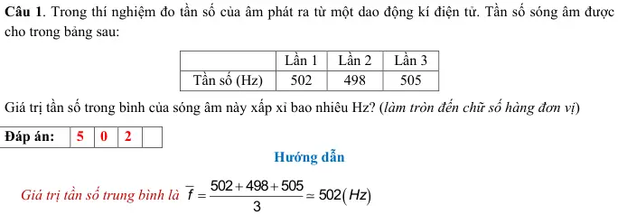{ loading=lazy }

#### Bài PDF 2

<!-- source-id: BT-Chuong-II-p85-q2-192 -->

Câu 2. Trong thí nghiệm đo tần số âm. Một học sinh ghi nhận được một bảng số liệu về chu kì dao
động âm như sau:

Lần 1
Lần 2
Lần 3
Chu kì (ms)
1,6
1,9
1,8
Giá trị trung bình của tần số trong thí nghiệm này xấp xỉ bao nhiêu Hz? (Làm tròn đến chữ số hàng đơn
vị)

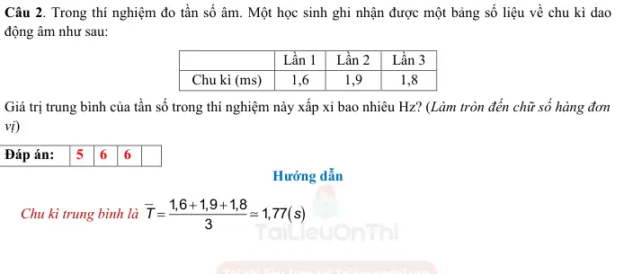{ loading=lazy }

#### Bài PDF 3

<!-- source-id: BT-Chuong-II-p86-q3-193 -->

Câu 3. Một học sinh ghi nhận được một bảng số liệu về chu kì dao động âm trong một thí nghiệm đo
tần số âm như sau:

Lần 1
Lần 2
Lần 3
Chu kì (ms)
1,5
1,2
1,4
Sai số tuyệt đối của tần số trong thí nghiệm này xấp xỉ bao nhiêu Hz? (Làm tròn đến chữ số hàng đơn
vị)

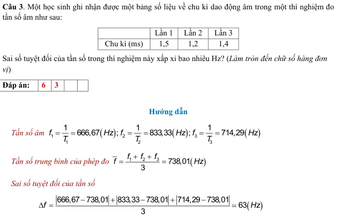{ loading=lazy }

#### Bài PDF 4

<!-- source-id: BT-Chuong-II-p86-q4-194 -->

Câu 4. Tần số của một nguồn âm trong một thí nghiệm được ghi lại trong bảng sau:

Lần 1
Lần 2
Lần 3
Lần 4
Tần số (Hz)
475
485
462
472
Sai số tỉ đối của tần số trong thí nghiệm xấp xỉ bao nhiêu %? (làm tròn đến số thập phân thứ hai)

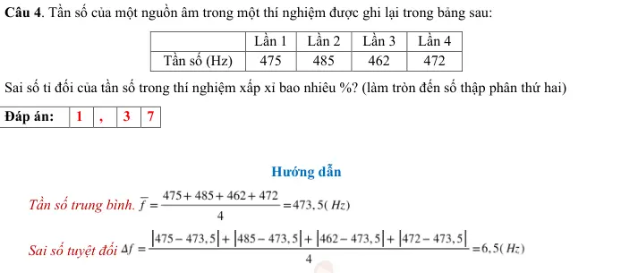{ loading=lazy }

#### Bài PDF 5

<!-- source-id: BT-Chuong-II-p87-q5-195 -->

Câu 5. Dao động kí điện tử đo cùng lúc hai tín hiệu âm tần ở hai kênh CH1 (âm thoa A) và kênh CH2
(âm thoa B). Đồ thị tín hiệu cho bởi hình 2.10 Tần số dao động của âm thoa B bằng bao nhiêu lần tần
số dao động của âm thoa A?

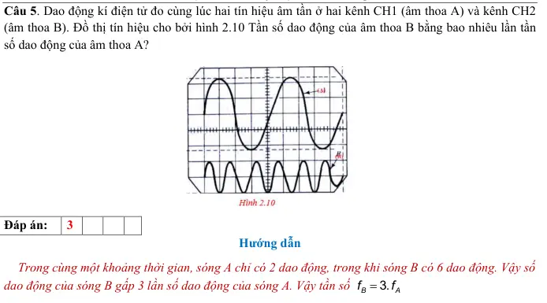{ loading=lazy }

#### Bài PDF 6

<!-- source-id: BT-Chuong-II-p87-q6-196 -->

Câu 6. Dạng sóng của một tín hiệu âm có dạng như hình 2.11 dưới đây. Biết dao động kí đang chọn ở
thang đo . Biết rằng một ô trong màn hình gọi là một div có giá trị 2,5 volt/div và 1,2 ms.
Hiệu số giữa tần số dao động của tín hiệu B và tần số của tín hiệu A là bao nhiêu Hz? (làm tròn đến
chữ số hàng đơn vị)

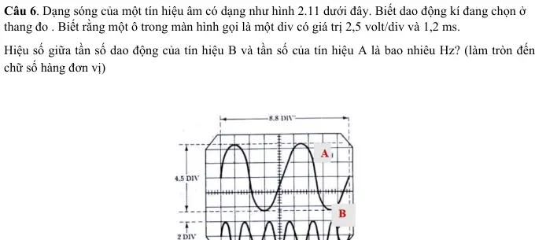{ loading=lazy }

### Nhận biết — Trắc nghiệm 4 lựa chọn

#### Bài PDF 7

<!-- source-id: BT-Chuong-II-p76-q1-159 -->

Câu 1. Một đại lượng A được đo trong n lần có giá trị lần lượt là A1, A2,..., An. Giá trị trung
bình của đại lượng A là
 A.
1
2
2
A
A
...
A
A
.
n
+
+
+
=

B.
1
2
m
A
A
....
A
A
.
m
−
+
+
=

 C.
1
2
2
A
A
...
A
A
.
n
−
−
−
=

D.
1
2
n
A
A
....
A
A
.
n
+
−
−
=

#### Bài PDF 8

<!-- source-id: BT-Chuong-II-p76-q2-160 -->

Câu 2. Một đại lượng A được đo trong n lần có giá trị lần lượt là A1, A2,..., An. Sai số tuyệt đối
trung bình của n lần đo là
A. A = A ± A.
Δ

B.
A
A
.100%.
A
Δ
δ
=

C.
1
2
n
A
A
...
A
A
.
n
+
+
+
=

D.
1
2
n
A
A
...
A
A
.
n
Δ
+ Δ
+
+ Δ
Δ
=

#### Bài PDF 9

<!-- source-id: BT-Chuong-II-p76-q3-161 -->

Câu 3. Một đại lượng A được đo trong n lần có giá trị lần lượt là A1, A2,..., An. Gọi
là sai
số tuyệt đối và giá trị trung bình của đại lượng A. Sai số tỉ đối của phép đo là

A.

B.
A
A
.100%.
A
Δ
δ
=

C.
A
A
.100%.
A
δ
= Δ

D.
A'
A
.100%.
A
Δ
δ
=

#### Bài PDF 10

<!-- source-id: BT-Chuong-II-p76-q4-162 -->

Câu 4. Đo một đại lượng A trong n lần. Gọi A là giá trị trung bình của đại lượng A sau n lần đo và A
Δ
là sai số tuyệt đối trung bình. Kết quả thí nghiệm của đại lượng A được biểu diễn là

A. A
A
A
=
±Δ.
B.
.
A
A A
=
Δ.
C.
A
A
A
= Δ
.
D. A
A
A
= Δ±

#### Bài PDF 11

<!-- source-id: BT-Chuong-II-p76-q5-163 -->

Câu 5. Đại lượng chu kì T được đo trong n lần có giá trị
1
2
;
;...;
n
T T
T . Giá trị trung bình của T là 20,5  s.
Sai số tỉ đối là 5,2 %. Sai số tuyệt đối của phép đo xấp xỉ là

A. 1,02 s.
B. 2,01 s.
C. 1,07 s.
D. 2,07 s.

#### Bài PDF 12

<!-- source-id: BT-Chuong-II-p81-q26-184 -->

Câu 26. Màn hình dao động kí điện tử đo ở hai kênh  CH1 và kênh CH 2 có đồ thị tín hiệu như hình
2.5 dưới đây. Nhận xét nào sau đây là đúng?

A. Tần số f2 = 1,75.f1.

B. Tần số f1 = 1,75.f2.

C. Hai dao động cùng tần số.
D. Dao động (1) trễ pha hơn dao động (2).

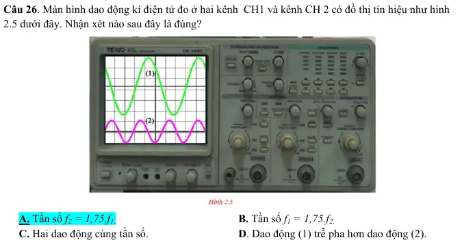{ loading=lazy }

#### Bài PDF 13

<!-- source-id: BT-Chuong-II-p81-q27-185 -->

Câu 27. Trong một thí nghiệm đo tốc độ truyền âm, ngưới ta đo được sai số tỉ đối của tần số là 5% và
sai số tỉ đối của bước sóng là 4%. Các bạn học sinh đo được tốc độ trung bình trong thí nghiệm là 334
m/s. Sai số tuyệt đối của tốc độ truyền âm trong thí nghiệm xấp xỉ là

A. 483 m/s.
B. 30 m/s.
C. 53 m/s.
D. 13 m/s.

#### Bài PDF 14

<!-- source-id: BT-Chuong-II-p82-q28-186 -->

Câu 28. Khi đo tần số âm của một âm thoa A, các bạn học sinh đã xác định được tần số sóng âm đo
nguồn A là 256 Hz. Thay âm thoa A bằng âm thoa B thì đồ thị tín hiệu hai âm được cho như hình 2.6.
Tần số âm B xấp xỉ

A. 85 Hz.
B. 128 Hz.
C. 512 Hz.
D. 768 Hz.

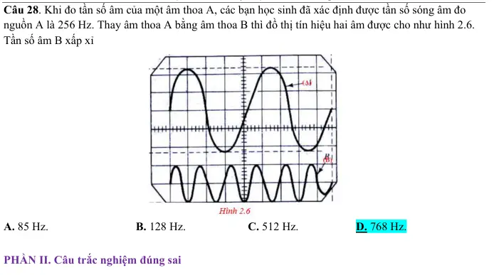{ loading=lazy }

### Nhận biết — Đúng/Sai

#### Bài PDF 15

<!-- source-id: BT-Chuong-II-p82-q1-187 -->

Câu 1. Để thiết kế một âm thoa để chuẩn nốt Sol G4 trên đán Piano, người ta dùng thí nghiệm đo tần
số âm. Hình dạng tín hiệu trên màn hình dao động kí của tín hiệu như hình 2.7 dưới đây. Biết tốc độ
truyền âm trong không khí là 340 m/s.

Phát biểu
Đúng
Sai
a
Để đồ thị rõ nét, cần chỉnh núm Intensity trên máy dao động
kí điện tử.

S
b
Tần số sóng âm nốt Sol G4 xấp xỉ 392 Hz.
Đ

c
Bước sóng của sóng âm xấp xỉ 0,57 m.

S
d
Tín hiệu điện của máy phát tần số có biên độ xấp xỉ 7 V.
Đ

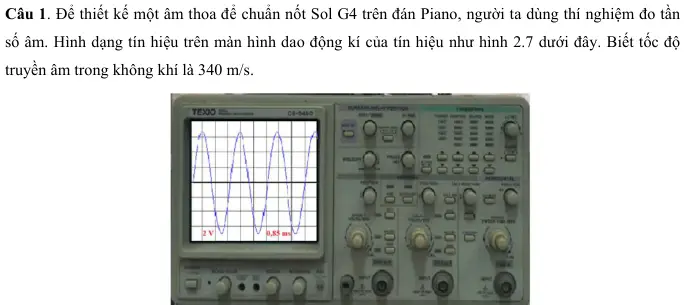{ loading=lazy }

#### Bài PDF 16

<!-- source-id: BT-Chuong-II-p83-q2-188 -->

Câu 2. Trong thí nghiệm đo tần số âm, một âm thoa được đặt trước một micro của thí nghiệm.

Phát biểu
Đúng
Sai
a
Sóng từ âm thoa truyền tới micro là sóng điện từ.

S
b
Micro được nối với dao động kí điện tử.

S
c
Dây tín hiệu phải được nối từ máy phát cao tần
vào Input của kênh CH.
Đ

d
Việc điều chỉnh núm Timer là thay đổi tần số tín
hiệu dao động âm.

S

#### Bài PDF 17

<!-- source-id: BT-Chuong-II-p83-q3-189 -->

Câu 3. Trên màn hình một dao động kí điện tử có tín hiệu của hai nguồn âm A và B. Hình dạng hai tín
hiệu như hình 2.8 dưới đây.

Phát biểu
Đúng
Sai
a
Hai nguồn âm có cùng độ to.

S

b
Âm do hai nguồn phát ra có cùng tần số.
Đ

c
Âm do nguồn A phát ra to hơn âm của nguồn B.
Đ

d
Nguồn âm A dao động sớm pha hơn nguồn âm
B.
Đ

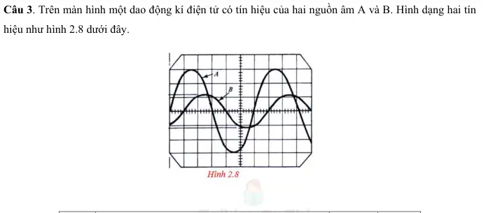{ loading=lazy }

#### Bài PDF 18

<!-- source-id: BT-Chuong-II-p84-q4-190 -->

Câu 4. Màn hình dao động kí điện tử ghi nhận xung tín hiệu âm tần có hình dạng như hình 2.9 dưới
đây. Biết mỗi ô trên màn hình ứng với 1,5 V (1,5 volt/div), thời gian 0,5 ms.
(Biết rằng 1 ô = 1 div)

Phát biểu
Đúng
Sai
a
Để điều chỉnh đồ thị lên giữa màn hình, các bạn
học sinh xoay núm position .
Đ

b
Sóng từ nguồn đến là dạng sóng hình sin.
Đ

A
B

c
Chu kì dao động của sóng âm tần này là 2,5 ms.
Đ

d
Biên độ tín hiệu có độ lớn xấp xỉ 6 V.

S

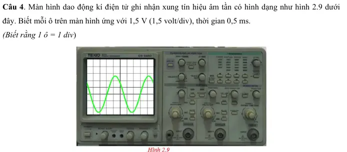{ loading=lazy }

### Thông hiểu — Trắc nghiệm 4 lựa chọn

#### Bài PDF 19

<!-- source-id: BT-Chuong-II-p78-q19-177 -->

Câu 19. Trong thí nghiệm đo tần số âm, tín hiệu truyền từ máy phát tần số sang dao động kí điện tử là

A. sóng âm do âm thoa phát ra.
B. sóng cơ học do âm thoa phát ra.

C. tín hiệu điện mang tần số sóng âm.
D. sóng điện từ.

#### Bài PDF 20

<!-- source-id: BT-Chuong-II-p78-q20-178 -->

Câu 20. Đồ thị tín hiệu trên máy dao động kí điện tử, chu kì là khoảng cách

A. giữa hai vị trí cân bằng liên tiếp.
B. giữa ba vị trí cân bằng liên tiếp.

C. giữa bốn vị trí cân bằng liên tiếp.
D. giữa 5 vị trí cân bằng liên tiếp.

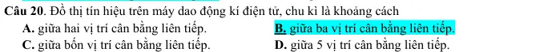{ loading=lazy }

#### Bài PDF 21

<!-- source-id: BT-Chuong-II-p78-q21-179 -->

Câu 21. Khi thực hành thí nghiệm đo tấn số âm, học sinh phải tiến hành gõ vào âm thoa để tạo dao
động âm trong ít nhất 3 lần. Một học sinh lần lượt gõ vào âm thoa với lực gõ tăng dần thì khoảng cách
giữa

A. các vị trí cân bằng tăng lên.
B. các vị trí cân bằng giảm đi.

C. biên dương và biên âm giảm đi.
D. biên dương và biên âm tăng lên.

#### Bài PDF 22

<!-- source-id: BT-Chuong-II-p78-q22-180 -->

Câu 22. Trong màn hình biên độ dao động kí điện tử, đồ thị tín hiệu có biên độ (tính theo đơn vị ô li) là

A. 4 ô.
B. 3 ô.
C. 2 ô.
D. 1 ô.

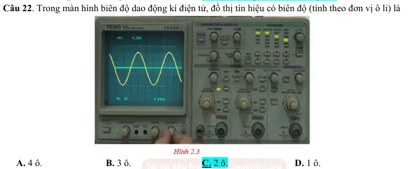{ loading=lazy }

#### Bài PDF 23

<!-- source-id: BT-Chuong-II-p79-q23-181 -->

Câu 23. Trong hình 2.4 , thời gian tính theo ms, tần số của dao động của tín hiệu âm xấp xỉ là

A. 512 Hz.
B. 375 Hz.
C. 725 Hz.
D. 465 Hz.

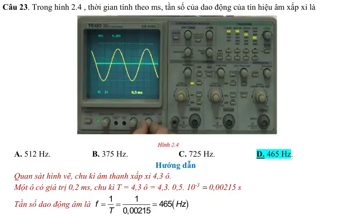{ loading=lazy }

#### Bài PDF 24

<!-- source-id: BT-Chuong-II-p79-q24-182 -->

Câu 24. Dùng dao động kí điện tử để đo chu kì một sóng âm. Chu kì của sóng âm sau 5 lần đo có giá
trị được cho trong bảng sau:

Lần 1
Lần 2
Lần 3
Lần 4
Lần 5
Chu kì (ms)
2,2
2,5
2,1
2,4
2,3

Sai số tuyệt đối trung bình của chu kì sóng âm là

A. 0,12 ms.
B. 0 ms.
C. 0,15 ms.
D. 0,10 ms.

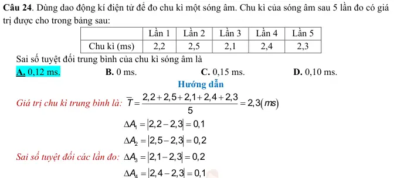{ loading=lazy }

### Vận dụng — Trắc nghiệm 4 lựa chọn

#### Bài PDF 25

<!-- source-id: BT-Chuong-II-p76-q6-164 -->

Câu 6. Khi đo tốc độ sóng âm, các em học sinh vận dụng công thức
.
v
f λ
=
. Trong đó tốc độ, bước
sóng và tần số có giá trị trung bình lần lượt là v  ;λ; f . Sai số tuyệt đối trung bình lần lượt là v
Δ; λ
Δ
và
f
Δ. Hệ thức đúng là

A.
v
f
v
f
λ
λ
Δ
Δ
Δ
=
+
.
B.
.
v
f
v
f
λ
λ
Δ
Δ
Δ
=

C.
v
f
v
f
λ
λ
Δ
Δ
Δ
=
−
.
D.
v
f
v
f
λ
λ
Δ
Δ
=
+
Δ
.

#### Bài PDF 26

<!-- source-id: BT-Chuong-II-p77-q8-166 -->

Câu 8. Trong các thiết bị sử dụng trong thí nghiệm đo tần số âm, thiết bị biến đổi dao động âm thành
dao động điện là

A. dao động kí điện tử.
B. micro.

C. âm thoa.

D. máy phát tần số.

#### Bài PDF 27

<!-- source-id: BT-Chuong-II-p77-q9-167 -->

Câu 9. Trong các thiết bị sử dụng trong thí nghiệm đo tần số âm, đồ thị tín hiệu hiển thị trên thiết bị

A. âm thoa.
B. dao động kí điện tử. C. máy phát tần số.
D. micro.

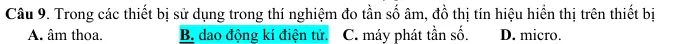{ loading=lazy }

#### Bài PDF 28

<!-- source-id: BT-Chuong-II-p77-q10-168 -->

Câu 10. Trong thí nghiệm đo tần số âm, que đo tín hiệu nối giữa hai thiết bị

A. máy phát tần số và dao động kí điện tử.
B. máy phát tần số và micro.

C. micro và dao động kí điện tử.
D. âm thoa và micro.

#### Bài PDF 29

<!-- source-id: BT-Chuong-II-p77-q11-169 -->

Câu 11. Trong thí nghiệm đo tần số âm, sóng âm được tạo ra từ

A. dao động kí điện tử.
B. máy phát tần số.

C. âm thoa.

D. micro.

#### Bài PDF 30

<!-- source-id: BT-Chuong-II-p77-q12-170 -->

Câu 12. Khi màn hình máy dao động kí quá sáng. Để giảm độ sáng của màn hình trên dao động kí điện
tử, học sinh phài điều chỉnh núm

A. scale illum.
B. núm focus.
C. núm intensity.
D. núm position .

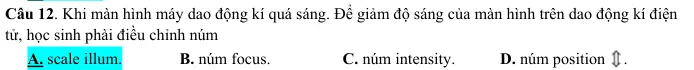{ loading=lazy }

#### Bài PDF 31

<!-- source-id: BT-Chuong-II-p77-q13-171 -->

Câu 13. Khi đồ thị tín hiệu quá tối. Để tăng độ sáng của đồ thị biểu diễn tín hiệu trên dao động kí điện
tử, học sinh phài điều chỉnh núm

A. scale illum.
B. núm focus.
C. núm intensity.
D. núm position .

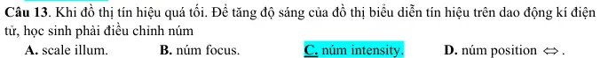{ loading=lazy }

#### Bài PDF 32

<!-- source-id: BT-Chuong-II-p77-q14-172 -->

Câu 14. Khi đồ thị tín hiệu bị nhòe, không rõ nét. Để tăng độ nét của đồ thị biểu diễn tín hiệu trên dao
động kí điện tử, học sinh phài điều chỉnh núm

A. scale illum.
B. núm focus.
C. núm intensity.
D. núm position .

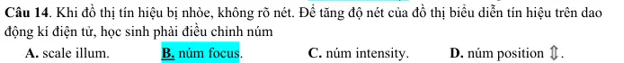{ loading=lazy }

#### Bài PDF 33

<!-- source-id: BT-Chuong-II-p77-q15-173 -->

Câu 15. Khi đồ thị tín hiệu trên màn hình bị lệch phải. Để dịch chuyển đồ thị tín hiệu sang trái, học
sinh phải xoay núm

A. núm position .
B. núm position .
C. núm time.
D. núm volt.

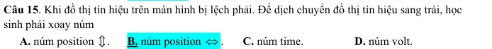{ loading=lazy }

#### Bài PDF 34

<!-- source-id: BT-Chuong-II-p77-q16-174 -->

Câu 16. Để chuẩn tín hiệu trong máy dao động kí, ta dụng dây tín hiệu cắm một đầu jack vào cổng
input của kênh đo CH. Đầu móc của dây tín hiệu nối vào

A. khe mode  trên dao động kí điện tử.
B. out put của máy phát tần số.

C. cắm vào âm thoa.

D. cắm vào khe cal trên dao động kí điện tử.

#### Bài PDF 35

<!-- source-id: BT-Chuong-II-p78-q18-176 -->

Câu 18. Trong thí nghiệm đo tần số âm, nếu biên độ tín hiệu quá lớn, vượt ra khỏi màn hình dao động
kí như hình 2.2 dưới đây. Để điều chỉnh cho độ cao biên độ giảm xuống, các bạn học sinh dùng núm
nào?

A. Núm Auto sét.
B. Núm Volt.
C. Núm Position.
D. Núm Time.

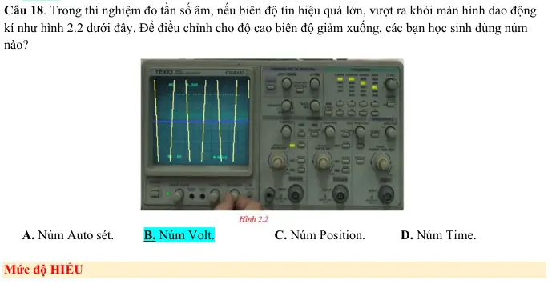{ loading=lazy }

#### Bài PDF 36

<!-- source-id: BT-Chuong-II-p81-q25-183 -->

Câu 25. Một học sinh tại trường THPT Ngô Quyền thực hiện thí nghiệm đo tần số âm từ một âm thoa.
Sau 04 lần đo bạn đã ghi nhận được chu kì dao động âm theo bảng giá trị sau:

Lần 1
Lần 2
Lần 3
Lần 4
Chu kì (s)
2,2
2,5
2,1
2,4

Dựa vào bảng kết quả hãy cho biết nhận xét nào sau đây không đúng?

A. Chu kì trung bình là 2,3 s.

B. Tần số trung bình xấp xỉ 0,43 Hz.

C. Số liệu thu được hoàn toàn chính xác.

D. Sai số tuyệt đối trung bình của chu kì là 0,15 s.

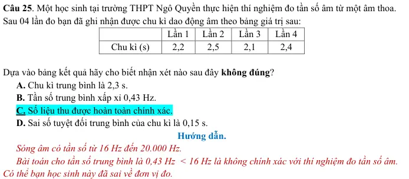{ loading=lazy }

