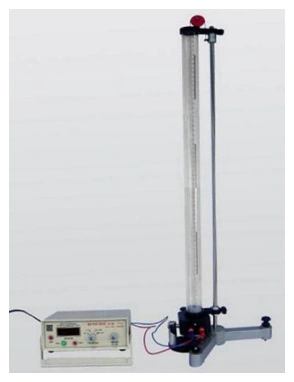
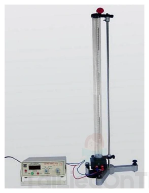
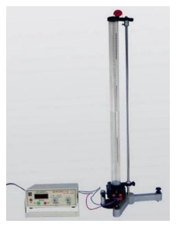
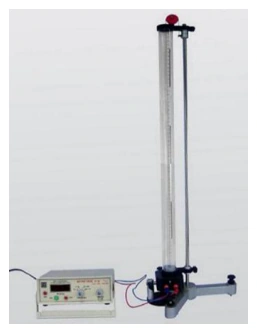
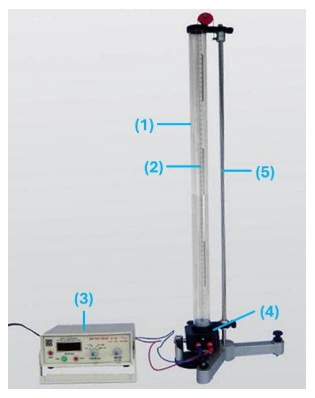
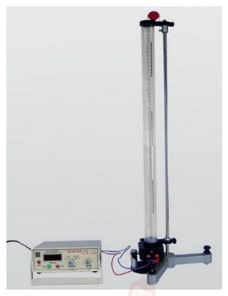
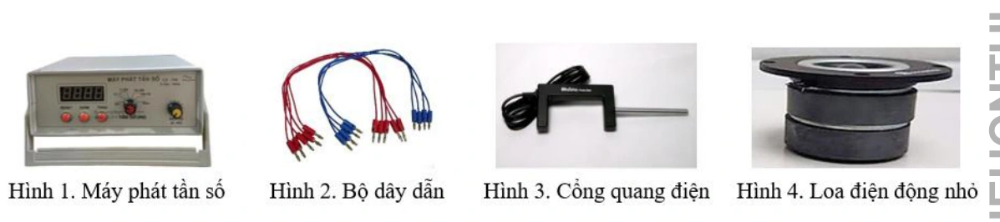

# Bài tập — Bài 9 — Thực hành đo tốc độ truyền âm

> Hệ bài tập được biên soạn theo các dạng xuất hiện trong bộ tài liệu Vật lí 11 của dự án. Câu hỏi được giữ ngắn, trực tiếp; độ khó tăng dần và không cố tình thêm dữ kiện gây nhiễu.

[← Trở lại bài học](../../09-practical-sound-speed.md)

## Phần A — Trắc nghiệm 4 lựa chọn

### Bài 1 — Mức 1 — Nhận biết

Đo được bước sóng âm $0,68$ m và tần số $500$ Hz. Tốc độ âm là

A. $250$ m/s.
B. $340$ m/s.
C. $500$ m/s.
D. $680$ m/s.

??? success "Đáp án và lời giải"
    Chọn **B**. $v=f\lambda=500\cdot0,68=340$ m/s.

### Bài 2 — Mức 1 — Nhận biết

Trong phương pháp cộng hưởng cột khí một đầu kín, chênh lệch giữa hai chiều dài cộng hưởng liên tiếp bằng

A. $\lambda/4$.
B. $\lambda/2$.
C. $\lambda$.
D. $2\lambda$.

??? success "Đáp án và lời giải"
    Chọn **B**.

### Bài 3 — Mức 1 — Nhận biết

Đo tốc độ âm bằng tiếng vọng: khoảng cách đến vách là $51$ m, thời gian từ phát đến nghe vọng là $0,30$ s. Tốc độ âm là

A. $170$ m/s.
B. $255$ m/s.
C. $340$ m/s.
D. $680$ m/s.

??? success "Đáp án và lời giải"
    Chọn **C**. Âm đi và về quãng đường $2d=102$ m; $v=102/0,30=340$ m/s.

## Phần B — Đúng/Sai

### Bài 4 — Mức 2 — Thông hiểu

Trong thí nghiệm đo tốc độ âm:

a) Có thể dùng $v=f\lambda$.
b) Nếu dùng tiếng vọng phải tính quãng đường hai chiều.
c) Tần số âm thoa tự thay đổi khi dịch ống cộng hưởng.
d) Nhiệt độ không khí có thể ảnh hưởng kết quả.

??? success "Đáp án và lời giải"
    a) **Đúng**.
    b) **Đúng**.
    c) **Sai**.
    d) **Đúng**.

## Phần C — Trả lời ngắn

### Bài 5 — Mức 3 — Vận dụng

Hai vị trí cộng hưởng liên tiếp của cột khí là $17,2$ cm và $51,5$ cm. Tần số âm thoa $500$ Hz. Tính tốc độ âm.

??? success "Đáp án và lời giải"
    $\lambda=2(L_2-L_1)=2(51,5-17,2)=68,6$ cm $=0,686$ m. $v=f\lambda=500\cdot0,686=343$ m/s.

### Bài 6 — Mức 3 — Vận dụng

Một phép đo tiếng vọng: người đứng cách vách $85$ m, thời gian nghe vọng $0,50$ s. Tính tốc độ âm.

??? success "Đáp án và lời giải"
    Quãng đường âm đi và về là $170$ m. $v=170/0,50=340$ m/s.

### Bài 7 — Mức 3 — Vận dụng

Một nguồn $400$ Hz phát âm trong không khí. Đo được khoảng cách giữa hai nút áp suất tương ứng một bước sóng là $0,86$ m. Tính tốc độ.

??? success "Đáp án và lời giải"
    $v=f\lambda=400\cdot0,86=344$ m/s.

## Phần D — Vận dụng và vận dụng cao

### Bài 8 — Mức 4 — Vận dụng cao

Trong thí nghiệm cột khí, ba chiều dài cộng hưởng liên tiếp đo được là $L_1=16,8$ cm, $L_2=50,9$ cm, $L_3=85,3$ cm với âm thoa $500$ Hz. Hãy lấy trung bình hai hiệu liên tiếp để ước tính tốc độ âm.

??? success "Đáp án và lời giải"
    Hai hiệu: $L_2-L_1=34,1$ cm; $L_3-L_2=34,4$ cm. Trung bình $34,25$ cm.

    Vì hiệu hai cộng hưởng liên tiếp bằng $\lambda/2$, ta có $\lambda=68,5$ cm $=0,685$ m.

    $v=f\lambda=500\cdot0,685=342,5$ m/s.

    Dùng nhiều khoảng liên tiếp giúp giảm tác động sai số đọc từng chiều dài.

## Ngân hàng bài tập mở rộng

> Các bài dưới đây được đánh số nối tiếp phần bài tập phía trên. Đề bài được trình bày bằng Markdown; chỉ đồ thị, hình vẽ hoặc sơ đồ thực sự cần thiết mới được giữ dưới dạng hình. Đáp án và lời giải được đặt trong nút mở rộng ngay dưới từng bài.

### Nhận biết — Trả lời ngắn

#### Bài 9

<!-- source-id: BT-Chuong-II-p233-q1-544 -->

Trong thí nghiệm đo tốc độ truyền âm trong không khí, chiều cao cột không khí sau ba lần đo có giá trị
lần lượt là 35 mm, 33 mm, 31 mm. Giá trị trung bình của chiều cao cột không khí (theo đơn vị cm và đúng với
số chữ số có nghĩa của phép đo) là bao nhiêu?

??? success "Đáp án và lời giải"
    **Đáp án:** $3{,}30$
    **Hướng dẫn giải:**

    Dùng $v=\lambda f$ hoặc $v=s/t$; với thí nghiệm phản xạ phải kiểm tra xem quãng đường $s$ là một chiều hay cả lượt đi và về.

    Giá trị trung bình của chiều cao cột không khí 35

    Vậy kết quả cần tìm là **$3{,}30$**.
#### Bài 10

<!-- source-id: BT-Chuong-II-p233-q2-545 -->

Trong thí nghiệm đo tốc độ truyền âm trong không khí, biết sai số tỉ đối của phép đo bước sóng và tốc
độ truyền sóng lần lượt là 0,01 và 0,017. Sai số tỉ đối của phép đo tần số là bao nhiêu (làm tròn đến chữ số thập
phân thứ hai sau dấu phẩy)?

??? success "Đáp án và lời giải"
    **Đáp án:** $0{,}03$
    **Hướng dẫn giải:**

    Dùng $v=\lambda f$ hoặc $v=s/t$; với thí nghiệm phản xạ phải kiểm tra xem quãng đường $s$ là một chiều hay cả lượt đi và về.

    Vậy kết quả cần tìm là **$0{,}03$**.
#### Bài 11

<!-- source-id: BT-Chuong-II-p233-q3-546 -->

Thực hiện thí nghiệm đo tốc độ truyền âm trong không khí với tần số
(
)
750
1 Hz
f =
±
, thu được chiều
dài bước sóng là
(
)
45,7
1,4 cm
λ=
±
. Sai số tỉ đối của phép đo tốc độ truyền âm là bao nhiêu (làm tròn đến chữ
số thập phân thứ hai sau dấu phẩy)?

??? success "Đáp án và lời giải"
    **Đáp án:** $0{,}03$
    **Hướng dẫn giải:**

    Dùng $v=\lambda f$ hoặc $v=s/t$; với thí nghiệm phản xạ phải kiểm tra xem quãng đường $s$ là một chiều hay cả lượt đi và về.

    Vậy kết quả cần tìm là **$0{,}03$**.
#### Bài 12

<!-- source-id: BT-Chuong-II-p234-q4-547 -->

Thực hiện thí nghiệm đo tốc độ truyền âm trong không khí với tần số
(
)
520
1 Hz
f =
±
, thu được chiều
dài bước sóng là
(
)
65,1
0,7 cm
λ=
±
. Giá trị trung bình của tốc độ truyền âm là bao nhiêu (tính theo đơn vị m/s
và làm tròn đến phần nguyên)?

??? success "Đáp án và lời giải"
    **Đáp án:** $339$
    **Hướng dẫn giải:**

    Dùng $v=\lambda f$ hoặc $v=s/t$; với thí nghiệm phản xạ phải kiểm tra xem quãng đường $s$ là một chiều hay cả lượt đi và về.

    Vậy kết quả cần tìm là **$339$**.
### Nhận biết — Trắc nghiệm 4 lựa chọn

#### Bài 13

<!-- source-id: BT-Chuong-II-p225-q10-526 -->

Trong bài thực hành đo tốc độ truyền âm trong không khí, các giá trị trung bình của bước sóng, tần số,
tốc độ truyền sóng lần lượt là , ,
f
v
λ
 tương ứng sai số phép đo của các đại lượng là
,
,
f
v
ΔλΔ
Δ. Công thức
tính sai số tỉ đối của phép đo là

A. v
f
v
f
Δ
Δλ
Δ
λ
=
+
.

B. v
f
v
f
Δ
Δλ
Δ
λ
=
−
.

C. .
v
f
v
f
Δ
ΔλΔ
λ
=
.

D. 2
v
f
v
f
Δ
Δλ
Δ
λ
=
−
.

??? success "Đáp án và lời giải"
    **Đáp án:** A
    **Hướng dẫn giải:**

    Dùng $v=\lambda f$ hoặc $v=s/t$; với thí nghiệm phản xạ phải kiểm tra xem quãng đường $s$ là một chiều hay cả lượt đi và về.

    Đối chiếu kết quả với các lựa chọn, phương án phù hợp là **A. v f v f Δ Δλ Δ λ = + .**
#### Bài 14

<!-- source-id: BT-Chuong-II-p225-q11-527 -->

Chiều cao cột không khí trong thí nghiệm đo tốc độ truyền âm được xác định

A. từ loa đến đáy của pít-tông.

B. từ loa đến vạch chuẩn được đánh dấu trên pít-tông.

C. từ loa đến đầu trên của pít-tông.

D. từ vạch chuẩn được đánh dấu trên pit-tông đến hết chiều dài thước trên ống trụ.

??? success "Đáp án và lời giải"
    **Đáp án:** B
    **Hướng dẫn giải:**

    Dùng $v=\lambda f$ hoặc $v=s/t$; với thí nghiệm phản xạ phải kiểm tra xem quãng đường $s$ là một chiều hay cả lượt đi và về.

    Đối chiếu kết quả với các lựa chọn, phương án phù hợp là **B. từ loa đến vạch chuẩn được đánh dấu trên pít-tông.**
#### Bài 15

<!-- source-id: BT-Chuong-II-p226-q12-528 -->

Đâu không phải là nguyên nhân nào sau đây gây ra sai số khi thực hiện thí nghiệm đo tốc độ truyền âm
trong không khí?

A. Cảm giác nghe của tai không ổn định.

B. Máy phát tần số không ổn định.

C. Đọc số đo không đúng.

D. Nhiệt độ của môi trường xung quanh.

??? success "Đáp án và lời giải"
    **Đáp án:** D
    **Hướng dẫn giải:**

    Dùng $v=\lambda f$ hoặc $v=s/t$; với thí nghiệm phản xạ phải kiểm tra xem quãng đường $s$ là một chiều hay cả lượt đi và về.

    Đối chiếu kết quả với các lựa chọn, phương án phù hợp là **D. Nhiệt độ của môi trường xung quanh.**
#### Bài 16

<!-- source-id: BT-Chuong-II-p226-q13-529 -->

Hãy sắp xếp các bước thực hiện thí nghiệm đo tốc độ truyền âm trong không khí với dụng cụ được bố
trí như hình.

(I) Điều chỉnh thang đo trên máy phát và tần số sóng âm cho phù hợp. Điều chỉnh biên độ để nghe được âm phát
ra từ loa vừa đủ to.
(II) Tiếp tục kéo pít-tông và xác định vị trí thứ hai của pít-tông khi âm nghe được lại to nhất và xác định chiều
dài cột khí 2l tương ứng. Ghi số liệu vào bảng.
(III) Kéo dần pít-tông lên và lắng nghe âm phát ra. Xác định vị trí thứ nhất của pít-tông khi âm nghe được to
nhất và xác định chiều dài cột khí 1l tương ứng. Ghi số liệu vào bảng.
(IV) Đặt loa điện động gần sát đầu hở của ống trụ. Dùng hai dây dẫn cấp điện cho loa từ máy phát tần số.

A. (I) – (II) – (III) – (IV).

B. (I) – (III) – (II) – (IV).

C. (IV) – (I) – (II) – (III).

D. (IV) – (III) – (II) – (I).

{ loading=lazy }

??? success "Đáp án và lời giải"
    **Đáp án:** B
    **Hướng dẫn giải:**

    Dùng $v=\lambda f$ hoặc $v=s/t$; với thí nghiệm phản xạ phải kiểm tra xem quãng đường $s$ là một chiều hay cả lượt đi và về.

    Đối chiếu kết quả với các lựa chọn, phương án phù hợp là **B. (I) – (III) – (II) – (IV).**
#### Bài 17

<!-- source-id: BT-Chuong-II-p226-q14-530 -->

Để giảm sai số trong phép đo tốc độ truyền âm trong không khí, bao nhiêu cách khắc phục sau đây là
đúng?
(I) điều chỉnh pít-tông chậm, nhẹ nhàng để có thể biết được chính xác tại giá trị có âm cộng hưởng.
(II) đặt mắt thẳng và vuông góc với mặt thước khi đọc giá trị độ cao pít-tông.
(III) xác định đúng sai số dụng cụ đo.
(IV) kiểm tra, đảm bảo các dụng cụ hoạt động tốt.

A. 1

B. 2

C. 3

D. 4

??? success "Đáp án và lời giải"
    **Đáp án:** D
    **Hướng dẫn giải:**

    Dùng $v=\lambda f$ hoặc $v=s/t$; với thí nghiệm phản xạ phải kiểm tra xem quãng đường $s$ là một chiều hay cả lượt đi và về.

    Đối chiếu kết quả với các lựa chọn, phương án phù hợp là **D. 4**
#### Bài 18

<!-- source-id: BT-Chuong-II-p226-q15-531 -->

Để xác định chính xác vị trí có âm cộng hưởng, pít-tông cần phải

A. làm bằng thép.

B. có vạch chuẩn.

C. vừa khít với ống trụ.

D. gắn nam châm.

??? success "Đáp án và lời giải"
    **Đáp án:** B
    **Hướng dẫn giải:**

    Dùng $v=\lambda f$ hoặc $v=s/t$; với thí nghiệm phản xạ phải kiểm tra xem quãng đường $s$ là một chiều hay cả lượt đi và về.

    Đối chiếu kết quả với các lựa chọn, phương án phù hợp là **B. có vạch chuẩn.**
#### Bài 19

<!-- source-id: BT-Chuong-II-p226-q16-532 -->

Với l
Δ và
dc
l
Δ
 lần lượt là sai số tuyệt đối trung bình và sai số dụng cụ, sai số tuyệt đối l
Δ trong phép
đo chiều cao cột không khí được xác định bằng công thức

A. dc
2
l
l
l
Δ
Δ
Δ
=
+
.

B. dc
2
l
l
l
Δ
Δ
Δ
=
−
.

C. dc
l
l
l
Δ
Δ
Δ
=
+
.

D. dc
l
l
l
Δ
Δ
Δ
=
−
.

??? success "Đáp án và lời giải"
    **Đáp án:** C
    **Hướng dẫn giải:**

    Dùng $v=\lambda f$ hoặc $v=s/t$; với thí nghiệm phản xạ phải kiểm tra xem quãng đường $s$ là một chiều hay cả lượt đi và về.

    Đối chiếu kết quả với các lựa chọn, phương án phù hợp là **C. dc l l l Δ Δ Δ = + .**
#### Bài 20

<!-- source-id: BT-Chuong-II-p227-q18-534 -->

Những dụng cụ chính để đo tốc độ truyền âm trong không khí trong phòng thí nghiệm là

A. Ống trụ trong suốt có gắn thước thẳng, dây dẫn, máy phát tần số, loa.

B. Pít-tông, dây dẫn, máy phát tần số, loa.

C. Pít-tông, ống trụ trong suốt có gắn thước thẳng, dây dẫn, loa.

D. Ống trụ trong suốt có gắn thước thẳng, pít-tông, máy phát tần số, loa.

??? success "Đáp án và lời giải"
    **Đáp án:** D
    **Hướng dẫn giải:**

    Dùng $v=\lambda f$ hoặc $v=s/t$; với thí nghiệm phản xạ phải kiểm tra xem quãng đường $s$ là một chiều hay cả lượt đi và về.

    Đối chiếu kết quả với các lựa chọn, phương án phù hợp là **D. Ống trụ trong suốt có gắn thước thẳng, pít-tông, máy phát tần số, loa.**
#### Bài 21

<!-- source-id: BT-Chuong-II-p227-q20-536 -->

Trong thí nghiệm đo tốc độ truyền âm trong không khí, biết sai số tỉ đối của phép đo tần số và tốc độ
truyền sóng lần lượt là 0,17% và 1,04%. Sai số tỉ đối của phép đo bước sóng gần nhất với giá trị nào sau đây?

A. 1,2%.

B. 0,85%.

C. 0,18%.

D. 1,5%.

??? success "Đáp án và lời giải"
    **Đáp án:** A
    **Hướng dẫn giải:**

    Dùng $v=\lambda f$ hoặc $v=s/t$; với thí nghiệm phản xạ phải kiểm tra xem quãng đường $s$ là một chiều hay cả lượt đi và về.

    Hướng dẫn giải:

    Đối chiếu kết quả với các lựa chọn, phương án phù hợp là **A. 1,2%.**
#### Bài 22

<!-- source-id: BT-Chuong-II-p227-q21-537 -->

Thực hiện thí nghiệm đo tốc độ truyền âm trong không khí với tần số
(
)
700
1 Hz
f =
±
, thu được chiều
dài bước sóng là
(
)
49,2
0,9 cm
λ=
±
. Sai số tỉ đối của tốc độ truyền âm xấp xỉ

A. 0,012.

B. 0,12.

C. 1,2.

D. 12.

??? success "Đáp án và lời giải"
    **Hướng dẫn giải:**

    Dùng $v=\lambda f$ hoặc $v=s/t$; với thí nghiệm phản xạ phải kiểm tra xem quãng đường $s$ là một chiều hay cả lượt đi và về.

    Hướng dẫn giải:
#### Bài 23

<!-- source-id: BT-Chuong-II-p227-q21-538 -->

Thực hiện thí nghiệm đo tốc độ truyền âm trong không khí với tần số
(
)
600
1 Hz
f =
±
, thu được chiều
dài bước sóng là
(
)
57,2
0,5 cm
λ=
±
. Tốc độ truyền âm là

A. (
)
343,2
0,5 m/s
v =
±
.

B. (
)
340,3
0,5 m/s
v =
±
.

C. (
)
340,3
3,6 m/s
v =
±
.

D. (
)
343,2
3,6 m/s
v =
±
.

??? success "Đáp án và lời giải"
    **Hướng dẫn giải:**

    Dùng $v=\lambda f$ hoặc $v=s/t$; với thí nghiệm phản xạ phải kiểm tra xem quãng đường $s$ là một chiều hay cả lượt đi và về.

    Hướng dẫn giải:
### Nhận biết — Đúng/Sai

#### Bài 24

<!-- source-id: BT-Chuong-II-p229-q1-539 -->

Để đo tốc độ truyền âm trong không khí, dụng cụ thí nghiệm được bố trí như hình. Xác định nhận định
sau đây đúng hay sai?

a) Trong thí nghiệm này, tốc độ truyền âm trong không khí có thể được đo thông qua hiện tượng sóng dừng.
b) Trong thí nghiệm này, loa được xem là một đầu cố định khi xảy ra hiện tượng sóng
d) ừng.
c) Tốc độ truyền âm trong không khí được xác định thông qua biểu thức . v l f Δ = , với l Δlà khoảng cách giữa hai bụng sóng liên tiếp và f là tần số âm.
d) Trong khi thực hiện thí nghiệm, âm thanh ở môi trường xung quanh không ảnh hưởng đến độ chính xác của kết quả thí nghiệm.

{ loading=lazy }

??? success "Đáp án và lời giải"
    **Hướng dẫn giải:**
    a) Trong thí nghiệm này, tốc độ truyền âm trong không khí có thể được đo thông qua hiện tượng sóng dừng.
    b) Loa chỉ có vai trò là nguồn âm, không phải một đầu cố định khi xảy ra sóng dừng.
    c) Tốc độ truyền âm trong không khí được xác định thông qua biểu thức
    2
    .
    v
    l f
    Δ
    =
    , với l
    Δ là khoảng cách giữa
    hai bụng sóng liên tiếp và f là tần số âm.
    d) Âm thanh ở môi trường xung quanh gây ảnh hưởng đến độ chính xác kết quả thí nghiệm.

#### Bài 25

<!-- source-id: BT-Chuong-II-p229-q2-540 -->

Để đo tốc độ truyền âm trong không khí, dụng cụ thí nghiệm được bố trí như hình. Xác định nhận định
sau đây đúng hay sai?

a) Sóng âm truyền trong không khí là sóng ngang.
b) Tốc độ truyền âm trong không khí được tính theo công thức . v f λ =
c) Không thể đo trực tiếp bước sóng để xác định tốc độ truyền âm.
d) Sai số tỉ đối của tốc độ truyền âm chính bằng sai số tỉ đối của bước sóng.

{ loading=lazy }

??? success "Đáp án và lời giải"
    **Hướng dẫn giải:**

    Dùng $v=\lambda f$ hoặc $v=s/t$; với thí nghiệm phản xạ phải kiểm tra xem quãng đường $s$ là một chiều hay cả lượt đi và về.

    a) Sóng âm truyền trong không khí là sóng dọc.
    b) Tốc độ truyền âm trong không khí được tính theo công thức
    c) Bước sóng không được đo trực tiếp. Thực hiện đo trực tiếp chiều cao cột khí tại hai vị trí liên tiếp mà pít-tông
    khi âm nghe được to nhất, từ đo suy ra bước sóng theo công thức
    d) Sai số tỉ đối của tốc độ truyền âm phụ thuộc vào sai số tỉ đối của bước sóng và tần số theo công thức
#### Bài 26

<!-- source-id: BT-Chuong-II-p230-q3-541 -->

Để đo tốc độ truyền âm trong không khí, dụng cụ thí nghiệm được bố trí như hình. Âm nghe được to nhất
hai lần liên tiếp khi chiều dài cột khí có giá trị là 1l và 2l . Xác định nhận định sau đây đúng hay sai?

a) Khi thực hiện phép đo, cần điều chỉnh biên độ âm sao cho âm phát ra từ loa càng to thì càng dễ thực hiện thí nghiệm.
b) Bước sóng được xác định bằng biểu thức ( ) 1 2 2 l l λ= − .
c) Sai số tuyệt đối của bước sóng được tính bằng công thức ( ) 1 2 2 l l Δλ Δ Δ = − .
d) Có thể thực hiện thí nghiệm với nhiều giá trị tần số khác nhau để tăng độ chính xác của kết quả thí nghiệm.

{ loading=lazy }

??? success "Đáp án và lời giải"
    **Hướng dẫn giải:**

    Dùng $v=\lambda f$ hoặc $v=s/t$; với thí nghiệm phản xạ phải kiểm tra xem quãng đường $s$ là một chiều hay cả lượt đi và về.

    a) Khi thực hiện phép đo, cần biên độ âm sao cho âm phát ra từ loa vừa đủ nghe.
    b) Bước sóng được xác định bằng biểu thức
    c) Sai số tuyệt đối của bước sóng được tính bằng công thức
    d) Có thể thực hiện thí nghiệm với nhiều giá trị tần số khác nhau để tăng độ chính xác của kết quả thí nghiệm.
#### Bài 27

<!-- source-id: BT-Chuong-II-p231-q4-542 -->

Thực hiện thí nghiệm đo tốc độ truyền âm trong không khí với dụng cụ thí nghiệm được bố trí như hình
và thu được được bảng số liệu bên dưới. Biết thước chia độ đến milimét. Lấy sai số dụng cụ trong phép đo chiều
cao cột khí bằng một nửa độ chia nhỏ nhất trên thước.
Tần số:
820
1 Hz
f =
±

Chiều cao cột không khí
Lần 1
Lần 2
Lần 3
1l (cm)
7,4
7,1
6,9
2l (cm)
28,1
28,0
28,2

a) Giá trị trung bình của 1l là 7,13 cm.
b) Sai số tuyệt đối của 2l là 11, 7 mm
c) Sai số tỉ đối của phép đo bước sóng là 0,64%.
d) Kết quả thí nghiệm đo tốc độ truyền âm trong không khí là ( ) 343,9 6,1 m/s ± .

{ loading=lazy }

??? success "Đáp án và lời giải"
    **Đáp án:** a) Đúng; b) Sai; c) Sai; d) Đúng.

    **Hướng dẫn giải:**

    Ta có $\bar l_1=(7{,}4+7{,}1+6{,}9)/3\approx7{,}13$ cm và $\bar l_2=(28{,}1+28{,}0+28{,}2)/3=28{,}10$ cm.

    a) **Đúng.** Giá trị trung bình $\bar l_1\approx7{,}13$ cm.

    b) **Sai.** Sai số ngẫu nhiên trung bình của $l_2$ khoảng $0{,}067$ cm; cộng sai số dụng cụ $0{,}05$ cm được $\Delta l_2\approx0{,}117$ cm $=1{,}17$ mm, không phải $11{,}7$ mm.

    c) **Sai.** Hai vị trí cộng hưởng liên tiếp thỏa $\lambda=2(l_2-l_1)$, nên $\lambda\approx41{,}93$ cm. Với $\Delta\lambda\approx2(0{,}228+0{,}117)=0{,}69$ cm, sai số tương đối của bước sóng khoảng $0{,}69/41{,}93\approx1{,}64\%$, không phải $0{,}64\%$.

    d) **Đúng.** $v=f\lambda\approx820\cdot0{,}4193\approx343{,}9$ m/s. Cộng sai số tương đối của $f$ và $\lambda$ cho $\Delta v\approx6{,}1$ m/s, nên có thể viết $v=(343{,}9\pm6{,}1)$ m/s.
#### Bài 28

<!-- source-id: BT-Chuong-II-p232-q5-543 -->

Thực hiện thí nghiệm đo tốc độ truyền âm trong không khí với dụng cụ thí nghiệm được bố trí như hình
và thu được được bảng số liệu bên dưới. Biết thước chia độ đến milimét. Lấy sai số dụng cụ trong phép đo chiều
cao cột khí bằng một nửa độ chia nhỏ nhất trên thước.
Tần số:
900
1 Hz
f =
±

Chiều cao cột không khí
Lần 1
Lần 2
Lần 3
1l (cm)
6,8
6,6
6,5
2l (cm)
25,9
26,1
26,0

a) Khi thực hiện thí nghiệm, cần đặt mắt thẳng và vuông góc với mặt thước đọc giá trị độ cao pít-tông.
b) Vị trí của pít-tông mà tại đó âm phát ra to nhất là nút sóng.
c) Sai số tuyệt đối của 1l và 2l hơn kém nhau 0,02 mm.
d) Sai số tỉ đối của phép đo tốc độ truyền âm nhỏ hơn 1,0 %.

{ loading=lazy }

??? success "Đáp án và lời giải"
    **Đáp án:** a) Đúng; b) Sai; c) Đúng; d) Sai.

    **Hướng dẫn giải:**

    a) **Đúng.** Thí nghiệm cộng hưởng cột khí dùng các vị trí âm lớn nhất liên tiếp để suy ra bước sóng của âm.

    b) **Sai.** Tại miệng ống hở, phần tử không khí dao động với biên độ lớn nên đó là **bụng sóng**, không phải nút sóng.

    c) **Đúng.** Từ các lần đo, nguồn cho $\bar l_1\approx6{,}63\ \text{cm}$ và $\bar l_2\approx26{,}00\ \text{cm}$. Sau khi kể cả sai số dụng cụ, hai sai số chiều dài xấp xỉ $0{,}115$ cm và $0{,}117$ cm; độ chênh chỉ khoảng $0{,}002$ cm $=0{,}02$ mm.

    d) **Sai.** Hai vị trí cộng hưởng liên tiếp cách nhau $\lambda/2$, nên $\lambda\approx2(26{,}00-6{,}63)=38{,}74\ \text{cm}$. Với sai số bước sóng khoảng $0{,}464$ cm và sai số tần số đã cho, sai số tương đối của $v=f\lambda$ xấp xỉ $1{,}3\%$, không nhỏ hơn $1\%$.
### Thông hiểu — Trắc nghiệm 4 lựa chọn

#### Bài 29

<!-- source-id: BT-Chuong-II-p224-q1-517 -->

Ghép cột A và cột B tương ứng để thể hiện các dụng cụ thí nghiệm trong bài thực hành đo tốc độ truyền
âm trong không khí như hình.
Cột A

Cột B

(1)

(a) Hệ thống giá đỡ.
(2)

(b) Loa.
(3)

(c) Máy phát tần số.
(4)

(d) Pít-tông có vạch chuẩn xác định vị trí.
(5)

(e) Ống trụ trong suốt có gắn thước thẳng.

A. (1) – (a), (2) – (b), (3) – (c), (4) – (d), (5) – (e).

B. (1) – (a), (2) – (d), (3) – (c), (4) – (b), (5) – (e).

C. (1) – (e), (2) – (d), (3) – (c), (4) – (b), (5) – (a).

D. (1) – (e), (2) – (a), (3) – (c), (4) – (d), (5) – (b).

{ loading=lazy }

??? success "Đáp án và lời giải"
    **Đáp án:** C
    **Hướng dẫn giải:**

    Dùng $v=\lambda f$ hoặc $v=s/t$; với thí nghiệm phản xạ phải kiểm tra xem quãng đường $s$ là một chiều hay cả lượt đi và về.

    Đối chiếu kết quả với các lựa chọn, phương án phù hợp là **C. (1) – (e), (2) – (d), (3) – (c), (4) – (b), (5) – (a).**
#### Bài 30

<!-- source-id: BT-Chuong-II-p224-q2-518 -->

Với dụng cụ thí nghiệm được bố trí như hình, tốc độ truyền âm trong không khí có thể được đo thông
qua hiện tượng nào sau đây?

A. Sóng dừng.

B. Dao động cưỡng bức.

C. Dao động tắt dần.

D. Nhiễu xạ.

{ loading=lazy }

??? success "Đáp án và lời giải"
    **Đáp án:** A
    **Hướng dẫn giải:**

    Dùng $v=\lambda f$ hoặc $v=s/t$; với thí nghiệm phản xạ phải kiểm tra xem quãng đường $s$ là một chiều hay cả lượt đi và về.

    Đối chiếu kết quả với các lựa chọn, phương án phù hợp là **A. Sóng dừng.**
#### Bài 31

<!-- source-id: BT-Chuong-II-p225-q4-520 -->

Để xác định tốc độ truyền âm trong không khí v thông qua hiện tượng sóng dừng, chiều dài cột không
khí trong hai lần nghe âm lớn nhất liên tiếp là 1
2
,
l
l . Công thức nào sau đây là đúng?

A. (
)
2
1
v
l
f
l
=
+
.

B. (
)
2
1
v
l
f
l
=
−
.

C. (
)
2
1
2 l
f
v
l
=
+

D. (
)
2
1
2 l
f
v
l
=
−
.

??? success "Đáp án và lời giải"
    **Đáp án:** D
    **Hướng dẫn giải:**

    Dùng $v=\lambda f$ hoặc $v=s/t$; với thí nghiệm phản xạ phải kiểm tra xem quãng đường $s$ là một chiều hay cả lượt đi và về.

    Đối chiếu kết quả với các lựa chọn, phương án phù hợp là **D. ( ) 2 1 2 l f v l = − .**
#### Bài 32

<!-- source-id: BT-Chuong-II-p225-q5-521 -->

Trong bài thực hành đo tốc độ truyền âm trong phòng thí nghiệm, dụng cụ nào sau đây không sử dụng?

A. Ống trụ trong suốt có gắn thước thẳng.

B. Máy phát tần số.

C. Cần rung.

D. Loa điện động.

??? success "Đáp án và lời giải"
    **Đáp án:** C
    **Hướng dẫn giải:**

    Dùng $v=\lambda f$ hoặc $v=s/t$; với thí nghiệm phản xạ phải kiểm tra xem quãng đường $s$ là một chiều hay cả lượt đi và về.

    Đối chiếu kết quả với các lựa chọn, phương án phù hợp là **C. Cần rung.**
#### Bài 33

<!-- source-id: BT-Chuong-II-p225-q6-522 -->

Trong bài thực hành đo tốc độ truyền âm trong phòng thí nghiệm, cần lựa chọn máy phát tần số phát ra
tín hiệu dạng

A. đoạn thẳng.

B. parabol.

C. sin.

D. elip.

??? success "Đáp án và lời giải"
    **Đáp án:** C
    **Hướng dẫn giải:**

    Dùng $v=\lambda f$ hoặc $v=s/t$; với thí nghiệm phản xạ phải kiểm tra xem quãng đường $s$ là một chiều hay cả lượt đi và về.

    Đối chiếu kết quả với các lựa chọn, phương án phù hợp là **C. sin.**
#### Bài 34

<!-- source-id: BT-Chuong-II-p225-q8-524 -->

Dụng cụ nào sau đây được sử dụng trong bộ thí nghiệm bài thực hành đo tốc độ truyền âm trong không
khí?

A. Hình 1, 2, 3.

B. Hình 2, 3, 4.

C. Hình 1, 2, 4.

D. Hình 1, 3, 4.

{ loading=lazy }

??? success "Đáp án và lời giải"
    **Đáp án:** C
    **Hướng dẫn giải:**

    Dùng $v=\lambda f$ hoặc $v=s/t$; với thí nghiệm phản xạ phải kiểm tra xem quãng đường $s$ là một chiều hay cả lượt đi và về.

    Đối chiếu kết quả với các lựa chọn, phương án phù hợp là **C. Hình 1, 2, 4.**
#### Bài 35

<!-- source-id: BT-Chuong-II-p225-q9-525 -->

Trong bộ thí nghiệm bài thực hành đo tốc độ truyền âm trong không khí, ống hình trụ có gắn thước thẳng
với độ chia nhỏ nhất là 1 mm. Biết sai số dụng cụ bằng độ chia nhỏ nhất. Sai số dụng cụ trong phép đo chiều cao
cột không khí là

A. 0 mm.

B. 0,5 mm.

C. 1 mm.

D. 1,5 mm.
??? success "Đáp án và lời giải"
    **Đáp án:** C
    **Hướng dẫn giải:**

    Dùng $v=\lambda f$ hoặc $v=s/t$; với thí nghiệm phản xạ phải kiểm tra xem quãng đường $s$ là một chiều hay cả lượt đi và về.

    Đối chiếu kết quả với các lựa chọn, phương án phù hợp là **C. 1 mm.**
### Vận dụng — Trắc nghiệm 4 lựa chọn

#### Bài 36

<!-- source-id: BT-Chuong-II-p227-q19-535 -->

Trong thí nghiệm đo tốc độ truyền âm trong không khí, dùng một ống trụ có gắn thước chia độ đến
milimét đo chiều cao cột khí l là 420 mm. Biết sai số dụng cụ là một độ chia nhỏ nhất của thước. Cách ghi nào
sau đây đúng với số chữ số có nghĩa của phép đo?

A. (
)
0,42
0,001 m.
l =
±

B. (
)
42,0
0,1 cm.
l =
±

C. (
)
420,0
1,0 mm.
l =
±

D. (
)
4,2
0,01 dm.
l =
±

??? success "Đáp án và lời giải"
    **Đáp án:** B
    **Hướng dẫn giải:**

    Dùng $v=\lambda f$ hoặc $v=s/t$; với thí nghiệm phản xạ phải kiểm tra xem quãng đường $s$ là một chiều hay cả lượt đi và về.

    Đối chiếu kết quả với các lựa chọn, phương án phù hợp là **B. ( ) 42,0 0,1 cm. l = ±**
