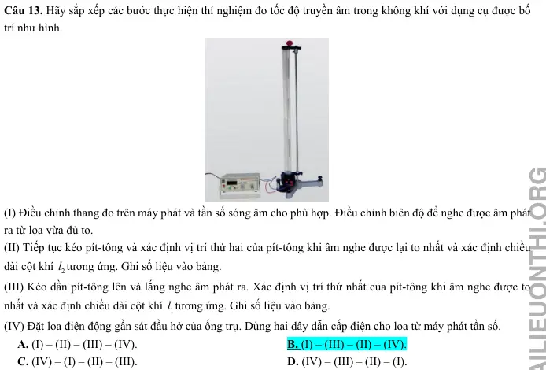
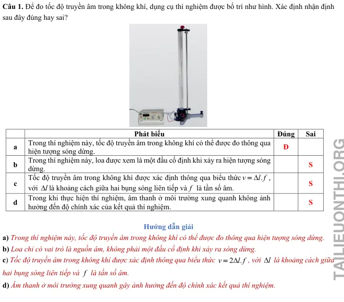
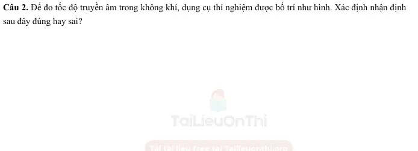
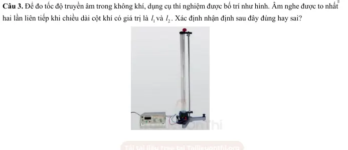
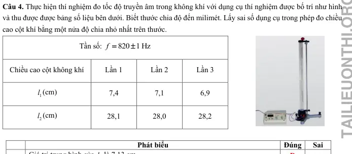
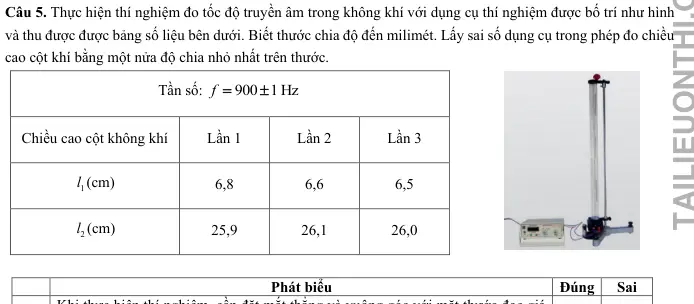
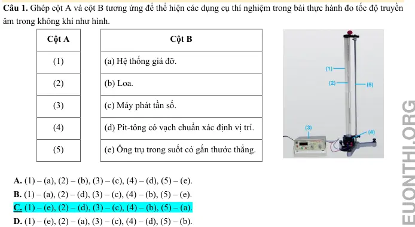
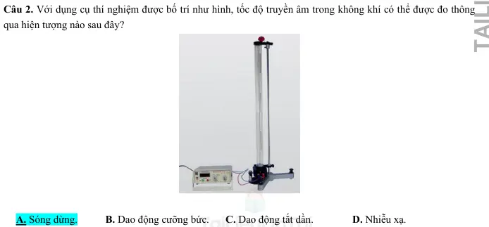
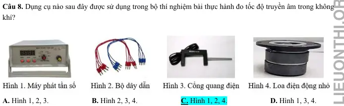
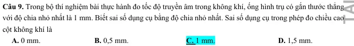

# Bài tập — Bài 9 — Thực hành đo tốc độ truyền âm

> Hệ bài tập được biên soạn theo các dạng xuất hiện trong bộ tài liệu Vật lí 11 của dự án. Câu hỏi được giữ ngắn, trực tiếp; độ khó tăng dần và không cố tình thêm dữ kiện gây nhiễu.

[← Trở lại bài học](../../09-practical-sound-speed.md)

## Phần A — Trắc nghiệm 4 lựa chọn

### Câu 1 — Mức 1 — Nhận biết

Đo được bước sóng âm $0,68$ m và tần số $500$ Hz. Tốc độ âm là

A. $250$ m/s.  
B. $340$ m/s.  
C. $500$ m/s.  
D. $680$ m/s.

### Câu 2 — Mức 1 — Nhận biết

Trong phương pháp cộng hưởng cột khí một đầu kín, chênh lệch giữa hai chiều dài cộng hưởng liên tiếp bằng

A. $\lambda/4$.  
B. $\lambda/2$.  
C. $\lambda$.  
D. $2\lambda$.

### Câu 3 — Mức 1 — Nhận biết

Đo tốc độ âm bằng tiếng vọng: khoảng cách đến vách là $51$ m, thời gian từ phát đến nghe vọng là $0,30$ s. Tốc độ âm là

A. $170$ m/s.  
B. $255$ m/s.  
C. $340$ m/s.  
D. $680$ m/s.

## Phần B — Đúng/Sai

### Câu 4 — Mức 2 — Thông hiểu

Trong thí nghiệm đo tốc độ âm:

a) Có thể dùng $v=f\lambda$.  
b) Nếu dùng tiếng vọng phải tính quãng đường hai chiều.  
c) Tần số âm thoa tự thay đổi khi dịch ống cộng hưởng.  
d) Nhiệt độ không khí có thể ảnh hưởng kết quả.

## Phần C — Trả lời ngắn

### Câu 5 — Mức 3 — Vận dụng

Hai vị trí cộng hưởng liên tiếp của cột khí là $17,2$ cm và $51,5$ cm. Tần số âm thoa $500$ Hz. Tính tốc độ âm.

### Câu 6 — Mức 3 — Vận dụng

Một phép đo tiếng vọng: người đứng cách vách $85$ m, thời gian nghe vọng $0,50$ s. Tính tốc độ âm.

### Câu 7 — Mức 3 — Vận dụng

Một nguồn $400$ Hz phát âm trong không khí. Đo được khoảng cách giữa hai nút áp suất tương ứng một bước sóng là $0,86$ m. Tính tốc độ.

## Phần D — Vận dụng và vận dụng cao

### Câu 8 — Mức 4 — Vận dụng cao

Trong thí nghiệm cột khí, ba chiều dài cộng hưởng liên tiếp đo được là $L_1=16,8$ cm, $L_2=50,9$ cm, $L_3=85,3$ cm với âm thoa $500$ Hz. Hãy lấy trung bình hai hiệu liên tiếp để ước tính tốc độ âm.

---

[Đáp án và lời giải →](solutions.md)

## Ngân hàng bài tập PDF mở rộng

> Nội dung câu hỏi và dữ kiện trong phần này được giữ nguyên; hệ thống chỉ chuẩn hóa xuống dòng và mã kí tự để hiển thị trên web. Câu trùng được loại bỏ. Với câu có công thức/kí hiệu bị sai khi trích xuất chữ từ PDF, đề bài được giữ dưới dạng ảnh để không làm thay đổi dữ kiện.

### Nhận biết — Trả lời ngắn

#### Bài PDF 1

<!-- source-id: BT-Chuong-II-p233-q1-544 -->

Câu 1. Trong thí nghiệm đo tốc độ truyền âm trong không khí, chiều cao cột không khí sau ba lần đo có giá trị
lần lượt là 35 mm, 33 mm, 31 mm. Giá trị trung bình của chiều cao cột không khí (theo đơn vị cm và đúng với
số chữ số có nghĩa của phép đo) là bao nhiêu?

#### Bài PDF 2

<!-- source-id: BT-Chuong-II-p233-q2-545 -->

Câu 2. Trong thí nghiệm đo tốc độ truyền âm trong không khí, biết sai số tỉ đối của phép đo bước sóng và tốc
độ truyền sóng lần lượt là 0,01 và 0,017. Sai số tỉ đối của phép đo tần số là bao nhiêu (làm tròn đến chữ số thập
phân thứ hai sau dấu phẩy)?

#### Bài PDF 3

<!-- source-id: BT-Chuong-II-p233-q3-546 -->

Câu 3. Thực hiện thí nghiệm đo tốc độ truyền âm trong không khí với tần số
(
)
750
1  Hz
f =
±
, thu được chiều
dài bước sóng là
(
)
45,7
1,4  cm
λ=
±
. Sai số tỉ đối của phép đo tốc độ truyền âm là bao nhiêu (làm tròn đến chữ
số thập phân thứ hai sau dấu phẩy)?

#### Bài PDF 4

<!-- source-id: BT-Chuong-II-p234-q4-547 -->

Câu 4. Thực hiện thí nghiệm đo tốc độ truyền âm trong không khí với tần số
(
)
520
1  Hz
f =
±
, thu được chiều
dài bước sóng là
(
)
65,1
0,7  cm
λ=
±
. Giá trị trung bình của tốc độ truyền âm là bao nhiêu (tính theo đơn vị m/s
và làm tròn đến phần nguyên)?

### Nhận biết — Trắc nghiệm 4 lựa chọn

#### Bài PDF 5

<!-- source-id: BT-Chuong-II-p225-q10-526 -->

Câu 10. Trong bài thực hành đo tốc độ truyền âm trong không khí, các giá trị trung bình của bước sóng, tần số,
tốc độ truyền sóng lần lượt là , ,
f
v
λ
 tương ứng sai số phép đo của các đại lượng là
,
,
f
v
ΔλΔ
Δ. Công thức
tính sai số tỉ đối của phép đo là

A.
v
f
v
f
Δ
Δλ
Δ
λ
=
+
.
B.
v
f
v
f
Δ
Δλ
Δ
λ
=
−
.

C.
.
v
f
v
f
Δ
ΔλΔ
λ
=
.

D.
2
v
f
v
f
Δ
Δλ
Δ
λ
=
−
.

#### Bài PDF 6

<!-- source-id: BT-Chuong-II-p225-q11-527 -->

Câu 11. Chiều cao cột không khí trong thí nghiệm đo tốc độ truyền âm được xác định

A. từ loa đến đáy của pít-tông.

B. từ loa đến vạch chuẩn được đánh dấu trên pít-tông.

C. từ loa đến đầu trên của pít-tông.

D. từ vạch chuẩn được đánh dấu trên pit-tông đến hết chiều dài thước trên ống trụ.

#### Bài PDF 7

<!-- source-id: BT-Chuong-II-p226-q12-528 -->

Câu 12. Đâu không phải là nguyên nhân nào sau đây gây ra sai số khi thực hiện thí nghiệm đo tốc độ truyền âm
trong không khí?
A. Cảm giác nghe của tai không ổn định.

B. Máy phát tần số không ổn định.
C. Đọc số đo không đúng.

D. Nhiệt độ của môi trường xung quanh.

#### Bài PDF 8

<!-- source-id: BT-Chuong-II-p226-q13-529 -->

Câu 13. Hãy sắp xếp các bước thực hiện thí nghiệm đo tốc độ truyền âm trong không khí với dụng cụ được bố
trí như hình.

(I) Điều chỉnh thang đo trên máy phát và tần số sóng âm cho phù hợp. Điều chỉnh biên độ để nghe được âm phát
ra từ loa vừa đủ to.
(II) Tiếp tục kéo pít-tông và xác định vị trí thứ hai của pít-tông khi âm nghe được lại to nhất và xác định chiều
dài cột khí 2l tương ứng. Ghi số liệu vào bảng.
(III) Kéo dần pít-tông lên và lắng nghe âm phát ra. Xác định vị trí thứ nhất của pít-tông khi âm nghe được to
nhất và xác định chiều dài cột khí 1l tương ứng. Ghi số liệu vào bảng.
(IV) Đặt loa điện động gần sát đầu hở của ống trụ. Dùng hai dây dẫn cấp điện cho loa từ máy phát tần số.
A. (I) – (II) – (III) – (IV).

B. (I) – (III) – (II) – (IV).
C. (IV) – (I) – (II) – (III).

D. (IV) – (III) – (II) – (I).

{ loading=lazy }

#### Bài PDF 9

<!-- source-id: BT-Chuong-II-p226-q14-530 -->

Câu 14. Để giảm sai số trong phép đo tốc độ truyền âm trong không khí, bao nhiêu cách khắc phục sau đây là
đúng?
(I) điều chỉnh pít-tông chậm, nhẹ nhàng để có thể biết được chính xác tại giá trị có âm cộng hưởng.
(II) đặt mắt thẳng và vuông góc với mặt thước khi đọc giá trị độ cao pít-tông.
(III) xác định đúng sai số dụng cụ đo.
(IV) kiểm tra, đảm bảo các dụng cụ hoạt động tốt.
A. 1

B. 2

C. 3

D. 4

#### Bài PDF 10

<!-- source-id: BT-Chuong-II-p226-q15-531 -->

Câu 15. Để xác định chính xác vị trí có âm cộng hưởng, pít-tông cần phải

A. làm bằng thép.

B. có vạch chuẩn.

C. vừa khít với ống trụ.
D. gắn nam châm.

#### Bài PDF 11

<!-- source-id: BT-Chuong-II-p226-q16-532 -->

Câu 16. Với l
Δ và
dc
l
Δ
 lần lượt là sai số tuyệt đối trung bình và sai số dụng cụ, sai số tuyệt đối l
Δ trong phép
đo chiều cao cột không khí được xác định bằng công thức

A.
dc
2
l
l
l
Δ
Δ
Δ
=
+
.
B.
dc
2
l
l
l
Δ
Δ
Δ
=
−
.

C.
dc
l
l
l
Δ
Δ
Δ
=
+
.

D.
dc
l
l
l
Δ
Δ
Δ
=
−
.

#### Bài PDF 12

<!-- source-id: BT-Chuong-II-p227-q18-534 -->

Câu 18. Những dụng cụ chính để đo tốc độ truyền âm trong không khí trong phòng thí nghiệm là
A. Ống trụ trong suốt có gắn thước thẳng, dây dẫn, máy phát tần số, loa.
B. Pít-tông, dây dẫn, máy phát tần số, loa.
C. Pít-tông, ống trụ trong suốt có gắn thước thẳng, dây dẫn, loa.
D. Ống trụ trong suốt có gắn thước thẳng, pít-tông, máy phát tần số, loa.

#### Bài PDF 13

<!-- source-id: BT-Chuong-II-p227-q20-536 -->

Câu 20. Trong thí nghiệm đo tốc độ truyền âm trong không khí, biết sai số tỉ đối của phép đo tần số và tốc độ
truyền sóng lần lượt là 0,17% và 1,04%. Sai số tỉ đối của phép đo bước sóng gần nhất với giá trị nào sau đây?

A. 1,2%.

B. 0,85%.

C. 0,18%.

D. 1,5%.

#### Bài PDF 14

<!-- source-id: BT-Chuong-II-p227-q21-537 -->

Câu 21. Thực hiện thí nghiệm đo tốc độ truyền âm trong không khí với tần số
(
)
700
1  Hz
f =
±
, thu được chiều
dài bước sóng là
(
)
49,2
0,9  cm
λ=
±
. Sai số tỉ đối của tốc độ truyền âm xấp xỉ

A. 0,012.

B. 0,12.

C. 1,2.

D. 12.

#### Bài PDF 15

<!-- source-id: BT-Chuong-II-p227-q21-538 -->

Câu 21. Thực hiện thí nghiệm đo tốc độ truyền âm trong không khí với tần số
(
)
600
1  Hz
f =
±
, thu được chiều
dài bước sóng là
(
)
57,2
0,5  cm
λ=
±
. Tốc độ truyền âm là

A.
(
)
343,2
0,5  m/s
v =
±
.

B.
(
)
340,3
0,5  m/s
v =
±
.

C.
(
)
340,3
3,6  m/s
v =
±
.

D.
(
)
343,2
3,6  m/s
v =
±
.

### Nhận biết — Đúng/Sai

#### Bài PDF 16

<!-- source-id: BT-Chuong-II-p229-q1-539 -->

Câu 1. Để đo tốc độ truyền âm trong không khí, dụng cụ thí nghiệm được bố trí như hình. Xác định nhận định
sau đây đúng hay sai?

Phát biểu
Đúng
Sai
a
Trong thí nghiệm này, tốc độ truyền âm trong không khí có thể được đo thông qua
hiện tượng sóng dừng.
Đ

b
Trong thí nghiệm này, loa được xem là một đầu cố định khi xảy ra hiện tượng sóng
dừng.

S
c
Tốc độ truyền âm trong không khí được xác định thông qua biểu thức
.
v
l f
Δ
=
,
với l
Δlà khoảng cách giữa hai bụng sóng liên tiếp và f  là tần số âm.

S
d
Trong khi thực hiện thí nghiệm, âm thanh ở môi trường xung quanh không ảnh
hưởng đến độ chính xác của kết quả thí nghiệm.

S

{ loading=lazy }

#### Bài PDF 17

<!-- source-id: BT-Chuong-II-p229-q2-540 -->

Câu 2. Để đo tốc độ truyền âm trong không khí, dụng cụ thí nghiệm được bố trí như hình. Xác định nhận định
sau đây đúng hay sai?

Phát biểu
Đúng
Sai
a
Sóng âm truyền trong không khí là sóng ngang.

S
b
Tốc độ truyền âm trong không khí được tính theo công thức
.
v
f
λ
=

Đ

c
Không thể đo trực tiếp bước sóng để xác định tốc độ truyền âm.
Đ

d
Sai số tỉ đối của tốc độ truyền âm chính bằng sai số tỉ đối của bước sóng.

S

{ loading=lazy }

#### Bài PDF 18

<!-- source-id: BT-Chuong-II-p230-q3-541 -->

Câu 3. Để đo tốc độ truyền âm trong không khí, dụng cụ thí nghiệm được bố trí như hình. Âm nghe được to nhất
hai lần liên tiếp khi chiều dài cột khí có giá trị là 1l và 2l . Xác định nhận định sau đây đúng hay sai?

Phát biểu
Đúng
Sai
a
Khi thực hiện phép đo, cần điều chỉnh biên độ âm sao cho âm phát ra từ loa càng
to thì càng dễ thực hiện thí nghiệm.

S
b
Bước sóng được xác định bằng biểu thức
(
)
1
2
2 l
l
λ=
−
.
Đ

c
Sai số tuyệt đối của bước sóng được tính bằng công thức
(
)
1
2
2
l
l
Δλ
Δ
Δ
=
−
.

S
d
Có thể thực hiện thí nghiệm với nhiều giá trị tần số khác nhau để tăng độ chính
xác của kết quả thí nghiệm.
Đ

{ loading=lazy }

#### Bài PDF 19

<!-- source-id: BT-Chuong-II-p231-q4-542 -->

Câu 4. Thực hiện thí nghiệm đo tốc độ truyền âm trong không khí với dụng cụ thí nghiệm được bố trí như hình
và thu được được bảng số liệu bên dưới. Biết thước chia độ đến milimét. Lấy sai số dụng cụ trong phép đo chiều
cao cột khí bằng một nửa độ chia nhỏ nhất trên thước.
Tần số:
820
1 Hz
f =
±

Chiều cao cột không khí
Lần 1
Lần 2
Lần 3
1l (cm)
7,4
7,1
6,9
2l (cm)
28,1
28,0
28,2

Phát biểu
Đúng
Sai
a
Giá trị trung bình của 1l  là 7,13 cm.
Đ

b
Sai số tuyệt đối của 2l  là 11, 7 mm
Đ

c
Sai số tỉ đối của phép đo bước sóng là 0,64%.

S
d
Kết quả thí nghiệm đo tốc độ truyền âm trong không khí là (
)
343,9
6,1  m/s
±
.
Đ

{ loading=lazy }

#### Bài PDF 20

<!-- source-id: BT-Chuong-II-p232-q5-543 -->

Câu 5. Thực hiện thí nghiệm đo tốc độ truyền âm trong không khí với dụng cụ thí nghiệm được bố trí như hình
và thu được được bảng số liệu bên dưới. Biết thước chia độ đến milimét. Lấy sai số dụng cụ trong phép đo chiều
cao cột khí bằng một nửa độ chia nhỏ nhất trên thước.
Tần số:
900
1 Hz
f =
±

Chiều cao cột không khí
Lần 1
Lần 2
Lần 3
1l (cm)
6,8
6,6
6,5
2l (cm)
25,9
26,1
26,0

Phát biểu
Đúng
Sai
a
Khi thực hiện thí nghiệm, cần đặt mắt thẳng và vuông góc với mặt thước đọc giá
trị độ cao pít-tông.
Đ

b
Vị trí của pít-tông mà tại đó âm phát ra to nhất là nút sóng.

S
c
Sai số tuyệt đối của 1l  và 2l  hơn kém nhau 0,02 mm.
Đ

d
Sai số tỉ đối của phép đo tốc độ truyền âm nhỏ hơn 1,0 %.

S

{ loading=lazy }

### Thông hiểu — Trắc nghiệm 4 lựa chọn

#### Bài PDF 21

<!-- source-id: BT-Chuong-II-p224-q1-517 -->

Câu 1. Ghép cột A và cột B tương ứng để thể hiện các dụng cụ thí nghiệm trong bài thực hành đo tốc độ truyền
âm trong không khí như hình.
Cột A

Cột B

(1)

(a) Hệ thống giá đỡ.
(2)

(b) Loa.
(3)

(c) Máy phát tần số.
(4)

(d) Pít-tông có vạch chuẩn xác định vị trí.
(5)

(e) Ống trụ trong suốt có gắn thước thẳng.

A. (1) – (a), (2) – (b), (3) – (c), (4) – (d), (5) – (e).
B. (1) – (a), (2) – (d), (3) – (c), (4) – (b), (5) – (e).
C. (1) – (e), (2) – (d), (3) – (c), (4) – (b), (5) – (a).
D. (1) – (e), (2) – (a), (3) – (c), (4) – (d), (5) – (b).

{ loading=lazy }

#### Bài PDF 22

<!-- source-id: BT-Chuong-II-p224-q2-518 -->

Câu 2. Với dụng cụ thí nghiệm được bố trí như hình, tốc độ truyền âm trong không khí có thể được đo thông
qua hiện tượng nào sau đây?

A. Sóng dừng.
B. Dao động cưỡng bức.
C. Dao động tắt dần.
D. Nhiễu xạ.

{ loading=lazy }

#### Bài PDF 23

<!-- source-id: BT-Chuong-II-p225-q4-520 -->

Câu 4. Để xác định tốc độ truyền âm trong không khí v  thông qua hiện tượng sóng dừng, chiều dài cột không
khí trong hai lần nghe âm lớn nhất liên tiếp là 1
2
,
l
l . Công thức nào sau đây là đúng?

A.
(
)
2
1
v
l
f
l
=
+
.

B.
(
)
2
1
v
l
f
l
=
−
.

C.
(
)
2
1
2 l
f
v
l
=
+

D.
(
)
2
1
2 l
f
v
l
=
−
.

#### Bài PDF 24

<!-- source-id: BT-Chuong-II-p225-q5-521 -->

Câu 5. Trong bài thực hành đo tốc độ truyền âm trong phòng thí nghiệm, dụng cụ nào sau đây không sử dụng?

A. Ống trụ trong suốt có gắn thước thẳng.

B. Máy phát tần số.

C. Cần rung.

D. Loa điện động.

#### Bài PDF 25

<!-- source-id: BT-Chuong-II-p225-q6-522 -->

Câu 6. Trong bài thực hành đo tốc độ truyền âm trong phòng thí nghiệm, cần lựa chọn máy phát tần số phát ra
tín hiệu dạng

A. đoạn thẳng.

B. parabol.

C. sin.

D. elip.

#### Bài PDF 26

<!-- source-id: BT-Chuong-II-p225-q7-523 -->

Câu 7. Trong bài thực hành đo tốc độ truyền âm trong phòng thí nghiệm, cần lựa chọn máy phát tần số phát ra
tín hiệu dạng

A. đoạn thẳng.

B. parabol.

C. sin.

D. elip.

#### Bài PDF 27

<!-- source-id: BT-Chuong-II-p225-q8-524 -->

Câu 8. Dụng cụ nào sau đây được sử dụng trong bộ thí nghiệm bài thực hành đo tốc độ truyền âm trong không
khí?

A. Hình 1, 2, 3.

B. Hình 2, 3, 4.

C. Hình 1, 2, 4.

D. Hình 1, 3, 4.

{ loading=lazy }

#### Bài PDF 28

<!-- source-id: BT-Chuong-II-p225-q9-525 -->

Câu 9. Trong bộ thí nghiệm bài thực hành đo tốc độ truyền âm trong không khí, ống hình trụ có gắn thước thẳng
với độ chia nhỏ nhất là 1 mm. Biết sai số dụng cụ bằng độ chia nhỏ nhất. Sai số dụng cụ trong phép đo chiều cao
cột không khí là

A. 0 mm.

B. 0,5 mm.

C. 1 mm.

D. 1,5 mm.

{ loading=lazy }

### Vận dụng — Trắc nghiệm 4 lựa chọn

#### Bài PDF 29

<!-- source-id: BT-Chuong-II-p227-q19-535 -->

Câu 19. Trong thí nghiệm đo tốc độ truyền âm trong không khí, dùng một ống trụ có gắn thước chia độ đến
milimét đo chiều cao cột khí l  là 420 mm. Biết sai số dụng cụ là một độ chia nhỏ nhất của thước. Cách ghi nào
sau đây đúng với số chữ số có nghĩa của phép đo?

A.
(
)
0,42
0,001  m.
l =
±

B.
(
)
42,0
0,1  cm.
l =
±

C.
(
)
420,0
1,0  mm.
l =
±

D.
(
)
4,2
0,01  dm.
l =
±

