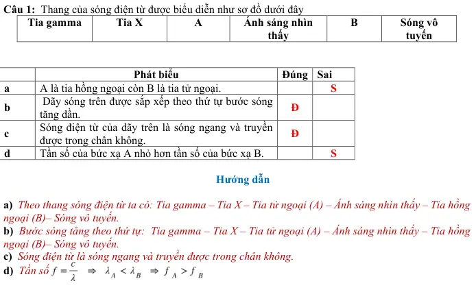

# Bài tập — Bài 12 — Quang phổ và thang sóng điện từ

> Hệ bài tập được biên soạn theo các dạng xuất hiện trong bộ tài liệu Vật lí 11 của dự án. Câu hỏi được giữ ngắn, trực tiếp; độ khó tăng dần và không cố tình thêm dữ kiện gây nhiễu.

[← Trở lại bài học](../../12-spectra-electromagnetic-spectrum.md)

## Phần A — Trắc nghiệm 4 lựa chọn

### Câu 1 — Mức 1 — Nhận biết

Bức xạ có bước sóng ngắn nhất trong các bức xạ sau là

A. hồng ngoại.  
B. ánh sáng đỏ.  
C. tia tử ngoại.  
D. sóng vô tuyến.

### Câu 2 — Mức 1 — Nhận biết

Tia X có tần số so với ánh sáng nhìn thấy thường

A. nhỏ hơn nhiều.  
B. lớn hơn.  
C. bằng nhau.  
D. bằng 0.

### Câu 3 — Mức 1 — Nhận biết

Quang phổ liên tục thường do

A. chất rắn, lỏng hoặc khí áp suất lớn được nung nóng phát ra.  
B. khí loãng phát ra từng vạch riêng.  
C. mọi nguồn đều giống nhau.  
D. chỉ laser phát ra.

## Phần B — Đúng/Sai

### Câu 4 — Mức 2 — Thông hiểu

Xét thang sóng điện từ:

a) Khi tần số tăng thì bước sóng trong chân không giảm.  
b) Hồng ngoại có bước sóng dài hơn ánh sáng đỏ.  
c) Tử ngoại có bước sóng dài hơn hồng ngoại.  
d) Tia gamma có tần số rất cao.

## Phần C — Trả lời ngắn

### Câu 5 — Mức 3 — Vận dụng

Một bức xạ có $\lambda=3\cdot10^{-7}$ m. Tính tần số trong chân không.

### Câu 6 — Mức 3 — Vận dụng

Sắp xếp theo bước sóng tăng dần: tia X, hồng ngoại, ánh sáng nhìn thấy, sóng vô tuyến.

### Câu 7 — Mức 3 — Vận dụng

Một bức xạ có tần số $3\cdot10^{16}$ Hz. Tính bước sóng trong chân không và đổi sang nm.

## Phần D — Vận dụng và vận dụng cao

### Câu 8 — Mức 4 — Vận dụng cao

Hai bức xạ A và B có tần số lần lượt $5\cdot10^{14}$ Hz và $10^{19}$ Hz. Tính bước sóng trong chân không và nhận xét vùng phổ tương đối của chúng.

---

[Đáp án và lời giải →](solutions.md)

## Ngân hàng bài tập PDF mở rộng

> Nội dung câu hỏi và dữ kiện trong phần này được giữ nguyên; hệ thống chỉ chuẩn hóa xuống dòng và mã kí tự để hiển thị trên web. Câu trùng được loại bỏ. Với câu có công thức/kí hiệu bị sai khi trích xuất chữ từ PDF, đề bài được giữ dưới dạng ảnh để không làm thay đổi dữ kiện.

### Nhận biết — Trả lời ngắn

#### Bài PDF 1

<!-- source-id: BT-Chuong-II-p114-q4-258 -->

Câu 4. Một trạm không gian đo được cường độ của bức xạ điện từ phát ra từ một ngôi sao bằng 6.103
W/m2. Cho biết công suất bức xạ trung bình của ngôi sao này bằng 30.1025 W. Giả sử ngôi sao này phát
bức xạ đẳng hướng. Khoảng cách từ ngôi sao này đến trạm không gian có giá trị là bao nhiêu 109 m?

### Nhận biết — Trắc nghiệm 4 lựa chọn

#### Bài PDF 2

<!-- source-id: BT-Chuong-II-p99-q3-200 -->

Câu 3. Tia hồng ngoại là bức xạ

A. có màu hồng nhạt.

B. không nhìn thấy được.
C. không nhìn thấy được có bước sóng lớn hơn bước sóng của ánh sáng đỏ.
D. không nhìn thấy được có bước sóng nhỏ hơn bước sóng của ánh sáng tím.

#### Bài PDF 3

<!-- source-id: BT-Chuong-II-p99-q4-201 -->

Câu 4. Có thể nhận biết tia hồng ngoại bằng
A. pin nhiệt điện.

B. mắt người.

C. quang phổ kế.

D. màn huỳnh quang.

#### Bài PDF 4

<!-- source-id: BT-Chuong-II-p99-q5-202 -->

Câu 5. Trong y học, tia X được ứng dụng trong máy chiếu chụp “X quang” dựa vào tính chất
A. có khả năng đâm xuyên mạnh và tác dụng mạnh lên phim ảnh.
B. có khả năng ion hóa nhiều chất khí.
C. tác dụng mạnh trong các hiện tượng quang điện trong và quang điện ngoài.
D. hủy hoại tế bào nên dùng trong chữa bệnh ung thư.

#### Bài PDF 5

<!-- source-id: BT-Chuong-II-p99-q6-203 -->

Câu 6. Tia X có bước sóng
A. lớn hơn tia hồng ngoại.

B. nhỏ hơn tia tử ngoại.
C. lớn hơn tia tử ngoại.

D. không thể đo được.

#### Bài PDF 6

<!-- source-id: BT-Chuong-II-p100-q9-206 -->

Câu 9. Hồ quang điện không thể phát ra loại tia nào trong các tia sau?
A. Tia hồng ngoại.

B. Ánh sáng nhìn thấy.
C. Tia gamma.

D. Tia tử ngoại.

#### Bài PDF 7

<!-- source-id: BT-Chuong-II-p100-q11-208 -->

Câu 11. Bức xạ có bước sóng 3 µm thuộc vùng bức xạ
A. hồng ngoại.

B. ánh sáng nhìn thấy. C. Rơn-ghen.

D. tử ngoại

#### Bài PDF 8

<!-- source-id: BT-Chuong-II-p100-q12-209 -->

Câu 12. Cho ( )1  Chiếc bàn là nung nóng, ( )
2 ngọn nến, ( )
3  con đom đóm, ( )
4 Mặt trời. Những nguồn
nào phát ra tia Rơn-ghen (tia X) là
A. ( )
1 .

B. ( )
4 .

C. ( )1  và ( )
2 .

D. ( )
2  và ( )
3 .

#### Bài PDF 9

<!-- source-id: BT-Chuong-II-p100-q13-210 -->

Câu 13. Thứ tự sắp xếp tăng dần của bước sóng trong thang sóng điện từ
A. tia X - tia tử ngoại - tia hồng ngoại - ánh sáng nhìn thấy - sóng vô tuyến.
B. tia X - tia tử ngoại - ánh sáng nhìn thấy - tia hồng ngoại - sóng vô tuyến.
C. sóng vô tuyến - tia hồng ngoại - ánh sáng nhìn thấy - tia tử ngoại - tia X.
D. sóng vô tuyến - ánh sáng nhìn thấy - tia hồng ngoại - tia tử ngoại - tia X.

#### Bài PDF 10

<!-- source-id: BT-Chuong-II-p108-q2-234 -->

Câu 2. Sóng điện từ truyền trong không gian có tần số 3.1014 Hz. Coi tốc độ truyền sóng bằng
8
3.10  m/s.
Sóng điện từ này thuộc loại
A. sóng vô tuyến.
B. tia tử ngoại.

C. tia hồng ngoại.
D. tia gamma.

#### Bài PDF 11

<!-- source-id: BT-Chuong-II-p108-q4-236 -->

Câu 4. Một người đang dùng điện thoại di động để thực hiện cuộc gọi. Lúc này điện thoại phát ra
A. bức xạ gamma.
B. tia tử ngoại.

C. tia Rơn-ghen.
D. sóng vô tuyến.

#### Bài PDF 12

<!-- source-id: BT-Chuong-II-p108-q6-238 -->

Câu 6. Tia hồng ngoại được phát ra chỉ bởi
A. các vật được nung nóng (đến nhiệt độ cao).
B. các vật có nhiệt độ trên 00C.
C. vật có nhiệt độ lớn hơn 0 K.
D. mọi vật có nhiệt độ cao hơn môi trường xung quanh.

#### Bài PDF 13

<!-- source-id: BT-Chuong-II-p108-q7-239 -->

Câu 7. Ứng dụng của tia tử ngoại là
A. kiểm tra khuyết tật của sản phẩm.

B. sử dụng trong bộ điều khiển từ xa của tivi.

C. làm đèn chiếu sáng của ô tô.

D. dùng để sấy, sưởi

#### Bài PDF 14

<!-- source-id: BT-Chuong-II-p109-q9-241 -->

Câu 9. Tia tử ngoại là bức xạ
A. có màu tím.
B. không nhìn thấy được.
C. không nhìn thấy được có bước sóng lớn hơn bước sóng của ánh sáng đỏ.
D. không nhìn thấy được có bước sóng nhỏ hơn bước sóng của ánh sáng tím.

#### Bài PDF 15

<!-- source-id: BT-Chuong-II-p109-q10-242 -->

Câu 10. Điều nào sau đây là sai khi so sánh tia hồng ngoại và tia tử ngoại?
A. Cùng bản chất là sóng điện từ.
B. Đều không thể nhìn thấy được bằng mắt thường.
C. Đều có tác dụng lên kính ảnh.
D. Tia hồng ngoại có bước sóng nhỏ hơn tia tử ngoại.

#### Bài PDF 16

<!-- source-id: BT-Chuong-II-p109-q11-243 -->

Câu 11. Tính chất nổi bật của tia X là
A. tác dụng lên kính ảnh.

B. làm phát quang một số chất.
C. làm ion hóa không khí.

D. có khả năng đâm xuyên mạnh

#### Bài PDF 17

<!-- source-id: BT-Chuong-II-p109-q12-244 -->

Câu 12. Tính chất nào sau đây không phải của tia X?
A. Bị lệch hướng trong điện trường.

B. Có khả năng đâm xuyên mạnh.
C. Có tác dụng làm phát quang một số chất. D. Có tác dụng sinh lý như huỷ diệt tế bào.

#### Bài PDF 18

<!-- source-id: BT-Chuong-II-p109-q14-246 -->

Câu 14. Người thợ hàn hồ quang phải cần dùng “mặt nạ” che mặt, mỗi khi cho phóng hồ quang vì
A. Bức xạ phát ra từ hồ quang điện lúc hàn điện chứa rất nhiều tia tử ngoại có thể làm hỏng giác mạc
của mắt và gây ung thư da.
B. Bức xạ phát ra từ hồ quang điện lúc hàn điện chứa rất nhiều tia hồng ngoại có thể làm nóng cơ thể.
C. Bức xạ phát ra từ hồ quang điện lúc hàn điện chứa rất nhiều tia tử ngoại có thể làm ion hóa không
khí xung quanh thợ hàn.
D. Bức xạ phát ra từ hồ quang điện lúc hàn điện chứa rất nhiều tia hồng ngoại có thể kích thích các
phản ứng hóa học không có ích trong cơ thể con người.

#### Bài PDF 19

<!-- source-id: BT-Chuong-II-p109-q15-247 -->

Câu 15. Một bức xạ truyền trong không khí với chu kì 8,25.10-18 s. Bức xạ này thuộc vùng bức xạ
A. hồng ngoại.

B. ánh sáng nhìn thấy.
C. Rơn-ghen.

D. tử ngoại

#### Bài PDF 20

<!-- source-id: BT-Chuong-II-p110-q16-248 -->

Câu 16. Một đèn phát ra bức xạ có tần số f = 1014Hz. Bức xạ này thuộc vùng bức xạ
A. hồng ngoại.

B. ánh sáng nhìn thấy.
C. Rơn-ghen.

D. tử ngoại

#### Bài PDF 21

<!-- source-id: BT-Chuong-II-p110-q17-249 -->

Câu 17. Thứ tự sắp xếp tăng dần của tần số trong thang sóng điện từ là
A. tia X - tia tử ngoại - tia hồng ngoại - ánh sáng nhìn thấy - sóng vô tuyến.
B. tia X - tia tử ngoại - ánh sáng nhìn thấy - tia hồng ngoại - sóng vô tuyến.
C. sóng vô tuyến - tia hồng ngoại - ánh sáng nhìn thấy - tia tử ngoại - tia X.
D. sóng vô tuyến - ánh sáng nhìn thấy - tia hồng ngoại - tia tử ngoại - tia X.

#### Bài PDF 22

<!-- source-id: BT-Chuong-II-p110-q18-250 -->

Câu 18. Tia UVB là bức xạ thuộc vùng tử ngoại có hại cho người vì có thể gây ung thư da. Trong chân
không, tia UVB có bước sóng nằm trong khoảng từ 0,28 μm đến 0,32 μm. Lấy c = 3.108 m/s. Tia UVB
có tần số nằm trong khoảng
A. từ 1,05.1014 Hz đến 9,33.1014 Hz.

B. từ 9,33.1014 Hz đến 1,06.1015 Hz.
C. từ 9,38.1014 Hz đến 1,07.1015 Hz.

D. từ 1,07.1014 Hz đến 1,05.1015 Hz.

### Nhận biết — Đúng/Sai

#### Bài PDF 23

<!-- source-id: BT-Chuong-II-p104-q1-223 -->

Câu 1. Thang của sóng điện từ được biểu diễn như sơ đồ dưới đây
Tia gamma
Tia X
A
Ánh sáng nhìn
thấy
B
Sóng vô
tuyến

Phát biểu
Đúng  Sai
a
A là tia hồng ngoại còn B là tia tử ngoại.

S
b
 Dãy sóng trên được sắp xếp theo thứ tự bước sóng
tăng dần.
Đ

c
Sóng điện từ của dãy trên là sóng ngang và truyền
được trong chân không.
Đ

d
Tần số của bức xạ A nhỏ hơn tần số của bức xạ B.

S

{ loading=lazy }

#### Bài PDF 24

<!-- source-id: BT-Chuong-II-p111-q2-252 -->

Câu 2. Thang của sóng điện từ được được chia vùng như sau :

Phát biểu
Đúng  Sai
a
1 là tia hồng ngoại, 2 là tia tử ngoại và 3 là tia
gamma.
Đ

b
Dãy sóng trên theo chiều từ trên xuống được sắp xếp
theo thứ tự bước sóng tăng dần.

S
c
Sóng điện từ của dãy trên có thể là sóng ngang hoặc
sóng dọc và truyền được trong chân không.
Đ

d
Tần số sóng của bức xạ 3 nhỏ hơn tần số của bức xạ
1.

S

### Thông hiểu — Trắc nghiệm 4 lựa chọn

#### Bài PDF 25

<!-- source-id: BT-Chuong-II-p100-q14-211 -->

Câu 14. Tầng ôzon là tấm “áo giáp” bảo vệ cho người và sinh vật trên mặt đất khỏi bị tác dụng hủy diệt
của
A. tia tử ngoại trong ánh sáng Mặt Trời.

B. tia hồng ngoại trong ánh sáng Mặt Trời.
C. tia đơn sắc màu đỏ trong ánh sáng Mặt Trời.
D. tia đơn sắc màu tím trong ánh sáng Mặt Trời.

#### Bài PDF 26

<!-- source-id: BT-Chuong-II-p100-q17-214 -->

Câu 17. Bước sóng của bức xạ da cam trong chân không là 600 nm thì tần số của bức xạ đó là
A. 5.1012 Hz.

B. 5.1013 Hz.

C. 5.1014 Hz.

D. 5.1015 Hz.

#### Bài PDF 27

<!-- source-id: BT-Chuong-II-p100-q18-215 -->

Câu 18. Một đèn phát ra bức xạ có tần số f = 1014Hz. Bức xạ này thuộc vùng bức xạ

A. hồng ngoại.

B. ánh sáng nhìn thấy.
C. Rơn-ghen.

D. tử ngoại

#### Bài PDF 28

<!-- source-id: BT-Chuong-II-p101-q19-216 -->

Câu 19. Một bức xạ truyền trong không khí với chu kì 8,25.10-18 s. Bức xạ này thuộc vùng bức xạ
A. hồng ngoại.

B. ánh sáng nhìn thấy.
C. Rơn-ghen.

D. tử ngoại

#### Bài PDF 29

<!-- source-id: BT-Chuong-II-p101-q20-217 -->

Câu 20. Tia UVA là bức xạ thuộc vùng tử ngoại có hại cho người vì có thể gây ung thư da. Trong chân
không, tia UVA có bước sóng nằm trong khoảng từ 0,32 μm đến 0,38 μm. Lấy c = 3.108 m/s. Tia UVA
có tần số nằm trong khoảng
A. từ 1,05.1014 Hz đến 9,33.1014 Hz.

B. từ 7,89.1014 Hz đến 9,38.1014 Hz.
C. từ 9,38.1014 Hz đến 1,07.1015 Hz.

D. từ 1,07.1014 Hz đến 1,05.1015 Hz.

