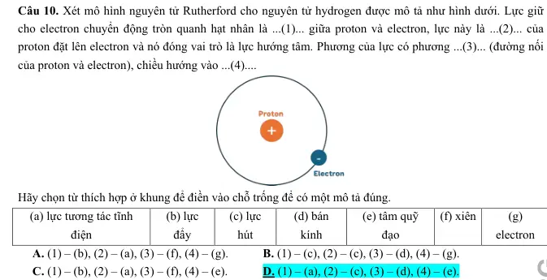

# Bài tập — Bài 1 — Thuyết electron và bảo toàn điện tích

> Hệ bài tập được biên soạn theo các dạng xuất hiện trong bộ tài liệu Vật lí 11 của dự án. Câu hỏi được giữ ngắn, trực tiếp; độ khó tăng dần và không cố tình thêm dữ kiện gây nhiễu.

[← Trở lại bài học](../../01-electron-theory-charge-conservation.md)

## Phần A — Trắc nghiệm 4 lựa chọn

### Câu 1 — Mức 1 — Nhận biết

Một vật trung hòa nhận thêm $5\cdot10^{12}$ electron. Điện tích của vật là

A. $+8,0\cdot10^{-7}$ C.  
B. $-8,0\cdot10^{-7}$ C.  
C. $+3,2\cdot10^{-7}$ C.  
D. $-3,2\cdot10^{-7}$ C.

### Câu 2 — Mức 1 — Nhận biết

Trong quá trình nhiễm điện thông thường của vật rắn, hạt thường dịch chuyển từ vật này sang vật khác là

A. proton.  
B. neutron.  
C. electron.  
D. hạt nhân.

### Câu 3 — Mức 1 — Nhận biết

Một hệ cô lập gồm hai vật có điện tích ban đầu $+3\,\mu$C và $-1\,\mu$C. Sau khi cho tương tác rồi tách ra, tổng điện tích của hệ bằng

A. $-4\,\mu$C.  
B. $-2\,\mu$C.  
C. $+2\,\mu$C.  
D. $+4\,\mu$C.

### Câu 4 — Mức 1 — Nhận biết

Vật dẫn điện khác vật cách điện chủ yếu ở chỗ

A. vật dẫn luôn mang điện dương.  
B. vật dẫn có các hạt mang điện tự do có thể dịch chuyển dễ hơn.  
C. vật cách điện không chứa điện tích.  
D. vật dẫn không có electron.

## Phần B — Đúng/Sai

### Câu 5 — Mức 2 — Thông hiểu

Xét các phát biểu về điện tích:

a) Điện tích của electron là âm.  
b) Độ lớn điện tích electron bằng điện tích proton.  
c) Một vật nhiễm điện âm thường là vật thừa electron.  
d) Trong hệ cô lập, tổng đại số điện tích có thể tự tăng lên mà không có trao đổi với bên ngoài.

### Câu 6 — Mức 2 — Thông hiểu

Về các cách nhiễm điện:

a) Cọ xát có thể làm electron chuyển từ vật này sang vật kia.  
b) Tiếp xúc với vật nhiễm điện có thể làm điện tích phân bố lại.  
c) Hưởng ứng đòi hỏi bắt buộc hai vật chạm nhau.  
d) Sau hưởng ứng, điện tích trong vật dẫn có thể phân bố không đều.

## Phần C — Trả lời ngắn

### Câu 7 — Mức 3 — Vận dụng

Một vật mất $2,5\cdot10^{13}$ electron. Tính điện tích của vật.

### Câu 8 — Mức 3 — Vận dụng

Điện tích của một vật là $-3,2\cdot10^{-8}$ C. Vật thừa bao nhiêu electron?

### Câu 9 — Mức 3 — Vận dụng

Hai quả cầu kim loại giống nhau mang điện $q_1=+8\,\mu$C và $q_2=-2\,\mu$C. Cho tiếp xúc rồi tách xa. Bỏ qua mất mát điện tích. Tính điện tích mỗi quả cầu sau cùng.

## Phần D — Vận dụng và vận dụng cao

### Câu 10 — Mức 4 — Vận dụng cao

Ba quả cầu kim loại giống nhau A, B, C có điện tích ban đầu lần lượt $+6\,\mu$C, $0$, $-3\,\mu$C. Cho A tiếp xúc B rồi tách ra; sau đó cho B tiếp xúc C rồi tách ra. Tính điện tích cuối cùng của A, B, C.

---

[Đáp án và lời giải →](solutions.md)

## Ngân hàng bài tập PDF mở rộng

> Nội dung câu hỏi và dữ kiện trong phần này được giữ nguyên; hệ thống chỉ chuẩn hóa xuống dòng và mã kí tự để hiển thị trên web. Câu trùng được loại bỏ. Với câu có công thức/kí hiệu bị sai khi trích xuất chữ từ PDF, đề bài được giữ dưới dạng ảnh để không làm thay đổi dữ kiện.

### Nhận biết — Trả lời ngắn

#### Bài PDF 1

<!-- source-id: BT-Chuong-III-p16-q1-48 -->

Câu 1. Bốn quả cầu kim loại kích thước giống nhau mang điện tích
C;
 1,2
1
μ
=
q
C;

10
.
264
7
2
−
=
q
C
 9,5
3
μ
−
=
q
 và
C.

10
.5,3
5
4
−
−
=
q
 Cho 4 quả cầu đồng thời tiếp xúc nhau sau đó tách chúng ra. Điện tích
mỗi quả cầu là bao nhiêu μC ?

#### Bài PDF 2

<!-- source-id: BT-Chuong-III-p16-q3-50 -->

Câu 3. Biết khoảng cách từ electron trong nguyên tử hydrogen đến hạt nhân của nguyên tử này là 5.10-11
m, điện tích của electron và proton có độ lớn bằng nhau 1,6.10−19 C. Lấy
12
2
2
0
8,85.10
 C /Nm
ε
−
=
. Lực
điện tương tác giữa electron và proton của nguyên tử hydrogen là bao nhiêu (tính theo đơn vị nN và làm
tròn đến chữ số thập phân thứ hai sau dấu phẩy)?

#### Bài PDF 3

<!-- source-id: BT-Chuong-III-p23-q1-76 -->

Câu 1. Biết điện tích của electron
19
1,6.10
 C
eq
−
= −
. Tính lực tương tác giữa hai electron ở cách nhau
10
1,0.10
 m
−
trong chân không (theo đơn vị nN và làm tròn đơn chữ số hàng đơn vị).

### Nhận biết — Trắc nghiệm 4 lựa chọn

#### Bài PDF 4

<!-- source-id: BT-Chuong-III-p5-q2-2 -->

Câu 2. Lực tương tác tĩnh điện giữa hai điện tích điểm không phụ thuộc vào những yếu tố nào?

A. Môi trường đặt hai điện tích điểm.
B. Điện tích của hai điện tích điểm.

C. Khoảng cách giữa hai điện tích điểm.
D. Số lượng electron có trong điện tích điểm.

#### Bài PDF 5

<!-- source-id: BT-Chuong-III-p5-q5-5 -->

Câu 5. Một điện tích âm không thể

A. hút một điện tích dương.

B. tương tác điện với một vật khác trung hoà về điện.

C. đẩy một điện tích âm khác.

D. làm một vật trung hoà về điện nhiễm điện tích dương thông qua tiếp xúc.

#### Bài PDF 6

<!-- source-id: BT-Chuong-III-p6-q11-11 -->

Câu 11. Một nhóm học sinh làm thí nghiệm về sự nhiễm điện của ba vật A, B, C. Khi các vật A và B được
đưa lại gần nhau, chúng hút nhau. Khi các vật B và C được đưa lại gần nhau, chúng đẩy nhau. Phát biểu
nào sau đây là đúng?

A. Vật A và C mang điện cùng dấu.
B. Vật A và C mang điện trái dấu.

C. Cả ba vật đều mang điện cùng dấu.
D. Vật A trái dấu với C hoặc A trung hoà.

#### Bài PDF 7

<!-- source-id: BT-Chuong-III-p7-q15-15 -->

Câu 15. Hai quả cầu kim loại cùng kích thước, cùng khối lượng được tích điện và được treo bằng hai dây.
Thoạt đầu chúng hút nhau, sau khi cho tiếp xúc chúng đẩy nhau. Kết luận nào sau đây đúng về hai quả cầu
trước khi tiếp xúc?

A. Cả hai tích điện dương.

B. Cả hai tích điện âm.

C. Hai quả cầu tích điện có độ lớn bằng nhau nhưng trái dấu.

D. Hai quả cầu tích điện có độ lớn không bằng nhau và trái dấu.

#### Bài PDF 8

<!-- source-id: BT-Chuong-III-p18-q2-55 -->

Câu 2. Quả cầu trung hoà về điện sau khi tiếp xúc với thanh nhiễm điện âm sẽ trở nên nhiễm điện âm và
hút được tóc. Sự nhiễm điện của quả cầu là nhiễm điện do

A. cọ xát.

B. tiếp xúc.

C. hưởng ứng.

D. hút đẩy.

#### Bài PDF 9

<!-- source-id: BT-Chuong-III-p18-q3-56 -->

Câu 3. Trong những cách sau cách nào có thể làm nhiễm điện cho một vật ?

A. Cọ chiếc vỏ bút lên tóc.
B. Đặt một nhanh nhựa gần một vật đã nhiễm điện.

C. Đặt một vật gần nguồn điện.
D. Cho một vật tiếp xúc với viên pin.

#### Bài PDF 10

<!-- source-id: BT-Chuong-III-p18-q4-57 -->

Câu 4. Vào mùa hanh khô, nhiều khi kéo áo len qua đầu, ta thấy có tiếng nổ “tách tách”. Đó là do

A. nhiễm điện do tiếp xúc.
B. nhiễm điện do cọ xát.

C. nhiễm điện do hưởng ứng.
D. các sợi len bị kéo dãn.

#### Bài PDF 11

<!-- source-id: BT-Chuong-III-p18-q5-58 -->

Câu 5. Bốn vật kích thước nhỏ A, B, C, D nhiễm điện. Vật A hút vật B nhưng đẩy vật C, vật C hút vật D.
Biết A nhiễm điện dương. B, C, D nhiễm điện lần lượt là

A. âm, âm, dương.

B. âm, dương, dương.

C. âm, dương, âm.

D. dương, âm, dương.

#### Bài PDF 12

<!-- source-id: BT-Chuong-III-p18-q6-59 -->

Câu 6. Trong các cách nhiễm điện sau đây, cách nào thì tổng đại số điện tích trên vật được nhiễm điện
không thay đổi?

Cách I. cọ xát;
 Cách II. tiếp xúc;
Cách III. hưởng ứng

A. I.
B. II.
C. III.

D. Không có cách nào.

#### Bài PDF 13

<!-- source-id: BT-Chuong-III-p19-q10-63 -->

Câu 10. Xét mô hình nguyên tử Rutherford cho nguyên tử hydrogen được mô tả như hình dưới. Lực giữ
cho electron chuyển động tròn quanh hạt nhân là ...(1)... giữa proton và electron, lực này là ...(2)... của
proton đặt lên electron và nó đóng vai trò là lực hướng tâm. Phương của lực có phương ...(3)... (đường nối
của proton và electron), chiều hướng vào ...(4)....

Hãy chọn từ thích hợp ở khung để điền vào chỗ trống để có một mô tả đúng.
(a) lực tương tác tĩnh
điện
(b) lực
đẩy
(c) lực
hút
(d) bán
kính
(e) tâm quỹ
đạo
(f) xiên
(g)
electron

A. (1) – (b), (2) – (a), (3) – (f), (4) – (g).
B. (1) – (c), (2) – (c), (3) – (d), (4) – (g).

C. (1) – (b), (2) – (a), (3) – (f), (4) – (e).
D. (1) – (a), (2) – (c), (3) – (d), (4) – (e).

{ loading=lazy }

#### Bài PDF 14

<!-- source-id: BT-Chuong-III-p19-q11-64 -->

Câu 11. Có hai quả cầu giống nhau cùng mang điện tích có độ lớn như nhau, khi đưa chúng lại gần thì
chúng đẩy nhau. Cho chúng tiếp xúc nhau, sau đó tách chúng ra một khoảng nhỏ thì chúng

A. hút nhau.

B. đẩy nhau.

C. có thể hút hoặc đẩy nhau.
D. không tương tác nhau.

#### Bài PDF 15

<!-- source-id: BT-Chuong-III-p20-q16-69 -->

Câu 16. Một nguyên tử hydrogen chỉ chứa duy nhất một hạt proton và một hạt electron. Biết rằng bán kính
trung bình của nguyên tử của nguyên tố hydrogen bằng
9
5.10  cm
−
và điện tích electron là
19
1,6.10
C
eq
−
= −
. Lực tĩnh điện giữa hạt nhân và điện tử trong nguyên tử đó

A. lực đẩy, có độ lớn
8
9,2.10  N
−
.
B. lực đẩy, có độ lớn
8
2,9.10  N
−
.

C. lực hút, có độ lớn
8
9,2.10  N
−
.
D. lực hút, có độ lớn
8
2,9.10  N
−
.

### Nhận biết — Đúng/Sai

#### Bài PDF 16

<!-- source-id: BT-Chuong-III-p14-q4-45 -->

Câu 4. Hai quả cầu A, B có kích thước nhỏ được đặt cách nhau một khoảng 12 cm trong chân không. Biết
quả cầu A có điện tích –3,2.10-7 C và quả cầu B có điện tích 2,4.10-7 C. Cho hai quả cầu tiếp xúc với nhau,
sau đó đặt cách nhau một khoảng như lúc đầu.

Nội dung
Đúng
Sai
a
Hằng số điện môi của chân không bằng 1.
Đ

b
Sau khi tiếp xúc, hai quả cầu đều mang điện tích
C.

10
.4,0
7
−
−

Đ

c
Lực tương tác giữa hai quả cầu trước khi tiếp xúc có độ lớn là 0,048 N.
Đ

d
Sau khi tiếp xúc, lực tương tác của hai quả cầu giảm 8 lần.

S

#### Bài PDF 17

<!-- source-id: BT-Chuong-III-p15-q5-46 -->

Câu 5. Cấu trúc nguyên tử helium gồm hạt nhân (hai proton và hai neutron) với hai electron nằm ở lớp vỏ.
Biết khoảng cách từ electron đến hạt nhân của nguyên tử helium là
11
2,94.10
 m
−
, điện tích của electron và
proton lần lượt là
19
19
1,6.10
 C;
1,6.10
 C
e
p
q
q
−
−
= −
=
, khối lượng của electron là
31
9,1.10
 kg
−
.

Phát biểu
Đúng
Sai
a
Hạt nhân của nguyên tử helium trung hoà về điện.

S
b
Lực hút giữa proton và electron giúp electron chuyển động xung quanh hạt nhân.
Đ

c
Lực điện tương tác giữa hạt nhân nguyên tử helium với một electron nằm trong
lớp vỏ có độ lớn khoảng 0,53 μN .
Đ

d
Nếu coi electron chuyển động tròn đều quanh hạt nhân dưới tác dụng của lực
điện thì tốc độ góc của electron là 4,14.106 rad/s.

S

#### Bài PDF 18

<!-- source-id: BT-Chuong-III-p22-q3-74 -->

Câu 3. Xét hai quả cầu kim loại nhỏ giống nhau mang các điện tích
1q  và
2q  được đặt trong không khí
cách nhau 2 cm, đẩy nhau bằng một lực có độ lớn 2,7.10-4 N. Cho hai quả cầu tiếp xúc với nhau rồi lại đưa
về vị trí ban đầu thì lực đẩy giữa chúng có độ lớn 3,6.10-4 N.

Nội dung
Đúng
Sai
a
Trước khi tiếp xúc, hai điện tích
1q  và
2q  tích điện cùng dấu.
Đ

b
Tổng điện tích trước và sau khi cho hai quả cầu tiếp xúc là khác nhau.

S
c
Sau khi tiếp xúc, nhúng hai quả cầu vào dầu có hằng số điện môi là 2 thì lực đẩy
giữa chúng không đổi so với ban đầu.

S
d
Điện tích
1q có thể nhận một trong bốn nhận giá trị
9
2.10  C
−
±
 hoặc
9
6.10  C
−
±

Đ

### Thông hiểu — Trắc nghiệm 4 lựa chọn

#### Bài PDF 19

<!-- source-id: BT-Chuong-III-p7-q16-16 -->

Câu 16. Khi cọ xát lược nhựa với tóc, lược nhựa sẽ bị nhiễm điện và hút các mẩu giấy vụn. Đây là hiện
tượng nhiễm điện do

A. cọ xát.

B. tiếp xúc.

C. hưởng ứng.

D. hút đẩy.

#### Bài PDF 20

<!-- source-id: BT-Chuong-III-p7-q17-17 -->

Câu 17. Dùng vải cọ xát một đầu thanh nhựa rồi đưa lại gần hai vật nhẹ A, B thì thấy thanh nhựa hút cả hai
vật này. Hai vật này không thể là

A. hai vật không nhiễm điện.
B. hai vật nhiễm điện cùng loại.

C. hai vật nhiễm điện khác loại.
D. một vật nhiễm điện, một vật không nhiễm điện.

#### Bài PDF 21

<!-- source-id: BT-Chuong-III-p7-q18-18 -->

Câu 18. Trong các hiện tượng sau, hiện tượng nào không liên quan đến nhiễm điện?

A. Lược dính rất nhiều tóc khi chải đầu.

B. Chim thường xù lông về mùa rét.

C. Ô tô chở nhiên liệu thường thả một sợi dây xích kéo trên mặt đường.

D. Sét giữa hai đám mây hoặc giữa đám mây với mặt đất.

#### Bài PDF 22

<!-- source-id: BT-Chuong-III-p8-q21-21 -->

Câu 21. Có thể áp dụng định luật Coulomb để tính lực tương tác trong trường hợp tương tác

A. giữa hai thanh thủy tinh nhiễm đặt gần nhau.

B. giữa một thanh thủy tinh và một thanh nhựa nhiễm điện đặt gần nhau.

C. giữa hai quả cầu nhỏ tích điện đặt xa nhau.

D. điện giữa một thanh thủy tinh và một quả cầu lớn.

#### Bài PDF 23

<!-- source-id: BT-Chuong-III-p8-q25-25 -->

Câu 25. Có hai quả cầu giống nhau mang điện tích
1q  và
2
q có độ lớn như nhau, khi đưa chúng lại gần
nhau thì chúng hút nhau. Cho chúng tiếp xúc nhau rồi tách chúng ra một khoảng thì chúng

A. hút nhau.

B. đẩy nhau.

C. có thể hút hoặc đẩy nhau.
D. không tương tác nhau.

#### Bài PDF 24

<!-- source-id: BT-Chuong-III-p9-q26-26 -->

Câu 26. Hai quả cầu kim loại giống nhau mang điện tích
1q  và
2
q  với
,
2
1
q
q =
 đưa chúng lại gần thì
chúng đẩy nhau. Nếu cho chúng tiếp xúc nhau rồi sau đó tách ra thì mỗi quả cầu sẽ mang điện tích

A.
1
2q .
B. 0.
C.
1q .
D.
1 2
q
.

### Vận dụng — Trắc nghiệm 4 lựa chọn

#### Bài PDF 25

<!-- source-id: BT-Chuong-III-p12-q38-38 -->

Câu 38. Hai quả cầu kim loại nhỏ giống hệt nhau, mang các điện tích
1q  và
2
1
5
q
q
=
 tác dụng lên nhau một
lực bằng F. Nếu cho chúng tiếp xúc với nhau rồi đưa đến các vị trí cũ thì tỉ số giữa lực tương tác lúc sau
với lực tương tác lúc chưa tiếp xúc là

A. 6
5 .
B. 9
5 .
C. 5
9 .

D. 5
6 .

