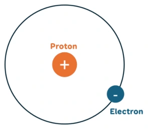

# Bài tập — Bài 1 — Thuyết electron và bảo toàn điện tích

[← Trở lại bài học](../../01-electron-theory-charge-conservation.md)

## Phần A — Trắc nghiệm 4 lựa chọn

### Bài 1 — Mức 1 — Nhận biết

Một vật trung hòa nhận thêm $5\cdot10^{12}$ electron. Điện tích của vật là

A. $+8,0\cdot10^{-7}\,\mathrm C$.

B. $-8,0\cdot10^{-7}\,\mathrm C$.

C. $+3,2\cdot10^{-7}\,\mathrm C$.

D. $-3,2\cdot10^{-7}\,\mathrm C$.

??? success "Đáp án và lời giải"
    Chọn **B**. $q=-Ne=-5\cdot10^{12}\cdot1,6\cdot10^{-19}=-8,0\cdot10^{-7}\,\mathrm C$.

### Bài 2 — Mức 1 — Nhận biết

Trong quá trình nhiễm điện thông thường của vật rắn, hạt thường dịch chuyển từ vật này sang vật khác là

A. proton.

B. neutron.

C. electron.

D. hạt nhân.

??? success "Đáp án và lời giải"
    Chọn **C**. Electron ngoài cùng có thể dịch chuyển; hạt nhân gắn trong mạng vật chất.

### Bài 3 — Mức 1 — Nhận biết

Một hệ cô lập gồm hai vật có điện tích ban đầu $+3\,\mu\,\mathrm C$ và $-1\,\mu\,\mathrm C$. Sau khi cho tương tác rồi tách ra, tổng điện tích của hệ bằng

A. $-4\,\mu\,\mathrm C$.

B. $-2\,\mu\,\mathrm C$.

C. $+2\,\mu\,\mathrm C$.

D. $+4\,\mu\,\mathrm C$.

??? success "Đáp án và lời giải"
    Chọn **C**. Tổng điện tích hệ cô lập được bảo toàn: $+3-1=+2\,\mu\,\mathrm C$.

### Bài 4 — Mức 1 — Nhận biết

Vật dẫn điện khác vật cách điện chủ yếu ở chỗ

A. vật dẫn luôn mang điện dương.

B. vật dẫn có các hạt mang điện tự do có thể dịch chuyển dễ hơn.

C. vật cách điện không chứa điện tích.

D. vật dẫn không có electron.

??? success "Đáp án và lời giải"
    Chọn **B**.

## Phần B — Đúng/Sai

### Bài 5 — Mức 2 — Thông hiểu

Xét các phát biểu về điện tích:

a) Điện tích của electron là âm.

b) Độ lớn điện tích electron bằng điện tích proton.

c) Một vật nhiễm điện âm thường là vật thừa electron.

d) Trong hệ cô lập, tổng đại số điện tích có thể tự tăng lên mà không có trao đổi với bên ngoài.

??? success "Đáp án và lời giải"
    a) **Đúng.** Electron mang điện tích nguyên tố $q_e=-e\approx-1{,}602\times10^{-19}\,\mathrm C$.

    b) **Đúng.** về độ lớn.

    c) **Đúng.** Điện tích âm xuất hiện khi số electron của vật lớn hơn trạng thái trung hòa điện.

    d) **Sai.** theo định luật bảo toàn điện tích.

### Bài 6 — Mức 2 — Thông hiểu

Về các cách nhiễm điện:

a) Cọ xát có thể làm electron chuyển từ vật này sang vật kia.

b) Tiếp xúc với vật nhiễm điện có thể làm điện tích phân bố lại.

c) Hưởng ứng đòi hỏi bắt buộc hai vật chạm nhau.

d) Sau hưởng ứng, điện tích trong vật dẫn có thể phân bố không đều.

??? success "Đáp án và lời giải"
    a) **Đúng.** Khi cọ xát, electron có thể được trao đổi giữa hai vật; proton vẫn liên kết trong hạt nhân.

    b) **Đúng.** Khi các vật dẫn tiếp xúc, electron có thể dịch chuyển giữa chúng cho đến khi đạt trạng thái cân bằng điện.

    c) **Sai.** hưởng ứng xảy ra do tác dụng điện từ xa, không cần tiếp xúc.

    d) **Đúng.** Điện trường ngoài làm electron tự do dịch chuyển, khiến các vùng khác nhau của vật dẫn mang mật độ điện tích bề mặt khác nhau.

## Phần C — Trả lời ngắn

### Bài 7 — Mức 3 — Vận dụng

Một vật mất $2,5\cdot10^{13}$ electron. Tính điện tích của vật.

??? success "Đáp án và lời giải"
    Mất electron nên vật dương: $q=Ne=2,5\cdot10^{13}\cdot1,6\cdot10^{-19}=4,0\cdot10^{-6}\,\mathrm C$ $=4\,\mu\,\mathrm C$.

### Bài 8 — Mức 3 — Vận dụng

Điện tích của một vật là $-3,2\cdot10^{-8}\,\mathrm C$. Vật thừa bao nhiêu electron?

??? success "Đáp án và lời giải"
    $N=|q|/e=3,2\cdot10^{-8}/1,6\cdot10^{-19}=2,0\cdot10^{11}$ electron.

### Bài 9 — Mức 3 — Vận dụng

Hai quả cầu kim loại giống nhau mang điện $q_1=+8\,\mu\,\mathrm C$ và $q_2=-2\,\mu\,\mathrm C$. Cho tiếp xúc rồi tách xa. Bỏ qua mất mát điện tích. Tính điện tích mỗi quả cầu sau cùng.

??? success "Đáp án và lời giải"
    Tổng điện tích $Q=+6\,\mu\,\mathrm C$. Hai quả cầu giống nhau nên sau tiếp xúc điện tích chia đều: $q'_1=q'_2=Q/2=+3\,\mu\,\mathrm C$.

## Phần D — Vận dụng và vận dụng cao

### Bài 10 — Mức 4 — Vận dụng cao

Ba quả cầu kim loại giống nhau A, B, C có điện tích ban đầu lần lượt $+6\,\mu\,\mathrm C$, $0$, $-3\,\mu\,\mathrm C$. Cho A tiếp xúc B rồi tách ra; sau đó cho B tiếp xúc C rồi tách ra. Tính điện tích cuối cùng của A, B, C.

??? success "Đáp án và lời giải"
    Lần 1, A và B giống nhau nên chia đều tổng $6\,\mu\,\mathrm C$: $q_A=q_B=3\,\mu\,\mathrm C$.

    Lần 2, B có $+3\,\mu\,\mathrm C$ tiếp xúc C có $-3\,\mu\,\mathrm C$. Tổng bằng 0 nên sau khi tách: $q_B=q_C=0$.

    A không tham gia lần 2 nên vẫn $+3\,\mu\,\mathrm C$.

    Kết quả: $q_A=+3\,\mu\,\mathrm C$, $q_B=0$, $q_C=0$. Tổng cuối vẫn $+3\,\mu\,\mathrm C$, đúng bằng tổng ban đầu.

## Ngân hàng bài tập mở rộng

### Nhận biết — Trả lời ngắn

#### Bài 11

<!-- source-id: BT-Chuong-III-p16-q1-48 -->

Bốn quả cầu kim loại có kích thước giống nhau mang các điện tích $q_1=2{,}1\,\mu\mathrm C$, $q_2=264\cdot10^{-7}\,\mathrm C$, $q_3=-5{,}9\,\mu\mathrm C$ và $q_4=-3{,}5\cdot10^{-5}\,\mathrm C$. Cho bốn quả cầu đồng thời tiếp xúc nhau rồi tách chúng ra. Điện tích của mỗi quả cầu bằng bao nhiêu $\mu\mathrm C$?

??? success "Đáp án và lời giải"
    **Đáp án:** $-3{,}1\,\mu\mathrm C$

    **Hướng dẫn giải:**

    Tổng điện tích của bốn quả cầu được bảo toàn: $q_\Sigma=2{,}1+26{,}4-5{,}9-35=-12{,}4\,\mu\mathrm C$. Sau khi bốn quả cầu kim loại giống nhau tiếp xúc đồng thời, điện tích phân bố đều nên $q' = q_\Sigma/4=-3{,}1\,\mu\mathrm C$.
#### Bài 12

<!-- source-id: BT-Chuong-III-p16-q3-50 -->

Biết khoảng cách từ electron trong nguyên tử hydrogen đến hạt nhân là $5\cdot10^{-11}\,\mathrm m$, điện tích của electron và proton có độ lớn bằng nhau $1{,}6\cdot10^{-19}\,\mathrm C$. Lấy $\varepsilon_0=8{,}85\cdot10^{-12}\,\mathrm{C^2/(N\,m^2)}$. Lực điện tương tác giữa electron và proton là bao nhiêu (theo đơn vị nN và làm tròn đến hai chữ số thập phân)?

??? success "Đáp án và lời giải"
    **Đáp án:** $0{,}92\,\mathrm{nN}$.

    **Hướng dẫn giải:**

    Theo biểu thức trong nguồn,
    $F=\dfrac{|q_eq_p|}{4\pi\varepsilon_0r^2}=\dfrac{(1{,}6\cdot10^{-19})^2}{4\pi\cdot8{,}85\cdot10^{-12}(5\cdot10^{-11})^2}\approx9{,}21\cdot10^{-10}\,\mathrm N\approx0{,}92\,\mathrm{nN}$.

#### Bài 13

<!-- source-id: BT-Chuong-III-p23-q1-76 -->

Biết điện tích của electron $q_e=-1{,}6\cdot10^{-19}\,\mathrm C$. Tính lực tương tác giữa hai electron ở cách nhau $1{,}0\cdot10^{-10}\,\mathrm m$ trong chân không (theo đơn vị nN và làm tròn đến hàng đơn vị).

??? success "Đáp án và lời giải"
    **Đáp án:** $23\,\mathrm{nN}$.

    **Hướng dẫn giải:**

    Theo định luật Coulomb,
    $F=k\dfrac{|q_eq_e|}{r^2}=9\cdot10^9\dfrac{(1{,}6\cdot10^{-19})^2}{(1{,}0\cdot10^{-10})^2}=2{,}304\cdot10^{-8}\,\mathrm N\approx23\,\mathrm{nN}$.

### Nhận biết — Trắc nghiệm 4 lựa chọn

#### Bài 14

<!-- source-id: BT-Chuong-III-p5-q2-2 -->

Lực tương tác tĩnh điện giữa hai điện tích điểm không phụ thuộc vào những yếu tố nào?

A. Môi trường đặt hai điện tích điểm.

B. Điện tích của hai điện tích điểm.

C. Khoảng cách giữa hai điện tích điểm.

D. Số lượng electron có trong điện tích điểm.

??? success "Đáp án và lời giải"
    **Đáp án:** D

    **Hướng dẫn giải:**

    Theo định luật Coulomb, $F=k|q_1q_2|/(\varepsilon r^2)$, nên lực phụ thuộc điện tích, khoảng cách và môi trường. Số electron trong một vật không phải một biến độc lập khi điện tích $q$ đã được xác định.
#### Bài 15

<!-- source-id: BT-Chuong-III-p5-q5-5 -->

Một điện tích âm không thể

A. hút một điện tích dương.

B. tương tác điện với một vật khác trung hoà về điện.

C. đẩy một điện tích âm khác.

D. làm một vật trung hoà về điện nhiễm điện tích dương thông qua tiếp xúc.

??? success "Đáp án và lời giải"
    **Đáp án:** D

    **Hướng dẫn giải:**

    Một vật nhiễm điện âm có thể hút điện tích dương, đẩy điện tích âm và hút vật trung hòa do phân cực. Khi tiếp xúc với vật dẫn trung hòa, electron có thể truyền sang vật đó; không thể kết luận vật trung hòa sẽ nhiễm điện dương như phương án D.
#### Bài 16

<!-- source-id: BT-Chuong-III-p6-q11-11 -->

Một nhóm học sinh làm thí nghiệm về sự nhiễm điện của ba vật A, B, C. Khi các vật A và B được đưa lại gần nhau, chúng hút nhau. Khi các vật B và C được đưa lại gần nhau, chúng đẩy nhau. Phát biểu nào sau đây là đúng?

A. Vật A và C mang điện cùng dấu.

B. Vật A và C mang điện trái dấu.

C. Cả ba vật đều mang điện cùng dấu.

D. Vật A trái dấu với C hoặc A trung hoà.

??? success "Đáp án và lời giải"
    **Đáp án:** D

    **Hướng dẫn giải:**

    A, B hút nhau:
    (1) A mang điện dương (hoặc âm), B mang điện âm (hoặc dương)
    (2) A trung hòa, B mang điện, chúng hút nhau do hưởng ứng.
    (3) B trung hòa, A mang điện, chúng hút nhau do hưởng ứng.
    B, C đẩy nhau:
    (4) B, C đều mang điện dương (hoặc âm)
    Giao giữa các điều kiện, ta thấy (4) không mâu thuẫn với (1), (2). Vì vậy chọn D.

#### Bài 17

<!-- source-id: BT-Chuong-III-p7-q15-15 -->

Hai quả cầu kim loại cùng kích thước, cùng khối lượng được tích điện và được treo bằng hai dây.
Thoạt đầu chúng hút nhau, sau khi cho tiếp xúc chúng đẩy nhau. Kết luận nào sau đây đúng về hai quả cầu
trước khi tiếp xúc?

A. Cả hai tích điện dương.

B. Cả hai tích điện âm.

C. Hai quả cầu tích điện có độ lớn bằng nhau nhưng trái dấu.

D. Hai quả cầu tích điện có độ lớn không bằng nhau và trái dấu.

??? success "Đáp án và lời giải"
    **Đáp án:** D

    **Hướng dẫn giải:**

    Ban đầu hai quả cầu hút nhau nên chúng có thể trái dấu. Sau khi tiếp xúc lại đẩy nhau, tổng điện tích của hệ phải khác 0; vì thế hai điện tích ban đầu không thể vừa trái dấu vừa có độ lớn bằng nhau. Chọn D.
#### Bài 18

<!-- source-id: BT-Chuong-III-p18-q2-55 -->

Quả cầu trung hoà về điện sau khi tiếp xúc với thanh nhiễm điện âm sẽ trở nên nhiễm điện âm và
hút được tóc. Sự nhiễm điện của quả cầu là nhiễm điện do

A. cọ xát.

B. tiếp xúc.

C. hưởng ứng.

D. hút đẩy.

??? success "Đáp án và lời giải"
    **Đáp án:** B

    **Hướng dẫn giải:**

    Điện tích truyền trực tiếp giữa hai vật khi chúng chạm nhau là nhiễm điện do tiếp xúc. Chọn B.
#### Bài 19

<!-- source-id: BT-Chuong-III-p18-q3-56 -->

Trong những cách sau cách nào có thể làm nhiễm điện cho một vật?

A. Cọ chiếc vỏ bút lên tóc.

B. Đặt một thanh nhựa gần một vật đã nhiễm điện.

C. Đặt một vật gần nguồn điện.

D. Cho một vật tiếp xúc với viên pin.

??? success "Đáp án và lời giải"
    **Đáp án:** A

    **Hướng dẫn giải:**

    Cọ bút nhựa vào tóc làm electron dịch chuyển giữa hai vật, nên đây là nhiễm điện do cọ xát. Chọn A.
#### Bài 20

<!-- source-id: BT-Chuong-III-p18-q4-57 -->

Vào mùa hanh khô, nhiều khi kéo áo len qua đầu, ta thấy có tiếng nổ “tách tách”. Đó là do

A. nhiễm điện do tiếp xúc.

B. nhiễm điện do cọ xát.

C. nhiễm điện do hưởng ứng.

D. các sợi len bị kéo dãn.

??? success "Đáp án và lời giải"
    **Đáp án:** B

    **Hướng dẫn giải:**

    Hiện tượng mô tả điện tích xuất hiện sau khi hai vật khác chất cọ xát nhau, nên thuộc nhiễm điện do cọ xát. Chọn B.
#### Bài 21

<!-- source-id: BT-Chuong-III-p18-q5-58 -->

Bốn vật kích thước nhỏ A, B, C, D nhiễm điện. Vật A hút vật B nhưng đẩy vật C, vật C hút vật D. Biết A nhiễm điện dương. B, C, D nhiễm điện lần lượt là

A. âm, âm, dương.

B. âm, dương, dương.

C. âm, dương, âm.

D. dương, âm, dương.

??? success "Đáp án và lời giải"
    **Đáp án:** C

    **Hướng dẫn giải:**

    A dương hút B nên B âm. A đẩy C nên C dương. C dương hút D nên D âm. Vì vậy B, C, D lần lượt là âm, dương, âm; chọn C.
#### Bài 22

<!-- source-id: BT-Chuong-III-p18-q6-59 -->

Trong các cách nhiễm điện sau đây, cách nào thì tổng đại số điện tích trên vật được nhiễm điện không thay đổi?

Cách I. cọ xát; Cách II. tiếp xúc; Cách III. hưởng ứng.

A. I.

B. II.

C. III.

D. Không có cách nào.

??? success "Đáp án và lời giải"
    **Đáp án:** C

    **Hướng dẫn giải:**

    Nhiễm điện do hưởng ứng chỉ làm các điện tích trong vật dẫn phân bố lại khi vật còn cô lập; tổng điện tích của vật không đổi. Vì vậy nhận định III là nhận định phù hợp.
#### Bài 23

<!-- source-id: BT-Chuong-III-p19-q10-63 -->

Xét mô hình nguyên tử Rutherford cho nguyên tử hydrogen được mô tả như hình dưới. Lực giữ
cho electron chuyển động tròn quanh hạt nhân là ...(1)... giữa proton và electron, lực này là ...(2)... của
proton đặt lên electron và nó đóng vai trò là lực hướng tâm. Phương của lực có phương ...(3)... (đường nối
của proton và electron), chiều hướng vào ...(4)....

Hãy chọn từ thích hợp ở khung để điền vào chỗ trống để có một mô tả đúng.

(a) lực tương tác tĩnh điện; (b) lực đẩy; (c) lực hút; (d) bán kính; (e) tâm quỹ đạo; (f) xiên; (g) electron.

{ loading=lazy }

A. (1) – (b), (2) – (a), (3) – (f), (4) – (g).

B. (1) – (c), (2) – (c), (3) – (d), (4) – (g).

C. (1) – (b), (2) – (a), (3) – (f), (4) – (e).

D. (1) – (a), (2) – (c), (3) – (d), (4) – (e).

??? success "Đáp án và lời giải"
    **Đáp án:** D

    **Hướng dẫn giải:**

    Electron và proton trái dấu nên lực Coulomb là lực hút. Lực tác dụng lên electron nằm trên đường nối hai hạt và hướng về proton, tức hướng về tâm quỹ đạo trong mô hình của đề. Chọn D.
#### Bài 24

<!-- source-id: BT-Chuong-III-p19-q11-64 -->

Có hai quả cầu giống nhau cùng mang điện tích có độ lớn như nhau, khi đưa chúng lại gần thì
chúng đẩy nhau. Cho chúng tiếp xúc nhau, sau đó tách chúng ra một khoảng nhỏ thì chúng

A. hút nhau.

B. đẩy nhau.

C. có thể hút hoặc đẩy nhau.

D. không tương tác nhau.

??? success "Đáp án và lời giải"
    **Đáp án:** B

    **Hướng dẫn giải:**

    Hai quả cầu ban đầu đẩy nhau nên chúng mang điện cùng dấu. Với hai quả cầu kim loại giống nhau có điện tích cùng dấu, sau tiếp xúc điện tích vẫn cùng dấu, vì vậy chúng tiếp tục đẩy nhau. Chọn B.
#### Bài 25

<!-- source-id: BT-Chuong-III-p20-q16-69 -->

Một nguyên tử hydrogen chỉ chứa một proton và một electron. Biết bán kính trung bình của nguyên tử hydrogen bằng $5\cdot10^{-9}\,\mathrm{cm}$ và điện tích electron là $q_e=-1{,}6\cdot10^{-19}\,\mathrm C$. Lực tĩnh điện giữa hạt nhân và electron trong nguyên tử đó là

A. lực đẩy, có độ lớn $9{,}2\cdot10^{-8}\,\mathrm N$.

B. lực đẩy, có độ lớn $2{,}9\cdot10^{-8}\,\mathrm N$.

C. lực hút, có độ lớn $9{,}2\cdot10^{-8}\,\mathrm N$.

D. lực hút, có độ lớn $2{,}9\cdot10^{-8}\,\mathrm N$.

??? success "Đáp án và lời giải"
    **Đáp án:** C.

    **Hướng dẫn giải:**

    Proton và electron trái dấu nên hút nhau. Theo định luật Coulomb với $r=5\cdot10^{-11}\,\mathrm m$,
    $F=k\dfrac{e^2}{r^2}\approx9{,}2\cdot10^{-8}\,\mathrm N$.

### Nhận biết — Đúng/Sai

#### Bài 26

<!-- source-id: BT-Chuong-III-p14-q4-45 -->

Hai quả cầu A, B có kích thước nhỏ được đặt cách nhau một khoảng $12\,\mathrm{cm}$ trong chân không. Biết quả cầu A có điện tích $-3{,}2\cdot10^{-7}\,\mathrm C$ và quả cầu B có điện tích $2{,}4\cdot10^{-7}\,\mathrm C$. Cho hai quả cầu tiếp xúc với nhau, sau đó đặt cách nhau một khoảng như lúc đầu. Biết rằng sau khi tiếp xúc, hai quả cầu có điện tích bằng nhau.

a) Hằng số điện môi của chân không bằng 1.

b) Sau khi tiếp xúc, hai quả cầu đều mang điện tích $-0{,}4\cdot10^{-7}\,\mathrm C$.

c) Lực tương tác giữa hai quả cầu trước khi tiếp xúc có độ lớn là $0{,}048\,\mathrm N$.

d) Sau khi tiếp xúc, lực tương tác của hai quả cầu giảm 8 lần.

??? success "Đáp án và lời giải"
    **Đáp án:** a) Đúng; b) Đúng; c) Đúng; d) Sai.

    **Hướng dẫn giải:**

    a) **Đúng.** Chân không có hằng số điện môi $\varepsilon=1$.

    b) **Đúng.** Vì sau tiếp xúc hai quả cầu có điện tích bằng nhau và điện tích toàn hệ được bảo toàn, mỗi quả cầu có $q'=(-3{,}2+2{,}4)\cdot10^{-7}/2=-0{,}4\cdot10^{-7}\,\mathrm C$.

    c) **Đúng.** Trước tiếp xúc, $F=9\cdot10^9\,|(-3{,}2\cdot10^{-7})(2{,}4\cdot10^{-7})|/(0{,}12)^2=0{,}048\,\mathrm N$.

    d) **Sai.** Sau tiếp xúc, $F'=9\cdot10^9(0{,}4\cdot10^{-7})^2/(0{,}12)^2=0{,}001\,\mathrm N$. Do đó $F'/F=1/48$: lực giảm 48 lần, không phải 8 lần.

    **Đối chiếu nguồn:** bản PDF dạng Đúng/Sai làm rơi điều kiện “sau khi tiếp xúc, hai quả cầu có điện tích bằng nhau” của bài toán gốc, trong khi chính bảng đáp án và hướng dẫn vẫn sử dụng điều kiện này. Điều kiện bị thiếu được phục hồi để đề và lời giải tự nhất quán.
#### Bài 27

<!-- source-id: BT-Chuong-III-p15-q5-46 -->

Cấu trúc nguyên tử helium gồm hạt nhân (hai proton và hai neutron) với hai electron nằm ở lớp vỏ. Biết khoảng cách từ electron đến hạt nhân là $2{,}94\cdot10^{-11}\,\mathrm m$; điện tích của electron và proton lần lượt là $q_e=-1{,}6\cdot10^{-19}\,\mathrm C$, $q_p=1{,}6\cdot10^{-19}\,\mathrm C$; khối lượng electron là $m_e=9{,}1\cdot10^{-31}\,\mathrm{kg}$.

a) Hạt nhân của nguyên tử helium trung hoà về điện.

b) Lực hút giữa proton và electron giúp electron chuyển động xung quanh hạt nhân.

c) Lực điện tương tác giữa hạt nhân nguyên tử helium với một electron nằm trong lớp vỏ có độ lớn khoảng $0{,}53\,\mu\mathrm N$.

d) Nếu coi electron chuyển động tròn đều quanh hạt nhân dưới tác dụng của lực điện thì tốc độ góc của electron là $4{,}14\cdot10^{6}\,\mathrm{rad/s}$.

??? success "Đáp án và lời giải"
    **Đáp án:** a) Sai; b) Đúng; c) Đúng; d) Sai.

    **Hướng dẫn giải:**

    a) **Sai.** Hạt nhân heli có hai proton nên mang điện tích $+2e$, không trung hòa điện.

    b) **Đúng.** Trong mô hình đơn giản đang xét, lực hút tĩnh điện giữa hạt nhân và electron đóng vai trò lực hướng tâm.

    c) **Đúng.** Áp dụng Coulomb $F=k|q_1q_2|/r^2$ với dữ kiện của bài cho $F\approx0{,}53\,\mu\mathrm N$.

    d) **Sai.** Từ $F=m\omega^2r$ suy ra $\omega=\sqrt{F/(mr)}\approx1{,}41\times10^{17}\,\mathrm{rad/s}$, khác xa giá trị nêu trong phát biểu.
#### Bài 28

<!-- source-id: BT-Chuong-III-p22-q3-74 -->

Xét hai quả cầu kim loại nhỏ giống nhau mang các điện tích $q_1$ và $q_2$ được đặt trong không khí cách nhau $2\,\mathrm{cm}$, đẩy nhau bằng một lực có độ lớn $2{,}7\cdot10^{-4}\,\mathrm N$. Cho hai quả cầu tiếp xúc với nhau rồi lại đưa về vị trí ban đầu thì lực đẩy giữa chúng có độ lớn $3{,}6\cdot10^{-4}\,\mathrm N$.

a) Trước khi tiếp xúc, hai điện tích $q_1$ và $q_2$ tích điện cùng dấu.

b) Tổng điện tích trước và sau khi cho hai quả cầu tiếp xúc là khác nhau.

c) Sau khi tiếp xúc, nhúng hai quả cầu vào dầu có hằng số điện môi là 2 thì lực đẩy giữa chúng không đổi so với ban đầu.

d) Điện tích $q_1$ có thể nhận một trong bốn giá trị $\pm2\cdot10^{-9}\,\mathrm C$ hoặc $\pm6\cdot10^{-9}\,\mathrm C$.

??? success "Đáp án và lời giải"
    **Đáp án:** a) Đúng; b) Sai; c) Sai; d) Đúng.

    **Hướng dẫn giải:**

    a) **Đúng.** Hai quả cầu đẩy nhau nên $q_1,q_2$ cùng dấu.

    b) **Sai.** Hệ cô lập về điện nên tổng điện tích được bảo toàn khi hai quả cầu tiếp xúc; phát biểu b) sai.

    c) **Sai.** Khi đưa vào dầu có hằng số điện môi $\varepsilon=2$, với khoảng cách và điện tích không đổi, lực Coulomb giảm 2 lần; phát biểu c) sai.

    d) **Đúng.** Trước tiếp xúc:
    $F=k\dfrac{|q_1q_2|}{r^2}\Rightarrow q_1q_2=1{,}2\cdot10^{-17}\,\mathrm{C^2}$.
    Sau tiếp xúc, $q'_1=q'_2=(q_1+q_2)/2$ và từ $F'=3{,}6\cdot10^{-4}\,\mathrm N$ suy ra $|q_1+q_2|=8\cdot10^{-9}\,\mathrm C$.
    Giải hệ cho $|q_1|,|q_2|$ là $2\cdot10^{-9}\,\mathrm C$ và $6\cdot10^{-9}\,\mathrm C$, cùng dấu. Vì vậy $q_1$ có thể là một trong bốn giá trị $\pm2\cdot10^{-9}\,\mathrm C$, $\pm6\cdot10^{-9}\,\mathrm C$; d) đúng.

### Nhận biết — Trắc nghiệm 4 lựa chọn

#### Bài 29

<!-- source-id: BT-Chuong-III-p7-q16-16 -->

Khi cọ xát lược nhựa với tóc, lược nhựa sẽ bị nhiễm điện và hút các mẩu giấy vụn. Đây là hiện
tượng nhiễm điện do

A. cọ xát.

B. tiếp xúc.

C. hưởng ứng.

D. hút đẩy.

??? success "Đáp án và lời giải"
    **Đáp án:** A

    **Hướng dẫn giải:**

    Lược nhựa được cọ xát với tóc trước khi hút giấy vụn, nên cơ chế làm lược nhiễm điện là cọ xát. Chọn A.
#### Bài 30

<!-- source-id: BT-Chuong-III-p7-q17-17 -->

Dùng vải cọ xát một đầu thanh nhựa rồi đưa lại gần hai vật nhẹ A, B thì thấy thanh nhựa hút cả hai
vật này. Hai vật này không thể là

A. hai vật không nhiễm điện.

B. hai vật nhiễm điện cùng loại.

C. hai vật nhiễm điện khác loại.

D. một vật nhiễm điện, một vật không nhiễm điện.

??? success "Đáp án và lời giải"
    **Đáp án:** C

    **Hướng dẫn giải:**

    Thanh nhựa sau khi bị cọ xát, nhiễm điện dương (hoặc âm)
    A bị hút nghĩa là
    (1) A mang điện âm (hoặc dương)
    (2) A trung hòa và bị hút do hưởng ứng
    B bị hút nghĩa là
    (3) B mang điện âm (hoặc dương)
    (4) B trung hòa và bị hút do hưởng ứng
    (2)&(4) tương đương đáp án A. (1)&(3) tương đương đáp án B. (1)&(4) hoặc (2)&(3) tương đương đáp án
    D. Đáp án C không thể đúng.

#### Bài 31

<!-- source-id: BT-Chuong-III-p7-q18-18 -->

Trong các hiện tượng sau, hiện tượng nào không liên quan đến nhiễm điện?

A. Lược dính rất nhiều tóc khi chải đầu.

B. Chim thường xù lông về mùa rét.

C. Ô tô chở nhiên liệu thường thả một sợi dây xích kéo trên mặt đường.

D. Sét giữa hai đám mây hoặc giữa đám mây với mặt đất.

??? success "Đáp án và lời giải"
    **Đáp án:** B

    **Hướng dẫn giải:**

    Chim xù lông khi trời rét chủ yếu để tăng lớp không khí cách nhiệt, không phải hiện tượng nhiễm điện. Chọn B.
#### Bài 32

<!-- source-id: BT-Chuong-III-p8-q21-21 -->

Có thể áp dụng định luật Coulomb để tính lực tương tác trong trường hợp tương tác

A. giữa hai thanh thủy tinh nhiễm đặt gần nhau.

B. giữa một thanh thủy tinh và một thanh nhựa nhiễm điện đặt gần nhau.

C. giữa hai quả cầu nhỏ tích điện đặt xa nhau.

D. điện giữa một thanh thủy tinh và một quả cầu lớn.

??? success "Đáp án và lời giải"
    **Đáp án:** C

    **Hướng dẫn giải:**

    Có thể coi các quả cầu tích điện là điện tích điểm khi kích thước của chúng rất nhỏ so với khoảng cách đang xét. Chọn C.
#### Bài 33

<!-- source-id: BT-Chuong-III-p8-q25-25 -->

Có hai quả cầu giống nhau mang điện tích $q_1$ và $q_2$ có độ lớn như nhau, khi đưa chúng lại gần nhau thì chúng hút nhau. Cho chúng tiếp xúc nhau rồi tách chúng ra một khoảng thì chúng

A. hút nhau.

B. đẩy nhau.

C. có thể hút hoặc đẩy nhau.

D. không tương tác nhau.

??? success "Đáp án và lời giải"
    **Đáp án:** D

    **Hướng dẫn giải:**

    Hai quả cầu giống nhau mang điện tích bằng nhau trái dấu có tổng điện tích bằng 0. Sau khi tiếp xúc, mỗi quả cầu có điện tích bằng 0; đặt lại như cũ thì không còn lực Coulomb giữa chúng. Chọn D.
#### Bài 34

<!-- source-id: BT-Chuong-III-p9-q26-26 -->

Hai quả cầu kim loại giống nhau mang điện tích $q_1$ và $q_2$ với $|q_1|=|q_2|$, đưa chúng lại gần thì chúng đẩy nhau. Nếu cho chúng tiếp xúc nhau rồi sau đó tách ra thì mỗi quả cầu sẽ mang điện tích

A. $2q_1$.

B. $0$.

C. $q_1$.

D. $q_1/2$.

??? success "Đáp án và lời giải"
    **Đáp án:** C.

    **Hướng dẫn giải:**

    Hai quả cầu đẩy nhau và $|q_1|=|q_2|$ nên $q_1=q_2$. Sau khi tiếp xúc,
    $q'_1=q'_2=\dfrac{q_1+q_2}{2}=q_1$.

#### Bài 35

<!-- source-id: BT-Chuong-III-p12-q38-38 -->

Hai quả cầu kim loại nhỏ giống hệt nhau, mang các điện tích $q_1$ và $q_2=5q_1$, tác dụng lên nhau một lực bằng $F$. Nếu cho chúng tiếp xúc với nhau rồi đưa đến các vị trí cũ thì tỉ số giữa lực tương tác lúc sau với lực tương tác lúc chưa tiếp xúc là

A. $6/5$.

B. $9/5$.

C. $5/9$.

D. $5/6$.

??? success "Đáp án và lời giải"
    **Đáp án:** B.

    **Hướng dẫn giải:**

    Sau tiếp xúc, mỗi quả cầu có điện tích $q'=(q_1+q_2)/2=3q_1$. Vì khoảng cách không đổi,
    $\dfrac{F'}{F}=\dfrac{(3q_1)^2}{q_1(5q_1)}=\dfrac95$.
