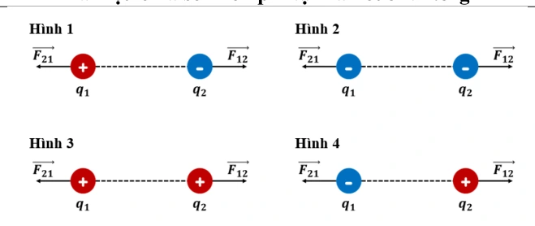
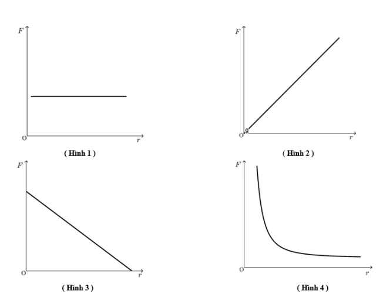

# Bài tập — Bài 2 — Định luật Coulomb

> Hệ bài tập được biên soạn theo các dạng xuất hiện trong bộ tài liệu Vật lí 11 của dự án. Câu hỏi được giữ ngắn, trực tiếp; độ khó tăng dần và không cố tình thêm dữ kiện gây nhiễu.

[← Trở lại bài học](../../02-coulomb-law.md)

## Phần A — Trắc nghiệm 4 lựa chọn

### Bài 1 — Mức 1 — Nhận biết

Hai điện tích điểm $q_1=2\,\mu$C, $q_2=3\,\mu$C cách nhau $0,30$ m trong chân không. Lấy $k=9\cdot10^9$. Lực Coulomb có độ lớn

A. $0,2$ N.
B. $0,4$ N.
C. $0,6$ N.
D. $1,8$ N.

??? success "Đáp án và lời giải"
    Chọn **C**. $F=kq_1q_2/r^2=9\cdot10^9\cdot6\cdot10^{-12}/0,09=0,6$ N.

### Bài 2 — Mức 1 — Nhận biết

Nếu khoảng cách giữa hai điện tích điểm tăng 3 lần, các điện tích không đổi, lực Coulomb

A. tăng 3 lần.
B. giảm 3 lần.
C. giảm 9 lần.
D. tăng 9 lần.

??? success "Đáp án và lời giải"
    Chọn **C** vì $F\propto1/r^2$.

### Bài 3 — Mức 1 — Nhận biết

Hai điện tích cùng dấu đặt gần nhau sẽ

A. hút nhau.
B. đẩy nhau.
C. không tương tác.
D. chỉ tương tác nếu cùng độ lớn.

??? success "Đáp án và lời giải"
    Chọn **B**.

### Bài 4 — Mức 1 — Nhận biết

Trong điện môi có hằng số điện môi tương đối $\varepsilon_r=4$, lực giữa hai điện tích so với chân không giảm

A. 2 lần.
B. 4 lần.
C. 8 lần.
D. 16 lần.

??? success "Đáp án và lời giải"
    Chọn **B** trong mô hình $F=F_0/\varepsilon_r$.

## Phần B — Đúng/Sai

### Bài 5 — Mức 2 — Thông hiểu

Về lực Coulomb giữa hai điện tích điểm:

a) Hai lực tác dụng lên hai điện tích có cùng độ lớn và ngược hướng.
b) Lực nằm trên đường thẳng nối hai điện tích.
c) Độ lớn tỉ lệ với tích độ lớn hai điện tích.
d) Đổi đồng thời dấu cả hai điện tích làm độ lớn lực thay đổi.

??? success "Đáp án và lời giải"
    a) **Đúng**.
    b) **Đúng**.
    c) **Đúng**.
    d) **Sai**: tích độ lớn không đổi; tính hút/đẩy cũng không đổi vì quan hệ cùng dấu/trái dấu giữ nguyên.

### Bài 6 — Mức 2 — Thông hiểu

Hai điện tích điểm cách nhau $r$:

a) Nếu một điện tích tăng 2 lần thì lực tăng 2 lần.
b) Nếu cả hai điện tích tăng 2 lần thì lực tăng 4 lần.
c) Nếu $r$ giảm một nửa thì lực tăng 2 lần.
d) Nếu $r$ giảm một nửa thì lực tăng 4 lần.

??? success "Đáp án và lời giải"
    a) **Đúng**.
    b) **Đúng**.
    c) **Sai**.
    d) **Đúng**.

## Phần C — Trả lời ngắn

### Bài 7 — Mức 3 — Vận dụng

Hai điện tích $+4\,\mu$C và $-5\,\mu$C cách nhau $20$ cm trong chân không. Tính độ lớn lực và cho biết hút hay đẩy.

??? success "Đáp án và lời giải"
    $F=9\cdot10^9\cdot(4\cdot10^{-6})(5\cdot10^{-6})/0,20^2=4,5$ N. Hai điện tích trái dấu nên hút nhau.

### Bài 8 — Mức 3 — Vận dụng

Hai điện tích bằng nhau đặt cách nhau $10$ cm trong chân không đẩy nhau lực $0,90$ N. Tính độ lớn mỗi điện tích.

??? success "Đáp án và lời giải"
    $F=kq^2/r^2$ nên $q=\sqrt{Fr^2/k}=\sqrt{0,90\cdot0,10^2/(9\cdot10^9)}=10^{-6}$ C $=1\,\mu$C.

### Bài 9 — Mức 3 — Vận dụng

Lực giữa hai điện tích trong chân không là $1,2$ N. Đưa nguyên hệ vào điện môi, giữ khoảng cách, lực còn $0,30$ N. Tính hằng số điện môi tương đối.

??? success "Đáp án và lời giải"
    $F=F_0/\varepsilon_r$ nên $\varepsilon_r=1,2/0,30=4$.

## Phần D — Vận dụng và vận dụng cao

### Bài 10 — Mức 4 — Vận dụng cao

Ba điện tích đặt thẳng hàng: $q_A=+2\,\mu$C tại A, $q_B=+1\,\mu$C tại B, $q_C=-4\,\mu$C tại C. Biết AB=$0,20$ m, BC=$0,30$ m. Tính lực tổng hợp tác dụng lên $q_B$ trong chân không.

??? success "Đáp án và lời giải"
    Lực của A lên B: cùng dấu nên đẩy B sang phải.

    $F_{AB}=k|q_Aq_B|/AB^2=9\cdot10^9\cdot2\cdot10^{-12}/0,04=0,45$ N.

    Lực của C lên B: trái dấu nên hút B về C, cũng sang phải.

    $F_{CB}=9\cdot10^9\cdot4\cdot10^{-12}/0,09=0,40$ N.

    Hai lực cùng chiều nên $F=0,45+0,40=0,85$ N, hướng từ B về C.

## Ngân hàng bài tập mở rộng

> Các bài dưới đây được đánh số nối tiếp phần bài tập phía trên. Đề bài được trình bày bằng Markdown; chỉ đồ thị, hình vẽ hoặc sơ đồ thực sự cần thiết mới được giữ dưới dạng hình. Đáp án và lời giải được đặt trong nút mở rộng ngay dưới từng bài.

### Nhận biết — Trả lời ngắn

#### Bài 11

<!-- source-id: BT-Chuong-III-p16-q2-49 -->

Nếu khoảng cách giữa hai điện tích điểm tăng lên 2 lần và giá trị của mỗi điện tích điểm tăng lên 3
lần thì lực điện tương tác giữa chúng tăng hay giảm bao nhiêu lần?

??? success "Đáp án và lời giải"
    **Đáp án:** $2{,}25$
    **Hướng dẫn giải:**

    Dùng $F=k|q_1q_2|/(\varepsilon r^2)$; xác định dấu điện tích trước để biết lực hút hay đẩy.

    Vậy kết quả cần tìm là **$2{,}25$**.
#### Bài 12

<!-- source-id: BT-Chuong-III-p17-q4-51 -->

Cho hai điện tích điểm, mỗi điện tích có độ lớn 1 nC được đặt cách nhau 4,0 cm trong chân không.
Lực điện tương tác giữa hai điện tích này có độ lớn là bao nhiêu (tính theo đơn vị μN và làm tròn đến chữ
số thập phân thứ nhất sau dấu phẩy)?

??? success "Đáp án và lời giải"
    **Đáp án:** $5{,}6$
    **Hướng dẫn giải:**

    Dùng $F=k|q_1q_2|/(\varepsilon r^2)$; xác định dấu điện tích trước để biết lực hút hay đẩy.

    Vậy kết quả cần tìm là **$5{,}6$**.
#### Bài 13

<!-- source-id: BT-Chuong-III-p17-q5-52 -->

Hai điện tích điểm
1
2
μC,
μC
15
6
q
q
=
= −
 đặt cách nhau 0,2 m trong không khí. Phải đặt một điện
tích
3q ở vị trí cách
1q bao nhiêu mét để lực điện do
1q ,
2q tác dụng lên điện tích này bằng 0 (làm tròn đến
chữ số thập phân thứ hai sau dấu phẩy)?

??? success "Đáp án và lời giải"
    **Đáp án:** $0{,}54$
    **Hướng dẫn giải:**

    Dùng $F=k|q_1q_2|/(\varepsilon r^2)$; xác định dấu điện tích trước để biết lực hút hay đẩy.

    Gọi A, B, C lần lượt là vị trí đặt
    Điều kiện lực điện tác dụng lên điện tích
    3q bằng 0 là lực tổng hợp phải cân bằng.
    nên điểm C nằm trên đường thẳng AB và
    2q trái dấu nên điểm C nằm ngoài khoảng AB

    Vậy kết quả cần tìm là **$0{,}54$**.
#### Bài 14

<!-- source-id: BT-Chuong-III-p17-q6-53 -->

Một phân tử ADN bao gồm hai nhánh xoắn kép được liên kết với nhau có chiều dài
6
0,459.10 m
−
.
Phần đuôi của phân tử có thể bị ion hoá mang điện tích âm
19
1
1,6.10
 C
q
−
= −
, đầu còn lại mang điện tích
dương
19
2 1,6.10
 C
q
−
=
. Phân tử xoắn ốc này hoạt động như một lò xo và bị nén 1% sau khi bị tích điện.
Biết phân tử ADN trong nhân tế bào và môi trường xung quanh là nước; hằng số điện môi của nước là 81.
Tính “độ cứng k” của phân tử (theo đơn vị nN/m và làm tròn đến chữ số thập phân thứ hai sau dấu phẩy).

??? success "Đáp án và lời giải"
    **Đáp án:** $2{,}94$
    **Hướng dẫn giải:**

    Dùng $F=k|q_1q_2|/(\varepsilon r^2)$; xác định dấu điện tích trước để biết lực hút hay đẩy.

    Lực tương tác tĩnh điện của phân tử DNA
    Độ cứng của phân tử là

    Vậy kết quả cần tìm là **$2{,}94$**.
#### Bài 15

<!-- source-id: BT-Chuong-III-p24-q2-77 -->

Hai vật tích điện giống hệt nhau tác dụng lên nhau một lực 2,0.10–2 N khi được đặt cách nhau 34
cm trong không khí. Độ lớn điện tích của mỗi vật là bao nhiêu (tính theo đơn vị μC và làm tròn đến chữ số
thập phân thứ nhất) ?

??? success "Đáp án và lời giải"
    **Đáp án:** $0{,}5$
    **Hướng dẫn giải:**

    Dùng $F=k|q_1q_2|/(\varepsilon r^2)$; xác định dấu điện tích trước để biết lực hút hay đẩy.

    Vậy kết quả cần tìm là **$0{,}5$**.
#### Bài 16

<!-- source-id: BT-Chuong-III-p24-q3-78 -->

Hai quả cầu kim loại nhỏ, giống hệt nhau, mang điện tích 2Q và
Q
−
 được đặt cách nhau một
khoảng r, lực điện tác dụng lên nhau có độ lớn là F. Nối chúng lại với nhau bằng một dây dẫn điện, sau đó
bỏ dây dẫn đi. Sau khi bỏ dây nối, hai quả cầu tác dụng lên nhau một lực điện F. Tỉ số F
F là bao nhiêu?

??? success "Đáp án và lời giải"
    **Đáp án:** 8
    **Hướng dẫn giải:**

    Dùng $F=k|q_1q_2|/(\varepsilon r^2)$; xác định dấu điện tích trước để biết lực hút hay đẩy.

    Trước khi nối dây:
    Sau khi bỏ dây nối:

    Vậy kết quả cần tìm là **8**.
#### Bài 17

<!-- source-id: BT-Chuong-III-p24-q4-79 -->

Hai điện tích điểm
8
1
8.10 C
q
−
=
 và
8
2
3.10 C
q
−
= −
 đặt trong không khí tại hai điểm A và B cách
nhau 3 cm. Đặt điện tích điểm
8
0
10 C
q
−
=
 tại điểm M là trung điểm của AB. Lực tĩnh điện tổng hợp do
1q và
2q tác dụng lên
0q là bao nhiêu (tính theo đơn vị N và làm tròn đến chữ số thập phân thứ hai sau dấu
phẩy)?

??? success "Đáp án và lời giải"
    **Đáp án:** $0{,}04$
    **Hướng dẫn giải:**

    Dùng $F=k|q_1q_2|/(\varepsilon r^2)$; xác định dấu điện tích trước để biết lực hút hay đẩy.

    Vậy kết quả cần tìm là **$0{,}04$**.
#### Bài 18

<!-- source-id: BT-Chuong-III-p24-q5-80 -->

Hai điện tích
8
8
1
2
4.10 C,
4.10 C
q
q
−
−
=
= −
 đặt tại hai điểm A và B cách nhau 4 cm trong rượu có
hằng số điện môi
27
ε=
. Lực tác dụng lên điện tích
9
0
2.10 C
q
−
=
 đặt tại điểm M cách A 4 cm, cách B 8
cm là bao nhiêu (tính theo đơn vị μN )?

??? success "Đáp án và lời giải"
    **Đáp án:** $12{,}5$
    **Hướng dẫn giải:**

    Dùng $F=k|q_1q_2|/(\varepsilon r^2)$; xác định dấu điện tích trước để biết lực hút hay đẩy.

    Vậy kết quả cần tìm là **$12{,}5$**.
#### Bài 19

<!-- source-id: BT-Chuong-III-p25-q6-81 -->

Hai điện tích điểm
1
2
,
q
q được giữ cố định tại hai điểm A, B cách nhau một khoảng a trong một
điện môi. Điện tích
3q đặt tại điểm C trên đoạn AB cách A một khoảng
3
a
. Để điện tích
3q đứng yên thì
độ lớn điện tích
2q phải bằng bao nhiêu lần giá trị
1q ?

??? success "Đáp án và lời giải"
    **Đáp án:** 4
    **Hướng dẫn giải:**

    Dùng $F=k|q_1q_2|/(\varepsilon r^2)$; xác định dấu điện tích trước để biết lực hút hay đẩy.

    Để điện tích
    3q đứng yên thì
    BÀI 16 – KHÁI NIỆM ĐIỆN TRƯỜNG
    I . TÓM TẮT LÝ THUYẾT – PHƯƠNG PHÁP GIẢI
    1. KHÁI NIỆM ĐIỆN TRƯỜNG
    - Điện trường được tạo ra bởi điện tích, là dạng vật chất tồn tại xung quanh điện tích và truyền tương tác giữa

    Vậy kết quả cần tìm là **4**.
### Nhận biết — Trắc nghiệm 4 lựa chọn

#### Bài 20

<!-- source-id: BT-Chuong-III-p5-q1-1 -->

Lực mà hai điện tích tác dụng lên nhau tuân theo định luật

A. Ohm.

B. Hooke.

C. Coulomb.

D. bảo toàn và chuyển hoá năng lượng.

??? success "Đáp án và lời giải"
    **Đáp án:** C
    **Hướng dẫn giải:**

    Dùng $F=k|q_1q_2|/(\varepsilon r^2)$; xác định dấu điện tích trước để biết lực hút hay đẩy.

    Đối chiếu kết quả với các lựa chọn, phương án phù hợp là **C. Coulomb.**
#### Bài 21

<!-- source-id: BT-Chuong-III-p5-q3-3 -->

Có bao nhiêu nhận định sau đây là đúng? Lực điện tương tác giữa các điện tích điểm có

(I) phương trùng với đường thẳng nối hai điện tích điểm

(II) độ lớn tỉ lệ thuận với tổng giá trị của hai điện tích điểm

(III) độ lớn tỉ lệ nghịch với khoảng cách giữa chúng.

A. 0.

B. 1.

C. 2.

D. 3.

??? success "Đáp án và lời giải"
    **Đáp án:** B
    **Hướng dẫn giải:**
    (I) Đúng
    (II) Sai. → độ lớn tỉ lệ thuận với tích giá trị của hai điện tích điểm.
    (III) Sai. → độ lớn tỉ lệ nghịch với bình phương khoảng cách giữa chúng.

#### Bài 22

<!-- source-id: BT-Chuong-III-p5-q4-4 -->

Vector lực tĩnh điện giữa hai điện tích điểm có tính chất nào sau đây?

A. Có giá trùng với đường thẳng nối hai điện tích.

B. Có chiều phụ thuộc vào độ lớn của các hạt mang điện.

C. Độ lớn chỉ phụ thuộc vào khoảng cách giữa hai điện tích.

D. Chiều phụ thuộc vào độ lớn của các hạt mang điện tích.

??? success "Đáp án và lời giải"
    **Đáp án:** A
    **Hướng dẫn giải:**

    Dùng $F=k|q_1q_2|/(\varepsilon r^2)$; xác định dấu điện tích trước để biết lực hút hay đẩy.

    Đối chiếu kết quả với các lựa chọn, phương án phù hợp là **A. Có giá trùng với đường thẳng nối hai điện tích.**
#### Bài 23

<!-- source-id: BT-Chuong-III-p5-q7-7 -->

Bao nhiêu hình sau đây biểu diễn không chính xác lực tương tác tĩnh điện giữa các điện tích (có
cùng độ lớn điện tích và đứng yên)?

A. 1.

B. 2.

C. 3.

D. 4.

{ loading=lazy }

??? success "Đáp án và lời giải"
    **Hướng dẫn giải:**
    Hình 1 và hình 4 không chính xác. Tương tác giữa hai điện tích trái dấu là hút nhau.

#### Bài 24

<!-- source-id: BT-Chuong-III-p6-q8-8 -->

Xét ba điện tích
0
1
2
, ,
q
q
q đặt tại ba điểm khác nhau trong không gian. Biết lực do
1q và
2q tác dụng
lên
0q lần lượt là
10
F
υυυ
 và
20
F
υυυ
. Biểu thức nào sau đây xác định đúng lực tĩnh điện tổng hợp tác dụng lên điện
tích
0?
q

A. 0
10
20
F
F
F
=
+
.

B. 0
10
20
F
F
F
=
+
υυυυυυυυυυ
.

C. 0
10
20
F
F
F
=
−
.

D. 0
10
20
F
F
F
=
−
υυυυυυυυυυ
.

??? success "Đáp án và lời giải"
    **Đáp án:** B
    **Hướng dẫn giải:**

    Dùng $F=k|q_1q_2|/(\varepsilon r^2)$; xác định dấu điện tích trước để biết lực hút hay đẩy.

    Đối chiếu kết quả với các lựa chọn, phương án phù hợp là **B. 0 10 20 F F F = + υυυυυυυυυυ .**
#### Bài 25

<!-- source-id: BT-Chuong-III-p6-q9-9 -->

Độ lớn của lực tương tác giữa hai điện tích điểm trong không khí tỉ lệ

A. với bình phương khoảng cách giữa hai điện tích.

B. với khoảng cách giữa hai điện tích.

C. nghịch với bình phương khoảng cách giữa hai điện tích.

D. nghịch với khoảng cách giữa hai điện tích.

??? success "Đáp án và lời giải"
    **Đáp án:** C
    **Hướng dẫn giải:**

    Dùng $F=k|q_1q_2|/(\varepsilon r^2)$; xác định dấu điện tích trước để biết lực hút hay đẩy.

    Đối chiếu kết quả với các lựa chọn, phương án phù hợp là **C. nghịch với bình phương khoảng cách giữa hai điện tích.**
#### Bài 26

<!-- source-id: BT-Chuong-III-p6-q10-10 -->

Nếu đưa vật A lại gần vật B mang điện dương thì vật A bị vật B hút. Phát biểu nào sau đây là đúng
về vật A?

A. Vật A không mang điện.

B. Vật A mang điện âm.

C. Vật A mang điện dương.

D. Vật A có thể mang điện hoặc trung hoà.

??? success "Đáp án và lời giải"
    **Đáp án:** B
    **Hướng dẫn giải:**

    Dùng $F=k|q_1q_2|/(\varepsilon r^2)$; xác định dấu điện tích trước để biết lực hút hay đẩy.

    Đối chiếu kết quả với các lựa chọn, phương án phù hợp là **B. Vật A mang điện âm.**
#### Bài 27

<!-- source-id: BT-Chuong-III-p7-q13-13 -->

Điện tích điểm là vật

A. có kích thước rất nhỏ.

B. có kích thước rất lớn.

C. mang điện có kích thước rất nhỏ.

D. mang rất ít điện tích.

??? success "Đáp án và lời giải"
    **Đáp án:** C
    **Hướng dẫn giải:**

    Dùng $F=k|q_1q_2|/(\varepsilon r^2)$; xác định dấu điện tích trước để biết lực hút hay đẩy.

    Đối chiếu kết quả với các lựa chọn, phương án phù hợp là **C. mang điện có kích thước rất nhỏ.**
#### Bài 28

<!-- source-id: BT-Chuong-III-p7-q14-14 -->

Lực tương tác giữa hai điện tích đứng yên trong điện môi đồng chất, có hằng số điện môi ε thì

A. tăng ε lần so với trong chân không.

B. giảm ε lần so với trong chân không.

C. giảm
2
ε lần so với trong chân không.

D. tăng
2
ε lần so với trong chân không.

??? success "Đáp án và lời giải"
    **Đáp án:** B
    **Hướng dẫn giải:**

    Dùng $F=k|q_1q_2|/(\varepsilon r^2)$; xác định dấu điện tích trước để biết lực hút hay đẩy.

    Đối chiếu kết quả với các lựa chọn, phương án phù hợp là **B. giảm ε lần so với trong chân không.**
#### Bài 29

<!-- source-id: BT-Chuong-III-p18-q1-54 -->

Xét hai điện tích điểm $q_1$ và $q_2$ có tương tác đẩy. Khẳng định nào sau đây đúng?

A. $q_1>0,\ q_2<0$.

B. $q_1<0,\ q_2>0$.

C. $q_1q_2>0$.

D. $q_1q_2<0$.

??? success "Đáp án và lời giải"
    **Đáp án: C.**
    **Hướng dẫn giải:**

    Hai điện tích đẩy nhau khi chúng cùng dấu. Vì vậy tích của hai điện tích dương:

    $$q_1q_2>0.$$
#### Bài 30

<!-- source-id: BT-Chuong-III-p18-q7-60 -->

Công thức nào dưới đây xác định độ lớn lực tương tác tĩnh điện giữa hai điện tích điểm
1
2
,
q
q đặt
cách nhau một khoảng r trong chân không, với
9
2
2
9.10 Nm /C
k =
 là hằng số Coulomb?

A. 2
1
2
r
F
k q q
=
.

B. 1
2
2 q q
F
r
k
=
.

C. 1
2
2
q q
F
k
r
=
.

D. 1
2
2
q q
F
kr
=
.

??? success "Đáp án và lời giải"
    **Đáp án:** C
    **Hướng dẫn giải:**

    Dùng $F=k|q_1q_2|/(\varepsilon r^2)$; xác định dấu điện tích trước để biết lực hút hay đẩy.

    Đối chiếu kết quả với các lựa chọn, phương án phù hợp là **C. 1 2 2 q q F k r = .**
#### Bài 31

<!-- source-id: BT-Chuong-III-p18-q8-61 -->

Khẳng định nào sau đây không đúng khi nói về lực tương tác giữa hai điện tích điểm trong chân
không?

A. Có phương là đường thẳng nối giữa hai điện tích.

B. Có độ lớn tỉ lệ với tích độ lớn hai điện tích.

C. Có độ lớn tỉ lệ nghịch với khoảng cách giữa hai điện tích.

D. Là lực hút khi hai điện tích cùng dấu.

??? success "Đáp án và lời giải"
    **Đáp án:** D
    **Hướng dẫn giải:**

    Dùng $F=k|q_1q_2|/(\varepsilon r^2)$; xác định dấu điện tích trước để biết lực hút hay đẩy.

    Đối chiếu kết quả với các lựa chọn, phương án phù hợp là **D. Là lực hút khi hai điện tích cùng dấu.**
#### Bài 32

<!-- source-id: BT-Chuong-III-p18-q9-62 -->

Cho 2 điện tích có độ lớn không đổi, đặt cách nhau một khoảng không đổi. Lực tương tác giữa
chúng sẽ lớn nhất khi đặt trong

A. chân không.

B. nước nguyên chất.

C. dầu hỏa.

D. không khí ở điều kiện tiêu chuẩn.

??? success "Đáp án và lời giải"
    **Đáp án:** A
    **Hướng dẫn giải:**

    Dùng $F=k|q_1q_2|/(\varepsilon r^2)$; xác định dấu điện tích trước để biết lực hút hay đẩy.

    Đối chiếu kết quả với các lựa chọn, phương án phù hợp là **A. chân không.**
#### Bài 33

<!-- source-id: BT-Chuong-III-p19-q12-65 -->

Tăng đồng thời độ lớn của hai điện tích điểm và khoảng cách giữa chúng lên gấp đôi thì lực điện
tác dụng giữa chúng

A. tăng lên 2 lần.

B. giảm đi 2 lần.

C. giảm đi 4 lần.

D. không đổi.

??? success "Đáp án và lời giải"
    **Đáp án:** D
    **Hướng dẫn giải:**

    Dùng $F=k|q_1q_2|/(\varepsilon r^2)$; xác định dấu điện tích trước để biết lực hút hay đẩy.

    Đối chiếu kết quả với các lựa chọn, phương án phù hợp là **D. không đổi.**
#### Bài 34

<!-- source-id: BT-Chuong-III-p19-q13-66 -->

Hai điện tích điểm đặt cách nhau một khoảng r, dịch chuyển để khoảng cách giữa hai điện tích
điểm đó giảm đi 2 lần nhưng vẫn giữ nguyên độ lớn điện tích của chúng. Khi đó, lực tương tác giữa hai
điện tích

A. tăng lên 2 lần.

B. giảm đi 2 lần.

C. tăng lên 4 lần.

D. giảm đi 4 lần.

??? success "Đáp án và lời giải"
    **Đáp án:** C
    **Hướng dẫn giải:**
    Lực tương tác giữa hai điện tích tỉ lệ nghịch với bình phương khoảng cách nên khi khoảng cách giữa hai
    điện tích điểm đó giảm đi 2 lần thì lực tương tác tăng 4 lần.

#### Bài 35

<!-- source-id: BT-Chuong-III-p19-q14-67 -->

Hai điện tích điểm khi đặt trong không khí chúng hút nhau bằng lực F, khi đưa chúng vào trong
dầu có hằng số điện môi bằng 2 thì lực tương tác giữa chúng là

A. F.

B. 2F.

C. 0,5F.

D. 0,25F.

??? success "Đáp án và lời giải"
    **Đáp án:** C
    **Hướng dẫn giải:**
    Khi đưa hai điện tích điểm vào trong dầu có hằng số điện môi bằng 2 thì lực tương tác giữa chúng giảm 2
    lần so với khi đặt trong không khí.

#### Bài 36

<!-- source-id: BT-Chuong-III-p20-q15-68 -->

Hai điện tích điểm đặt cách nhau 20 cm trong không khí, tác dụng lên nhau một lực nào đó. Hỏi
phải đặt hai điện tích trên cách nhau bao nhiêu ở trong dầu để lực tương tác giữa chúng vẫn như cũ, biết
rằng hằng số điện môi của dầu bằng 5.

A. 0,894 cm.

B. 8,94 cm.

C. 9,94 cm.

D. 9,84 cm.

??? success "Đáp án và lời giải"
    **Đáp án:** B
    **Hướng dẫn giải:**

    Dùng $F=k|q_1q_2|/(\varepsilon r^2)$; xác định dấu điện tích trước để biết lực hút hay đẩy.

    Lực tương tác giữa hai điện tích điểm không đổi

    Đối chiếu kết quả với các lựa chọn, phương án phù hợp là **B. 8,94 cm.**
#### Bài 37

<!-- source-id: BT-Chuong-III-p20-q17-70 -->

Hai điện tích
1
2
,
4
q
q q
q
=
=
 đặt cách nhau một khoảng d trong không khí. Gọi M là vị trí tại đó,
lực tổng hợp tác dụng lên điện tích
0q bằng 0. Điểm M cách
1q một khoảng

A. 2
d
.

B. 3
d
.

C. 4
d
.

D. 2d.

??? success "Đáp án và lời giải"
    **Đáp án:** B
    **Hướng dẫn giải:**

    Dùng $F=k|q_1q_2|/(\varepsilon r^2)$; xác định dấu điện tích trước để biết lực hút hay đẩy.

    Tại M lực tổng hợp lên điện tích

    Đối chiếu kết quả với các lựa chọn, phương án phù hợp là **B. 3 d .**
#### Bài 38

<!-- source-id: BT-Chuong-III-p20-q18-71 -->

Tại ba đỉnh A, B, C của một tam giác đều cạnh dài 0,15 m có ba điện tích lần lượt là
μC,8 μC, 8 μC.
2
−
Vector lực tác dụng lên điện tích đặt tại đỉnh A có độ lớn và hướng lần lượt là

A. 5,9 N và song song với BC.

B. 5,9 N và vuông góc với BC.

C. 6,4 N và song song với BC.

D. 6,4 N và song song với AB.

??? success "Đáp án và lời giải"
    **Đáp án:** C
    **Hướng dẫn giải:**

    Dùng $F=k|q_1q_2|/(\varepsilon r^2)$; xác định dấu điện tích trước để biết lực hút hay đẩy.

    Lực tổng hợp tác dụng lên điện tích tại A

    Đối chiếu kết quả với các lựa chọn, phương án phù hợp là **C. 6,4 N và song song với BC.**
### Thông hiểu — Trắc nghiệm 4 lựa chọn

#### Bài 39

<!-- source-id: BT-Chuong-III-p8-q20-20 -->

Về sự tương tác điện, trong các nhận định dưới đây. Chọn phát biểu sai?

A. Các điện tích cùng loại thì đẩy nhau.

B. Các điện tích khác loại thì hút nhau.

C. Hai thanh nhựa giống nhau, sau khi cọ xát với len dạ, nếu đưa lại gần thì chúng sẽ hút nhau.

D. Hai thanh thủy tinh sau khi cọ xát vào lụa, nếu đưa lại gần nhau thì chúng sẽ đẩy nhau.

??? success "Đáp án và lời giải"
    **Đáp án:** C
    **Hướng dẫn giải:**

    Dùng $F=k|q_1q_2|/(\varepsilon r^2)$; xác định dấu điện tích trước để biết lực hút hay đẩy.

    Đối chiếu kết quả với các lựa chọn, phương án phù hợp là **C. Hai thanh nhựa giống nhau, sau khi cọ xát với len dạ, nếu đưa lại gần thì chúng sẽ hút nhau.**
#### Bài 40

<!-- source-id: BT-Chuong-III-p8-q22-22 -->

Có thể áp dụng định luật Coulomb cho tương tác nào sau đây?

A. Hai điện tích điểm dao động quanh hai vị trí cố định trong một môi trường.

B. Hai điện tích điểm nằm tại hai vị trí cố định trong một môi trường.

C. Hai điện tích điểm nằm cố định gần nhau, một trong dầu, một trong nước.

D. Hai điện tích điểm chuyển động tự do trong cùng môi trường.

??? success "Đáp án và lời giải"
    **Đáp án:** B
    **Hướng dẫn giải:**

    Dùng $F=k|q_1q_2|/(\varepsilon r^2)$; xác định dấu điện tích trước để biết lực hút hay đẩy.

    Đối chiếu kết quả với các lựa chọn, phương án phù hợp là **B. Hai điện tích điểm nằm tại hai vị trí cố định trong một môi trường.**
#### Bài 41

<!-- source-id: BT-Chuong-III-p9-q27-27 -->

Hai điện tích điểm có độ lớn không đổi được đặt trong chân không, nếu tăng khoảng cách giữa hai
điện tích lên 2 lần thì lực tương tác giữa chúng

A. tăng lên 2 lần.

B. giảm đi 2 lần.

C. tăng lên 4 lần.

D. giảm đi 4 lần.

??? success "Đáp án và lời giải"
    **Đáp án:** D
    **Hướng dẫn giải:**
    Lực tương tác giữa hai điện tích điểm tỉ lệ nghịch với bình phương khoảng cách giữa chúng nên khi tăng
    khoảng cách giữa hai điện tích lên 2 lần thì lực tương tác giữa chúng giảm đi 4 lần.

#### Bài 42

<!-- source-id: BT-Chuong-III-p9-q28-28 -->

Vật A mang điện với điện tích 2 µC, vật B mang điện với điện tích 6 µC. Lực điện do vật A tác
dụng lên vật B là
AB
F
υυυυ
, lực điện do vật B tác dụng lên vật A là
BA
F
υυυυ
. Biểu thức đúng là

A. AB
BA
3
F
F
= −
υυυυυυυυ
.

B. AB
BA
F
F
= −
υυυυυυυυ
.

C. AB
BA
3F
F
= −
υυυυυυυυ
.

D. AB
BA
3
F
F
=
υυυυυυυυ
.

??? success "Đáp án và lời giải"
    **Đáp án:** B
    **Hướng dẫn giải:**

    Dùng $F=k|q_1q_2|/(\varepsilon r^2)$; xác định dấu điện tích trước để biết lực hút hay đẩy.

    Đối chiếu kết quả với các lựa chọn, phương án phù hợp là **B. AB BA F F = − υυυυυυυυ .**
#### Bài 43

<!-- source-id: BT-Chuong-III-p9-q29-29 -->

Ba điện tích $q$ giống nhau $(q<0)$ được đặt cố định tại ba đỉnh của một tam giác đều cạnh $a$. Một điện tích $Q>0$ đặt tại tâm tam giác chịu các lực điện có độ lớn lần lượt là $F_1,F_2,F_3$. Độ lớn lực điện tổng hợp tác dụng lên $Q$ là

A. $0$.

B. $F_1+F_2+F_3$.

C. $F_1+F_2-F_3$.

D. $F_1-F_2-F_3$.

??? success "Đáp án và lời giải"
    **Đáp án: A.**
    **Hướng dẫn giải:**

    Do ba điện tích ở ba đỉnh giống nhau và tâm cách đều ba đỉnh, ba lực tác dụng lên $Q$ có cùng độ lớn, phương lệch nhau $120^\circ$. Tổng vectơ của ba lực bằng không:

    $$\vec F_1+\vec F_2+\vec F_3=\vec0.$$
#### Bài 44

<!-- source-id: BT-Chuong-III-p9-q30-30 -->

Đồ thị nào sau đây có thể biểu diễn sự phụ thuộc của lực tương tác giữa hai điện tích điểm vào
khoảng cách giữa chúng?

A. Hình 1.

B. Hình 2.

C. Hình 3.

D. Hình 4

{ loading=lazy }

??? success "Đáp án và lời giải"
    **Hướng dẫn giải:**
    Lực tương tác tỉ lệ nghịch với bình phương khoảng cách nên mối quan hệ của chúng có dạng đường
    hyperbol.

### Vận dụng — Trắc nghiệm 4 lựa chọn

#### Bài 45

<!-- source-id: BT-Chuong-III-p11-q32-32 -->

Hai điện tích điểm trái dấu có cùng độ lớn
4
10
4 C
−
đặt cách nhau 1 m trong parafin có điện môi
bằng 2 thì chúng

A. hút nhau một lực 1,5125 N.

B. hút nhau một lực 2,8125 N.

C. đẩy nhau một lực 10,265 N.

D. đẩy nhau một lực 1,8152 N.

??? success "Đáp án và lời giải"
    **Đáp án:** B
    **Hướng dẫn giải:**

    Dùng $F=k|q_1q_2|/(\varepsilon r^2)$; xác định dấu điện tích trước để biết lực hút hay đẩy.

    Hai điện tích điểm trái dấu nên lực tương tác giữa chúng là lực hút.

    Đối chiếu kết quả với các lựa chọn, phương án phù hợp là **B. hút nhau một lực 2,8125 N.**
#### Bài 46

<!-- source-id: BT-Chuong-III-p11-q33-33 -->

Hai điện tích điểm được đặt cố định và cách điện trong một bình không khí thì hút nhau 1 lực là
21 N. Nếu đổ đầy dầu hỏa có hằng số điện môi 2,1 vào bình thì hai điện tích đó sẽ

A. hút nhau 1 lực bằng 10 N.

B. đẩy nhau một lực bằng 10 N.

C. hút nhau một lực bằng 44,1 N.

D. đẩy nhau 1 lực bằng 44,1 N.

??? success "Đáp án và lời giải"
    **Đáp án:** A
    **Hướng dẫn giải:**

    Dùng $F=k|q_1q_2|/(\varepsilon r^2)$; xác định dấu điện tích trước để biết lực hút hay đẩy.

    Thay đổi điện môi không làm thay đổi điện tích của hai điện tích điểm
    Độ lớn lực hút

    Đối chiếu kết quả với các lựa chọn, phương án phù hợp là **A. hút nhau 1 lực bằng 10 N.**
#### Bài 47

<!-- source-id: BT-Chuong-III-p11-q34-34 -->

Hai điện tích điểm cùng độ lớn 10-9 C đặt trong chân không. Để lực tĩnh điện giữa chúng có độ lớn
2,5.10-6 N thì khoảng cách giữa chúng bằng

A. 0,06 cm.

B. 6 cm.

C. 36 cm.

D. 6 m.

??? success "Đáp án và lời giải"
    **Đáp án:** B
    **Hướng dẫn giải:**

    Dùng $F=k|q_1q_2|/(\varepsilon r^2)$; xác định dấu điện tích trước để biết lực hút hay đẩy.

    Đối chiếu kết quả với các lựa chọn, phương án phù hợp là **B. 6 cm.**
#### Bài 48

<!-- source-id: BT-Chuong-III-p11-q35-35 -->

Hai điện tích trái dấu tác dụng lên nhau một lực hút có độ lớn 8,0 N. Dịch chuyển để khoảng cách
giữa chúng bằng 4 lần khoảng cách ban đầu thì độ lớn lực sẽ là

A. 0,5 N.

B. 1 N.

C. 1,5 N.

D. 2 N.

??? success "Đáp án và lời giải"
    **Đáp án:** A
    **Hướng dẫn giải:**

    Dùng $F=k|q_1q_2|/(\varepsilon r^2)$; xác định dấu điện tích trước để biết lực hút hay đẩy.

    Đối chiếu kết quả với các lựa chọn, phương án phù hợp là **A. 0,5 N.**
#### Bài 49

<!-- source-id: BT-Chuong-III-p12-q36-36 -->

Hai điện tích điểm
8
1
4.10 C
q
−
=
,
8
2
4.10 C
q
−
= −
 đặt tại hai điểm A và B cách nhau 4 cm trong
không khí. Lực tác dụng lên điện tích
7
0
C
2.10
q
−
=
 đặt tại trung điểm O của AB là

A. 3,6 N.

B. 0,36 N.

C. 36 N.

D. 7,2 N.

??? success "Đáp án và lời giải"
    **Đáp án:** B
    **Hướng dẫn giải:**

    Dùng $F=k|q_1q_2|/(\varepsilon r^2)$; xác định dấu điện tích trước để biết lực hút hay đẩy.

    Đối chiếu kết quả với các lựa chọn, phương án phù hợp là **B. 0,36 N.**
#### Bài 50

<!-- source-id: BT-Chuong-III-p12-q37-37 -->

Hai điện tích điểm
1q và
2q đặt cách nhau 30 cm trong không khí, lực tác dụng giữa chúng là
0F .
Nếu đặt chúng trong dầu thì lực tương tác bị giảm đi 2,25 lần. Để lực tương tác vẫn bằng
0F thì cần dịch
chúng lại một khoảng

A. 10 cm.

B. 15 cm.

C. 5 cm.

D. 20 cm.

??? success "Đáp án và lời giải"
    **Đáp án:** A
    **Hướng dẫn giải:**

    Dùng $F=k|q_1q_2|/(\varepsilon r^2)$; xác định dấu điện tích trước để biết lực hút hay đẩy.

    Nếu đặt chúng trong dầu thì lực tương tác bị giảm đi 2,25 lần nên
    Để lực tương tác vẫn bằng

    Đối chiếu kết quả với các lựa chọn, phương án phù hợp là **A. 10 cm.**
#### Bài 51

<!-- source-id: BT-Chuong-III-p13-q40-40 -->

Có hai điện tích
6
6
1
2
2.10 C,
2.10 C
q
q
−
−
=
= −
 đặt tại hai điểm A, B trong chân không và cách
nhau một khoảng 6 cm. Một điện tích
6
3
2.10 C
q
−
=
, đặt trên đường trung trực của AB, cách AB một
khoảng 4 cm. Độ lớn của lực điện do hai điện tích và tác dụng lên điện tích
3q là

A. 14,40 N.

B. 28,80 N.

C. 20,36 N.

D. 17,28 N.

??? success "Đáp án và lời giải"
    **Đáp án:** D
    **Hướng dẫn giải:**

    Dùng $F=k|q_1q_2|/(\varepsilon r^2)$; xác định dấu điện tích trước để biết lực hút hay đẩy.

    Đối chiếu kết quả với các lựa chọn, phương án phù hợp là **D. 17,28 N.**
