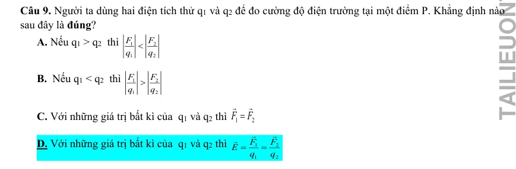
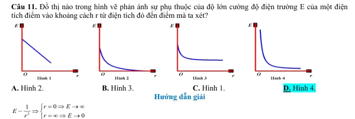
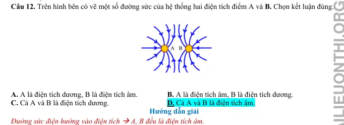
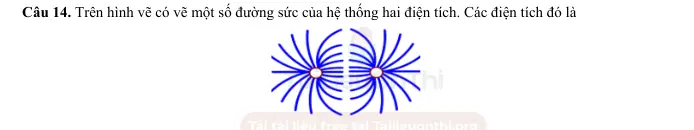
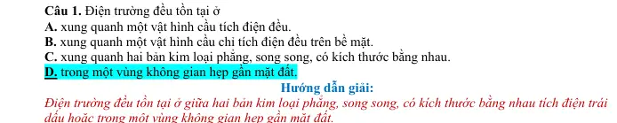
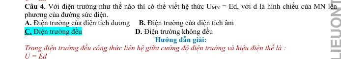
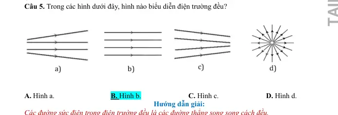
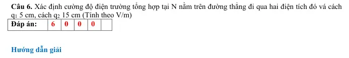

# Bài tập — Bài 3 — Điện trường và cường độ điện trường

> Hệ bài tập được biên soạn theo các dạng xuất hiện trong bộ tài liệu Vật lí 11 của dự án. Câu hỏi được giữ ngắn, trực tiếp; độ khó tăng dần và không cố tình thêm dữ kiện gây nhiễu.

[← Trở lại bài học](../../03-electric-field-intensity.md)

## Phần A — Trắc nghiệm 4 lựa chọn

### Câu 1 — Mức 1 — Nhận biết

Cường độ điện trường tại một điểm được xác định bởi

A. $\vec E=\vec F/q$ với điện tích thử dương đủ nhỏ.  
B. $E=q/F$.  
C. $E=Fr^2$.  
D. $E=Uq$.

### Câu 2 — Mức 1 — Nhận biết

Điện trường của điện tích điểm dương có chiều

A. hướng vào điện tích.  
B. hướng ra xa điện tích.  
C. tiếp tuyến vòng tròn quanh điện tích.  
D. không xác định.

### Câu 3 — Mức 1 — Nhận biết

Điện tích điểm $Q=+4\,\mu$C. Tại điểm cách Q $0,30$ m trong chân không, cường độ điện trường bằng

A. $4\cdot10^4$ V/m.  
B. $4\cdot10^5$ V/m.  
C. $4\cdot10^6$ V/m.  
D. $1,2\cdot10^5$ V/m.

### Câu 4 — Mức 1 — Nhận biết

Đơn vị nào tương đương với đơn vị cường độ điện trường?

A. N/C.  
B. C/N.  
C. J/C².  
D. W/A.

## Phần B — Đúng/Sai

### Câu 5 — Mức 2 — Thông hiểu

Đường sức điện:

a) Có hướng trùng hướng vectơ cường độ điện trường tại mỗi điểm.  
b) Các đường sức tĩnh điện không cắt nhau.  
c) Mật độ đường sức dày hơn thường biểu diễn điện trường mạnh hơn.  
d) Đường sức của điện tích điểm âm hướng ra xa điện tích.

### Câu 6 — Mức 2 — Thông hiểu

Xét cường độ điện trường do điện tích điểm Q:

a) $E\propto|Q|$.  
b) $E\propto1/r^2$.  
c) Độ lớn E phụ thuộc điện tích thử đặt tại điểm xét.  
d) Nếu Q đổi dấu thì độ lớn E không đổi nhưng hướng đảo.

## Phần C — Trả lời ngắn

### Câu 7 — Mức 3 — Vận dụng

Điện tích $Q=-2\,\mu$C. Tính cường độ điện trường tại điểm cách Q $15$ cm trong chân không và nêu hướng.

### Câu 8 — Mức 3 — Vận dụng

Tại một điểm, điện tích thử $q=+2$ nC chịu lực điện $6\cdot10^{-5}$ N theo hướng Đông. Tính $\vec E$.

### Câu 9 — Mức 3 — Vận dụng

Điện trường đều có $E=500$ V/m. Điện tích $q=-4\,\mu$C đặt trong trường chịu lực điện có độ lớn bao nhiêu và hướng thế nào so với $\vec E$?

## Phần D — Vận dụng và vận dụng cao

### Câu 10 — Mức 4 — Vận dụng cao

Một điện tích điểm Q tạo cường độ điện trường $E_1=9\cdot10^4$ V/m tại điểm cách nó $20$ cm. Tính cường độ tại điểm cách Q $30$ cm và độ lớn Q.

---

[Đáp án và lời giải →](solutions.md)

## Ngân hàng bài tập PDF mở rộng

> Nội dung câu hỏi và dữ kiện trong phần này được giữ nguyên; hệ thống chỉ chuẩn hóa xuống dòng và mã kí tự để hiển thị trên web. Câu trùng được loại bỏ. Với câu có công thức/kí hiệu bị sai khi trích xuất chữ từ PDF, đề bài được giữ dưới dạng ảnh để không làm thay đổi dữ kiện.

### Nhận biết — Trả lời ngắn

#### Bài PDF 1

<!-- source-id: BT-Chuong-III-p77-q1-199 -->

Câu 1. Cho hai tấm kim loại phẳng rộng, đặt nằm ngang, song song với nhau và cách nhau d
5 cm
=
. Hiệu
điện thế giữa hai tấm đó là 20V. Cường độ điện trường trong khoảng giữa hai bản phẳng bằng bao nhiêu
V/m?

#### Bài PDF 2

<!-- source-id: BT-Chuong-III-p91-q1-229 -->

Câu 1. Cho hai tấm kim loại phẳng rộng, đặt nằm ngang song song với nhau và cách nhau
.
Hiệu điện thế giữa hai tầm kim loại đó là
. Cường độ điện trường giữa hai tấm kim loại đó là
a
10 V/m. Giá trị của a là bao nhiêu ?

### Nhận biết — Trắc nghiệm 4 lựa chọn

#### Bài PDF 3

<!-- source-id: BT-Chuong-III-p32-q1-82 -->

Câu 1. Điện trường được tạo ra bởi điện tích, là dạng vật chất tồn tại quanh điện tích và
A. tác dụng lực lên mọi vật đặt trong nó.

B. tác dụng lực điện lên mọi điện tích đặt trong nó.
C. truyền lực cho các điện tích.

D. truyền tương tác giữa các điện tích.

#### Bài PDF 4

<!-- source-id: BT-Chuong-III-p32-q2-83 -->

Câu 2. Cường độ điện trường tại một điểm đặc trưng cho
A. thể tích vùng có điện trường là lớn hay nhỏ.

B. điện trường tại điểm đó về phương diện dự trữ năng lượng.
C. tác dụng lực của điện trường lên điện tích tại điểm đó.

D. tốc độ dịch chuyển điện tích tại điểm đó.

#### Bài PDF 5

<!-- source-id: BT-Chuong-III-p32-q3-84 -->

Câu 3. Đơn vị của cường độ điện trường là
A. N.

B. N/m.

C. V/m.

D. V.m.

#### Bài PDF 6

<!-- source-id: BT-Chuong-III-p32-q4-85 -->

Câu 4. Đại lượng nào dưới đây không liên quan tới cường độ điện trường của một điện tích điểm Q đặt tại
một điểm trong chân không?
A. Khoảng cách r từ Q đến điểm quan sát.

B. Hằng số điện của chân không.

C. Độ lớn của điện tích Q.

D. Độ lớn của điện tích q đặt tại điểm quan sát.

#### Bài PDF 7

<!-- source-id: BT-Chuong-III-p33-q6-87 -->

Câu 6. Những đường sức điện của điện trường xung quanh một điện tích điểm Q&lt;0 có dạng là những đường
A. cong và đường thẳng có chiều đi vào điện tích Q.
B. thẳng có chiều đi vào điện tích Q.
C. cong và đường thẳng có chiều đi ra khỏi điện tích Q.
D. thẳng có chiều đi ra khỏi điện tích Q.

#### Bài PDF 8

<!-- source-id: BT-Chuong-III-p33-q7-88 -->

Câu 7. Trong các đại lượng vật lí sau đây, đại lượng nào là véctơ
A. điện tích.

B. cường độ điện trường.
C. điện trường.

D. đường sức điện.

#### Bài PDF 9

<!-- source-id: BT-Chuong-III-p33-q8-89 -->

Câu 8. Nếu khoảng cách từ điện tích nguồn tới điểm đang xét tăng 2 lần thì cường độ điện trường
A. giảm 2 lần.
B. tăng 2 lần.
C. giảm 4 lần.
B. tăng 4 lần.

#### Bài PDF 10

<!-- source-id: BT-Chuong-III-p33-q9-90 -->

{ loading=lazy }

#### Bài PDF 11

<!-- source-id: BT-Chuong-III-p33-q10-91 -->

Câu 10. Câu nào sau đây là sai?
A. Xung quanh mọi điện tích đều có điện trường.
B. Chỉ xung quanh các điện tích đứng yên mới có điện trường.
C. Điện trường tác dụng lực điện lên các điện tích đứng yên trong nó.
D. Điện trường tác dụng lực điện lên các điện tích chuyển động trong nó.

#### Bài PDF 12

<!-- source-id: BT-Chuong-III-p34-q11-92 -->

Câu 11. Đồ thị nào trong hình vẽ phản ánh sự phụ thuộc của độ lớn cường độ điện trường E của một điện
tích điểm vào khoảng cách r từ điện tích đó đến điểm mà ta xét?

A. Hình 2.
B. Hình 3.
C. Hình 1.
D. Hình 4.

{ loading=lazy }

#### Bài PDF 13

<!-- source-id: BT-Chuong-III-p34-q12-93 -->

Câu 12. Trên hình bên có vẽ một số đường sức của hệ thống hai điện tích điểm A và B. Chọn kết luận đúng.

A. A là điện tích dương, B là điện tích âm.
B. A là điện tích âm, B là điện tích dương.
C. Cả A và B là điện tích dương.

D. Cả A và B là điện tích âm.

{ loading=lazy }

#### Bài PDF 14

<!-- source-id: BT-Chuong-III-p34-q13-94 -->

Câu 13. Phát biểu nào sau đây là không đúng?
A. Điện phổ cho ta biết sự phân bố các đường sức trong điện trường.
B. Tất cả các đường sức đều xuất phát từ điện tích dương và kết thúc ở điện tích âm.
C. Cũng có khi đường sức điện không xuất phát từ điện tích dương mà xuất phát từ vô cùng.
D. Các đường sức của điện trường đều là các đường thẳng song song và cách đều nhau.

#### Bài PDF 15

<!-- source-id: BT-Chuong-III-p34-q14-95 -->

Câu 14. Trên hình vẽ có vẽ một số đường sức của hệ thống hai điện tích. Các điện tích đó là

A. hai điện tích dương.

B. hai điện tích âm.
C. một điện tích dương, một điên tích âm.

D. không thể có các đường sức có dạng như thế.

{ loading=lazy }

#### Bài PDF 16

<!-- source-id: BT-Chuong-III-p35-q15-96 -->

Câu 15. Đặt một điện tích âm, khối lượng nhỏ vào một điện trường đều rồi thả nhẹ. Điện tích sẽ chuyển
động
A. dọc theo chiều của đường sức điện trường.

B. ngược chiều đường sức điện trường.
C. vuông góc với đường sức điện trường.

D. theo một quỹ đạo bất kỳ.

#### Bài PDF 17

<!-- source-id: BT-Chuong-III-p36-q8-104 -->

Câu 8. Khái niệm nào sau đây cho biết độ mạnh yếu của điện trường tại một điểm?
A. Điện tích.

B.  Điện trường.
C. Cường độ điện trường.                D. Đường sức điện.

#### Bài PDF 18

<!-- source-id: BT-Chuong-III-p36-q9-105 -->

Câu 9. Độ lớn cường độ điện trường tại một điểm gây bởi một điện tích điểm không phụ thuộc

A. độ lớn điện tích thử.

B. độ lớn điện tích đó.

C. khoảng cách từ điểm đang xét đến điện tích đó.

D. hằng số điện môi của của môi trường.

#### Bài PDF 19

<!-- source-id: BT-Chuong-III-p36-q10-106 -->

Câu 10. Véctơ cường độ điện trường tại mỗi điểm có chiều

A. cùng chiều với lực điện tác dụng lên điện tích thử dương tại điểm đó.
B. cùng chiều với lực điện tác dụng lên điện tích thử tại điểm đó.
C. phụ thuộc độ lớn điện tích thử.
D. phụ thuộc nhiệt độ môi trường.

#### Bài PDF 20

<!-- source-id: BT-Chuong-III-p37-q11-107 -->

Câu 11. Công thức xác định cường độ điện trường gây ra bởi điện tích Q &lt; 0, tại một điểm trong chân
không, cách điện tích Q một khoảng r là

A.
9
2
9.10 Q
E
r
=
.
B.
9
2
9.10 Q
E
r
= −
.
C.
9
9.10 Q
E
r
=
.
D.
9
2
9.10
Q
E
r
−
= −
.

#### Bài PDF 21

<!-- source-id: BT-Chuong-III-p37-q12-108 -->

Câu 12. Nếu khoảng cách từ điện tích nguồn tới điểm đang xét tăng 3 lần thì cường độ điện trường

A. giảm 3 lần.
B. tăng 6 lần.
C. giảm 9 lần.
B. tăng 3 lần.

#### Bài PDF 22

<!-- source-id: BT-Chuong-III-p37-q13-109 -->

Câu 13. Đặt một điện tích âm, khối lượng nhỏ vào một điện trường đều rồi thả nhẹ. Điện tích sẽ chuyển
động
A. dọc theo chiều của đường sức điện trường.          B. ngược chiều đường sức điện trường.
C. vuông góc với đường sức điện trường.
D. theo một quỹ đạo bất kỳ.

#### Bài PDF 23

<!-- source-id: BT-Chuong-III-p37-q14-110 -->

Câu 14. Tại một điểm xác định trong điện trường tĩnh, nếu độ lớn điện tích thử giảm 4 lần thì độ lớn cường
độ điện trường
A. tăng 4 lần.
B. giảm 4 lần.
C. không đổi.
D. tăng 2 lần.

#### Bài PDF 24

<!-- source-id: BT-Chuong-III-p38-q15-111 -->

Câu 15. Một điện tích điểm dương Q trong chân không gây ra tại điểm M cách điện tích một khoảng r = 30
cm một điện trường có cường độ E = 40000 V/m. Độ lớn điện tích Q là

A. Q = 3.10-5 C.
B. Q = 3.10-8 C.
C. Q = 4.10-7 C.
D. Q = 3.10-6 C.

#### Bài PDF 25

<!-- source-id: BT-Chuong-III-p66-q1-174 -->

Câu 1. Điện trường đều tồn tại ở
A. xung quanh một vật hình cầu tích điện đều.
B. xung quanh một vật hình cầu chỉ tích điện đều trên bề mặt.
C. xung quanh hai bản kim loại phẳng, song song, có kích thước bằng nhau.
D. trong một vùng không gian hẹp gần mặt đất.

{ loading=lazy }

#### Bài PDF 26

<!-- source-id: BT-Chuong-III-p66-q2-175 -->

Câu 2. Các đường sức điện trong điện trường đều
A. chỉ có phương là không đổi.
B. chỉ có chiều là không đổi.
C. là các đường thẳng song song cách đều.
D. là những đường thẳng đồng quy.

#### Bài PDF 27

<!-- source-id: BT-Chuong-III-p66-q3-176 -->

Câu 3. Công thức liên hệ giữa cường độ điện trường và hiệu điện thế trong điện trường đều giữa hai bản
phẳng song song nhiễm điện trái dấu là
A. U = Ed     B. U = A/q
C. E = A/qd     D. E = F/q

#### Bài PDF 28

<!-- source-id: BT-Chuong-III-p66-q4-177 -->

Câu 4. Với điện trường như thế nào thì có thể viết hệ thức UMN = Ed, với d là hình chiếu của MN lên
phương của đường sức điện.
A. Điện trường của điện tích dương    B. Điện trường của điện tích âm
C. Điện trường đều

D. Điện trường không đều

{ loading=lazy }

#### Bài PDF 29

<!-- source-id: BT-Chuong-III-p66-q5-178 -->

Câu 5. Trong các hình dưới đây, hình nào biểu diễn điện trường đều?

A. Hình a.
B. Hình b.
C. Hình c.
D. Hình d.

{ loading=lazy }

#### Bài PDF 30

<!-- source-id: BT-Chuong-III-p66-q6-179 -->

Câu 6. Trong các nhận xét sau, nhận xét không đúng? Đường sức điện
A.  của cùng một điện trường đều có thể cắt nhau.
B. của điện trường tĩnh là đường không khép kín.
C. của cùng một điện trường đều là những đường thẳng song song cách đều.

D. là các đường có hướng, xuất phát ở điện tích dương và kết thúc ở điện tích âm

#### Bài PDF 31

<!-- source-id: BT-Chuong-III-p68-q12-185 -->

Câu 12. Tế bào cơ thể mực ống khi đang nghỉ ngơi, không kích thích. Người ta sử dụng một máy đo điện
thế (điện kế) cực nhạy để đo điện thế nghỉ của tế bào thần kinh. Đặt điện cực thứ nhất của máy lên mặt
ngoài của màng tế bào, còn điện cực thứ hai thì đâm xuyên qua màng tế bào, đến tiếp xúc với tế bào chất.
Mặt trong của màng tế bào trong cơ thể sống mang điện tích âm, mặt ngoài mang điện tích dương. Hiệu
điện thế giữa hai mặt này bằng 70 mV. Màng tế bào dày 8 nm. Cường độ điện trường bên trong màng tế
bào bằng
A.8,75V/m.
B. 8,75.106V/m.
C. 8750V/m.
D. 8,75.108V/m.

#### Bài PDF 32

<!-- source-id: BT-Chuong-III-p82-q2-208 -->

Câu 2. Điện trường đều là điện trường có
A. vectơ cường độ điện trường tại mọi điểm đều bằng nhau.
B. độ lớn cường độ điện trường tại mọi điểm đều khác nhau.
C. chiều của vectơ cường độ điện trường ở cá điểm khác nhau  là khác nhau.
D. độ lớn lực tác dụng lên mọi điện tích không thay đổi.

#### Bài PDF 33

<!-- source-id: BT-Chuong-III-p82-q3-209 -->

Câu 3. Chọn câu đúng. Điện trường đều là điện trường
A. có mật độ đường sức không đổi.
B. có vectơ
 không đổi về hướng và độ lớn ở những điểm khác nhau.
C. do l điện tích điểm gây ra.
D. do hệ 2 điện tích điểm gây ra.

#### Bài PDF 34

<!-- source-id: BT-Chuong-III-p82-q4-210 -->

Câu 4. Cường độ điện trường đều giữa hai bản kim loại phẳng song song được nối với nguồn điện có hiệu
điện thế U  sẽ giảm đi khi
A. tăng hiệu điện thế giữa hai bản phẳng.
B. tăng khoảng cách giữa hai bản phẳng.
C. tăng diện tích của hai bản phẳng.
D. giảm diện tích của hai bản phẳng.

#### Bài PDF 35

<!-- source-id: BT-Chuong-III-p82-q6-212 -->

Câu 6. Nhận xét không đúng với đặc điểm đường sức điện là nhận xét nào ?
A. Các đường sức của cùng một điện trường đều có thể cắt nhau.
B. Các đường sức của điện trường tĩnh là đường không khép kín.
E


C. Các đường sức của cùng một điện trường đều là những đường thẳng song song cách đều.
D. Các đường sức là các đường có hướng.

#### Bài PDF 36

<!-- source-id: BT-Chuong-III-p83-q7-213 -->

Câu 7. Phát biểu nào sau đây là không đúng?
A. Điện phổ cho ta biết sự phân bố các đường sức trong điện trường.
B. Tất cả các đường sức đều xuất phát từ điện tích dương và kết thúc ở điện tích âm.
C. Cũng có khi đường sức điện không xuất phát từ điện tích dương mà xuất phát từ vô cùng.
D. Các đường sức của điện trường đều là các đường thẳng song song và cách đều nhau.

#### Bài PDF 37

<!-- source-id: BT-Chuong-III-p83-q8-214 -->

Câu 8. Trong một điện trường đều, nếu trên một đường sức, giữa hai điểm cách nhau 4 cm có hiệu điện
thế 10 V, giữa hai điểm cách nhau 6 cm có hiệu điện thế là
A. 8 V.
B. 10 V.
C. 15 V.
D. 22,5 V.

#### Bài PDF 38

<!-- source-id: BT-Chuong-III-p83-q9-215 -->

Câu 9. Giữa hai bản kim loại phẳng song song cách nhau 4 cm có một hiệu điện thế không đổi 200 V.
Cường độ điện trường ở khoảng giữa hai bản kim loại là
A. 5000 V/m.
B. 50 V/m.
C. 800 V/m.
D. 80 V/m.

#### Bài PDF 39

<!-- source-id: BT-Chuong-III-p83-q11-217 -->

Câu 11. Hai tấm kim loại phẳng nằm ngang song song cách nhau 5cm. Hiệu điện thế giữa hai tấm là 50V.
Hãy cho biết đặc điểm điện trường, dạng đường sức điện trường giữa hai tấm kim loại
A. điện trường biến đổi, đường sức là đường cong, E = 1200V/m.
B. điện trường biến đổi tăng dần, đường sức là đường tròn, E = 800V/m.
C. điện trường đều, đường sức là đường thẳng, E = 1200V/m.
D. điện trường đều, đường sức là đường thẳng, E = 1000V/m.

### Thông hiểu — Trắc nghiệm 4 lựa chọn

#### Bài PDF 40

<!-- source-id: BT-Chuong-III-p35-q1-97 -->

Câu 1. Một điện tích đặt tại điểm có cường độ điện trường 0,16 (V/m). Lực tác dụng lên điện tích đó bằng
2.10-4 (N). Độ lớn điện tích đó là
A. q = 8.10-6 (C).
B. q = 12,5.10-6 (C).
C. q = 1,25.10-3 (C).
D. q = 12,5 (C).

#### Bài PDF 41

<!-- source-id: BT-Chuong-III-p35-q2-98 -->

Câu 2. Cường độ điện trường gây ra bởi điện tích Q = 5.10-9 (C), tại một điểm trong chân không cách điện
tích một khoảng 10 (cm) có độ lớn là
A. E = 0,450 (V/m).

B. E = 0,225 (V/m).

C. E = 4500 (V/m).

D. E = 2250 (V/m).

#### Bài PDF 42

<!-- source-id: BT-Chuong-III-p35-q3-99 -->

Câu 3. Một điện tích điểm q=10-7 C đặt trong điện trường của điện tích điểm Q, chịu tác dụng của lực
F=3.10-3N. Cường độ điện trường E tại điểm đặt điện tích q là
A. 2.10-4 V/m.
B. 3.104 V/m.
C. 4.104 V/m.
D. 2,5.104 V/m.

#### Bài PDF 43

<!-- source-id: BT-Chuong-III-p35-q4-100 -->

Câu 4. Một điện tích điểm q đặt trong một môi trường đồng tính, vô hạn có hằng số điện môi bằng 2,5. Tại
điểm M cách q một đoạn 0,4 m vectơ cường độ điện trường có độ lớn bằng 9.105 V/m và hướng về phía điện
tích q. Khẳng định nào sau đây đúng khi nói về dấu và độ lớn của điện tích q?
A. q= - 4 μC.
B. q= 4 μC.
C. q= 0,4 μC.
D. q= - 40 μC.

#### Bài PDF 44

<!-- source-id: BT-Chuong-III-p36-q5-101 -->

Câu 5. Cho ba điểm A, M, N theo thứ tự trên một đường thẳng với AM = MN. Đặt điện tích q tại điểm A thì
cường độ điện trường tại M có độ lớn là E. Cường độ điện trường tại N có độ lớn là
A. 0,5E.
B. 0,25E.
C. 2E.
D. 4E.

#### Bài PDF 45

<!-- source-id: BT-Chuong-III-p36-q7-103 -->

Câu 7. Nếu tại một điểm có 2 điện trường gây bởi 2 điện tích điểm Q1 âm và Q2 dương thì hướng của cường
độ điện trường tại điểm đó được xác định bằng hướng của
A. tổng 2 véctơ cường độ điện trường điện trường thành phần.
B. véctơ cường độ điện trường gây bởi điện tích dương.
C. véctơ cường độ điện trường gây bởi điện tích âm.
D. véctơ cường độ điện trường gây bởi điện tích ở gần điểm đang xét hơn.

#### Bài PDF 46

<!-- source-id: BT-Chuong-III-p67-q10-183 -->

Câu 10. Cường độ điện trường đều giữa hai bản kim loại phẳng song song, tích điện trái dấu được nối với
nguồn điện có hiệu điện thế U ( không đổi) sẽ giảm đi khi
A. tăng hiệu điện thế giữa hai bản phẳng.
B. tăng khoảng cách giữa hai bản phẳng.
C. tăng diện tích của hai bản phẳng.
D. giảm diện tích của hai bản phẳng.

### Vận dụng — Trả lời ngắn

#### Bài PDF 47

<!-- source-id: BT-Chuong-III-p45-q1-128 -->

Câu 1. Tìm độ lớn cường độ điện trường tại M cách q một đoạn 20 cm. (tính theo V/m )

#### Bài PDF 48

<!-- source-id: BT-Chuong-III-p45-q2-129 -->

Câu 2. Tìm độ lớn cường độ điện trường tại M cách q một đoạn 20 cm khi đặt điện tích trong dầu có hằng số
điện môi ε= 2 (tính theo V/m )

#### Bài PDF 49

<!-- source-id: BT-Chuong-III-p46-q4-133 -->

Câu 4. Điểm N nằm trên đoạn AB và cách đều AB. Tìm độ lớn cường độ điện trường tại N. (tính theo V/m)

#### Bài PDF 50

<!-- source-id: BT-Chuong-III-p46-q5-136 -->

Câu 5. Tính lực điện tác dụng lên điện tích q? (tính theo N)

#### Bài PDF 51

<!-- source-id: BT-Chuong-III-p46-q6-137 -->

Câu 6. Tìm khoảng cách từ M đến điện tích q ? (tính theo m)

#### Bài PDF 52

<!-- source-id: BT-Chuong-III-p56-q1-162 -->

Câu 1. Nếu khoảng cách từ A đến q tăng 5 lần thì cường độ điện trường tại A có độ lớn là bao nhiêu?  (tính
theo V/m)

#### Bài PDF 53

<!-- source-id: BT-Chuong-III-p56-q2-163 -->

Câu 2. Khoảng cách từ A đến q là bao nhiêu nếu cường độ điện trường tại A là 5.105 V/m? (tính theo cm)

#### Bài PDF 54

<!-- source-id: BT-Chuong-III-p56-q3-166 -->

Câu 3. Tính độ lớn cường độ điện trường tại M cách điện tích một đoạn 10 cm? (tính theo vôn/mét)

#### Bài PDF 55

<!-- source-id: BT-Chuong-III-p56-q4-167 -->

Câu 4. Xác định lực điện do điện tích q tác dụng lên điện tích điểm q’= -2.10-4 đặt tại M? (tính theo N)

#### Bài PDF 56

<!-- source-id: BT-Chuong-III-p57-q6-173 -->

Câu 6.
9
9
1
1
2
2
1
9.10 .1,5.10
5400(V/ m)
1.0,05
q
E
k
r
ε
−
=
=
=

9
9
2
2
2
2
2
9.10 .1,5.10
600(V/ m)
1.0,15
q
E
k
r
ε
−
=
=
=

Áp dụng nguyên lý chồng chất điện trường:


=
+
=
+
=
υυυυ
1
2
1
2
E
E
E
E
E
5400
600
6000(V / m)

BÀI 17. ĐIỆN TRƯỜNG ĐỀU

I . TÓM TẮT LÝ THUYẾT – PHƯƠNG PHÁP GIẢI
1. Điện trường đều
+Là điện trường mà véctơ cường độ điện trường tại mọi điểm đều có cùng phương, chiều, độ lớn.
+Các đường sức trong điện trường đều là những đường thẳng song song và cách đều nhau.
Chú ý: Điện trường giữa hai bản phẳng nhiễm điện trái dấu đặt song song là điện trường đều.
2. Điện trường đều giữa hai bản phẳng tích điện trái dấu
+ Các đường sức của điện trường giữa hai bản phẳng song song cách
đều và vuông góc với các bản phẳng, chúng xuất phát từ bản tích điện
dương và kết thúc ở bản tích điện âm.
+ Cường độ điện trường giữa hai bản phẳng nhiễm điện trái dấu đặt
song song có độ lớn bằng tỉ số giữa hiệu điện thế giữa hai bản
phẳng và khoảng cách giữa chúng:

Trong đó: U là hiệu điện thế giữa hai bản phẳng, đơn vị là vôn (V).
d là khoảng cách giữa hai bản phẳng, đơn vị là mét (m).
E là cường độ điện trường giữa hai bản phẳng, đơn vị là vôn/mét (V/m).
3. Điện tích chuyển động trong điện trường đều
Khi một điện tích bay vào điện trường đều theo phương vuông góc với đường sức,
dưới tác dụng của lực điện trường:
Vận tốc theo phương song song với đường sức bị biến đổi.
Vận tốc theo phương vuông góc với đường sức không thay đổi.
Kết quả là vận tốc của điện tích liên tục đối phương và tăng dần độ lớn, quỹ đạo
chuyển động trở thành đường parabol.
4.Ứng dụng:
4.1 Ống phóng tia X ( Tia Rơn -ghen)
+Để chuẩn đoán hình ảnh trong Y học , người ta thường xử dụng tia X trong ống phóng tia X để chụp X
quang và chụp CT.

+Vùng điện trường giữa hai cực của ống là điện trường đều, chiều hướng từ A nốt sang Ca tốt , có độ lớn :
U
E
d
=

Trong đó: U là hiệu điện thế giữa hai bản phẳng, đơn vị là vôn (V).
d là khoảng cách giữa hai bản phẳng, đơn vị là mét (m).
U
E
d
=

E là cường độ điện trường giữa hai bản phẳng, đơn vị là vôn/mét (V/m).
+Chùm elctron sinh ra dưới tác dụng của lực điện trường F= qE , chuyển động từ Ca tốt đến A nốt.
+ Trên đường đi của chùm electron nó đập vào đối catốt sinh ra tia X.
4.2.Ống phóng tia điện tử:
+ Chùm electron được phóng ra bay qua hai bản lái theo phương x( Cặp bản thẳng đứng) và phương y(
Cặp bản nằm ngang) rồi đập lên màn huỳnh quang tạo ra điểm sáng trên màn
+Bản lái tia chính là hai bản phẳng nhiễm điện trái dấu và vùng không gian giữa chúng có điện trường đều
, có độ lớn :
U
E
d
=

4.3. Máy lọc không khí, công nghệ ion.

+ Máy lọc không khí tạo ra chùm ion âm OH − (m=2,833.
26
10
 kg
−
,
19
1,6.10
)
q
C
−
= −
 có vận tốc ban đầu
khoảng 30m/s theo phương song song với mặt đất ( 0x) cách mặt đất trên 50 cm
+Sát bề mặt trái đất có một điện trường đều có phương thẳng đứng hướng xuống có độ lớn khoảng 150
V/m
+ Do các ion âm OH − phát ra có vận tốc
0v  ban đầu khác nhau nên chịu tác dụng của lực điện trường
của trái đất làm chúng phân tán rộng ra và chuyển động hướng lên theo các quỹ đao parabol như hình
+ Các hạt bụi mịn thường nhiễm điện dương , phân tán trong không khí tập trung gần mặt đất, có hại cho
sức khỏe khi ta hít vào trong phổi sẽ tiếp cận với các ion âm OH −, thực hiện lọc không khí ( Trung hòa
điện tích).
+ Máy lọc không khí được dùng trong máy hút ẩm, điều hòa…

PHƯƠNG PHÁP GIẢI CÁC DẠNG BÀI TẬP
Dạng 1: Điện tích chuyển động cùng phương với điện trường
1. PHƯƠNG PHÁP
Một điện tích điểm q dương, khối lượng m bay vào điện trường với
vận tốc ban đầu v0 vuông góc với 2 bản tụ đặt nằm ngang (tức song
song với đường sức).
* Gia tốc chuyển động:

(Với P = mg và F = qE = qU
d  )
Với electron có khối lượng rất nhỏ nên thường bỏ qua trọng lực.

Lưu ý: Các công thức của chuyển động biến đổi:
+ Vận tốc:
o
v = v + at
+ Độ dịch chuyển:
2
o
1
d = v
t +
at
2


+ CT độc lập thời gian:
2
2
o
v -  v  = 2as
2. MỘT SỐ VÍ DỤ
Ví dụ 1 : Ion âm OH− được phát ra từ một máy lọc không khí ở nơi có điện trường trái
đất bằng 120 V / m hướng thẳng đứng từ trên xuống dưới. Hãy xác định lực điện của
Trái Đất tác dụng lên ion âm nói trên và vẽ hình minh hoạ.

{ loading=lazy }

### Vận dụng — Trắc nghiệm 4 lựa chọn

#### Bài PDF 57

<!-- source-id: BT-Chuong-III-p38-q1-112 -->

Câu 1. Một điện tích -1 μC đặt trong chân không sinh ra điện trường tại một điểm cách nó 1m  có độ lớn và
hướng là
A. 9000 V/m, hướng về phía nó.
B. 9000 V/m, hướng ra xa nó.
C. 9.109 V/m, hướng về phía nó.
D. 9.109 V/m, hướng ra xa nó.

#### Bài PDF 58

<!-- source-id: BT-Chuong-III-p38-q2-113 -->

Câu 2. Hai điện tích thử q1, q2 (q1 =4q2) theo thứ tự đặt vào 2 điểm A và B trong điện trường. Lực tác dụng
lên q1 là F1, lực tác dụng lên q2 là F2(với F1 = 3F2). Cường độ điện trường tại A và B là E1 và E2 với
A. E2 = 0,75E1.
B. E2 = 2E1.
C. E2 = 0,5E1.
D.
2
1
4
3
E
E
=
.

#### Bài PDF 59

<!-- source-id: BT-Chuong-III-p38-q3-114 -->

Câu 3. Điện tích điểm q = 80 nC đặt cố định tại O trong dầu. Hằng số điện môi của dầu là ε = 2. Cường độ
điện trường do q gây ra tại M cách O một khoảng MO = 30 cm là
A. 0,6.103 V/m.
B. 0,6.104 V/m.
C. 4.103 V/m.
D. 2.105 V/m.

#### Bài PDF 60

<!-- source-id: BT-Chuong-III-p38-q4-115 -->

Câu 4. Có hai điện tích q1 = 5.10-9 C ,q2 = - 5.10-9 C  đặt trong chân không cách nhau 10 cm. Xác định cường
độ điện trường tại điểm M nằm trên đường thẳng đi qua hai điện tích đó và cách q1 5cm; cách q2 15cm
A. 4500 V/m.
B. 36000 V/m.          C. 18000 V/m.         D. 16000 V/m.

#### Bài PDF 61

<!-- source-id: BT-Chuong-III-p39-q6-117 -->

Câu 6. Hai điện tích điểm q1 = 0,5 nC và q2 = –0,5 nC đặt tại hai điểm A, B cách nhau 6 cm trong không khí.
Cường độ điện trường tại trung điểm của AB có độ lớn là.
A. E = 0 V/m.
B. E = 5000 V/m.        C. E = 10000 V/m.
D. E = 20000 V/m.

#### Bài PDF 62

<!-- source-id: BT-Chuong-III-p40-q10-121 -->

Câu 10. Hai điện tích Q1 =10-9 C, Q2 = 2.10-9 C đặt tại A và B trong không khí. Xác định điểm C mà tại đó
véctơ cường độ điện trường bằng không . Cho AB = 20 cm.

A. AC = 8,3 cm ; BC = 11,7 cm.
B. AC = 48,3 cm ;BC = 68,3 cm.

C. AC =11,7 cm ; BC = 8,3 cm.
D. AC = 7,3 cm ; BC = 17,3 cm.

#### Bài PDF 63

<!-- source-id: BT-Chuong-III-p48-q1-140 -->

Câu 1. Quả cầu nhỏ mang điện tích 10-9 C đặt trong không khí. Cường độ điện trường tại 1 điểm cách quả
cầu 3 cm là
A. 105 V/m.
B. 104 V/m.
C. 5.103 V/m.
D. 3.104 V/m.

#### Bài PDF 64

<!-- source-id: BT-Chuong-III-p48-q2-141 -->

Câu 2. Đặt một điện tích - 1 μC tại một điểm, nó chịu một lực điện 1 mN có hướng từ trái sang phải. Cường
độ điện trường có độ lớn và hướng là
A. 1000 V/m, từ trái sang phải.
B. 1000 V/m, từ phải sang trái.

C. 1V/m, từ trái sang phải.

D. 1 V/m, từ phải sang trái.

#### Bài PDF 65

<!-- source-id: BT-Chuong-III-p49-q3-142 -->

Câu 3. Hai điện tích thử q1, q2 (q1 = 2q2) theo thứ tự đặt vào 2 điểm A và B trong điện trường. Độ lớn lực
điện trường tác dụng lên q1 và q2 lần lượt là F1, và F2 (với F1 = 5F2). Độ lớn cường độ điện trường tại A và B
là E1 và E2. Khi đó
A. E2 = 0,2E1.

 B. E2 = 2E1.
C.  E2 = 2,5E1.
D.  E2 = 0,4E1.

#### Bài PDF 66

<!-- source-id: BT-Chuong-III-p49-q4-143 -->

Câu 4. Véctơ cường độ điện trường
υυ
E  tại một điểm trong điện trường luôn
A. cùng hướng với lực
υυ
F tác dụng lên điện tích q đặt trong nó.
B. ngược hướng với lực
υυ
F tác dụng lên điện tích q đặt trong nó.
C. cùng phương với lực
υυ
F tác dụng lên điện tích q đặt trong nó.
D. khác phương với lực
υυ
F tác dụng lên điện tích q đặt trong nó.

#### Bài PDF 67

<!-- source-id: BT-Chuong-III-p49-q5-144 -->

Câu 5. Tại điểm nào dưới đây không có điện trường ?
A. Bên trong một quả cầu nhựa nhiễm điện.
B. Bên ngoài một quả cầu nhựa nhiễm điện.
C. Bên trong một quả cầu kim loại nhiễm điện.
D. Bên ngoài một quả cầu kim loại nhiễm điện.

#### Bài PDF 68

<!-- source-id: BT-Chuong-III-p49-q6-145 -->

Câu 6. Đặt một điện tích âm vào trong điện trường có véctơ cường độ điện trường E
υυ
. Hướng của lực điện
tác dụng lên điện tích như thế nào?
A. Luôn cùng hướng với E
υυ
.
B. Vuông góc với E
υυ
.
C. Luôn ngược hướng với E
υυ
.
D. Hợp với E
υυ
 1 góc 300.

#### Bài PDF 69

<!-- source-id: BT-Chuong-III-p49-q7-146 -->

Câu 7. Một điện tích q sinh ra một điện trường có độ lớn là E tại điểm M cách một khoảng r. Tại điểm N
cách q một khoảng 2r, điện trường có độ lớn là
A.
4
E .

B.
2
E .

C. E.

D. 2E.

#### Bài PDF 70

<!-- source-id: BT-Chuong-III-p50-q8-147 -->

Câu 8. Véctơ cường độ điện trường do điện tích điểm Q &gt; 0 gây ra tại một điểm M cách Q một khoảng r
không có đặc điểm nào sau đây ?
A. Cường độ điện trường độ lớn tỉ lệ với độ lớn điện tích Q.
B. Cường độ điện trường có độ lớn tỉ lệ nghịch với r.
C. Véctơ cường độ điện trường hướng từ M ra xa Q.
D. Cường độ điện trường có phương là đường thẳng nối M và Q.

#### Bài PDF 71

<!-- source-id: BT-Chuong-III-p50-q9-148 -->

Câu 9. Trong vùng có điện trường, tại một điểm cường độ điện trường là E, nếu tăng độ lớn của điện tích thử
lên gấp đôi thì cường độ điện trường

A. tăng gấp đôi.
B. giảm một nửa.
C. tăng gấp 4.
D. không đổi.

#### Bài PDF 72

<!-- source-id: BT-Chuong-III-p50-q10-149 -->

Câu 10. Vectơ cường độ điện trường tại một điểm do điện tích điểm Q gây ra có

A. phương vuông góc với đường thẳng nối tâm điện tích Q và điểm cần xét.

B. chiều hướng ra xa nếu Q dương.

C. độ lớn phụ thuộc vào độ lớn điện tích thử đặt tại điểm đó.

D. độ lớn tính theo công thức
M
k. Q
E
.r
= ε
.

#### Bài PDF 73

<!-- source-id: BT-Chuong-III-p50-q11-150 -->

Câu 11. Cường độ điện trường tại một điểm đặc trưng cho
A. điện trường tại điểm đó về phương diện dự trữ năng lượng.
B. tác dụng lực của điện trường lên điện tích tại điểm đó.
C. thể tích vùng có điện trường là lớn hay nhỏ.
D. tốc độ dịch chuyển điện tích tại điểm đó.

#### Bài PDF 74

<!-- source-id: BT-Chuong-III-p50-q12-151 -->

Câu 12. Cường độ điện trường gây ra bởi điện tích Q = 6.10-9 C, tại một điểm trong chân không cách điện
tích một khoảng 10 cm có độ lớn là

A. E = 5400 V/m.
B. E = 4500 V/m.
C. E = 1500 V/m.
D. E = 6000 V/m.

#### Bài PDF 75

<!-- source-id: BT-Chuong-III-p51-q14-153 -->

Câu 14. Cường độ điện trường tại một điểm là đại lượng đặc trưng cho điện trường về

A. khả năng thực hiện công.
B. tốc độ biến thiên của điện trường.

C. khả năng tác dụng lực.
D. năng lượng.

#### Bài PDF 76

<!-- source-id: BT-Chuong-III-p51-q15-154 -->

Câu 15. Đặt điện tích điểm Q trong chân không, điểm M cách Q một đoạn r. Biểu thức xác định cường độ
điện trường do điện tích Q gây ra tại M là

A.
Q
k r .
B.
2
Q
k r
.
C. Q
kr .
D.
Q
k 2r .

#### Bài PDF 77

<!-- source-id: BT-Chuong-III-p51-q17-156 -->

Câu 17. Trong chân không, tại điểm M cách điện tích điểm q = 5.10‒9 C một đoạn 5 cm có cường độ điện
trường với độ lớn là

A. 0,18 V/m
B. 9 V/m
C. 18000 V/m
D. 9000 V/m

### Vận dụng — Đúng/Sai

#### Bài PDF 78

<!-- source-id: BT-Chuong-III-p41-q1-122 -->

Câu 1. Đặt một điện tích Q = 10-6 C và một môi trường có hằng số điện môi bằng 3.

Nội dung
Đúng
Sai
a Cường độ điện trường tại điểm M cách Q 2 cm là 25.105
(V/m).

S
b Lực điện tác dụng lên điện tích Q là 2,5 N
Đ

c
Cường độ điện trường tại M cách Q 2 cm nếu đặt Q
trong không khí là 225.105 (V/m).
Đ

d Cường độ điện trường tại N cách Q 4 cm là 50.105 V/m.

S

#### Bài PDF 79

<!-- source-id: BT-Chuong-III-p41-q2-123 -->

Câu 2. Một điện tích q = 6.10-9C đặt tại O trong không khí.

Nội dung
Đúng
Sai
a Điện trường tại điểm M cách O 1 khoảng 5 cm là 3600
V/m.

S
b Giả sử điện tích này đặt trong điện trường, chịu lực tác
dụng 2.10-4 N thì giá trị của điện trường là 21600 V/m.

S
c
Đặt điện tích trong chất lỏng có hằng số điện môi ε =
16. Điểm có cường độ điện trường có độ lớn 21600 V/m
cách điện tích 1,25 cm.

Đ

d Vectơ cường độ điện trường tại M cách O 5 cm có
hướng vào điện tích q.

S

#### Bài PDF 80

<!-- source-id: BT-Chuong-III-p42-q3-124 -->

Câu 3. Một điện tích điểm Q = -8.10−13 C đặt trong chân không. Điểm A cách Q một khoảng 2 cm.

#### Bài PDF 81

<!-- source-id: BT-Chuong-III-p42-q4-125 -->

Câu 4. Một điện tích q trong nước (ε = 81) gây ra tại điểm M cách điện tích một khoảng r = 26 cm một điện
trường E = 1,5.104 V/m.

Nội dung
Đúng
Sai

Nội dung
Đúng
Sai
a Vectơ cường độ điện trường tại A hướng vào điện tích
Q.
Đ

b Cường độ điện trường tại A là 18 V/m.
Đ

c
Nếu khoảng cách từ A đến Q tăng gấp đôi thì cường độ
điện trường tại A là 36 V/m.

S
d Nếu đặt điện tích trong dầu có hằng số điện môi bằng 2
thì cường độ điện trường tại A giảm đi 2 V/m.

S

a Điện tích q có độ lớn là 9,126.10-6 (C)
Đ

b Nếu đặt điện tích q trong không khí thì điện trường tại
M sẽ tăng.

S
c
Nếu đặt điện tích q trong không khí thì điện trường tại
M có giá trị là 1215000 V/m.
Đ

d Điểm N cách điện tích q một khoảng r = 17 cm có
cường độ điện trường xấp xỉ 3,5.104 V/m.
Đ

#### Bài PDF 82

<!-- source-id: BT-Chuong-III-p44-q6-127 -->

Câu 6. Một điện tích điểm dương Q trong chân không gây ra tại điểm M cách điện tích một khoảng r =
30cm, một điện trường có cường độ E = 30000V/m.

Phát biểu
Đúng
Sai
a Vectơ cường độ điện trường tại M hướng ra xa Q
Đ

b Độ lớn của điện tích Q là 3.10-7 (C)
Đ

c
Cường độ điện trường tại M là 15000 V/m nếu đặt M
trong dầu (có hằng số điện môi là 2)
Đ

d Tăng khoảng cách từ M đến điện tích lên 5 lần thì cường
độ điện trường có giá trị là 750000 V/m

S

#### Bài PDF 83

<!-- source-id: BT-Chuong-III-p52-q1-158 -->

Câu 1. Cường độ điện trường tại M trong chân không cách điện tích điểm Q một khoảng 2 cm bằng 105 V/m.

Nội dung
Đúng
Sai
a
Nếu đặt điện tích thử q = -10-6 C tại M thì cường độ
điện trường tại M là 10000 V/m

S

b
Nếu tăng điện tích thử q lên 4 lần thì cường độ điện
trường tại M là 100000 V/m
Đ

c
Độ lớn điện tích Q là 10-6C

S
d
Tăng khoảng cách từ M đến Q lên 2 lần thì cường độ
điện trường có độ lớn là 25000 V/m
Đ

#### Bài PDF 84

<!-- source-id: BT-Chuong-III-p55-q4-161 -->

Câu 4. Cường độ điện trường tại A tạo bởi một điện tích điểm q&gt;0 đặt trong chân không cách nó 3 cm bằng
105 V/m.

Nội dung
Đúng
Sai
a
Vectơ cường độ điện trường tại A hướng vào điện tích
q

S
b Độ lớn của điện tích q là 10-8 C.
Đ

c
Khi khoảng cách giữa A và q là 6 cm thì cường độ điện
trường tại A có độ lớn là 25000 V/m.
Đ

d
Nếu đặt điện tích q trong dầu (ε= 2) thì cường độ điện
trường tại A có độ lớn là 50000 V/m.
Đ

