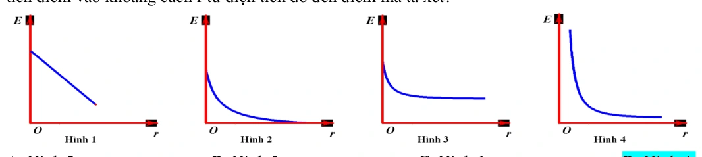
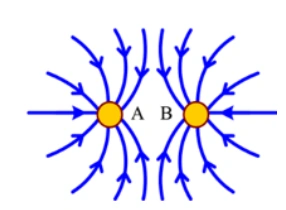
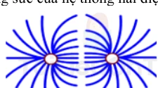
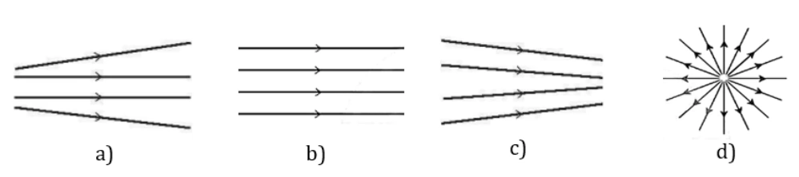

# Bài tập — Bài 3 — Điện trường và cường độ điện trường

> Hệ bài tập được biên soạn theo các dạng xuất hiện trong bộ tài liệu Vật lí 11 của dự án. Câu hỏi được giữ ngắn, trực tiếp; độ khó tăng dần và không cố tình thêm dữ kiện gây nhiễu.

[← Trở lại bài học](../../03-electric-field-intensity.md)

## Phần A — Trắc nghiệm 4 lựa chọn

### Bài 1 — Mức 1 — Nhận biết

Cường độ điện trường tại một điểm được xác định bởi

A. $\vec E=\vec F/q$ với điện tích thử dương đủ nhỏ.
B. $E=q/F$.
C. $E=Fr^2$.
D. $E=Uq$.

??? success "Đáp án và lời giải"
    Chọn **A** về định nghĩa vectơ.

### Bài 2 — Mức 1 — Nhận biết

Điện trường của điện tích điểm dương có chiều

A. hướng vào điện tích.
B. hướng ra xa điện tích.
C. tiếp tuyến vòng tròn quanh điện tích.
D. không xác định.

??? success "Đáp án và lời giải"
    Chọn **B**.

### Bài 3 — Mức 1 — Nhận biết

Điện tích điểm $Q=+4\,\mu$C. Tại điểm cách Q $0,30$ m trong chân không, cường độ điện trường bằng

A. $4\cdot10^4$ V/m.
B. $4\cdot10^5$ V/m.
C. $4\cdot10^6$ V/m.
D. $1,2\cdot10^5$ V/m.

??? success "Đáp án và lời giải"
    Chọn **B**. $E=kQ/r^2=9\cdot10^9\cdot4\cdot10^{-6}/0,09=4\cdot10^5$ V/m.

### Bài 4 — Mức 1 — Nhận biết

Đơn vị nào tương đương với đơn vị cường độ điện trường?

A. N/C.
B. C/N.
C. J/C².
D. W/A.

??? success "Đáp án và lời giải"
    Chọn **A**; cũng có thể dùng V/m.

## Phần B — Đúng/Sai

### Bài 5 — Mức 2 — Thông hiểu

Đường sức điện:

a) Có hướng trùng hướng vectơ cường độ điện trường tại mỗi điểm.
b) Các đường sức tĩnh điện không cắt nhau.
c) Mật độ đường sức dày hơn thường biểu diễn điện trường mạnh hơn.
d) Đường sức của điện tích điểm âm hướng ra xa điện tích.

??? success "Đáp án và lời giải"
    a) **Đúng**.
    b) **Đúng**.
    c) **Đúng** về cách biểu diễn.
    d) **Sai**: hướng vào điện tích âm.

### Bài 6 — Mức 2 — Thông hiểu

Xét cường độ điện trường do điện tích điểm Q:

a) $E\propto|Q|$.
b) $E\propto1/r^2$.
c) Độ lớn E phụ thuộc điện tích thử đặt tại điểm xét.
d) Nếu Q đổi dấu thì độ lớn E không đổi nhưng hướng đảo.

??? success "Đáp án và lời giải"
    a) **Đúng**.
    b) **Đúng**.
    c) **Sai** trong định nghĩa điện trường nguồn; điện tích thử chỉ dùng để thăm dò.
    d) **Đúng**.

## Phần C — Trả lời ngắn

### Bài 7 — Mức 3 — Vận dụng

Điện tích $Q=-2\,\mu$C. Tính cường độ điện trường tại điểm cách Q $15$ cm trong chân không và nêu hướng.

??? success "Đáp án và lời giải"
    $E=9\cdot10^9\cdot2\cdot10^{-6}/0,15^2=8,0\cdot10^5$ V/m. Vì Q âm, vectơ $\vec E$ hướng từ điểm xét về Q.

### Bài 8 — Mức 3 — Vận dụng

Tại một điểm, điện tích thử $q=+2$ nC chịu lực điện $6\cdot10^{-5}$ N theo hướng Đông. Tính $\vec E$.

??? success "Đáp án và lời giải"
    $E=F/q=6\cdot10^{-5}/(2\cdot10^{-9})=3\cdot10^4$ V/m. Vì q dương, $\vec E$ cùng chiều lực: hướng Đông.

### Bài 9 — Mức 3 — Vận dụng

Điện trường đều có $E=500$ V/m. Điện tích $q=-4\,\mu$C đặt trong trường chịu lực điện có độ lớn bao nhiêu và hướng thế nào so với $\vec E$?

??? success "Đáp án và lời giải"
    $F=|q|E=4\cdot10^{-6}\cdot500=2\cdot10^{-3}$ N. Vì q âm, lực ngược chiều $\vec E$.

## Phần D — Vận dụng và vận dụng cao

### Bài 10 — Mức 4 — Vận dụng cao

Một điện tích điểm Q tạo cường độ điện trường $E_1=9\cdot10^4$ V/m tại điểm cách nó $20$ cm. Tính cường độ tại điểm cách Q $30$ cm và độ lớn Q.

??? success "Đáp án và lời giải"
    Vì $E\propto1/r^2$:

    $E_2=E_1(r_1/r_2)^2=9\cdot10^4(0,20/0,30)^2=4\cdot10^4$ V/m.

    Từ $E_1=k|Q|/r_1^2$:

    $|Q|=E_1r_1^2/k=9\cdot10^4\cdot0,04/(9\cdot10^9)=4\cdot10^{-7}$ C $=0,4\,\mu$C.

## Ngân hàng bài tập mở rộng

> Các bài dưới đây được đánh số nối tiếp phần bài tập phía trên. Đề bài được trình bày bằng Markdown; chỉ đồ thị, hình vẽ hoặc sơ đồ thực sự cần thiết mới được giữ dưới dạng hình. Đáp án và lời giải được đặt trong nút mở rộng ngay dưới từng bài.

### Nhận biết — Trả lời ngắn

#### Bài 11

<!-- source-id: BT-Chuong-III-p77-q1-199 -->

Cho hai tấm kim loại phẳng rộng, đặt nằm ngang, song song với nhau và cách nhau d
5 cm
=
. Hiệu
điện thế giữa hai tấm đó là 20V. Cường độ điện trường trong khoảng giữa hai bản phẳng bằng bao nhiêu
V/m?

??? success "Đáp án và lời giải"
    **Đáp án:** $400$

    **Hướng dẫn giải:**
    Áp dụng công thức

#### Bài 12

<!-- source-id: BT-Chuong-III-p91-q1-229 -->

Cho hai tấm kim loại phẳng rộng, đặt nằm ngang song song với nhau và cách nhau
.
Hiệu điện thế giữa hai tầm kim loại đó là
. Cường độ điện trường giữa hai tấm kim loại đó là
a
10 V/m. Giá trị của a là bao nhiêu ?

??? success "Đáp án và lời giải"
    **Đáp án:** 3
    **Hướng dẫn giải:**

    Dùng $E=F/q_0=k|Q|/(\varepsilon r^2)$; $\vec E$ hướng ra xa điện tích dương và hướng về điện tích âm.

    Vậy kết quả cần tìm là **3**.
### Nhận biết — Trắc nghiệm 4 lựa chọn

#### Bài 13

<!-- source-id: BT-Chuong-III-p32-q1-82 -->

Điện trường được tạo ra bởi điện tích, là dạng vật chất tồn tại quanh điện tích và

A. tác dụng lực lên mọi vật đặt trong nó.

B. tác dụng lực điện lên mọi điện tích đặt trong nó.

C. truyền lực cho các điện tích.

D. truyền tương tác giữa các điện tích.

??? success "Đáp án và lời giải"
    **Đáp án:** B
    **Hướng dẫn giải:**
    Điện trường được tạo ra bởi điện tích, là dạng vật chất tồn tại quanh điện tích và tác dụng lực điện lên mọi
    vật đặt trong nó.

#### Bài 14

<!-- source-id: BT-Chuong-III-p32-q2-83 -->

Cường độ điện trường tại một điểm đặc trưng cho

A. thể tích vùng có điện trường là lớn hay nhỏ.

B. điện trường tại điểm đó về phương diện dự trữ năng lượng.

C. tác dụng lực của điện trường lên điện tích tại điểm đó.

D. tốc độ dịch chuyển điện tích tại điểm đó.

??? success "Đáp án và lời giải"
    **Đáp án:** C
    **Hướng dẫn giải:**
    Cường độ điện trường tại một điểm đặc trưng cho tác dụng lực của điện trường lên điện tích tại điểm đó.

#### Bài 15

<!-- source-id: BT-Chuong-III-p32-q3-84 -->

Đơn vị của cường độ điện trường là

A. N.

B. N/m.

C. V/m.

D. V.m.

??? success "Đáp án và lời giải"
    **Đáp án:** C
    **Hướng dẫn giải:**
    Đơn vị của cường độ điện trường là V/m

#### Bài 16

<!-- source-id: BT-Chuong-III-p32-q4-85 -->

Đại lượng nào dưới đây không liên quan tới cường độ điện trường của một điện tích điểm Q đặt tại
một điểm trong chân không?

A. Khoảng cách r từ Q đến điểm quan sát.

B. Hằng số điện của chân không.

C. Độ lớn của điện tích Q.

D. Độ lớn của điện tích q đặt tại điểm quan sát.

??? success "Đáp án và lời giải"
    **Đáp án:** D
    **Hướng dẫn giải:**
    Độ lớn cường độ điện trường không phụ thuộc vào độ lớn điện tích thử → Độ lớn của điện tích q đặt tại
    điểm quan sát.

#### Bài 17

<!-- source-id: BT-Chuong-III-p33-q6-87 -->

Những đường sức điện của điện trường xung quanh một điện tích điểm Q&lt;0 có dạng là những đường

A. cong và đường thẳng có chiều đi vào điện tích Q.

B. thẳng có chiều đi vào điện tích Q.

C. cong và đường thẳng có chiều đi ra khỏi điện tích Q.

D. thẳng có chiều đi ra khỏi điện tích Q.

??? success "Đáp án và lời giải"
    **Đáp án:** B
    **Hướng dẫn giải:**
    Q&lt;0 nên những đường thẳng có chiều đi vào điện tích Q.

#### Bài 18

<!-- source-id: BT-Chuong-III-p33-q7-88 -->

Trong các đại lượng vật lí sau đây, đại lượng nào là véctơ

A. điện tích.

B. cường độ điện trường.

C. điện trường.

D. đường sức điện.

??? success "Đáp án và lời giải"
    **Đáp án:** B
    **Hướng dẫn giải:**
    Cường độ điện trường là một đại lượng véctơ

#### Bài 19

<!-- source-id: BT-Chuong-III-p33-q8-89 -->

Nếu khoảng cách từ điện tích nguồn tới điểm đang xét tăng 2 lần thì cường độ điện trường

A. giảm 2 lần.

B. tăng 2 lần.

C. giảm 4 lần.

B. tăng 4 lần.

??? success "Đáp án và lời giải"
    **Đáp án:** C
    **Hướng dẫn giải:**
    2
    1
    E
    r
    υ
    nên r tăng 2 thì E giảm 4

#### Bài 20

<!-- source-id: BT-Chuong-III-p33-q9-90 -->

Người ta dùng hai điện tích thử $q_1$ và $q_2$ để đo cường độ điện trường tại một điểm $P$. Khẳng định nào sau đây đúng?

A. Nếu $q_1>q_2$ thì $F_1/q_1<F_2/q_2$.

B. Nếu $q_1<q_2$ thì $F_1/q_1>F_2/q_2$.

C. Với mọi $q_1,q_2$ thì $\vec F_1=\vec F_2$.

D. Với mọi điện tích thử phù hợp, $\vec E=\vec F_1/q_1=\vec F_2/q_2$.

??? success "Đáp án và lời giải"
    **Đáp án: D.**
    **Hướng dẫn giải:**

    Theo định nghĩa cường độ điện trường tại một điểm,

    $$\vec E=\frac{\vec F}{q}.$$

    Vì $\vec E$ là đặc trưng của điện trường tại $P$, không phụ thuộc điện tích thử, nên

    $$\vec E=\frac{\vec F_1}{q_1}=\frac{\vec F_2}{q_2}.$$
#### Bài 21

<!-- source-id: BT-Chuong-III-p33-q10-91 -->

Câu nào sau đây là sai?

A. Xung quanh mọi điện tích đều có điện trường.

B. Chỉ xung quanh các điện tích đứng yên mới có điện trường.

C. Điện trường tác dụng lực điện lên các điện tích đứng yên trong nó.

D. Điện trường tác dụng lực điện lên các điện tích chuyển động trong nó.

??? success "Đáp án và lời giải"
    **Đáp án:** B
    **Hướng dẫn giải:**
    - Điện trường được tạo ra bởi điện tích, là dạng vật chất tồn tại xung quanh điện tích và truyền tương tác
    giữa các điện tích.

#### Bài 22

<!-- source-id: BT-Chuong-III-p34-q11-92 -->

Đồ thị nào trong hình vẽ phản ánh sự phụ thuộc của độ lớn cường độ điện trường E của một điện
tích điểm vào khoảng cách r từ điện tích đó đến điểm mà ta xét?

A. Hình 2.

B. Hình 3.

C. Hình 1.

D. Hình 4.

{ loading=lazy }

??? success "Đáp án và lời giải"
    **Đáp án:** D
    **Hướng dẫn giải:**

    Dùng $E=F/q_0=k|Q|/(\varepsilon r^2)$; $\vec E$ hướng ra xa điện tích dương và hướng về điện tích âm.

    Đối chiếu kết quả với các lựa chọn, phương án phù hợp là **D. Hình 4.**
#### Bài 23

<!-- source-id: BT-Chuong-III-p34-q12-93 -->

Trên hình bên có vẽ một số đường sức của hệ thống hai điện tích điểm A và

B. Chọn kết luận đúng.

A. A là điện tích dương, B là điện tích âm.

B. A là điện tích âm, B là điện tích dương.

C. Cả A và B là điện tích dương.

D. Cả A và B là điện tích âm.

{ loading=lazy }

??? success "Đáp án và lời giải"
    **Đáp án:** D
    **Hướng dẫn giải:**
    Đường sức điện hướng vào điện tích → A, B đều là điện tích âm.

#### Bài 24

<!-- source-id: BT-Chuong-III-p34-q13-94 -->

Phát biểu nào sau đây là không đúng?

A. Điện phổ cho ta biết sự phân bố các đường sức trong điện trường.

B. Tất cả các đường sức đều xuất phát từ điện tích dương và kết thúc ở điện tích âm.

C. Cũng có khi đường sức điện không xuất phát từ điện tích dương mà xuất phát từ vô cùng.

D. Các đường sức của điện trường đều là các đường thẳng song song và cách đều nhau.

??? success "Đáp án và lời giải"
    **Đáp án:** B
    **Hướng dẫn giải:**
    Trong trường hợp có 1 điện tích các đường sức đi từ điện tích dương ra vô cực hoặc từ vô cực đến điện tích
    âm.

#### Bài 25

<!-- source-id: BT-Chuong-III-p34-q14-95 -->

Trên hình vẽ có vẽ một số đường sức của hệ thống hai điện tích. Các điện tích đó là

A. hai điện tích dương.

B. hai điện tích âm.

C. một điện tích dương, một điên tích âm.

D. không thể có các đường sức có dạng như thế.

{ loading=lazy }

??? success "Đáp án và lời giải"
    **Hướng dẫn giải:**
    Đường sức của điện tích điểm âm hướng về điện tích đó còn điện tích dương hướng ra khỏi điện tích đó.

#### Bài 26

<!-- source-id: BT-Chuong-III-p35-q15-96 -->

Đặt một điện tích âm, khối lượng nhỏ vào một điện trường đều rồi thả nhẹ. Điện tích sẽ chuyển
động

A. dọc theo chiều của đường sức điện trường.

B. ngược chiều đường sức điện trường.

C. vuông góc với đường sức điện trường.

D. theo một quỹ đạo bất kỳ.

??? success "Đáp án và lời giải"
    **Đáp án:** B
    **Hướng dẫn giải:**
    Điện tích âm chuyển động ngược chiều đường sức điện trường

#### Bài 27

<!-- source-id: BT-Chuong-III-p36-q8-104 -->

Khái niệm nào sau đây cho biết độ mạnh yếu của điện trường tại một điểm?

A. Điện tích.

B. Điện trường.

C. Cường độ điện trường.

D. Đường sức điện.

??? success "Đáp án và lời giải"
    **Đáp án:** C
    **Hướng dẫn giải:**
    Cường độ điện trường cho biết độ mạnh yếu của điện trường tại một điểm.

#### Bài 28

<!-- source-id: BT-Chuong-III-p36-q9-105 -->

Độ lớn cường độ điện trường tại một điểm gây bởi một điện tích điểm không phụ thuộc

A. độ lớn điện tích thử.

B. độ lớn điện tích đó.

C. khoảng cách từ điểm đang xét đến điện tích đó.

D. hằng số điện môi của của môi trường.

??? success "Đáp án và lời giải"
    **Đáp án:** A
    **Hướng dẫn giải:**

    Dùng $E=F/q_0=k|Q|/(\varepsilon r^2)$; $\vec E$ hướng ra xa điện tích dương và hướng về điện tích âm.

    → Cường độ điện trường không phụ thuộc vào độ lớn điện tích thử.

    Đối chiếu kết quả với các lựa chọn, phương án phù hợp là **A. độ lớn điện tích thử.**
#### Bài 29

<!-- source-id: BT-Chuong-III-p36-q10-106 -->

Véctơ cường độ điện trường tại mỗi điểm có chiều

A. cùng chiều với lực điện tác dụng lên điện tích thử dương tại điểm đó.

B. cùng chiều với lực điện tác dụng lên điện tích thử tại điểm đó.

C. phụ thuộc độ lớn điện tích thử.

D. phụ thuộc nhiệt độ môi trường.

??? success "Đáp án và lời giải"
    **Hướng dẫn giải:**

    Dùng $E=F/q_0=k|Q|/(\varepsilon r^2)$; $\vec E$ hướng ra xa điện tích dương và hướng về điện tích âm.
#### Bài 30

<!-- source-id: BT-Chuong-III-p37-q11-107 -->

Công thức xác định cường độ điện trường gây ra bởi điện tích Q &lt; 0, tại một điểm trong chân
không, cách điện tích Q một khoảng r là

A. 9
2
9.10 Q
E
r
=
.

B. 9
2
9.10 Q
E
r
= −
.

C. 9
9.10 Q
E
r
=
.

D. 9
2
9.10
Q
E
r
−
= −
.

??? success "Đáp án và lời giải"
    **Đáp án:** B
    **Hướng dẫn giải:**

    Dùng $E=F/q_0=k|Q|/(\varepsilon r^2)$; $\vec E$ hướng ra xa điện tích dương và hướng về điện tích âm.

    Đối chiếu kết quả với các lựa chọn, phương án phù hợp là **B. 9 2 9.10 Q E r = − .**
#### Bài 31

<!-- source-id: BT-Chuong-III-p37-q12-108 -->

Nếu khoảng cách từ điện tích nguồn tới điểm đang xét tăng 3 lần thì cường độ điện trường

A. giảm 3 lần.

B. tăng 6 lần.

C. giảm 9 lần.

B. tăng 3 lần.

??? success "Đáp án và lời giải"
    **Đáp án:** C
    **Hướng dẫn giải:**

    Dùng $E=F/q_0=k|Q|/(\varepsilon r^2)$; $\vec E$ hướng ra xa điện tích dương và hướng về điện tích âm.

    Đối chiếu kết quả với các lựa chọn, phương án phù hợp là **C. giảm 9 lần.**
#### Bài 32

<!-- source-id: BT-Chuong-III-p37-q14-110 -->

Tại một điểm xác định trong điện trường tĩnh, nếu độ lớn điện tích thử giảm 4 lần thì độ lớn cường
độ điện trường

A. tăng 4 lần.

B. giảm 4 lần.

C. không đổi.

D. tăng 2 lần.

??? success "Đáp án và lời giải"
    **Đáp án:** C
    **Hướng dẫn giải:**

    Dùng $E=F/q_0=k|Q|/(\varepsilon r^2)$; $\vec E$ hướng ra xa điện tích dương và hướng về điện tích âm.

    → Cường độ điện trường không phụ thuộc vào độ lớn điện tích thử.

    Đối chiếu kết quả với các lựa chọn, phương án phù hợp là **C. không đổi.**
#### Bài 33

<!-- source-id: BT-Chuong-III-p38-q15-111 -->

Một điện tích điểm dương Q trong chân không gây ra tại điểm M cách điện tích một khoảng r = 30
cm một điện trường có cường độ E = 40000 V/m. Độ lớn điện tích Q là

A. Q = 3.10-5

C. B. Q = 3.10-8

C. C. Q = 4.10-7

C. D. Q = 3.10-6 C.

??? success "Đáp án và lời giải"
    **Đáp án:** C
    **Hướng dẫn giải:**

    Dùng $E=F/q_0=k|Q|/(\varepsilon r^2)$; $\vec E$ hướng ra xa điện tích dương và hướng về điện tích âm.

    Đối chiếu kết quả với các lựa chọn, phương án phù hợp là **C. B. Q = 3.10-8**
#### Bài 34

<!-- source-id: BT-Chuong-III-p66-q1-174 -->

Điện trường đều tồn tại ở

A. xung quanh một vật hình cầu tích điện đều.

B. xung quanh một vật hình cầu chỉ tích điện đều trên bề mặt.

C. xung quanh hai bản kim loại phẳng, song song, có kích thước bằng nhau.

D. trong một vùng không gian hẹp gần mặt đất.
??? success "Đáp án và lời giải"
    **Đáp án:** D
    **Hướng dẫn giải:**
    Điện trường đều tồn tại ở giữa hai bản kim loại phẳng, song song, có kích thước bằng nhau tích điện trái
    dấu hoặc trong một vùng không gian hẹp gần mặt đất.

#### Bài 35

<!-- source-id: BT-Chuong-III-p66-q2-175 -->

Các đường sức điện trong điện trường đều

A. chỉ có phương là không đổi.

B. chỉ có chiều là không đổi.

C. là các đường thẳng song song cách đều.

D. là những đường thẳng đồng quy.

??? success "Đáp án và lời giải"
    **Đáp án:** C
    **Hướng dẫn giải:**
    Các đường sức điện trong điện trường đều là các đường thẳng song song cách đều.

#### Bài 36

<!-- source-id: BT-Chuong-III-p66-q3-176 -->

Công thức liên hệ giữa cường độ điện trường và hiệu điện thế trong điện trường đều giữa hai bản
phẳng song song nhiễm điện trái dấu là

A. U = Ed

B. U = A/q

C. E = A/qd

D. E = F/q

??? success "Đáp án và lời giải"
    **Đáp án:** A
    **Hướng dẫn giải:**
    Trong điện trường đều công thức liên hệ giữa cường độ điện trường và hiệu điện thế là :
    U = Ed

#### Bài 37

<!-- source-id: BT-Chuong-III-p66-q4-177 -->

Với điện trường như thế nào thì có thể viết hệ thức UMN = Ed, với d là hình chiếu của MN lên
phương của đường sức điện.

A. Điện trường của điện tích dương

B. Điện trường của điện tích âm

C. Điện trường đều

D. Điện trường không đều
??? success "Đáp án và lời giải"
    **Đáp án:** C
    **Hướng dẫn giải:**
    Trong điện trường đều công thức liên hệ giữa cường độ điện trường và hiệu điện thế là :
    U = Ed

#### Bài 38

<!-- source-id: BT-Chuong-III-p66-q5-178 -->

Trong các hình dưới đây, hình nào biểu diễn điện trường đều?

A. Hình a.

B. Hình b.

C. Hình c.

D. Hình d.

{ loading=lazy }

??? success "Đáp án và lời giải"
    **Đáp án:** B
    **Hướng dẫn giải:**
    Các đường sức điện trong điện trường đều là các đường thẳng song song cách đều.

#### Bài 39

<!-- source-id: BT-Chuong-III-p66-q6-179 -->

Trong các nhận xét sau, nhận xét không đúng? Đường sức điện

A. của cùng một điện trường đều có thể cắt nhau.

B. của điện trường tĩnh là đường không khép kín.

C. của cùng một điện trường đều là những đường thẳng song song cách đều.

D. là các đường có hướng, xuất phát ở điện tích dương và kết thúc ở điện tích âm

??? success "Đáp án và lời giải"
    **Đáp án:** A
    **Hướng dẫn giải:**
    Vì qua mỗi điểm trong điện trường chỉ có duy nhất một đường sức điện đi qua

#### Bài 40

<!-- source-id: BT-Chuong-III-p68-q12-185 -->

Tế bào cơ thể mực ống khi đang nghỉ ngơi, không kích thích. Người ta sử dụng một máy đo điện
thế (điện kế) cực nhạy để đo điện thế nghỉ của tế bào thần kinh. Đặt điện cực thứ nhất của máy lên mặt
ngoài của màng tế bào, còn điện cực thứ hai thì đâm xuyên qua màng tế bào, đến tiếp xúc với tế bào chất.
Mặt trong của màng tế bào trong cơ thể sống mang điện tích âm, mặt ngoài mang điện tích dương. Hiệu
điện thế giữa hai mặt này bằng 70 mV. Màng tế bào dày 8 nm. Cường độ điện trường bên trong màng tế
bào bằng
A.8,75V/m.

B. 8,75.106V/m.

C. 8750V/m.

D. 8,75.108V/m.

??? success "Đáp án và lời giải"
    **Đáp án:** B
    **Hướng dẫn giải:**
    Cường độ điện trường trong màng tế bào:

#### Bài 41

<!-- source-id: BT-Chuong-III-p82-q2-208 -->

Điện trường đều là điện trường có

A. vectơ cường độ điện trường tại mọi điểm đều bằng nhau.

B. độ lớn cường độ điện trường tại mọi điểm đều khác nhau.

C. chiều của vectơ cường độ điện trường ở cá điểm khác nhau là khác nhau.

D. độ lớn lực tác dụng lên mọi điện tích không thay đổi.

??? success "Đáp án và lời giải"
    **Đáp án:** A
    **Hướng dẫn giải:**

    Dùng $E=F/q_0=k|Q|/(\varepsilon r^2)$; $\vec E$ hướng ra xa điện tích dương và hướng về điện tích âm.

    Đối chiếu kết quả với các lựa chọn, phương án phù hợp là **A. vectơ cường độ điện trường tại mọi điểm đều bằng nhau.**
#### Bài 42

<!-- source-id: BT-Chuong-III-p82-q3-209 -->

Chọn câu đúng. Điện trường đều là điện trường

A. có mật độ đường sức không đổi.

B. có vectơ
 không đổi về hướng và độ lớn ở những điểm khác nhau.

C. do l điện tích điểm gây ra.

D. do hệ 2 điện tích điểm gây ra.

??? success "Đáp án và lời giải"
    **Đáp án:** B
    **Hướng dẫn giải:**

    Dùng $E=F/q_0=k|Q|/(\varepsilon r^2)$; $\vec E$ hướng ra xa điện tích dương và hướng về điện tích âm.

    Đối chiếu kết quả với các lựa chọn, phương án phù hợp là **B. có vectơ không đổi về hướng và độ lớn ở những điểm khác nhau.**
#### Bài 43

<!-- source-id: BT-Chuong-III-p82-q4-210 -->

Cường độ điện trường đều giữa hai bản kim loại phẳng song song được nối với nguồn điện có hiệu
điện thế U sẽ giảm đi khi

A. tăng hiệu điện thế giữa hai bản phẳng.

B. tăng khoảng cách giữa hai bản phẳng.

C. tăng diện tích của hai bản phẳng.

D. giảm diện tích của hai bản phẳng.

??? success "Đáp án và lời giải"
    **Đáp án:** B
    **Hướng dẫn giải:**

    Dùng $E=F/q_0=k|Q|/(\varepsilon r^2)$; $\vec E$ hướng ra xa điện tích dương và hướng về điện tích âm.

    Đối chiếu kết quả với các lựa chọn, phương án phù hợp là **B. tăng khoảng cách giữa hai bản phẳng.**
#### Bài 44

<!-- source-id: BT-Chuong-III-p82-q6-212 -->

Nhận xét không đúng với đặc điểm đường sức điện là nhận xét nào ?

A. Các đường sức của cùng một điện trường đều có thể cắt nhau.

B. Các đường sức của điện trường tĩnh là đường không khép kín.
E


C. Các đường sức của cùng một điện trường đều là những đường thẳng song song cách đều.

D. Các đường sức là các đường có hướng.

??? success "Đáp án và lời giải"
    **Đáp án:** A
    **Hướng dẫn giải:**

    Dùng $E=F/q_0=k|Q|/(\varepsilon r^2)$; $\vec E$ hướng ra xa điện tích dương và hướng về điện tích âm.

    Đối chiếu kết quả với các lựa chọn, phương án phù hợp là **A. Các đường sức của cùng một điện trường đều có thể cắt nhau.**
#### Bài 45

<!-- source-id: BT-Chuong-III-p83-q8-214 -->

Trong một điện trường đều, nếu trên một đường sức, giữa hai điểm cách nhau 4 cm có hiệu điện
thế 10 V, giữa hai điểm cách nhau 6 cm có hiệu điện thế là

A. 8 V.

B. 10 V.

C. 15 V.

D. 22,5 V.

??? success "Đáp án và lời giải"
    **Hướng dẫn giải:**

    Dùng $E=F/q_0=k|Q|/(\varepsilon r^2)$; $\vec E$ hướng ra xa điện tích dương và hướng về điện tích âm.
#### Bài 46

<!-- source-id: BT-Chuong-III-p83-q9-215 -->

Giữa hai bản kim loại phẳng song song cách nhau 4 cm có một hiệu điện thế không đổi 200 V.
Cường độ điện trường ở khoảng giữa hai bản kim loại là

A. 5000 V/m.

B. 50 V/m.

C. 800 V/m.

D. 80 V/m.

??? success "Đáp án và lời giải"
    **Đáp án:** A
    **Hướng dẫn giải:**

    Dùng $E=F/q_0=k|Q|/(\varepsilon r^2)$; $\vec E$ hướng ra xa điện tích dương và hướng về điện tích âm.

    Đối chiếu kết quả với các lựa chọn, phương án phù hợp là **A. 5000 V/m.**
#### Bài 47

<!-- source-id: BT-Chuong-III-p83-q11-217 -->

Hai tấm kim loại phẳng nằm ngang song song cách nhau 5cm. Hiệu điện thế giữa hai tấm là 50V.
Hãy cho biết đặc điểm điện trường, dạng đường sức điện trường giữa hai tấm kim loại

A. điện trường biến đổi, đường sức là đường cong, E = 1200V/m.

B. điện trường biến đổi tăng dần, đường sức là đường tròn, E = 800V/m.

C. điện trường đều, đường sức là đường thẳng, E = 1200V/m.

D. điện trường đều, đường sức là đường thẳng, E = 1000V/m.

??? success "Đáp án và lời giải"
    **Đáp án:** D
    **Hướng dẫn giải:**

    Dùng $E=F/q_0=k|Q|/(\varepsilon r^2)$; $\vec E$ hướng ra xa điện tích dương và hướng về điện tích âm.

    Đối chiếu kết quả với các lựa chọn, phương án phù hợp là **D. điện trường đều, đường sức là đường thẳng, E = 1000V/m.**
### Thông hiểu — Trắc nghiệm 4 lựa chọn

#### Bài 48

<!-- source-id: BT-Chuong-III-p35-q1-97 -->

Một điện tích đặt tại điểm có cường độ điện trường 0,16 (V/m). Lực tác dụng lên điện tích đó bằng
2.10-4 (N). Độ lớn điện tích đó là

A. q = 8.10-6 (C).

B. q = 12,5.10-6 (C).

C. q = 1,25.10-3 (C).

D. q = 12,5 (C).

??? success "Đáp án và lời giải"
    **Đáp án:** C
    **Hướng dẫn giải:**

    Dùng $E=F/q_0=k|Q|/(\varepsilon r^2)$; $\vec E$ hướng ra xa điện tích dương và hướng về điện tích âm.

    Đối chiếu kết quả với các lựa chọn, phương án phù hợp là **C. q = 1,25.10-3 (C).**
#### Bài 49

<!-- source-id: BT-Chuong-III-p35-q2-98 -->

Cường độ điện trường gây ra bởi điện tích Q = 5.10-9 (C), tại một điểm trong chân không cách điện
tích một khoảng 10 (cm) có độ lớn là

A. E = 0,450 (V/m).

B. E = 0,225 (V/m).

C. E = 4500 (V/m).

D. E = 2250 (V/m).

??? success "Đáp án và lời giải"
    **Đáp án:** C
    **Hướng dẫn giải:**

    Dùng $E=F/q_0=k|Q|/(\varepsilon r^2)$; $\vec E$ hướng ra xa điện tích dương và hướng về điện tích âm.

    Đối chiếu kết quả với các lựa chọn, phương án phù hợp là **C. E = 4500 (V/m).**
#### Bài 50

<!-- source-id: BT-Chuong-III-p35-q3-99 -->

Một điện tích điểm q=10-7 C đặt trong điện trường của điện tích điểm Q, chịu tác dụng của lực
F=3.10-3N. Cường độ điện trường E tại điểm đặt điện tích q là

A. 2.10-4 V/m.

B. 3.104 V/m.

C. 4.104 V/m.

D. 2,5.104 V/m.

??? success "Đáp án và lời giải"
    **Đáp án:** B
    **Hướng dẫn giải:**

    Dùng $E=F/q_0=k|Q|/(\varepsilon r^2)$; $\vec E$ hướng ra xa điện tích dương và hướng về điện tích âm.

    Đối chiếu kết quả với các lựa chọn, phương án phù hợp là **B. 3.104 V/m.**
#### Bài 51

<!-- source-id: BT-Chuong-III-p35-q4-100 -->

Một điện tích điểm q đặt trong một môi trường đồng tính, vô hạn có hằng số điện môi bằng 2,5. Tại
điểm M cách q một đoạn 0,4 m vectơ cường độ điện trường có độ lớn bằng 9.105 V/m và hướng về phía điện
tích q. Khẳng định nào sau đây đúng khi nói về dấu và độ lớn của điện tích q?

A. q= - 4 μC.

B. q= 4 μC.

C. q= 0,4 μC.

D. q= - 40 μC.

??? success "Đáp án và lời giải"
    **Đáp án:** D
    **Hướng dẫn giải:**

    Dùng $E=F/q_0=k|Q|/(\varepsilon r^2)$; $\vec E$ hướng ra xa điện tích dương và hướng về điện tích âm.

    Vì vectơ cường độ điện trường hướng về phía điện tích q nên q<0.

    Đối chiếu kết quả với các lựa chọn, phương án phù hợp là **D. q= - 40 μC.**
#### Bài 52

<!-- source-id: BT-Chuong-III-p36-q5-101 -->

Cho ba điểm A, M, N theo thứ tự trên một đường thẳng với AM = MN. Đặt điện tích q tại điểm A thì
cường độ điện trường tại M có độ lớn là E. Cường độ điện trường tại N có độ lớn là

A. 0,5E.

B. 0,25E.

C. 2E.

D. 4E.

??? success "Đáp án và lời giải"
    **Đáp án:** B
    **Hướng dẫn giải:**

    Dùng $E=F/q_0=k|Q|/(\varepsilon r^2)$; $\vec E$ hướng ra xa điện tích dương và hướng về điện tích âm.

    Mà AM=MN → AN=2AM

    Đối chiếu kết quả với các lựa chọn, phương án phù hợp là **B. 0,25E.**
#### Bài 53

<!-- source-id: BT-Chuong-III-p36-q7-103 -->

Nếu tại một điểm có 2 điện trường gây bởi 2 điện tích điểm Q1 âm và Q2 dương thì hướng của cường
độ điện trường tại điểm đó được xác định bằng hướng của

A. tổng 2 véctơ cường độ điện trường điện trường thành phần.

B. véctơ cường độ điện trường gây bởi điện tích dương.

C. véctơ cường độ điện trường gây bởi điện tích âm.

D. véctơ cường độ điện trường gây bởi điện tích ở gần điểm đang xét hơn.

??? success "Đáp án và lời giải"
    **Đáp án:** A
    **Hướng dẫn giải:**
    Theo nguyên lí chồng chất điện trường thì ta có hình vẽ trên. Hướng của cường độ điện trường tổng hợp là
    hướng của tổng 2 véctơ cường độ điện trường thành phần.

#### Bài 54

<!-- source-id: BT-Chuong-III-p67-q10-183 -->

Cường độ điện trường đều giữa hai bản kim loại phẳng song song, tích điện trái dấu được nối với
nguồn điện có hiệu điện thế U ( không đổi) sẽ giảm đi khi

A. tăng hiệu điện thế giữa hai bản phẳng.

B. tăng khoảng cách giữa hai bản phẳng.

C. tăng diện tích của hai bản phẳng.

D. giảm diện tích của hai bản phẳng.

??? success "Đáp án và lời giải"
    **Đáp án:** B
    **Hướng dẫn giải:**

    Dùng $E=F/q_0=k|Q|/(\varepsilon r^2)$; $\vec E$ hướng ra xa điện tích dương và hướng về điện tích âm.

    Trong điện trường đều công thức liên hệ giữa cường độ điện trường và hiệu điện thế là :
    ,vì nguồn có U không đổi nên khi d tăng thì E giảm

    Đối chiếu kết quả với các lựa chọn, phương án phù hợp là **B. tăng khoảng cách giữa hai bản phẳng.**
### Vận dụng — Trả lời ngắn

#### Bài 55

<!-- source-id: BT-Chuong-III-p45-q1-128 -->

Tìm độ lớn cường độ điện trường tại M cách q một đoạn 20 cm. (tính theo V/m )

??? success "Đáp án và lời giải"
    **Đáp án:** $630$
    **Hướng dẫn giải:**

    Dùng $E=F/q_0=k|Q|/(\varepsilon r^2)$; $\vec E$ hướng ra xa điện tích dương và hướng về điện tích âm.

    Vậy kết quả cần tìm là **$630$**.
#### Bài 56

<!-- source-id: BT-Chuong-III-p45-q2-129 -->

Tìm độ lớn cường độ điện trường tại M cách q một đoạn 20 cm khi đặt điện tích trong dầu có hằng số
điện môi ε= 2 (tính theo V/m )

??? success "Đáp án và lời giải"
    **Đáp án:** $315$
    **Hướng dẫn giải:**

    Dùng $E=F/q_0=k|Q|/(\varepsilon r^2)$; $\vec E$ hướng ra xa điện tích dương và hướng về điện tích âm.

    Vậy kết quả cần tìm là **$315$**.
#### Bài 57

<!-- source-id: BT-Chuong-III-p46-q4-133 -->

Điểm N nằm trên đoạn AB và cách đều AB. Tìm độ lớn cường độ điện trường tại N. (tính theo V/m)

??? success "Đáp án và lời giải"
    **Đáp án:** $2700$
    **Hướng dẫn giải:**

    Dùng $E=F/q_0=k|Q|/(\varepsilon r^2)$; $\vec E$ hướng ra xa điện tích dương và hướng về điện tích âm.

    Vậy kết quả cần tìm là **$2700$**.
#### Bài 58

<!-- source-id: BT-Chuong-III-p46-q5-136 -->

Tính lực điện tác dụng lên điện tích q? (tính theo N)

??? success "Đáp án và lời giải"
    **Đáp án:** $0{,}1$
    **Hướng dẫn giải:**

    Dùng $E=F/q_0=k|Q|/(\varepsilon r^2)$; $\vec E$ hướng ra xa điện tích dương và hướng về điện tích âm.

    Vậy kết quả cần tìm là **$0{,}1$**.
#### Bài 59

<!-- source-id: BT-Chuong-III-p46-q6-137 -->

Tìm khoảng cách từ M đến điện tích q ? (tính theo m)

??? success "Đáp án và lời giải"
    **Đáp án:** $30$
    **Hướng dẫn giải:**

    Dùng $E=F/q_0=k|Q|/(\varepsilon r^2)$; $\vec E$ hướng ra xa điện tích dương và hướng về điện tích âm.

    Vậy kết quả cần tìm là **$30$**.
#### Bài 60

<!-- source-id: BT-Chuong-III-p56-q1-162 -->

Nếu khoảng cách từ A đến q tăng 5 lần thì cường độ điện trường tại A có độ lớn là bao nhiêu? (tính
theo V/m)

??? success "Đáp án và lời giải"
    **Đáp án:** $4000$
    **Hướng dẫn giải:**

    Dùng $E=F/q_0=k|Q|/(\varepsilon r^2)$; $\vec E$ hướng ra xa điện tích dương và hướng về điện tích âm.

    Vậy kết quả cần tìm là **$4000$**.
#### Bài 61

<!-- source-id: BT-Chuong-III-p56-q2-163 -->

Khoảng cách từ A đến q là bao nhiêu nếu cường độ điện trường tại A là 5.105 V/m? (tính theo cm)

??? success "Đáp án và lời giải"
    **Đáp án:** $2{,}5$
    **Hướng dẫn giải:**

    Dùng $E=F/q_0=k|Q|/(\varepsilon r^2)$; $\vec E$ hướng ra xa điện tích dương và hướng về điện tích âm.

    Vậy kết quả cần tìm là **$2{,}5$**.
#### Bài 62

<!-- source-id: BT-Chuong-III-p56-q3-166 -->

Tính độ lớn cường độ điện trường tại M cách điện tích một đoạn 10 cm? (tính theo vôn/mét)

??? success "Đáp án và lời giải"
    **Đáp án:** $900$
    **Hướng dẫn giải:**

    Dùng $E=F/q_0=k|Q|/(\varepsilon r^2)$; $\vec E$ hướng ra xa điện tích dương và hướng về điện tích âm.

    Vậy kết quả cần tìm là **$900$**.
#### Bài 63

<!-- source-id: BT-Chuong-III-p56-q4-167 -->

Xác định lực điện do điện tích q tác dụng lên điện tích điểm q’= -2.10-4 đặt tại M? (tính theo N)

??? success "Đáp án và lời giải"
    **Đáp án:** $0{,}18$
    **Hướng dẫn giải:**

    Dùng $E=F/q_0=k|Q|/(\varepsilon r^2)$; $\vec E$ hướng ra xa điện tích dương và hướng về điện tích âm.

    Vậy kết quả cần tìm là **$0{,}18$**.
### Vận dụng — Trắc nghiệm 4 lựa chọn

#### Bài 64

<!-- source-id: BT-Chuong-III-p38-q1-112 -->

Một điện tích -1 μC đặt trong chân không sinh ra điện trường tại một điểm cách nó 1m có độ lớn và
hướng là

A. 9000 V/m, hướng về phía nó.

B. 9000 V/m, hướng ra xa nó.

C. 9.109 V/m, hướng về phía nó.

D. 9.109 V/m, hướng ra xa nó.

??? success "Đáp án và lời giải"
    **Đáp án:** A
    **Hướng dẫn giải:**

    Dùng $E=F/q_0=k|Q|/(\varepsilon r^2)$; $\vec E$ hướng ra xa điện tích dương và hướng về điện tích âm.

    Vì Q<0 → vectơ cường độ điện trường hướng về phía nó.

    Đối chiếu kết quả với các lựa chọn, phương án phù hợp là **A. 9000 V/m, hướng về phía nó.**
#### Bài 65

<!-- source-id: BT-Chuong-III-p38-q2-113 -->

Hai điện tích thử q1, q2 (q1 =4q2) theo thứ tự đặt vào 2 điểm A và B trong điện trường. Lực tác dụng
lên q1 là F1, lực tác dụng lên q2 là F2(với F1 = 3F2). Cường độ điện trường tại A và B là E1 và E2 với

A. E2 = 0,75E1.

B. E2 = 2E1.

C. E2 = 0,5E1.

D. 2
1
4
3
E
E
=
.

??? success "Đáp án và lời giải"
    **Đáp án:** D
    **Hướng dẫn giải:**

    Dùng $E=F/q_0=k|Q|/(\varepsilon r^2)$; $\vec E$ hướng ra xa điện tích dương và hướng về điện tích âm.

    Đối chiếu kết quả với các lựa chọn, phương án phù hợp là **D. 2 1 4 3 E E = .**
#### Bài 66

<!-- source-id: BT-Chuong-III-p38-q3-114 -->

Điện tích điểm q = 80 nC đặt cố định tại O trong dầu. Hằng số điện môi của dầu là ε = 2. Cường độ
điện trường do q gây ra tại M cách O một khoảng MO = 30 cm là

A. 0,6.103 V/m.

B. 0,6.104 V/m.

C. 4.103 V/m.

D. 2.105 V/m.

??? success "Đáp án và lời giải"
    **Đáp án:** C
    **Hướng dẫn giải:**

    Dùng $E=F/q_0=k|Q|/(\varepsilon r^2)$; $\vec E$ hướng ra xa điện tích dương và hướng về điện tích âm.

    Đối chiếu kết quả với các lựa chọn, phương án phù hợp là **C. 4.103 V/m.**
#### Bài 67

<!-- source-id: BT-Chuong-III-p38-q4-115 -->

Có hai điện tích q1 = 5.10-9 C ,q2 = - 5.10-9 C đặt trong chân không cách nhau 10 cm. Xác định cường
độ điện trường tại điểm M nằm trên đường thẳng đi qua hai điện tích đó và cách q1 5cm; cách q2 15cm

A. 4500 V/m.

B. 36000 V/m.

C. 18000 V/m.

D. 16000 V/m.

??? success "Đáp án và lời giải"
    **Đáp án:** D
    **Hướng dẫn giải:**

    Dùng $E=F/q_0=k|Q|/(\varepsilon r^2)$; $\vec E$ hướng ra xa điện tích dương và hướng về điện tích âm.

    Áp dụng nguyên lý chồng chất điện trường:

    Đối chiếu kết quả với các lựa chọn, phương án phù hợp là **D. 16000 V/m.**
#### Bài 68

<!-- source-id: BT-Chuong-III-p39-q6-117 -->

Hai điện tích điểm q1 = 0,5 nC và q2 = –0,5 nC đặt tại hai điểm A, B cách nhau 6 cm trong không khí.
Cường độ điện trường tại trung điểm của AB có độ lớn là.

A. E = 0 V/m.

B. E = 5000 V/m.

C. E = 10000 V/m.

D. E = 20000 V/m.

??? success "Đáp án và lời giải"
    **Đáp án:** C
    **Hướng dẫn giải:**

    Dùng $E=F/q_0=k|Q|/(\varepsilon r^2)$; $\vec E$ hướng ra xa điện tích dương và hướng về điện tích âm.

    Vì M là trung điểm AB và q1.q2<0 nên E=E1+E2=10000(V/m)

    Đối chiếu kết quả với các lựa chọn, phương án phù hợp là **C. E = 10000 V/m.**
#### Bài 69

<!-- source-id: BT-Chuong-III-p40-q10-121 -->

Hai điện tích Q1 =10-9 C, Q2 = 2.10-9 C đặt tại A và B trong không khí. Xác định điểm C mà tại đó
véctơ cường độ điện trường bằng không . Cho AB = 20 cm.

A. AC = 8,3 cm ; BC = 11,7 cm.

B. AC = 48,3 cm ;BC = 68,3 cm.

C. AC =11,7 cm ; BC = 8,3 cm.

D. AC = 7,3 cm ; BC = 17,3 cm.

??? success "Đáp án và lời giải"
    **Đáp án:** A
    **Hướng dẫn giải:**

    Dùng $E=F/q_0=k|Q|/(\varepsilon r^2)$; $\vec E$ hướng ra xa điện tích dương và hướng về điện tích âm.

    + Để cường độ điện trường tại C bằng 0 thì cường độ điện trường E1 gây bởi Q1 ngược chiều với cường độ
    điện trường E2 gây bởi Q2 → C phải nằm giữa AB.
    Mặc khác r1 + r2 = 20 cm → r1 = 8,3 cm, r2 = 11,7 cm.

    Đối chiếu kết quả với các lựa chọn, phương án phù hợp là **A. AC = 8,3 cm ; BC = 11,7 cm.**
#### Bài 70

<!-- source-id: BT-Chuong-III-p48-q1-140 -->

Quả cầu nhỏ mang điện tích 10-9 C đặt trong không khí. Cường độ điện trường tại 1 điểm cách quả
cầu 3 cm là

A. 105 V/m.

B. 104 V/m.

C. 5.103 V/m.

D. 3.104 V/m.

??? success "Đáp án và lời giải"
    **Đáp án:** B
    **Hướng dẫn giải:**

    Dùng $E=F/q_0=k|Q|/(\varepsilon r^2)$; $\vec E$ hướng ra xa điện tích dương và hướng về điện tích âm.

    Đối chiếu kết quả với các lựa chọn, phương án phù hợp là **B. 104 V/m.**
#### Bài 71

<!-- source-id: BT-Chuong-III-p48-q2-141 -->

Đặt một điện tích - 1 μC tại một điểm, nó chịu một lực điện 1 mN có hướng từ trái sang phải. Cường
độ điện trường có độ lớn và hướng là

A. 1000 V/m, từ trái sang phải.

B. 1000 V/m, từ phải sang trái.

C. 1V/m, từ trái sang phải.

D. 1 V/m, từ phải sang trái.

??? success "Đáp án và lời giải"
    **Đáp án:** B
    **Hướng dẫn giải:**

    Dùng $E=F/q_0=k|Q|/(\varepsilon r^2)$; $\vec E$ hướng ra xa điện tích dương và hướng về điện tích âm.

    q<0 → véctơ cường độ điện trường ngược chiều với lực điện.

    Đối chiếu kết quả với các lựa chọn, phương án phù hợp là **B. 1000 V/m, từ phải sang trái.**
#### Bài 72

<!-- source-id: BT-Chuong-III-p49-q3-142 -->

Hai điện tích thử q1, q2 (q1 = 2q2) theo thứ tự đặt vào 2 điểm A và B trong điện trường. Độ lớn lực
điện trường tác dụng lên q1 và q2 lần lượt là F1, và F2 (với F1 = 5F2). Độ lớn cường độ điện trường tại A và B
là E1 và E2. Khi đó

A. E2 = 0,2E1.

B. E2 = 2E1.

C. E2 = 2,5E1.

D. E2 = 0,4E1.

??? success "Đáp án và lời giải"
    **Đáp án:** D
    **Hướng dẫn giải:**

    Dùng $E=F/q_0=k|Q|/(\varepsilon r^2)$; $\vec E$ hướng ra xa điện tích dương và hướng về điện tích âm.

    Đối chiếu kết quả với các lựa chọn, phương án phù hợp là **D. E2 = 0,4E1.**
#### Bài 73

<!-- source-id: BT-Chuong-III-p49-q4-143 -->

Véctơ cường độ điện trường
υυ
E tại một điểm trong điện trường luôn

A. cùng hướng với lực
υυ
F tác dụng lên điện tích q đặt trong nó.

B. ngược hướng với lực
υυ
F tác dụng lên điện tích q đặt trong nó.

C. cùng phương với lực
υυ
F tác dụng lên điện tích q đặt trong nó.

D. khác phương với lực
υυ
F tác dụng lên điện tích q đặt trong nó.

??? success "Đáp án và lời giải"
    **Đáp án:** C
    **Hướng dẫn giải:**
    Véctơ cường độ điện trường
    υυ
    E tại một điểm trong điện trường luôn cùng phương với lực
    υυ
    F tác dụng lên
    điện tích q đặt trong nó.

#### Bài 74

<!-- source-id: BT-Chuong-III-p49-q5-144 -->

Tại điểm nào dưới đây không có điện trường ?

A. Bên trong một quả cầu nhựa nhiễm điện.

B. Bên ngoài một quả cầu nhựa nhiễm điện.

C. Bên trong một quả cầu kim loại nhiễm điện.

D. Bên ngoài một quả cầu kim loại nhiễm điện.

??? success "Đáp án và lời giải"
    **Đáp án:** C
    **Hướng dẫn giải:**
    Vì sau khi được tích điện, các electron trong quả cầu sẽ có xu hướng chuyển động phân bố ra bề mặt vật
    dẫn, sau khi đạt trạng thái cân bằng, bên trong vật dẫn sẽ không còn điện tích. Mặt khác, do sự phân bố của
    các điện tích trên bề mặt, điện trường tổng hợp trong lòng vật dẫn gây ra do các điện tích trên bề mặt bị triệt
    tiêu bên trong.

#### Bài 75

<!-- source-id: BT-Chuong-III-p49-q6-145 -->

Đặt một điện tích âm vào trong điện trường có véctơ cường độ điện trường E
υυ
. Hướng của lực điện
tác dụng lên điện tích như thế nào?

A. Luôn cùng hướng với E
υυ
.

B. Vuông góc với E
υυ
.

C. Luôn ngược hướng với E
υυ
.

D. Hợp với E
υυ
 1 góc 300.

??? success "Đáp án và lời giải"
    **Đáp án:** C
    **Hướng dẫn giải:**

    Dùng $E=F/q_0=k|Q|/(\varepsilon r^2)$; $\vec E$ hướng ra xa điện tích dương và hướng về điện tích âm.

    Đối chiếu kết quả với các lựa chọn, phương án phù hợp là **C. Luôn ngược hướng với E υυ .**
#### Bài 76

<!-- source-id: BT-Chuong-III-p49-q7-146 -->

Một điện tích q sinh ra một điện trường có độ lớn là E tại điểm M cách một khoảng r. Tại điểm N
cách q một khoảng 2r, điện trường có độ lớn là

A. 4
E .

B. 2
E .

C. E.

D. 2E.

??? success "Đáp án và lời giải"
    **Đáp án:** A
    **Hướng dẫn giải:**

    Dùng $E=F/q_0=k|Q|/(\varepsilon r^2)$; $\vec E$ hướng ra xa điện tích dương và hướng về điện tích âm.

    Đối chiếu kết quả với các lựa chọn, phương án phù hợp là **A. 4 E .**
#### Bài 77

<!-- source-id: BT-Chuong-III-p50-q8-147 -->

Véctơ cường độ điện trường do điện tích điểm Q &gt; 0 gây ra tại một điểm M cách Q một khoảng r
không có đặc điểm nào sau đây ?

A. Cường độ điện trường độ lớn tỉ lệ với độ lớn điện tích Q.

B. Cường độ điện trường có độ lớn tỉ lệ nghịch với r.

C. Véctơ cường độ điện trường hướng từ M ra xa Q.

D. Cường độ điện trường có phương là đường thẳng nối M và Q.

??? success "Đáp án và lời giải"
    **Đáp án:** B
    **Hướng dẫn giải:**
    Cường độ điện trường có độ lớn tỉ lệ nghịch với bình phương r.

#### Bài 78

<!-- source-id: BT-Chuong-III-p50-q9-148 -->

Trong vùng có điện trường, tại một điểm cường độ điện trường là E, nếu tăng độ lớn của điện tích thử
lên gấp đôi thì cường độ điện trường

A. tăng gấp đôi.

B. giảm một nửa.

C. tăng gấp 4.

D. không đổi.

??? success "Đáp án và lời giải"
    **Đáp án:** D
    **Hướng dẫn giải:**

    Dùng $E=F/q_0=k|Q|/(\varepsilon r^2)$; $\vec E$ hướng ra xa điện tích dương và hướng về điện tích âm.

    → Cường độ điện trường không phụ thuộc vào độ lớn điện tích thử.

    Đối chiếu kết quả với các lựa chọn, phương án phù hợp là **D. không đổi.**
#### Bài 79

<!-- source-id: BT-Chuong-III-p50-q10-149 -->

Vectơ cường độ điện trường tại một điểm do điện tích điểm Q gây ra có

A. phương vuông góc với đường thẳng nối tâm điện tích Q và điểm cần xét.

B. chiều hướng ra xa nếu Q dương.

C. độ lớn phụ thuộc vào độ lớn điện tích thử đặt tại điểm đó.

D. độ lớn tính theo công thức
M
k. Q
E
.r
= ε
.

??? success "Đáp án và lời giải"
    **Đáp án:** B
    **Hướng dẫn giải:**
    Vectơ cường độ điện trường tại một điểm do điện tích điểm Q gây ra có chiều hướng ra xa nếu Q dương.

#### Bài 80

<!-- source-id: BT-Chuong-III-p50-q11-150 -->

Cường độ điện trường tại một điểm đặc trưng cho

A. điện trường tại điểm đó về phương diện dự trữ năng lượng.

B. tác dụng lực của điện trường lên điện tích tại điểm đó.

C. thể tích vùng có điện trường là lớn hay nhỏ.

D. tốc độ dịch chuyển điện tích tại điểm đó.

??? success "Đáp án và lời giải"
    **Đáp án:** B
    **Hướng dẫn giải:**
    Cường độ điện trường tại một điểm đặc trưng cho tác dụng lực của điện trường lên điện tích tại điểm đó.

#### Bài 81

<!-- source-id: BT-Chuong-III-p50-q12-151 -->

Cường độ điện trường gây ra bởi điện tích Q = 6.10-9 C, tại một điểm trong chân không cách điện
tích một khoảng 10 cm có độ lớn là

A. E = 5400 V/m.

B. E = 4500 V/m.

C. E = 1500 V/m.

D. E = 6000 V/m.

??? success "Đáp án và lời giải"
    **Đáp án:** A
    **Hướng dẫn giải:**

    Dùng $E=F/q_0=k|Q|/(\varepsilon r^2)$; $\vec E$ hướng ra xa điện tích dương và hướng về điện tích âm.

    Đối chiếu kết quả với các lựa chọn, phương án phù hợp là **A. E = 5400 V/m.**
#### Bài 82

<!-- source-id: BT-Chuong-III-p51-q14-153 -->

Cường độ điện trường tại một điểm là đại lượng đặc trưng cho điện trường về

A. khả năng thực hiện công.

B. tốc độ biến thiên của điện trường.

C. khả năng tác dụng lực.

D. năng lượng.

??? success "Đáp án và lời giải"
    **Đáp án:** C
    **Hướng dẫn giải:**
    Cường độ điện trường tại một điểm là đại lượng đặc trưng cho điện trường về khả năng tác dụng lực.

#### Bài 83

<!-- source-id: BT-Chuong-III-p51-q15-154 -->

Đặt điện tích điểm Q trong chân không, điểm M cách Q một đoạn r. Biểu thức xác định cường độ
điện trường do điện tích Q gây ra tại M là

A. Q
k r .

B. 2
Q
k r
.

C. Q
kr .

D. Q
k 2r .

??? success "Đáp án và lời giải"
    **Đáp án:** B
    **Hướng dẫn giải:**

    Dùng $E=F/q_0=k|Q|/(\varepsilon r^2)$; $\vec E$ hướng ra xa điện tích dương và hướng về điện tích âm.

    Đối chiếu kết quả với các lựa chọn, phương án phù hợp là **B. 2 Q k r .**
#### Bài 84

<!-- source-id: BT-Chuong-III-p51-q17-156 -->

Trong chân không, tại điểm M cách điện tích điểm q = 5.10‒9 C một đoạn 5 cm có cường độ điện
trường với độ lớn là

A. 0,18 V/m

B. 9 V/m

C. 18000 V/m

D. 9000 V/m

??? success "Đáp án và lời giải"
    **Hướng dẫn giải:**

    Dùng $E=F/q_0=k|Q|/(\varepsilon r^2)$; $\vec E$ hướng ra xa điện tích dương và hướng về điện tích âm.
### Vận dụng — Đúng/Sai

#### Bài 85

<!-- source-id: BT-Chuong-III-p41-q1-122 -->

Đặt một điện tích Q = 10-6 C và một môi trường có hằng số điện môi bằng 3.

a) Cường độ điện trường tại điểm M cách Q 2 cm là 25.105 (V/m).
b) Lực điện tác dụng lên điện tích Q là 2,5 N
c) Cường độ điện trường tại M cách Q 2 cm nếu đặt Q trong không khí là 225.105 (V/m).
d) Cường độ điện trường tại N cách Q 4 cm là 50.105 V/m.

??? success "Đáp án và lời giải"
    **Hướng dẫn giải:**

    Dùng $E=F/q_0=k|Q|/(\varepsilon r^2)$; $\vec E$ hướng ra xa điện tích dương và hướng về điện tích âm.

    a. Cường độ điện trường tại điểm M cách Q 2 cm là 7,5.10-6 V/m
    b. Lực điện tác dụng lên điện tích Q là 7,5 (N)
    c. Cường độ điện trường tại M cách Q 2 cm nếu đặt Q trong không khí là 225.105 (V/m).
    d. Cường độ điện trường tại N cách Q 4 cm là 5.105 V/m.
#### Bài 86

<!-- source-id: BT-Chuong-III-p41-q2-123 -->

Một điện tích q = 6.10-9C đặt tại O trong không khí.

a) Điện trường tại điểm M cách O 1 khoảng 5 cm là 3600 V/m.
b) Giả sử điện tích này đặt trong điện trường, chịu lực tác
d) ụng 2.10-4 N thì giá trị của điện trường là 21600 V/m.
c) Đặt điện tích trong chất lỏng có hằng số điện môi ε = 16. Điểm có cường độ điện trường có độ lớn 21600 V/m
c) ách điện tích 1,25 cm.
d) Vectơ cường độ điện trường tại M cách O 5 cm có hướng vào điện tích q.

??? success "Đáp án và lời giải"
    **Hướng dẫn giải:**

    Dùng $E=F/q_0=k|Q|/(\varepsilon r^2)$; $\vec E$ hướng ra xa điện tích dương và hướng về điện tích âm.

    a. Điện trường tại điểm M cách O 1 khoảng 5 cm là
    b. Giả sử điện tích này đặt trong điện trường, chịu lực tác dụng 2.10-4N thì giá trị của điện trường là 50000
    c. Đặt điện tích trong chất lỏng có hằng số điện môi ε = 16. Điểm có cường độ điện trường 21600 cách điện
    d. Vectơ cường độ điện trường tại M cách O 5 cm có hướng ra xa điện tích q vì q>0.
#### Bài 87

<!-- source-id: BT-Chuong-III-p42-q3-124 -->

Một điện tích điểm Q = -8.10−13 C đặt trong chân không. Điểm A cách Q một khoảng 2 cm.

??? success "Đáp án và lời giải"
    **Hướng dẫn giải:**

    Dùng $E=F/q_0=k|Q|/(\varepsilon r^2)$; $\vec E$ hướng ra xa điện tích dương và hướng về điện tích âm.

    a. Vectơ cường độ điện trường tại A hướng vào điện tích Q vì Q <0.
    b. Cường độ điện trường tại A là 18 V/m.
    c. Nếu khoảng cách từ A đến Q tăng gấp đôi thì cường độ điện trường tại A là 4,5 V/m.
    E tỉ lệ nghịch với r2 nên r tăng 2 thì E giảm 4.
    d. Nếu đặt điện tích trong dầu có hằng số điện môi bằng 2 thì cường độ điện trường giảm đi 2 lần ban đầu.
#### Bài 88

<!-- source-id: BT-Chuong-III-p42-q4-125 -->

Một điện tích q trong nước (ε = 81) gây ra tại điểm M cách điện tích một khoảng r = 26 cm một điện
trường E = 1,5.104 V/m. Nội dung Đúng Sai

a) Vectơ cường độ điện trường tại A hướng vào điện tích Q.
b) Cường độ điện trường tại A là 18 V/m.
c) Nếu khoảng cách từ A đến Q tăng gấp đôi thì cường độ điện trường tại A là 36 V/m.
d) Nếu đặt điện tích trong dầu có hằng số điện môi bằng 2 thì cường độ điện trường tại A giảm đi 2 V/m.
a) Điện tích q có độ lớn là 9,126.10-6 (C)
b) Nếu đặt điện tích q trong không khí thì điện trường tại M sẽ tăng.
c) Nếu đặt điện tích q trong không khí thì điện trường tại M có giá trị là 1215000 V/m.
d) Điểm N cách điện tích q một khoảng r = 17 cm có
c) ường độ điện trường xấp xỉ 3,5.104 V/m.

??? success "Đáp án và lời giải"
    **Hướng dẫn giải:**

    Dùng $E=F/q_0=k|Q|/(\varepsilon r^2)$; $\vec E$ hướng ra xa điện tích dương và hướng về điện tích âm.

    a. Điện tích q có độ lớn là 9,126.10-6 ( C)
    b. Nếu đặt điện tích q trong không khí thì điện trường tại M có giá trị là 1215000 V/m
    c. Nếu đặt điện tích q trong không khí thì điện trường tại M sẽ tăng 81 lần.
    d. Điểm N cách điện tích q một khoảng r = 17 cm có cường độ điện trường xấp xỉ 3,5.104 V/m.
#### Bài 89

<!-- source-id: BT-Chuong-III-p44-q6-127 -->

Một điện tích điểm dương Q trong chân không gây ra tại điểm M cách điện tích một khoảng r =
30cm, một điện trường có cường độ E = 30000V/m.

a) Vectơ cường độ điện trường tại M hướng ra xa Q
b) Độ lớn của điện tích Q là 3.10-7 (C)
c) Cường độ điện trường tại M là 15000 V/m nếu đặt M trong dầu (có hằng số điện môi là 2)
d) Tăng khoảng cách từ M đến điện tích lên 5 lần thì cường độ điện trường có giá trị là 750000 V/m

??? success "Đáp án và lời giải"
    **Hướng dẫn giải:**

    Dùng $E=F/q_0=k|Q|/(\varepsilon r^2)$; $\vec E$ hướng ra xa điện tích dương và hướng về điện tích âm.

    a. Vectơ cường độ điện trường tại M hướng ra xa Q vì Q>0.
    b. Độ lớn của điện tích Q là 3.10-7 (C)
    c. Cường độ điện trường tại M là 15000 V/m nếu đặt M trong dầu (có hằng số điện môi là 2)
    d. Tăng khoảng cách từ M đến điện tích lên 5 lần thì cường độ điện trường có giá trị là 1200 V/m
    E tỉ lệ nghịch với r2 nên r tăng 5 lần thì E giảm 25 lần
#### Bài 90

<!-- source-id: BT-Chuong-III-p52-q1-158 -->

Cường độ điện trường tại M trong chân không cách điện tích điểm Q một khoảng 2 cm bằng 105 V/m.

a) Nếu đặt điện tích thử q = -10-6 C tại M thì cường độ điện trường tại M là 10000 V/m
b) Nếu tăng điện tích thử q lên 4 lần thì cường độ điện trường tại M là 100000 V/m
c) Độ lớn điện tích Q là 10-6C
d) Tăng khoảng cách từ M đến Q lên 2 lần thì cường độ điện trường có độ lớn là 25000 V/m

??? success "Đáp án và lời giải"
    **Hướng dẫn giải:**

    Dùng $E=F/q_0=k|Q|/(\varepsilon r^2)$; $\vec E$ hướng ra xa điện tích dương và hướng về điện tích âm.

    a. Nếu đặt điện tích thử q = -10-6 C tại M thì cường độ điện trường tại M là 100000 V/m
    Độ lớn cường độ điện trường không phụ thuộc và điện tích thử.
    b. Nếu tăng điện tích thử q lên 4 lần thì cường độ điện trường tại M là 100000 V/m
    c. Độ lớn điện tích Q là 9.10-4C
    d. Tăng khoảng cách từ M đến Q lên 2 lần thì cường độ điện trường có độ lớn là 25000 V/m
#### Bài 91

<!-- source-id: BT-Chuong-III-p55-q4-161 -->

Cường độ điện trường tại A tạo bởi một điện tích điểm q&gt;0 đặt trong chân không cách nó 3 cm bằng
105 V/m.

a) Vectơ cường độ điện trường tại A hướng vào điện tích q
b) Độ lớn của điện tích q là 10-8

C. c) Khi khoảng cách giữa A và q là 6 cm thì cường độ điện trường tại A có độ lớn là 25000 V/m.
d) Nếu đặt điện tích q trong dầu (ε= 2) thì cường độ điện trường tại A có độ lớn là 50000 V/m.

??? success "Đáp án và lời giải"
    **Hướng dẫn giải:**

    Dùng $E=F/q_0=k|Q|/(\varepsilon r^2)$; $\vec E$ hướng ra xa điện tích dương và hướng về điện tích âm.

    a. Vectơ cường độ điện trường tại A hướng vào điện tích q vì q>0.
    b. Độ lớn của điện tích q là
    c. Khi khoảng cách giữa A và q là 10 cm thì cường độ điện trường tại A có độ lớn là 25000 V/m.
    d. Nếu đặt điện tích q trong dầu thì cường độ điện trường tại A có độ lớn là 50000 V/m.
