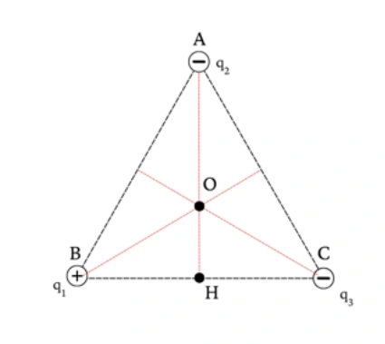
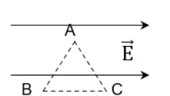
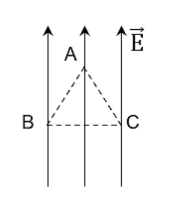

# Bài tập — Bài 5 — Công của lực điện, điện thế và hiệu điện thế

> Hệ bài tập được biên soạn theo các dạng xuất hiện trong bộ tài liệu Vật lí 11 của dự án. Câu hỏi được giữ ngắn, trực tiếp; độ khó tăng dần và không cố tình thêm dữ kiện gây nhiễu.

[← Trở lại bài học](../../05-work-potential-voltage.md)

## Phần A — Trắc nghiệm 4 lựa chọn

### Bài 1 — Mức 1 — Nhận biết

Công của lực điện khi điện tích q di chuyển từ M đến N trong điện trường tĩnh có thể viết

A. $A_{MN}=q(V_M-V_N)$.
B. $A_{MN}=q(V_N-V_M)$.
C. $A_{MN}=V_MV_N/q$.
D. $A_{MN}=q(V_M+V_N)$.

??? success "Đáp án và lời giải"
    Chọn **A** với quy ước $U_{MN}=V_M-V_N$.

### Bài 2 — Mức 1 — Nhận biết

Đơn vị điện thế là

A. N/C.
B. J/C.
C. C/J.
D. N·m²/C².

??? success "Đáp án và lời giải"
    Chọn **B**, tên riêng là vôn (V).

### Bài 3 — Mức 1 — Nhận biết

Điện tích dương chuyển động tự do theo chiều đường sức điện trong điện trường tĩnh. Điện thế của nó thường

A. tăng.
B. giảm.
C. không đổi.
D. luôn bằng 0.

??? success "Đáp án và lời giải"
    Chọn **B**: chiều $\vec E$ là chiều điện thế giảm.

### Bài 4 — Mức 1 — Nhận biết

Trong điện trường đều, nếu hai điểm cách nhau d theo đúng chiều điện trường thì

A. $V_M-V_N=Ed$ khi M ở phía trước theo ngược chiều E và N ở phía sau theo chiều E.
B. hiệu điện thế luôn bằng 0.
C. $U=E/d$.
D. $E=Ud$.

??? success "Đáp án và lời giải"
    Chọn **A** với cách đặt M ở phía điện thế cao hơn và N theo chiều $\vec E$.

## Phần B — Đúng/Sai

### Bài 5 — Mức 2 — Thông hiểu

Xét công của lực điện trong điện trường tĩnh:

a) Chỉ phụ thuộc vị trí đầu và cuối, không phụ thuộc đường đi.
b) Trên đường kín, tổng công bằng 0.
c) Nếu q dương đi từ nơi điện thế cao xuống thấp, lực điện thực hiện công dương.
d) Thế năng điện luôn dương.

??? success "Đáp án và lời giải"
    a) **Đúng**.
    b) **Đúng**.
    c) **Đúng** vì $A=q(V_M-V_N)>0$.
    d) **Sai**: dấu thế năng phụ thuộc mốc và hệ điện tích.

### Bài 6 — Mức 2 — Thông hiểu

Về điện thế và hiệu điện thế:

a) Điện thế là đại lượng vô hướng.
b) Hiệu điện thế $U_{MN}=V_M-V_N$.
c) $1$ V = $1$ J/C.
d) Cường độ điện trường đều có thể tính $E=U/d$ nếu d là khoảng cách theo phương vuông góc đường sức.

??? success "Đáp án và lời giải"
    a) **Đúng**.
    b) **Đúng** theo quy ước đang dùng.
    c) **Đúng**.
    d) **Sai**: $d$ phải là độ dịch chuyển theo phương điện trường giữa hai mặt đẳng thế tương ứng.

## Phần C — Trả lời ngắn

### Bài 7 — Mức 3 — Vận dụng

Điện tích $q=2\,\mu$C đi từ điểm M có điện thế $120$ V đến N có điện thế $20$ V. Tính công của lực điện.

??? success "Đáp án và lời giải"
    $A=q(V_M-V_N)=2\cdot10^{-6}(120-20)=2\cdot10^{-4}$ J.

### Bài 8 — Mức 3 — Vận dụng

Hai bản phẳng tạo điện trường đều $E=2\cdot10^4$ V/m, cách nhau $5$ mm. Tính hiệu điện thế giữa hai bản.

??? success "Đáp án và lời giải"
    $U=Ed=2\cdot10^4\cdot5\cdot10^{-3}=100$ V.

### Bài 9 — Mức 3 — Vận dụng

Một electron đi qua hiệu điện thế tăng thêm về độ lớn $200$ V và được gia tốc từ nghỉ. Tính độ tăng động năng theo eV.

??? success "Đáp án và lời giải"
    Độ tăng động năng của electron qua hiệu điện thế 200 V là $200$ eV. Nếu đổi sang J: $200\cdot1,6\cdot10^{-19}=3,2\cdot10^{-17}$ J.

## Phần D — Vận dụng và vận dụng cao

### Bài 10 — Mức 4 — Vận dụng cao

Trong điện trường đều $E=500$ V/m hướng theo trục Ox dương. Điểm M có tọa độ $x_M=0,20$ m, điểm N có $x_N=0,70$ m. Tính $V_M-V_N$ và công của lực điện khi điện tích $q=-4\,\mu$C đi từ M đến N.

??? success "Đáp án và lời giải"
    N nằm theo chiều điện trường so với M, nên điện thế giảm:

    $V_M-V_N=E(x_N-x_M)=500(0,70-0,20)=250$ V.

    Công lực điện:

    $A_{MN}=q(V_M-V_N)=-4\cdot10^{-6}\cdot250=-1,0\cdot10^{-3}$ J.

    Dấu âm phù hợp: điện tích âm đi theo chiều điện trường thì lực điện hướng ngược chuyển động, nên lực điện thực hiện công âm.

## Ngân hàng bài tập mở rộng

> Các bài dưới đây được đánh số nối tiếp phần bài tập phía trên. Đề bài được trình bày bằng Markdown; chỉ đồ thị, hình vẽ hoặc sơ đồ thực sự cần thiết mới được giữ dưới dạng hình. Đáp án và lời giải được đặt trong nút mở rộng ngay dưới từng bài.

### Nhận biết — Trả lời ngắn

#### Bài 11

<!-- source-id: BT-Chuong-III-p109-q31-265 -->

Tính công của lực điện (theo đơn vị 10−7 J) khi điện tích di chuyển từ M đến N.

??? success "Đáp án và lời giải"
    **Hướng dẫn giải:**

    Dùng $A_{MN}=q(V_M-V_N)=qU_{MN}$; trong điện trường đều, nếu độ dời theo phương điện trường là $d$ thì $A=qEd$.
#### Bài 12

<!-- source-id: BT-Chuong-III-p109-q31-268 -->

𝐴𝑀𝑁= 𝑞. 𝐸. 𝑑𝑀𝑁= 𝑞. 𝐸. 𝑀𝐻
̅̅̅̅̅ = −4. 10−8. 200.0,036 ≈−2,9. 10−7 J.
Với 𝑐𝑜𝑠𝑀=
𝑀𝐻
𝑀𝑁=
𝑀𝑁
𝑀𝑃  𝑀𝐻=
𝑀𝑁2
𝑀𝑃=
𝑀𝑃2−𝑁𝑃2
𝑀𝑃
=
102−82
10
= 3,6 cm = 0,036 m.
M
N
P
H
E⃗
16

??? success "Đáp án và lời giải"
    **Đáp án:** $-2{,}9$
    **Hướng dẫn giải:**

    Dùng $A_{MN}=q(V_M-V_N)=qU_{MN}$; trong điện trường đều, nếu độ dời theo phương điện trường là $d$ thì $A=qEd$.

    Vậy kết quả cần tìm là **$-2{,}9$**.
#### Bài 13

<!-- source-id: BT-Chuong-III-p109-q32-266 -->

Tính công của lực điện (theo đơn vị 10−7 J) khi điện tích di chuyển từ P đến N.

??? success "Đáp án và lời giải"
    **Hướng dẫn giải:**

    Dùng $A_{MN}=q(V_M-V_N)=qU_{MN}$; trong điện trường đều, nếu độ dời theo phương điện trường là $d$ thì $A=qEd$.
#### Bài 14

<!-- source-id: BT-Chuong-III-p109-q33-267 -->

Tính công của lực điện (theo đơn vị 10−7 J) khi điện tích di chuyển theo đường kín MNPM.

??? success "Đáp án và lời giải"
    **Đáp án:** Hướng dẫn giải:

    **Hướng dẫn giải:**

#### Bài 15

<!-- source-id: BT-Chuong-III-p110-q32-269 -->

𝐴𝑃𝑁= 𝑞. 𝐸. 𝑑𝑃𝑁= 𝑞. 𝐸. 𝑃𝐻
̅̅̅̅ = −4. 10−8. 200. (−0,064) = 5,12. 10−7 J.
Với 𝑃𝐻= 𝑀𝑃−𝑀𝐻  𝑃𝐻= 10 −3,6 = 6,4 cm = 0,064 m.

??? success "Đáp án và lời giải"
    **Đáp án:** $5{,}12$
    **Hướng dẫn giải:**

    Dùng $A_{MN}=q(V_M-V_N)=qU_{MN}$; trong điện trường đều, nếu độ dời theo phương điện trường là $d$ thì $A=qEd$.

    Vậy kết quả cần tìm là **$5{,}12$**.
#### Bài 16

<!-- source-id: BT-Chuong-III-p110-q33-270 -->

𝐴𝑀𝑁𝑃𝑀= 𝑞. 𝐸. 𝑑𝑀𝑁𝑃𝑀= 0. Vì 𝑑𝑀𝑁𝑃𝑀= 𝑀𝑀
̅̅̅̅̅ = 0.

??? success "Đáp án và lời giải"
    **Đáp án:** 0
    **Hướng dẫn giải:**

    Dùng $A_{MN}=q(V_M-V_N)=qU_{MN}$; trong điện trường đều, nếu độ dời theo phương điện trường là $d$ thì $A=qEd$.

    Vậy kết quả cần tìm là **0**.
#### Bài 17

<!-- source-id: BT-Chuong-III-p110-q34-271 -->

Một tụ điện phẳng có hai cực làm bằng kim loại, cách nhau 2 cm. Cường độ điện trường giữa hai
bản tụ là E = 105 V/m. Một điện tích q = 2.10-5 C đặt tại điểm M, nằm giữa hai bản tụ và cách bản âm 1,5
cm. Chọn bản âm của tụ làm mốc thế năng điện. Xác định thế năng của điện tích q tại M.

??? success "Đáp án và lời giải"
    **Đáp án:** Hướng dẫn giải:

    **Hướng dẫn giải:**
    Thế năng điện của điện tích q tại M là 𝑊𝑀= 𝑞𝐸𝑑= 2.10−5. 105. 1, 5.10−2 = 0,03 J.
    Đáp án:
    0
    ,
    0
    3

#### Bài 18

<!-- source-id: BT-Chuong-III-p110-q35-272 -->

Một tụ điện phẳng có hai cực làm bằng kim loại, cách nhau 2 cm. Cường độ điện trường giữa hai
bản tụ là E = 105 V/m. Một điện tích q = 2.10−5 C đặt tại điểm A, nằm giữa hai bản tụ và cách bản dương
1,5 cm. Chọn bản âm của tụ làm mốc thế năng điện. Xác định thế năng của điện tích q tại A.

??? success "Đáp án và lời giải"
    **Đáp án:** Hướng dẫn giải:

    **Hướng dẫn giải:**
    Thế năng điện của điện tích q tại A là 𝑊𝐴= 𝑞𝐸𝑑= 2.10−5. 105. (2 −1,5). 10−2 = 0,01 J.
    Đáp án:
    0
    ,
    0
    1

#### Bài 19

<!-- source-id: BT-Chuong-III-p118-q1-297 -->

Một điện trường đều có cường độ 2 500 V/m. Tính công của lực điện trường thực hiện một điện
tích q khi nó di chuyển từ A đến B ngược chiều đường sức (theo đơn vị 10−4 J). Biết AB = 5 cm, q = −10−6
C.

??? success "Đáp án và lời giải"
    **Đáp án:** $1{,}25$
    **Hướng dẫn giải:**

    Dùng $A_{MN}=q(V_M-V_N)=qU_{MN}$; trong điện trường đều, nếu độ dời theo phương điện trường là $d$ thì $A=qEd$.

    Do điện tích di chuyển từ A đến B ngược chiều điện trường (𝐴𝐵
    ⃗⃗⃗⃗⃗ ngược hướng 𝐸⃗ ) nên 𝑑𝐴𝐵< 0.
    Công của lực điện:
    𝐴𝐴𝐵= 𝑞. 𝐸. 𝑑𝐴𝐵= −10−6. 2 500. (−0,05) = 1,25. 10−4 J

    Vậy kết quả cần tìm là **$1{,}25$**.
#### Bài 20

<!-- source-id: BT-Chuong-III-p119-q2-298 -->

Một điện trường đều cường độ 4 000 V/m, có phương song song với cạnh
huyền BC của một tam giác vuông ABC có chiều từ B đến C, biết AB = 6 cm,
AC = 8 cm. Công của lực điện tác dụng lên điện tích q = 10 nC khi di chuyển từ
điểm A đến điểm C bằng bao nhiêu 10−6 J?

??? success "Đáp án và lời giải"
    **Đáp án:** $2{,}56$

    **Hướng dẫn giải:**

    Công của lực điện tác dụng lên điện tích q = 10 nC khi di chuyển từ điểm A đến điểm C bằng:
    𝐴𝐴𝐶= 𝑞. 𝐸. 𝑑𝐴𝐶= 𝑞. 𝐸. 𝐻𝐶
    ̅̅̅̅ = 10. 10−9. 4000.
    0,082
    √0,062+0,082 = 2,56. 10−6 J.
    Với 𝐻𝐶= 𝐴𝐶. 𝑐𝑜𝑠𝐶= 𝐴𝐶.
    𝐴𝐶
    𝐵𝐶=
    𝐴𝐶2
    √𝐴𝐵2+𝐴𝐶2; 𝐻𝐶
    ⃗⃗⃗⃗⃗ cùng hướng với 𝐸⃗ nên 𝐻𝐶&gt; 0.

#### Bài 21

<!-- source-id: BT-Chuong-III-p119-q3-299 -->

Một điện tích điểm q = 4.10−8 C di chuyển dọc theo các cạnh của tam giác ABC, vuông tại A, trong
điện trường đều có cường độ 100 V/m. Cạnh AB = 6 cm, BC
⃗⃗⃗⃗⃗ cùng hướng E⃗ ; AC = 8 cm. Môi trường là
không khí. Tính công của lực điện (theo đơn vị 10−7 J) khi điện tích di chuyển từ A đến C.

??? success "Đáp án và lời giải"
    **Đáp án:** $2{,}56$
    **Hướng dẫn giải:**

    Dùng $A_{MN}=q(V_M-V_N)=qU_{MN}$; trong điện trường đều, nếu độ dời theo phương điện trường là $d$ thì $A=qEd$.

    𝐴𝐴𝐶= 𝑞. 𝐸. 𝑑𝐴𝐶= 𝑞. 𝐸. 𝐻𝐶
    ̅̅̅̅ = 4. 10−8. 100.0,064 = 2,56. 10−7 J.
    √82+62 = 6,4 cm = 0,064 m.

    Vậy kết quả cần tìm là **$2{,}56$**.
#### Bài 22

<!-- source-id: BT-Chuong-III-p119-q4-300 -->

Một tụ điện phẳng có hai cực làm bằng kim loại, cách nhau 2 cm. Cường độ điện trường giữa hai
bản tụ là E = 106 V/m. Một điện tích q = − 2.10−5 C đặt tại điểm M, nằm giữa hai bản tụ và cách bản âm
1,5 cm. Chọn bản âm của tụ làm mốc thế năng điện. Xác định thế năng của điện tích q tại M.

??? success "Đáp án và lời giải"
    **Đáp án:** $-0{,}3$
    **Hướng dẫn giải:**

    Dùng $A_{MN}=q(V_M-V_N)=qU_{MN}$; trong điện trường đều, nếu độ dời theo phương điện trường là $d$ thì $A=qEd$.

    Thế năng điện của điện tích q tại M là 𝑊𝑀= 𝑞𝐸𝑑= − 2.10−5. 106. 1, 5.10−2 = − 0,3 J.

    Vậy kết quả cần tìm là **$-0{,}3$**.
#### Bài 23

<!-- source-id: BT-Chuong-III-p137-q1-339 -->

Công mà lực điện sinh ra khi dịch chuyển điện tích 1,6.10-6 C từ điểm M đến điểm N là bao nhiêu mJ?
Biết hiệu điện thế UMN = 50 V.

??? success "Đáp án và lời giải"
    **Đáp án:** $80$

    **Hướng dẫn giải:**
    Công mà lực điện sinh ra khi dịch chuyển điện tích 1,6.10-6 C từ điểm M đến điểm N:
    𝐴𝑀𝑁= 𝑈𝑀𝑁. 𝑞= 50 × 1,6. 10−6 = 80 𝑚𝐽.

#### Bài 24

<!-- source-id: BT-Chuong-III-p138-q2-340 -->

Ta cần thực hiện một công 1,3.10-4J để dịch chuyển điện tích 2,6.10-6 C từ vô cực đến điểm M. Chọn
gốc điện thế tại vô cực. Điện thế tại M bằng bao nhiêu V ?

??? success "Đáp án và lời giải"
    **Đáp án:** $50$

    **Hướng dẫn giải:**
    Điện thế tại điểm M:
    𝐴= 𝑉𝑀. 𝑞⟹𝑉𝑀= 𝐴
    𝑞= 1,3. 10−4
    2,6. 10−6 = 50 𝑉.

#### Bài 25

<!-- source-id: BT-Chuong-III-p138-q3-341 -->

Hai điểm trên một đường sức trong một điện trường đều cách nhau 60 cm. Độ lớn cường độ điện
trường là 250 V/m. Hiệu điện thế giữa hai điểm đó bằng bao nhiêu V ?

??? success "Đáp án và lời giải"
    **Đáp án:** $150$

    **Hướng dẫn giải:**
    Hiệu điện thế giữa hai bản tụ:
    𝑈= 𝐸. 𝑑= 250 × 0,6 = 150 𝑉.

#### Bài 26

<!-- source-id: BT-Chuong-III-p138-q4-342 -->

Một điện trường đều cường độ 4000 V/m, có phương song song với cạnh huyền BC của một tam giác
vuông ABC có chiều từ B đến C, biết AB = 6 cm; AC = 8 cm. Hiệu điện thế giữa hai điểm B và A bằng bao
nhiêu V ?

??? success "Đáp án và lời giải"
    **Đáp án:** $144$

    **Hướng dẫn giải:**
    Hiệu điện thế giữa hai điểm B và A:

    𝑈𝐵𝐴= 𝐸. 𝐵𝐴
    ̅̅̅̅ = 𝐸. 𝐵𝐻= 𝐸. 𝐴𝐵2
    𝐵𝐶= 4000 ×
    0,062
    √0,062 + 0,082 = 144 𝑉.

#### Bài 27

<!-- source-id: BT-Chuong-III-p139-q6-344 -->

Giả thiết rằng trong một tia sét có một điện tích q = 25 C được phóng ra từ đám mây và mặt đất có
U = 1,4. 108 V . Cho biết nhiệt hóa hơi của nước bằng 3. 106 J/kg , năng lượng của tia sét này có thể làm bao
nhiêu kg nước ở 100°C bốc thành hơi ở 100°C?

??? success "Đáp án và lời giải"
    **Đáp án:** $1167$

    **Hướng dẫn giải:**
    Công để dịch chuyển điện tích từ đám mây về mặt đất:
    𝐴= 𝑈𝑞= 1,4.108 × 25 = 3,5.109𝐽;
    Khối lượng nước có thể bốc hơi trong trường hợp này:
    𝐿= 𝑊
    𝑚⟹𝑚= 𝑊
    𝐿= 𝐴
    𝐿= 3,5.109
    3. 106 = 1167 𝑘𝑔.

#### Bài 28

<!-- source-id: BT-Chuong-III-p146-q1-367 -->

Hiệu điện thế giữa hai điểm M, N là UMN = 4V. Một điện tích q = -2C di chuyển từ M đến N thì công
của lực điện trường là bao nhiêu ?

??? success "Đáp án và lời giải"
    **Đáp án:** $-8$

    **Hướng dẫn giải:**
    Công của lực điện trường: 𝐴= 𝑞𝑈𝑀𝑁= −2 × 4 = −8 𝑉.

#### Bài 29

<!-- source-id: BT-Chuong-III-p146-q2-368 -->

Ta cần thực hiện một công 8.10-2J để dịch chuyển điện tích 0,16 C từ vô cực đến điểm

B. Chọn gốc
điện thế tại vô cực. Điện thế tại B là bao nhiêu ?

??? success "Đáp án và lời giải"
    **Đáp án:** $0{,}5$

    **Hướng dẫn giải:**
    Điện thế tại điểm B:
    𝐴∞𝐵= 𝑞𝑉𝐵⟹𝑉𝐵= 𝐴∞𝐵
    𝑞
    = 8.10−2
    0,16 = 0,5 𝑉.

#### Bài 30

<!-- source-id: BT-Chuong-III-p146-q3-369 -->

Hai điểm trên một đường sức trong một điện trường đều cách nhau 0,5 m. Độ lớn cường độ điện
trường là 1000 V/m. Hiệu điện thế giữa hai điểm đó là

??? success "Đáp án và lời giải"
    **Đáp án:** $500$

    **Hướng dẫn giải:**
    Hiệu điện thế giữa hai điểm đó:
    𝑈= 𝐸. 𝑑= 1000 × 0,5 = 500 𝑉.

### Nhận biết — Trắc nghiệm 4 lựa chọn

#### Bài 31

<!-- source-id: BT-Chuong-III-p101-q1-235 -->

Công của lực điện có đơn vị là

A. vôn (V).

B. jun (J).

C. vôn trên mét (V/m).

D. oát (W).

??? success "Đáp án và lời giải"
    **Đáp án:** B
    **Hướng dẫn giải:**

    Dùng $A_{MN}=q(V_M-V_N)=qU_{MN}$; trong điện trường đều, nếu độ dời theo phương điện trường là $d$ thì $A=qEd$.

    Đối chiếu kết quả với các lựa chọn, phương án phù hợp là **B. jun (J).**
#### Bài 32

<!-- source-id: BT-Chuong-III-p101-q4-238 -->

Công thức tính công của lực điện tác dụng lên một điện tích q di chuyển trong điện trường đều là
A = qEd. Chỉ ra khẳng định không đúng khi nói về độ lớn của d.

A. d là chiều dài hình chiếu của đường đi trên một đường sức.

B. d là khoảng cách giữa hình chiếu của điểm đầu và điểm cuối của đường đi trên một đường sức.

C. d là chiều dài đường đi nếu điện tích dịch chuyển dọc theo một đường sức.

D. d là chiều dài của đường đi.
??? success "Đáp án và lời giải"
    **Đáp án:** D
    **Hướng dẫn giải:**

    Dùng $A_{MN}=q(V_M-V_N)=qU_{MN}$; trong điện trường đều, nếu độ dời theo phương điện trường là $d$ thì $A=qEd$.

    Đối chiếu kết quả với các lựa chọn, phương án phù hợp là **D. d là chiều dài của đường đi.**
#### Bài 33

<!-- source-id: BT-Chuong-III-p101-q5-239 -->

Nếu chiều dài đường đi của điện tích trong điện trường tăng 2 lần thì công của lực điện trường

A. chưa đủ dữ kiện để xác định.

B. tăng 2 lần.

C. giảm 2 lần.

D. không thay đổi.

??? success "Đáp án và lời giải"
    **Đáp án:** A
    **Hướng dẫn giải:**
    Ta có: 𝐴𝑀𝑁= 𝑞. 𝐸. 𝑑 với d là hình chiếu của đường đi lên đường sức. Cần biết hướng của độ dời và khoảng
    cách giữa điểm đầu và điểm cuối mới đủ dữ kiện xác định giá trị của d để tính công của lực điện trường.

#### Bài 34

<!-- source-id: BT-Chuong-III-p101-q6-240 -->

Một điện tích điểm di chuyển dọc theo đường sức của một điện trường đều có cường độ điện
trường E = 1 000 V/m, đi được một khoảng d = 5 cm. Lực điện trường thực hiện được công A = − 15.10−5 J.
Độ lớn của điện tích đó là

A. 5.10−6

C. B. 15.10−6

C. C. 3.10−6

C. D. 3.10−5 C.

??? success "Đáp án và lời giải"
    **Đáp án:** C
    **Hướng dẫn giải:**
    |𝐴|
    |𝐸.𝑑| =
    |−15.10−5|
    |1 000.0,05| = 3. 10−6 C.

#### Bài 35

<!-- source-id: BT-Chuong-III-p102-q9-243 -->

Phát biểu đúng về mối quan hệ giữa công của lực điện và thế năng tĩnh điện là

A. công của lực điện cũng là thế năng tĩnh điện.

B. công của lực điện là số đo độ biến thiên thế năng tĩnh điện.

C. lực điện thực hiện công dương thì thế năng tĩnh điện tăng.

D. lực điện thực hiện công âm thì thế năng tĩnh điện giảm.

??? success "Đáp án và lời giải"
    **Đáp án:** B
    **Hướng dẫn giải:**

    Dùng $A_{MN}=q(V_M-V_N)=qU_{MN}$; trong điện trường đều, nếu độ dời theo phương điện trường là $d$ thì $A=qEd$.

    Đối chiếu kết quả với các lựa chọn, phương án phù hợp là **B. công của lực điện là số đo độ biến thiên thế năng tĩnh điện.**
#### Bài 36

<!-- source-id: BT-Chuong-III-p102-q10-244 -->

Công của lực điện làm dịch chuyển một điện tích 10 mC theo phương song song với các đường
sức trong một điện trường đều với quãng đường 1 cm là 1 J. Độ lớn cường độ điện trường đó bằng

A. 10000 V/m.

B. 1 V/m.

C. 100 V/m.

D. 1000 V/m.

??? success "Đáp án và lời giải"
    **Đáp án:** D
    **Hướng dẫn giải:**

    Dùng $A_{MN}=q(V_M-V_N)=qU_{MN}$; trong điện trường đều, nếu độ dời theo phương điện trường là $d$ thì $A=qEd$.

    10.10−3.0,01 = 10000 V/m.

    Đối chiếu kết quả với các lựa chọn, phương án phù hợp là **D. 1000 V/m.**
#### Bài 37

<!-- source-id: BT-Chuong-III-p103-q12-246 -->

Công thức xác định công của lực điện trường làm dịch chuyển điện tích q trong điện trường đều
là A = qEd, trong đó d là

A. khoảng cách giữa điểm đầu và điểm cuối.

B. khoảng cách giữa hình chiếu điểm đầu và hình chiếu điểm cuối lên một đường sức.

C. độ dài đại số của đoạn từ hình chiếu điểm đầu đến hình chiếu điểm cuối lên một đường sức, tính theo
chiều đường sức điện.

D. độ dài đại số của đoạn từ hình chiếu điểm đầu đến hình chiếu điểm cuối lên một đường sức.
??? success "Đáp án và lời giải"
    **Đáp án:** C
    **Hướng dẫn giải:**

    Dùng $A_{MN}=q(V_M-V_N)=qU_{MN}$; trong điện trường đều, nếu độ dời theo phương điện trường là $d$ thì $A=qEd$.

    Đối chiếu kết quả với các lựa chọn, phương án phù hợp là **C. độ dài đại số của đoạn từ hình chiếu điểm đầu đến hình chiếu điểm cuối lên một đường sức, tính theo chiều đường sức điện.**
#### Bài 38

<!-- source-id: BT-Chuong-III-p103-q13-247 -->

Phát biểu nào sau đây là sai?

A. Thế năng của điện tích q đặt tại điểm M trong điện trường đặc trưng cho khả năng sinh công của điện
trường tại điểm đó.

B. Thế năng của điện tích q đặt tại điểm M trong điện trường được xác định bằng biểu thức WM = q. E. d.

C. Công của lực điện bằng độ giảm thế năng của điện tích trong điện trường.

D. Thế năng của điện tích q đặt tại điểm M trong điện trường không phụ thuộc điện tích q.

??? success "Đáp án và lời giải"
    **Đáp án:** D
    **Hướng dẫn giải:**

    Dùng $A_{MN}=q(V_M-V_N)=qU_{MN}$; trong điện trường đều, nếu độ dời theo phương điện trường là $d$ thì $A=qEd$.

    Đối chiếu kết quả với các lựa chọn, phương án phù hợp là **D. Thế năng của điện tích q đặt tại điểm M trong điện trường không phụ thuộc điện tích q.**
#### Bài 39

<!-- source-id: BT-Chuong-III-p103-q15-249 -->

Một điện tích q di chuyển trong điện trường từ A đến B thì lực điện sinh công A = 2,5 J. Biết thế
năng của q tại B là 3,75 J. Thế năng của nó tại A bằng

A. 6,25 J.

B. 1,25 J.

C. – 6,25 J.

D. – 1,25 J.

??? success "Đáp án và lời giải"
    **Đáp án:** A
    **Hướng dẫn giải:**
    Thế năng điện của điện tích q tại A:
    𝐴𝐴𝐵= 𝑊𝐴−𝑊𝐵  𝑊𝐴= 𝐴𝐴𝐵+ 𝑊𝐵= 2,5 + 3,75 = 6,25 J.

#### Bài 40

<!-- source-id: BT-Chuong-III-p103-q16-250 -->

Cho điện tích dịch chuyển giữa hai điểm cố định trong một điện trường đều với cường độ 150
V/m thì công của lực điện trường là 90 mJ. Nếu cường độ điện trường là 200 V/m thì công của lực điện
trường dịch chuyển điện tích giữa hai điểm đó là

A. 120 J.

B. 40 J.

C. 40 mJ.

D. 120 mJ.

??? success "Đáp án và lời giải"
    **Đáp án:** D
    **Hướng dẫn giải:**
    Ta có: 𝐴1 = 𝑞. 𝐸1. 𝑑 và 𝐴2 = 𝑞. 𝐸2. 𝑑
    Suy ra:
    𝐴1
    𝐴2 =
    𝐸1
    𝐸2  𝐴2 =
    𝐴1.𝐸2
    𝐸1
    =
    90.200
    150 = 120 mJ.
    10

#### Bài 41

<!-- source-id: BT-Chuong-III-p104-q17-251 -->

Cho điện tích 10−8 C dịch chuyển giữa hai điểm cố định trong một điện trường đều thì công của
lực điện trường là 80 mJ. Nếu một điện tích 4.10−9 C dịch chuyển giữa hai điểm đó thì công của lực điện
trường khi đó là

A. 32 mJ.

B. 20 mJ.

C. 240 mJ.

D. 320 mJ.

??? success "Đáp án và lời giải"
    **Đáp án:** A
    **Hướng dẫn giải:**
    Ta có: 𝐴1 = 𝑞1. 𝐸. 𝑑 và 𝐴2 = 𝑞2. 𝐸. 𝑑
    Suy ra:
    𝐴1
    𝐴2 =
    𝑞1
    𝑞2  𝐴2 =
    𝐴1.𝑞2
    𝑞1 =
    80.4.10−9
    10−8
    = 32 mJ.

#### Bài 42

<!-- source-id: BT-Chuong-III-p106-q23-257 -->

Một điện tích q = 4.10−8 C di chuyển trong một điện trường đều có cường độ E = 100 V/m, theo
đường gấp khúc ABC. Đoạn AB = 20 cm, AB
⃗⃗⃗⃗⃗ hợp với E⃗ một góc 600; đoạn BC = 40 cm, BC
⃗⃗⃗⃗⃗ hợp với E⃗ một
góc 1200. Công của lực điện bằng

A. 4.10−7 J.

B. − 8.10−7 J.

C. − 4.10−7 J.

D. 12.10−7 J.

??? success "Đáp án và lời giải"
    **Đáp án:** C
    **Hướng dẫn giải:**
    AAB = q.E.dAB = 𝑞. 𝐸. 𝐴𝐵. 𝑐𝑜𝑠60° = 4.10−8. 100.0,2.cos(60𝑜) = 4. 10−7 J.
    ABC = q.E.dBC = 𝑞. 𝐸. 𝐵𝐶. 𝑐𝑜𝑠(𝐵𝐶
    ⃗⃗⃗⃗⃗ ; 𝐸⃗ ) = 4.10−8. 100.0,4.cos(120𝑜) = −8. 10−7 J.
    𝐴𝐴𝐵𝐶= 𝐴𝐴𝐵+ 𝐴𝐵𝐶= 4. 10−7 + (−8. 10−7) = −4. 10−7 J.

#### Bài 43

<!-- source-id: BT-Chuong-III-p106-q24-258 -->

Một proton bay theo phương của một đường sức điện trường. Lúc ở điểm A nó có tốc độ 2,5.104
m/s, khi đến điểm B tốc độ của nó bằng không. Biết proton có khối lượng 1,67.10-27 kg. Thế năng điện tại
A bằng 8.10−17 J. Thế năng điện tại B bằng

A. − 8,5.10−17 J.

B. − 8.10−17 J.

C. 8,1.10−17 J.

D. 8,5.10−17 J.

??? success "Đáp án và lời giải"
    **Đáp án:** C
    **Hướng dẫn giải:**
    Áp dụng định lí động năng, ta có:
    𝐴𝐴𝐵= 𝑊đ𝐵−𝑊đ𝐴  𝑊𝐴−𝑊𝐵= 𝑊đ𝐵−𝑊đ𝐴

     𝑊𝐴−𝑊𝐵=
    1
    2 𝑚𝑝. 𝑣𝐵
    2 −
    1
    2 𝑚𝑝. 𝑣𝐴
    2

     𝑊𝐵= 𝑊𝐴−
    1
    2 𝑚𝑝. 𝑣𝐵
    2 +
    1
    2 𝑚𝑝. 𝑣𝐴
    2

     𝑊𝐵= 8. 10−17 −
    1
    1
    2 . 1,67. 10−27. (2,5. 104)2

     𝑊𝐵≈8,1. 10−17 J.

#### Bài 44

<!-- source-id: BT-Chuong-III-p112-q1-275 -->

Công của lực điện tác dụng lên một điện tích điểm q khi di chuyển từ điểm M đến điểm N trong
một điện trường, thì không phụ thuộc vào

A. vị trí của các điểm M, N.

B. hình dạng của đường đi MN.

C. độ lớn của điện tích q.

D. độ lớn của cường độ điện trường tại các điểm trên đường đi.
??? success "Đáp án và lời giải"
    **Đáp án:** B
    **Hướng dẫn giải:**

    Dùng $A_{MN}=q(V_M-V_N)=qU_{MN}$; trong điện trường đều, nếu độ dời theo phương điện trường là $d$ thì $A=qEd$.

    Đối chiếu kết quả với các lựa chọn, phương án phù hợp là **B. hình dạng của đường đi MN.**
#### Bài 45

<!-- source-id: BT-Chuong-III-p112-q3-277 -->

Thế năng của điện tích trong điện trường đặc trưng cho

A. tốc độ sinh công của điện trường để dịch chuyển điện tích q từ điểm đó ra xa vô cùng.

B. phương, chiều của cường độ điện trường.

C. khả năng sinh công của điện trường để dịch chuyển điện tích q từ điểm đó ra xa vô cùng.

D. độ lớn nhỏ của vùng không gian có điện trường.

??? success "Đáp án và lời giải"
    **Đáp án:** C
    **Hướng dẫn giải:**

    Dùng $A_{MN}=q(V_M-V_N)=qU_{MN}$; trong điện trường đều, nếu độ dời theo phương điện trường là $d$ thì $A=qEd$.

    Đối chiếu kết quả với các lựa chọn, phương án phù hợp là **C. khả năng sinh công của điện trường để dịch chuyển điện tích q từ điểm đó ra xa vô cùng.**
#### Bài 46

<!-- source-id: BT-Chuong-III-p112-q4-278 -->

Nếu điện tích dịch chuyển trong điện trường đều sao cho thế năng của nó tăng thì công của của lực
điện trường

A. âm.

B. dương.

C. bằng không.

D. chưa đủ dữ kiện để xác định.

??? success "Đáp án và lời giải"
    **Đáp án:** A
    **Hướng dẫn giải:**
    Ta có: 𝐴𝑀𝑁= 𝑊𝑀−𝑊𝑁; thế năng tăng nên 𝑊𝑀&lt; 𝑊𝑁.
    Suy ra: 𝐴𝑀𝑁&lt; 0.
    19

#### Bài 47

<!-- source-id: BT-Chuong-III-p113-q5-279 -->

Cho điện tích dịch chuyển giữa hai điểm cố định trong một điện trường đều với cường độ 150 V/m
thì công của lực điện trường là 90 mJ. Nếu cường độ điện trường là 100 V/m thì công của lực điện trường
dịch chuyển điện tích giữa hai điểm đó là

A. 120 J.

B. 60 J.

C. 60 mJ.

D. 120 mJ.

??? success "Đáp án và lời giải"
    **Đáp án:** C
    **Hướng dẫn giải:**
    Ta có: 𝐴1 = 𝑞. 𝐸1. 𝑑 và 𝐴2 = 𝑞. 𝐸2. 𝑑
    Suy ra:
    𝐴1
    𝐴2 =
    𝐸1
    𝐸2  𝐴2 =
    𝐴1.𝐸2
    𝐸1
    =
    90.100
    150 = 60 mJ.

#### Bài 48

<!-- source-id: BT-Chuong-III-p113-q6-280 -->

Q là một điện tích điểm âm đặt tại điểm O. M và N là hai điểm nằm trong điện trường của Q với
OM = 20 cm và ON = 10 cm. Đặt tại M, N một điện tích q thử (q &gt; 0). Chỉ ra bất đẳng thức đúng? Chọn
mốc thế năng tại điện tích Q.

A. WM &lt; WN &lt; 0.

B. WN &lt; WM &lt; 0.

C. WM &gt; WN &gt; 0.

D. WN &gt; WM &gt; 0.

??? success "Đáp án và lời giải"
    **Đáp án:** B
    **Hướng dẫn giải:**
    𝑘.𝑞.𝑄
    𝑟𝑀; 𝑊𝑁=
    𝑘.𝑞.𝑄
    𝑟𝑁.
    Mà Q &lt; 0 và 𝑟𝑀&gt; 𝑟𝑁 nên 𝑊𝑁&lt; 𝑊𝑀&lt; 0.

#### Bài 49

<!-- source-id: BT-Chuong-III-p113-q7-281 -->

Ba điểm M, N, P cùng nằm trong một điện trường tĩnh và không thẳng hàng với nhau. Cho biết WM
= 25 J; WN = 10 J; WP = 5 J. Công của lực điện để di chuyển một điện tích dương 10 C từ điểm M qua điểm
P rồi tới điểm N là bao nhiêu?

A. 10 J.

B. 5 J.

C. 20 J.

D. 15 J.

??? success "Đáp án và lời giải"
    **Đáp án:** D
    **Hướng dẫn giải:**
    Công của lực điện để di chuyển một điện tích dương 10 C từ điểm M qua điểm P rồi tới điểm N:
    𝐴𝑀𝑃𝑁= 𝐴𝑀𝑃+ 𝐴𝑃𝑁= 𝐴𝑀𝑁= 𝑊𝑀−𝑊𝑁= 25 −10 = 15 J.

#### Bài 50

<!-- source-id: BT-Chuong-III-p114-q11-285 -->

Một điện tích q = − 4.10−8 C di chuyển trong một điện trường đều có cường độ E = 100 V/m, theo
đường gấp khúc ABC. Đoạn AB = 20 cm, AB
⃗⃗⃗⃗⃗ hợp với E⃗ một góc 600; đoạn BC = 40 cm, BC
⃗⃗⃗⃗⃗ hợp với E⃗ một
góc 1200. Công của lực điện bằng

A. 4.10−7 J.

B. − 8.10−7 J.

C. − 4.10−7 J.

D. 12.10−7 J.

??? success "Đáp án và lời giải"
    **Đáp án:** A
    **Hướng dẫn giải:**
    AAB = q.E.dAB = 𝑞. 𝐸. 𝐴𝐵. 𝑐𝑜𝑠60° = −4.10−8. 100.0,2.cos(60𝑜) = −4. 10−7 J.
    ABC = q.E.dBC = 𝑞. 𝐸. 𝐵𝐶. 𝑐𝑜𝑠(𝐵𝐶
    ⃗⃗⃗⃗⃗ ; 𝐸⃗ ) = −4.10−8. 100.0,4.cos(120𝑜) = 8. 10−7 J.
    𝐴𝐴𝐵𝐶= 𝐴𝐴𝐵+ 𝐴𝐵𝐶= −4. 10−7 + 8. 10−7 = 4. 10−7 J.

#### Bài 51

<!-- source-id: BT-Chuong-III-p114-q13-287 -->

Công của lực điện trường làm dịch chuyển điện tích q &gt; 0 trong điện trường đều E là A = q. E. d.
Gọi α là góc giữa hướng của đường sức điện và hướng của độ dịch chuyển d. Phát biểu nào sau đây là sai khi
nói về mối quan hệ giữa góc α và công của lực điện?

A. α &lt; 900 thì A &gt; 0.

B. α &gt; 900 thì A &lt; 0.

C. Điện tích dịch chuyển ngược chiều một đường sức thì công A có độ lớn nhỏ nhất.
21

D. Điện tích dịch chuyển dọc theo chiều một đường sức thì công A nhận giá trị lớn nhất.

??? success "Đáp án và lời giải"
    **Đáp án:** C
    **Hướng dẫn giải:**
    Điện tích dịch chuyển ngược chiều một đường sức thì công A có giá trị nhỏ nhất.

#### Bài 52

<!-- source-id: BT-Chuong-III-p115-q15-289 -->

Tính công của lực điện khi một điện tích q = 4.10−8 C di chuyển trong một điện trường đều có
cường độ điện trường E = 100 V/m theo một đường gấp khúc ABC. Đoạn AB dài 20 cm và vectơ AB
⃗⃗⃗⃗⃗ hợp
với các đường sức điện một góc 300. Đoạn BC dài 40 cm và vectơ BC
⃗⃗⃗⃗⃗ hợp với các đường sức điện một góc
1200.

A. 0,107.10−6 J.

B. − 0,107.10−6 J.

C. 1,492.10−6 J.

D. − 1,492.10−6 J.

??? success "Đáp án và lời giải"
    **Đáp án:** B
    **Hướng dẫn giải:**

    Dùng $A_{MN}=q(V_M-V_N)=qU_{MN}$; trong điện trường đều, nếu độ dời theo phương điện trường là $d$ thì $A=qEd$.

    𝐴𝐴𝐵𝐶= 𝐴𝐴𝐵+ 𝐴𝐵𝐶= 𝑞. 𝐸. 𝑑𝐴𝐵+ 𝑞. 𝐸. 𝑑𝐵𝐶= 𝑞. 𝐸. 𝐴𝐵. 𝑐𝑜𝑠(𝐴𝐵
    𝐴𝐴𝐵𝐶= 4. 10−8. 100.0,2. 𝑐𝑜𝑠30° + 4. 10−8. 100.0,4. 𝑐𝑜𝑠120° ≈−0,107. 10−6 J.

    Đối chiếu kết quả với các lựa chọn, phương án phù hợp là **B. − 0,107.10−6 J.**
#### Bài 53

<!-- source-id: BT-Chuong-III-p115-q17-291 -->

Công của lực điện trường dịch chuyển một điện tích q = − 5 μC từ A đến B là A = − 5 mJ. Khi
điện tích q dịch chuyển từ A đến B thì

A. thế năng điện giảm còn − 5 mJ.

B. thế năng điện tăng đến − 5 mJ.

C. thế năng điện giảm một lượng 5 mJ.

D. thế năng điện tăng một lượng 5 mJ.

??? success "Đáp án và lời giải"
    **Đáp án:** D
    **Hướng dẫn giải:**
    𝐴𝐴𝐵= 𝑊𝐴−𝑊𝐵= −5 mJ  𝑊𝐴&lt; 𝑊𝐵
    22

#### Bài 54

<!-- source-id: BT-Chuong-III-p127-q1-303 -->

Điện thế là đại lượng đặc trưng cho riêng điện trường về

A. phương diện tạo ra thế năng khi đặt tại đó một điện tích q.

B. khả năng sinh công của vùng không gian có điện trường.

C. khả năng sinh công tại một điểm.

D. khả năng tác dụng lực tại tất cả các điểm trong không gian có điện trường.

??? success "Đáp án và lời giải"
    **Đáp án:** C
    **Hướng dẫn giải:**

    Dùng $A_{MN}=q(V_M-V_N)=qU_{MN}$; trong điện trường đều, nếu độ dời theo phương điện trường là $d$ thì $A=qEd$.

    Đối chiếu kết quả với các lựa chọn, phương án phù hợp là **C. khả năng sinh công tại một điểm.**
#### Bài 55

<!-- source-id: BT-Chuong-III-p127-q2-304 -->

Đơn vị của điện thế là

A. V .

B. J.

C. V/m.

D. W.

??? success "Đáp án và lời giải"
    **Đáp án:** A
    **Hướng dẫn giải:**

    Dùng $A_{MN}=q(V_M-V_N)=qU_{MN}$; trong điện trường đều, nếu độ dời theo phương điện trường là $d$ thì $A=qEd$.

    Đối chiếu kết quả với các lựa chọn, phương án phù hợp là **A. V .**
#### Bài 56

<!-- source-id: BT-Chuong-III-p127-q3-305 -->

Điện thế là đại lượng

A. đại số.

B. luôn luôn dương.

C. luôn luôn âm.

D. Vector.

??? success "Đáp án và lời giải"
    **Đáp án:** A
    **Hướng dẫn giải:**

    Dùng $A_{MN}=q(V_M-V_N)=qU_{MN}$; trong điện trường đều, nếu độ dời theo phương điện trường là $d$ thì $A=qEd$.

    Đối chiếu kết quả với các lựa chọn, phương án phù hợp là **A. đại số.**
#### Bài 57

<!-- source-id: BT-Chuong-III-p127-q4-306 -->

Điện thế tại một điểm M trong điện trường được xác định bởi biểu thức

A. VM = AM∞× q.

B. VM = AM∞/q.

C. VM = AM∞.

D. VM = q/AM∞.

??? success "Đáp án và lời giải"
    **Đáp án:** B
    **Hướng dẫn giải:**

    Dùng $A_{MN}=q(V_M-V_N)=qU_{MN}$; trong điện trường đều, nếu độ dời theo phương điện trường là $d$ thì $A=qEd$.

    Đối chiếu kết quả với các lựa chọn, phương án phù hợp là **B. VM = AM∞/q.**
#### Bài 58

<!-- source-id: BT-Chuong-III-p127-q5-307 -->

Hiệu điện thế giữa hai điểm đặc trưng cho khả năng

A. sinh công của điện trường của điện tích q đứng yên.

B. tác tác dụng lực của điện trường của điện tích q đứng yên.

C. tạo lực của điện trường để dịch chuyển của điện tích q giữa hai điểm.

D. sinh công của điện trường để dịch chuyển của điện tích q giữa hai điểm.

??? success "Đáp án và lời giải"
    **Đáp án:** D
    **Hướng dẫn giải:**

    Dùng $A_{MN}=q(V_M-V_N)=qU_{MN}$; trong điện trường đều, nếu độ dời theo phương điện trường là $d$ thì $A=qEd$.

    Đối chiếu kết quả với các lựa chọn, phương án phù hợp là **D. sinh công của điện trường để dịch chuyển của điện tích q giữa hai điểm.**
#### Bài 59

<!-- source-id: BT-Chuong-III-p127-q6-308 -->

Đại lượng đặc trưng cho khả năng thực hiện công của điện trường khi có một điện tích di chuyển giữa 2
điểm đó được gọi là

A. cường độ điện trường.

B. điện thế.

C. hiệu điện thế.

D. lực điện.

??? success "Đáp án và lời giải"
    **Đáp án:** C
    **Hướng dẫn giải:**

    Dùng $A_{MN}=q(V_M-V_N)=qU_{MN}$; trong điện trường đều, nếu độ dời theo phương điện trường là $d$ thì $A=qEd$.

    Đối chiếu kết quả với các lựa chọn, phương án phù hợp là **C. hiệu điện thế.**
#### Bài 60

<!-- source-id: BT-Chuong-III-p127-q7-309 -->

Đơn vị của điện thế là V bằng

A. J.C.

B. J/C.

C. N.C.

D. N/C.

??? success "Đáp án và lời giải"
    **Đáp án:** B
    **Hướng dẫn giải:**

    Dùng $A_{MN}=q(V_M-V_N)=qU_{MN}$; trong điện trường đều, nếu độ dời theo phương điện trường là $d$ thì $A=qEd$.

    Đối chiếu kết quả với các lựa chọn, phương án phù hợp là **B. J/C.**
#### Bài 61

<!-- source-id: BT-Chuong-III-p127-q8-310 -->

Hệ thức liên hệ giữa hiệu điện thế và cường độ điện trường là

A. U = qd.

B. U = q.E.d.

C. U = E.q.

D. U = E.d.

??? success "Đáp án và lời giải"
    **Đáp án:** D
    **Hướng dẫn giải:**

    Dùng $A_{MN}=q(V_M-V_N)=qU_{MN}$; trong điện trường đều, nếu độ dời theo phương điện trường là $d$ thì $A=qEd$.

    Đối chiếu kết quả với các lựa chọn, phương án phù hợp là **D. U = E.d.**
#### Bài 62

<!-- source-id: BT-Chuong-III-p127-q9-311 -->

Đơn vị của hiệu điện thế là

A. V/m.

B. J.

C. V.

D. C.

??? success "Đáp án và lời giải"
    **Đáp án:** C
    **Hướng dẫn giải:**

    Dùng $A_{MN}=q(V_M-V_N)=qU_{MN}$; trong điện trường đều, nếu độ dời theo phương điện trường là $d$ thì $A=qEd$.

    Đối chiếu kết quả với các lựa chọn, phương án phù hợp là **C. V.**
#### Bài 63

<!-- source-id: BT-Chuong-III-p128-q10-312 -->

Khi UAB &gt; 0 thì

A. điện thế tại A thấp hơn điện thế tại

B. B. điện thế tại A bằng điện thế tại

B. C. dòng điện chạy trong mạch AB theo chiều từ B đến

A. D. điện thế tại A cao hơn điện thế tại B .

??? success "Đáp án và lời giải"
    **Đáp án:** D
    **Hướng dẫn giải:**

    Dùng $A_{MN}=q(V_M-V_N)=qU_{MN}$; trong điện trường đều, nếu độ dời theo phương điện trường là $d$ thì $A=qEd$.

    Vậy kết quả cần tìm là **D**.
#### Bài 64

<!-- source-id: BT-Chuong-III-p128-q17-319 -->

Biết hiệu điện thế UMN = 10 V. Đẳng thức nào dưới đây đúng?

A. VM = 10 V.

B. VN = 10 V.

C. VM – VN = 10 V.

D. VN – VM = 10 V.

??? success "Đáp án và lời giải"
    **Đáp án:** C
    **Hướng dẫn giải:**

    Dùng $A_{MN}=q(V_M-V_N)=qU_{MN}$; trong điện trường đều, nếu độ dời theo phương điện trường là $d$ thì $A=qEd$.

    Đối chiếu kết quả với các lựa chọn, phương án phù hợp là **C. VM – VN = 10 V.**
#### Bài 65

<!-- source-id: BT-Chuong-III-p129-q18-320 -->

Cho một điện tích di chuyển trong điện trường dọc theo một đường cong kín, xuất phát từ điểm M qua
điểm N rồi trở lại điểm M. Công của lực điện

A. trong cả quá trình bằng 0.

B. trong quá trình M đến N là dương,

C. trong quá trình N đến M là dương.

D. trong cả quá trình là dương.

??? success "Đáp án và lời giải"
    **Đáp án:** A
    **Hướng dẫn giải:**

    Dùng $A_{MN}=q(V_M-V_N)=qU_{MN}$; trong điện trường đều, nếu độ dời theo phương điện trường là $d$ thì $A=qEd$.

    Đối chiếu kết quả với các lựa chọn, phương án phù hợp là **A. trong cả quá trình bằng 0.**
#### Bài 66

<!-- source-id: BT-Chuong-III-p129-q19-321 -->

Điện thế tại một điểm M trong điện trường bất kì có cường độ điện trường E⃗ không phụ thuộc vào

A. vị trí điểm M.

B. cường độ điện trường E⃗ .

C. điện tích q đặt tại điểm M.

D. vị trí được chọn làm mốc của điện thế.

??? success "Đáp án và lời giải"
    **Đáp án:** C
    **Hướng dẫn giải:**

    Dùng $A_{MN}=q(V_M-V_N)=qU_{MN}$; trong điện trường đều, nếu độ dời theo phương điện trường là $d$ thì $A=qEd$.

    Đối chiếu kết quả với các lựa chọn, phương án phù hợp là **C. điện tích q đặt tại điểm M.**
#### Bài 67

<!-- source-id: BT-Chuong-III-p129-q20-322 -->

Theo quy định của mạng lưới truyền tải điện ở Việt Nam, các lưới điện có điện áp từ 1kV đến 66 kV
được gọi là

A. Hạ thế.

B. Trung thế.

C. Cao thể.

D. Đẳng thế.

??? success "Đáp án và lời giải"
    **Đáp án:** B
    **Hướng dẫn giải:**

    Dùng $A_{MN}=q(V_M-V_N)=qU_{MN}$; trong điện trường đều, nếu độ dời theo phương điện trường là $d$ thì $A=qEd$.

    Đối chiếu kết quả với các lựa chọn, phương án phù hợp là **B. Trung thế.**
#### Bài 68

<!-- source-id: BT-Chuong-III-p129-q21-323 -->

Một điện tích q = 2.10−6C di chuyển từ điểm A đến điểm B trong một điện trường đều thì cần tốn một
công là 3.10−4 J. Hiệu điện thế giữa hai điểm A và B là

A. 0,15 V.

B. 1,5 V.

C. 15 V.

D. 150 V.

??? success "Đáp án và lời giải"
    **Đáp án:** D
    **Hướng dẫn giải:**
    Hiệu điện thế giữa hai điểm A và B:
    𝐴𝐴𝐵= 𝑞𝑈𝐴𝐵⟹𝑈𝐴𝐵= 𝐴𝐴𝐵
    𝑞
    = 3.10−4
    2.10−6 = 150 𝑉.

#### Bài 69

<!-- source-id: BT-Chuong-III-p129-q22-324 -->

Ta cần thực hiện một công 5.10−6J để dịch chuyển điện tích 2,5.10−5 C từ vô cực đến điểm

A. Chọn
gốc điện thế tại vô cực. Điện thế tại A là

A. 2 V.

B. −2 V.

C. 0,2 V.

D. −0,2 V.

??? success "Đáp án và lời giải"
    **Đáp án:** C
    **Hướng dẫn giải:**
    Điện thế tại điểm A:
    𝐴∞𝐴= 𝑞𝑉𝐴⟹𝑉𝐴= 𝐴∞𝐴
    𝑞
    = 5.10−6
    2,5.10−5 = 0,2 𝑉.

#### Bài 70

<!-- source-id: BT-Chuong-III-p129-q23-325 -->

Một điện tích q = 1,6.10−19C dịch chuyển từ A đến B trong một điện trường đều. Biết hiệu điện thế
UAB = 30 V , công của lực điện từ điểm A đến điểm B là

A. 4,8.10−19J.

B. 4,8.10−18J.

C. 5,8.10−18J.

D. 5,8.10−19J.

??? success "Đáp án và lời giải"
    **Đáp án:** B
    **Hướng dẫn giải:**
    Công của lực điện từ điểm A đến điểm B:
    𝐴𝐴𝐵= 𝑞. 𝑈𝐴𝐵= 1,6.10−19 × 30 = 4,8.10−18𝐽.

#### Bài 71

<!-- source-id: BT-Chuong-III-p130-q25-327 -->

Một điện trường đều cường độ 5000V/m, có phương song song với cạnh huyền BC của một tam giác
vuông ABC có chiều từ B đến C, biết AB = 3 cm, BC = 5 cm. Hiệu điện thế giữa hai điểm AC là

A. 200 V.

B. 150 V.

C. 160 V.

D. 250 V.

??? success "Đáp án và lời giải"
    **Đáp án:** C
    **Hướng dẫn giải:**
    Ta có: 𝐴𝐶= √𝐵𝐶2 −𝐴𝐵2 = √0,052 −0,032 = 0,04 𝑚; 𝑐𝑜𝑠𝐴𝐶𝐵
    ̂ =
    𝐴𝐶
    𝐵𝐶=
    4
    5;
    Hiệu điện thế giữa hai điểm AC:
    𝑈𝐴𝐶= 𝐸× 𝑑= 𝐸× 𝐴𝐶
    ̅̅̅̅ = 𝐸× 𝐴𝐶× 𝑐𝑜𝑠𝐴𝐶𝐵
    ̂ = 5000 × 0,04 × 4
    5 = 160 𝑉.

#### Bài 72

<!-- source-id: BT-Chuong-III-p132-q30-332 -->

Có ba điện tích điểm q1 = 5. 10−9C; q2 = −2. 10−9C; q3 = −1,5. 10−9C đặt tại ba đỉnh của tam giác
đều ABC, cạnh 20 cm (hình vẽ). Điện thế tại tâm O do ba điện tích gây ra là

A. 116,9 V.

B. 350,7 V.

C. 662,5 V.

D. 77,9 V.

{ loading=lazy }

??? success "Đáp án và lời giải"
    **Đáp án:** A
    **Hướng dẫn giải:**

    Dùng $A_{MN}=q(V_M-V_N)=qU_{MN}$; trong điện trường đều, nếu độ dời theo phương điện trường là $d$ thì $A=qEd$.

    Chiều cao AH của tam giác:
    𝐴𝐻= √𝐴𝐵2 −𝐵𝐻2 = √0,22 −0,12 = √3
    Khoảng cách từ O là trọng tâm của tam giác ABC nên ta có tính chất:
    Điện thế tại điểm O do các điện tích gây ra:

    Đối chiếu kết quả với các lựa chọn, phương án phù hợp là **A. 116,9 V.**
#### Bài 73

<!-- source-id: BT-Chuong-III-p140-q1-345 -->

Biểu thức nào sau đây là sai?

A. UMN = VM - VN.

B. U = E.d.

C. A = qEd.

D. UMN = AMN.q.

??? success "Đáp án và lời giải"
    **Đáp án:** D
    **Hướng dẫn giải:**

    Dùng $A_{MN}=q(V_M-V_N)=qU_{MN}$; trong điện trường đều, nếu độ dời theo phương điện trường là $d$ thì $A=qEd$.

    Đối chiếu kết quả với các lựa chọn, phương án phù hợp là **D. UMN = AMN.q.**
#### Bài 74

<!-- source-id: BT-Chuong-III-p140-q2-346 -->

Đại lượng đặc trưng cho riêng điện trường về khả năng sinh công tại một điểm là

A. Điện thế.

B. Điện trường.

C. Hiệu điện thế.

D. Cường độ điện trường.

??? success "Đáp án và lời giải"
    **Đáp án:** A
    **Hướng dẫn giải:**

    Dùng $A_{MN}=q(V_M-V_N)=qU_{MN}$; trong điện trường đều, nếu độ dời theo phương điện trường là $d$ thì $A=qEd$.

    Đối chiếu kết quả với các lựa chọn, phương án phù hợp là **A. Điện thế.**
#### Bài 75

<!-- source-id: BT-Chuong-III-p140-q3-347 -->

Mối liên hệ giữa hiệu điện thế UAB và hiệu điện thế UBA là

A. UAB = UBA.

B. UAB =
1
UBA.

C. UAB = −
1
UBA.

D. UAB = −UBA.

??? success "Đáp án và lời giải"
    **Đáp án:** D
    **Hướng dẫn giải:**

    Dùng $A_{MN}=q(V_M-V_N)=qU_{MN}$; trong điện trường đều, nếu độ dời theo phương điện trường là $d$ thì $A=qEd$.

    Đối chiếu kết quả với các lựa chọn, phương án phù hợp là **D. UAB = −UBA.**
#### Bài 76

<!-- source-id: BT-Chuong-III-p140-q5-349 -->

Công mà lực điện sinh ra khi dịch chuyển điện tích 1,6.10-19 C từ điểm A đến điểm B là 3,2.10-18 J.
Hiệu điện thế UAB là

A. 10 V.

B. 20 V.

C. 30 V.

D. 40 V

??? success "Đáp án và lời giải"
    **Đáp án:** B
    **Hướng dẫn giải:**
    𝐴𝐴𝐵
    𝑞=
    3,2.10−18
    1,6.10−19 = 20 𝑉.

#### Bài 77

<!-- source-id: BT-Chuong-III-p140-q6-350 -->

Cho hai bản phẳng song song tích điện trái dấu, đặt cách nhau 2 cm. Hiệu điện thế giữa hai bản là
120V. Chọn mốc điện thế tại bản nhiễm điện âm. Điện thế tại điểm N cách bản nhiễm điện âm 0,6 cm là

A. 30V.

B. 36 V.

C. 48 V.

D. 53 V.

??? success "Đáp án và lời giải"
    **Đáp án:** B
    **Hướng dẫn giải:**

    Dùng $A_{MN}=q(V_M-V_N)=qU_{MN}$; trong điện trường đều, nếu độ dời theo phương điện trường là $d$ thì $A=qEd$.

    Đối chiếu kết quả với các lựa chọn, phương án phù hợp là **B. 36 V.**
#### Bài 78

<!-- source-id: BT-Chuong-III-p140-q7-351 -->

Cho một điện tích di chuyển trong điện trường dọc theo một đường cong kín, xuất phát từ điểm M qua
điểm N rồi trở lại điểm M. Công của lực điện

A. trong cả quá trình bằng 0.

B. trong quá trình N đến M là dương.

C. trong quá trình M đến N là dương.

D. trong cả quá trình là dương.

??? success "Đáp án và lời giải"
    **Đáp án:** A
    **Hướng dẫn giải:**

    Dùng $A_{MN}=q(V_M-V_N)=qU_{MN}$; trong điện trường đều, nếu độ dời theo phương điện trường là $d$ thì $A=qEd$.

    Đối chiếu kết quả với các lựa chọn, phương án phù hợp là **A. trong cả quá trình bằng 0.**
#### Bài 79

<!-- source-id: BT-Chuong-III-p141-q9-353 -->

Hiệu điện thế UMN được xác định bằng công thức

A. UMN = VN −VM.

B. UMN = VM + VN.

C. UMN = VM −VN.

D. UMN = VN/VM.

??? success "Đáp án và lời giải"
    **Đáp án:** C
    **Hướng dẫn giải:**

    Dùng $A_{MN}=q(V_M-V_N)=qU_{MN}$; trong điện trường đều, nếu độ dời theo phương điện trường là $d$ thì $A=qEd$.

    Đối chiếu kết quả với các lựa chọn, phương án phù hợp là **C. UMN = VM −VN.**
#### Bài 80

<!-- source-id: BT-Chuong-III-p141-q10-354 -->

Theo quy định của mạng lưới truyền tải điện ở Việt Nam, các lưới điện có điện áp từ dưới 1kV được
gọi là

A. Hạ thế.

B. Trung thế.

C. Cao thể.

D. Đẳng thế.

??? success "Đáp án và lời giải"
    **Đáp án:** A
    **Hướng dẫn giải:**

    Dùng $A_{MN}=q(V_M-V_N)=qU_{MN}$; trong điện trường đều, nếu độ dời theo phương điện trường là $d$ thì $A=qEd$.

    Đối chiếu kết quả với các lựa chọn, phương án phù hợp là **A. Hạ thế.**
#### Bài 81

<!-- source-id: BT-Chuong-III-p141-q11-355 -->

Biết hiệu điện thế UNM = 15 V. Hỏi đẳng thức nào dưới đây đúng?

A. VM = 15 V.

B. VN = 15 V.

C. VN −VM = 15 V.

D. VM −VN = 15 V.

??? success "Đáp án và lời giải"
    **Đáp án:** C
    **Hướng dẫn giải:**

    Dùng $A_{MN}=q(V_M-V_N)=qU_{MN}$; trong điện trường đều, nếu độ dời theo phương điện trường là $d$ thì $A=qEd$.

    Đối chiếu kết quả với các lựa chọn, phương án phù hợp là **C. VN −VM = 15 V.**
#### Bài 82

<!-- source-id: BT-Chuong-III-p141-q13-357 -->

Mặt trong của màng tế bào trong cơ thể sống mang điện tích âm, mặt ngoài mang điện tích dương.
Hiệu điện thế giữa hai mặt này bằng 0,07V. Màng tế bào dày 8nm. Cường độ điện trường trong màng tế bào
này là

A. 8,75. 106 V/m.

B. 7,75. 106 V/m.

C. 6,75. 106 V/m.

D. 5,75. 106 V/m.

??? success "Đáp án và lời giải"
    **Đáp án:** A
    **Hướng dẫn giải:**
    𝑈
    𝑑=
    0,07
    8.10−9 = 8,75. 106 𝑉/𝑚.

#### Bài 83

<!-- source-id: BT-Chuong-III-p141-q14-358 -->

Nếu một điện tích q = 2μC thu được năng lượng 4.10-4J khi đi từ A đến B thì hiệu điện thế giữa hai
điểm đó bằng

A. 100V.

B. 200 V.

C. 300 V.

D. 500 V.

??? success "Đáp án và lời giải"
    **Đáp án:** B
    **Hướng dẫn giải:**
    Hiệu điện thế giữa hai điểm A và B:
    𝑈𝐴𝐵= 𝐴
    𝑞= 4. 10−4
    2. 10−6 = 200 𝑉.

#### Bài 84

<!-- source-id: BT-Chuong-III-p142-q15-359 -->

Cho ba bản kim loại phẳng tích điện 1, 2, 3 đặt song song lần lượt nhau cách nhau những khoảng d12 =
8 cm, d23 = 12 cm, bản 1 và 3 tích điện dương, bản 2 tích điện âm. E12 = 4.104 V/m, E23 = 6.104 V/m, tính điện
thế V2, V3 của các bản 2 và 3 nếu lấy gốc điện thế ở bản 1:

A. V2 = 3200 V; V3 = 4000 V.

B. V2 = −3200 V; V3 = 4000 V.

C. V2 = −3000 V; V3 = 3500 V.

D. V2 = 3000 V; V3 = 35000 V.

??? success "Đáp án và lời giải"
    **Đáp án:** B
    **Hướng dẫn giải:**
    Chọn gốc điện thế ở bản 1: 𝑉1 = 0 𝑉;
    Do bản 1 tích điện dương, bản 2 tích điện âm nên 𝑑12
    ̅̅̅̅ = 𝑑12 = 0,08 𝑚. Điện thế của bản 2:
    𝐸12 = 𝑈12
    𝑑12
    ̅̅̅̅ = 𝑈12
    𝑑12
    = 𝑉1 −𝑉2
    𝑑12
    ⟹𝑉2 = 𝑉1 −𝐸12𝑑12 = 0 −4.104 × 0,08 = −3200 𝑉;
    Do bản 3 tích điện dương, bản 2 tích điện âm nên 𝑑23
    ̅̅̅̅̅ = −𝑑23 = 0,12 𝑚. Điện thế của bản 3:
    𝐸23 = 𝑈23
    𝑑23
    = 𝑉2 −𝑉3
    𝑑23
    ⟹𝑉3 = 𝑉2 −𝐸23𝑑23 = −3200 −6.104 × (−0,12) = 4000 𝑉.

#### Bài 85

<!-- source-id: BT-Chuong-III-p142-q16-360 -->

Đơn vị của hiệu điện thế là

A. V/m.

B. J.

C. V.

D. C.

??? success "Đáp án và lời giải"
    **Đáp án:** C
    **Hướng dẫn giải:**

    Dùng $A_{MN}=q(V_M-V_N)=qU_{MN}$; trong điện trường đều, nếu độ dời theo phương điện trường là $d$ thì $A=qEd$.

    Đối chiếu kết quả với các lựa chọn, phương án phù hợp là **C. V.**
#### Bài 86

<!-- source-id: BT-Chuong-III-p143-q18-362 -->

Có ba điện tích điểm $q_1=6\times10^{-9}$ C, $q_2=-3\times10^{-9}$ C, $q_3=-1\times10^{-9}$ C lần lượt đặt tại ba đỉnh $A$, $B$, $C$ của tam giác đều cạnh 10 cm. Gọi $H$ là chân đường cao kẻ từ $A$ xuống $BC$ và $O$ là trọng tâm tam giác. Hiệu điện thế $U_{OH}$ là

A. 484,3 V.

B. -484,3 V.

C. -662,5 V.

D. 662,5 V.

??? success "Đáp án và lời giải"
    **Đáp án:** B
    **Hướng dẫn giải:**
    Chiều cao AH của tam giác:
    𝐴𝐻= √𝐴𝐵2 −𝐵𝐻2 = √0,12 −0,052 = √3
    20 𝑚;
    Khoảng cách từ O là trọng tâm của tam giác ABC nên ta có tính chất:
    𝐴𝑂= 𝐵𝑂= 𝐶𝑂= 2
    3 𝐴𝐻= √3
    10 𝑚;
    Điện thế tại điểm O do các điện tích gây ra:
    𝑉𝑂= 𝑉1 + 𝑉2 + 𝑉3 = 𝑘𝑞1
    𝑟1
    + 𝑘𝑞2
    𝑟2
    + 𝑘𝑞3
    𝑟3

     =
    1
    4𝜋𝜀0
    (6. 10−9
    √3
    10
    ⁄
    −3. 10−9
    √3
    10
    ⁄
    −1. 10−9
    √3
    10
    ⁄
    ) = 103,9 𝑉;
    Điện thế tại điểm H do các điện tích gây ra:
    𝑉𝐻= 𝑉1 + 𝑉2 + 𝑉3 = 𝑘𝑞1
    𝑟′1
    + 𝑘𝑞2
    𝑟′2
    + 𝑘𝑞3
    𝑟′3

     =
    1
    4𝜋𝜀0
    (6. 10−9
    0,05 −3. 10−9
    √3
    20
    ⁄
    −1. 10−9
    0,05 ) = 588,2 𝑉;
    Hiệu điện thế 𝑈𝑂𝐻= 𝑉𝑂−𝑉𝐻= 103,9 −588,2 = −484,3 𝑉.

### Nhận biết — Đúng/Sai

#### Bài 87

<!-- source-id: BT-Chuong-III-p117-q3-295 -->

Hai bản kim loại phẳng song song cách nhau 2 cm, nhiễm điện trái dấu. Biết lực điện sinh công A
= 2.10−9 J để dịch chuyển điện tích q = 5.10−10 C từ bản dương sang bản âm.

a) Điện trường giữa hai tấm kim loại là điện trường đều có đường sức vuông góc với các tấm kim loại và cách đều nhau.
b) Công của lực điện được xác định bởi biểu thức A = q.E.d.
c) Điện tích di chuyển từ bản dương sang bản âm có vector độ dịch chuyển d⃗ ngược hướng với vector cường độ điện trường E⃗ .
d) Điện trường đều có cường độ E = 200 V/m.

??? success "Đáp án và lời giải"
    **Hướng dẫn giải:**

    a) Điện trường giữa hai tấm kim loại là điện trường đều có đường sức điện song song hay vuông góc
    với các tấm kim loại và cách đều nhau.
    Nhận định đúng.

    b) Nhận định đúng.

    c) Do vecto cường độ điện trường 𝐸⃗ có chiều từ bản dương sang bản âm nên điện tích di chuyển từ bản
    dương sang bản âm có vector độ dịch chuyển 𝑑 cùng hướng với vector cường độ điện trường 𝐸⃗ .
    Nhận định sai.
    24

    𝐴
    𝑞.𝑑=
    2.10−9
    5.10−10.0,02 = 200 V/m.
    Nhận định đúng.

#### Bài 88

<!-- source-id: BT-Chuong-III-p133-q1-333 -->

Một đám mây dông bị phân thành hai tầng, tầng trên mang điện dương cách xa tầng dưới mang điện âm.
Đo bằng thực nghiệm, người ta thấy điện trường trong khoảng giữa hai tầng của đám mây dông đó gần đều với
E = 830 V/m, khoảng cách giữa hai tầng là 0,7 km, điện tích của tầng phía trên ước tính được bằng Q2 = 1,24

C. Coi điện thế của tầng mây dưới là V1 = −200 kV.

a) Chiều điện trường E⃗ hướng từ trên xuống dưới.
b) Hiệu điện thế giữa hai tầng mây là 581 V.
c) Điện thế của tầng mây trên bằng 381 kV.
d) Thế năng điện của tầng trên là 472,44 J.

??? success "Đáp án và lời giải"
    **Hướng dẫn giải:**
    a. Chiều của điện trường chính là chiều giảm của điện thế nên chiều điện trường 𝐸⃗ hướng từ trên xuống dưới.
    b. Hiệu điện thế giữa hai tầng mây: 𝑈= 𝐸. 𝑑= 830 × 700 = 581000 𝑉.
    c. Điện thế của tầng mây trên: 𝑈= 𝑉2 −𝑉1 ⟹𝑉2 = 𝑈+ 𝑉1 = 581000 −200000 = 381000 𝑉= 381 𝑘𝑉.
    d. Thế năng điện của tầng trên: 𝑊= 𝑄2𝑉2 = 1,24 × 381000 = 472440 𝐽.

#### Bài 89

<!-- source-id: BT-Chuong-III-p133-q2-334 -->

Một điện tích điểm q = −4. 10−8 C di chuyển dọc theo chu vi của một tam giác MNP, vuông tại P trong
điện trường đều có cường độ 200 V/m. Cạnh MN = 10 cm, NP = 8 cm và MN
⃗⃗⃗⃗⃗⃗ ↑↑E⃗ . Môi trường là không khí.

a) Công của lực điện khi di chuyển điện tích q từ điểm M đến N là 8.10−7J.
b) Hiệu điện thế UNM = 20 V.
c) Công của lực điện dịch chuyển điểm q từ P đến N bằng −5,12. 10−7 J.
d) Công để dịch chuyển điện tích đi theo đường kín MNPM là 0 J.

??? success "Đáp án và lời giải"
    **Hướng dẫn giải:**
    a. Công của lực điện khi di chuyển điện tích q từ điểm M đến N:
    𝐴𝑀→𝑁= 𝑞. 𝐸. 𝑀𝑁
    ̅̅̅̅̅ = 𝑞. 𝐸. 𝑀𝑁= −4. 10−8 × 200 × 0,1 = −8.10−7𝐽.
    b. Hiệu điện thế 𝑈𝑁𝑀= 𝐸. 𝑁𝑀
    ̅̅̅̅̅ = 𝐸. (−𝑀𝑁) = 200 × (−0,1) = −20 V.
    c. Công dịch chuyển điện tích điểm q từ P đến N:
    𝐴𝑃→𝑁= 𝑞. 𝐸. 𝑃𝑁
    ̅̅̅̅ = 𝑞. 𝐸. 𝐻𝑁= 𝑞. 𝐸. 𝑁𝑃2
    𝑀𝑁= −4. 10−8 × 200 × 0,082
    0,1 = −5,12. 10−7𝐽.
    d. Ta thấy điện tích được dịch chuyển trên đường kín có điểm đầu và điểm cuối trùng nhau nên 𝐴𝑀𝑁𝑃𝑀= 0𝐽.

#### Bài 90

<!-- source-id: BT-Chuong-III-p136-q5-337 -->

Cho ba bản kim loại phẳng tích điện 1, 2, 3 đặt song song lần lượt nhau cách nhau những khoảng d12 = 7
cm, d23 = 10 cm, bản 1 và 3 tích điện dương, bản 2 nằm ở giữa tích điện âm. E12 = 400 V/m, E23 = 800 V/m, lấy
gốc điện thế ở bản 1.

a) Điện trường E12 ⃗⃗⃗⃗⃗⃗ cùng phương, cùng chiều với điện trường E23 ⃗⃗⃗⃗⃗⃗ .
b) Điện thế tại bản (2) là 28 V.
c) Điện thế tại bản (3) là 52 V.
d) Công của lực điện để dịch chuyển một điện tích q = 3. 10−6 C từ bản (1) đến (2) là 84. 10−6μJ.

??? success "Đáp án và lời giải"
    **Hướng dẫn giải:**
    a. Bản (1) tích điện dương, bản (2) tích điện âm nên điện trường giữa hai bản có chiều từ (1) đến (2);
     Bản (3) tích điện dương, bản (2) tích điện âm nên điện trường giữa hai bản có chiều từ (3) đến (2);
    ⇒𝐸12
    ⃗⃗⃗⃗⃗⃗ ↑↓𝐸23
    ⃗⃗⃗⃗⃗⃗ .
    b. Điện thế tại bản (2):
    𝐸12 = 𝑈12
    𝑑12
    ̅̅̅̅ = 𝑈12
    𝑑12
    = 𝑉1 −𝑉2
    𝑑12
    ⟹𝑉2 = 𝑉1 −𝐸12𝑑12 = 0 −400 × 0,07 = −28 𝑉.
    c. Điện thế tại bản (3):
    𝐸23 = 𝑈23
    𝑑23
    ̅̅̅̅̅ = 𝑉2 −𝑉3
    𝑑23
    ⟹𝑉3 = 𝑉2 −𝐸23𝑑23 = −28 −800 × (−0,1) = 52 𝑉.
    d. Công của lực điện để dịch chuyển một điện tích 𝑞= 3. 10−6 𝐶 từ bản (1) đến (2):
    𝐴= 𝑞𝐸12𝑑12
    ̅̅̅̅ = 3. 10−6 × 400 × 0,07 = 84. 10−6𝐽= 84 𝜇𝐽.

### Thông hiểu — Trắc nghiệm 4 lựa chọn

#### Bài 91

<!-- source-id: BT-Chuong-III-p103-q14-248 -->

Nếu điện tích dịch chuyển trong điện trường sao cho thế năng của nó giảm thì công của của lực
điện trường

A. âm.

B. dương.

C. bằng không.

D. chưa đủ dữ kiện để xác định.

??? success "Đáp án và lời giải"
    **Đáp án:** B
    **Hướng dẫn giải:**
    Ta có: 𝐴𝑀𝑁= 𝑊𝑀−𝑊𝑁; thế năng giảm nên 𝑊𝑀&gt; 𝑊𝑁.
    Suy ra: 𝐴𝑀𝑁&gt; 0.

#### Bài 92

<!-- source-id: BT-Chuong-III-p128-q11-313 -->

Điện thế là một đại lượng

A. gắn với điện trường.

B. gắn với điện tích đặt trong điện trường.

C. có hướng.

D. luôn luôn khác không.

??? success "Đáp án và lời giải"
    **Đáp án:** A
    **Hướng dẫn giải:**

    Dùng $A_{MN}=q(V_M-V_N)=qU_{MN}$; trong điện trường đều, nếu độ dời theo phương điện trường là $d$ thì $A=qEd$.

    Đối chiếu kết quả với các lựa chọn, phương án phù hợp là **A. gắn với điện trường.**
#### Bài 93

<!-- source-id: BT-Chuong-III-p128-q12-314 -->

Thiết bị dùng để đo hiệu điện thế là

A. tĩnh điện kế.

B. tốc kế.

C. ampere kế.

D. nhiệt kế.

??? success "Đáp án và lời giải"
    **Đáp án:** A
    **Hướng dẫn giải:**

    Dùng $A_{MN}=q(V_M-V_N)=qU_{MN}$; trong điện trường đều, nếu độ dời theo phương điện trường là $d$ thì $A=qEd$.

    Đối chiếu kết quả với các lựa chọn, phương án phù hợp là **A. tĩnh điện kế.**
#### Bài 94

<!-- source-id: BT-Chuong-III-p128-q13-315 -->

Trong các nhận định dưới đây là không đúng khi nói về hiệu điện thế?

A. Đơn vị của hiệu điện thế là V.

B. Hiệu điện thế giữa hai điểm phụ thuộc vị trí của hai điểm đó.

C. Hiệu điện thế giữa hai điểm phụ thuộc điện tích dịch chuyển giữa hai điểm đó.

D. Hiệu điện thế đặc trưng cho khả năng sinh công khi dịch chuyển điện tích giữa hai điểm trong điện
trường.

??? success "Đáp án và lời giải"
    **Đáp án:** C
    **Hướng dẫn giải:**

    Dùng $A_{MN}=q(V_M-V_N)=qU_{MN}$; trong điện trường đều, nếu độ dời theo phương điện trường là $d$ thì $A=qEd$.

    Đối chiếu kết quả với các lựa chọn, phương án phù hợp là **C. Hiệu điện thế giữa hai điểm phụ thuộc điện tích dịch chuyển giữa hai điểm đó.**
#### Bài 95

<!-- source-id: BT-Chuong-III-p128-q14-316 -->

Máy đo điện tim, các điện cực được sử dụng để đo

A. hiệu điện thế giữa các điểm khác nhau trên da của bệnh nhân.

B. cường độ dòng điện chạy trong cơ thể của bệnh nhân.

C. nồng độ Oxygen trong máu của bệnh nhân.

D. lượng đường trong máu của bệnh nhân.

??? success "Đáp án và lời giải"
    **Đáp án:** A
    **Hướng dẫn giải:**

    Dùng $A_{MN}=q(V_M-V_N)=qU_{MN}$; trong điện trường đều, nếu độ dời theo phương điện trường là $d$ thì $A=qEd$.

    Đối chiếu kết quả với các lựa chọn, phương án phù hợp là **A. hiệu điện thế giữa các điểm khác nhau trên da của bệnh nhân.**
#### Bài 96

<!-- source-id: BT-Chuong-III-p128-q16-318 -->

Hiệu điện thế giữa hai điểm M, N là UMN = 30 V. Nhận xét nào sau đây đúng?

A. Điện thế tại điểm M là 30 V.

B. Điện thế tại điểm N là 30 V.

C. Điện thế ở M có giá trị dương, ở N có giá trị âm.

D. Điện thế ở M cao hơn điện thế ở N 30 V.

??? success "Đáp án và lời giải"
    **Đáp án:** D
    **Hướng dẫn giải:**

    Dùng $A_{MN}=q(V_M-V_N)=qU_{MN}$; trong điện trường đều, nếu độ dời theo phương điện trường là $d$ thì $A=qEd$.

    Đối chiếu kết quả với các lựa chọn, phương án phù hợp là **D. Điện thế ở M cao hơn điện thế ở N 30 V.**
### Vận dụng — Trắc nghiệm 4 lựa chọn

#### Bài 97

<!-- source-id: BT-Chuong-III-p104-q20-254 -->

Một điện trường đều E = 300 V/m. Với ABC là tam giác đều cạnh 10 cm như hình vẽ. Công của
lực điện trường tác dụng lên điện tích q = 10 nC khi di chuyển từ điểm A đến điểm B bằng

A. 3,4.10−7 J.

B. − 3,4.10−7 J.
A
B
C
E⃗
H
11

C. – 1.5.10−7 J.

D. 1.5.10−7 J.

{ loading=lazy }

??? success "Đáp án và lời giải"
    **Hướng dẫn giải:**
    Công của lực điện trường tác dụng lên điện tích q = 10 nC khi di chuyển từ điểm A đến điểm B:
    𝐴𝐴𝐵= 𝑞. 𝐸. 𝑑𝐴𝐵= 𝑞. 𝐸. 𝐻𝐵
    ̅̅̅̅ = 10. 10−9. 300.
    −0,1
    2
    = −1,5. 10−7 J.
    Với 𝐻𝐵=
    𝐵𝐶
    2 . Do 𝐻𝐵
    ⃗⃗⃗⃗⃗⃗ ngược hướng với 𝐸⃗ nên 𝐻𝐵
    ̅̅̅̅ &lt; 0.

#### Bài 98

<!-- source-id: BT-Chuong-III-p105-q21-255 -->

Một điện trường đều E = 300 V/m. Với ABC là tam giác đều cạnh 10 cm như hình vẽ. Công của
lực điện trường tác dụng lên điện tích q = 10 nC khi di chuyển từ điểm A đến điểm B bằng

A. 3,4.10−7 J.

B. − 3,4.10−7 J.

C. – 1.5.10−7 J.

D. 1.5.10−7 J.

{ loading=lazy }

??? success "Đáp án và lời giải"
    **Đáp án:** B
    **Hướng dẫn giải:**

    Công của lực điện trường tác dụng lên điện tích q = 10 nC khi di chuyển từ điểm A đến điểm B:
    𝐴𝐴𝐵= 𝑞. 𝐸. 𝑑𝐴𝐵= 𝑞. 𝐸. 𝐴𝐻
    ̅̅̅̅ = 10. 10−9. 300. (−√0,12 + (
    0,1
    2 )
    2
    ) ≈−3,4. 10−7 J.
    Với 𝐴𝐻= √𝐴𝐵2 −(
    𝐵𝐶
    2 )
    2
    . Do 𝐴𝐻
    ⃗⃗⃗⃗⃗⃗ ngược hướng với 𝐸⃗ nên 𝐴𝐻
    ̅̅̅̅ &lt; 0.

#### Bài 99

<!-- source-id: BT-Chuong-III-p105-q22-256 -->

Hình chữ nhật MNOK có các cạnh MK = NO = 3 cm và MN = KO = 4 cm, đặt trong điện trường
đều. Biết vectơ cường độ điện trường E⃗ cùng hướng với MN
⃗⃗⃗⃗⃗⃗ , có chiều từ M đến N và độ lớn 2 000 V/m.
Một điện tích q = – 3.10−8 C di chuyển từ điểm O đến điểm M thì công của lực điện có giá trị là

A. 1,8.10-6 J.

B. 2,4.10-6 J.

C. 4,2.10-6 J.

D. 3.10-6 J.
A
B
C
E⃗
H
A
B
C
E⃗
H
12
??? success "Đáp án và lời giải"
    **Đáp án:** B
    **Hướng dẫn giải:**

    Công của lực điện khi điện tích q di chuyển từ điểm O đến điểm M:
    𝐴𝑂𝑀= 𝑞. 𝐸. 𝑑𝑂𝑀= 𝑞. 𝐸. 𝑁𝑀
    ̅̅̅̅̅ = −3. 10−8. 2000. (−0,04) = 2,4. 10−6 J.

#### Bài 100

<!-- source-id: BT-Chuong-III-p130-q26-328 -->

Cho ba bản kim loại phẳng tích điện 1, 2, 3 đặt song song lần lượt nhau cách nhau những khoảng d12 =
4 cm, d23 = 10 cm, bản 1 và 3 tích điện dương, bản 2 tích điện âm. E12 = 3.104 V/m, E23 = 4.104 V/m, tính điện
thế V2, V3 của các bản 2 và 3 nếu lấy gốc điện thế ở bản 1:

A. V2 = 1200 V; V3 = 2800 V.

B. V2 = −1200 V; V3 = 2800 V.

C. V2 = −3000 V; V3 = 1000 V.

D. V2 = 3000 V; V3 = 1000 V.

??? success "Đáp án và lời giải"
    **Đáp án:** B
    **Hướng dẫn giải:**
    Chọn gốc điện thế ở bản 1: 𝑉1 = 0 𝑉;
    Do bản 1 tích điện dương, bản 2 tích điện âm nên 𝑑12
    ̅̅̅̅ = 𝑑12 = 0,04 𝑚. Điện thế của bản 2:
    𝐸12 = 𝑈12
    𝑑12
    ̅̅̅̅ = 𝑈12
    𝑑12
    = 𝑉1 −𝑉2
    𝑑12
    ⟹𝑉2 = 𝑉1 −𝐸12𝑑12 = 0 −3.104 × 0,04 = −1200 𝑉;
    Do bản 3 tích điện dương, bản 2 tích điện âm nên 𝑑23
    ̅̅̅̅̅ = −𝑑23 = 0,1 𝑚. Điện thế của bản 3:

    𝐸23 = 𝑈23
    𝑑23
    = 𝑉2 −𝑉3
    𝑑23
    ⟹𝑉3 = 𝑉2 −𝐸23𝑑23 = −1200 −4.104 × (−0,1) = 2800 𝑉.

#### Bài 101

<!-- source-id: BT-Chuong-III-p131-q27-329 -->

Hai tấm kim loại phẳng song song cách nhau 5 cm nhiễm điện trái dấu. Muốn làm cho điện tích q =
2.10−10 C di chuyển từ tấm này sang tấm kia cần tốn một công A = 3.10−9 J. Biết điện trường bên trong là điện
trường đều có đường sức vuông góc với các tấm, cường độ điện trường bên trong hai tấm kim loại là

A. 250 V/m.

B. 200 V/m.

C. 300 V/m.

D. 150 V/m.

??? success "Đáp án và lời giải"
    **Đáp án:** C
    **Hướng dẫn giải:**
    Hiệu điện thế giữa hai bản kim loại:
    𝐴= 𝑈. 𝑞⟹𝑈= 𝐴
    𝑞= 3.10−9
    2.10−10 = 15 𝑉;
    Cường độ điện trường trong hai tấm kim loại:
    𝐸= 𝑈
    𝑑= 15
    0,05 = 300 𝑉/𝑚.
