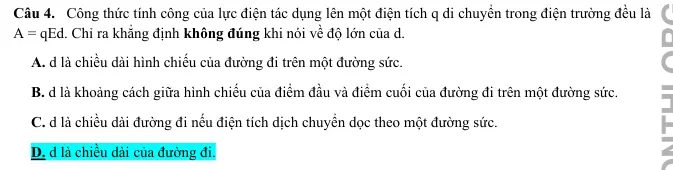
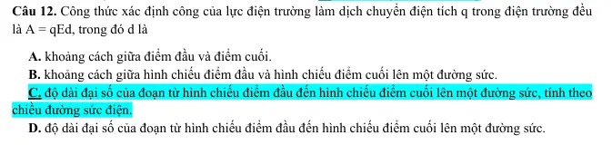
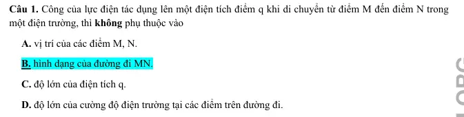
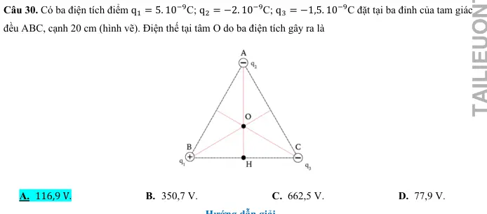
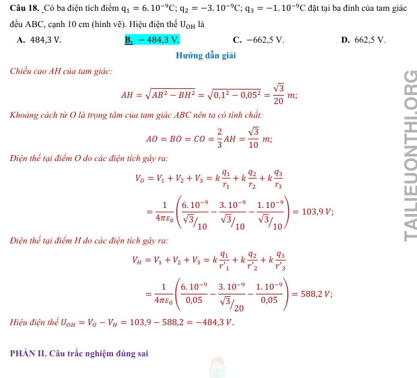
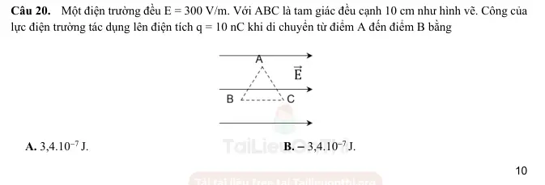
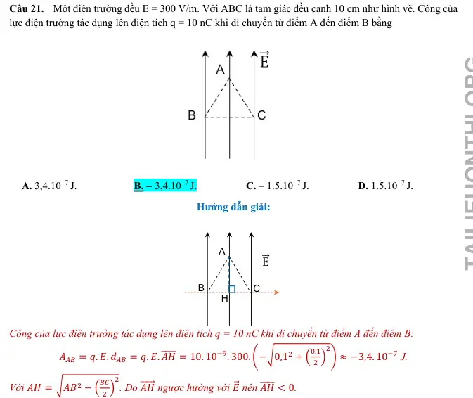
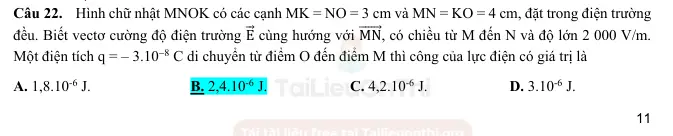

# Bài tập — Bài 5 — Công của lực điện, điện thế và hiệu điện thế

> Hệ bài tập được biên soạn theo các dạng xuất hiện trong bộ tài liệu Vật lí 11 của dự án. Câu hỏi được giữ ngắn, trực tiếp; độ khó tăng dần và không cố tình thêm dữ kiện gây nhiễu.

[← Trở lại bài học](../../05-work-potential-voltage.md)

## Phần A — Trắc nghiệm 4 lựa chọn

### Câu 1 — Mức 1 — Nhận biết

Công của lực điện khi điện tích q di chuyển từ M đến N trong điện trường tĩnh có thể viết

A. $A_{MN}=q(V_M-V_N)$.  
B. $A_{MN}=q(V_N-V_M)$.  
C. $A_{MN}=V_MV_N/q$.  
D. $A_{MN}=q(V_M+V_N)$.

### Câu 2 — Mức 1 — Nhận biết

Đơn vị điện thế là

A. N/C.  
B. J/C.  
C. C/J.  
D. N·m²/C².

### Câu 3 — Mức 1 — Nhận biết

Điện tích dương chuyển động tự do theo chiều đường sức điện trong điện trường tĩnh. Điện thế của nó thường

A. tăng.  
B. giảm.  
C. không đổi.  
D. luôn bằng 0.

### Câu 4 — Mức 1 — Nhận biết

Trong điện trường đều, nếu hai điểm cách nhau d theo đúng chiều điện trường thì

A. $V_M-V_N=Ed$ khi M ở phía trước theo ngược chiều E và N ở phía sau theo chiều E.  
B. hiệu điện thế luôn bằng 0.  
C. $U=E/d$.  
D. $E=Ud$.

## Phần B — Đúng/Sai

### Câu 5 — Mức 2 — Thông hiểu

Xét công của lực điện trong điện trường tĩnh:

a) Chỉ phụ thuộc vị trí đầu và cuối, không phụ thuộc đường đi.  
b) Trên đường kín, tổng công bằng 0.  
c) Nếu q dương đi từ nơi điện thế cao xuống thấp, lực điện thực hiện công dương.  
d) Thế năng điện luôn dương.

### Câu 6 — Mức 2 — Thông hiểu

Về điện thế và hiệu điện thế:

a) Điện thế là đại lượng vô hướng.  
b) Hiệu điện thế $U_{MN}=V_M-V_N$.  
c) $1$ V = $1$ J/C.  
d) Cường độ điện trường đều có thể tính $E=U/d$ nếu d là khoảng cách theo phương vuông góc đường sức.

## Phần C — Trả lời ngắn

### Câu 7 — Mức 3 — Vận dụng

Điện tích $q=2\,\mu$C đi từ điểm M có điện thế $120$ V đến N có điện thế $20$ V. Tính công của lực điện.

### Câu 8 — Mức 3 — Vận dụng

Hai bản phẳng tạo điện trường đều $E=2\cdot10^4$ V/m, cách nhau $5$ mm. Tính hiệu điện thế giữa hai bản.

### Câu 9 — Mức 3 — Vận dụng

Một electron đi qua hiệu điện thế tăng thêm về độ lớn $200$ V và được gia tốc từ nghỉ. Tính độ tăng động năng theo eV.

## Phần D — Vận dụng và vận dụng cao

### Câu 10 — Mức 4 — Vận dụng cao

Trong điện trường đều $E=500$ V/m hướng theo trục Ox dương. Điểm M có tọa độ $x_M=0,20$ m, điểm N có $x_N=0,70$ m. Tính $V_M-V_N$ và công của lực điện khi điện tích $q=-4\,\mu$C đi từ M đến N.

---

[Đáp án và lời giải →](solutions.md)

## Ngân hàng bài tập PDF mở rộng

> Nội dung câu hỏi và dữ kiện trong phần này được giữ nguyên; hệ thống chỉ chuẩn hóa xuống dòng và mã kí tự để hiển thị trên web. Câu trùng được loại bỏ. Với câu có công thức/kí hiệu bị sai khi trích xuất chữ từ PDF, đề bài được giữ dưới dạng ảnh để không làm thay đổi dữ kiện.

### Nhận biết — Trả lời ngắn

#### Bài PDF 1

<!-- source-id: BT-Chuong-III-p109-q31-265 -->

Câu 31. Tính công của lực điện (theo đơn vị 10−7 J) khi điện tích di chuyển từ M đến N.

#### Bài PDF 2

<!-- source-id: BT-Chuong-III-p109-q31-268 -->

Câu 31. 𝐴𝑀𝑁= 𝑞. 𝐸. 𝑑𝑀𝑁= 𝑞. 𝐸. 𝑀𝐻
̅̅̅̅̅ = −4. 10−8. 200.0,036 ≈−2,9. 10−7 J.
Với 𝑐𝑜𝑠𝑀=
𝑀𝐻
𝑀𝑁=
𝑀𝑁
𝑀𝑃  𝑀𝐻=
𝑀𝑁2
𝑀𝑃=
𝑀𝑃2−𝑁𝑃2
𝑀𝑃
=
102−82
10
= 3,6 cm = 0,036 m.
M
N
P
H
E⃗
16

#### Bài PDF 3

<!-- source-id: BT-Chuong-III-p109-q32-266 -->

Câu 32. Tính công của lực điện (theo đơn vị 10−7 J) khi điện tích di chuyển từ P đến N.

#### Bài PDF 4

<!-- source-id: BT-Chuong-III-p109-q33-267 -->

Câu 33. Tính công của lực điện (theo đơn vị 10−7 J) khi điện tích di chuyển theo đường kín MNPM.

#### Bài PDF 5

<!-- source-id: BT-Chuong-III-p110-q32-269 -->

Câu 32. 𝐴𝑃𝑁= 𝑞. 𝐸. 𝑑𝑃𝑁= 𝑞. 𝐸. 𝑃𝐻
̅̅̅̅ = −4. 10−8. 200. (−0,064) = 5,12. 10−7 J.
Với 𝑃𝐻= 𝑀𝑃−𝑀𝐻  𝑃𝐻= 10 −3,6 = 6,4 cm = 0,064 m.

#### Bài PDF 6

<!-- source-id: BT-Chuong-III-p110-q33-270 -->

Câu 33. 𝐴𝑀𝑁𝑃𝑀= 𝑞. 𝐸. 𝑑𝑀𝑁𝑃𝑀= 0. Vì 𝑑𝑀𝑁𝑃𝑀= 𝑀𝑀
̅̅̅̅̅ = 0.

#### Bài PDF 7

<!-- source-id: BT-Chuong-III-p110-q34-271 -->

Câu 34. Một tụ điện phẳng có hai cực làm bằng kim loại, cách nhau 2 cm. Cường độ điện trường giữa hai
bản tụ là E = 105 V/m. Một điện tích q = 2.10-5 C đặt tại điểm M, nằm giữa hai bản tụ và cách bản âm 1,5
cm. Chọn bản âm của tụ làm mốc thế năng điện. Xác định thế năng của điện tích q tại M.

#### Bài PDF 8

<!-- source-id: BT-Chuong-III-p110-q35-272 -->

Câu 35. Một tụ điện phẳng có hai cực làm bằng kim loại, cách nhau 2 cm. Cường độ điện trường giữa hai
bản tụ là E = 105 V/m. Một điện tích q = 2.10−5 C đặt tại điểm A, nằm giữa hai bản tụ và cách bản dương
1,5 cm. Chọn bản âm của tụ làm mốc thế năng điện. Xác định thế năng của điện tích q tại A.

#### Bài PDF 9

<!-- source-id: BT-Chuong-III-p118-q1-297 -->

Câu 1. Một điện trường đều có cường độ 2 500 V/m. Tính công của lực điện trường thực hiện một điện
tích q khi nó di chuyển từ A đến B ngược chiều đường sức (theo đơn vị 10−4 J). Biết AB = 5 cm, q = −10−6
C.

#### Bài PDF 10

<!-- source-id: BT-Chuong-III-p119-q2-298 -->

Câu 2. Một điện trường đều cường độ 4 000 V/m, có phương song song với cạnh
huyền BC của một tam giác vuông ABC có chiều từ B đến C, biết AB = 6 cm,
AC = 8 cm. Công của lực điện tác dụng lên điện tích q = 10 nC khi di chuyển từ
điểm A đến điểm C bằng bao nhiêu 10−6 J?

#### Bài PDF 11

<!-- source-id: BT-Chuong-III-p119-q3-299 -->

Câu 3. Một điện tích điểm q = 4.10−8 C di chuyển dọc theo các cạnh của tam giác ABC, vuông tại A, trong
điện trường đều có cường độ 100 V/m. Cạnh AB = 6 cm, BC
⃗⃗⃗⃗⃗  cùng hướng E⃗ ; AC = 8 cm. Môi trường là
không khí. Tính công của lực điện (theo đơn vị 10−7 J) khi điện tích di chuyển từ A đến C.

#### Bài PDF 12

<!-- source-id: BT-Chuong-III-p119-q4-300 -->

Câu 4. Một tụ điện phẳng có hai cực làm bằng kim loại, cách nhau 2 cm. Cường độ điện trường giữa hai
bản tụ là E = 106 V/m. Một điện tích q = − 2.10−5 C đặt tại điểm M, nằm giữa hai bản tụ và cách bản âm
1,5 cm. Chọn bản âm của tụ làm mốc thế năng điện. Xác định thế năng của điện tích q tại M.

#### Bài PDF 13

<!-- source-id: BT-Chuong-III-p137-q1-339 -->

Câu 1. Công mà lực điện sinh ra khi dịch chuyển điện tích 1,6.10-6 C từ điểm M đến điểm N là bao nhiêu mJ?
Biết hiệu điện thế UMN = 50 V.

#### Bài PDF 14

<!-- source-id: BT-Chuong-III-p138-q2-340 -->

Câu 2. Ta cần thực hiện một công 1,3.10-4J để dịch chuyển điện tích 2,6.10-6 C từ vô cực đến điểm M. Chọn
gốc điện thế tại vô cực. Điện thế tại M bằng bao nhiêu V ?

#### Bài PDF 15

<!-- source-id: BT-Chuong-III-p138-q3-341 -->

Câu 3. Hai điểm trên một đường sức trong một điện trường đều cách nhau 60 cm. Độ lớn cường độ điện
trường là 250 V/m. Hiệu điện thế giữa hai điểm đó bằng bao nhiêu V ?

#### Bài PDF 16

<!-- source-id: BT-Chuong-III-p138-q4-342 -->

Câu 4. Một điện trường đều cường độ 4000 V/m, có phương song song với cạnh huyền BC của một tam giác
vuông ABC có chiều từ B đến C, biết AB = 6 cm; AC = 8 cm. Hiệu điện thế giữa hai điểm B và A bằng bao
nhiêu V ?

#### Bài PDF 17

<!-- source-id: BT-Chuong-III-p139-q6-344 -->

Câu 6. Giả thiết rằng trong một tia sét có một điện tích q = 25 C được phóng ra từ đám mây và mặt đất có
U = 1,4. 108 V . Cho biết nhiệt hóa hơi của nước bằng 3. 106 J/kg , năng lượng của tia sét này có thể làm bao
nhiêu kg nước ở 100°C  bốc thành hơi ở 100°C?

#### Bài PDF 18

<!-- source-id: BT-Chuong-III-p146-q1-367 -->

Câu 1. Hiệu điện thế giữa hai điểm M, N là UMN = 4V. Một điện tích q = -2C di chuyển từ M đến N thì công
của lực điện trường là bao nhiêu ?

#### Bài PDF 19

<!-- source-id: BT-Chuong-III-p146-q2-368 -->

Câu 2. Ta cần thực hiện một công 8.10-2J để dịch chuyển điện tích 0,16 C từ vô cực đến điểm B. Chọn gốc
điện thế tại vô cực. Điện thế tại B là bao nhiêu ?

#### Bài PDF 20

<!-- source-id: BT-Chuong-III-p146-q3-369 -->

Câu 3. Hai điểm trên một đường sức trong một điện trường đều cách nhau 0,5 m. Độ lớn cường độ điện
trường là 1000 V/m. Hiệu điện thế giữa hai điểm đó là

### Nhận biết — Trắc nghiệm 4 lựa chọn

#### Bài PDF 21

<!-- source-id: BT-Chuong-III-p101-q1-235 -->

Câu 1. Công của lực điện có đơn vị là
A. vôn (V).
B. jun (J).
C. vôn trên mét (V/m).
D. oát (W).

#### Bài PDF 22

<!-- source-id: BT-Chuong-III-p101-q4-238 -->

Câu 4. Công thức tính công của lực điện tác dụng lên một điện tích q di chuyển trong điện trường đều là
A = qEd. Chỉ ra khẳng định không đúng khi nói về độ lớn của d.

A. d là chiều dài hình chiếu của đường đi trên một đường sức.

B. d là khoảng cách giữa hình chiếu của điểm đầu và điểm cuối của đường đi trên một đường sức.

C. d là chiều dài đường đi nếu điện tích dịch chuyển dọc theo một đường sức.

D. d là chiều dài của đường đi.

{ loading=lazy }

#### Bài PDF 23

<!-- source-id: BT-Chuong-III-p101-q5-239 -->

Câu 5. Nếu chiều dài đường đi của điện tích trong điện trường tăng 2 lần thì công của lực điện trường

A. chưa đủ dữ kiện để xác định.
B. tăng 2 lần.

C. giảm 2 lần.

D. không thay đổi.

#### Bài PDF 24

<!-- source-id: BT-Chuong-III-p101-q6-240 -->

Câu 6. Một điện tích điểm di chuyển dọc theo đường sức của một điện trường đều có cường độ điện
trường E = 1 000 V/m, đi được một khoảng d = 5 cm. Lực điện trường thực hiện được công A = − 15.10−5 J.
Độ lớn của điện tích đó là

A. 5.10−6 C.
B. 15.10−6 C.
C. 3.10−6 C.
D. 3.10−5 C.

#### Bài PDF 25

<!-- source-id: BT-Chuong-III-p102-q9-243 -->

Câu 9. Phát biểu đúng về mối quan hệ giữa công của lực điện và thế năng tĩnh điện là

A. công của lực điện cũng là thế năng tĩnh điện.

B. công của lực điện là số đo độ biến thiên thế năng tĩnh điện.

C. lực điện thực hiện công dương thì thế năng tĩnh điện tăng.

D. lực điện thực hiện công âm thì thế năng tĩnh điện giảm.

#### Bài PDF 26

<!-- source-id: BT-Chuong-III-p102-q10-244 -->

Câu 10. Công của lực điện làm dịch chuyển một điện tích 10 mC theo phương song song với các đường
sức trong một điện trường đều với quãng đường 1 cm là 1 J. Độ lớn cường độ điện trường đó bằng

A. 10000 V/m.
B. 1 V/m.
C. 100 V/m.
D.  1000 V/m.

#### Bài PDF 27

<!-- source-id: BT-Chuong-III-p103-q12-246 -->

Câu 12. Công thức xác định công của lực điện trường làm dịch chuyển điện tích q trong điện trường đều
là A = qEd, trong đó d là

A. khoảng cách giữa điểm đầu và điểm cuối.

B. khoảng cách giữa hình chiếu điểm đầu và hình chiếu điểm cuối lên một đường sức.

C. độ dài đại số của đoạn từ hình chiếu điểm đầu đến hình chiếu điểm cuối lên một đường sức, tính theo
chiều đường sức điện.

D. độ dài đại số của đoạn từ hình chiếu điểm đầu đến hình chiếu điểm cuối lên một đường sức.

{ loading=lazy }

#### Bài PDF 28

<!-- source-id: BT-Chuong-III-p103-q13-247 -->

Câu 13. Phát biểu nào sau đây là sai?

A. Thế năng của điện tích q đặt tại điểm M trong điện trường đặc trưng cho khả năng sinh công của điện
trường tại điểm đó.

B. Thế năng của điện tích q đặt tại điểm M trong điện trường được xác định bằng biểu thức WM = q. E. d.

C. Công của lực điện bằng độ giảm thế năng của điện tích trong điện trường.

D. Thế năng của điện tích q đặt tại điểm M trong điện trường không phụ thuộc điện tích q.

#### Bài PDF 29

<!-- source-id: BT-Chuong-III-p103-q15-249 -->

Câu 15. Một điện tích q di chuyển trong điện trường từ A đến B thì lực điện sinh công A = 2,5 J. Biết thế
năng của q tại B là 3,75 J. Thế năng của nó tại A bằng

A. 6,25 J.
B. 1,25 J.
C. – 6,25 J.
D. – 1,25 J.

#### Bài PDF 30

<!-- source-id: BT-Chuong-III-p103-q16-250 -->

Câu 16. Cho điện tích dịch chuyển giữa hai điểm cố định trong một điện trường đều với cường độ 150
V/m thì công của lực điện trường là 90 mJ. Nếu cường độ điện trường là 200 V/m thì công của lực điện
trường dịch chuyển điện tích giữa hai điểm đó là

A. 120 J.
B. 40 J.
C. 40 mJ.
D. 120 mJ.

#### Bài PDF 31

<!-- source-id: BT-Chuong-III-p104-q17-251 -->

Câu 17. Cho điện tích 10−8 C dịch chuyển giữa hai điểm cố định trong một điện trường đều thì công của
lực điện trường là 80 mJ. Nếu một điện tích 4.10−9 C dịch chuyển giữa hai điểm đó thì công của lực điện
trường khi đó là

A. 32 mJ.
B. 20 mJ.
C. 240 mJ.
D. 320 mJ.

#### Bài PDF 32

<!-- source-id: BT-Chuong-III-p106-q23-257 -->

Câu 23. Một điện tích q = 4.10−8 C di chuyển trong một điện trường đều có cường độ E = 100 V/m, theo
đường gấp khúc ABC. Đoạn AB = 20 cm, AB
⃗⃗⃗⃗⃗  hợp với E⃗  một góc 600; đoạn BC = 40 cm, BC
⃗⃗⃗⃗⃗  hợp với E⃗  một
góc 1200. Công của lực điện bằng

A. 4.10−7 J.
B. − 8.10−7 J.
C. − 4.10−7 J.
D. 12.10−7 J.

#### Bài PDF 33

<!-- source-id: BT-Chuong-III-p106-q24-258 -->

Câu 24. Một proton bay theo phương của một đường sức điện trường. Lúc ở điểm A nó có tốc độ 2,5.104
m/s, khi đến điểm B tốc độ của nó bằng không. Biết proton có khối lượng 1,67.10-27 kg. Thế năng điện tại
A bằng 8.10−17 J. Thế năng điện tại B bằng

A. − 8,5.10−17 J.
B. − 8.10−17 J.
C. 8,1.10−17 J.
D. 8,5.10−17 J.

#### Bài PDF 34

<!-- source-id: BT-Chuong-III-p112-q1-275 -->

Câu 1. Công của lực điện tác dụng lên một điện tích điểm q khi di chuyển từ điểm M đến điểm N trong
một điện trường, thì không phụ thuộc vào

A. vị trí của các điểm M, N.

B. hình dạng của đường đi MN.

C. độ lớn của điện tích q.

D. độ lớn của cường độ điện trường tại các điểm trên đường đi.

{ loading=lazy }

#### Bài PDF 35

<!-- source-id: BT-Chuong-III-p112-q3-277 -->

Câu 3. Thế năng của điện tích trong điện trường đặc trưng cho
A. tốc độ sinh công của điện trường để dịch chuyển điện tích q từ điểm đó ra xa vô cùng.
B. phương, chiều của cường độ điện trường.
C. khả năng sinh công của điện trường để dịch chuyển điện tích q từ điểm đó ra xa vô cùng.
D. độ lớn nhỏ của vùng không gian có điện trường.

#### Bài PDF 36

<!-- source-id: BT-Chuong-III-p112-q4-278 -->

Câu 4. Nếu điện tích dịch chuyển trong điện trường đều sao cho thế năng của nó tăng thì công của của lực
điện trường
A. âm.

B. dương.
C. bằng không.

D. chưa đủ dữ kiện để xác định.

#### Bài PDF 37

<!-- source-id: BT-Chuong-III-p113-q5-279 -->

Câu 5. Cho điện tích dịch chuyển giữa hai điểm cố định trong một điện trường đều với cường độ 150 V/m
thì công của lực điện trường là 90 mJ. Nếu cường độ điện trường là 100 V/m thì công của lực điện trường
dịch chuyển điện tích giữa hai điểm đó là

A. 120 J.
B. 60 J.
C. 60 mJ.
D. 120 mJ.

#### Bài PDF 38

<!-- source-id: BT-Chuong-III-p113-q6-280 -->

Câu 6. Q là một điện tích điểm âm đặt tại điểm O. M và N là hai điểm nằm trong điện trường của Q với
OM = 20 cm và ON = 10 cm. Đặt tại M, N một điện tích q thử (q &gt; 0). Chỉ ra bất đẳng thức đúng? Chọn
mốc thế năng tại điện tích Q.

A. WM &lt; WN &lt; 0.
B. WN &lt; WM &lt; 0.
C. WM &gt; WN &gt; 0.
D. WN &gt; WM &gt; 0.

#### Bài PDF 39

<!-- source-id: BT-Chuong-III-p113-q7-281 -->

Câu 7. Ba điểm M, N, P cùng nằm trong một điện trường tĩnh và không thẳng hàng với nhau. Cho biết WM
= 25 J; WN = 10 J; WP = 5 J. Công của lực điện để di chuyển một điện tích dương 10 C từ điểm M qua điểm
P rồi tới điểm N là bao nhiêu?

A. 10 J.
B. 5 J.
C. 20 J.
D. 15 J.

#### Bài PDF 40

<!-- source-id: BT-Chuong-III-p114-q11-285 -->

Câu 11. Một điện tích q = − 4.10−8 C di chuyển trong một điện trường đều có cường độ E = 100 V/m, theo
đường gấp khúc ABC. Đoạn AB = 20 cm, AB
⃗⃗⃗⃗⃗  hợp với E⃗  một góc 600; đoạn BC = 40 cm, BC
⃗⃗⃗⃗⃗  hợp với E⃗  một
góc 1200. Công của lực điện bằng

A. 4.10−7 J.
B. − 8.10−7 J.
C. − 4.10−7 J.
D. 12.10−7 J.

#### Bài PDF 41

<!-- source-id: BT-Chuong-III-p114-q13-287 -->

Câu 13. Công của lực điện trường làm dịch chuyển điện tích q &gt; 0 trong điện trường đều E là A = q. E. d.
Gọi α là góc giữa hướng của đường sức điện và hướng của độ dịch chuyển d. Phát biểu nào sau đây là sai khi
nói về mối quan hệ giữa góc α và công của lực điện?
  A. α &lt; 900 thì A &gt; 0.

B. α &gt; 900 thì A &lt; 0.

C. Điện tích dịch chuyển ngược chiều một đường sức thì công A có độ lớn nhỏ nhất.
21

D. Điện tích dịch chuyển dọc theo chiều một đường sức thì công A nhận giá trị lớn nhất.

#### Bài PDF 42

<!-- source-id: BT-Chuong-III-p115-q15-289 -->

Câu 15. Tính công của lực điện khi một điện tích q = 4.10−8 C di chuyển trong một điện trường đều có
cường độ điện trường E = 100 V/m theo một đường gấp khúc ABC. Đoạn AB dài 20 cm và vectơ AB
⃗⃗⃗⃗⃗  hợp
với các đường sức điện một góc 300. Đoạn BC dài 40 cm và vectơ BC
⃗⃗⃗⃗⃗  hợp với các đường sức điện một góc
1200.

A. 0,107.10−6 J.
B. − 0,107.10−6 J.
C. 1,492.10−6 J.
D. − 1,492.10−6 J.

#### Bài PDF 43

<!-- source-id: BT-Chuong-III-p115-q17-291 -->

Câu 17. Công của lực điện trường dịch chuyển một điện tích q = − 5 μC từ A đến B là A = − 5 mJ. Khi
điện tích q dịch chuyển từ A đến B thì

A. thế năng điện giảm còn − 5 mJ.
B. thế năng điện tăng đến − 5 mJ.

C. thế năng điện giảm một lượng 5 mJ.
D. thế năng điện tăng một lượng 5 mJ.

#### Bài PDF 44

<!-- source-id: BT-Chuong-III-p127-q1-303 -->

Câu 1. Điện thế là đại lượng đặc trưng cho riêng điện trường về
A. phương diện tạo ra thế năng khi đặt tại đó một điện tích q.
B. khả năng sinh công của vùng không gian có điện trường.
C. khả năng sinh công tại một điểm.
D. khả năng tác dụng lực tại tất cả các điểm trong không gian có điện trường.

#### Bài PDF 45

<!-- source-id: BT-Chuong-III-p127-q2-304 -->

Câu 2. Đơn vị của điện thế là

 A. V .
B. J.
C. V/m.
D. W.

#### Bài PDF 46

<!-- source-id: BT-Chuong-III-p127-q3-305 -->

Câu 3. Điện thế là đại lượng
      A.  đại số.
B. luôn luôn dương.
C. luôn luôn âm.
D. Vector.

#### Bài PDF 47

<!-- source-id: BT-Chuong-III-p127-q4-306 -->

Câu 4. Điện thế tại một điểm M trong điện trường được xác định bởi biểu thức
A. VM = AM∞× q.
B. VM = AM∞/q.
C. VM = AM∞.
D. VM = q/AM∞.

#### Bài PDF 48

<!-- source-id: BT-Chuong-III-p127-q5-307 -->

Câu 5. Hiệu điện thế giữa hai điểm đặc trưng cho khả năng
A. sinh công của điện trường của điện tích q đứng yên.
B. tác tác dụng lực của điện trường của điện tích q đứng yên.
C. tạo lực của điện trường để dịch chuyển của điện tích q giữa hai điểm.
D. sinh công của điện trường để dịch chuyển của điện tích q giữa hai điểm.

#### Bài PDF 49

<!-- source-id: BT-Chuong-III-p127-q6-308 -->

Câu 6. Đại lượng đặc trưng cho khả năng thực hiện công của điện trường khi có một điện tích di chuyển giữa 2
điểm đó được gọi là
A. cường độ điện trường.
B. điện thế.
C. hiệu điện thế.
D. lực điện.

#### Bài PDF 50

<!-- source-id: BT-Chuong-III-p127-q7-309 -->

Câu 7. Đơn vị của điện thế là V bằng
A. J.C.
B. J/C.
C. N.C.
D. N/C.

#### Bài PDF 51

<!-- source-id: BT-Chuong-III-p127-q8-310 -->

Câu 8. Hệ thức liên hệ giữa hiệu điện thế và cường độ điện trường là
A. U = qd.
B. U = q.E.d.
C. U = E.q.
D. U = E.d.

#### Bài PDF 52

<!-- source-id: BT-Chuong-III-p127-q9-311 -->

Câu 9. Đơn vị của hiệu điện thế là
A. V/m.
B. J.
C. V.
D. C.

#### Bài PDF 53

<!-- source-id: BT-Chuong-III-p128-q10-312 -->

Câu 10. Khi UAB &gt; 0 thì
A. điện thế tại A thấp hơn điện thế tại B.
B. điện thế tại A bằng điện thế tại B.
C. dòng điện chạy trong mạch AB theo chiều từ B đến A.
D. điện thế tại A cao hơn điện thế tại B .

#### Bài PDF 54

<!-- source-id: BT-Chuong-III-p128-q17-319 -->

Câu 17. Biết hiệu điện thế UMN = 10 V. Đẳng thức nào dưới đây đúng?
A. VM = 10 V.
B. VN = 10 V.
C. VM – VN = 10 V.
D. VN – VM = 10 V.

#### Bài PDF 55

<!-- source-id: BT-Chuong-III-p129-q18-320 -->

Câu 18. Cho một điện tích di chuyển trong điện trường dọc theo một đường cong kín, xuất phát từ điểm M qua
điểm N rồi trở lại điểm M. Công của lực điện
A. trong cả quá trình bằng 0.
B. trong quá trình M đến N là dương,
C. trong quá trình N đến M là dương.
D. trong cả quá trình là dương.

#### Bài PDF 56

<!-- source-id: BT-Chuong-III-p129-q19-321 -->

Câu 19. Điện thế tại một điểm M trong điện trường bất kì có cường độ điện trường E⃗  không phụ thuộc vào
A. vị trí điểm M.
B. cường độ điện trường E⃗ .
C. điện tích q đặt tại điểm M.
D. vị trí được chọn làm mốc của điện thế.

#### Bài PDF 57

<!-- source-id: BT-Chuong-III-p129-q20-322 -->

Câu 20. Theo quy định của mạng lưới truyền tải điện ở Việt Nam, các lưới điện có điện áp từ 1kV đến 66 kV
được gọi là
A. Hạ thế.
B. Trung thế.
C. Cao thể.
D. Đẳng thế.

#### Bài PDF 58

<!-- source-id: BT-Chuong-III-p129-q21-323 -->

Câu 21. Một điện tích q = 2.10−6C di chuyển từ điểm A đến điểm B trong một điện trường đều thì cần tốn một
công là 3.10−4 J. Hiệu điện thế giữa hai điểm A và B là
A. 0,15 V.
B. 1,5 V.
C. 15 V.
D. 150 V.

#### Bài PDF 59

<!-- source-id: BT-Chuong-III-p129-q22-324 -->

Câu 22. Ta cần thực hiện một công 5.10−6J để dịch chuyển điện tích 2,5.10−5 C từ vô cực đến điểm A. Chọn
gốc điện thế tại vô cực. Điện thế tại A là
A. 2 V.
B. −2 V.
C. 0,2 V.
D. −0,2 V.

#### Bài PDF 60

<!-- source-id: BT-Chuong-III-p129-q23-325 -->

Câu 23. Một điện  tích q = 1,6.10−19C dịch chuyển từ A đến B trong một điện trường đều. Biết hiệu điện thế
UAB = 30 V , công của lực điện từ điểm A đến điểm B là
A. 4,8.10−19J.
B. 4,8.10−18J.
C. 5,8.10−18J.
D. 5,8.10−19J.

#### Bài PDF 61

<!-- source-id: BT-Chuong-III-p130-q25-327 -->

Câu 25. Một điện trường đều cường độ 5000V/m, có phương song song với cạnh huyền BC của một tam giác
vuông ABC có chiều từ B đến C, biết AB = 3 cm, BC = 5 cm. Hiệu điện thế giữa hai điểm AC là

A. 200 V.
B. 150 V.
C. 160 V.
D. 250 V.

#### Bài PDF 62

<!-- source-id: BT-Chuong-III-p132-q30-332 -->

Câu 30. Có ba điện tích điểm q1 = 5. 10−9C; q2 = −2. 10−9C; q3 = −1,5. 10−9C đặt tại ba đỉnh của tam giác
đều ABC, cạnh 20 cm (hình vẽ). Điện thế tại tâm O do ba điện tích gây ra là
A. 116,9 V.
B. 350,7 V.
C. 662,5 V.
D. 77,9 V.

{ loading=lazy }

#### Bài PDF 63

<!-- source-id: BT-Chuong-III-p140-q1-345 -->

Câu 1. Biểu thức nào sau đây là sai?
A.  UMN = VM - VN.
B. U = E.d.
C. A = qEd.
D. UMN = AMN.q.

#### Bài PDF 64

<!-- source-id: BT-Chuong-III-p140-q2-346 -->

Câu 2. Đại lượng đặc trưng cho riêng điện trường về khả năng sinh công tại một điểm là
A.  Điện thế.
B. Điện trường.
C. Hiệu điện thế.
D. Cường độ điện trường.

#### Bài PDF 65

<!-- source-id: BT-Chuong-III-p140-q3-347 -->

Câu 3. Mối liên hệ giữa hiệu điện thế UAB và hiệu điện thế UBA là
A.  UAB = UBA.

B.  UAB =
1
UBA.
C. UAB = −
1
UBA.

D.  UAB = −UBA.

#### Bài PDF 66

<!-- source-id: BT-Chuong-III-p140-q5-349 -->

Câu 5. Công mà lực điện sinh ra khi dịch chuyển điện tích 1,6.10-19 C từ điểm A đến điểm B là 3,2.10-18 J.
Hiệu điện thế UAB là
A. 10 V.
B. 20 V.
C. 30 V.
D. 40 V

#### Bài PDF 67

<!-- source-id: BT-Chuong-III-p140-q6-350 -->

Câu 6. Cho hai bản phẳng song song tích điện trái dấu, đặt cách nhau 2 cm. Hiệu điện thế giữa hai bản là
120V. Chọn mốc điện thế tại bản nhiễm điện âm. Điện thế tại điểm N cách bản nhiễm điện âm 0,6 cm là
A. 30V.
B. 36 V.
C. 48 V.
D. 53 V.

#### Bài PDF 68

<!-- source-id: BT-Chuong-III-p140-q7-351 -->

Câu 7. Cho một điện tích di chuyển trong điện trường dọc theo một đường cong kín, xuất phát từ điểm M qua
điểm N rồi trở lại điểm M. Công của lực điện
A.  trong cả quá trình bằng 0.
B. trong quá trình N đến M là dương.
C. trong quá trình M đến N là dương.
D. trong cả quá trình là dương.

#### Bài PDF 69

<!-- source-id: BT-Chuong-III-p141-q9-353 -->

Câu 9. Hiệu điện thế UMN được xác định bằng công thức
A.  UMN = VN −VM.
B. UMN = VM + VN.
C. UMN = VM −VN.
D. UMN = VN/VM.

#### Bài PDF 70

<!-- source-id: BT-Chuong-III-p141-q10-354 -->

Câu 10. Theo quy định của mạng lưới truyền tải điện ở Việt Nam, các lưới điện có điện áp từ dưới 1kV được
gọi là
A. Hạ thế.
B. Trung thế.
C. Cao thể.
D. Đẳng thế.

#### Bài PDF 71

<!-- source-id: BT-Chuong-III-p141-q11-355 -->

Câu 11. Biết hiệu điện thế UNM = 15 V. Hỏi đẳng thức nào dưới đây đúng?
    A.  VM = 15 V.
B. VN = 15 V.
C. VN −VM = 15 V.
D. VM −VN = 15 V.

#### Bài PDF 72

<!-- source-id: BT-Chuong-III-p141-q13-357 -->

Câu 13. Mặt trong của màng tế bào trong cơ thể sống mang điện tích âm, mặt ngoài mang điện tích dương.
Hiệu điện thế giữa hai mặt này bằng 0,07V. Màng tế bào dày 8nm. Cường độ điện trường trong màng tế bào
này là
A.  8,75. 106 V/m.
B. 7,75. 106 V/m.
C. 6,75. 106 V/m.
D. 5,75. 106 V/m.

#### Bài PDF 73

<!-- source-id: BT-Chuong-III-p141-q14-358 -->

Câu 14. Nếu một điện tích q = 2μC thu được năng lượng 4.10-4J khi đi từ A đến B thì hiệu điện thế giữa hai
điểm đó bằng
   A. 100V.
B. 200 V.
C. 300 V.
D. 500 V.

#### Bài PDF 74

<!-- source-id: BT-Chuong-III-p142-q15-359 -->

Câu 15. Cho ba bản kim loại phẳng tích điện 1, 2, 3 đặt song song lần lượt nhau cách nhau những khoảng d12 =
8 cm, d23 = 12 cm, bản 1 và 3 tích điện dương, bản 2 tích điện âm. E12 = 4.104 V/m, E23 = 6.104 V/m, tính điện
thế V2, V3 của các bản 2 và 3 nếu lấy gốc điện thế ở bản 1:
A. V2 = 3200 V; V3 = 4000 V.
B. V2 = −3200 V; V3 = 4000 V.
C. V2 = −3000 V; V3 = 3500 V.
D. V2 = 3000 V; V3 = 35000 V.

#### Bài PDF 75

<!-- source-id: BT-Chuong-III-p142-q16-360 -->

Câu 16. Đơn vị của hiệu điện thế là
A. V/m.
B. J.
C. V.
D. C.

#### Bài PDF 76

<!-- source-id: BT-Chuong-III-p143-q18-362 -->

Câu 18. Có ba điện tích điểm q1 = 6. 10−9C; q2 = −3. 10−9C; q3 = −1. 10−9C đặt tại ba đỉnh của tam giác
đều ABC, cạnh 10 cm (hình vẽ). Hiệu điện thế UOH là
A. 484,3 V.
B. − 484,3 V.
C. −662,5 V.
D. 662,5 V.

{ loading=lazy }

### Nhận biết — Đúng/Sai

#### Bài PDF 77

<!-- source-id: BT-Chuong-III-p117-q3-295 -->

Câu 3. Hai bản kim loại phẳng song song cách nhau 2 cm, nhiễm điện trái dấu. Biết lực điện sinh công A
= 2.10−9 J để dịch chuyển điện tích q = 5.10−10 C từ bản dương sang bản âm.

Phát biểu
Đúng
Sai
a)
Điện trường giữa hai tấm kim loại là điện trường đều có đường sức vuông góc
với các tấm kim loại và cách đều nhau.
Đ

b)
Công của lực điện được xác định bởi biểu thức A = q.E.d.
Đ

c)
Điện tích di chuyển từ bản dương sang bản âm có vector độ dịch chuyển d⃗  ngược
hướng với vector cường độ điện trường E⃗ .

S
d)
Điện trường đều có cường độ E = 200 V/m.
Đ

#### Bài PDF 78

<!-- source-id: BT-Chuong-III-p133-q1-333 -->

Câu 1. Một đám mây dông bị phân thành hai tầng, tầng trên mang điện dương cách xa tầng dưới mang điện âm.
Đo bằng thực nghiệm, người ta thấy điện trường trong khoảng giữa hai tầng của đám mây dông đó gần đều với
E = 830 V/m, khoảng cách giữa hai tầng là 0,7 km, điện tích của tầng phía trên ước tính được bằng Q2 = 1,24 C.
Coi điện thế của tầng mây dưới là V1 = −200 kV.

Phát biểu
Đúng
Sai
a
Chiều điện trường E⃗  hướng từ trên xuống dưới.
Đ

b
Hiệu điện thế giữa hai tầng mây là 581 V.

S
c
Điện thế của tầng mây trên bằng 381 kV.
Đ

d
Thế năng điện của tầng trên là 472,44 J.

S

#### Bài PDF 79

<!-- source-id: BT-Chuong-III-p133-q2-334 -->

Câu 2. Một điện tích điểm q = −4. 10−8 C di chuyển dọc theo chu vi của một tam giác MNP, vuông tại P trong
điện trường đều có cường độ 200 V/m. Cạnh MN = 10 cm, NP = 8 cm và  MN
⃗⃗⃗⃗⃗⃗  ↑↑E⃗ . Môi trường là không khí.

Phát biểu
Đúng
Sai
a
Công của lực điện khi di chuyển điện tích q từ điểm M đến N là 8.10−7J.

S
b
Hiệu điện thế UNM = 20 V.

S
c
Công của lực điện dịch chuyển điểm q từ P đến N bằng −5,12. 10−7 J.
Đ

d
Công để dịch chuyển điện tích đi theo đường kín MNPM là 0 J.
Đ

#### Bài PDF 80

<!-- source-id: BT-Chuong-III-p136-q5-337 -->

Câu 5. Cho ba bản kim loại phẳng tích điện 1, 2, 3 đặt song song lần lượt nhau cách nhau những khoảng d12 = 7
cm, d23 = 10 cm, bản 1 và 3 tích điện dương, bản 2 nằm ở giữa tích điện âm. E12 = 400 V/m, E23 = 800 V/m, lấy
gốc điện thế ở bản 1.

Phát biểu
Đúng
Sai
a
Điện trường E12
⃗⃗⃗⃗⃗⃗  cùng phương, cùng chiều với điện trường  E23
⃗⃗⃗⃗⃗⃗ .

S
b
Điện thế tại bản (2) là 28 V.

S
c
Điện thế tại bản (3) là 52 V.
Đ

d
Công của lực điện để dịch chuyển một điện tích q = 3. 10−6 C từ bản (1) đến (2)
là 84. 10−6μJ.

S

### Thông hiểu — Trắc nghiệm 4 lựa chọn

#### Bài PDF 81

<!-- source-id: BT-Chuong-III-p103-q14-248 -->

Câu 14. Nếu điện tích dịch chuyển trong điện trường sao cho thế năng của nó giảm thì công của của lực
điện trường

A. âm.

B. dương.

C. bằng không.

D. chưa đủ dữ kiện để xác định.

#### Bài PDF 82

<!-- source-id: BT-Chuong-III-p128-q11-313 -->

Câu 11. Điện thế là một đại lượng
A. gắn với điện trường.
B. gắn với điện tích đặt trong điện trường.
C. có hướng.
D. luôn luôn khác không.

#### Bài PDF 83

<!-- source-id: BT-Chuong-III-p128-q12-314 -->

Câu 12. Thiết bị dùng để đo hiệu điện thế là
A. tĩnh điện kế.
B. tốc kế.
C. ampere kế.
D. nhiệt kế.

#### Bài PDF 84

<!-- source-id: BT-Chuong-III-p128-q13-315 -->

Câu 13. Trong các nhận định dưới đây là không đúng khi nói về hiệu điện thế?
A. Đơn vị của hiệu điện thế là V.
B. Hiệu điện thế giữa hai điểm phụ thuộc vị trí của hai điểm đó.
C. Hiệu điện thế giữa hai điểm phụ thuộc điện tích dịch chuyển giữa hai điểm đó.
D. Hiệu điện thế đặc trưng cho khả năng sinh công khi dịch chuyển điện tích giữa hai điểm trong điện
trường.

#### Bài PDF 85

<!-- source-id: BT-Chuong-III-p128-q14-316 -->

Câu 14. Máy đo điện tim, các điện cực được sử dụng để đo
A. hiệu điện thế giữa các điểm khác nhau trên da của bệnh nhân.
B. cường độ dòng điện chạy trong cơ thể của bệnh nhân.
C. nồng độ Oxygen trong máu của bệnh nhân.
D. lượng đường trong máu của bệnh nhân.

#### Bài PDF 86

<!-- source-id: BT-Chuong-III-p128-q16-318 -->

Câu 16. Hiệu điện thế giữa hai điểm M, N là UMN = 30 V. Nhận xét nào sau đây đúng?
A. Điện thế tại điểm M là 30 V.
B. Điện thế tại điểm N là 30 V.
C. Điện thế ở M có giá trị dương, ở N có giá trị âm.
D. Điện thế ở M cao hơn điện thế ở N 30 V.

### Vận dụng — Trắc nghiệm 4 lựa chọn

#### Bài PDF 87

<!-- source-id: BT-Chuong-III-p104-q20-254 -->

Câu 20. Một điện trường đều E = 300 V/m. Với ABC là tam giác đều cạnh 10 cm như hình vẽ. Công của
lực điện trường tác dụng lên điện tích q = 10 nC khi di chuyển từ điểm A đến điểm B bằng

A. 3,4.10−7 J.

B. − 3,4.10−7 J.
A
B
C
E⃗
H
11

C. – 1.5.10−7 J.

D. 1.5.10−7 J.

{ loading=lazy }

#### Bài PDF 88

<!-- source-id: BT-Chuong-III-p105-q21-255 -->

Câu 21. Một điện trường đều E = 300 V/m. Với ABC là tam giác đều cạnh 10 cm như hình vẽ. Công của
lực điện trường tác dụng lên điện tích q = 10 nC khi di chuyển từ điểm A đến điểm B bằng

A. 3,4.10−7 J.
B. − 3,4.10−7 J.
C. – 1.5.10−7 J.
D. 1.5.10−7 J.

{ loading=lazy }

#### Bài PDF 89

<!-- source-id: BT-Chuong-III-p105-q22-256 -->

Câu 22. Hình chữ nhật MNOK có các cạnh MK = NO = 3 cm và MN = KO = 4 cm, đặt trong điện trường
đều. Biết vectơ cường độ điện trường E⃗  cùng hướng với MN
⃗⃗⃗⃗⃗⃗ , có chiều từ M đến N và độ lớn 2 000 V/m.
Một điện tích q = – 3.10−8 C di chuyển từ điểm O đến điểm M thì công của lực điện có giá trị là
A. 1,8.10-6 J.
B. 2,4.10-6 J.
C. 4,2.10-6 J.
D. 3.10-6 J.
A
B
C
E⃗
H
A
B
C
E⃗
H
12

{ loading=lazy }

#### Bài PDF 90

<!-- source-id: BT-Chuong-III-p130-q26-328 -->

Câu 26. Cho ba bản kim loại phẳng tích điện 1, 2, 3 đặt song song lần lượt nhau cách nhau những khoảng d12 =
4 cm, d23 = 10 cm, bản 1 và 3 tích điện dương, bản 2 tích điện âm. E12 = 3.104 V/m, E23 = 4.104 V/m, tính điện
thế V2, V3 của các bản 2 và 3 nếu lấy gốc điện thế ở bản 1:
A. V2 = 1200 V; V3 = 2800 V.
B. V2 = −1200 V; V3 = 2800 V.
C. V2 = −3000 V; V3 = 1000 V.
D. V2 = 3000 V; V3 = 1000 V.

#### Bài PDF 91

<!-- source-id: BT-Chuong-III-p131-q27-329 -->

Câu 27. Hai tấm kim loại phẳng song song cách nhau 5 cm nhiễm điện trái dấu. Muốn làm cho điện tích q =
2.10−10 C di chuyển từ tấm này sang tấm kia cần tốn một công A = 3.10−9 J. Biết điện trường bên trong là điện
trường đều có đường sức vuông góc với các tấm, cường độ điện trường bên trong hai tấm kim loại là
A. 250 V/m.
B. 200 V/m.
C. 300 V/m.
D. 150 V/m.

