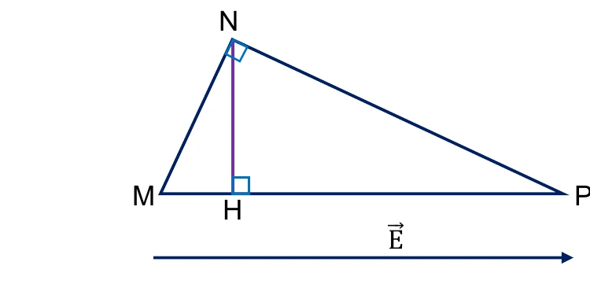

# Bài tập — Bài 5 — Công của lực điện, điện thế và hiệu điện thế

[← Trở lại bài học](../../05-work-potential-voltage.md)

## Phần A — Trắc nghiệm 4 lựa chọn

### Bài 1 — Mức 1 — Nhận biết

Công của lực điện khi điện tích q di chuyển từ M đến N trong điện trường tĩnh có thể viết

A. $A_{MN}=q(V_M-V_N)$.

B. $A_{MN}=q(V_N-V_M)$.

C. $A_{MN}=V_MV_N/q$.

D. $A_{MN}=q(V_M+V_N)$.

??? success "Đáp án và lời giải"
    Chọn **A** với quy ước $U_{MN}=V_M-V_N$.

### Bài 2 — Mức 1 — Nhận biết

Đơn vị điện thế là

A. N/C.

B. J/C.

C. C/J.

D. N·m²/C².

??? success "Đáp án và lời giải"
    Chọn **B**, tên riêng là vôn (V).

### Bài 3 — Mức 1 — Nhận biết

Điện tích dương chuyển động tự do theo chiều đường sức điện trong điện trường tĩnh. Điện thế của nó thường

A. tăng.

B. giảm.

C. không đổi.

D. luôn bằng 0.

??? success "Đáp án và lời giải"
    Chọn **B**: chiều $\vec E$ là chiều điện thế giảm.

### Bài 4 — Mức 1 — Nhận biết

Trong điện trường đều, nếu hai điểm cách nhau d theo đúng chiều điện trường thì

A. $V_M-V_N=Ed$ khi M ở phía trước theo ngược chiều E và N ở phía sau theo chiều E.

B. hiệu điện thế luôn bằng 0.

C. $U=E/d$.

D. $E=Ud$.

??? success "Đáp án và lời giải"
    Chọn **A** với cách đặt M ở phía điện thế cao hơn và N theo chiều $\vec E$.

## Phần B — Đúng/Sai

### Bài 5 — Mức 2 — Thông hiểu

Xét công của lực điện trong điện trường tĩnh:

a) Chỉ phụ thuộc vị trí đầu và cuối, không phụ thuộc đường đi.

b) Trên đường kín, tổng công bằng 0.

c) Nếu q dương đi từ nơi điện thế cao xuống thấp, lực điện thực hiện công dương.

d) Thế năng điện luôn dương.

??? success "Đáp án và lời giải"
    a) **Đúng.** Lực điện tĩnh là lực thế nên công của lực điện chỉ phụ thuộc hai điểm đầu-cuối, không phụ thuộc quỹ đạo.

    b) **Đúng.** Với lực điện tĩnh là lực thế, đi theo đường kín trở về điểm ban đầu cho độ biến thiên thế năng bằng $0$, nên tổng công bằng $0$.

    c) **Đúng.** vì $A=q(V_M-V_N)>0$.

    d) **Sai.** dấu thế năng phụ thuộc mốc và hệ điện tích.

### Bài 6 — Mức 2 — Thông hiểu

Về điện thế và hiệu điện thế:

a) Điện thế là đại lượng vô hướng.

b) Hiệu điện thế $U_{MN}=V_M-V_N$.

c) $1\,\mathrm V=1\,\mathrm{J/C}$.

d) Cường độ điện trường đều có thể tính $E=U/d$ nếu d là khoảng cách theo phương vuông góc đường sức.

??? success "Đáp án và lời giải"
    a) **Đúng.** Điện thế $V$ là năng lượng điện thế trên một đơn vị điện tích và không có hướng, nên là đại lượng vô hướng.

    b) **Đúng.** theo quy ước đang dùng.

    c) **Đúng.** Từ định nghĩa $V=W/q$, đơn vị của điện thế là jun trên culông; do đó $1\,\mathrm V=1\,\mathrm{J/C}$.

    d) **Sai.** $d$ phải là độ dịch chuyển theo phương điện trường giữa hai mặt đẳng thế tương ứng.

## Phần C — Trả lời ngắn

### Bài 7 — Mức 3 — Vận dụng

Điện tích $q=2\,\mu\,\mathrm C$ đi từ điểm M có điện thế $120\,\mathrm V$ đến N có điện thế $20\,\mathrm V$. Tính công của lực điện.

??? success "Đáp án và lời giải"
    $A=q(V_M-V_N)=2\cdot10^{-6}(120-20)=2\cdot10^{-4}\,\mathrm J$.

### Bài 8 — Mức 3 — Vận dụng

Hai bản phẳng tạo điện trường đều $E=2\cdot10^4\,\mathrm{V/m}$, cách nhau $5\,\mathrm{mm}$. Tính hiệu điện thế giữa hai bản.

??? success "Đáp án và lời giải"
    $U=Ed=2\cdot10^4\cdot5\cdot10^{-3}=100\,\mathrm V$.

### Bài 9 — Mức 3 — Vận dụng

Một electron đi qua hiệu điện thế tăng thêm về độ lớn $200\,\mathrm V$ và được gia tốc từ nghỉ. Tính độ tăng động năng theo eV.

??? success "Đáp án và lời giải"
    Độ tăng động năng của electron qua hiệu điện thế $200\,\mathrm V$ là $200$ eV. Nếu đổi sang J: $200\cdot1,6\cdot10^{-19}=3,2\cdot10^{-17}\,\mathrm J$.

## Phần D — Vận dụng và vận dụng cao

### Bài 10 — Mức 4 — Vận dụng cao

Trong điện trường đều $E=500\,\mathrm{V/m}$ hướng theo trục Ox dương. Điểm M có tọa độ $x_M=0,20\,\mathrm m$, điểm N có $x_N=0,70\,\mathrm m$. Tính $V_M-V_N$ và công của lực điện khi điện tích $q=-4\,\mu\,\mathrm C$ đi từ M đến N.

??? success "Đáp án và lời giải"
    N nằm theo chiều điện trường so với M, nên điện thế giảm:

    $V_M-V_N=E(x_N-x_M)=500(0,70-0,20)=250\,\mathrm V$.

    Công lực điện:

    $A_{MN}=q(V_M-V_N)=-4\cdot10^{-6}\cdot250=-1,0\cdot10^{-3}\,\mathrm J$.

    Dấu âm phù hợp: điện tích âm đi theo chiều điện trường thì lực điện hướng ngược chuyển động, nên lực điện thực hiện công âm.

## Ngân hàng bài tập mở rộng

### Nhận biết — Trả lời ngắn

#### Bài 11

<!-- source-id: BT-Chuong-III-p109-q31-265 -->

Dùng dữ kiện sau: Một điện tích điểm $q=-4\cdot10^{-8}\,\mathrm C$ di chuyển dọc theo các cạnh của tam giác MNP vuông tại N, trong điện trường đều có cường độ $E=200\,\mathrm{V/m}$. Cạnh $MP=10\,\mathrm{cm}$, $\overrightarrow{MP}$ cùng hướng với $\vec E$; $NP=8\,\mathrm{cm}$. Môi trường là không khí.

Tính công của lực điện (theo đơn vị $10^{-7}\,\mathrm J$) khi điện tích di chuyển từ M đến N.

{ loading=lazy }

??? success "Đáp án và lời giải"
    **Đáp án:** $-2{,}9$

    **Hướng dẫn giải:**

    $A_{MN}=qEd_{MN}=qE\,MH$.

    Tam giác MNP vuông tại N nên $MP$ là cạnh huyền:
    $MN^2=MP^2-NP^2=10^2-8^2=36$, suy ra $MN=6\,\mathrm{cm}$.
    Với đường cao $NH$ xuống $MP$, hệ thức lượng cho
    $MH=\dfrac{MN^2}{MP}=\dfrac{6^2}{10}=3{,}6\,\mathrm{cm}=0{,}036\,\mathrm m$.

    Do đó $A_{MN}=(-4\cdot10^{-8})\cdot200\cdot0{,}036\approx-2{,}9\cdot10^{-7}\,\mathrm J$.

    <!-- source-audit: PDF ghi nhầm “vuông tại P”; hình và phép giải đều xác định góc vuông tại N, nên stem được hiệu đính thành “vuông tại N”. -->

    <!-- source-fragment-id: BT-Chuong-III-p109-q31-268 -->

#### Bài 12

<!-- source-id: BT-Chuong-III-p109-q32-266 -->

Dùng dữ kiện sau: Một điện tích điểm $q=-4\cdot10^{-8}\,\mathrm C$ di chuyển dọc theo các cạnh của tam giác MNP vuông tại N, trong điện trường đều có cường độ $E=200\,\mathrm{V/m}$. Cạnh $MP=10\,\mathrm{cm}$, $\overrightarrow{MP}$ cùng hướng với $\vec E$; $NP=8\,\mathrm{cm}$. Môi trường là không khí.

Tính công của lực điện (theo đơn vị $10^{-7}\,\mathrm J$) khi điện tích di chuyển từ P đến N.

{ loading=lazy }

??? success "Đáp án và lời giải"
    **Đáp án:** $5{,}12$

    **Hướng dẫn giải:**

    Từ Bài 11, $MH=3{,}6\,\mathrm{cm}$ nên $PH=MP-MH=6{,}4\,\mathrm{cm}=0{,}064\,\mathrm m$.

    Khi đi từ P đến N, hình chiếu độ dời lên chiều $\vec E$ là $d_{PN}=-PH=-0{,}064\,\mathrm m$.
    Vì vậy $A_{PN}=qEd_{PN}=(-4\cdot10^{-8})\cdot200\cdot(-0{,}064)=5{,}12\cdot10^{-7}\,\mathrm J$.

    <!-- source-audit: Cùng cụm dữ kiện Bài 11; PDF ghi “vuông tại P” nhưng hình và phép giải xác định góc vuông tại N. -->

    <!-- source-fragment-id: BT-Chuong-III-p110-q32-269 -->

#### Bài 13

<!-- source-id: BT-Chuong-III-p109-q33-267 -->

Dùng dữ kiện sau: Một điện tích điểm $q=-4\cdot10^{-8}\,\mathrm C$ di chuyển dọc theo các cạnh của tam giác MNP vuông tại N, trong điện trường đều có cường độ $E=200\,\mathrm{V/m}$. Cạnh $MP=10\,\mathrm{cm}$, $\overrightarrow{MP}$ cùng hướng với $\vec E$; $NP=8\,\mathrm{cm}$. Môi trường là không khí.

Tính công của lực điện (theo đơn vị $10^{-7}\,\mathrm J$) khi điện tích di chuyển theo đường kín MNPM.

{ loading=lazy }

??? success "Đáp án và lời giải"
    **Đáp án:** $0$

    **Hướng dẫn giải:**

    Lực điện là lực thế nên công trên một đường kín bằng 0:
    $A_{MNPM}=qE\,d_{MNPM}=0$, vì điểm đầu và điểm cuối đều là M.

    <!-- source-fragment-id: BT-Chuong-III-p110-q33-270 -->

#### Bài 14

<!-- source-id: BT-Chuong-III-p110-q34-271 -->

Một tụ điện phẳng có hai cực làm bằng kim loại, cách nhau $2\,\mathrm{cm}$. Cường độ điện trường giữa hai
bản tụ là $E=10^5\,\mathrm{V/m}$. Một điện tích $q=2\cdot10^{-5}\,\mathrm C$ đặt tại điểm M, nằm giữa hai bản tụ và cách bản âm 1,5
cm. Chọn bản âm của tụ làm mốc thế năng điện. Xác định thế năng của điện tích q tại M.

??? success "Đáp án và lời giải"
    **Đáp án:** $0{,}03$

    **Hướng dẫn giải:**

    Chọn bản âm làm mốc thế năng, $d=1{,}5\,\mathrm{cm}=1{,}5\cdot10^{-2}\,\mathrm m$.
    $W_M=qEd=2\cdot10^{-5}\cdot10^5\cdot1{,}5\cdot10^{-2}=0{,}03\,\mathrm J$.

#### Bài 15

<!-- source-id: BT-Chuong-III-p110-q35-272 -->

Một tụ điện phẳng có hai cực làm bằng kim loại, cách nhau $2\,\mathrm{cm}$. Cường độ điện trường giữa hai
bản tụ là $E=10^5\,\mathrm{V/m}$. Một điện tích $q=2\cdot10^{-5}\,\mathrm C$ đặt tại điểm A, nằm giữa hai bản tụ và cách bản dương
$1,5\,\mathrm{cm}$. Chọn bản âm của tụ làm mốc thế năng điện. Xác định thế năng của điện tích q tại A.

??? success "Đáp án và lời giải"
    **Đáp án:** $0{,}01$

    **Hướng dẫn giải:**

    Khoảng cách từ A đến bản âm là $d=(2-1{,}5)\,\mathrm{cm}=5\cdot10^{-3}\,\mathrm m$.
    $W_A=qEd=2\cdot10^{-5}\cdot10^5\cdot5\cdot10^{-3}=0{,}01\,\mathrm J$.

#### Bài 16

<!-- source-id: BT-Chuong-III-p118-q1-297 -->

Một điện trường đều có cường độ $2500\,\mathrm{V/m}$. Tính công của lực điện trường thực hiện một điện
tích q khi nó di chuyển từ A đến B ngược chiều đường sức (theo đơn vị $10^{-4}\,\mathrm J$). Biết $AB=5\,\mathrm{cm}$, $q=-10^{-6}\,\mathrm C$.

??? success "Đáp án và lời giải"
    **Đáp án:** $1{,}25$

    **Hướng dẫn giải:**

    Vì $\overrightarrow{AB}$ ngược chiều $\vec E$ nên $d_{AB}=-0{,}05\,\mathrm m$.
    $A_{AB}=qEd_{AB}=(-10^{-6})\cdot2500\cdot(-0{,}05)=1{,}25\cdot10^{-4}\,\mathrm J$.
    Vậy kết quả theo đơn vị $10^{-4}\,\mathrm J$ là $1{,}25$.

#### Bài 17

<!-- source-id: BT-Chuong-III-p119-q2-298 -->

Một điện trường đều cường độ $4000\,\mathrm{V/m}$, có phương song song với cạnh
huyền BC của một tam giác vuông ABC **vuông tại A** có chiều từ B đến C, biết $AB=6\,\mathrm{cm}$,
$AC=8\,\mathrm{cm}$. Công của lực điện tác dụng lên điện tích $q=10\,\mathrm{nC}$ khi di chuyển từ
điểm A đến điểm C bằng bao nhiêu $10^{-6}\,\mathrm J$?

??? success "Đáp án và lời giải"
    **Đáp án:** $2{,}56$

    **Hướng dẫn giải:**

    Tam giác vuông có $BC=10\,\mathrm{cm}$ và hình chiếu của $AC$ lên $BC$ là
    $HC=AC\cos C=\dfrac{AC^2}{BC}=\dfrac{8^2}{10}=6{,}4\,\mathrm{cm}=0{,}064\,\mathrm m$.
    $A_{AC}=qEHC=10\cdot10^{-9}\cdot4000\cdot0{,}064=2{,}56\cdot10^{-6}\,\mathrm J$.

#### Bài 18

<!-- source-id: BT-Chuong-III-p119-q3-299 -->

Một điện tích điểm $q=4\cdot10^{-8}\,\mathrm C$ di chuyển dọc theo các cạnh của tam giác ABC, vuông tại A, trong
điện trường đều có cường độ $100\,\mathrm{V/m}$. Cạnh $AB=6\,\mathrm{cm}$, $\overrightarrow{BC}$ cùng hướng $\vec E$; $AC=8\,\mathrm{cm}$. Môi trường là
không khí. Tính công của lực điện (theo đơn vị $10^{-7}\,\mathrm J$) khi điện tích di chuyển từ A đến C.

??? success "Đáp án và lời giải"
    **Đáp án:** $2{,}56$

    **Hướng dẫn giải:**

    Với $BC=10\,\mathrm{cm}$, hình chiếu của $AC$ lên phương điện trường là
    $HC=\dfrac{AC^2}{BC}=6{,}4\,\mathrm{cm}=0{,}064\,\mathrm m$.
    $A_{AC}=qEHC=4\cdot10^{-8}\cdot100\cdot0{,}064=2{,}56\cdot10^{-7}\,\mathrm J$.
    Vậy kết quả theo đơn vị $10^{-7}\,\mathrm J$ là $2{,}56$.

#### Bài 19

<!-- source-id: BT-Chuong-III-p119-q4-300 -->

Một tụ điện phẳng có hai cực làm bằng kim loại, cách nhau $2\,\mathrm{cm}$. Cường độ điện trường giữa hai
bản tụ là $E=10^6\,\mathrm{V/m}$. Một điện tích $q=-2\cdot10^{-5}\,\mathrm C$ đặt tại điểm M, nằm giữa hai bản tụ và cách bản âm
$1,5\,\mathrm{cm}$. Chọn bản âm của tụ làm mốc thế năng điện. Xác định thế năng của điện tích q tại M.

??? success "Đáp án và lời giải"
    **Đáp án:** $-0{,}3$

    **Hướng dẫn giải:**

    Chọn bản âm làm mốc thế năng, $d=1{,}5\,\mathrm{cm}=1{,}5\cdot10^{-2}\,\mathrm m$.
    $W_M=qEd=-2\cdot10^{-5}\cdot10^6\cdot1{,}5\cdot10^{-2}=-0{,}3\,\mathrm J$.

#### Bài 20

<!-- source-id: BT-Chuong-III-p137-q1-339 -->

Công mà lực điện sinh ra khi dịch chuyển điện tích $1{,}6\cdot10^{-6}\,\mathrm C$ từ điểm M đến điểm N là bao nhiêu mJ?
Biết hiệu điện thế $U_{MN}=50\,\mathrm V$.

??? success "Đáp án và lời giải"
    **Đáp án:** $0{,}08$

    **Hướng dẫn giải:**

    $A_{MN}=U_{MN}q=50\cdot1{,}6\cdot10^{-6}=8\cdot10^{-5}\,\mathrm J=0{,}08\,\mathrm{mJ}$.

    <!-- source-audit: PDF ghi 80 mJ; phép tính độc lập cho 0,08 mJ. -->

#### Bài 21

<!-- source-id: BT-Chuong-III-p138-q2-340 -->

Ta cần thực hiện một công $1{,}3\cdot10^{-4}\,\mathrm J$ để dịch chuyển điện tích $2{,}6\cdot10^{-6}\,\mathrm C$ từ vô cực đến điểm M. Chọn
gốc điện thế tại vô cực. Điện thế tại M bằng bao nhiêu V ?

??? success "Đáp án và lời giải"
    **Đáp án:** $50$

    **Hướng dẫn giải:**

    $A=qV_M\Rightarrow V_M=\dfrac{A}{q}=\dfrac{1{,}3\cdot10^{-4}}{2{,}6\cdot10^{-6}}=50\,\mathrm V$.

#### Bài 22

<!-- source-id: BT-Chuong-III-p138-q3-341 -->

Hai điểm trên một đường sức trong một điện trường đều cách nhau $60\,\mathrm{cm}$. Độ lớn cường độ điện
trường là $250\,\mathrm{V/m}$. Hiệu điện thế giữa hai điểm đó bằng bao nhiêu V ?

??? success "Đáp án và lời giải"
    **Đáp án:** $150$

    **Hướng dẫn giải:**

    $U=Ed=250\cdot0{,}6=150\,\mathrm V$.

#### Bài 23

<!-- source-id: BT-Chuong-III-p138-q4-342 -->

Một điện trường đều cường độ $4000\,\mathrm{V/m}$, có phương song song với cạnh huyền BC của một tam giác
vuông ABC **vuông tại A**, có chiều từ B đến C, biết $AB=6\,\mathrm{cm}$; $AC=8\,\mathrm{cm}$. Hiệu điện thế giữa hai điểm B và A bằng bao
nhiêu V ?

??? success "Đáp án và lời giải"
    **Đáp án:** $144$

    **Hướng dẫn giải:**

    Với tam giác vuông $6-8-10$, $BH=\dfrac{AB^2}{BC}=\dfrac{0{,}06^2}{0{,}10}=0{,}036\,\mathrm m$.
    $U_{BA}=EBH=4000\cdot0{,}036=144\,\mathrm V$.

#### Bài 24

<!-- source-id: BT-Chuong-III-p139-q6-344 -->

Giả thiết rằng trong một tia sét có một điện tích $q=25\,\mathrm C$ được phóng ra từ đám mây và mặt đất có
$U=1{,}4\cdot10^{8}\,\mathrm V$. Cho biết nhiệt hóa hơi của nước bằng $3\cdot10^{6}\,\mathrm{J/kg}$, năng lượng của tia sét này có thể làm bao
nhiêu kg nước ở 100°C bốc thành hơi ở 100°C?

??? success "Đáp án và lời giải"
    **Đáp án:** $1167$

    **Hướng dẫn giải:**

    Năng lượng điện giải phóng bởi tia sét được ước tính bằng:
    $A=Uq=1{,}4\cdot10^8\cdot25=3{,}5\cdot10^9\,\mathrm J$.
    Với $L=3\cdot10^6\,\mathrm{J/kg}$, $m=\dfrac{A}{L}=\dfrac{3{,}5\cdot10^9}{3\cdot10^6}=1167\,\mathrm{kg}$.

#### Bài 25

<!-- source-id: BT-Chuong-III-p146-q1-367 -->

Hiệu điện thế giữa hai điểm M, N là $U_{MN}=4\,\mathrm V$. Một điện tích $q=-2\,\mathrm C$ di chuyển từ M đến N thì công
của lực điện trường là bao nhiêu ?

??? success "Đáp án và lời giải"
    **Đáp án:** $-8$

    **Hướng dẫn giải:**

    $A=qU_{MN}=(-2)\cdot4=-8\,\mathrm J$.

    <!-- source-audit: PDF ghi nhầm đơn vị V cho kết quả công; đơn vị đúng là J. -->

#### Bài 26

<!-- source-id: BT-Chuong-III-p146-q2-368 -->

Ta cần thực hiện một công $8\cdot10^{-2}\,\mathrm J$ để dịch chuyển điện tích $0{,}16\,\mathrm C$ từ vô cực đến điểm B. Chọn gốc
điện thế tại vô cực. Điện thế tại B là bao nhiêu ?

??? success "Đáp án và lời giải"
    **Đáp án:** $0{,}5$

    **Hướng dẫn giải:**

    $A_{\infty B}=qV_B\Rightarrow V_B=\dfrac{A_{\infty B}}{q}=\dfrac{8\cdot10^{-2}}{0{,}16}=0{,}5\,\mathrm V$.

#### Bài 27

<!-- source-id: BT-Chuong-III-p146-q3-369 -->

Hai điểm trên một đường sức trong một điện trường đều cách nhau $0{,}5\,\mathrm m$. Độ lớn cường độ điện
trường là $1000\,\mathrm{V/m}$. Hiệu điện thế giữa hai điểm đó là

??? success "Đáp án và lời giải"
    **Đáp án:** $500$

    **Hướng dẫn giải:**

    $U=Ed=1000\cdot0{,}5=500\,\mathrm V$.

### Nhận biết — Trắc nghiệm 4 lựa chọn

#### Bài 28

<!-- source-id: BT-Chuong-III-p101-q1-235 -->

Công của lực điện có đơn vị là

A. vôn (V).

B. jun (J).

C. vôn trên mét (V/m).

D. oát (W).

??? success "Đáp án và lời giải"
    **Đáp án:** B

    **Hướng dẫn giải:**

    Công của lực điện là một đại lượng năng lượng, nên đơn vị SI là joule (J). Chọn B.
#### Bài 29

<!-- source-id: BT-Chuong-III-p101-q4-238 -->

Công thức tính công của lực điện tác dụng lên một điện tích $q$ di chuyển trong điện trường đều là
$A=qEd$. Chỉ ra khẳng định không đúng khi nói về đại lượng $d$.

A. $d$ là chiều dài hình chiếu của đường đi trên một đường sức.

B. $d$ là khoảng cách giữa hình chiếu của điểm đầu và điểm cuối của đường đi trên một đường sức.

C. $d$ là chiều dài đường đi nếu điện tích dịch chuyển dọc theo một đường sức.

D. $d$ là chiều dài của đường đi.

??? success "Đáp án và lời giải"
    **Đáp án:** D

    **Hướng dẫn giải:**

    Trong $A=qEd$, $d$ là độ dời đại số theo phương đường sức, tức hình chiếu của vectơ độ dời lên phương $\vec E$; nó không phải độ dài quãng đường nói chung. Vì vậy D là phát biểu không đúng.
#### Bài 30

<!-- source-id: BT-Chuong-III-p101-q5-239 -->

Nếu chiều dài đường đi của điện tích trong điện trường tăng 2 lần thì công của lực điện trường

A. chưa đủ dữ kiện để xác định.

B. tăng 2 lần.

C. giảm 2 lần.

D. không thay đổi.

??? success "Đáp án và lời giải"
    **Đáp án:** A

    **Hướng dẫn giải:**

    Trong điện trường đều, $A_{MN}=qEd$, với $d$ là độ dài đại số hình chiếu của độ dời lên phương điện trường. Chỉ biết chiều dài đường đi tăng chưa đủ để xác định $d$, nên chưa đủ dữ kiện.

#### Bài 31

<!-- source-id: BT-Chuong-III-p101-q6-240 -->

Một điện tích điểm di chuyển dọc theo đường sức của một điện trường đều có cường độ điện
trường $E=1000\,\mathrm{V/m}$, đi được một khoảng $d=5\,\mathrm{cm}$. Lực điện trường thực hiện được công $A=-15\cdot10^{-5}\,\mathrm J$.
Độ lớn của điện tích đó là

A. $5\cdot10^{-6}\,\mathrm C$.

B. $15\cdot10^{-6}\,\mathrm C$.

C. $3\cdot10^{-6}\,\mathrm C$.

D. $3\cdot10^{-5}\,\mathrm C$.

??? success "Đáp án và lời giải"
    **Đáp án:** C

    **Hướng dẫn giải:**

    $|q|=\dfrac{|A|}{Ed}=\dfrac{15\cdot10^{-5}}{1000\cdot0{,}05}=3\cdot10^{-6}\,\mathrm C$.

#### Bài 32

<!-- source-id: BT-Chuong-III-p102-q9-243 -->

Phát biểu đúng về mối quan hệ giữa công của lực điện và thế năng tĩnh điện là

A. công của lực điện cũng là thế năng tĩnh điện.

B. công của lực điện bằng độ giảm thế năng tĩnh điện.

C. lực điện thực hiện công dương thì thế năng tĩnh điện tăng.

D. lực điện thực hiện công âm thì thế năng tĩnh điện giảm.

??? success "Đáp án và lời giải"
    **Đáp án:** B

    **Hướng dẫn giải:**

    Lực điện là lực thế: $A_{MN}=W_M-W_N=-\Delta W$. Vì vậy công của lực điện bằng độ giảm thế năng tĩnh điện khi điện tích chuyển từ M đến N; chọn **B**.

    <!-- source-audit: PDF dùng cụm “số đo độ biến thiên thế năng”, dễ sai dấu vì A=-ΔW. Phương án B được hiệu đính thành “độ giảm thế năng”. -->
#### Bài 33

<!-- source-id: BT-Chuong-III-p102-q10-244 -->

Công của lực điện làm dịch chuyển một điện tích $10\,\mathrm{mC}$ theo phương song song với các đường
sức trong một điện trường đều với quãng đường $1\,\mathrm{cm}$ là $1\,\mathrm J$. Độ lớn cường độ điện trường đó bằng

A. $10000\,\mathrm{V/m}$.

B. $1\,\mathrm{V/m}$.

C. $100\,\mathrm{V/m}$.

D. $1000\,\mathrm{V/m}$.

??? success "Đáp án và lời giải"
    **Đáp án:** A

    **Hướng dẫn giải:**

    Trong điện trường đều và chuyển dời cùng phương điện trường, $A=qEd$. Với $A=1\,\mathrm J$, $q=0{,}01\,\mathrm C$, $d=0{,}01\,\mathrm m$, suy ra $E=A/(qd)=10^4\,\mathrm{V/m}$. Chọn A.
#### Bài 34

<!-- source-id: BT-Chuong-III-p103-q12-246 -->

Công thức xác định công của lực điện trường làm dịch chuyển điện tích $q$ trong điện trường đều
là $A=qEd$, trong đó $d$ là

A. khoảng cách giữa điểm đầu và điểm cuối.

B. khoảng cách giữa hình chiếu điểm đầu và hình chiếu điểm cuối lên một đường sức.

C. độ dài đại số của đoạn từ hình chiếu điểm đầu đến hình chiếu điểm cuối lên một đường sức, tính theo
chiều đường sức điện.

D. độ dài đại số của đoạn từ hình chiếu điểm đầu đến hình chiếu điểm cuối lên một đường sức.

??? success "Đáp án và lời giải"
    **Đáp án:** C

    **Hướng dẫn giải:**

    Trong biểu thức $A=qEd$, $d$ là khoảng cách đại số giữa hình chiếu của điểm đầu và điểm cuối lên phương đường sức. Chọn C.
#### Bài 35

<!-- source-id: BT-Chuong-III-p103-q13-247 -->

Phát biểu nào sau đây là sai?

A. Thế năng của điện tích $q$ đặt tại điểm M trong điện trường đặc trưng cho khả năng sinh công của điện trường tại điểm đó.

B. Trong điện trường đều, sau khi chọn mốc thế năng phù hợp, thế năng của điện tích $q$ tại M có thể viết $W_M=qEd$, với $d$ là khoảng cách đại số theo phương đường sức từ M đến mặt mốc.

C. Công của lực điện bằng độ giảm thế năng của điện tích trong điện trường.

D. Thế năng của điện tích $q$ đặt tại điểm M trong điện trường không phụ thuộc điện tích $q$.

??? success "Đáp án và lời giải"
    **Đáp án:** D.

    **Hướng dẫn giải:**

    Hệ thức tổng quát là $W_M=qV_M$, nên thế năng phụ thuộc điện tích thử $q$; vì vậy D sai.

    Trong điện trường đều, với mốc phù hợp có $V_M=Ed$, nên $W_M=qEd$; B đúng trong điều kiện đã nêu. Công của lực điện thỏa $A_{MN}=W_M-W_N$, nên C đúng.

    <!-- source-audit: PDF viết B dưới dạng W_M=qEd nhưng bỏ điều kiện điện trường đều và ý nghĩa của d. Learner-facing đã bổ sung điều kiện để D là phát biểu sai duy nhất. -->

### Thông hiểu — Trắc nghiệm 4 lựa chọn

#### Bài 36

<!-- source-id: BT-Chuong-III-p103-q15-249 -->

Một điện tích $q$ di chuyển trong điện trường từ A đến B thì lực điện sinh công $A=2{,}5\,\mathrm J$. Biết thế
năng của $q$ tại B là $3{,}75\,\mathrm J$. Thế năng của nó tại A bằng

A. $6{,}25\,\mathrm J$.

B. $1{,}25\,\mathrm J$.

C. $-6{,}25\,\mathrm J$.

D. $-1{,}25\,\mathrm J$.

??? success "Đáp án và lời giải"
    **Đáp án:** A

    **Hướng dẫn giải:**

    $A_{AB}=W_A-W_B\Rightarrow W_A=A_{AB}+W_B=2{,}5+3{,}75=6{,}25\,\mathrm J$.

#### Bài 37

<!-- source-id: BT-Chuong-III-p103-q16-250 -->

Cho điện tích dịch chuyển giữa hai điểm cố định trong một điện trường đều với cường độ $150\,\mathrm{V/m}$ thì công của lực điện trường là $90\,\mathrm{mJ}$. Nếu **giữ nguyên phương, chiều điện trường** và tăng cường độ lên $200\,\mathrm{V/m}$ thì công của lực điện
trường dịch chuyển điện tích giữa hai điểm đó là

A. $120\,\mathrm J$.

B. $40\,\mathrm J$.

C. $40\,\mathrm{mJ}$.

D. $120\,\mathrm{mJ}$.

??? success "Đáp án và lời giải"
    **Đáp án:** D

    **Hướng dẫn giải:**

    Với cùng điện tích và cùng hai điểm, $A\propto E$:
    $A_2=A_1\dfrac{E_2}{E_1}=90\dfrac{200}{150}=120\,\mathrm{mJ}$.

#### Bài 38

<!-- source-id: BT-Chuong-III-p104-q17-251 -->

Cho điện tích $10^{-8}\,\mathrm C$ dịch chuyển giữa hai điểm cố định trong một điện trường đều thì công của
lực điện trường là $80\,\mathrm{mJ}$. Nếu một điện tích $4\cdot10^{-9}\,\mathrm C$ dịch chuyển giữa hai điểm đó thì công của lực điện
trường khi đó là

A. $32\,\mathrm{mJ}$.

B. $20\,\mathrm{mJ}$.

C. $240\,\mathrm{mJ}$.

D. $320\,\mathrm{mJ}$.

??? success "Đáp án và lời giải"
    **Đáp án:** A

    **Hướng dẫn giải:**

    Với cùng điện trường và hai điểm, $A\propto q$:
    $A_2=A_1\dfrac{q_2}{q_1}=80\dfrac{4\cdot10^{-9}}{10^{-8}}=32\,\mathrm{mJ}$.

### Vận dụng — Trắc nghiệm 4 lựa chọn

#### Bài 39

<!-- source-id: BT-Chuong-III-p106-q23-257 -->

Một điện tích $q=4\cdot10^{-8}\,\mathrm C$ di chuyển trong một điện trường đều có cường độ $E=100\,\mathrm{V/m}$, theo
đường gấp khúc ABC. Đoạn $AB=20\,\mathrm{cm}$, $\overrightarrow{AB}$ hợp với $\vec E$ một góc $60^\circ$; đoạn $BC=40\,\mathrm{cm}$, $\overrightarrow{BC}$ hợp với $\vec E$ một góc $120^\circ$. Công của lực điện bằng

A. $4\cdot10^{-7}\,\mathrm J$.

B. $-8\cdot10^{-7}\,\mathrm J$.

C. $-4\cdot10^{-7}\,\mathrm J$.

D. $12\cdot10^{-7}\,\mathrm J$.

??? success "Đáp án và lời giải"
    **Đáp án:** C

    **Hướng dẫn giải:**

    $A_{AB}=qE\,AB\cos60^\circ=4\cdot10^{-8}\cdot100\cdot0{,}2\cdot\cos60^\circ=4\cdot10^{-7}\,\mathrm J$.
    $A_{BC}=qE\,BC\cos120^\circ=4\cdot10^{-8}\cdot100\cdot0{,}4\cdot\cos120^\circ=-8\cdot10^{-7}\,\mathrm J$.
    $A_{ABC}=A_{AB}+A_{BC}=-4\cdot10^{-7}\,\mathrm J$.

#### Bài 40

<!-- source-id: BT-Chuong-III-p106-q24-258 -->

Một proton bay theo phương của một đường sức điện trường. Lúc ở điểm A nó có tốc độ $2{,}5\cdot10^{4}\,\mathrm{m/s}$, khi đến điểm B tốc độ của nó bằng không. Biết proton có khối lượng $1{,}67\cdot10^{-27}\,\mathrm{kg}$. Thế năng điện tại
A bằng $8\cdot10^{-17}\,\mathrm J$. Thế năng điện tại B bằng

A. $-8{,}5\cdot10^{-17}\,\mathrm J$.

B. $-8\cdot10^{-17}\,\mathrm J$.

C. $8{,}1\cdot10^{-17}\,\mathrm J$.

D. $8{,}5\cdot10^{-17}\,\mathrm J$.

??? success "Đáp án và lời giải"
    **Đáp án:** C

    **Hướng dẫn giải:**

    Bảo toàn cơ năng điện: $W_A+W_{\mathrm{đ}A}=W_B+W_{\mathrm{đ}B}$.
    Vì $v_B=0$, $W_B=W_A+\dfrac12mv_A^2=8\cdot10^{-17}+\dfrac12\cdot1{,}67\cdot10^{-27}\cdot(2{,}5\cdot10^4)^2\approx8{,}1\cdot10^{-17}\,\mathrm J$.

### Nhận biết — Trắc nghiệm 4 lựa chọn

#### Bài 41

<!-- source-id: BT-Chuong-III-p112-q1-275 -->

Công của lực điện tác dụng lên một điện tích điểm q khi di chuyển từ điểm M đến điểm N trong
một điện trường, thì không phụ thuộc vào

A. vị trí của các điểm M, N.

B. hình dạng của đường đi MN.

C. độ lớn của điện tích q.

D. độ lớn của cường độ điện trường tại các điểm trên đường đi.

??? success "Đáp án và lời giải"
    **Đáp án:** B

    **Hướng dẫn giải:**

    Điện trường tĩnh là trường thế nên công của lực điện giữa hai điểm chỉ phụ thuộc điểm đầu và điểm cuối, không phụ thuộc hình dạng đường đi. Chọn B.
#### Bài 42

<!-- source-id: BT-Chuong-III-p112-q3-277 -->

Thế năng của điện tích trong điện trường đặc trưng cho

A. tốc độ sinh công của điện trường để dịch chuyển điện tích q từ điểm đó ra xa vô cùng.

B. phương, chiều của cường độ điện trường.

C. khả năng sinh công của điện trường để dịch chuyển điện tích q từ điểm đó ra xa vô cùng.

D. độ lớn nhỏ của vùng không gian có điện trường.

??? success "Đáp án và lời giải"
    **Đáp án:** C

    **Hướng dẫn giải:**

    Thế năng điện đặc trưng cho khả năng sinh công của điện trường đối với điện tích tại vị trí đang xét; với mốc ở vô cực có thể liên hệ trực tiếp với công đưa điện tích từ điểm đó ra vô cực. Chọn C.
#### Bài 43

<!-- source-id: BT-Chuong-III-p112-q4-278 -->

Nếu điện tích dịch chuyển trong điện trường đều sao cho thế năng của nó tăng thì công của của lực
điện trường

A. âm.

B. dương.

C. bằng không.

D. chưa đủ dữ kiện để xác định.

??? success "Đáp án và lời giải"
    **Đáp án:** A

    **Hướng dẫn giải:**

    $A_{MN}=W_M-W_N$. Nếu thế năng tăng thì $W_N>W_M$, do đó $A_{MN}<0$.

#### Bài 44

<!-- source-id: BT-Chuong-III-p113-q5-279 -->

Cho điện tích dịch chuyển giữa hai điểm cố định trong một điện trường đều với cường độ $150\,\mathrm{V/m}$
thì công của lực điện trường là $90\,\mathrm{mJ}$. Nếu **giữ nguyên phương, chiều điện trường** và giảm cường độ xuống $100\,\mathrm{V/m}$ thì công của lực điện trường
dịch chuyển điện tích giữa hai điểm đó là

A. $120\,\mathrm J$.

B. $60\,\mathrm J$.

C. $60\,\mathrm{mJ}$.

D. $120\,\mathrm{mJ}$.

??? success "Đáp án và lời giải"
    **Đáp án:** C

    **Hướng dẫn giải:**

    Với cùng điện tích và cùng hai điểm, $A\propto E$:
    $A_2=90\dfrac{100}{150}=60\,\mathrm{mJ}$.

#### Bài 45

<!-- source-id: BT-Chuong-III-p113-q6-280 -->

$Q$ là một điện tích điểm âm đặt tại điểm O. M và N là hai điểm nằm trong điện trường của $Q$ với $OM=20\,\mathrm{cm}$ và $ON=10\,\mathrm{cm}$. Đặt tại M, N một điện tích $q$ thử ($q>0$). Chỉ ra bất đẳng thức đúng? **Chọn mốc thế năng ở vô cực.**

A. $W_M<W_N<0$.

B. $W_N<W_M<0$.

C. $W_M>W_N>0$.

D. $W_N>W_M>0$.

??? success "Đáp án và lời giải"
    **Đáp án:** B.

    **Hướng dẫn giải:**

    Với mốc thế năng ở vô cực, $W=kQq/r$. Vì $Q<0$, $q>0$ nên $W<0$. Đồng thời $ON<OM$, nên $|W_N|>|W_M|$ và do đó $W_N<W_M<0$.

    Vậy chọn **B**.

    <!-- source-audit: PDF ghi mốc thế năng tại điện tích Q, không hợp lệ vì r=0 làm điện thế phân kỳ. Stem learner-facing dùng mốc ở vô cực, phù hợp W=kQq/r. -->

#### Bài 46

<!-- source-id: BT-Chuong-III-p113-q7-281 -->

Ba điểm M, N, P cùng nằm trong một điện trường tĩnh và không thẳng hàng với nhau. Cho biết $W_M=25\,\mathrm J$; $W_N=10\,\mathrm J$; $W_P=5\,\mathrm J$. Công của lực điện để di chuyển một điện tích dương $10\,\mathrm C$ từ điểm M qua điểm
P rồi tới điểm N là bao nhiêu?

A. $10\,\mathrm J$.

B. $5\,\mathrm J$.

C. $20\,\mathrm J$.

D. $15\,\mathrm J$.

??? success "Đáp án và lời giải"
    **Đáp án:** D

    **Hướng dẫn giải:**

    Công của lực điện không phụ thuộc đường đi:
    $A_{MPN}=W_M-W_N=25-10=15\,\mathrm J$.

#### Bài 47

<!-- source-id: BT-Chuong-III-p114-q11-285 -->

Một điện tích $q=-4\cdot10^{-8}\,\mathrm C$ di chuyển trong một điện trường đều có cường độ $E=100\,\mathrm{V/m}$, theo
đường gấp khúc ABC. Đoạn $AB=20\,\mathrm{cm}$, $\overrightarrow{AB}$ hợp với $\vec E$ một góc $60^\circ$; đoạn $BC=40\,\mathrm{cm}$, $\overrightarrow{BC}$ hợp với $\vec E$ một góc $120^\circ$. Công của lực điện bằng

A. $4\cdot10^{-7}\,\mathrm J$.

B. $-8\cdot10^{-7}\,\mathrm J$.

C. $-4\cdot10^{-7}\,\mathrm J$.

D. $12\cdot10^{-7}\,\mathrm J$.

??? success "Đáp án và lời giải"
    **Đáp án:** A

    **Hướng dẫn giải:**

    $A_{AB}=qE\,AB\cos60^\circ=(-4\cdot10^{-8})\cdot100\cdot0{,}2\cdot\cos60^\circ=-4\cdot10^{-7}\,\mathrm J$.
    $A_{BC}=qE\,BC\cos120^\circ=(-4\cdot10^{-8})\cdot100\cdot0{,}4\cdot\cos120^\circ=8\cdot10^{-7}\,\mathrm J$.
    $A_{ABC}=4\cdot10^{-7}\,\mathrm J$.

#### Bài 48

<!-- source-id: BT-Chuong-III-p114-q13-287 -->

Công của lực điện trường làm dịch chuyển điện tích $q>0$ trong điện trường đều $E$ là $A=qEd$.
Gọi $\alpha$ là góc giữa hướng của đường sức điện và hướng của độ dịch chuyển $d$. Phát biểu nào sau đây là sai khi
nói về mối quan hệ giữa góc $\alpha$ và công của lực điện?

A. $\alpha<90^\circ$ thì $A>0$.

B. $\alpha>90^\circ$ thì $A<0$.

C. Điện tích dịch chuyển ngược chiều một đường sức thì công $A$ có độ lớn nhỏ nhất.

D. Điện tích dịch chuyển dọc theo chiều một đường sức thì công $A$ nhận giá trị lớn nhất.

??? success "Đáp án và lời giải"
    **Đáp án:** C

    **Hướng dẫn giải:**

    Với độ dịch chuyển có độ lớn $s$ cố định, $A=qEs\cos\alpha$. Khi đi ngược chiều đường sức, $\alpha=180^\circ$ nên $A=-qEs$: giá trị đại số của $A$ là nhỏ nhất nhưng độ lớn $|A|=qEs$ lại là lớn nhất. Vì phương án C nói “độ lớn nhỏ nhất” nên C sai.

#### Bài 49

<!-- source-id: BT-Chuong-III-p115-q15-289 -->

Tính công của lực điện khi một điện tích $q=4\cdot10^{-8}\,\mathrm C$ di chuyển trong một điện trường đều có
cường độ điện trường $E=100\,\mathrm{V/m}$ theo một đường gấp khúc ABC. Đoạn $AB=20\,\mathrm{cm}$ và vectơ $\overrightarrow{AB}$ hợp với các đường sức điện một góc $30^\circ$. Đoạn $BC=40\,\mathrm{cm}$ và vectơ $\overrightarrow{BC}$ hợp với các đường sức điện một góc $120^\circ$.

A. $0{,}107\cdot10^{-6}\,\mathrm J$.

B. $-0{,}107\cdot10^{-6}\,\mathrm J$.

C. $1{,}492\cdot10^{-6}\,\mathrm J$.

D. $-1{,}492\cdot10^{-6}\,\mathrm J$.

??? success "Đáp án và lời giải"
    **Đáp án:** B

    **Hướng dẫn giải:**

    $A_{ABC}=qE\,[AB\cos30^\circ+BC\cos120^\circ]$.
    $A_{ABC}=4\cdot10^{-8}\cdot100\,[0{,}2\cos30^\circ+0{,}4\cos120^\circ]\approx-0{,}107\cdot10^{-6}\,\mathrm J$.

#### Bài 50

<!-- source-id: BT-Chuong-III-p115-q17-291 -->

Công của lực điện trường dịch chuyển một điện tích $q=-5\,\mu\mathrm C$ từ A đến B là $A=-5\,\mathrm{mJ}$. Khi
điện tích q dịch chuyển từ A đến B thì

A. thế năng điện giảm còn − $5\,\mathrm{mJ}$.

B. thế năng điện tăng đến − $5\,\mathrm{mJ}$.

C. thế năng điện giảm một lượng $5\,\mathrm{mJ}$.

D. thế năng điện tăng một lượng $5\,\mathrm{mJ}$.

??? success "Đáp án và lời giải"
    **Đáp án:** D

    **Hướng dẫn giải:**

    $A_{AB}=W_A-W_B=-5\,\mathrm{mJ}\Rightarrow W_B-W_A=5\,\mathrm{mJ}$, nên thế năng điện tăng một lượng $5\,\mathrm{mJ}$.

#### Bài 51

<!-- source-id: BT-Chuong-III-p127-q1-303 -->

Điện thế là đại lượng đặc trưng cho riêng điện trường về

A. phương diện tạo ra thế năng khi đặt tại đó một điện tích q.

B. khả năng sinh công của vùng không gian có điện trường.

C. khả năng sinh công tại một điểm.

D. khả năng tác dụng lực tại tất cả các điểm trong không gian có điện trường.

??? success "Đáp án và lời giải"
    **Đáp án:** A

    **Hướng dẫn giải:**

    Theo định nghĩa ngay trong phần lý thuyết của tài liệu, điện thế tại một điểm đặc trưng cho điện trường tại điểm đó **về phương diện thế năng**. Khi đặt điện tích $q$ tại M, thế năng thỏa $W_M=qV_M$. Vì vậy phương án A diễn đạt đúng ý nghĩa của điện thế.

    <!-- source-audit: PDF tô C, nhưng phần lí thuyết của cùng tài liệu định nghĩa điện thế là đại lượng đặc trưng cho điện trường tại điểm đó về phương diện thế năng; learner-facing giữ A. -->
#### Bài 52

<!-- source-id: BT-Chuong-III-p127-q2-304 -->

Đơn vị của điện thế là

A. V .

B. J.

C. V/m.

D. W.

??? success "Đáp án và lời giải"
    **Đáp án:** A

    **Hướng dẫn giải:**

    Đơn vị SI của điện thế là vôn, kí hiệu V. Chọn A.
#### Bài 53

<!-- source-id: BT-Chuong-III-p127-q3-305 -->

Điện thế là đại lượng

A. đại số.

B. luôn luôn dương.

C. luôn luôn âm.

D. Vector.

??? success "Đáp án và lời giải"
    **Đáp án:** A

    **Hướng dẫn giải:**

    Điện thế là đại lượng đại số (vô hướng), có thể dương, âm hoặc bằng 0 tùy mốc điện thế. Chọn A.
#### Bài 54

<!-- source-id: BT-Chuong-III-p127-q4-306 -->

Điện thế tại một điểm M trong điện trường được xác định bởi biểu thức

A. $V_M=A_{M\infty}q$.

B. $V_M=\dfrac{A_{M\infty}}{q}$.

C. $V_M=A_{M\infty}$.

D. $V_M=\dfrac{q}{A_{M\infty}}$.

??? success "Đáp án và lời giải"
    **Đáp án:** B

    **Hướng dẫn giải:**

    Với mốc điện thế ở vô cực, $V_M=A_{M\to\infty}/q$. Chọn B.
#### Bài 55

<!-- source-id: BT-Chuong-III-p127-q5-307 -->

Hiệu điện thế giữa hai điểm đặc trưng cho khả năng

A. sinh công của điện trường của điện tích q đứng yên.

B. tác tác dụng lực của điện trường của điện tích q đứng yên.

C. tạo lực của điện trường để dịch chuyển của điện tích q giữa hai điểm.

D. sinh công của điện trường để dịch chuyển của điện tích q giữa hai điểm.

??? success "Đáp án và lời giải"
    **Đáp án:** D

    **Hướng dẫn giải:**

    Hiệu điện thế giữa hai điểm đặc trưng cho khả năng sinh công của điện trường khi dịch chuyển một đơn vị điện tích giữa hai điểm đó. Chọn D.
#### Bài 56

<!-- source-id: BT-Chuong-III-p127-q6-308 -->

Đại lượng đặc trưng cho khả năng thực hiện công của điện trường khi có một điện tích di chuyển giữa 2
điểm đó được gọi là

A. cường độ điện trường.

B. điện thế.

C. hiệu điện thế.

D. lực điện.

??? success "Đáp án và lời giải"
    **Đáp án:** C

    **Hướng dẫn giải:**

    Đại lượng $U_{MN}=V_M-V_N$ là hiệu điện thế giữa M và N. Chọn C.
#### Bài 57

<!-- source-id: BT-Chuong-III-p127-q7-309 -->

Đơn vị của điện thế là V bằng

A. $\mathrm J\cdot\mathrm C$.

B. $\mathrm{J/C}$.

C. $\mathrm N\cdot\mathrm C$.

D. $\mathrm{N/C}$.

??? success "Đáp án và lời giải"
    **Đáp án:** B

    **Hướng dẫn giải:**

    Từ $U=A/q$, $1\,\mathrm V=1\,\mathrm J/\mathrm C$. Chọn B.
#### Bài 58

<!-- source-id: BT-Chuong-III-p127-q8-310 -->

Trong điện trường đều, với $d$ là độ dời đại số theo phương đường sức, hệ thức liên hệ giữa hiệu điện thế và cường độ điện trường là

A. $U=qd$.

B. $U=qEd$.

C. $U=Eq$.

D. $U=Ed$.

??? success "Đáp án và lời giải"
    **Đáp án:** D

    **Hướng dẫn giải:**

    Trong điện trường đều, nếu hai điểm cách nhau một khoảng đại số $d$ theo phương điện trường thì $U=Ed$. Chọn D.
#### Bài 59

<!-- source-id: BT-Chuong-III-p127-q9-311 -->

Đơn vị của hiệu điện thế là

A. V/m.

B. J.

C. V.

D. C.

??? success "Đáp án và lời giải"
    **Đáp án:** C

    **Hướng dẫn giải:**

    Hiệu điện thế và điện thế đều có đơn vị SI là vôn (V). Chọn C.
#### Bài 60

<!-- source-id: BT-Chuong-III-p128-q10-312 -->

Khi $U_{AB}>0$ thì

A. điện thế tại A thấp hơn điện thế tại B.

B. điện thế tại A bằng điện thế tại B.

C. dòng điện chạy trong mạch AB theo chiều từ B đến A.

D. điện thế tại A cao hơn điện thế tại B.

??? success "Đáp án và lời giải"
    **Đáp án:** D

    **Hướng dẫn giải:**

    Vì $U_{AB}=V_A-V_B>0$ nên $V_A>V_B$. Điện thế tại A cao hơn tại B; chọn D.

### Thông hiểu — Trắc nghiệm 4 lựa chọn

#### Bài 61

<!-- source-id: BT-Chuong-III-p128-q17-319 -->

Biết hiệu điện thế $U_{MN}=10\,\mathrm V$. Đẳng thức nào dưới đây đúng?

A. $V_M=10\,\mathrm V$.

B. $V_N=10\,\mathrm V$.

C. $V_M-V_N=10\,\mathrm V$.

D. $V_N-V_M=10\,\mathrm V$.

??? success "Đáp án và lời giải"
    **Đáp án:** C

    **Hướng dẫn giải:**

    Theo định nghĩa $U_{MN}=V_M-V_N$. Biểu thức tương ứng là phương án C.
#### Bài 62

<!-- source-id: BT-Chuong-III-p129-q18-320 -->

Cho một điện tích di chuyển trong điện trường dọc theo một đường cong kín, xuất phát từ điểm M qua
điểm N rồi trở lại điểm M. Công của lực điện

A. trong cả quá trình bằng 0.

B. trong quá trình M đến N là dương,

C. trong quá trình N đến M là dương.

D. trong cả quá trình là dương.

??? success "Đáp án và lời giải"
    **Đáp án:** A

    **Hướng dẫn giải:**

    Lực điện tĩnh là lực thế; công trên một đường kín bằng 0. Chọn A.
#### Bài 63

<!-- source-id: BT-Chuong-III-p129-q19-321 -->

Điện thế tại một điểm M trong điện trường bất kì có cường độ điện trường $\vec E$ không phụ thuộc vào

A. vị trí điểm M.

B. cường độ điện trường $\vec E$ .

C. điện tích $q$ đặt tại điểm M.

D. vị trí được chọn làm mốc của điện thế.

??? success "Đáp án và lời giải"
    **Đáp án:** C

    **Hướng dẫn giải:**

    Điện thế tại một điểm là đặc trưng của điện trường và không phụ thuộc điện tích thử đặt tại đó. Chọn C.
#### Bài 64

<!-- source-id: BT-Chuong-III-p129-q20-322 -->

Các lưới điện có điện áp danh định **trên $1\,\mathrm{kV}$ đến $35\,\mathrm{kV}$** được gọi là

A. Hạ thế.

B. Trung thế.

C. Cao thế.

D. Đẳng thế.

??? success "Đáp án và lời giải"
    **Đáp án:** B

    **Hướng dẫn giải:**

    Dải điện áp danh định trên $1\,\mathrm{kV}$ đến $35\,\mathrm{kV}$ thuộc cấp **trung thế**, nên chọn **B**.

    <!-- source-audit: PDF dùng dải 1–66 kV và chọn B; dải đó không nằm trọn trong một cấp điện áp theo phân cấp hiện hành. Stem được thu hẹp tối thiểu để câu có đúng một đáp án. -->
#### Bài 65

<!-- source-id: BT-Chuong-III-p129-q21-323 -->

Một điện tích $q=2\cdot10^{-6}\,\mathrm C$ di chuyển từ điểm A đến điểm B trong một điện trường đều. **Công của lực điện** trong quá trình đó là $3\cdot10^{-4}\,\mathrm J$. Hiệu điện thế $U_{AB}$ giữa hai điểm A và B là

A. $0{,}15\,\mathrm V$.

B. $1{,}5\,\mathrm V$.

C. $15\,\mathrm V$.

D. $150\,\mathrm V$.

??? success "Đáp án và lời giải"
    **Đáp án:** D.

    **Hướng dẫn giải:**

    Công của lực điện thỏa $A_{AB}=qU_{AB}$. Vì vậy

    $U_{AB}=A_{AB}/q=(3\cdot10^{-4})/(2\cdot10^{-6})=150\,\mathrm V$.

    Chọn **D**.

    <!-- source-audit: PDF dùng “cần tốn một công”, dễ nhầm với công ngoại lực; stem learner-facing đã làm rõ đây là công của lực điện, phù hợp A_AB=qU_AB. -->

#### Bài 66

<!-- source-id: BT-Chuong-III-p129-q22-324 -->

Ta cần thực hiện một công $5\cdot10^{-6}\,\mathrm J$ để dịch chuyển điện tích $2{,}5\cdot10^{-5}\,\mathrm C$ từ vô cực đến điểm A. Chọn
gốc điện thế tại vô cực. Điện thế tại A là

A. $2\,\mathrm V$.

B. −$2\,\mathrm V$.

C. $0,2\,\mathrm V$.

D. −$0,2\,\mathrm V$.

??? success "Đáp án và lời giải"
    **Đáp án:** C

    **Hướng dẫn giải:**

    $V_A=\dfrac{A_{\infty A}}{q}=\dfrac{5\cdot10^{-6}}{2{,}5\cdot10^{-5}}=0{,}2\,\mathrm V$.

#### Bài 67

<!-- source-id: BT-Chuong-III-p129-q23-325 -->

Một điện tích $q=1{,}6\cdot10^{-19}\,\mathrm C$ dịch chuyển từ A đến B trong một điện trường đều. Biết hiệu điện thế
$U_{AB}=30\,\mathrm V$, công của lực điện từ điểm A đến điểm B là

A. $4{,}8\cdot10^{-19}\,\mathrm J$.

B. $4{,}8\cdot10^{-18}\,\mathrm J$.

C. $5{,}8\cdot10^{-18}\,\mathrm J$.

D. $5{,}8\cdot10^{-19}\,\mathrm J$.

??? success "Đáp án và lời giải"
    **Đáp án:** B

    **Hướng dẫn giải:**

    $A_{AB}=qU_{AB}=1{,}6\cdot10^{-19}\cdot30=4{,}8\cdot10^{-18}\,\mathrm J$.

#### Bài 68

<!-- source-id: BT-Chuong-III-p130-q25-327 -->

Một điện trường đều cường độ $5000\,\mathrm{V/m}$, có phương song song với cạnh huyền BC của một tam giác
vuông ABC **vuông tại A**, có chiều từ B đến C, biết $AB=3\,\mathrm{cm}$, $BC=5\,\mathrm{cm}$. Hiệu điện thế $U_{AC}$ là

A. $200\,\mathrm V$.

B. $150\,\mathrm V$.

C. $160\,\mathrm V$.

D. $250\,\mathrm V$.

??? success "Đáp án và lời giải"
    **Đáp án:** C

    **Hướng dẫn giải:**

    $AC=\sqrt{BC^2-AB^2}=\sqrt{0{,}05^2-0{,}03^2}=0{,}04\,\mathrm m$, $\cos\widehat{ACB}=\dfrac45$.
    $U_{AC}=E\,AC\cos\widehat{ACB}=5000\cdot0{,}04\cdot\dfrac45=160\,\mathrm V$.

### Vận dụng — Trắc nghiệm 4 lựa chọn

#### Bài 69

<!-- source-id: BT-Chuong-III-p132-q30-332 -->

Có ba điện tích điểm $q_1=5\cdot10^{-9}\,\mathrm C$; $q_2=-2\cdot10^{-9}\,\mathrm C$; $q_3=-1{,}5\cdot10^{-9}\,\mathrm C$ đặt tại ba đỉnh của tam giác
đều ABC, cạnh $20\,\mathrm{cm}$ (hình vẽ). Điện thế tại tâm O do ba điện tích gây ra là

{ loading=lazy }

A. $116,9\,\mathrm V$.

B. $350,7\,\mathrm V$.

C. $662,5\,\mathrm V$.

D. $77,9\,\mathrm V$.

??? success "Đáp án và lời giải"
    **Đáp án:** A

    **Hướng dẫn giải:**

    Với tam giác đều cạnh $a=0{,}20\,\mathrm m$, khoảng cách từ tâm O đến mỗi đỉnh là $r=\dfrac{a}{\sqrt3}$.
    $V_O=k\dfrac{q_1+q_2+q_3}{r}=9\cdot10^9\dfrac{(5-2-1{,}5)\cdot10^{-9}}{0{,}20/\sqrt3}\approx116{,}9\,\mathrm V$.

### Nhận biết — Trắc nghiệm 4 lựa chọn

#### Bài 70

<!-- source-id: BT-Chuong-III-p140-q1-345 -->

Trong điện trường đều, với $d$ là độ dời đại số theo phương đường sức, biểu thức nào sau đây là sai?

A. $U_{MN}=V_M-V_N$.

B. $U=Ed$.

C. $A=qEd$.

D. $U_{MN}=A_{MN}q$.

??? success "Đáp án và lời giải"
    **Đáp án:** D

    **Hướng dẫn giải:**

    Quan hệ đúng giữa công và hiệu điện thế là $A=qU$, hay $U=A/q$. Biểu thức nhân $A$ với $q$ là sai; chọn D.
#### Bài 71

<!-- source-id: BT-Chuong-III-p140-q2-346 -->

Đại lượng đặc trưng cho riêng điện trường về khả năng sinh công tại một điểm là

A. Điện thế.

B. Điện trường.

C. Hiệu điện thế.

D. Cường độ điện trường.

??? success "Đáp án và lời giải"
    **Đáp án:** A

    **Hướng dẫn giải:**

    Đại lượng đặc trưng cho điện trường về phương diện tạo thế năng trên một đơn vị điện tích là điện thế. Chọn A.
#### Bài 72

<!-- source-id: BT-Chuong-III-p140-q3-347 -->

Mối liên hệ giữa hiệu điện thế $U_{AB}$ và hiệu điện thế $U_{BA}$ là

A. $U_{AB}=U_{BA}$.

B. $U_{AB}=\dfrac{1}{U_{BA}}$.

C. $U_{AB}=-\dfrac{1}{U_{BA}}$.

D. $U_{AB}=-U_{BA}$.

??? success "Đáp án và lời giải"
    **Đáp án:** D

    **Hướng dẫn giải:**

    Vì $U_{AB}=V_A-V_B$ và $U_{BA}=V_B-V_A$, nên $U_{AB}=-U_{BA}$. Chọn D.
#### Bài 73

<!-- source-id: BT-Chuong-III-p140-q5-349 -->

Công mà lực điện sinh ra khi dịch chuyển điện tích $1{,}6\cdot10^{-19}\,\mathrm C$ từ điểm A đến điểm B là $3{,}2\cdot10^{-18}\,\mathrm J$.
Hiệu điện thế $U_{AB}$ là

A. $10\,\mathrm V$.

B. $20\,\mathrm V$.

C. $30\,\mathrm V$.

D. $40\,\mathrm V$

??? success "Đáp án và lời giải"
    **Đáp án:** B

    **Hướng dẫn giải:**

    $U_{AB}=\dfrac{A_{AB}}{q}=\dfrac{3{,}2\cdot10^{-18}}{1{,}6\cdot10^{-19}}=20\,\mathrm V$.

#### Bài 74

<!-- source-id: BT-Chuong-III-p140-q6-350 -->

Cho hai bản phẳng song song tích điện trái dấu, đặt cách nhau $2\,\mathrm{cm}$, **bỏ qua hiệu ứng mép**. Hiệu điện thế giữa hai bản là
$120\,\mathrm V$. Chọn mốc điện thế tại bản nhiễm điện âm. Điện thế tại điểm N cách bản nhiễm điện âm $0{,}6\,\mathrm{cm}$ là

A. $30\,\mathrm V$.

B. $36\,\mathrm V$.

C. $48\,\mathrm V$.

D. $53\,\mathrm V$.

??? success "Đáp án và lời giải"
    **Đáp án:** B

    **Hướng dẫn giải:**

    Giữa hai bản, $E=U/d=120/0{,}020=6000\,\mathrm{V/m}$. Chọn bản âm làm mốc $V=0$; N cách bản âm $0{,}006\,\mathrm m$ nên $V_N=E\cdot0{,}006=36\,\mathrm V$. Chọn B.
#### Bài 75

<!-- source-id: BT-Chuong-III-p140-q7-351 -->

Cho một điện tích di chuyển trong điện trường dọc theo một đường cong kín, xuất phát từ điểm M qua
điểm N rồi trở lại điểm M. Công của lực điện

A. trong cả quá trình bằng 0.

B. trong quá trình N đến M là dương.

C. trong quá trình M đến N là dương.

D. trong cả quá trình là dương.

??? success "Đáp án và lời giải"
    **Đáp án:** A

    **Hướng dẫn giải:**

    Trong điện trường tĩnh, công của lực điện trên mọi đường kín bằng 0. Chọn A.
#### Bài 76

<!-- source-id: BT-Chuong-III-p141-q9-353 -->

Hiệu điện thế $U_{MN}$ được xác định bằng công thức

A. $U_{MN}=V_N-V_M$.

B. $U_{MN}=V_M+V_N$.

C. $U_{MN}=V_M-V_N$.

D. $U_{MN}=\dfrac{V_N}{V_M}$.

??? success "Đáp án và lời giải"
    **Đáp án:** C

    **Hướng dẫn giải:**

    Theo định nghĩa $U_{MN}=V_M-V_N$. Chọn C.
#### Bài 77

<!-- source-id: BT-Chuong-III-p141-q10-354 -->

Theo quy định của mạng lưới truyền tải điện ở Việt Nam, các lưới điện có điện áp từ dưới $1\,\mathrm{kV}$ được
gọi là

A. Hạ thế.

B. Trung thế.

C. Cao thể.

D. Đẳng thế.

??? success "Đáp án và lời giải"
    **Đáp án:** A

    **Hướng dẫn giải:**

    Theo QCVN 26:2025/BCT đang có hiệu lực, hạ áp là cấp điện áp danh định đến $1\,\mathrm{kV}$. Vì vậy lưới dưới $1\,\mathrm{kV}$ thuộc hạ áp, chọn A.
#### Bài 78

<!-- source-id: BT-Chuong-III-p141-q11-355 -->

Biết hiệu điện thế $U_{NM}=15\,\mathrm V$. Hỏi đẳng thức nào dưới đây đúng?

A. $V_M=15\,\mathrm V$.

B. $V_N=15\,\mathrm V$.

C. $V_N-V_M=15\,\mathrm V$.

D. $V_M-V_N=15\,\mathrm V$.

??? success "Đáp án và lời giải"
    **Đáp án:** C

    **Hướng dẫn giải:**

    Từ các điện thế đã cho, $U_{NM}=V_N-V_M=15\,\mathrm V$. Chọn C.
#### Bài 79

<!-- source-id: BT-Chuong-III-p141-q13-357 -->

Mặt trong của màng tế bào trong cơ thể sống mang điện tích âm, mặt ngoài mang điện tích dương.
Hiệu điện thế giữa hai mặt này bằng $0{,}07\,\mathrm V$. Màng tế bào dày $8\,\mathrm{nm}$. **Coi điện trường trong màng gần đều theo bề dày.** Cường độ điện trường trong màng tế bào
này là

A. $8{,}75\cdot10^{6}\,\mathrm{V/m}$.

B. $7{,}75\cdot10^{6}\,\mathrm{V/m}$.

C. $6{,}75\cdot10^{6}\,\mathrm{V/m}$.

D. $5{,}75\cdot10^{6}\,\mathrm{V/m}$.

??? success "Đáp án và lời giải"
    **Đáp án:** A

    **Hướng dẫn giải:**

    $E=\dfrac{U}{d}=\dfrac{0{,}07}{8\cdot10^{-9}}=8{,}75\cdot10^6\,\mathrm{V/m}$.

#### Bài 80

<!-- source-id: BT-Chuong-III-p141-q14-358 -->

Nếu một điện tích $q=2\,\mu\mathrm C$ thu được năng lượng $4\cdot10^{-4}\,\mathrm J$ khi đi từ A đến B thì hiệu điện thế giữa hai
điểm đó bằng

A. $100\,\mathrm V$.

B. $200\,\mathrm V$.

C. $300\,\mathrm V$.

D. $500\,\mathrm V$.

??? success "Đáp án và lời giải"
    **Đáp án:** B

    **Hướng dẫn giải:**

    $U_{AB}=\dfrac{A}{q}=\dfrac{4\cdot10^{-4}}{2\cdot10^{-6}}=200\,\mathrm V$.

#### Bài 81

<!-- source-id: BT-Chuong-III-p142-q15-359 -->

Cho ba bản kim loại phẳng tích điện 1, 2, 3 đặt song song lần lượt nhau cách nhau những khoảng $d_{12}=8\,\mathrm{cm}$, $d_{23}=12\,\mathrm{cm}$, bản 1 và 3 tích điện dương, bản 2 tích điện âm. $E_{12}=4\cdot10^{4}\,\mathrm{V/m}$, $E_{23}=6\cdot10^{4}\,\mathrm{V/m}$, tính điện
thế $V_2$, $V_3$ của các bản 2 và 3 nếu lấy gốc điện thế ở bản 1:

A. $V_2=3200\,\mathrm V$; $V_3=4000\,\mathrm V$.

B. $V_2=-3200\,\mathrm V$; $V_3=4000\,\mathrm V$.

C. $V_2=-3000\,\mathrm V$; $V_3=3500\,\mathrm V$.

D. $V_2=3000\,\mathrm V$; $V_3=35000\,\mathrm V$.

??? success "Đáp án và lời giải"
    **Đáp án:** B

    **Hướng dẫn giải:**

    Chọn $V_1=0$. Giữa (1) và (2):
    $V_2=V_1-E_{12}d_{12}=0-4\cdot10^4\cdot0{,}08=-3200\,\mathrm V$.
    Giữa (2) và (3), độ dời đại số theo chiều $\vec E_{23}$ là $-0{,}12\,\mathrm m$:
    $V_3=V_2-E_{23}(-0{,}12)=-3200+7200=4000\,\mathrm V$.

#### Bài 82

<!-- source-id: BT-Chuong-III-p142-q16-360 -->

Đơn vị của hiệu điện thế là

A. V/m.

B. J.

C. V.

D. C.

??? success "Đáp án và lời giải"
    **Đáp án:** C

    **Hướng dẫn giải:**

    Đơn vị của điện thế và hiệu điện thế là vôn (V). Chọn C.
#### Bài 83

<!-- source-id: BT-Chuong-III-p143-q18-362 -->

Có ba điện tích điểm $q_1=6\times10^{-9}\,\mathrm C$, $q_2=-3\times10^{-9}\,\mathrm C$, $q_3=-1\times10^{-9}\,\mathrm C$ đặt tại ba đỉnh của tam giác đều ABC cạnh $10\,\mathrm{cm}$. Theo hình vẽ, $q_1$ đặt tại B, $q_2$ đặt tại A và $q_3$ đặt tại C. Gọi H là chân đường cao kẻ từ A xuống BC và O là trọng tâm tam giác. Hiệu điện thế $U_{OH}$ là

A. $484{,}3\,\mathrm V$.

B. $-276{,}5\,\mathrm V$.

C. $-662{,}5\,\mathrm V$.

D. $662{,}5\,\mathrm V$.

??? success "Đáp án và lời giải"
    **Đáp án:** B

    **Hướng dẫn giải:**

    Với tam giác đều cạnh $a=0{,}10\,\mathrm m$,
    $AH=\dfrac{a\sqrt3}{2}=\dfrac{\sqrt3}{20}\,\mathrm m$,
    $OA=OB=OC=\dfrac{a}{\sqrt3}=\dfrac{\sqrt3}{30}\,\mathrm m$,
    và $HB=HC=0{,}05\,\mathrm m$.

    Tại O, ba điện tích cách O cùng một khoảng:
    $V_O=9\cdot10^9\dfrac{(6-3-1)\cdot10^{-9}}{\sqrt3/30}\approx311{,}77\,\mathrm V$.

    Theo đúng vị trí điện tích trong hình vẽ ($q_2$ ở A, $q_1$ ở B, $q_3$ ở C):
    $V_H=9\cdot10^9\left(-\dfrac{3\cdot10^{-9}}{\sqrt3/20}+\dfrac{6\cdot10^{-9}}{0{,}05}-\dfrac{10^{-9}}{0{,}05}\right)\approx588{,}23\,\mathrm V$.

    Do đó
    $U_{OH}=V_O-V_H\approx311{,}77-588{,}23=-276{,}46\,\mathrm V\approx-276{,}5\,\mathrm V$, nên chọn **B**.

    <!-- source-audit: PDF rút gọn sai AO=(2/3)AH thành sqrt(3)/10 m thay vì sqrt(3)/30 m, dẫn đến -484,3 V. Dữ kiện và hình cho U_OH≈-276,46 V; phương án B được sửa tối thiểu. -->

### Nhận biết — Đúng/Sai

#### Bài 84

<!-- source-id: BT-Chuong-III-p117-q3-295 -->

Hai bản kim loại phẳng song song cách nhau $2\,\mathrm{cm}$, nhiễm điện trái dấu. Biết lực điện sinh công $A=2\cdot10^{-9}\,\mathrm J$ để dịch chuyển điện tích $q=5\cdot10^{-10}\,\mathrm C$ từ bản dương sang bản âm.

a) Điện trường giữa hai tấm kim loại là điện trường đều có đường sức vuông góc với các tấm kim loại và cách đều nhau.

b) Công của lực điện được xác định bởi biểu thức $A=qEd$.

c) Điện tích di chuyển từ bản dương sang bản âm có vectơ độ dịch chuyển $\vec d$ ngược hướng với vector cường độ điện trường $\vec E$ .

d) Điện trường đều có cường độ $E=200\,\mathrm{V/m}$.

??? success "Đáp án và lời giải"
    **Đáp án:** a) Đúng; b) Đúng; c) Sai; d) Đúng

    **Hướng dẫn giải:**

    a) **Đúng.** Giữa hai bản phẳng song song tích điện trái dấu, bỏ qua hiệu ứng mép, điện trường là gần đều; đường sức vuông góc với hai bản.

    b) **Đúng.** Chuyển động từ bản dương sang bản âm là cùng chiều $\vec E$, nên $A=qEd$.

    c) **Sai.** $\vec E$ hướng từ bản dương sang bản âm, nên độ dời từ bản dương sang bản âm cùng hướng $\vec E$, không ngược hướng.

    d) **Đúng.** $E=A/(qd)=2\cdot10^{-9}/(5\cdot10^{-10}\cdot0{,}02)=200\,\mathrm{V/m}$.
#### Bài 85

<!-- source-id: BT-Chuong-III-p133-q1-333 -->

Một đám mây dông bị phân thành hai tầng, tầng trên mang điện dương cách xa tầng dưới mang điện âm.
Đo bằng thực nghiệm, người ta thấy điện trường trong khoảng giữa hai tầng của đám mây dông đó gần đều với
$E=830\,\mathrm{V/m}$, khoảng cách giữa hai tầng là $0{,}7\,\mathrm{km}$, điện tích của tầng phía trên ước tính được bằng $Q_2=1{,}24\,\mathrm C$. Coi điện thế của tầng mây dưới là $V_1=-200\,\mathrm{kV}$.

a) Chiều điện trường $\vec E$ hướng từ trên xuống dưới.

b) Hiệu điện thế giữa hai tầng mây là $581\,\mathrm V$.

c) Điện thế của tầng mây trên bằng $381\,\mathrm{kV}$.

d) Thế năng điện của tầng trên là $472{,}44\,\mathrm J$.

??? success "Đáp án và lời giải"
    **Đáp án:** a) Đúng; b) Sai; c) Đúng; d) Sai

    **Hướng dẫn giải:**

    a) **Đúng.** Điện trường hướng từ tầng mang điện dương xuống tầng mang điện âm.

    b) **Sai.** $U=Ed=830\cdot700=581000\,\mathrm V=581\,\mathrm{kV}$, không phải $581\,\mathrm V$.

    c) **Đúng.** $V_2=V_1+U=-200\,\mathrm{kV}+581\,\mathrm{kV}=381\,\mathrm{kV}$.

    d) **Sai.** $W=Q_2V_2=1{,}24\cdot381000=472440\,\mathrm J$, không phải $472{,}44\,\mathrm J$.
#### Bài 86

<!-- source-id: BT-Chuong-III-p133-q2-334 -->

Một điện tích điểm $q=-4\cdot10^{-8}\,\mathrm C$ di chuyển dọc theo chu vi của một tam giác MNP, vuông tại P trong
điện trường đều có cường độ $200\,\mathrm{V/m}$. Cạnh $MN=10\,\mathrm{cm}$, $NP=8\,\mathrm{cm}$ và $\overrightarrow{MN}$ cùng hướng $\vec E$ . Môi trường là không khí.

a) Công của lực điện khi di chuyển điện tích q từ điểm M đến N là $8\cdot10^{-7}\,\mathrm J$.

b) Hiệu điện thế $U_{NM}=20\,\mathrm V$.

c) Công của lực điện dịch chuyển điểm q từ P đến N bằng $-5{,}12\cdot10^{-7}\,\mathrm J$.

d) Công để dịch chuyển điện tích đi theo đường kín MNPM là $0\,\mathrm J$.

??? success "Đáp án và lời giải"
    **Đáp án:** a) Sai; b) Sai; c) Đúng; d) Đúng

    **Hướng dẫn giải:**

    a) **Sai.** $A_{M\to N}=qE\,MN=(-4\cdot10^{-8})\cdot200\cdot0{,}10=-8\cdot10^{-7}\,\mathrm J$, trái dấu với phát biểu.

    b) **Sai.** $U_{NM}=V_N-V_M=-E\,MN=-20\,\mathrm V$, không phải $20\,\mathrm V$.

    c) **Đúng.** Tam giác vuông tại P có $MN=10\,\mathrm{cm}$, $NP=8\,\mathrm{cm}$; hình chiếu của $PN$ lên $MN$ là $HN=NP^2/MN=6{,}4\,\mathrm{cm}$. Do đó $A_{P\to N}=qE\cdot0{,}064=-5{,}12\cdot10^{-7}\,\mathrm J$.

    d) **Đúng.** Lực điện tĩnh là lực thế, nên công trên đường kín MNPM bằng 0.
#### Bài 87

<!-- source-id: BT-Chuong-III-p136-q5-337 -->

Cho ba bản kim loại phẳng tích điện (1), (2), (3) đặt song song; $d_{12}=7\,\mathrm{cm}$, $d_{23}=10\,\mathrm{cm}$. Bản (1) và (3) tích điện dương, bản (2) ở giữa tích điện âm. $E_{12}=400\,\mathrm{V/m}$, $E_{23}=800\,\mathrm{V/m}$; chọn gốc điện thế ở bản (1).

a) $\vec E_{12}$ cùng phương, cùng chiều với $\vec E_{23}$.

b) Điện thế tại bản (2) là $28\,\mathrm V$.

c) Điện thế tại bản (3) là $52\,\mathrm V$.

d) Công của lực điện để dịch chuyển điện tích $q=3\cdot10^{-6}\,\mathrm C$ từ bản (1) đến bản (2) là $84\cdot10^{-6}\,\mu\mathrm J$.

??? success "Đáp án và lời giải"
    **Đáp án:** a) Sai; b) Sai; c) Đúng; d) Sai

    **Hướng dẫn giải:**

    a) **Sai.** $\vec E_{12}$ hướng từ bản (1) dương về bản (2) âm, còn $\vec E_{23}$ hướng từ bản (3) dương về bản (2) âm; hai vectơ ngược chiều.

    b) **Sai.** $V_2=V_1-E_{12}d_{12}=0-400\cdot0{,}07=-28\,\mathrm V$, không phải $28\,\mathrm V$.

    c) **Đúng.** Đi từ (2) sang (3) là ngược chiều $\vec E_{23}$ nên $V_3=V_2+E_{23}d_{23}=-28+800\cdot0{,}10=52\,\mathrm V$.

    d) **Sai.** $A=qE_{12}d_{12}=3\cdot10^{-6}\cdot400\cdot0{,}07=84\cdot10^{-6}\,\mathrm J=84\,\mu\mathrm J$. Phát biểu ghi $84\cdot10^{-6}\,\mu\mathrm J=84\cdot10^{-12}\,\mathrm J$, nhỏ hơn đúng $10^6$ lần.

### Thông hiểu — Trắc nghiệm 4 lựa chọn

#### Bài 88

<!-- source-id: BT-Chuong-III-p103-q14-248 -->

Nếu điện tích dịch chuyển trong điện trường sao cho thế năng của nó giảm thì công của của lực
điện trường

A. âm.

B. dương.

C. bằng không.

D. chưa đủ dữ kiện để xác định.

??? success "Đáp án và lời giải"
    **Đáp án:** B

    **Hướng dẫn giải:**

    $A_{MN}=W_M-W_N$. Nếu thế năng giảm thì $W_M>W_N$, do đó công của lực điện trường dương.

#### Bài 89

<!-- source-id: BT-Chuong-III-p128-q11-313 -->

Điện thế là một đại lượng

A. gắn với điện trường.

B. gắn với điện tích đặt trong điện trường.

C. có hướng.

D. luôn luôn khác không.

??? success "Đáp án và lời giải"
    **Đáp án:** A

    **Hướng dẫn giải:**

    Điện thế là đặc trưng của điện trường tại điểm xét, không phụ thuộc điện tích thử; nó là đại lượng vô hướng và có thể bằng 0 tùy mốc. Chọn A.
#### Bài 90

<!-- source-id: BT-Chuong-III-p128-q12-314 -->

Thiết bị dùng để đo hiệu điện thế là

A. tĩnh điện kế.

B. tốc kế.

C. ampere kế.

D. nhiệt kế.

??? success "Đáp án và lời giải"
    **Đáp án:** A

    **Hướng dẫn giải:**

    Dụng cụ dùng để đo điện thế/hiệu điện thế tĩnh điện trong ngữ cảnh bài là tĩnh điện kế. Chọn A.
#### Bài 91

<!-- source-id: BT-Chuong-III-p128-q13-315 -->

Trong các nhận định dưới đây là không đúng khi nói về hiệu điện thế?

A. Đơn vị của hiệu điện thế là V.

B. Hiệu điện thế giữa hai điểm phụ thuộc vị trí của hai điểm đó.

C. Hiệu điện thế giữa hai điểm phụ thuộc điện tích dịch chuyển giữa hai điểm đó.

D. Hiệu điện thế đặc trưng cho khả năng sinh công khi dịch chuyển điện tích giữa hai điểm trong điện
trường.

??? success "Đáp án và lời giải"
    **Đáp án:** C

    **Hướng dẫn giải:**

    Hiệu điện thế giữa hai điểm là đặc trưng của điện trường, không phụ thuộc giá trị điện tích thử được dịch chuyển. Vì vậy phát biểu C là sai.
#### Bài 92

<!-- source-id: BT-Chuong-III-p128-q14-316 -->

Máy đo điện tim, các điện cực được sử dụng để đo

A. hiệu điện thế giữa các điểm khác nhau trên da của bệnh nhân.

B. cường độ dòng điện chạy trong cơ thể của bệnh nhân.

C. nồng độ Oxygen trong máu của bệnh nhân.

D. lượng đường trong máu của bệnh nhân.

??? success "Đáp án và lời giải"
    **Đáp án:** A

    **Hướng dẫn giải:**

    Các điện cực của điện tâm đồ đo chênh lệch điện thế trên bề mặt cơ thể. Chọn A.
#### Bài 93

<!-- source-id: BT-Chuong-III-p128-q16-318 -->

Hiệu điện thế giữa hai điểm M, N là $U_{MN}=30\,\mathrm V$. Nhận xét nào sau đây đúng?

A. Điện thế tại điểm M là $30\,\mathrm V$.

B. Điện thế tại điểm N là $30\,\mathrm V$.

C. Điện thế ở M có giá trị dương, ở N có giá trị âm.

D. Điện thế ở M cao hơn điện thế ở N $30\,\mathrm V$.

??? success "Đáp án và lời giải"
    **Đáp án:** D

    **Hướng dẫn giải:**

    Nếu $U_{MN}=30\,\mathrm V$ thì $V_M-V_N=30\,\mathrm V$, tức điện thế tại M cao hơn tại N $30\,\mathrm V$. Chọn D.

### Vận dụng — Trắc nghiệm 4 lựa chọn

#### Bài 94

<!-- source-id: BT-Chuong-III-p104-q20-254 -->

Một điện trường đều $E=300\,\mathrm{V/m}$. Với ABC là tam giác đều cạnh $10\,\mathrm{cm}$ như hình vẽ, $\vec E$ song song với $BC$ và hướng từ B đến C. Công của
lực điện trường tác dụng lên điện tích $q=10\,\mathrm{nC}$ khi di chuyển từ điểm A đến điểm B bằng

{ loading=lazy }

A. $3{,}4\cdot10^{-7}\,\mathrm J$.

B. $-3{,}4\cdot10^{-7}\,\mathrm J$.

C. $-1{,}5\cdot10^{-7}\,\mathrm J$.

D. $1{,}5\cdot10^{-7}\,\mathrm J$.

??? success "Đáp án và lời giải"
    **Đáp án:** C

    **Hướng dẫn giải:**

    Theo hình vẽ, hình chiếu của $\overrightarrow{AB}$ lên phương $\vec E$ là $HB=-BC/2=-0{,}05\,\mathrm m$.
    $A_{AB}=qEHB=10\cdot10^{-9}\cdot300\cdot(-0{,}05)=-1{,}5\cdot10^{-7}\,\mathrm J$.

#### Bài 95

<!-- source-id: BT-Chuong-III-p105-q21-255 -->

Một điện trường đều $E=300\,\mathrm{V/m}$. Với ABC là tam giác đều cạnh $10\,\mathrm{cm}$ như hình vẽ, $\vec E$ vuông góc với $BC$ và hướng từ $BC$ về phía A. Công của
lực điện trường tác dụng lên điện tích $q=10\,\mathrm{nC}$ khi di chuyển từ điểm A đến điểm B bằng

{ loading=lazy }

A. $3{,}4\cdot10^{-7}\,\mathrm J$.

B. $-2{,}60\cdot10^{-7}\,\mathrm J$.

C. $-1{,}5\cdot10^{-7}\,\mathrm J$.

D. $1{,}5\cdot10^{-7}\,\mathrm J$.

??? success "Đáp án và lời giải"
    **Đáp án:** B

    **Hướng dẫn giải:**

    Theo hình, $\vec E$ hướng thẳng đứng lên trên. Với tam giác đều cạnh $0{,}10\,\mathrm m$, hình chiếu của $\overrightarrow{AB}$ lên phương $\vec E$ bằng $-AH$, trong đó
    $AH=\sqrt{AB^2-(BC/2)^2}=\sqrt{0{,}10^2-0{,}05^2}=\dfrac{\sqrt3}{20}\approx0{,}08660\,\mathrm m$.
    Vì vậy
    $A_{AB}=qE(-AH)=10\cdot10^{-9}\cdot300\cdot(-0{,}08660)\approx-2{,}60\cdot10^{-7}\,\mathrm J$.
    Do đó $A_{AB}\approx-2{,}60\cdot10^{-7}\,\mathrm J$, đúng với phương án **B**. Không dùng $HB=-BC/2$ ở bài này: đó là hình chiếu khi $\vec E\parallel BC$ của Bài 94; ở Bài 95, $\vec E\perp BC$ nên hình chiếu cần dùng là $-AH$.

    <!-- source-audit: PDF chọn B=-3,4e-7 J nhưng dòng thay số dùng sqrt(0,1^2+(0,1/2)^2), trái với chính công thức AH=sqrt(AB^2-(BC/2)^2). Kết quả đúng -2,60e-7 J được đưa vào phương án B. -->

#### Bài 96

<!-- source-id: BT-Chuong-III-p105-q22-256 -->

Hình chữ nhật MNOK có các cạnh $MK=NO=3\,\mathrm{cm}$ và $MN=KO=4\,\mathrm{cm}$, đặt trong điện trường
đều. Biết vectơ cường độ điện trường $\vec E$ cùng hướng với $\overrightarrow{MN}$, có chiều từ M đến N và độ lớn $2000\,\mathrm{V/m}$.
Một điện tích $q=-3\cdot10^{-8}\,\mathrm C$ di chuyển từ điểm O đến điểm M thì công của lực điện có giá trị là

A. $1{,}8\cdot10^{-6}\,\mathrm J$.

B. $2{,}4\cdot10^{-6}\,\mathrm J$.

C. $4{,}2\cdot10^{-6}\,\mathrm J$.

D. $3\cdot10^{-6}\,\mathrm J$.

??? success "Đáp án và lời giải"
    **Đáp án:** B

    **Hướng dẫn giải:**

    Vì $\vec E$ cùng chiều $\overrightarrow{MN}$, hình chiếu của $\overrightarrow{OM}$ lên phương điện trường là $NM=-0{,}04\,\mathrm m$.
    $A_{OM}=qE\,NM=(-3\cdot10^{-8})\cdot2000\cdot(-0{,}04)=2{,}4\cdot10^{-6}\,\mathrm J$.

#### Bài 97

<!-- source-id: BT-Chuong-III-p130-q26-328 -->

Cho ba bản kim loại phẳng tích điện 1, 2, 3 đặt song song lần lượt nhau cách nhau những khoảng $d_{12}=4\,\mathrm{cm}$, $d_{23}=10\,\mathrm{cm}$, bản 1 và 3 tích điện dương, bản 2 tích điện âm. $E_{12}=3\cdot10^{4}\,\mathrm{V/m}$, $E_{23}=4\cdot10^{4}\,\mathrm{V/m}$, tính điện
thế $V_2$, $V_3$ của các bản 2 và 3 nếu lấy gốc điện thế ở bản 1:

A. $V_2=1200\,\mathrm V$; $V_3=2800\,\mathrm V$.

B. $V_2=-1200\,\mathrm V$; $V_3=2800\,\mathrm V$.

C. $V_2=-3000\,\mathrm V$; $V_3=1000\,\mathrm V$.

D. $V_2=3000\,\mathrm V$; $V_3=1000\,\mathrm V$.

??? success "Đáp án và lời giải"
    **Đáp án:** B

    **Hướng dẫn giải:**

    Chọn $V_1=0$.
    $V_2=V_1-E_{12}d_{12}=0-3\cdot10^4\cdot0{,}04=-1200\,\mathrm V$.
    Vì $\vec E_{23}$ hướng từ bản (3) về bản (2), độ dời đại số từ (2) đến (3) là $-0{,}10\,\mathrm m$:
    $V_3=V_2-E_{23}(-0{,}10)=-1200+4000=2800\,\mathrm V$.

#### Bài 98

<!-- source-id: BT-Chuong-III-p131-q27-329 -->

Hai tấm kim loại phẳng song song cách nhau $5\,\mathrm{cm}$ nhiễm điện trái dấu. Muốn làm cho điện tích $q=2\cdot10^{-10}\,\mathrm C$ di chuyển từ tấm này sang tấm kia cần tốn một công $A=3\cdot10^{-9}\,\mathrm J$. Biết điện trường bên trong là điện
trường đều có đường sức vuông góc với các tấm, cường độ điện trường bên trong hai tấm kim loại là

A. $250\,\mathrm{V/m}$.

B. $200\,\mathrm{V/m}$.

C. $300\,\mathrm{V/m}$.

D. $150\,\mathrm{V/m}$.

??? success "Đáp án và lời giải"
    **Đáp án:** C

    **Hướng dẫn giải:**

    Xét độ lớn, $|U|=\dfrac{|A|}{|q|}=\dfrac{3\cdot10^{-9}}{2\cdot10^{-10}}=15\,\mathrm V$.
    Do điện trường giữa hai bản là đều, $E=\dfrac{|U|}{d}=\dfrac{15}{0{,}05}=300\,\mathrm{V/m}$.

