# Bài tập — Bài 7 — Chuyển động của điện tích trong điện trường đều

> Hệ bài tập được biên soạn theo các dạng xuất hiện trong bộ tài liệu Vật lí 11 của dự án. Câu hỏi được giữ ngắn, trực tiếp; độ khó tăng dần và không cố tình thêm dữ kiện gây nhiễu.

[← Trở lại bài học](../../07-charged-particle-motion.md)

## Phần A — Trắc nghiệm 4 lựa chọn

### Bài 1 — Mức 1 — Nhận biết

Hạt mang điện q trong điện trường đều chịu gia tốc có độ lớn

A. $a=|q|E/m$.
B. $a=mE/|q|$.
C. $a=|q|/(mE)$.
D. $a=E$.

??? success "Đáp án và lời giải"
    Chọn **A** khi chỉ xét lực điện.

### Bài 2 — Mức 1 — Nhận biết

Electron đặt trong điện trường đều có gia tốc

A. cùng chiều $\vec E$.
B. ngược chiều $\vec E$.
C. vuông góc $\vec E$.
D. bằng 0.

??? success "Đáp án và lời giải"
    Chọn **B** vì electron mang điện âm.

### Bài 3 — Mức 1 — Nhận biết

Một proton và một electron cùng đặt trong cùng điện trường đều. Bỏ qua trọng lực. Độ lớn lực điện trên chúng

A. bằng nhau.
B. lực proton lớn hơn rất nhiều.
C. lực electron lớn hơn rất nhiều.
D. đều bằng 0.

??? success "Đáp án và lời giải"
    Chọn **A** vì $|q_p|=|q_e|=e$. Gia tốc khác nhau do khối lượng khác.

### Bài 4 — Mức 1 — Nhận biết

Điện tích dương bay vào điện trường đều với vận tốc ban đầu vuông góc $\vec E$. Quỹ đạo trong miền điện trường đều lý tưởng có dạng

A. đường thẳng.
B. đường tròn.
C. parabol.
D. elip.

??? success "Đáp án và lời giải"
    Chọn **C**, tương tự chuyển động ném ngang với gia tốc không đổi theo phương điện trường.

## Phần B — Đúng/Sai

### Bài 5 — Mức 2 — Thông hiểu

Chuyển động hạt mang điện trong điện trường đều:

a) Lực điện không đổi nếu E không đổi.
b) Gia tốc không đổi nếu q, m không đổi.
c) Hạt bay song song E luôn chuyển động đều.
d) Nếu vận tốc đầu vuông góc E, một thành phần chuyển động là đều và thành phần kia biến đổi đều.

??? success "Đáp án và lời giải"
    a) **Đúng**.
    b) **Đúng**.
    c) **Sai** trừ trường hợp q=0; hạt mang điện chịu gia tốc.
    d) **Đúng**.

### Bài 6 — Mức 2 — Thông hiểu

Một electron được tăng tốc từ nghỉ qua hiệu điện thế U:

a) Độ tăng động năng có độ lớn $eU$.
b) Tốc độ có thể tìm từ $\frac12mv^2=eU$ nếu phi tương đối tính.
c) Tăng U gấp 4 lần thì v tăng 4 lần trong mô hình cổ điển.
d) Tăng U gấp 4 lần thì v tăng 2 lần trong mô hình cổ điển.

??? success "Đáp án và lời giải"
    a) **Đúng**.
    b) **Đúng** trong miền vận tốc không tương đối tính.
    c) **Sai**.
    d) **Đúng** vì $v\propto\sqrt U$.

## Phần C — Trả lời ngắn

### Bài 7 — Mức 3 — Vận dụng

Hạt có $q=2\,\mu$C, $m=4\cdot10^{-6}$ kg trong điện trường $E=3000$ V/m. Tính gia tốc.

??? success "Đáp án và lời giải"
    $a=qE/m=2\cdot10^{-6}\cdot3000/(4\cdot10^{-6})=1500$ m/s², cùng chiều E vì q dương.

### Bài 8 — Mức 3 — Vận dụng

Electron được tăng tốc từ nghỉ qua hiệu điện thế $100$ V. Lấy $e=1,6\cdot10^{-19}$ C, $m_e=9,1\cdot10^{-31}$ kg. Tính tốc độ theo cơ học cổ điển.

??? success "Đáp án và lời giải"
    $\frac12m_ev^2=eU$. $v=\sqrt{2eU/m_e}=\sqrt{2\cdot1,6\cdot10^{-19}\cdot100/(9,1\cdot10^{-31})}\approx5,93\cdot10^6$ m/s.

### Bài 9 — Mức 3 — Vận dụng

Điện tích dương đi vào điện trường đều $E=2\cdot10^4$ V/m với vận tốc đầu $v_0=10^5$ m/s vuông góc E. Biết $q/m=10^7$ C/kg, chiều dài vùng điện trường theo phương v0 là $5$ cm. Tính thời gian ở trong trường.

??? success "Đáp án và lời giải"
    Chuyển động theo phương $v_0$ là đều: $t=L/v_0=0,05/10^5=5\cdot10^{-7}$ s.

## Phần D — Vận dụng và vận dụng cao

### Bài 10 — Mức 4 — Vận dụng cao

Tiếp câu trên, tính độ lệch theo phương điện trường khi hạt ra khỏi vùng điện trường và vận tốc theo phương E lúc đó.

??? success "Đáp án và lời giải"
    Gia tốc theo E: $a=(q/m)E=10^7\cdot2\cdot10^4=2\cdot10^{11}$ m/s².

    Thời gian $t=5\cdot10^{-7}$ s.

    Độ lệch:

    $y=\frac12at^2=0,5\cdot2\cdot10^{11}(5\cdot10^{-7})^2=0,025$ m $=2,5$ cm.

    Thành phần vận tốc theo E khi ra: $v_y=at=2\cdot10^{11}\cdot5\cdot10^{-7}=10^5$ m/s.

    Thành phần dọc ban đầu vẫn $v_x=10^5$ m/s.

## Ngân hàng bài tập mở rộng

> Các bài dưới đây được đánh số nối tiếp phần bài tập phía trên. Đề bài được trình bày bằng Markdown; chỉ đồ thị, hình vẽ hoặc sơ đồ thực sự cần thiết mới được giữ dưới dạng hình. Đáp án và lời giải được đặt trong nút mở rộng ngay dưới từng bài.

### Nhận biết — Trả lời ngắn

#### Bài 11

<!-- source-id: BT-Chuong-III-p77-q2-200 -->

Một vật có khối lượng 5mg được tích điện 20µC chuyển động không vận tốc đầu dọc theo
phương của đường sức điện trong một điện trường đều với cường độ
. Vận tốc của vật
sau 0,5 s sau khi chuyển động được 0,5s bằng bao nhiêu m/s?

??? success "Đáp án và lời giải"
    **Đáp án:** $4000$

    **Hướng dẫn giải:**
    Lực điện tác dụng lên điện tích là

    Gia tốc của vật là

    Vận tốc của vật sau 0,5s là

#### Bài 12

<!-- source-id: BT-Chuong-III-p80-q7-205 -->

Hai bản kim loại có kích thước lớn và bằng nhau, đặt song song với nhau, cách nhau một khoảng
 như hình vẽ. Hiệu điện thế giữa hai bản phẳng là 48 V. Một electron
(
 ) bay vào chính giữa hai bản phẳng theo phương vuông góc với các
đường sức điện với vận tốc ban đầu là
. Bỏ qua điện trường của Trái Đất, lực cản môi trường, trọng lực
tác dụng lên electron. Thời gian để electron chạm bản dương là bao nhiêu nano giây ? Coi hai bản đủ dài.
Kết quả làm tròn đến hàng phần mười.

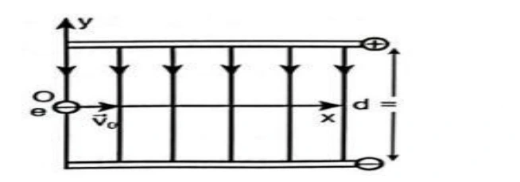{ loading=lazy }

??? success "Đáp án và lời giải"
    **Đáp án:** $82{,}6$

    **Hướng dẫn giải:**

    Electron chịu tác dụng của lực điện trường

    Phương trình quỹ đạo theo phương oy là

    Khi electron chạm bản dương thì

#### Bài 13

<!-- source-id: BT-Chuong-III-p80-q8-206 -->

Hai bản kim loại có kích thước lớn và bằng nhau, đặt song song với nhau, cách nhau một khoảng
 như hình vẽ. Hiệu điện thế giữa hai bản phẳng là 48 V. Một electron
(
 ) bay vào chính giữa hai bản phẳng theo phương vuông góc với các
đường sức điện với vận tốc 200 m/s. Bỏ qua điện trường của Trái Đất, lực cản môi trường, trọng lực tác
dụng lên electron. Tìm tầm xa theo phương ox là bao nhiêu µicro met? Kết quả làm tròn đến hàng phần
mười.

d
24cm

19
19
q
1,6 10
C,m
9,1 10
kg


o
v
dF
qE


2
2
2
F
q E
1
1
1
y
at
t
t
2
2 m
2 m

s
19
2
2
8
31
48
U
1,6 10
q
1
d
1
0,24
d
y
t
t
0,12
t
8,26 10
s
82,6n
2
m
2
2
9,1 10






d
24cm

19
19
q
1,6 10
C,m
9,1 10
kg



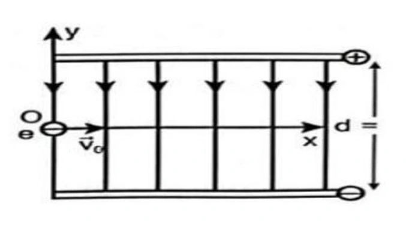{ loading=lazy }

??? success "Đáp án và lời giải"
    **Đáp án:** $16{,}5$
    **Hướng dẫn giải:**

    Dùng $F=qE$, $a=qE/m$ và xét dấu của $q$ để xác định chiều; khi cần kết hợp định lí động năng $\Delta W_\mathrm{đ}=qU$.

    Electron chịu tác dụng của lực điện trường
    Phương trình quỹ đạo theo phương oy là
    Khi electron chạm bản dương thì
    Tầm xa theo phương ox là

    Vậy kết quả cần tìm là **$16{,}5$**.
#### Bài 14

<!-- source-id: BT-Chuong-III-p91-q2-230 -->

Cho một hạt nhân nguyên tử helium chuyển động ngược chiều đường sức điện của một điện trường
đều có tốc độ ban đầu là
. Sau khi chuyển động được
 trong điện trường thì hạt dừng lại.
Một cách gần đúng, có thể xem như hạt chỉ chịu tác dụng của lực điện. Biết rằng hạt nhân nguyên tử helium
có 2 proton và khối lượng của hạt nhân này là
. Điện tích của proton là
. Cường
độ điện trường có độ lớn gần bằng
, giá trị của
 là bao nhiêu ? (Kết quả làm tròn đến hàng
đơn vị).

??? success "Đáp án và lời giải"
    **Đáp án:** $26$
    **Hướng dẫn giải:**

    Dùng $F=qE$, $a=qE/m$ và xét dấu của $q$ để xác định chiều; khi cần kết hợp định lí động năng $\Delta W_\mathrm{đ}=qU$.

    Chọn chiều dương là chiều của đường sức điện.
    Gia tốc của hạt bụi:
    Áp dụng định luật II Newton:

    Vậy kết quả cần tìm là **$26$**.
#### Bài 15

<!-- source-id: BT-Chuong-III-p93-q5-233 -->

Một êlectron(
 ) bay vào một điện trường đều tạo bởi hai bản tích
điện trái dấu theo chiều song song với hai bản và cách bản tích điện dương một khoảng 4 cm. Biết cường
độ điện trường giữa hai bản là E = 500 V/m. Sau bao lâu thì êlectron sẽ chạm vào bản tích điện dương? (
viết kết quả theo đơn vị ns)

??? success "Đáp án và lời giải"
    **Đáp án:** $30$
    **Hướng dẫn giải:**

    Dùng $F=qE$, $a=qE/m$ và xét dấu của $q$ để xác định chiều; khi cần kết hợp định lí động năng $\Delta W_\mathrm{đ}=qU$.

    Phương trình chuyển động của êlectron trên Oy:
    êlectron sẽ chạm vào bản tích điện dương

    Vậy kết quả cần tìm là **$30$**.
#### Bài 16

<!-- source-id: BT-Chuong-III-p109-q30-264 -->

Một electron di chuyển không vận tốc đầu được một đoạn 1 cm dọc theo một đường sức điện,
dưới tác dụng của lực điện trong một điện trường đều có cường độ 1 000 V/m. Hãy xác định công của lực
điện theo đơn vị 10−18 J (Làm tròn kết quả đến hàng phần mười).

??? success "Đáp án và lời giải"
    **Đáp án:** $1{,}6$

    **Hướng dẫn giải:**

    Do electron di chuyển không vận tốc đầu và dọc theo một đường sức điện nên nó sẽ di chuyển về phía
    bản dương.

    Khi đó, 𝑑 ngược hướng 𝐸⃗ (d &lt; 0)
    Công của lực điện: 𝐴= 𝑞𝐸𝑑= −1, 6.10−19. 1000. (−0,01) = 1, 6.10−18 J.
    Dùng dữ kiện sau để tính câu 31, 32, 33:

    Một điện tích điểm q = − 4.10−8 C di chuyển dọc theo các cạnh của tam giác MNP, vuông tại P, trong
    điện trường đều có cường độ 200 V/m. Cạnh MP = 10 cm, MP
    ⃗⃗⃗⃗⃗⃗ cùng hướng E⃗ ; NP = 8 cm. Môi trường là
    không khí.

#### Bài 17

<!-- source-id: BT-Chuong-III-p110-q36-273 -->

Xét điện trường đều tạo bởi hai bản kim loại đặt song song, cách nhau 2 cm có cường độ điện
trường bằng 5.103 V/m. Một hạt bụi mịn có điện tích q = 3.10−19C lọt vào chính giữa khoảng điện trường
đều giữa hai bản kim loại. Coi tốc độ hạt bụi khi bắt đầu vào điện trường đều bằng 0, bỏ qua lực cản của
môi trường. Động năng của hạt bụi khi va chạm với bản nhiễm điện âm là bao nhiêu 10−17 J? Chọn mốc thế
năng tại bản kim loại tích điện âm.

??? success "Đáp án và lời giải"
    **Đáp án:** Hướng dẫn giải:

    **Hướng dẫn giải:**
    Chọn mốc thế năng điện tại bản kim loại tích điện âm.
    Thế năng điện của điện tích q tại điểm chính giữa hai bản phẳng là:
    𝑊= 𝑞𝐸𝑑= 3. 10−19. 5. 103.
    0,02
    2 = 1,5. 10−17 J.
    Áp dụng định luật bảo toàn năng lượng: W = Wđ  Wđ = 1, 5.10−17 J.
    Đáp án:
    1
    ,
    5

    17

#### Bài 18

<!-- source-id: BT-Chuong-III-p111-q37-274 -->

Một ion âm OH− có khối lượng 2,833.10−26 kg được thổi ra từ máy lọc không
khí với vận tốc 10 m/s cách mặt đất 80 cm ở nơi có điện trường của Trái Đất bằng 120
V/m. Dưới tác dụng của lực điện, sau một thời gian, ion đang chuyển động với vận tốc
0,5 m/s ở vị trí cách mặt đất 1,5 m. Hãy xác định công cản mà môi trường đã thực hiện
trong quá trình dịch chuyển của ion nói trên theo đơn vị 10−17 J (làm tròn kết quả đến
hàng phần mười).
Chọn mốc thế năng tại mặt đất.

??? success "Đáp án và lời giải"
    **Đáp án:** Hướng dẫn giải:

    **Hướng dẫn giải:**
    Chọn mốc thế năng điện tại mặt đất.
    Cơ năng của ion âm OH− ở độ cao 80 cm = 0,8 m so với mặt đất.
    𝑊1 = 𝑞. 𝐸. 𝑑1 + 1
    2 . 𝑚𝑣1
    2
    Cơ năng của ion âm OH− ở độ cao 1,5 m so với mặt đất.
    𝑊2 = 𝑞. 𝐸. 𝑑2 + 1
    2 . 𝑚𝑣2
    2
    Công cản mà môi trường đã thực hiện bằng độ biến thiên cơ năng:
    𝐴𝑐ả𝑛= 𝑊2 −𝑊1 = 𝑞. 𝐸(𝑑2 −𝑑1) + 1
    2 𝑚(𝑣2
    2 −𝑣1
    2)
    1
    2 . 2,833. 10−26. (0,52 −102) ≈−1,3. 10−17 J.
    Đáp án:
    −
    1
    ,
    3

    18

#### Bài 19

<!-- source-id: BT-Chuong-III-p120-q5-301 -->

Xét điện trường đều tạo bởi hai bản kim loại đặt song song, cách nhau 4 cm có cường độ điện trường
bằng 5.104 V/m. Một hạt bụi mịn có điện tích q = 3.10−19C lọt vào chính giữa khoảng điện trường đều
giữa hai bản kim loại. Coi tốc độ hạt bụi khi bắt đầu vào điện trường đều bằng 0, bỏ qua lực cản của môi
trường. Động năng của hạt bụi khi va chạm với bản nhiễm điện âm là bao nhiêu 10−16 J? Chọn mốc thế
năng điện tại bản kim loại tích điện âm.

??? success "Đáp án và lời giải"
    **Đáp án:** 3

    **Hướng dẫn giải:**
    Chọn mốc thế năng điện tại bản kim loại tích điện âm.
    Thế năng điện của điện tích q tại điểm chính giữa hai bản phẳng là:
    𝑊= 𝑞𝐸𝑑= 3. 10−19. 5. 104.
    0,04
    2 = 3. 10−16 J.
    Áp dụng định luật bảo toàn năng lượng: W = Wđ  Wđ = 3. 10−16 J.

#### Bài 20

<!-- source-id: BT-Chuong-III-p120-q6-302 -->

Hình vẽ là đồ thị biểu diễn sự thay đổi tốc độ theo độ cao của một electron chuyển động từ điểm A
đến điểm B theo phương thẳng đứng trong điện trường của Trái Đất. Bỏ qua lực cản của không khí. Tính
cường độ điện trường của Trái Đất tại điểm A (Làm tròn đến hàng đơn vị).
Cho, điện tích và khối lượng của electron lần lượt là −1,6. 10−19 C; 9,1. 10−31 kg. Chọn mốc thế năng tại
mặt đất.

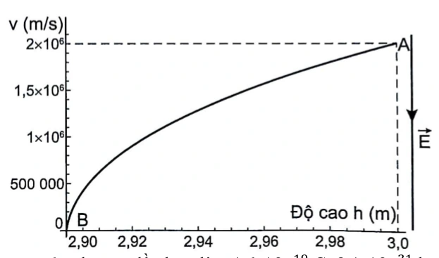{ loading=lazy }

??? success "Đáp án và lời giải"
    **Đáp án:** $114$

    **Hướng dẫn giải:**
    Chọn mốc thế năng tại mặt đất.
    1
    2 𝑚𝑣𝐴
    2.
    1
    2 𝑚𝑣𝐵
    2.
    Áp dụng định luật bảo toàn cơ năng:
    𝑊𝐴= 𝑊𝐵⇔𝑞𝐸𝑑𝐴+ 1
    2 𝑚𝑣𝐴
    2 = 𝑞𝐸𝑑𝐵+ 1
    2 𝑚𝑣𝐵
    2
     𝐸=
    𝑚(𝑣𝐵2−𝑣𝐴2)
    2𝑞(𝑑𝐴−𝑑𝐵) =
    9,1.10−31.(02−(2.106)
    2)
    2.(−1,6.10−19).(3−2,9) ≈114 V/m.
    ---HẾT---

    CHƯƠNG 3 – ĐIỆN TRƯỜNG
    BÀI 19 : ĐIỆN THẾ

    • Yêu cầu cần đạt (Trích từ CTGDPT Vật lí 2018):
    A
    q; mối liên hệ cường độ điện trường với điện thế.
    • Cấu trúc nội dung:
    I. TÓM TẮT LÝ THUYẾT …………………………………………………………………
    Lý thuyết chung của chủ đề + Phương pháp giải kèm ví dụ.
    II. BÀI TẬP PHÂN DẠNG THEO MỨC ĐỘ………………………………………………..
     (Theo cấu trúc định dạng đề thi kỳ thi tốt nghiệp trung học phổ thông từ năm 2025 – Quyết định số 764/QĐ -
    BGDĐT)
    1. Câu trắc nhiệm nhiều phương án lựa chọn
    2. Câu trắc nghiệm đúng sai
    3. Câu trắc nghiệm trả lời ngắn

#### Bài 21

<!-- source-id: BT-Chuong-III-p139-q5-343 -->

Một hạt bụi khối lượng 3,6.10-15 kg mang điện tích q = 6.10-18 C nằm lơ lửng giữa hai tấm kim loại
phẳng song song nằm ngang cách nhau 2cm và nhiễm điện trái dấu. Lấy g = 10m/s2. Hiệu điện thế giữa hai
tấm kim loại bằng bao nhiêu V ?

??? success "Đáp án và lời giải"
    **Đáp án:** $120$

    **Hướng dẫn giải:**
    Hạt bụi nằm lơ lửng giữa hai tấm kim loại:
     𝑃= 𝐹đ
    ⟺𝑚𝑔= 𝑞𝐸
    ⟹𝐸= 𝑚𝑔
    𝑞= 3,6.10−15 × 10
    6.10−18
    = 6000 𝑉/𝑚.
    Hiệu điện thế đặt giữa hai tấm kim loại:
    𝑈= 𝐸. 𝑑= 6000 × 0,02 = 120 𝑉.

#### Bài 22

<!-- source-id: BT-Chuong-III-p147-q4-370 -->

Một điện tích điểm q = + 10μC chuyển động từ đỉnh B đến đỉnh C của tam giác đều ABC, nằm trong
điện trường đều có cường độ 9000V/m có đường sức điện trường song song với cạnh BC có chiều từ C đến

B. Biết cạnh tam giác bằng 20cm, công của lực điện trường khi di chuyển điện tích trên theo đoạn gấp khúc BAC
bằng bao nhiêu mJ?

??? success "Đáp án và lời giải"
    **Đáp án:** $-18$

    **Hướng dẫn giải:**
    Do điểm đầu tại B và điểm cuối tại C nên 𝑑= −𝐵𝐶= −0,2 𝑚. Công của lực điện trường khi di chuyển điện
    tích theo đường gấp khúc BAC:
    𝐴= 𝑞𝑈𝐵𝐶= 𝑞. 𝐸. 𝐵𝐶= 10.10−6 × 9000 × (−0,2) = − 18 𝑚𝐽.

#### Bài 23

<!-- source-id: BT-Chuong-III-p147-q5-371 -->

Một prôtôn mang điện tích + 1,6.10-19C chuyển động dọc theo phương của đường sức một điện trường
đều. Khi nó đi được quãng đường 5 cm thì lực điện thực hiện một công là + 1,6.10-21J. Tính cường độ điện
trường đều này.

??? success "Đáp án và lời giải"
    **Đáp án:** $0{,}2$

    **Hướng dẫn giải:**
    Cường độ điện trường trong trường hợp này:
    𝐴= 𝑞𝐸𝑑⟹𝐸= 𝐴
    𝑞𝑑=
    1,6.10−21
    1,6.10−19 × 0,05 = 0,2 𝑉/𝑚.

#### Bài 24

<!-- source-id: BT-Chuong-III-p148-q6-372 -->

Trong đèn hình của máy thu hình, các electron được tăng tốc bởi hiệu điện thế U. Khi đập vào màn
hình thì người ta thu nhận được vận tốc của nó là 133. 106 m/s. Bỏ qua vận tốc ban đầu của nó, hiệu điện thế
U trong trường hợp này có độ lớn bằng bao nhiêu kV?
??? success "Đáp án và lời giải"
    **Đáp án:** $50{,}3$
    **Hướng dẫn giải:**

    Dùng $F=qE$, $a=qE/m$ và xét dấu của $q$ để xác định chiều; khi cần kết hợp định lí động năng $\Delta W_\mathrm{đ}=qU$.

    Độ biến thiên động năng chính bằng công của lực điện trường:
    2|𝑒| = 9,1. 10−31 × (133. 106)2
    CHỦ ĐỀ 20 – TỤ ĐIỆN
    I . TÓM TẮT LÝ THUYẾT – PHƯƠNG PHÁP GIẢI
    I. TỤ ĐIỆN TỤ, CÁCH TÍCH ĐIỆN CHO TỤ ĐIỆN:
    1. Tụ điện là gì?

    Vậy kết quả cần tìm là **$50{,}3$**.
### Nhận biết — Trắc nghiệm 4 lựa chọn

#### Bài 25

<!-- source-id: BT-Chuong-III-p69-q15-188 -->

Hai bản kim loại phẳng nằm ngang song song cách nhau 10 cm có hiệu điện thế giữa hai bản là
100V. Một êlectrôn chuyển động dọc theo đường sức về bản âm. Biết điện trường giữa hai bản là điện
trường đều và bỏ qua tác dụng của trọng lực. Gia tốc của nó bằng

A. –1,76.
 m/s2.

B. 1,59.
 m/s2.

C. –2,76.
 m/s2.

D. 1,52.
 m/s2.

??? success "Đáp án và lời giải"
    **Đáp án:** A
    **Hướng dẫn giải:**

    Vì electron mang điện tích âm nên lực điện trường
     tác dụng lên electron sẽ ngược chiều với chiều điện
    trường
     nghĩa là ngược chiều với chiều chuyển động của electron nên electron sẽ chuyển động chậm
    dần đều, cùng chiều với chiều đường sức điện trường với gia tốc:

#### Bài 26

<!-- source-id: BT-Chuong-III-p69-q16-189 -->

Một hạt khối lượng 0,4 g mang điện tích +2.10-6 C được đặt vào điện trường đều có cường độ
45.103 V/m, vectơ cường độ điện trường hướng thẳng đứng từ dưới lên trên. Lấy g=10 m/s2. Khi đó hạt sẽ
chuyển động

A. đi xuống với gia tốc 9,775 m/s2.

B. đi lên với gia tốc 9,775 m/s2.

C. đi xuống với gia tốc 215 m/s2.

D. đi lên với gia tốc 215 m/s2.

??? success "Đáp án và lời giải"
    **Đáp án:** D
    **Hướng dẫn giải:**

    Dùng $F=qE$, $a=qE/m$ và xét dấu của $q$ để xác định chiều; khi cần kết hợp định lí động năng $\Delta W_\mathrm{đ}=qU$.

    Hạt bụi nằm cân bằng trong điện trường chịu tác dụng của lực điện và trọng lực:
    hạt sẽ chuyển động đi lên với gia tốc

    Đối chiếu kết quả với các lựa chọn, phương án phù hợp là **D. đi lên với gia tốc 215 m/s2.**
#### Bài 27

<!-- source-id: BT-Chuong-III-p70-q17-190 -->

Một hạt prôtôn chuyển động ngược chiều đường sức điện trường đều với tốc độ ban đầu 4.105
m/s. Cho cường độ điện trường đều có độ lớn E = 3000 V/m, e = 1,6.10–19 C, mp = 1,67.10– 27 kg. Bỏ qua
tác dụng của trọng lực lên prôtôn. Sau khi đi được đoạn đường 3 cm, tốc độ của prôtôn là

A. 3,98.105 m/s.

B. 5,64.105 m/s.

C. 3,78.105 m/s.

D. 4,21.105 m/s.

??? success "Đáp án và lời giải"
    **Đáp án:** C
    **Hướng dẫn giải:**
    Vì prôtôn mang điện tích dương nên lực điện trường
     tác dụng lên prôtôn sẽ cùng chiều với chiều điện
    trường
     nghĩa là ngược chiều với chiều chuyển động của prôtôn nên prôtôn sẽ chuyển động chậm dần
    đều, ngược chiều đường sức điện trường với gia tốc:

    Tốc độ của prôtôn sau khi đi được đoạn được 3 cm:

#### Bài 28

<!-- source-id: BT-Chuong-III-p70-q18-191 -->

Một êlectrôn chuyển động dọc theo hướng đường sức của một điện trường đều có cường độ 100
V/m với vận tốc ban đầu là 300 km/s. Quãng đường đi được kể từ thời điểm ban đầu cho đến khi vận tốc
của êlectron bằng không bằng

A. 2,56 cm.

B. 25,6 cm.

C. 2,56 mm.

D. 2,56 m.

??? success "Đáp án và lời giải"
    **Đáp án:** C
    **Hướng dẫn giải:**

    Dùng $F=qE$, $a=qE/m$ và xét dấu của $q$ để xác định chiều; khi cần kết hợp định lí động năng $\Delta W_\mathrm{đ}=qU$.

    Vì electron mang điện tích âm nên lực điện trường
    tác dụng lên electron sẽ ngược chiều với chiều điện
    nghĩa là ngược chiều với chiều chuyển động của electron nên electron sẽ chuyển động chậm dần
    quãng đường đi được đến khi vận tốc bằng không:

    Đối chiếu kết quả với các lựa chọn, phương án phù hợp là **C. 2,56 mm.**
#### Bài 29

<!-- source-id: BT-Chuong-III-p71-q19-192 -->

Một êlectron chuyển động với tốc độ ban đầu 1,6.106 m/s chuyển động vào vùng điện trường đều
theo phương song song với hai bản và ở chính giữa khoảng cách hai bản như hình. Biết chiều dài mỗi bản
là 2 cm và khoảng cách giữa hai bản là 1 cm. Giữa hai bản có điện trường hướng từ trên xuống, điện trường
bên ngoài hai bản bằng 0. Biết êlectron di chuyển đến vị trí mép ngoài của tấm bản phía trên. Độ lớn cường
độ điện trường giữa hai bản bằng

A. 1000 V/m.

B. 500 V/m.

C. 364 V/m.

D. 728 V/m.

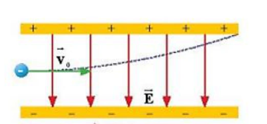{ loading=lazy }

??? success "Đáp án và lời giải"
    **Đáp án:** C
    **Hướng dẫn giải:**
    Thời gian electron chuyển động trong điện trường cũng chính là thời gian electron đi đến mép ngoài của
    tấm bản phía trên:

    Do lúc đầu electron ở vị trí chính giữa khoảng cách hai bản nên quãng đường electron di chuyển theo
    phương thẳng đứng là

    Theo phương Oy, electron chuyển động thẳng nhanh dần đều:

    Độ lớn cường độ điện trường:

#### Bài 30

<!-- source-id: BT-Chuong-III-p71-q20-193 -->

Khói thải từ một số nhà máy (hình vẽ) có thể chứa nhiều hạt bụi gây ô nhiễm
môi trường. Để giảm thiểu tác hại của bụi người ta dùng máy lọc bụi tĩnh điện theo
nguyên tắc cơ bản sau: Hai bản kim loại phẳng tích điện trái dấu và đặt song song
với nhau trong không khí được đặt thẳng đứng, cách nhau d = 20 cm, chiều cao mỗi
bản là . Hiệu điện thế giữa hai bản U = 4.
 V. Không khí chứa bụi được thổi đi
lên theo phương thẳng đứng qua khoảng giữa hai bản kim loại. Cho rằng mỗi hạt bụi
có m
 ;
. Khi bắt đầu đi vào giữa hai bản kim loại, hạt
bụi có
 theo phương thẳng đứng hướng lên. Bỏ qua tác dụng của trọng lực. Tìm điều kiện của
 để mọi hạt bụi đều bị hút dính vào bản kim loại.

A. 12 m.

B. 6 m.

C. 10 m.

D. 24 m.

{ loading=lazy }

??? success "Đáp án và lời giải"
    **Đáp án:** A
    **Hướng dẫn giải:**

    Dùng $F=qE$, $a=qE/m$ và xét dấu của $q$ để xác định chiều; khi cần kết hợp định lí động năng $\Delta W_\mathrm{đ}=qU$.

    Để mọi hạt bụi dính vào hai bản kim loại thì quãng đường đi của các hạt bụi (theo phương thẳng đứng)
    là L phải thỏa mãn điều kiện:

    Đối chiếu kết quả với các lựa chọn, phương án phù hợp là **A. 12 m.**
#### Bài 31

<!-- source-id: BT-Chuong-III-p82-q1-207 -->

Điện trường đều là điện trường mà cường độ điện trường của nó

A. có hướng như nhau tại mọi điểm.

B. có hướng và độ lớn như nhau tại mọi điểm.

C. có độ lớn như nhau tại mọi điểm.

D. có độ lớn giảm dần theo thời gian.

??? success "Đáp án và lời giải"
    **Đáp án:** B
    **Hướng dẫn giải:**

    Dùng $F=qE$, $a=qE/m$ và xét dấu của $q$ để xác định chiều; khi cần kết hợp định lí động năng $\Delta W_\mathrm{đ}=qU$.

    Đối chiếu kết quả với các lựa chọn, phương án phù hợp là **B. có hướng và độ lớn như nhau tại mọi điểm.**
#### Bài 32

<!-- source-id: BT-Chuong-III-p82-q5-211 -->

Đặt một điện tích âm, khối lượng nhỏ vào một điện trường đều rồi thả nhẹ. Điện tích này sẽ chuyển
động

A. dọc theo chiều của các đường sức điện trường.

B. ngược chiều đường sức điện trường.

C. vuông góc với đường sức điện trường.

D. theo một quỹ đạo bất kì.

??? success "Đáp án và lời giải"
    **Đáp án:** B
    **Hướng dẫn giải:**

    Dùng $F=qE$, $a=qE/m$ và xét dấu của $q$ để xác định chiều; khi cần kết hợp định lí động năng $\Delta W_\mathrm{đ}=qU$.

    Đối chiếu kết quả với các lựa chọn, phương án phù hợp là **B. ngược chiều đường sức điện trường.**
#### Bài 33

<!-- source-id: BT-Chuong-III-p83-q10-216 -->

Trong ống phóng tia X, khoảng cách giữa hai cực của ống phóng tia X (Hình 18.1) bằng 2 cm ,
hiệu điện thế giữa hai cực là 100kV . Một electron có điện tích
19
1,6.10
C
e
−
= −
 bật ra khỏi bản cực âm
(catôt) bay vào điện trường giữa hai bản cực. Lực điện tác dụng lên electron đó bằng

Hinh 18.1. Ống phóng tia X trong máy chup X quang chẩn đoán hình ảnh

A. 13
8 10
 N
−

.

B. 18
8 10
 N
−

.

C. 17
3,2 10
 N
−

.

D. 15
8 10
 N
−

.

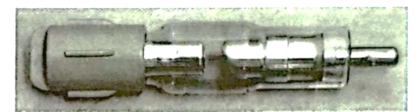{ loading=lazy }

??? success "Đáp án và lời giải"
    **Đáp án:** A
    **Hướng dẫn giải:**

    Dùng $F=qE$, $a=qE/m$ và xét dấu của $q$ để xác định chiều; khi cần kết hợp định lí động năng $\Delta W_\mathrm{đ}=qU$.

    Đối chiếu kết quả với các lựa chọn, phương án phù hợp là **A. 13 8 10 N −  .**
#### Bài 34

<!-- source-id: BT-Chuong-III-p84-q12-218 -->

Một êlectron được phóng đi từ O với vận tốc ban đầu
0v dọc theo chiều đường sức của một điện
trường đều cường độ E

. Quãng đường xa nhất mà nó di chuyển được trong điện trường cho tới khi vận
tốc của nó bằng không có biểu thức

A. 2
o
mv
2eE .

B. 2
o
2eE
mv .

C. 2
o
eE
mv .

D. 2
o
me
Ev .

??? success "Đáp án và lời giải"
    **Đáp án:** A
    **Hướng dẫn giải:**

    Dùng $F=qE$, $a=qE/m$ và xét dấu của $q$ để xác định chiều; khi cần kết hợp định lí động năng $\Delta W_\mathrm{đ}=qU$.

    Ta có: gia tốc của chuyển động:

    Đối chiếu kết quả với các lựa chọn, phương án phù hợp là **A. 2 o mv 2eE .**
#### Bài 35

<!-- source-id: BT-Chuong-III-p84-q14-220 -->

Một hạt bụi khối lượng 10-8 g mang điện tích 5.10-5C chuyển động trong điện trường đều theo một
đường sức điện từ điểm M đến điểm N thì vật vận tốc tăng từ 2.104 m/s đến 3,6.104 m/s. Biết đoạn đường
MN dài 5cm, cường độ điện trường đều là

A. 2462 V/m

B. 1685 V/m

C. 2175 V/m

D. 1792 V/m.

??? success "Đáp án và lời giải"
    **Đáp án:** D
    **Hướng dẫn giải:**

    Dùng $F=qE$, $a=qE/m$ và xét dấu của $q$ để xác định chiều; khi cần kết hợp định lí động năng $\Delta W_\mathrm{đ}=qU$.

    Cách 1: Gia tốc của hạt bụi:
    Áp dụng định luật II Newton:
    Cách 2: Sau khi học xong bài 19 ta có thể Áp dụng định lí động năng:

    Đối chiếu kết quả với các lựa chọn, phương án phù hợp là **D. 1792 V/m.**
#### Bài 36

<!-- source-id: BT-Chuong-III-p85-q16-222 -->

Hai bản kim loại tích điện trái dấu có các bản song song đặt nằm ngang cách nhau 4 cm, chiều dài
các bản là 10 cm, hiệu điện thế giữa hai bản là 20 V. Một êlectron(
 ) bay
từ điểm O cách đều hai bản với vận tốc ban đầu là
 song song với các bản. Để êlectron có thể ra khỏi
hai bản thì giá trị nhỏ nhất của
 gần nhất với giá trị nào sau đây?

0
=
+
→
→
P
Fđ
19
31
q
1,6.10
;m
9,1.10
kg
−
−
= −
=
0v

0
v

A. 4,7.106 m/s.

B. 4,7.107 m/s.

C. 4,7.105m/s.

D. 4,7.104 m/s.

??? success "Đáp án và lời giải"
    **Hướng dẫn giải:**

    Dùng $F=qE$, $a=qE/m$ và xét dấu của $q$ để xác định chiều; khi cần kết hợp định lí động năng $\Delta W_\mathrm{đ}=qU$.

    Bỏ qua trọng lực P, phân tích chuyển động của e theo phương Ox, Oy:
#### Bài 37

<!-- source-id: BT-Chuong-III-p86-q17-223 -->

Để làm lệch hướng chuyển động của êlectron một góc α, người ta thiết lập một điện trường đều
có cường độ E và có hướng vuông góc với hướng chuyển động ban đầu của êlectron trong thời gian t. Khi
t = 1 ms thì
. Muốn êlectron lệch hướng chuyển động một góc
 thì thời gian thiết lập điện
trường là

A. 3,48 ms.

B. 2 ms.

C. 3 ms.

D. 1,73 ms.

??? success "Đáp án và lời giải"
    **Đáp án:** C
    **Hướng dẫn giải:**

    Dùng $F=qE$, $a=qE/m$ và xét dấu của $q$ để xác định chiều; khi cần kết hợp định lí động năng $\Delta W_\mathrm{đ}=qU$.

    Vận tốc electron theo các phương Ox, Oy

    Đối chiếu kết quả với các lựa chọn, phương án phù hợp là **C. 3 ms.**
#### Bài 38

<!-- source-id: BT-Chuong-III-p101-q2-236 -->

Công của lực điện trường tác dụng lên một điện tích q chuyển động từ điểm M đến điểm N trong
một điện trường đều không phụ thuộc vào

A. cung đường dịch chuyển.

B. điện tích q.

C. vector cường độ điện trường.

D. vị trí của N.

??? success "Đáp án và lời giải"
    **Đáp án:** A
    **Hướng dẫn giải:**

    Dùng $F=qE$, $a=qE/m$ và xét dấu của $q$ để xác định chiều; khi cần kết hợp định lí động năng $\Delta W_\mathrm{đ}=qU$.

    Đối chiếu kết quả với các lựa chọn, phương án phù hợp là **A. cung đường dịch chuyển.**
#### Bài 39

<!-- source-id: BT-Chuong-III-p101-q3-237 -->

Một điện tích q chuyển động trong điện trường đều theo một đường cong kín. Gọi công của lực
điện trong chuyển động đó là A thì

A. A &gt; 0 nếu q &gt; 0.

B. A &gt; 0 nếu q &lt; 0.

C. A  0 nếu điện trường không đổi.

D. A = 0.

??? success "Đáp án và lời giải"
    **Đáp án:** D
    **Hướng dẫn giải:**

    Dùng $F=qE$, $a=qE/m$ và xét dấu của $q$ để xác định chiều; khi cần kết hợp định lí động năng $\Delta W_\mathrm{đ}=qU$.

    Đối chiếu kết quả với các lựa chọn, phương án phù hợp là **D. A = 0.**
#### Bài 40

<!-- source-id: BT-Chuong-III-p102-q8-242 -->

Một điện tích q chuyển động từ điểm M đến Q, đến N, đến P trong điện trường đều như hình vẽ.
Đáp án nào là sai khi nói về mối quan hệ giữa công của lực điện trường dịch chuyển điện tích trên các đoạn
đường?

A. AMQ = – AQN.

B. AMN = ANP.

C. AQP = AQN.

D. AMQ = AMP.

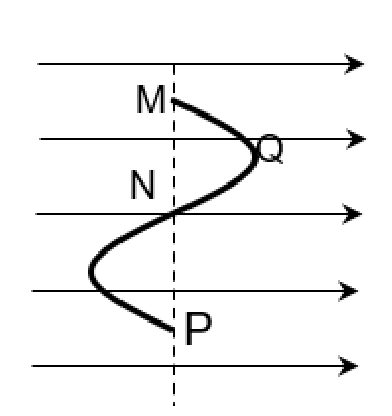{ loading=lazy }

??? success "Đáp án và lời giải"
    **Đáp án:** D
    **Hướng dẫn giải:**

    Dùng $F=qE$, $a=qE/m$ và xét dấu của $q$ để xác định chiều; khi cần kết hợp định lí động năng $\Delta W_\mathrm{đ}=qU$.

    Đối chiếu kết quả với các lựa chọn, phương án phù hợp là **D. AMQ = AMP.**
#### Bài 41

<!-- source-id: BT-Chuong-III-p106-q25-259 -->

Một electron chuyển động dọc theo đường sức của một điện trường đều, cường độ điện trường
có độ lớn E = 200 V/m. Khối lượng và điện tích của electron lần lượt là 9, 1.10−31 kg; −1,6.10−19

C. Tính
từ thời điểm tốc độ của electron là 3.105 m/s đến khi tốc độ của nó bằng 0 thì nó đã đi được đoạn đường
bằng

A. 5,12 mm.

B. 2,56 mm.

C. 1,28 mm.

D. 10,24 mm.

??? success "Đáp án và lời giải"
    **Đáp án:** C
    **Hướng dẫn giải:**

    Dùng $F=qE$, $a=qE/m$ và xét dấu của $q$ để xác định chiều; khi cần kết hợp định lí động năng $\Delta W_\mathrm{đ}=qU$.

    Áp dụng định lí động năng, ta có:

    Đối chiếu kết quả với các lựa chọn, phương án phù hợp là **C. Tính từ thời điểm tốc độ của electron là 3.105 m/s đến khi tốc độ của nó bằng 0 thì nó đã đi được đoạn đường bằng**
#### Bài 42

<!-- source-id: BT-Chuong-III-p112-q2-276 -->

Một electron di chuyển không vận tốc đầu được một đoạn 1 cm dọc theo một đường sức điện, dưới
tác dụng của một lực điện trong một điện trường đều có cường độ 1 000 V/m. Công của lực điện khi đó
bằng

A. 1,6. 10−18 J.

B. −1,6. 10−18 J.

C. −1,6. 10−16 J.

D. 1,6. 10−16 J.

??? success "Đáp án và lời giải"
    **Đáp án:** A
    **Hướng dẫn giải:**
    Công của lực điện: 𝐴= 𝑞𝐸𝑑= −1, 6.10−19. 1000. (−0,01) = 1, 6.10−18 J.

#### Bài 43

<!-- source-id: BT-Chuong-III-p113-q8-282 -->

Một điện tích điểm q = 10 μC chuyển động từ đỉnh B đến đỉnh C của tam giác đều ABC, nằm trong
điện trường đều có cường độ 5 000 V/m có đường sức điện song song với cạnh BC có chiều từ B đến

C. Biết tam giác có cạnh bằng 10 cm. Công của lực điện trường khi di chuyển điện tích trên theo đoạn gấp
khúc BAC bằng

A. 5.10−3 J.

B. – 2,5.10−3 J.

C. – 5.10−3 J.

D. 2,5.10−3 J.

??? success "Đáp án và lời giải"
    **Đáp án:** A
    **Hướng dẫn giải:**
    Công của lực điện trường khi di chuyển điện tích trên theo đoạn gấp khúc BAC bằng:
    𝐴𝐵𝐴𝐶= 𝐴𝐵𝐶= 𝑞. 𝐸. 𝑑𝐵𝐶= 𝑞. 𝐸. 𝐵𝐶
    ̅̅̅̅ = 10. 10−6. 5000.0,1 = 5. 10−3 J.

#### Bài 44

<!-- source-id: BT-Chuong-III-p113-q9-283 -->

Một điện tích điểm q = 10 μC chuyển động từ đỉnh B đến đỉnh C của tam giác đều ABC nằm trong
điện trường đều có cường độ 5 000 V/m. Đường sức của điện trường này song song với cạnh BC và có
chiều từ C đến

B. Cạnh của tam giác bằng 10 cm. Công của lực điện trường khi điện tích chuyển động trong
hai trường hợp, q chuyển động theo đoạn thẳng BC và chuyển động theo đoạn gấp khúc BAC là

A. ABC = − 5.10−4 J, ABAC = − 10.10−4J.

B. ABC = −2, 5.10−3 J, ABAC = −2,5.10−3J.

C. ABC = − 5.10−3 J, ABAC = − 5.10−3 J.

D. ABC = − 5.10−4 J, ABAC = − 5.10−4 J.

??? success "Đáp án và lời giải"
    **Đáp án:** C
    **Hướng dẫn giải:**

    Dùng $F=qE$, $a=qE/m$ và xét dấu của $q$ để xác định chiều; khi cần kết hợp định lí động năng $\Delta W_\mathrm{đ}=qU$.

    𝑑𝐵𝐶= −𝐵𝐶= −10 cm ⇒𝐴𝐵𝐶= 𝑞𝐸𝑑𝐵𝐶= 10. 10−6. 5 000. (−0,1) = −5.10−3 J.

    Đối chiếu kết quả với các lựa chọn, phương án phù hợp là **C. ABC = − 5.10−3 J, ABAC = − 5.10−3 J.**
#### Bài 45

<!-- source-id: BT-Chuong-III-p114-q10-284 -->

Một điện tích âm bay theo phương của một đường sức điện trường. Lúc ở điểm A nó có tốc độ
2,5.104 m/s, khi đến điểm B tốc độ của nó bằng không. Biết electron có khối lượng 2,672.10-26 kg. Thế năng
điện tại A bằng − 8.10−17 J. Thế năng điện tại B bằng

A. − 8,5.10−17 J.

B. − 7,2.10−17 J.

C. 7,2.10−17 J.

D. 8,5.10−17 J.

??? success "Đáp án và lời giải"
    **Đáp án:** B
    **Hướng dẫn giải:**
    Áp dụng định lí động năng, ta có:
    𝐴𝐴𝐵= 𝑊đ𝐵−𝑊đ𝐴  𝑊𝐴−𝑊𝐵= 𝑊đ𝐵−𝑊đ𝐴

     𝑊𝐴−𝑊𝐵=
    1
    2 𝑚𝑒. 𝑣𝐵
    2 −
    1
    2 𝑚𝑒. 𝑣𝐴
    2

     𝑊𝐵= 𝑊𝐴−
    1
    2 𝑚𝑒. 𝑣𝐵
    2 +
    1
    2 𝑚𝑒. 𝑣𝐴
    2

     𝑊𝐵= −8. 10−17 −
    1
    1
    2 . 2,672. 10−26. (2,5. 104)2

     𝑊𝐵≈−7,2. 10−17 J.

#### Bài 46

<!-- source-id: BT-Chuong-III-p114-q12-286 -->

Một proton chuyển động dọc theo đường sức của một điện trường đều, cường độ điện trường có
độ lớn E = 200 V/m. Khối lượng và điện tích của proton lần lượt là 1,67. 10−27 kg; 1,6.10−19

C. Tính từ
thời điểm tốc độ của proton bằng 0 đến khi tốc độ của nó bằng 3.104 m/s thì nó đã đi được đoạn đường
bằng

A. 51,2 mm.

B. 23,5 mm.

C. 12,8 mm.

D. − 12,8 mm.

??? success "Đáp án và lời giải"
    **Đáp án:** B
    **Hướng dẫn giải:**

    Dùng $F=qE$, $a=qE/m$ và xét dấu của $q$ để xác định chiều; khi cần kết hợp định lí động năng $\Delta W_\mathrm{đ}=qU$.

    Áp dụng định lí động năng, ta có:

    Đối chiếu kết quả với các lựa chọn, phương án phù hợp là **B. 23,5 mm.**
#### Bài 47

<!-- source-id: BT-Chuong-III-p115-q14-288 -->

Một electron đang bay với động năng 410 eV (1 eV = 1,6.10−19 J) theo hướng đường sức điện, từ
một điểm có thế năng điện W1 = −9,6. 10−17 J. Hãy xác định thế năng điện W2 tại điểm mà ở đó electron
dừng lại.

A. −3,04. 10−17 J.

B. −1,264. 10−16 J.

C. −1,76. 10−16 J.

D. −4. 10−17 J.

??? success "Đáp án và lời giải"
    **Đáp án:** A
    **Hướng dẫn giải:**
    Áp dụng định luật bảo toàn cơ năng:
    𝑊đ1 + 𝑊1 = 𝑊đ2 + 𝑊2  410.1,6. 10−19 + (−9,6. 10−17) = 0 + 𝑊2

     𝑊2 = −3,04. 10−17 J.

#### Bài 48

<!-- source-id: BT-Chuong-III-p115-q16-290 -->

Một electron chuyển động dọc theo đường sức của một điện trường đều. Cường độ điện trường có
độ lớn bằng 200 V/m. Vận tốc ban đầu của electron là 3.106 m/s, khối lượng và điện tích của electron lần
lượt là 9,1.10−31 kg; −1,6.10−19

C. Từ lúc bắt đầu chuyển động đến khi có vận tốc bằng 0 thì electron đã đi
được quãng đường bằng

A. 5,12 mm.

B. 0,128 m.

C. 5,12 m.

D. 1,28 mm.

??? success "Đáp án và lời giải"
    **Đáp án:** B
    **Hướng dẫn giải:**
    Áp dụng định lí động năng:
    𝐴12 = 𝑊đ2 −𝑊đ1  𝑞. 𝐸. 𝑑= 0 −
    1
    2 𝑚𝑣1
    2 (𝑣2 = 0).

     −1,6. 10−19. 200. 𝑑= −
    1
    2 . 9,1. 10−31. (3. 106)2

     𝑑≈0,128 m.

#### Bài 49

<!-- source-id: BT-Chuong-III-p116-q18-292 -->

Hai bản kim loại tích điện trái dấu, đặt song song và cách nhau 3 cm. Độ lớn cường độ điện trường
giữa hai bản là 1 000 V/m. Một electron được đặt tại bản tích điện âm, thả cho electron chuyển động dọc
theo đường sức điện. Khối lượng và điện tích của electron lần lượt là 9,1.10−31 kg; −1,6.10−19

C. Tốc độ của
electron khi chạm vào bản tích điện dương bằng

A. 3,2. 106 m/s.

B. 3,2. 106 cm/s.

C. 1,6. 106 m/s.

D. 1,6. 106 cm/s.

??? success "Đáp án và lời giải"
    **Đáp án:** A
    **Hướng dẫn giải:**
    Áp dụng định lí động năng:
    1
    2 𝑚𝑣2 −0 (𝑣0 = 0).

     𝑣= √2.𝑞.𝐸.𝑑
    𝑚
    = √2.(−1,6.10−19.1000.(−0,03))
    9,1.10−31
    ≈3,2. 106 m/s.

#### Bài 50

<!-- source-id: BT-Chuong-III-p131-q28-330 -->

Một điện tích q chuyển động từ điểm A đến B, đến C, đến D trong điện trường đều như hình vẽ. Công
của lực điện trường dịch chuyển điện tích trên các đoạn đường

A. AAB = ABC

B. AAC = ACD.

C. ABD = AAD.

D. AAB = AAD.

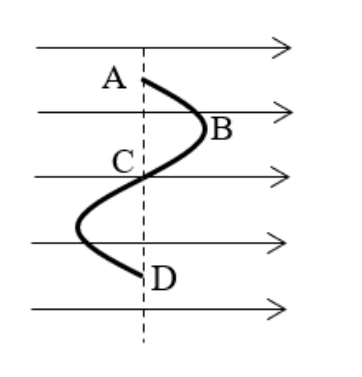{ loading=lazy }

??? success "Đáp án và lời giải"
    **Đáp án:** B
    **Hướng dẫn giải:**
    Công của lực điện dịch chuyển điện tích từ điểm này sang điểm khác
    𝐴= 𝑞𝑈= 𝑞𝐸𝑑;
    Ta thấy:
    + 𝑑𝐴𝐵= −𝑑𝐵𝐶⟹𝐴𝐴𝐵= −𝐴𝐵𝐶;
    + 𝑑𝐵𝐷≠𝑑𝐴𝐷⟹𝐴𝐵𝐷≠𝐴𝐴𝐷;
    + 𝑑𝐴𝐶= 𝑑𝐶𝐷⟹𝐴𝐴𝐶= 𝐴𝐶𝐷;
    + 𝑑𝐴𝐵≠𝑑𝐴𝐷⟹𝐴𝐴𝐵≠𝐴𝐴𝐷.

#### Bài 51

<!-- source-id: BT-Chuong-III-p132-q29-331 -->

Hai tấm kim loại phẳng nằm ngang song song cách nhau 5 cm. Hiệu điện thế giữa hai tấm là 100 V.
Một electron không vận tốc ban đầu chuyển động từ tấm tích điện âm về tấm tích điện dương, biết khối lượng
của electron là me = 9,1. 10−31 kg. Khi đến tấm tích điện dương thì electron có vận tốc là

A. 5,93. 106 m/s.

B. 3,52. 106 m/s.

C. 4,19. 106 m/s.

D. 6,85. 106 m/s.

??? success "Đáp án và lời giải"
    **Đáp án:** A
    **Hướng dẫn giải:**
    Do electron dịch chuyển từ bản âm đến bản dương: 𝑈= −100 𝑉;
    Công của lực điện để dịch chuyển electron từ bản âm sang bản dương:
    𝐴= 𝑈𝑞= (−100) × (−1,6. 10−19) = 1,6. 10−17 𝐽;
    Độ biến thiên động năng của electron chính bằng công của lực điện làm dịch chuyển electron từ bản âm đến
    bản dương:
    𝑊đ −𝑊đ0 = 𝐴
    ⟺1
    2 𝑚𝑒𝑣2 −0 = 𝐴
    ⇒𝑣= √2𝐴
    𝑚𝑒
    = √2 × 1,6. 10−17
    9,1. 10−31
    = 5,93. 106 𝑚/𝑠.

#### Bài 52

<!-- source-id: BT-Chuong-III-p140-q4-348 -->

Một điện tích q chuyển động trong điện trường không đều theo một đường cong kín. Gọi công của lực
điện trong chuyển động đó là A thì

A. A &gt; 0 nếu q &gt; 0.

B. A &gt; 0 nếu q &lt; 0.

C. A ≠ 0 nếu q &gt; 0.

D. A = 0 với mọi trường hợp.

??? success "Đáp án và lời giải"
    **Đáp án:** D
    **Hướng dẫn giải:**

    Dùng $F=qE$, $a=qE/m$ và xét dấu của $q$ để xác định chiều; khi cần kết hợp định lí động năng $\Delta W_\mathrm{đ}=qU$.

    Đối chiếu kết quả với các lựa chọn, phương án phù hợp là **D. A = 0 với mọi trường hợp.**
#### Bài 53

<!-- source-id: BT-Chuong-III-p141-q12-356 -->

Khi bay từ M đến N trong điện trường đều, electron tăng tốc động năng tăng thêm 350eV. Hiệu điện
thế UMN bằng

A. – 350 V.

B. 350 V.

C. – 150 V.

D. 150 V.

??? success "Đáp án và lời giải"
    **Đáp án:** A
    **Hướng dẫn giải:**
    UMN = A
    q =
    Wđ −Wđ0
    q
    = 350 × 1,6. 10−19
    −1,6. 10−19
    = −350 V.

#### Bài 54

<!-- source-id: BT-Chuong-III-p142-q17-361 -->

Hai tấm kim loại phẳng nằm ngang song song cách nhau 10 cm. Hiệu điện thế giữa hai tấm là 150 V.
Một electron không vận tốc ban đầu chuyển động từ tấm tích điện âm về tấm tích điện dương, biết khối lượng
của electron là me = 9,1. 10−31 kg. Khi đến tấm tích điện dương thì electron có vận tốc là

A. 5,93. 106 m/s.

B. 3,52. 106 m/s.

C. 4,19. 106 m/s.

D. 7,26. 106 m/s.

??? success "Đáp án và lời giải"
    **Đáp án:** D
    **Hướng dẫn giải:**
    Do electron dịch chuyển từ bản âm đến bản dương: 𝑈= −150 𝑉;
    Công của lực điện để dịch chuyển electron từ bản âm sang bản dương:
    𝐴= 𝑈𝑞= (−150) × (−1,6. 10−19) = 2,4. 10−17 𝐽;

    Độ biến thiên động năng của electron chính bằng công của lực điện làm dịch chuyển electron từ bản âm đến
    bản dương:
    𝑊đ −𝑊đ0 = 𝐴
    ⟺1
    2 𝑚𝑒𝑣2 −0 = 𝐴
    ⇒𝑣= √2𝐴
    𝑚𝑒
    = √2 × 2,4. 10−17
    9,1. 10−31
    = 7,26. 106 𝑚/𝑠.

### Nhận biết — Đúng/Sai

#### Bài 55

<!-- source-id: BT-Chuong-III-p75-q5-198 -->

Ống tia âm cực (CRT) là một thiết bị thường được thấy trong dao động ký điện tử cũng như màn
hình tivi, máy tính (CRT)… cho thấy mô hình của một ống tia âm cực, bao gồm hai bản kim loại phẳng có
chiều dài 8 cm, tích điện trái dấu, đặt song song và cách nhau 2 cm. Hiệu điện thế giữa hai bản kim loại là
U = 12 V. Một electron được phóng ra từ điểm A cách đều hai bản kim loại với vận tốc ban đầu có độ lớn
v0 bằng 7.106 m/s và hướng dọc theo trục của ống cho rằng bản kim loại bên dưới có điện thế lớn hơn.
Xem tác dụng của trọng lực là không đáng kể lấy khối lượng của electron là 9,1.10-31 kg .
P = mg


A
F = - DVg


F = qE

5
4
9 10
10
9 10
N
−
−


= 
9
6
A
F
DgV
800 10 10
8 10 N
−
−
=
=


= 
A
P &gt; F

A
P + F + F = 0


A
P &gt; F 
F

A
F = P - F
4
6
9
5
mg - DgV
9 10
8 10
q E = mg - DgV
q =
2 10
C
E
4,1 10
−
−
−

−


=
=


đF = P
'
'
đ
đ
F &lt;P
P- F = ma
0


đ
mg
F
P
q E
mg
E
q
=

=

=
'
2
đ
q .0,5E
P
F
g
a
g
5 m/s
m
m
2
−
=
=
−
=
=
2s
2.0,05
t
0,14s
a
5
=
=
=

a) Điện trường giữa hai bản kim loại trên là điện trường đều.
b) Cường độ điện trường giữa hai bản kim loại hướng lên có độ lớn bằng 600V/m.
c) Xác định tốc độ của electron khi vừa ra khỏi vùng không gian giữa hai
b) ản kim loại là /s
d) Sau khi ra khỏi vùng không gian nói trên hoặc chuyển động thẳng đều đến đập vào màn hình quang S. Biết S cách hai bản kim loại một đoạn 15 cm. Vị trí trên màn S mà electron này đập vào cách trục của ống một đoạn bằng .

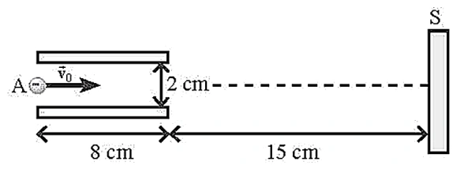{ loading=lazy }

??? success "Đáp án và lời giải"
    **Đáp án đã hiệu chỉnh:** a) Đúng; b) Đúng; c) Sai; d) Sai.

    **Hướng dẫn giải:**

    a) **Đúng.** Giữa hai bản kim loại phẳng song song, bỏ qua hiệu ứng mép, điện trường được coi là đều.

    b) **Đúng.** Độ lớn điện trường $E=U/d=12/0{,}02=600\ \text{V/m}$. Bản dưới có điện thế cao hơn nên $\vec E$ hướng từ bản dưới lên bản trên.

    c) **Sai.** Electron mang điện âm nên gia tốc ngược chiều $\vec E$, có độ lớn $a=eE/m_e\approx1{,}05\times10^{14}\ \text{m/s}^2$. Thời gian trong vùng điện trường $t=l/v_x=0{,}08/(7\times10^6)\approx1{,}14\times10^{-8}$ s, nên $|v_y|\approx1{,}20\times10^6\ \text{m/s}$ và tốc độ khi ra khỏi bản khoảng $7{,}10\times10^6\ \text{m/s}$, không phải giá trị phát biểu.

    d) **Sai.** Độ lệch trong hai bản khoảng $y_1=at^2/2\approx6{,}86$ mm. Sau đó electron bay thêm $0{,}15$ m với vận tốc thành phần $v_y$, lệch thêm khoảng $25{,}7$ mm. Tổng độ lệch xấp xỉ $32{,}6$ mm $=3{,}26\times10^{-2}$ m.

    !!! warning "Đối chiếu nguồn"
        Bảng đáp án và một số số mũ trong lời giải PDF không nhất quán với chính công thức của bài. Phần giải trên tính lại trực tiếp từ $E=U/d$, $a=eE/m_e$ và chuyển động ném ngang trong điện trường đều.
#### Bài 56

<!-- source-id: BT-Chuong-III-p87-q1-225 -->

Trong một ngày giông bão, xét một đám mây tích điện mang lượng điện tích âm có độ lớn

đang ở độ cao 1600 m so với mặt đất tích điện dương như hình. Xem như đám mây và mặt đất tương
đương với hai bản của một "tụ điện" phẳng với điện dung

a) Vector cường độ điện trường có phương thẳng đứng, hướng từ mặt đất lên đám mây.
b) Hiệu điện thế giữa mặt đất và đám mây là 8.1010 V.
c) Cường độ điện trường trong khoảng giữa đám mây và mặt đất là 5.106 V/m. = t 0,9s = t 0,19s = t 0,09s = t 0,29s P F = P F =  = =  = U qU P F mg qE q m
d)
d) g −Δ = 1 q(U U) F .
d) 1 F – F   Δ Δ − = =  = 1 q U U g F F ma
a) .
d) U =  = Δ  = = 2 1 1 1 2d 2d U
a) t
d) t 0,09s. 2
a) U g 40C 10 5.10 . − F
d) Nếu một hạt bụi có điện tích q0 = − 2.10-12 C dịch chuyển từ A đến B (như hình vẽ) thì công của lực điện trường thực hiện sự dịch chuyển này có giá trị là 0,16 J.

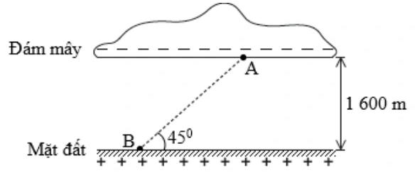{ loading=lazy }

??? success "Đáp án và lời giải"
    **Hướng dẫn giải:**
    a) Vectơ cường độ điện trường có phương thẳng đứng, hướng từ mặt đất lên đám mây.
     Đúng, vì coi đám mây và mặt đất giống như một tụ điện phẳng, đường sức điện có chiều từ bản dương
    sang bản âm.
    b) Hiệu điện thế giữa mặt đất và đám mây là 8.1010 V.

    c) Cường độ điện trường trong khoảng giữa đám mây và mặt đất là 5.106 V/m.

    d) Nếu một hạt bụi có điện tích
     dịch chuyển từ
     đến
     (như hình vẽ) thì công của
    lực điện trường thực hiện sự dịch chuyển này có giá trị là

    Áp dụng công thức tính công:

    -12
    7
    đ
    o
    o
    A = F s cosα = q
    E AB cos45
    q
    E d = 2 10
    5 10 1600=0,16 J
    
    

#### Bài 57

<!-- source-id: BT-Chuong-III-p89-q3-227 -->

Xét hai bản kim loại hình vuông đặt song song cách nhau 5mm, tích điện bằng nhau nhưng trái
dấu. Hiệu điện thế giữa hai bản là 25 V. Xem điện trường giữa hai bản là đều, các đường sức điện vuông
góc với các bản. Thả một electron tại sát bản âm thì nó bắt đầu chuyển động về phía bản dương. Bỏ qua
trong lượng của electron.

a) Điện trường giữa hai bản có chiều từ bản âm tới bản dương.
b) Độ lớn cường độ điện trường giữa hai bản kim loại là 5000 V / m.
c) Tốc độ của electron khi nó đến bản dương là 6 1,6.10 m / s.
d) Quỹ đạo của electron trên có dạng 1 phần của parabol.
??? success "Đáp án và lời giải"
    **Hướng dẫn giải:**

    Dùng $F=qE$, $a=qE/m$ và xét dấu của $q$ để xác định chiều; khi cần kết hợp định lí động năng $\Delta W_\mathrm{đ}=qU$.

    a) Giữa hai bản kim loại tích điện trái dấu, đường sức điện bao giờ cũng hướng bản dương sang bản âm.
    b) Độ lớn cường độ điện trường giữa hai bản kim loại:
    c) Gia tốc của electron:
    Tốc độ của electron khi đến bản dương:
    d) Electron chuyển động dọc theo đường sức nên quỹ đạo chuyển động là một đoạn thẳng.
#### Bài 58

<!-- source-id: BT-Chuong-III-p89-q4-228 -->

Một nhóm học sinh nghiên cứu cơ chế lái tia điện tử của bản lái tia trong máy dao động kí. Họ phát
hiện rằng khi electron đi qua bản lái tia không chỉ thay đổi phương của chuyển động mà còn được tăng tốc.
Tụ điện phẳng được dùng để khảo sát có khoảng cách giữa hai bản tụ
 được mắc vào nguồn không
đổi hiệu điện thế
 Trong một thí nghiệm, khi cho một electron với vận tốc có độ lớn
 đi vào điện trường giữa hai bản tụ tại điểm
 nằm chính giữa hai bản tụ và đi ra khỏi
điện trường tại điểm
 cách bản cực dương
 như hình vẽ . Biết điện tích và khối lượng của
electron là

U
F
q E
q d
=
=
qU
qU
P
0
P
d
d
−
=
→
=
2
q.0,5U
P
ma
0,5P
ma
a
g / 2
5m / s
d
−
=

=

=
=
2
2
0
v
v
2ad
v
1m / s
−
=

=
d
1cm
=
U
12 V.
=
5
0
v
2.10 m / s
=
M
N
4,9mm
19
31
e
e
q
1,6.10
C;m
9,1.10
kg.
−
−
= −
=

a) Đường sức điện giữa hai bản tụ điện là những đường cong, cách đều, hướng từ trên xuống dưới.
b) Cường độ điện trường giữa hai bản tụ có độ lớn .
c) Quỹ đạo chuyển động của hạt electron là đường parabol.
d) Vận tốc của electron khi đi ra khỏi điện trường là

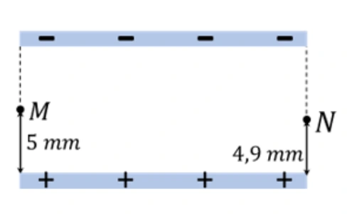{ loading=lazy }

??? success "Đáp án và lời giải"
    **Hướng dẫn giải:**

    Dùng $F=qE$, $a=qE/m$ và xét dấu của $q$ để xác định chiều; khi cần kết hợp định lí động năng $\Delta W_\mathrm{đ}=qU$.

    a) Đường sức điện giữa hai bản tụ điện là những đường thẳng, cách đều, hướng từ bản dương sang bản
    b) Cường độ điện trường giữa hai bản tụ có độ lớn:
    c) Vận tốc ban đầu của electron theo phương ngang và electron chịu tác dụng của lực điện hướng xuống
    vuông góc với
    Nên quỹ đạo chuyển động của electron giống với quỹ đạo của chuyển động ném ngang là 1 nhánh của
    d) + Lực điện tác dụng lên điện tích:
    + Xét theo phương thẳng đứng electron chuyển động nhanh dần đều dưới tác dụng của lực điện. Khi ra
    khỏi bản tụ, electron đã dịch chuyển 1 đoạn
    + Vận tốc theo phương thẳng đứng của electron khi đi ra khỏi bản tụ là:
    + Vận tốc của electron khi ra khỏi bản tụ là:
#### Bài 59

<!-- source-id: BT-Chuong-III-p107-q29-263 -->

Xét chuyển động của một hạt proton trong vùng không gian có điện trường đều. Cho 3 điểm A,
B, C tạo thành một tam giác đều có độ dài các cạnh bằng 4 cm, AB vuông góc với các đường sức điện như
hình vẽ. Biết cường độ điện trường có độ lớn E = 1 000 V/m; điện tích của proton qp = 1,6. 10−19

C. 14

Phát biểu
Đúng Sai
a)
Công của lực điện bằng 0 khi hạt proton dịch chuyển từ điểm A đến điểm B theo
phương AB.
Đ

b)
Công của lực điện bằng 0 khi hạt proton dịch chuyển từ điểm A đến điểm B theo
đoạn gấp khúc ACB.
Đ

c)
Công của lực điện khi hạt proton di chuyển từ điểm A đến điểm C bằng
3,2. 10−18. √3 J.

S
d)
Công của lực điện khi hạt proton di chuyển từ điểm C đến điểm B bằng
−3,2. 10−18. √3 J.

S

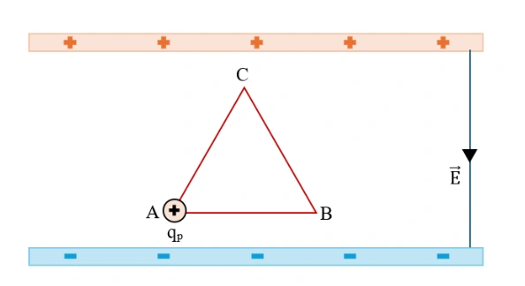{ loading=lazy }

??? success "Đáp án và lời giải"
    **Đáp án:** a) Đúng; b) Đúng; c) Sai; d) Sai.

    **Hướng dẫn giải:**

    a) **Đúng.** Công của lực điện trong điện trường đều là $A=qEs\cos\alpha$. Đoạn $AB$ vuông góc với $\vec E$ nên $A_{AB}=0$.

    b) **Đúng.** Lực điện là lực thế; công chỉ phụ thuộc hai điểm đầu - cuối. Vì $A$ và $B$ cùng điện thế nên đi theo đường $A\to C\to B$ vẫn có tổng công bằng $0$.

    c) **Sai.** Tam giác đều cạnh $4$ cm có độ cao $HC=2\sqrt3$ cm. Từ $A$ đến $C$, hình chiếu độ dời lên phương điện trường ngược chiều $\vec E$, nên $A_{AC}=-qE\,HC=-3{,}2\sqrt3\times10^{-18}$ J.

    d) **Sai.** Từ $C$ đến $B$, hình chiếu độ dời cùng chiều $\vec E$, nên $A_{CB}=+3{,}2\sqrt3\times10^{-18}$ J. Hai công này trái dấu và có tổng bằng $0$.
#### Bài 60

<!-- source-id: BT-Chuong-III-p116-q1-293 -->

Xét chuyển động của một điện tích q &gt; 0 trong điện trường đều có quỹ đạo là đường thẳng vuông
góc với các đường sức điện.
Trong các nhận định sau, nhận định nào đúng, nhận định nào sai?

a) Điện trường sinh công âm trong quá trình điện tích chuyển động.
b) Điện trường sinh công dương trong quá trình điện tích chuyển động.
c) Điện trường không sinh công trong quá trình điện tích chuyển động.
d) Điện trường sinh công dương trên nửa đoạn đường đầu và sinh công âm trên nửa đoạn đường sau.

??? success "Đáp án và lời giải"
    **Đáp án:** a) Sai; b) Sai; c) Đúng; d) Sai.

    **Hướng dẫn giải:**

    Công của lực điện trong điện trường đều là $A=qEs\cos\alpha$. Quỹ đạo thẳng vuông góc với đường sức điện nên $\alpha=90^\circ$, do đó $A=0$ trên mọi đoạn chuyển động.

    a) **Sai.** Công không âm mà bằng $0$.

    b) **Sai.** Công không dương mà bằng $0$.

    c) **Đúng.** Điện trường không sinh công vì độ dịch chuyển luôn vuông góc với $\vec E$.

    d) **Sai.** Trên cả nửa đầu và nửa sau, công đều bằng $0$; không có đoạn công dương rồi công âm.
#### Bài 61

<!-- source-id: BT-Chuong-III-p116-q2-294 -->

Trong khoảng không gian giữa hai bản kim loại phẳng tích điện trái dấu có độ lớn bằng nhau, cách
nhau một khoảng a, tồn tại một điện trường đều có cường độ E, cho một electron bắt đầu chuyển động từ
bản tích điện âm đến bản tích điện dương. Chọn mốc thế năng tại bản âm.
Trong các nhận định sau đây, nhận định nào đúng, nhận định nào sai?

23

a) Lực điện thực hiện công âm.
b) Tốc độ của electron khi chạm bản tích điện dương là v = √ 2qe.E.d me ; với d = −a.
c) Lực điện thực hiện công dương, thế năng của êlectron tăng.
d) Lực điện thực hiện công dương, thế năng của êlectron giảm.

??? success "Đáp án và lời giải"
    **Hướng dẫn giải:**

    a) Công của lực điện: A = q.E.d
    Do electron dịch chuyển từ bản âm đến bản dương nên d &lt; 0 và d = − a.
    Mà q &lt; 0 nên A &gt; 0.
    Nhận định sai.

    b) Áp dụng định lí động năng:
    1
    2 𝑚𝑣2 −0 (𝑣0 = 0).

     𝑣= √2.𝑞𝑒.𝐸.𝑑
    𝑚
     với d = − a.
    Nhận định đúng.

    c) Ta có: A = Wbản âm – Wbản dương &gt; 0 nên Wbản âm &gt; Wbản dương hay thế năng điện giảm.
    Nhận định sai.

    d) Nhận định đúng.

#### Bài 62

<!-- source-id: BT-Chuong-III-p118-q4-296 -->

Một điện tích điểm q = +10 μC chuyển động trong điện trường đều có cường độ 5 000 V/m. Xét
tam giác đều MNP nằm trong điện trường đều, các đường sức song song với cạnh NP, có chiều từ N đến
P. Biết mỗi cạnh của tam giác MNP bằng 5 cm.

a) Gọi H là chân đường vuông góc kẻ từ M đến NP. Khi đó, NH = HP = 2,5 cm.
b) Công của lực điện làm điện tích q di chuyển từ M đến H xấp xỉ 0,002 J.
c) Công của lực điện làm điện tích q di chuyển theo đường gấp khúc MPH xấp xỉ 0,02 J.
d) Công của lực điện làm điện tích q di chuyển từ M đến N bằng − 0,00125 J.

??? success "Đáp án và lời giải"
    **Hướng dẫn giải:**

    a) ∆MNP là tam giác đều; MH là đường cao nên MH cũng là đường trung tuyến.
     HN = HP =
    𝑁𝑃
    2 =
    5
    2 = 2,5 cm.
    Nhận định đúng.

    b) Do độ dịch chuyển của điện tích từ M đến H vuông góc với đường sức điện nên d = 0
     A = 0
    Nhận định sai.

    c) AMPH = AMH = 0.
    Nhận định sai.

    d) 𝐴𝑀𝑁= 𝑞. 𝐸. 𝑑𝑀𝑁= 𝑞. 𝐸. 𝐻𝑁
    ̅̅̅̅̅ = 10. 10−6. 5000. (−0,025) = −0,00125 J.
    Nhận định đúng.

#### Bài 63

<!-- source-id: BT-Chuong-III-p134-q3-335 -->

Một điện tích q chuyển động từ điểm M đến Q, đến O, đến N, đến P và đến H trong điện trường đều như
hình vẽ.

a) Công của lực điện dịch chuyển điện tích: AMQ = AQO.
b) Công của lực điện dịch chuyển điện tích từ M đến P bằng 0 J.
c) Hiệu điện thế UQO &gt; UPH.
d) Điện thế tại hai điểm O và P bằng nhau.

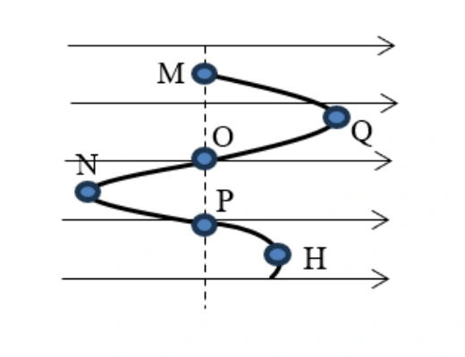{ loading=lazy }

??? success "Đáp án và lời giải"
    **Hướng dẫn giải:**
    a. Công của lực điện dịch chuyển điện tích từ điểm này sang điểm khác 𝐴= 𝑞𝑈= 𝑞𝐸𝑑; Ta thấy:
    dMQ = −dQO ⟹AMQ = −AQO.

    b. MP
    ̅̅̅̅ = dMP = 0 ⟹AMP = 0 J.
    c. Hiệu điện thế giữa hai điểm: 𝑈= 𝐸𝑑. Ta thấy:
    QO
    ̅̅̅̅ = dQO &lt; 0
    PH
    ̅̅̅̅ = dPH &gt; 0} ⟹UQO &lt; UPH.
    d. Ta thấy 𝑑𝑂𝑃= 0 ⟹𝑈𝑂𝑃= 0 = 𝑉𝑂−𝑉𝑃⟹𝑉𝑂= 𝑉𝑃.

#### Bài 64

<!-- source-id: BT-Chuong-III-p135-q4-336 -->

Ba điểm A, B, C nằm trong điện trường đều sao cho E⃗ ∕/ CA. Cho AB ⊥AC và AB = 9 cm; AC = 12 cm.
Lấy D là trung điểm của AC, biết UCD = 180 V.

a) Cường độ điện trường E có độ lớn 3000 V/m.
b) Hiệu điện thế UBC = 360 V.
c) Công của lực điện trường khi electron dịch chuyển từ B đến C là −5,76. 10−17 J.
d) Công của lực điện trường khi electron dịch chuyển từ B đến D là 2,88. 10−17 J.

??? success "Đáp án và lời giải"
    **Hướng dẫn giải:**
    a. Xét hai điểm C và D. Hiệu điện thế giữa hai điểm C, D:
    𝑈𝐶𝐷= 𝐸. 𝐶𝐷
    ̅̅̅̅;
    Cường độ điện trường trong trường hợp này:
    𝐸= 𝑈𝐶𝐷
    𝐶𝐷
    ̅̅̅̅ = 𝑈𝐶𝐷
    𝐶𝐷= 180
    0,06 = 3000 𝑉/𝑚.
    b. Hiệu điện thế giữa hai điểm B,C:
    𝑈𝐵𝐶= 𝐸. 𝐵𝐶
    ̅̅̅̅ = 𝐸. (−𝐶𝐴) = 3000 × (−0,12) = −360 𝑉.
    c. Công của lực điện trường khi electron dịch chuyển từ B đến C:
    𝐴𝐵→𝐶= 𝑞. 𝐸. 𝐵𝐶
    ̅̅̅̅ = 𝑒. 𝐸. (−𝐶𝐴) = (−1,6. 10−19) × 3000 × (−0,12) = 5,76. 10−17𝐽.
    d. Công của lực điện trường khi electron dịch chuyển từ B đến D:

    𝐴𝐵→𝐷= 𝑞. 𝐸. 𝐵𝐷
    ̅̅̅̅ = 𝑒. 𝐸. (−𝐶𝐴
    2 ) = (−1,6. 10−19) × 3000 × (−0,12
    2
    ) = 2,88. 10−17𝐽.

#### Bài 65

<!-- source-id: BT-Chuong-III-p136-q6-338 -->

Một electron chuyển động với vận tốc ban đầu 4. 107 m/s vào vùng điện trường đều như hình. Biết
cường độ điện trường E = 103 V/m và khoảng cách giữa hai bản là d = 10 cm.

a) Điện trường có chiều từ trên xuống dưới.
b) Electron có xu hướng bay về phía bản tích điện dương.
c) Hiệu điện thế giữa hai bản tụ là 100 V.
d) Độ lớn gia tốc của electron khi dịch chuyển trong điện trường là 1,76. 1011 m/s2

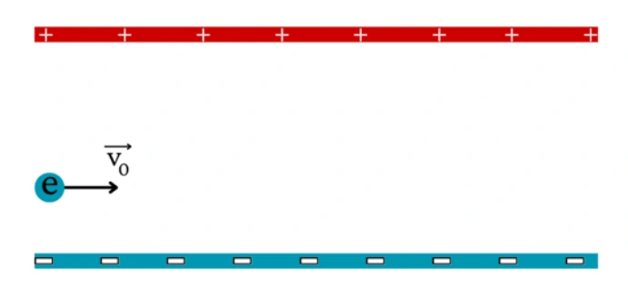{ loading=lazy }

??? success "Đáp án và lời giải"
    **Đáp án:** a) Đúng; b) Đúng; c) Đúng; d) Sai.

    **Hướng dẫn giải:**

    a) **Đúng.** Bản trên tích điện dương, bản dưới tích điện âm nên $\vec E$ hướng từ trên xuống dưới.

    b) **Đúng.** Electron mang điện âm nên $\vec F=q\vec E$ ngược chiều $\vec E$, tức hướng lên phía bản dương.

    c) **Đúng.** $U=Ed=10^3\cdot0{,}10=100$ V.

    d) **Sai.** Độ lớn gia tốc $a=eE/m_e=1{,}6\times10^{-19}\cdot10^3/(9{,}1\times10^{-31})\approx1{,}76\times10^{14}\ \text{m/s}^2$, không phải $1{,}76\times10^{11}\ \text{m/s}^2$.
#### Bài 66

<!-- source-id: BT-Chuong-III-p143-q1-363 -->

Một đám mây dông bị phân thành hai tầng, tầng trên mang điện dương cách xa tầng dưới mang điện âm.
Đo bằng thực nghiệm, người ta thấy điện trường trong khoảng giữa hai tầng của đám mây dông đó gần đều với

E = 1000 V/m, khoảng cách giữa hai tầng là 1,2 km, điện tích của tầng phía trên ước tính được bằng Q2 = 3,24

C. Coi điện thế của tầng mây dưới là V1 = −500 kV.

a) Hiệu điện thế giữa hai tầng mây là 1,2. 106 V.
b) Điện thế của tầng mây trên bằng 0,7 kV.
c) Thế năng điện của tầng trên là 2268 J.
d) Nếu một hạt bụi mang điện tích q = 2.10-12 C rơi vào khoảng giữa hai tầng mây thì công của lực điện để dịch chuyển hạt bụi từ tầng trên xuống tầng dưới là 2,4 μJ.

??? success "Đáp án và lời giải"
    **Hướng dẫn giải:**
    a. Hiệu điện thế giữa hai tầng mây: 𝑈= 𝐸. 𝑑= 1000 × 1200 = 1,2. 106 𝑉.
    b. Điện thế của tầng mây trên: 𝑈= 𝑉2 −𝑉1 ⟹𝑉2 = 𝑈+ 𝑉1 = 1,2. 106 −0,5. 106 = 0,7. 106 𝑉= 700 𝑘𝑉.
    c. Thế năng điện của tầng trên: 𝑊= 𝑄2𝑉2 = 3,24 × 700000 = 2268000 𝐽.
    d. 𝐴= 𝑈. 𝑞= 1,2. 106 × 2. 10−12 = 2,4 𝜇𝐽.

#### Bài 67

<!-- source-id: BT-Chuong-III-p144-q2-364 -->

Cho ba bản kim loại phẳng tích điện 1, 2, 3 đặt song song lần lượt nhau cách nhau những khoảng d12 = 5
cm, d23 = 8 cm, bản 1 và 3 tích điện dương, bản 2 nằm ở giữa tích điện âm. E12 = 1200 V/m, E23 = 1500 V/m,
lấy gốc điện thế ở bản 1.

a) Nếu một hạt neutron được bắn theo phương vuông góc với điện trường E23 ⃗⃗⃗⃗⃗⃗ thì quỹ đạo của hạt sẽ bị lệch so với phương ban đầu.
b) Hiệu điện thế giữa hai bản (1) và (2) là 60 V.
c) Điện thế tại bản (3) là 60 V.
d) Công của lực điện để dịch chuyển một điện tích q = 2. 10−6 C từ bản (2) đến (3) là 2,4. 10−4J.

??? success "Đáp án và lời giải"
    **Đáp án:** a) Sai; b) Đúng; c) Đúng; d) Sai.

    **Hướng dẫn giải:**

    a) **Sai.** Neutron trung hòa điện nên $q=0$, lực điện $\vec F=q\vec E=0$; quỹ đạo không bị điện trường làm lệch.

    b) **Đúng.** $U_{12}=E_{12}d_{12}=1200\cdot0{,}05=60$ V.

    c) **Đúng.** Chọn $V_1=0$, suy ra $V_2=V_1-U_{12}=-60$ V. Với chiều $\vec E_{23}$ như hình, $V_3=V_2-E_{23}(-0{,}08)=-60+120=60$ V.

    d) **Sai.** Công lực điện khi dịch chuyển từ 2 đến 3 là $A_{23}=q(V_2-V_3)=2\times10^{-6}(-60-60)=-2{,}4\times10^{-4}$ J. Dấu âm là phần quan trọng của kết quả.
#### Bài 68

<!-- source-id: BT-Chuong-III-p145-q3-365 -->

Một điện tích q chuyển động từ điểm A đến B, đến C, đến D và về A trong điện trường đều như hình vẽ.

a) Công của lực điện dịch chuyển điện tích: AAB = −ABA.
b) Công của lực điện dịch chuyển điện tích từ B đến D có giá trị âm.
c) Công của lực điện dịch chuyển điện tích: ABC &lt; ACD.
d) Công của lực điện khi dịch chuyển điện tích đi hết chu trình bằng 0J.

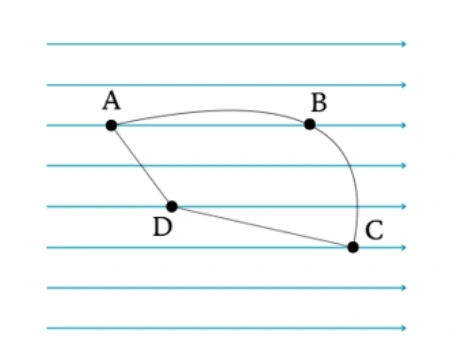{ loading=lazy }

??? success "Đáp án và lời giải"
    **Đáp án theo quy ước của nguồn ($q>0$):** a) Đúng; b) Đúng; c) Sai; d) Đúng.

    **Hướng dẫn giải:**

    a) **Đúng.** Lực điện là lực thế nên khi đổi chiều hai điểm đầu - cuối: $A_{AB}=-A_{BA}$.

    b) **Đúng** nếu $q>0$. Điện trường hướng sang phải, còn độ dời từ $B$ đến $D$ có hình chiếu sang trái, nên $A_{BD}=qE\Delta x<0$.

    c) **Sai** nếu $q>0$. Từ $B$ đến $C$, hình chiếu độ dời theo chiều điện trường là dương; từ $C$ đến $D$ là âm, do đó $A_{BC}>A_{CD}$.

    d) **Đúng.** Đi hết một chu trình kín trở lại $A$, công của lực điện bằng $0$.

    !!! warning "Điều kiện của đề nguồn"
        PDF không ghi rõ dấu của $q$ trong câu chữ. Các kết luận về dấu công ở b), c) chỉ xác định duy nhất khi hiểu $q>0$ như cách giải của nguồn; nếu $q<0$ thì dấu hai công này đảo lại.
#### Bài 69

<!-- source-id: BT-Chuong-III-p145-q4-366 -->

Một electron chuyển động dọc theo một đường sức điện trong điện trường đều giữa hai bản kim loại tích
điện trái dấu. Hiệu điện thế giữa hai bản là 120V. Biết rằng electron được đặt không vận tốc ban đầu cách bản
điện tích dương 1,5cm. Khoảng cách giữa hai bản là 2cm. Điện tích của electron bằng -1,6.10-19 C, khối lượng
electron bằng 9,1.10-31 kg.

a) Cường độ điện trường giữa hai bản kim loại là 6000 V/m.
b) Electron bay về phía bản dương do chịu tác dụng của lực điện trường.
c) Công của lực điện dịch chuyển electron từ vị trí cách bản dương d’ = 1,5 cm về
b) ản dương là −1,44. 10−17 J.
d) Vận tốc của electron khi tới bản dương là 5,63. 106 m/s.

??? success "Đáp án và lời giải"
    **Đáp án:** a) Đúng; b) Đúng; c) Sai; d) Đúng.

    **Hướng dẫn giải:**

    a) **Đúng.** $E=U/d=120/0{,}02=6000\ \text{V/m}$.

    b) **Đúng.** Electron mang điện âm nên lực điện ngược chiều điện trường, hướng về bản dương.

    c) **Sai.** Từ vị trí ban đầu đến bản dương, độ dời ngược chiều $\vec E$ và $q<0$, nên $A=qEd'=(-1{,}6\times10^{-19})\cdot6000\cdot(-0{,}015)=+1{,}44\times10^{-17}$ J. Dấu đúng là **dương**.

    d) **Đúng.** Electron xuất phát từ nghỉ nên $\tfrac12m_ev^2=A$. Suy ra $v=\sqrt{2A/m_e}\approx5{,}63\times10^6\ \text{m/s}$.
### Thông hiểu — Trắc nghiệm 4 lựa chọn

#### Bài 70

<!-- source-id: BT-Chuong-III-p67-q7-180 -->

Khi một điện tích chuyển động vào điện trường đều theo phương vuông góc với đường sức điện (
Bỏ qua tác dụng của trọng lực, lực cản môi trường) thì yếu tố nào sẽ luôn giữ không đổi?

A. Gia tốc của chuyển động.

B. Phương của chuyển động.

C. Tốc độ của chuyển động.

D. Độ dịch chuyển sau một đơn vị thời gian.

??? success "Đáp án và lời giải"
    **Đáp án:** A
    **Hướng dẫn giải:**
    Khi một điện tích chuyển động vào điện trường đều theo phương vuông góc với đường sức điện thì điện
    tích sẽ chuyển động theo quỹ đạo là một nhánh parabol ( giống chuyển động của một vật bị ném ngang)
    với gia tốc không đổi

#### Bài 71

<!-- source-id: BT-Chuong-III-p67-q8-181 -->

Khi một điện tích chuyển động vào điện trường đều theo phương vuông góc với đường sức điện thì
điện trường sẽ không ảnh hưởng tới

A. gia tốc của chuyển động của điện tích trong điện trường.

B. vận tốc theo phương vuông góc với đường sức điện.

C. vận tốc theo phương song song với đường sức điện.

D. quỹ đạo của chuyển động của điện tích trong điện trường.

??? success "Đáp án và lời giải"
    **Đáp án:** B
    **Hướng dẫn giải:**
    Khi một điện tích chuyển động vào điện trường đều theo phương vuông góc với đường sức điện thì điện
    tích sẽ chuyển động theo quỹ đạo là một nhánh parabol ( giống chuyển động của một vật bị ném ngang) ,
    theo phương vuông góc với đường sức điện tích chuyển động thẳng đều với vận tốc ban đầu

#### Bài 72

<!-- source-id: BT-Chuong-III-p67-q9-182 -->

Quỹ đạo chuyển động của một điện tích điểm q bay vào một điện trường đều
 theo phương vuông
góc với đường sức không phụ thuộc vào yếu tố nào sau đây?

A. Độ lớn của điện tích q.

B. Cường độ điện trường E .

C. Vị trí của điện tích q bắt đầu bay vào điện trường.

D. Khối lượng m của điện tích.

??? success "Đáp án và lời giải"
    **Đáp án:** C
    **Hướng dẫn giải:**
    Phương trình quỹ đạo của điện tích:

    Quỹ đạo chuyển động của một điện tích điểm q bay vào một điện trường đều
     theo phương vuông góc
    với đường sức không phụ thuộc vào vị trí của điện tích q bắt đầu bay vào điện trường.

#### Bài 73

<!-- source-id: BT-Chuong-III-p128-q15-317 -->

Điện tích q chuyển động từ M đến N trong một điện trường đều, công của lực điện càng nhỏ nếu

A. hiệu điện thế UMN càng nhỏ.

B. hiệu điện thế UMN càng lớn.

C. đường đi từ M đến N càng dài.

D. đường đi từ M đến N càng ngắn.

??? success "Đáp án và lời giải"
    **Đáp án:** A
    **Hướng dẫn giải:**

    Dùng $F=qE$, $a=qE/m$ và xét dấu của $q$ để xác định chiều; khi cần kết hợp định lí động năng $\Delta W_\mathrm{đ}=qU$.

    Đối chiếu kết quả với các lựa chọn, phương án phù hợp là **A. hiệu điện thế UMN càng nhỏ.**
### Vận dụng — Trắc nghiệm 4 lựa chọn

#### Bài 74

<!-- source-id: BT-Chuong-III-p68-q11-184 -->

Để chuẩn đoán hình ảnh trong y học người ta thường sử dụng tia X (hay tia Rơn-ghen) để chụp X
quang và chụp CT. Cho rằng vùng điện trường giữa hai cực của ống tia X
(hình vẽ) , là một điện trường đều. Khoảng cách giữa hai cực bằng 2 cm,
hiệu điện thế giữa hai cực là 120 kV. Biết điện tích của electron
. Độ lớn lực điện trường tác dụng lên một êlectron bằng

A. $9{,}6	imes10^{-13}$ N.

B. $9{,}6	imes10^{-18}$ N.

C. $9{,}6	imes10^{-15}$ N.

D. $9{,}6	imes10^{-16}$ N.

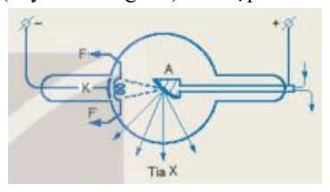{ loading=lazy }

??? success "Đáp án và lời giải"
    **Đáp án:** A. $9{,}6\times10^{-13}$ N.

    **Hướng dẫn giải:**
    Điện trường đều giữa hai cực có độ lớn
    $E=U/d=120\times10^3/0{,}02=6\times10^6$ V/m.

    Độ lớn lực điện tác dụng lên electron:
    $F=|q_e|E=1{,}6\times10^{-19}\cdot6\times10^6=9{,}6\times10^{-13}$ N.

    Vậy chọn **A**.
#### Bài 75

<!-- source-id: BT-Chuong-III-p104-q18-252 -->

Một electron đang ở độ cao 1,04 m so với mặt đất, tại nơi có điện trường Trái Đất bằng 115 V/m.
Mốc thế năng điện được chọn tại mặt đất, êlectron có điện tích qe = −1,6.10-19

C. Thế năng của electron đặt
tại điểm M có giá trị bằng

A. $+191\times10^{-19}$ J.

B. $-191\times10^{-19}$ J.

C. 191. 10−17 J.

D. −191. 10−17 J.

??? success "Đáp án và lời giải"
    **Đáp án:** B. $-191\times10^{-19}$ J.

    **Hướng dẫn giải:**
    Chọn mốc thế năng tại mặt đất. Với điện trường đều, thế năng của electron tại độ cao $d=1{,}04$ m là
    $W_M=q_eEd$.

    Thay số:
    $W_M=-1{,}6\times10^{-19}\cdot115\cdot1{,}04\approx-1{,}91\times10^{-17}$ J
    $=-191\times10^{-19}$ J.

    Vậy chọn **B**.

!!! warning "Đối chiếu nguồn"
    PDF nguồn in phương án A và B trùng nhau. Repository hiệu chỉnh phương án A thành giá trị dương để loại bỏ hai lựa chọn đồng nhất; phương án B giữ đúng với phép tính của nguồn.
#### Bài 76

<!-- source-id: BT-Chuong-III-p104-q19-253 -->

Một điện tích điểm q dương chuyển động dọc theo các cạnh của một tam giác đều ABC. Tam
giác ABC nằm trong điện trường đều, đường sức của điện trường này có chiều từ C đến

B. Gọi AAB và AAC
lần lượt là công của lực điện sinh ra tương ứng khi điện tích q di chuyển từ A đến B và từ A đến C thì

A. AAB = – AAC.

B. AAB = AAC.

C. AAB = – 2AAC.

D. AAB = 2AAC.

??? success "Đáp án và lời giải"
    **Đáp án:** A
    **Hướng dẫn giải:**
    Dựa vào hình vẽ, ta có:
    𝐴𝐴𝐵= 𝑞. 𝐸. 𝑑𝐴𝐵= 𝑞. 𝐸. 𝐻𝐵
    ̅̅̅̅ = 𝑞. 𝐸.
    𝐶𝐵
    2 (Vì 𝐻𝐵
    ⃗⃗⃗⃗⃗⃗ cùng hướng với 𝐸⃗ nên 𝐻𝐵
    ̅̅̅̅ &gt; 0).
    𝐴𝐴𝐶= 𝑞. 𝐸. 𝑑𝐴𝐶= 𝑞. 𝐸. 𝐻𝐶
    ̅̅̅̅ = 𝑞. 𝐸.
    −𝐶𝐵
    2 (Vì 𝐻𝐶
    ⃗⃗⃗⃗⃗ ngược hướng với 𝐸⃗ nên 𝐻𝐶
    ̅̅̅̅ &lt; 0).
     𝐴𝐴𝐵= −𝐴𝐴𝐶
